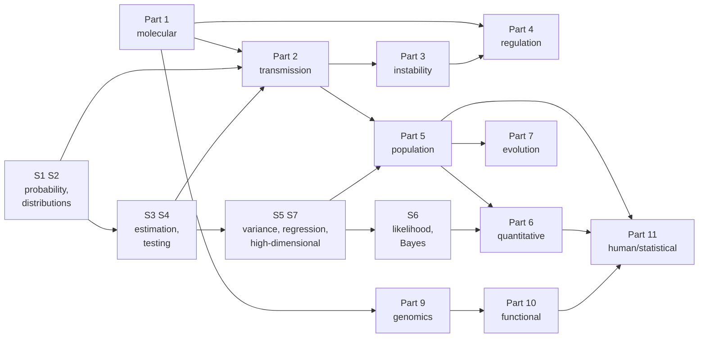

# Study guide

How to actually get through this, and what to do when it stops going in.

## The shape of the thing

62 chapters, **7 statistics chapters**, 16 problem sets, 11 labs. At a genuine, non-skimming
pace that is roughly **100–145 hours of work**. It is a full year-long university sequence
compressed into a repository, and treating it as a weekend read will not produce third-year
understanding.

Three honest paces:

| Pace | Weekly commitment | Duration |
|---|---|---|
| Steady | ~4 h — two chapters, one problem set every other week | ~7 months |
| Committed | ~10 h — five chapters plus practice | ~3.5 months |
| Intensive | ~25 h — a part per week, labs on weekends | ~7 weeks |

The intensive pace assumes you can absorb the statistics track quickly. It will not leave much
in long-term memory without the question banks. Note that **Parts 3 and 4 carry six chapters
each**, not five — [Ch 20A](part-03-genome-instability/20A-bacterial-and-phage-genetics.md) and
[Ch 25A](part-04-gene-regulation/25A-developmental-genetics.md) sit inside them — and **Part 7
carries four**, not three, since
[Ch 35A](part-07-molecular-evolution/35A-speciation-and-ecological-genetics.md) sits at its end.
So "a part per week" is a heavier week in those three than elsewhere.

## The order that works

**Chapter 00 before anything else.** It's the whole subject at low resolution and it's what
makes the rest cohere. Skipping it is the single most common way to end up with a pile of
disconnected facts.

**Then straight through 01 → 58, pausing for the statistics track where indicated.** The
dependency structure is real, and the statistics is part of it.

**Three chapters carry a letter suffix.** [Ch 20A](part-03-genome-instability/20A-bacterial-and-phage-genetics.md)
(bacterial and phage genetics) is read between Ch 20 and Ch 21;
[Ch 25A](part-04-gene-regulation/25A-developmental-genetics.md) (developmental genetics) is read
straight after Ch 25; [Ch 35A](part-07-molecular-evolution/35A-speciation-and-ecological-genetics.md)
(speciation, hybridisation and ecological genetics) is read straight after Ch 35, closing Part 7.
They are full chapters, not appendices — Ch 21's central tool is built in 20A §4, Ch 37 and Ch 38
both assume 25A's gene-targeting grammar, and 35A is where Ch 27's *N*<sub>e</sub>, Ch 28's
inbreeding depression and Ch 34's *D*-statistic are finally spent on a decision. The suffix is a
numbering convention borrowed from the S-track, so that inserting them did not renumber Ch 21
through Ch 58 and break several thousand cross-references.



The statistics chapters are not all read *between* parts. S1–S2 come before Part 2 begins, but
**S3–S4 land inside Part 2** (before Ch 12), **S5 and S7 inside Part 5** (before Ch 28), and
**S6 inside Part 6** (before Ch 32). The arrows above show what each one feeds; the linear order
below shows where each one goes. The S-track also has a strict internal order — S6 builds on
S3, S4 and S5, which is why it cannot come earlier however much Ch 14 would like it to.

### Where the statistics goes

Read each **before the chapter named**, not merely before the part. The genetics chapters assume
it and will not re-teach it — and three of these insertion points fall *inside* a part rather than
between two.

| Read | Before | Why it can't wait |
|---|---|---|
| [S1](part-S-statistics/S1-probability.md), [S2](part-S-statistics/S2-distributions.md) | **Ch 09** | Crosses are probability problems; S2 also pre-teaches the p²:2pq:q² arithmetic Ch 10 and Ch 13 use |
| [S3](part-S-statistics/S3-sampling-and-estimation.md), [S4](part-S-statistics/S4-hypothesis-testing.md) | **Ch 12** | Ch 12 is χ² with an estimated parameter, α, critical values and power. It does not gesture at hypothesis testing — it computes with it, and Check-yourself Q4 demands the power calculation back |
| [S5](part-S-statistics/S5-variance-and-regression.md), [S7](part-S-statistics/S7-high-dimensional-data.md) | **Ch 28** | *F*<sub>ST</sub> *is* a variance ratio and LD *is* a correlation; Ch 28's PCA/eigenvector argument is unreadable without S7 §5, and S7 §5 needs S5 |
| [S6](part-S-statistics/S6-likelihood-and-bayes.md) | **Ch 32** | Interval mapping is a finite-mixture likelihood and LOD is a likelihood ratio. S6 itself builds on S3, S4 and S5, so it cannot come earlier |

The full linear order:

```
00 01 · 02–08 · [S1 S2] · 09 10 11 · [S3 S4] · 12 13 14 15 · 16–20 20A · 21–25 25A ·
26 27 · [S5 S7] · 28 29 · 30 31 · [S6] · 32 · 33 34 35 35A · 36–58
```

**Part 2 carries the heaviest statistics load** — about 1 h 40 m of S3 and S4 between Ch 11 and
Ch 12, on top of seven chapters. That is not an accident of scheduling. Ch 09–11 are mechanism and
counting; Ch 12 is where the subject turns to inference and never turns back. The statistics
belongs at that seam.

**S5 is the one to not skip.** Variance appears in 36 of the 62 genetics chapters, and the whole
of quantitative genetics is written in the language of variance components. If you read only one
statistics chapter, read that one.

The tempting shortcut — jumping straight to Part 9 because sequencing and file formats look
like the "computational" bit — produces someone who can run a pipeline and cannot say what
the output means. Part 11 in particular is unreadable without Part 5.

## Using the practice material

### Problem sets — attempt before revealing

Solutions are folded into `<details>` blocks. This is deliberate. **Genetics is learned by
calculating**, and reading a worked solution produces a strong and completely false feeling
of understanding. If you are stuck, re-read the chapter's worked example rather than opening
the solution.

A problem you got wrong is worth more than three you got right. Note *why* — misread the
cross, wrong null hypothesis, forgot the sex chromosomes are hemizygous — because the error
patterns repeat.

### Labs — run them, don't read them

The labs use real public data and real tools. [`lab-00`](labs/) builds the environment; do
it before you need it, because bioinformatics installation problems are their own special
misery and you don't want them between you and a concept.

Every lab has been executed on macOS (Apple Silicon) during writing. If a command fails
anyway, that is worth knowing — tool versions drift, and debugging it is genuinely part of
the skill.

### Question banks — spaced repetition

Genetics has a large irreducible vocabulary. You cannot reason about non-homologous end
joining if you have to look up what it is every time.

```bash
python reference/to_anki.py question-banks/ --out anki-import.tsv
```

Then import the TSV into Anki as a two-field note type. Twenty minutes a day of review will
do more for retention than re-reading chapters.

## When it stops going in

**If the molecular detail feels arbitrary** — you're memorising machinery without knowing
what it's for. Go back to Chapter 00 and locate the piece in the overall story.

**If the classical genetics feels tedious** — it's a probability exercise wearing a costume.
Chapter 12 reframes it in terms you already have. The reason it's taught with peas and flies
is historical, not pedagogical.

**If the maths feels hand-wavy** — it shouldn't. Every formula in
[`reference/formulas.md`](reference/formulas.md) links to the chapter that derives it. If a
step isn't shown, that's a defect worth flagging.

**If the genomics feels like a tool catalogue** — that's the failure mode of most genomics
teaching. The tools change every three years; the ideas underneath (suffix arrays, graph
traversal, hidden states, multiple testing) don't. Learn those and the tools become
implementation details.

## What "third-year level" actually means

By the end you should be able to:

- Read a research paper in genetics or genomics and follow both the biology and the methods
- Work out inheritance patterns and recurrence risks from a pedigree, with Bayesian updating
- Derive Hardy–Weinberg, explain what each assumption buys, and say what a departure implies
- Explain what heritability is and — more importantly — what it is not
- Take raw sequencing reads to called variants and say what each step can get wrong
- Design a GWAS, and critique one: population structure, multiple testing, LD, replication
- Interpret a clinical variant against the ACMG framework and say where judgement enters
- Reconstruct a genetic hierarchy from mutant phenotype classes, and order two genes in a
  pathway from a double mutant
- Design a gene-targeting or conditional-allele experiment, and say which steps CRISPR replaced
- Invert a hybrid-zone cline into a selection coefficient, and decide whether a small population
  is a candidate for genetic rescue — and say what that decision risks
- Distinguish, in any claim about genes and traits, what the evidence supports from what it doesn't

That last one is the point of the whole exercise.

### The caveat: this is not laboratory competence

**All 11 labs are computational.** They use real public data and real tools, and the skill they
build — taking reads to variants to an interpretation, and knowing what each step can get wrong
— is a genuine one that a lot of graduates do not have. For a reader who already programs, it is
also the fastest available route into the subject.

But it is not the whole of what a genetics degree certifies. A conventional programme weights
**wet-lab practical work heavily**: pipetting, sterile technique, running and reading a gel,
cloning, PCR that fails for reasons you have to diagnose at the bench, keeping a fly or worm or
mouse colony alive, and the tacit knowledge of how long things take and how often they do not
work. None of that is here, and none of it is learnable from a repository.

So the honest statement of what you will have is: **the reasoning, the mathematics and the
computation at third-year level, and none of the bench.** You will be able to design a
complementation test on a merodiploid ([Ch 20A](part-03-genome-instability/20A-bacterial-and-phage-genetics.md) §4)
or a conditional knockout ([Ch 25A](part-04-gene-regulation/25A-developmental-genetics.md) §7),
follow a paper that did one, and say what its controls rule out — without having done either.
If you need the practical half, you need a bench, and this is a good preparation for one rather
than a substitute.
