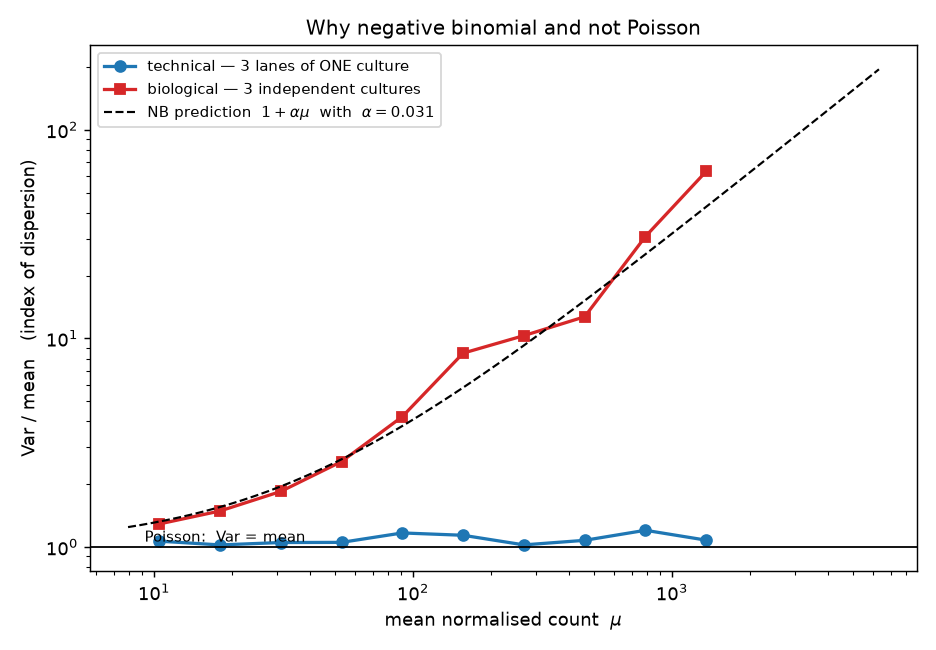
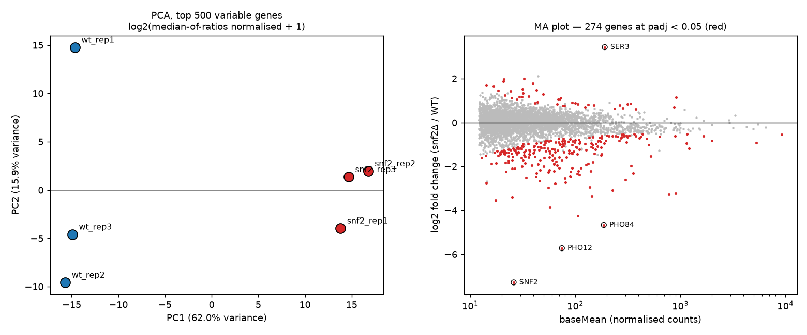

# Lab 06 — RNA-seq quantification and differential expression

> **Time:** ~55 min · **Before this:** [lab-01](lab-01-sequences-and-fastq.md) ·
> [Ch 47](../part-10-functional-genomics/47-rna-seq.md)

Run a complete small RNA-seq analysis on real yeast data: build a salmon index, quantify six
libraries, assemble a count matrix, then derive and implement the normalisation that makes the
columns comparable, fit a negative binomial model, and control the false discovery rate. The
experiment is a *SNF2* deletion versus wild type, and the deleted gene will fall out of the
analysis as a positive control. Along the way you will hit a metadata trap that silently turns
n = 3 into n = 1, and you will measure — not assume — why the Poisson distribution is the wrong
model.

This lab leans hard on statistics but assumes none of it. Every method it runs — Poisson and
negative binomial counts ([S2](../part-S-statistics/S2-distributions.md)), p-values and the Wald
test ([S4](../part-S-statistics/S4-hypothesis-testing.md)), false discovery rate and PCA
([S7](../part-S-statistics/S7-high-dimensional-data.md)) — is built from scratch in the statistics
track. The boxes below name the method being used, say how to read the numbers it produces, and
point at the chapter that derives it; open them whenever a printed number stops meaning something.

```bash
# GENOMICS is exported in lab-00. In a fresh shell, set it again:
#   export GENOMICS=/path/to/learn-genomics
cd "$GENOMICS" && source .venv/bin/activate && cd labs/data
```

---

## 1. The dataset, and a metadata trap that destroys the experiment ★

The data are from a study built specifically to interrogate RNA-seq statistics: *S. cerevisiae*
wild type versus a *snf2Δ* knockout, at absurd replication. *SNF2* encodes the ATPase subunit of
the SWI/SNF chromatin-remodelling complex ([Ch 23](../part-04-gene-regulation/23-chromatin-and-epigenetics.md)),
so the mutant should show broad, coordinated transcriptional change rather than one or two genes
moving.

Ask ENA what runs exist:

```bash
curl -sL -o ena_PRJEB5348.tsv \
  "https://www.ebi.ac.uk/ena/portal/api/filereport?accession=PRJEB5348&result=read_run&fields=run_accession,sample_accession,experiment_accession,library_name,sample_alias,read_count&format=tsv"
wc -l ena_PRJEB5348.tsv
awk -F'\t' 'NR>1{print $4}' ena_PRJEB5348.tsv | sort | uniq -c
```

```
     673 ena_PRJEB5348.tsv
 336 mutant
 336 wild type
```

672 runs, evenly split. Now the trap:

```bash
awk -F'\t' 'NR>1{print $2}' ena_PRJEB5348.tsv | sort -u | wc -l   # unique sample_accession
awk -F'\t' 'NR>1{print $5}' ena_PRJEB5348.tsv | sort -u | wc -l   # unique sample_alias
```

```
     671
     671
```

**ENA reports 671 distinct BioSamples for 672 runs.** Taken at face value, every run is its own
sample, and picking any three "wild type" rows gives you n = 3. The obvious choice — the first
three WT accessions, `ERR458493`, `ERR458494`, `ERR458495` — looks perfectly reasonable.

It is wrong. Look inside the files:

```bash
for a in ERR458493 ERR458494 ERR458495 ERR458500 ERR458878; do
  printf "%-10s " $a
  curl -sL "https://ftp.sra.ebi.ac.uk/vol1/fastq/${a:0:6}/${a}/${a}.fastq.gz" | gunzip -c | head -1
done
```

```
ERR458493  @ERR458493.1 DHKW5DQ1:219:D0PT7ACXX:1:1101:1724:2080/1
ERR458494  @ERR458494.1 DHKW5DQ1:219:D0PT7ACXX:2:1101:2594:2077/1
ERR458495  @ERR458495.1 DHKW5DQ1:219:D0PT7ACXX:3:1101:2236:2048/1
ERR458500  @ERR458500.1 DHKW5DQ1:219:D0PT7ACXX:1:1101:2032:2212/1
ERR458878  @ERR458878.1 DHKW5DQ1:219:D0PT7ACXX:1:1101:1157:2187/1
```

The Illumina read name is `instrument:run:flowcell:lane:tile:x:y`. Every run here is flowcell
`D0PT7ACXX`, run 219 — a **single flowcell** — and `ERR458493/94/95` are **lanes 1, 2 and 3**.
They are the same library split across lanes: technical replicates. Choosing them gives n = 1
wearing a coat labelled n = 3, and the variance you would estimate is machine noise, which is
tiny (§6). Every p-value downstream would be fiction.

The real structure falls out once you know the lane field is the discriminator — runs come in
consecutive blocks of seven:

```bash
python - <<'PY'
import pandas as pd
d = pd.read_csv('ena_PRJEB5348.tsv', sep='\t').sort_values('run_accession').reset_index(drop=True)
num = d.run_accession.str.replace('ERR','').astype(int)
d['block'] = (num - num.min()) // 7
g = d.groupby('block')['library_name'].agg(['nunique','size','first'])
print("blocks:", len(g), " every block one condition:", (g['nunique']==1).all(),
      " every block 7 runs:", (g['size']==7).all())
print(g['first'].value_counts().to_dict())
print(d.groupby('block').first().reset_index()[['block','run_accession','library_name']].head(4).to_string(index=False))
PY
```

```
blocks: 96  every block one condition: True  every block 7 runs: True
{'wild type': 48, 'mutant': 48}
 block run_accession library_name
     0     ERR458493    wild type
     1     ERR458500       mutant
     2     ERR458507       mutant
     3     ERR458514       mutant
```

96 blocks of 7 = 48 biological replicates per condition, each sequenced across 7 lanes. The
study record confirms it exactly:

```bash
curl -sL "https://www.ebi.ac.uk/ena/portal/api/filereport?accession=PRJEB5348&result=study&fields=study_title,study_description&format=tsv"
```

> S. cerevisiae WT vs snf2 KO mutant RNA-seq data with 7 technical and 48 biological replicates
> (336 total) of each condition … The mapping between technical replicates and biological
> replicates is provided via FigShare

> **The archive states, in prose, that the information you need is not in the archive.** ENA's
> per-run `sample_accession` is a submission artefact, not a biological identity: here it
> increments per lane. There is no field, anywhere in the run report, that says "these seven
> runs are one culture". Nothing errors, nothing warns, and the mistake is invisible in every
> downstream QC plot — technical replicates look *beautifully* consistent, which reads as good
> data rather than as absent replication. Before you trust a public dataset's replicate
> structure, read the FASTQ headers and reconcile them against the paper.

Take the **first run (lane 1) of three WT blocks and three mutant blocks** — same flowcell, same
lane, differing only in the culture. Also take lanes 2 and 3 of the first WT block, which we will
use in §6 to separate technical from biological variance.

```bash
./fetch_rnaseq.sh          # streams 400,000 reads per run; see below for the script
seqkit stats wt_rep1.fastq.gz
```

```
file              format  type  num_seqs     sum_len  min_len  avg_len  max_len
wt_rep1.fastq.gz  FASTQ   DNA    400,000  20,400,000       51       51       51
```

51 bp single-end, 400,000 reads per sample. The script uses the streaming trick from
[lab-00](lab-00-setup.md) — `curl | gunzip | head | gzip` — so no full FASTQ is ever downloaded:

```bash
while read -r name acc; do
  ( curl -sL "https://ftp.sra.ebi.ac.uk/vol1/fastq/${acc:0:6}/${acc}/${acc}.fastq.gz" \
      | gunzip -c | head -n 1600000 | gzip > "${name}.fastq.gz" ) &
done <<'LIST'
wt_rep1    ERR458493
wt_rep2    ERR458878
wt_rep3    ERR458885
snf2_rep1  ERR458500
snf2_rep2  ERR458507
snf2_rep3  ERR458514
lane2      ERR458494
lane3      ERR458495
LIST
wait
cp wt_rep1.fastq.gz lane1.fastq.gz
```

Real time for all eight, downloaded in parallel: **39 s**, about 190 MB transferred. The eight
complete runs hold **11,008,468 reads**; we took 3,200,000 of them and never stored the rest.

Two caveats, both real. `head` closing the pipe sends SIGPIPE upstream, so under `set -o pipefail`
this script reports failure even though it worked. And `head` is **not** a random sample: it takes
the reads the sequencer wrote first, which are the low-numbered tiles. That is acceptable here
because it biases all samples the same way, but never use `head`-subsampling to estimate a
per-sample quality metric.

## 2. Build the index

```bash
curl -sL -o yeast_cdna.fa.gz \
  "https://ftp.ensembl.org/pub/current_fasta/saccharomyces_cerevisiae/cdna/Saccharomyces_cerevisiae.R64-1-1.cdna.all.fa.gz"
gunzip -c yeast_cdna.fa.gz | grep -c '^>'
salmon --version
time salmon index -t yeast_cdna.fa.gz -i yeast_idx31 -k 31 -p 4
```

```
6612
salmon 2.5.1
...
salmon_index: removed 41 transcripts that were exact sequence duplicates (use --keepDuplicates to retain them)
salmon_index: index built: 6571 references
salmon index ... 2.73s user 0.20s system 181% cpu 1.619 total
```

**1.6 s wall, 207 MB on disk** for 6,571 transcripts. (A human transcriptome index takes minutes,
not seconds, but the ratio is not 500:1 — much of this index is fixed-size tables.)

Note the quiet subtraction: **6,612 sequences in, 6,571 references out.** Salmon collapses exact
sequence duplicates by default, because a read matching two identical transcripts carries zero
information about which one it came from and the EM has no fixed point that distinguishes them.
Your count matrix will have 41 fewer rows than the FASTA, and if you build a
transcript-to-gene table from the FASTA it will not join cleanly. This is a merge bug waiting to
happen, not a warning to skim past.

Salmon quantifies against a **transcriptome**, not a genome: it never aligns to intergenic or
intronic sequence, so anything not in `cdna.all` is simply unmapped. Two quick diagnostics on the
~13% of reads that do not map (both run on `wt_rep1`):

| Change | Mapping rate |
|---|---|
| `-k 31` (default) | 86.54% |
| `-k 27` | 87.38% |
| `-k 23` | 87.71% |
| `-k 19` | 87.79% |
| `-k 31` + Ensembl `ncrna.fa.gz` added to the index (6,763 refs) | 87.73% |

Smaller *k* buys about 1.2 points on 51 bp reads — salmon's default of 31 is tuned for ≥75 bp,
and a short-read library is one of the few situations where changing it is justified. Adding
non-coding RNA buys about the same. Neither closes the gap, so the bulk of the missing 12% is
what a transcriptome index structurally cannot see: UTR sequence beyond the annotation,
unannotated transcription, adapter-contaminated and low-complexity reads. A genome-based
aligner would place many of them and then report them as intergenic. Different tool, same
information, different-looking QC number.

## 3. Quantify

```bash
for s in wt_rep1 wt_rep2 wt_rep3 snf2_rep1 snf2_rep2 snf2_rep3 lane1 lane2 lane3; do
  salmon quant -i yeast_idx31 -l A -r ${s}.fastq.gz -p 4 -o quant_${s}
done
```

**0.24 s per sample.** Real mapping rates:

| Sample | Run | Reads | Mapped | Rate |
|---|---|---|---|---|
| wt_rep1 | ERR458493 | 400,000 | 346,153 | **86.54%** |
| wt_rep2 | ERR458878 | 400,000 | 334,962 | **83.74%** |
| wt_rep3 | ERR458885 | 400,000 | 326,292 | **81.57%** |
| snf2_rep1 | ERR458500 | 400,000 | 337,834 | **84.46%** |
| snf2_rep2 | ERR458507 | 400,000 | 344,329 | **86.08%** |
| snf2_rep3 | ERR458514 | 400,000 | 346,572 | **86.64%** |
| lane1 | ERR458493 | 400,000 | 346,153 | 86.54% |
| lane2 | ERR458494 | 400,000 | 345,282 | 86.32% |
| lane3 | ERR458495 | 400,000 | 346,179 | 86.54% |

The three lanes span **0.22 percentage points**. The six biological replicates span **4.97**. The
distinction from §1 is already visible in the crudest QC metric there is, before any modelling.

`-l A` asks salmon to infer the library type. It reports `U` (unstranded) with
`strand_mapping_bias: 0.0` — a 2014 TruSeq library, exactly as expected, and worth checking
rather than assuming ([Ch 47 §2](../part-10-functional-genomics/47-rna-seq.md)).

> **Single-end quantification rests on a fragment length distribution that cannot be measured.**
> `quant_wt_rep1/aux_info/meta_info.json` reports `frag_length_mean: 250`, `frag_length_sd: 25`.
> With paired-end reads those come from the data; with single-end reads salmon has no observable
> fragment length, so it uses a default. Every **effective length** — and therefore every TPM —
> is conditional on that guess. Concretely, transcript `YPL071C` has `Length` 471 and
> `EffectiveLength` 221.000, which is exactly 471 − 250. For the shortest transcripts the
> subtraction would go negative and salmon floors it: the minimum effective length in this index
> is **2.583**, for a 51 bp transcript. Dividing a read count by 2.583 is how a barely-expressed
> short transcript acquires a spectacular TPM.

## 4. The count matrix

```bash
python - <<'PY'
import pandas as pd
samples = ['wt_rep1','wt_rep2','wt_rep3','snf2_rep1','snf2_rep2','snf2_rep3']
cols = {s: pd.read_csv(f'quant_{s}/quant.sf', sep='\t', index_col=0)['NumReads'] for s in samples}
cts = pd.DataFrame(cols).round().astype(int)
cts.index = cts.index.str.replace('_mRNA$', '', regex=True)
cts.to_csv('yeast_counts.tsv', sep='\t')
print("count matrix:", cts.shape)
print(cts.head(4).to_string())
print("\nassigned reads per sample:\n", cts.sum().to_string(), sep='')
print("\nnever detected:", int((cts.sum(axis=1) == 0).sum()), "transcripts")
keep = (cts >= 10).sum(axis=1) >= 3
print("kept (>=10 reads in >=3 samples):", int(keep.sum()))
print("\nSNF2 = YOR290C, the gene that was deleted:")
print(cts.loc[['YOR290C']].to_string())

lanes = {s: pd.read_csv(f'quant_{s}/quant.sf', sep='\t', index_col=0)['NumReads']
         for s in ['lane1','lane2','lane3']}          # for §6
lanes = pd.DataFrame(lanes).round().astype(int)
lanes.index = lanes.index.str.replace('_mRNA$', '', regex=True)
lanes.to_csv('yeast_counts_lanes.tsv', sep='\t')
PY
```

```
count matrix: (6571, 6)
         wt_rep1  wt_rep2  wt_rep3  snf2_rep1  snf2_rep2  snf2_rep3
Name
YPL071C        8       14       16         18          5         13
YLL050C      123      142      151        224        224        178
YMR172W       16       24       13         28         27         17
YOR185C       31       13       30         23         21         23

assigned reads per sample:
wt_rep1      346151
wt_rep2      334964
wt_rep3      326289
snf2_rep1    337841
snf2_rep2    344332
snf2_rep3    346570

never detected: 242 transcripts
kept (>=10 reads in >=3 samples): 4571

SNF2 = YOR290C, the gene that was deleted:
         wt_rep1  wt_rep2  wt_rep3  snf2_rep1  snf2_rep2  snf2_rep3
YOR290C       38       64       45          0          1          0
```

**38, 64, 45 against 0, 1, 0.** The deleted gene is absent from the mutants. That is the
positive control, and it is worth doing before anything else: if the knockout is not knocked
out, nothing downstream matters. (Salmon returns fractional `NumReads` because the EM
distributes multi-mapping reads across transcripts; rounding to integers is required by the
count models below. That rounding is why the column sums here are a read or two below the
"mapped" figures in §3 — 346,151 against 346,153 for `wt_rep1` — and it changes nothing
material.)

Note the counts are **transcript-level**. Yeast is unusual in that transcript ≈ gene, so this
matrix is effectively gene-level. In an organism with real isoform diversity you would aggregate
to genes with `tximport`-style summing of counts and a length offset, because transcript-level
counts inherit the EM's uncertainty between isoforms.

## 5. Normalisation — the whole ballgame ★★

### Why raw counts are not comparable

The six columns above contain 326,289 to 346,570 reads. Different totals alone would justify
scaling. But that is the shallow reason, and fixing only that is how people generate thousands
of false positives.

The deep reason is that RNA-seq is **compositional**. The sequencer does not measure
concentration; it draws a fixed-size sample from a pool and reports what it drew. The count for
transcript *i* in sample *j* is approximately multinomial,

```
K_ij ~ Multinomial( N_j , p_·j )      p_ij = l̃_i θ_ij / Σ_k l̃_k θ_kj
```

with θ the molar abundance and l̃ the effective length. **The p's sum to one.** A count is a
share of a fixed budget, not an amount. If one gene's share rises, every other gene's share must
fall, whether or not anything happened to it.

> **The statistics here.** The multinomial is the binomial extended past two categories
> ([S2 §1](../part-S-statistics/S2-distributions.md)): *N* independent draws spread over thousands
> of transcripts according to shares that are *forced* to sum to one. That constraint, not any
> biology, is what ties the counts together — read `K_ij` as a share of sample *j*'s budget, never as
> an amount of RNA. Everything that follows in this section is then a question about **estimators**:
> which function of the data recovers a sample's scaling factor, and how resistant is that function
> to the genes that genuinely changed
> ([S3 §2](../part-S-statistics/S3-sampling-and-estimation.md))?

### The compositional shift, measured

This is not a hypothetical. Jumping ahead to the answer from §7: 233 genes are significantly
down in the mutant. Ask how much of the library they occupy. (This block reads
`deseq_results.tsv`, which §7 writes — run §7 first, or come back to it.)

```bash
python - <<'PY'
import pandas as pd, numpy as np
cts = pd.read_csv('yeast_counts.tsv', sep='\t', index_col=0); cts = cts[(cts>=10).sum(axis=1)>=3]
res = pd.read_csv('deseq_results.tsv', sep='\t', index_col=0)
wt, mu = ['wt_rep1','wt_rep2','wt_rep3'], ['snf2_rep1','snf2_rep2','snf2_rep3']
nz = cts[(cts>0).all(axis=1)]; lg = np.log(nz)
n  = cts / np.exp(lg.sub(lg.mean(axis=1), axis=0).median())
down = res[(res.padj<0.05) & (res.log2FoldChange<0)].index
print(f"the {len(down)} down genes occupy "
      f"{100*n.loc[down,wt].sum().sum()/n[wt].sum().sum():.2f}% of the WT pool and "
      f"{100*n.loc[down,mu].sum().sum()/n[mu].sum().sum():.2f}% of the mutant pool")
freed = 1 - n.loc[down,mu].sum().mean()/n.loc[down,wt].sum().mean()
share = n.loc[down,wt].sum().mean()/n[wt].sum().mean()
print(f"-> {100*share*freed:.2f}% of every mutant library is freed up and redistributed")
PY
```

```
the 233 down genes occupy 17.94% of the WT pool and 10.17% of the mutant pool
-> 8.97% of every mutant library is freed up and redistributed
```

Roughly 9% of the mutant's sequencing budget is released by genes that shut down, and the
multinomial hands it to everything else. **Every unchanged gene in the mutant gains about 9%
more reads for purely arithmetic reasons.**

### Why total-count scaling fails

Total-count scaling (dividing by library size, i.e. CPM) assumes the total is a constant
denominator. It is not — it is the sum of the very quantities you are testing. Measure the damage:

```bash
python - <<'PY'
import pandas as pd, numpy as np
cts = pd.read_csv('yeast_counts.tsv', sep='\t', index_col=0); cts = cts[(cts>=10).sum(axis=1)>=3]
wt, mu = ['wt_rep1','wt_rep2','wt_rep3'], ['snf2_rep1','snf2_rep2','snf2_rep3']
nz = cts[(cts>0).all(axis=1)]; lg = np.log(nz)
mor = np.exp(lg.sub(lg.mean(axis=1), axis=0).median())
lib = cts.sum() / cts.sum().mean()
def lfc(s):
    n = cts/s
    return np.log2((n[mu].mean(axis=1)+0.5)/(n[wt].mean(axis=1)+0.5))
for name, s in [('total-count scaling', lib), ('median-of-ratios', mor)]:
    L = lfc(s)
    print(f"{name:22s} median log2FC = {L.median():+.4f}   "
          f"up > 1: {(L>1).sum():4d}   down < -1: {(L<-1).sum():4d}")
print(f"log2 ratio of group-mean factors — libsize {np.log2(lib[mu].mean()/lib[wt].mean()):+.4f}, "
      f"MoR {np.log2(mor[mu].mean()/mor[wt].mean()):+.4f}")
PY
```

```
total-count scaling    median log2FC = +0.1824   up > 1:  129   down < -1:  162
median-of-ratios       median log2FC = +0.0086   up > 1:   69   down < -1:  225
log2 ratio of group-mean factors — libsize +0.0256, MoR +0.2036
```

Read that carefully. Under total-count scaling the **median gene across the entire
transcriptome** appears 13% up in the mutant (2^0.1824). There is no biological reading of that:
"the typical gene went up" is not a statement RNA-seq can make, because the data carry no
absolute scale. It is the 9% redistribution, plus a little, expressed as a global offset. It
nearly doubles the count of apparently 2-fold-up genes, from 69 to 129, and suppresses 63 real
2-fold-down genes.

The library sizes differ between groups by only **1.8%** (log2 +0.0256). The correct size factors
differ by **15.1%** (log2 +0.2036). Library size sees essentially nothing; the composition of the
library is where the whole problem lives.

### Median-of-ratios, implemented

DESeq2's answer: the *typical* gene did not change. Take each gene's ratio to its across-sample
geometric mean, and let the **median** of those ratios define the sample's size factor. Outliers
— including the thousands of genes that really did change — cannot move a median.

```bash
python - <<'PY'
import pandas as pd, numpy as np
cts = pd.read_csv('yeast_counts.tsv', sep='\t', index_col=0)
cts = cts[(cts >= 10).sum(axis=1) >= 3]

nz   = cts[(cts > 0).all(axis=1)]          # a zero makes the geometric mean zero: drop the gene
logc = np.log(nz)
ref  = logc.mean(axis=1)                   # log of the per-gene geometric mean
sf   = np.exp(logc.sub(ref, axis=0).median())

print("genes usable for size factors:", len(nz), "of", len(cts))
print(sf.round(6).to_string())
PY
```

```
genes usable for size factors: 4554 of 4571
wt_rep1      0.890095
wt_rep2      0.987893
wt_rep3      0.953270
snf2_rep1    1.127326
snf2_rep2    1.070998
snf2_rep3    1.062099
```

Four lines. Now check them against the reference implementation:

```bash
python -c "
import pandas as pd, numpy as np
from pydeseq2.dds import DeseqDataSet
cts=pd.read_csv('yeast_counts.tsv',sep='\t',index_col=0); cts=cts[(cts>=10).sum(axis=1)>=3]
meta=pd.DataFrame({'condition':['WT']*3+['snf2']*3},index=cts.columns)
d=DeseqDataSet(counts=cts.T,metadata=meta,design='~condition',quiet=True); d.fit_size_factors()
nz=cts[(cts>0).all(axis=1)]; lg=np.log(nz)
mine=np.exp(lg.sub(lg.mean(axis=1),axis=0).median())
print('max |mine - pydeseq2| =', (mine-d.obs['size_factors']).abs().max())
"
```

```
max |mine - pydeseq2| = 0.0
```

**Exact.** Median-of-ratios is not a heuristic buried in a package; it is four lines of pandas,
and understanding it is the difference between running DESeq2 and knowing what DESeq2 did.

The assumption it makes is explicit and falsifiable: **most genes do not change**. If your
treatment doubles global transcription, or you sequenced a tumour against normal tissue with
wholesale transcriptome amplification, the median gene *has* changed and median-of-ratios will
silently absorb the real global shift into the size factors. That case requires spike-ins (ERCC
controls, which this study included) or a cell-count-anchored normalisation. No purely
compositional method can recover absolute scale — the information is not in the data.

### CPM, TPM, FPKM — and why none of them is a DE input

| | Formula | Corrects for | Sums to |
|---|---|---|---|
| **CPM** | 10⁶ · Kᵢ / ΣK | library size only | 10⁶ |
| **FPKM** | 10⁹ · Kᵢ / (l̃ᵢ · ΣK) | library size, then length | *not constant* |
| **TPM** | 10⁶ · (Kᵢ/l̃ᵢ) / Σ(K/l̃) | length, then library size | 10⁶ |

The difference between TPM and FPKM is the *order of operations*: TPM converts to a per-molecule
rate first and normalises second, so TPM columns sum to 10⁶ and are comparable across samples;
FPKM columns do not sum to a constant, so an FPKM of 50 means different things in two samples.
TPM is FPKM done in the right order. Verify the definition against salmon's own output:

```bash
python -c "
import pandas as pd
q = pd.read_csv('quant_wt_rep1/quant.sf', sep='\t', index_col=0)
rate = q.NumReads/q.EffectiveLength
mine = 1e6*rate/rate.sum()
print('max relative difference vs salmon TPM:', ((mine-q.TPM).abs()/(q.TPM+1e-9)).max())
"
```

```
max relative difference vs salmon TPM: 5.03e-04
```

Length correction is not cosmetic. Two of the most abundant transcripts in the cell, in
`wt_rep1`:

| Gene | Length | Eff. length | Reads | CPM | FPKM | TPM |
|---|---|---|---|---|---|---|
| TDH3 (YGR192C) | 999 | 749 | 11,864 | **34,275** | 45,761 | **10,993** |
| CCW12 (YLR110C) | 402 | 152 | 3,005 | **8,681** | 57,113 | **13,720** |
| SNF2 (YOR290C) | 5,112 | 4,862 | 38 | 110 | 22.6 | 5.4 |

CPM says TDH3 is 3.9× more abundant than CCW12. TPM says CCW12 is 1.25× more abundant than
TDH3. **The rank reverses**, because CCW12 is short and short transcripts yield fewer fragments
per molecule. At the extreme, `YKL100W-A` (90 bp) sits at CPM rank 5,875 and TPM rank 522.

> **Never put CPM, TPM or FPKM into a differential expression test.** They are the right unit for
> the question "how abundant is this transcript in this sample?" and the wrong unit for "did it
> change?". Three reasons, each sufficient. First, they are **continuous**, and the count model
> that gives you a variance for free (§6) needs integer counts. Second, dividing by library size
> **destroys the depth information**: 5 reads out of 400,000 and 500 out of 40,000,000 are the
> same CPM but carry vastly different evidence, and a ratio-based test cannot tell them apart.
> Third, **length cancels** in a within-gene comparison across samples — you are comparing gene
> *i* to gene *i*, so dividing both sides by l̃ᵢ changes nothing except to add the noise of an
> estimated effective length. DE tools take **raw counts plus size factors as an offset**,
> which keeps the counts integral, keeps the depth information, and applies the correction inside
> the model where its uncertainty can be propagated.

## 6. Why negative binomial and not Poisson

A multinomial draw is approximately Poisson, and Poisson has one parameter: Var = mean. If that
held, you would need no replicates at all — the mean would determine the variance. Test it. We
have three lanes of one culture (pure technical noise) and three independent cultures (technical
plus biological), from the same experiment:

```bash
python - <<'PY'
import pandas as pd, numpy as np
def size_factors(c):
    nz = c[(c > 0).all(axis=1)]; lg = np.log(nz)
    return np.exp(lg.sub(lg.mean(axis=1), axis=0).median())
bio  = pd.read_csv('yeast_counts.tsv', sep='\t', index_col=0)
bio  = bio[(bio >= 10).sum(axis=1) >= 3]
tech = pd.read_csv('yeast_counts_lanes.tsv', sep='\t', index_col=0).loc[bio.index]
for c, label in [(tech, 'TECHNICAL  — 3 lanes of ONE culture'),
                 (bio[['wt_rep1','wt_rep2','wt_rep3']], 'BIOLOGICAL — 3 independent cultures')]:
    n = c / size_factors(c)
    m, v = n.mean(axis=1), n.var(axis=1, ddof=1)
    print(f"\n{label}")
    print(f"{'mean count':>14}{'genes':>8}{'Var/mean':>11}{'alpha':>10}")
    for lo, hi in [(10,50),(50,200),(200,1000),(1000,3000),(3000,1e9)]:
        s = (m >= lo) & (m < hi)
        print(f"{f'{lo}-{hi:g}':>14}{s.sum():8d}{v[s].sum()/m[s].sum():11.2f}"
              f"{(v[s].sum()-m[s].sum())/(m[s]**2).sum():10.4f}")
PY
```

```
TECHNICAL  — 3 lanes of ONE culture
    mean count   genes   Var/mean     alpha
         10-50    2743       1.05    0.0018
        50-200     901       1.10    0.0009
      200-1000     234       1.09    0.0002
     1000-3000      25       1.44    0.0003
    3000-1e+09      11       1.30    0.0000

BIOLOGICAL — 3 independent cultures
    mean count   genes   Var/mean     alpha
         10-50    2997       1.78    0.0275
        50-200     918       5.39    0.0409
      200-1000     236      17.26    0.0338
     1000-3000      23      86.11    0.0478
    3000-1e+09       7     325.03    0.0487
```



> **The statistics here.** The `Var/mean` column is a variance-to-mean check, the standard way to
> ask whether a Poisson will do: Poisson has a single parameter, so it *asserts* Var = mean, i.e. a
> ratio of 1 at every expression level ([S2 §2](../part-S-statistics/S2-distributions.md)). The
> negative binomial is a Poisson whose rate is itself a random variable across replicates, giving
> Var = μ + αμ² ([S2 §5](../part-S-statistics/S2-distributions.md)). Read the two columns
> differently: `Var/mean` is expected to grow with expression whenever α > 0, so it is not a
> constant you can quote, whereas α is meant to be flat across bins, and √α is the coefficient of
> variation of true expression between cultures — α = 0.031 says replicate cultures differ by about
> 17%. Estimating α gene by gene by maximum likelihood
> ([S6 §3](../part-S-statistics/S6-likelihood-and-bayes.md)) from three replicates is hopeless,
> which is why DESeq2 pulls each gene's estimate toward a fitted trend — borrowing strength across
> genes, the shrinkage idea in [S7 §6](../part-S-statistics/S7-high-dimensional-data.md).

This is the entire argument for the negative binomial in one table.

**Technical replicates are Poisson.** Var/mean stays between 1.05 and 1.44 across four orders of
magnitude of expression. Splitting a library across lanes really does just resample the same
pool, and the sequencer really does add almost nothing.

**Biological replicates are not.** Var/mean climbs from 1.78 to 325. At mean 3,000+, the variance
is 325× what Poisson predicts. Independent cultures differ in their true θ — growth phase,
micro-environment, stochastic regulatory state — and that difference does not shrink when you
sequence deeper.

The rightmost column is the point. Model the extra variance as
**Var = μ + α·μ²**, which is the negative binomial (Poisson–gamma mixture: a Poisson draw whose
rate is itself gamma-distributed across replicates). Then α is roughly **constant at 0.028–0.049**
across five orders of magnitude of expression, while Var/mean varies 180-fold. One parameter,
shared across genes and estimable by pooling, describes the whole mean–variance surface —
whereas for technical replicates α ≈ 0.000–0.002, i.e. Poisson. Per gene, averaged over all
4,571, α = **0.0307** biologically and **0.0050** technically, so the biological coefficient of
variation is √0.0307 = **17.5%** — a typical figure for well-controlled microbial culture, and
well below the ~40% common in human donor tissue.

Using Poisson on biological replicates means asserting α = 0 when it is 0.031. You would
understate the variance of a highly expressed gene by two orders of magnitude, and the p-values
would be garbage in the anti-conservative direction.

Estimating α *per gene* from n = 3 is hopeless, and DESeq2's handling of that is the other half
of the method:

```
genewise MLE dispersion : median 1.0e-08   58.4% of genes at the numerical floor
after empirical-Bayes shrinkage : median 0.0553, minimum 0.0144, no gene below 0.014
```

With 4 residual degrees of freedom, **58.4% of genes have a maximum-likelihood dispersion of
effectively zero** — by chance, their three replicates happened to agree. Believing those
estimates would declare more than half the transcriptome Poisson and flood the results with
false positives. DESeq2 fits a smooth mean–dispersion trend across all genes and shrinks each
gene's estimate toward it, so no gene is allowed to claim it has no biological variance.

## 7. Differential expression

```bash
uv pip install pydeseq2      # 0.5.4
python - <<'PY'
import pandas as pd, time
from pydeseq2.dds import DeseqDataSet
from pydeseq2.ds import DeseqStats
cts = pd.read_csv('yeast_counts.tsv', sep='\t', index_col=0)
cts = cts[(cts >= 10).sum(axis=1) >= 3]
meta = pd.DataFrame({'condition': ['WT']*3 + ['snf2']*3}, index=cts.columns)
t0 = time.time()
dds = DeseqDataSet(counts=cts.T, metadata=meta, design="~condition", quiet=True)
dds.deseq2()
st = DeseqStats(dds, contrast=["condition","snf2","WT"], quiet=True)
st.summary()
st.results_df.to_csv('deseq_results.tsv', sep='\t')
print("wall time", round(time.time()-t0,1), "s")
PY
```

**2.0 s** for 4,571 genes. What the three steps did: estimate size factors (§5), estimate and
shrink dispersions (§6), then fit a negative binomial GLM
`log μ_ij = β₀ᵢ + β₁ᵢ·[condition_j = snf2] + log s_j` per gene and Wald-test β₁. The size factor
enters as a fixed **offset**, not as a division — which is exactly the point made at the end of §5.

> **The statistics here.** A GLM is a regression fitted on a transformed scale: log μ is linear in
> the condition, so β₁ *is* the log fold change, and the noise around the line is negative binomial
> instead of normal — the same move logistic regression makes for case/control outcomes
> ([S5 §7](../part-S-statistics/S5-variance-and-regression.md)). The **Wald test** divides a fitted
> coefficient by its own standard error and asks how extreme that ratio is under a normal, so the
> table below is really two numbers and their quotient: `log2FoldChange` is the effect, `lfcSE` is
> how well it is pinned down, and `padj` follows from the ratio. Read a p-value as the probability
> of seeing a ratio this large *if the gene did not change* — not as the probability that the gene
> did not change ([S4 §3](../part-S-statistics/S4-hypothesis-testing.md)).

Top genes by adjusted p-value (symbols from the Ensembl FASTA headers):

| Gene | ORF | baseMean | log2FC | lfcSE | padj |
|---|---|---|---|---|---|
| PHO84 | YML123C | 187.0 | **−4.67** | 0.297 | 3.5e−52 |
| SED1 | YDR077W | 907.0 | −3.22 | 0.211 | 2.9e−49 |
| SER3 | YER081W | 191.0 | **+3.44** | 0.241 | 4.6e−43 |
| MRH1 | YDR033W | 143.1 | −3.37 | 0.250 | 2.1e−38 |
| GSY1 | YFR015C | 226.9 | −3.09 | 0.233 | 3.2e−37 |
| YHB1 | YGR234W | 105.5 | −4.27 | 0.324 | 8.5e−37 |
| HXT7 | YDR342C | 782.0 | −3.26 | 0.261 | 4.0e−33 |
| PDR5 | YOR153W | 299.1 | −2.60 | 0.212 | 5.1e−32 |
| TIP1 | YBR067C | 137.9 | −2.95 | 0.243 | 2.6e−31 |
| HXT4 | YHR092C | 354.6 | −2.31 | 0.211 | 2.6e−25 |
| PHO12 | YHR215W | 74.7 | **−5.73** | 0.530 | 1.0e−24 |
| TIR1 | YER011W | 57.3 | −3.87 | 0.377 | 4.0e−22 |

Totals: **274 genes at padj < 0.05 — 233 down, 41 up.** A remodeller whose loss mostly removes
expression, which is what a coactivator complex should look like.

**The positive control.** The most extreme fold change in the entire experiment is the gene that
was deleted:

```
SNF2  YOR290C   baseMean 25.94   log2FC -7.29   lfcSE 1.43   padj 1.8e-05
```

2^−7.29 ≈ 1/157. It is not −∞ because a handful of reads (one, in `snf2_rep2`) map there
regardless — mismapping, index hopping, or residual sequence retained by the deletion cassette.
That non-zero floor is normal and is why "zero counts" is never quite the observable you want.

**The biology is coherent.** The phosphate-responsive PHO regulon moves as a unit:

| Gene | log2FC | padj |
|---|---|---|
| PHO84 (high-affinity Pi transporter) | −4.67 | 3.5e−52 |
| PHO12 (secreted acid phosphatase) | −5.73 | 1.0e−24 |
| SPL2 (phosphate-regulated) | −3.54 | 2.6e−07 |
| PHO89 (Na⁺/Pi cotransporter) | −3.41 | 7.4e−08 |
| PHO11 (secreted acid phosphatase) | −2.09 | 1.3e−05 |
| PHO5 (repressible acid phosphatase) | −1.56 | 4.3e−05 |
| PHO8 (repressible alkaline phosphatase) | −0.96 | 4.6e−03 |

Seven members of one regulon, all down, spanning six orders of magnitude in padj. Coordinated
regulon-level movement is far stronger evidence than any single gene's p-value, and it is the
first thing to look for when judging whether a result is real. Alongside these: hexose
transporters (HXT4, HXT7) and cell-wall proteins (SED1, TIP1, TIR1) down, consistent with SWI/SNF
acting as a positive coactivator at inducible promoters
([Ch 22](../part-04-gene-regulation/22-eukaryotic-transcriptional-regulation.md)). The largest *increase* is SER3, a gene
known from other work to be repressed by transcription of an upstream non-coding RNA — a
mechanism that requires chromatin to be laid down correctly, so losing a remodeller derepressing
it is mechanistically plausible, though this experiment does not test that.

**And one instructive non-result.** *SNF2* was named for the **s**ucrose **n**on-**f**ermenting
phenotype: the mutant cannot induce *SUC2* invertase. In this experiment:

```
SUC2  YIL162W   baseMean 58.3   log2FC -0.28   padj 0.761
```

Nothing. The phenotype that named the gene is invisible, because *SUC2* induction requires
glucose limitation and these cultures were not challenged that way. **An RNA-seq experiment
reports the difference between two states you actually created.** A regulator's most famous
target can be flat simply because the condition that would demand it never occurred — which is a
design failure, not a modelling failure, and no statistics repair it
([Ch 47 §1](../part-10-functional-genomics/47-rna-seq.md)).

## 8. Multiple testing, and effect size versus significance

4,571 tests at α = 0.05 yields ~229 false positives by construction. Benjamini–Hochberg controls
the expected proportion of false discoveries *among the rejections*, which is the quantity you
actually care about when you are going to follow up the hits. It is five lines:

```bash
python - <<'PY'
import pandas as pd, numpy as np
res = pd.read_csv('deseq_results.tsv', sep='\t', index_col=0)

def bh(p):
    p = np.asarray(p); m = len(p); o = np.argsort(p)
    q = np.minimum.accumulate((p[o] * m / np.arange(1, m+1))[::-1])[::-1]
    out = np.empty(m); out[o] = np.minimum(q, 1.0); return out

p = res.pvalue.dropna()
res.loc[p.index, 'bh'] = bh(p.values)
print(f"genes tested                {len(p)}")
print(f"raw p < 0.05                {int((p<0.05).sum())}   (expected by chance: {0.05*len(p):.0f})")
print(f"my BH over all genes        {int((res.bh<0.05).sum())}")
print(f"DESeq2 padj < 0.05          {int((res.padj<0.05).sum())}")
print(f"DESeq2 padj = NA            {int(res.padj.isna().sum())}")
kept = res.padj.notna()
print("my BH on DESeq2's kept subset vs its padj, max |diff| =",
      f"{(bh(res.loc[kept,'pvalue'].values)-res.loc[kept,'padj']).abs().max():.1e}")
print(f"filtered-out genes all have baseMean <= "
      f"{res.loc[~kept & res.pvalue.notna(),'baseMean'].max():.2f}")
PY
```

```
genes tested                4571
raw p < 0.05                699   (expected by chance: 229)
my BH over all genes        272
DESeq2 padj < 0.05          274
DESeq2 padj = NA            532
my BH on DESeq2's kept subset vs its padj, max |diff| = 2.9e-15
filtered-out genes all have baseMean <= 12.12
```

The hand-rolled BH reproduces DESeq2's `padj` to machine precision *on the same gene set*. The
remaining discrepancy — 272 versus 274 — is **independent filtering**: DESeq2 discards the 532
lowest-expressed genes (baseMean ≤ 12.12) *before* correcting, because those genes have almost no
power and only inflate *m*. Removing them costs nothing and buys two extra discoveries.

The filter is legitimate only because baseMean is **independent of the p-value under the null**:
a gene's mean expression carries no information about whether it changed, so filtering on it does
not bias the null distribution. Filtering on fold change, or on p-value, would.

> **The statistics here.** Benjamini–Hochberg controls the **false discovery rate** — the expected
> share of false positives *among the genes you call* — rather than the probability of making any
> error at all, which is what Bonferroni controls and what is far too strict for a 4,571-gene screen
> ([S7 §3](../part-S-statistics/S7-high-dimensional-data.md)). Read `padj < 0.05` as "about one in
> twenty of the genes on this list is expected to be junk", a property of the list; it is *not* a 5%
> chance that any particular gene is wrong, and the weakest members of the list are far likelier to
> be the junk than the strongest. The procedure assumes the p-values are uniform under the null,
> which is why §6's dispersion work has to come first — BH cannot repair p-values that were computed
> from the wrong distribution ([S4 §7](../part-S-statistics/S4-hypothesis-testing.md)).

Now the part everyone gets backwards:

```
LARGE effect, no significance
  VTH2   (YJL222W)  baseMean  14.4   log2FC -2.70   lfcSE 1.98   padj 0.583
  YHL050C           baseMean  44.1   log2FC +2.12   lfcSE 2.37   padj 0.785

SMALL effect, comfortably significant
  YEF3   (YLR249W)  baseMean 1151.4  log2FC -0.51   lfcSE 0.173  padj 0.045
  RPL21B (YPL079W)  baseMean  437.6  log2FC -0.53   lfcSE 0.165  padj 0.027
  RPS22A (YJL190C)  baseMean  363.4  log2FC -0.53   lfcSE 0.179  padj 0.047
```

A 6.5-fold change with padj 0.58, and a 1.4-fold change with padj 0.045. **Significance is
effect size divided by its standard error**, and the standard error is dominated by expression
level. The consequences are systematic:

| baseMean | genes | median lfcSE | smallest significant \|log2FC\| | predicted SE from Ch 47 |
|---|---|---|---|---|
| 10–50 | 2,788 | 0.38 | **0.88** | 0.33 |
| 50–200 | 995 | 0.25 | **0.63** | 0.24 |
| 200–1,000 | 231 | 0.18 | **0.53** | 0.22 |
| >1,000 | 25 | 0.18 | **0.51** | 0.21 |

The detection floor falls from 0.88 to 0.51 as expression rises — **and then stops.** That plateau
is the theory from [Ch 47 §1](../part-10-functional-genomics/47-rna-seq.md) showing up in real
data: Var(log2 FC) ≈ (1/ln2)²·(1/n₁ + 1/n₂)·(1/μ + α). Depth attacks only the 1/μ term; once
μ ≫ 1/α ≈ 33, the α term is all that is left and more reads buy nothing. The last column applies
that formula at each bin's geometric-mean μ with α = 0.031, and it tracks the observed standard
errors to within ~20%.

**The only way past the floor is more biological replicates**, which divide the entire expression
by *n*. With n = 3 here, nothing below a 1.4-fold change is detectable at any expression level.
The study these data come from exists precisely to make that point: at 48 replicates per
condition it finds thousands of genes we cannot see with three.

Finally, note that **312 genes have |log2FC| > 1 but only 186 of those are significant.** Ranking
by fold change alone would hand you 126 unsupported claims, most of them low-expression genes
whose ratios are noise. Filter on both, or on neither.

## 9. QC plots

```bash
python - <<'PY'
import pandas as pd, numpy as np, matplotlib
matplotlib.use('Agg'); import matplotlib.pyplot as plt
cts = pd.read_csv('yeast_counts.tsv', sep='\t', index_col=0); cts = cts[(cts>=10).sum(axis=1)>=3]
nz = cts[(cts>0).all(axis=1)]; lg = np.log(nz)
lgn = np.log2(cts/np.exp(lg.sub(lg.mean(axis=1), axis=0).median()) + 1)
X = lgn.loc[lgn.var(axis=1).sort_values(ascending=False).index[:500]].T.values
X = X - X.mean(0)
U, S, Vt = np.linalg.svd(X, full_matrices=False)
pc, ev = U*S, S**2/np.sum(S**2)*100
print("variance explained:", np.round(ev,1)[:4])
for i, s in enumerate(cts.columns):
    print(f"  {s:10s} PC1={pc[i,0]:+8.3f}  PC2={pc[i,1]:+8.3f}")
PY
```

```
variance explained: [62.  15.9  7.9  7.7]
  wt_rep1    PC1= -14.658  PC2= +14.785
  wt_rep2    PC1= -15.672  PC2=  -9.570
  wt_rep3    PC1= -14.921  PC2=  -4.587
  snf2_rep1  PC1= +13.807  PC2=  -3.948
  snf2_rep2  PC1= +16.767  PC2=  +1.951
  snf2_rep3  PC1= +14.676  PC2=  +1.368
```



**PC1 carries 62.0% of the variance and separates the genotypes cleanly**, with all three WT at
about −15 and all three mutants at about +15. PCA is unsupervised — it never saw the labels — so
this is the strongest single piece of evidence that the design worked. PC2 (15.9%) is
within-group scatter, driven mostly by `wt_rep1`; with n = 3 there is no way to tell whether that
is a batch effect or one unusual culture, which is another argument for more replicates.

> **The statistics here.** PCA rotates the samples onto new axes ordered by how much of the total
> variance each one captures — computed above as the SVD of the mean-centred log matrix of the 500
> most variable genes — so "62.0%" is PC1's share of that total
> ([S7 §5](../part-S-statistics/S7-high-dimensional-data.md)). Two rules for reading the
> coordinates. The **sign and scale of a PC are arbitrary**: only the relative positions of samples
> carry meaning, so WT at −15 with mutants at +15 and the mirror image of it are the same result.
> And a PC is a descriptive axis, not a label — it split the genotypes here only because genotype
> happened to be the largest source of variance in the matrix, and on a worse day the same axis
> would split extraction batches instead.

Always draw this **before** the DE test. If PC1 separated by lane, or by extraction day, or put
one mutant among the wild types, you would want to know that before interpreting 274 genes.

The MA plot (log fold change against mean expression) shows the other half of §8: significant
genes are red, the funnel narrows to the right as standard errors shrink with expression, and the
cloud is centred on zero — which is a visual check that normalisation worked. A vertically
offset cloud is the signature of the compositional error from §5.

Both plots are written to `labs/data/rnaseq_qc.png` and `labs/data/rnaseq_meanvar.png`.

---

## Check yourself

**1. A collaborator sends you counts for "six samples" and the PCA shows the three controls sitting almost exactly on top of each other. Why is that not reassuring?**

<details><summary>Answer</summary>

Because near-perfect agreement between replicates is the signature of *technical* replicates,
not good biology. In §6 the three lanes of one culture had Var/mean between 1.05 and 1.44 —
essentially Poisson — while three independent cultures ranged from 1.78 to 325. Real biological
replicates disagree, and that disagreement is precisely the quantity a DE test needs.

If the "replicates" are lanes, aliquots of one RNA prep, or one library sequenced twice, the
model estimates machine noise, reports impossibly small standard errors, and produces p-values
that are wrong in the anti-conservative direction. The effective sample size is 1.

How to check: read the FASTQ headers. `instrument:run:flowcell:lane:tile:x:y` — same flowcell and
adjacent lanes with sequential accessions is the tell (§1). Then reconcile against the paper's
stated design. Archive metadata is not sufficient: ENA reported 671 distinct BioSamples for what
were really 96 cultures.

</details>

**2. Total library sizes across your samples differ by under 2%, so you conclude normalisation cannot matter much. Where does that reasoning fail?**

<details><summary>Answer</summary>

It confuses library size with library *composition*. In §5 the library-size factors differed
between groups by 1.8%, while the correct median-of-ratios size factors differed by 15.1% — an
eight-fold discrepancy that library size cannot see at all.

The mechanism: counts are compositional, a fixed budget shared out among transcripts. Here 233
genes shut down in the mutant, releasing 8.97% of every mutant library, which the multinomial
redistributes across every other transcript. Under total-count scaling the *median gene in the
whole transcriptome* appeared 13% up (median log2FC +0.182 versus +0.009 after median-of-ratios),
nearly doubling the apparent 2-fold-up genes from 69 to 129 and hiding 63 real 2-fold-down ones.

Equal library sizes guarantee nothing. What matters is whether the *typical* gene's share is
stable, which is exactly what median-of-ratios estimates and what total-count scaling assumes
without checking.

</details>

**3. Why does DESeq2 shrink per-gene dispersion estimates toward a fitted trend rather than using each gene's own maximum-likelihood value?**

<details><summary>Answer</summary>

Because with n = 3 per group there are 4 residual degrees of freedom, and a dispersion estimated
from that is almost pure noise. Measured here: **58.4% of genes had a maximum-likelihood
dispersion at the numerical floor of 1e−8** — by chance their three replicates agreed closely.

Using those values directly asserts that more than half the transcriptome has no biological
variance, i.e. is Poisson. The Wald statistic divides by an estimated standard error, so a
dispersion near zero produces a near-zero standard error and an enormous test statistic. You
would get a flood of confident false positives, concentrated exactly among the genes that were
quiet by luck.

Empirical Bayes fixes this by borrowing strength across genes: fit a smooth mean–dispersion
trend over all 4,571 genes, then shrink each gene toward it. After shrinkage the minimum
dispersion here was 0.0144 and the median 0.0553 — no gene is permitted to claim it has no
biological variance. Genes with genuinely high dispersion are shrunk less, so real outliers
survive.

</details>

**4. You rank your results by fold change and take the top 50 for follow-up experiments. What is wrong with that, and what should you do instead?**

<details><summary>Answer</summary>

Fold change ignores uncertainty, and uncertainty is dominated by expression level. In §8 a gene
with log2FC −2.70 (6.5-fold) had padj 0.583, while genes with log2FC −0.51 (1.4-fold) were
significant — because the first had baseMean 14 and lfcSE 1.98, the second baseMean 1,151 and
lfcSE 0.17.

Ranking on fold change systematically selects low-expression genes, whose ratios are the least
reliable numbers in the matrix. Here 312 genes had |log2FC| > 1 but only 186 were significant, so
a fold-change-ranked list of that size would be 40% unsupported.

Ranking on padj alone has the opposite failure: with enough depth and replication, a 1.05-fold
change becomes significant and is usually not worth a follow-up experiment.

Do both. Require padj < 0.05 **and** |log2FC| above a threshold you can defend biologically —
here that gives 186 genes. Better still, use shrunken (MAP) log fold changes, which pull
low-information genes toward zero so that a single ranking encodes both effect and evidence, and
sanity-check that the hits form coherent groups: seven PHO-regulon members moving together is
stronger evidence than any one gene's p-value.

</details>
