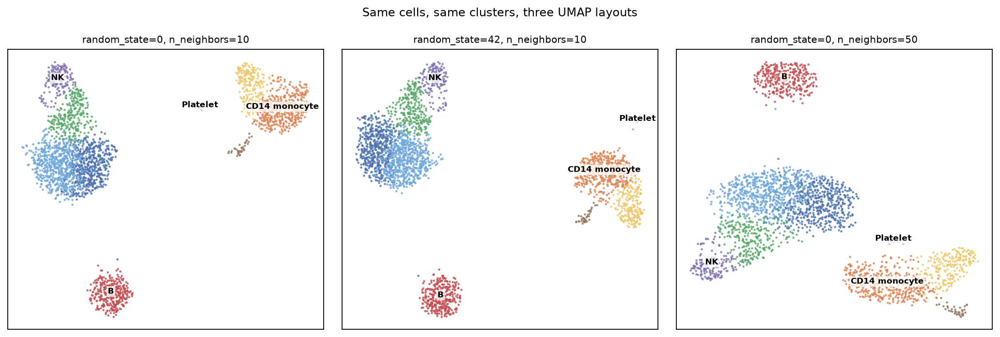
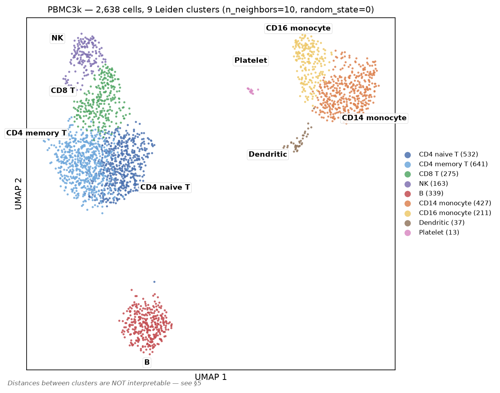

# Lab 09 — Single-cell RNA-seq, and how to read a UMAP

> **Time:** ~55 min · **Before this:** [Ch 47](../part-10-functional-genomics/47-rna-seq.md), [Ch 48](../part-10-functional-genomics/48-single-cell-and-spatial.md), [lab-07 §4](lab-07-population-genetics.md) for PCA

Run the standard scanpy workflow end to end on 2,700 real human PBMCs: load a 97%-zero count
matrix, set QC thresholds and watch one of them silently delete a cell type, cluster with Leiden,
annotate nine populations from canonical markers — and then spend the longest section of the lab
establishing exactly which features of a UMAP carry information and which are artefacts of the
layout algorithm. Every number below was produced on this machine.

The lab leans on counting distributions, PCA, rank tests and false discovery rates, but it does not
assume you already know them. The statistics track carries that load:
[S2](../part-S-statistics/S2-distributions.md) for the Poisson and negative binomial,
[S4](../part-S-statistics/S4-hypothesis-testing.md) for p-values and what they are not, and
[S7](../part-S-statistics/S7-high-dimensional-data.md) for principal components and FDR. Boxes
marked **The statistics here** point at the relevant section as each method appears.

```bash
# GENOMICS is exported in lab-00. In a fresh shell, set it again:
#   export GENOMICS=/path/to/learn-genomics
cd "$GENOMICS" && source .venv/bin/activate && cd labs/data
uv pip install scanpy leidenalg igraph
```

Versions used here: `scanpy 1.12.3`, `anndata 0.13.2`, `umap-learn 0.5.12`, `leidenalg 0.12.0`,
`igraph 1.0.0`, `scikit-learn 1.9.0`, `numpy 2.5.2`. Defaults have shifted between scanpy versions
— §3 documents one such shift that silently changed a result.

---

## 1. The count matrix, and what 97% zeros actually means

`sc.datasets.pbmc3k()` fetches the canonical 10x Genomics PBMC dataset — peripheral blood
mononuclear cells from one healthy donor — as a 5.58 MB HDF5 file. It caches into `./data/`.

```bash
python - <<'PY'
import scanpy as sc, numpy as np
ad = sc.datasets.pbmc3k()
X = ad.X
n_cells, n_genes = ad.shape
total, nnz = n_cells * n_genes, X.nnz
print(f"cells={n_cells}  genes={n_genes}  entries={total:,}")
print(f"nonzero={nnz:,} ({100*nnz/total:.3f}%)   zeros={100*(1-nnz/total):.3f}%")
print(f"dense float32 = {total*4/1e9:.2f} GB ; sparse CSR = "
      f"{(X.data.nbytes+X.indices.nbytes+X.indptr.nbytes)/1e6:.1f} MB")
counts = np.asarray(X.sum(1)).ravel()
genes  = np.asarray((X>0).sum(1)).ravel()
det    = np.asarray((X>0).sum(0)).ravel()
print("counts/cell: median %.0f  min %.0f  max %.0f" % (np.median(counts), counts.min(), counts.max()))
print("genes/cell : median %.0f  min %.0f  max %.0f" % (np.median(genes), genes.min(), genes.max()))
print("genes detected in 0 cells:", int((det==0).sum()), " in >=3 cells:", int((det>=3).sum()))
print("largest single entry:", X.max(), "| all integers:", np.allclose(X.data, np.round(X.data)))
PY
```

```
cells=2700  genes=32738  entries=88,392,600
nonzero=2,286,884 (2.587%)   zeros=97.413%
dense float32 = 0.35 GB ; sparse CSR = 18.3 MB
counts/cell: median 2197  min 548  max 15844
genes/cell : median 817  min 212  max 3422
genes detected in 0 cells: 16104  in >=3 cells: 13714
largest single entry: 419.0 | all integers: True
```

Three facts to fix in mind before anything else.

**The entries are integers.** Each is a **UMI count**: a unique molecular identifier tagged onto
a transcript before amplification, so duplicate reads from PCR collapse to one count. That is why
this is a counting problem and not a continuous-intensity problem like a microarray.

**Sparsity is a storage fact first.** Dense float32 would be 0.35 GB for 2,700 cells; the CSR
representation is 18.3 MB. Nothing in the pipeline ever materialises the dense matrix except
`sc.pp.scale`, which is why that one step is the memory cliff (§4).

**Half the "sparsity" is not sparsity at all.** 16,104 of the 32,738 genes are detected in **zero**
cells — these are the olfactory receptors, keratins and testis-specific genes that PBMCs do not
transcribe, present in the matrix only because the reference annotation lists them. Drop genes seen
in fewer than three cells and the zero fraction falls from 97.41% to **93.83%**.

### Are the remaining zeros "excess" zeros?

The claim that scRNA-seq is **zero-inflated** — that a separate "dropout" process destroys
molecules on top of ordinary sampling noise — was standard in 2015-era methods papers and is now
substantially revised for UMI data. Test it directly. Cell *i* has depth *nᵢ*; gene *g* takes a
fraction *p_g* of all counts. A pure multinomial-sampling model with no dropout term predicts
P(count = 0) = exp(−*nᵢ p_g*):

```bash
python - <<'PY'
import scanpy as sc, numpy as np
ad = sc.datasets.pbmc3k(); X = ad.X.tocsr()
n_i  = np.asarray(X.sum(1)).ravel()
p_g  = np.asarray(X.sum(0)).ravel(); p_g = p_g / p_g.sum()
obs  = 1 - np.asarray((X>0).sum(0)).ravel()/X.shape[0]
idx  = np.where(np.asarray((X>0).sum(0)).ravel() >= 3)[0]
pred = np.array([np.mean(np.exp(-n_i*p_g[j])) for j in idx])
o    = obs[idx]
print("genes compared:", len(idx))
print("mean observed zero fraction  = %.4f" % o.mean())
print("mean Poisson-predicted       = %.4f" % pred.mean())
print("median |observed - predicted| = %.4f" % np.median(np.abs(o-pred)))
print("corr(observed, predicted)     = %.4f" % np.corrcoef(o, pred)[0,1])
print("genes with >10 pp MORE zeros than predicted:", int((o-pred > 0.10).sum()))
print("genes with >10 pp FEWER zeros than predicted:", int((o-pred < -0.10).sum()))
PY
```

```
genes compared: 13714
mean observed zero fraction  = 0.9383
mean Poisson-predicted       = 0.9320
median |observed - predicted| = 0.0004
corr(observed, predicted)     = 0.9861
genes with >10 pp MORE zeros than predicted:  118
genes with >10 pp FEWER zeros than predicted: 0
```

> **The statistics here.** This is a Poisson goodness-of-fit check wearing a biological question. If
> cell *i*'s transcripts are a multinomial draw of depth *nᵢ* over gene shares *p_g*, then each
> gene's count is Poisson with mean *nᵢ p_g* — and Poisson has exactly one parameter, so
> P(count = 0) = exp(−*nᵢ p_g*) is forced, with nothing left over to tune
> ([S2 §2](../part-S-statistics/S2-distributions.md)). The assumption on trial is that *p_g* is the
> same in every cell. Read the output as a residual: `observed − predicted` positive means *more*
> zeros than sampling explains — the excess a "dropout" parameter would be invented to absorb —
> negative means fewer. A median absolute residual of 0.0004 across 13,714 genes leaves no work for
> a second parameter to do, and the 118 genes with a +10 pp excess are the ones where the single-*p_g*
> assumption is wrong, not the ones where molecules went missing.

**A one-parameter sampling model reproduces the per-gene zero fraction with a median absolute
error of 0.0004.** Only 118 of 13,714 genes have more than ten percentage points of unexplained
excess — and those are exactly the genes you would expect: markers restricted to one rare cell
type, which the pooled model treats as uniformly expressed. There is no room left for a
dropout parameter to explain.

The correct statement is therefore: **UMI counts are sparse because they are shallow, not because
molecules go missing.** A small lymphocyte holds on the order of 10⁵ mRNA molecules; at a median
2,197 UMIs per cell you are capturing a couple of percent of them. At 2% capture, a gene present
at 30 copies per cell has an expected count of 0.6 and therefore reads **zero in 55% of cells**,
by Poisson arithmetic and nothing else. Explicit zero-inflated models
(ZINB) fit UMI data no better than plain negative binomial or Poisson and are no longer the
default recommendation. Two caveats, both real: full-length, read-based protocols such as
SMART-seq2 do show extra zeros, and imputation methods sold as "fixing dropout" are solving a
problem this data does not have — they smooth counts toward their neighbours and manufacture
correlations that were never measured.

---

## 2. QC thresholds, and the cell type you delete without noticing ★

Three per-cell statistics carry nearly all the QC signal.

| Statistic | Low value means | High value means |
|---|---|---|
| `total_counts` (UMIs) | empty droplet, ambient RNA only | doublet, or a genuinely large cell |
| `n_genes_by_counts` | dying cell, or a small quiescent one | doublet |
| `pct_counts_mt` | — | ruptured cell: cytoplasmic mRNA leaked out, mitochondrial transcripts stayed behind the mitochondrial membrane |

```bash
python - <<'PY'
import scanpy as sc
ad = sc.datasets.pbmc3k(); ad.var_names_make_unique()
ad.var['mt'] = ad.var_names.str.startswith('MT-')
print("MT genes found:", int(ad.var['mt'].sum()))
sc.pp.calculate_qc_metrics(ad, qc_vars=['mt'], inplace=True, log1p=False, percent_top=None)
q = ad.obs[['total_counts','n_genes_by_counts','pct_counts_mt']]
print(q.describe(percentiles=[.01,.05,.5,.95,.99]).round(2).to_string())
for expr, name in [('n_genes_by_counts<200','n_genes < 200'),
                   ('n_genes_by_counts>2500','n_genes > 2500'),
                   ('pct_counts_mt>5','pct_mt > 5')]:
    print(f"cells failing {name:16s}: {ad.obs.eval(expr).sum()}")
PY
```

```
MT genes found: 13
       total_counts  n_genes_by_counts  pct_counts_mt
count       2700.00            2700.00        2700.00
mean        2366.90             846.99           2.22
std         1094.26             282.10           1.17
min          548.00             212.00           0.00
1%           658.93             326.00           0.59
5%           955.95             435.95           0.93
50%         2197.00             817.00           2.03
95%         4220.55            1368.10           4.01
99%         5928.62            1749.01           5.88
max        15844.00            3422.00          22.57

cells failing n_genes < 200   : 0
cells failing n_genes > 2500  : 5
cells failing pct_mt > 5      : 57
```

The classic thresholds — `n_genes ∈ [200, 2500]`, `pct_mt < 5` — remove **62 cells, 2.3% of the
data**, leaving 2,638. That is a light touch, and deliberately so. Note that the `n_genes > 200`
floor removes nothing here: this matrix has already had empty droplets called out by CellRanger,
so the 200 floor is inherited convention rather than an active filter.

Now the part that matters. Run the pipeline once (§3–§4), then look at those same QC statistics
**per cluster**, using the cell-type labels established in §6:

| cluster | cell type | n | median genes | median UMIs | median %mt | would fail `genes ≥ 500` | would fail `%mt < 3` |
|---|---|---|---|---|---|---|---|
| 0 | CD4 memory T | 641 | 880 | 2524 | 1.67 | 0.6% | 5.8% |
| 1 | CD8 T | 275 | 801 | 1983 | 2.38 | 7.3% | **27.6%** |
| 2 | NK | 163 | 892 | 1915 | 1.95 | 0.6% | 12.3% |
| 3 | CD4 naive T | 532 | 732 | 2123 | 1.92 | 11.1% | 13.9% |
| 4 | B | 339 | 676 | 1766 | 2.06 | 9.4% | 14.5% |
| 5 | CD16 monocyte | 211 | 1253 | 3766 | 2.35 | 0.0% | 17.5% |
| 6 | CD14 monocyte | 427 | 806 | 2139 | 2.26 | 14.3% | 20.1% |
| 7 | Dendritic | 37 | 1567 | 5153 | 2.03 | 0.0% | 2.7% |
| 8 | **Platelet** | **13** | **350** | **917** | 1.57 | **76.9%** | 7.7% |

The QC statistics are **not exchangeable across cell types**. Platelets are anucleate cell
fragments; they carry a small, distinctive megakaryocyte-derived transcriptome and a median of 350
detected genes. Dendritic cells and CD16 monocytes are large and transcriptionally busy, with
median 1,567 and 1,253 genes. A `min_genes` threshold is therefore not a quality filter — it is a
**cell-size filter that correlates with quality**.

Watch it happen. Change one number and rerun everything:

```bash
python - <<'PY'
import scanpy as sc, numpy as np
sc.settings.verbosity = 0
for mg in (200, 500):
    ad = sc.datasets.pbmc3k(); ad.var_names_make_unique()
    ad.var['mt'] = ad.var_names.str.startswith('MT-')
    sc.pp.calculate_qc_metrics(ad, qc_vars=['mt'], inplace=True, log1p=False, percent_top=None)
    sc.pp.filter_cells(ad, min_genes=mg); sc.pp.filter_genes(ad, min_cells=3)
    ad = ad[(ad.obs.n_genes_by_counts<2500) & (ad.obs.pct_counts_mt<5)].copy()
    n = ad.n_obs
    sc.pp.normalize_total(ad, target_sum=1e4); sc.pp.log1p(ad); ad.raw = ad
    sc.pp.highly_variable_genes(ad, min_mean=0.0125, max_mean=3, min_disp=0.5)
    ad = ad[:, ad.var.highly_variable].copy()
    sc.pp.scale(ad, max_value=10); sc.tl.pca(ad, svd_solver='arpack', n_comps=50)
    sc.pp.neighbors(ad, n_neighbors=10, n_pcs=40)
    sc.tl.leiden(ad, resolution=1.0, flavor='igraph', n_iterations=2, directed=False, random_state=0)
    ppbp = np.asarray(ad.raw[:, 'PPBP'].X.todense()).ravel()
    lab  = ad.obs.leiden.astype(str).values
    hit  = [(c, (lab==c).sum()) for c in set(lab) if ppbp[lab==c].mean() > 2]
    print(f"min_genes={mg}: cells={n}  clusters={ad.obs.leiden.nunique()}  "
          f"PPBP+ cells={int((ppbp>0).sum())}  platelet cluster={hit or None}")
PY
```

```
min_genes=200: cells=2638  clusters=9  PPBP+ cells=76  platelet cluster=[('8', np.int64(13))]
min_genes=500: cells=2451  clusters=7  PPBP+ cells=61  platelet cluster=None
```

> **`min_genes=500` is a completely reasonable-looking threshold, and it deletes the platelets.**
> Nothing errors. No warning fires. You lose 187 cells (7%), the cluster count drops from 9 to 7,
> and a cell population simply is not in your results — not misclassified, not merged, *absent*.
> Had you never run the permissive version you would have no way to know. The defence is
> procedural, not statistical: **set thresholds from the observed distribution rather than from a
> remembered default, start permissive, and re-examine the QC statistics per cluster after
> clustering.** If a cluster sits at the boundary of a filter, that filter is making a biological
> decision on your behalf.

The same asymmetry applies to the mitochondrial cut. At `pct_mt < 3` you would discard 27.6% of
CD8 T cells and 2.7% of dendritic cells — a threshold intended to remove damaged cells that in
practice reshapes composition.

---

## 3. Normalise, log, and select genes

```bash
python - <<'PY'
import scanpy as sc, numpy as np
sc.settings.verbosity = 0
ad = sc.datasets.pbmc3k(); ad.var_names_make_unique()
ad.var['mt'] = ad.var_names.str.startswith('MT-')
sc.pp.calculate_qc_metrics(ad, qc_vars=['mt'], inplace=True, log1p=False, percent_top=None)
sc.pp.filter_cells(ad, min_genes=200)
sc.pp.filter_genes(ad, min_cells=3)
ad = ad[(ad.obs.n_genes_by_counts<2500) & (ad.obs.pct_counts_mt<5)].copy()
print("after QC:", ad.shape)
pre = np.asarray(ad.X.sum(1)).ravel()
sc.pp.normalize_total(ad, target_sum=1e4)
post = np.asarray(ad.X.sum(1)).ravel()
print("counts/cell before: min %d median %d max %d" % (pre.min(), np.median(pre), pre.max()))
print("counts/cell after : min %.0f median %.0f max %.0f" % (post.min(), np.median(post), post.max()))
sc.pp.log1p(ad)
print("max value after log1p: %.2f" % ad.X.max())
sc.pp.highly_variable_genes(ad, min_mean=0.0125, max_mean=3, min_disp=0.5)
print("highly variable genes:", int(ad.var.highly_variable.sum()), "of", ad.n_vars)
for g in ['PPBP','NKG7','MS4A1','LYZ','CD3D','CD14','B2M','GAPDH']:
    v = ad.var.loc[g]
    print(f"   {g:6s} HVG={bool(v.highly_variable)!s:5s} mean={v.means:.3f} disp_norm={v.dispersions_norm:+.2f}")
PY
```

```
after QC: (2638, 13714)
counts/cell before: min 556 median 2213 max 8875
counts/cell after : min 10000 median 10000 max 10000
max value after log1p: 7.47
highly variable genes: 1838 of 13714

   PPBP   HVG=True  mean=1.255 disp_norm=+5.52
   NKG7   HVG=True  mean=2.670 disp_norm=+2.31
   MS4A1  HVG=True  mean=1.000 disp_norm=+0.63
   LYZ    HVG=False mean=3.687 disp_norm=+3.66
   CD3D   HVG=False mean=2.023 disp_norm=-0.10
   CD14   HVG=False mean=0.846 disp_norm=+0.17
   B2M    HVG=False mean=5.276 disp_norm=+0.71
   GAPDH  HVG=False mean=2.799 disp_norm=+0.18
```

> **The statistics here.** Two facts about count data drive this whole section. First, **variance
> grows with the mean**: Poisson has variance = mean, and cells add variation on top of that, giving
> the negative binomial's variance = μ + αμ² ([S2 §5](../part-S-statistics/S2-distributions.md)).
> That is what `log1p` is for — it approximately stabilises the variance so highly expressed genes
> stop dominating a Euclidean distance simply by being abundant. Second, and following from the
> first, ranking genes by raw variance would mostly re-rank them by expression, so
> `highly_variable_genes` bins genes by mean and reports **`dispersions_norm`: a gene's dispersion
> (variance-to-mean ratio, [S5 §1](../part-S-statistics/S5-variance-and-regression.md)) expressed in
> standard deviations away from the average dispersion of genes at the same mean.** Read it as that
> z-score and nothing else — `PPBP` at +5.52 is 5.5 SD more variable than genes of its abundance,
> `CD3D` at −0.10 is exactly as variable as its abundance predicts. The units are "unusual for its
> mean", not "important".

Three transformations, three distinct jobs:

| Step | What it does | Why |
|---|---|---|
| `normalize_total(target_sum=1e4)` | rescale each cell's counts to sum to 10,000 | depth varies 16-fold (556 → 8,875) for reasons that are technical, not biological |
| `log1p` | *x* → log(1 + *x*) | variance grows with the mean in count data; the log approximately stabilises it, and turns multiplicative effects into additive ones so that Euclidean distance and PCA behave |
| `highly_variable_genes` | keep 1,838 genes with high dispersion at their mean | most genes carry no between-cell signal; including them adds noise dimensions to the PCA |

Note what HVG selection does and does not do. **`CD3D`, the definitive T-cell marker, is not a
highly variable gene** (normalised dispersion −0.10) — it is expressed in ~55% of cells at
moderate level, which is not variable *for its mean*. **`LYZ` has a huge dispersion (+3.66) and is
still excluded**, by the `max_mean=3` cap. Neither exclusion hurts, because HVG selection governs
only the *embedding*; marker testing in §6 runs on all 13,714 genes stored in `.raw`. Keep that
separation of concerns: **`.X` is for geometry, `.raw` is for statistics.**

### The gotcha: `sc.tl.pca` silently uses `highly_variable`

I first tried to measure how much HVG selection matters by comparing an HVG-subset run against an
all-genes run, and got **exactly identical** PCA variance ratios to six decimal places and an
adjusted Rand index of 1.0000 between the clusterings. That is not a coincidence — it is the
tell that the two runs were the same run.

```bash
python - <<'PY'
import scanpy as sc
sc.settings.verbosity = 0
ad = sc.datasets.pbmc3k(); ad.var_names_make_unique()
ad.var['mt'] = ad.var_names.str.startswith('MT-')
sc.pp.calculate_qc_metrics(ad, qc_vars=['mt'], inplace=True, log1p=False, percent_top=None)
sc.pp.filter_cells(ad, min_genes=200); sc.pp.filter_genes(ad, min_cells=3)
ad = ad[(ad.obs.n_genes_by_counts<2500) & (ad.obs.pct_counts_mt<5)].copy()
sc.pp.normalize_total(ad, target_sum=1e4); sc.pp.log1p(ad)
sc.pp.highly_variable_genes(ad, min_mean=0.0125, max_mean=3, min_disp=0.5)

for tag, kw in [("default      ", {}), ("mask_var=None", {"mask_var": None})]:
    a = ad.copy(); sc.pp.scale(a, max_value=10)
    sc.tl.pca(a, svd_solver='arpack', n_comps=50, **kw)
    used = a.varm['PCs'].shape[0] - (a.varm['PCs'] == 0).all(1).sum()
    print(f"  {tag}: genes handed to pca={a.n_vars}  genes actually used={used}  "
          f"var(PC1-40)={100*a.uns['pca']['variance_ratio'][:40].sum():.2f}%")
PY
```

```
  default      : genes handed to pca=13714  genes actually used=1838   var(PC1-40)=12.04%
  mask_var=None: genes handed to pca=13714  genes actually used=13713  var(PC1-40)=5.85%
```

**`sc.tl.pca` applies `mask_var="highly_variable"` whenever that column exists in `.var`, unless
you pass `mask_var` explicitly.** Calling `highly_variable_genes` therefore changes the behaviour
of a later `pca` call on the *unsubset* object, invisibly — 13,714 genes go in and 1,838 are used.
Passing `mask_var=None` gives the real comparison:

| PCA input | genes used | variance in PC1–40 | Leiden clusters | ARI vs HVG run |
|---|---|---|---|---|
| subset to HVGs | 1,838 | 12.04% | 9 | 1.0000 |
| all genes, `mask_var=None` | 13,714 | **5.85%** | **12** | **0.5483** |
| all genes, default `mask_var` | 13,714 → 1,838 | 12.04% | 9 | 1.0000 |

So HVG selection does matter — it roughly doubles the fraction of variance the leading PCs capture
and changes the clustering substantially (ARI 0.55) — but you cannot measure that without
overriding a default that quietly does the selection for you.

---

## 4. PCA → neighbour graph → UMAP → Leiden

Sections 2–4 have to run in one process — each step writes into the same object — and §5 onwards
reads the result back off disk. So write them out as a script and run it:

```bash
cat > sc_pipeline.py <<'PY'
import scanpy as sc, numpy as np

sc.settings.verbosity = 1
ad = sc.datasets.pbmc3k()
ad.var_names_make_unique()
ad.var['mt'] = ad.var_names.str.startswith('MT-')
sc.pp.calculate_qc_metrics(ad, qc_vars=['mt'], inplace=True, log1p=False, percent_top=None)

print("start           ", ad.shape)
sc.pp.filter_cells(ad, min_genes=200)
sc.pp.filter_genes(ad, min_cells=3)
print("after min_genes/min_cells", ad.shape)
ad = ad[(ad.obs.n_genes_by_counts < 2500) & (ad.obs.pct_counts_mt < 5)].copy()
print("after mt/complexity     ", ad.shape)

ad.layers['counts'] = ad.X.copy()
sc.pp.normalize_total(ad, target_sum=1e4)
sc.pp.log1p(ad)
ad.raw = ad

sc.pp.highly_variable_genes(ad, min_mean=0.0125, max_mean=3, min_disp=0.5)
print("HVGs:", int(ad.var.highly_variable.sum()))
ad = ad[:, ad.var.highly_variable].copy()
sc.pp.scale(ad, max_value=10)
sc.tl.pca(ad, svd_solver='arpack', n_comps=50)
vr = ad.uns['pca']['variance_ratio']
print("PC variance ratio, first 10:", np.round(vr[:10], 4))
print("cumulative var at 40 PCs: %.3f" % vr[:40].sum())
sc.pp.neighbors(ad, n_neighbors=10, n_pcs=40)
sc.tl.umap(ad, random_state=0)
sc.tl.leiden(ad, resolution=1.0, key_added='leiden', flavor='igraph', n_iterations=2,
             directed=False, random_state=0)
print("clusters:", ad.obs.leiden.nunique())
print(ad.obs.leiden.value_counts().sort_index().to_string())
ad.write('pbmc3k_processed.h5ad')
PY

python sc_pipeline.py
```

The first two thirds of that is §2–§3, which you have already read line by line. The six lines
that make *this* section are the ones after HVG selection:

```python
sc.pp.scale(ad, max_value=10)                 # z-score each gene, clip at 10 SD
sc.tl.pca(ad, svd_solver='arpack', n_comps=50)
sc.pp.neighbors(ad, n_neighbors=10, n_pcs=40) # kNN graph in 40-D PC space
sc.tl.umap(ad, random_state=0)                # 2-D layout, for looking at
sc.tl.leiden(ad, resolution=1.0, flavor='igraph', n_iterations=2,
             directed=False, random_state=0)  # clustering, on the graph
```

```
start                     (2700, 32738)
after min_genes/min_cells (2700, 13714)
after mt/complexity       (2638, 13714)
HVGs: 1838
PC variance ratio, first 10: [0.022  0.0118 0.0098 0.0082 0.005  0.0028 0.0024 0.0021 0.002  0.0019]
cumulative var at 40 PCs: 0.120
clusters: 9
0    641
1    275
2    163
3    532
4    339
5    211
6    427
7     37
8     13
```

**Nine clusters**, from 13 cells to 641. Wall-clock on this machine:

| step | time |
|---|---|
| load | 0.06 s |
| `normalize_total` | 1.00 s |
| `highly_variable_genes` | 0.58 s |
| `scale` + `pca` | 0.36 s |
| `neighbors` | 3.73 s |
| `umap` | 1.67 s |
| `leiden` | 0.05 s |

The whole thing is seven seconds for 2,638 cells. `neighbors` dominates, and it is the step that
scales worst — it is an approximate-nearest-neighbour search whose cost grows with cell count while
the others grow with cells × genes on a sparse matrix.

Two things to notice in the numbers.

**PC1 explains 2.2% of variance and 40 PCs explain 12%.** Compare with lab-07, where PC1 of a
genotype matrix carried a clearly dominant signal. There is no elbow here worth arguing about;
single-cell variance is spread thin because most of it is sampling noise. The `n_pcs=40` choice is
a convention that works, not a threshold derived from the scree plot.

> **The statistics here.** PCA finds the orthogonal directions of maximum variance in the scaled
> 1,838-gene space; each PC's **variance ratio** is its eigenvalue as a share of the total, so 0.022
> means PC1 carries 2.2% of the variance in *that matrix* — not 2.2% of anything biological
> ([S7 §5](../part-S-statistics/S7-high-dimensional-data.md)). It assumes the structure you want is
> linear and that variance is the right currency, which is why `scale` is not cosmetic: z-scoring
> each gene decides how much say each gene gets. Read a scree sequence for a *gap* rather than a
> total — low leading percentages are normal in both single-cell and genotype data — and treat the
> PC count as a tuning parameter you check, not a quantity you estimate. S7 §5 runs straight on into
> why an embedding computed from these PCs does not preserve the distances between them, which is §5
> of this lab.

**`sc.pp.scale` prints `UserWarning: zero-centering a sparse array/matrix densifies it`.** That is
the memory cliff: after scaling, the 2,638 × 1,838 matrix is dense. Harmless at this size, fatal
at 500,000 cells — which is why large-scale pipelines skip `scale` and run PCA on the
log-normalised sparse matrix directly, or use residual-based methods that never densify.

**Leiden runs on the neighbour graph, not on the UMAP.** This is the single most misunderstood
point of the workflow and §5 depends on it. `sc.tl.umap` and `sc.tl.leiden` are two independent
consumers of `ad.obsp['connectivities']`. Delete the UMAP and the clusters are unchanged.

The `resolution` parameter is a free knob with no objective setting:

| resolution | clusters | ARI vs res = 1.0 |
|---|---|---|
| 0.4 | 6 | 0.597 |
| 0.6 | 7 | 0.650 |
| **1.0** | **9** | **1.000** |
| 1.5 | 12 | 0.645 |
| 2.0 | 20 | 0.448 |

"How many cell types are in blood?" has no data-internal answer. Resolution 2.0 splits CD4 T cells
into six pieces; resolution 0.4 merges CD8 T with NK. What licenses a choice is external evidence —
marker genes that match known biology (§6), or replication in an independent sample.

---

## 5. Reading a UMAP ★★

A UMAP is produced by minimising a cross-entropy between fuzzy neighbourhood memberships in the
high-dimensional space and in 2-D, from a random initialisation, by stochastic gradient descent.
That objective rewards putting each point near its *k* nearest neighbours. It contains **no term
that rewards preserving distances between distant points**, and no term that preserves density.
Everything below follows from that.

### The layout moves; the clusters do not

```bash
python - <<'PY'
import scanpy as sc, numpy as np
sc.settings.verbosity = 0
ad = sc.read_h5ad('pbmc3k_processed.h5ad')
for seed in (0, 42):
    a = ad.copy(); sc.tl.umap(a, random_state=seed); np.save(f'umap_seed{seed}.npy', a.obsm['X_umap'])
a = ad.copy(); sc.pp.neighbors(a, n_neighbors=50, n_pcs=40); sc.tl.umap(a, random_state=0)
np.save('umap_nn50.npy', a.obsm['X_umap'])
PY
```



Same 2,638 cells, same nine clusters, same colours. Changing `random_state` from 0 to 42 moves the
monocytes from the top-right to the right-centre and rotates the T/NK block. Changing
`n_neighbors` from 10 to 50 puts the B cells at the top and stretches the T cells into a bar. **No
cell changed cluster between the first two panels** — the seed affects only the layout, because
Leiden reads the graph and never sees the embedding.

The third panel is a different kind of change and it is worth separating. `n_neighbors` rebuilds
the graph, so it moves the clustering too:

| `n_neighbors` | Leiden clusters | ARI vs the default run |
|---|---|---|
| 5 | 11 | 0.596 |
| **10** | **9** | **1.000** |
| 50 | 8 | 0.750 |

So: **`random_state` changes what you see and nothing else; `n_neighbors` changes what you see and
what you conclude.** Confusing the two is how people end up believing a layout is stable because
re-running it "looked the same".

### The distances are not distances

Everything in the rest of §5 comes from one script. It reads back the processed object and the
three saved embeddings, and reports centroid distances, neighbour preservation and hull areas:

```bash
cat > umap_distortion.py <<'PY'
import scanpy as sc, numpy as np
from scipy.spatial.distance import pdist
from scipy.spatial import ConvexHull
from scipy.stats import spearmanr
from sklearn.neighbors import NearestNeighbors

ad  = sc.read_h5ad('pbmc3k_processed.h5ad')
lab = np.asarray(ad.obs.leiden.astype(str).values, dtype='<U4')
P   = ad.obsm['X_pca'][:, :40]
E   = {k: np.load(f'umap_{k}.npy') for k in ('seed0', 'seed42', 'nn50')}
ct  = ['CD4mem','CD8T','NK','CD4naive','B','CD16mono','CD14mono','DC','Platelet']

cen  = lambda M: np.vstack([M[lab == c].mean(0) for c in sorted(set(lab), key=int)])
norm = lambda d: d / d.max()
Dp   = pdist(cen(P))
pair = [(i, j) for i in range(9) for j in range(i + 1, 9)]

print("normalised centroid distance (largest pair = 1.00)")
print("  pair                 " + "".join(f"{k:>9s}" for k in E) + f"{'PCA-40D':>10s}")
for (i, j) in [(4, 8), (5, 6), (0, 3), (1, 2), (4, 6), (2, 8)]:
    k = pair.index((i, j))
    row = f"  {ct[i]}-{ct[j]:<12s}"
    row += "".join(f"{norm(pdist(cen(M)))[k]:9.2f}" for M in E.values())
    print(row + f"{norm(Dp)[k]:10.2f}")

print("\nSpearman rho of all 36 centroid distances vs 40-D PCA")
for k, M in E.items():
    print(f"  {k:8s} rho = {spearmanr(pdist(cen(M)), Dp).statistic:+.3f}")
print("  seed0 vs seed42, i.e. two runs of the SAME algorithm: rho = %+.3f"
      % spearmanr(pdist(cen(E['seed0'])), pdist(cen(E['seed42']))).statistic)

nn = lambda M, k: NearestNeighbors(n_neighbors=k + 1).fit(M).kneighbors(M, return_distance=False)[:, 1:]
nnP = nn(P, 15)
print("\n15-NN overlap with 40-D PCA   |   fraction of 15-NN in same cluster")
print(f"  {'PCA-40D':10s} {1.0:.3f}   {np.mean(lab[nnP] == lab[:, None]):.3f}")
for k, M in E.items():
    nnE = nn(M, 15)
    ov = np.mean([len(set(a) & set(b)) / 15 for a, b in zip(nnP, nnE)])
    print(f"  {k:10s} {ov:.3f}   {np.mean(lab[nnE] == lab[:, None]):.3f}")

M = E['seed0']; tot = ConvexHull(M).volume
print("\ncluster        %cells   %hull area   area per cell (rel.)")
for c in sorted(set(lab), key=int):
    p = M[lab == c]; h = ConvexHull(p).volume
    print(f"  {c} {ct[int(c)]:<11s} {100*len(p)/len(M):5.1f}   {100*h/tot:8.2f}   {(h/tot)/(len(p)/len(M)):10.2f}")
PY

python umap_distortion.py
```

The tables in the rest of this section are that script's output, reformatted for reading.

Take the nine cluster centroids and ask how far apart they are, in each UMAP and in the 40-D PC
space the UMAP was computed from. Normalise so the largest pair is 1.00:

| pair | seed 0 | seed 42 | n_neighbors=50 | **40-D PCA** |
|---|---|---|---|---|
| B – Platelet | 0.80 | 0.98 | 0.69 | 0.98 |
| CD16 mono – CD14 mono | 0.16 | 0.16 | 0.16 | 0.15 |
| CD4 memory – CD4 naive | 0.13 | 0.12 | 0.12 | 0.07 |
| CD8 T – NK | 0.15 | 0.14 | 0.14 | 0.20 |
| **B – CD14 mono** | **1.00** | 0.77 | 0.85 | **0.29** |
| **NK – Platelet** | 0.60 | 0.79 | 0.41 | **1.00** |

Read the last two rows carefully. On the seed-0 UMAP, **B cells and CD14 monocytes are the most
separated pair on the plot** — and in the actual PC space they are at 0.29, nowhere near the
extreme. Conversely **NK and platelets are the most separated pair in PC space** and land at 0.60,
0.79 and 0.41 on the three layouts. The rank order of "which populations are most different" is
different on every panel, and none of them matches the data.

Quantified over all 36 centroid pairs, as Spearman correlation with the 40-D PC distances:

```
seed 0            rho = +0.289
seed 42           rho = +0.500
n_neighbors = 50  rho = +0.252

between two UMAP runs differing ONLY in random_state:  rho = +0.691
```

**Two runs of the same algorithm on the same graph agree with each other only at ρ = 0.69 about
which clusters are far apart.** A quantity that unstable cannot be evidence for anything.

### What *is* preserved

The local structure, and only that:

| embedding | overlap of each cell's 15 nearest neighbours with its 15-NN in 40-D PCA | fraction of 15-NN in the same cluster |
|---|---|---|
| 40-D PCA (reference) | 1.000 | 0.807 |
| UMAP seed 0 | 0.123 | **0.916** |
| UMAP seed 42 | 0.124 | **0.925** |
| UMAP n_neighbors=50 | 0.118 | 0.904 |

The exact neighbour identities barely survive — only 12% of a cell's 15 nearest neighbours in PC
space are still among its 15 nearest in the UMAP, because 2-D has nowhere near enough room. What
survives is **neighbourhood membership**: over 91% of each cell's UMAP neighbours belong to the
same cluster, higher than the 81% in the PC space itself, because the layout sharpens boundaries.
That is exactly the trade the objective function makes, and it is why a UMAP is a good way to
*see* that discrete populations exist and a bad way to say anything about them quantitatively.

### Cluster size on the plot is not cluster size

Convex hull area of each cluster on the seed-0 layout, against its share of cells:

```
cluster        %cells   %hull area   area per cell (rel.)
  0 CD4mem       24.3       8.55         0.35
  1 CD8T         10.4       4.18         0.40
  2 NK            6.2       2.29         0.37
  3 CD4naive     20.2      11.11         0.55
  4 B            12.9       3.48         0.27
  5 CD16mono      8.0       2.81         0.35
  6 CD14mono     16.2       5.41         0.33
  7 DC            1.4       0.68         0.49
  8 Platelet      0.5       0.04         0.09
```

Platelets occupy 0.09 units of area per cell and CD4 naive T cells occupy 0.55 — a **six-fold**
difference in on-screen density between two populations, produced by the layout, not by biology.
UMAP's repulsive term acts per point, so a small cluster is compressed relative to a large one and
a tight blob can be a real tight blob or an artefact of local density normalisation.

> **The only things a UMAP licenses you to say are: these populations are separable, this cell sits
> among those cells, and this trajectory is locally continuous.** It does not license "cluster A is
> closer to B than to C", "cluster A is more heterogeneous than B", "these two clusters overlap so
> they are related", or any statement about the size of a gap. Those claims must be made in the
> space you actually computed in — cluster-centroid distances in PC space, a marker-gene
> comparison, a formal test — and the UMAP used only to point at which cells you mean. Every
> quantity in §5 above is real output from this dataset, and every one of them changes when you
> change a seed.

This is not an argument against UMAP, which is an excellent tool for the job it does: showing you
that structure exists and where it is. It is an argument against reading a *layout* as a
*measurement*. t-SNE has the same property, more severely for global structure; force-directed
graph layouts likewise; PCA plots do preserve distances but usually fail to separate the clusters
in two dimensions at all, which is why nobody uses them here.

---

## 6. Marker genes and cell-type annotation

Clusters are integers until you attach biology to them. Rank genes by a Wilcoxon rank-sum test of
each cluster against all others, on the full log-normalised matrix in `.raw`:

```bash
python - <<'PY'
import scanpy as sc
ad = sc.read_h5ad('pbmc3k_processed.h5ad')
sc.tl.rank_genes_groups(ad, 'leiden', method='wilcoxon')
r = ad.uns['rank_genes_groups']
for g in r['names'].dtype.names:
    top = [r['names'][g][i] for i in range(8)]
    print(f"cluster {g} (n={int((ad.obs.leiden==g).sum()):3d}): " + ", ".join(top))
PY
```

```
cluster 0 (n=641): LDHB, LTB, CD3D, IL32, TPT1, RPS12, CD3E, IL7R
cluster 1 (n=275): CCL5, NKG7, CST7, GZMA, B2M, CTSW, HLA-C, IL32
cluster 2 (n=163): NKG7, GNLY, GZMB, CTSW, PRF1, GZMA, CST7, HLA-C
cluster 3 (n=532): RPS12, RPS27, RPL32, RPS14, RPS6, RPL13, RPS25, MALAT1
cluster 4 (n=339): CD74, CD79A, HLA-DRA, CD79B, HLA-DPB1, HLA-DQA1, MS4A1, HLA-DRB1
cluster 5 (n=211): LST1, COTL1, AIF1, FCER1G, FTH1, IFITM3, SAT1, PSAP
cluster 6 (n=427): S100A9, LYZ, S100A8, TYROBP, FTL, CST3, S100A6, FCN1
cluster 7 (n= 37): HLA-DPB1, HLA-DPA1, HLA-DRA, HLA-DRB1, HLA-DQA1, CST3, CD74, FCER1A
cluster 8 (n= 13): PF4, SDPR, GNG11, PPBP, NRGN, GPX1, SPARC, TPM4
```

> **The statistics here.** `method='wilcoxon'` is the Wilcoxon rank-sum test: for each gene it throws
> away the expression values, keeps their ranks, and asks whether the cluster's cells sit
> systematically high in the ranking of all cells. Assuming only ranks is why it is the default for
> a 97%-zero matrix — a *t*-test's normality assumption has nothing to stand on here — but the price
> is that it detects a shift in the *whole distribution*, so a top-ranked gene can be one expressed
> in a minority of the cluster's cells rather than one uniformly high in it. Read the ranking as a
> ranking. The accompanying p-value is P(ranks this extreme | the two groups are interchangeable)
> and is not the probability the gene is a real marker, nor a measure of effect size
> ([S4 §3](../part-S-statistics/S4-hypothesis-testing.md)); scanpy's `pvals_adj` is that p-value put
> through Benjamini–Hochberg across genes
> ([S7 §3](../part-S-statistics/S7-high-dimensional-data.md)). §7 explains why, in this particular
> setting, both numbers are void whatever their size.

The unsupervised ranking is suggestive but not decisive — cluster 3's top eight genes are
ribosomal proteins and `MALAT1`, which look like technical artefacts until you know that a high
ribosomal fraction is the standard signature of small quiescent naive lymphocytes. Check known
markers explicitly instead. Mean log-normalised expression per cluster:

```bash
python - <<'PY'
import scanpy as sc, pandas as pd
ad  = sc.read_h5ad('pbmc3k_processed.h5ad')
raw = ad.raw.to_adata(); raw.obs['leiden'] = ad.obs['leiden'].values
m = ['CD3D','IL7R','CCR7','S100A4','CD8A','GZMK','MS4A1','CD79A','CD19',
     'CD14','LYZ','FCGR3A','MS4A7','NKG7','GNLY','FCER1A','CST3','PPBP','PF4']
M = pd.DataFrame(raw[:, m].X.toarray(), columns=m)
M['leiden'] = raw.obs.leiden.values
print(M.groupby('leiden', observed=True).mean().round(2).T.to_string())
PY
```

```
leiden     0     1     2     3     4     5     6     7     8
CD3D    2.22  2.32  0.34  2.00  0.10  0.11  0.17  0.17  0.00
IL7R    1.61  1.16  0.33  1.28  0.20  0.19  0.19  0.41  0.18
CCR7    0.55  0.08  0.05  0.85  0.31  0.06  0.04  0.08  0.00
S100A4  2.63  3.01  2.93  1.69  0.75  4.20  4.14  3.23  0.86
CD8A    0.14  1.11  0.20  0.29  0.04  0.04  0.03  0.03  0.00
GZMK    0.21  1.58  0.25  0.16  0.06  0.03  0.03  0.08  0.12
MS4A1   0.09  0.08  0.09  0.07  2.16  0.13  0.08  0.11  0.00
CD79A   0.09  0.04  0.03  0.07  2.81  0.06  0.07  0.22  0.06
CD19    0.01  0.02  0.00  0.00  0.42  0.01  0.02  0.03  0.00
CD14    0.03  0.03  0.01  0.03  0.00  0.49  1.53  0.35  0.00
LYZ     0.99  0.80  0.85  0.90  0.87  3.62  5.06  4.61  1.21
FCGR3A  0.09  0.48  2.14  0.06  0.06  2.32  0.20  0.17  0.22
MS4A7   0.03  0.03  0.02  0.04  0.11  1.52  0.44  0.27  0.11
NKG7    0.33  3.37  4.69  0.28  0.17  0.55  0.30  0.45  0.18
GNLY    0.21  0.85  4.24  0.15  0.14  0.22  0.20  0.26  0.00
FCER1A  0.01  0.02  0.02  0.03  0.00  0.01  0.01  2.13  0.00
CST3    0.36  0.30  0.47  0.29  0.33  3.93  3.89  4.29  1.94
PPBP    0.02  0.04  0.00  0.03  0.03  0.09  0.11  0.03  5.92
PF4     0.00  0.03  0.00  0.01  0.02  0.06  0.04  0.08  5.00
```

Now the annotation is forced by the evidence:

| cluster | n | decisive evidence | call |
|---|---|---|---|
| 0 | 641 | `CD3D` 2.22, `IL7R` 1.61, `S100A4` 2.63, `CCR7` 0.55 | CD4 memory T |
| 3 | 532 | `CD3D` 2.00, `CCR7` **0.85** (highest), `S100A4` **1.69** (lowest T), ribosome-high | CD4 naive T |
| 1 | 275 | `CD3D` 2.32 **and** `CD8A` 1.11, `GZMK` 1.58, `NKG7` 3.37 | CD8 T |
| 2 | 163 | `GNLY` 4.24, `NKG7` 4.69, `FCGR3A` 2.14, `CD3D` **0.34** | NK |
| 4 | 339 | `CD79A` 2.81, `MS4A1` 2.16, `CD19` 0.42, MHC-II high | B |
| 6 | 427 | `CD14` 1.53, `LYZ` 5.06, `S100A8/9` top-ranked | CD14 monocyte |
| 5 | 211 | `FCGR3A` 2.32, `MS4A7` 1.52, `CD14` **0.49** | CD16 (non-classical) monocyte |
| 7 | 37 | `FCER1A` 2.13, `CST3` 4.29, MHC-II highest | Dendritic cell |
| 8 | 13 | `PPBP` 5.92, `PF4` 5.00, `CD3D`/`CD14`/`MS4A1` all ≈ 0 | Platelet |

Two discriminations are worth dwelling on, because they are where naive annotation fails.

**CD8 T versus NK.** Both express the cytotoxic programme (`NKG7`, `GZMA`, `CTSW`, `PRF1`). What
separates them is `CD3D` — 2.32 in cluster 1 and 0.34 in cluster 2. The T-cell receptor complex is
present or it is not, and cytotoxicity is a shared function, not a lineage. A marker list ranked
purely by fold change puts `NKG7` at the top of *both*.

**CD14 versus CD16 monocytes.** `CD14` is 1.53 vs 0.49, `FCGR3A` (CD16) is 0.20 vs 2.32. These are
the classical and non-classical monocyte subsets — genuinely different cells with different
functions, distinguished by two genes and sitting adjacent on the UMAP.



The platelet cluster is the interesting statistical case: **13 cells**, and `PF4` comes out at
log2FC 12.91 with adjusted *p* = 7.7 × 10⁻⁷. Thirteen cells is enough for overwhelming
significance when a gene is completely off everywhere else. It is also, as §7 explains, a number
you should not report as a *p*-value.

---

## 7. The double-dipping problem

Every *p*-value in §6 is invalid as stated.

The clusters were defined by finding the partition of these cells that maximises separation in
this expression matrix. The marker test then asks whether those groups differ in expression in
that same matrix. **The null hypothesis being tested is one the clustering algorithm already
searched for and rejected.** The test is conditioned on the data twice — once to define the
hypothesis, once to test it — and standard *p*-values do not account for the selection.

This is not a technicality about being slightly anticonservative. Simulate data with **no groups
at all** — one homogeneous Poisson population, 1,000 cells, 2,000 genes — cluster it into two, and
test. (`statsmodels` and `scikit-learn` are hard dependencies of `scanpy`, so the install at the
top of the lab already brought them in.)

```bash
cat > double_dip.py <<'PY'
import numpy as np, scanpy as sc, anndata as ad_mod
from scipy.stats import mannwhitneyu
from statsmodels.stats.multitest import multipletests
from sklearn.cluster import KMeans
sc.settings.verbosity = 0

def prep(M):
    A = ad_mod.AnnData(M.astype(np.float32))
    A.var_names = [f"g{i}" for i in range(M.shape[1])]
    sc.pp.normalize_total(A, target_sum=1e4); sc.pp.log1p(A)
    return A

def two_clusters(A):
    B = A.copy(); sc.pp.scale(B, max_value=10)
    sc.tl.pca(B, n_comps=30, svd_solver='arpack', mask_var=None)
    return KMeans(n_clusters=2, n_init=10, random_state=0).fit_predict(B.obsm['X_pca'][:, :10])

def n_hits(L, lab):
    keep = (L > 0).sum(0) >= 3
    p = np.ones(L.shape[1])
    for j in np.where(keep)[0]:
        p[j] = mannwhitneyu(L[lab == 1, j], L[lab == 0, j]).pvalue
    return int((multipletests(p, method='fdr_bh')[1] < 0.05).sum())

for sd in (0.0, 0.3):
    rng = np.random.default_rng(0)
    n_cells, n_genes = 1000, 2000
    mu = rng.gamma(0.6, 6.0, n_genes)          # ONE population — no true groups
    C = rng.poisson(np.outer(rng.lognormal(0, sd, n_cells), mu))
    A = prep(C); L = A.X.copy()
    km = two_clusters(A)
    rand = rng.permutation(np.r_[np.zeros(500), np.ones(500)]).astype(int)
    Ctr = rng.binomial(C, 0.5); Cte = C - Ctr        # Poisson count splitting
    Atr = prep(Ctr); Ate = prep(Cte); kms = two_clusters(Atr)
    print(f"depth heterogeneity sd={sd}   (median {int(np.median(C.sum(1)))} UMIs/cell)")
    print(f"   A  cluster then test on the SAME data : {n_hits(L, km):4d} 'markers' at FDR 5%")
    print(f"   B  random 50/50 split, same cells     : {n_hits(L, rand):4d}")
    print(f"   C  count splitting, held-out half     : {n_hits(Ate.X.copy(), kms):4d}")
PY

python double_dip.py
```

```
depth heterogeneity sd=0.0   (median 6871 UMIs/cell)
   A  cluster then test on the SAME data :   77 'markers' at FDR 5%
   B  random 50/50 split, same cells     :    0
   C  count splitting, held-out half     :    0
depth heterogeneity sd=0.3   (median 6891 UMIs/cell)
   A  cluster then test on the SAME data :   79 'markers' at FDR 5%
   B  random 50/50 split, same cells     :    0
   C  count splitting, held-out half     :   42
```

Row **A**: 77 genes pass a Benjamini–Hochberg FDR of 5% as "markers" distinguishing two clusters
in data containing exactly one population. Row **B** is the control that proves the tests
themselves are calibrated — split the *same* cells at random and BH gives zero discoveries, as it
should. The difference between A and B is entirely the act of choosing the split by looking at the
data. Multiple-testing correction does not help, because the problem is not the number of tests;
it is that the hypothesis was chosen adversarially.

> **The statistics here.** "77 'markers' at FDR 5%" is Benjamini–Hochberg: sort the p-values
> ascending and reject as far down the list as they out-run what a true null would produce. BH
> controls the **expected proportion of false positives among the genes you report** — a 100-gene
> list at 5% FDR is one you expect to contain about five mistakes — not the probability that any
> particular gene is wrong ([S7 §3](../part-S-statistics/S7-high-dimensional-data.md)). Every FDR
> procedure assumes the p-values handed to it are valid under the null, i.e. uniform when nothing is
> going on, and that is exactly the assumption row A breaks: the clustering already went looking for
> the split that makes them small, which is the garden of forking paths in its purest form
> ([S4 §8](../part-S-statistics/S4-hypothesis-testing.md)). Row B is the calibration check that
> proves the arithmetic is innocent — same test, same cells, a split chosen without looking, zero
> discoveries. Read the A-versus-B gap as the price of the selection, not of the correction.

### What actually fixes it

Row **C** is **count splitting** (Neufeld et al., 2024). If *X* ~ Poisson(λ), then thinning
*X_train* ~ Binomial(*X*, ε) leaves *X_test* = *X* − *X_train* statistically independent of
*X_train*. Cluster on one half of the counts, test on the other, and the selection no longer
contaminates the inference: **77 false markers → 0**, on the same data, with no change to the
test.

And look at the second block, which I did not expect and left in because it is instructive. With
cell-to-cell depth heterogeneity (lognormal sd 0.3 — mild by real-data standards), count splitting
leaks: **42 false discoveries**. The thinning theorem holds, but the two halves still share the
cell's *true* library size, the clustering partly tracks that shared latent variable, and
depth-dependent residual structure survives library-size normalisation. **The fix is a real fix and
it is not a free pass** — it removes the reuse-of-noise problem, not every source of dependence.

Current practice, in order of how much it buys you:

| Approach | What it gives | Cost |
|---|---|---|
| Report markers as **descriptive**, no *p*-values | honesty | none — this is what most annotation actually needs |
| **Count splitting** / data thinning | valid *p*-values for the split you chose | halves effective depth; assumes Poisson; leaks under strong depth heterogeneity |
| **Selective inference** for clustering (Gao, Bien & Witten, 2024) | *p*-values conditioned on the clustering that was performed | available for specific clustering algorithms, not Leiden in general |
| Validate clusters in an **independent sample** | the strongest evidence | requires another sample |
| **Pseudobulk** across biological replicates | valid DE *between conditions*, correct unit of replication | needs ≥3 replicates per condition; does not rescue marker tests |

The last row addresses a different and equally common error worth naming here: **treating cells as
independent replicates when comparing conditions.** Ten thousand cells from three patients are
three replicates, not ten thousand. Cell-level tests between conditions treat within-patient
correlation as independent information and produce spectacular, entirely spurious significance.
Aggregating counts per sample per cell type and running a standard bulk method on the resulting
pseudobulk matrix is the current default for exactly this reason ([Ch 47](../part-10-functional-genomics/47-rna-seq.md)).

For §6 specifically: the annotation stands, because it rests on prior biological knowledge of what
`CD79A` and `PPBP` mark, not on the *p*-values. What would not stand is "we discovered that gene
*X* is a novel marker of cluster 5, *p* = 10⁻¹²".

---

## 8. Files this lab produced

All of these are written by commands in the lab; nothing here arrives from outside it.

| File | Contents |
|---|---|
| `labs/data/sc_pipeline.py` | §2–§4, writes the processed object |
| `labs/data/umap_distortion.py` | §5 centroid distances, neighbour preservation, hull areas |
| `labs/data/double_dip.py` | §7 simulation |
| `labs/data/pbmc3k_processed.h5ad` | 2,638 × 1,838 scaled, with PCA, graph, UMAP, Leiden |
| `labs/data/pbmc3k_umap.png` | annotated UMAP, nine cell types |
| `labs/data/pbmc3k_umap_seeds.png` | the same cells under three layouts |
| `labs/data/umap_seed{0,42}.npy`, `umap_nn50.npy` | the three embeddings |

Further reading: [Ch 48](../part-10-functional-genomics/48-single-cell-and-spatial.md) for the
composition/state confound, ambient RNA, doublets and spatial assays.

---

## Check yourself

**1. Your count matrix is 95% zeros. A collaborator proposes running an imputation method to "recover the dropouts" before clustering. What do you say?**

<details><summary>Answer</summary>

That the premise is probably wrong and the cure is worse than the disease.

For UMI data the observed zeros are what plain multinomial sampling predicts. In this lab a
one-parameter Poisson model reproduced the per-gene zero fraction with a median absolute error of
0.0004 and a correlation of 0.986 across 13,714 genes, with only 118 genes showing more than ten
percentage points of unexplained excess. There is no large dropout signal left to impute. A gene
at 30 copies per cell, captured at ~2% efficiency, reads zero in 55% of cells by arithmetic alone.

Imputation methods estimate each cell's missing values from its neighbours. That manufactures
gene–gene correlations that were never measured, and — because the neighbours are defined by the
same expression data — it makes clusters look cleaner and marker genes look stronger while adding
no information. If the zeros bother you, the correct responses are to model the counts properly
(negative binomial or Poisson GLM, or Pearson residuals) or to aggregate: sum counts within a
cluster or sample, where the sampling noise averages out honestly.

The historical caveat is that read-based full-length protocols such as SMART-seq2 do show genuine
excess zeros. The "scRNA-seq is zero-inflated" claim came largely from that era and was carried
over to UMI data where it does not hold.

</details>

**2. Two clusters sit at opposite ends of your UMAP, and a third sits between them. Your co-author writes that the third is "transitional". What is wrong, and what would you compute instead?**

<details><summary>Answer</summary>

The claim rests on distances the layout does not preserve. UMAP's objective rewards putting each
point near its nearest neighbours; there is no term rewarding correct placement of distant points.
In this dataset the rank correlation between UMAP centroid distances and 40-D PC centroid
distances was ρ = 0.25–0.50 depending on the run, and **two UMAP runs differing only in
`random_state` agreed with each other at only ρ = 0.69**. B cells and CD14 monocytes were the most
separated pair on one layout and mid-range in the actual data; NK and platelets were the most
separated pair in the data and mid-range on every layout.

Being "between" two clusters on a 2-D layout is therefore not evidence of anything — a point has
to go somewhere, and in two dimensions almost everything is between something.

What to compute: distances between cluster centroids in the PC space used to build the graph
(and check they are stable under resampling); expression of markers specific to the two flanking
types in the middle population — genuine intermediates co-express, doublets co-express *and* have
elevated total counts; RNA velocity or a formal trajectory method if you have a real ordering
hypothesis; and, decisively, whether the arrangement reproduces in an independent sample.

</details>

**3. You tighten QC from `min_genes=200` to `min_genes=500`. Cell count drops 7%, every remaining QC plot looks better, and the clustering is cleaner. Why might this be worse?**

<details><summary>Answer</summary>

Because `min_genes` is a cell-size filter that only correlates with quality, and cell size varies
by cell type by an order of magnitude.

In this dataset, tightening to 500 removed 187 cells and **eliminated the platelet cluster
entirely** — the cluster count fell from 9 to 7 and no PPBP-high population remained. Platelets
have a median of 350 detected genes because they are anucleate fragments with a small
transcriptome, so 77% of them fail the filter. Dendritic cells (median 1,567 genes) lose nothing.
The output is cleaner precisely because a heterogeneous population has been removed.

Nothing warns you. There is no error, no diagnostic that fires, and if you never ran the permissive
version you have no way to detect the absence.

The defences: set thresholds from the observed distribution rather than a remembered default;
start permissive and tighten only with a reason; and after clustering, tabulate the QC statistics
*per cluster* — if any cluster sits near a threshold, that threshold is making a biological
decision for you. The same applies to the mitochondrial cut: at `pct_mt < 3` here you would lose
27.6% of CD8 T cells and 2.7% of dendritic cells.

</details>

**4. A reviewer says your marker-gene p-values are invalid because of double dipping. They are 10⁻²⁰⁰ and the markers are textbook-correct. Is the reviewer right, and does it matter?**

<details><summary>Answer</summary>

The reviewer is right about the statistics and it matters less than it sounds, provided you state
the claim correctly.

The clusters were chosen to maximise separation in this matrix; the test then asks whether they
differ in that same matrix. The null was already searched and rejected before the test ran. This
is not a small effect: clustering 1,000 cells drawn from a single homogeneous Poisson population
into two groups and testing produced **77 "markers" at 5% FDR**, while a random split of the same
cells produced **0**. The inflation comes entirely from choosing the split by looking at the data,
so multiple-testing correction cannot repair it.

Why it usually does not change the conclusion: the annotation is not resting on the *p*-value. It
rests on prior knowledge that `CD79A` marks B cells and `PPBP` marks platelets, plus an effect size
so large the gene is essentially off elsewhere. The honest framing is descriptive — "cluster 4
expresses `CD79A` at mean 2.81 versus ≤ 0.22 elsewhere" — with no *p*-value at all.

If you need a valid *p*-value, the options are count splitting (thin each Poisson count into
independent train/test halves, cluster on one and test on the other; that took the 77 false
markers to 0 here, though it leaked 42 under cell-level depth heterogeneity), selective inference
methods that condition on the clustering performed, or validation in an independent sample. And if
the comparison is between *conditions* rather than between clusters, the more damaging error is
usually treating cells as replicates instead of aggregating to pseudobulk per sample.

</details>
