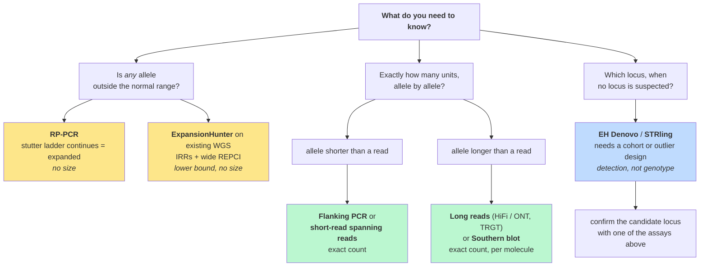

# Lab 11 — Genotyping repeat expansions

> **Time:** ~60 min · **Before this:** [lab-00](lab-00-setup.md) · [lab-02](lab-02-alignment.md) · [lab-03](lab-03-variant-calling.md) ·
> [Ch 40–42](../part-09-genomics/40-sequencing-technologies.md) · [Ch 46](../part-10-functional-genomics/46-variant-calling.md) ·
> [D3 Repeat-expansion disorders](../part-D-sca12/D3-repeat-expansion-disorders.md)
>
> **Statistics used here:** [S3 Sampling and estimation](../part-S-statistics/S3-sampling-and-estimation.md) ·
> [S6 Likelihood and Bayes](../part-S-statistics/S6-likelihood-and-bayes.md)

The pipeline you built in labs 02 and 03 — align, pile up, call — cannot see a repeat expansion.
Not "performs poorly on"; cannot see. [Ch 54 §9](../part-11-human-and-statistical-genomics/54-rare-variants-and-mendelian-disease.md)
puts it in one line, as a row in the table of where undiagnosed cases hide: *invisible by
construction — the read is shorter than the repeat*. This lab makes that failure concrete on a
real genome at a real disease locus, then runs the tools built to route around it, then shows you
where those tools stop as well.

The locus is *PPP2R2B* on chromosome 5, the SCA12 repeat
([D3](../part-D-sca12/D3-repeat-expansion-disorders.md)). It is a good teaching locus for an
accidental reason you will derive in §3: its pathogenic threshold sits almost exactly at the point
where a 150 bp read stops being able to count.

**Every command below was executed on an Apple Silicon Mac (macOS Darwin 25.5.0, samtools 1.24) on
2026-08-25, and every count, error message and genotype quoted is what it printed.** A few steps —
in §4, §6 and §7 — were *not* executed; each says so in the text rather than showing invented
output.

You do not need the statistics track before starting. Where a method prints a number whose meaning
is not obvious, a **The statistics here** box says what the method assumes and which S-chapter
teaches it.

```bash
# GENOMICS is exported in lab-00. In a fresh shell, set it again:
#   export GENOMICS=/path/to/learn-genomics
cd "$GENOMICS" && source .venv/bin/activate && cd labs/data
mkdir -p str && cd str
```

**Download budget for the whole lab: ≈300 MB**, no single step longer than about a minute on
ordinary broadband. The two sequencing files you will read are 15.7 GB and 119.8 GB. You will not
download either of them.

---

## 1. Install ExpansionHunter and REViewer

Neither tool is a Homebrew formula, so this is the one lab that reaches for a conda-family package
manager. `micromamba` is a single static binary with no base environment — the least invasive
option, and it coexists with the `uv` environment from
[lab-00](lab-00-setup.md).

```bash
brew install micromamba
micromamba create -y -n strlab -c bioconda -c conda-forge expansionhunter samtools
micromamba activate strlab
ExpansionHunter --version
```

**Tool note.** Versions used here: **ExpansionHunter v5.0.0** (released 2021-08-20; bioconda ships
an `osx-arm64` build, so this runs native on Apple Silicon) and **REViewer v0.2.7** (2022-02-02).
REViewer has **no arm64 build** and its repository is **archived** — it still works, it is simply
no longer maintained. Install it into its own `osx-64` environment and let Rosetta translate:

```bash
micromamba create -y -n reviewer --platform osx-64 -c bioconda -c conda-forge reviewer
```

> **An archived repository is a fact about the tool's lifecycle, not a reason to avoid it.**
> Clinical bioinformatics runs on a long tail of small, correct, unmaintained programs. What the
> archive status *does* mean is that nobody will fix it when a future samtools changes a BAM
> convention under it — so pin the version you validated with, and record it next to your results.
> This is the same discipline as naming a genome build with every coordinate
> ([Ch 41 §6](../part-09-genomics/41-data-formats.md)).

## 2. Take 3 kb out of a 15.7 GB genome

The sample is **HG00096**, a GBR individual from the 1000 Genomes 30× high-coverage collection
(3,202 genomes, NovaSeq 2 × 150 bp — Byrska-Bishop et al. 2022, *Cell* 185:3426). The CRAM is
**15,741,370,187 bytes — 15.7 GB**. Its index is **1.4 MB**. Indexed remote access means you
transfer the index and the bytes for your region, and nothing else
([Ch 41 §7](../part-09-genomics/41-data-formats.md)).

```bash
CRAM=https://1000genomes.s3.amazonaws.com/1000G_2504_high_coverage/data/ERR3240114/HG00096.final.cram
samtools view -c "$CRAM" chr5:146878000-146879500
```

```
486
```

486 reads, in about 5 seconds, with no reference genome anywhere in sight. Now ask for the reads
themselves:

```bash
samtools view -b -o hg00096_ppp2r2b.bam "$CRAM" chr5:146877000-146880000
```

```
[E::cram_decode_slice] Unable to fetch reference chr5:146860678-146900129
```

> **Counting worked and extracting failed, and the difference is the whole point of CRAM.** CRAM
> does not store read bases; it stores the *differences* between each read and the reference it was
> aligned to ([Ch 41 §3](../part-09-genomics/41-data-formats.md)). Counting records never decodes a
> base, so it needs no reference. Reconstructing sequence does. This file's embedded reference path
> is `/gpfs/…/GRCh38_full_analysis_set_plus_decoy_hla.fa` — an absolute path on a machine at the New
> York Genome Center that you will never have access to.

Two fixes. The blunt one is to download the 3.26 GB reference FASTA that the CRAMs were built
against. The sharp one is to point samtools at the EBI CRAM reference registry, which serves
reference slices addressed by their MD5 checksum, and let it fetch only the contig you touch:

```bash
export REF_CACHE="$PWD/refcache/%2s/%2s/%s"
export REF_PATH="$PWD/refcache/%2s/%2s/%s:https://www.ebi.ac.uk/ena/cram/md5/%s"

samtools view -b -o hg00096_ppp2r2b.bam "$CRAM" chr5:146877000-146880000
samtools index hg00096_ppp2r2b.bam
samtools view -c hg00096_ppp2r2b.bam
```

```
888
```

**888 reads, a 145 KB BAM, and 173 MB of cached chr5** — not 3.26 GB of genome. The MD5 in the
CRAM header identifies the exact contig sequence, so the registry can hand back a byte-identical
chr5 without either side needing to agree on a file name or a build alias. Content addressing
solves in one step the naming problem that [Ch 41 §8](../part-09-genomics/41-data-formats.md)
spends several paragraphs on.

Confirm the read length you are about to reason about, rather than assuming it:

```bash
samtools view hg00096_ppp2r2b.bam | awk '{print length($10)}' | sort -u
```

```
150
```

All 888 reads are exactly 150 bp.

## 3. Look at the reads: spanning, flanking, in-repeat ★

The repeat itself, in the two coordinate conventions you must never mix:

| Convention | Interval | Length |
|---|---|---|
| ExpansionHunter variant catalog, **0-based half-open** | `chr5:146878727-146878757` | 30 bp = **10 GCT units** |
| samtools / VCF, **1-based inclusive** | **chr5:146,878,728–146,878,757 (GRCh38)** | 30 bp |
| STRchive locus definition (cross-check) | chr5:146,878,728–146,878,759 (1-based) | 32 bp ≈ 10.7 units |

The gnomAD v4 API returns the same 0-based interval as the catalog. STRchive's is two bases longer:
that is locus-definition fuzz at the ragged edge of a repeat, not a disagreement about where the
gene is, and it is why a repeat count is only comparable between labs that defined the same
interval. [Ch 41 §6](../part-09-genomics/41-data-formats.md) owns the 0-based/1-based distinction;
here it costs you exactly one repeat unit if you get it wrong.

One more thing to fix before looking at sequence. The catalog motif is **GCT**; the SCA12
literature says **CAG**; a genome browser track may say **CTG**. All three describe the same
element. *PPP2R2B* is transcribed from the **minus** strand, so the tract reads CAG on the mRNA and
CTG/GCT on the plus strand that the reference and your BAM are written in — and a trinucleotide
repeat has no canonical phase, so GCT and CTG are the same run started one base apart.

```bash
samtools view hg00096_ppp2r2b.bam chr5:146878728-146878757 | head -3 | cut -f10 | cut -c1-90
```

No output fence here, deliberately: the three lines are 90-character sequence prefixes — the
first `cut` takes the SEQ field of each SAM record, the second trims it — still too wide to
reproduce legibly on this page, so run it and read them yourself. You will see three kinds of
read. Draw them against the locus:

```
   <- unique 5' flank -> |        (GCT)n tract        | <- unique 3' flank ->
   ......................|GCTGCTGCTGCTGCTGCTGCTGCTGCT.|......................
                         ^                            ^
   spanning   [==========================================]    both flanks present
                                                              -> exact size, countable

   flanking          [=============================]          one flank only
                                                              -> "at least this long"

   in-repeat              [==================]                no flank at all
                                                              -> "longer than a read"
```

Those are ExpansionHunter's three read classes, and the names are not decoration — they appear
verbatim in its output as `CountsOfSpanningReads`, `CountsOfFlankingReads` and
`CountsOfInrepeatReads`.

Now the arithmetic that decides what a 150 bp read can do:

```
150 bp read / 3 bp per repeat unit  = 50 units, with zero flanking sequence

but a read is only informative about length if it anchors in unique flank.
Allow 20 bp of unique sequence at each end:
(150 - 20 - 20) / 3 = 36 units of repeat visible in a spanning read

a 51-unit allele  = 153 bp of pure repeat  -> already longer than the read
a 200-unit allele = 600 bp of pure repeat  -> four reads would fit end to end inside it
```

> **The SCA12 pathogenic threshold sits exactly on the failure point, and that is a coincidence
> worth exploiting.** The classical convention calls **≥51 CAG units** diagnostic; a 51-unit tract
> is 153 bp, three base pairs longer than the read that is supposed to measure it. Every allele
> that matters clinically is, by construction, one that no single 150 bp read can span. Contrast
> *HTT*, where the ≥40 CAG full-penetrance threshold is 120 bp of repeat — by the arithmetic
> above, a 40-unit tract leaves only ~15 bp of anchor at each end of a 150 bp read, so the HTT
> threshold sits at the ragged edge of the spanning regime, where the SCA12 threshold is past it
> ([D3](../part-D-sca12/D3-repeat-expansion-disorders.md)).

There is a second failure, upstream of counting, and it is an alignment failure rather than an
arithmetic one. A read consisting entirely of GCT matches *every* position inside the repeat
equally well, and matches other GCT tracts elsewhere in the genome equally well too. The aligner
has no basis for choosing. It assigns a low or zero MAPQ, or places the read by its mate, or leaves
it unaligned — which is the information limit of
[Ch 42 §9](../part-09-genomics/42-read-alignment.md) turning up as a diagnostic dead end
([Ch 46 §10](../part-10-functional-genomics/46-variant-calling.md) files the same failure under
structural variants), and the
reason [Ch 46 §13](../part-10-functional-genomics/46-variant-calling.md) reports that repeat
expansions are excluded from benchmark confident regions altogether. The variant caller does not
emit a wrong answer at these loci. It emits nothing, and nothing looks exactly like normal.

> **Checkpoint.** In your own words: why can a 150 bp read not size a 200-repeat allele, and why
> does adding depth not fix it? Answer before reading on — the whole rest of the lab is a response
> to this question.

<details><summary>Answer</summary>

Sizing requires observing both ends of the tract in the same molecule. A 200-unit allele is 600 bp
of repeat; a 150 bp read that lands inside it sees repeat on both sides of every base it covers and
carries no information about where the tract began or ended. Two reads from opposite ends cannot be
stitched, because nothing distinguishes position 30 of the tract from position 300 — the sequence is
identical.

Depth does not help because the missing quantity is not noisy, it is absent. Sequencing 1,000 reads
from inside the repeat gives you 1,000 copies of the same non-answer. This is a **structural** limit
of the assay, not a statistical one: no estimator, however clever, can recover a parameter the data
do not depend on. Depth fixes variance; it does not fix identifiability.

What *can* be recovered from short reads is a different, weaker quantity — how many reads look like
they came from inside a long tract, and whether their mates anchor near this locus. That is a lower
bound with an interval attached, and §4 shows what it looks like when a tool computes it honestly.

</details>

## 4. Run ExpansionHunter, and read its evidence ★★

ExpansionHunter does not scan the genome. It is told where to look, by a **variant catalog**: a
JSON list of loci, each with a structure and a reference interval. The default Illumina hg38 catalog
holds **31 loci** — AFF2, AR, ATN1, ATXN1, ATXN10, ATXN2, ATXN3, ATXN7, ATXN8OS, C9ORF72, CACNA1A,
CBL, CNBP, CSTB, DIP2B, DMPK, FMR1, FXN, GIPC1, GLS, HTT, JPH3, NIPA1, NOP56, NOTCH2NL, PABPN1,
PHOX2B, **PPP2R2B**, RFC1, TBP, TCF4 — which is to say almost exactly the disease list from
[Ch 16 §9](../part-03-genome-instability/16-mutation.md) and
[D3](../part-D-sca12/D3-repeat-expansion-disorders.md), turned into a config file. (One spelling
note: "catalog" is the tool's own term — `--variant-catalog`, `variant_catalog.json` — and this lab
keeps it throughout rather than switching to *catalogue* whenever the tool is out of frame.)

Pull the single entry you need:

```bash
python3 - <<'PY'
import json, urllib.request
url = ("https://raw.githubusercontent.com/Illumina/ExpansionHunter/"
       "master/variant_catalog/hg38/variant_catalog.json")
cat = json.load(urllib.request.urlopen(url))
sub = [e for e in cat if e["LocusId"] == "PPP2R2B"]
json.dump(sub, open("catalog_ppp2r2b.json", "w"), indent=2)
print(json.dumps(sub, indent=2))
PY
```

```json
[
  {
    "LocusId": "PPP2R2B",
    "LocusStructure": "(GCT)*",
    "ReferenceRegion": "chr5:146878727-146878757",
    "VariantType": "Repeat"
  }
]
```

Four fields, and every one is load-bearing. `LocusStructure` is a regular expression over sequence,
not a motif string: `(GCT)*` says "zero or more GCT units here", and the same grammar can express an
interrupted tract or a repeat with a flanking variant — which is what the sequence-graph rewrite of
ExpansionHunter v3 bought (Dolzhenko et al. 2019, *Bioinformatics* 35:4754). `ReferenceRegion` is
0-based half-open, as its documentation states in those words.

ExpansionHunter wants a FASTA, and a single-locus catalog needs exactly one chromosome of it. You
already have chr5 — the reference registry cached it in §2. The cache stores raw sequence with no
FASTA header, so give it one, index it, and you are done:

```bash
CACHED=$(find refcache -type f -size +100M | head -1)   # the chr5 slice, named by its MD5
{ echo ">chr5"; fold -w 60 "$CACHED"; } > chr5.fa
samtools faidx chr5.fa
```

The contig name in the FASTA must match the one in the catalog and in the BAM — `chr5`, not `5`.
(If the cache layout defeats you, the fallback is the 3.26 GB full-analysis-set FASTA, which works
unchanged and costs you a coffee's worth of download.)

```bash
ExpansionHunter --reads hg00096_ppp2r2b.bam \
                --reference chr5.fa \
                --variant-catalog catalog_ppp2r2b.json \
                --output-prefix hg00096_eh
```

It finishes in under a second and emits three files: a VCF, a JSON, and a `_realigned.bam` holding
the reads as ExpansionHunter re-placed them against its locus graph.

One warning appears:

```
Could not recover the mate of ...
```

That is expected and harmless *here*: you extracted a 3 kb window, so some read pairs have one mate
outside it. It did not change the genotype. Note the shape of the reasoning, though — on a
whole-genome BAM the same warning would mean something quite different, and "expected on a
region-extracted BAM" is a judgement you had to supply, not something the tool knew.

### The call, and the evidence behind it

The VCF is an ordinary VCF ([Ch 41 §4](../part-09-genomics/41-data-formats.md),
[Ch 46](../part-10-functional-genomics/46-variant-calling.md)) with repeat-specific FORMAT keys.
The two that matter:

| Field | Value for HG00096 | Meaning |
|---|---|---|
| `GT` | **0/1** | two different alleles |
| `REPCN` | **10/14** | repeat copy number per allele, in GCT units |
| `REPCI` | **10-10 / 14-14** | confidence interval on each allele's size |

And the JSON spells out the evidence the call rests on:

| JSON field | Value | What it licenses |
|---|---|---|
| `CountsOfSpanningReads` | **12** and **14** for the two alleles | exact sizes — both ends observed in single molecules |
| `CountsOfFlankingReads` | **26** | consistent lower bounds, no contradiction |
| `CountsOfInrepeatReads` | **0** | nothing looks like it came from inside a long tract |

**HG00096 is 10/14 at the SCA12 locus** — both alleles comfortably normal (control alleles run
roughly 4–32 units), genotyped from spanning reads alone, in less than a second, from a 145 KB slice
of a 15.7 GB file.

> **The statistics here.** `REPCI` is an interval estimate and should be read like every other one:
> it describes what the data can pin down, not how confident anyone feels
> ([S3](../part-S-statistics/S3-sampling-and-estimation.md) §2, §5). Here it collapses to a point —
> `10-10` — because a spanning read *determines* the length of the molecule it came from; there is
> no sampling in the quantity being measured, only in which molecules you happened to sequence. The
> genotyper's job is to pick the allele-size pair that best explains the observed mix of read
> classes, which is the same argument as the genotype likelihood of
> [Ch 46 §2](../part-10-functional-genomics/46-variant-calling.md) with allele *lengths* in place of
> allele *bases* ([S6](../part-S-statistics/S6-likelihood-and-bayes.md) §1 on what a likelihood is
> doing when it ranks hypotheses). The moment you leave the spanning regime, that interval opens up,
> and an interval that opens up is the tool telling you the truth about identifiability rather than
> failing.

> **Checkpoint.** What evidence pattern separates a confident expansion call from an artefact?
> Write down three things you would look at before believing any `REPCN` above the read length.

<details><summary>Answer</summary>

**1. Which read class carries the call.** Spanning reads size an allele; flanking reads bound it
below; in-repeat reads say only "longer than a read". A large `REPCN` supported by spanning reads is
either a short expansion or a bug. A large `REPCN` supported by IRRs whose mates anchor at this
locus is the real signal the method was built to see.

**2. Whether the interval is honest about itself.** A wide `REPCI` on a long allele is correct
behaviour. A *narrow* interval on an allele several times the read length would be the suspicious
result, because nothing in short-read data justifies that precision.

**3. Whether the two alleles' evidence is mutually consistent, and whether the locus is covered at
all.** Flanking reads that imply a lower bound larger than the reported allele are a contradiction.
Zero reads of every class is not a normal genotype — it is no data, which
[Ch 46 §14](../part-10-functional-genomics/46-variant-calling.md) insists you distinguish from a
reference call. And in-repeat reads carrying the *wrong motif*, or mates anchored to a different
repeat locus with the same motif, are the classic artefact: mismapping from a homologous tract
elsewhere in the genome ([Ch 42 §9](../part-09-genomics/42-read-alignment.md)).

The general rule: never report a repeat genotype you have not looked at. Which is what §4.1 is for.

</details>

### 4.1 Look at the pileup

```bash
micromamba deactivate && micromamba activate reviewer
samtools sort -o eh_realigned.sorted.bam hg00096_eh_realigned.bam
samtools index eh_realigned.sorted.bam
REViewer --reads eh_realigned.sorted.bam \
         --vcf hg00096_eh.vcf \
         --reference chr5.fa \
         --catalog catalog_ppp2r2b.json \
         --locus PPP2R2B \
         --output-prefix hg00096_rev
```

Out comes a **660 KB SVG**: the two reconstructed haplotypes drawn as horizontal bars with the
repeat tract highlighted, and every supporting read stacked beneath the haplotype it was assigned
to. Open it in a browser. You are looking at the reads sorted into the two piles that produced
`10/14`, and you can count the units by eye on the short haplotype.

This is the step people skip, and it is the step that catches the failures. Dolzhenko et al. 2022
(*Genome Med* 14:84) wrote REViewer for exactly this reason: a repeat genotype is a summary of a
read pileup, and summaries hide the pathologies — reads piled on one haplotype and none on the
other, in-repeat reads with mates scattered across the genome, a "heterozygous" call whose two
alleles are supported by reads from a single strand. Strand bias was the artefact signature in
[lab-03 §3](lab-03-variant-calling.md); it does not stop being one because the variant is a length.

### 4.2 Several loci at once — and why this run is not printed here

Nothing stops you genotyping the whole 31-locus catalog. The command is the same with the full
catalog file, but the inputs change in a way worth stating: you need a BAM containing every region
the catalog names (so a second extraction covering *HTT*, *ATXN2*, *C9orf72* and the
rest — take every region from the catalog — or the whole CRAM), and a reference containing those contigs — the `REF_PATH` registry will
fetch each one on demand, at roughly the cost of chr5's 173 MB apiece.

Do not type the other loci's coordinates from memory or from this page — take them from the
catalog, which is the only place they are authoritative, and remember to convert its 0-based starts
if you print them anywhere a human will read them:

```bash
# Sketch. This multi-locus run was NOT executed during the writing of this lab,
# so no output is shown for it. Run it and record what you get.
python3 - <<'PY' > regions.txt
import json, urllib.request
url = ("https://raw.githubusercontent.com/Illumina/ExpansionHunter/"
       "master/variant_catalog/hg38/variant_catalog.json")
for e in json.load(urllib.request.urlopen(url)):
    region = e["ReferenceRegion"]
    # compound loci (adjacent repeats) carry a list of regions, not one string
    for r in ([region] if isinstance(region, str) else region):
        chrom, span = r.split(":")
        start, end = (int(x) for x in span.split("-"))
        print(f"{chrom}:{start - 1000 + 1}-{end + 1000}")   # 0-based -> 1-based, 1 kb of flank
PY
samtools view -b -o loci.bam "$CRAM" $(tr '\n' ' ' < regions.txt)
```

House rule, and it applies to you as much as to this file: **if the output was not produced, do not
print an output.** A lab that shows plausible numbers it never generated has taught its reader that
plausible and true are the same thing.

## 5. What ExpansionHunter cannot tell you, and what clinical labs run instead

When the allele is longer than the fragment, ExpansionHunter has spanning reads for the short
allele and, for the long one, flanking reads and in-repeat reads. From those it estimates — and the
estimate arrives with a wide `REPCI`, because that is what the data support. Read such a call as
**"expanded, at least about N units"**, never as a size. The method's own validation is framed in
exactly those terms: applied to PCR-free whole genomes from **3,001 ALS patients**, it classified
**all 212** *C9orf72*-expanded samples as expansions or potential expansions (Dolzhenko et al. 2017,
*Genome Res* 27:1895). Detection of every true positive; not a claim to have sized any of them.

For a clinical report that distinction is the whole ball game, because thresholds are stated in
units. "≥51" is a number you cannot act on with a lower bound of "≥40-something", and the SCA12
threshold is itself contested — the classical convention says ≥51, Srivastava et al. 2017 (*Brain*
140:27) argue the floor is 43 ([D3](../part-D-sca12/D3-repeat-expansion-disorders.md) and
[D4](../part-D-sca12/D4-sca12-from-repeat-to-phenotype.md) take that argument apart). A method that
cannot resolve 43 from 51 cannot adjudicate a debate whose entire content is the interval between
them.

So diagnostic laboratories still run PCR. Three assays, in escalating order of effort:

| Assay | What it measures | Where it fails |
|---|---|---|
| **Flanking PCR** + capillary sizing | exact unit count for normal-range alleles | large GC-rich amplicons amplify poorly or not at all; **one peak is ambiguous** |
| **Repeat-primed PCR (RP-PCR)** | *presence* of an expansion, as a continuing stutter ladder | the ladder decays and merges before the end of a big allele — "expanded, ≥ N", not a size |
| **Southern blot** | sizes alleles into the thousands of units | slow, low-throughput, needs micrograms of DNA |

The flanking-PCR ambiguity is the trap, and it has the same shape as the silent failures in
[lab-07](lab-07-population-genetics.md): the wrong answer is *well formed*.

```
Flanking PCR, capillary trace (schematic — hand-drawn, not instrument data)

  homozygous normal, 10/10              normal 10 + expansion 60
  ^                                     ^
  |        .||||||.                     |        .||||||.
  |      ..||||||||..                   |      ..||||||||..
  +----------------------> size         +----------------------> size
       ONE peak                              ONE peak
                                             (the expanded allele never amplified)
```

Two different genotypes, one indistinguishable trace. The expansion is not reported as uncertain; it
is simply not reported. Which is why RP-PCR exists — Warner et al. 1996, *J Med Genet* 33:1022, "A
general method for the detection of large CAG repeat expansions by fluorescent PCR". One primer sits
in unique flank; the other anneals **inside the repeat, at every possible offset**. Products of every
intermediate length are generated, and on a capillary they come out as a ladder of peaks spaced by
one repeat unit:

```
Repeat-primed PCR, capillary trace (schematic — hand-drawn, not instrument data)
peaks 3 bp apart, one per repeat unit

  normal allele only                    expansion present
  ^                                     ^
  | ||||||||||                          | ||||||||||||||||||||||||||||||||||......
  | ||||||||||                          | |||||||||||||||||||||||||||||||||||||...
  | ||||||||||.                         | ||||||||||||||||||||||||||||||||||||||..
  +---------------------> size          +----------------------------------------> size
    ladder stops                          ladder continues, amplitude decaying,
    inside the normal range                the far end never resolved
```

Read what each trace licenses. The left one says *no allele extends past the normal range*. The
right one says *an allele does* — and says nothing whatever about how far. The decaying amplitude is
not a defect in the figure; it is the assay, and it is why RP-PCR is a **detection** method that
gets followed by flanking PCR for the normal allele and, when a size is genuinely needed, by a
Southern blot. Reviews of the diagnostic pipeline describe RP-PCR and Southern blotting as
cumbersome and low-throughput relative to sequencing (Chintalaphani et al. 2021, *Acta Neuropathol
Commun* 9:98) — true, and they are still what a report is signed on.

One variation worth knowing because it shows an assay answering two questions at once: for fragile
X, a methylation-sensitive restriction digest run in parallel with a control digest lets a single
capillary assay report **both CGG length and promoter methylation status**, which is the pair of
facts the *FMR1* diagnosis actually turns on (Grasso et al. 2014, *J Mol Diagn* 16:23). A full
mutation is defined by size *and* silencing ([Ch 16 §9](../part-03-genome-instability/16-mutation.md));
an assay that measured only one of them would leave the interpretation half-done.

Put the whole toolkit on one page and it stops being a list of methods and becomes a decision about
what you need to know:



Amber is "expanded, at least"; green is a size; blue is a locus you did not have before. Notice that
no single box does two jobs, and that the cheapest box — ExpansionHunter over data you already have
— sits in the amber column. That is the honest summary of the whole field as of 2026: detection has
become nearly free, and sizing has not.

## 6. Long reads make it trivial ★★

Everything above is engineering around a single number: 150. Change the number and the problem
dissolves ([Ch 40 §3](../part-09-genomics/40-sequencing-technologies.md)).

The sample is **HG002**, the GIAB Ashkenazi son, PacBio HiFi aligned to GRCh38. The BAM is
**119.8 GB**; its index is 23.8 MB; you will again take only the window.

```bash
HIFI=https://ftp-trace.ncbi.nlm.nih.gov/giab/ftp/data/AshkenazimTrio/HG002_NA24385_son/PacBio_CCS_15kb_20kb_chemistry2/GRCh38/HG002.SequelII.merged_15kb_20kb.pbmm2.GRCh38.haplotag.10x.bam
samtools view -b -o hg002_hifi.bam "$HIFI" chr5:146877000-146880000
samtools index hg002_hifi.bam
samtools view hg002_hifi.bam | awk '{s+=length($10); n++} END {print n, s/n}'
```

```
69 14552
```

**69 reads, mean length 14,552 bp**, a 690 KB BAM, 9 seconds. Hold those two numbers against each
other: the mean read is 14.5 kb, and the top of the clinically observed SCA12 range is 78 units — 234 bp.
The average read spans the entire clinical range of this locus **sixty times over**. There is nothing
to infer. You count. The per-read counts, from the executed run:

```
    5 units     1 read
    6 units     1 read
    7 units     1 read
    9 units     3 reads
   10 units    47 reads
```

Fifty-three reads carry a countable tract, and **47 of them say 10 units**. HG002 is ≈10/10 — a
homozygous reference-length genotype, established by direct observation of 47 individual molecules,
with no model, no catalog and no inference. Compare that with §4, where the identical conclusion for
a different sample required a purpose-built genotyper, a locus graph and a confidence interval.

If you want to reproduce the count yourself, the shape of the script is below — and, house rule of
§4.2, no output is shown for it, because this exact script is *not* the code that produced the
counts above:

```bash
# Sketch. This is a reimplementation of the counting step, NOT the code the
# verified run used, so no output is printed for it. Run it and compare: a
# longest-run rule differs from a flank-anchored count at the tract edges, and
# can shift an individual read by a unit or two. The mode does not move.
python3 - <<'PY'
import re, subprocess
# Phase-agnostic: a trinucleotide repeat has no canonical phase, so try all three
# rotations of the plus-strand motif and take the longest run found in each read.
ROT = ("GCT", "CTG", "TGC")
counts = []
out = subprocess.run(["samtools", "view", "hg002_hifi.bam", "chr5:146878728-146878757"],
                     capture_output=True, text=True).stdout
for line in out.splitlines():
    seq = line.split("\t")[9]
    best = 0
    for m in ROT:
        for run in re.findall(f"(?:{m})+", seq):
            best = max(best, len(run) // 3)
    if best:
        counts.append(best)
for units in sorted(set(counts)):
    print(f"{units:5d} units  {counts.count(units):4d} reads")
PY
```

The production tool for this job is **TRGT** (Dolzhenko et al. 2024, *Nat Biotechnol* 42:1606),
which genotypes tandem repeats from HiFi, reports consensus allele sequences and supporting reads,
**and reads out 5mCpG methylation at the repeat** — the fragile-X assay of §5 and the sizing assay,
in one pass. Its binaries are Linux-only at v5.1.0, which is why the direct count above stands in
for it here; the teaching point is identical. Nanopore does the same job from the other direction:
41 reads cross this repeat in the GIAB HG002 ultralong ONT BAM, counted in 11 seconds over ranged
HTTPS without downloading more than the index and the region's bytes of the 187.5 GB file.

> **Checkpoint.** Long reads report a repeat length *per molecule*. Somatic instability
> ([Ch 16 §1](../part-03-genome-instability/16-mutation.md)) means different cells in one tissue
> carry different lengths. Does the per-read distribution above therefore measure somatic
> mosaicism?

<details><summary>Answer</summary>

Not on its own, and the table above shows why. HG002's true genotype at this locus is 10/10, yet the
per-read counts run 5, 6, 7, 9, 9, 9 and 10. Those six low reads are **not** six mosaic cells; they
are the sequencing and alignment error floor of a homopolymer-adjacent tandem repeat, and the errors
are one-sided — dropped units, not gained ones.

So the per-read distribution is a mixture of two things: real length variation between molecules,
and instrument error. Separating them needs the error floor characterised on a sample known to be
clonal at that locus, which is exactly what this table provides. A mosaicism claim then has to show
a component that the error model does not explain — typically a shoulder *above* the modal allele,
since somatic instability in repeat disorders is expansion-biased, present in the affected tissue
and absent from a control tissue in the same person, and reproducible on an orthogonal assay.

Two further cautions. HG002's reads come from a lymphoblastoid cell line (GM24385, the Coriell
line the NIST reference material is extracted from), and the tissue that
matters in a repeat disorder is brain — you cannot measure neuronal mosaicism in blood
([D5](../part-D-sca12/D5-sca12-population-clinic-therapy.md) on what that costs a clinical study).
And coverage sets the floor on detectable mosaic fraction: 53 reads cannot see a 2% subclone, since
the expected count of such reads is about one.

That said, long reads are the only assay in this lab that *could* see it at all. A capillary trace
is a population average over millions of molecules; ExpansionHunter reports two alleles because it
was asked for two. Per-molecule length is the measurement somatic instability actually requires,
which is why the somatic-expansion literature has moved onto single-molecule and single-cell methods
([Ch 17 §5](../part-03-genome-instability/17-dna-repair.md) for why mismatch repair is the reason
this matters).

</details>

### 6.1 Simulate what a mosaic tissue would look like

The checkpoint above characterised the null: a clonal locus, read per molecule, is one tight peak
per allele plus a one-sided error floor. Somatic mosaicism is the alternative hypothesis, and
before anyone measures it anywhere you should know what its histogram would look like. Three
statements of biology fix the shape. Each cell's repeat drifts independently, so the expanded
allele stops being a length and becomes a distribution. The drift is expansion-biased where it has
been characterised — **Established** for Huntington disease, where the tissues that degenerate
show progressive length increases ([D3](../part-D-sca12/D3-repeat-expansion-disorders.md)) — so
that distribution is right-skewed. And instability is strongly length-dependent, so the
normal-range allele in the *same nuclei* barely drifts at all. Put those three statements into a
model and draw it:

```bash
python3 - <<'PY'
import random
random.seed(12)

def sequenced(true_units):
    # the one-sided error floor measured on HG002 above: units get dropped, not gained
    if random.random() < 0.11:
        return true_units - random.choice([1, 1, 2, 3, 4, 5])
    return true_units

reads = []
# normal allele: clonal -- every molecule left the zygote at 10 units and stayed there
reads += [sequenced(10) for _ in range(60)]
# expanded allele in a somatically unstable tissue: each molecule has drifted
# upward by its own amount since the zygote -- expansion-biased, so drift >= 0,
# a few molecules having drifted a long way
reads += [sequenced(55 + int(random.expovariate(1/6))) for _ in range(60)]

for b in range(min(reads), max(reads) + 1, 3):
    n = sum(b <= r < b + 3 for r in reads)
    if n:
        print(f"{b:3d}-{b+2:3d} units  {'#' * n}")
PY
```

```
  5-  7 units  #####
  8- 10 units  #######################################################
 53- 55 units  ############
 56- 58 units  ########################
 59- 61 units  ##########
 62- 64 units  #######
 65- 67 units  #
 68- 70 units  ###
 71- 73 units  #
 74- 76 units  #
 77- 79 units  #
```

This one *was* executed — the seed is fixed, so you will get the same rows. The parameters are
illustrative, not measurements: the inherited expanded length, the drift scale and the 60-read
depth per allele are chosen numbers, and drift is modelled as purely upward, which real tissues
soften with occasional contractions. The one anchored parameter is the error floor, set at 11%
of reads dropping units because that is what the HG002 table above measured: 6 of 53. The
*shape* is the teaching point, and it has three features worth holding on to. The normal allele
is still a tight peak — same instrument, same chemistry, no biology. The expanded allele is not
a peak but a **broad, right-skewed spread**: a mode at or just above the inherited length, a
long tail of molecules that have drifted far, and below the inherited length nothing except the
thin error shoulder that the normal allele also wears. And the two alleles diverge *within one
sample*, which is the internal control that makes the measurement believable: an artefact of the
instrument or the alignment has no way of knowing which allele it is corrupting.

**The wet-lab versions of this histogram** are what stand behind the instability numbers in the
repeat literature, and both are older than long reads. Neither assay is in this course's
verified-facts file; take what follows as orientation to the literature's vocabulary, not as
sourced method, and check a primary reference before relying on any detail of it.
**Small-pool PCR** dilutes genomic DNA until each reaction holds only a few genome equivalents,
amplifies across the repeat in many such reactions, and sizes each reaction's products
separately — a per-molecule length distribution rebuilt one small pool at a time, digital in
exactly the way the long-read count in §6 is. The bulk shortcut is the capillary-trace
**expansion index**: one flanking PCR over millions of molecules, run out as a "GeneScan"-style
fragment trace on the same instrument as §5's schematics, gives a main peak at the modal allele
trailed by peaks above it, and the index summarises that trailing signal — how much of the trace
sits above the mode, and how far above — as a single number. Read both through §5's
amplification bias: the longest molecules amplify worst, so both assays under-weight the far
right tail, and the expansion index adds a confound of its own, since PCR stutter also makes
peaks near the mode. How the summary is computed is a protocol convention rather than a
standard, so treat an index as comparable within a protocol, not across the literature — and no
SCA12-specific expansion-index figure is established; nothing in this course's fact base carries
one. A measurement of exactly this family — per-region repeat-length distributions, compared
region against region — is what sits
behind the single-brain regional-instability result that
[D4](../part-D-sca12/D4-sca12-from-repeat-to-phenotype.md) examines in its human-tissue section
(§8), where the cerebellum showed the *least* instability of the regions measured: one brain,
so any generalisation from it stays **Conjectured**.

> **Checkpoint.** Close the page and sketch, from memory, the per-molecule histogram you would
> expect from (i) blood of a 10/14 carrier like HG00096, (ii) an affected tissue from an
> expansion carrier with genuine somatic instability, and (iii) sample (ii) as reported by an
> assay with a heavy contraction-type error. Then list the features that let you tell biology
> from artefact.

<details><summary>Answer</summary>

**(i)** Two tight peaks, at 10 and 14 units, each with a small one-sided shoulder just below it —
the error floor of §6's HG002 table, now appearing under both alleles because it belongs to the
assay, not the DNA.

**(ii)** The simulated histogram above: the normal allele unchanged, the expanded allele a broad
right-skewed spread whose mode sits at or above the inherited length, with a tail upward and
essentially nothing below the inherited length beyond the error shoulder.

**(iii)** The trap case. Heavy contraction-type error smears *both* alleles downward, so the
expanded spread widens at its left edge and the normal peak grows a longer left shoulder — a
shape that can imitate mosaicism to a casual eye.

The discriminating features, in order of power. **Direction**: dropped units cannot manufacture
signal *above* the mode, so a right shoulder on the expanded allele is the one feature error
cannot fake. **The internal control**: error afflicts both alleles, biology only the long one —
though read this with care, because error also grows with tract length, so a clean normal peak
does not fully acquit the expanded spread; what you want is a clonal control sample carrying a
similarly long allele, which is exactly the role HG002 played for the 10-unit regime. **Tissue
contrast**: the instrument does not know which tissue the DNA came from, so a spread present in
one tissue and absent in another from the same person is biology. **An orthogonal assay**:
small-pool PCR and sequencing do not share error mechanisms, so agreement between them retires
the artefact explanation. The general rule is the same one §4's checkpoint taught for a single
genotype, promoted to a distribution: never believe a histogram whose error floor you have not
measured on a sample where you know the truth.

</details>

## 7. Optional: catalog-free discovery, for the case with no candidate locus

Everything so far assumed you knew where to look. The undiagnosed patient of
[Ch 54 §9–§10](../part-11-human-and-statistical-genomics/54-rare-variants-and-mendelian-disease.md)
is precisely the one for whom that assumption fails: exome negative, genome negative, phenotype
unmistakably Mendelian. If the causal expansion is at a locus in no catalog, a catalog-based
genotyper will never report it — the file it reads has 31 entries, and genome-wide tandem-repeat
catalogs run to roughly a million loci — the TRGT paper's trio analysis genotyped 937,122 of them
(Dolzhenko et al. 2024).

Two tools drop the catalog:

| Tool | Version | Approach | Availability | What it gives you |
|---|---|---|---|---|
| **ExpansionHunter Denovo** | v0.9.0 (2020-03-04) | finds anchored in-repeat reads genome-wide, compares cases against controls or looks for outliers | bioconda **linux only** | detection, **not** genotypes |
| **STRling** | v0.6.0 (2025-12-06) | *k*-mer counting rather than alignment; known **and novel** loci | bioconda **linux-64 only** | expansion calls at novel loci |

> **Neither was executed for this lab, and neither has a macOS build.** Run them in a Linux
> container or on a cluster; treat this section as a design exercise rather than a set of commands
> to paste. Both papers are worth reading first — Dolzhenko et al. 2020, *Genome Biol* 21:102, and
> Dashnow et al. 2022, *Genome Biol* 23:257.

The design constraint is the part to internalise. ExpansionHunter Denovo needs a **comparison**: a
case/control contrast or an outlier design across a cohort, because "this sample has unusually many
in-repeat reads anchored near position X" is only meaningful relative to how many other samples do.
Its validation found large expansions at 41 of 44 pathogenic repeat loci — good sensitivity for
*detection*, and it still does not tell you a size. That combination is the honest position for an
n-of-1 case: a locus to follow up, which you then confirm with a targeted assay and match against
other patients through the federated infrastructure of
[Ch 54 §10](../part-11-human-and-statistical-genomics/54-rare-variants-and-mendelian-disease.md).

It is also a live reminder that the disease list in
[Ch 16 §9](../part-03-genome-instability/16-mutation.md) is not closed. *FGF14* (SCA27B) and
*ZFHX3* (SCA4) joined it in 2023 and 2024, at loci that had been sequenced many times in patients
whose data nobody had asked the right question of.

---

## Troubleshooting

| Symptom | Cause and fix |
|---|---|
| `[E::cram_decode_slice] Unable to fetch reference` | CRAM needs the reference to reconstruct bases. Set `REF_PATH` and `REF_CACHE` as in §2, or download the 3.26 GB `GRCh38_full_analysis_set_plus_decoy_hla.fa` |
| `samtools view -c` works but `-b` fails | Same cause. Counting never decodes a base; extraction does |
| Zero reads returned for the region | Contig naming. This CRAM uses `chr5`; files aligned to Ensembl-style references use `5` ([Ch 41 §8](../part-09-genomics/41-data-formats.md)). Check with `samtools view -H "$CRAM" \| grep -m3 '^@SQ'` |
| `ExpansionHunter: command not found` after install | The environment is not active. `micromamba activate strlab`. The two environments here are deliberately separate — `reviewer` is `osx-64`, `strlab` is native |
| REViewer install resolves to nothing on Apple Silicon | There is no `osx-arm64` build. Create the environment with `--platform osx-64` and let Rosetta run it |
| `Could not recover the mate of ...` | Expected on a region-extracted BAM: some mates lie outside your window. It did not affect the genotype here. On a whole-genome BAM, investigate it |
| ExpansionHunter errors on the reference | The FASTA must contain, and name identically, every contig the catalog references. A chr5-only FASTA headed `>chr5` is enough for a chr5-only catalog and nothing more |
| Repeat count off by exactly one | Coordinate convention (0-based half-open catalog vs 1-based samtools), or motif phase (GCT vs CTG vs the CAG of the minus-strand literature). Both cost one unit; §3 has the table |
| Ranged HTTP access is very slow | Some mirrors do not honour range requests well. The 1000 Genomes CRAM has an AWS and an ENA mirror; try the other one |

## What you can now do

- **Read a repeat locus out of a multi-gigabyte alignment file without downloading it**, including
  the CRAM reference plumbing that makes remote CRAM access work at all.
- **Say precisely why the standard pipeline is blind to expansions** — an identifiability failure,
  not a depth or a quality failure — and demonstrate it with read lengths and arithmetic rather
  than assertion.
- **Classify the reads at a repeat locus** as spanning, flanking or in-repeat, and state what each
  class can and cannot support.
- **Run ExpansionHunter with a variant catalog, read its VCF and JSON, and interrogate the evidence
  behind a call** rather than accepting the genotype string.
- **Look at the pileup with REViewer** and recognise the artefact signatures that a summary hides.
- **Explain to a clinician why a short-read expansion call is a lower bound**, and why RP-PCR and
  Southern blot are still in the diagnostic pathway.
- **Size the same locus from long reads by direct counting**, and reason about what a per-molecule
  length distribution does and does not say about somatic mosaicism — including what a genuinely
  mosaic histogram would look like, and which wet-lab assays (small-pool PCR, the capillary
  expansion index) produced the instability numbers in the literature.
- **Describe what a catalog-free search would require**, and why detection without sizing is still
  the useful answer for an undiagnosed case.

Where this goes next: [D4 — SCA12 I: from repeat to phenotype](../part-D-sca12/D4-sca12-from-repeat-to-phenotype.md)
takes the locus you have just genotyped and asks what an expanded allele *does*, and
[D5 — SCA12 II: population, clinic, therapy](../part-D-sca12/D5-sca12-population-clinic-therapy.md)
asks what a laboratory is entitled to report about it. Both start from a number this lab has now
taught you to distrust in the right places. A companion expression lab, lab-12, takes the
other route out: not how long the repeat is, but what the gene it sits in is doing.

---

## Check yourself

**1. `samtools view -c` over the remote CRAM returned 486 in five seconds with no reference genome anywhere. The very next command, asking for the same reads as BAM, failed with `Unable to fetch reference`. Explain the asymmetry, and say what it implies about archiving CRAM files.**

<details><summary>Answer</summary>

CRAM is *reference-differential*: instead of storing each read's bases, it stores how that read
differs from the reference sequence it was aligned to
([Ch 41 §3](../part-09-genomics/41-data-formats.md)). Counting records touches only the index and
the record headers, so it never needs to reconstruct a base. Writing BAM does, and reconstruction is
impossible without the exact reference bases the compressor used.

"Exact" is the operative word. The CRAM header records an MD5 checksum per contig, and a reference
that differs by a single base — a different patch release, a different decoy set — will not satisfy
it. This CRAM points at an absolute filesystem path inside the sequencing centre that produced it,
which is useless to everyone else.

The archiving implication is direct: **a CRAM without a resolvable reference is not a dataset, it is
a hostage.** Either archive the reference FASTA alongside it, or rely on a content-addressed
registry like the EBI's MD5 service, which is what the `REF_PATH` in §2 does — and which is why that
worked while the file's own embedded path did not. This is the same argument as naming a build with
every coordinate, one level down: the data are meaningless without the thing they are relative to.

</details>

**2. A colleague runs ExpansionHunter on a patient and reports "*C9orf72* REPCN 2/145 — pathogenic expansion, 145 repeats". You look at the JSON: 0 spanning reads for the long allele, 11 flanking reads, 38 in-repeat reads, and `REPCI` on that allele of 96-214. What is wrong with the report, and what would you write instead?**

<details><summary>Answer</summary>

The genotype is probably right; the *report* asserts a precision the data cannot carry. 145 is a
point estimate drawn from an interval 118 units wide, based on zero molecules that were observed
end to end. Nothing in this evidence distinguishes 145 from 100 or from 200.

The read classes say what is supportable. Zero spanning reads for that allele means no read contains
both flanks — the allele is longer than a read, full stop. The 38 in-repeat reads are the positive
evidence: reads lying wholly inside repeat sequence whose mates anchor at this locus, which is
exactly the signal the method was designed to detect. The 11 flanking reads bound the allele below
and are consistent.

Write: *"expanded allele detected at C9orf72; short-read data support an expansion well above the
normal range but cannot size it (REPCI 96–214 units, 0 spanning reads). Confirmatory sizing by
RP-PCR or long-read sequencing recommended."* Then look at the REViewer pileup before signing
anything.

The general lesson is the one [Ch 46 §14](../part-10-functional-genomics/46-variant-calling.md)
makes about callable regions: a tool that outputs a number for every locus tempts you into treating
all its numbers alike. The evidence fields are where the difference lives.

</details>

**3. A flanking-PCR trace for a suspected SCA12 patient shows a single clean peak at 10 repeat units. The requesting clinician reads this as "homozygous normal, SCA12 excluded". Why is that unsafe, and what should be run next?**

<details><summary>Answer</summary>

Because a single peak has two explanations and the assay cannot separate them: genuinely homozygous
10/10, or 10 plus an expanded allele that **failed to amplify**. Large, GC-rich amplicons amplify
poorly or not at all, so the allele you most want to see is the one most likely to be missing from
the trace. The failure is silent — the trace looks like a clean result, not like a failed reaction.

The point is structural, not statistical: a single peak is ambiguous *by construction*, because a
genuine 10/10 homozygote and a 10-plus-unamplifiable-expansion produce identical traces (§5 drew
them side by side). A negative flanking-PCR result therefore can never exclude an expansion, and
the reflex test is run regardless of how clean the trace looks.

Next step: **repeat-primed PCR**. It cannot size a large allele, but it answers the only question
that matters here — does any allele extend past the normal range? — because the stutter ladder
continues instead of stopping. If the ladder runs on, follow with Southern blot or long-read
sequencing for a size. If the size will be compared with a published threshold, note which threshold
and whose: the SCA12 floor is disputed between 43 and 51 units, and a report that quotes a size
without a threshold source has moved the ambiguity from the laboratory to the clinic
([D4](../part-D-sca12/D4-sca12-from-repeat-to-phenotype.md)).

</details>

**4. From §6: 47 HiFi reads say 10 units and six say 5, 6, 7, 9, 9 or 9. Someone proposes this as evidence of somatic contraction at the locus in HG002. Rebut it in a way that would also let you *detect* real somatic instability if it were present.**

<details><summary>Answer</summary>

The rebuttal is that HG002 is a reference-grade sample whose genotype at this locus is 10/10, so the
six discordant reads are a direct measurement of the **error floor** of per-read repeat counting in
HiFi data — not biology. The errors are one-sided (all below the mode, none above), which is what
insertion/deletion error in a short tandem tract looks like, and their number is small relative to
the 47 concordant reads.

That same table is what makes detection possible, because it converts "reads disagree" into a
quantified null. To claim somatic instability you would need: a component the error model does not
explain — for repeat disorders, a shoulder *above* the mode, since somatic instability is
expansion-biased; presence in an affected tissue and absence in an unaffected tissue from the same
individual, which controls for both germline genotype and assay behaviour; enough coverage that the
mosaic fraction you claim is detectable at all (53 reads cannot support a claim about a 2%
subclone); and reproduction on an independent assay or platform.

And you would need the right tissue. Blood-derived material says nothing about neurons
([Ch 16 §1](../part-03-genome-instability/16-mutation.md) on germline versus somatic), which is why
the somatic-instability literature in these diseases runs on post-mortem brain and why individual
studies are so often n = 1 ([D4](../part-D-sca12/D4-sca12-from-repeat-to-phenotype.md)).

</details>

**5. The ExpansionHunter catalog gives the SCA12 locus as `chr5:146878727-146878757` with motif GCT; STRchive gives chr5:146,878,728–146,878,759 with an annotation of 5′ UTR; the clinical literature counts CAG units; and the gnomAD v4 API annotates the same interval "coding: polyserine". How many disagreements is that, and which of them would change a patient's repeat count?**

<details><summary>Answer</summary>

Four statements, three different kinds of disagreement, and only one of them touches the number.

**Coordinate convention** is not a disagreement at all: `146878727-146878757` is 0-based half-open,
as ExpansionHunter's catalog documentation states, and it denotes the same first base as 1-based
146,878,728 ([Ch 41 §6](../part-09-genomics/41-data-formats.md)). Two notations, one interval.

**Motif naming** is also not a disagreement. *PPP2R2B* is on the minus strand, so the tract reads CAG
on the mRNA and CTG on the plus strand the reference is written in; GCT is CTG started one base
earlier, and a trinucleotide repeat has no canonical phase. GCT, CTG and CAG name the same element
seen from different sides.

**Interval definition does** change the count: STRchive's interval is two base pairs longer than the
catalog's, which is 10.7 reference units against 10. At the boundary of a threshold that is exactly
the kind of fuzz that turns a 50 into a 51. This is why a repeat count is only comparable between
laboratories that counted the same interval with the same convention, and why a clinical report
should say what it counted.

**Annotation** — 5′ UTR versus "coding: polyserine" — is a genuine biological disagreement, and it
does not affect the count at all. *PPP2R2B* has many alternative first exons, so which transcript
the repeat sits "in" depends on which transcript you annotate against; two authoritative databases
give different answers for the same interval. It changes the *mechanism* you would propose, not the
number you would report ([D4](../part-D-sca12/D4-sca12-from-repeat-to-phenotype.md) is where that
argument belongs).

</details>
