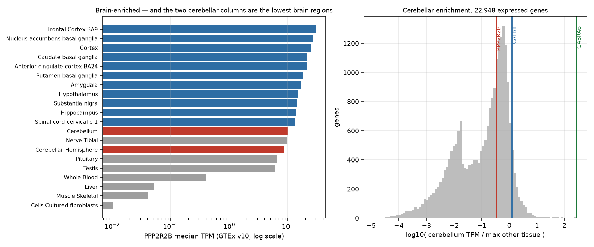
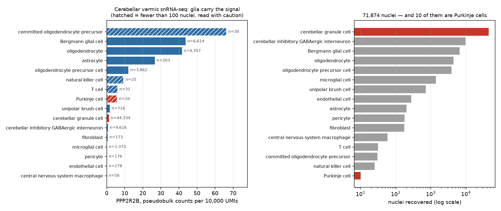

# Lab 12 — PPP2R2B expression and isoforms

> **Time:** ~55 min · **Before this:** [Ch 47–48](../part-10-functional-genomics/47-rna-seq.md) ·
> [lab-06](lab-06-rna-seq.md) · [lab-09](lab-09-single-cell.md) ·
> [D4 SCA12 I](../part-D-sca12/D4-sca12-from-repeat-to-phenotype.md)
>
> **Statistics used here:** [S3 Sampling and estimation](../part-S-statistics/S3-sampling-and-estimation.md) ·
> [S4 Hypothesis testing](../part-S-statistics/S4-hypothesis-testing.md)

[D4](../part-D-sca12/D4-sca12-from-repeat-to-phenotype.md) leaves you holding five candidate
mechanisms for SCA12 and no winner. The oldest of them — Hypothesis A, that the expanded CAG
tract acts as a *cis* element raising *PPP2R2B* output until the cerebellum cannot cope — makes
a prediction that sounds testable from public data alone: if the disease is a dosage disease of
the cerebellum, *PPP2R2B* should look like a cerebellar gene. In this lab you go and find out.
Three descents in resolution — whole tissue, transcript, single nucleus — each answering a
sharper version of the question, each running on a laptop from open-access files. Every number
below was produced on this machine, and the answer to the headline question is **no**, which is
far more interesting than yes would have been.

The lab leans on medians, proportions and small-sample uncertainty, and assumes none of it.
Boxes marked **The statistics here** say what the printed number assumes and point at the
statistics chapter that derives it — [S3](../part-S-statistics/S3-sampling-and-estimation.md)
for estimators and sampling error, [S4](../part-S-statistics/S4-hypothesis-testing.md) for what
a comparison can and cannot conclude.

```bash
# GENOMICS is exported in lab-00. In a fresh shell, set it again:
#   export GENOMICS=/path/to/learn-genomics
cd "$GENOMICS" && source .venv/bin/activate && cd labs/data
uv pip install scanpy
```

**Tool note.** Everything here is `curl` plus the Python stack lab-06 and lab-09 already
installed; the `uv pip install scanpy` line is a no-op if you have done lab-09. Versions used here: `pandas 3.0.5`, `numpy 2.5.2`, `matplotlib 3.11.1`,
`scanpy 1.12.3`, `anndata 0.13.2`. No genome, no aligner, no index. Total download for the whole
lab: **8.8 MB + 431 MB + 164 MB ≈ 604 MB**, of which the two single-cell files are §4 and are
optional if your laptop is short of memory — the fallback in §4 keeps the argument intact.

---

## 1. Write the hypothesis down as a measurement

Before touching a file, commit to what would count as evidence. Hypothesis A, as
[D4](../part-D-sca12/D4-sca12-from-repeat-to-phenotype.md) states it, is a chain: the expanded
repeat sits in the 5′ region of *PPP2R2B*, raises transcription of the repeat-bearing
transcript, and the extra B55β poisons cerebellar neurons. Three links, and public expression
data from **healthy donors** can only speak to the background conditions of the third.

| What Hypothesis A needs | What open expression data can say | Where in this lab |
|---|---|---|
| The gene is expressed in the tissue that degenerates | Directly measurable | §2 |
| It is expressed there *preferentially* — enough for a dosage change to bite there and nowhere else | Directly measurable, and this is the load-bearing claim | §2, §4 |
| The repeat sits in the transcript that dominates that tissue | Measurable at transcript level, with caveats | §3 |
| The cells that die express it | Needs single-cell resolution | §4 |
| The **expanded** allele raises output | **Not measurable here at all** — every donor in these datasets is a control | §5 |

Notice the shape of that table. The last row is the hypothesis; the rest are its
preconditions. A lab that can only test preconditions can **falsify** by knocking one out, and
can never **confirm**. That asymmetry is the whole design, and §5 is where you have to be honest
about it.

The prediction to write on a sticky note now, before you have the answer: *if SCA12 is a
cerebellar dosage disease, then* PPP2R2B *median expression in cerebellum should exceed other
brain regions, and should be concentrated in the cerebellar neurons that die.*

## 2. Tissue level: is *PPP2R2B* cerebellum-enriched? ★

GTEx v10 publishes one small file that answers this: the median TPM of every gene in every
tissue. 8.8 MB, no registration, no API key.

```bash
curl -sL -O https://storage.googleapis.com/adult-gtex/bulk-gex/v10/rna-seq/GTEx_Analysis_v10_RNASeQCv2.4.2_gene_median_tpm.gct.gz
ls -l GTEx_Analysis_v10_RNASeQCv2.4.2_gene_median_tpm.gct.gz
```

```
-rw-r--r--  1 user  staff  8846936 GTEx_Analysis_v10_RNASeQCv2.4.2_gene_median_tpm.gct.gz
```

### Two ways to misread the file, both worth hitting

Read it the obvious way first:

```bash
python -c "
import pandas as pd
d = pd.read_csv('GTEx_Analysis_v10_RNASeQCv2.4.2_gene_median_tpm.gct.gz', sep='\t')
print(d.shape)
"
```

```
pandas.errors.ParserError: Error tokenizing data. C error: Expected 2 fields in line 3, saw 70
```

That is the **GCT format** announcing itself. A `.gct` is a TSV with a two-line preamble: line 1
is a version string (`#1.2`), line 2 is `<n_rows>\t<n_cols>`, and the real header is line 3.
Pandas saw a two-field line 2, decided the table had two columns, then met 70 fields. Skip the
preamble and it parses:

```bash
python - <<'PY'
import pandas as pd
d = pd.read_csv('GTEx_Analysis_v10_RNASeQCv2.4.2_gene_median_tpm.gct.gz', sep='\t', skiprows=2)
print('genes x columns:', d.shape[0], 'x', d.shape[1]-2)
print('rows whose Name is exactly ENSG00000156475:',
      int((d.Name == 'ENSG00000156475').sum()))
print('rows whose Name starts with it            :',
      int(d.Name.str.startswith('ENSG00000156475').sum()))
print('the value actually stored                 :',
      d.loc[d.Name.str.startswith('ENSG00000156475'), 'Name'].item())
PY
```

```
genes x columns: 59033 x 68
rows whose Name is exactly ENSG00000156475: 0
rows whose Name starts with it            : 1
the value actually stored                 : ENSG00000156475.19
```

> **A gene ID without its version is not the ID in the file.** *PPP2R2B* is
> `ENSG00000156475`, and GTEx v10 stores `ENSG00000156475.19` — the GENCODE version suffix that
> increments whenever the gene model is revised. An exact-match join returns **zero rows and no
> error**, which in a pipeline reads as "the gene is not expressed" rather than "your key was
> wrong". Either strip the suffix on both sides or match on the `Description` symbol column,
> and never let a lookup that returns nothing pass silently.

### The answer

68 columns is not 68 tissues: 54 are primary tissues and 14 are laser-capture sub-columns
(`Liver_Hepatocyte`, `Pancreas_Islets`, `Stomach_Mucosa` and so on) that would double-count
their parent organ. Drop them, then rank.

```bash
python - <<'PY'
import pandas as pd, numpy as np
LCM = ['Colon_Transverse_Mixed_Cell','Colon_Transverse_Mucosa','Colon_Transverse_Muscularis',
       'Liver_Hepatocyte','Liver_Mixed_Cell','Liver_Portal_Tract','Pancreas_Acini',
       'Pancreas_Islets','Pancreas_Mixed_Cell',
       'Small_Intestine_Terminal_Ileum_Lymphode_Aggregate',
       'Small_Intestine_Terminal_Ileum_Mixed_Cell','Stomach_Mixed_Cell','Stomach_Mucosa',
       'Stomach_Muscularis']
d = pd.read_csv('GTEx_Analysis_v10_RNASeQCv2.4.2_gene_median_tpm.gct.gz', sep='\t', skiprows=2)
X = d.set_index('Description').iloc[:, 1:].astype(float).drop(columns=LCM)
X.to_csv('gtex_v10_primary.tsv', sep='\t')     # the rest of §2 reuses this
row   = X.loc['PPP2R2B']
brain = [t for t in X.columns if t.startswith('Brain')]
other = [t for t in X.columns if not t.startswith('Brain')]
print('primary tissues:', X.shape[1], ' brain columns:', len(brain))
print(row[brain].sort_values(ascending=False).round(2).to_string())
print('\nmedian across the %d non-brain tissues: %.3f' % (len(other), np.median(row[other])))
print('cerebellum / median non-brain          : %.1f x' % (row['Brain_Cerebellum']/np.median(row[other])))
print('frontal cortex BA9 / cerebellum        : %.2f x' % (row['Brain_Frontal_Cortex_BA9']/row['Brain_Cerebellum']))
PY
```

```
primary tissues: 54  brain columns: 13
Brain_Frontal_Cortex_BA9                 29.71
Brain_Nucleus_accumbens_basal_ganglia    26.62
Brain_Cortex                             24.80
Brain_Caudate_basal_ganglia              21.52
Brain_Anterior_cingulate_cortex_BA24     21.17
Brain_Putamen_basal_ganglia              18.06
Brain_Amygdala                           16.70
Brain_Hypothalamus                       15.10
Brain_Substantia_nigra                   14.43
Brain_Hippocampus                        13.63
Brain_Spinal_cord_cervical_c-1           13.47
Brain_Cerebellum                         10.02
Brain_Cerebellar_Hemisphere               8.78

median across the 41 non-brain tissues: 0.520
cerebellum / median non-brain          : 19.3 x
frontal cortex BA9 / cerebellum        : 2.97 x
```

Read that ranking carefully, because it kills a story most reviews of SCA12 still carry.
***PPP2R2B* is emphatically brain-enriched** — 19× the median non-brain tissue, and roughly
1,000× cultured fibroblasts. And **the two cerebellar columns are the two lowest brain regions
in the list.** Frontal cortex carries three times as much. Whatever explains a cerebellar
phenotype, it is not that the cerebellum is where this gene lives.

### How enriched is "enriched"? Put it against every gene

"Cerebellum is 12th of 13" is a rank; it does not say how far from cerebellar-specific the gene
is. Score every expressed gene the same way — cerebellum against its best non-cerebellar tissue
— and read *PPP2R2B*'s position in that distribution.

```bash
python - <<'PY'
import pandas as pd, numpy as np
X  = pd.read_csv('gtex_v10_primary.tsv', sep='\t', index_col=0)
CB = 'Brain_Cerebellum'
expr  = X[X.max(axis=1) >= 5]                                  # a gene must be on somewhere
num   = expr[CB].clip(lower=0.1)                               # floor both sides: 0/0 is not a ratio
den   = expr.drop(columns=[CB, 'Brain_Cerebellar_Hemisphere']).max(axis=1).clip(lower=0.1)
ratio = num / den
print('genes scored:', len(ratio), '  median gene ratio: %.3f' % ratio.median())
print('genes with ratio > 5 (cerebellum-enriched by any reasonable reading):', int((ratio > 5).sum()))
for g in ['GABRA6', 'CBLN3', 'CALB1', 'PPP2R2A', 'PPP2R2B']:
    print(f'  {g:8s} ratio {ratio[g]:8.2f}   rank {int((ratio > ratio[g]).sum())+1:6d}')
PY
```

```
genes scored: 22948   median gene ratio: 0.194
genes with ratio > 5 (cerebellum-enriched by any reasonable reading): 144
  GABRA6     ratio   275.46   rank      1
  CBLN3      ratio    35.18   rank     21
  CALB1      ratio     1.24   rank   1443
  PPP2R2A    ratio     0.35   rank   8692
  PPP2R2B    ratio     0.34   rank   8947
```

Plot both halves — the profile, and the profile's place in the reference distribution:

```bash
python - <<'PY'
import pandas as pd, numpy as np, matplotlib
matplotlib.use('Agg'); import matplotlib.pyplot as plt
X  = pd.read_csv('gtex_v10_primary.tsv', sep='\t', index_col=0)
row, CB = X.loc['PPP2R2B'], 'Brain_Cerebellum'
brain = [t for t in X.columns if t.startswith('Brain')]
expr  = X[X.max(axis=1) >= 5]
ratio = (expr[CB].clip(lower=0.1)
         / expr.drop(columns=[CB, 'Brain_Cerebellar_Hemisphere']).max(axis=1).clip(lower=0.1))

fig, ax = plt.subplots(1, 2, figsize=(12.5, 5.2))
sel = brain + ['Nerve_Tibial','Pituitary','Testis','Whole_Blood','Liver','Muscle_Skeletal',
               'Cells_Cultured_fibroblasts']
v = row[sel].sort_values()
ax[0].barh(range(len(v)), v.values,
           color=['#c0392b' if t.startswith('Brain_Cerebell') else
                  '#2e6da4' if t.startswith('Brain') else '#9e9e9e' for t in v.index])
ax[0].set_yticks(range(len(v)))
ax[0].set_yticklabels([t.replace('Brain_','').replace('_',' ') for t in v.index], fontsize=8)
ax[0].set_xscale('log'); ax[0].grid(axis='x', alpha=.3)
ax[0].set_xlabel('PPP2R2B median TPM (GTEx v10, log scale)')
ax[0].set_title('Brain-enriched — and the two cerebellar columns are the lowest brain regions', fontsize=9.5)

ax[1].hist(np.log10(ratio), bins=90, color='#bdbdbd')
for gene, c in [('PPP2R2B','#c0392b'), ('CALB1','#2e6da4'), ('GABRA6','#1b7837')]:
    ax[1].axvline(np.log10(ratio[gene]), color=c, lw=2)
    ax[1].text(np.log10(ratio[gene]), ax[1].get_ylim()[1]*.95, ' '+gene,
               color=c, fontsize=8, rotation=90, va='top')
ax[1].axvline(0, color='k', ls=':', lw=1); ax[1].grid(alpha=.3)
ax[1].set_xlabel('log10( cerebellum TPM / max other tissue )'); ax[1].set_ylabel('genes')
ax[1].set_title('Cerebellar enrichment, 22,948 expressed genes', fontsize=9.5)
plt.tight_layout(); plt.savefig('sca12_gtex_tissue.png', dpi=140)
PY
```



*GABRA6* — the granule-cell GABA<sub>A</sub> receptor subunit — is the **single most
cerebellum-enriched of the 22,948 genes scored here**, at 275× — rank 1 by this score. *PPP2R2B*
sits at 0.34×, rank 8,947 of 22,948 — modestly above the median expressed gene (0.194), and still
far below 1, which is what matters: the cerebellum carries a third of what this gene's best other
tissue does. Its own paralogue *PPP2R2A*, which
causes no ataxia, scores essentially the same.

Three things to hold simultaneously:

1. **Brain-enrichment is real and large.** A ~19-fold margin over median tissue is not noise, and
   it explains why *PPP2R2B* disease is neurological rather than systemic.
2. **Cerebellum-enrichment is absent.** Not weak — absent, at the level of the whole tissue.
3. **Therefore the cerebellar phenotype is a selective-vulnerability problem, not an expression
   problem.** [D1](../part-D-sca12/D1-neurons-and-the-cerebellum.md) sets out why a cell can die
   from a gene it expresses no more than its neighbours do; this measurement is what forces you
   into that chapter rather than letting you off with "the gene is a cerebellar gene".

> **The statistics here.** Every number in this section is a **median**, and medians do not
> behave like means. GTEx's median TPM is the middle value across donors for that tissue — a
> robust location estimate, deliberately insensitive to the one donor with a spectacular
> outlier, and therefore **not** an estimate you can add, average or subtract
> ([S3 §2](../part-S-statistics/S3-sampling-and-estimation.md) on estimators and what each one is
> resistant to). §3 shows the arithmetic consequence directly. The file also publishes no spread
> at all — no interquartile range, no *n* per tissue — so a two-fold difference between two
> tissue medians here comes with **no attached uncertainty**, and treating it as a tested
> difference is a category error ([S4 §3](../part-S-statistics/S4-hypothesis-testing.md)). What
> justifies the conclusion above is not one comparison but the *shape* of the whole ranking: 13
> brain regions in a consistent order with the cerebellum at the bottom, and a
> 22,948-gene reference distribution that puts *PPP2R2B* in the middle of it.

> **The confound you have just walked into.** A bulk tissue value is a mixture — the weighted
> average of every cell type in the punch, weighted by how much RNA each contributes
> ([Ch 48 §1](../part-10-functional-genomics/48-single-cell-and-spatial.md) works the arithmetic
> and shows that two completely different mechanisms give the same bulk number). The cerebellum
> is the worst possible tissue for this: its neuron count is dominated by granule cells to a
> degree no other brain region approaches, so the standard expectation is that a bulk cerebellar
> TPM is close to a granule-cell TPM with everything else diluted into it. A gene expressed
> strongly and *only* in Purkinje cells would be invisible in this file. **What §2 rules out is
> cerebellum-level enrichment; it cannot rule out cell-type-level enrichment**, and the formal
> name for the correction is deconvolution
> ([Ch 47 §7](../part-10-functional-genomics/47-rna-seq.md)) — which §4 sidesteps by measuring
> the cell types directly, and while doing so overturns the standard expectation for this
> particular gene.

## 3. Transcript level: which isoform carries the repeat?

[D4](../part-D-sca12/D4-sca12-from-repeat-to-phenotype.md) makes a point about the locus that
this section turns into a measurement: *PPP2R2B* has many alternative first exons
([Ch 06 §9](../part-01-molecular-foundations/06-rna-processing.md)), and the
repeat's annotation — promoter, 5′ UTR, or nothing to do with this transcript at all — depends
on which transcript you ask about. Hypothesis A needs the repeat to sit in the transcript that
actually dominates the cerebellum. Go and check.

There is no median-transcript flat file in the v10 bucket, and the full transcript TPM matrix is
4.34 GB, so the laptop route is the GTEx portal API.

### The answer that is wrong because you believed the first page

```bash
curl -s "https://gtexportal.org/api/v2/expression/medianTranscriptExpression?gencodeId=ENSG00000156475.19&datasetId=gtex_v10&itemsPerPage=250" -o tx_page0.json
python - <<'PY'
import json, pandas as pd
d = json.load(open('tx_page0.json'))
print('paging_info:', d['paging_info'])
rows = pd.DataFrame(d['data'])
cb = rows[rows.tissueSiteDetailId == 'Brain_Cerebellum'].sort_values('median', ascending=False)
print('cerebellum rows returned:', len(cb))
print(cb[['transcriptId','median']].head(3).to_string(index=False))
PY
```

```
paging_info: {'numberOfPages': 5, 'page': 0, 'maxItemsPerPage': 250, 'totalNumberOfItems': 1134}
cerebellum rows returned: 19
     transcriptId  median
ENST00000504198.5    6.26
ENST00000394413.7    2.97
ENST00000394411.9    2.38
```

That looks like a complete answer and is not one. 21 transcripts × 54 tissues = **1,134 rows**,
and the API returned 250. It told you so, in `paging_info`, in a field it is very easy to
discard while reaching for `['data']`. Tissues come back in alphabetical order, so page 0 ends
partway through `Brain_Cerebellum` — **19 of the 21 transcripts**, cut off mid-tissue. Fetch all
five pages:

```bash
python - <<'PY'
import json, urllib.request, pandas as pd
rows = []
for p in range(5):
    u = ("https://gtexportal.org/api/v2/expression/medianTranscriptExpression"
         f"?gencodeId=ENSG00000156475.19&datasetId=gtex_v10&itemsPerPage=250&page={p}")
    rows += json.load(urllib.request.urlopen(u))['data']
d = pd.DataFrame(rows)
d.to_csv('ppp2r2b_tx_medians.tsv', sep='\t', index=False)
print('rows', len(d), ' transcripts', d.transcriptId.nunique(), ' tissues', d.tissueSiteDetailId.nunique())
assert len(d) == d.transcriptId.nunique() * d.tissueSiteDetailId.nunique()   # the check page 0 fails

cb = d[d.tissueSiteDetailId == 'Brain_Cerebellum'].sort_values('median', ascending=False)
print(cb[['transcriptId','median']].head(4).to_string(index=False))

page0 = {r['transcriptId'] for r in json.load(open('tx_page0.json'))['data']
         if r['tissueSiteDetailId'] == 'Brain_Cerebellum'}
print('\nmissing from page 0:', sorted(set(cb.transcriptId) - page0))
PY
```

```
rows 1134  transcripts 21  tissues 54
     transcriptId  median
ENST00000530902.5    9.03
ENST00000504198.5    6.26
ENST00000394413.7    2.97
ENST00000394411.9    2.38

missing from page 0: ['ENST00000530902.5', 'ENST00000532154.5']
```

**The transcript truncated off page 0 was the most abundant one in the cerebellum.** Silent
truncation does not corrupt data randomly; it corrupts it in whatever order the server happened
to use, and here that put the top answer just past the cut. This is the same class of error as
lab-06's replicate trap: nothing fails, nothing warns, and the conclusion is wrong.

### Where does each transcript start, relative to the repeat?

Now join the abundances to structure. The repeat, per
[lab-11](lab-11-repeat-genotyping.md), is **chr5:146,878,728–146,878,759 (GRCh38)** in
1-based inclusive coordinates (STRchive's interval; the ExpansionHunter catalog's is 2 bp
shorter — hold that thought). *PPP2R2B* is on the **minus** strand, so a transcript's start site
is its higher coordinate.

```bash
curl -s -H "Content-Type:application/json" \
  "https://rest.ensembl.org/lookup/id/ENSG00000156475?expand=1" -o ppp2r2b_ensembl.json
python - <<'PY'
import json, pandas as pd
g = json.load(open('ppp2r2b_ensembl.json'))
REP = (146878728, 146878759)                      # 1-based inclusive, GRCh38
print('gene', g['seq_region_name'], g['start'], '-', g['end'], 'strand', g['strand'],
      '  transcripts in current Ensembl:', len(g['Transcript']))
tx  = pd.read_csv('ppp2r2b_tx_medians.tsv', sep='\t')
piv = tx.pivot_table(index='transcriptId', columns='tissueSiteDetailId', values='median')

def describe(t):
    exons = sorted(t['Exon'], key=lambda e: -e['end'])      # minus strand: exon 1 is highest
    e1 = exons[0]
    overlap  = max(0, min(e1['end'], REP[1]) - max(e1['start'], REP[0]) + 1)
    intronic = all(e['end'] < REP[0] or e['start'] > REP[1] for e in exons) and t['end'] > REP[1]
    return t['end'], t['end'] - REP[1], overlap, ('intronic' if intronic else '-')

info = {t['id']: describe(t) for t in g['Transcript']}
rows = []
for tid in piv.index:
    if tid.split('.')[0] not in info: continue
    tss, dist, ov, note = info[tid.split('.')[0]]
    rows.append((tid, round(piv.loc[tid, 'Brain_Cerebellum'], 2),
                 round(piv.loc[tid, 'Brain_Frontal_Cortex_BA9'], 2), tss, dist, ov, note))
df = pd.DataFrame(rows, columns=['transcript', 'cerebellum_TPM', 'frontalBA9_TPM',
                                 'TSS', 'TSS_minus_repeat_end', 'exon1_overlap_bp', 'repeat_is'])
print(df.sort_values('cerebellum_TPM', ascending=False).head(8).to_string(index=False))

carry = df[df.exon1_overlap_bp > 0]
for tissue, col in [('cerebellar', 'cerebellum_TPM'), ('frontal-cortex', 'frontalBA9_TPM')]:
    print('\nrepeat-bearing exon 1: %.2f of %.2f %s TPM (%.0f%%)'
          % (carry[col].sum(), df[col].sum(), tissue, 100*carry[col].sum()/df[col].sum()))
print('\nsum of transcript medians, cerebellum: %.2f — gene-level median from section 2: 10.02'
      % df.cerebellum_TPM.sum())
PY
```

```
gene 5 146580742 - 147084784 strand -1   transcripts in current Ensembl: 37
        transcript  cerebellum_TPM  frontalBA9_TPM       TSS  TSS_minus_repeat_end  exon1_overlap_bp repeat_is
 ENST00000530902.5            9.03           33.90 146878894                   135                32         -
 ENST00000504198.5            6.26            8.70 147081543                202784                 0  intronic
 ENST00000394413.7            2.97            3.66 147081429                202670                 0  intronic
 ENST00000394411.9            2.38            5.42 146878757                    -2                30         -
 ENST00000453001.5            0.93            3.96 146878785                    26                32         -
ENST00000336640.10            0.89           16.16 147055974                177215                 0  intronic
 ENST00000504565.1            0.49            0.63 147081293                202534                 0  intronic
 ENST00000508267.5            0.36            0.60 147081470                202711                 0  intronic

repeat-bearing exon 1: 12.34 of 23.53 cerebellar TPM (52%)

repeat-bearing exon 1: 43.28 of 77.47 frontal-cortex TPM (56%)

sum of transcript medians, cerebellum: 23.53 — gene-level median from section 2: 10.02
```

This is the locus anatomy of [D4](../part-D-sca12/D4-sca12-from-repeat-to-phenotype.md), derived
rather than asserted. Four distinct relationships between one repeat and one gene:

| Transcript | TSS (GRCh38) | Repeat's position in it | Cerebellum TPM |
|---|---|---|---|
| ENST00000530902.5 | 146,878,894 | entirely inside exon 1, 135 bp downstream of the TSS — **5′ UTR** | **9.03** |
| ENST00000453001.5 | 146,878,785 | entirely inside exon 1, 26 bp downstream of the TSS — **5′ UTR** | 0.93 |
| ENST00000394411.9 | 146,878,757 | **straddles the TSS** — 30 bp transcribed, 2 bp upstream | 2.38 |
| ENST00000504198.5 | 147,081,543 | 203 kb away, deep in **intron 2** | 6.26 |

The 1999 report placed the tract 133 nt upstream of the then-known start site, i.e. in the
promoter; later work moved it into the 5′ UTR. **Both readings are correct, about different
transcripts**, and you can now see exactly why: transcripts starting a few hundred bases apart
put the same 32 bp in the promoter, in the 5′ UTR, or in an intron
([Ch 22 §2](../part-04-gene-regulation/22-eukaryotic-transcriptional-regulation.md) on why those
are different regulatory parts). Sharper still — for
ENST00000394411.9 the classification depends on **two base pairs** of locus definition. Under
STRchive's 32 bp interval the repeat overlaps that transcript's first exon by 30 bp with 2 bp
upstream; under the ExpansionHunter catalog's 30 bp interval the repeat lies entirely within the
first exon. Two authoritative databases, one locus, and an annotation that flips on the
boundary convention.

One thing this table deliberately does **not** do: attach the literature's isoform names to
these accessions. The SCA12 papers argue in terms of Bβ1 and Bβ2, and of first-exon variants
labelled 7B7D and 7C7D in the original *PPP2R2B* exon numbering
([D4](../part-D-sca12/D4-sca12-from-repeat-to-phenotype.md)). No database column carries that
mapping, and guessing which ENST is "Bβ1" from abundance and rough position is exactly the kind
of inference that turns into a citation. If you need the mapping, derive it — pull the exon
structures and the protein N-termini and match them against the figures in the primary papers —
and if you cannot, say the accessions and stop. **A transcript identifier is not an isoform
name, and the translation between them is work.**

Three further readings, none of which help Hypothesis A:

**The repeat-bearing transcripts are about half the gene's output — in both tissues.** 52% in
cerebellum, 56% in frontal cortex. If the repeat's effect ran through a cerebellum-specific
preference for the repeat-bearing first exon, that ratio would differ. It does not.

**The most abundant repeat-bearing transcript is 3.8× higher in frontal cortex than in
cerebellum** (33.90 against 9.03). Descending from gene level to transcript level did not
recover cerebellar specificity; it made the cortical bias larger.

**The medians do not add up, and should not.** Transcript medians sum to 23.53 in the cerebellum
while the gene median is 10.02. That is not an inconsistency in GTEx: the median of a sum is not
the sum of medians, and each transcript's median is taken over donors independently, so
different donors supply the middle value in different rows. **Never sum a column of published
medians and compare it to a published total** ([S3 §2](../part-S-statistics/S3-sampling-and-estimation.md)).
The percentages above survive only because numerator and denominator are computed the same wrong
way and the bias largely cancels — which is a reason to quote them to the nearest whole percent
and no finer.

> **Why isoform-level numbers deserve less trust than gene-level ones.** Every transcript TPM
> above is the output of an expectation-maximisation step that distributed short fragments among
> 21 candidate isoforms sharing most of their sequence — the same EM you ran in
> [lab-06 §4](lab-06-rna-seq.md), at far worse odds. Reconstructing full-length isoforms from
> short fragments is genuinely underdetermined: the data do not contain the answer, and the
> estimate is the model's best guess given a prior
> ([Ch 47 §7](../part-10-functional-genomics/47-rna-seq.md)). Three consequences bite here.
> **Isoforms differing only in a first exon are the hardest case**, because only fragments
> landing on the distinguishing exon carry any information and every other read is uninformative
> between them — and that is precisely the distinction this section rests on. **Annotation drift
> moves the answer**: RefSeq lists 10 transcript variants for this gene, GTEx v10 quantified 21,
> the current Ensembl release models 37, so you are not measuring the gene, you are measuring
> the gene *as annotated by one release*. **And the distinguishing exon is the one containing a
> trinucleotide repeat** — low-complexity sequence, where both alignment and coverage are at
> their least trustworthy. Long reads sequence whole molecules and largely dissolve the problem
> ([Ch 40 §3](../part-09-genomics/40-sequencing-technologies.md)) — the same argument
> [lab-11](lab-11-repeat-genotyping.md) makes about sizing the repeat itself.

## 4. Cell types: who inside the cerebellum transcribes it? ★★

§2 could not distinguish "the gene is uniformly modest across cerebellar cells" from "the gene is
concentrated in Purkinje cells and diluted by granule cells". This is the question that decides
whether Hypothesis A survives at cell-type resolution, and it needs single nuclei.

The Human Brain Cell Atlas (Siletti et al. 2023) publishes each dissection as a downloadable
`.h5ad`. Take the cerebellar vermis: 71,874 nuclei, 431 MB, no registration.

```bash
curl -sL -O https://datasets.cellxgene.cziscience.com/d8c637a7-1dba-40e1-90f2-ddfdbe03fd3b.h5ad
mv d8c637a7-1dba-40e1-90f2-ddfdbe03fd3b.h5ad cerebellar_vermis.h5ad
python - <<'PY'
import scanpy as sc, time, resource
t0 = time.time(); a = sc.read_h5ad('cerebellar_vermis.h5ad')
print('load %.1f s  shape %s  peak RSS %.2f GB'
      % (time.time()-t0, a.shape, resource.getrusage(resource.RUSAGE_SELF).ru_maxrss/1e9))
print(a.uns['title'])
print(a.obs['cell_type'].value_counts().head(8).to_string())
print('Purkinje cells:', int((a.obs.cell_type == 'Purkinje cell').sum()))
PY
```

```
load 3.6 s  shape (71874, 58232)  peak RSS 2.63 GB
Dissection: Cerebellum (CB) - Cerebellar Vermis - CBV
cell_type
cerebellar granule cell                        44334
cerebellar inhibitory GABAergic interneuron     9616
Bergmann glial cell                             6614
oligodendrocyte                                 4357
oligodendrocyte precursor cell                  3862
microglial cell                                 1373
unipolar brush cell                              716
endothelial cell                                 278
Purkinje cells: 10
```

Stop at that last line before doing anything quantitative. **Ten Purkinje cells out of 71,874.**
The cell type SCA12 destroys — the cell type this entire lab exists to ask about — is
0.014% of the atlas. The last subsection of §4 is about why, and what it costs you.

### Expression per cell type

The matrix `X` holds raw nuclear UMI counts (integer row sums, no `raw` slot, no layers), so
normalise before comparing anything. Pseudobulk is the right summary here: pool each cell type's
counts and divide by that type's pooled depth, which weights cells by information rather than
letting a shallow nucleus vote as loudly as a deep one.

```bash
python - <<'PY'
import scanpy as sc, numpy as np, pandas as pd
a   = sc.read_h5ad('cerebellar_vermis.h5ad')
n2i = pd.Series(a.var_names.values, index=a.var['feature_name'].astype(str).values)
col = lambda sym: np.asarray(a[:, n2i[sym]].X.todense()).ravel().astype('float64')
df  = pd.DataFrame({'ct'     : a.obs['cell_type'].astype(str).values,
                    'depth'  : np.asarray(a.X.sum(1)).ravel().astype('float64'),
                    'PPP2R2B': col('PPP2R2B'),
                    'CALB1'  : col('CALB1'),        # Purkinje marker
                    'GABRA6' : col('GABRA6')})      # granule marker
g     = df.groupby('ct')
cp10k = lambda sym: g.apply(lambda d: 1e4 * d[sym].sum() / d.depth.sum(), include_groups=False)
t = pd.DataFrame({'n'           : g.size(),
                  'median_UMI'  : g['depth'].median(),
                  'pct_detected': g['PPP2R2B'].apply(lambda s: 100 * (s > 0).mean()),
                  'PPP2R2B'     : cp10k('PPP2R2B'),
                  'CALB1'       : cp10k('CALB1'),
                  'GABRA6'      : cp10k('GABRA6')})
t['share_of_PPP2R2B'] = 100 * g['PPP2R2B'].sum() / df.PPP2R2B.sum()
print(t[t.n >= 100].sort_values('PPP2R2B', ascending=False).round(2).to_string())
print('\nPurkinje row (n = 10):')
print(t.loc[['Purkinje cell']].round(2).to_string())
print('\nwhole-dissection pseudobulk PPP2R2B: %.2f per 10,000 UMIs'
      % (1e4 * df.PPP2R2B.sum() / df.depth.sum()))
PY
```

```
                                                 n  median_UMI  pct_detected  PPP2R2B  CALB1  GABRA6  share_of_PPP2R2B
ct
Bergmann glial cell                           6614      5126.0         99.91    43.65   0.09    0.05             50.84
oligodendrocyte                               4357      4155.0         99.54    41.63   0.02    0.05             28.25
astrocyte                                      203      3446.0         97.54    26.66   0.00    0.07              0.70
oligodendrocyte precursor cell                3862      5198.5         95.60    12.00   0.02    0.05              8.19
unipolar brush cell                            716     13428.5         65.36     1.74   0.02    0.08              0.56
cerebellar granule cell                      44334      3964.5         31.69     1.29   0.02    2.61              8.43
cerebellar inhibitory GABAergic interneuron   9616     11895.5         32.08     0.64   0.09    0.75              2.43
fibroblast                                     173      3104.0          8.09     0.52   0.07    0.05              0.01
microglial cell                               1373      2332.0          4.37     0.18   0.03    0.07              0.02
pericyte                                       176      2924.5          5.11     0.16   0.00    0.05              0.00
endothelial cell                               278      3040.5          3.96     0.15   0.03    0.06              0.00

Purkinje row (n = 10):
                n  median_UMI  pct_detected  PPP2R2B  CALB1  GABRA6  share_of_PPP2R2B
ct
Purkinje cell  10     59477.0          80.0      5.8   7.44    0.22              0.11

whole-dissection pseudobulk PPP2R2B: 7.46 per 10,000 UMIs
```

Plot it beside the cell census that produced it — a bar chart of cell-type means without the
counts is the single most misleading figure in single-cell work:

```bash
python - <<'PY'
import scanpy as sc, numpy as np, pandas as pd, matplotlib
matplotlib.use('Agg'); import matplotlib.pyplot as plt
a   = sc.read_h5ad('cerebellar_vermis.h5ad')
n2i = pd.Series(a.var_names.values, index=a.var['feature_name'].astype(str).values)
df  = pd.DataFrame({'ct'     : a.obs['cell_type'].astype(str).values,
                    'depth'  : np.asarray(a.X.sum(1)).ravel().astype('float64'),
                    'PPP2R2B': np.asarray(a[:, n2i['PPP2R2B']].X.todense()).ravel().astype('float64')})
g = df.groupby('ct')
t = pd.DataFrame({'n': g.size(),
                  'cp10k': g.apply(lambda d: 1e4*d.PPP2R2B.sum()/d.depth.sum(), include_groups=False)})
t = t[t.n >= 10].sort_values('cp10k')
hot = ('Purkinje cell', 'cerebellar granule cell')

fig, ax = plt.subplots(1, 2, figsize=(12.8, 5.4))
bars = ax[0].barh(range(len(t)), t.cp10k,
                  color=['#c0392b' if i in hot else '#2e6da4' for i in t.index])
for i, (idx, r) in enumerate(t.iterrows()):
    if r.n < 100:                                  # too few nuclei to interpret
        bars[i].set_hatch('///'); bars[i].set_edgecolor('white')
    ax[0].text(r.cp10k + 1, i, f'n={int(r.n):,}', va='center', fontsize=7, color='#444444')
ax[0].set_yticks(range(len(t))); ax[0].set_yticklabels(t.index, fontsize=8)
ax[0].set_xlim(0, 78); ax[0].grid(axis='x', alpha=.3)
ax[0].set_xlabel('PPP2R2B, pseudobulk counts per 10,000 UMIs')
ax[0].set_title('Cerebellar vermis snRNA-seq: glia carry the signal\n'
                '(hatched = fewer than 100 nuclei, read with caution)', fontsize=9)

n = df.groupby('ct').size().sort_values(); n = n[n >= 10]
ax[1].barh(range(len(n)), n.values,
           color=['#c0392b' if i in hot else '#9e9e9e' for i in n.index])
ax[1].set_yticks(range(len(n))); ax[1].set_yticklabels(n.index, fontsize=8)
ax[1].set_xscale('log'); ax[1].grid(axis='x', alpha=.3)
ax[1].set_xlabel('nuclei recovered (log scale)')
ax[1].set_title('71,874 nuclei — and 10 of them are Purkinje cells', fontsize=9)
plt.tight_layout(); plt.savefig('sca12_cerebellum_celltypes.png', dpi=140)
PY
```



The marker columns confirm the labels before you believe anything else: *CALB1* at 7.44 in
Purkinje cells and ≈0 everywhere else, *GABRA6* highest in granule cells. The annotation is
doing what it says.

Now the result, and it is not the result anyone expects:

**In this dissection *PPP2R2B* is a glial transcript.** Bergmann glia (43.65) and
oligodendrocytes (41.63) carry more than 30× the granule-cell level (1.29), and between them supply
**79% of every *PPP2R2B* UMI in the tissue** while making up 15% of the nuclei. Granule cells,
62% of the nuclei, supply 8%.

**The bulk-dilution story from §2 was right in form and wrong in detail.** The standard caution
is that bulk cerebellum is a granule-cell measurement. In nuclear RNA, at least, it is not: the
signal for *this gene* is a Bergmann-glia-and-oligodendrocyte signal with granule cells diluting
it downward. Carrying that to a bulk whole-tissue TPM needs one more ingredient — a per-cell-type
total-RNA weight — which snRNA-seq cannot supply, because it discards the cytoplasm, and the
discarded compartment is largest in exactly the neurons under suspicion here. **Which cell type
dominates a bulk value is per-gene**, set by the product of abundance and per-cell expression,
and cannot be read off the tissue's cell census alone.

**Purkinje cells are not the answer either.** At 5.80 they sit above granule cells and well
below the glia — from ten nuclei, which is the next subsection.

### Replicate it in the other dissection

One dissection, three donors, one atlas. Before you say any of this out loud, run it again on the
lateral hemisphere file (164 MB, 28,028 nuclei):

```bash
curl -sL -O https://datasets.cellxgene.cziscience.com/8e5b2509-5b4c-4a9e-895e-b3749849ae1a.h5ad
mv 8e5b2509-5b4c-4a9e-895e-b3749849ae1a.h5ad lateral_hemisphere.h5ad
python - <<'PY'
import scanpy as sc, numpy as np, pandas as pd
a   = sc.read_h5ad('lateral_hemisphere.h5ad')
n2i = pd.Series(a.var_names.values, index=a.var['feature_name'].astype(str).values)
df  = pd.DataFrame({'ct'     : a.obs['cell_type'].astype(str).values,
                    'depth'  : np.asarray(a.X.sum(1)).ravel().astype('float64'),
                    'PPP2R2B': np.asarray(a[:, n2i['PPP2R2B']].X.todense()).ravel().astype('float64')})
g = df.groupby('ct')
t = pd.DataFrame({'n': g.size(),
                  'PPP2R2B': g.apply(lambda d: 1e4*d.PPP2R2B.sum()/d.depth.sum(), include_groups=False)})
print(a.uns['title'], ' ', a.shape)
print(t[t.n >= 50].sort_values('PPP2R2B', ascending=False).round(2).to_string())
print('\nPurkinje cells recovered:', int(t.loc['Purkinje cell','n']),
      ' pseudobulk %.2f' % t.loc['Purkinje cell','PPP2R2B'])
PY
```

```
Dissection: Cerebellum (CB) - Lateral hemisphere of cerebellum - CBL   (28028, 58232)
                                                 n  PPP2R2B
ct
oligodendrocyte                               1103    50.13
Bergmann glial cell                           1070    44.86
astrocyte                                      108    27.61
oligodendrocyte precursor cell                 564    11.66
cerebellar granule cell                      23783     1.30
unipolar brush cell                             53     1.03
cerebellar inhibitory GABAergic interneuron    960     0.88
fibroblast                                      69     0.38
microglial cell                                218     0.15

Purkinje cells recovered: 1  pseudobulk 4.06
```

The ordering reproduces — Bergmann glia and oligodendrocytes at the top and an order of
magnitude clear of everything neuronal, granule cells near the bottom — with the top two swapped
and the granule-cell value landing within 1% of the vermis figure (1.30 against 1.29). Two
dissections, independently prepared, agreeing to two significant figures on the number that
matters. **And the second dissection recovered one Purkinje cell.**

### Ten nuclei, and what they can support

Two Purkinje-cell numbers are now on the table, and they carry very different weight.

**The cell count is a solid finding.** 10 of 71,874 and 1 of 28,028 is not a fluke of one prep;
it is what dissociation does to Purkinje cells. They are the largest neurons in the cerebellar
cortex, with dendritic arbours orders of magnitude beyond a granule cell's
([D1](../part-D-sca12/D1-neurons-and-the-cerebellum.md)), they are outnumbered by granule cells
by three to four orders of magnitude to begin with, and their nuclei survive tissue dissociation
poorly. Every step of the protocol is against them. Note the corroborating signature in the
table: the ten recovered nuclei have a **median depth of 59,477 UMIs, 15× the granule-cell
median** — these are enormous nuclei, and the few that survived are exactly the ones a QC
threshold on library size would keep ([Ch 48 §5](../part-10-functional-genomics/48-single-cell-and-spatial.md)
on the cell type a threshold silently deletes).

**The expression value is not a solid finding.** 5.80 per 10,000 UMIs is a pseudobulk over ten
nuclei from a three-donor dissection, and it is dominated by whichever two or three nuclei happened to be
deepest. You should not report it as "Purkinje cells express *PPP2R2B* at a third the Bergmann
level"; you should report it as "the ten Purkinje nuclei recovered here are not obviously the
high-expressing population, and ten nuclei cannot establish that they are not."

> **The statistics here.** Two different estimation problems sit in this table and only one of
> them is well-behaved. `pct_detected` is a **proportion**, and the standard error of a
> proportion from *n* observations is √(p(1−p)/n)
> ([S3 §3](../part-S-statistics/S3-sampling-and-estimation.md) on standard error, and
> [S3 §4](../part-S-statistics/S3-sampling-and-estimation.md) on the sampling distribution it is
> the width of) — at *n* = 10 and p = 0.8 that is
> 0.13, so "80% detected" carries an interval spanning roughly half to essentially all, and 8
> of 10 versus 10 of 10 is not a distinguishable difference. The pseudobulk value is worse
> behaved than that, because it is a **ratio of two sums** across cells with 15-fold different
> depths: it is not an average of ten equally-weighted observations, it is closer to an average
> of two or three. The honest move is not to attach a confidence interval to it but to refuse
> the comparison: a design with 10 cells in one arm and 6,614 in another has no power to detect
> anything short of an enormous difference
> ([S4 §5](../part-S-statistics/S4-hypothesis-testing.md) — compute the power of the test you
> just ran before reporting its null),
> so a null result here is **a failure to measure, not a measurement of no difference**. Report
> the *n* next to every cell-type mean, always. A bar chart without cell counts hides exactly
> this.

> **If 431 MB will not fit.** Every CELLxGENE dataset has a zero-install browser Explorer that
> colours the UMAP by any gene and shows expression by cell type. Open the Human Brain Cell Atlas
> collection, pick the cerebellar dissection, search *PPP2R2B*, and read the same qualitative
> ordering off the screen — glia high, granule cells low, Purkinje cells a handful of dots. Do
> the quantitative work in §2 and §3, which alone carry the lab's argument. What you lose is the
> cell counts, which is exactly what the subsection below says matters most, so read the Explorer's
> per-cluster *n* before drawing a conclusion from a colour.

## 5. What this lab can exclude, and what it cannot ★★

Return to §1's table with answers in it. The Grade column uses the ladder
[D4](../part-D-sca12/D4-sca12-from-repeat-to-phenotype.md) defines in its causal-chain section —
**Established** / **Supported** / **Conjectured** — so a grading made here carries straight onto
D4's arrows and back; the last row needs a fourth state below Conjectured, **no evidence either
way**, for a claim these data do not even argue about from adjacent facts.

| Precondition of Hypothesis A | Verdict from this lab | Grade |
|---|---|---|
| *PPP2R2B* is expressed in cerebellum | **Yes**, 10.02 TPM, brain-enriched ~19× over median tissue | Established — bulk medians across 54 tissues, corroborated by the Human Protein Atlas and by Bβ protein detectable only in brain (Strack et al. 1998) |
| It is *preferentially* expressed there | **No.** Lowest two of 13 brain regions; enrichment rank 8,947 of 22,948 genes | Established — falsifies the tidy version of the story, and the Human Protein Atlas independently records low regional specificity within brain |
| Cerebellar isoform usage favours the repeat-bearing transcript | **No.** 52% of cerebellar output against 56% cortical | Supported — short-read isoform estimates, one annotation release |
| The vulnerable cells are the high-expressing cells | **Not shown, and not testable here.** Glia dominate the signal; 10 Purkinje nuclei recovered | Conjectured — cell-type coverage, not biology |
| **The expanded allele raises *PPP2R2B* output** | **Untouched** | No evidence either way — the repeat was never genotyped in any of these donors, and none would be expected to carry an expansion |

That last row is the one that matters, and it is worth being blunt about why. **Every donor in
GTEx v10 and in the Siletti atlas is, for SCA12 purposes, a control.** These files record what
*PPP2R2B* does with two normal-range alleles. Hypothesis A is a claim about what an expanded
allele does — STRchive's pathogenic band is 51–78 repeats, but the floor is disputed, with
symptomatic patients reported at 40 and 42 and a proposed threshold of ≥43
([D4](../part-D-sca12/D4-sca12-from-repeat-to-phenotype.md)). No amount of resolution on control tissue — not transcript level,
not single nucleus, not spatial — measures the effect of an allele that is not present in the
sample. The measurement you have made is of the *stage*, not the *event*.

Two failure modes follow from forgetting that, and both appear in the SCA12 literature:

**Treating absence of cerebellar enrichment as evidence against SCA12 being a *PPP2R2B*
disease.** It is not. The genetic evidence — the founder haplotype, the segregation, the
threshold — is independent of expression, and
[D1](../part-D-sca12/D1-neurons-and-the-cerebellum.md) exists because ubiquitously expressed
genes routinely kill specific neurons. *HTT* is expressed everywhere and Huntington disease
destroys the striatum. What §2 refutes is a *shortcut explanation*, not the gene assignment.

**Treating expression in controls as a proxy for expression in patients.** The direction of the
change in patients is exactly what the field disagrees about
([D4](../part-D-sca12/D4-sca12-from-repeat-to-phenotype.md) tabulates the contradiction: one
group reports Bβ1 up, another reports most *PPP2R2B* isoforms down in patient-derived mature
neurons). Nothing in this lab adjudicates that, and a control-tissue atlas cannot.

### What would actually settle it

Three designs, in increasing order of what they would prove:

1. **A repeat-length eQTL.** Genotype the *PPP2R2B* CAG tract and quantify *PPP2R2B* expression
   **in the same individuals**, then regress expression on repeat length — the molecular-trait
   regression of [Ch 47 §7](../part-10-functional-genomics/47-rna-seq.md) and
   [Ch 52](../part-11-human-and-statistical-genomics/52-association-to-mechanism.md), with repeat
   length in place of a SNP dosage. The open-access files this lab used carry expression and no
   genotype at all, so the join cannot be made here; it requires the controlled-access layer.
   Even done well this measures normal-range variation, and extrapolating a slope fitted over
   4–31 repeats out to 60 is exactly the kind of extrapolation the course keeps warning about.
2. **Allele-specific expression in a heterozygous patient.** One patient carries a normal and an
   expanded allele in every cell, sharing a nucleus and a *trans* environment. Counting reads
   from each allele at a heterozygous site in the transcript isolates the *cis* effect with a
   perfect internal control ([Ch 47 §7](../part-10-functional-genomics/47-rna-seq.md)). The
   catch is severe and specific to repeats: **reference bias**. Reads from the expanded allele
   align worse near a tract that is not in the reference, so the expanded allele is
   systematically under-counted — biased in precisely the direction that would manufacture the
   "expansion silences the gene" result. Long reads, or a personalised reference, are not
   optional here.
3. **Single-nucleus RNA-seq of SCA12 post-mortem cerebellum, with matched controls, and enough
   Purkinje nuclei to count.** This is the experiment. It is also the one this lab has just
   shown to be hard for a reason that has nothing to do with rarity of the disease: §4 recovered
   11 Purkinje nuclei from 99,902 across two dissections of *healthy* cerebellum. A study
   powered to compare Purkinje-cell expression between patients and controls needs a protocol
   that recovers them — nuclear sorting, size-tolerant dissociation, or a spatial assay that
   never dissociates the tissue at all ([Ch 48 §13](../part-10-functional-genomics/48-single-cell-and-spatial.md)).
   And SCA12 post-mortem material is measured in single brains
   ([D5](../part-D-sca12/D5-sca12-population-clinic-therapy.md)), which sets the ceiling on how
   soon anyone runs it.

> **Write three sentences before you close the file.** One: what this lab's data can **exclude**.
> Two: what it **cannot** touch. Three: the **experiment** that would.
>
> A defensible set — compare yours against it rather than copying it. *Open control expression
> data exclude the explanation that SCA12 is cerebellar because* PPP2R2B *is a cerebellar gene:
> at tissue level the two cerebellar columns are the lowest of thirteen brain regions and the gene's
> cerebellar enrichment scores below 1, near the middle of the distribution of 22,948 expressed
> genes, and at transcript
> level the cerebellum shows no preference for the repeat-bearing first exon. They cannot say
> anything about the expanded allele, because no expanded allele exists in any donor here, and
> they cannot resolve the Purkinje cell, because two cerebellar dissections yielded eleven
> Purkinje nuclei between them. Settling it requires expression measured in carriers with their
> repeat lengths known in the same individuals — a repeat-length eQTL, or allele-specific
> expression within single heterozygous patients using reads long enough to escape reference
> bias at the tract.*

## Troubleshooting

| Symptom | Cause and fix |
|---|---|
| `ParserError: Expected 2 fields in line 3` | GCT preamble. `skiprows=2` |
| Gene lookup returns an empty frame, no error | GENCODE version suffix: the file stores `ENSG00000156475.19`. Match on prefix or on the `Description` symbol column, and assert the result is non-empty |
| Your tissue count is 68, not 54 | The 14 laser-capture sub-columns are still in. Drop them before any cross-tissue median or maximum, or organs with sub-columns get extra votes |
| `KeyError: 'PPP2R2B'` from the h5ad | CELLxGENE `.h5ad` files index `var` by Ensembl ID. Build the symbol → ID map from `a.var['feature_name']` rather than hard-coding an ID from memory |
| A transcript you expected is missing from the API result | Pagination. `paging_info` reports `numberOfPages`; loop until you have `totalNumberOfItems` rows and assert the count |
| Cell-type means look implausible for rare types | Check `n` per type in the same table. Anything under ~50 nuclei is a label, not a measurement |
| The h5ad download 404s | Content-addressed URLs rotate when a dataset is revised. Re-resolve from the collection page rather than retrying the dead link |
| `MemoryError` loading the 431 MB file | Peak RSS here was 2.63 GB. Use the 164 MB lateral-hemisphere file, which reproduces the whole result (§4), or the browser Explorer fallback. The 150 MB cerebellar-inhibitory supercluster file is smaller still but contains **only** interneurons, so it cannot make the across-cell-type comparison at all |
| Your TPMs differ from the ones printed here | Name the GTEx release. These are **v10**; v8 gives similar but not identical medians, and future releases will move them again |

## What you can now do

| Step | What ran | The number that mattered |
|---|---|---|
| §2 | GTEx v10 median-TPM GCT, 8.8 MB | Cerebellum **10.02 TPM**, 12th of 13 brain regions; enrichment rank **8,947 / 22,948** |
| §3 | GTEx portal API, 5 pages; Ensembl REST | Repeat-bearing exon 1 = **52%** of cerebellar output vs **56%** cortical; top transcript missed on page 0 |
| §4 | Siletti atlas, 2 dissections, scanpy | Bergmann glia + oligodendrocytes = **79%** of *PPP2R2B* UMIs; **10 Purkinje nuclei of 71,874** |
| §5 | — | Every donor is a control: **zero** evidence about the expanded allele |

The transferable lesson is not about SCA12. It is that **public data answer the question they
were collected to answer**, and the skill is stating precisely which question that is before
the plot seduces you into a different one. GTEx was built to describe normal human tissue
expression, and it does that superbly; asked "does the SCA12 expansion raise *PPP2R2B*?" it
returns a beautiful, well-normalised, entirely irrelevant answer.

---

## Check yourself

**1. A colleague plots *PPP2R2B* across GTEx, sees cerebellum at 10 TPM against 0.04 in skeletal muscle, and writes "*PPP2R2B* is a cerebellar gene, which explains the cerebellar phenotype of SCA12". Both numbers are correct. What is wrong with the sentence, and what would a correct version say?**

<details><summary>Answer</summary>

The comparison is against the wrong reference class. 10 TPM against 0.04 establishes
**brain**-enrichment, which nobody disputes and which explains only why the disease is
neurological. The claim being made is about the cerebellum *within* the brain, and that
comparison runs the other way: the cerebellum at 10.02 TPM is 12th of 13 GTEx brain regions,
below frontal cortex at 29.71, nucleus accumbens at 26.62 and every other region sampled. The
cerebellar hemisphere at 8.78 is 13th.

Scoring the whole transcriptome the same way makes it quantitative. Cerebellum against best
non-cerebellar tissue puts *GABRA6* at 275× (rank 1 of 22,948 expressed genes) and *PPP2R2B* at
0.34×, rank 8,947 — near the middle of the distribution, and well below the score of 1 that
even parity with one other tissue would require. Its paralogue *PPP2R2A*, which causes no ataxia,
scores 0.35×. "Cerebellar gene" has an operational meaning and *PPP2R2B* does not meet it.

A correct version: "*PPP2R2B* is strongly brain-enriched but not cerebellum-enriched; the
cerebellar phenotype of SCA12 is therefore an instance of selective neuronal vulnerability
rather than a consequence of where the gene is transcribed."

The general habit worth taking: whenever a paper says a gene is "enriched" somewhere, ask
*relative to what*, and check the rank rather than a ratio against the tissue where the gene is
least expressed. Any brain gene beats fibroblasts.

</details>

**2. §4 found *PPP2R2B* highest in Bergmann glia and oligodendrocytes, and low in granule cells. §2's standard caution was that bulk cerebellum is dominated by granule-cell RNA. Reconcile them, and say what the reconciliation implies for reading any bulk value.**

<details><summary>Answer</summary>

Both are about composition, and they do not contradict each other — the second is a statement
about the tissue, the first about one gene in it.

Bulk cerebellum *is* granule-cell-dominated by nuclei: 44,334 of 71,874 in the vermis dissection,
62%. But a bulk value is the sum of (cells × per-cell expression), not of cells. For
*PPP2R2B* the per-cell term runs the other way — per nucleus (cp10k × median depth / 10⁴),
Bergmann glia hold about 22.4 *PPP2R2B* counts against 0.51 in granule cells, a ≈44-fold gap
that overwhelms the abundance advantage. Note that the cp10k values alone (43.65 against 1.29)
are compositional fractions, not per-cell abundances; the `share_of_PPP2R2B` column is computed
from raw counts and so carries the depth-weighting correctly. The result:
Bergmann glia (9% of nuclei) supply 51% of *PPP2R2B* UMIs and oligodendrocytes (6%) supply 28%,
while granule cells (62%) supply 8%.

The implication is the useful part. **Which cell type dominates a bulk measurement is a
per-gene property**, determined by the product of abundance and expression, and cannot be read
off a tissue's cell census. "Bulk cerebellum ≈ granule cells" is a decent prior for a gene you
know nothing about and a bad assumption for any specific gene. The only way to know is to
decompose — deconvolution against a reference
([Ch 47 §7](../part-10-functional-genomics/47-rna-seq.md)) or direct single-cell measurement
([Ch 48](../part-10-functional-genomics/48-single-cell-and-spatial.md)).

A second implication for SCA12 specifically: if the dosage-sensitive cells were glia rather than
neurons, the mechanism would look quite different. This lab cannot decide that — RNA is not
protein, three donors is not a cohort, and one atlas is not a literature — but it is a
hypothesis this measurement generated and nobody's expression intuition would have.

</details>

**3. You have the cell-type table from §4 and want to report "Purkinje cells express *PPP2R2B* at 5.80 per 10,000 UMIs, well below Bergmann glia at 43.65". Why should you not, and what should the sentence say instead?**

<details><summary>Answer</summary>

Because 5.80 comes from **10 nuclei** and 43.65 from 6,614, and the comparison has no power to
support either "well below" or its negation.

Three specific problems. The pseudobulk value is a ratio of sums over cells whose depths differ
15-fold — the ten Purkinje nuclei have a median 59,477 UMIs against 3,964 for granule cells — so
it is effectively an average over the two or three deepest nuclei, not ten equally-weighted
observations. The detection rate that accompanies it, 80%, has a standard error of
√(0.8×0.2/10) = 0.13 at that sample size, so it is compatible with anything from about half to
all ([S3 §3](../part-S-statistics/S3-sampling-and-estimation.md)). And a comparison of 10
against 6,614 detects only enormous differences, so failing to see one is a **failure to
measure, not a measurement of no difference**
([S4 §5](../part-S-statistics/S4-hypothesis-testing.md)).

What to write instead: "Purkinje cells are essentially absent from these dissections — 10 of
71,874 nuclei in the vermis and 1 of 28,028 in the lateral hemisphere — so this dataset cannot
establish their *PPP2R2B* level. The question of Purkinje-cell enrichment remains open, and
answering it requires a protocol that recovers Purkinje nuclei."

The habit: put *n* beside every group mean, and when *n* is small enough that the mean is
uninterpretable, report the *n* as the finding. Here the count is genuinely more informative
than the expression value — it tells you why this question has not been settled.

</details>

**4. The §3 API call returned 250 rows and named the cerebellum's top isoform as ENST00000504198.5 at 6.26 TPM. The full result names ENST00000530902.5 at 9.03. Nothing errored. What class of bug is this, and what would you add to a pipeline so it cannot recur?**

<details><summary>Answer</summary>

Silent truncation: an API that returns a *valid, well-formed, incomplete* answer and reports the
incompleteness in a field you are free to ignore. The response carried
`paging_info: {'numberOfPages': 5, 'totalNumberOfItems': 1134}`, and 21 transcripts × 54
tissues = 1,134 rows, so page 0 held 22% of the data. Tissues come back alphabetically, so the
cut landed mid-`Brain_Cerebellum`, returning 19 of 21 transcripts — and one of the two omitted
rows was the highest-expressing transcript in the tissue.

The class is broader than pagination. It is the same failure mode as lab-06's replicate trap and
as this lab's own version-suffix join: **the operation succeeds, the output is the right shape,
and it is wrong.** Errors you can see are cheap; results that are quietly partial are what
propagate into papers.

The defence is an assertion at every boundary where the data could be truncated:

- After a paginated fetch, assert `len(rows) == paging_info['totalNumberOfItems']`, or loop
  until it holds. Never take `['data']` from page 0 alone.
- After any join or lookup, assert the result is non-empty and has the expected cardinality —
  this catches the `ENSG00000156475` versus `ENSG00000156475.19` failure in the same net.
- Where a total is knowable independently, check it. Here, 21 distinct `transcriptId` values ×
  54 distinct `tissueSiteDetailId` values should equal the row count exactly.

A sanity check on the science also catches it: the top isoform in cerebellum should plausibly
appear in other tissues too, and a transcript list that varies in length between tissues is a
tell that rows are missing rather than that biology differs.

</details>
