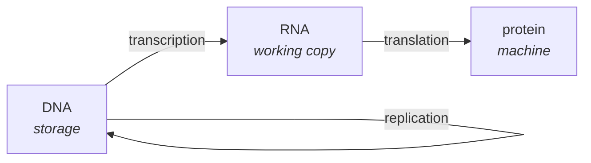
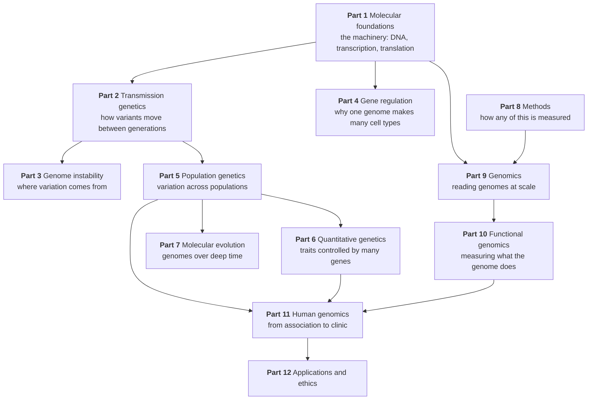

# 00 — The whole story

> **Before this:** nothing · **Time:** ~35 min

This chapter tells the entire subject at low resolution: how information is stored in a
cell, how it becomes a working organism, how it passes to the next generation, how it
changes, and how we read it. Every later chapter is a zoom into one region of this map.

Read it once now. Read it again after Part 4 — it will look completely different.

## What you'll be able to do

- Given one strand of a duplex, write the other, and say what that single redundancy buys for copying, repair and templated reading
- Trace information from DNA to a working protein, and explain why the cell reads a disposable copy rather than the protected original
- Explain why every cell in your body has the same genome but does different things, and name the cell types that genuinely break the rule
- Compute how many new mutations a child should carry from the per-base rate and the genome size, explain why trio studies report fewer, and distinguish what mutation and what recombination each contribute to variation
- Distinguish genotype from phenotype, explain why "dominant" says nothing about how common or how strong an allele is, and say why a trait running in a family is not yet evidence that it is genetic
- Explain what "evolution" means mechanically, in terms of allele frequencies, and classify a described change as the work of one of the four forces
- Explain why both "98% of the genome is junk" and "it's all functional" are wrong, from the protein-coding fraction and the non-coding gene counts

## The core idea

Life faces an engineering problem: **build a machine complex enough to survive, from
instructions small enough to copy reliably, and copy them with enough fidelity to preserve
what works but enough infidelity to keep exploring.**

Every solution has converged on the same architecture. A long linear molecule stores
information as a sequence of four chemical letters. That sequence is copied, in full, every
time a cell divides. Portions of it are transcribed on demand into a working copy, which is
translated into a protein — a molecular machine that does something. Which portions get read
depends on the cell's state, which depends on which proteins are already present, which
depends on which portions have been read. The system is a strange loop: **the instructions
build the machinery that reads the instructions.**

That loop is the whole subject. Genetics is the study of how information moves through it
across generations; genomics is what happened when we became able to read the entire
instruction set at once.

### A warning about the code analogy

You are going to be tempted — because you program — to think of the genome as source code.
The analogy is useful and I will use it. But its failures are exactly where the biology
lives, so let me spoil them now:

| The analogy suggests | Reality |
|---|---|
| Code is separate from data | No such separation. The same sequence is instruction, binding site, structural element, and raw material for the next mutation |
| A program has an entry point and runs | No entry point, no clock, no scheduler. Millions of processes proceed concurrently and stochastically, at rates set by chemistry |
| A blueprint specifies the result | It's closer to a recipe than a blueprint. Nothing in the genome is a picture of a finger. Structure emerges from local rules interacting |
| Bugs cause crashes | Most changes do nothing at all. A few are catastrophic. Predicting which is a central unsolved problem |
| You can version and roll back | There is no rollback. Every lineage carries the accumulated consequences of every ancestor's accidents |

Hold the analogy loosely and it will help you. Hold it tightly and it will mislead you at
every important juncture.

---

## 1. The storage medium

DNA is a long polymer. Its backbone is monotonous — the same sugar–phosphate unit repeating
— and hanging off that backbone is a sequence of four **bases**: adenine, cytosine, guanine,
thymine, written **A, C, G, T**.

The information is entirely in the *order* of those bases. Two bits per position.

The molecule is double-stranded, and this is the crucial structural fact: **A always pairs
with T, and G always pairs with C.** The two strands are therefore not independent — each is
a complete recipe for reconstructing the other. Written out:

```
5'-  A  T  G  C  G  T  A  C  -3'      "top" strand
     |  |  |  |  |  |  |  |
3'-  T  A  C  G  C  A  T  G  -5'      "bottom" strand — complementary, antiparallel
```

Everything else follows from that redundancy. Copying is possible because each strand
templates the other. Repair is possible because damage to one strand can be corrected by
reading across. Reading is possible because a machine can open the helix locally and use one
strand as a template.

The `5'` and `3'` labels mark the chemical asymmetry of the backbone: the two ends of a DNA
strand are chemically different, so a strand has direction, and the two strands run
**antiparallel**. This is not pedantry — it dictates why replication is messy
([Ch 04](../part-01-molecular-foundations/04-dna-replication.md)), why sequence is written
5'→3' by convention, and why a coordinate on the reverse strand needs care.

A human cell contains about **3.1 billion base pairs** per haploid set, and you have two
sets — one from each parent. At two bits a base that is roughly 750 MB of raw information,
which is to say: the entire specification of a human being is smaller than a video file, and
most of it is not specification at all.

## 2. Reading it: the central dogma

Information flows in a canonical direction:



**Transcription** copies a stretch of DNA into RNA — chemically similar, single-stranded,
short-lived. This is a working copy, not the master. It can be made in thousands of
identical units, used, and destroyed, without touching the original. Cheap, disposable
instances of an expensive, protected source.

**Translation** reads that RNA in non-overlapping groups of three bases — **codons** — and
builds a chain of amino acids. There are 64 possible codons and 20 amino acids, so the code
is redundant: several codons often mean the same amino acid. Three codons mean *stop*. One
means *start* (and also methionine).

That chain of amino acids folds into a specific three-dimensional shape, and the shape is
the function. Proteins are the actual machinery of the cell: they catalyse reactions, form
structures, transport cargo, transmit signals, and — closing the loop — bind DNA to control
which genes get transcribed next.

A **gene** is, loosely, a stretch of DNA that gets transcribed into a functional product.
Loosely, because the definition frays under examination — genes overlap, nest inside one
another, produce multiple different products, and thousands of them never make protein at
all. [Chapter 08](../part-01-molecular-foundations/08-proteins-and-gene-function.md) takes
the definition apart properly.

"Dogma" is a historical misnomer, and the arrow is not one-way in the way the name implies.
Retroviruses copy RNA back into DNA. RNA regulates and catalyses. But as a first-order
description of where information goes, it holds.

## 3. The part everyone underestimates: regulation

Here is the fact that reorganises everything.

**Every cell in your body contains the same genome.** A neuron and a liver cell and a skin
fibroblast all carry the same ~6.2 billion base pairs — two copies of the 3.1-billion-base
haploid set. They are radically different in shape, behaviour and lifespan — and the
difference is not in the information they hold. It is in **which parts they read**.

(One deliberate exception, worth knowing early: mature lymphocytes. B and T cells physically
cut out and rejoin segments of their antibody and T-cell-receptor loci as they develop, so
each one really does carry a genome that differs from the **germline** — the cell lineage that
ends up making eggs and sperm, and the only lineage whose changes are passed on — at those
loci ([Ch 18](../part-03-genome-instability/18-recombination-mechanisms.md)). **Somatic**
changes, meaning changes in any other lineage, die with the body that carries them; setting
those aside, lymphocytes are the main programmed rearrangement of the *sequence* itself.
Other cell types depart from the rule in cruder ways — red blood cells eject their nucleus
as they mature and end up carrying no genome at all, and liver, heart-muscle and
platelet-forming cells routinely carry extra whole copies of it.)

This is where the "blueprint" framing collapses and something more interesting appears. The
genome is not a description of an organism. It is closer to a vast conditional program in
which the running state determines which branches execute — and where the state is itself
the accumulated product of which branches have executed so far.

Roughly 19,442 human genes encode proteins
([reference/verified-facts.md](../reference/verified-facts.md)). A given cell type expresses
perhaps half of them, at wildly differing levels, and the specific combination *is* the cell
type. Control is exerted at every stage: whether the DNA is physically accessible, whether
transcription initiates, how the RNA is processed, how long it survives, whether it is
translated, and how long the protein lasts.

Two consequences worth carrying forward:

- **Most of what distinguishes species is regulatory, not structural.** Human and chimpanzee
  proteins are nearly identical. The interesting differences are in when and where genes are
  switched on.
- **Most disease-associated genetic variation is regulatory.** The variants that turn up in
  studies of common disease overwhelmingly sit outside protein-coding sequence
  ([Ch 51](../part-11-human-and-statistical-genomics/51-gwas.md)). They change how much of a
  protein gets made, not what it looks like.

## 4. Packaging: chromosomes

Two metres of DNA has to fit in a nucleus about six micrometres across, remain accessible
for reading, and be divided accurately when the cell splits. The first step of the solution
is definite: DNA wraps around protein spools — **nucleosomes** — and that level is seen
directly inside living cells. Above it, the familiar textbook ladder of ever-thicker coils
is *not* established; imaging of intact nuclei shows an irregular, locally variable polymer,
and the large-scale order comes instead from motor proteins that reel DNA into loops and
from like associating with like. Only as the cell divides is the whole thing compacted into
the **chromosomes** visible under a microscope — and that too is a nested array of
motor-made loops rather than a coiled coil
([Ch 03](../part-01-molecular-foundations/03-genomes-chromosomes-chromatin.md) takes the
textbook ladder apart).

Humans have **46 chromosomes**: 23 pairs. One member of each pair came from each parent.
Twenty-two pairs are **autosomes**; the twenty-third pair is the **sex chromosomes**, X and
Y.

Packaging is not just storage. Compacted DNA is unreadable, so the *state* of the packaging
is itself a layer of regulation — a way of marking whole regions as available or off-limits,
and of propagating that decision to daughter cells. That's the substance of **epigenetics**
([Ch 23](../part-04-gene-regulation/23-chromatin-and-epigenetics.md)), a word that has
attracted more nonsense than any other in the field.

## 5. Copying and transmitting

Cells divide by **mitosis**: the genome is replicated and one complete copy goes to each
daughter. Both are genetically identical to the parent cell. This is growth, repair, and
maintenance.

Making gametes — eggs and sperm — requires something different, because two full genomes
combining would double the chromosome count each generation. **Meiosis** halves it. A cell
with 46 chromosomes produces gametes with 23, so that fertilisation restores 46.

Meiosis does two things that matter enormously:

**It shuffles whole chromosomes.** Which member of each pair goes into a given gamete is
independent for each of the 23 pairs. That alone yields 2²³ ≈ 8.4 million combinations.

**It shuffles within chromosomes.** Paired chromosomes physically exchange segments —
**recombination**, or crossing over. The chromosome you pass on is a mosaic of the two you
received.

```
parental chromosomes         after recombination
 ▓▓▓▓▓▓▓▓▓▓▓▓  (from mother)   ▓▓▓▓░░░░░░▓▓▓▓
 ░░░░░░░░░░░░  (from father)   ░░░░▓▓▓▓▓▓░░░░
```

Recombination is why genes near each other on a chromosome tend to be inherited together and
distant ones don't — the basis of **genetic mapping**
([Ch 14](../part-02-transmission-genetics/14-linkage-and-mapping.md)), and the reason
association studies work at all a century later
([Ch 29](../part-05-population-genetics/29-linkage-disequilibrium.md)).

## 6. Where variation comes from

Because chromosomes come in pairs, you carry two copies of most genes. The variants are
**alleles**. Two identical copies makes you **homozygous**; two different ones,
**heterozygous**.

Two distinct processes produce new alleles and new combinations of them, doing different jobs.

**Mutation creates new variants.** Replication is astonishingly accurate but not perfect, and
DNA is chemically damaged constantly. The residual error rate is about **1.1–1.3 × 10⁻⁸ per
base pair per generation**. Multiply by a 6.2-billion-base diploid genome and the naive
product is roughly 68–81 new mutations per person that neither parent carried; trio studies
actually report ~60–70, because short reads cannot call variants across the 10–15% of the
genome that is too repetitive to read reliably
([Ch 16](../part-03-genome-instability/16-mutation.md) does the derivation properly). Most
land in sequence where they do nothing. Mutation is the *only* source of genuinely new alleles, and it is undirected —
mutations are not more likely to occur because they would be useful.

**Recombination reshuffles existing variants.** It creates no new alleles but constantly
generates new combinations, letting a beneficial variant be separated from a harmful one it
happened to sit beside.

Together: mutation supplies the raw material, recombination explores the combinations.

## 7. Genotype and phenotype

Your **genotype** is the sequence you carry. Your **phenotype** is what you observably are.
The relationship between them is the central problem of the field, and it is looser than
intuition suggests.

When one allele's effect masks the other's, it's called **dominant**, and the masked one
**recessive**. This vocabulary causes more confusion than any other in genetics:

> **Dominant does not mean common, strong, better, or more likely to be inherited.** It means
> only that the heterozygote resembles one homozygote rather than falling between them. A
> dominant allele can be vanishingly rare and severely harmful. Huntington's disease is
> dominant and rare; the allele for blood group O is recessive and the most common in most
> populations.

And for most traits the whole framework barely applies. Height, blood pressure, and disease
risk are influenced by thousands of variants, each shifting the outcome slightly, together
with environment and chance. These are **quantitative** or **complex** traits
([Part 6](../part-06-quantitative-genetics/30-quantitative-traits.md)) and they are the
normal case. Single-gene traits are the exception — they are taught first because they are
tractable, not because they are typical.

## 8. Populations, and what evolution actually is

Step back from individuals to a population, and describe it by **allele frequencies**: what
fraction of all copies of a gene, across everyone, is each variant?

That reframing makes evolution precise and unmysterious:

> **Evolution is change in allele frequencies in a population over time.**

Exactly four processes change them ([Ch 27](../part-05-population-genetics/27-the-four-forces.md)):

| Force | What it does |
|---|---|
| **Mutation** | Introduces new alleles. Slow, but the only original source |
| **Selection** | Variants affecting survival or reproduction change frequency systematically |
| **Genetic drift** | Random sampling between generations. Frequencies wander. Dominant in small populations |
| **Migration** | Movement between populations homogenises them |

Two things worth internalising early. **Selection is not the only force, and often not the
strongest** — a great deal of molecular evolution is drift acting on variants that don't
matter ([Ch 33](../part-07-molecular-evolution/33-neutral-theory-and-selection-tests.md)).
And **selection has no foresight**: it cannot preserve a currently-useless variant for later
usefulness. It has no objective function; it is not optimising anything. It is a bias in a
sampling process.

## 9. Reading genomes: what genomics is

Genetics spent its first century inferring the contents of the genome indirectly — from
patterns of inheritance, from crosses, from disease running through families. Genomics is
what happened when we could just look.

**Sequencing** determines the order of bases in a DNA molecule. It has gone from
heroic-effort-per-gene to routine-per-genome in about three decades, and the cost has fallen
faster than semiconductor manufacturing did over the same period. The consequence is a shift
in the binding constraint: **generating data is no longer the hard part; interpreting it is.**

Modern platforms make different trade-offs — short reads that are cheap and accurate, long
reads that resolve repetitive regions, and newer chemistries still being benchmarked
([Ch 40](../part-09-genomics/40-sequencing-technologies.md)). Every one produces fragments
that must be reassembled or aligned computationally, which is why genomics is as much a
computational discipline as a biological one, and why Part 9 will feel like algorithms.

What this bought us:

- **The reference genome** — a standard coordinate system for human sequence, only recently
  completed end to end, and now being generalised to a **pangenome** that represents many
  people rather than a composite of a few ([Ch 45](../part-09-genomics/45-reference-genomes-and-pangenomes.md))
- **Catalogues of variation** — databases recording, across hundreds of thousands of people,
  how common every observed variant is. This is what makes clinical interpretation possible:
  a variant seen in thousands of healthy adults is not causing a severe childhood disease
- **Functional readouts** — sequencing not just DNA but which genes are being expressed, in
  which cells, with which regions accessible ([Part 10](../part-10-functional-genomics/47-rna-seq.md))
- **Association studies** — scanning millions of variants across hundreds of thousands of
  people to find those statistically linked to a trait ([Ch 51](../part-11-human-and-statistical-genomics/51-gwas.md))

## 10. The map

Where each part of this curriculum sits in the story:



---

## Common misconceptions

| What people think | What's actually true |
|---|---|
| Genes are a blueprint for the organism | Nothing in the genome corresponds to a picture of the result. It's a set of local rules whose interaction produces structure |
| There's "a gene for" intelligence, height, addiction | Almost all interesting traits involve thousands of variants of tiny individual effect, plus environment. "A gene for X" is nearly always a category error |
| Dominant alleles are more common or stronger | Dominance describes only the heterozygote's appearance. It says nothing about frequency, severity, or fitness |
| Most of the genome is useless junk | Only ~2% encodes protein, but much of the rest is regulatory, structural, or transcribed into non-coding RNA. Non-coding RNA genes outnumber coding ones better than 2:1, and about 3:1 once degraded pseudogenes are counted too. How *much* is functional is genuinely contested — but "junk" was always overconfident |
| Mutations are usually harmful | Most are neutral — they land where sequence doesn't matter much. Harmful ones are a minority; beneficial ones rarer still but not negligible |
| Evolution improves organisms toward a goal | It's change in allele frequencies. Selection is a sampling bias with no foresight and no objective. Drift changes frequencies with no reference to fitness at all |
| Identical twins prove genes determine traits | They share a genome and are demonstrably not identical in most traits. Twin studies quantify the gap between genotype and phenotype — they don't close it |
| Your DNA is fixed and identical in every cell | Cells accumulate somatic mutations throughout life. Your cells are a mosaic. This is central to cancer ([Ch 56](../part-11-human-and-statistical-genomics/56-cancer-genomics.md)) |

## Worked example: following one gene all the way through

Take *LCT*, the gene encoding lactase — the enzyme that digests lactose. Watch the whole
subject appear in one example.

**Molecular.** *LCT* sits on chromosome 2. Transcribed into RNA, processed, translated into
a protein that folds into an enzyme lining the small intestine and cleaving lactose into
glucose and galactose. (Parts 1.)

**Regulatory.** In most mammals *LCT* is switched off after weaning — the enzyme is useless
once milk stops. The off-switch is not in the gene at all: it's in a regulatory element
about 14,000 bases away, inside a *neighbouring* gene. (Part 4, and a good illustration of
why "the gene" is a slippery unit.)

**Variation.** A single-base change in that distant element keeps *LCT* switched on into
adulthood. Carriers digest milk as adults — "lactase persistence". (Part 3.)

**Transmission.** The persistence allele behaves as a dominant: one copy suffices, because
one working switch is enough. (Part 2.)

**Population.** It is common in northern Europe and in some East African pastoralist groups,
rare elsewhere. Different populations independently evolved *different* variants doing the
same job — convergent evolution, visible in sequence. (Part 5.)

**Selection.** These variants carry among the strongest signals of recent selection in the
human genome — lactase persistence is the most strongly selected single-gene trait known
from the last 10,000 years — and the signature is directly readable: the allele sits on a
long stretch of shared haplotype, because it rose in frequency faster than recombination
could break the haplotype up. *Why* it rose is less settled than the textbook version
implies. Ancient DNA finds the European persistence allele already present by ~4700 BC but
rare for nearly three millennia, reaching appreciable frequency only around 2000 BC — long
after dairying was widespread. Milk is what makes the allele *matter*, but it does not by
itself explain the timing; famine and increased pathogen exposure have been proposed as the
conditions that made lactase non-persistence costly (Evershed et al., *Nature* 608:336,
2022). Treat it as a very strong selection signal whose driver is still argued over.
(Parts 5 and 7.)

**Genomics.** All of this was found by sequencing populations, mapping the association,
noticing the regulatory element was nowhere near the gene, and confirming it functionally.
(Parts 9–11.)

One gene, and every part of this curriculum is already implicated. That is the normal
situation.

## Connections

- **Forward to everything.** This chapter is the index. Each later part expands one section
- The immediate next step is [Ch 01](01-chemistry-and-cell-primer.md), which supplies the
  chemical and cellular vocabulary assumed above
- Return here after Part 4. The regulation section in particular reads very differently once
  you know how it works

## Check yourself

**1. Every cell has the same genome. So what makes a neuron different from a liver cell?**

<details><summary>Answer</summary>

Which genes are expressed, and at what level. Cell identity is a pattern of gene expression,
maintained by transcription factors, chromatin state, and feedback that makes the pattern
self-sustaining and heritable through cell division. Same information, different subset read.

</details>

**2. Why does a dominant allele not need to be common in the population?**

<details><summary>Answer</summary>

Dominance is a statement about the *phenotype of the heterozygote* — whether Aa resembles AA
or falls between AA and aa. Frequency is a completely separate matter, set by mutation,
selection, drift and migration. The two are independent: Huntington's is dominant and rare;
type O blood is recessive and common.

</details>

**3. Mutation and recombination both generate variation. What's the difference?**

<details><summary>Answer</summary>

Mutation creates alleles that did not exist — it is the only source of genuinely new
variation, and it is slow and undirected. Recombination creates no new alleles but
reshuffles existing ones into new combinations each generation. Mutation supplies the parts;
recombination explores the arrangements.

</details>

**4. A trait runs strongly in a family. Why doesn't that establish it's genetic?**

<details><summary>Answer</summary>

Families share environment, diet, language, income and habits as well as alleles. Clustering
is consistent with genetic causation but doesn't demonstrate it. Separating the two requires
designs that break the confound — adoption studies, twin comparisons, within-family
association tests. This is exactly what [Part 6](../part-06-quantitative-genetics/30-quantitative-traits.md) is for.

</details>

**5. Roughly 2% of the human genome encodes protein. Why is "the other 98% is junk" wrong — and why is "it's all functional" also wrong?**

<details><summary>Answer</summary>

"Junk" is wrong because much of the non-coding fraction does identifiable work: regulatory
elements controlling expression, structural regions like centromeres and telomeres, and
~43,500 transcribed non-coding RNA genes (35,885 long plus 7,608 small) — more than twice
the protein-coding count. Count the 14,702 pseudogenes as well and non-coding annotations
outnumber coding ones about 3:1, but pseudogenes are the weakest part of that case: most are
degraded and barely transcribed.

"All functional" is wrong because roughly 46% of the genome is transposable-element derived,
most of it degraded and inert, and because being transcribed or bound is not the same as
doing something useful. The honest position is that the functional fraction is somewhere
between the two, still contested, and depends heavily on what you mean by "functional" —
which is itself the argument. [Ch 39](../part-09-genomics/39-genome-landscapes.md) takes
this apart.

</details>
