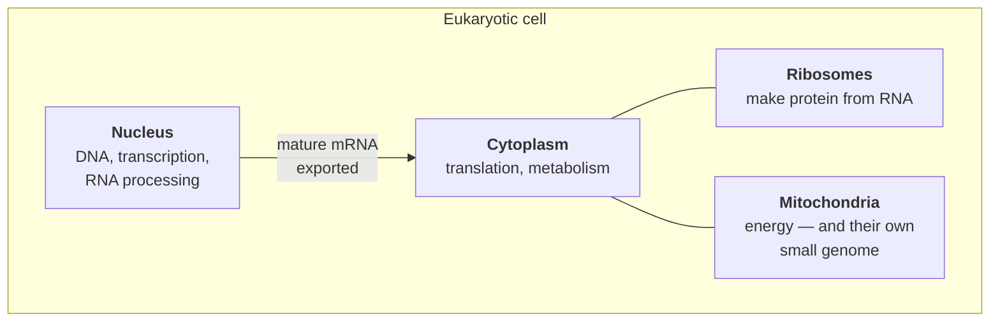

# 01 — The chemistry and cell biology you actually need

> **Before this:** [Ch 00](00-the-whole-story.md) · **Time:** ~30 min

This chapter is deliberately incomplete. It covers the chemistry and cell biology that the
rest of the curriculum leans on, and stops. You are not going to need orbital hybridisation
or the citric acid cycle. You *are* going to need to know why a molecule with a negative
charge behaves differently from one without, and why nothing in a cell is ever *called* —
only collided with.

If you already know first-year biology, skim to [§5](#5-the-part-that-changes-how-you-think-everything-is-stochastic).
That section is the one that matters most and is the one most often taught badly.

## What you'll be able to do

- Derive the double helix — charged backbone outside, flat bases stacked inside, two
  antiparallel strands, grooves of unequal width — from water, charge and hydrogen-bond
  geometry alone
- Predict, from one hydroxyl group, why RNA is a disposable working copy and DNA an archive —
  and say why an archive built on that chemistry still needs constant repair
- Trace DNA's backbone charge to why DNA-binding proteins are basic, why electrophoresis works,
  and why packaging needs histones
- Compute whether a stated binding preference is specific enough to find one site in a
  three-billion-base genome, and say where real specificity comes from instead
- Explain why every fidelity figure in biology decomposes into imperfect filters in series, and
  why a per-replication rate and a per-generation rate differ by orders of magnitude
- Explain why an expression level is a time average over a stochastic process, and predict what
  a single-cell measurement shows where a bulk measurement shows one number
- Read a free-energy change as an equilibrium constant, say why an enzyme changes a rate but
  never an equilibrium, and say why the hydrophobic effect strengthens with temperature where
  an ordinary attraction would weaken

## The core idea

Cells are bags of water containing an extraordinarily crowded mixture of molecules, at a
temperature where everything is in constant violent motion. There is no scheduler, no
addressing, and no calling convention. **Every interaction happens because two molecules
randomly collided and stuck together for a while.**

Biological specificity — the fact that a transcription factor finds one site among three
billion — is not achieved by lookup. It is achieved by making the correct partner stick a
few thousand times longer than the incorrect one, and then relying on enormous numbers of
collisions per second. Specificity is statistical.

Once that clicks, a great deal of molecular biology stops seeming magical and starts seeming
like a rate problem.

---

## 1. Atoms, bonds, and the only chemistry that matters here

Biological molecules are built from a small alphabet: **carbon, hydrogen, oxygen, nitrogen,
phosphorus, sulfur** — plus ions like sodium, potassium, magnesium and calcium.

Two kinds of connection matter:

**Covalent bonds** — atoms sharing electrons. Strong and long-lived at body temperature, and
they form the backbone of every macromolecule. When you read that DNA is a stable archive,
this is why: its backbone is covalent. Breaking one usually takes an enzyme — but not always,
and the exception that matters most is a bond inside DNA itself, which §3 comes to.

**Non-covalent interactions** — weak, transient, individually feeble, collectively decisive:

| Interaction | Strength | Where you'll meet it |
|---|---|---|
| **Hydrogen bond** | weak | Base pairing; protein secondary structure; almost all molecular recognition |
| **Ionic (electrostatic)** | weak in water | Protein–DNA binding — the backbone's negative charge |
| **Van der Waals** | very weak | Close-packing; base stacking |
| **Hydrophobic effect** | — | Protein folding; membranes; the interior of the double helix |

The whole logic of molecular biology: **covalent bonds store, non-covalent interactions
decide.** Anything that has to be reversible — a protein binding DNA, two strands separating,
an enzyme releasing product — is non-covalent. Anything that has to persist is covalent.

## 2. Water is not the background — it's a participant

Water is polar: the oxygen pulls electron density from the hydrogens, leaving the molecule
with a slightly negative end and a slightly positive end. Consequences that recur constantly:

**Polar and charged molecules dissolve; non-polar ones don't.** Water forms favourable
interactions with the former and not the latter.

**The hydrophobic effect.** Non-polar molecules in water clump together. Not because they
attract each other — because water molecules cannot form their usual hydrogen-bond network
around them, so burying non-polar surface frees up water. It is driven by *water's* entropy,
not by any force between the greasy bits. This counterintuitive point does an enormous amount
of work:

- It folds proteins — hydrophobic amino acids bury themselves in the interior
- It forms membranes — lipids with greasy tails spontaneously form bilayers
- It stabilises the double helix — the flat bases stack in the interior, away from water,
  while the charged backbone faces out

The double helix is, to a first approximation, **what you get when you put a charged polymer
with flat greasy rungs into water.** Structure follows from solvent.

**Hydrogen bonds are directional and specific**, which is what lets A pair with T and G with
C rather than promiscuously. Base pairing is a hydrogen-bonding geometry problem.

**pH decides what is charged.** Water dissociates slightly into H⁺ and OH⁻, and **pH** is
just a log scale for how much H⁺ is around — 7 is neutral, lower is more acidic, and
cytoplasm and blood both sit near 7.4. It matters because whether a chemical group carries a
charge depends on the pH surrounding it: at cellular pH every phosphate along the DNA
backbone is ionised, which is where DNA's negative charge comes from, and a handful of amino
acid side chains are charged while the rest are not.

**Nucleophile and electrophile — the two roles in every reaction in this book.** Because
electron density is unevenly shared, some atoms have a lone pair or a negative charge to
spare and others are short of one. The electron-rich partner is the **nucleophile** —
"nucleus-loving" — and it does the attacking; the electron-poor partner is the
**electrophile**, and it is what gets attacked. Nearly every covalent bond made or broken in
this curriculum is one such attack, and usually the same one: an oxygen carrying a lone pair
attacking a phosphorus atom flanked by electron-hungry oxygens. That single reaction extends
DNA, extends RNA, cuts either of them, and joins two fragments back together. So when
[Ch 02](../part-01-molecular-foundations/02-dna-structure.md) labels a nucleotide's
3'-hydroxyl *the nucleophile* and an incoming nucleotide's phosphate *the electrophile*, that
is the whole of what it means — and it is why a polymerase can extend only one end of a
strand.

## 3. The four macromolecules

Biological polymers, built by linking monomers with covalent bonds.

### Nucleic acids — DNA and RNA

Monomer: a **nucleotide** = sugar + phosphate + base. Phosphates link sugars into a backbone;
bases hang off it.

| | DNA | RNA |
|---|---|---|
| Sugar | deoxyribose | ribose (one extra –OH) |
| Bases | A, C, G, **T** | A, C, G, **U** |
| Strands | double | usually single |
| Stability | high | low — that extra –OH makes it self-cleaving |
| Role | archive | working copy, catalyst, regulator |

RNA's chemical instability is a *feature*: working copies should be disposable. A single
hydroxyl group is the difference between an archive and a message queue.

The four bases fall into two chemical classes, and the split does real work later.
**A and G are purines** — two fused rings, so the larger bases. **C, T and RNA's U are
pyrimidines** — one ring, smaller. Every pair in the double helix is one of each, which is
what holds the helix to a constant width; [Ch 02](../part-01-molecular-foundations/02-dna-structure.md)
derives the pairing rules from that constraint rather than asking you to memorise them.

The purines are also the archive's weak point. The bond joining a purine to its sugar
hydrolyses spontaneously — no enzyme needed and no damage required — so DNA loses purines
continuously, on the order of 10⁴ per cell per day. That slow chemical attrition is where a
large share of mutation comes from
([Ch 16](../part-03-genome-instability/16-mutation.md)), and it is why a stable archive still
needs constant repair.

**The backbone carries one negative charge per nucleotide.** DNA is a strongly polyanionic
molecule, and this matters more than it sounds:

- Proteins binding DNA non-specifically tend to be positively charged
- DNA migrates toward the positive electrode in a gel — the basis of electrophoresis
  ([Ch 36](../part-08-methods/36-core-molecular-methods.md))
- Packaging DNA requires neutralising that charge, which is what the positively charged
  histone proteins do ([Ch 03](../part-01-molecular-foundations/03-genomes-chromosomes-chromatin.md))

### Proteins

Monomer: **amino acid** — a common core plus one of 20 side chains. The side chains are the
whole story: some charged, some polar, some greasy, one (cysteine) able to form covalent
cross-links, one (proline) that kinks the chain, one (glycine) so small it grants flexibility.

Amino acids link into a chain, and the chain folds into a specific three-dimensional
structure determined by the sequence — largely by burying hydrophobic side chains inside and
leaving polar ones exposed.

Two intermediate shapes are worth naming now, because later chapters use them without
stopping to explain them. Locally, the backbone's own hydrogen bonds fold it into one of two
regular motifs: the **α-helix**, a right-handed spiral roughly 12 Å across, and the **β-sheet**,
several extended stretches of chain lying side by side. These are **secondary structure**;
how those helices and sheets then pack together into a whole folded unit is **tertiary
structure**. The α-helix's width is not trivia — it is why a protein can push one into the
wider of DNA's two grooves and read the sequence there
([Ch 02 §5](../part-01-molecular-foundations/02-dna-structure.md)).

**Shape is function.** A protein works by having a surface complementary to its partner. This
is why a single amino acid change can abolish function (if it disrupts the fold or the active
site) or do nothing at all (if it sits on the surface pointing at nothing) — a fact that
underlies the whole difficulty of variant interpretation
([Ch 55](../part-11-human-and-statistical-genomics/55-clinical-variant-interpretation.md)).

Proteins do essentially all the work: catalysis (**enzymes**), structure, transport,
signalling, and regulation of the genome itself.

### Lipids and carbohydrates

Briefly, because they matter less here. **Lipids** are non-polar; in water they self-assemble
into bilayers, which is where all cellular membranes come from — including the nuclear
envelope that separates transcription from translation in eukaryotes.
**Carbohydrates** are sugars, used for energy and, attached to proteins, for molecular
identity tags — including the ABO blood group system you'll meet in
[Ch 11](../part-02-transmission-genetics/11-beyond-mendel.md).

## 4. The cell

Two architectures.

**Prokaryotes** (bacteria and archaea) — no nucleus. One circular chromosome sitting in the
cytoplasm. Transcription and translation happen in the same space, simultaneously: ribosomes
latch onto RNA while it's still being transcribed. Small, fast, streamlined genomes.

**Eukaryotes** (everything else — animals, plants, fungi, protists) — DNA enclosed in a
**nucleus**. Transcription happens inside, translation outside. That separation creates a
processing step in between, and that step is where a great deal of regulatory complexity
lives ([Ch 06](../part-01-molecular-foundations/06-rna-processing.md)).



The parts that recur in this curriculum:

- **Nucleus** — the genome, transcription, RNA processing
- **Ribosomes** — translate RNA into protein. Themselves made largely of RNA
- **Mitochondria** — generate energy, and carry **their own small circular genome**, inherited
  only from the mother. This gives mitochondrial disease its distinctive inheritance pattern
  ([Ch 15](../part-02-transmission-genetics/15-pedigrees.md)) and makes mitochondrial
  DNA a favourite marker in population history
- **Cytoplasm** — where translation and most metabolism happen

Mitochondria having their own genome is not a quirk. They are descended from free-living
bacteria engulfed by an ancestral cell — **endosymbiosis** — and they have retained a
remnant chromosome ever since. Chloroplasts in plants have the same origin.

## 5. The part that changes how you think: everything is stochastic

This is the section to read twice.

A protein does not *go* to its binding site. There is no address, no dispatch, no call. It
diffuses — random-walks, driven by thermal motion — colliding with everything, and at every
collision it either sticks briefly or doesn't. It finds its site because sticking there lasts
longer.

Some numbers to calibrate against:

| Quantity | Order of magnitude |
|---|---|
| Diameter of the DNA double helix | 2 nm |
| Length of DNA per human cell | ~2 m, packed into a ~6 μm nucleus |
| Typical protein | 3–10 nm |
| Molecular collisions | ~10⁹ per second per molecule |
| Transcription rate | ~1–2 kb per minute |
| Translation rate | ~5–20 amino acids per second |
| Proteins in one cell | ~10⁹–10¹⁰ |
| Copies of a typical protein | 10²–10⁵ |

The nucleus is **extremely crowded** — nothing like a dilute solution. Macromolecules occupy
20–30% of the volume. Diffusion is hindered, local concentrations are far from uniform, and
there is a live argument — biomolecular condensates and phase separation are the current
framing — that some of the organisation once attributed to active machinery may instead
emerge from crowding and weak multivalent interactions. How much is unresolved: the in-cell
evidence that a given nuclear focus is a genuine liquid condensate rather than something that
merely looks like one is actively contested.

Three consequences that will keep mattering:

**Binding is a probability, not a state.** A transcription factor "bound to" a promoter is
actually bound some fraction of the time — associating and dissociating continually. Gene
expression levels are the *time average* of an intrinsically noisy process. Two genetically
identical cells in identical conditions express different amounts of the same gene. That
noise is measurable, sometimes functional, and it's why single-cell measurements
([Ch 48](../part-10-functional-genomics/48-single-cell-and-spatial.md)) show distributions
where bulk measurements show a single number.

**Specificity is relative, not absolute.** A transcription factor that binds its target
sequence a thousand times more tightly than random DNA sounds highly specific — until you
remember there are three billion positions. It spends a great deal of time bound to the wrong
places. Real specificity comes from combinations: several factors that must all be present,
each individually sloppy, jointly precise. This is why regulatory elements contain clusters
of binding sites rather than one.

**Error rates are set by kinetics, and errors are managed rather than prevented.** DNA
polymerase mis-incorporates at some rate; proofreading catches most of it; mismatch repair
catches most of the rest. Those three imperfect filters in series — not one perfect mechanism
— get replication down to roughly 10⁻¹⁰ per base **per replication**. The observed germline
rate is ~1.1–1.3 × 10⁻⁸ per base **per generation**, a hundredfold higher, and the gap is
itself instructive: a generation stacks hundreds of germline cell divisions on top of that
filter stack, and much germline mutation begins as spontaneous chemical damage that never
passed through a polymerase at all
([Ch 16](../part-03-genome-instability/16-mutation.md)). Every fidelity number in biology
decomposes this way — and every rate needs its denominator checked.

> **For programmers.** The mental model to discard is the function call. The one to adopt is
> something like a massively concurrent system with no locks, no ordering guarantees, and
> unreliable message delivery — where correctness is achieved statistically, by redundancy
> and by error correction downstream, and where the observable behaviour is an ensemble
> average over enormous numbers of unreliable events.

## 6. Energy, equilibrium, and rates

Reactions that don't happen spontaneously are driven by coupling them to one that does —
usually the breakdown of a **nucleoside triphosphate**, most familiarly **ATP**. When you read
that a helicase "unwinds" DNA, that is ATP hydrolysis doing the work. The currency varies:
polymerases are powered by the dNTPs and NTPs they are polymerising rather than by ATP, and
when a polymerase "proofreads" the cost is not a triphosphate at all — the excising step is
plain hydrolysis, and what gets paid is the nucleotide thrown away and added again. You don't
need the biochemistry; you need to know that
molecular machines consume energy to do directional work, and that this is what stops
everything from simply drifting to equilibrium and stopping. A cell at equilibrium is dead —
that is very nearly the definition.

You do need a small amount of the bookkeeping, though, because from the next chapter onward
the curriculum quotes energies in kcal/mol and expects you to read them. Here it is, once.

**Equilibrium and K.** Take a reversible reaction, two molecules sticking together:
A + B ⇌ AB. Left alone it does not stop — it reaches a state where the forward and reverse
rates are equal and the concentrations stop changing. That state is summarised by a single
number, the **equilibrium constant**:

```
  K = [AB] / ([A][B])
```

Large K means the reaction sits mostly on the right, small K mostly on the left. K depends on
the reaction and the temperature, not on how much you started with. (Concentrations are
counted against a 1 M reference, which is what the ° superscripts below mean and what makes
taking a logarithm of K legal.)

**Free energy.** The quantity that predicts K is the **standard free-energy change**, ΔG° —
the thermodynamic driving force, quoted in kcal/mol. It splits into two parts:

```
  ΔG°  =  ΔH°  −  T·ΔS°
```

ΔH° (**enthalpy**) is roughly the heat balance: whether the bonds and contacts formed are
better than the ones broken. ΔS° (**entropy**) is the change in how many arrangements are
available. T is absolute temperature in kelvin, so the entropy term matters more the hotter
things get. A negative ΔG° means the reaction is favourable as written. This is the equation
behind §2's hydrophobic effect: burying a greasy surface releases ordered water, so ΔS° is
positive, −TΔS° is negative, and the process is driven by entropy rather than by any
attraction.

**The two are the same fact in different units:**

```
  ΔG°  =  −R·T·ln K          R = 1.987 cal/(mol·K), the gas constant
```

At body temperature every 1.4 kcal/mol of ΔG° is about a factor of ten in K. So the
thousandfold preference §5 describes — a transcription factor holding its own site that much
more tightly than random DNA — amounts to only about 4 kcal/mol, two or three hydrogen bonds'
worth. Molecular recognition runs on very small energy differences, which is exactly why it
is never absolute.

**Rates are a separate question.** ΔG° tells you where a reaction ends up, never how fast it
gets there. Speed is set by the **barrier** between start and finish — the free energy of the
highest point on the path — and lowering barriers is the whole of what an enzyme does. An
enzyme cannot change K, and so cannot make an unfavourable reaction favourable; it can only
bring a reaction that was already going to happen forward by millions of times. Every
"enzyme X catalyses Y" in this book means precisely that: the barrier came down, the
destination did not move.

The first place this gets cashed in is
[Ch 02 §7](../part-01-molecular-foundations/02-dna-structure.md), where the temperature at
which a DNA duplex comes apart is this equation applied to A + B ⇌ AB.

---

## Common misconceptions

| What people think | What's actually true |
|---|---|
| Molecules in a cell are transported to where they're needed | The overwhelming majority arrive by diffusion and random collision. Active transport exists but is the exception |
| An enzyme and its substrate fit like a lock and key | Both flex; binding is dynamic and often induces fit. "Lock and key" was a useful nineteenth-century approximation |
| Hydrophobic molecules attract each other | They're pushed together by water reorganising around them. The driving force is water's entropy, not attraction between the non-polar parts |
| A bound transcription factor is bound | It's bound a fraction of the time, cycling on and off continuously. Occupancy is a probability |
| Genetically identical cells behave identically | They don't. Expression is intrinsically noisy because it depends on small numbers of stochastic binding events |
| DNA is a rigid ladder | It bends, twists, breathes open locally, and is under constant torsional stress. Its flexibility is functionally essential |

## Worked example: why the double helix has the shape it does

Predict the structure from the chemistry alone.

**Given:** a polymer whose backbone carries one negative charge per unit, with flat, largely
non-polar bases attached, dissolved in water.

1. **The charged backbone must face outward.** Burying charge away from water is
   energetically expensive. So: backbone outside, bases inside.

2. **The flat bases will stack.** Once in the interior, away from water, they pack
   face-to-face — favourable van der Waals contact and minimal exposed non-polar surface.
   Base *stacking*, it turns out, contributes more to helix stability than base *pairing* does.

3. **Two strands, because the bases have unsatisfied hydrogen-bonding groups.** Buried in the
   interior with no water available, those groups must pair with something. The something is a
   base on a second strand.

4. **Pairing must be A–T and G–C** to keep the helix a constant width: a large two-ring purine
   must pair with a small one-ring pyrimidine, and the hydrogen-bond donor/acceptor geometry
   permits only these two combinations.

5. **The result twists** because the backbone geometry can't stack the bases at a constant
   spacing without rotation. Roughly 10.5 base pairs per turn.

6. **The two strands run antiparallel** because the pairing geometry demands it.

7. **Grooves of unequal width** follow from the backbones not being diametrically opposite.
   The wider **major groove** exposes enough of each base pair for a protein to read the
   sequence *without opening the helix* — which is how transcription factors recognise their
   sites.

Nothing here required knowing the answer in advance. The structure is close to forced by
putting that polymer in water, and every feature turns out to be functionally load-bearing.

## Connections

- **Back to:** [Ch 00](00-the-whole-story.md) — the whole story at low resolution
- **Forward to:** [Ch 02](../part-01-molecular-foundations/02-dna-structure.md) develops the
  double helix properly; [Ch 08](../part-01-molecular-foundations/08-proteins-and-gene-function.md)
  develops protein structure; §5 here underpins all of
  [Part 4](../part-04-gene-regulation/21-bacterial-regulation.md)

## Check yourself

**1. Why is RNA less stable than DNA, and why is that useful?**

<details><summary>Answer</summary>

Ribose has a 2'-hydroxyl group that deoxyribose lacks. That hydroxyl can attack the adjacent
phosphate and cleave the backbone, so RNA self-degrades. Useful because RNA is a working copy:
messages should decay so the cell can change what it's expressing. A stable message queue
would make regulation impossible. The archive gets the stable chemistry; the transient copy
gets the unstable one.

</details>

**2. A transcription factor binds its target 1,000× more tightly than random DNA. Is that specific enough to find one site in a 3-billion-base genome?**

<details><summary>Answer</summary>

No. With ~3 × 10⁹ potential sites and only a 10³ preference, the factor spends most of its
time bound to non-target DNA — there are simply far more wrong sites than right ones. Real
specificity comes from combinatorial control: several factors must be present together, each
individually sloppy, and the joint requirement is stringent. It also comes from chromatin
making most of the genome physically inaccessible, and from local concentration effects.
This is why enhancers are clusters of binding sites, not single ones.

</details>

**3. Why does the hydrophobic effect become stronger with temperature over the physiological range — even though it looks like an ordinary attraction?**

<details><summary>Answer</summary>

Because it isn't an attraction — it's driven by water's entropy. Water around a non-polar
surface is more ordered than bulk water. Burying that surface releases the ordered water,
increasing entropy, and the entropic contribution to free energy scales with temperature.
So over this range, heating strengthens the effect. An ordinary enthalpic attraction would
weaken. This is the clearest test that the standard "greasy bits attract" story is wrong.

</details>

**4. Why do the histone proteins that package DNA carry a strong positive charge?**

<details><summary>Answer</summary>

DNA's backbone carries one negative charge per nucleotide, so a long DNA molecule is
strongly polyanionic and electrostatically self-repelling — it resists being compacted.
Positively charged histones neutralise that repulsion, letting DNA wrap tightly. It also
makes packaging tunable: chemically modifying histones to remove positive charge (acetylation
does exactly this) loosens the interaction and opens the region for transcription — which is
one of the main mechanisms in [Ch 23](../part-04-gene-regulation/23-chromatin-and-epigenetics.md).

</details>
