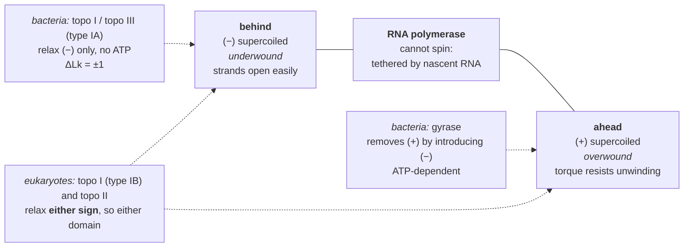
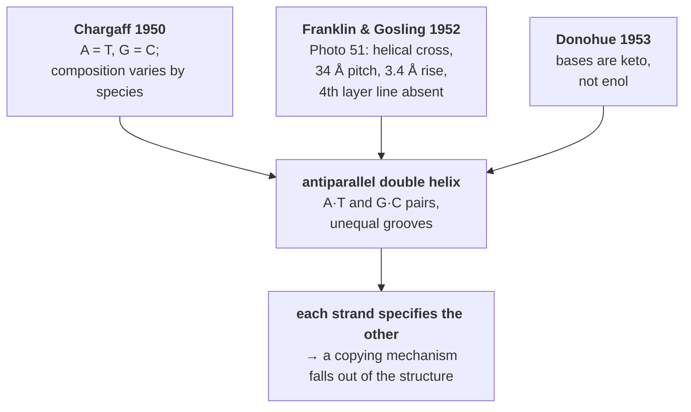

# 02 — DNA structure

> **Before this:** [Ch 00](../part-00-orientation/00-the-whole-story.md) · [Ch 01](../part-00-orientation/01-chemistry-and-cell-primer.md) · **Time:** ~40 min

## What you'll be able to do

- Draw a nucleotide, name the bond that replication, transcription and sequencing each act on, and derive from the reaction chemistry why every polymerase extends the 3' end and no polymerase extends the 5' end
- Derive A–T and G–C pairing from geometry and hydrogen-bond patterns rather than recalling it
- Say why base *stacking*, not base *pairing*, dominates duplex stability, cite the evidence, and explain why two duplexes of identical base composition and identical hydrogen-bond count melt several degrees apart
- Predict which groove a sequence-specific DNA-binding protein reads, and why it need not open the helix
- Classify a sequence or a torsional state by the conformation it favours — B, A, Z, cruciform, G-quadruplex — and use the ~150 bp persistence length to say when DNA behaves as a stiff rod rather than a floppy polymer
- Use `Lk = Tw + Wr` to quantify the supercoiling a transcribing polymerase generates, and show why topoisomerases are not optional
- Reconstruct the 1953 argument: what Chargaff's ratios, Photo 51's helical cross and missing fourth layer line, and the keto tautomers each contributed to the structure

## The core idea

DNA is a **directed, charged, twisted, topologically constrained polymer**. Each adjective does real work later:

- *Directed* — the backbone's two ends are chemically different, so a strand runs 5'→3'. Every polymerase in biology extends the 3' end only, and half the awkwardness of replication follows.
- *Charged* — one negative charge per residue, which forces the backbone outward, makes DNA-binding proteins basic, and makes electrophoresis work.
- *Twisted* — flat bases cannot be stacked on a sugar–phosphate scaffold without rotation, and the twist creates two grooves of unequal width. One is wide enough to read sequence from the outside.
- *Topologically constrained* — in a cell the ends are not free, so you cannot unwind here without overwinding there. Every process that opens the helix manufactures mechanical stress that something must relieve.

The double helix is not a static ladder. It is a stressed, flexible, locally breathing object whose deformations are functionally load-bearing.

---

## 1. The monomer

A **nucleotide** has three parts: a nitrogenous base, a five-carbon sugar, and a phosphate.

The **sugar** is 2'-deoxyribose. Its carbons are numbered 1' to 5' — primed, so they never collide with the numbering of the base's ring atoms. Three positions matter:

| Position | What is attached | Why you care |
|---|---|---|
| **1'** | the base, via an N-glycosidic bond | Break this and you get an abasic site — one of the commonest lesions ([Ch 17](../part-03-genome-instability/17-dna-repair.md)) |
| **3'** | a hydroxyl | The nucleophile. Polymerases extend here, and only here |
| **5'** | a phosphate | The electrophile. Incoming nucleotides arrive as triphosphates |
| **2'** | **H** in DNA, **OH** in RNA | That single oxygen is the difference between an archive and a message queue |

The **bases** come in two sizes:

| Class | Members | Rings | Size |
|---|---|---|---|
| **Purines** | adenine (A), guanine (G) | two fused rings, 9 atoms | large |
| **Pyrimidines** | cytosine (C), thymine (T), uracil (U, in RNA) | one ring, 6 atoms | small |

Thymine is uracil with a methyl group at position 5. That methyl is not decorative: it sticks into the major groove as a hydrophobic marker proteins can feel, and it lets repair enzymes treat any uracil found in DNA as damage — because uracil in DNA is usually a deaminated cytosine ([Ch 16](../part-03-genome-instability/16-mutation.md)).

## 2. The polymer: why direction is chemistry, not convention

Nucleotides link through **phosphodiester bonds**: one phosphate bridges the 3'-OH of one sugar and the 5'-OH of the next.

```
 5' end
  │
  O
  │
  P(=O)(O⁻)      ← phosphodiester: two ester bonds, one ionised oxygen.
  │                One negative charge per residue, at any cellular pH.
  O
  │
 5'┐
   │  2'-deoxyribose ──1'── N ── BASE
 3'┘
  │
  O
  │
  P(=O)(O⁻)
  │
  ⋮
  │
  OH             ← free 3'-hydroxyl: the only group a polymerase can extend
 3' end
```

The chain is therefore **asymmetric**. One end terminates in a phosphate on C5', the other in a hydroxyl on C3'. This is why sequence is written 5'→3' by universal convention, why FASTA records have an implied direction, and why a coordinate on the minus strand needs care ([Ch 41](../part-09-genomics/41-data-formats.md)).

The asymmetry has a mechanistic cause worth carrying. The 3'-OH attacks the α-phosphate of an incoming deoxynucleoside **tri**phosphate, releasing pyrophosphate — so the energy for the bond arrives *with the new nucleotide*. If chains grew 3'→5' instead, the triphosphate would sit on the growing end, and any proofreading excision would destroy the chain's own energy source. Extension is 5'→3' because error correction is only affordable in that direction.

Two strands pair, and the pairing geometry forces them **antiparallel**:

```
5'-A  G  G  T  C  A  T  G-3'
   :  ‖  ‖  :  ‖  :  :  ‖       : = A·T, two hydrogen bonds
3'-T  C  C  A  G  T  A  C-5'     ‖ = G·C, three hydrogen bonds
```

## 3. Base pairing is a geometry problem

Two constraints select the pairs, and neither is "A likes T".

**Constant width.** The C1'–C1' distance across a pair must stay near 10.8 Å for the backbone to run smoothly. Purine + purine is too wide; pyrimidine + pyrimidine is too narrow. So every pair must be one of each.

**Complementary hydrogen-bond patterns.** Along the pairing edge each base presents donors (N–H) and acceptors (C=O, ring N). Of the four purine–pyrimidine combinations, only two produce donor opposite acceptor at every position:

- **A·T** — two bonds: adenine N6–H to thymine O4, adenine N1 to thymine N3–H
- **G·C** — three bonds: guanine O6 to cytosine N4–H, guanine N1–H to cytosine N3, guanine N2–H to cytosine O2

A·C and G·T fail because they place donor against donor. They can pair if a base flips to a rare **tautomer** — the same molecule with one hydrogen sitting on a different atom, which converts a donor into an acceptor and so changes which base it fits. That flip is precisely how spontaneous mispairing happens and where a large share of the mutation rate comes from ([Ch 16](../part-03-genome-instability/16-mutation.md)).

## 4. What actually holds the helix together

Everyone learns "G·C has three hydrogen bonds, so GC-rich DNA is more stable". The conclusion is right and the reasoning is wrong.

Hydrogen bonds between bases are formed in water, and water is an excellent hydrogen-bond partner itself. Separating the strands does not destroy those bonds — it *replaces* them with bonds to water, at close to no net cost. What is genuinely lost on melting is **stacking**: the face-to-face van der Waals and electronic interaction between adjacent base pairs, and the burial of flat hydrophobic surface away from water.

Yakovchuk and colleagues (2006) measured the two contributions separately, using duplexes with single nicks and gaps to isolate stacking. Their decomposition, at 15 mM Na⁺:

| Contribution | A·T | G·C |
|---|---|---|
| Base **pairing** (ΔG per pair) | **+0.6 kcal/mol** — destabilising | ≈ **−0.1 kcal/mol** — negligible |
| Base **stacking** (ΔG per contact) | ≈ −1.0 kcal/mol | ≈ −1.5 kcal/mol |

GC-rich DNA melts at a higher temperature not because of the third hydrogen bond but because **G and C stack better**.

> **Base pairing supplies the specificity. Base stacking supplies the stability.** They are different jobs, and crediting the hydrogen bonds with both is the most common structural misconception in molecular biology. Pairing tells the helix *which* partner; stacking tells it *how hard* to hold on.

## 5. The grooves, and reading sequence without opening the helix

Because the two glycosidic bonds emerge from the same side of each base pair rather than diametrically opposite, the backbones are unevenly spaced around the helix. B-DNA therefore has a **major groove** (~22 Å wide, ~8.5 Å deep) and a **minor groove** (~12 Å wide, ~7.5 Å deep).

This is not cosmetic. The edges of the bases are exposed in both grooves, and a protein can hydrogen-bond to them without melting the duplex. But only one groove carries enough information. Writing D = donor, A = acceptor, M = methyl, H = non-polar hydrogen, reading across each pair:

```
                 MAJOR GROOVE
   A·T      A(N7)   D(N6H)  A(O4)   M(C5-methyl)
   T·A      M       A       D       A
   G·C      A(N7)   A(O6)   D(N4H)  H
   C·G      H       D       A       A
            → four distinct patterns. Fully readable.

                 MINOR GROOVE
   A·T      A(N3)   H       A(O2)
   T·A      A       H       A          ← identical to A·T
   G·C      A(N3)   D(N2H)  A(O2)
   C·G      A       D       A          ← identical to G·C
            → two patterns. AT vs GC only; orientation invisible.
```

The minor groove cannot tell A·T from T·A, or G·C from C·G. The major groove can tell all four apart. That single asymmetry is why almost every sequence-specific DNA-binding protein inserts an α-helix — a "recognition helix", conveniently about 12 Å across — into the major groove, and why minor-groove binders read *shape* (local width, propeller twist, AT-tract narrowing) rather than base identity. Both mechanisms recur constantly in [Ch 22](../part-04-gene-regulation/22-eukaryotic-transcriptional-regulation.md).

## 6. B, A and Z

B-DNA is the physiological form. It is not the only one.

| | **B-DNA** | **A-DNA** | **Z-DNA** |
|---|---|---|---|
| Handedness | right | right | **left** |
| bp per turn | ~10.5 in solution (10.0–10.4 in fibres) | ~11 | 12 (6 dinucleotides) |
| Rise per bp | 3.4 Å | 2.3–2.6 Å | ~3.7 Å |
| Diameter | ~20 Å | ~26 Å | ~18 Å |
| Sugar pucker | C2'-endo | C3'-endo | alternating |
| Base tilt | ~1° | ~19° | ~9° |
| Grooves | major wide/deep, minor narrow | major deep and narrow, minor shallow and wide | single narrow, deep groove (minor-like); major groove flattened to a convex surface |
| Occurs when | physiological hydration | dehydrated; **any RNA duplex or RNA:DNA hybrid** | alternating purine/pyrimidine, e.g. (CG)ₙ, under negative supercoiling |

Two rows are load-bearing rather than trivia. **A-form is not exotic — it is what RNA has to be:** the 2'-OH clashes with C2'-endo pucker, so every RNA duplex and RNA:DNA hybrid is A-form, which means every transcription bubble contains an A-form segment. **Z-form is a torsional relief valve:** a left-handed segment absorbs negative supercoiling, so Z-DNA forms transiently *behind* a transcribing polymerase, where it is recognised by Zα-domain proteins including ADAR1 and ZBP1 — linking it to RNA editing and innate immune signalling.

Remember the 10.5 bp/turn figure. Every topology calculation uses it.

## 7. Melting: reading stability off the sequence

Heat DNA and the strands separate, sharply rather than gradually, because unstacking is **cooperative**: opening the first pair inside a helix costs stacking on both sides, while extending an existing bubble costs it on one. It is a one-dimensional nucleation-and-growth problem with the structure of an Ising model.

You detect it by absorbance. Stacked bases have coupled π systems that absorb less UV than free ones, so unstacking raises A₂₆₀ by **up to about 40%** — the **hyperchromic effect**. Note what that implies: the standard assay for duplex stability is literally a measurement of stacking.

**T_m** is the temperature at which half the strands are duplexed. For long DNA an empirical relation works:

```
T_m ≈ 81.5 + 16.6·log₁₀[Na⁺] + 0.41·(%GC) − 500/L
```

but it is blind to sequence order, and order matters. The model everyone actually uses — inside every primer-design tool — is **nearest-neighbour thermodynamics**, whose parameters are indexed by *dinucleotide stack*, not by base. There is no term in it for "a G·C pair". You sum ΔH° and ΔS° over the L−1 stacks plus two initiation terms, and the thermodynamics of [Ch 01 §6](../part-00-orientation/01-chemistry-and-cell-primer.md) turns that sum into a temperature. For a non-self-complementary duplex A + B ⇌ AB the standard result is

```
                ΔH°
  T_m  =  ───────────────────
          ΔS° + R·ln(C_T/4)
```

with C_T the total strand concentration and R the gas constant; the C_T/4 is what the equilibrium condition becomes at T_m, where half the strands are paired. Take the formula as given. This book does not ship the nearest-neighbour parameter tables — they are published, SantaLucia's unified set being the standard — and the point of this section is not arithmetic but what the model implies.

Test it. **5'-GCGCATATGC-3'** and **5'-GACTGACTGC-3'** share a composition (3 G, 3 C, 2 A, 2 T), share G·C termini, and therefore share a hydrogen-bond count: 26 each. Any composition-based rule must return the same T_m for both. Summing SantaLucia's unified parameters gives ΔH° = −78.4 vs −75.4 kcal/mol and ΔS° = −213.5 vs −206.6 cal/(mol·K), so at 2 μM strand in 1 M Na⁺, **T_m ≈ 50 °C vs 47 °C**. Same bases, same bonds, different order, different stability.

## 8. Topology: DNA is a closed object

Take a circular double helix — a plasmid, a bacterial chromosome, or a eukaryotic chromatin loop anchored at both ends. Its **linking number** `Lk`, the number of times one strand passes through the closed loop formed by the other, is an integer and cannot change without breaking a strand.

```
  Lk  =  Tw  +  Wr
```

`Tw` (twist) counts how many times the strands wind around each other; `Wr` (writhe) counts how many times the axis crosses itself in space. `Lk` is invariant, so `Tw` and `Wr` trade. Unwind a region locally, decreasing `Tw`, and `Wr` must rise to compensate: the molecule coils around itself. It **supercoils**.

Relaxed B-DNA has `Lk₀ = N/10.5` for `N` base pairs, and superhelical density is the normalised deviation:

```
  σ = (Lk − Lk₀) / Lk₀
```

In vivo σ runs about **−0.05 to −0.07**: cells hold their DNA *underwound*, as a deliberate energy store. Negative supercoiling pre-pays part of the cost of separating strands, so promoters open and origins fire more readily.

**Transcription and replication both manufacture supercoils.** A polymerase tracking a helix must rotate relative to it once every 10.5 bp, and it cannot — it is tethered by a growing RNA, by bound processing factors, and in bacteria by ribosomes. So the DNA must rotate instead; and where the DNA is anchored too, the rotation has nowhere to go. Liu and Wang's **twin-domain model**:



**Topoisomerases** are the enzymes that change `Lk`. Type I cuts one strand and reseals it, and splits into two mechanisms that behave differently. **Type IA** — bacterial topo I, topo III — passes the intact strand through the break, so ΔLk = ±1 exactly, and it relaxes negative supercoils only. **Type IB** — human topo I, poxvirus topo — instead lets the helix swivel about the intact strand before resealing, so it relaxes *both* signs and changes `Lk` by one or many turns per catalytic event. Neither spends ATP; they are releasing stored torsional energy. (The exception is reverse gyrase, a type IA enzyme fused to a helicase domain, which burns ATP to *add* positive supercoils in hyperthermophiles.) Type II cuts *both* strands, passes an entire duplex through the gap, and reseals — ΔLk = ±2, ATP-dependent, and again indifferent to sign. Bacterial **DNA gyrase** is the special case that runs uphill: it actively *introduces* negative supercoils.

## 9. Flexibility, and what happens when B-form fails

At 3.4 Å per base pair, 1 kb of B-DNA is 340 nm long — so the 3.1 Gb haploid human genome is about **1 m of molecule**, and a diploid nucleus holds ~2 m of it. But DNA is not a wire. Its **persistence length** is about **50 nm — roughly 150 bp** — at physiological salt: below that scale it behaves as a stiff rod, above it as a flexible polymer executing a random walk. Two consequences:

- A nucleosome bends about 147 bp around a histone octamer, far tighter than free DNA prefers. Nucleosome positioning is therefore sequence-dependent, because some sequences bend more cheaply than others ([Ch 03](03-genomes-chromosomes-chromatin.md)).
- Single-stranded DNA is far floppier — persistence length of order 1–5 nm, depending strongly on salt. Melting a duplex converts a stiff rod into a coil, which is why denaturation changes viscosity and gel mobility so dramatically.

Under torsional stress or with the right sequence, DNA leaves B-form entirely:

| Structure | Sequence requirement | Note |
|---|---|---|
| **Hairpin / cruciform** | inverted repeat | Extrudes under negative supercoiling; a recombination and deletion hotspot |
| **G-quadruplex (G4)** | four runs of ≥3 G | Four guanines make a planar tetrad via Hoogsteen bonds; tetrads stack with K⁺ between them |
| **i-motif** | the C-rich complementary strand | Hemiprotonated C·C⁺ pairs; favoured at slightly acidic pH |
| **Triplex / H-DNA** | polypurine·polypyrimidine mirror repeat | Third strand in the major groove |

```
        G ———— G
        │  K⁺  │      Hoogsteen bonds, not Watson–Crick.
        │      │      Four G's per tetrad; tetrads stack;
        G ———— G      a potassium ion sits between them.
```

G-quadruplexes are not a curiosity. **G4-seq mapped 716,310 G4-forming sequences in the human genome** (Chambers et al. 2015) — most of them not predicted by the then-standard motif search. They are enriched at promoters, 5' UTRs, replication origins, and the telomeric TTAGGG repeat, they impede polymerases, and dedicated helicases exist to unwind them.

## 10. How this was worked out, and what it immediately implied

Until 1950 the consensus was that DNA was too monotonous to carry information. Levene's **tetranucleotide hypothesis** held that DNA was a repeating ACGT unit; protein, with 20 letters, looked the better candidate — which is largely why Avery, MacLeod and McCarty's 1944 demonstration that the bacterial transforming principle was DNA met scepticism.

**Erwin Chargaff** dismantled it. Measuring base composition across species he found that composition *varies* between species — killing the tetranucleotide hypothesis outright — and that within any species **A = T and G = C**. He reported the ratios; he did not propose pairing.

**Rosalind Franklin and Raymond Gosling** produced Photo 51 at King's College London in May 1952, a fibre diffraction pattern of the hydrated B-form. It said three things at a glance: the X-shaped cross of reflections is the signature of a helix; the layer-line spacing gives a 34 Å repeat with a strong 3.4 Å meridional reflection, i.e. ten residues per turn; and the absent fourth layer line means the two strands are offset by about 3/8 of a turn — exactly what produces grooves of unequal width.

The last piece was tautomeric. Watson's early models used the enol forms of the bases and could not be made to work; Jerry Donohue told him the keto forms were correct, and with keto bases the donor/acceptor patterns fall out immediately as A·T and G·C.



The three papers appeared together in *Nature* on 25 April 1953. Watson and Crick's closes by noting that their pairing scheme immediately suggests "a possible copying mechanism for the genetic material" — the rare case of a structure that hands you the mechanism for free. If A always faces T and G always faces C, each strand fully specifies its partner, so separating them yields two templates. Meselson and Stahl confirmed it in 1958 ([Ch 04](04-dna-replication.md)).

Franklin's unpublished data reached Watson and Crick without her knowledge or consent. She died in 1958, aged 37; the 1962 Nobel went to Watson, Crick and Wilkins, and the prize is limited to three recipients. The statute formally barring posthumous awards came later, in 1974 — but she had died four years before the announcement, and even the pre-1974 exception reached only those who died after being nominated in the same year.

---

## Common misconceptions

| What people think | What's actually true |
|---|---|
| G·C pairs are stronger because they have three hydrogen bonds | In water those bonds are nearly free — the strands simply hydrogen-bond to water instead. GC-rich DNA melts higher because **G and C stack better**. By one careful decomposition, A·T *pairing* is net destabilising |
| DNA is a rigid ladder | Persistence length ~150 bp. Beyond that it is a floppy polymer. It bends, writhes, and breathes open locally — all functionally required |
| A protein must open the helix to read the sequence | The major groove exposes a distinct donor/acceptor/methyl pattern for each of the four base-pair orientations. Sequence-specific readout happens on intact duplex |
| The minor groove just carries less information | It carries *categorically* less: it cannot distinguish A·T from T·A, or G·C from C·G. Minor-groove binders read shape, not identity |
| 5'→3' is a bookkeeping convention | It is a chemical asymmetry with a mechanistic cause: the growing chain must carry the nucleophile so that proofreading does not destroy the reaction's energy source |
| You can unwind DNA locally without consequence | In a topologically closed domain `Lk` is invariant. Unwinding here forces overwinding there. Every helix-opening process manufactures supercoils |
| Negative supercoiling means "wound too tightly" | The opposite: **under**wound relative to relaxed B-form. Cells maintain σ ≈ −0.05 to −0.07 because it stores free energy that helps open promoters and origins |
| A-DNA and Z-DNA are laboratory artefacts | A-form is the obligatory conformation of every RNA duplex and RNA:DNA hybrid. Z-DNA forms behind transcribing polymerases and is read by Zα-domain proteins |
| Watson and Crick discovered DNA | They determined its structure. DNA was isolated in 1869 and shown to be the genetic material in 1944 and 1952 |

## Worked example: how much supercoiling does one gene generate?

Take RNA polymerase II transcribing a 10 kb gene at 2 kb/min.

**1. Convert to turns per second.** 2 kb/min = 2,000/60 ≈ 33 bp/s. At 10.5 bp per turn:

```
  33 bp/s ÷ 10.5 bp/turn  =  3.2 turns/s
```

**2. Each turn is two supercoils.** `Lk` is conserved, so every turn the polymerase fails to make around the helix appears as +1 ahead and −1 behind. The enzyme is generating roughly **3 positive supercoils per second downstream and 3 negative per second upstream**.

**3. Total over the gene.** 10,000 bp ÷ 10.5 = **952 turns**, taking 300 s. So ~950 supercoils of each sign, per polymerase, per pass.

**4. How much can the DNA absorb?** Suppose the gene sits in a chromatin loop of 100 kb anchored at both ends ([Ch 50](../part-10-functional-genomics/50-3d-genome.md)). Its relaxed linking number is:

```
  Lk₀ = 100,000 / 10.5 = 9,524
```

At the physiological σ ≈ −0.06, the domain's resting ΔLk is:

```
  ΔLk = σ · Lk₀ = −0.06 × 9,524 ≈ −571
```

So the entire torsional budget of a 100 kb domain is roughly ±570 turns.

**5. Conclude.** One polymerase generates ~950 turns of each sign in five minutes, well past what the domain can hold; torque would stall it in under three. And that is *one* polymerase — an active gene carries many, and replication forks build positive supercoils faster still. **Topoisomerases therefore run continuously, everywhere, at high throughput.** They are not occasional maintenance; they are a mandatory part of every transcription and replication event.

The clinical corollary is immediate. Topoisomerases work through a transient covalent enzyme–DNA intermediate, so a drug that traps that intermediate turns an ordinary catalytic cycle into a permanent DNA break. That is how fluoroquinolones (ciprofloxacin, against bacterial gyrase and topo IV), etoposide and doxorubicin (human topo II), and irinotecan and topotecan (human topo I) kill cells. Three drug classes downstream of one conserved quantity.

## Connections

- **Back to:** [Ch 01 §2](../part-00-orientation/01-chemistry-and-cell-primer.md) derived the helix qualitatively from water and charge; this chapter supplies the numbers. [Ch 00 §1](../part-00-orientation/00-the-whole-story.md) introduced complementarity
- **Forward to:** [Ch 03](03-genomes-chromosomes-chromatin.md) bends this molecule around histones — persistence length is why that costs energy. [Ch 04](04-dna-replication.md) is the copying mechanism the structure implies, and inherits both the 3'-OH constraint and the supercoiling problem. [Ch 05](05-transcription.md) opens the helix and pays the topological price. [Ch 22](../part-04-gene-regulation/22-eukaryotic-transcriptional-regulation.md) reads the major groove. [Ch 36](../part-08-methods/36-core-molecular-methods.md) exploits melting and reannealing in PCR and hybridisation. [Ch 42](../part-09-genomics/42-read-alignment.md) depends on reverse-complement symmetry being exact. [Ch 20A §2](../part-03-genome-instability/20A-bacterial-and-phage-genetics.md) is the experiment that made DNA the genetic material — and explains why Avery was doubted for a decade, since the tetranucleotide hypothesis held that a molecule of four monotonously repeating units could not carry information

## Check yourself

**1. A transcription factor must distinguish `GATA` from `GTTA`. Which groove does it read, and why can't it use the other?**

<details><summary>Answer</summary>

The major groove, where each of A·T, T·A, G·C and C·G presents a distinct pattern of donors, acceptors and (for thymine) a methyl group. The two sequences differ only at position 2, A·T versus T·A — and in the minor groove those two are indistinguishable. Minor-groove binders read shape (groove width, propeller twist) rather than base identity, and are correspondingly less specific.

</details>

**2. Two 20-mers have identical base composition. Explain how their melting temperatures can differ by several degrees, and what that implies about the source of duplex stability.**

<details><summary>Answer</summary>

Identical composition means an identical hydrogen-bond count, so if pairing set the stability the two T_m values would have to be equal. They are not, because the *stacks* differ: stability sums over the L−1 dinucleotide steps, which range from about −0.6 kcal/mol (5'-TA) to −2.2 kcal/mol (5'-GC) at 37 °C. Rearranging the same bases changes which stacks occur.

This is the practical form of the stacking argument. The nearest-neighbour model every primer-design tool runs has no parameter for "a base pair" at all — its parameters are indexed by stack.

</details>

**3. A circular plasmid of 4,200 bp is found to have Lk = 380. Compute σ. Is the molecule over- or underwound, and would you expect this in a cell?**

<details><summary>Answer</summary>

Relaxed linking number: `Lk₀ = 4,200 / 10.5 = 400`. So `ΔLk = 380 − 400 = −20`, and

```
  σ = ΔLk / Lk₀ = −20 / 400 = −0.05
```

Negative, so **underwound** — negatively supercoiled, and entirely typical: cells hold σ around −0.05 to −0.07. Since `Lk = Tw + Wr` is fixed, the deficit is shared between reduced twist (locally separated strands) and negative writhe (the molecule coiling on itself). The stored free energy lowers the cost of opening promoters and origins, which is why this state is actively maintained rather than merely tolerated.

</details>

**4. Every known DNA polymerase extends the 3' end and none extends the 5' end. Give the chemical reason, and one large consequence.**

<details><summary>Answer</summary>

The reaction is nucleophilic attack by the chain's 3'-hydroxyl on the α-phosphate of an incoming dNTP, driven by release of pyrophosphate. The energy therefore arrives attached to the *incoming* nucleotide, not the chain. Reverse the polarity and the triphosphate would sit on the growing end — so any proofreading excision of a mis-inserted base would also remove the reaction's energy source, and synthesis could not resume. Extension is 5'→3' because it is the only direction in which error correction is affordable.

The consequence: since the strands are antiparallel, a replication fork moving in one direction can copy one template continuously and must copy the other in short backwards-facing pieces — Okazaki fragments, and the entire leading/lagging asymmetry of [Ch 04](04-dna-replication.md).

</details>

**5. Photo 51's fourth layer line is missing. What does that absence tell you, and why does it matter for gene regulation?**

<details><summary>Answer</summary>

A missing layer line is destructive interference between the two strands' scattering: the strands are not diametrically opposite but offset along the axis by roughly 3/8 of a turn. That offset is exactly what makes the two backbone-to-backbone gaps unequal — it *is* the major and minor groove.

It matters because the wider groove is what makes sequence readable from outside. A gap ~22 Å across admits an α-helix and exposes the full donor/acceptor/methyl pattern of every base pair, so a transcription factor can identify its site without melting the duplex, without ATP, and fast enough to regulate on a physiological timescale. Had the strands been diametrically opposed, sequence-specific binding would have required opening the helix, and gene regulation as it exists would be impossible.

</details>
