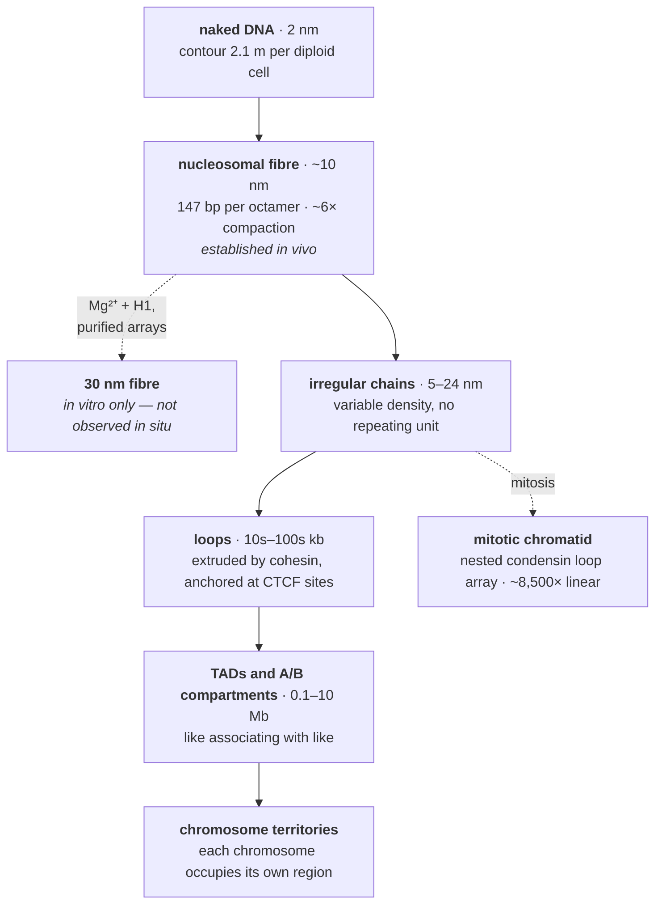
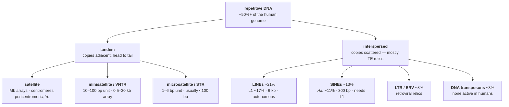

# 03 — Genomes, chromosomes and chromatin

> **Before this:** [Ch 01](../part-00-orientation/01-chemistry-and-cell-primer.md) · [Ch 02](02-dna-structure.md) · **Time:** ~40 min

## What you'll be able to do

- Derive the scale of the packaging problem and show that it is a topology problem, not a volume problem
- Describe nucleosome structure from first principles, and compute how many nucleosomes a human cell contains
- State precisely what is and is not established about chromatin above the nucleosome — including why the 30 nm fibre in every textbook is a preparation artefact, and why a chromosome looks like the textbook X for only a couple of hours per cycle
- Read a karyotype and a cytogenetic band address, classify a chromosome by centromere position, and say why centromere identity is epigenetic rather than sequence-specified
- Give a quantitative account of what the human genome is made of, use it to dismantle "junk DNA" without over-correcting into "it's all functional", and explain why genome size tracks neither gene number nor organismal complexity
- Distinguish tandem from interspersed repeats, and say which piece of software each one breaks
- Explain mitochondrial inheritance and heteroplasmy, and why mtDNA pedigrees look nothing like Mendelian ones

## The core idea

A chromosome is a solution to three constraints that pull against each other.

**It must fit.** Two metres of DNA per cell, a nucleus six micrometres across.

**It must stay readable.** Whatever compacts it has to come apart locally, on demand, at thousands of sites, within seconds.

**It must segregate accurately.** At division, each daughter gets exactly one copy of everything — which requires a physical handle to pull on, and ends that the cell can tell apart from breaks.

Everything in this chapter follows from those three. The packaging is hierarchical because no single mechanism satisfies all three at once. And because compacted DNA is unreadable, the *state* of the packaging becomes a control layer in its own right — the genome's own metadata, written on top of the sequence and inherited alongside it.

---

## 1. The packaging problem, quantified

Start with the numbers, because the standard framing ("2 m into 6 μm!") points at the wrong difficulty.

A diploid human cell holds 6.2 × 10⁹ bp. B-form DNA rises 0.34 nm per base pair, so the contour length is

```
6.2 × 10⁹ bp × 0.34 nm/bp = 2.1 × 10⁹ nm = 2.1 m
```

Now check whether *volume* is the constraint. Treat DNA as a solid cylinder 2 nm across:

```
V_DNA  = π (1 nm)² × 2.1 m         ≈ 6.6 × 10⁻¹⁸ m³
V_nuc  = (4/3)π (3 μm)³            ≈ 1.1 × 10⁻¹⁶ m³
ratio  ≈ 6%
```

Six per cent. The DNA would rattle around in there. **Volume is not the problem.**

The problem is that a polymer does not sit still, and a long one occupies a region enormously larger than its own material. DNA has a persistence length of about 50 nm (~150 bp) — below that it is stiff, above it, floppy. For an ideal chain the end-to-end size goes as the Kuhn length *b* (twice the persistence length, so 100 nm) times the square root of the number of Kuhn segments. Take chromosome 1 alone, 248,956,422 bp in GRCh38:

```
contour L = 2.49 × 10⁸ bp × 0.34 nm    ≈ 85 mm
segments N = L / b = 8.5 × 10⁷ nm / 100 nm ≈ 8.5 × 10⁵
size R    ≈ b √N = 100 nm × 920         ≈ 92 μm
```

One chromosome, left to its own thermal devices, would sprawl across a sphere fifteen times the diameter of the nucleus — and that is the *ideal-chain* answer, which ignores the fact that the chain cannot pass through itself. Self-avoidance makes it worse.

So packaging is not about squeezing something bulky into a small box. It is about **imposing a compact, non-random, actively maintained conformation on a polymer whose natural state is diffuse and tangled** — and doing it without creating knots that would be lethal at segregation.

The third constraint sets the extreme. At metaphase, chromosome 1 becomes a rod roughly 10 μm long. That is 85 mm of DNA in 10 μm of chromosome: about **8,500-fold linear compaction**, achieved and then reversed once per cell cycle.

## 2. The nucleosome

The first level of packaging is a spool.

An octamer of **histone** proteins — two copies each of **H2A, H2B, H3 and H4**, assembled as one (H3·H4)₂ tetramer flanked by two H2A·H2B dimers — forms a squat disc about 11 nm across and 5.5 nm high. **147 bp of DNA wraps around it in ~1.65 left-handed superhelical turns.** That unit is the nucleosome core particle, and it is the most abundant protein–DNA complex on Earth.

```
   147 bp core                  linker
   (~1.65 turns)               ~20–80 bp
   ┌───────────┐              ┌───────────┐
───┤  octamer  ├──────────────┤  octamer  ├────── ...
   └───────────┘              └───────────┘
     2× H2A, H2B                 nucleosome repeat length
     2× H3,  H4                  ~185–200 bp in human somatic cells
```

Three structural facts do all the work:

**Histones grip the backbone, not the bases.** Contacts are made at ~14 points where the minor groove faces the octamer, largely by arginine side chains inserting into it, plus electrostatic attraction to the phosphates. Histones are 20–25% lysine and arginine — strongly basic, which is exactly what you predict for something that must neutralise a polyanion ([Ch 01 §3](../part-00-orientation/01-chemistry-and-cell-primer.md)). Because recognition is of the backbone, *any* sequence can be wrapped. The genome is uniformly packageable.

**But sequence biases positioning.** Wrapping requires bending, and bending is easier where AA/TT/TA dinucleotides recur with the ~10 bp helical period, so the compressible minor groove faces inward on each turn. This is a soft preference, not a code: nucleosome positions in vivo are set mostly by competition with other DNA-binding proteins, by ATP-dependent remodellers that slide octamers along, and by boundary effects — not by sequence alone.

**The tails stick out.** Each histone has an unstructured N-terminal tail protruding past the DNA gyres. These are chemically modifiable at dozens of residues, and those modifications are the substrate of [Ch 23](../part-04-gene-regulation/23-chromatin-and-epigenetics.md). Nothing about the tails is needed for wrapping. They exist to be written on.

**H1** is not part of the octamer. It binds where DNA enters and exits, clamping an additional ~20 bp of linker (giving the ~166 bp "chromatosome"), and stabilises higher-order folding. It is present at roughly one copy per nucleosome, exchanges rapidly, and its depletion decompacts chromatin.

How constrained is all this? **Histone H4 is 102 amino acids long and differs at just two positions between a pea and a cow.** Over a billion years of divergence, essentially every residue has been held in place. When a protein is that invariant, every surface of it is doing something.

**Counting.** With a nucleosome repeat length of ~200 bp:

```
6.2 × 10⁹ bp / 200 bp ≈ 3.1 × 10⁷ nucleosomes per diploid cell
                      ≈ 2.5 × 10⁸ histone molecules
```

Thirty-one million spools, all of which must be duplicated during S phase in step with replication — a demand met by histone genes held in multi-copy clustered arrays and transcribed in a burst tied to S phase.

**Compaction achieved:** 200 bp of DNA is 68 nm of contour, and in the nucleosomal fibre it occupies roughly 11 nm of axial length. About **6- to 7-fold**. Against a required 8,500-fold, the nucleosome is barely a down payment — but it is the level at which everything else is built, and it is already regulatory, because DNA on the octamer surface is occluded from most proteins that would read it. Measuring which DNA is *not* wrapped is the whole basis of ATAC-seq ([Ch 49](../part-10-functional-genomics/49-epigenome-profiling.md)).

## 3. Above the nucleosome: the fibre that isn't there

The nucleosomal fibre — "beads on a string", ~10 nm wide — is real and is seen readily in the electron microscope at low ionic strength.

The next level in every textbook diagram is the **30 nm fibre**: nucleosomes coiling into a thicker helix, either as a one-start solenoid or a two-start zigzag, taking cumulative compaction to roughly 40-fold relative to naked DNA — a further ~6-fold beyond the nucleosome, not a further 40. It has beautiful supporting data. Purified nucleosome arrays plus magnesium plus H1 fold into 30 nm fibres in vitro; reconstituted 12-mers have been solved structurally; nuclei from chicken erythrocytes — transcriptionally silent cells with a specialised linker histone — show them.

What it does not have is evidence from inside a living cell. Cryo-electron microscopy of vitrified mitotic chromosomes found no 30 nm periodicity. Small-angle X-ray scattering of nuclei found none. And ChromEMT — an EM method that stains DNA in situ and images it in three dimensions in human interphase *and* mitotic cells (Ou et al., *Science*, 2017) — found chromatin organised as **disordered chains 5–24 nm in diameter**, varying in local packing density, with no regular fibre at any level. The same study reproduced 30 nm fibres in chicken erythrocyte nuclei treated with magnesium, which is the tell: the structure forms under the conditions that produce it, and those conditions are not nuclear ones.

> **The classical hierarchy — 10 nm → 30 nm → 300 nm loops → 700 nm chromatid — is a diagram of a series of experiments, not a diagram of a nucleus.** Only the first level survives in vivo. Everything above it is better described as an irregular, dynamic, locally variable polymer melt whose large-scale organisation comes from motor proteins and from self-association, not from a repeating geometric unit.

What is actually there, in ascending scale:



Loop extrusion is worth naming now because it recurs: the cohesin complex grabs chromatin and reels it in from both sides, growing a loop until it hits a boundary — typically a CTCF protein bound in the correct orientation. It is a motor producing structure, continuously, at ATP cost. Condensin does the mitotic version, building nested loop arrays that turn an interphase tangle into a rod. [Ch 50](../part-10-functional-genomics/50-3d-genome.md) develops all of it.

## 4. Chromosome anatomy and the karyotype

A linear chromosome needs exactly three kinds of functional element to persist through division: **origins of replication** (start copying here), a **centromere** (a handle to pull on), and **telomeres** (ends that are not breaks). Supply those three to a piece of yeast DNA and it behaves as a chromosome; omit any one and it is lost.

**Centromere.** Visible as the primary constriction; the site where the kinetochore assembles and spindle microtubules attach ([Ch 09](../part-02-transmission-genetics/09-mitosis-and-meiosis.md)). Human centromeres are built on **alpha satellite** DNA: a 171 bp monomer, monomers grouped into chromosome-specific higher-order repeats, and those tandemly reiterated into arrays spanning roughly 0.1–5 Mb.

But the sequence is neither necessary nor sufficient. Centromere identity is **epigenetic**, marked by nucleosomes in which histone H3 is replaced by the variant CENP-A. Neocentromeres form on ordinary single-copy sequence and function normally; conversely, some chromosomes carry a second alpha satellite array that is never used. The DNA is a preferred substrate, not the instruction.

**Telomere.** Tandem **TTAGGG** repeats, 5–15 kb in humans, ending in a single-stranded 3′ G-rich overhang that tucks back into the duplex to form a t-loop, coated by the shelterin protein complex. Two problems solved at once: the end-replication problem ([Ch 04](04-dna-replication.md)) and the recognition problem — without shelterin, a chromosome end is indistinguishable from a double-strand break and gets "repaired" by fusion to another chromosome ([Ch 17](../part-03-genome-instability/17-dna-repair.md)).

**Arms and morphology.** The centromere divides the chromosome into a short **p** arm (*petit*) and a long **q** arm. Position of the centromere gives the classical morphology:

```
   metacentric              submetacentric            acrocentric
   (1, 3, 19, 20)           (2, 4–12, 16–18, X)       (13, 14, 15, 21, 22, Y)

      ┌────┐                     ┌────┐                    ┌┐  ← tiny p arm:
      │    │  p                  │    │  p                 ││    rDNA / NOR
      ├────┤ ← centromere        ├────┤                    ├┤
      │    │                     │    │                    ││
      │    │  q                  │    │                    ││
      └────┘                     │    │  q                 ││  q
                                 │    │                    ││
                                 └────┘                    └┘
      p ≈ q                      p < q                     p ≪ q
```

Humans have no truly telocentric chromosomes. The Y is acrocentric by centromere position but is not one of the NOR-bearing set — it carries no ribosomal RNA arrays. The five NOR-bearing acrocentrics matter disproportionately: their short arms carry the ribosomal RNA gene arrays (nucleolar organiser regions) embedded in near-identical repeat blocks shared *between* chromosomes. That shared sequence lets them recombine with each other, which is the origin of Robertsonian translocations ([Ch 20](../part-03-genome-instability/20-chromosome-abnormalities.md)) — and it is exactly why those regions were absent from the reference genome until T2T-CHM13, which resolved **the entire short arms of all five acrocentrics** as part of the ~8% of the genome it added ([verified-facts](../reference/verified-facts.md)).

**Karyotype.** The complete chromosome complement. Humans: **46 chromosomes — 22 pairs of autosomes plus one pair of sex chromosomes**, XX or XY. Written `46,XX` / `46,XY`; abnormalities append, so trisomy 21 is `47,XY,+21` and the Philadelphia chromosome is `46,XX,t(9;22)(q34;q11)`.

Chromosomes were numbered by size before anyone could measure them properly, and the numbering is slightly wrong: chromosome 21 (46.7 Mb in GRCh38) is smaller than chromosome 22 (50.8 Mb). Chromosome 1 is the largest at 249 Mb.

**Band addresses.** Stained chromosomes show reproducible banding patterns, and the resulting coordinate system predates sequencing but is still the language of clinical cytogenetics:

```
   17      q       21       .31
   │       │       │        │
   chr     arm     region   sub-band       →  17q21.31
                   + band
```

Bands are counted outward from the centromere. A modern genomic coordinate replaces this with a build and an offset, and **the build is not optional**: *BRCA1* sits at 17q21.31, which in GRCh38 is `chr17:43,044,295–43,170,245` on the minus strand — but in GRCh37 the same gene starts near chr17:41.2 Mb. Same gene, same band, coordinates differing by 1.85 Mb.

## 5. Euchromatin and heterochromatin

Cytologists noticed a century ago that some regions stay condensed through interphase while the rest decondenses. The distinction survived because it turned out to track function.

| | **Euchromatin** | **Heterochromatin** |
|---|---|---|
| Compaction in interphase | open | condensed |
| Gene content | gene-rich | gene-poor |
| Transcription | active or activatable | silenced |
| Replication timing | early S | late S |
| Recombination rate | higher | strongly suppressed |
| GC content | higher | lower |
| Repeat content | lower | high — satellites, LINEs |
| Marks | H3K4me3, H3K27ac, accessible | H3K9me3 + HP1, or H3K27me3 + Polycomb |

Heterochromatin splits in two, and the split is the useful part:

**Constitutive** — heterochromatic in every cell type, always. Pericentromeric and telomeric satellite arrays, the Y long arm, the rDNA-flanking regions. This is structural: it keeps repeat arrays from recombining with each other, and it is required for centromere function. Marked by H3K9me3 and bound by HP1, which self-associates and spreads — giving a mechanism that propagates along the chromosome and through cell division.

**Facultative** — heterochromatic in some cells, some of the time. The canonical example is the **inactive X**: in cells with two X chromosomes, one is silenced in early development and packaged into a compact body (the Barr body), and that choice is then maintained clonally for life. Developmental gene clusters silenced by Polycomb are the other major class. This is regulatory: it is how a cell locks in decisions about identity.

Treat the two-state picture as a first approximation. Genome-wide chromatin maps resolve chromatin into a dozen or more states, and the underlying variables — accessibility, modification, replication timing, compartment — are continuous and only partly correlated. "Euchromatin/heterochromatin" is a useful coarse-graining, not a type system.

## 6. What the human genome is actually made of

Size first. The haploid human genome is ~3.1 Gb; the complete T2T-CHM13v2.0 assembly totals **3,117,292,070 bp**, of which ~8% is sequence that no prior reference contained.

The annotation, from GENCODE Release 50 ([verified-facts](../reference/verified-facts.md)):

| Category | Count |
|---|---|
| Protein-coding genes | **19,442** |
| Long non-coding RNA genes | **35,885** |
| Small non-coding RNA genes | 7,608 |
| Pseudogenes | 14,702 |
| **Total annotated genes** | **78,733** |
| Total transcripts | 644,292 |

Two things fall straight out.

**Protein-coding sequence is a rounding error.** A typical human protein is a few hundred amino acids; take 400, which needs 1,200 bp of coding sequence:

```
19,442 genes × 1,200 bp ≈ 23 Mb ≈ 0.75% of 3.1 Gb
```

Add untranslated regions and alternative exons and the exonic fraction rises to a couple of per cent. The conventional "~1–2% codes for protein" is right, and the derivation shows why the figure is soft rather than exact. Meanwhile the *transcription units* of those genes — introns included — span something like 40% of the genome. Genes are mostly not coding sequence; genomes are mostly not genes.

**Non-coding genes outnumber coding genes about 3:1** (58,195 to 19,442). That single ratio is the cleanest available refutation of the framing that dominated popular genetics for fifty years.

### Killing "junk DNA" — carefully

Ohno coined "junk DNA" in 1972 for a defensible reason: population genetics limits how much sequence a species can maintain against mutation, so most of a large genome cannot be under selection. The inference was sound. The word was not, because it collapsed *"not protein-coding"* into *"not doing anything"*.

Against "it's all junk":
- 58,195 non-coding genes — 35,885 lncRNA, 7,608 small ncRNA, 14,702 pseudogenes — thousands of which have demonstrated function. (The remaining 1,096 of GENCODE's 78,733 are 412 immunoglobulin and T-cell-receptor segments, 665 readthrough genes and 19 artifact entries; 1,077 of those are protein-coding but tabulated separately, so subtracting protein-coding from the total would wrongly sweep them into the non-coding tally — [Ch 44](../part-09-genomics/44-annotation.md) does the bookkeeping)
- On the order of a million candidate cis-regulatory elements catalogued by ENCODE — the switches that make one genome build many cell types ([Ch 22](../part-04-gene-regulation/22-eukaryotic-transcriptional-regulation.md))
- Centromeres, telomeres, replication origins, insulators, scaffolds — structural, essential, and non-coding
- Introns carrying splice regulation, and untranslated regions carrying stability and translation control

Against "it's all functional" — and this correction matters just as much:
- **~46% of the genome is transposable-element derived**, overwhelmingly degraded, truncated and inert. More sensitive homology detection pushes the repeat-derived share past two-thirds
- Being transcribed is not being functional. Pervasive low-level transcription is expected of any DNA in an accessible nucleus
- Comparative genomics — the honest arbiter, since selection is what "function" has to mean evolutionarily — puts the fraction of the human genome under detectable purifying selection at roughly **5–10%**

Non-coding is not junk; transcribed is not functional; and the true functional fraction sits somewhere between 2% and 20% depending entirely on what you mean by the word. [Ch 39](../part-09-genomics/39-genome-landscapes.md) argues this out properly.

### Genes are not evenly distributed

Average density is 19,442 / 3,100 Mb ≈ **6 protein-coding genes per Mb**. The variance is enormous: chromosome 19 carries about **26 genes per Mb**, four times the average, while chromosome 13 sits near 3 per Mb across a 38 Mb stretch of its interior.

Density tracks base composition. The genome averages ~41% GC, but that average is assembled from long, relatively homogeneous domains — **isochores**, in Bernardi's classification, running from L1 (<37% GC) to H3 (>53% GC) over hundreds of kilobases. The GC-rich end is where the genes are:

| | **GC-poor (L) isochores** | **GC-rich (H) isochores** |
|---|---|---|
| Gene density | low | high |
| Intron length | long | short |
| Dominant repeat | LINE-1 | *Alu* |
| Replication timing | late | early |
| Recombination rate | low | high |
| Chromatin | more heterochromatic | more open |

Why the domains exist is not "selection for thermal stability", the original guess. The leading explanation is mechanical: **GC-biased gene conversion**. When recombination resolves a mismatched heteroduplex, repair is biased toward G and C, so regions that recombine often drift GC-ward regardless of any fitness consequence. It is a mutational bias masquerading as selection — a pattern worth learning to suspect early ([Ch 33](../part-07-molecular-evolution/33-neutral-theory-and-selection-tests.md)).

The practical consequence lands squarely in your lap: GC-extreme sequence amplifies and sequences badly. Coverage drops in GC-rich promoters and CpG islands and in AT-rich regions, which means the parts of the genome you most want to genotype are the parts most likely to be undercovered ([Ch 40](../part-09-genomics/40-sequencing-technologies.md), [Ch 46](../part-10-functional-genomics/46-variant-calling.md)).

## 7. Repetitive DNA

Repeats are the majority of the genome and the source of most of the difficulty in working with it. Two families, distinguished by arrangement rather than origin.



| Class | Unit | Array | Copies | Where, and why you care |
|---|---|---|---|---|
| **Satellite** | 171 bp (alpha) and others | 0.1–5 Mb | — | Centromeres and pericentromeric blocks. Unassemblable before long reads |
| **Minisatellite (VNTR)** | 10–100 bp | 0.5–30 kb | thousands of loci | Highly variable in copy number; the basis of 1980s DNA fingerprinting. Telomeres are a special case |
| **Microsatellite (STR)** | 1–6 bp | tens of bp | >10⁶ loci, ~3% of genome | Mutate at 10⁻³–10⁻⁴ per locus per generation via polymerase slippage. Forensic identification, linkage mapping, and repeat-expansion disease |
| **LINE-1** | — | 6 kb full length | ~500,000, ~17% | The **only autonomously active** human transposon. A few dozen to ~100 copies per person remain retrotransposition-competent |
| ***Alu*** | — | ~300 bp | >10⁶, ~11% | Non-autonomous — hijacks L1 machinery. Dense in GC-rich, gene-rich regions. Its abundance drives non-allelic homologous recombination |

The class percentages come from different annotations and are approximate; the pinned total for transposable-element-derived sequence is **~46%** of the genome. [Ch 19](../part-03-genome-instability/19-transposable-elements.md) covers the biology.

> **For programmers.** Repeats are why genomics is algorithmically hard, and each class breaks a different tool. Interspersed repeats make short-read alignment ambiguous — a 150 bp read from an *Alu* has a million plausible origins, so the aligner emits it with mapping quality 0 and every downstream caller discards it ([Ch 42](../part-09-genomics/42-read-alignment.md)). Tandem repeats break assembly: a de Bruijn graph cannot resolve a cycle longer than the read, so a megabase satellite array is a tangle no amount of short-read coverage fixes ([Ch 43](../part-09-genomics/43-genome-assembly.md)). This is not a detail of implementation — it is why 8% of the genome had no reference sequence at all until reads got longer than the repeats.

## 8. The other genome: mitochondria

Mitochondria carry their own chromosome, a relic of the bacterium they descend from, and it breaks nearly every rule established above.

| Property | Human mtDNA |
|---|---|
| Size | **16,569 bp**, circular, no histones |
| Genes | **37** — 13 protein-coding, 22 tRNA, 2 rRNA |
| Non-coding | ~1.1 kb control region (D-loop); essentially no introns |
| Copy number | ~10³–10⁴ per somatic cell; ~10⁵–10⁶ in an oocyte |
| Inheritance | **Maternal** — paternal mitochondria are actively destroyed after fertilisation |
| Mutation rate | roughly an order of magnitude above the nuclear rate |
| Genetic code | slightly different: AGA/AGG = stop, ATA = Met, TGA = Trp ([Ch 07](07-genetic-code-and-translation.md)) |

The 13 proteins are all subunits of the oxidative-phosphorylation machinery. Everything else a mitochondrion needs — including the polymerase that copies mtDNA — is nuclear-encoded and imported. The organelle is genetically dependent; over two billion years most of its ancestral genes migrated to the nucleus.

High copy number is what makes mitochondrial genetics strange. A cell does not have two alleles; it has thousands of molecules, and they need not agree. **Homoplasmy** is all copies identical; **heteroplasmy** is a mixture, quantified as a percentage. Three consequences:

- **Threshold effects.** Cells tolerate a substantial mutant load — typically 60–90% depending on the mutation and tissue — before biochemistry fails. So the same variant can be silent in one tissue and disabling in another, purely on load.
- **Mitotic segregation.** Copies are partitioned randomly at division, so heteroplasmy drifts between cells and between tissues within one person, and shifts over a lifetime.
- **The germline bottleneck.** Only a small sample of mtDNA molecules seeds each oocyte, so a mildly heteroplasmic mother can have children ranging from unaffected to severely affected. Recurrence risk becomes a sampling distribution rather than a Mendelian fraction ([Ch 15](../part-02-transmission-genetics/15-pedigrees.md)).

A pedigree of a mitochondrial disease therefore shows transmission through females only, never through affected males, with wildly variable severity among siblings. It matches no Mendelian pattern, and recognising it is a standard exam question.

One bioinformatic trap: fragments of mtDNA have inserted into the nuclear genome repeatedly over evolution. These **NUMTs** are near-identical to real mtDNA, so reads misalign between the two and produce phantom low-frequency heteroplasmy. Any pipeline calling mitochondrial variants must handle them explicitly ([Ch 46](../part-10-functional-genomics/46-variant-calling.md)).

## 9. Genome size and ploidy

Genome size across life spans five orders of magnitude, and the ordering will not be what you expect.

| Organism | Haploid genome | Protein-coding genes |
|---|---|---|
| *Escherichia coli* K-12 | 4.6 Mb | ~4,400 |
| *Saccharomyces cerevisiae* (yeast) | 12 Mb | ~6,000 |
| *Caenorhabditis elegans* | 100 Mb | ~20,000 |
| *Arabidopsis thaliana* | 135 Mb | ~27,000 |
| *Drosophila melanogaster* | 180 Mb | ~14,000 |
| *Takifugu rubripes* (pufferfish) | ~400 Mb | ~19,000 |
| ***Homo sapiens*** | **3.1 Gb** | **19,442** |
| *Allium cepa* (onion) | ~16 Gb | — |
| *Triticum aestivum* (bread wheat) | ~16 Gb, hexaploid | ~107,000 (high-confidence) |
| *Tmesipteris oblanceolata* (fork fern) | **160.45 Gb** | — |

Read down that table with the "more complex organism, more DNA" assumption and it dies at the first plant. A pufferfish carries roughly the same gene count as you in an eighth of the DNA. An onion has five times your genome. A 10 cm fork fern from New Caledonia has fifty times it — the largest genome yet measured.

This is the **C-value paradox**: genome size correlates with neither organismal complexity nor gene number. ("C-value" is the DNA content of one haploid set; human 1C ≈ 3.1 Gb.) The resolution has two parts, transposable-element accumulation and whole-genome duplication, and [Ch 39](../part-09-genomics/39-genome-landscapes.md) works it through. Note also that the largest claimed genome you will find quoted — the amoeba *Polychaos dubium* at 670 Gb — comes from a 1960s dye-binding measurement that has never been reproduced and is generally regarded as unreliable. Genome-size records need method scrutiny.

**Ploidy** is the number of complete chromosome sets:

| Term | Sets | Human example |
|---|---|---|
| Haploid (*n*) | 1 | Sperm and eggs — *n* = 23 |
| Diploid (2*n*) | 2 | Somatic cells — 2*n* = 46 |
| Triploid (3*n*) | 3 | 69,XXX — arises from dispermy; invariably lethal |
| Polyploid (>2*n*) | many | Rare in animals, routine in plants |

Bread wheat is allohexaploid, 2*n* = 6*x* = 42: three complete diploid genomes from three ancestral grasses in one nucleus. Polyploidy is a major engine of plant evolution and near-absent in mammals, where the sex-determination and dosage-compensation machinery does not survive doubling.

Two refinements that prevent later confusion. First, **"human = diploid" is an approximation**: hepatocytes are frequently tetraploid or octoploid, cardiomyocytes polyploidise with age, megakaryocytes reach 64*n*, and roughly a third of solid tumours have undergone whole-genome doubling ([Ch 56](../part-11-human-and-statistical-genomics/56-cancer-genomics.md)).

Second, **ploidy and C-value are different axes.** *n* counts chromosome sets; C counts DNA content. A diploid cell in G2 — after replication, before division — is still 2*n* but is 4C, because every chromosome now consists of two sister chromatids. Keeping those apart is the difference between following [Ch 09](../part-02-transmission-genetics/09-mitosis-and-meiosis.md) and being permanently lost in it.

---

## Common misconceptions

| What people think | What's actually true |
|---|---|
| DNA has to be packaged because the nucleus is too small to hold it | As bare cylinder, DNA occupies ~6% of nuclear volume. The problem is polymer conformation: an unconstrained chromosome would sprawl across ~90 μm, fifteen nuclear diameters. Packaging fights entropy and entanglement, not volume |
| Chromatin folds 10 nm → 30 nm → loops → chromosome | Only the 10 nm nucleosomal fibre is established in vivo. The 30 nm fibre forms from purified arrays with Mg²⁺ and H1; in situ imaging of human cells shows disordered 5–24 nm chains and no regular fibre. Large-scale order comes from loop extrusion and compartmentalisation |
| Chromosomes look like the X-shaped things in diagrams | Only for a couple of hours around mitosis. For most of the cell cycle a chromosome is a decondensed, territory-occupying tangle you cannot see individually without labelling it |
| The centromere is defined by its DNA sequence | It is defined epigenetically, by CENP-A nucleosomes. Neocentromeres form on ordinary sequence; inactive alpha satellite arrays exist. Alpha satellite is the usual substrate, not the instruction |
| Non-coding DNA is junk | Non-coding genes outnumber coding ones ~3:1, and regulatory, structural and RNA-gene sequence is unambiguously functional. But the opposite over-correction is also wrong: ~46% is degraded transposon relic and only ~5–10% shows detectable purifying selection |
| Bigger, more complex organisms have bigger genomes | The C-value paradox. An onion has 5× the human genome; a pufferfish has ⅛ of it with the same gene count; the record holder is a 10 cm fern at 160 Gb. Size tracks transposon load and duplication history, not complexity |
| You inherit mitochondria from both parents like everything else | mtDNA is maternally inherited; paternal mitochondria are actively degraded after fertilisation. Vanishingly rare exceptions have been reported and remain contested |
| A mitochondrial mutation is either present or absent | There are thousands of mtDNA copies per cell, so a mutation has a *load*. Disease appears above a threshold (often 60–90%), and load varies between tissues, between siblings, and over a lifetime |
| Chromosome 22 is the smallest chromosome | Chromosome 21 is (46.7 Mb vs 50.8 Mb, GRCh38). The numbering was assigned by eye in the 1960s and never corrected |

## Worked example: audit one diploid human cell

Everything in this chapter, in one accounting exercise. Start from 6.2 × 10⁹ bp of nuclear DNA.

**1. Physical length.**
```
6.2 × 10⁹ bp × 0.34 nm/bp = 2.1 m
```

**2. Nucleosomes.** At a 200 bp repeat length:
```
6.2 × 10⁹ / 200 = 3.1 × 10⁷ nucleosomes
× 8 histones each  = 2.5 × 10⁸ core histone molecules
```
Every one of which must be synthesised and deposited during a single S phase.

**3. DNA actually on a spool.**
```
3.1 × 10⁷ × 147 bp = 4.6 × 10⁹ bp  →  4.6/6.2 = 74% wrapped
```
About three-quarters of the genome is on an octamer at any moment. The remainder is overwhelmingly **linker** — the short, constrained stretches between adjacent nucleosomes — and linker is *not* what accessibility assays report. Nucleosome-depleted regions at active promoters and enhancers are a small subset of that remainder, on the order of 1–3% of the genome, and those are what ATAC-seq and DNase-seq actually measure. Conflating "not on an octamer" with "accessible" overstates the accessible fraction by roughly an order of magnitude.

**4. Protein-coding sequence.**
```
19,442 genes × ~1,200 bp × 2 copies ≈ 47 Mb  →  47/6,200 = 0.75%
```
Under 1%. Call it 1–2% once UTRs and alternative exons are included.

**5. Transposable-element-derived sequence.**
```
0.46 × 6.2 × 10⁹ ≈ 2.9 × 10⁹ bp
```
**Sixty times more transposon relic than protein-coding sequence.** Any account of the genome that leads with genes is describing under 2% of it.

**6. *Alu* elements alone.**
```
0.11 × 6.2 × 10⁹ / 300 bp ≈ 2.3 × 10⁶ copies
```
Over two million near-identical 300 bp sequences scattered through the genome — roughly one every 3 kb. This is the number to hold in mind when an aligner reports mapping quality 0.

**7. Mitochondrial DNA.**
```
16,569 bp × ~5,000 copies ≈ 8.3 × 10⁷ bp  ≈ 1.3% of nuclear DNA content
```
Small, but not negligible — which is why 0.1–1% of reads in a standard whole-genome library are mitochondrial, and why mtDNA gets called at extraordinary depth for free.

**8. Mitotic compaction, checked.** Chromosome 1: 249 Mb → 85 mm of DNA → a 10 μm metaphase chromatid.
```
85 × 10⁻³ m / 10 × 10⁻⁶ m ≈ 8,500-fold
```
The nucleosome contributes ~6-fold of that. The remaining ~1,400-fold is loop extrusion by condensin, and it happens in under an hour.

## Connections

- **Back to:** [Ch 01](../part-00-orientation/01-chemistry-and-cell-primer.md) — the charged backbone that makes histones basic, and the stochastic framing that makes "accessibility" a rate rather than a state · [Ch 02](02-dna-structure.md) — the 0.34 nm rise and helical geometry every calculation here depends on
- **Forward to:** [Ch 04](04-dna-replication.md) — the end-replication problem the telomere exists to solve · [Ch 09](../part-02-transmission-genetics/09-mitosis-and-meiosis.md) — what the centromere and the 2*n*/4C distinction are for · [Ch 19](../part-03-genome-instability/19-transposable-elements.md) — the biology of the 46% · [Ch 20](../part-03-genome-instability/20-chromosome-abnormalities.md) — what goes wrong with karyotypes · [Ch 23](../part-04-gene-regulation/23-chromatin-and-epigenetics.md) — the histone tails as a control layer · [Ch 39](../part-09-genomics/39-genome-landscapes.md) — the C-value paradox resolved · [Ch 43](../part-09-genomics/43-genome-assembly.md) and [Ch 45](../part-09-genomics/45-reference-genomes-and-pangenomes.md) — why repeats made the reference incomplete for twenty years · [Ch 50](../part-10-functional-genomics/50-3d-genome.md) — loops, TADs and compartments, measured

## Check yourself

**1. The nucleus is ~6 μm across and holds 2 m of DNA. Show that "it's too small to fit" is the wrong diagnosis, and give the right one.**

<details><summary>Answer</summary>

Treat DNA as a 2 nm cylinder: π(1 nm)² × 2.1 m ≈ 6.6 × 10⁻¹⁸ m³, against a nuclear volume of (4/3)π(3 μm)³ ≈ 1.1 × 10⁻¹⁶ m³. The DNA occupies about 6% of the available volume. Fitting by volume is easy.

The real constraint is conformational. A polymer's size scales as b√N, not as its volume. With a Kuhn length of 100 nm, chromosome 1 alone (85 mm of contour, ~8.5 × 10⁵ Kuhn segments) would have an end-to-end distance of ~92 μm as an ideal chain — fifteen nuclear diameters — and self-avoidance makes it larger still. Packaging exists to impose a compact, ordered, *untangled* conformation against entropy, and to make it locally reversible so the DNA stays readable.

</details>

**2. Every textbook shows the 30 nm chromatin fibre. What is the evidence for it, what is the evidence against, and what should you believe?**

<details><summary>Answer</summary>

For: purified nucleosome arrays plus Mg²⁺ and linker histone H1 fold into ~30 nm fibres reproducibly; reconstituted arrays have been solved structurally; nuclei from chicken erythrocytes — transcriptionally inert cells with a specialised linker histone — show them.

Against: cryo-EM of vitrified mitotic chromosomes shows no 30 nm periodicity; small-angle X-ray scattering of nuclei shows none; and ChromEMT imaging of human interphase and mitotic cells in situ (Ou et al., *Science* 2017) found disordered chains 5–24 nm in diameter with variable packing density and no regular fibre — while the same method *did* reproduce 30 nm fibres in magnesium-treated chicken erythrocyte nuclei.

Believe: the 10 nm nucleosomal fibre is real in vivo; the 30 nm fibre is a genuine structure that purified chromatin adopts under specific ionic conditions, and is not how chromatin is organised in a living nucleus. Above the nucleosome, order comes from ATP-driven loop extrusion and from compartmentalisation, not from a repeating geometric unit. The classical hierarchy is a history of experiments, not an anatomy.

</details>

**3. A colleague says the human genome is "98% junk". Give the two-sided correction.**

<details><summary>Answer</summary>

They are right that only ~1–2% encodes protein and wrong about what follows from it. Non-coding genes outnumber coding ones roughly 3:1 (58,195 to 19,442 in GENCODE 50); ENCODE catalogues on the order of a million candidate cis-regulatory elements; and centromeres, telomeres, origins and insulators are non-coding and essential.

But do not over-correct into "it's all functional". About 46% of the genome is transposable-element derived and mostly degraded and inert; being transcribed at low level is expected of any accessible DNA and is not evidence of function; and comparative genomics — selection being what "function" must mean evolutionarily — finds only about 5–10% under detectable purifying selection.

The defensible statement: the functional fraction is well above 2% and well below 100%, and the argument is mostly about the definition of "functional".

</details>

**4. A woman with a mitochondrial myopathy has four children: two are severely affected, one mildly, one apparently healthy. Her brother, similarly affected, has three unaffected children. Explain both patterns.**

<details><summary>Answer</summary>

Two features of mitochondrial genetics, working together.

*Maternal inheritance* explains the brother: mtDNA passes only through the egg, and paternal mitochondria are degraded after fertilisation. An affected male transmits nothing, whatever his own load. That asymmetry — transmission through affected females, never through affected males — is diagnostic, and no Mendelian pattern reproduces it.

*Heteroplasmy plus the germline bottleneck* explains the siblings. The mother carries a mixture of mutant and wild-type mtDNA. Only a small sample of her mtDNA molecules seeds each oocyte, so mutant load in her children is drawn from a wide sampling distribution and can differ sharply between them. Because pathology appears only above a threshold load (often 60–90%, and tissue-dependent), children can land anywhere from unaffected to severe. Recurrence risk is a distribution, not a fraction.

</details>

**5. Your short-read pipeline reports a stretch of chromosome 1 with zero coverage and a pericentromeric region where every read has mapping quality 0. Same underlying cause or different ones?**

<details><summary>Answer</summary>

Different, and each maps to a different repeat class.

MAPQ 0 near the centromere is *interspersed and tandem repeat ambiguity*: the reads align equally well in many places (alpha satellite higher-order repeats, or one of ~1.1 million *Alu* copies), so the aligner cannot assign an origin and reports zero confidence. The reads exist; the placement does not. Variant callers then discard them.

Zero coverage is a different failure. Either the sequence is genuinely absent from the reference — until T2T-CHM13, ~8% of the genome had no reference at all, including every centromere and all five acrocentric short arms, so reads from it had nowhere to go — or it is a region that failed at the bench, most often GC-extreme sequence lost to amplification bias during library preparation.

Fixes differ accordingly: MAPQ 0 needs longer reads (or a graph reference) to make the placement unique; missing reference needs a better assembly; GC dropout needs amplification-free or PCR-reduced library chemistry.

</details>
