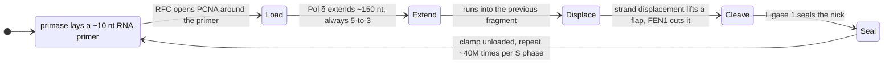
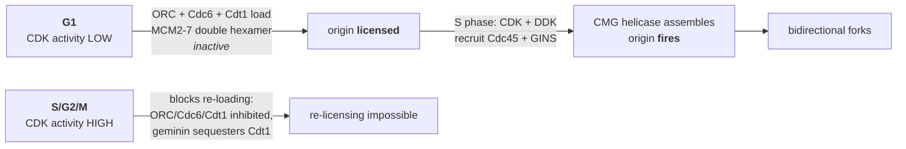

# 04 — DNA replication

> **Before this:** [Ch 01](../part-00-orientation/01-chemistry-and-cell-primer.md) · [Ch 02](02-dna-structure.md) · [Ch 03](03-genomes-chromosomes-chromatin.md) · **Time:** ~40 min

## What you'll be able to do

- Explain the density-gradient logic of the Meselson–Stahl experiment, and say exactly which generation kills which hypothesis
- Derive why a eukaryotic genome needs tens of thousands of origins, from fork speed and S-phase duration, and explain how licensing gets exactly-once semantics out of origins that fire stochastically
- Explain, from the chemistry of the polymerase reaction alone, why one new strand is made continuously and the other in fragments — and say what each component at the fork contributes
- Decompose the ~10⁻¹⁰ per-base error rate into three multiplicative filters, and predict the phenotype of losing each one
- Explain the end-replication problem, why telomerase solves it, and why the solution is switched off in most of your cells
- Distinguish a stalled fork from a collapsed one, and explain why replication stress — collisions with transcription, fragile sites, oncogene-driven over-firing — is routine rather than exceptional
- Predict which regions carry the highest somatic mutation density from replication timing and chromatin state, and diagnose the cancer driver calls that regional variation breaks

## The core idea

Copying a genome looks like it should be the easy part: separate the two complementary strands, read each, write the complement. A `memcpy` with a checksum. Three things make it hard, and essentially all of the mechanism is a response to them.

**The copying enzyme only works in one direction.** DNA polymerase extends a chain at its 3′ end and nowhere else. The strands are antiparallel, so at any moving fork one new strand can be extended toward the fork and the other cannot. The second has to be built backwards, in pieces, and stitched together. That is not an implementation detail — it is the reason half the machinery exists.

**The copy must be almost perfect, and no single step is close.** The observed error rate is around one substitution per 10⁹–10¹⁰ bases. No enzyme achieves that. Three individually mediocre mechanisms are applied in series, and the rates multiply.

**It has to happen exactly once per cell cycle**, on a substrate simultaneously being transcribed, packaged into nucleosomes, chemically damaged, and twisted by the act of unwinding itself. Replication is a copy operation running concurrently with everything else the genome is doing, with no locks.

---

## 1. Semiconservative replication, and how it was proved

Base pairing implies that each strand can template the other. It does not tell you what happens to the parental strands. Three models were live in the 1950s:

| Model | After one round of copying, each daughter duplex is… |
|---|---|
| **Conservative** | Either both-old or both-new. The parental duplex survives intact |
| **Semiconservative** | One old strand + one new strand |
| **Dispersive** | Both strands are patchworks of old and new segments |

Meselson and Stahl (1958) separated these with one idea: **make old and new DNA physically distinguishable by weight, then weigh it.**

Grow *E. coli* for many generations in medium whose only nitrogen source carries the heavy isotope ¹⁵N, so every base in every genome is heavy. Then transfer to ordinary ¹⁴N medium and sample after each generation. Anything made after the switch is light; anything inherited is heavy.

The measurement is the beautiful part. Spin a caesium chloride solution hard enough and long enough and the CsCl itself redistributes into a smooth **density gradient** — dense at the bottom of the tube, light at the top. DNA migrates until it reaches the depth where the solution's density matches its own **buoyant density**, and stops. It is an equilibrium method, not a rate method: band position is a physical constant of the molecule, not a function of how long you spun. ¹⁵N- and ¹⁴N-DNA differ in density by under 1%, and that is enough — the gradient is shallow, the bands are sharp, and the two resolve cleanly.

```
     LIGHT ◄───────────── buoyant density ─────────────► HEAVY
            (all ¹⁴N)         (hybrid)          (all ¹⁵N)

  gen 0                                          ████████
  gen 1                        ████████
  gen 2      ████████          ████████
  gen 3     ████████████         ████
  gen 4    ██████████████         ██

           bar width ∝ fraction of total DNA in that band
```

Now read the discrimination.

**Generation 1 kills the conservative model.** Conservative replication predicts *two* bands — a surviving heavy parental duplex and a fully light daughter, in equal amounts. What appears is a *single* band at exactly intermediate density, with no heavy DNA left.

**Generation 2 kills the dispersive model.** Both surviving models explain generation 1: a hybrid duplex is half-heavy, and so is a uniformly dispersed patchwork. They diverge at generation 2. Dispersive predicts one band that keeps getting lighter — always one band, never two. Semiconservative predicts **two discrete bands**, half the DNA hybrid and half fully light, with the hybrid band never moving. Two bands appeared.

The instructive feature of the design is that generation 1 was not enough and the authors knew it. An experiment that separates your favoured hypothesis only from the most obviously wrong alternative has not tested anything. They also ran the confirmation: heat the generation-1 hybrid to separate the strands and re-run. Semiconservative predicts two single-strand bands, one heavy and one light; dispersive predicts every single strand to be intermediate. Two bands.

## 2. Origins, bubbles, and bidirectional forks

Replication does not start at the end of a chromosome and run to the other end. Do the arithmetic and you can see why not.

A human replication fork moves at roughly **1–2 kb per minute** — call it 1.5. Chromosome 1 is 249 Mb (GRCh38). One origin at the centre, two forks travelling outward, each covering 124.5 Mb:

```
124,500,000 bp ÷ 1,500 bp/min = 83,000 min ≈ 58 days
```

Two months for one chromosome. S phase in a human cell is about **8 hours**. The gap is more than two orders of magnitude — 83,000 minutes needed against 480 available, a factor of ~170 — and it is closed the only way it can be: **massive parallelism.**

Replication initiates at many **origins** simultaneously. Each origin opens a **replication bubble** with a fork at each end, travelling in opposite directions, until each fork meets a fork coming the other way from a neighbouring origin.

```
   origin                          origin
      │                               │
 ═════╪═══════════════════════════════╪═════   parental duplex

 ════<══>═══════════════════════<══>══════     t₁  bubbles open,
      ←  →                       ←  →              two forks each

 ═<════════>═══════════════<══════════>══      t₂  forks diverge

 <══════════════><══════════════════════>      t₃  forks meet and
                 ▲                                 terminate here
```

How many origins? Each fork runs for at most the length of S phase: 1.5 kb/min × 480 min = 720 kb. A bidirectional origin therefore covers ~1.44 Mb at best. A diploid genome of **6.2 Gb** needs at least 6.2 × 10⁹ / 1.44 × 10⁶ ≈ **4,300 origins** even under the impossible assumption that every fork runs the entire S phase without stopping. In reality origins fire in waves throughout S phase, forks terminate early against their neighbours, and the measured figure is **30,000–50,000 origins fired per cell cycle**.

Where they are is a genuinely different story in bacteria and eukaryotes:

| | Bacteria (*E. coli*) | Budding yeast | Human |
|---|---|---|---|
| Origins per genome | **one** (*oriC*, ~245 bp) | a few hundred (*ARS*, ~11 bp consensus) | 30,000–50,000 fired, far more licensed |
| Defined by | sequence | sequence | **chromatin context**, not sequence |
| Genome / time | 4.6 Mb in ~40 min | 12 Mb | 3.1 Gb (haploid) in ~8 h |

That middle row matters computationally: **you cannot grep for a human replication origin.** There is no consensus motif. Origin choice is set by nucleosome-free regions, ORC binding, G-quadruplex-forming sequence and chromatin state, it varies between cell types, and it is stochastic between individual cells in the same population — only ~5–10% of licensed origins fire in any given cycle.

*E. coli* with a single origin replicates its 4.6 Mb chromosome in ~38 minutes (2.3 Mb per fork at ~1,000 bp/s). It can nevertheless divide every 20 minutes, by starting the next round of replication before the current one finishes — nested forks, several rounds in flight at once.

## 3. The constraint that shapes everything: 5′→3′ only

Here is the reaction. The 3′-OH at the end of the growing chain attacks the innermost phosphate of an incoming deoxynucleoside **tri**phosphate. A new phosphodiester bond forms and pyrophosphate leaves; hydrolysis of that pyrophosphate makes the step effectively irreversible.

Two consequences fall straight out.

**A polymerase cannot start a chain.** It can only extend an existing 3′-OH. Something else must lay down the first few nucleotides — that is **primase**, an RNA polymerase, which *can* start from nothing. The primer is RNA and not DNA for a good reason: RNA is chemically marked as foreign in a DNA molecule, so it can be found and removed later. The least accurate nucleotides in every fragment — the ones laid down without a template-matched predecessor to check against — are deliberately made of a material that is guaranteed to be excised.

**Synthesis cannot run 3′→5′.** The energy for each addition comes from the triphosphate on the *incoming* nucleotide. Reverse the direction and the triphosphate would have to sit on the growing chain's 5′ end — in which case removing a wrongly incorporated terminal nucleotide would leave a monophosphate and permanently dead-end the chain. **Proofreading and 5′→3′ synthesis are the same design decision.** A hypothetical 3′→5′ polymerase could not proofread, and a polymerase that cannot proofread is 10⁵ times too inaccurate to build a genome.

Now combine that with antiparallel strands. At a fork moving rightward:

```
                                             fork moves ──►
  lagging-strand template
  5'──────────────────────────────────────────────────╮
                                                      │
     3'◄═══════5'  3'◄══════5'  3'◄═════5'            │
      fragment 1    fragment 2   fragment 3           │  helicase
      (oldest)                   (newest, at the fork)│  unwinds here
                                                      │
     5'════════════════════════════════════════►3'    │
      leading strand — one continuous chain           │
                                                      │
  3'──────────────────────────────────────────────────╯
  leading-strand template
```

The **leading strand** is extended toward the fork and is synthesised continuously. The **lagging strand** must grow away from the fork, so it is made in short pieces — **Okazaki fragments** — each newly primed at the position closest to the fork and extended backwards into the previous fragment.

Both strands are made 5′→3′. There is no exception, anywhere, in any organism.

Fragment sizes: **1,000–2,000 nt in bacteria, 100–200 nt in eukaryotes**. The eukaryotic figure is not arbitrary — Okazaki fragment ends map onto nucleosome midpoints, because the fragment terminates when the polymerase runs into the next re-deposited histone octamer. Chromatin sets the fragment length.

Count them. Replicating a 6.2 Gb diploid genome means synthesising 1.24 × 10¹⁰ new nucleotides, half of them on lagging strands. At ~150 nt per fragment that is roughly **40 million prime–extend–clean-up cycles per S phase**, each needing a primer laid, a clamp loaded, a polymerase engaged, the primer removed and the nick sealed. Every one of them completed correctly.

## 4. The machinery at the fork

| Component | Bacteria | Eukaryotes | Job — and what fails without it |
|---|---|---|---|
| **Helicase** | DnaB (5′→3′ on lagging template) | CMG: Cdc45–MCM2-7–GINS (3′→5′ on leading template) | Breaks the base pairs ahead of the fork. Without it, nothing opens |
| **Single-strand binding** | SSB | RPA | Coats exposed single strands, stops re-annealing and hairpin formation. RPA-coated ssDNA is also the *signal* that a fork is in trouble ([§10](#10-replication-stress-and-fork-collapse)) |
| **Primase** | DnaG | Pol α–primase | Lays the RNA primer. Needed once per leading strand, ~40 million times on lagging strands |
| **Replicative polymerase** | Pol III holoenzyme | Pol ε (leading), Pol δ (lagging) | Extends. Bare polymerase falls off after ~10 nt |
| **Sliding clamp** | β clamp (dimer) | PCNA (trimer) | A ring encircling DNA that tethers the polymerase. Raises processivity from ~10 nt to >50 kb |
| **Clamp loader** | γ/τ complex | RFC | ATP-driven; cracks the clamp open and closes it around each new primer |
| **Primer removal** | Pol I 5′→3′ exonuclease (nick translation) | Pol δ strand displacement + FEN1 flap endonuclease (Dna2 for long flaps) | Excises RNA and replaces it with DNA |
| **Ligase** | LigA (NAD⁺-dependent) | Ligase 1 (ATP-dependent) | Seals the remaining nick. Without it the lagging strand stays as fragments |
| **Topoisomerase** | Topo I; DNA gyrase (Topo II) | Topo I, Topo II | Relieves torsional stress ahead of the fork; Topo II also disentangles the finished sister chromatids |

Two of these deserve more than a table row.

**The sliding clamp is the reason replication is fast.** The clamp is a closed ring threaded onto the DNA; the polymerase grips the ring rather than the DNA, so it slides freely along the template while being topologically unable to leave — the difference between holding a rope and being handcuffed to it. On the lagging strand a clamp must be loaded and unloaded for *every* fragment, which makes the loader one of the busiest machines in the cell.

**Torsion is a quantitative problem, not a hand-wave.** DNA has ~10.5 bp per turn, so unwinding at 1,000 bp/s in *E. coli* requires the duplex ahead of the fork to rotate about **95 times per second** — or to accumulate that many positive supercoils. A circular chromosome cannot rotate freely, and neither can a several-hundred-megabase chromosome anchored in a nucleus. Topoisomerases cut the backbone (one strand for Topo I, both for the ATP-driven Topo II), pass DNA through the break, and reseal. That transient covalent enzyme–DNA intermediate is a major drug target: fluoroquinolones trap bacterial gyrase, etoposide and irinotecan trap human Topo II and Topo I. All of them work by blocking the *resealing* step, converting a routine intermediate into a double-strand break when the next fork arrives.

Geometry forces one further trick. Both polymerases belong to a single complex moving in one physical direction, which is only possible if the lagging-strand template loops back on itself — the "trombone" model, the loop growing as a fragment is extended and collapsing when it is finished.



## 5. Polymerases: prokaryotic and eukaryotic

Bacteria manage with a small set. *E. coli* has five DNA polymerases; two do replication.

| Enzyme | Role | Proofreads? |
|---|---|---|
| **Pol III** | The replicase. Both leading and lagging strands, held together by the clamp loader as one holoenzyme — classically drawn as a dimer, but live-cell counting finds three polymerase cores per replisome (Reyes-Lamothe et al., *Science* 2010) | Yes (ε subunit) |
| **Pol I** | Not a replicase. Its 5′→3′ exonuclease chews out RNA primers while its polymerase fills behind — "nick translation". Also a repair enzyme | Yes |

Eukaryotes split the job three ways, and the split is informative:

| Enzyme | Role | Proofreads? |
|---|---|---|
| **Pol α–primase** | Starts every fragment: ~10 nt of RNA, then ~20 nt of DNA. Then hands off | **No** |
| **Pol ε** | Extends the **leading** strand | Yes |
| **Pol δ** | Extends the **lagging** strand; also does Okazaki maturation and fills gaps in repair | Yes |

Pol α cannot proofread, which is exactly why it is allowed to make only the first ~30 nucleotides — and why most of those are later removed and resynthesised by an enzyme that can. The Pol ε / Pol δ division of labour was established by tracking where each enzyme's characteristic errors land in proofreading-deficient mutants; the assignment is well supported, though the details of hand-off remain active work.

## 6. Fidelity is a product of filters, not a property of an enzyme

This is the argument made qualitatively in [Ch 01 §5](../part-00-orientation/01-chemistry-and-cell-primer.md#5-the-part-that-changes-how-you-think-everything-is-stochastic), now with numbers.

Hydrogen-bonding energetics alone distinguish a correct base pair from an incorrect one by only about a factor of 10–100 — nowhere near enough. Three filters are applied in series:

| Filter | Mechanism | Error rate after | Factor gained |
|---|---|---|---|
| **Base selection** | The polymerase active site is a geometric template. A correct Watson–Crick pair fits and triggers a conformational change that permits catalysis; a mispair does not fit and catalysis is ~10³-fold slower | ~10⁻⁵ | ~10⁵ |
| **Proofreading** | A mispaired 3′ end frays, the DNA transfers to a separate 3′→5′ **exonuclease** site 3–4 nm away, the wrong nucleotide is excised, and the DNA returns | ~10⁻⁷ | ~10² |
| **Mismatch repair** | Post-replicative. Scans for the helix distortion a mismatch causes, identifies which strand is new, excises a tract around the error and resynthesises | ~10⁻⁹–10⁻¹⁰ | 10²–10³ |

Multiply: 10⁻⁵ × 10⁻² × 10⁻³ ≈ **10⁻¹⁰ per base per replication**.

> **No step in replication is accurate enough to copy a genome.** The observed fidelity is a *product* of three independent, individually unimpressive filters. This has a sharp consequence: lose any one of them and you lose its entire factor, not some fraction of it. Fidelity does not degrade gracefully.

Humans confirm that prediction brutally. Inherit a broken mismatch-repair gene (*MLH1*, *MSH2*, *MSH6*, *PMS2*) and you have Lynch syndrome — tumours with 10²–10³-fold elevated mutation rates and unstable microsatellites. Acquire a mutation in the exonuclease domain of *POLE* and you get "ultramutated" tumours carrying more than 100 mutations per megabase, over a hundred times the normal somatic burden ([Ch 56](../part-11-human-and-statistical-genomics/56-cancer-genomics.md)).

Note what the third filter requires: mismatch repair must know which strand is new, or it will "correct" the template half the time and make the error permanent. Bacteria label the strand with **Dam methylation** — GATC sites are methylated on both strands, but for a few minutes after the fork passes only the parental strand is, and repair reads that hemimethylated state. Eukaryotes use the nicks transiently present in the nascent strand — the un-ligated Okazaki junctions themselves — plus the orientation of PCNA.

Sanity-check against the pinned germline rate: ~10⁻¹⁰ per base per division, multiplied through the few hundred divisions separating a male zygote from his sperm, gives a few × 10⁻⁸, against a measured rate of **~1.1–1.3 × 10⁻⁸ per bp per generation** ([verified-facts](../reference/verified-facts.md)). Note the direction: the estimate *overshoots* the measurement by a factor of two or three. That is the expected failure mode, because 10⁻¹⁰ is an order-of-magnitude bound rather than a measured constant — the true per-division fidelity is somewhat better than that, or the effective division count somewhat lower. Agreement within a small factor is all this calculation is entitled to claim. Separately, and pushing the other way, the germline total is not purely replicative at all: a substantial share of germline mutation comes from unrepaired chemical damage rather than polymerase error ([Ch 16](../part-03-genome-instability/16-mutation.md)).

## 7. The ends of linear chromosomes

Circular bacterial chromosomes have no ends and no problem. Linear ones do.

The last Okazaki fragment on a chromosome is primed some distance from the terminus. When its RNA primer is removed, the resulting gap cannot be filled, because filling it needs a 3′-OH on the far side — which would belong to a fragment primed off the end of the molecule.

```
   lagging-strand template                       chromosome end
   5'───────────────────────────────────────────────────────┫ 3'
       ◄══════════  ◄══════════  ◄════════rrr               ┃
        fragment 1   fragment 2   last fragment  ▲          ┃
                                                 RNA primer ┃
                                                 (removed)  ┃
   result 5'─────────────────────────────────           ────┫
                                                └── gap: unfillable,
                                    no 3'-OH exists to its right
```

**Every round of lagging-strand synthesis therefore loses the length of a terminal primer.** The leading strand could in principle be copied to the last base — but it is not left blunt: nucleases deliberately resect the new strand's 5′ end to generate a single-stranded 3′ overhang. Both ends shorten, and part of the shortening is a choice rather than a limitation.

The solution is to make the ends expendable. Human chromosomes terminate in **telomeres**: thousands of tandem copies of the hexamer **TTAGGG**, totalling roughly **10–15 kb at birth**, ending in a 3′ overhang of 50–300 nt. The overhang folds back and invades the duplex to form a **t-loop**, bound by the six-protein **shelterin** complex. Two jobs: supply sequence that is safe to lose, and hide the chromosome end from repair machinery that would otherwise read a natural terminus as a double-strand break and fuse it to another chromosome.

Telomeres shorten by **~50–200 bp per division**, so somatic cells carry a division counter. After **40–60 population doublings** — the **Hayflick limit**, measured in cultured human fibroblasts in 1961 — the ends can no longer be protected, a DNA-damage response fires, and the cell enters irreversible **senescence**.

**Telomerase** resets the counter. It is a reverse transcriptase (protein subunit TERT) carrying **its own RNA template** (TERC), which contains the complement of the telomere repeat: it binds the 3′ overhang, copies a repeat from its internal template, translocates, and repeats — extending the chromosome without any external template. It is active in the germ line, in stem cells, and transiently in activated lymphocytes, and off in most somatic cells.

That off-switch is a tumour suppressor: a cell needing hundreds of divisions to form a tumour runs out of telomere first, unless it restores telomere maintenance. It nearly always does — **85–90% of cancers reactivate telomerase and 10–15% use ALT**, a recombination-based mechanism. Two point mutations in the *TERT* promoter are among the commonest routes, at **GRCh38 chr5:1,295,113 and chr5:1,295,135** (conventionally named C228T and C250T; the C>T is written on the *TERT* coding strand, which is the minus strand of chromosome 5). Each creates a new binding site for an ETS-family transcription factor and raises *TERT* transcription several-fold. They are among the most frequent non-coding somatic mutations known, present in roughly 70–80% of glioblastomas and melanomas.

The awkward part is that telomere attrition is *also* pro-cancer. A pre-malignant cell that reaches critically short telomeres before reactivating telomerase suffers end-to-end chromosome fusions, and a fused dicentric chromosome is torn apart at the next division — the breakage–fusion–bridge cycle, one of the classic engines of chaotic tumour karyotypes ([Ch 20](../part-03-genome-instability/20-chromosome-abnormalities.md)).

## 8. Once and only once: licensing

Replicating any region twice in one cycle would produce copy-number gain and, at a fork, a broken chromosome. Getting exactly-once semantics out of tens of thousands of independent, stochastically firing origins is a hard concurrency problem, and the solution is elegant: **make licensing and firing require mutually exclusive conditions, separated in time.**



In G1, CDK activity is low, and that is the only window in which the MCM2-7 helicase can be loaded — as an inactive double hexamer. Entering S phase raises CDK activity, and the *same* signal does two things: it activates loaded helicases and it blocks any further loading. A spent licence cannot be reissued until the cell passes through mitosis and CDK activity collapses again.

There is no counter and no lock here. It is a phase constraint: permission to license and the trigger to fire can never be true simultaneously. Deregulate it — overexpress Cdt1, lose geminin — and cells re-replicate, producing gene amplification.

Licensing is deliberately generous. MCM2-7 is loaded at **10–20× more sites than ever fire**; the excess are **dormant origins**, reserve capacity that lets a cell finish S phase when forks stall ([§10](#10-replication-stress-and-fork-collapse)).

## 9. Timing, chromatin, and where mutations land

Origins do not all fire at once. Firing is spread across S phase in a reproducible pattern of **replication timing domains** a few hundred kilobases to a megabase wide, mappable by sequencing newly synthesised DNA at intervals through S phase (Repli-seq). Timing tracks chromatin state almost exactly:

| Early-replicating | Late-replicating |
|---|---|
| Open chromatin, accessible | Compact heterochromatin |
| Gene-rich, actively transcribed | Gene-poor, silent |
| A compartment ([Ch 50](../part-10-functional-genomics/50-3d-genome.md)) | B compartment; often at the nuclear lamina |
| GC-rich | AT-rich |
| **Lower mutation rate** | **Higher mutation rate** |

That last row is the one with consequences. Late-replicating regions accumulate substantially more mutations, in the germ line and far more visibly in tumours. Several mechanisms contribute: nucleotide pools are depleted by late S phase, so polymerases misincorporate more; mismatch repair is coupled to replication and works better early; late forks expose more persistent single-stranded DNA.

The effect is large enough to break naive analysis. Chromatin features plus replication timing explain **up to ~86% of the variance in somatic mutation density at megabase scale** across cancer genomes (Polak et al., *Nature* 2015). A method that asks "is this gene mutated more than chance predicts?" against a genome-wide average background will nominate long, late-replicating, lowly expressed genes as drivers purely for sitting in high-background neighbourhoods. That is why modern driver detection models a *local* background rate (Lawrence et al., *Nature* 2013).

Replication also has to rebuild chromatin behind itself: parental histones are recycled onto both daughter strands, and new ones are deposited by chaperones recruited via PCNA. That partial, diluted inheritance of histone marks is one of the mechanisms — an imperfect one — by which chromatin state survives cell division ([Ch 23](../part-04-gene-regulation/23-chromatin-and-epigenetics.md)).

## 10. Replication stress and fork collapse

A fork stalls whenever it meets something it cannot pass: a chemical lesion, a G-quadruplex, a repeat that forms a hairpin, a tightly bound protein, an R-loop where transcription has left RNA paired with DNA, a trapped topoisomerase, or simply a shortage of dNTPs. Collectively this is **replication stress**, and it is routine rather than exceptional.

A stalled fork is not yet a disaster. The helicase keeps unwinding after the polymerase stops, exposing long stretches of RPA-coated single-stranded DNA — which is the signal that activates the **ATR–CHK1** checkpoint. ATR stabilises the fork, suppresses global origin firing while permitting local dormant origins to rescue the unreplicated region, and delays mitosis. Forks can also **reverse**, backing up and re-annealing the two nascent strands into a four-way "chicken foot" that protects the end while the obstacle is cleared.

A **collapsed** fork is a disaster: the replisome disassembles and the exposed end becomes a one-ended double-strand break, with no second end to ligate to. Repair requires recombination with the sister chromatid ([Ch 18](../part-03-genome-instability/18-recombination-mechanisms.md)), and when that goes wrong the products are translocations, deletions and copy-number changes.

**Common fragile sites** are large, late-replicating, gene-poor regions — often containing very long genes — where replication routinely fails to finish before mitosis. FRA3B, inside *FHIT*, is the archetype; they break reproducibly under mild replication stress and are recurrent sites of deletion in tumours.

**Oncogene-induced replication stress** is an early event in cancer. Activating *MYC* or *RAS* forces cells into S phase and fires too many origins at once, exhausting nucleotide pools and RPA. The resulting fork collapse generates the damage that activates p53 — which is why loss of the damage response is so often the *next* step in tumour evolution ([Ch 56](../part-11-human-and-statistical-genomics/56-cancer-genomics.md)). It also opens a therapeutic window: cells already running at the edge of replication catastrophe are unusually sensitive to ATR, CHK1 and WEE1 inhibitors.

---

## Common misconceptions

| What people think | What's actually true |
|---|---|
| DNA polymerase unwinds the double helix | It does not. Helicase unwinds; polymerase can only copy an already-separated template. Removing helicase stops replication before polymerase is even relevant |
| Replication starts at one end of a chromosome | It starts at tens of thousands of internal origins, each opening a bubble with two forks running in opposite directions. Sequential copying of chromosome 1 would take about two months |
| The lagging strand is synthesised 3′→5′ | No strand, anywhere, is ever synthesised 3′→5′. Each Okazaki fragment is made 5′→3′; the *series* of fragments moves away from the fork. The direction of the fragments and the direction of the strand's growth are different things |
| Proofreading is what makes replication accurate | Proofreading contributes one factor of ~100 out of ~10¹⁰. Base selection contributes 10⁵ and mismatch repair another 10²–10³. Any one of the three, alone, is hopelessly inadequate |
| Meselson and Stahl proved semiconservative replication in one generation | Generation 1 only excluded the conservative model. Dispersive replication predicts an identical intermediate band. The second generation — two discrete bands rather than one drifting band — is what settled it |
| Telomeres shorten because polymerase "can't copy the last bit" | The lagging-strand terminal-primer gap is real, but the leading-strand end is also deliberately resected by nucleases to create the 3′ overhang. Both ends shorten, and part of the shortening is an active choice, not a limitation |
| Longer telomeres are healthier; telomerase is an anti-ageing enzyme | It is a division counter with a genuine trade-off. Germline variants that shorten telomeres cause bone-marrow failure and pulmonary fibrosis; germline variants that lengthen them raise the risk of melanoma, glioma and other cancers. Reactivated telomerase is a near-universal feature of tumours |
| Every origin fires in every cell cycle | Only ~5–10% do, and which ones is stochastic and differs between individual cells. The 10–20× excess of licensed origins is deliberate reserve capacity for when forks stall |
| Replication and transcription politely take turns | They collide, especially head-on, and those collisions are a major source of R-loops, fork stalling and mutation. Highly transcribed genes tend to be oriented so that collisions are co-directional |

## Worked example: reading a Meselson–Stahl gradient

**Part (a) — predict all three models, quantitatively.**

Setup: one duplex, both strands ¹⁵N-heavy, transferred to ¹⁴N medium at generation 0.

After *n* rounds there are 2ⁿ duplexes, hence 2ⁿ⁺¹ strands, of which exactly **2** are the original heavy strands (strands are conserved; they are never destroyed) and 2ⁿ⁺¹ − 2 are new and light.

*Semiconservative.* Each of the 2 original heavy strands sits in a duplex with a light partner → exactly **2 hybrid duplexes**, always. Everything else is fully light.

```
fraction hybrid = 2 / 2ⁿ = 2^(1−n)
fraction light  = 1 − 2^(1−n)
```

*Conservative.* The one original duplex survives unchanged; everything else is fully light.

```
fraction heavy = 1 / 2ⁿ ,   fraction light = 1 − 1/2ⁿ ,   no hybrid, ever
```

*Dispersive.* Old material is distributed evenly among all duplexes, so every duplex is identical and its ¹⁵N fraction is 1/2ⁿ. **One band always**, drifting continuously toward light.

| Generation | Semiconservative | Conservative | Dispersive |
|---|---|---|---|
| 0 | 100% heavy | 100% heavy | 100% heavy |
| 1 | **100% hybrid** | 50% heavy + 50% light | 100% at ½-heavy |
| 2 | **50% hybrid + 50% light** | 25% heavy + 75% light | 100% at ¼-heavy |
| 3 | 25% hybrid + 75% light | 12.5% heavy + 87.5% light | 100% at ⅛-heavy |
| 4 | 12.5% hybrid + 87.5% light | 6.25% heavy + 93.75% light | 100% at 1⁄16-heavy |

Now compare against what was observed — generation 1: a single band at intermediate density, no heavy band; generation 2: two bands, equal intensity, at intermediate and light positions.

- Generation 1 has **no heavy band**, so conservative is excluded. Semiconservative and dispersive both predict what was seen.
- Generation 2 has **two discrete bands**, so dispersive is excluded — it can never produce two bands, only one that moves. And the intermediate band is at the *same density* as at generation 1, not at ¼-heavy.

Only semiconservative survives both.

**Part (b) — the inverse problem.**

You are handed an unlabelled gradient from the same experiment. Densitometry gives 12.5% of the DNA in the intermediate band and 87.5% in the light band. Which generation is it?

```
2^(1−n) = 0.125 = 2⁻³
1 − n = −3
n = 4
```

Four generations. Note what makes this inference possible: the *number* of bands identifies the mechanism, and the *ratio* of the bands identifies the generation. Two independent readouts from one photograph.

**Part (c) — the confirmatory control.**

Suppose a colleague reports the generation-2 gradient as one band at ¼ density and concludes dispersive replication. Ask them to denature the sample and re-run it. Semiconservative replication predicts that heating hybrid duplexes yields one fully heavy and one fully light single strand — two bands at the extremes. Dispersive replication predicts that every single strand is a patchwork, so all of them band together in the middle. This was Meselson and Stahl's own control, and it is the cleaner experiment: it interrogates the composition of individual strands rather than of duplexes.

## Connections

- **Back to:** [Ch 01](../part-00-orientation/01-chemistry-and-cell-primer.md) — §5 introduced the "three imperfect filters in series" argument that §6 here makes quantitative; [Ch 02](02-dna-structure.md) — antiparallel strands and the 5′/3′ asymmetry, which is the entire origin of the leading/lagging split; [Ch 03](03-genomes-chromosomes-chromatin.md) — chromatin, chromosome ends, and why origins are defined by packaging rather than sequence
- **Forward to:** [Ch 09](../part-02-transmission-genetics/09-mitosis-and-meiosis.md) — where S phase sits in the cell cycle, and why sister chromatids exist; [Ch 16](../part-03-genome-instability/16-mutation.md) — replication error as one of several mutational sources; [Ch 17](../part-03-genome-instability/17-dna-repair.md) — mismatch repair, the third filter, in mechanistic detail; [Ch 18](../part-03-genome-instability/18-recombination-mechanisms.md) — how a collapsed fork is rescued; [Ch 20](../part-03-genome-instability/20-chromosome-abnormalities.md) — breakage–fusion–bridge cycles and fragile-site deletions; [Ch 36](../part-08-methods/36-core-molecular-methods.md) — PCR is this chemistry with everything except polymerase, primer and template removed; [Ch 56](../part-11-human-and-statistical-genomics/56-cancer-genomics.md) — *TERT* promoter mutations, POLE-ultramutated tumours, and modelling the local background mutation rate

## Check yourself

**1. Why is there no such thing as a 3′→5′ DNA polymerase, and what does the answer have to do with proofreading?**

<details><summary>Answer</summary>

The energy for chain extension comes from the triphosphate of the *incoming* nucleotide: the chain's 3′-OH attacks it, and pyrophosphate release drives the reaction. If synthesis ran 3′→5′, the activating triphosphate would have to be carried on the growing chain's 5′ end. Then excising a misincorporated terminal nucleotide would strip the triphosphate off and leave a monophosphate — a permanently dead chain end.

So a 3′→5′ polymerase could not proofread without killing itself. Since proofreading supplies a factor of ~100 in fidelity and no polymerase can reach acceptable accuracy without it, 5′→3′ synthesis is effectively forced. The antiparallel geometry then makes lagging-strand fragmentation unavoidable: the leading/lagging asymmetry is a downstream consequence of a decision about where to put the energy.

</details>

**2. Human chromosome 1 is 249 Mb (GRCh38). With a fork rate of 1.5 kb/min and an 8-hour S phase, what is the minimum number of origins on chromosome 1, and why is the real number much larger?**

<details><summary>Answer</summary>

Each fork covers at most 1.5 kb/min × 480 min = 720 kb. A bidirectional origin therefore covers at most 1.44 Mb.

249 Mb ÷ 1.44 Mb ≈ **173 origins** — an absolute floor.

The real number is several-fold higher because the bound assumes every fork runs the entire S phase without pausing, that origins are evenly spaced, and that no fork terminates early against a neighbour. In reality origins fire in waves across S phase (so most forks run for a fraction of it), forks stall constantly, spacing is uneven, and firing is stochastic. Genome-wide, 30,000–50,000 origins fire against a floor of ~4,300 — roughly an order of magnitude of margin, which is itself the point: the margin is what makes S phase robust to individual fork failure.

</details>

**3. Why was the second generation of the Meselson–Stahl experiment necessary?**

<details><summary>Answer</summary>

Generation 1 produced a single band at intermediate density. That excludes the conservative model, which requires a surviving fully-heavy parental duplex, but it is equally consistent with semiconservative replication (a hybrid duplex is half-heavy) and dispersive replication (a uniform patchwork is also half-heavy). The two remaining hypotheses make identical predictions at generation 1.

They diverge at generation 2. Semiconservative predicts two discrete bands — hybrid and light, in a 1:1 ratio, with the hybrid band at exactly the same position as before. Dispersive predicts one band at ¼-heavy density. The observation of two bands is what eliminated dispersive replication. An experiment stopped at generation 1 would have distinguished the favoured hypothesis only from the most obviously wrong alternative.

</details>

**4. A driver-gene detection method flags a 2.3 Mb gene as significantly mutated across a tumour cohort. What should you check before believing it?**

<details><summary>Answer</summary>

Whether the background mutation rate was modelled locally. Somatic mutation density varies severalfold across the genome, and chromatin state plus replication timing explain up to ~86% of that variation at megabase scale. Very long genes are disproportionately likely to sit in late-replicating, gene-poor, lowly-expressed, heterochromatic territory — exactly the environment with the highest background rate.

A test using a genome-wide average background will therefore nominate long, late-replicating genes as drivers on the strength of their neighbourhood alone. The check is: does the method condition on replication timing, expression level, chromatin state and local sequence context in the relevant tissue of origin? If it uses a flat rate, the hit is uninterpretable. This is a statistical-modelling failure, not a biological discovery — and it produced a well-known crop of spurious "cancer genes".

</details>

**5. Telomere shortening limits how many times a cell can divide, which should suppress cancer. Why is it also a route to genome instability?**

<details><summary>Answer</summary>

Both things are true, at different points in the same trajectory.

For nearly every cell, the counter works: telomeres reach a critical length, shelterin can no longer hide the chromosome end, a DNA-damage response fires, and the cell senesces before it can accumulate the dozens of divisions a tumour needs.

For a cell that has already lost the damage-response checkpoints — p53, most often — the counter fails safe in the wrong direction. Division continues past the critical point, unprotected chromosome ends are read as double-strand breaks, and the repair machinery fuses them. A fused dicentric chromosome is pulled toward both spindle poles at the next division and tears, generating new broken ends that fuse again: the breakage–fusion–bridge cycle. Each round scrambles the karyotype further, producing the amplifications, deletions and translocations characteristic of aggressive tumours.

The instability ends when the cell restores telomere maintenance — usually by reactivating telomerase, often through a *TERT* promoter mutation. What emerges is a cell that has passed through a period of intense chromosomal upheaval and is now immortal. Telomere attrition suppresses the many and destabilises the few that escape it.

</details>
