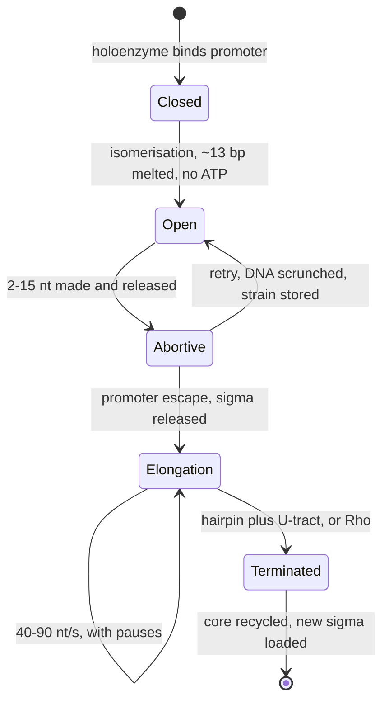
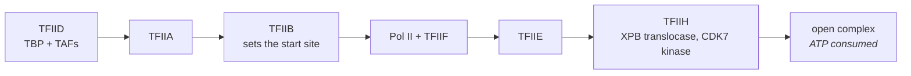
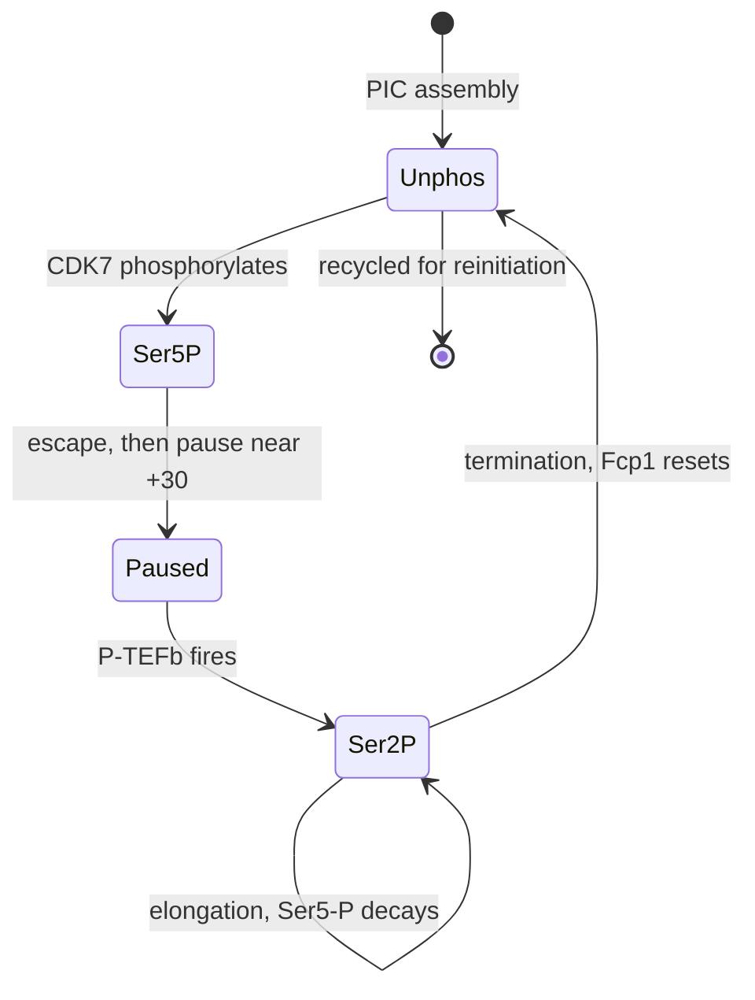

# 05 — Transcription

> **Before this:** [Ch 02](02-dna-structure.md) · [Ch 03](03-genomes-chromosomes-chromatin.md) · [Ch 04](04-dna-replication.md) · **Time:** ~35 min

## What you'll be able to do

- Given a duplex and a promoter, name the template and coding strands correctly and write the RNA
- Explain why transcription is content with a per-event error rate four to six orders of magnitude worse than replication's, and why the germline per-generation rate is not the like-for-like comparator
- Derive why the bacterial −10 element is AT-rich and why spacer *length* matters more than spacer sequence, then trace the cycle from σ binding through intrinsic or Rho-dependent termination
- Describe Pol II pre-initiation complex assembly, read the CTD phosphorylation cycle as a state machine, and explain why pause release rather than recruitment is the rate-limiting step at most metazoan genes
- Explain why an enhancer's target need not be its nearest gene, and what that costs anyone who assigns a non-coding variant by proximity
- Compute how long a megabase-scale gene takes to transcribe at 1–2 kb/min, and explain why compartmentalisation rather than complexity is the load-bearing difference between bacterial and eukaryotic transcription
- Say why "75% of the genome is transcribed" is true and yet weak evidence about function

## The core idea

Replication copies the archive. Transcription takes a **local, temporary, non-destructive read of one strand**, and everything else follows from those three adjectives.

*Local*, so the machine must be told where to start and stop — and those instructions sit in flanking DNA that never appears in the product. *Temporary*, so the polymerase can afford to be sloppy: an error in one of thousands of transcripts is a rounding error. *Non-destructive*, so copies are cheap, which means the cell can regulate almost everything at the point of making them.

The reframe worth carrying:

**Expression level is a rate, not a state.** A gene is never simply "on". A promoter fires some number of times per hour; each transcript decays with some half-life; abundance is the ratio. Every mechanism in this chapter and all of [Part 4](../part-04-gene-regulation/21-bacterial-regulation.md) is an intervention on one of those two numbers.

---

## 1. The chemistry, and what it inherits from replication

RNA polymerase runs the same reaction as DNA polymerase: the growing chain's 3'-hydroxyl attacks the α-phosphate of an incoming NTP, releasing pyrophosphate. So the chain grows **5'→3'** and the template is read **3'→5'**. Two differences from [Ch 04](04-dna-replication.md) matter.

**No primer.** RNA polymerase initiates *de novo*, joining the first two nucleotides with nothing to extend from. This is also why replication uses an RNA primer: the enzyme that can start from nothing makes the starter for the enzyme that cannot.

**Far lower fidelity.** Transcription mis-incorporates at roughly 10⁻⁴–10⁻⁶ per nucleotide, against replication's ~10⁻¹⁰ per base per replication ([Ch 04](04-dna-replication.md)) — four to six orders of magnitude sloppier, and irrelevant, because the product is one disposable instance among many. (The germline rate of ~1.3 × 10⁻⁸ per bp per *generation* ([verified-facts](../reference/verified-facts.md)) is a different unit and not the like-for-like comparator: it accumulates over hundreds of divisions and counts unrepaired chemical damage as well as polymerase error.)

Inside the enzyme sits the **transcription bubble**: ~12–14 bp held unwound, containing a ~9 bp RNA:DNA hybrid. The RNA is peeled off and threaded out a separate exit channel so the duplex re-anneals behind. The bubble travels with the enzyme, overwinding DNA ahead and underwinding behind — which is why topoisomerases matter as much here as in replication.

## 2. Template, coding, and the naming disaster

The polymerase physically reads one strand — the **template**. The RNA is complementary to it, and therefore *identical to the other strand* with U for T. That untouched strand is the one everyone writes down, because it reads like the product.

| Strand actually read | Strand the RNA resembles |
|---|---|
| template | coding |
| antisense | sense |
| non-coding | non-template |
| minus (of the gene) | plus (of the gene) |

Four synonyms each, and the column called "coding" is the one that mechanistically codes for nothing. Your FASTA file, GenBank, and every paper show it anyway.

```
                     transcription unit  ──────────────▶
5'- G C T A T G G A A T C C G T A -3'    coding / sense / non-template
    | | | | | | | | | | | | | | |
3'- C G A T A C C T T A G G C A T -5'    template / antisense / non-coding

RNA  5'- G C U A U G G A A U C C G U A -3'
```

Two consequences that bite in practice:

**Template-ness belongs to a transcription unit, not a chromosome.** Genes point both ways and sometimes overlap, so one gene's template is its neighbour's coding strand. "Which strand is the template?" has no global answer.

**The reference `+` strand is an arbitrary assembly convention** carrying no biological meaning. Hence the strand field in every annotation format, the need to reverse-complement a variant on a `−`-strand gene before reasoning about protein consequence, and the fact that "the C>T variant" is ambiguous until you say relative to what ([Ch 41](../part-09-genomics/41-data-formats.md)).

Positions are numbered from the **transcription start site**: `+1` is the first nucleotide in the RNA, `−1` the base immediately upstream. **There is no position 0.**

## 3. Bacteria: one engine, swappable address decoders

Bacteria have one RNA polymerase for everything. The **core enzyme** (α₂ββ'ω) can catalyse and translocate but cannot find a promoter; add a **σ factor** and the **holoenzyme** can. Core is the engine, σ is the address decoder — one worker pool, pluggable dispatch.

### The σ⁷⁰ promoter

```
    −35                 17 bp spacer               −10        6 bp    +1
    TTGACA ─────────────────────────────────────  TATAAT ───────────── A
    σ region 4 reads this                         σ region 2 melts this
    in the duplex, major groove                   and grips unpaired bases
```

Both are **consensus** sequences — the modal base at each position across many promoters, not a sequence any real promoter necessarily has. A promoter is properly scored by a position weight matrix, and strength is roughly monotone in that score. But a *perfect*-consensus promoter is too good: the holoenzyme binds so tightly it cannot escape, and output falls. Affinity and throughput are different objectives.

Two features to derive rather than memorise:

**Why is −10 AT-rich?** Because it has to melt. σ region 2 doesn't read it as a duplex — it melts ~13 bp, then grips specific unpaired bases, flipping two into pockets on the protein. A:T has two hydrogen bonds, G:C three ([Ch 02](02-dna-structure.md)), so AT-richness lowers the barrier to the one step that must happen here. The eukaryotic TATA box is AT-rich for a related but distinct reason — not melting but **deformability**: it sits well upstream of the Pol II bubble and is never unwound there, but TBP has to kink and unstack it ~90° (§6). Both exploit the same A:T/G:C hydrogen-bonding and base-stacking asymmetry, for two different jobs.

**Why does spacer length matter but not spacer sequence?** σ regions 2 and 4 are rigidly held apart on one protein, so the spacer must place −35 at the right distance *and rotational angle*. At ~10.5 bp per turn, one base changes the angle by ~34°. 17 ± 1 bp works; 15 or 20 does not, whatever lies between.

Tuning elements: an **extended −10** (upstream TG) rescues a poor −35, and an AT-rich **UP element** contacted by the α-subunit C-terminal domains raises output roughly 30-fold at very strong promoters such as the rRNA operons (measured at *rrnB* P1, where reported values run ~30–70-fold in vivo).

### σ factors as global program switches

Swapping σ reprograms transcription genome-wide in one move.

| σ | Gene | Regulon |
|---|---|---|
| σ⁷⁰ | *rpoD* | Housekeeping — most genes |
| σ³² | *rpoH* | Heat shock |
| σ³⁸ | *rpoS* | Stationary phase, general stress |
| σ²⁸ | *fliA* | Flagellar and chemotaxis |
| σ²⁴ | *rpoE* | Envelope stress |
| σ⁵⁴ | *rpoN* | Nitrogen and alternative metabolism |

σ⁵⁴ is the outlier: its holoenzyme forms a stable closed complex that cannot melt DNA alone, requiring an activator bound at an upstream site, typically 80–150 bp away, to loop over and hydrolyse ATP. That is a eukaryotic arrangement — action at a distance, ATP-driven melting — appearing once in bacteria.

### The cycle



**Abortive initiation** is not a defect. The polymerase grips the promoter and pulls downstream DNA into itself — *scrunching* — storing strain, making and dropping short transcripts until the strain breaks the σ–promoter grip. Escape, not binding, is often the slow step.

## 4. Bacterial termination: two mechanisms, both derivable

**Intrinsic (Rho-independent).** The nascent RNA carries a GC-rich inverted repeat followed immediately by 7–9 uridines. The hairpin is GC-rich so it folds fast and holds; the U-tract means the polymerase's grip on the template at that moment is **7–9 rU:dA pairs, the weakest base-paired hybrid that exists**. The hairpin forms at the exit channel and tugs the transcript backwards while the grip is at its minimum. It lets go. Neither feature alone suffices: hairpin without U-tract gives a pause, U-tract without hairpin gives a slow patch.

**Rho-dependent.** Rho is a hexameric ATP-driven 5'→3' RNA translocase. It loads at a **rut** site — C-rich, G-poor, unstructured, and crucially *not covered by ribosomes* — then chases the polymerase and prises the hybrid apart on catching a paused enzyme.

That last clause is the hinge for [Ch 21](../part-04-gene-regulation/21-bacterial-regulation.md). Rho loads only on naked RNA, and a translating ribosome covers RNA. So a translated message is protected and an untranslated one is not — which is the mechanism of **polarity**: a nonsense mutation in the first gene of an operon reduces expression of the downstream genes too, because ribosomes fall off early, Rho loads on the exposed RNA, and the rest of the operon is never transcribed.

## 5. Eukaryotes: three polymerases

| | Pol I | Pol II | Pol III |
|---|---|---|---|
| Subunits | 14 | 12 | 17 |
| Location | nucleolus | nucleoplasm | nucleoplasm |
| Products | 47S pre-rRNA → 28S, 18S, 5.8S | **mRNA**, most lncRNA, miRNA precursors, most snRNA | tRNA, 5S rRNA, U6 snRNA, 7SL, some SINEs |
| Promoter | upstream, dedicated factors (UBF, SL1) | core promoter + enhancers | often **internal**, downstream of the TSS |
| α-amanitin | resistant | exquisitely sensitive | intermediate |
| Scale | ~60% of transcription in a growing cell; rRNA is ~80% of cellular RNA by mass | the entire proteome and nearly all regulation | small abundant structural RNAs |

All three descend from the bacterial enzyme and share five subunits outright; the catalytic core is the same machine. What multiplied is the *initiation* apparatus. Two details worth keeping: α-amanitin, from the death cap mushroom, is still what operationally defines "Pol II transcript"; and Pol III type 1 and 2 promoters lie **inside** the transcribed region — a tRNA gene's promoter is the tRNA, which is why SINEs like *Alu* carry their own promoter wherever they land ([Ch 19](../part-03-genome-instability/19-transposable-elements.md)).

## 6. Pol II initiation: the pre-initiation complex

Pol II cannot recognise a promoter at all. **General transcription factors** deliver it.

**Core promoter elements.** The TATA box (TATAWAWR, roughly −31 to −24) is the famous one and the misleading one: depending how strictly the motif is defined, only about 10–25% of human core promoters have a recognisable one. Most are TATA-less, sit in CpG islands, and initiate in a *dispersed* way — a cloud of start sites spread over tens of base pairs rather than one. Inr, BRE, DPE and MTE appear in various combinations; many promoters match none of them strongly.

> **TBP is recruited even where there is no TATA box** — brought in as part of TFIID, positioned by TAF subunits reading other elements or by protein contacts alone. "TATA-less" describes the DNA, not the machinery.



TBP does something structurally violent: it wedges phenylalanines into the minor groove between base pairs and bends the DNA ~90°, tolerable only in AT-rich sequence — the same A:T/G:C energetic asymmetry that makes the bacterial −10 meltable, spent here on bending rather than on melting. TFIIB bridges TBP and Pol II and fixes where +1 falls. TFIIH does two jobs: its XPB subunit is a double-stranded DNA translocase that pumps DNA in and forces the bubble open — unlike bacteria, this **costs ATP** — while its CDK7 subunit begins phosphorylating the polymerase's tail.

**Mediator** is the interface to everything regulatory: a 26-subunit core plus a dissociable 4-subunit kinase module (CDK8, cyclin C, MED12, MED13). Enhancer-bound activators contact its tail; its head contacts Pol II and stimulates CDK7. It converts "a transcription factor is bound nearby" into "this polymerase initiates more often" ([Ch 22](../part-04-gene-regulation/22-eukaryotic-transcriptional-regulation.md)).

One caveat textbooks drop: that tidy assembly order is an *in vitro* reconstitution result. In cells much of it arrives pre-associated. Read it as a dependency graph, not a schedule.

## 7. The CTD: a state machine bolted to the polymerase

Pol II's largest subunit ends in a **C-terminal domain** of tandem **Y-S-P-T-S-P-S** heptads — 52 in mammals, 26 in budding yeast. That is ~360 residues of disordered tail whipping about outside the enzyme, and it is the best-engineered thing in this chapter.

Kinases write marks on it, phosphatases erase them, and the pattern changes systematically with position along the gene. Processing factors bind the marks, not the polymerase.

| State | Written by | Erased by | What it licenses |
|---|---|---|---|
| Unphosphorylated | — | Fcp1 | PIC entry, Mediator binding |
| **Ser5-P** | CDK7 (TFIIH) | RPAP2 / Rtr1 | **Capping enzymes**; promoter escape |
| **Ser2-P** | CDK9 (P-TEFb), CDK12/13 | Fcp1 | **Splicing**, cleavage/polyadenylation |
| Ser7-P | CDK7 | RPAP2 | Integrator, snRNA 3'-end processing |



The design insight: **the CTD carries positional information along the gene, and each processing machine subscribes to the tag rather than to a clock.** Capping enzyme binds Ser5-P, which peaks near the promoter — so the cap is added when the nascent RNA is only ~20–25 nucleotides long, before the fragile 5' end is exposed for any length of time. Splicing and 3'-end factors bind Ser2-P, which accumulates downstream, exactly where their substrates appear. RNA processing is therefore not a stage after transcription but **co-transcriptional**, implemented as mutable tags on a moving worker. All of [Ch 06](06-rna-processing.md) hangs off this.

## 8. Promoter-proximal pausing

At most metazoan genes, initiation is not the committed step.

Pol II initiates, escapes, transcribes 20–60 nucleotides — peaking around +30 — and **stops**, held stably for minutes by **DSIF** (SPT4/SPT5) and **NELF**. The transcript is capped and goes no further. Genome-wide this is the normal state of a metazoan promoter, not an exception.

Release requires **P-TEFb** (CDK9 + cyclin T1), which phosphorylates CTD Ser2, SPT5 and NELF-E together. NELF dissociates; DSIF *changes sign* and becomes a positive elongation factor; with PAF1C and SPT6 the polymerase turns processive. P-TEFb is itself regulated — most is sequestered in the **7SK snRNP** ([Ch 24](../part-04-gene-regulation/24-rna-based-regulation.md)), released on demand by BRD4 and activator complexes. So for many genes the regulated quantity is not how often a polymerase is recruited but **how often a recruited one is allowed to leave**.

> **A polymerase sitting on a promoter tells you nothing about whether the gene is expressed.** A strong Pol II ChIP-seq peak at a TSS is fully compatible with a silent gene, because the peak *is* the paused polymerase. Occupancy and output are different measurements, and conflating them is among the commonest errors in reading functional genomics data.

Why the cell bothers:

- **Speed and synchrony.** A poised polymerase releases in seconds; building a PIC takes minutes. Heat-shock and immediate-early genes such as *FOS* and *MYC* exploit this.
- **Accessibility.** A paused polymerase occupies the promoter and excludes a nucleosome.
- **A second independent input.** Recruitment and release answer to different signals — a straightforward AND gate.
- **Druggability.** CDK9 and BET inhibitors (JQ1 and successors) act here, and *MYC* — unusually pause-release-dependent — is the main target.

Measuring it needs nascent-transcription assays (PRO-seq, NET-seq), which sequence the RNA still inside the polymerase ([Ch 49](../part-10-functional-genomics/49-epigenome-profiling.md)).

## 9. Enhancers, distance, and the nearest-gene fallacy

Bacterial regulation is local: an operator overlapping the promoter, a repressor physically in the way. Eukaryotic **enhancers** are not.

An enhancer is a cluster of transcription-factor binding sites that raises initiation at a promoter **in either orientation, upstream or downstream, from tens of kilobases to about a megabase away, frequently past several intervening genes**. The canonical case: the ZRS enhancer driving *SHH* in the limb bud sits roughly 850 kb–1 Mb from *SHH*, inside intron 5 of an unrelated gene, *LMBR1*. Point mutations in it cause extra digits. Reading the sequence would never tell you what it controls.

Mechanically, the intervening DNA loops out, bringing activators into contact with Mediator and the PIC. Which loops are possible is constrained by cohesin and CTCF into topologically associating domains ([Ch 50](../part-10-functional-genomics/50-3d-genome.md)) — which is why deleting a domain boundary causes disease by connecting elements that were never meant to meet. Enhancers are themselves transcribed, yielding short unstable **eRNAs** that mark activity reliably and whose own function is still argued about.

The consequence is inescapable in Part 11: a non-coding variant need not act on its nearest gene, so assigning GWAS hits by proximity is systematically biased ([Ch 52](../part-11-human-and-statistical-genomics/52-association-to-mechanism.md)).

## 10. Rates, coupling, and the nuclear envelope

Pol II elongates at roughly **1–2 kb per minute** (measurements span ~0.5–4 kb/min). Take that seriously:

> *DMD*, the dystrophin gene, spans ~2.2 Mb.
> 2,200 kb ÷ 2 kb/min ≈ 1,100 min ≈ **18 hours** to transcribe one molecule end to end.

That is a real constraint. It exceeds many cell-cycle lengths, so the gene cannot be fully transcribed in a rapidly dividing cell, and the 3' end of a message exists many hours after its 5' end.

Bacterial RNA polymerase runs at ~40–90 nt/s (≈2.5–5 kb/min), and bacterial ribosomes translate at ~15–20 amino acids/s, consuming ~45–60 nt/s of message. **The rates match** — and that is not a coincidence.

| | Bacteria | Eukaryotes |
|---|---|---|
| Polymerases | 1 (+ swappable σ) | 3 |
| Promoter recognition | σ factor, −10/−35 | GTFs, TFIID, variable core elements |
| Open complex | spontaneous | ATP-driven (TFIIH/XPB) |
| Regulation acts at | initiation, mostly | initiation, **pause release**, elongation, processing, export |
| Regulator distance | adjacent (bp) | up to ~1 Mb |
| Transcript | often polycistronic (operons) | almost always monocistronic |
| Translation | **coupled**, same compartment | separated by the nuclear envelope |
| Processing | minimal | capping, splicing, polyadenylation — co-transcriptional |

In bacteria the ribosome loads onto the nascent mRNA while the polymerase is still transcribing, the two travelling as one assembly. Hence: no room for elaborate processing; ribosomes shield the transcript from Rho, producing polarity; and protein appears before the message is finished. (A nuance: coupling is tight in fast-growing *E. coli*, but in *B. subtilis* the polymerase can run ahead. It is a strong tendency, not a law.)

Eukaryotes cannot do this — the nuclear envelope enforces separation, and the gap it creates is where capping, splicing, polyadenylation, export licensing and nonsense-mediated surveillance all moved in. The envelope did not merely tidy things up; it created a pipeline stage into which new kinds of control could be inserted, and eukaryotes filled it.

## 11. Pervasive transcription

Point a sensitive enough assay at the genome and transcription is nearly everywhere: ENCODE reported at least **~75%** of the human genome transcribed in some cell type under some condition. GENCODE 50 annotates **35,885 lncRNA genes** against **19,442 protein-coding** ones ([verified-facts](../reference/verified-facts.md)) — nearly 2:1 for lncRNA alone, and **58,195 non-coding genes** in total (lncRNA + small ncRNA + pseudogenes), close to 3:1, all before counting unannotated material.

Where it comes from: **divergent initiation** (most mammalian promoters fire both ways; the upstream product, a PROMPT, is short-lived and destroyed by the nuclear exosome — directionality is imposed *after* initiation, the sense direction protected by U1 snRNP while the antisense direction hits polyadenylation signals and terminates early); **eRNAs**; antisense and intronic transcription; and read-through past termination sites, which rises sharply under stress.

Whether any of it is *function* is genuinely unresolved — the argument is laid out in the last Check-yourself question, and it is the same argument as junk DNA in [Ch 39](../part-09-genomics/39-genome-landscapes.md). The operational consequence is immediate regardless: in RNA-seq you *will* see reads outside annotated genes, and the abundance threshold at which you stop calling them noise is a modelling decision you are making, not a fact you are discovering ([Ch 47](../part-10-functional-genomics/47-rna-seq.md)).

---

## Common misconceptions

| What people think | What's actually true |
|---|---|
| RNA polymerase reads the coding strand | It reads the *template*. The RNA merely resembles the coding strand — which is why that's the one printed in databases |
| A gene has "a" template strand | Template-ness belongs to a transcription unit. Genes run both ways; one strand's template is the neighbouring gene's coding strand |
| Transcription starts at the TATA box | The TATA box is ~25–30 bp *upstream* of the start site, and most human promoters lack one — though TBP is recruited regardless |
| A promoter is strong or weak, like a switch | Strength is a rate, well approximated by a PWM score. And perfect consensus is counterproductive: the polymerase binds too tightly to escape |
| Once Pol II initiates, the gene is expressed | At most metazoan genes it initiates, moves ~30 nt and pauses. Release by P-TEFb is a separate, separately regulated decision |
| Pol II ChIP signal at a promoter means the gene is on | It usually means a paused polymerase. ChIP measures presence; PRO-seq and NET-seq measure output |
| Transcription is high-fidelity like replication | Per event it is roughly 10⁴–10⁶ times sloppier — ~10⁻⁴–10⁻⁶ per base against replication's ~10⁻¹⁰ per base per replication — and that is fine: the product is one disposable copy of thousands, not the archive |
| The RNA is made, then processed | Capping, splicing and 3'-end processing are co-transcriptional, recruited by CTD phosphorylation state as the polymerase moves |
| Enhancers regulate the nearest gene | They routinely skip genes and act from up to ~1 Mb. Proximity is a biased heuristic, and knowing that is most of [Ch 52](../part-11-human-and-statistical-genomics/52-association-to-mechanism.md) |
| Transcribed means functional | ~75% of the genome is transcribed, mostly at under one copy per cell and poorly conserved. Transcription is a very weak functional claim |
| Bacteria and eukaryotes differ mainly in complexity | The load-bearing difference is compartmentalisation. Coupling transcription to translation, or separating them, determines what regulation is even possible |

## Worked example: from duplex to transcript

Here is a stretch of *E. coli* DNA, coding strand 5'→3'. Find the promoter, write the RNA, explain where it stops.

```
AAAAAATT TTGACT GCTAACGTTCGATCAGT TATAAT GCTAGC ATGGCAGAATTCGTTAAACAG GCCCGCC TTCAAG GGCGGGC TTTTTTT
```

**Step 1 — find the −10.** Scan for TATAAT. It occurs once, exactly on consensus (6/6).

**Step 2 — find the −35.** By convention the −10 hexamer occupies −12 to −7. Look 17 bp upstream of its first base: `TTGACT`. Against consensus TTGACA that is **5/6**, one mismatch at the final position. A good but imperfect promoter, compensated by a perfect −10.

**Step 3 — check the spacer.** Between the hexamers lies `GCTAACGTTCGATCAGT` = **17 bp**, the optimum. Its sequence is irrelevant; its length is not.

**Step 4 — number the positions.**

```
 −43      −35    −30                    −13 −12   −7 −6   −1 +1
 AAAAAATT TTGACT GCTAACGTTCGATCAGT       TATAAT GCTAGC  A...
          └─−35─┘└──── 17 bp ────────────┘└−10─┘└ disc.┘  ↑
                                                         TSS
```

Check: 6 (−35) + 17 (spacer) + 6 (−10) + 6 (discriminator) = 35 positions, spanning −35 to −1. Consistent.

**Step 5 — write both strands over the transcribed region.**

```
5'- A T G G C A G A A T T C G T T A A A C A G ...   coding (given)
3'- T A C C G T C T T A A G C A A T T T G T C ...   template (read 3'→5')
```

**Step 6 — write the RNA.** It matches the coding strand with U for T, from +1:

```
5'- AUGGCAGAAUUCGUUAAACAG GCCCGCC UUCAAG GGCGGGC UUUUUUU -3'
```

**Step 7 — fold the 3' end.** `GCCCGCC` and `GGCGGGC` are reverse complements, so they pair with `UUCAAG` as the loop:

```
                                              U  U
  5'- ...A A A C A G   G C C C G C C                C
                       | | | | | | |   ← 7 bp stem,  A
  3'- U U U U U U U    C G G G C G G     all G:C  G  A
      └─────┬─────┘
   these 7 rU:dA pairs are the polymerase's
   entire grip on the template right now
```

**Step 8 — explain termination.** A 7 bp all-GC stem folds essentially the moment it clears the exit channel. Behind it, the enzyme holds the transcript by 7 rU:dA pairs — the weakest RNA:DNA hybrid available. The hairpin pulls, the hybrid cannot resist, the complex dissociates. Delete the U-tract and you get a strong pause but no release; delete the hairpin and the U-tract merely slows the enzyme.

**Step 9 — now put the same sequence in a human cell.** Almost nothing carries over:

- `TATAAT` is not a TATA box (consensus TATAWAWR, at −31 to −24), and only a minority of human promoters use one anyway. `TTGACT` means nothing at all.
- Nothing initiates without TFIID/TBP, TFIIA, TFIIB, TFIIF, TFIIE and TFIIH assembled at the site, and opening the DNA consumes ATP rather than happening spontaneously.
- The polymerase would transcribe ~30 nt and **pause**, held by NELF and DSIF, awaiting P-TEFb. Whether the gene is expressed is decided there, not at the promoter.
- A cap is added at ~25 nt, recruited by Ser5-P, and the transcript is spliced and polyadenylated as it is made.
- The hairpin and U-tract do nothing. Pol II terminates instead via cleavage at a polyadenylation signal, after which an exonuclease degrades the downstream RNA and catches up with the polymerase.

Same chemistry, same catalytic core, an entirely different control system.

## Connections

- **Back to:** [Ch 01](../part-00-orientation/01-chemistry-and-cell-primer.md) — binding as probability, which is what a promoter *is*; [Ch 02](02-dna-structure.md) — antiparallel strands, the AT/GC hydrogen-bond and stacking asymmetry that makes the −10 meltable and the TATA box bendable, major-groove readout; [Ch 03](03-genomes-chromosomes-chromatin.md) — nucleosomes as the obstacle elongation must negotiate; [Ch 04](04-dna-replication.md) — 5'→3' synthesis, and why RNA polymerase needs no primer
- **Forward to:** [Ch 06](06-rna-processing.md) — everything the CTD recruits; [Ch 07](07-genetic-code-and-translation.md) — what the transcript is for; [Ch 21](../part-04-gene-regulation/21-bacterial-regulation.md) — operons, attenuation, Rho as a regulatory device; [Ch 22](../part-04-gene-regulation/22-eukaryotic-transcriptional-regulation.md) — enhancers, activators and Mediator in full; [Ch 24](../part-04-gene-regulation/24-rna-based-regulation.md) — 7SK and P-TEFb sequestration; [Ch 47](../part-10-functional-genomics/47-rna-seq.md) — measuring transcript abundance; [Ch 49](../part-10-functional-genomics/49-epigenome-profiling.md) — measuring polymerase position; [Ch 50](../part-10-functional-genomics/50-3d-genome.md) — how a megabase-distant enhancer reaches its promoter

## Check yourself

**1. A gene is annotated on the `−` strand. The reference (`+`) strand reads `5'-...GGCATGCTAAGC...-3'` across its first exon. What are the first bases of the transcript?**

<details><summary>Answer</summary>

For a `−`-strand gene the `+` strand is the **template**, so the transcript matches the `−` strand — the reverse complement of what is printed, with U for T.

Reverse complement of `GGCATGCTAAGC` is `GCTTAGCATGCC`, so the RNA reads `5'-GCUUAGCAUGCC-3'`.

Note that transcription also runs right-to-left in reference coordinates, so this gene's TSS has a *higher* coordinate than its 3' end. That is the standard source of sign and off-by-one errors in annotation code, and the reason every format carries an explicit strand field.

</details>

**2. Transcription mis-incorporates at ~10⁻⁴–10⁻⁶ per base; replication achieves ~10⁻¹⁰ per base per replication ([Ch 04](04-dna-replication.md)). Why is the cell content with a gap of four to six orders of magnitude?**

<details><summary>Answer</summary>

Persistence and multiplicity differ. A transcript is one of thousands from the same template, lasts hours, and yields one of many protein copies — the error affects a small fraction of the pool transiently and never propagates. A replication error is written into the archive and inherited by every descendant cell, and in the germline by every descendant organism.

So fidelity spend follows persistence: **error tolerance should scale inversely with how long an error lasts and how much depends on it.** The same logic explains why RNA is chemically unstable and DNA is not ([Ch 01](../part-00-orientation/01-chemistry-and-cell-primer.md)).

Note the units. Replication's 10⁻¹⁰ is per base *per replication*, and it is bought by three multiplied filters — base selection, proofreading, mismatch repair ([Ch 04](04-dna-replication.md) §6). Transcription has only the first of those plus TFIIS-assisted backtracking, and buys nothing more. The often-quoted ~10⁻⁸ is per base *per generation* in the germ line, which is a different quantity: hundreds of divisions of accumulation, plus unrepaired chemical damage.

</details>

**3. ChIP-seq shows a strong Pol II peak at a promoter; RNA-seq shows essentially no transcript. Give two explanations and an experiment that distinguishes them.**

<details><summary>Answer</summary>

(a) The polymerase is **paused** near +30, held by NELF and DSIF and never released — initiation happens, productive elongation does not. (b) It *is* elongating, but the transcript is degraded rapidly, so steady-state abundance is low despite healthy synthesis.

These are opposite claims about synthesis and both fit the data, because ChIP measures occupancy and RNA-seq measures steady state — neither measures rate.

Distinguish with a **nascent transcription** assay: PRO-seq or GRO-seq shows a sharp +30 peak and an empty gene body under (a), signal across the whole gene under (b). Metabolic labelling (4sU-seq) also separates synthesis from decay.

</details>

**4. Intrinsic terminators need a GC-rich hairpin *and* a U-tract. Predict the effect of deleting each, and say why neither base composition is arbitrary.**

<details><summary>Answer</summary>

**No U-tract, hairpin intact:** the hairpin still forms and tugs, but the polymerase now grips through an ordinary hybrid it can hold. You get a strong **pause**, not termination — which is exactly how regulatory pause hairpins in attenuators work.

**No hairpin, U-tract intact:** the rU:dA hybrid is weak and the enzyme slows over the A-tract, but nothing pulls the RNA out. Mostly read-through, with occasional spontaneous release.

The compositions follow from the mechanism. The stem is GC-rich because it must fold *faster than the polymerase can move past it* and then hold — three hydrogen bonds per pair buy both. The tract is U because rU:dA is the weakest of the four RNA:DNA pairings, so the grip is minimal exactly when the pull arrives. Termination is the coincidence of maximum pull and minimum grip.

</details>

**5. Roughly 75% of the human genome is transcribed. Why is that not evidence that 75% is functional — and why is "it's all noise" not established either?**

<details><summary>Answer</summary>

**Against function:** initiation is stochastic with a nonzero floor, so some transcription everywhere is the null expectation, not a finding. Most of this material sits under one copy per cell, is poorly conserved across species (the strongest available evidence of selection, hence of function), and is promptly degraded by the nuclear exosome. A transcript found by a very sensitive assay may only mean the assay is very sensitive.

**Against pure noise:** recent analyses argue the observed level exceeds plausible noise models; functional lncRNAs keep being validated individually; and in several cases the function lies in *the act of transcription* — nucleosome displacement, interference with a neighbouring promoter — rather than in the RNA product, which no RNA-based assay would ever detect. Absence of evidence is systematically biased here.

The defensible position: the fraction is unknown, and "functional" needs defining before the question is even well posed — selected-for? biochemically active? consequential if deleted? The two camps routinely mean different things by the word.

</details>
