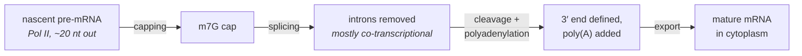
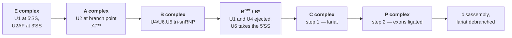

# 06 — RNA processing and splicing

> **Before this:** [Ch 05 — Transcription](05-transcription.md) · [Ch 01 — Chemistry and cell primer](../part-00-orientation/01-chemistry-and-cell-primer.md) · **Time:** ~40 min

## What you'll be able to do

- Trace a transcript from nascent RNA to exportable mRNA, say what each modification buys, and
  name the transcripts a poly(A)-selected library silently loses
- Derive the two-step chemistry of splicing, explain from that derivation why the spliceosome
  burns ATP although the reaction is energetically neutral, and say which of its components
  actually catalyses the reaction
- Read splice signals out of raw sequence, predict what a variant at each position does, and
  explain why a broken donor site causes exon *skipping* in humans and intron *retention* in
  yeast
- Predict how the local balance of SR proteins and hnRNPs — and the polymerase's elongation
  rate — sets an exon's percent-spliced-in, and say why a transcript catalogue bounds proteome
  diversity from above rather than measuring it
- Apply the 50–55 nt rule to decide whether a premature stop gives no protein or a truncated
  one — and why that changes the inheritance pattern
- Identify the splice-disrupting variants that standard annotation pipelines label benign and
  silently discard
- Distinguish an RNA-editing site from a genuine variant in RNA-seq data, and say why calling
  variants from RNA without an editing filter yields thousands of spurious A→G "SNPs"

## The core idea

In a bacterium, transcription and translation happen in one compartment simultaneously: a
ribosome latches onto the message while RNA polymerase is still writing it. There is no room
for an editing step, and there isn't one.

Eukaryotes put a membrane between the two. That creates a window in which a transcript exists,
is not yet being translated, and can be worked on. Evolution filled the window completely. What
comes off RNA polymerase II is not a message — it is raw material. Its 5′ end is a naked
triphosphate that nucleases will chew. It has no defined 3′ end, because Pol II does not stop
cleanly. And most of its length is **intron**: internal sequence that must be excised before
the reading frame makes sense.

The mature mRNA is the output of a pipeline that adds a header, cuts and appends a trailer, and
removes interior segments whose boundaries are specified — weakly and ambiguously — in the
stream itself. That ambiguity is the point. If the boundaries were unambiguous, splicing would
be a compilation step and this chapter would be short. Which segments get removed depends on
the cell. **Splicing is not tidying-up bolted onto transcription; it is a second layer of
coding, resolved at run time.**

---

## 1. The pipeline



The arrows imply a sequence; in reality all four overlap. The enzymes are recruited to the
C-terminal domain of Pol II, so the polymerase is not merely a producer — it is the scaffold
that carries the processing machinery to the RNA it is making. Processing that fails leaves a
transcript degraded in the nucleus rather than exported, so **nuclear RNA and cytoplasmic mRNA
are not the same population.**

## 2. The 5′ cap

A 7-methylguanosine attached to the first transcribed nucleotide — **backwards**. A
triphosphatase strips one phosphate from the RNA's 5′ triphosphate, a guanylyltransferase
transfers GMP from GTP, a methyltransferase methylates N7 of the added guanine.

```
    m7G                      first transcribed nucleotide
     |                                   |
   5'-G  ppp  5'-N ---- 3'-N ---- 3'-N ...
      ^^^^^^^^^^^
      5'-5' triphosphate bridge — not the usual 5'-3' linkage
```

The inverted linkage *is* the function. There is no free 5′ end and no 5′-monophosphate, so
5′→3′ exonucleases have nothing to grip. It is also a positive tag: the nuclear cap-binding
complex reads it and licenses splicing of the first intron, 3′-end processing and export; in
the cytoplasm it is swapped for eIF4E, the rate-limiting translation initiation factor. And a
further 2′-O-methyl on the first transcribed nucleotide (cap1) marks the RNA as self —
unmethylated cap0 RNA is treated as viral, which is why synthetic mRNA must be capped correctly
to avoid an interferon response.

## 3. The 3′ end: cleavage and polyadenylation

Pol II has no crisp terminator. The 3′ end of an mRNA is not where transcription stopped — it is
where the transcript was **cut**.

```
   ... A A U A A A ......(10–30 nt)...... C A ↓ ......  G/U-rich  ...
       ^^^^^^^^^^^                          ^          ^^^^^^^^^
       hexamer, read by CPSF             cleavage      bound by CstF
```

`AAUAAA` is canonical, in roughly half of human 3′ ends; `AUUAAA` is the common second. After
cleavage, poly(A) polymerase adds ~200–250 adenosines with no template — the tail is not encoded
in the genome. Poly(A)-binding protein coats it, blocking 3′→5′ decay, and contacts eIF4G/eIF4E
at the cap to loop the message into a closed circle, so a ribosome commits only to a message
verified intact at both ends. Deadenylation is the first and usually rate-limiting step of
turnover, which makes **tail length the message's clock**.

Two practical consequences. Most human genes have more than one usable poly(A) site, and the
choice changes 3′ UTR length and with it the regulatory elements carried
([Ch 24](../part-04-gene-regulation/24-rna-based-regulation.md)). And
**replication-dependent histone mRNAs have no poly(A) tail at all** — they end in a stem-loop —
so oligo-dT-selected RNA-seq reports near-zero histone expression in dividing cells. That is
library prep, not biology ([Ch 47](../part-10-functional-genomics/47-rna-seq.md)).

The signal is mutable like anything else: `AATAAA`→`AATAAG` in *HBA2* abolishes cleavage, the
polymerase reads through, and the result is α-thalassaemia. One base, outside all coding
sequence, and output collapses.

## 4. The size problem

| Quantity | Typical value |
|---|---|
| Internal exon length | median ~120 bp, mean ~170 bp |
| Intron length | median ~1.5 kb, mean ~5.4 kb |
| Exons per protein-coding gene | ~8–9 (median) |
| Extremes | *TTN*, 363 exons in one transcript; *DMD*, ~2.2 Mb of DNA for ~14 kb of mRNA |

```
   pre-mRNA   [E1]~~~~~~~~~~~~[E2]~~~~~~~~~~~~~~~~~~~[E3]~~~~~~~~[E4]
              120bp   3 kb    130bp       7 kb       110bp  2 kb  900bp

   mRNA       [E1][E2][E3][E4]
```

A typical pre-mRNA is 90–95% intron. Finding the coding islands is a search over megabases with
weak signals, performed in real time by a machine that assembles fresh for every intron.

## 5. The signals — and why they are not enough

```
      exon                  intron                                                exon
  ... C A G │ G U R A G U ..........  C U R A Y ......... Y Y Y Y Y Y Y Y N C A G │ G ...
            │ +1 +2 ... +6                 ▲               polypyrimidine    -2 -1
            │                       branch point A          tract (~10-20 nt)
       5′ splice site           18-40 nt upstream                       3′ splice site
         (donor)                  of the 3′ SS                            (acceptor)
```

(`R` = A/G, `Y` = C/U, `N` = any.) The **GU–AG rule** — introns begin `GU` and end `AG`; `GT…AG`
in DNA — holds for about 99% of human introns. Roughly 0.3–0.5%, several hundred introns, are
**U12-type**, spliced by a separate minor spliceosome built from U11, U12, U4atac and U6atac, plus U5 shared with the major spliceosome.
They splice slowly and are rate-limiting in the genes containing them, which is why mutations in
minor-spliceosome components cause specific developmental syndromes despite affecting so few
introns.

Now the part that matters if you have ever written a parser. A 5′ splice site carries roughly
8 bits across 9 degenerate positions; a 3.1 Gb genome contains on the order of 10⁸ `GU`
dinucleotides. Eight bits means one position in 2⁸ = 256 matches by chance, so
3.1 × 10⁹ / 256 ≈ **1.2 × 10⁷ consensus-matching decoys per strand** — against roughly
1.5 × 10⁵ real 5′ splice sites (19,442 coding genes × ~8 introns apiece). Eighty decoys for
every true site. **You cannot find splice sites by matching the consensus.** It is necessary and
nowhere near sufficient — exactly the specificity problem from
[Ch 01 §5](../part-00-orientation/01-chemistry-and-cell-primer.md). The true site is not
uniquely recognisable; it is merely bound somewhat longer than the ~10⁷ decoys. Discrimination
comes from context: auxiliary sequence elements, the proteins bound to them, the pairing
geometry of §8, and the order in which the polymerase emits the sequence.

## 6. The chemistry: two transesterifications

**Step 1 — branching.** The 2′-hydroxyl of the branch-point adenosine attacks the phosphate at
the 5′ splice site. The exon1–intron bond breaks; a bond forms between the intron's first
nucleotide and the branch A's 2′ position. That **2′–5′ linkage** is a branch in an otherwise
linear molecule, making the intron a **lariat**.

**Step 2 — exon ligation.** Exon 1 now has a free 3′-hydroxyl. It attacks the phosphate at the
3′ splice site. The exons join; the lariat is released, debranched, degraded.

```
  substrate   [--- exon 1 ---]G U ~~~~~~~~ A ~~~~~~~~ A G[--- exon 2 ---]
                              ^                            ^
                         5′ splice site              3′ splice site

  after step 1                             G
                                          / \        ← 2'-5' branch
              [--- exon 1 ]-OH   ~~~~~~~~ A ~~~~~~~~ A G[--- exon 2 ---]

  after step 2                             G
                                          / \
              [--- exon 1 ][--- exon 2 ---]  A ~~~~~~ A G-OH   ← lariat, discarded
```

Count the bonds. Step 1 breaks one phosphodiester bond and makes one; so does step 2. **The
reaction conserves phosphodiester bonds and is therefore close to energetically neutral — the
chemistry needs no ATP.**

Which raises the question the derivation exists for: the spliceosome hydrolyses ATP at eight
distinct points, driven by eight RNA helicases. If not for the chemistry, what for?
**Fidelity and order.** Each ATPase drives an irreversible rearrangement and acts as a kinetic
checkpoint — a correctly paired substrate advances before the helicase can reject it, a poorly
paired one is discarded. The energy proofreads a near-neutral reaction rather than driving it:
accuracy from imperfect filters in series, the same architecture as replication fidelity.

## 7. The spliceosome is a ribozyme

| snRNP | Job |
|---|---|
| **U1** | Base-pairs the 5′ splice site. First commitment step |
| **U2** | Base-pairs the branch region, bulging the branch A out of the duplex so its 2′-OH is exposed and aimed |
| **U4/U6** | U4 delivers U6 pre-paired and inhibited — U6 is the catalyst, so it arrives muzzled |
| **U5** | Holds the two exon ends together across the reaction, so exon 1 does not drift away between steps |
| **U6** | Replaces U1 at the 5′ splice site and folds the catalytic core |



The load-bearing fact: **the catalytic centre is RNA.** U6 snRNA folds a triplex that coordinates
the two magnesium ions doing the chemistry; the ~150 proteins are scaffolding, motors and
proofreaders. That U6 core is superimposable on domain V of a **group II self-splicing intron**,
an RNA that performs the identical two transesterifications, through the identical lariat, with
no spliceosome at all. The economical reading is that the spliceosome *is* a group II intron
broken into trans-acting pieces — and once the recognition elements were separable from the
sequence they act on, they became regulatable, and alternative splicing became possible. The
whole assembly is also rebuilt from scratch for every intron; it is not a persistent machine.

## 8. Exon definition, and why donor mutations skip exons

Which way does the machinery search when pairing a 5′ site with the correct 3′ site?

**Intron definition** pairs across the intron — U1 at one end reaching U2AF at the other. Fine
when introns are a few hundred nucleotides, as in yeast.

**Exon definition** pairs across the *exon*: U1 on the downstream exon's 5′ site communicates
with U2AF on that same exon's 3′ site over ~120 nt, and only later is this converted into a
cross-intron complex. Humans — 120 bp exons inside 5.4 kb introns — use this.

Three predictions follow, all observed:

1. **A mutation destroying a 5′ splice site removes the *upstream exon*, not just the intron.**
   That exon has lost half the pair that defines it, so it is never recognised. Intron
   retention — the naive prediction — is the yeast answer.
2. **Exons are size-constrained.** Internal exons much beyond ~300 nt are poorly defined.
3. **Exonic sequence carries splicing information.** If recognition spans the exon, the exon's
   interior is where activators and repressors must bind — which is why a change altering no
   amino acid can delete the exon entirely.

## 9. Alternative splicing: classes and scale

```
  cassette exon         [1]---[2]---[3]      most common class in mammals
  (exon skipping)       [1]---------[3]

  mutually exclusive    [1]---[2a]--[3]      exactly one of a set is used
                        [1]---[2b]--[3]

  alternative 5′ site   [1===]------[2]      donor moves
                        [1=]--------[2]

  alternative 3′ site   [1]------[===2]      acceptor moves
                        [1]--------[=2]

  intron retention      [1]---[2]            intron kept in the mature message
                        [1]~~~[2]
```

Add alternative first exons (alternative promoters) and alternative last exons (alternative
polyadenylation) for the full inventory.

**Scale.** At least 95% of human multi-exon genes are alternatively spliced. GENCODE Release 50
annotates **19,442 protein-coding genes** but **644,292 transcripts** across **78,733 genes** —
about eight transcripts per gene ([verified-facts](../reference/verified-facts.md)). This is the
standard answer to "how do ~19,000 genes build a human", and it is largely right. It is also
routinely overstated: many isoforms are low-abundance, cell-type-restricted, or non-productive
by design (§12), and mass spectrometry detects far fewer protein isoforms than the catalogue
implies. Transcript count bounds proteome diversity from above; it does not measure it.

Pushed to an extreme it is spectacular: *Dscam* in *Drosophila* has four clusters of mutually
exclusive exons (12 × 48 × 33 × 2), giving **38,016** possible mRNAs from one gene — more
isoforms than the fly has genes.

## 10. How the choice is made

Splice sites are weak (§5), so inclusion of any exon is decided by proteins bound nearby.

| | In the exon | In the intron |
|---|---|---|
| **Promotes inclusion** | ESE — exonic splicing enhancer | ISE |
| **Represses inclusion** | ESS — exonic splicing silencer | ISS |

**SR proteins** (SRSF1, SRSF2, …) carry RNA-recognition motifs plus an arginine/serine-rich
domain; they bind ESEs and recruit U1 and U2AF to adjacent weak sites — broadly, they promote
inclusion. **hnRNPs** (hnRNP A1, PTBP1, …) bind silencers and antagonise them.

The decision is **quantitative and combinatorial**, not switch-like. Exon inclusion is a
continuous quantity — *percent spliced in*, PSI ∈ [0,1] — set by the local balance of activators
and repressors, hence by their concentrations, which differ by cell type. Tissue-specific
splicing therefore needs no tissue-specific splice sites, only different mixing ratios of the
same ubiquitous factors. Position matters as much as identity: a factor binding upstream of an
exon may repress it while the same factor downstream activates, so regulators are described by
*splicing maps* — effect as a function of binding position — not by a motif alone.

And because splicing is co-transcriptional, **elongation rate is an input**. A slow polymerase
gives a weak upstream exon more time to be recognised before a competitor appears, favouring
inclusion — so chromatin state, which sets elongation rate, modulates splicing
([Ch 23](../part-04-gene-regulation/23-chromatin-and-epigenetics.md)).

## 11. Splicing mutations: the under-recognised disease class

Variants at the invariant `GU`/`AG` dinucleotides — ±1 and ±2 — are obvious, flagged by every
pipeline, and account for roughly a tenth of catalogued pathogenic variants. They are the tip of
the distribution. The rest look benign:

| Variant class | Standard annotation | What it can actually do |
|---|---|---|
| Synonymous, in an exon | `synonymous_variant` | Destroy an ESE → whole exon skipped |
| Missense, in an exon | `missense_variant` | The amino acid change is irrelevant; the real effect is loss of an ESE |
| Deep intronic, hundreds of nt from any exon | `intron_variant` | Create a new `GU`, activating a **pseudoexon** that is spliced in and frameshifts the message |
| Donor +3 to +6, acceptor −3 to −20 | `splice_region_variant`, or nothing | Weaken rather than abolish → partial skipping, dose-dependent severity |

> **A variant's annotation is a statement about a transcript model, not about a molecule.**
> `synonymous_variant` means "changes no amino acid in the canonical CDS". It does not mean
> silent. Filtering a variant list on consequence class — the first line of nearly every analysis
> pipeline ever written — discards deep intronic and synonymous variants before anyone looks at
> them. That filter is where a large share of undiagnosed Mendelian disease is hiding.

Two real cases. ***CEP290* c.2991+1655A>G** sits 1,655 nt inside an intron, creates a cryptic
donor, and activates a 128 bp pseudoexon carrying a premature stop; it is the commonest cause of
Leber congenital amaurosis type 10, and every exome-only pipeline is blind to it. ***SMN2*
c.840C>T** is synonymous, yet by destroying an ESE it forces exon 7 skipping — which is why
*SMN2* cannot compensate for the loss of *SMN1* in spinal muscular atrophy; see the worked
example.

How much disease is this? Estimates run from ~15% to over 60% of pathogenic variants depending
on gene and method; machine-learning surveys place roughly 16% of inherited-disease mutations in
the exonic-but-splice-disrupting class alone. The range is wide precisely because the class is
under-ascertained: you find these only by predicting splice effects directly (SpliceAI and
successors), by sequencing RNA from patient tissue, or by minigene assay — never by reading the
consequence column. [Ch 55](../part-11-human-and-statistical-genomics/55-clinical-variant-interpretation.md)
turns this into a procedure. The upside is that splicing is one of the few disease mechanisms
with a *general* fix: an antisense oligonucleotide base-paired to a silencer can redirect the
decision.

## 12. Nonsense-mediated decay and the 50–55 nt rule

A truncated protein is often worse than none — it can poison a complex it half-assembles into.
So the cell wants to destroy messages with premature stops. But a stop codon is a stop codon.
**How does the ribosome know a stop is premature?** It has no reference. Position relative to
what?

Splicing leaves marks. Each splicing event deposits an **exon-junction complex (EJC)** 20–24
nucleotides upstream of the junction, sequence-independently. The first round of translation
sweeps EJCs off as the ribosome passes. A normal stop is in the last exon, so by termination
every EJC is gone. Terminate with an EJC still downstream and the terminating complex contacts
it via UPF1/UPF2/UPF3, UPF1 is phosphorylated, and the message is destroyed.

Now derive the threshold. The terminating ribosome protects roughly 25–30 nt downstream of the
stop. Terminate too close to the junction and that footprint physically covers the EJC sitting
20–24 nt upstream of it, so no contact occurs.

```
        ...stop codon.................................|junction|...
                     └── ribosome footprint ~25-30 ──┘
                                        └ EJC at 20-24 nt upstream ┘

        stop within ~50-55 nt of the junction  →  EJC masked   →  NO decay
        stop further than ~55 nt upstream      →  EJC exposed  →  DECAY
```

25–30 plus 20–24 puts the masking boundary somewhere in the mid-40s to mid-50s; the measured
threshold is the empirical **50–55 nucleotide rule**: a stop more than ~50–55 nt
upstream of the final exon–exon junction triggers NMD; anything closer, or in the last exon,
does not.

Three consequences. **A nonsense variant early in a gene and one in the last exon are different
mutations** — the first gives no protein (loss of function, usually recessive), the second gives
a truncated protein that is actually made and can act dominant-negatively. **NMD is a regulatory
circuit, not only quality control**: a substantial fraction of alternative splicing events
introduce premature stops deliberately, and SR proteins autoregulate by splicing "poison exons"
into their own messages — negative feedback implemented in splicing, executed by NMD. And **NMD
targets are systematically under-observed in RNA-seq**, having been degraded before you
sequenced them.

## 13. RNA editing

Some changes are made to the RNA after transcription. The genome does not change.

**A-to-I, by ADAR.** ADAR1 and ADAR2 deaminate adenosine to inosine in double-stranded RNA, and
ribosomes and reverse transcriptases read inosine as **G**. Millions of sites are catalogued in
human, overwhelmingly in inverted *Alu* repeat pairs inside introns and 3′ UTRs. Most recode
nothing; the bulk function is to mark endogenous double-stranded RNA as self so the innate sensor
MDA5 ignores it — losing ADAR1 produces a spontaneous interferon response. Practically,
**edited sites appear in RNA-seq as A→G mismatches with no DNA support**, so calling variants
from RNA without filtering yields thousands of spurious A→G "SNPs"
([Ch 46](../part-10-functional-genomics/46-variant-calling.md)). Recoding sites are rare but can
be essential: the *GRIA2* Q/R site is genomically `CAG` (glutamine) and edited to read as `CGG`
(arginine) at essentially 100% efficiency in brain, because the unedited channel is
calcium-permeable and toxic.

**C-to-U, by APOBEC1.** In intestine, APOBEC1 deaminates one cytosine in *APOB* mRNA, turning the
glutamine codon `CAA` into the stop `UAA`. Liver does not edit. Result: full-length ApoB100 from
liver, truncated ApoB48 from intestine — two proteins, one gene, one DNA sequence, and a
tissue-specific edit as the only difference. (APOBEC relatives that act on DNA are a major source
of somatic mutation in cancer, [Ch 56](../part-11-human-and-statistical-genomics/56-cancer-genomics.md).)

## 14. Other RNAs, briefly

**rRNA.** Pol I makes one 47S precursor, cleaved and trimmed into 18S, 5.8S and 28S; 5S comes
separately from Pol III. Over 200 nucleotides are chemically modified, each targeted by a
**snoRNA** that base-pairs the site — an addressing scheme implemented in RNA. Many snoRNA genes
live *inside the introns of other genes*, a useful corrective to "introns are waste".

**tRNA.** RNase P — itself a ribozyme — removes the 5′ leader, RNase Z the 3′ trailer, and `CCA`
is added without a template. A minority of tRNAs contain introns, removed by a protein
endonuclease and ligase unrelated to the spliceosome: two mechanisms, both called splicing.

**Self-splicing introns.** Group I introns use an external guanosine as nucleophile and make no
lariat. Group II introns use an internal branch adenosine and make a lariat by the identical
chemistry of §6, with no spliceosome — and are the ancestors of the spliceosomal system.

**Trans-splicing.** Exons from two separate transcripts can be joined. In nematodes and
trypanosomes it is routine: a short capped **spliced-leader RNA** donates its 5′ end to ~70% of
*C. elegans* mRNAs and essentially all trypanosome mRNAs. Rare but real in humans.

---

## Common misconceptions

| What people think | What's actually true |
|---|---|
| Introns are junk the cell throws away | They carry branch points and splicing regulatory elements, host snoRNA and miRNA genes, and their removal deposits the EJC marks used for quality control. The lariat is degraded; the sequence is functional |
| A synonymous variant is silent | It changes no amino acid. It can still destroy an exonic splicing enhancer and delete the whole exon. *SMN2* c.840C>T changes no amino acid, yet it skips exon 7 — which is why *SMN2* cannot compensate for loss of *SMN1* in spinal muscular atrophy |
| GU–AG lets you find introns by pattern-matching | A 3.1 Gb genome has ~10⁸ `GU` dinucleotides. The consensus is weak and degenerate; real sites are distinguished by context and bound proteins. A learning problem, not a regex |
| Breaking a donor site causes the intron to be retained | In humans, exon definition means the *upstream exon* loses half its recognition pair and is skipped. Retention is the yeast prediction |
| The spliceosome is a protein enzyme | The catalytic core is RNA — U6 snRNA positions the two catalytic magnesiums. The ~150 proteins scaffold, drive and proofread |
| Splicing needs ATP for the chemistry | The two transesterifications conserve phosphodiester bonds and are near-neutral. All eight ATP-dependent steps buy fidelity and irreversible ordering |
| ~644,000 transcripts means ~644,000 proteins | Many isoforms are low-abundance, cell-type-restricted, or deliberately non-productive NMD substrates. Transcript count bounds proteome diversity from above |
| A nonsense variant always means loss of function | Only if NMD fires. Within ~50 nt of the last junction, or in the last exon, the truncated protein is made — often dominant-negative, with a different inheritance pattern |
| Splicing happens after transcription finishes | Most of it is co-transcriptional, and polymerase elongation rate is itself an input to splice-site choice |

## Worked example: one synonymous base, and a disease

*SMN1* and *SMN2* are adjacent, near-identical paralogues on chromosome 5. Spinal muscular
atrophy is caused by homozygous loss of *SMN1*. Everyone with the disease still has *SMN2*,
which encodes an identical protein. Work out why that does not rescue them.

**1 — The difference.** *SMN2* differs at position +6 of exon 7: `c.840C>T`. Codon 280 goes
`TTC`→`TTT`. Both are phenylalanine, so the change is **synonymous**; every predictor labels it
`synonymous_variant` and every standard filter drops it.

**2 — What the base was doing.** Exon 7 is **54 nt**, between a 5.76 kb intron 6 and a 444 nt
intron 7. Its splice sites are weak and it depends on an exonic enhancer overlapping position +6.
C→T disrupts that enhancer and strengthens hnRNP A1 binding. Under exon definition (§8), a short
exon with weak sites and no net activator is not recognised.

**3 — Consequence in RNA.** Roughly 80–90% of *SMN2* transcripts skip exon 7; only 10–20% are
full-length. One synonymous base has cost ~85% of the gene's output.

**4 — Frame arithmetic.** 54 is divisible by 3, so skipping exon 7 **does not shift the reading
frame**. Exon 6 joins exon 8 in frame, and translation — which normally terminates inside exon 7
— runs on into what is usually 3′ UTR, adding four residues (`EMLA`) before hitting a stop in
exon 8. That stop is in the **last** exon, downstream of the final exon–exon junction, so §12's
NMD test is not triggered: the SMNΔ7 message is stable and is translated.

**5 — Why it still fails.** The failure point is the protein, not the message. SMNΔ7 lacks the
C-terminal region needed for oligomerisation, and the `EMLA` tail it picks up from exon 8
completes a degron, so the truncated protein is unstable and rapidly degraded. Note what NMD
does *not* do here: exon 7 is the last **coding** exon, so even a frameshifting skip would have
put its stop inside terminal exon 8 and escaped decay by the rule of §12. Divisibility decides
which protein gets made, not whether the message survives — for that contrast you need an exon
several junctions upstream of the last.

**6 — Dosage.** *SMN2* copy number varies between people, 1 to 5+, and each copy contributes its
10–20% of full-length message. Copy number is the strongest known modifier of SMA severity: the
disease is quantitative, and the quantity is a splicing efficiency.

**7 — The fix.** If the problem is a splicing decision, change the decision. Nusinersen is an
antisense oligonucleotide complementary to **ISS-N1**, an intronic silencer just inside intron 7.
Blocking it prevents hnRNP A1 binding, exon 7 is included, full-length SMN rises. The drug
touches no DNA, delivers no gene and encodes no protein — it occupies ~18 nucleotides of intron.

One base. Synonymous. Invisible to a consequence filter. It explains the disease, its severity
gradient, and its treatment.

## Connections

- **Back to:** [Ch 05 — Transcription](05-transcription.md) supplies the Pol II CTD that carries
  all this machinery; [Ch 01 §5](../part-00-orientation/01-chemistry-and-cell-primer.md) set up
  weak signals and statistical specificity; [Ch 02](02-dna-structure.md) for the 2′-OH that does
  the branching
- **Forward to:** [Ch 07](07-genetic-code-and-translation.md) reads the mature message;
  [Ch 24](../part-04-gene-regulation/24-rna-based-regulation.md) treats splicing and 3′-UTR
  choice as regulation; [Ch 44](../part-09-genomics/44-annotation.md) must *infer* the exon
  structure described here from sequence and reads;
  [Ch 47](../part-10-functional-genomics/47-rna-seq.md) quantifies isoforms and PSI;
  [Ch 55](../part-11-human-and-statistical-genomics/55-clinical-variant-interpretation.md) turns
  §11 and §12 into a classification procedure

## Check yourself

**1. Splicing forms as many phosphodiester bonds as it breaks, so it is near-neutral. Why does the spliceosome hydrolyse ATP at eight separate steps?**

<details><summary>Answer</summary>

Not to drive the chemistry — the chemistry does not need it. Eight DExD/H-box helicases each
drive an irreversible conformational rearrangement, and each acts as a kinetic proofreading
checkpoint: a correctly paired substrate advances to the next state faster than the ATPase can
reject it, while a poorly paired one is discarded. The energy buys ordering and fidelity for a
reaction that would otherwise be reversible and error-prone — accuracy from imperfect filters in
series, paid for in ATP.

</details>

**2. A variant destroys the 5′ splice site of intron 4 in a human gene. Predict the mRNA. Would the prediction differ in budding yeast?**

<details><summary>Answer</summary>

In humans, **exon 4 is skipped** and the mRNA joins exon 3 to exon 5. Human introns are long
(mean ~5.4 kb) and exons short (~120 bp), so initial recognition is by exon definition — U1 on
the downstream 5′ site pairs across the exon with U2AF on its upstream 3′ site. Kill the donor
and the exon loses half its defining pair, so it is never recognised.

In yeast, introns are short and recognition spans the intron. Losing the donor leaves the
downstream acceptor without a partner, and the usual outcome is **intron retention**.

Same lesion, opposite consequence, decided entirely by which distance the machinery spans.

</details>

**3. A gene has 12 exons; exon 12 is last and 400 nt long. Compare a nonsense variant 200 nt into exon 12 with one in exon 4. Which makes protein, and which is more likely to be dominant?**

<details><summary>Answer</summary>

Exon 4: the stop lies far upstream of the last junction (11–12), so that EJC is still present
when the ribosome terminates. NMD fires, the message is degraded, no protein is made — a clean
loss of function, typically recessive because the other allele still works.

Exon 12, 200 nt in: the stop is 200 nt *downstream* of the 11–12 junction, so no EJC remains
downstream at all. NMD does not fire, the message is stable, and a truncated protein is made. If
that protein still assembles into complexes but does not work, it poisons the product of the
normal allele — dominant-negative, hence dominant.

The boundary is the 50–55 nt rule, which comes from the EJC sitting 20–24 nt upstream of a
junction and the terminating ribosome protecting ~25–30 nt downstream of the stop.

</details>

**4. RNA-seq variant calling on one sample gives ~40,000 A→G calls with no DNA support, clustered in 3′ UTRs and introns and falling inside inverted repeats. What are they?**

<details><summary>Answer</summary>

A-to-I editing by ADAR. Inosine is read as G by reverse transcriptase, so an edited adenosine
appears as an A→G mismatch while the genome still says A. The clustering in inverted *Alu* pairs
is diagnostic: ADAR needs double-stranded RNA, and the commonest source of endogenous dsRNA in
human transcripts is two nearby *Alu* elements in opposite orientation folding back on each
other.

They are not DNA variants and must not be reported as such — filter against a known-editing
database, and treat strand-consistent A→G enrichment in repeats as editing rather than genotype.
If editing is the object of study, that same signal is the measurement.

</details>

**5. Poly(A)-selected RNA-seq of a rapidly proliferating cell line shows near-zero expression of replication-dependent histone genes. Library failure, or biology?**

<details><summary>Answer</summary>

Neither — a systematic artefact of the protocol. Replication-dependent histone mRNAs do not use
`AAUAAA` cleavage and polyadenylation; they end in a conserved stem-loop bound by SLBP and carry
no poly(A) tail. Oligo-dT capture cannot retrieve them however abundant they are, and in an
S-phase-rich population they are extremely abundant. Use ribo-depletion instead.

The general lesson: every quantification protocol embeds an assumption about what RNA looks
like, and transcripts that violate the assumption go missing silently rather than noisily.

</details>
