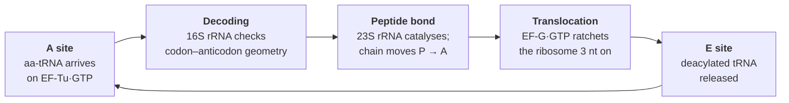

# 07 — The genetic code and translation

> **Before this:** [Ch 05](05-transcription.md) · [Ch 06](06-rna-processing.md) · [Ch 01 §5](../part-00-orientation/01-chemistry-and-cell-primer.md) · **Time:** ~40 min

## What you'll be able to do

- Translate any sequence by hand in any of six reading frames, say which frame is real and why, and derive why the code has to be triplet and many-to-one rather than ambiguous
- Derive the tolerance of the third codon position from the wobble rules, rather than memorising it
- Show quantitatively that the code minimises the damage done by mutation and mistranslation — and say what "arranged to" can and cannot mean
- Predict what the standard translation table gets wrong on a mitochondrial gene, and distinguish a reassigned codon from a stop recoded for selenocysteine or pyrrolysine
- Explain where translational fidelity actually comes from, and why the ribosome is not the answer
- Predict which AUG a ribosome starts at from Shine–Dalgarno or Kozak context, and explain why bacterial mRNAs can be polycistronic and eukaryotic ones cannot
- Classify any coding single-nucleotide change as synonymous, missense, nonsense or frameshift, predict its severity, and give four distinct mechanisms by which a *synonymous* change can still be pathogenic

## The core idea

Translation is a decoder under a hard constraint: four input symbols, twenty outputs, no punctuation, no length prefix, and no way to re-synchronise if it loses its place.

Almost everything about the code follows. Three symbols per group, because two give only 16. Sixty-four groups for twenty outputs, so the mapping is many-to-one. No separators, so the frame is set once at the start and thereafter maintained purely by counting — which makes an inserted base catastrophic and a substituted base usually survivable.

The one thing *not* forced is which codon means which amino acid. That could have been arbitrary. It is not: the code is laid out so that the errors which actually happen most often yield either the same amino acid or a chemically similar one. That is the most interesting fact in this chapter, and §4 quantifies it.

---

## 1. Why triplets, and what 64 → 20 costs

One base per amino acid gives 4 possibilities; two give 16 — still short of 20; three give 64. Three is the smallest group size that works.

Sixty-four codons for twenty amino acids plus a stop signal makes the code **degenerate**: most amino acids have several codons. Degenerate, not ambiguous — one codon never means two things.

```
          ┌──────────────────── second position ────────────────────┐
  first   │     U            C            A            G           │  third
 ─────────┼─────────────────────────────────────────────────────────┼────────
          │  UUU  Phe     UCU  Ser     UAU  Tyr     UGU  Cys        │   U
    U     │  UUC  Phe     UCC  Ser     UAC  Tyr     UGC  Cys        │   C
          │  UUA  Leu     UCA  Ser     UAA  STOP    UGA  STOP       │   A
          │  UUG  Leu     UCG  Ser     UAG  STOP    UGG  Trp        │   G
 ─────────┼─────────────────────────────────────────────────────────┼────────
          │  CUU  Leu     CCU  Pro     CAU  His     CGU  Arg        │   U
    C     │  CUC  Leu     CCC  Pro     CAC  His     CGC  Arg        │   C
          │  CUA  Leu     CCA  Pro     CAA  Gln     CGA  Arg        │   A
          │  CUG  Leu     CCG  Pro     CAG  Gln     CGG  Arg        │   G
 ─────────┼─────────────────────────────────────────────────────────┼────────
          │  AUU  Ile     ACU  Thr     AAU  Asn     AGU  Ser        │   U
    A     │  AUC  Ile     ACC  Thr     AAC  Asn     AGC  Ser        │   C
          │  AUA  Ile     ACA  Thr     AAA  Lys     AGA  Arg        │   A
          │  AUG  Met ◄   ACG  Thr     AAG  Lys     AGG  Arg        │   G
 ─────────┼─────────────────────────────────────────────────────────┼────────
          │  GUU  Val     GCU  Ala     GAU  Asp     GGU  Gly        │   U
    G     │  GUC  Val     GCC  Ala     GAC  Asp     GGC  Gly        │   C
          │  GUA  Val     GCA  Ala     GAA  Glu     GGA  Gly        │   A
          │  GUG  Val     GCG  Ala     GAG  Glu     GGG  Gly        │   G
 ─────────┴─────────────────────────────────────────────────────────┴────────
   ◄ AUG is both methionine and the start codon.  61 sense codons + 3 stops.
```

Degeneracy is unevenly distributed, and the pattern matters later:

| Codons per amino acid | Amino acids |
|---|---|
| 6 | Leu, Ser, Arg |
| 4 | Ala, Gly, Pro, Thr, Val |
| 3 | Ile |
| 2 | Phe, Tyr, Cys, His, Gln, Asn, Lys, Asp, Glu |
| 1 | Met, Trp |

(3×6 + 5×4 + 1×3 + 9×2 + 2×1 = 61 ✓)

Three further properties. **Non-overlapping**: base 4 belongs to codon 2 and nothing else — an overlapping code would make most substitutions change three residues at once and would savagely restrict which protein sequences are expressible. **No punctuation**: no separator between codons, the frame held only by counting from the start. **Near-universal**: the same table runs in *E. coli*, yeast, wheat and you, which is why you can express a human gene in bacteria and is strong evidence of single common descent (§5 covers the exceptions).

> The best cautionary tale in molecular biology sits here. In 1957 Crick, Griffith and Orgel proposed a **comma-free code**: triplets chosen so that no out-of-frame reading of two adjacent codons is itself valid. Such a code needs no punctuation and cannot lose its frame — and the maximum size of such a set over four letters is *exactly 20*. It was too beautiful to be false, and it was false. Nirenberg and Matthaei's 1961 poly-U experiment showed UUU codes for phenylalanine, and UUU is excluded from every comma-free code.

## 2. Reading frames

Double-stranded DNA can be read in **six frames**: three offsets on each strand. A translator that doesn't know which is real must produce all six.

```
        1         2
        123456789012345678901
top  5'-GACATGGCTAGCAAGGAGTTC-3'
bot  3'-CTGTACCGATCGTTCCTCAAG-5'

FORWARD — read the TOP strand 5'→3':  GACATGGCTAGCAAGGAGTTC
 +1     GAC ATG GCT AGC AAG GAG TTC      Asp Met Ala Ser Lys Glu Phe
 +2     G · ACA TGG CTA GCA AGG AGT tc       Thr Trp Leu Ala Arg Ser
 +3     GA · CAT GGC TAG CAA GGA GTT c       His Gly *** Gln Gly Val

REVERSE — read the REVERSE COMPLEMENT 5'→3':  GAACTCCTTGCTAGCCATGTC
 -1     GAA CTC CTT GCT AGC CAT GTC      Glu Leu Leu Ala Ser His Val
 -2     G · AAC TCC TTG CTA GCC ATG tc       Asn Ser Leu Leu Ala Met
 -3     GA · ACT CCT TGC TAG CCA TGT c       Thr Pro Cys *** Pro Cys

    · = bases skipped to set the offset;  lowercase = trailing partial codon
    *** = stop
```

Twenty-one bases, six unrelated peptides: sequence carries no meaning without a frame, and no frame without a start. Note what marks the real one — +1 is the only frame with an `ATG` followed by an uninterrupted open run, while +3 and −3 hit stops within three or four codons.

**Start** is **AUG**, which is also methionine, so every nascent protein begins with Met (formyl-Met in bacteria), usually cleaved off later. Bacteria also start at GUG and UUG: a start codon is identified by *context*, not by the triplet alone (§7). **Stop** is **UAA, UAG, UGA** — no tRNA reads them; a protein release factor does.

Now the calculation underwriting all ORF-finding ([Ch 44](../part-09-genomics/44-annotation.md)). In random equal-base sequence each codon is a stop with probability 3/64, so codons-until-stop is geometric and the expected open run is **64/3 ≈ 21 codons**; the chance a random 100-codon run contains no stop is (61/64)¹⁰⁰ ≈ 0.008, about 1 in 120. That gap between 21 and 100 is why a length threshold separates coding sequence from noise in prokaryotes — and why it collapses in eukaryotes, where exons are short and interrupted by introns ([Ch 06](06-rna-processing.md)).

## 3. Wobble: why the third base is cheap

In every four-codon family the third base is irrelevant; in every two-codon family it matters only as pyrimidine-versus-purine. Why systematically the third?

Because of how a tRNA reads it. The **anticodon** is three bases — numbered 34, 35, 36 — pairing antiparallel with the codon:

```
   mRNA   5'-  A     A     G  -3'      codon 5'-AAG-3'  = Lys
                |     |     |
   tRNA   3'-  U     U     C  -5'      anticodon 3'-UUC-5'  (written 5'-CUU-3')
               36    35    34
                            ↑
              anticodon position 34 = the WOBBLE position;
              it pairs with the THIRD base of the codon
```

Positions 35 and 36 are held in strict Watson–Crick geometry — 16S rRNA bases inspect the minor groove of those two pairs and reject anything non-canonical. Position 34 sits at the end of the loop, is not inspected that way, and tolerates pairings rejected elsewhere. Crick formalised this in 1966 as the **wobble hypothesis**:

| Anticodon base 34 | Pairs with codon base 3 |
|---|---|
| C | G |
| A | U |
| **U** | A, **G** |
| **G** | C, **U** |
| **I** (inosine) | U, C, **A** |

Inosine is a modified adenosine made after transcription, and is the promiscuous one: a single I34 tRNA reads three codons.

The consequence is arithmetic. Sixty-one sense codons do not need sixty-one tRNAs — the minimum set is **31** (plus a dedicated initiator). Real genomes sit above the minimum for speed and regulation rather than necessity: human cells carry roughly 450 tRNA genes in about 49 anticodon families, while human mitochondria, under strong pressure for compactness, manage with 22.

> Wobble is why "third position" and "synonymous" are nearly the same statement. dN/dS ([Ch 33](../part-07-molecular-evolution/33-neutral-theory-and-selection-tests.md)) exists because third positions are largely free to drift; codon usage bias exists because they are free but not *unused*; and the near-zero cost of third-position change is why the code can absorb mutation at all.

## 4. The code is not an accident

Suppose the 64 codons had been assigned arbitrarily — the **frozen accident** view, in which the assignment was fixed by chance early and can no longer move because any change would rewrite every protein at once. Then the chemistry of the amino acid at CUU would be uncorrelated with that at AUU. It isn't, and the structure is visible in the table.

**Second position is a hydrophobicity axis.** Every codon with U at position 2 encodes a hydrophobic residue — Phe, Leu, Ile, Met, Val, no exceptions. Every codon with A at position 2 encodes a polar or charged one (Tyr, His, Gln, Asn, Lys, Asp, Glu) or a stop. C at position 2 gives the small ones: Ser, Pro, Thr, Ala. Position 2 has no degeneracy, so a mutation there always changes the amino acid — and since the columns *are* position 2, it necessarily carries the residue out of its chemical class as well. That is the real content of the column structure: it cushions first- and third-position changes, which stay in their column and so keep the class, and offers nothing whatever at position 2. Hence the second position is the one to look at hardest.

**The degeneracy pattern is aligned to the mutation spectrum.** Point mutations are not uniform: **transitions** (purine↔purine, pyrimidine↔pyrimidine) run roughly twice as frequent as transversions, and more than that in exomes, because of deamination and mispairing chemistry ([Ch 16](../part-03-genome-instability/16-mutation.md)). Now inspect the two-fold degenerate families. *Every one* splits {U, C} against {A, G} — pyrimidines against purines, exactly the transition partition. A third-position transition is therefore synonymous in every two-fold family and trivially so in every four-fold family. The exceptions are AUA/AUG and UGA/UGG, involving Met and Trp — precisely the two amino acids with a single codon each, where no arrangement could have helped.

The most common class of mutation, at the least constrained position, is silent almost by construction. That is not what an arbitrary assignment looks like.

**How unlikely?** Generate random codes by permuting amino acids over the same block structure, and score each by the mean change in a chemical property (usually **polar requirement**) caused by a random point mutation. Haig and Hurst (1991) placed the natural code in roughly the top 0.02%. Freeland and Hurst (1998) added realistic weighting — transitions over transversions, mistranslation more frequent at position 3 than 1 than 2 — and found **fewer than one in a million** random codes beat it. Hence their title: *The Genetic Code Is One in a Million*.

That establishes extreme non-randomness with respect to error cost. It does not settle *why*, among three explanations still argued over and not mutually exclusive:

| Hypothesis | Claim | Trouble with it |
|---|---|---|
| **Adaptive** | Selection reassigned codons to reduce the damage of errors | Any reassignment changes every protein simultaneously; each step has to be near-neutral |
| **Stereochemical** | Codons or anticodons have physical affinity for their amino acids | Some support from aptamer-selection experiments; far from general |
| **Coevolution / expansion** | The code grew from a smaller set as biosynthesis produced new amino acids; chemically related amino acids inherited related codons | Explains the block structure without requiring selection *for* error tolerance |

The third route predicts the correlation as a *side-effect*: biosynthetically related amino acids are also chemically similar. "Strikingly non-random" and "adaptive" are different claims, and this is a good place to keep them apart.

## 5. "Near-universal" — the deviations

**Mitochondria** run their own code, differing by lineage. The human mitochondrial table:

| Codon | Standard | Human mitochondrial |
|---|---|---|
| UGA | STOP | **Trp** |
| AUA | Ile | **Met** (and can initiate) |
| AGA, AGG | Arg | **STOP** |

Reassignment is cheap when the affected proteome is 13 proteins long and the tRNA set is 22 molecules. Some ciliates read UAA/UAG as Gln; some yeasts read CUG as Ser. Annotate a mitochondrial gene with the standard table and you get nonsense — which is why every annotation tool takes a translation-table parameter.

**Amino acids 21 and 22** are inserted co-translationally by recoding a stop in a specific context. **Selenocysteine (Sec, U)** goes in at **UGA** when a **SECIS** stem-loop is present — in the 3′ UTR in eukaryotes, immediately downstream in bacteria — using a dedicated tRNA and elongation factor; humans have about 25 selenoproteins. **Pyrrolysine (Pyl, O)** goes in at **UAG** in some methanogenic archaea and a few bacteria — but unlike Sec it needs no cis-acting element at all. The dedicated PylRS/tRNA<sup>Pyl</sup> pair suppresses UAG on its own, and suppression efficiency is essentially indifferent to what lies downstream; a **PYLIS** stem-loop was proposed by analogy to SECIS and has not held up as a requirement. That context-independence is exactly why the pair was co-opted as the workhorse of synthetic genetic-code expansion. Both are genuine expansions rather than misreadings — the machinery is dedicated, not a slipped ribosome — but they get there by different routes: Sec insertion is licensed by context, Pyl by the synthetase alone.

**Stop-codon readthrough** is the stochastic version — in certain contexts the ribosome fails to terminate at a measurable rate and runs to the next in-frame stop, giving a C-terminally extended protein. Programmed at hundreds of *Drosophila* genes; a handful are established in humans, including a *VEGFA* extension. It matters therapeutically too: promoting readthrough is a strategy against diseases caused by premature stops, on the logic that a little full-length protein beats none.

## 6. Where fidelity actually lives

A tRNA is an adaptor whose two ends know nothing about each other.

```
   cloverleaf (secondary)                       L-shape (tertiary)

        acceptor stem ── CCA-3'  ← amino acid          amino acid
        ‖‖‖‖‖‖‖                                             ↑
      ┌─┘     └─┐                                   ┌───────┘
    D arm     TΨC arm                               │
      └─┐     ┌─┘                                   │   ~70–80 Å apart
        anticodon stem                              │
        ‖‖‖‖‖                                       └──────────► anticodon
         (34)(35)(36)  ← anticodon
```

Roughly 76–90 nucleotides, heavily modified after transcription, folding to a cloverleaf in two dimensions and an L in three. The amino acid is esterified to the 3′-terminal **CCA**; the anticodon sits ~70–80 Å away at the far tip, with nothing coupling them. A tRNA is a lookup-table entry, only as correct as whoever wrote it — an **aminoacyl-tRNA synthetase**, one per amino acid, in two structurally unrelated classes of ten:

| | Class I | Class II |
|---|---|---|
| Approaches acceptor stem via | **minor** groove | **major** groove |
| Attaches amino acid to | 2′-OH of terminal A | 3′-OH (except PheRS) |
| Usual structure | monomeric | dimeric / tetrameric |
| Examples | IleRS, ValRS, MetRS, ArgRS | AlaRS, GlyRS, ProRS, HisRS |

It must solve two independent recognition problems. **Recognising the tRNA** works through a handful of **identity elements** scattered over the molecule — sometimes the anticodon, sometimes the acceptor stem, sometimes the discriminator base. A single G3:U70 wobble pair in the acceptor stem suffices to make a tRNA a substrate for AlaRS; transplant it into an unrelated tRNA and AlaRS charges that with alanine. This second layer of specificity is sometimes called the *second genetic code*.

**Recognising the amino acid** is harder, because some differ by one methyl group. Binding-pocket geometry alone gives IleRS about 1-in-150 discrimination against valine — nowhere near enough. The solution is a **double sieve**: a synthetic site excluding anything *larger* than the correct amino acid, then a separate editing site hydrolysing anything *smaller* that slipped through. Two imperfect filters in series give a combined error rate near 10⁻⁴ — exactly the decomposition from [Ch 01 §5](../part-00-orientation/01-chemistry-and-cell-primer.md).

> **The ribosome does not know what amino acid it is adding.** It checks codon–anticodon geometry and nothing else. Charge a cysteine-anticodon tRNA with alanine and the ribosome inserts alanine at every cysteine codon, without hesitation and without error signal. Chapeville and colleagues did exactly this in 1962, chemically converting Cys-tRNA<sup>Cys</sup> to Ala-tRNA<sup>Cys</sup> and watching alanine appear at cysteine positions. **The genetic code is enforced by twenty synthetases.** The ribosome enforces only the frame and the pairing.

## 7. The ribosome, and the cycle

Two subunits, mostly RNA by mass, assembling around an mRNA:

| | Bacterial (70S) | Eukaryotic cytoplasmic (80S) |
|---|---|---|
| Small subunit | 30S: 16S rRNA + ~21 proteins | 40S: 18S rRNA + ~33 proteins |
| Large subunit | 50S: 23S + 5S rRNA + ~33 proteins | 60S: 28S + 5.8S + 5S rRNA + ~47 proteins |
| Small subunit's job | bind mRNA, **decode** codon–anticodon | same |
| Large subunit's job | **peptidyl transferase**, exit tunnel | same |

Three tRNA sites span both subunits: **A** (aminoacyl, incoming), **P** (peptidyl, holding the chain), **E** (exit). When the large subunit's structure was solved in 2000, the catalytic centre turned out to contain no protein at all — the nearest protein side-chain atom is about 18 Å from the bond being formed. The catalyst is 23S rRNA. **The ribosome is a ribozyme**: the machine that builds every protein is not itself made of protein.



Decoding is where kinetic proofreading lives: correct pairing triggers GTP hydrolysis on EF-Tu faster than incorrect pairing, and after hydrolysis a second delay gives an incorrect tRNA another chance to dissociate — the same modest binding preference applied twice, either side of an irreversible step. The net is about one misincorporation per 10³–10⁴ codons. Far worse than DNA replication, and entirely acceptable: a bad protein is discarded, a bad genome is inherited.

**Initiation** is where the two domains differ most, and where most translational regulation acts:

| | Bacteria | Eukaryotes |
|---|---|---|
| Finding the start | **Shine–Dalgarno** (consensus AGGAGG, ~8 nt upstream) base-pairs with the 3′ end of 16S rRNA, placing the AUG in the P site | **cap-dependent scanning**: eIF4E binds the 5′ m⁷G cap, the 43S complex loads at the 5′ end and scans until it meets an AUG in good context |
| Context signal | SD strength and spacing | **Kozak** `gccRccAUGG` — a purine at −3 and a G at +4 do most of the work |
| Initiator tRNA | tRNA<sup>fMet</sup>, formylated | tRNA<sub>i</sub><sup>Met</sup>, not formylated |
| Factors | IF1, IF2, IF3 | a dozen-plus eIFs |
| Polycistronic mRNA? | **Yes** — each cistron has its own SD | **No** — scanning starts at one 5′ end |

That last row explains a great deal. Bacterial operons work because a ribosome can initiate internally ([Ch 21](../part-04-gene-regulation/21-bacterial-regulation.md)); eukaryotic mRNAs are functionally monocistronic, which is why alternative splicing rather than operon structure is the eukaryotic route to several products from one locus. Scanning also creates its own control surface: **upstream ORFs** in the 5′ UTR capture scanning ribosomes and throttle the main ORF, and **leaky scanning** past a weak-context AUG yields two N-terminal isoforms from one mRNA.

**Termination.** No tRNA reads a stop. A release factor — RF1 (UAA, UAG) or RF2 (UAA, UGA) in bacteria, a single eRF1 for all three in eukaryotes — enters the A site shaped like a tRNA, and its presence makes the peptidyl transferase centre transfer the chain to water instead of to an amino acid. Hydrolysis rather than condensation: a protein imitating an RNA in order to make an enzyme do the wrong reaction deliberately.

**Polysomes.** Initiation is slow relative to elongation, so another ribosome loads as soon as the first clears the start site. A typical mRNA carries many, spaced roughly every 80–100 nucleotides. This is why modest transcript abundance supports large protein output, and why translation is not a simple function of mRNA level. In bacteria, with no nuclear envelope, ribosomes load onto the 5′ end while RNA polymerase is still transcribing the 3′ end — transcription and translation are physically coupled, which is impossible in eukaryotes and is why bacteria can use translation to regulate transcription.

## 8. What mutations do at the codon level

[Ch 16](../part-03-genome-instability/16-mutation.md) and [Ch 55](../part-11-human-and-statistical-genomics/55-clinical-variant-interpretation.md) both stand on this table.

| Class | Change | Usual position | Typical effect |
|---|---|---|---|
| **Synonymous** | codon → different codon, same amino acid | 3rd | usually none — but see below |
| **Missense** | codon → different amino acid | 1st, 2nd | anything from nothing to complete loss of function |
| **Nonsense** | codon → stop | any | truncated protein, or *no* protein via NMD |
| **Stop-loss** | stop → sense codon | any | C-terminal extension to the next in-frame stop |
| **Frameshift** | indel not a multiple of 3 | any | everything downstream is unrelated, and a stop arrives within ~21 codons |

**Missense is not one category.** Severity depends on how chemically different the two residues are and where in the fold they sit. The **Grantham distance** captures the first half — a scalar from side-chain composition, polarity and volume. Glu→Lys scores 56 (both charged and similar in size: *conservative*); Glu→Gly scores 98 (charged and bulky becomes tiny and flexible: *radical*). Grantham feeds nearly every variant-effect predictor in [Ch 55](../part-11-human-and-statistical-genomics/55-clinical-variant-interpretation.md), and alone is a weak one — a conservative substitution in an active site beats a radical one on the surface every time.

**Frameshifts are the worst case**, and §2's arithmetic says why: downstream of the indel every codon is read in a new frame, so the protein is not altered but replaced, and the new sequence hits a stop after ~21 codons on average. An indel of 3, 6 or 9 is qualitatively different — whole residues added or removed, frame intact. That is why a 3-bp and a 4-bp deletion at the same position can differ enormously in severity, and why ΔF508 in *CFTR* is a missense-like lesion rather than a truncation.

**Nonsense-mediated decay** decides what a premature stop actually does. In eukaryotes, a stop more than ~50–55 nucleotides upstream of the final exon–exon junction marks the transcript as aberrant and it is destroyed — so the allele is a null, not a source of truncated protein. A premature stop in the last exon escapes NMD, makes a truncated protein, and may act as a dominant-negative. Same mutation class, opposite genetic behaviour, decided by position relative to the last junction.

**And synonymous is not the same as silent.** Four independent mechanisms:

1. **Splicing.** Exons carry **splicing enhancers and silencers** bound by SR and hnRNP proteins ([Ch 06](06-rna-processing.md)). A synonymous change can destroy one — altering the *transcript*, which protein-level reasoning cannot see. The definitive case: *SMN1* and *SMN2* differ by a synonymous C→T at position +6 of exon 7 (c.840C>T). No amino acid changes; exon 7 is skipped in most transcripts; and the resulting shortfall of functional SMN protein is why *SMN2* cannot rescue spinal muscular atrophy when *SMN1* is deleted. Treat the last ~50 nucleotides of any exon as splicing-relevant regardless of codon consequence.
2. **Codon usage and tRNA abundance.** Synonymous codons are used unequally, and the bias tracks tRNA gene copy number. Rare codons translate more slowly, and translation speed sets the time available for **co-translational folding** — so an identical protein sequence can fold differently. This is the proposed mechanism for the *ABCB1* c.3435C>T variant and altered drug handling: an influential result whose generality remains debated. It is also why codon-optimising a gene sometimes yields more protein and sometimes more insoluble aggregate.
3. **mRNA structure and stability.** Synonymous changes alter local base-pairing. Near the 5′ end this matters most — structure occluding the Shine–Dalgarno sequence or start codon suppresses initiation. Codon composition also feeds deadenylation rate, so half-life shifts too.
4. **Overlapping information.** The same bases carry miRNA target sites, RNA-binding-protein sites, and — in viruses and compact genomes — a second reading frame. Coding sequence is not exclusively code.

---

## Common misconceptions

| What people think | What's actually true |
|---|---|
| The genetic code is DNA | The code is the *mapping* from 64 codons to amino acids; DNA is the medium. "Cracking the genetic code" meant filling in that table and was finished in 1966. Sequencing the human genome, three decades later, was a different achievement |
| The ribosome checks that the right amino acid is being added | It cannot. It reads codon–anticodon geometry only. Amino-acid identity is fixed earlier by the synthetase; mischarge a tRNA and the ribosome installs the wrong residue at every occurrence of that codon |
| Synonymous mutations are silent | They alter splicing, translation speed, co-translational folding, mRNA structure and mRNA half-life. A synonymous change is the entire difference between *SMN1* and *SMN2* |
| Degenerate means ambiguous | Backwards. One codon has exactly one meaning; several codons share a meaning. The map is many-to-one — it is a function |
| Missense is moderate, nonsense severe | Position dominates class. A missense change in an active site can be a complete null; a nonsense change in the final exon escapes NMD and may yield a nearly full-length working protein |
| The code is universal | Near-universal. Mitochondria, some ciliates and some yeasts reassign codons; selenocysteine and pyrrolysine are inserted at recoded stops. Using the standard table on mitochondrial genes produces garbage |
| The third codon position is unimportant | Unimportant *for the amino acid*. It is where codon usage bias, tRNA-abundance effects, splicing motifs and mRNA structure live — and it is the substrate for every neutrality test in molecular evolution |
| AUG is "the start codon" | AUG is methionine everywhere it occurs. What makes one AUG a start is context: Shine–Dalgarno in bacteria, Kozak context and being first-encountered-while-scanning in eukaryotes |

## Worked example: four mutations in one small gene

Numbering is HGVS coding-DNA numbering, `c.1` = the A of the initiator ATG.

```
c.    1   4   7  10  13  16  19  22  25  28  31  34
      ATG GCT AGC AAG GAG TTC ACC GGA TAC CTG AAG TGA
p.    Met Ala Ser Lys Glu Phe Thr Gly Tyr Leu Lys ***
       1   2   3   4   5   6   7   8   9  10  11
```

**(a) c.9C>T — synonymous.** Codon 3 is `AGC` (Ser); c.9 C→T gives `AGT`, still Ser. A third-position **transition** in a two-fold family, which §4 guarantees is synonymous. Notation `p.(Ser3=)`. Before writing it off, check whether it lies in the last ~50 nt of an exon, whether it disrupts a splicing enhancer, and whether it swaps a common codon for a rare one.

**(b) c.13G>A vs c.14A>G — two missense changes in one codon.** Codon 5 is `GAG` (Glu).

- c.13G>A → `AAG` = Lys. `p.Glu5Lys`. Grantham **56**. Both long and charged; a charge reversal, which can matter at a salt bridge but is chemically conservative.
- c.14A>G → `GGG` = Gly. `p.Glu5Gly`. Grantham **98**. A charged bulky side chain becomes a hydrogen atom, and glycine adds backbone flexibility. Radical.

Same codon, same transition, one position apart — and the second-position change is the more damaging, exactly as §4 predicts. Position 2 is where the code offers neither degeneracy nor chemical cushion.

**(c) c.10A>T — nonsense.** Codon 4 `AAG` (Lys) becomes `TAG` = stop. `p.Lys4Ter`. Three residues instead of eleven — but in a real multi-exon gene the operative question is *where*: more than ~50–55 nt upstream of the last exon–exon junction, NMD destroys the transcript and the allele is a null; in the last exon, a truncated protein is actually made.

**(d) c.10delA — frameshift.** Delete rather than substitute the same base and everything downstream re-frames:

```
original   ATG GCT AGC AAG GAG TTC ACC GGA TAC CTG AAG TGA
           Met Ala Ser Lys Glu Phe Thr Gly Tyr Leu Lys ***

c.10delA   ATG GCT AGC AGG AGT TCA CCG GAT ACC TGA
           Met Ala Ser Arg Ser Ser Pro Asp Thr ***
                       └────── new frame, unrelated sequence ──────┘
```

Residues 1–3 survive; residue 4 becomes Arg; from there the sequence is unrelated, and a `TGA` — assembled from what used to be the last two bases of codon 10 and the first base of codon 11 — terminates it at the seventh position of the new frame. HGVS: **`p.Lys4ArgfsTer7`** (first changed residue Lys4 → Arg; new stop is 7th counting from there). Six novel codons against an expectation of ~21 is entirely typical: frameshifts terminate quickly, which is why they are usually null alleles and why a frameshift counts as strong evidence of pathogenicity in a loss-of-function gene.

**One nomenclature trap, since it recurs clinically.** Sickle-cell disease is universally called "Glu6Val". HGVS protein numbering counts the initiator methionine as residue 1, so the same variant is `NM_000518.5(HBB):c.20A>T (p.Glu7Val)`; the historical name uses mature-protein numbering, after the initiator Met has been cleaved. One base change, two names — and a database query with the wrong one returns nothing.

## Connections

- **Back to:** [Ch 02](02-dna-structure.md) — base pairing and antiparallel strands, which is what codon–anticodon recognition *is*; [Ch 05](05-transcription.md) — where the mRNA comes from; [Ch 06](06-rna-processing.md) — the cap, the poly(A) tail and the exon junctions NMD reads; [Ch 01 §5](../part-00-orientation/01-chemistry-and-cell-primer.md) — why every fidelity number here decomposes into imperfect filters
- **Forward to:** [Ch 08](08-proteins-and-gene-function.md) — what the polypeptide then does; [Ch 16](../part-03-genome-instability/16-mutation.md) — the mutation spectrum this code is tuned against; [Ch 21](../part-04-gene-regulation/21-bacterial-regulation.md) and [Ch 24](../part-04-gene-regulation/24-rna-based-regulation.md) — regulation at initiation; [Ch 33](../part-07-molecular-evolution/33-neutral-theory-and-selection-tests.md) — dN/dS, entirely a consequence of §3 and §4; [Ch 44](../part-09-genomics/44-annotation.md) — ORF finding and translation tables; [Ch 55](../part-11-human-and-statistical-genomics/55-clinical-variant-interpretation.md) — the variant classes of §8, used as evidence

## Check yourself

**1. Why is the third codon position tolerant, and why is that a statement about tRNA rather than about the code?**

<details><summary>Answer</summary>

The small subunit enforces strict Watson–Crick geometry on anticodon positions 35 and 36 (reading codon positions 2 and 1) but not on position 34, which sits at the end of the anticodon loop and reads codon position 3. Non-canonical pairings tolerated only there — G·U, U·G, and inosine with A, C or U — let one tRNA read two or three codons. Third-position degeneracy in the table is therefore the *downstream consequence* of a physical looseness in the decoding site. It also means ~31 tRNAs suffice for 61 codons.

</details>

**2. Transitions are about twice as common as transversions. Show that the code exploits this.**

<details><summary>Answer</summary>

Every two-fold degenerate family splits its third-position options {U, C} against {A, G} — pyrimidines against purines, exactly the transition partition. So a third-position transition is synonymous in every two-fold family, and trivially so in every four-fold family. The only exceptions are AUA/AUG and UGA/UGG, involving Met and Trp — the two amino acids with one codon each, where no arrangement could have helped. The most frequent mutation class, at the least constrained position, is silent almost by construction. Scored against random codes with realistic error weighting, fewer than one in a million does better (Freeland & Hurst 1998).

</details>

**3. You chemically alter a charged tRNA so that one bearing the cysteine anticodon now carries alanine, and add it to a translation reaction. What comes out, and what does it tell you?**

<details><summary>Answer</summary>

Alanine at every cysteine codon — Chapeville's 1962 experiment. The ribosome inspects only codon–anticodon pairing and cannot check which amino acid is on the other end; the two ends of a tRNA are ~70–80 Å apart and functionally uncoupled. Amino-acid identity is therefore set entirely by the aminoacyl-tRNA synthetase at the charging step. The fidelity of the genetic code lives in twenty enzymes, not in the ribosome.

</details>

**4. A patient carries a synonymous variant in the last 30 nucleotides of exon 12 of a 20-exon gene. Why can you not call it benign because the protein is unchanged?**

<details><summary>Answer</summary>

"The protein is unchanged" assumes the *transcript* is unchanged, and near an exon boundary that assumption is weak. The last ~50 nucleotides of an exon are dense with splicing enhancers and with the context the spliceosome uses to define the exon. A synonymous change there can cause exon skipping or activate a cryptic site, which shifts the frame, which creates a premature stop, which triggers NMD and a null allele. *SMN2* is precisely this. The correct next step is a splicing prediction and ideally an RNA assay — not a protein-level argument.

</details>

**5. A 4-bp and a 3-bp deletion occur at the same position in a coding exon. Predict the difference, and give the expected length of the abnormal peptide in the first case.**

<details><summary>Answer</summary>

The 3-bp deletion removes one codon and preserves the frame: one residue lost, everything downstream unchanged, severity comparable to a missense change (ΔF508 in *CFTR* is this case). The 4-bp deletion shifts the frame, so every downstream codon is read in a new frame and produces unrelated sequence.

For the length: in the new frame the sequence is effectively random with respect to stops, and 3 of 64 codons are stops, so codons-before-stop is geometric with p = 3/64 and the expected run is 64/3 ≈ 21 codons. The frameshifted protein diverges at the deletion and terminates within roughly 20 residues — and because that stop sits far upstream of the final exon junction, the transcript is usually destroyed by NMD, so the practical result is no protein at all.

</details>
