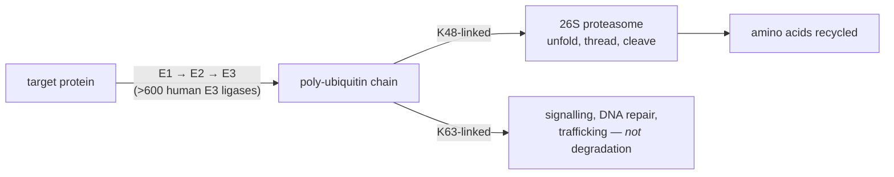
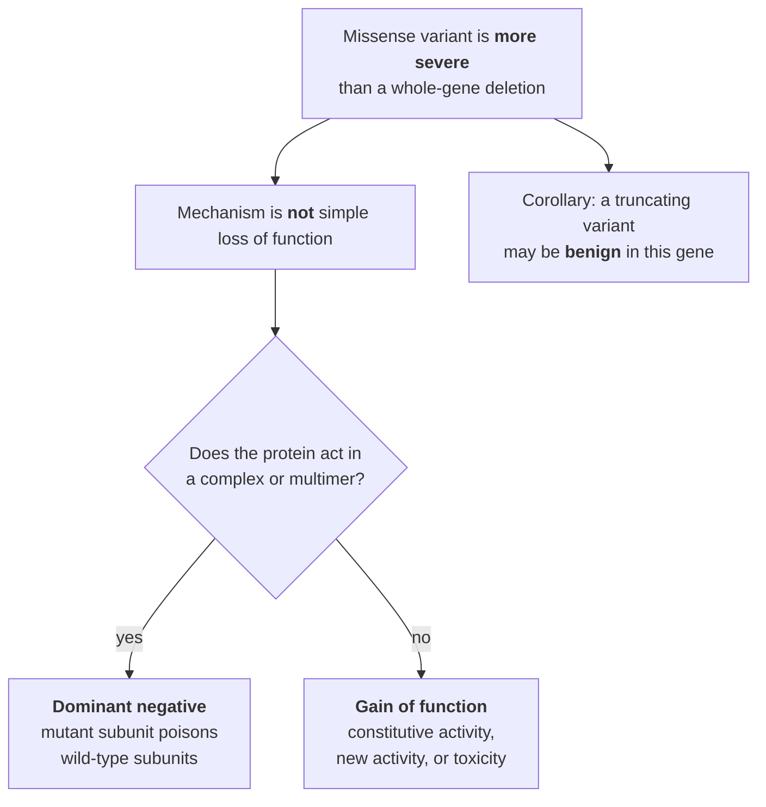

# 08 — Proteins, and what genes actually do

> **Before this:** [Ch 01](../part-00-orientation/01-chemistry-and-cell-primer.md) · [Ch 06](06-rna-processing.md) · [Ch 07](07-genetic-code-and-translation.md) · **Time:** ~40 min

Chapter 07 left a chain of amino acids coming off a ribosome. That chain is not yet a protein
in any useful sense — it is a string that has to become a machine. This chapter covers how it
does that, what the machine then does, how the cell modifies and destroys it, and then
dismantles the word "gene", which by that point will have stopped meaning anything precise.

## What you'll be able to do

- Predict, from an amino acid substitution, which structural property is likely to break
- Explain why sequence determines structure, and say where that fact stops being operationally
  useful
- Predict the charge change each class of side-chain modification makes, and explain why the
  modified and unmodified forms of one gene product are functionally different molecules
- Derive how a protein's degradation rate sets both its steady-state level and its response time
- Explain why the word "gene" cannot be given a physical definition, naming at least five
  distinct phenomena that break one, with an example of each
- Distinguish loss-of-function, gain-of-function and dominant-negative mechanisms, and say which
  one predicts that a missense variant is worse than a whole-gene deletion
- State what a predicted structure does and does not license you to conclude

## The core idea

A protein is a **linear string that folds into a surface**. Everything a protein does —
catalyse, bind, transport, signal, hold things up — it does by presenting a specific shape with
specific chemistry at a specific place. Function is a property of the surface, and the surface
is determined by the sequence.

The consequence: **the genome specifies shapes indirectly, by specifying strings.** Enzyme
activity, binding affinity, regulatory logic are all emergent from a one-dimensional encoding.
That is why one base change can abolish a function or do nothing, depending entirely on whether
the residue it changes is holding up a surface.

The exception, equally important: the string is not the whole specification. The same string is
chemically modified after synthesis into a set of functionally distinct molecules, is degraded
on a schedule of its own, and in a substantial minority of cases does not fold at all. The map
from gene to function is many-to-many in both directions — which is where the word "gene" begins
to come apart.

---

## 1. Twenty side chains

Every amino acid has the same backbone. What differs is one **side chain**. The backbone
provides the chain; the side chains provide all the chemistry.

| Class | Residues | Side-chain chemistry | What it buys you |
|---|---|---|---|
| **Nonpolar aliphatic** | Ala (A), Val (V), Leu (L), Ile (I), Met (M) | saturated hydrocarbon | Buried in the core — the hydrophobic effect's raw material |
| **Aromatic** | Phe (F), Trp (W), Tyr (Y) | flat ring systems | Core packing and stacking; Tyr's –OH makes it polar and phosphorylatable |
| **Polar uncharged** | Ser (S), Thr (T), Asn (N), Gln (Q) | hydroxyl or amide | Surface, hydrogen bonding; Ser and Thr are the main phosphorylation targets |
| **Acidic** | Asp (D), Glu (E) | carboxylate, pKa ≈ 3.9 / 4.3 | Negative at pH 7.4: salt bridges, metal coordination, catalysis |
| **Basic** | Lys (K), Arg (R), His (H) | amine / guanidinium / imidazole, pKa ≈ 10.5 / 12.5 / 6.0 | Positive at pH 7.4 — except His; DNA binding; Lys is the main modification target |
| **Special** | Gly (G), Pro (P), Cys (C) | see below | Break the rules |

**Histidine's pKa sits near 6.0**, within reach of physiological pH, making it the only residue
that routinely acts as both acid and base by gaining or losing a proton. That is why it is the
workhorse of catalytic sites — the Ser–His–Asp triad of the serine proteases, for one — and why
substituting it so often abolishes activity.

The three special residues are special for three unrelated reasons. **Glycine** has no side
chain, just a hydrogen, so it occupies almost no space and adopts backbone geometries nothing
else can; a conserved glycine usually marks a tight turn or a packing constraint that admits
nothing larger. **Proline**'s side chain loops back onto its own backbone nitrogen, so it cannot
donate a backbone hydrogen bond and its rotation is locked — it breaks helices and terminates
sheets. It is punctuation. **Cysteine**'s thiol forms the **disulfide bond**, the only covalent
cross-link in ordinary protein structure; because the cytoplasm is chemically reducing,
disulfides are effectively confined to secreted and extracellular proteins, which is a useful
tell when reading a sequence.

There is a twenty-first: **selenocysteine**, inserted at certain UGA codons given a specific
downstream RNA structure ([Ch 07](07-genetic-code-and-translation.md)). The alphabet is not
quite closed.

## 2. Four levels

| Level | What it is | Determined by |
|---|---|---|
| **Primary** | the amino acid sequence | the gene |
| **Secondary** | local repeating backbone geometry: α-helix, β-sheet, turns | local sequence propensity |
| **Tertiary** | the full 3D fold of one chain | the whole sequence, mostly via the hydrophobic core |
| **Quaternary** | assembly of several chains into a complex | interface surfaces |

The peptide bond is planar, leaving each residue exactly two rotatable backbone angles.
Secondary structure is what you get when a run of residues adopts the *same* pair of angles.
The **α-helix**: 3.6 residues per turn, 1.5 Å rise per residue, 5.4 Å pitch, right-handed, with
a hydrogen bond from the carbonyl of residue *i* to the amide of *i+4* — all backbone hydrogen
bonds satisfied internally, which is what makes it stable. The **β-sheet**: strands nearly fully
extended at ~3.3–3.5 Å per residue, hydrogen-bonded *sideways* to neighbouring strands, with
adjacent side chains pointing to opposite faces.

Those geometries hand you a signal-processing result. Map each residue to a hydrophobicity value
and look at the periodicity of the vector:

```
amphipathic α-helix, period 3.6:      β-strand, period 2:

  L K E L E K K L K E L E K K L       V S V T V K V N V
  ^     ^       ^     ^       ^       ^   ^   ^   ^   ^
  gaps of 3 and 4 — every marked      every other residue —
  leucine on the same face            alternating faces
```

Period ≈3.6 means one face of a helix is greasy — and because 3.6 is not an integer, the greasy
positions cannot be evenly spaced: they fall as alternating gaps of 3 and 4. Such a helix lies
against a membrane, packs against another helix, or forms a coiled coil (period tightening to 3.5,
the classic heptad repeat, hydrophobics at the *a* and *d* positions). Period 2 means an
amphipathic strand. This is a Fourier problem on a numerical vector, and it was one of the first
structural inferences ever made from sequence alone.

**Tertiary structure** is dominated by burying hydrophobic side chains away from water and
leaving polar ones exposed ([Ch 01](../part-00-orientation/01-chemistry-and-cell-primer.md)). A
protein is a greasy core in a polar shell — which yields the most useful heuristic in variant
interpretation: **a substitution that puts a charge in the core, or changes the volume of a
buried residue, is far more likely to be damaging than the same substitution on the surface.**

**Quaternary structure** matters here for one reason: it is the structural precondition for the
dominant-negative mechanism in §10. If a protein works alone, a bad copy is a wasted copy. If it
works in a complex, a bad copy can wreck the good ones.

## 3. Anfinsen, Levinthal, chaperones

Christian Anfinsen denatured ribonuclease A — 124 residues, four disulfide bonds — completely,
and let it refold in a test tube with nothing else present. It recovered full catalytic activity.
The conclusion, worth a Nobel Prize in 1972: **all the information specifying the
three-dimensional structure is in the amino acid sequence.** The native state is the
thermodynamic minimum and folding is spontaneous.

Cyrus Levinthal showed why that cannot be taken literally. Give a 100-residue protein just three
accessible backbone conformations per residue: 3¹⁰⁰ ≈ 5 × 10⁴⁷ states. Sample each in 10⁻¹³ s,
about the fastest physically plausible rate, and exhaustive search takes

```
5 × 10⁴⁷ states × 10⁻¹³ s  =  5 × 10³⁴ s  ≈  1.6 × 10²⁷ years
```

against a universe roughly 1.4 × 10¹⁰ years old. Real proteins fold in microseconds to seconds.
Folding is therefore not a search over a flat space: the energy landscape is **funnelled**, local
structure forms fast, near-native contacts are stabilising, and the chain is biased downhill from
the start. Anfinsen says the destination exists; the funnel says why it is reachable.

Two things break the test-tube picture in a cell. **Folding is co-translational** — the chain
emerges N-terminus first at ~5–20 residues per second and begins folding before the C-terminus
exists, so the pathway depends partly on translation *speed*. That is one real mechanism by which
a synonymous codon change, altering elongation rate but not sequence, is not silent. And **the
cytoplasm is crowded**: at 20–30% macromolecule by volume, a partly folded chain with an exposed
hydrophobic patch is more likely to meet another partly folded chain than to be left alone.
Aggregation competes with folding.

**Chaperones** address that second problem — Hsp70 binding and releasing exposed hydrophobic
stretches in ATP-driven cycles, chaperonins such as GroEL/GroES caging a single chain so it folds
in isolation. Note what this is not: chaperones add **no structural information**. They do not
know the target fold and do not instruct. They suppress unproductive interactions and give the
chain repeated attempts at the funnel. Anfinsen's principle is untouched; it is the kinetics, not
the thermodynamics, that needs help.

## 4. Domains, families, motifs

Proteins are not monolithic. They are built from **domains**: independently folding units,
typically 100–250 residues, that recur across unrelated proteins in different combinations.

Because a domain folds by itself it can be excised and expressed alone — and, evolutionarily,
**shuffled**. Recombination within introns can move a whole exon-encoded domain into a new
context without disturbing either partner's reading frame — provided the module is flanked by
introns of the *same phase* ([Ch 06](06-rna-processing.md),
[Ch 35](../part-07-molecular-evolution/35-genome-evolution.md)). Only phase-symmetric modules
(0–0, 1–1, 2–2) can be inserted, duplicated or deleted frame-neutrally; an asymmetric one
frameshifts everything downstream of it. That constraint leaves a fossil record: symmetric exons
are markedly over-represented among shuffled domains. Tissue plasminogen activator is
the standard exhibit: a fibronectin domain, an EGF-like domain, two kringle domains and a serine
protease domain, every one of which appears in other, unrelated proteins. A mosaic assembled from
parts, not a design.

| Biological term | Rough computational equivalent | How it is detected |
|---|---|---|
| **Domain** | a linked library — reusable, self-contained, composable | profile HMM (Pfam), structural comparison |
| **Family** | all descendants of one ancestral module | HMM search, phylogenetics ([Ch 34](../part-07-molecular-evolution/34-phylogenetics.md)) |
| **Motif** | a short string constant with meaning — a tag or address | regular expression (PROSITE-style patterns) |

The last distinction is worth holding. A **motif** is short — often 3 to 10 residues — has no
independent structure, and works as a label: a nuclear localisation signal, an ER retention
signal, an integrin-binding RGD, a phosphodegron marking a protein for destruction. Motifs are
cheap to gain and lose by point mutation, which makes them the fast-evolving layer of the
interaction network. A **domain** is expensive and essentially never invented twice.

## 5. What the surface does

**Active sites.** Catalytic machinery occupies a small pocket, usually a handful of residues
distant in sequence and adjacent in space — which is why active-site residues are the most
conserved positions in a family, and why painting conservation onto a structure lights up the
functional site. Catalysis works by stabilising the *transition state* rather than the substrate:
the enzyme binds that strained configuration at the top of the barrier — a transition state, not an
intermediate, which would sit in an energy well and have a finite lifetime — more tightly than it
binds either substrate or product, and that differential binding energy is the rate enhancement.

**Binding surfaces.** Protein–protein interfaces typically bury 1,200–2,000 Ų, but binding
energy is not spread evenly over them. A few **hotspot** residues contribute most of the affinity
— which is why a handful of interface mutations abolish binding and most do nothing.

**Allostery.** A molecule binds at one site and changes activity at a *different* site, by
shifting the equilibrium between conformational states. Haemoglobin: oxygen binding at one
subunit raises the affinity of the others, giving a sigmoid rather than hyperbolic binding curve
(Hill coefficient ≈ 2.8), so the molecule loads in the lungs and unloads in tissue over a narrow
pressure range.

> Allostery is what makes biological regulation possible at all. Without a way to change a
> protein's behaviour from a site other than its active site there is no signalling, no feedback
> inhibition, and no way for one molecule to control another. It is the second input port.

## 6. Post-translational modification: the mutable layer

A given protein molecule's sequence is fixed once it leaves the ribosome. Its chemistry is not.
Covalent modification of side chains produces functionally distinct molecules from one gene
product, reversibly, on timescales of seconds.

| Modification | Target residues | Charge change | Typical meaning |
|---|---|---|---|
| **Phosphorylation** | Ser, Thr, Tyr (≈86 : 12 : 2 by abundance) | **+2 negative** | The universal switch; reversed by phosphatases |
| **Acetylation** | Lys | **removes +1** | Neutralises a positive charge — loosens histone–DNA binding ([Ch 23](../part-04-gene-regulation/23-chromatin-and-epigenetics.md)) |
| **Methylation** | Lys, Arg | **none** | Changes shape and binding surface, not charge. Lys takes 0–3 methyls: a four-state variable |
| **Ubiquitination** | Lys | attaches a 76-residue protein | A routing tag — see §7, where the *linkage* carries the meaning |
| **Glycosylation** | Asn (N-linked, sequon Asn-X-Ser/Thr, X ≠ Pro); Ser/Thr (O-linked) | — | Secreted and surface proteins: stability, recognition, identity |

Phosphorylation earns its prominence: a phosphate places two negative charges at a defined
position, making or breaking a salt bridge, triggering a conformational change, or creating a
binding site a partner domain recognises. Humans encode **518 protein kinases** and roughly 200
phosphatases; pairing writers with erasers is what makes the modification a switch rather than a
one-way mark.

Two conceptual points matter more than the catalogue. **Glycosylation is not template-encoded** —
the glycan is built by a series of competing enzymes, so its structure depends on enzyme
abundance rather than any DNA sequence. There is no gene "for" a glycan, only genes for the
enzymes that build it; the ABO blood groups are exactly this
([Ch 11](../part-02-transmission-genetics/11-beyond-mendel.md)). And **some modifications are
structural, not regulatory**: collagen needs the prolines sitting in the Y position of its Gly-X-Y
repeat hydroxylated — roughly half of all its prolines — by a vitamin-C-dependent enzyme, or its
triple helix is unstable at body temperature. Scurvy is a post-translational modification failure.

## 7. Degradation, and the two-sided ledger



Ubiquitin is a 76-residue protein appended to lysines by a three-enzyme cascade whose last member,
the E3 ligase, supplies substrate specificity — humans encode more than 600. The critical detail:
chains are built by linking through one of ubiquitin's *own* lysines, and **the linkage determines
the meaning**. K48 chains route to the proteasome; K63 chains do not, acting instead in signalling
and DNA repair. Ubiquitin is a typed tag, not a boolean flag. The 26S proteasome is a barrel with
its catalytic sites inside, so a substrate must be unfolded and threaded through a narrow pore —
destruction is sequestered, and nothing is degraded by accident.

Now the part worth deriving. Let protein *P* be made at rate *s* and degraded first-order at rate *k*:

```
dP/dt = s − kP
```

**Steady-state level.** Setting dP/dt = 0 gives **P\* = s / k**. Abundance is a ratio, not a
synthesis rate. Doubling the degradation rate halves the protein level with no change whatever in
transcription — so a mechanism acting only on stability suffices to control expression.

**Response time.** *P* approaches a new steady state with time constant 1/*k*, a half-time of
ln2/*k* — **the protein's own half-life, independent of *s***. A stable protein cannot be
regulated quickly however sharply you change its transcription; you have to wait for the existing
molecules to disappear. Hence proteins that must respond fast — cyclins, transcription factors,
signalling intermediates — have half-lives of minutes, and buy a short time constant with
continuous resynthesis.

Measured half-lives span minutes (ornithine decarboxylase, many cyclins) to years (eye-lens
crystallins, collagen), with a median in cultured mammalian cells around 10–20 hours depending on
cell type and method. **Degrons** — the N-terminal residue, PEST sequences, phosphodegrons — are
the sequence features that decide where in that range a protein sits.

## 8. When folding fails

**Misfolding causing loss of function.** *CFTR* p.Phe508del, the commonest cystic fibrosis allele,
makes a channel that could conduct chloride if it reached the surface, but that folds too slowly;
endoplasmic-reticulum quality control degrades it before it gets there. The dominant defect is
trafficking — but the protein that is rescued to the membrane also sits there less stably and gates
poorly, which is why the correctors that stabilise the fold (tezacaftor, elexacaftor) have to be
paired with a potentiator that holds the channel open (ivacaftor) before function is restored.

**Misfolding causing toxic gain of function.** The *SERPINA1* Z allele (p.Glu342Lys in classical
mature-protein numbering, p.Glu366Lys in HGVS) makes α1-antitrypsin polymerise, producing *both*
loss of function in the lung, where the missing protease inhibitor permits emphysema, *and* gain
of function in the liver, where polymers accumulate and cause cirrhosis. One variant, two
mechanisms, two organs.

**Self-propagating misfolding.** Amyloid — a cross-β fibril many unrelated sequences can adopt —
underlies Alzheimer's (Aβ, tau), Parkinson's (α-synuclein) and Huntington's (polyglutamine-expanded
huntingtin). Prions are the limiting case: misfolded PrP templates conversion of normal PrP, so
the *shape* is infectious. Information transmitted by conformation rather than sequence is the
sharpest counterexample there is to a purely sequence-based view of biology.

## 9. So what, exactly, is a gene?

Beadle and Tatum's 1941 *Neurospora* experiments produced **one gene — one enzyme**: mutate a
gene, lose exactly one metabolic step. A superb simplification, worth a Nobel Prize, and now
clearly false. It was patched to "one gene — one polypeptide" when haemoglobin turned out to have
two different chains. That patch has failed too.

| Phenomenon | What breaks | Example |
|---|---|---|
| **Alternative splicing** | one locus → many products | GENCODE 50 annotates **78,733 genes** and **644,292 transcripts** — roughly eight per gene ([verified facts](../reference/verified-facts.md)). *Dscam1* in *Drosophila* has 95 alternative exons in four clusters: 12 × 48 × 33 × 2 = **38,016** possible isoforms from one locus |
| **Non-coding RNA genes** | the product is never protein | tRNA, rRNA, microRNA, lncRNA. GENCODE 50 annotates **58,195** non-coding genes (35,885 lncRNA + 7,608 small ncRNA + 14,702 pseudogene) against **19,442** protein-coding — non-coding outnumbers coding roughly **3 : 1**. Do not reach that count by subtracting from the 78,733 total: a further 1,096 entries — 412 IG/TR segments, 665 readthrough genes and 19 artifacts — sit outside both tallies, and 1,077 of them are protein-coding ([verified facts](../reference/verified-facts.md)) |
| **Nested genes** | one gene inside another | *OMG*, *EVI2A* and *EVI2B* lie entirely within an intron of *NF1*, transcribed from the opposite strand |
| **Overlapping genes** | one stretch of sequence, two genes | Routine in viruses and bacteria; present in eukaryotes on opposite strands and in shifted frames |
| **Operons** | one transcript, several proteins | The *lac* operon: three proteins, one promoter, one mRNA ([Ch 21](../part-04-gene-regulation/21-bacterial-regulation.md)) |
| **Distal regulation** | the control element is not in the gene | The switch controlling *LCT* sits ~14 kb away, inside a neighbouring gene ([Ch 00](../part-00-orientation/00-the-whole-story.md)) |
| **RNA editing** | transcript ≠ template | ADAR enzymes convert adenosine to inosine, read as G. The protein sequence is not the DNA sequence |
| **Alternative promoters and poly(A) sites** | the boundaries are not fixed | The same locus starts and ends in different places in different tissues |

Each of these was discovered after the definition was written, and each was absorbed by weakening
it. What survives is not a physical object.

> **A gene is an annotation, not a thing.** It is a claim — made by a curation project, revised at
> each release — that a particular set of overlapping transcripts constitutes one coherent unit
> and deserves one name. Ask "where does this gene start?" and the honest answer is "in which
> annotation, of which build, for which transcript?" A gene is an entry in an index, not an object
> in memory. [Ch 44](../part-09-genomics/44-annotation.md) shows the index being built.

This is not nihilism, and the word stays indispensable. In transmission genetics a gene is a locus
that segregates, which is perfectly well defined; in the clinic it is the unit that carries a
disease association. The point is that these are *different* definitions which usually, but not
always, coincide — and the cases where they diverge are where the interesting biology is.

## 10. Loss, gain, and poison

Three mechanisms by which a variant changes what a gene product does. These underpin dominance
([Ch 10](../part-02-transmission-genetics/10-mendelian-inheritance.md),
[Ch 11](../part-02-transmission-genetics/11-beyond-mendel.md)) and variant interpretation
([Ch 55](../part-11-human-and-statistical-genomics/55-clinical-variant-interpretation.md)).

**Loss of function (LoF).** Less or no working product — nonsense, frameshift, essential
splice-site disruption, whole-gene deletion, or a missense that destroys the fold or active site.
Complete loss is an **amorph**, partial loss a **hypomorph** (Muller's 1932 terms, still in use).

**Gain of function (GoF).** The product does something it should not: constitutive activity
(*FGFR3* p.Gly380Arg locks a receptor on, causing achondroplasia), a novel activity
(**neomorph**), altered specificity, expression in the wrong place, or a toxic aggregate.

**Dominant negative (antimorph).** The mutant product actively interferes with the normal product
from the other allele. This requires the protein to act as a multimer or to compete for a site or
substrate — a defective monomer working alone is merely an absent monomer.

**Why loss of function is usually recessive.** Not because "one good copy compensates" — the
intact allele is generally *not* upregulated. Because 50% of normal product is usually enough, and
Kacser and Burns made that quantitative: control of flux through a multi-step pathway is
distributed across all its enzymes, so each has a small flux control coefficient and the
flux–activity curve saturates strongly. Halve one enzyme and flux barely moves. Recessivity is a
by-product of pathway kinetics, not an adaptation.

**Haploinsufficiency** is what happens when that argument fails: 50% is not enough, so LoF is
dominant. It is characteristic of products that are rate-limiting, needed stoichiometrically in a
complex, or dosage-sensitive transcription factors — *PAX6* (aniridia), *NSD1* (Sotos syndrome),
*ELN* (supravalvular aortic stenosis). Roughly 3,000 human genes score as strongly
loss-of-function-intolerant in gnomAD constraint metrics: the population-scale way of asking the
same question empirically.



That diagram is the practical payoff. A predicted-null variant is strong evidence for pathogenicity
**only if loss of function is an established mechanism for that gene**. Where disease arises by
dominant-negative or gain-of-function mechanism, a truncating allele can be harmless — and a
truncation in the final exon, which escapes nonsense-mediated decay, can be *worse* than an earlier
one, because it yields a shortened protein rather than none at all.

## 11. Structure prediction, and what changed

Structure determination used to be the bottleneck: one protein, one crystal, months to years. CASP
— a blind biennial assessment running since 1994, in which predictors submit models for structures
not yet released — measured slow progress for two decades. At CASP14 in 2020, AlphaFold2 returned a
median GDT_TS around 92 on a 0–100 scale, where ~90 approximates the agreement between two
independent experimental determinations of the same protein. The AlphaFold database now covers over
200 million sequences, effectively all of UniProt, with recent releases adding millions of predicted
dimers; AlphaFold 3 and its open competitors extend the approach to complexes with nucleic acids
and small molecules.

Structure went from a scarce experimental result to an abundant computed annotation. Be precise
about what that licenses.

| It gives you | It does not give you |
|---|---|
| A high-quality model of the dominant folded state | The conformational **ensemble** — allosteric proteins have several functional states; you get one |
| Domain boundaries and fold assignment, often better than sequence search | **Function.** Structure constrains function; it does not determine it |
| Per-residue confidence (pLDDT) and inter-domain confidence (PAE) | A physical B-factor. Low pLDDT usually flags **intrinsic disorder** — information, not failure |
| A strong prior on where a residue sits: core, surface, interface, active site | A reliable prediction of what a **point mutation** does |

That last row is the one that gets misused. These models predict the structure a folding sequence
adopts; they were not trained on stability changes and characteristically return the wild-type fold,
confidently, for destabilising substitutions. Variant-effect prediction is a separate problem with
separate tools, and those tools are predictors, not measurements.

Two further caveats. Accuracy leans on the depth of the multiple sequence alignment, so performance
degrades for sequences with few homologues — precisely the orphan-gene case where you most wanted
help. And roughly a third of human proteins contain long segments with no fixed structure; for
those, "predict the structure" is the wrong question, because the functional state is the
disordered one.

---

## Common misconceptions

| What people think | What's actually true |
|---|---|
| One gene, one protein | GENCODE 50: 78,733 genes, 644,292 transcripts. Add post-translational modification and the count of functionally distinct molecules is larger again |
| Chaperones tell a protein how to fold | They add no structural information. They suppress aggregation and give the chain repeated attempts. Anfinsen's principle is untouched |
| Every protein has a fixed 3D structure | Roughly a third of human proteins contain long disordered segments, and for many of those disorder *is* the functional state |
| Post-translational modification is fine-tuning | Phosphorylation can change activity by orders of magnitude and is the switch most signalling runs on. Modified and unmodified forms are functionally different molecules |
| Protein level is set by transcription | Level is synthesis ÷ degradation. Halving stability halves abundance with transcription unchanged — and stability alone sets how fast the protein can respond |
| A truncating variant is always worse than a missense | Only when the mechanism is loss of function. Under a dominant-negative or gain-of-function mechanism a truncation can be milder, or benign |
| Dominant means the mutant protein is stronger | Dominance describes the heterozygote. It arises from haploinsufficiency, dominant-negative poisoning, or gain of function — three mechanisms with different predictions |
| Loss of function is recessive because the good copy works harder | The intact allele is generally not upregulated. Half the product is usually enough because pathway flux is buffered against changes in any single enzyme |
| AlphaFold solved protein folding | It predicts structures, extremely well. It does not model the folding *process*, give the conformational ensemble, or reliably predict what a mutation does |
| Synonymous changes cannot affect the protein | They can alter elongation rate and therefore co-translational folding, and can disrupt splicing. Rarely — but the mechanism is real |

## Worked example: why a missense can be worse than a deletion

Osteogenesis imperfecta is caused by variants in the type I collagen genes. Two classes of variant
in the same gene, *COL1A1*, give phenotypes at opposite ends of the severity range. Work out why.

**The structure.** Type I collagen is a triple helix of three chains: two α1(I) chains from
*COL1A1* and one α2(I) chain from *COL1A2*. It requires glycine at every third position, because
only glycine's hydrogen side chain fits at the crowded helix axis:

```
   Gly-X-Y-Gly-X-Y-Gly-X-Y-Gly-X-Y ...
    ^       ^       ^       ^
    faces the helix axis — only -H fits
```

**Variant A: a frameshift in *COL1A1* triggering nonsense-mediated decay.** No α1(I) from that
allele, so the cell makes half the normal amount. Every helix it does assemble is structurally
perfect; there are simply fewer. Phenotype: OI type I — mild, near-normal stature, elevated
fracture rate.

**Variant B: a missense replacing one of those glycines** — a Gly→Ser substitution somewhere in
the triple-helical domain. The allele is transcribed and translated normally, so **half of all
α1(I) chains carry the substitution**. A helix
draws two α1(I) chains independently from that pool:

```
P(both α1 chains normal)              = ½ × ½ = ¼
P(helix contains ≥1 defective chain)  = 1 − ¼ = ¾
```

**Three quarters of all collagen molecules are defective**, against 50% *fewer but perfect*
molecules for the null allele — and defective helices are not merely inert, since they are retained,
degraded, and disrupt fibril assembly, pushing effective function below the 25% the arithmetic
suggests. Phenotype: severe OI — progressively deforming type III, or perinatally lethal type II
for substitutions falling in the lethal regions of the helix. Severity is strongly
position-dependent and depends on which residue replaces the glycine, which is why this one class
of variant spans most of the OI severity range.

**The general result.** For a complex containing *n* copies of the affected subunit with mutant
fraction *f*, the fraction of fully wild-type complexes is **(1 − f)ⁿ**. For a heterozygote, *f* = ½:

| Copies of the subunit, *n* | Fully normal complexes | Effectively poisoned |
|---|---|---|
| 1 (monomer) | 50% | 50% — indistinguishable from a null allele |
| 2 (collagen's α1) | 25% | 75% |
| 3 (homotrimer) | 12.5% | 87.5% |
| 4 (homotetramer) | 6.25% | 93.75% |

Three conclusions to carry forward. **A dominant-negative allele can drive effective activity far
below the 50% floor a null allele imposes** — "worse than nothing" is literal. **Severity scales
with subunit count**, which is a testable structural prediction rather than a rule of thumb. And
therefore **"missense more severe than deletion" is diagnostic of mechanism**: it is the single most
informative observation you can make about a disease gene before running any experiment, and it
decides whether a predicted-null variant found in a patient is strong evidence of pathogenicity or
nearly meaningless.

## Connections

- **Back to:** [Ch 01](../part-00-orientation/01-chemistry-and-cell-primer.md) — the hydrophobic
  effect and stochastic binding that make folding and specificity work ·
  [Ch 06](06-rna-processing.md) — alternative splicing, the main reason one gene makes many products ·
  [Ch 07](07-genetic-code-and-translation.md) — the code and the ribosome that build the chain
- **Forward to:** [Ch 10](../part-02-transmission-genetics/10-mendelian-inheritance.md) and
  [Ch 11](../part-02-transmission-genetics/11-beyond-mendel.md) — dominance, now with a mechanism
  underneath it · [Ch 16](../part-03-genome-instability/16-mutation.md) — variant classes mapped onto
  these consequences · [Ch 23](../part-04-gene-regulation/23-chromatin-and-epigenetics.md) — histone
  modification, the same PTM chemistry used as a regulatory code ·
  [Ch 44](../part-09-genomics/44-annotation.md) — how the gene annotations §9 deconstructs are built ·
  [Ch 55](../part-11-human-and-statistical-genomics/55-clinical-variant-interpretation.md) — where
  these three mechanisms become formal evidence codes

## Check yourself

**1. Why is loss of function usually recessive, and what characterises the genes where it isn't?**

<details><summary>Answer</summary>

Not because the intact allele compensates by working harder — it generally doesn't. Because 50% of
normal product is usually sufficient: flux through a pathway is controlled jointly by all its
enzymes, so each has a small flux control coefficient and the flux–activity relationship saturates.
Halving one enzyme moves flux very little (Kacser and Burns). Recessivity is emergent from pathway
kinetics, not an adaptation.

The exceptions — haploinsufficient genes — are those where the relationship is not saturating:
rate-limiting products, dosage-sensitive transcription factors, and subunits needed in fixed
stoichiometry. Roughly 3,000 human genes look strongly loss-of-function-intolerant in gnomAD
constraint metrics.

</details>

**2. In some disease gene, missense variants cause severe disease and whole-gene deletions cause almost nothing. What is the mechanism, and what does that imply for a frameshift found in a patient?**

<details><summary>Answer</summary>

Not loss of function — losing the gene entirely is nearly harmless, so absence of the protein is
tolerated. The missense variants must be doing something positive: gain of function (constitutive
or novel activity, a toxic species) or dominant negative (mutant product interfering with
wild-type). Whether the protein works in a complex distinguishes the two.

Implication: the frameshift is probably not the cause. It produces the same state as the deletion,
which is benign here. Applying "predicted null → strong evidence of pathogenicity" would be a
mechanistic error, and a common one.

</details>

**3. A protein has a 20-hour half-life. You want its level halved within 30 minutes of a signal. Can you do that by shutting off transcription?**

<details><summary>Answer</summary>

No. With dP/dt = s − kP, the approach to a new steady state has half-time ln2/k — the protein's own
half-life — whatever you do to *s*. Setting *s* to zero still leaves 20 hours to lose half the
molecules, because the existing pool has to clear. Responding in 30 minutes requires increasing *k*:
targeted ubiquitination and proteasomal degradation, which is exactly why regulated degradation
exists and why fast-acting regulators are short-lived.

Corollary: steady state is s/k, so raising *k* also lowers the baseline. Fast response is paid for
with continuous resynthesis. The trade-off is not avoidable.

</details>

**4. A structure predictor returns a model of your missense variant essentially identical to wild type, at high per-residue confidence. What have you learned?**

<details><summary>Answer</summary>

Almost nothing about the variant. These models predict the structure a sequence adopts if it folds;
they are not trained to report stability changes and characteristically return the wild-type fold
for destabilising substitutions. High pLDDT expresses confidence in the *fold*, not the protein's
thermodynamic stability.

What the model is good for is context — whether the residue is buried or surface-exposed, in an
active site, at a domain interface, or in a disordered region. That context feeds a variant
interpretation; it is not one.

</details>

**5. GENCODE annotates 78,733 genes and 644,292 transcripts. In what sense is "gene" being used there, and why can't the definition be purely physical?**

<details><summary>Answer</summary>

It means "a locus producing a coherent, overlapping set of transcripts, grouped and named by a
curation project". A bookkeeping unit, whose boundaries are curatorial decisions that change between
releases.

A physical definition fails on several fronts simultaneously: transcripts from one locus overlap in
different combinations, and no single interval contains them all; genes nest inside other genes'
introns and are transcribed from the opposite strand (*OMG*, *EVI2A*, *EVI2B* within *NF1*); the
regulatory elements determining whether the locus is transcribed can lie tens of kilobases away
inside a different gene; bacterial operons put several products under one transcription unit; and
RNA editing means the mature transcript sequence is not the genomic sequence. Every attempt to draw
the boundary physically either splits things everyone agrees are one gene or merges things everyone
agrees are two.

</details>
