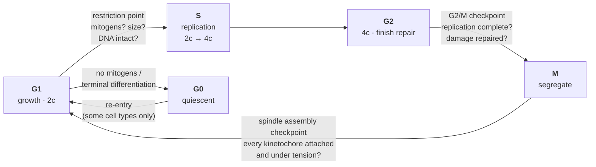
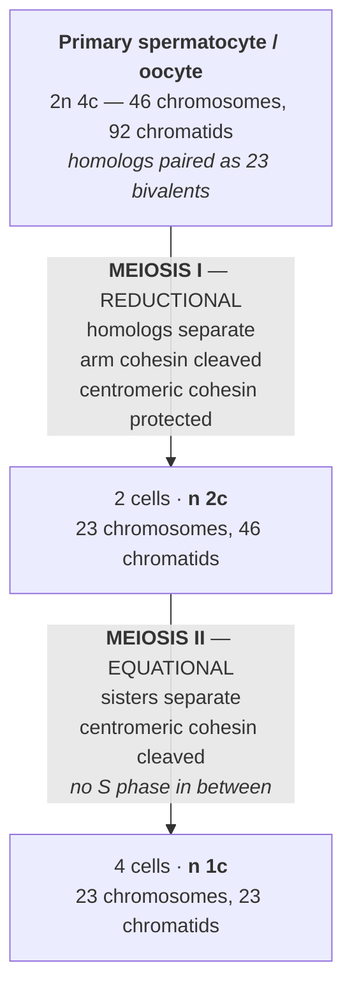

# 09 — Mitosis and meiosis

> **Before this:** [Ch 03](../part-01-molecular-foundations/03-genomes-chromosomes-chromatin.md) · [Ch 04](../part-01-molecular-foundations/04-dna-replication.md) · **Time:** ~45 min

Mendel's laws are not laws. They are the observable behaviour of a mechanical process that
nobody had seen when he inferred them. This chapter is that process. Everything in Part 2
— segregation ratios, independent assortment, linkage maps, sex linkage, the arithmetic of
pedigrees — is downstream of what happens to a chromosome pair on a spindle.

## What you'll be able to do

- Distinguish chromatid, chromosome and homolog, and state the chromosome count, chromatid
  count and DNA content of a cell at any stage of either division
- Explain why a guarded transition rather than a timer makes mitotic missegregation rare, and
  why the same spindle checkpoint fails to protect an oocyte
- Explain why the obligate crossover is load-bearing rather than decorative, and predict how a
  bivalent that received none segregates
- Trace one chromosome pair, with two heterozygous loci, through both meiotic divisions and
  predict all four products
- Derive Mendel's segregation and independent-assortment ratios from spindle mechanics rather
  than asserting them
- Predict the genotype of the aneuploid gamete produced by nondisjunction in meiosis I versus
  meiosis II, and diagnose which occurred from marker data
- Explain the maternal age effect from the cell biology of the arrested oocyte, and say why
  paternal age does something entirely different

## The core idea

Two operations, with different invariants.

**Mitosis** is a copy. The invariant is *exactness*: each daughter cell receives one complete
copy of every chromosome. Nothing is shuffled, nothing is lost, the ploidy is unchanged. This
is growth, repair, and every cell division in your body that isn't making a gamete.

**Meiosis** is a reduction. The invariant is *halving*: each product receives exactly one
member of each chromosome pair. But *which* member is randomised independently for each pair,
and before the split the two members physically exchange segments. So meiosis is a copy
operation deliberately corrupted in two controlled ways — and those two corruptions are the
entire source of the combinatorial variation that genetics studies.

The trick that makes reduction possible is arithmetic: **two divisions, one round of
replication.** Replicate once, divide twice, and you have quartered the DNA content and
halved the chromosome number. Everything mechanically interesting about meiosis is in the
service of that one-off asymmetry.

---

## 1. The vocabulary that trips everyone up

This section is the reason people find meiosis hard. Three words, one of which changes
meaning depending on when in the cell cycle you ask.

**Chromosome.** One centromere and everything attached to it. In G1 that is a single DNA
molecule. After S phase it is *two* identical DNA molecules held together — and it is still
**one chromosome**, because there is still one centromere.

**Chromatid.** One of the two DNA molecules in a replicated chromosome. The two are **sister
chromatids**: made by replicating the same template in S phase, therefore identical apart
from the occasional replication error.

**Homolog.** The other copy of the same chromosome — the one that came from your other
parent. Same genes, same order, same length. **Not identical**: two human homologs differ at
roughly one base in a thousand, which over a 100 Mb chromosome is around 100,000 differences.
Every heterozygous site you carry is a difference between two homologs.

```
        G1 — before replication              G2 — after replication

     maternal        paternal            maternal          paternal
       chr 7           chr 7               chr 7             chr 7

        │               │                 │   │             │   │
        │ A             │ a               │A  │A            │a  │a
      ══╪══           ══╪══             ══╪═══╪══         ══╪═══╪══
        │ B             │ b               │B  │B            │b  │b
        │               │                 │   │             │   │
        ↑               ↑                 └─┬─┘             └─┬─┘
    centromere      centromere         2 SISTER CHROMATIDS  2 SISTER CHROMATIDS
                                        identical to        identical to
                                        each other          each other
     1 chromosome    1 chromosome        1 chromosome        1 chromosome
     1 chromatid     1 chromatid         2 chromatids        2 chromatids

     ←──────── HOMOLOGS ────────→        ←──────── HOMOLOGS ────────→
     same loci (A, B), different alleles (A/a, B/b) — inherited from
     different parents, and differing at ~1 base in 1,000 along their length
```

> **Count centromeres, not arms.** A replicated chromosome that looks like an X under the
> microscope is one chromosome, not two. The count changes only when the centromere splits —
> at anaphase of mitosis, or anaphase II of meiosis, and at no other moment.

The standard bookkeeping is **n** (number of chromosome sets) and **c** (DNA content, in
units of one unreplicated haploid genome). For a human somatic cell:

| Stage | Chromosomes | Chromatids | n, c |
|---|---|---|---|
| G1 | 46 | 46 | 2n, 2c |
| G2 / mitotic prophase → metaphase | 46 | 92 | 2n, 4c |
| Mitotic anaphase (centromeres split) | 92 | 92 | 4n, 4c |
| Each mitotic daughter, G1 | 46 | 46 | 2n, 2c |
| Meiotic prophase I → **anaphase I** | 46 | 92 | 2n, 4c |
| After meiosis I | 23 | 46 | n, 2c |
| After meiosis II (gamete) | 23 | 23 | n, 1c |

Note the row in bold: at anaphase **I** the chromosome count is still 46, because the
centromeres have not split — whole replicated chromosomes are being pulled apart from each
other. This is the single most common counting error.

## 2. The cell cycle is a state machine with guards, not a timer

Division is a small fraction of a cell's life. A typical cultured mammalian cell runs a ~24 h
cycle of which mitosis is under an hour; the rest is **interphase** — G1, S, G2. (Treat those
durations as a teaching approximation: they vary enormously by cell type. A cleaving embryo
can cycle in under 30 minutes; a hepatocyte may not divide for a year.)



The transitions are **guarded**, not scheduled. Each checkpoint is a condition that must be
satisfied before the machinery is allowed to advance, and the mechanism is worth noticing
because it is a pattern you already know:

The **spindle assembly checkpoint** is a barrier that blocks anaphase until every
kinetochore in the cell is attached to the spindle and under tension. The signal is emitted
by *unattached* kinetochores — a single one produces a diffusible "wait" signal strong enough
to hold the entire cell. It is a barrier where the last worker to report in releases
everyone, and where the default is to block. That default matters: it is why mitosis in
normal human cells is accurate to roughly one missegregation per 100 divisions —
chromosomally unstable cancer lines are closer to one in five — and, as we'll see in §9, why
oocytes, in which the checkpoint is comparatively permissive, are not.

**G0** is not a stage of the cycle; it is exit from it. Most cells in an adult body are in G0.
Some can re-enter, some (neurons, cardiomyocytes) essentially never do.

## 3. Mitosis: the copy

Replication happens in S phase, long before the visible drama. Mitosis is purely the
segregation step.

| Stage | What happens |
|---|---|
| **Prophase** | Chromatin condenses into visible chromosomes; the two centrosomes separate and nucleate a spindle |
| **Prometaphase** | Nuclear envelope breaks down; microtubules capture kinetochores — the protein platforms built on each centromere |
| **Metaphase** | Every chromosome is **bi-oriented**: its two sister kinetochores face opposite poles, and it sits at the spindle midplane under balanced tension |
| **Anaphase** | Separase cleaves cohesin along the whole chromosome; sisters are pulled to opposite poles |
| **Telophase / cytokinesis** | Envelopes reform, chromatin decondenses, the cell divides |

Two mechanical facts carry all the weight, and both get inverted in meiosis I:

1. **Sister kinetochores face opposite directions**, so a captured chromosome is naturally
   pulled toward bi-orientation.
2. **Cohesin — the ring complex holding sisters together since replication — is cleaved
   everywhere at once** when the checkpoint releases.

Outcome: two daughters, each 2n, each genetically identical to the parent cell and to each
other, modulo somatic mutation. That "modulo" becomes the whole of
[Ch 56](../part-11-human-and-statistical-genomics/56-cancer-genomics.md).

## 4. Meiosis: replicate once, divide twice



Meiosis I is **reductional** — the ploidy halves. Meiosis II is **equational** — mechanically
close to mitosis, but performed on a haploid cell.

Three things make meiosis I different from every mitosis the cell has ever done:

**Homologs pair.** In mitosis, homologs ignore each other completely. In meiosis I they find
each other, align along their entire length, and become a single physical unit — a
**bivalent** (or tetrad: two chromosomes, four chromatids).

**Sister kinetochores co-orient.** Both sisters of one chromosome are wired to face the *same*
pole. Bi-orientation now happens at the level of the bivalent — maternal chromosome toward
one pole, paternal toward the other. This single inversion is what makes the division
reductional.

**Cohesin is released in two stages.** At anaphase I, cohesin is cleaved along the chromosome
arms only; the protein shugoshin shields cohesin at the centromere from separase. So sisters
stay joined through meiosis I and are separated only at anaphase II. Two-stage release is what
lets one replication serve two divisions.

Notice what that implies: until anaphase I, the two homologs of a bivalent are physically
held together by *arm cohesion distal to a crossover*. No crossover, no arm cohesion holding
them, no bivalent.

## 5. Prophase I: where the exchange happens

Prophase I is not a stage so much as a programme, and it can last decades (§10). Its
sub-stages:

| Sub-stage | Event |
|---|---|
| **Leptotene** | Chromosomes condense; the topoisomerase-like protein SPO11 deliberately cuts the genome, making roughly 200–300 programmed double-strand breaks |
| **Zygotene** | Homologs align and the **synaptonemal complex** begins to assemble between them — a proteinaceous zipper holding them at a fixed ~100 nm spacing along their length |
| **Pachytene** | Synapsis complete; breaks are repaired using the *homolog* as template. Only ~20% mature into crossovers — roughly 50 of the ~250 breaks per meiocyte; the rest resolve as non-crossovers (gene conversion), invisible to a linkage map |
| **Diplotene** | The synaptonemal complex dissolves; homologs stay attached only at **chiasmata** — the cytological manifestation of a crossover |
| **Diakinesis** | Maximum condensation; the bivalents are ready for the spindle |

The cell breaks its own genome in hundreds of places, on purpose, and repairs the breaks
using the other parent's chromosome as the template. That is what recombination *is*
mechanically; [Ch 18](../part-03-genome-instability/18-recombination-mechanisms.md) does the
biochemistry.

Crossover placement is controlled, not random. Two rules:

- **The obligate crossover.** Essentially every bivalent gets at least one, however small the
  chromosome.
- **Crossover interference.** One crossover suppresses others nearby, so crossovers are spaced
  out along a chromosome rather than Poisson-distributed. This has direct consequences for
  map construction ([Ch 14](14-linkage-and-mapping.md)).

Human totals, as ranges because estimates vary with the method: roughly **25–30 crossovers per
male gamete** and **40–45 per female gamete** — about twice that per meiotic cell, since each
crossover involves only two of the four chromatids (§6). Females recombine about 1.5–1.7× more
than males, and the sexes place their crossovers differently along the chromosome — a fact any
genetic map has to accommodate with sex-specific maps.

> **The obligate crossover is not there to generate variation. It is load-bearing.** Arm
> cohesion distal to a chiasma is the only thing holding a bivalent together between diplotene
> and anaphase I. A bivalent that receives no crossover — an *achiasmate* bivalent — has
> nothing connecting its two homologs, so they arrive at the spindle as two independent
> univalents and segregate at random. Recombination is therefore a structural requirement of
> accurate segregation, and a shortage of it is a direct cause of aneuploidy. Small
> chromosomes get fewer crossovers and are likelier to get none, which is part of why
> chromosome 21 is over-represented among surviving trisomies.

## 6. Tracing one pair all the way through

One chromosome pair, two heterozygous loci *A* and *B*, one crossover between them. `▓` marks
maternal-origin sequence, `░` paternal.

```
G1                       2n 2c
   ▓▓▓▓▓▓▓▓▓  A———————B          maternal homolog
   ░░░░░░░░░  a———————b          paternal homolog

S PHASE — each homolog replicates; sisters are identical
                         2n 4c
   ▓▓▓▓▓▓▓▓▓  A———————B  ┐ sisters
   ▓▓▓▓▓▓▓▓▓  A———————B  ┘
   ░░░░░░░░░  a———————b  ┐ sisters
   ░░░░░░░░░  a———————b  ┘

PROPHASE I — synapsis; ONE crossover, between A and B,
             involving one maternal and one paternal chromatid

   ▓▓▓▓▓▓▓▓▓  A———————B          chromatid 1   parental
   ▓▓▓▓▓▓▓░░  A———————b          chromatid 2   RECOMBINANT
                    ✕
   ░░░░░░░▓▓  a———————B          chromatid 3   RECOMBINANT
   ░░░░░░░░░  a———————b          chromatid 4   parental

METAPHASE I — the bivalent bi-orients; the two homologs
              face opposite poles, held together by the chiasma

              ◄── pole            pole ──►
                 [A—B / A—b]  ✕  [a—B / a—b]

ANAPHASE I — homologs separate. Centromeres do NOT split.
             46 chromosomes still, now 23 per side.

   cell 1:  A———————B          cell 2:  a———————B
            A———————b                   a———————b

MEIOSIS II — centromeres split; sisters separate.
             Note the sisters are no longer identical.

   ┌─ A———————B ─┐   ┌─ A———————b ─┐   ┌─ a———————B ─┐   ┌─ a———————b ─┐
   │  parental   │   │ RECOMBINANT │   │ RECOMBINANT │   │  parental   │
   └─────────────┘   └─────────────┘   └─────────────┘   └─────────────┘
```

Two results fall straight out of that diagram.

**A single crossover produces two recombinant and two parental products** — because it
involves only two of the four chromatids. So even in a meiosis that is *guaranteed* to have a
crossover between *A* and *B*, only half the gametes are recombinant. This is the mechanical
reason recombination frequency can never exceed 0.5, and it is the foundation of the entire
mapping framework in [Ch 14](14-linkage-and-mapping.md).

**Sister chromatids stop being identical the moment a crossover happens.** After prophase I,
"sisters are identical copies" is true only proximal to the exchange. This matters for
diagnosing nondisjunction (§8).

## 7. How this produces Mendel

Mendel inferred two rules from counting peas in the 1860s. The chromosome theory — Walter
Sutton on grasshopper spermatocytes and Theodor Boveri on sea urchin embryos, 1902–1903 —
proposed that his abstract "factors" were carried on the chromosomes people were watching
down microscopes. Roughly four decades separated the inference from the mechanism.

**Segregation.** Take a heterozygote *Aa*. *A* sits on one homolog, *a* on the other. Anaphase
I sends the homologs to opposite cells; anaphase II splits each into two. The four products of
one meiosis are exactly **A, A, a, a**.

Look carefully at what that means. The 1:1 ratio is not a probabilistic outcome of a single
meiosis — it is **exactly 2:2, deterministically, every time**. The randomness Mendel saw in
his ratios comes from sampling *which gametes participate in fertilisation*, not from the
segregation itself. In fungi, where all four products of a single meiosis stay together in an
ascus, you can see the deterministic 2:2 directly; that is **tetrad analysis**
([Ch 14 §6](14-linkage-and-mapping.md)), and it is why fungal genetics was so powerful so early —
an ascus that departs from 2:2 is a gene conversion caught in the act.

**Independent assortment.** Two loci on different chromosomes, genotype *AaBb*. At metaphase I
each bivalent bi-orients independently — which pole the maternal homolog faces is a fair coin,
and the coins are uncoupled. Two equally likely configurations:

```
   orientation 1              orientation 2
   ◄─ A      a ─►             ◄─ A      a ─►
   ◄─ B      b ─►             ◄─ b      B ─►

   gametes: AB, AB, ab, ab    gametes: Ab, Ab, aB, aB
```

Averaged over meioses: **AB : Ab : aB : ab = 1 : 1 : 1 : 1**. The 9:3:3:1 dihybrid ratio is
just this, squared and collapsed by dominance.

| Mendel inferred | The mechanism |
|---|---|
| Factors come in pairs | Chromosomes come in homologous pairs |
| The pair separates so each gamete gets one | Anaphase I separates homologs |
| Which one is a fair coin | The bivalent's orientation at metaphase I is random |
| Different factor pairs assort independently | Different bivalents orient independently |
| Pairs are restored at fertilisation | A haploid gamete fuses with a haploid gamete |

The correspondence is exact, which is why the hypothesis was compelling — but correspondence
is not proof. The proof came from breaking the correlation on purpose. Morgan's white-eyed
*Drosophila* (1910) showed a gene whose inheritance tracked the X chromosome specifically
([Ch 13](13-sex-linkage.md)). Bridges (1916) then found rare exceptional flies whose
*phenotypes* implied nondisjunction had occurred — and confirmed cytologically that those
exact flies had the abnormal chromosome constitutions predicted. A genetic anomaly and a
visible chromosomal anomaly, co-occurring in the same individuals. That is what settled it.

**The caveat Mendel got away with by luck.** Independent assortment applies to loci on
*different* chromosomes, or on the same chromosome far enough apart that crossovers randomise
them. Loci close together on one chromosome are **linked** and violate the rule flagrantly.
Mendel's seven characters happened to fall in configurations where he never saw it. Had they
not, Part 2 would be organised entirely differently.

**The scale of the shuffle.** With 23 independent bivalents, one human meiosis can produce
2²³ = **8,388,608** distinct combinations of whole parental chromosomes. Two parents:
2⁴⁶ ≈ 7 × 10¹³ zygote genotypes — before recombination. Recombination removes the ceiling
entirely: each transmitted chromosome is a mosaic whose ~1–3 switch points fall at positions
drawn from a continuous distribution, so the number of distinct gametes a person can make is
effectively unbounded. Siblings share 50% of their genome *in expectation*; the variance
around that is set by how many crossovers there are and where they land.

## 8. Nondisjunction: meiosis I versus meiosis II

**Nondisjunction** is failure to separate — of homologs at anaphase I, or of sisters at
anaphase II. The two produce distinguishable products.

```
  MEIOSIS I NONDISJUNCTION            MEIOSIS II NONDISJUNCTION
  both homologs go to one pole        one cell's sisters fail to split

        [M P]      [ ]                     [M]           [P]
          │         │                     ╱   ╲         ╱   ╲
        MII       MII                  [MM]   [ ]     [P]   [P]

   products:                          products:
     n+1  M P   ← BOTH parents'         n+1  M M   ← two copies of the
     n+1  M P      homologs                        SAME homolog
     n-1                                 n-1
     n-1                                 n    P
                                         n    P
   2 disomic + 2 nullisomic            1 disomic + 1 nullisomic
                                       + 2 normal
```

The genotypic signature is the diagnostic tool. Consider markers close to the centromere,
where crossovers are rare:

- **MI error**: the extra chromosomes are the two *different* homologs, so the trisomic
  offspring is **heterozygous** for both of that parent's pericentromeric alleles.
- **MII error**: the extra chromosomes are two sisters of *one* homolog, so the offspring
  carries **two copies of the same** pericentromeric allele.

Only pericentromeric markers work for this. Distal markers have been scrambled by crossing
over and will show a mixture. That single fact is what makes the classification tractable and
is how the epidemiology below was measured.

For trisomy 21, the best-characterised case: about **90% of errors are maternal**, and among
maternal errors roughly **77% arise in meiosis I** and **23% in meiosis II**. A caveat worth
carrying: many apparent MII errors show elevated recombination in the nondisjoined bivalent,
which suggests the underlying lesion was set up in meiosis I and only manifested later. The
classification is of the *observable*, not necessarily of the cause.

Aneuploidy outcomes are covered properly in
[Ch 20](../part-03-genome-instability/20-chromosome-abnormalities.md). The headline is that
most aneuploid conceptions do not survive — roughly half of first-trimester miscarriages are
chromosomally abnormal — and that the survivable autosomal trisomies are 21, 18 and 13, all
small, gene-poor chromosomes. Autosomal monosomy is uniformly lethal early; 45,X is the sole
viable monosomy in humans.

## 9. The maternal age effect

The strongest known risk factor for aneuploidy is maternal age, and the mechanism is a direct
consequence of the female meiotic timetable.

Human oocytes enter meiosis **in the fetus**. They complete prophase I — synapsis, breaks,
crossovers, chiasmata — before birth, and then arrest at diplotene (the *dictyate* stage).
That arrest lasts from roughly the fifth month of gestation until the oocyte is ovulated:
twelve years at the earliest, fifty at the latest.

The failure follows:

1. Cohesin is loaded onto the chromosomes during the **fetal** S phase, and the
   meiosis-specific subunits (REC8, SMC1B) are not replenished thereafter.
2. Over decades of arrest, cohesin is progressively lost. Oocytes from women in their
   forties show markedly reduced REC8 and SMC1B relative to women around twenty.
3. Arm cohesion distal to the chiasmata weakens, so **chiasmata slip toward the chromosome
   ends and off** — the bivalent falls apart into univalents before it ever reaches the
   spindle.
4. Centromeric cohesion weakens too, allowing **premature separation of sister chromatids**
   in meiosis I — which then look like meiosis II errors when the child is genotyped.
5. The spindle assembly checkpoint in oocytes is comparatively permissive: a single
   misbehaving bivalent does not reliably arrest the division. The barrier that protects
   mitosis is weaker here.

This is a **two-hit** model, and it explains an otherwise odd correlation. Hit one is
delivered before birth: a bivalent that got no crossover, or one placed too close to the
telomere or centromere to hold well, is structurally fragile from the start. Hit two is age:
decades of cohesin decay. Neither alone is usually enough. That is why maternal MI errors are
associated with *reduced* recombination in the nondisjoined bivalent — an event that happened
in the mother's own fetal life, cashed in forty years later.

The epidemiology follows the biology. Over 20% of oocytes are aneuploid even at peak
fertility; the fraction exceeds 50% by the late thirties to early forties. Live-birth risk of
Down syndrome runs at approximately 1 in 1,250–1,300 at maternal age 25, ~1 in 1,000 at 30,
~1 in 350–400 at 35, and ~1 in 100 at 40 — roughly linear to about 30 and rising sharply
thereafter. (Treat these as approximate population figures; published tables differ in detail
and in whether they correct for prenatal loss.)

Note the counterintuitive corollary: because most pregnancies occur at younger ages, most
children with Down syndrome are born to mothers under 35. A high relative risk in a small
stratum is not where most cases come from — the same base-rate structure that makes screening
programmes hard to design everywhere.

## 10. Two germlines, two clocks, two error modes

| | Spermatogenesis | Oogenesis |
|---|---|---|
| When meiosis starts | Puberty onward, continuously | In the fetus, all oocytes at once |
| Prophase I duration | ~2–3 weeks | Months to **decades** (arrested at dictyate) |
| Second arrest | none | Metaphase II, until fertilisation |
| Products per meiosis | 4 sperm | 1 egg + 2–3 polar bodies |
| Cytokinesis | symmetric | grossly asymmetric — the egg keeps the cytoplasm |
| Cell divisions before a gamete | ~30 embryonic, then stem-cell divisions every ~16 days: roughly 150 by age 20, several hundred by age 40+ | ~22 mitotic divisions, all prenatal, then the two meiotic divisions |
| Cells available | ~10⁸ sperm produced per day; full cycle ~70 days | ~6–7 million oogonia peak in fetus → ~1–2 million at birth → ~300,000 at puberty → ~400 ovulated |
| Dominant error mode | **point mutation** — replication errors accumulate with division count | **aneuploidy** — cohesion decays with arrest duration |

The last row is the point of the table. The two germlines fail in different ways because their
clocks measure different things.

A sperm's genome has been copied hundreds of times, and each copy carries a small chance of a
replication error that repair missed. So paternal age predicts **de novo point mutations**:
about 80% of a child's de novo single-nucleotide variants are of paternal origin, and each
additional year of paternal age adds roughly 1.3–1.5 of them
([`reference/verified-facts.md`](../reference/verified-facts.md)).

An oocyte's genome has been copied about 23 times and then sat still for decades. Its problem
is not copying fidelity; it is that a physical structure had to be maintained, unreplenished,
for a very long time. So maternal age predicts **chromosome number errors**.

Two organisms, two failure distributions, one mechanism each. It also disposes of a common
framing: "egg quality declines with age" is not an explanation. The explanation is that
cohesin is loaded once, before birth, and is never topped up.

---

## Common misconceptions

| What people think | What's actually true |
|---|---|
| A chromosome is one DNA molecule | Only in G1 and in a gamete. After S phase a chromosome is two molecules sharing one centromere, and it is still *one* chromosome. Count centromeres |
| Sister chromatids and homologs are both "pairs", so much the same thing | Sisters are copies made in S phase and are identical; homologs come from different parents and differ at ~1 base in 1,000. Confusing them makes every later calculation wrong |
| Meiosis halves the DNA | It halves the *chromosome number*, once, at anaphase I. DNA content goes 4c → 2c → 1c, a quartering over two divisions |
| Crossing over happens between sister chromatids | Chiasmata form between **non-sister** chromatids of homologous chromosomes. Sister-chromatid exchange does occur but is genetically silent — the sequences are identical |
| Meiosis II is just mitosis | Mechanically similar, but there is no preceding S phase, the cell is haploid, and the "sisters" being separated are no longer identical distal to a crossover |
| Crossing over exists to generate variation | That is a consequence. Its immediate mechanical job is to hold the bivalent together until anaphase I. A bivalent with no crossover segregates at random |
| Independent assortment applies to all genes | Only to loci on different chromosomes, or far enough apart on the same chromosome — well over 100 cM — that recombination frequency is indistinguishable from 0.5; at 50 cM the expected RF is still only ~0.32. Linked loci violate it, which is what makes mapping possible ([Ch 14](14-linkage-and-mapping.md)) |
| Segregation is a coin flip within each meiosis | Each meiosis produces *exactly* two of each allele from a heterozygote. The sampling noise Mendel observed comes from which gametes fertilise, not from segregation |
| You are born with all your eggs, so eggs are finished products | You are born with all your **primary oocytes** — cells frozen mid-meiosis, having already made their double-strand breaks and crossovers, waiting decades for anaphase I |
| Nondisjunction is a rare accident | More than 20% of human oocytes are aneuploid even at peak fertility, and aneuploidy is the leading identified cause of miscarriage. Accurate meiosis is the exception, not the rule, in our species |
| Older parents are riskier in the same way | Different mechanisms entirely: maternal age → aneuploidy (cohesion decay); paternal age → point mutations (division count) |

## Worked example: diagnosing the meiotic origin of a trisomy

A child is born with trisomy 21. You have SNP genotypes for the child and both parents at
three chromosome 21 markers: **M1** proximal on the long arm (~15 Mb, GRCh38), **M2**
mid-arm (~30 Mb), **M3** distal (~45 Mb). Alleles are labelled arbitrarily per marker.

| | M1 (proximal) | M2 (mid) | M3 (distal) |
|---|---|---|---|
| Mother | a / b | c / d | e / f |
| Father | g / h | i / j | k / l |
| **Child (trisomic)** | **a / b / g** | **c / d / i** | **e / f / k** |

**Step 1 — parent of origin.** The child carries three alleles at each marker. At M1 those are
`a`, `b`, `g`. Alleles `a` and `b` are maternal-only; `g` is paternal-only. So the child has
**two maternal** and **one paternal** copy of chromosome 21. The extra chromosome came from
the mother. (The same reading at M2 and M3 confirms it.)

**Step 2 — pick the informative marker.** Only markers close to the centromere report on the
meiotic division, because crossovers in prophase I exchange distal segments between homologs
and destroy the correspondence. M1 is the proximal marker; use it. M2 and M3 are used later,
for a different purpose.

**Step 3 — read the mechanism off M1.** The mother is `a/b`. The child inherited **both `a`
and `b`** — two *different* maternal alleles at a pericentromeric locus.

- Under **MII nondisjunction**, the two extra chromosomes are sister chromatids of a single
  homolog. Proximal to any crossover, sisters are identical, so the child would have to be
  `a/a` or `b/b` at M1.
- Under **MI nondisjunction**, the two extra chromosomes are the two different homologs, so
  the child is `a/b`.

The observation is `a/b`. **Maternal meiosis I nondisjunction.**

**Step 4 — sanity-check against the prior.** Roughly 90% of trisomy 21 is maternal, and about
77% of maternal errors are MI. The prior probability of maternal MI is therefore ≈ 0.90 × 0.77
≈ 0.69. But the prior is barely doing any work here: `a/b` at a pericentromeric marker is
essentially impossible under a clean MII error, so the likelihood ratio dominates and the
posterior is close to 1. The prior would only matter if the proximal marker were uninformative
(mother homozygous), in which case you would fall back on it — and report a probability rather
than a diagnosis.

**Step 5 — use the distal markers for something else.** At M2 and M3 the child is also
heterozygous for the maternal alleles (`c/d`, `e/f`). Full maternal heterozygosity along the
whole arm means no detectable exchange between the two nondisjoined homologs at these
positions — consistent with the reduced-recombination signature associated with maternal MI
errors, and with the achiasmate-bivalent model in §5. With denser markers you would count
exchange points directly and compare against the expected crossover count for chromosome 21.

**Step 6 — state what you have not shown.** You have identified the division at which the
error became visible, not its cause. Premature separation of sister chromatids in meiosis I
produces a genotype indistinguishable from a true MII error. The classification is of the
observable pattern.

## Connections

- **Back to:** [Ch 03](../part-01-molecular-foundations/03-genomes-chromosomes-chromatin.md)
  for chromosome structure, centromeres and condensation;
  [Ch 04](../part-01-molecular-foundations/04-dna-replication.md) for what S phase actually
  does; [Ch 01 §5](../part-00-orientation/01-chemistry-and-cell-primer.md) for why a
  checkpoint is a rate problem rather than a decision
- **Forward to:** [Ch 10](10-mendelian-inheritance.md) — the ratios this chapter has just
  derived mechanically; [Ch 13](13-sex-linkage.md) — meiosis when the pair isn't homologous;
  [Ch 14](14-linkage-and-mapping.md) — turning crossover frequency into distance;
  [Ch 18](../part-03-genome-instability/18-recombination-mechanisms.md) — the biochemistry of
  the exchange; [Ch 20](../part-03-genome-instability/20-chromosome-abnormalities.md) —
  what aneuploid conceptions become;
  [Ch 29](../part-05-population-genetics/29-linkage-disequilibrium.md) — recombination
  accumulated over thousands of meioses;
  [Ch 56](../part-11-human-and-statistical-genomics/56-cancer-genomics.md) — what happens when
  mitotic fidelity fails somatically

## Check yourself

**1. A human cell contains 46 chromosomes and 92 chromatids. Name every stage it could be in.**

<details><summary>Answer</summary>

G2, or mitotic prophase / prometaphase / metaphase, or meiotic prophase I / metaphase I /
**anaphase I**.

The trap is anaphase I. Chromosomes are moving to opposite poles, but the centromeres have not
split — each pole receives 23 chromosomes of two chromatids each, so the cell still contains
46 chromosomes and 92 chromatids. At mitotic anaphase, by contrast, the centromeres *do* split
and the count jumps to 92 chromosomes.

</details>

**2. A single crossover occurs between loci *A* and *B* in every meiosis. What fraction of gametes are recombinant, and why is it not 100%?**

<details><summary>Answer</summary>

50%. A crossover involves two of the four chromatids in the bivalent; the other two are
untouched. So each such meiosis yields two parental and two recombinant products.

This is why recombination frequency saturates at 0.5 and can never exceed it, no matter how far
apart two loci are. Loci on different chromosomes also give 0.5, so an observed RF of 0.5 means
"unlinked or too far apart to tell" — the two are indistinguishable from two-point data. That
ceiling is the reason genetic maps are built from sums of short intervals rather than measured
directly across long ones ([Ch 14](14-linkage-and-mapping.md)).

</details>

**3. A trisomy 21 child is homozygous for a maternal allele at a pericentromeric marker but heterozygous for maternal alleles at a distal marker. Which division failed?**

<details><summary>Answer</summary>

Meiosis II (as classified) — or premature sister separation in meiosis I, which is
indistinguishable from marker data.

Homozygosity at the pericentromeric marker means the two extra chromosomes are sister
chromatids of a single homolog, which are identical near the centromere. Heterozygosity at the
distal marker is not a contradiction: a crossover in prophase I swapped distal segments between
the two homologs, so the two sisters differ distal to the exchange point. That is exactly why
only pericentromeric markers are used to classify the division — and, incidentally, why MII-
classified errors are associated with *more* recombination than MI-classified ones.

</details>

**4. Why does maternal age drive aneuploidy while paternal age drives point mutations?**

<details><summary>Answer</summary>

The two germlines have different clocks.

Sperm come from stem cells dividing roughly every 16 days from puberty onward, so the number of
genome replications between zygote and gamete grows with age — roughly 150 by age 20 and
several hundred by 40. Each replication carries a residual error rate, so de novo point
mutations accumulate: ~80% are paternal in origin and ~1.3–1.5 are added per year of paternal
age.

Oocytes undergo about 22 mitotic divisions, all before birth, and then arrest mid-prophase I
for one to five decades. Replication fidelity is irrelevant; what degrades is a *structure* —
cohesin loaded during fetal S phase and never replenished. As arm and centromeric cohesion
decay, chiasmata slip off and bivalents fall apart, producing missegregation.

Copy count versus wait time. Different clock, different failure mode.

</details>

**5. Why does a bivalent that received no crossover almost always missegregate?**

<details><summary>Answer</summary>

Because there is nothing physically connecting the two homologs.

Between diplotene and anaphase I, homologs are held together by chiasmata plus sister-chromatid
cohesion along the arms *distal* to the chiasma. The synaptonemal complex — the only other
connection — has already dissolved. Without a crossover there is no chiasma, no distal
cohesion doing joining work, and the two homologs enter the spindle as independent univalents.
Each then attaches to whichever pole it happens to capture, so segregation is random rather
than reciprocal.

This is the mechanistic reason recombination and aneuploidy are linked, why small chromosomes
(fewer crossovers, higher chance of none) are over-represented among trisomies, and why the
maternal-age effect is a two-hit process: the crossover deficit is set before the mother was
born, and cohesion decay converts it into an error decades later.

</details>
