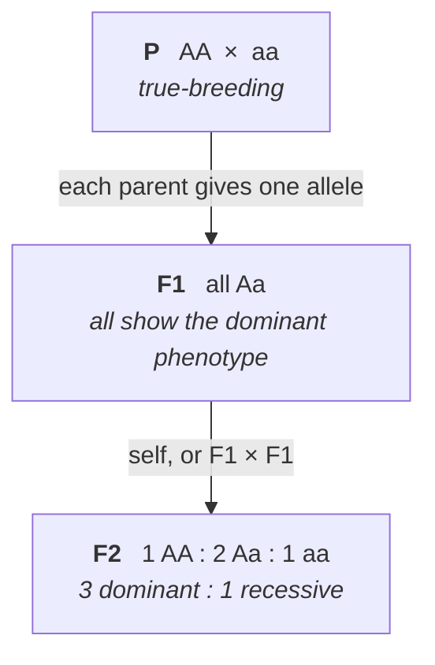
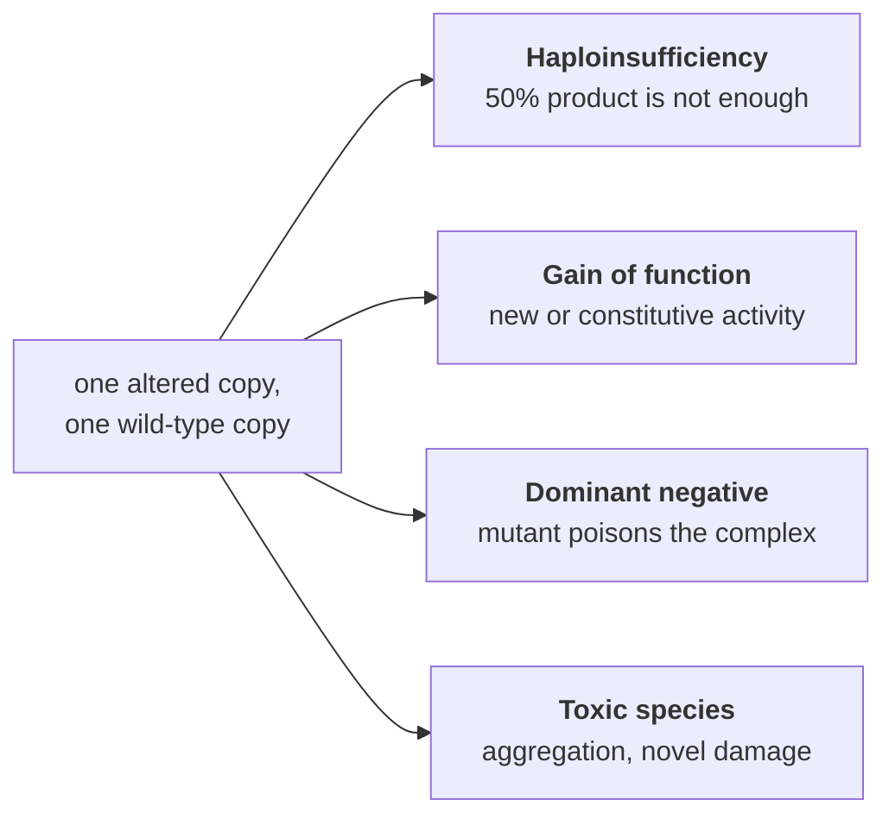

# 10 — Mendel and single-gene inheritance

> **Before this:** [Ch 09](09-mitosis-and-meiosis.md) · [Ch 08](../part-01-molecular-foundations/08-proteins-and-gene-function.md) · **Time:** ~45 min
>
> **Statistics needed:** [S1 Probability](../part-S-statistics/S1-probability.md) ·
> [S2 Distributions](../part-S-statistics/S2-distributions.md)

## What you'll be able to do

- Derive the 3:1 and 9:3:3:1 ratios from a sampling model rather than memorising them, and solve any *n*-locus cross by multiplying per-locus probabilities without ever drawing a grid
- State precisely when independent assortment holds and when it fails
- Design a test cross, and compute how many offspring it takes to reach a given confidence
- Compute family-composition probabilities with the binomial, and say why meiosis has no memory
- Explain why dominance predicts nothing about an allele's frequency, severity or fitness — and why a deleterious recessive can become common where a deleterious dominant cannot
- Explain, at the level of protein function, why loss-of-function alleles are usually recessive — and predict when they won't be
- Explain why Mendel's counts fit their expectations too closely, and why that indicts the data-generating process rather than the theory

## The core idea

Mendel reverse-engineered a data structure and a sampling process from nothing but counts.

The structure: each individual carries **two** copies of each heritable factor, and they do not blend or contaminate each other — a factor that vanishes in one generation reappears intact in the next. The process: each gamete receives **exactly one** of the two, chosen with probability ½, and fertilisation combines two independent draws.

So the genotype at a locus is an unordered pair; transmission is a fair Bernoulli draw over that pair; and the phenotype is a **many-to-one function of the genotype**, which is what makes the underlying variable partly unobservable. Everything in this chapter is that model, plus its corrections.

The remarkable thing is that this was inferred in the 1860s from seed counts, four decades before anyone knew chromosomes existed and nearly a century before anyone knew what a gene was made of. Mendel was not describing a mechanism. He was fitting a generative model, and the model turned out to be physically instantiated in meiosis.

---

## 1. The experiment, read as an experimental design

Mendel worked on the garden pea, *Pisum sativum*, across eight growing seasons from the mid-1850s, publishing in 1866. Nearly every choice he made is one you would make today.

| Design choice | Why it mattered | What breaks without it |
|---|---|---|
| **True-breeding lines** | A line that produces only round seeds, generation after generation, is homozygous. The starting genotypes are known exactly | Without a known prior, F2 ratios are unidentifiable |
| **Discrete, binary traits** | Round or wrinkled. Yellow or green. No measurement error, no judgement call, no scale | Continuous traits hide the underlying 1:2:1 in noise — see [Part 6](../part-06-quantitative-genetics/30-quantitative-traits.md) |
| **A plant that both selfs and outcrosses** | Pea flowers self-pollinate inside a closed keel, so lines stay pure with no effort; but the anthers can be removed and foreign pollen applied by hand | You cannot control the mating design |
| **One factor at a time, then combinations** | Monohybrid crosses first, dihybrid only after | Confounded factors, uninterpretable ratios |
| **Counting** | He tabulated thousands of individuals per cross | This is the actual innovation. Predecessors described offspring; Mendel enumerated them |
| **Reciprocal crosses** | Same result whether the pollen or the ovule parent carried the trait | Cannot rule out maternal effects or sex-linkage ([Ch 13](13-sex-linkage.md)) |

He screened 34 pea varieties, kept 22 that bred true, and worked with seven binary traits (tabulated with his counts in §3). Two of them — seed shape and cotyledon colour — are scoreable **on the seed itself**, which is already F2 tissue while still sitting on the F1 mother plant. That is why those two crosses have counts in the thousands and the rest have counts in the hundreds.

**Notation.** **P** is the true-breeding parental generation; **F1** the first filial generation; **F2** the offspring of F1 × F1 (in pea, usually an F1 self). The notation is meaningless unless P is genuinely true-breeding.

## 2. Vocabulary, defined once

| Term | Definition |
|---|---|
| **Locus** | A position in the genome. Plural *loci*. Not the same as a gene, though for this chapter treat it as one |
| **Allele** | One of the alternative sequences found at a locus |
| **Genotype** | The pair of alleles an individual carries at that locus (or, loosely, the whole sequence) |
| **Phenotype** | The observable characteristic |
| **Homozygous** | Two identical alleles: *AA* or *aa* |
| **Heterozygous** | Two different alleles: *Aa* |
| **Hemizygous** | Only one copy present, with no partner — a male at most X-linked loci ([Ch 13](13-sex-linkage.md)), or either sex where one homolog carries a deletion. A hemizygous locus has nothing to be dominant or recessive *to*; whatever allele is there is expressed |
| **Dominant** | Describes an allele whose phenotype appears in the heterozygote |
| **Recessive** | Describes an allele whose phenotype appears only in the homozygote |
| **Monohybrid / dihybrid cross** | A cross tracking one locus / two loci |
| **Wild type** | The reference allele or phenotype. A convention, not a value judgement |

Two conventions worth fixing now. Uppercase denotes the dominant allele, lowercase the recessive, of the *same* letter — *A* and *a* are alleles of one locus; *A* and *B* are different loci. And `A_` means "*AA* or *Aa*" — the genotypes indistinguishable by phenotype.

Critically: **dominance is a property of a pair of alleles with respect to a particular phenotype, at a particular level of description.** It is not an intrinsic property of an allele. The same allele can be recessive for disease, codominant for a protein assay, and dominant for a physiological stress response ([Ch 11](11-beyond-mendel.md)).

## 3. The first law: segregation

Mendel's seven monohybrid F2 counts:

| Trait | Dominant form | *n* | Recessive form | *n* | Ratio |
|---|---|---:|---|---:|---:|
| Seed shape | round | 5,474 | wrinkled | 1,850 | 2.96 |
| Cotyledon colour | yellow | 6,022 | green | 2,001 | 3.01 |
| Flower colour | purple | 705 | white | 224 | 3.15 |
| Ripe pod shape | inflated | 882 | constricted | 299 | 2.95 |
| Unripe pod colour | green | 428 | yellow | 152 | 2.82 |
| Flower position | axial | 651 | terminal | 207 | 3.14 |
| Stem length | tall | 787 | dwarf | 277 | 2.84 |
| **Total** | | **14,949** | | **5,010** | **2.98** |

Every F1 resembled one parent exactly — no blending. The other form vanished, then returned in the F2 at close to one quarter.

The model that produces this is one line of probability. Let the F1 be *Aa*. A gamete carries *A* with probability ½ and *a* with probability ½. Two gametes are drawn independently, so the zygote genotype distribution is the product measure:

$$P(AA)=\tfrac14,\quad P(Aa)=\tfrac12,\quad P(aa)=\tfrac14$$

That is **1:2:1 in genotype**. The phenotype map collapses *AA* and *Aa* onto the same value, giving **3:1 in phenotype**.



> **The law of segregation.** The two alleles at a locus separate during gamete formation, each gamete receiving exactly one, each with probability ½. Nothing about one allele changes the other while they coexist.

The physical event is anaphase I of meiosis, where the two homologous chromosomes are pulled to opposite poles ([Ch 09](09-mitosis-and-meiosis.md)). Mendel had no access to this. He inferred the sampling process from its marginal distribution.

Note what the 3:1 costs you: the phenotype is a **lossy projection** of the genotype. Two-thirds of dominant-phenotype F2 individuals are heterozygous, and no amount of looking at them will reveal it. Recovering the hidden state requires either a breeding experiment (§7) or sequencing.

## 4. Punnett squares, and why to abandon them immediately

The Punnett square lays out one parent's gametes on each axis and fills the cells:

|  | **A** (½) | **a** (½) |
|---|---|---|
| **A** (½) | *AA* ¼ | *Aa* ¼ |
| **a** (½) | *Aa* ¼ | *aa* ¼ |

This is an **outer product of two gamete distributions**, drawn out in full. That is fine for one locus and a disaster for any more:

| Heterozygous loci *n* | Gamete types 2ⁿ | Punnett cells 4ⁿ | F2 genotype classes 3ⁿ | F2 phenotype classes 2ⁿ |
|---:|---:|---:|---:|---:|
| 1 | 2 | 4 | 3 | 2 |
| 2 | 4 | 16 | 9 | 4 |
| 3 | 8 | 64 | 27 | 8 |
| 4 | 16 | 256 | 81 | 16 |
| 5 | 32 | 1,024 | 243 | 32 |
| 10 | 1,024 | 1,048,576 | 59,049 | 1,024 |

Enumerating the full joint distribution to answer a question about one marginal is exactly the mistake you would never make in code.

Two rules do all the work instead:

- **Product rule.** Independent events: multiply. Across loci that assort independently, the genotype is a product measure, so any compound genotype's probability is the product of its per-locus probabilities.
- **Sum rule.** Mutually exclusive outcomes: add. "*Aa* or *aa*" is ½ + ¼ = ¾.

From an *Aa* × *Aa* cross the per-locus numbers you need are just these:

| Query | Probability |
|---|---|
| genotype *AA* | ¼ |
| genotype *Aa* | ½ |
| genotype *aa* | ¼ |
| dominant phenotype (*A_*) | ¾ |
| recessive phenotype (*aa*) | ¼ |

Everything else is products and sums of those five numbers.

## 5. The second law: independent assortment — and exactly where it applies

Cross a true-breeding round-yellow line to a true-breeding wrinkled-green one. The F1 are all round and yellow. Self them, and Mendel's F2 counts were:

| Phenotype | Observed | Expected (9:3:3:1) |
|---|---:|---:|
| round, yellow | 315 | 312.75 |
| round, green | 108 | 104.25 |
| wrinkled, yellow | 101 | 104.25 |
| wrinkled, green | 32 | 34.75 |
| **Total** | **556** | **556** |

You do not need a 4×4 grid to get 9:3:3:1. If the two loci are independent, the joint phenotype distribution is the product of two 3:1 marginals:

$$(3:1)\otimes(3:1) \;=\; 9:3:3:1$$

and in general the *n*-locus F2 phenotypic ratio is the expansion of $(3+1)^n$, summing to 4ⁿ.

The physical basis is **which way each bivalent happens to face at metaphase I**. For two loci on different chromosome pairs, the orientation of one bivalent tells you nothing about the other:

```
Two loci on DIFFERENT chromosome pairs — orientations are independent

   arrangement 1                  arrangement 2
   A ─────── a                    A ─────── a
   B ─────── b                    b ─────── B
        ↓                              ↓
  gametes: AB, ab                gametes: Ab, aB

  both arrangements equally likely
     →  AB : Ab : aB : ab  =  1 : 1 : 1 : 1
```

> **Scope.** Independent assortment is not a general law of inheritance. It holds for loci on **different chromosomes**, and approximately for loci **far apart on the same chromosome** — far enough that crossovers between them are near-certain and the recombinant fraction approaches ½. For loci close together it is simply false: they are **linked**, and travel together. That failure is not an annoyance; it is the entire basis of genetic mapping ([Ch 14](14-linkage-and-mapping.md)) and of association studies a century later ([Ch 29](../part-05-population-genetics/29-linkage-disequilibrium.md)).

Which raises the obvious question about Mendel. Pea has seven chromosome pairs and he studied seven traits — but the genes are **not** one per chromosome; they fall on four of the seven. Blixt's 1975 analysis found that of the 21 possible pairwise combinations, four involve genes on the same chromosome, and three of those four are far enough apart that no linkage would be detectable at his sample sizes. That leaves exactly one pair that should have shown linkage — and Mendel never published a cross using it. Whether that is luck or selective reporting is the same question §11 raises about his numbers.

## 6. Scaling up: a trihybrid without a 64-cell grid

Cross *AaBbCc* × *AaBbCc*, three independently assorting loci. The Punnett square has 64 cells. Do not draw it.

**Phenotypic ratio.** Expand $(3+1)^3 = 27 + 9\cdot3 + 3\cdot3 + 1$:

```
A_B_C_  27      A_B_cc   9      A_bbcc  3      aabbcc  1
                A_bbC_   9      aaB_cc  3
                aaB_C_   9      aabbC_  3
                                                  total 64
```

**Any specific query, by multiplication.** No grid, no enumeration:

| Question | Computation | Answer |
|---|---|---|
| P(dominant for all three) | ¾ · ¾ · ¾ | 27/64 ≈ 0.42 |
| P(recessive for all three) | ¼ · ¼ · ¼ | 1/64 ≈ 0.016 |
| P(genotype exactly *AABbcc*) | ¼ · ½ · ¼ | 1/32 |
| P(dominant for A and B, recessive for C) | ¾ · ¾ · ¼ | 9/64 |
| P(recessive phenotype at ≥1 locus) | 1 − (¾)³ | 37/64 ≈ 0.58 |
| P(homozygous at all three loci) | (½)³ | 1/8 |

The last one is worth pausing on: at each locus, P(*AA*) + P(*aa*) = ½, so full homozygosity across *n* loci is (½)ⁿ — which is why inbred lines take many generations to fix ([Ch 28](../part-05-population-genetics/28-structure-and-inbreeding.md)).

This is the whole technique. **Factorise the query across loci, evaluate each factor from the five-number table in §4, multiply.** It runs in O(*n*) where the grid runs in O(4ⁿ).

## 7. Test cross and backcross

The F2 problem: a round-seeded plant is *RR* or *Rr* and you cannot tell by looking. The **test cross** solves it — cross the unknown to a **homozygous recessive** (*rr*).

Why that particular partner: the tester can only contribute *r*. Its gamete distribution is a point mass, so it adds no variance and no ambiguity, and the offspring phenotypes are a **direct, unbiased sample of the unknown parent's gametes**.

| Unknown is | Cross | Offspring |
|---|---|---|
| *RR* | *RR* × *rr* | all round |
| *Rr* | *Rr* × *rr* | ½ round, ½ wrinkled |

Any wrinkled offspring at all proves the parent was *Rr*. Absence of wrinkled offspring is evidence, not proof, and its strength is computable. Under *Rr*, the probability that *n* offspring are all round is (½)ⁿ, so the likelihood ratio favouring *RR* after *n* all-round offspring is **2ⁿ**: seven offspring gives 128:1.

> **Statistics:** why evidence is measured by a *ratio* of likelihoods rather than by either likelihood on its own is covered in [S6](../part-S-statistics/S6-likelihood-and-bayes.md) §4; turning that ratio into a probability needs a prior, [S1](../part-S-statistics/S1-probability.md) §5.

Compare that with the lazy alternative of selfing the unknown. Under *Rr*, a self gives wrinkled offspring with probability ¼, so *n* all-round offspring has probability (¾)ⁿ:

| Design | P(no recessive offspring \| heterozygous) | *n* needed to get below 5% |
|---|---|---|
| Test cross (× *rr*) | (½)ⁿ | **5** |
| Self (× *Rr*) | (¾)ⁿ | **11** |

That factor of two in required sample size, per locus, is why test crosses exist.

**Dihybrid test cross.** *AaBb* × *aabb* gives 1:1:1:1 if the loci assort independently. Because the tester contributes a fixed gamete, each offspring phenotype *is* a readout of one parental gamete — which makes this the standard design for measuring recombination frequency directly ([Ch 14](14-linkage-and-mapping.md)).

**Backcross.** Crossing an F1 to either parental line. A test cross is the special case where that parent is the recessive homozygote. Backcrossing to the *dominant* parent is uninformative about the F1's genotype but is the workhorse of strain construction: repeated backcrossing to a recipient line moves one allele into an otherwise uniform genetic background ([Ch 37](../part-08-methods/37-model-organisms-and-screens.md)).

## 8. Family composition: the binomial

Offspring of the same cross are independent draws — separate meioses, separate fertilisations — so the number affected in a sibship of *n* is $\text{Binomial}(n, p)$ with *p* fixed by the cross.

> **Statistics:** the binomial, its two load-bearing assumptions, and the binomial coefficient are covered in [S2](../part-S-statistics/S2-distributions.md) §1, with this exact sibship calculation at §1.1.

For *Aa* × *Aa* and a recessive trait, *p* = ¼. In a family of four:

$$P(k=1) = \binom{4}{1}\left(\tfrac14\right)^1\left(\tfrac34\right)^3 = 4\cdot\frac{27}{256}=\frac{27}{64}\approx 0.42$$

$$P(k\ge 1) = 1-\left(\tfrac34\right)^4 = \frac{175}{256}\approx 0.68$$

Distinguish **ordered** from **unordered** queries, because they differ by the binomial coefficient. "The first two children affected and the last two not" is $(¼)^2(¾)^2 = 9/256$. "Exactly two of four affected, in any order" is $\binom{4}{2}$ times that, $= 54/256$.

Two consequences that matter more than the arithmetic:

**Meiosis has no memory.** A couple who have had three children with a recessive condition still face probability ¼ for the fourth. The gambler's fallacy is the single most common error in genetic counselling conversations, and the biology is unambiguous: each meiosis samples afresh.

**Observed ratios in human families are biased, and predictably so.** Families are usually ascertained *because* an affected child exists, which conditions on *k* ≥ 1 and throws away every *Aa* × *Aa* family that by chance had none. The naive estimate of *p* comes out well above ¼. Correcting for this is a real statistical problem ([Ch 12](12-probability-and-testing.md), [Ch 15](15-pedigrees.md)) and the reason human segregation analysis is harder than pea genetics.

## 9. Dominant does not mean common

This is the load-bearing correction of the chapter.

> **Dominant does not mean common, strong, advantageous, healthy, or more likely to be inherited.** It means one thing: the heterozygote's phenotype resembles one homozygote's rather than falling between them. It is a statement about the **map from genotype to phenotype**, and it carries no information whatever about allele frequency, severity, or fitness.

The counterexamples are stark:

| Allele | Inheritance | Frequency | Effect |
|---|---|---|---|
| *HTT* CAG expansion (Huntington's) | **Dominant** | Prevalence of the order of 5 per 100,000 in European-ancestry populations; published estimates range roughly 2–10 | Fatal adult-onset neurodegeneration |
| *FGFR3* p.(Gly380Arg) (achondroplasia) | **Dominant** | Of the order of 1 in 25,000 births; ~80% arise as new mutations | Skeletal dysplasia |
| ABO *O* allele | **Recessive** | The most common ABO allele in nearly every human population, typically 0.6–0.7; group O is the commonest phenotype worldwide, around 45% | None |
| *CFTR* F508del (cystic fibrosis) | **Recessive** | Carrier frequency ≈ 1 in 25 in Northern European ancestry | Severe multisystem disease — but only in homozygotes |

Frequency is set by mutation, selection, drift and migration ([Ch 27](../part-05-population-genetics/27-the-four-forces.md)) — an entirely different set of processes from the ones that set dominance. The two are orthogonal.

They are not, however, *uncorrelated* in one specific direction, and the reason is worth deriving. A **deleterious dominant** allele is exposed to selection in every carrier, so it is removed roughly as fast as mutation supplies it and stays rare. A **deleterious recessive** is invisible to selection in heterozygotes, and at low frequency almost every copy is in a heterozygote. Under Hardy–Weinberg ([Ch 26](../part-05-population-genetics/26-hardy-weinberg.md)) the ratio of carriers to affected individuals is

$$\frac{2pq}{q^2} = \frac{2p}{q} \approx \frac{2}{q}\quad\text{for small } q$$

For cystic fibrosis in a Northern European population, *q* ≈ 0.02: about 100 carriers for every affected individual, and 98% of *CFTR* F508del copies sitting in people selection cannot see. That is how a severely deleterious allele reaches a frequency a lethal dominant never could.

## 10. What dominance is, molecularly

Why is recessive the *default* for loss-of-function alleles? Not by convention — by enzyme kinetics.

Model the flux *J* through a pathway step as a saturating function of the amount of enzyme *E*:

$$J(E) = J_{\max}\,\frac{E}{E+K}$$

A heterozygote for a null allele makes half the enzyme, so

$$\frac{J(E/2)}{J(E)} = \frac{E+K}{E+2K}$$

| Operating point | Flux retained at half dose |
|---|---|
| *E* = 100*K* (far into saturation) | 99.0% |
| *E* = 10*K* | 91.7% |
| *E* = *K* | 66.7% |
| *E* = 0.1*K* (well below saturation) | 52.4% |

Most enzymes sit well into saturation, and in a multi-step pathway the control over flux is distributed across many enzymes, so no single one has much leverage. Halving it changes almost nothing measurable, the heterozygote looks wild type, and the null allele is therefore recessive. This is the Kacser–Burns argument (1981), and it settled a long dispute: Fisher had proposed that dominance *evolved* through selection on modifier genes; Wright objected that such selection is far too weak; the physiological answer is that dominance of the functional allele mostly needs no explanation at all. It falls out of saturation kinetics.

All four of Mendel's traits whose molecular basis was known before 2025 fit this exactly — every recessive is a loss of function:

| Trait | Gene product | The recessive allele |
|---|---|---|
| Seed shape | starch-branching enzyme I | Disrupted by a transposon-like insertion. Less amylopectin → sucrose accumulates → the seed takes up extra water and shrivels on drying ([Ch 19](../part-03-genome-instability/19-transposable-elements.md)) |
| Cotyledon colour | *SGR* ("stay-green"), required to degrade chlorophyll | Loss of function — chlorophyll is retained, cotyledons stay green |
| Flower colour | a bHLH transcription factor in the anthocyanin pathway | Loss of function — no pigment, white flowers |
| Stem length | gibberellin 3β-hydroxylase | Reduced-activity variant — less bioactive gibberellin, dwarf plants |

The remaining three (pod colour, pod shape, flower position) were resolved in 2025; the yellow-pod allele turns out to be a ~100 kb deletion beside the chlorophyll synthase gene. A 160-year-old dataset finished being explained about a year ago.

### The four ways to be dominant



| Mechanism | Why one copy suffices | Example |
|---|---|---|
| **Haploinsufficiency** | The gene is dosage-sensitive — it sits outside the saturating regime, or its product is needed in fixed stoichiometry. Transcription factors, ribosomal proteins and structural subunits are enriched here | *PAX6* (aniridia), *SHOX*, *RUNX1*. gnomAD constraint scores flag such genes computationally ([Ch 55](../part-11-human-and-statistical-genomics/55-clinical-variant-interpretation.md)) |
| **Gain of function** | The question is not *how much* protein but *what it does*. A constitutively active receptor signals regardless of the normal copy | *FGFR3* p.(Gly380Arg) in achondroplasia — >95% of cases carry the identical nucleotide change |
| **Dominant negative** | The mutant subunit is incorporated into multimers and ruins them. Type I collagen is α1(I)₂α2(I)₁, so with a heterozygous *COL1A1* variant and equal expression only (½)² = ¼ of trimers have two normal α1 chains — **¾ of the collagen is defective from a 50% mutant allele dose** | Osteogenesis imperfecta. Note the phenotype is *worse* than a null allele, which merely halves normal collagen |
| **Toxic species** | The variant product does damage the wild type cannot undo | *HTT* CAG expansion: ≥40 repeats is fully penetrant, 36–39 shows reduced penetrance |

The dominant-negative row is the one to internalise: it explains the counterintuitive clinical fact that a missense variant can be far more severe than a complete deletion of the same gene.

## 11. Mendel's numbers are too good

Look again at §5. Expected 312.75, observed 315. Expected 34.75, observed 32. Compute the goodness of fit:

$$\chi^2 = \sum \frac{(O-E)^2}{E} = 0.0162 + 0.1349 + 0.1013 + 0.2176 = 0.470$$

with 3 degrees of freedom, giving *p* ≈ 0.93. Nothing wrong with that on its own — a large *p* means only that the data fit.

> **Statistics:** the χ² distribution, where the degrees of freedom come from (including this 9:3:3:1 case), and why its expected value equals its df are covered in [S2](../part-S-statistics/S2-distributions.md) §4; what a *p*-value does and does not license is [S4](../part-S-statistics/S4-hypothesis-testing.md) §3.

Fisher (1936) pooled the goodness-of-fit statistic across all of Mendel's reported experiments and obtained **χ² = 41.6 on 84 degrees of freedom**. The expected value of χ² is its degrees of freedom. Mendel came in at half of it.

The relevant probability is the **lower** tail: the chance of a fit this close *or closer* is about **3 × 10⁻⁵** — roughly one in 35,000. (Fisher quoted the complementary figure, *P* = 0.99993, from the tables of his day.)

Note the shape of the argument, because it generalises. The hypothesis under test is **not** "Mendel's theory is wrong". The test conditions *on the theory being right* and asks whether the residuals are as large as the sampling model requires — and data can fail it by being too tidy. Candidate explanations include unconscious stopping rules (counting until the ratio looked right), an assistant supplying the answer he believed was wanted, and genuine ambiguity in scoring seeds. No evidence of deliberate fabrication has ever surfaced, and the conclusions themselves have replicated for 160 years. [Ch 12](12-probability-and-testing.md) treats this properly.

The transferable lesson: **a *p*-value near 1 is as much a diagnostic as a *p*-value near 0.** Both say the data do not look like a draw from the model you claimed.

---

## Common misconceptions

| What people think | What's actually true |
|---|---|
| Dominant alleles are more common, or stronger | Dominance describes only the heterozygote's phenotype. Huntington's is dominant and rare; ABO *O* is recessive and the most common allele in nearly every population |
| A dominant allele overpowers or suppresses the recessive one | Both alleles are transcribed and translated normally. The recessive one usually just fails to produce a working product, and half the normal amount of the working one is enough |
| A 3:1 ratio means 3 of every 4 offspring | It is the expected value of a multinomial. A sibship of four is very often 4:0 or 2:2. P(exactly 3:1 in a family of four) is only 27/64 |
| Independent assortment is a law of inheritance | It is a law about loci on different chromosomes. Linked loci violate it flagrantly, and that violation is the basis of all genetic mapping |
| Punnett squares are how genetics problems are solved | They are an outer product drawn by hand. They scale as 4ⁿ. Multiply per-locus probabilities instead |
| After three affected children, the next is safer | Each meiosis is an independent draw. The probability is unchanged. This is the gambler's fallacy with a family attached |
| Observed human sibships confirm the ¼ ratio directly | They do not, because families are ascertained through an affected child. The raw estimate is biased upward and must be corrected |
| A trait that skips a generation must be recessive | Usually, but incomplete penetrance produces the same pedigree pattern from a dominant allele ([Ch 11](11-beyond-mendel.md)) |
| A complete gene deletion is the worst possible variant | Dominant-negative missense variants are often more severe, because the mutant product actively poisons the wild-type product. Compare a *COL1A1* null (mild) with a *COL1A1* glycine substitution (severe) |
| Mendel's laws describe how genes work | They describe how alleles are *transmitted*. They say nothing about what a gene does, and Mendel's model is agnostic about mechanism — which is why it survived the discovery of DNA intact |

## Worked example

Three independently assorting pea loci. (Mendel's own symbols are *R*/*r*, *I*/*i* and *Le*/*le*; I use *R*, *Y*, *T* here for legibility.)

- *R* round ▸ *r* wrinkled seed
- *Y* yellow ▸ *y* green cotyledon
- *T* tall ▸ *t* dwarf stem

**Setup.** True-breeding *RRYYTT* × true-breeding *rryytt*.

**Step 1 — the F1.** Each parent contributes one allele per locus. Every F1 is *RrYyTt*: round, yellow, tall.

**Step 2 — F1 gametes.** Three heterozygous loci, independently assorting, so 2³ = 8 gamete types, each with probability ⅛:

```
RYT   RYt   RyT   Ryt   rYT   rYt   ryT   ryt
```

**Step 3 — F2 phenotype proportions.** The Punnett square would be 8 × 8 = 64 cells. Factorise instead. Per locus, P(dominant) = ¾ and P(recessive) = ¼.

| Phenotype class | Product | Fraction |
|---|---|---|
| round, yellow, tall | ¾·¾·¾ | 27/64 |
| round, yellow, dwarf | ¾·¾·¼ | 9/64 |
| round, green, tall | ¾·¼·¾ | 9/64 |
| wrinkled, yellow, tall | ¼·¾·¾ | 9/64 |
| round, green, dwarf | ¾·¼·¼ | 3/64 |
| wrinkled, yellow, dwarf | ¼·¾·¼ | 3/64 |
| wrinkled, green, tall | ¼·¼·¾ | 3/64 |
| wrinkled, green, dwarf | ¼·¼·¼ | 1/64 |

27:9:9:9:3:3:3:1, which sums to 64. ✓

**Step 4 — expected counts.** In 640 F2 plants: 270 round-yellow-tall, 90 in each of the three single-recessive classes, 30 in each double-recessive class, 10 wrinkled-green-dwarf.

**Step 5 — a specific genotype.** P(*RRYyTt*) = P(*RR*) · P(*Yy*) · P(*Tt*) = ¼ · ½ · ½ = **1/32**. Twenty of the 640.

**Step 6 — a compound query.** "Round and tall, but *not* homozygous at the *Y* locus":

$$P = \underbrace{\tfrac34}_{R\_}\cdot\underbrace{\tfrac12}_{Yy}\cdot\underbrace{\tfrac34}_{T\_} = \frac{9}{32}$$

**Step 7 — the test cross.** Cross an F1 to *rryytt*. The tester contributes only *ryt*, so offspring phenotypes read out F1 gametes one-for-one: eight classes in 1:1:1:1:1:1:1:1. Any departure from that — and in a real pea it *would* depart, because two of Mendel's loci are syntenic — is evidence of linkage ([Ch 14](14-linkage-and-mapping.md)).

**Step 8 — a family-composition question.** Among 6 randomly chosen F2 seedlings, what is P(exactly 2 wrinkled)? Each seedling is an independent Bernoulli trial with *p* = ¼:

$$\binom{6}{2}\left(\tfrac14\right)^2\left(\tfrac34\right)^4 = 15\cdot\frac{1}{16}\cdot\frac{81}{256} = \frac{1215}{4096} \approx 0.297$$

**Step 9 — test the fit.** Suppose you actually observe, in 640 plants: 262, 96, 88, 94, 27, 34, 29, 10. Compute Σ(O−E)²/E against the expected counts from Step 4, with 8 − 1 = 7 degrees of freedom. A moderate χ² supports independent assortment; a large one points to linkage, viability differences, or scoring error — and a suspiciously *small* one points at whoever collected the data ([Ch 12](12-probability-and-testing.md)).

## Connections

**Back to:**
- [Ch 09 — Mitosis and meiosis](09-mitosis-and-meiosis.md) supplies the physical mechanism: segregation is anaphase I, independent assortment is metaphase I orientation
- [Ch 08 — Proteins and gene function](../part-01-molecular-foundations/08-proteins-and-gene-function.md) supplies the loss-of-function reasoning behind §10
- [Ch 00 — The whole story](../part-00-orientation/00-the-whole-story.md) §7 introduced genotype and phenotype

**Forward to:**
- [Ch 11 — Beyond Mendel](11-beyond-mendel.md): incomplete dominance, codominance, multiple alleles, epistasis, penetrance, pleiotropy — every way the clean model bends
- [Ch 12 — Probability and testing](12-probability-and-testing.md): χ², ascertainment correction, and the Mendel–Fisher controversy properly
- [Ch 13 — Sex linkage](13-sex-linkage.md): hemizygosity, and why reciprocal crosses stop matching
- [Ch 14 — Linkage and mapping](14-linkage-and-mapping.md): what happens when independent assortment fails, and how to exploit it
- [Ch 15 — Pedigrees](15-pedigrees.md): the same logic applied to humans, where you cannot design the cross
- [Ch 26 — Hardy–Weinberg](../part-05-population-genetics/26-hardy-weinberg.md): segregation scaled from one family to a whole population
- [Ch 55 — Clinical variant interpretation](../part-11-human-and-statistical-genomics/55-clinical-variant-interpretation.md): the haploinsufficiency / gain-of-function / dominant-negative distinction, used in earnest

## Check yourself

**1. You have a round-seeded pea of unknown genotype. You self it and get 20 round seedlings, no wrinkled. How confident should you be that it is *RR*, and how would a test cross have compared?**

<details><summary>Answer</summary>

Under the alternative that it is *Rr*, a self gives wrinkled offspring with probability ¼, so 20 all-round offspring has probability (¾)²⁰ ≈ 0.0032. The likelihood ratio favouring *RR* is ≈ 316:1. A test cross to *rr* reaches the same evidential strength in 9 offspring, since (½)⁹ ≈ 0.002 — roughly twice as informative per offspring.

What you cannot say is "*RR* with probability 0.997", because that needs a prior. If the plant was drawn at random from the dominant-phenotype F2, the prior odds are ⅓ *RR* : ⅔ *Rr*, so the posterior odds are ½ × 316 = 158:1 and P(*RR*) ≈ 0.994.

</details>

**2. You cross *AaBb* × *aabb* and observe 1:1:1:1. Can you conclude the loci are on different chromosomes?**

<details><summary>Answer</summary>

No. You can conclude that the recombinant fraction between them is indistinguishable from ½ at your sample size. That is consistent with two situations: different chromosomes, or the same chromosome but far enough apart that crossovers between them are essentially certain in every meiosis. Genetic data alone cannot separate these two — you need physical evidence, which is exactly what a genome assembly gives you.

This is not a technicality. It is why Mendel got away with independent assortment despite having three of his seven genes on one chromosome, and it is why "unlinked" and "on different chromosomes" are not synonyms.

</details>

**3. A severe recessive disease has a carrier frequency of 1 in 25. A dominant disease of similar severity has a population prevalence of about 1 in 20,000. Why the enormous difference in how much of the allele is out there?**

<details><summary>Answer</summary>

Selection can only act on phenotypes. Every carrier of the dominant allele expresses the disease, so each copy is exposed and removed; the allele persists only through recurrent mutation, and its frequency settles near the mutation–selection balance point, which for a severe dominant is very low.

The recessive allele is invisible in heterozygotes. At *q* = 0.02, the carrier-to-affected ratio is 2*p*/*q* ≈ 98, so about 98% of copies are in people selection never touches. Removing affected homozygotes barely dents the allele frequency — the change per generation is of order *q*², not *q*. That asymmetry, not any property of dominance itself, is why deleterious recessives can be common and deleterious dominants cannot.

</details>

**4. Why are transcription factors over-represented among haploinsufficient genes, while metabolic enzymes are almost never haploinsufficient?**

<details><summary>Answer</summary>

Metabolic enzymes typically operate far into saturation, so from *J* = *J*max·*E*/(*E*+*K*) with *E* ≫ *K*, halving *E* changes flux by a percent or two. Additionally, control over pathway flux is shared across many enzymes, so no single one has much leverage. The heterozygote is indistinguishable from wild type and the null allele is recessive.

Transcription factors work by occupancy at binding sites, and occupancy is roughly a function of concentration relative to a binding constant that evolution has tuned to sit *near* the operating concentration — that is what makes a switch responsive. A factor sitting near its *K* loses about a third of its occupancy at half dose, and downstream thresholds amplify that. Many also act in fixed-stoichiometry complexes, where the limiting subunit sets the amount of functional complex directly. Dosage sensitivity is the price of being a regulator.

</details>

**5. Fisher's aggregate χ² for Mendel's data was 41.6 on 84 degrees of freedom. Why is that a problem, and why is "Mendel's theory was correct" not an explanation for it?**

<details><summary>Answer</summary>

χ² with *d* degrees of freedom has expectation *d* and variance 2*d*, so the expected value here is 84 with a standard deviation of about 13. Observing 41.6 is roughly 3.3 standard deviations *below* expectation; the probability of a fit that close or closer is around 3 × 10⁻⁵.

The test already assumes the theory is true — it is computed from the ratios the theory predicts. What it measures is whether the residuals are the size that binomial sampling from those ratios would produce. Correct theory plus honest counting produces χ² ≈ *d*, not χ² ≈ *d*/2. Being right does not make your sampling noise disappear.

So the surplus tidiness has to come from the data-generating process, not the genetics: stopping rules that ended counting when the ratio looked right, rounding or reclassification of ambiguous seeds, or an assistant who knew what answer was wanted. Which of these it was remains unresolved. The genetics is not in doubt.

</details>
