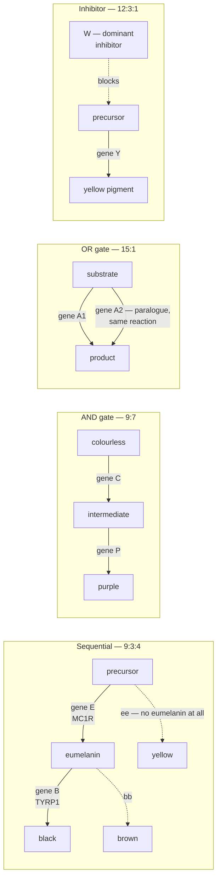

# 11 — Beyond Mendel

> **Before this:** [Ch 10](10-mendelian-inheritance.md) · [Ch 08](../part-01-molecular-foundations/08-proteins-and-gene-function.md) · **Time:** ~45 min

## What you'll be able to do

- Distinguish incomplete dominance from codominance mechanically, and show that both can describe the same locus depending on which assay you run
- Derive the modified dihybrid ratios — 9:3:4, 12:3:1, 9:7, 15:1 — from a pathway topology instead of memorising them
- Read a complementation test, state what it proves, and name the three situations in which it lies
- Separate penetrance from expressivity precisely, and compute a pedigree expectation given a penetrance
- Explain why sex-limited, sex-influenced and sex-linked are three unrelated things
- Predict how temperature, diet, genetic background or a phenocopy changes the phenotype a fixed genotype produces, and say why anticipation is repeat-tract instability rather than inherited severity
- Say exactly which part of Mendel's model each phenomenon in this chapter leaves untouched

## The core idea

Mendel's model has two layers, and they are almost always taught as one.

The first layer is a **transmission rule**: alleles segregate, one of your two copies goes into each gamete, and loci on different chromosomes assort independently. This is a statement about meiosis, and it is essentially exact.

The second layer is a **genotype-to-phenotype map**: `AA` and `Aa` look like this, `aa` looks like that. This is a statement about biochemistry, and it is a crude approximation that happens to hold for the seven characters Mendel picked.

Everything in this chapter perturbs the second layer. Nothing in this chapter perturbs the first.

That distinction does real work. When a dihybrid cross comes out 9:3:4 rather than 9:3:3:1, no allele failed to segregate and no gamete was mis-made. The same sixteen genotype classes were produced at the same frequencies. What changed is that the rendering function collapsed two of the phenotypic classes into one. The denominators are untouched — which is precisely why the modified ratios are still sixteenths.

> **Every "exception to Mendel" in this chapter is a change to the rendering function, not to the protocol.** Segregation is the protocol. The genotype-to-phenotype map is application logic, and application logic is where all the interesting failures live.

---

## 1. Dominance is a property of the phenotype, not of the allele

Start by asking the question nobody asks: why is *recessive* the default?

Most loss-of-function alleles are recessive. The heterozygote has one working copy of the gene, makes roughly half the normal amount of enzyme, and looks entirely normal. Textbooks assert this. It follows from kinetics.

Consider a metabolic pathway carrying flux `J`, with one step catalysed by an enzyme present at activity `E`. Flux does not rise linearly with `E` forever — it saturates, because as you add more of one enzyme, control passes to the other steps. The curve `J(E)` is concave, and in a wild-type organism most enzymes sit well out on the flat part, where `dJ/dE ≈ 0`. Halve `E` and you slide back along a plateau: flux barely moves. This is the Kacser–Burns argument, and it explains recessivity as an emergent consequence of network kinetics rather than as a property that individual alleles possess.

So dominance is not something an allele *does* to its partner. **Nothing is overpowered.** The heterozygote simply lands close to one homozygote on whatever axis you happen to be measuring.

The exceptions tell you the mechanism:

| Heterozygote is not normal because | Mechanism | Example |
|---|---|---|
| **Haploinsufficiency** | 50% of product is genuinely not enough — this locus sits on the steep part of the curve | *PAX6* (aniridia), *NF1*, many transcription factors and structural proteins |
| **Dominant negative** | The broken product poisons the good one, typically by joining a multimer and jamming it | Collagen triple helices in osteogenesis imperfecta |
| **Gain of function** | The variant product does something new or does the old thing constitutively | *FGFR3* in achondroplasia |
| **Ectopic expression** | Normal product, wrong place or wrong time | Mouse *A<sup>y</sup>*, §4 |

Dosage-sensitive genes are a minority, which is why the recessive default holds. But note what this means: **dominance is a claim about the shape of a dose–response curve**, and different phenotypes read out different regions of that curve. Which is the whole content of the next section.

## 2. Incomplete dominance versus codominance

These are conflated constantly, and the distinction is sharp.

**Incomplete dominance**: the heterozygote is *intermediate* on a single measured scale. One phenotype, sitting between the two homozygotes. In snapdragons and four-o'clocks, a red-flowered homozygote crossed to a white gives pink F1, and the F2 is **1 red : 2 pink : 1 white** — the phenotypic ratio equals the genotypic ratio, because the map became one-to-one. Pink is not a mixture of red and white flowers; it is a flower with about half the anthocyanin.

**Codominance**: *both* allelic products are present and separately detectable in the heterozygote. Not an average — a superposition. In the MN blood group, the *GYPA* alleles encode two forms of glycophorin A differing by two amino acids; an MN heterozygote carries both antigens on every red cell. The F2 ratio is also 1:2:1, but the heterozygote's phenotype is "M and N", not "halfway between M and N".

| | Incomplete dominance | Codominance |
|---|---|---|
| Heterozygote shows | one intermediate phenotype | both parental phenotypes simultaneously |
| Underlying reason | product is dosage-dependent below saturation | both products are made and both are visible |
| Discriminating question | can you see the two homozygote phenotypes side by side? | |
| F2 ratio | 1:2:1 | 1:2:1 |

Now the point that makes the distinction useful rather than pedantic. Take sickle-cell: a single base change in *HBB* substituting valine for glutamate at the sixth residue of the mature β-globin chain.

| Assay | What the *HbA/HbS* heterozygote shows | Dominance verdict |
|---|---|---|
| Clinical disease | essentially healthy | HbS is **recessive** |
| Red cells under severe hypoxia | some cells sickle | HbS is **incompletely dominant** |
| Protein electrophoresis | two bands, HbA and HbS, both present | HbS is **codominant** |
| Resistance to *P. falciparum* malaria | protected | HbS is **dominant** |

One allele, one molecular lesion, four dominance verdicts. Dominance is not a property you can look up; it is a property of the (allele, phenotype, assay) triple. The closer your assay gets to the gene product, the more codominant everything becomes — which is why molecular genetics rarely uses the vocabulary at all.

## 3. Multiple alleles: ABO worked properly

A diploid individual carries at most two alleles. A *population* can carry any number. Nothing in Mendel's model constrains this, and the classical three-allele ABO system shows two different dominance relationships living inside one locus.

The *ABO* gene sits at 9q34.2 and encodes a **glycosyltransferase** — an enzyme that attaches a sugar to a precursor carbohydrate (the H antigen) already sitting on the red-cell surface. Carbohydrate identity tags, exactly as flagged in [Ch 01](../part-00-orientation/01-chemistry-and-cell-primer.md).

| Allele (classical) | Modern | Enzyme | Sugar added | Antigen |
|---|---|---|---|---|
| *I<sup>A</sup>* | *ABO\*A* | α-1,3-*N*-acetylgalactosaminyltransferase | *N*-acetylgalactosamine | A |
| *I<sup>B</sup>* | *ABO\*B* | α-1,3-galactosyltransferase | galactose | B |
| *i* | *ABO\*O* | none — `c.261delG` frameshifts to a premature stop | nothing | H only |

Two details make the genetics fall out rather than needing to be learnt:

- The A and B enzymes differ by seven nucleotide substitutions, four of which change amino acids (R176G, G235S, L266M, G268A). **Residues 266 and 268 alone determine which sugar the enzyme transfers.** Two working enzymes, differing at two critical positions in the active site.
- The O allele is a single-base deletion. Frameshift, premature stop, no functional protein at all. There is nothing to see.

Now the dominance relationships are forced. Enzymes act *in trans* on a shared pool of substrate, and their products accumulate independently — activity is additive, not blended:

```
I^A I^A  →  A antigen only              phenotype A
I^A i    →  A antigen only              phenotype A     (i contributes nothing)
I^B I^B  →  B antigen only              phenotype B
I^B i    →  B antigen only              phenotype B
I^A I^B  →  A antigen AND B antigen     phenotype AB    (both enzymes work)
i i      →  H antigen unmodified        phenotype O
```

*I<sup>A</sup>* and *I<sup>B</sup>* are **codominant** with each other and both are **dominant** to *i* — and neither fact required a rule, only the observation that a broken enzyme makes nothing and two working enzymes both make something.

A cross worth doing, because it surprises people: *I<sup>A</sup>i* × *I<sup>B</sup>i* gives **1 AB : 1 A : 1 B : 1 O**. Two parents produce children of all four blood groups — including two, AB and O, that match neither parent. Segregation is completely ordinary; the four-way split comes from the map.

(The clinical system has three classical alleles. Sequencing the locus has catalogued hundreds of variants, including weak-A subgroups that behave as intermediates — the three-allele model is an abstraction that survives because it is clinically sufficient.)

## 4. Lethal alleles and the 2:1 ratio

Cuénot, 1905. Yellow mice never breed true. Yellow × yellow always gives yellow and agouti offspring, in a ratio near **2:1**, and litters are about a quarter smaller than expected.

The 2:1 is the tell. A 3:1 with the `aa` class deleted is 3:1 minus nothing; a 1:2:1 with the homozygous-dominant class deleted is exactly 2:1.

```
A^y/A  ×  A^y/A
                 1 A^y/A^y      dies before birth
                 2 A^y/A        yellow          }  2 : 1
                 1 A/A          agouti          }
```

The molecular story is better than the ratio. *A<sup>y</sup>* is a ~170 kb deletion at the mouse agouti locus. It removes the coding sequence of the neighbouring gene *Raly* while leaving *Raly*'s promoter and non-coding first exon intact — and that orphaned promoter now drives *agouti* expression ubiquitously instead of in its normal restricted pattern. Two consequences from one deletion:

- **Ectopic agouti expression** → yellow coat in heterozygotes, plus obesity, diabetes and increased tumour incidence. Dominant.
- **Loss of Raly function** → death at the pre-implantation stage in homozygotes. Recessive.

So *A<sup>y</sup>* is **dominant for coat colour and recessive for lethality, simultaneously**. If you were still carrying the intuition that dominance is a property of an allele, this kills it. Dominance is indexed by phenotype, and this allele has two.

Human counterpart: achondroplasia (*FGFR3*). Heterozygotes have the skeletal phenotype; homozygotes die perinatally. Two affected parents expect 2 affected : 1 unaffected among surviving children — the same signature, for the same structural reason.

Distinguishing an observed 2:1 from 3:1 is a hypothesis test with a specific alternative, not an eyeball judgement; that is [Ch 12](12-probability-and-testing.md).

## 5. Pleiotropy

*A<sup>y</sup>* already showed it: one lesion, many phenotypes. That is **pleiotropy**, and it is the normal case rather than a curiosity.

Phenylketonuria is the cleanest illustration. A single enzyme, phenylalanine hydroxylase (*PAH*), fails. Downstream: phenylalanine accumulates and damages the developing brain; tyrosine becomes scarce, so melanin synthesis falls and patients are pale and fair-haired; a phenylalanine derivative gives urine a musty odour; eczema is common. Four apparently unrelated clinical findings, one blocked reaction. Pleiotropy usually means *the product is used in more than one context*, or *one lesion propagates through a network*.

The genomics consequence, which will matter repeatedly: because pleiotropy is ubiquitous, "the gene for X" is nearly always a category error, and loci turn up shared across statistically unrelated traits in association studies ([Ch 51](../part-11-human-and-statistical-genomics/51-gwas.md)).

## 6. Epistasis: pathways generate ratios

**Epistasis** is the phenomenon that the phenotypic effect of one locus depends on the genotype at another. Classically (Bateson) it means *masking*: locus A hides what locus B is doing.

A warning before the ratios. Fisher's *statistical* epistasis — a non-zero interaction term when you regress phenotype on genotypes — is a different object with the same name. A biochemically obvious masking relationship can produce no interaction term under one scale and a large one under another. The two senses coincide only sometimes. [Ch 30](../part-06-quantitative-genetics/30-quantitative-traits.md) takes this apart; for now, keep the words separate in your head.

### The derivation you should do instead of memorising

A dihybrid self gives four genotype classes at 9 : 3 : 3 : 1 — namely `A_B_`, `A_bb`, `aaB_`, `aabb`. Treat "is locus A functional?" and "is locus B functional?" as two binary inputs, weighted 3/4 and 1/4. **Every modified ratio is a function from those two inputs onto a smaller output set.** There are only so many such functions, the pathway topology picks one, and the ratio follows by summing sixteenths. You never need to remember a ratio again.



**9:3:4 — recessive epistasis.** A linear pathway where an upstream step is required for anything at all, and a downstream step only chooses between outcomes. Labrador coat colour: *MC1R* (the E locus) must signal for eumelanin to be made; *TYRP1* (the B locus) determines whether that eumelanin is black or brown.

| Genotype | Fraction | Phenotype |
|---|---|---|
| `B_E_` | 9/16 | black |
| `bbE_` | 3/16 | chocolate |
| `B_ee` | 3/16 | yellow |
| `bbee` | 1/16 | yellow |

`ee` masks the B locus entirely: **9 black : 3 chocolate : 4 yellow**. The masking is homozygous-recessive, hence "recessive epistasis". A detail that proves the mechanism: the B locus is *not* silent in `ee` dogs — it still acts in skin, so a `bb ee` dog is yellow with a liver-coloured nose. Masking is tissue-specific, because pathways are.

**12:3:1 — dominant epistasis.** One locus produces a *dominant inhibitor*. In summer squash, `W_` blocks pigment deposition regardless of the Y locus; `wwY_` is yellow; `wwyy` is green. Classes 9 and 3 merge: **12 white : 3 yellow : 1 green**.

**9:7 — duplicate recessive epistasis.** A two-step linear pathway in which failure at *either* step gives the identical null. Bateson and Punnett's sweet peas: genes *C* and *P* are both required for purple, and every other genotype is white. An **AND gate**. Classes 3, 3 and 1 merge: **9 purple : 7 white**.

**15:1 — duplicate dominant epistasis.** Two paralogous genes catalysing the same reaction; either alone suffices. An **OR gate**, and the usual cause is gene duplication ([Ch 35](../part-07-molecular-evolution/35-genome-evolution.md)). Shepherd's-purse capsule shape: **15 triangular : 1 ovoid**.

Summary, with the rest of the family:

| Ratio | Logic on (A functional, B functional) | Topology | Classic example |
|---|---|---|---|
| 9:3:3:1 | independent outputs | unrelated pathways | Mendel's dihybrid |
| 9:3:4 | B readable only if A | sequential, upstream gates all output | Labrador coat colour |
| 12:3:1 | dominant allele at A blocks | inhibitor acting on the pathway | summer squash fruit colour |
| 9:7 | A **AND** B | two required steps in series | sweet pea flower colour |
| 15:1 | A **OR** B | redundant paralogues | shepherd's-purse capsule |
| 13:3 | inhibitor plus a requirement | dominant suppressor over a needed gene | poultry plumage colour |
| 9:6:1 | additive, both contribute | duplicate genes with cumulative effect | squash fruit shape |

Every entry sums to 16. That is not a coincidence — it is the point.

## 7. Complementation testing

You run a screen and recover twenty independent white-flowered mutants. How many genes did you hit?

The 9:7 result answers it. Cross two homozygous mutants and look at the F1, which is a **trans heterozygote** carrying one mutation on each homologue:

```
different genes:   m1 +      each locus has one working copy    →  F1 WILD TYPE
                   ── ──     enough product from both           →  they COMPLEMENT
                   +  m2

same gene:         m1 +      no working copy of this gene       →  F1 MUTANT
                   ── ──     nothing to make product from       →  they FAIL to complement
                   m2 +
```

Partition the mutants by this test and you get **complementation groups**, which are genes. This was the operational definition of a gene for most of the twentieth century — Benzer's *cistron* — and it is still how a screen is triaged before anything is sequenced ([Ch 37](../part-08-methods/37-model-organisms-and-screens.md)).

Three ways it lies, all of which you will meet:

1. **It is only valid for recessive loss-of-function alleles.** A dominant mutation makes the F1 mutant whatever it is crossed to, so it appears to be in *every* gene. Test dominance first.
2. **Intragenic complementation.** Two mutations in the same gene can complement if the product is a multimer and defective subunits can compensate for each other's damaged domains. Rare, but it manufactures a false "different genes".
3. **Non-allelic non-complementation.** Two mutations in *different* genes can fail to complement, typically when the products sit in the same complex and both are dosage-sensitive. This manufactures a false "same gene", and is one of the more useful accidents in genetics — it identifies physically interacting partners.

The formal control is the *cis*-*trans* test: put both mutations on the same homologue (`m1 m2 / + +`). If they are in one gene, the *cis* configuration leaves one intact copy and is wild-type, while *trans* is mutant. A difference between *cis* and *trans* is the evidence; the *trans* test alone is a shortcut.

## 8. Penetrance and expressivity

Two distinct quantities, routinely swapped.

**Penetrance** is the proportion of individuals with a genotype who show *any* of the associated phenotype. It is a probability defined over a population, not a property of a person: `P(affected | genotype)`.

**Expressivity** is *how* the phenotype presents among those who show it — severity, which features, which tissues. It is a distribution over the affected.

For a statistician the compact statement is: model phenotype severity as a zero-inflated distribution. **Penetrance is one minus the zero-inflation probability. Expressivity is the shape of the non-zero component.** They are separately estimable and can move independently.

| Condition | Penetrance | Expressivity |
|---|---|---|
| Postaxial polydactyly | incomplete — obligate carriers with normal hands, so the trait skips generations | fairly uniform when present |
| Neurofibromatosis type 1 (*NF1*) | essentially complete by adulthood | extremely variable — from a handful of café-au-lait macules to disfiguring tumours, and differing between identical twins |
| Retinoblastoma (*RB1*) | ~90% for classic null alleles; distinct low-penetrance alleles exist | variable — unilateral vs bilateral, number of foci |
| Waardenburg syndrome | high | variable — deafness, white forelock, heterochromia, in any combination |

**Penetrance is a function of age, not a scalar.** For anything with adult onset, quoting one number is meaningless; the correct object is a cumulative-incidence curve. In Huntington disease the *HTT* CAG repeat length sets it explicitly: ≤26 repeats normal, 27–35 intermediate (not disease-causing but unstable in transmission), **36–39 reduced penetrance**, ≥40 full penetrance given a normal lifespan. For *BRCA1*, prospective cohort data give cumulative breast-cancer risk to age 80 of about **72% (95% CI 65–79)** and ovarian-cancer risk about **44% (36–53)**; for *BRCA2*, about **69% (61–77)** and **17% (11–25)** respectively (Kuchenbaecker et al., *JAMA* 2017).

And one methodological trap that matters clinically: penetrance estimated from families *ascertained because they contained many affected members* is biased upward, because you conditioned on the outcome. Estimates from unselected population cohorts and biobanks come out systematically lower for the same variant. This is a live issue in returning incidental findings ([Ch 55](../part-11-human-and-statistical-genomics/55-clinical-variant-interpretation.md)).

## 9. Sex-limited and sex-influenced — which are not sex linkage

**Sex-linked** means the gene sits on a sex chromosome. That is a statement about location, and it is [Ch 13](13-sex-linkage.md). The two phenomena here involve ordinary autosomal genes whose *map to phenotype* takes sex as an argument.

**Sex-limited**: expressed in one sex only. Milk yield is an autosomal trait carried and transmitted by bulls who never express it. Familial male-limited precocious puberty is caused by activating variants in *LHCGR*, is autosomal dominant, and produces a phenotype only in boys — it passes silently through generations of women. Sex-limitation is simply penetrance conditioned on sex, with one of the conditional penetrances at zero.

**Sex-influenced**: expressed in both sexes but with different dominance or a different threshold. In some sheep breeds the horned allele behaves as dominant in rams and recessive in ewes, so heterozygotes are horned if male and polled if female — one genotype, two phenotypes, and the difference is hormonal rather than genetic. Pattern baldness is the standard textbook example and the standard textbook example is wrong: androgenetic alopecia is polygenic, with a large contribution from the X-linked *AR* region. Use the sheep.

## 10. Environment, phenocopies, and conditional alleles

Generalise: the map takes environment as an argument too. A **norm of reaction** is phenotype as a function of environment for a fixed genotype, and different genotypes have differently *shaped* functions — which is genotype-by-environment interaction, and is the general case rather than a complication.

**Temperature-sensitive alleles** make this literal. The Himalayan rabbit and the Siamese cat carry a *TYR* allele encoding a tyrosinase that is inactive at core body temperature and active a few degrees below it. Pigment therefore appears only where the animal is cool: ears, muzzle, paws, tail. The demonstration is the classic one — shave a patch on a Himalayan rabbit's back, keep it cold while the hair regrows, and the new hair comes in black. Same genotype, same animal, different phenotype, decided by a runtime parameter.

Conditional alleles are also a tool: temperature-sensitive mutants let you study genes whose complete loss is lethal, by growing at permissive temperature and shifting ([Ch 37](../part-08-methods/37-model-organisms-and-screens.md)).

**Phenylketonuria** carries the same lesson with the sign reversed. The genotype's effect depends entirely on dietary phenylalanine; restrict the diet from birth and the neurological phenotype largely does not appear. A fully genetic disease with an environmental treatment. "Genetic" does not mean "fixed".

**Phenocopy**: an environmentally produced phenotype indistinguishable from a genetic one. Thalidomide-induced limb reduction mimicked a rare inherited malformation closely enough to delay recognition of the cause; congenital rubella deafness mimics genetic deafness; nutritional rickets mimics X-linked hypophosphataemia. The consequence for [Ch 15](15-pedigrees.md) is direct — an affected individual in a pedigree is not proof of a genotype.

**Genetic background and modifier genes.** The same allele on different backgrounds gives different phenotypes. In mice this is routine and infuriating: knockouts that are embryonic-lethal on one inbred strain are viable on another. In humans, *CFTR* F508del homozygotes vary enormously in lung disease severity, and association studies in cystic fibrosis cohorts have mapped modifier loci including *SLC26A9*, *SLC9A3* and *TGFB1*. The best-documented case is sickle-cell disease, where severity is strongly modified by variants at *BCL11A* and *HBS1L–MYB* that keep fetal haemoglobin switched on — and *BCL11A*'s erythroid enhancer is now the target of an approved gene-editing therapy ([Ch 38](../part-08-methods/38-genome-editing.md)). A modifier gene became a drug target.

**Anticipation** — earlier onset and greater severity in successive generations — looked for decades like a violation of Mendelian logic, and turned out to have a physical cause: **unstable repeat expansions**. The repeat tract changes length during transmission, and length predicts onset. Myotonic dystrophy type 1 (CTG in the *DMPK* 3′UTR) expands most dramatically through the mother, producing the congenital form; Huntington disease (CAG in *HTT*) expands most through the father; fragile X (CGG in *FMR1*) converts premutation to full mutation only through the mother. Two cautions: anticipation is also generated artefactually by ascertainment, since you notice a severely affected child and then look backwards; and the molecular sizing is what turns an appearance into a finding. [Ch 20](../part-03-genome-instability/20-chromosome-abnormalities.md) develops the mechanism, and [D3](../part-D-sca12/D3-repeat-expansion-disorders.md), in the optional SCA12 track, develops the disorder class — including why anticipation is real in some repeat diseases and absent in others.

## 11. What actually changed

| Phenomenon | Segregation | Independent assortment | What changed |
|---|---|---|---|
| Incomplete dominance | intact | intact | map became one-to-one; 1:2:1 |
| Codominance | intact | intact | both products visible |
| Multiple alleles | intact | intact | more than two alleles in the population |
| Lethal allele | intact | intact | one genotype class removed before you count |
| Epistasis | intact | intact | classes merged by pathway topology |
| Penetrance | intact | intact | map is stochastic |
| Sex-limited / -influenced | intact | intact | map takes sex as an input |
| Environmental modification | intact | intact | map takes environment as an input |

Not one row perturbs meiosis. The only phenomenon in Part 2 that genuinely breaks a Mendelian *rule* is **linkage**, which breaks independent assortment because loci on the same chromosome are not sampled independently — and that is [Ch 14](14-linkage-and-mapping.md).

Extend the last three rows to *many loci at once*, add environmental input and stochastic noise, and you have stopped doing transmission genetics and started doing quantitative genetics ([Part 6](../part-06-quantitative-genetics/30-quantitative-traits.md)). This chapter is the bridge, and the ratios are the last place the discrete framework is still visible.

---

## Common misconceptions

| What people think | What's actually true |
|---|---|
| Incomplete dominance and codominance are two names for the same thing | Incomplete dominance gives one intermediate phenotype; codominance gives both phenotypes at once. Pink flowers versus a red cell carrying both M and N antigens |
| A dominant allele suppresses or overpowers the recessive one | Neither allele acts on the other. Recessivity is usually the by-product of a saturating flux curve: half the enzyme gives nearly all the flux |
| Dominance is a property of an allele | It is a property of (allele, phenotype, assay). *HbS* is recessive clinically, codominant on a gel, and dominant for malaria resistance |
| A recessive lethal allele is recessive in every respect | *A<sup>y</sup>* is dominant for coat colour and recessive for lethality, from a single deletion. Dominance is indexed by phenotype |
| Epistasis is dominance between genes | Dominance is a relationship between alleles at one locus; epistasis is between loci. The words are not parallel |
| Classical epistasis and statistical epistasis are the same | Masking in a pathway and a non-zero interaction term in a regression are different objects. Either can occur without the other, and the statistical version is scale-dependent |
| Modified ratios show Mendel was wrong | Every one of them sums to sixteenths, because segregation produced exactly the classes Mendel predicted. Only the rendering changed |
| An unaffected person with a dominant disease allele must be a non-carrier, or the test was wrong | Incomplete penetrance. They carry the genotype and can transmit it. Obligate carriers are how it is recognised in pedigrees |
| Penetrance is a single number for a variant | It is age-dependent, background-dependent, and upward-biased when estimated from families ascertained through affected members |
| Sex-limited traits are sex-linked | Sex-linked is about chromosomal location. Sex-limited and sex-influenced traits are usually autosomal; the phenotype depends on hormonal context |
| "Genetic" means unchangeable | PKU is fully genetic and largely preventable by diet. Genotype fixes a norm of reaction, not an outcome |
| Failure to complement proves the mutations are in the same gene | Not if either is dominant, and not under non-allelic non-complementation between partners in a complex |
| Anticipation is inheritance of acquired severity | It is repeat-tract instability during transmission — a physical change in DNA length, plus a substantial dose of ascertainment bias |

## Worked example

### Part A — inferring architecture from a ratio

Two true-breeding **white**-flowered lines are crossed. F1 is entirely **purple**. F1 selfed gives F2: **264 purple, 205 white**.

**Step 1 — read the F1.** Two white parents produced purple offspring. The mutations complement, so they are in **different genes**. Call them *C* and *P*; parents are `CC pp` and `cc PP`, F1 is `Cc Pp`.

**Step 2 — count the classes.** Total = 469. Two phenotypic classes only, so the map is a Boolean function of two inputs. Candidate ratios in sixteenths: 9:7, 12:4 (= 3:1), 15:1, 13:3.

**Step 3 — test 9:7.**

```
expected purple = 469 × 9/16 = 263.8
expected white  = 469 × 7/16 = 205.1

χ² = (264 − 263.8)²/263.8 + (205 − 205.1)²/205.1
   = 0.00015 + 0.00005
   = 0.0002        df = 1        p ≈ 0.99
```

**Step 4 — reject the alternatives.** Under 15:1, expected purple is 439.7 and χ² is enormous. Under 3:1, expected purple is 351.8, giving χ² ≈ 87.6. Only 9:7 survives.

**Step 5 — state the biochemistry.** 9:7 means the three non-`C_P_` classes are phenotypically identical: an **AND gate**. Two sequential steps in the anthocyanin pathway, both required, and failure at either gives the same colourless end point.

**Step 6 — make a prediction that could falsify it.** Testcross the F1 to `cc pp`. Gametes from `Cc Pp` are `CP : Cp : cP : cp` at 1:1:1:1, and only `CP` gives a `Cc Pp` offspring. Predicted **1 purple : 3 white**. A competing 15:1 model would predict 3 purple : 1 white — a decisive experiment, and the reason you do it rather than stopping at the χ².

**Step 7 — note what a different answer would have meant.** Had F2 come out 9 purple : 3 pink : 4 white, the topology would be sequential rather than AND: gene *C* makes a pink intermediate, gene *P* converts pink to purple, and losing *C* gives white regardless of *P*. Same two genes, one edge moved, a different ratio.

### Part B — penetrance arithmetic

A dominant allele has **70% penetrance** and is rare enough that unrelated mates are non-carriers.

**Expected proportion affected among children of an affected heterozygote × unaffected homozygote.** Transmission and expression are independent:

```
P(affected child) = P(inherits allele) × P(penetrant)
                  = 0.50 × 0.70
                  = 0.35
```

Not 0.50. Fitting a pedigree with a 1:1 expectation would reject dominance for no good reason.

**A clinically unaffected child of that couple — what is the probability they carry the allele?** Bayes, with `C` = carries:

```
P(C) = 0.5                  P(unaffected | C)  = 0.30
P(¬C) = 0.5                 P(unaffected | ¬C) = 1.00

P(C | unaffected) = (0.5 × 0.30) / (0.5 × 0.30 + 0.5 × 1.00)
                  = 0.15 / 0.65
                  = 0.231
```

So an unaffected child still has a ~23% chance of carrying it, and a ~23% × 50% × 70% ≈ 8% chance of an affected child of their own. Incomplete penetrance does not remove risk from a pedigree; it hides it.

## Connections

- **Back to:** [Ch 10](10-mendelian-inheritance.md) — segregation and the dihybrid 9:3:3:1 that every ratio here partitions; [Ch 08](../part-01-molecular-foundations/08-proteins-and-gene-function.md) — why enzyme dosage and protein multimerisation determine dominance; [Ch 01](../part-00-orientation/01-chemistry-and-cell-primer.md) — the carbohydrate identity tags behind ABO
- **Forward to:** [Ch 12](12-probability-and-testing.md) tests 2:1 against 3:1 properly; [Ch 13](13-sex-linkage.md) covers the genuinely sex-linked case; [Ch 14](14-linkage-and-mapping.md) is the one real breach of a Mendelian rule; [Ch 15](15-pedigrees.md) uses penetrance in risk calculation; [Ch 20](../part-03-genome-instability/20-chromosome-abnormalities.md) develops repeat expansion; [Ch 20A §§4, 8](../part-03-genome-instability/20A-bacterial-and-phage-genetics.md) runs the complementation test in bacteria, where partial diploidy makes it a designed experiment rather than a cross, and then pushes it until the gene stops being a point and becomes an interval; [Ch 25A §4](../part-04-gene-regulation/25A-developmental-genetics.md) turns epistasis from a distorted ratio into a tool for ordering two genes in a pathway, and states the four conditions under which that inference is valid; [Ch 30](../part-06-quantitative-genetics/30-quantitative-traits.md) redefines epistasis statistically; [Ch 35](../part-07-molecular-evolution/35-genome-evolution.md) explains where 15:1 redundancy comes from; [Ch 37](../part-08-methods/37-model-organisms-and-screens.md) uses complementation and conditional alleles as tools; [Ch 55](../part-11-human-and-statistical-genomics/55-clinical-variant-interpretation.md) confronts penetrance in the clinic

## Check yourself

**1. Is the sickle-cell allele *HbS* dominant, recessive, incompletely dominant, or codominant?**

<details><summary>Answer</summary>

All four, depending on the assay. Clinically the heterozygote is healthy, so it is recessive. On a protein gel both HbA and HbS are present, so it is codominant. Under severe hypoxia some heterozygote red cells sickle, so it is incompletely dominant at the cellular level. For malaria resistance the heterozygote is protected, so it is dominant.

The general lesson: dominance is a property of the (allele, phenotype, assay) triple, never of the allele alone. The closer the assay gets to the gene product, the more codominant every locus becomes.

</details>

**2. Two organisms with identical phenotypes are crossed and the offspring come out 2:1. What does that tell you, and what is the dominance status of the allele involved?**

<details><summary>Answer</summary>

Both parents are heterozygous for an allele that is **dominant for the visible phenotype and recessive lethal**. The cross produces the ordinary 1:2:1, but the homozygous class dies before it can be counted, leaving 2:1 among survivors. Reduced litter or brood size corroborates it.

The allele is dominant and recessive at the same time — for two different phenotypes. Mouse *A<sup>y</sup>* is dominant for yellow coat and recessive for embryonic lethality, both consequences of one 170 kb deletion that drives ectopic *agouti* expression and destroys the neighbouring *Raly* gene.

</details>

**3. Gene 1 converts a colourless precursor to a red pigment. Gene 2 converts red to purple. Both loss-of-function alleles are recessive. Predict the F2 ratio from a dihybrid self, and state which class is epistatic to which.**

<details><summary>Answer</summary>

Enumerate the four classes:

- `A_B_` (9/16): both steps work → **purple**
- `A_bb` (3/16): red made, not converted → **red**
- `aaB_` (3/16): no red made, so gene 2 has no substrate → **white**
- `aabb` (1/16): → **white**

**9 purple : 3 red : 4 white.** Gene 1 is epistatic to gene 2, and specifically homozygous `aa` is epistatic — recessive epistasis. The signature to internalise: whenever the upstream step of a linear pathway fails, everything downstream becomes invisible, and two 16ths-classes merge.

</details>

**4. Two recessive mutants fail to complement, but subsequent mapping places them on different chromosomes. Give two explanations, and say how you would distinguish them.**

<details><summary>Answer</summary>

Either **one of the mutations is not actually recessive** — a dominant or semi-dominant allele fails to complement anything, so the test is invalid from the start — or this is **non-allelic non-complementation**, where the two products sit in a common complex and the trans-heterozygote falls below the dosage needed for that complex to assemble.

Distinguish by crossing each mutant to wild type. If an `m/+` heterozygote is already mutant, the allele is dominant and the complementation test never applied. If both `m/+` heterozygotes are wild-type, the alleles are genuinely recessive and you are looking at non-allelic non-complementation — which is informative rather than a nuisance, because it nominates the two products as physically interacting partners.

</details>

**5. A prospective cohort reports 72% cumulative breast-cancer risk to age 80 for *BRCA1* carriers. Why is it wrong to call this "the penetrance of *BRCA1*", and why do family-based studies tend to report higher figures?**

<details><summary>Answer</summary>

Two separate problems.

First, penetrance for an adult-onset condition is a **function of age**, not a scalar. The right object is a cumulative-incidence curve; "72%" is one point on it, at age 80, and quoting it without the age is meaningless. It is also variant-specific — *BRCA1* is a gene, not an allele, and different pathogenic variants differ.

Second, **ascertainment**. Families recruited because they contain multiple affected members were selected on the outcome, which inflates the estimate. Those families also share modifier alleles and environment. Estimates from unselected population cohorts and biobanks come out lower for the same variants, which is exactly the setting in which incidental findings get returned — so the number you use has to match the ascertainment of the person you are counselling.

</details>
