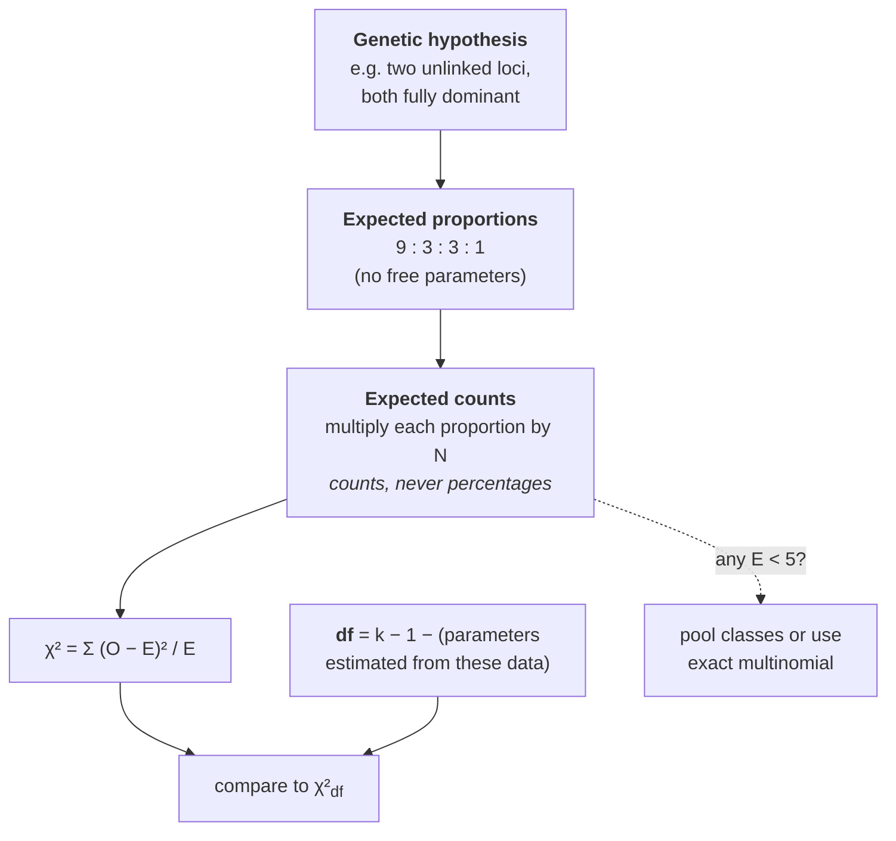

# 12 — Probability and hypothesis testing in genetics

> **Before this:** [Ch 09](09-mitosis-and-meiosis.md) · [Ch 10](10-mendelian-inheritance.md) · [Ch 11](11-beyond-mendel.md) · **Time:** ~25 min
>
> **Statistics needed:** [S1 Probability](../part-S-statistics/S1-probability.md) ·
> [S2 Distributions](../part-S-statistics/S2-distributions.md) ·
> [S4 Hypothesis testing](../part-S-statistics/S4-hypothesis-testing.md)

This chapter is not a statistics tutorial — the [statistics track](../part-S-statistics/) does
that, and S1, S2 and S4 supply everything used here. **If you have not read them, read them
first**; this chapter will otherwise look like a list of rules rather than a set of consequences.

What this chapter is about is the specific ways that even people who know statistics well get
genetics wrong. That is almost never by computing a statistic incorrectly. It is almost always by
testing the wrong null, counting the wrong degrees of freedom, or forgetting how the sample came
to exist.

## What you'll be able to do

- Turn a genetic hypothesis into a fully specified expected multinomial, and test observed
  progeny counts against it
- Get the degrees of freedom right, including when a parameter has been estimated from the
  same data
- State precisely what a non-significant χ² licenses, and compute the power you actually had
- Run a pedigree risk calculation as a prior × conditional → joint → posterior table
- Recognise ascertainment bias in a sibship dataset and correct for it under a stated
  ascertainment model
- Distinguish a prior-odds correction from a family-wise error correction when many hypotheses
  are tested at once, and say why the two arguments must not be merged

## The core idea

A genetic hypothesis is a generative model. "These two loci assort independently and both
alleles are fully dominant" is not a vague claim — it pins down an exact multinomial
distribution over phenotypic classes, with no free parameters. That is unusual and valuable:
you can compute expected counts before collecting a single plant.

Everything downstream follows from taking that seriously. The test statistic is routine. The
work is in the model.

> **Almost every "statistics error" in genetics is a modelling error wearing statistical
> clothes.** The null was the wrong null, or a parameter was silently fitted, or — most
> often — the families in the dataset were not sampled at random from the families that
> exist. No amount of care with the arithmetic repairs any of those.

---

## 1. Product and sum rules, and why they are biological claims here

Multiplying probabilities across loci looks like arithmetic. It is not.

```
Aa Bb Cc  ×  Aa Bb Cc        what fraction of progeny is  A_ bb CC ?

   locus A        locus B        locus C
   A_ = 3/4       bb = 1/4       CC = 1/4
      └──────────────┴──────────────┘
             3/4 × 1/4 × 1/4  =  3/64
```

That multiplication is legitimate only because the three loci assort independently — a claim
about meiosis, not about arithmetic. Put *A* and *B* 10 cM apart and the joint distribution is
set by the recombination fraction instead ([Ch 14](14-linkage-and-mapping.md)). Likewise the
1/4 at each locus assumes fair segregation, which meiotic drive violates. **The independence
you are multiplying is an empirical hypothesis, and it is frequently the thing under test.**

The sum rule is used for the other half: a phenotypic class like `A_` is a *union* of mutually
exclusive genotypes (*AA* + *Aa* = 1/4 + 2/4). Two failure modes recur:

- **Adding non-exclusive events.** "Probability the child is affected *or* a carrier" is not a
  sum unless the categories are disjoint. Draw the genotype partition first.
- **Computing "at least one" directly.** Always take the complement. For *Aa* × *Aa* with four
  children, P(at least one affected) = 1 − (3/4)⁴ = 175/256 ≈ 0.68.

## 2. Family composition is binomial — with one trap

Children of a given cross are independent draws from the same multinomial, so counts within a
sibship are binomial. For *Aa* × *Aa*, in a sibship of four:

P(exactly one affected) = C(4,1)(1/4)¹(3/4)³ = 4 × 27/256 = **27/64 ≈ 0.42**

The trap is that people quietly switch between ordered and unordered outcomes. P(affected,
unaffected, unaffected, unaffected *in that birth order*) = (1/4)(3/4)³ = 27/256 ≈ 0.105. The
binomial coefficient is the whole difference, and questions phrased as "what is the chance
their first child is affected and the rest are not" mean the ordered version.

The second trap is the gambler's fallacy, which in genetics is not a joke but a clinical
reality: having had an affected child does not reduce the risk for the next. Each conception
is an independent draw. What *does* change with family history is your estimate of the
parents' genotypes — which is §6, and a different thing entirely.

## 3. Chi-square against a genetic hypothesis

The setup, which is the part worth being pedantic about:



Three rules that are violated constantly:

**Expectations come from the model, not the data.** This is a goodness-of-fit test against a
fully specified distribution, not a contingency table. If you find yourself computing expected
values from row and column margins, you are testing a different hypothesis (independence
between two classifications) with different degrees of freedom.

**Counts, not proportions.** χ² scales linearly with N. Feeding it percentages is equivalent to
claiming N = 100, and it is the single most common mechanical error in undergraduate genetics.

**Expected counts of at least ~5 per class.** The χ² approximation to the multinomial
degrades below that. With modern computers there is no reason to tolerate it — enumerate or
simulate the exact multinomial instead.

## 4. Degrees of freedom, and the four ways people get them wrong

df = (number of classes) − 1 − (number of parameters estimated from these same data).

| Situation | Classes | Estimated | df |
|---|---|---|---|
| F₂ monohybrid, testing 3 : 1 | 2 | 0 | **1** |
| F₂ dihybrid, testing 9 : 3 : 3 : 1 | 4 | 0 | **3** |
| Dihybrid testcross, testing 1 : 1 : 1 : 1 (no linkage) | 4 | 0 | **3** |
| Same testcross, but fitting the recombination fraction *r* | 4 | 1 (*r*) | **2** |
| Hardy–Weinberg, 3 genotype classes, *p* estimated from the genotypes | 3 | 1 (*p*) | **1** |

The four errors, in rough order of frequency:

1. **Using n − 1 instead of k − 1.** Degrees of freedom count *classes*, not individuals. A
   3 : 1 test on 400 plants has 1 df, not 399.
2. **Forgetting the estimated parameter.** The Hardy–Weinberg row above is the canonical case:
   the allele frequency was computed from the very genotypes being tested, so one df is spent
   on it. Using df = 2 makes the test conservative and quietly hides real disequilibrium. This
   matters again in variant-calling QC ([Ch 26](../part-05-population-genetics/26-hardy-weinberg.md)).
3. **Pooling classes after looking at the data**, then not accounting for having chosen the
   pooling to improve the fit.
4. **Including a "total" row** in the summation. It contributes zero to the numerator but
   people sometimes count it as a class.

## 5. What failing to reject does not license

χ² is a test of the null. A large p-value means *the data are consistent with the model*, which
is a very much weaker statement than *the model is right*, and in small genetic crosses it is
close to vacuous.

Make it concrete. Suppose the truth is 70 : 30, not 3 : 1, and you test for 3 : 1 at α = 0.05.
Power comes from the non-centrality λ = N Σ (pᵢ − πᵢ)²/πᵢ:

| N | λ | Power to detect the departure |
|---|---|---|
| 100 | 1.33 | **21%** |
| 300 | 4.0 | 52% |
| 1000 | 13.3 | 96% |

With a hundred progeny you will miss a genuine 5-percentage-point departure four times out of
five. The same arithmetic applies to linkage: a testcross where the true recombination fraction
is 0.4 (real but loose linkage, expected classes 0.3 : 0.3 : 0.2 : 0.2 instead of
1 : 1 : 1 : 1) gives only **36% power at N = 100**, rising to 97% at N = 500.

> A non-significant χ² on a small cross is not evidence for independent assortment. It is
> evidence that you ran an underpowered experiment. Report the power, or report a confidence
> interval on the parameter, but do not report "consistent with Mendelian expectations" as
> though it were a finding.

The mirror-image error is a fit that is *too* good, and genetics has the most famous example
in all of statistics — see the worked example.

## 6. Bayes: the machinery Chapter 15 runs on

Pedigree risk calculation is Bayesian inference over genotypes, laid out in a four-column
table by convention. Learn the layout here; [Ch 15](15-pedigrees.md) does nothing but apply it.

**The problem.** A woman's brother has cystic fibrosis (autosomal recessive). Their parents are
unaffected, so both must be heterozygous. She is unaffected. Her partner has been screened and
is a carrier. They already have two unaffected children. What is the risk for a third?

**Prior.** From *Aa* × *Aa* she was 1/4 *AA*, 1/2 *Aa*, 1/4 *aa*. She is unaffected, so *aa* is
excluded — conditioning that is already built into the prior. Renormalising: **2/3 carrier,
1/3 non-carrier.**

**Conditional.** The probability of the *observed evidence* (two unaffected children) under each
hypothesis. If she carries, each child is affected with probability 1/4, so unaffected with 3/4;
two independent children give (3/4)² = 9/16. If she does not carry, no child can be affected, so
the probability of the observation is 1.

| | Carrier | Non-carrier |
|---|---|---|
| **Prior** | 2/3 | 1/3 |
| **Conditional** (2 unaffected children) | 9/16 | 1 |
| **Joint** | 2/3 × 9/16 = 3/8 | 1/3 × 1 = 1/3 |
| **Posterior** | (3/8) / (3/8 + 1/3) = **9/17 ≈ 0.53** | 8/17 ≈ 0.47 |

**Risk for the next child** = P(she carries) × P(child inherits *a* from her) × P(child inherits
*a* from him) = (9/17) × (1/2) × (1/2) = **9/68 ≈ 0.13**.

Two things to notice. Her carrier probability fell only from 0.67 to 0.53: two unaffected
children are weak evidence, because unaffected children are the *likely* outcome even when she
carries. And the whole calculation is mechanical — the only judgement is deciding what counts as
evidence and computing its likelihood under each genotype. Priors here are not subjective; they
come from Mendelian segregation and from population allele frequencies (for CF, a carrier
frequency of roughly 1 in 25 in European-ancestry populations, when the partner has not been
screened).

## 7. Ascertainment: the sampling process that was never random

Here is the error that no amount of statistical sophistication catches, because it happens
before the data exist.

Collect families segregating a recessive disease. You find them because someone in them is
affected. Families where two carriers happened to have three unaffected children are invisible —
they never came to a clinic. Your sample is conditioned on having at least one affected child,
so the observed proportion affected is biased upward:

E[proportion affected | at least one affected, sibship size *s*] = (1/4) / (1 − (3/4)ˢ)

| Sibship size *s* | 1 | 2 | 3 | 4 | 6 | 8 |
|---|---|---|---|---|---|---|
| Expected proportion affected among ascertained sibships | 1.00 | 0.57 | 0.43 | 0.37 | 0.30 | 0.28 |

In two-child families you expect **57% affected**, not 25% — and a naive χ² against 3 : 1 will
reject autosomal recessive inheritance emphatically, for a trait that is autosomal recessive.
This is why early twentieth-century human pedigree studies kept "disproving" Mendelism, and why
Weinberg introduced the proband method in 1912.

The correction depends on *how* families were ascertained, and getting that model wrong is
itself the error:

| Ascertainment model | What it means | Correct handling |
|---|---|---|
| **Complete (truncate)** | Every family with ≥1 affected child is found | Fit the truncated binomial: observed proportion *q* = *p* / (1 − (1−*p*)ˢ) |
| **Single** | Each affected child is found independently with tiny probability, so families are found roughly once per proband | Weinberg's proband method: drop one proband per family, estimate from the remaining sibs |
| **Multiple** | Between the two | Weight by the number of probands; model explicitly |

For *s* = 2 under complete ascertainment the algebra collapses nicely: *q* = *p*/(*p*(2−*p*)) =
1/(2−*p*), so *p* = 2 − 1/*q*. An observed *q* = 4/7 recovers *p* = 2 − 7/4 = **1/4** exactly.

Ascertainment is not a historical curiosity. It is why case-control GWAS need careful control
matching ([Ch 51](../part-11-human-and-statistical-genomics/51-gwas.md)), why variant databases
built from clinically tested patients over-represent pathogenic alleles
([Ch 55](../part-11-human-and-statistical-genomics/55-clinical-variant-interpretation.md)), and
why "penetrance" estimated from clinically ascertained families is almost always too high
([Ch 54](../part-11-human-and-statistical-genomics/54-rare-variants-and-mendelian-disease.md)).

## 8. Many tests at once

> **Statistics:** prior and posterior are [S1](../part-S-statistics/S1-probability.md) §5, which
> you have already read. The *odds* form used below — multiply prior odds by a likelihood ratio to
> get posterior odds — and the LOD score itself are developed properly in
> [Ch 14](14-linkage-and-mapping.md) §9 and [S6](../part-S-statistics/S6-likelihood-and-bayes.md)
> §§4–5. Take the arithmetic here at face value for now; it is an illustration of the idea, not a
> method you need yet.

Genetics reached the multiple-testing problem decades before genomics did. Morton's 1955
argument for the LOD score threshold of 3 is explicitly a prior-odds correction: two randomly
chosen autosomal loci are linked with probability roughly 1 in 50, so odds of 1000 : 1 in
favour of linkage from the data leave posterior odds of about 20 : 1 — a ~5% false-positive
rate, per test, given the genome-wide prior. (LOD relates to χ² by χ² ≈ 2 ln(10) × LOD ≈ 4.6 ×
LOD, so LOD 3 ≈ χ² of 13.8.)

The modern genome-wide significance threshold, 5 × 10⁻⁸ ≈ 0.05 / 10⁶, reaches a comparable place
by a different argument: Morton's is a prior-odds correction, the GWAS threshold is a family-wise
error correction over roughly a million effectively independent tests.
[Ch 32](../part-06-quantitative-genetics/32-mapping-quantitative-traits.md) §6 and
[Ch 51](../part-11-human-and-statistical-genomics/51-gwas.md) §5 keep the two apart, and it
matters that they are kept apart.

---

## Common misconceptions

| What people think | What's actually true |
|---|---|
| A large χ² p-value confirms the genetic model | It fails to reject one model. Dozens of other models are equally consistent with the same data, and with small N nearly everything is |
| Degrees of freedom = number of individuals − 1 | df counts phenotypic *classes*, then subtracts one more for each parameter estimated from the same data |
| A Hardy–Weinberg test on 3 genotypes has 2 df | 1 df — the allele frequency was estimated from those genotypes |
| Each child of *Aa* × *Aa* has a 1/4 risk, so one child in four will be affected | 1/4 is a per-conception probability, not a quota. P(exactly one affected of four) is 27/64, and P(none) is 81/256 |
| They already have an affected child, so the next is safer | Conceptions are independent. What family history updates is your belief about the *parents' genotypes*, not the segregation probability |
| Finding 57% of sibs affected refutes recessive inheritance | In completely ascertained two-child sibships that is exactly the expectation. The sample was conditioned on containing an affected child, so the null is 4/7, not 1/4 |
| χ² can be run on percentages since ratios are what matter | χ² scales with N. Percentages assert N = 100 and throw away all the information about sample size |
| Bayesian pedigree risk involves subjective priors | The priors are Mendelian segregation ratios and population allele frequencies. Nothing subjective enters |

## Worked example: Mendel's dihybrid F₂, and the fit that was too good

Mendel crossed peas differing in seed shape (round *R* dominant to wrinkled *r*) and cotyledon
colour (yellow *Y* dominant to green *y*), selfed the F₁, and scored 556 F₂ seeds.

**Step 1 — state the hypothesis.** Both loci fully dominant, and the loci assort independently.
No free parameters.

**Step 2 — derive expected proportions.** Per locus, F₂ is 3/4 dominant : 1/4 recessive.
Independence lets us multiply: 9/16, 3/16, 3/16, 1/16.

**Step 3 — expected counts.** Multiply by N = 556.

| Class | Expected proportion | E | O | (O−E)²/E |
|---|---|---|---|---|
| round yellow | 9/16 | 312.75 | 315 | 0.0162 |
| round green | 3/16 | 104.25 | 108 | 0.1349 |
| wrinkled yellow | 3/16 | 104.25 | 101 | 0.1013 |
| wrinkled green | 1/16 | 34.75 | 32 | 0.2176 |
| | | 556.00 | 556 | **χ² = 0.470** |

**Step 4 — degrees of freedom.** Four classes, nothing estimated: df = 4 − 1 = **3**.

**Step 5 — interpret.** The critical value at α = 0.05 with 3 df is 7.815. Our 0.470 is nowhere
near it; p ≈ **0.93**. Do not reject.

**Step 6 — say what that means.** The data are consistent with 9 : 3 : 3 : 1. They are *also*
consistent with weak linkage: an F₂ of 556 has about **84% power** against *r* = 0.4 (an F₂ from
a coupling-phase F₁ gives expected proportions 0.59 : 0.16 : 0.16 : 0.09, so λ = 556 × 0.0215 =
12.0) but only about **25% power** against *r* = 0.45. The test excludes tight linkage and not
much else. Note that §5's power figures are for a *testcross* and do not transfer directly to an
F₂, where the same *r* produces a smaller departure from the null. (These two genes are in fact
on different chromosomes, but the test did not establish that.)

**Step 7 — notice the other tail.** p = 0.93 means 93% of honest replications would fit *worse*
than this. For one experiment that is unremarkable. Fisher, in 1936, aggregated the deviations
across all of Mendel's published experiments and obtained a combined χ² of about 41.6 on 84 df
— a probability of about 0.99997 that a genuine replication would fit worse. Results that
good arise about three times in 100,000 (Fisher, working from the tables of his day, quoted
P = 0.99993). The likeliest explanations are unconscious selection
by assistants who knew the expected ratios, or discarding of runs that looked wrong; deliberate
fraud is not required and is not the consensus reading. **The lesson is that goodness of fit has
two tails.** A model-fitting p-value of 0.999 is as much a signal that something is wrong with
the data-generating process as 0.001 is.

## Connections

- **Back to:** [Ch 09](09-mitosis-and-meiosis.md) supplies the segregation that makes the
  probabilities 1/2 and 1/4; [Ch 10](10-mendelian-inheritance.md) supplies the ratios being
  tested; [Ch 11](11-beyond-mendel.md) supplies the modified ratios (9:3:4, 9:7, 12:3:1) that
  are the realistic *alternatives* to a 9:3:3:1 null
- **Forward to:** [Ch 14](14-linkage-and-mapping.md) turns the underpowered-χ² problem into the
  LOD score; [Ch 15](15-pedigrees.md) is this chapter's Bayes table applied repeatedly;
  [Ch 26](../part-05-population-genetics/26-hardy-weinberg.md) is the df-with-an-estimated-parameter
  case; [Ch 51](../part-11-human-and-statistical-genomics/51-gwas.md) is the same goodness-of-fit
  logic run a million times with the ascertainment problem back in force

## Check yourself

**1. You genotype 1,000 people at a SNP and test Hardy–Weinberg proportions. How many degrees of freedom, and why is the usual answer wrong?**

<details><summary>Answer</summary>

One. There are three genotype classes, giving 3 − 1 = 2, but the expected counts require the
allele frequency *p*, and you estimated *p* from these same genotypes. One further df is spent
on that estimate: df = 3 − 1 − 1 = 1.

Using df = 2 makes the test conservative — the critical value rises from 3.841 to 5.991 — so
real departures from equilibrium go undetected. Since HWE violation is a standard quality
filter for genotyping error in variant calling, the mistake silently lets bad variants through.

</details>

**2. Two carriers of an autosomal recessive condition plan four children. What is the probability that exactly one is affected? That at least one is?**

<details><summary>Answer</summary>

Binomial with n = 4, p = 1/4.

P(exactly one) = C(4,1)(1/4)(3/4)³ = 4 × (1/4) × (27/64) = 27/64 ≈ **0.42**

P(at least one) = 1 − P(none) = 1 − (3/4)⁴ = 1 − 81/256 = 175/256 ≈ **0.68**

Note that "exactly one" is the modal outcome but still a minority one, and that nearly a third
of such families will have no affected child at all — which is precisely the population of
families that ascertainment through affected individuals makes invisible.

</details>

**3. A man's sister has an autosomal recessive disease; their parents are unaffected. He is unaffected, his partner is a known carrier, and they have one unaffected child. What is the risk for their next child?**

<details><summary>Answer</summary>

Prior: from *Aa* × *Aa*, excluding *aa* because he is unaffected, he is 2/3 carrier, 1/3 not.

Conditional on one unaffected child: 3/4 if he carries, 1 if he does not.

Joint: (2/3)(3/4) = 1/2 versus (1/3)(1) = 1/3. Sum = 5/6.

Posterior carrier probability = (1/2)/(5/6) = **3/5**.

Risk for the next child = (3/5) × (1/2) × (1/2) = **3/20 = 0.15**.

</details>

**4. A colleague reports χ² = 1.2, df = 3, p = 0.75 on a testcross of 80 progeny and concludes the two markers are unlinked. What is wrong?**

<details><summary>Answer</summary>

The conclusion does not follow. With 80 progeny the test has very little power. A true
recombination fraction of 0.4 makes the expected class proportions 0.3 : 0.3 : 0.2 : 0.2, so
Σ (pᵢ − πᵢ)²/πᵢ = 4 × (0.05²/0.25) = 0.04 and λ = 80 × 0.04 = 3.2. Against the 3-df critical
value of 7.815 that is **29% power** at α = 0.05. Even *r* = 0.35 would be missed about 40% of
the time (λ = 7.2, power ≈ 60%), and *r* = 0.42 would be missed more often than not
(λ = 80 × 0.0256 = 2.05, power ≈ 20%).

The right output is not "unlinked" but an estimate of *r* with an interval — which will be wide
and will comfortably include both 0.5 and substantial linkage. Failure to reject a null is a
statement about the experiment, not about the genome.

</details>

**5. A clinic assembles every two-child family in its region containing at least one child with a suspected recessive disease: 40 families, 45 of the 80 children affected. The authors conclude that 56% affected is far too high for a recessive trait and propose a dominant with reduced penetrance. What has gone wrong?**

<details><summary>Answer</summary>

They tested against the wrong null. Families were found *because* they contained an affected
child, so the correct expectation is the truncated one: (1/4)/(1 − (3/4)²) = 0.25/0.4375 =
**4/7 ≈ 0.571**, not 0.25.

Expected counts are 80 × 4/7 = 45.71 affected and 34.29 unaffected against observed 45 and 35,
giving χ² = 0.026 on 1 df, p ≈ 0.87. The data fit simple autosomal recessive inheritance almost
perfectly.

Inverting directly: for *s* = 2, *q* = 1/(2 − *p*), so *p* = 2 − 1/*q* = 2 − 1/0.5625 = **0.222**
— a segregation probability indistinguishable from 1/4 at this sample size. The dominant-with-
reduced-penetrance model was invented to explain an artefact of how the sample was collected.

</details>
