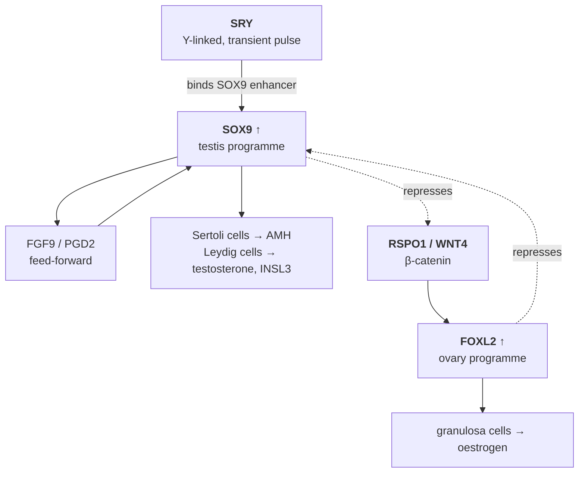
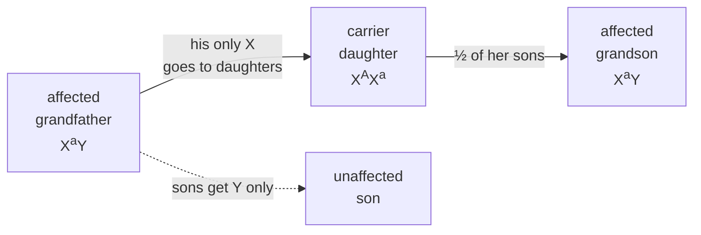

# 13 — Sex chromosomes and sex linkage

> **Before this:** [Ch 09](09-mitosis-and-meiosis.md) · [Ch 10](10-mendelian-inheritance.md) · [Ch 12](12-probability-and-testing.md) · **Time:** ~35 min

## What you'll be able to do

- Name the major sex-determination systems and say why chromosomal sex determination is not a
  single conserved mechanism
- Explain how *SRY* works as a switch, and use XX males and XY females to prove what it does
- Derive the Y chromosome's decay from recombination suppression rather than asserting it
- Recognise X-linked recessive, X-linked dominant and Y-linked patterns from a pedigree or a
  cross, and say which observation discriminates each from autosomal inheritance
- Predict allele and phenotype frequencies at a hemizygous locus, and show why an X-linked
  recessive trait is far more common in males
- Explain why one-third of cases of a lethal X-linked recessive were expected to be new
  mutations, and why the paternal mutation bias moves that fraction to nearer one in six
- Explain why dosage compensation exists, and why three lineages solved it three
  incompatible ways

## The core idea

Two independent things are going on, and conflating them causes most of the confusion in this
topic.

The first is **sex determination**: which switch decides that an embryo develops as male or
female. That switch is evolutionarily unstable. It has been reinvented dozens of times, sits on
different chromosomes in different lineages, and in many species is not genetic at all.

The second is **sex linkage**: the inheritance consequences of one sex carrying one copy of a
chromosome that the other sex carries two of. This has nothing to do with what the chromosome
determines. It follows purely from the copy number.

> **A locus is "sex-linked" because of where it sits, not because of what it does.** The gene
> for red–green colour vision has no connection to sex. It is sex-linked because it happens to
> sit on the X chromosome, and men have one X. Sex linkage is an accident of address.

The third thing, which follows from the second, is that one sex having one copy of an entire
chromosome is a stoichiometry problem — and the solutions to it are strange and instructive.

---

## 1. The switch is not conserved

| System | Who is heterogametic | Where the signal comes from | Examples |
|---|---|---|---|
| **XY** | male (XY) | presence of a Y-borne gene, or X:autosome ratio | mammals, *Drosophila* |
| **ZW** | female (ZW) | Z dosage | birds, snakes, most butterflies and moths |
| **X0** | male (X, no partner) | X:autosome ratio | grasshoppers, *C. elegans* (XX hermaphrodite / X0 male) |
| **Haplodiploidy** | — | ploidy itself: unfertilised egg → haploid male | ants, bees, wasps |
| **Temperature-dependent (TSD)** | — | incubation temperature during a critical window | most turtles, all crocodilians, tuatara |
| **Environmental (ESD)** | — | position, density, social context | *Bonellia* (larvae settling on a female become dwarf males), clownfish |

Two facts do the work here.

**Mammalian and *Drosophila* XY systems are not the same system.** Both label the chromosomes X
and Y; the logic underneath is completely different. In mammals, the Y carries a dominant
male-determining gene, so **presence of a Y makes a male**. In *Drosophila*, sex is set by the
ratio of X chromosomes to autosome sets, and the Y is irrelevant to it — it is needed for
sperm production only. The two systems give opposite predictions, and reality obliges:

| Karyotype | Human | *Drosophila* |
|---|---|---|
| XX | female | female |
| XY | male | male |
| **X0** | **female** (Turner syndrome) | **male**, sterile |
| **XXY** | **male** (Klinefelter syndrome) | **female**, fertile |

Same variable names, different interpreter. When you read "XY system", ask what the switch
actually reads.

**The downstream pathway is far more conserved than the switch.** Across vertebrates the gonad
is built by two mutually antagonistic gene networks — a testis network built on SOX9 and DMRT1,
an ovary network built on WNT4/RSPO1/β-catenin and FOXL2. What varies between lineages is only
which upstream input tips the balance: a Y gene in mammals, Z-linked *DMRT1* dosage in birds,
a temperature-sensitive signal in turtles. Evolution keeps rewiring the input to a stable
circuit.

## 2. The mammalian switch: *SRY*

The mammalian testis-determining factor is *SRY* — a single-exon gene on the short arm of the Y
at Yp11.2, identified in 1990. On GRCh38 it starts at chrY:2,786,855, which is about 5 kb
outside the PAR1 boundary at chrY:2,781,479. Remember that number; it explains an entire class
of exceptions in a moment.

*SRY* is a transcription factor, and it is expressed as a **pulse** — in mouse, for roughly a
day in the genital ridge, and then it is gone. What it does in that window is push *SOX9* above
a threshold, by binding an enhancer upstream of it. Past the threshold, SOX9 sustains its own
expression through feed-forward loops with FGF9 and prostaglandin D2, and simultaneously
represses the ovarian programme. Below it, WNT4/RSPO1/β-catenin signalling wins and represses
SOX9.



This is a **bistable latch with mutual repression**, and *SRY* is a momentary pulse on the set
line. Three consequences follow, and all three are experimentally confirmed:

1. **The pulse must be large enough and early enough.** A weakened or delayed *Sry* allele
   produces ovotestes or XY females even with the gene intact.
2. **The latch must keep being held.** Deleting *Foxl2* in an *adult* mouse ovary causes
   granulosa cells to transdifferentiate into Sertoli-like cells. Gonadal sex is not a decision
   made once in the embryo and stored; it is a state actively maintained for life.
3. **Anything that trips the latch works, whatever it is.** *SRY* is one input, not the
   mechanism.

### The informative exceptions

The exceptions are how we know any of this.

| Observation | What it proves |
|---|---|
| **46,XX males** (~1 in 20,000 male births). Most carry *SRY* on the tip of an X, transferred by a crossover that ran a few kb past the PAR1 boundary in the father's meiosis | *SRY* is **sufficient**. And the mechanism is exactly what its position 5 kb outside PAR1 predicts |
| **46,XY females** (complete gonadal dysgenesis; *SRY* loss-of-function in ~15% of cases) | *SRY* is **necessary** in humans |
| **XX males with no *SRY* at all**, carrying a duplication of an enhancer ~600 kb upstream of *SOX9* | *SRY* acts **through** SOX9. Raise SOX9 directly and you skip the switch |
| **XY females with a deletion of that same enhancer** | Same conclusion from the other direction |
| The Amami spiny rat has **lost the Y and *SRY* entirely**, and determines sex by a duplication that raises *Sox9* | The Y is not required for maleness. It is required to deliver an input |

That last row is the general lesson: a Y chromosome is not what makes a male. It is a delivery
vehicle for whatever currently tips a much older switch.

## 3. Why the Y is a wreck

Start from the fact that the X and Y were once an ordinary homologous pair, roughly 180 million
years ago in the ancestor of therian mammals. Then derive everything else.

**Step 1 — a sex-determining allele arises** on one member of the pair. That chromosome is now
present only in one sex.

**Step 2 — selection favours suppressing recombination around it.** Alleles that are good for
males but bad for females (or vice versa) accumulate near the switch, because there they are
transmitted preferentially to the sex they benefit. Any inversion that locks such an allele to
the switch is favoured. Recombination is what lets selection evaluate alleles individually; an
inversion switches that off for everything it spans.

**Step 3 — the non-recombining region decays**, for three separate reasons, all of which are
consequences of losing recombination rather than of anything specific to sex:

- **Muller's ratchet.** In a finite non-recombining population, the class of chromosomes with
  the fewest deleterious mutations can be lost by drift, and without recombination it can never
  be reconstituted. The ratchet clicks one way.
- **Hitchhiking and background selection.** A beneficial allele sweeping through the Y drags
  every linked deleterious allele with it, because they are one linkage block.
- **A fourfold smaller effective population size.** In a population of *N* diploids there are
  2*N* copies of each autosome, 1.5*N* X chromosomes, and only 0.5*N* Y chromosomes. Drift is
  correspondingly stronger and purifying selection correspondingly weaker on the Y.

**Step 4 — the process repeated.** Successive inversions expanded the non-recombining region in
discrete steps, leaving **evolutionary strata**: blocks of X–Y gene pairs whose divergence
increases with distance from the pseudoautosomal end, because they stopped recombining at
different times. Four to five strata are resolvable in humans; the oldest one contains *SRY*.

The result:

```
                PAR1                                                    PAR2
             (2.78 Mb)                                                (330 kb)
  X  |████████|─────────────────────────────────────────────────────────|██|
     0      2.78 Mb                                              155.70   156.04 Mb

  Y  |████████|▲──────────────────|▒▒▒▒▒▒▒▒▒▒▒▒▒▒▒▒▒▒▒▒▒▒▒▒▒▒▒▒▒▒▒▒▒▒▒▒▒|██|
     0      2.78 │              ~23 Mb MSY                          56.89  57.22 Mb
                 └─ SRY at 2.787 Mb — 5 kb past the boundary
                                                          (coordinates: GRCh38)
  ████  pseudoautosomal — recombines X↔Y every male meiosis, effectively autosomal
  ────  single-copy: X-specific, or male-specific Y (MSY) — ~23 Mb of euchromatin on the Y,
        no partner in males
  ▒▒▒▒  Yq12 heterochromatin — from ~26.6 Mb; no genes, and its length varies between men
```

Of the 600-plus genes the ancestral pair carried, the human Y retains **19** — about 3%. The X
kept them all, and today carries roughly 800–900 protein-coding genes. The complete
telomere-to-telomere Y assembly (HG002, 2023) is 62,460,029 bp and annotates 106 protein-coding
genes — but most of those are copies within three amplicon families (*TSPY*, *DAZ*, *RBMY*), so
the number of *distinct* proteins is a few dozen. Over half of the Y was missing from GRCh38
entirely; anything you compute on chrY should state which assembly you used
([Ch 45](../part-09-genomics/45-reference-genomes-and-pangenomes.md)).

Two loose ends worth having:

**PAR1 is not optional.** X and Y must pair and cross over somewhere in male meiosis to
segregate correctly, and PAR1 is the only place they can. So PAR1 carries an obligate crossover:
one crossover in 2.78 Mb is 50 cM in 2.78 Mb ≈ **18 cM/Mb**, against a male autosomal average of
roughly 0.9 cM/Mb (about 2,700 cM over ~2,875 Mb). PAR1 recombines about twenty times faster
than the male genome average, and genes in it — *SHOX*, for instance — are inherited exactly
like autosomal genes.

**The Y is not still crumbling.** Gene loss was front-loaded into the early strata. Comparing
the human Y with the rhesus macaque Y across ~25 million years finds essentially no further
loss — one gene. The survivors are dosage-sensitive broadly expressed regulators under strong
purifying selection, and the Y protects them with a substitute for recombination: giant
palindromes whose arms undergo intrachromosomal gene conversion, letting a damaged copy be
repaired from its own mirror image.

## 4. Hemizygosity: what one copy does to Mendel

A male is **hemizygous** for X-linked loci — one allele, no partner. Everything distinctive
about sex linkage falls out of that.

**Dominance stops applying.** Dominance is a statement about the heterozygote. A hemizygous male
has no heterozygote to describe, so an X-linked "recessive" allele is fully expressed in him. The
recessive/dominant labels for X-linked loci are really statements about females only.

**Reciprocal crosses differ.** This is the diagnostic. For an autosomal locus, A♀ × B♂ and
B♀ × A♂ give identical offspring distributions. For an X-linked locus they do not, because sons
get their X from their mother and their Y from their father. If reciprocal crosses disagree, the
locus is not autosomal.

**There is no male-to-male transmission.** A father passes his son a Y, never his X, so an
X-linked *allele* can never travel father → son. Be precise about what that licenses: an affected
father with an affected son argues strongly against X linkage, but it does not rule it out, because
the son may have had the allele from a carrier mother — routine for a high-frequency allele such as
G6PD deficiency or red–green colour blindness. The impossibility is the transmission, not the
co-occurrence.

**Criss-cross inheritance.** An X-linked allele goes father → daughter → grandson, skipping the
intervening male entirely.



**Frequencies differ between the sexes, and by a lot.** Let *q* be the frequency of an X-linked
allele. Under random mating ([Ch 26](../part-05-population-genetics/26-hardy-weinberg.md)) a male
is affected if his single X carries it — probability *q*. A female needs two — probability *q*².
So:

> **Affected males : affected females = q : q². The ratio is 1/q.** The rarer the allele, the
> more extreme the male excess.

Red–green colour vision deficiency has *q* ≈ 0.08 in populations of northern European ancestry.
Predicted: 8% of males, 0.64% of females, and 2·q(1−q) ≈ 15% of females as unaffected carriers.
Observed: about 8% of males and about 0.5% of females. The model needs no fitting.

Haemophilia A (*F8*, factor VIII) affects roughly 1 in 4,000–5,000 male births; haemophilia B
(*F9*, factor IX) roughly 1 in 20,000–30,000. Both are severe and historically reduced male
fitness to near zero, which lets you derive a fact clinicians rely on. Two-thirds of all X
chromosomes are in females, one-third in males. At mutation–selection equilibrium with affected
male fitness zero, every mutant X sitting in a male is removed each generation — a loss of *q*/3
per X — and this must be balanced by the mutation input μ. So *q* = 3μ. Of those 3μ affected
males, the μ whose mutation arose in the maternal gamete are new. Therefore **one-third of cases
of a lethal X-linked recessive are de novo**. That is Haldane's result from 1935.

Now notice the assumption it rests on: that μ is the same in eggs and in sperm. It is not —
roughly **80% of de novo mutations are paternal** in origin
([verified facts](../reference/verified-facts.md)). And a paternal mutation cannot make an affected
son, because fathers give sons a Y; it makes a **carrier daughter**, entering the pedigree one
generation upstream. Redo the same equilibrium with a male rate four times the female rate and *q*
comes out at six times the egg rate, of which just one part is a fresh mutation in the egg:
**one affected male in six is sporadic, not one in three.**
Haemophilia A is the extreme case — the intron-22 inversion behind roughly 45% of severe disease
arises almost exclusively in male germ cells, and nearly every mother of an isolated inversion case
proves to be a carrier. So the sporadic fraction is lower than Haldane's third and the mother's
carrier risk correspondingly higher, which is why carrier testing rather than pedigree inference is
the standard of care.

## 5. Reading the patterns

| | X-linked recessive | X-linked dominant | Y-linked (holandric) |
|---|---|---|---|
| Sex ratio of affected | strong male excess | female excess, roughly 2:1 | males only |
| Affected father's sons | unaffected (from this locus) | **none affected** | **all affected** |
| Affected father's daughters | all carriers | **all affected** | none affected |
| Affected mother's sons | **all affected** (she is X<sup>a</sup>X<sup>a</sup>); it is a *carrier* mother who has ½ affected sons | ½ affected (she is heterozygous) | — |
| Male-to-male transmission | never | never | always |
| Skipped generations | common, through carrier females | rare | none |
| Examples | haemophilia A/B, red–green colour blindness, Duchenne muscular dystrophy, G6PD deficiency | X-linked hypophosphataemia (*PHEX*); *MECP2* Rett syndrome and *IKBKG* incontinentia pigmenti, both usually male-lethal | *SRY*; AZFa/b/c deletions causing spermatogenic failure |

The sharpest single observation in this table: **an affected father with an X-linked dominant
condition has all daughters affected and no sons affected.** Nothing else produces that
signature, and one informative sibship can establish it.

Y-linked inheritance is genuinely rare, and the reason is structural: the male-specific Y carries
few genes, most of them concerned with making sperm, so most Y-linked mutations are
self-eliminating. AZF deletions cause azoospermia — and are therefore almost never inherited;
they arise de novo, or are transmitted only via assisted reproduction, in which case every son
inherits them.

## 6. Dosage compensation: two problems, three solutions

Y degeneration created a stoichiometry problem — two of them, in fact, and they are worth keeping
apart, because only one of them has been solved.

- **Between the sexes.** Males ended up with one dose of ~800 X-linked genes, females with two.
- **Between X and autosomes.** That single active X sits against two doses of everything
  autosomal. Many X-linked proteins work in complexes with autosomal partners; complexes are
  sensitive to subunit ratios; halving one side is not free.

Every lineage that evolved differentiated sex chromosomes had to fix the first problem, and they
fixed it differently:

| Lineage | Mechanism | Net result |
|---|---|---|
| **Mammals** (XY) | One X per cell is transcriptionally **silenced** in XX individuals, via the lncRNA *XIST* | one active X in both sexes |
| ***Drosophila*** (XY) | The single male X is **transcriptionally doubled** by the MSL complex and the *roX* lncRNAs | ~2× one-X output in both sexes |
| ***C. elegans*** (XX/X0) | **Both** X chromosomes in the XX hermaphrodite are **halved** by a condensin-like dosage compensation complex | ~1× in both sexes |
| **Birds, Lepidoptera** (ZW) | Incomplete and gene-by-gene; no chromosome-wide mechanism | partial compensation only |

Three lineages, three non-overlapping mechanisms — silence one, double one, halve two — arriving
at the same functional endpoint. That convergence is the point:

> **Dosage compensation is a problem to be solved, not a mechanism to be memorised.** If it were
> an inherited mechanism, it would look the same everywhere. It does not, which tells you the
> constraint is real and the solution is contingent. And birds, which compensate only partially,
> tell you the constraint is also survivable.

Now notice what the mammalian and worm solutions do *not* do. Silencing one X leaves males and
females alike at one active X against two autosomal sets: it equalises the sexes while preserving
the X:autosome imbalance exactly as it was. (*Drosophila* is the exception — doubling the single
male X gives him two-X-equivalent output against two autosome sets, settling both at once.) The
candidate answer to the second problem is **Ohno's 1967 hypothesis**: that the active X is
transcriptionally upregulated about twofold. Decades on it remains genuinely contested — microarray
studies supported it, RNA-seq studies challenged it, and the current picture is at best partial
upregulation concentrated on dosage-sensitive genes rather than a chromosome-wide doubling. So
"dosage compensation" names a problem with one half solved and one half still open.

### X inactivation in detail

The mammalian solution runs on a long non-coding RNA. *XIST* (~17 kb, from the X-inactivation
centre at Xq13) is transcribed from the X that is to be silenced, and coats that chromosome **in
cis** — it never leaves the chromosome that made it. Coating recruits silencing machinery
(SPEN, Polycomb), which lays down H3K27me3 and macroH2A, moves the chromosome to a late-replicating
compartment, and finally methylates promoter CpG islands, locking the state in
([Ch 23](../part-04-gene-regulation/23-chromatin-and-epigenetics.md),
[Ch 24](../part-04-gene-regulation/24-rna-based-regulation.md)). The condensed inactive X is
visible down a microscope as the **Barr body**.

Four properties matter downstream:

**It is random, and then clonal.** Each cell in the early epiblast chooses independently; every
descendant of that cell keeps the same choice. **A female mammal is therefore a mosaic of two
cell populations** expressing different X alleles. This is not a subtle molecular fact — it is
visible on a cat. The orange locus in cats is X-linked (a 5 kb deletion at *ARHGAP36*, identified
in 2025), so a heterozygous cat is orange in patches descended from cells that inactivated the
non-orange X and black in the others: **tortoiseshell**, or **calico** once autosomal white
spotting is added. A tortoiseshell male is nearly always XXY. And the first cloned cat, in 2001,
did not look like its nuclear donor — same genome, independently drawn X-inactivation mosaic.

**The ratio is a small-sample binomial.** Choice is made in a modest number of progenitor cells —
on the order of tens. If the count is *n* and the choice is fair, the proportion of cells with a
given X active is roughly Binomial(*n*, ½)/*n*, whose standard deviation is 1/(2√*n*). With
*n* ≈ 25 that is about 0.10, so a 70:30 split is two standard deviations out and arises in about
4% of women by sampling alone, and 75:25 or more extreme in about 1.5% — much more often if the
progenitor pool is nearer *n* ≈ 10, where the standard deviation is 0.16.
**Skewed X inactivation needs no mechanism.** Selection acting afterwards on the two cell
populations then skews it further.

**Skewing produces manifesting carriers.** A female heterozygous for a Duchenne muscular dystrophy
or G6PD allele who happens to inactivate the healthy X in most of the relevant tissue is
symptomatic. Balanced X–autosome translocations make this systematic: cells that inactivate the
translocated X also silence the attached autosomal material and die out, so the *normal* X is the
one inactivated everywhere, and the carrier expresses only the disrupted allele. Skewing runs the
other way in X-linked immunodeficiencies — cells with the healthy X active outcompete the others
in blood, so extreme skewing in a female's leukocytes is itself a carrier test.

**Silencing is incomplete.** Roughly **15–25%** of X-linked genes escape, at least partly: about
15% escape consistently, and a further ~10% escape variably between individuals and tissues.
Escapees are concentrated in the PARs and on Xp. This is the reason X aneuploidy has a phenotype
at all — if inactivation were total, 45,X and 47,XXY would be silent
([Ch 20](../part-03-genome-instability/20-chromosome-abnormalities.md)). **Turner syndrome**
(45,X, ~1 in 2,000–2,500 live female births; ~99% of 45,X conceptions miscarry) and **Klinefelter
syndrome** (47,XXY, ~1 in 500–1,000 male births) are both diseases of escape-gene dosage. Short
stature in Turner syndrome is substantially attributable to a single copy of *SHOX* — which sits
in PAR1, and therefore escapes, because a gene that pairs and recombines on both sex chromosomes
was never a candidate for silencing in the first place.

---

## Common misconceptions

| What people think | What's actually true |
|---|---|
| The Y chromosome determines maleness | The Y *delivers* an input to a switch. Presence of a Y makes a mammal male; in *Drosophila* the Y is irrelevant to sex and XXY flies are fertile females. Spiny rats have lost the Y and still make males |
| Sex-linked means "related to sex" | It means "located on a sex chromosome". Colour vision, clotting factor VIII and dystrophin have nothing to do with sex |
| X-linked recessive conditions are dominant in males | Dominance describes a heterozygote. A hemizygous male has no second allele, so the terms simply do not apply to him. The allele is expressed because there is nothing else to express |
| Women are unaffected carriers of X-linked recessive disease | Often, but not reliably. X inactivation is random and its ratio is a small-sample binomial, so skewing is common; manifesting carriers of DMD, haemophilia and G6PD deficiency are well documented |
| The inactive X is completely silent | 15–25% of its genes escape. If it were completely silent, sex-chromosome aneuploidies would have no phenotype — and they do |
| The Y chromosome is disappearing and men will go extinct | Gene loss happened in a few early bursts and then stopped. Human and macaque Y chromosomes differ by about one gene over 25 million years. The surviving genes are dosage-sensitive regulators held under strong purifying selection, and palindromic gene conversion repairs damage |
| A tortoiseshell cat could be male | Only if he is XXY, or a mosaic. Two different alleles at an X-linked locus, expressed in patches, requires two X chromosomes |
| Dosage compensation is *the* mechanism of X silencing | It is a *problem*. Mammals silence one X, flies double the male X, worms halve both. Three lineages, three unrelated mechanisms, same endpoint |
| Hairy ear rims are the classic Y-linked human trait | Textbook folklore. The pedigree evidence never held up. Real Y-linked loci are *SRY* and the AZF spermatogenesis regions, and the latter mostly abolish their own transmission |

## Worked example: Morgan's white-eyed fly, 1910

This is the experiment that tied genes to chromosomes, and it is worth doing in full because the
reasoning is entirely inferential — Morgan could not see a gene.

**The observation.** Among red-eyed *Drosophila melanogaster*, a single white-eyed male appeared.

**Cross 1 — white male × red female.** F₁: 1,237 red-eyed flies of both sexes (plus three white
males, which Morgan set aside as sporadic). White is recessive. So far, ordinary Mendel.

**Cross 2 — F₁ × F₁.** F₂:

| | red | white |
|---|---|---|
| females | 2,459 | 0 |
| males | 1,011 | 782 |

Total red 3,470, total white 782. Overall that is 4,252 flies at 4.44 : 1 — close enough to 3:1
to be recognisable, but the striking fact is that **every white-eyed fly is male**. A 3:1
autosomal ratio has no mechanism to produce that.

**The hypothesis.** Put the locus on the X. Write the white allele *w* and the red allele *w⁺*.

```
P     X^w Y   (white male)    ×    X^w+ X^w+   (red female)

F1    X^w+ X^w   red females         X^w+ Y   red males
             ↑ carrier                  ↑ got its only X from the white father?
                                          no — from the RED mother. Fathers give sons a Y.

F1 × F1:  X^w+ X^w  ×  X^w+ Y

          eggs:   X^w+        X^w
sperm
  X^w+          X^w+ X^w+   X^w+ X^w      →  all daughters red (½ carriers)
  Y             X^w+ Y      X^w  Y        →  ½ sons red, ½ sons white
```

Predicted F₂: red females ½, red males ¼, white males ¼, white females 0. Predicted counts for
n = 4,252: 2,126 / 1,063 / 1,063 / 0.

**Testing it** ([Ch 12](12-probability-and-testing.md)). The zero class is already decisive: 782
white males and not one white female. Under an autosomal model, white females should be about a
quarter of all females; observing 0 out of 2,459 has probability of order (3/4)^2459 ≈ 10⁻³⁰⁷.
The autosomal model is dead on that observation alone.

The X-linked model survives but is not perfect: males total 1,793 against females 2,459, and
white males 782 against red males 1,011. χ² for the 1:1 split among males is
(1011−896.5)²/896.5 + (782−896.5)²/896.5 ≈ 29.3 on 1 df, p ≈ 6 × 10⁻⁸. The deficit is real and
systematic — *white* flies have reduced viability, an early demonstration that a mutation's
visible phenotype is rarely its only effect. It is *not* evidence against X linkage, because no
alternative model explains the zero.

**The decisive test — reciprocal cross.** Take white females (obtainable by crossing an F₁
carrier female to a white male) and cross to red males:

```
P     X^w X^w  (white female)  ×  X^w+ Y  (red male)

F1    X^w+ X^w   ALL daughters red        X^w Y   ALL sons white
```

Every daughter takes the opposite phenotype to her mother, every son takes his mother's.
**Criss-cross inheritance**, and reciprocal crosses that disagree. No autosomal model of any
dominance structure can produce a result that depends on which parent contributed which allele.

**Why this mattered beyond flies.** The *w* locus behaves exactly as the X chromosome behaves in
meiosis — same transmission, same asymmetry between the sexes, same skipping through carrier
daughters. That parallel was the first physical evidence that genes are carried on chromosomes,
and it turned an abstract bookkeeping device into an object with an address. Everything in
[Ch 14](14-linkage-and-mapping.md) is built on it.

## Connections

- **Back to:** [Ch 09](09-mitosis-and-meiosis.md) — X–Y pairing and the obligate PAR1 crossover
  are meiotic events; [Ch 10](10-mendelian-inheritance.md) — sex linkage is the first systematic
  departure from Mendel's ratios; [Ch 12](12-probability-and-testing.md) — the χ² above;
  [Ch 03](../part-01-molecular-foundations/03-genomes-chromosomes-chromatin.md) — chromosome
  structure and the Barr body
- **Forward to:** [Ch 14](14-linkage-and-mapping.md) — the X was the first chromosome mapped, for
  exactly the reason above; [Ch 15](15-pedigrees.md) — these patterns applied to human families;
  [Ch 20](../part-03-genome-instability/20-chromosome-abnormalities.md) — Turner and Klinefelter
  in full; [Ch 23](../part-04-gene-regulation/23-chromatin-and-epigenetics.md) and
  [Ch 24](../part-04-gene-regulation/24-rna-based-regulation.md) — *XIST* as the flagship case of
  lncRNA-mediated chromatin silencing;
  [Ch 26](../part-05-population-genetics/26-hardy-weinberg.md) — the *q* vs *q*² result derived
  properly; [Ch 27](../part-05-population-genetics/27-the-four-forces.md) — Muller's ratchet and
  effective population size; [Ch 46](../part-10-functional-genomics/46-variant-calling.md) —
  chrX and chrY require explicit ploidy handling, and PAR regions must be masked on one
  chromosome or read pairs will multi-map

## Check yourself

**1. A cross of strain A females × strain B males gives different offspring from strain B females × strain A males. What does that rule out, and what are the candidate explanations?**

<details><summary>Answer</summary>

It rules out a simple **autosomal** locus. For an autosomal gene, offspring genotype
distributions are identical regardless of which parent supplied which allele.

Candidates: (a) **sex linkage** — sons take their X from their mother only; (b) **maternal
inheritance** — mitochondrial DNA, which comes only from the mother and affects both sexes
equally, so check whether affected sons transmit to *their* offspring; (c) **imprinting**, where
an allele's expression depends on parental origin ([Ch 11](11-beyond-mendel.md)); (d) **maternal
effect**, where the mother's genotype determines the offspring phenotype regardless of the
offspring's own.

The discriminator between (a) and (b): X linkage predicts no male-to-male transmission and a
strong male excess; mitochondrial inheritance predicts affected mothers transmit to *all*
children of both sexes and affected fathers to none.

</details>

**2. Red–green colour blindness affects ~8% of males. Predict the female frequency, and the carrier frequency, and say why the male figure equals the allele frequency directly.**

<details><summary>Answer</summary>

Males are hemizygous: one X, so phenotype frequency = allele frequency. Hence *q* ≈ 0.08 directly,
with no square root and no Hardy–Weinberg assumption needed for males at all.

Females need two copies: *q*² = 0.0064, i.e. **0.64%** — matching the observed ~0.5%.

Carriers: 2*q*(1−*q*) = 2(0.08)(0.92) ≈ **0.147**, about 15% of women.

The male:female ratio is *q* : *q*² = 1 : *q*, i.e. 12.5-fold. That ratio, 1/*q*, is the general
result: the rarer the allele, the more extreme the male excess. For haemophilia A with
*q* ≈ 1/5,000, the expected female:male ratio is 1:5,000 — which is why haemophilic women are
usually manifesting heterozygotes with skewed X inactivation rather than true homozygotes.

</details>

**3. The X and Y stopped recombining with each other. Why did only the Y degenerate?**

<details><summary>Answer</summary>

Because the X did not stop recombining — it stopped recombining **with the Y**. In females, X
pairs with X and recombines normally. Two-thirds of all X chromosomes are in females at any time,
so the X experiences recombination in two-thirds of its transmissions.

The Y has no such option. It is only ever in males, always alone, and its entire male-specific
region is a single non-recombining linkage block passed intact from father to son. Muller's
ratchet, hitchhiking and background selection all require the absence of recombination, and only
the Y satisfies that.

The Y's effective population size is also a quarter of an autosome's (0.5*N* vs 2*N*), against
the X's three-quarters (1.5*N*), so drift is strongest exactly where recombination is absent —
the two effects compound.

</details>

**4. If one X is inactivated in females, why do 45,X and 47,XXY have phenotypes at all? Shouldn't every karyotype end up with one active X?**

<details><summary>Answer</summary>

Because inactivation is incomplete. Roughly 15–25% of X-linked genes escape, and escapees are
dosage-sensitive by definition — they are precisely the genes for which two copies were worth
keeping.

In 45,X those genes are present in one copy instead of two; in 47,XXY, three instead of two. The
PARs escape entirely, which is why *SHOX* haploinsufficiency contributes materially to Turner
short stature.

The reasoning generalises: sex-chromosome aneuploidies are mild compared with autosomal ones
precisely *because* most of the extra or missing X is silenced. The residual phenotype maps to
the escaping fraction. Chapter 20 develops this.

</details>

**5. Mammals silence one X, flies double the male X, worms halve both X's in hermaphrodites. What does that pattern tell you — and what would a single conserved mechanism have told you instead?**

<details><summary>Answer</summary>

It tells you the **constraint** is ancient and the **solution** is not. Three lineages that
independently evolved differentiated sex chromosomes independently invented three unrelated
molecular machines — an lncRNA that coats a chromosome, a complex that hyperacetylates one, a
condensin variant that compacts two — and converged on the same functional endpoint. Convergence
on function with no shared machinery is the signature of a real selective problem being solved
repeatedly from scratch.

A single conserved mechanism would have meant the opposite: that dosage compensation was
inherited once from a common ancestor, and its universality would tell you nothing about whether
it is currently necessary. Shared mechanism is evidence of shared history; shared *outcome* from
different mechanisms is evidence of shared constraint.

The control that completes the argument is birds and Lepidoptera, which compensate only
partially and gene-by-gene, with no chromosome-wide system. So the constraint is real but not
absolute — it is a fitness gradient, not a requirement. That is the difference between "must" and
"tends to", and it is a distinction worth carrying into every claim about evolutionary
inevitability.

</details>
