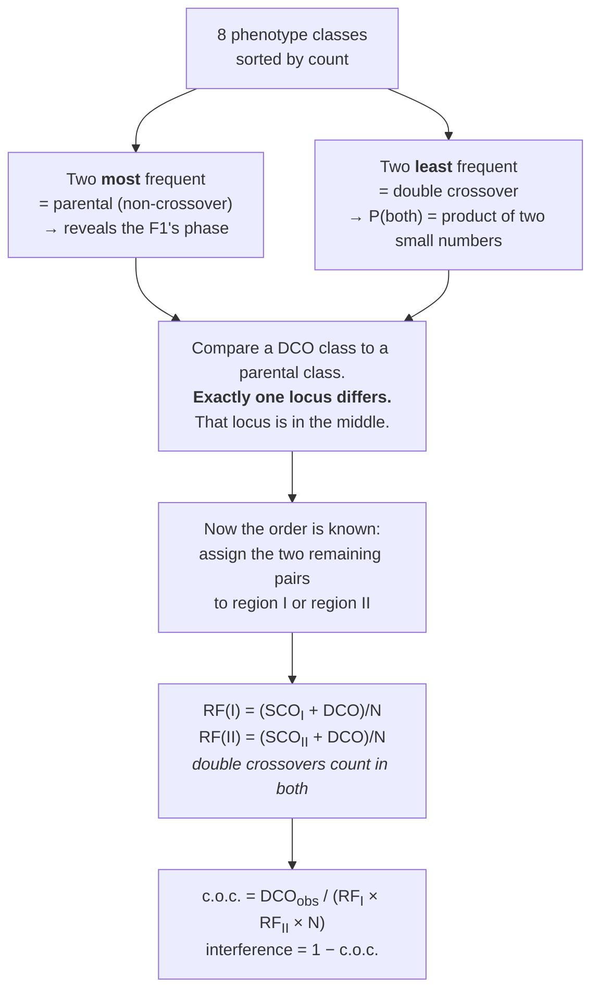

# 14 — Linkage, recombination and mapping

> **Before this:** [Ch 09](09-mitosis-and-meiosis.md) · [Ch 10](10-mendelian-inheritance.md) ·
> [Ch 12](12-probability-and-testing.md) · **Time:** ~50 min
>
> **Statistics needed:** [S2 Distributions](../part-S-statistics/S2-distributions.md)

## What you'll be able to do

- Predict when two loci violate independent assortment, and say why in physical terms
- Classify gametes as parental or recombinant given the parent's coupling or repulsion phase
- Compute a recombination frequency and convert it to map distance, explain why the two are not the same number, and derive the 50% ceiling that forces genetic maps to be assembled from short intervals
- Work a three-point testcross end to end: gene order, both interval distances, coefficient of coincidence, interference
- Sort tetrads into PD, NPD and TT, call linkage from the PD:NPD ratio, and compute map distance by the Perkins equation and centromere distance from second-division asci
- Derive the Haldane mapping function from a Poisson assumption, and say what Kosambi assumes instead
- Explain why 1 cM ≈ 1 Mb is an average that is wrong almost everywhere, and compute and interpret a LOD score

## The core idea

Independent assortment is a fact about **chromosomes**, not about genes. Two loci assort
independently because they sit on different chromosomes, and the chromosomes line up
independently at metaphase I. Put two loci on the *same* chromosome and that mechanism is
gone: they are physically tethered, and they travel to the same gamete unless something cuts
the tether between them.

The thing that cuts the tether is a crossover. Crossovers happen at roughly uniform density
along the chromosome, so **the probability that a crossover falls between two loci grows with
the distance between them.** Measure how often the tether breaks and you have measured a
distance — without knowing what a chromosome is made of, without seeing it, without any
molecular biology whatsoever. This is how the first genome maps were built, two decades
before anyone knew DNA was the genetic material.

The catch is that **the ruler saturates.** Beyond a certain separation the tether breaks so
reliably that two loci on the same chromosome become statistically indistinguishable from two
loci on different chromosomes. The measurement stops scaling. Everything about how genetic
maps are actually constructed is a workaround for that ceiling.

---

## 1. Linkage is a violation of independent assortment

Recall the mechanism ([Ch 09](09-mitosis-and-meiosis.md)): each bivalent orients at random on
the metaphase I plate, independently of every other bivalent. That randomness is the physical
source of Mendel's second law. It applies to loci on different chromosomes and to nothing
else.

Two loci on the same chromosome are **syntenic**. If they are close enough that a crossover
rarely separates them, they are **linked** — a stronger claim, and a measurable one. Loci at
opposite ends of a large chromosome are syntenic but not linked in any detectable sense.

Consider a doubly heterozygous individual. Which alleles are on which physical chromosome —
the **phase** — determines what "recombinant" means:

```
   coupling  (cis)                          repulsion  (trans)

   ── A ————————— B ──  from one parent     ── A ————————— b ──
   ── a ————————— b ──  from the other      ── a ————————— B ──

   parental gametes:    A B  and  a b       parental gametes:    A b  and  a B
   recombinant gametes: A b  and  a B       recombinant gametes: A B  and  a b
```

The four gamete classes are the same in both cases. The *labels* are opposite. Recombinant is
not a property of a gamete; it is a property of a gamete **relative to the chromosomes that
entered the meiosis**. Miss this and every calculation in the chapter inverts.

This is why the **testcross** — heterozygous parent crossed to a homozygous recessive tester —
is the workhorse design. The tester contributes only recessive alleles, so each offspring's
phenotype is a direct readout of the heterozygous parent's gamete: no inference, no dominance
masking anything. You are counting gametes.

## 2. Recombination frequency, and what a centimorgan is

$$\text{RF} = \frac{\text{number of recombinant gametes}}{\text{total gametes}}$$

For unlinked loci, RF = 0.5: the four gamete classes appear in equal numbers, and "parental"
and "recombinant" are labels on an even split. For tightly linked loci, RF ≈ 0.

Sturtevant's insight in 1913 — as an undergraduate in Morgan's lab, reportedly in a single
night, using six X-linked *Drosophila* genes — was that if crossovers occur at roughly uniform
density, then RF is monotone in physical separation, so RF values can be used to **order** loci
along a line and to space them. The first genetic map was a one-dimensional arrangement
inferred entirely from breeding statistics.

The unit is defined to make the bookkeeping trivial:

**1 map unit = 1 centimorgan (cM) = 1% recombination**, for small intervals.

The hedge matters. The centimorgan is properly defined as one hundredth of a **Morgan**, and a
Morgan is the map length over which **one crossover is expected per gamete**. So:

- **map distance** $d$ (in Morgans) = expected number of crossovers per gamete in the interval
- **recombination frequency** $r$ = probability of an *odd* number of crossovers per gamete

These coincide when $d$ is small, because two crossovers in a tiny interval is a
second-order event. They diverge badly when $d$ is large. Keeping $d$ and $r$ mentally
separate is most of what makes this chapter tractable.

## 3. The 50% ceiling, derived twice

**Argument one — four strands.** By the time crossing over happens, each chromosome has
replicated, so a bivalent contains four chromatids. A single crossover involves exactly two of
them:

```
   chromatid 1  ─────────────────────   A ····· B     parental
   chromatid 2  ─────────╳───────────   A ····· b     recombinant
   chromatid 3  ─────────╳───────────   a ····· B     recombinant
   chromatid 4  ─────────────────────   a ····· b     parental
```

One crossover between A and B therefore yields **2 recombinant and 2 parental products from
that meiosis: exactly 50%**. Not 100%. A meiosis in which a crossover is guaranteed to fall
between two loci still produces only half recombinant gametes, and no number of additional
crossovers can push the average above that.

> **Statistics:** the Poisson distribution — including the row where its parameter *is* a
> chromosome's map length in Morgans — is covered in
> [S2](../part-S-statistics/S2-distributions.md) §2.

**Argument two — parity.** Model crossovers along the interval as a Poisson process, and let
$K$ be the number affecting a given chromatid, with mean $d$. A chromatid is recombinant
across the interval if and only if $K$ is **odd** — two crossovers put the flanking markers
back where they started. So

$$r = P(K \text{ odd}) = e^{-d}\left(d + \frac{d^3}{3!} + \frac{d^5}{5!} + \cdots\right) = e^{-d}\sinh d = \frac{1 - e^{-2d}}{2}$$

As $d \to \infty$, $r \to 1/2$ from below. As $d \to 0$, $r \to d$. Both limits are the ones
the biology demands, and we have just derived the Haldane mapping function on the way past —
more on that in §7.

> **RF = 50% does not mean "50 cM apart".** It means the ruler has saturated and returned no
> information. Two loci at opposite ends of chromosome 1 (~280 cM) and two loci on different
> chromosomes give the identical observation. A genetic map is therefore never measured
> directly at long range: it is **built additively out of short intervals**, each one measured
> against markers close enough that multiple crossovers are rare, and then chained. Every
> long genetic distance you have ever seen quoted is a sum, not a measurement.

## 4. Why two-point crosses are not enough

A two-point cross gives you one number per pair of loci. Three loci give three pairwise RFs,
and they will not add up — the outer distance always comes out short, because double
crossovers between the outer pair restore the parental configuration and are silently counted
as non-recombinant:

```
   physical order:   A ————— region I ————— B ————— region II ————— C

   no crossover          A  B  C        parental at every pair
                         a  b  c

   crossover in I        A  b  c        recombinant A–B  and  A–C
                         a  B  C

   crossover in II       A  B  c        recombinant B–C  and  A–C
                         a  b  C

   crossover in I & II   A  b  C   ←──  A and C are back in the parental
                         a  B  c        combination. Invisible to A–C.
                                        Only B has changed partners.
```

Two-point data also cannot establish **order**. RF(A,C) being the largest of three is
suggestive, but with three roughly similar numbers and sampling noise it is not decisive, and
it gives you no way to detect the double crossovers that caused the shortfall.

The three-point cross fixes both problems at once, because that last row of the diagram is
also the signature that identifies the middle locus.

## 5. The three-point testcross

Cross a triply heterozygous parent to a triply homozygous recessive tester. Score the
progeny. There are $2^3 = 8$ classes, in four reciprocal pairs, and the pairs sort themselves
by frequency:



**The middle-locus rule is not a trick.** A double crossover puts one exchange on each side of
the middle marker, physically swapping that marker onto the other chromatid while leaving both
flanks where they were. The DCO class *is* the parental class with the middle locus flipped,
so reading off which locus flipped reads off the order.

**Double crossovers count in both intervals**, because a DCO gamete experienced an exchange in
region I *and* one in region II. Omitting them undercounts both distances — the single most
common arithmetic error in transmission genetics. Even so, the corrected interval distances
remain slight underestimates: a double crossover *within* region I is still invisible. That
residual bias is what mapping functions correct.

## 6. Tetrad analysis: when you can see all four products

Every design so far counts gametes: one product per meiosis, dropped into a pool of millions, and
you rebuild the meiosis statistically from the aggregate. Fungi let you skip the rebuilding.

In *Saccharomyces cerevisiae* and *Neurospora crassa* the four haploid products of one meiosis
stay together inside a sac, the **ascus**. Dissect it, plate the spores separately, and you have
genotyped a single meiosis completely. The exact 2:2 segregation that
[Ch 09](09-mitosis-and-meiosis.md) §7 called deterministic stops being an inference.

Yeast asci are **unordered** — four spores loose in a bag. *Neurospora* asci are **ordered**: the
ascus is barely wider than a spore, so the meiosis I and II spindles cannot slip past one another,
and the row of spores records which product went to which pole — strictly more information, spent
in the last two subsections.

### Unordered tetrads: PD, NPD, TT

Cross *A B* × *a b* and dissect. Only three ascus compositions exist:

```
   parental ditype         non-parental ditype          tetratype
        (PD)                      (NPD)                    (TT)

       A B                        A b                      A B
       A B                        A b                      A b
       a b                        a B                      a B
       a b                        a B                      a b

   2 genotypes,              2 genotypes,             4 genotypes,
   both parental             both recombinant         2 parental, 2 recombinant
```

Derive where each comes from, using nothing but the four-strand picture of §3.

**No crossover in the interval → PD.** Nothing moved.

**One crossover → TT, always.** A crossover joins two *non-sister* chromatids, so exactly two of
the four products are recombinant. That is the 50% ceiling of §3, seen one meiosis at a time.

**Two crossovers → it depends which chromatids they used.** There are four non-sister pairs; the
second exchange reuses the first pair, shares one chromatid with it, or takes the other entirely:

```
   double crossover    chromatids used      tetrad    share
   ────────────────    ───────────────      ──────    ─────
   2-strand            1–3, then 1–3          PD       1/4
   3-strand (a)        1–3, then 1–4          TT       1/4
   3-strand (b)        1–3, then 2–3          TT       1/4
   4-strand            1–3, then 2–4         NPD       1/4
```

so doubles split **1 PD : 2 TT : 1 NPD**. That 1:2:1 says there is no *chromatid* interference — a
different claim from the crossover interference of §7, and empirically close to true.

**NPD therefore has exactly one source: a four-strand double crossover.** Both exchanges must land
in the interval *and* use all four chromatids. It is the tetrad analogue of the three-point cross's
DCO class: rare, and for that reason the most informative row in the table.

| Class | Arises from | Recombinant chromatids | Between linked loci |
|---|---|---|---|
| **PD** | no crossover, or a 2-strand double | 0 of 4 | the bulk of tetrads |
| **TT** | a single crossover, or a 3-strand double | 2 of 4 | intermediate |
| **NPD** | a 4-strand double, and nothing else | 4 of 4 | rare, and second-order in $d$ |

### The linkage test: compare PD with NPD

For loci on **different** chromosomes, PD and NPD come from the same coin: the two bivalents
bi-orient independently at metaphase I, so whichever way the second faces, the tetrad reads PD or
NPD with probability ½ each. Tetratypes come from elsewhere — a crossover between either locus and
*its own* centromere — so TT carries no linkage information at all.

> **PD ≈ NPD ⟹ unlinked. PD ≫ NPD ⟹ linked.**

Throw away TT and what remains is a binomial test of a 1:1 ratio, which behaves far better than
asking whether an observed RF sits below 0.5.

- **The null is a point, not a boundary.** "RF = 0.5" is the *edge* of the parameter space, and
  testing against an edge is awkward — the difficulty that pushes §9 into likelihood ratios.
  "PD = NPD" is an ordinary proportion.
- **No nuisance parameter.** The TT share depends on how far each locus sits from its centromere,
  which has nothing to do with linkage; the PD/NPD comparison never touches it.
- **It saturates later.** Loci 50 cM apart give RF ≈ 0.32 but PD:NPD ≈ 7:1; at 80 cM, RF ≈ 0.40 —
  four-fifths of the way to the ceiling — and PD:NPD is still about 3:1. Both die eventually, as
  NPD approaches PD, but the ratio dies later.

### The mapping formula

Count recombinant chromatids directly. Each PD contributes 0 of 4, each TT 2 of 4, each NPD 4 of 4:

$$\text{RF} = \frac{\text{NPD} + \tfrac{1}{2}\,\text{TT}}{N}$$

Correct as a recombination frequency, and defective for the same reason a two-point cross is: the
doubles you can see (NPD) prove there were doubles you cannot, and those went uncounted.

Fix it by counting **crossovers** instead. Let $S$ be the tetrads with one crossover in the
interval and $D$ those with a double. Every single gives TT; every double splits 1:2:1. So

$$\text{NPD} = \tfrac{1}{4}D \;\Rightarrow\; D = 4\,\text{NPD}, \qquad
  \text{TT} = S + \tfrac{1}{2}D \;\Rightarrow\; S = \text{TT} - 2\,\text{NPD}$$

**Every NPD tetrad you see stands for three double-crossover tetrads you cannot.** Total crossovers
$= S + 2D = (\text{TT} - 2\,\text{NPD}) + 8\,\text{NPD} = \text{TT} + 6\,\text{NPD}$, and that is
crossovers per *tetrad*. Map distance is crossovers per *chromatid*, and each crossover uses 2 of
the 4 — the same halving as §3 — so

$$\boxed{\;d = \frac{\tfrac{1}{2}\,\text{TT} + 3\,\text{NPD}}{N}\ \text{Morgans}\;}$$

the **Perkins equation**, usually printed as $100(\text{TT} + 6\,\text{NPD})/2N$ cM. The ½ is the
four-strand factor. The 3 is 6/2, and the 6 is the 8 crossovers carried by the $4\,\text{NPD}$
double-crossover tetrads, less the $2\,\text{NPD}$ of them already counted once inside TT.

What comes out is a **map distance**, not a recombination frequency (§2), and it is not bounded by
0.5. It corrects for double crossovers *inside* the interval — the residual bias §5 could only
flag, and what §7 attacks from the other side. The difference is the evidence: a mapping function
assumes a crossover distribution and infers the hidden doubles; Perkins counts them, because NPD
makes a quarter of them visible.

**Worked.** 200 yeast tetrads from a two-marker cross: PD = 130, NPD = 4, TT = 66.

```
   linkage test    130 vs 4 against 1:1          binomial p ≈ 6 × 10⁻³⁴   → linked
   naive RF        (4 + 66/2) / 200   = 0.185    → 18.5%
   Perkins         (66/2 + 3×4) / 200 = 0.225 M  → 22.5 cM
   recovered       D = 4 × 4 = 16 doubles,  S = 66 − 8 = 58 singles,
                   130 − 4 = 126 tetrads with no crossover;  126 + 58 + 16 = 200 ✓
```

Hand the naive 0.185 to the §7 mapping functions and Haldane returns 23.1 cM, Kosambi 19.4 cM.
Perkins' 22.5 lands beside Haldane, and should: both assume crossovers are independent.

### Ordered tetrads: distance to the centromere

Now spend the spore order. Score one locus and ask only *when* its two alleles separated:

```
   no crossover between locus              a crossover between them
   and centromere
   → alleles part at meiosis I             → alleles part at meiosis II

   FIRST-DIVISION SEGREGATION              SECOND-DIVISION SEGREGATION

      A A A A a a a a                         A A a a A A a a
      └──── 4 : 4 ────┘                       └── 2 : 2 : 2 : 2 ──┘

                                           (or 2 : 4 : 2 — the block of four
                                            A spores is broken either way)
```

Eight spores, not four: a post-meiotic mitosis doubles each product and the pair stays adjacent.

A crossover between the locus and the centromere joins two non-sister chromatids, so **two of the
four products** end up attached to the centromere they did not start with. A second-division ascus
is half recombinant, exactly as in §3. Convert asci to chromatids by halving:

$$d_{\text{centromere}} = \frac{1}{2}\cdot\frac{\text{second-division asci}}{\text{total asci}}$$

24 second-division asci in 100 gives ½ × 0.24 = 0.12 M = **12 cM** to the centromere. The
measurement saturates at ⅔ second-division asci and therefore at 33.3 cM — the ceiling of §3 in
different clothing.

This is the only classical method that measures a distance to something you cannot mutate. There is
no centromere allele to score; the ordered ascus reports the position of a *structure*.

### Gene conversion, observed rather than inferred

2:2 is not a statistical expectation. One allele per homolog, replicated once, four products — the
ratio is mechanically forced. So an ascus reading **3:1** (6:2 among the eight spores) states that
one allele was overwritten by the other, and **5:3** states that one product carried an unrepaired
mismatch through the post-meiotic mitosis, leaving its two spores disagreeing. Non-reciprocal
transfer, on the bench, in a count.

None of it survives pooling: a 3:1 ascus and a 1:3 ascus cancel in a gamete count, which is why
gene conversion stayed invisible until someone kept the four products together.
[Ch 18 §5](../part-03-genome-instability/18-recombination-mechanisms.md) takes these ratios as its
evidence and supplies the heteroduplex and mismatch repair behind them.

### For the programmer

A testcross is a **sampled aggregate over runs**: one output per run, and you recover the
distribution from the marginals. A tetrad is the **complete output of one run** — the joint
distribution, not the marginal.

That is why fewer meioses buy more information. A four-strand double crossover emits four
recombinant chromatids, and loose in a gamete pool they look like four ordinary ones; the event is
identifiable only because you know they came from the same run. Same data volume, strictly more
structure — and the structure is where the doubles, the centromere and the conversions live.

## 7. Interference and mapping functions

If crossovers were independent along the chromosome, the expected number of double crossovers
would be $N \times \text{RF}_\text{I} \times \text{RF}_\text{II}$. They are not independent. Define

$$\text{c.o.c.} = \frac{\text{observed DCO}}{\text{expected DCO}}, \qquad I = 1 - \text{c.o.c.}$$

Almost universally $I > 0$: **positive interference**, a crossover suppressing others nearby.
It is strong and long-range — in humans the inhibition extends over tens of megabases, which
is why most chromosome arms receive close to one crossover and rarely more, and why the
**obligate crossover** (at least one per bivalent, needed for correct segregation) is a
constraint the cell can nearly saturate. The mechanism belongs to
[Ch 18](../part-03-genome-instability/18-recombination-mechanisms.md); here it is a parameter.

Now turn that parameter into a mapping function. Take an interval of map length $d$ with
recombination fraction $r$, and extend it by an infinitesimal $\delta$. The extended interval
is recombinant iff **exactly one** of the two pieces is. Let $c$ be the coefficient of
coincidence between the two pieces, so that
$P(\text{rec in } \delta \mid \text{rec in } d) = c\,\delta$ and hence
$P(\text{rec in } \delta \wedge \text{not rec in } d) = \delta - c r \delta$:

$$r(d+\delta) = \underbrace{r\,(1 - c\delta)}_{\text{rec in } d \text{ only}} + \underbrace{(\delta - c r \delta)}_{\text{rec in } \delta \text{ only}} = r + \delta\,(1 - 2cr)$$

Taking $\delta \to 0$:

$$\boxed{\;\frac{dr}{dd} = 1 - 2\,c(r)\,r\;}$$

Every mapping function in use is a choice of $c(r)$:

| Function | Assumption | $c(r)$ | ODE | Solution |
|---|---|---|---|---|
| **Morgan** | complete interference | $0$ | $r' = 1$ | $r = d$ — only valid for tiny $d$ |
| **Haldane** (1919) | no interference; Poisson crossovers | $1$ | $r' = 1 - 2r$ | $r = \tfrac{1}{2}(1 - e^{-2d})$, &nbsp; $d = -\tfrac{1}{2}\ln(1-2r)$ |
| **Kosambi** (1944) | interference decaying with distance | $2r$ | $r' = 1 - 4r^2$ | $r = \tfrac{1}{2}\tanh(2d)$, &nbsp; $d = \tfrac{1}{4}\ln\!\frac{1+2r}{1-2r}$ |

Haldane's $c = 1$ is the same "crossovers are independent" assumption that produced the
Poisson derivation in §3 — the two routes agree, as they must. Kosambi's $c = 2r$ is an
empirical fit with the right shape: interference is complete for adjacent loci ($r \to 0
\Rightarrow c \to 0$) and absent for distant ones ($r \to 0.5 \Rightarrow c \to 1$). It has no
mechanistic derivation and does not need one.

Both are strictly increasing, both send $r = 0.5$ to $d = \infty$, and both are near-identities
below about 10 cM. Above that Haldane inflates distances, because it credits the data with
hidden double crossovers that interference actually prevented. In organisms with real
interference — which is most of them — Kosambi is the better default.

## 8. Genetic distance is not physical distance

They are different rulers measuring different things: a centimorgan is a **probability of
exchange**, a megabase is a **count of nucleotides**. The conversion between them is a local
property of the genome, and treating it as a constant is one of the more expensive habits in
applied genomics.

| Quantity | Value |
|---|---|
| Human sex-averaged autosomal map | ~3,400–3,500 cM |
| Male (paternal) map | ~2,600–2,700 cM · ~26 crossovers per sperm |
| Female (maternal) map | ~4,200–4,400 cM · ~42 crossovers per egg |
| Genome-wide average rate | ~1.2 cM/Mb, i.e. **1 cM ≈ 0.8–1 Mb** |
| Hotspot width | ~1–2 kb |
| Hotspots detected genome-wide | ~30,000–50,000 |
| Share of recombination in hotspots | ~80% of events in <15% of the sequence |

The "crossovers per gamete" column is not an extra fact — it is the definition of the Morgan
applied to the whole genome. A 2,600 cM map is 26 Morgans is 26 expected crossovers per
gamete. Cytological counts agree once you correct for strandedness: about 50 crossover sites
are visible per human spermatocyte, and each involves 2 of 4 chromatids, so each gamete
inherits about half of them.

The non-uniformity is severe, and structured:

- **Hotspots.** Recombination is concentrated into short intense intervals separated by long
  cold deserts. Locally the rate spans several orders of magnitude around the average.
- **PRDM9.** In humans and mice, hotspot *location* is largely specified by PRDM9 — a
  meiosis-specific protein carrying a DNA-binding zinc-finger array and a histone
  methyltransferase domain. It binds a sequence motif and deposits H3K4me3, marking the site
  for a programmed double-strand break. A 13-bp degenerate motif matching the common human
  *PRDM9* allele sits at roughly 40% of human hotspots. The zinc-finger array is among the
  fastest-evolving sequences in the genome, and for a self-defeating reason: repairing the
  break it initiates copies the *other* chromosome's sequence across the site, so a hotspot
  allele erodes its own binding sites and the protein must keep changing. Consequence —
  **hotspot positions are not conserved between humans and chimpanzees**, though the
  broad-scale map is.
- **Position and sex.** Rates are suppressed around centromeres and elevated toward telomeres.
  Male and female meiosis then differ in two ways that are easy to run together. **Count:** the
  female map is ~1.6× longer because female meiosis designates more crossovers per bivalent —
  about 70 MLH1 foci per oocyte against about 49 per spermatocyte, the ~42 versus ~26 per
  gamete in the table above. **Distribution:** the position bias is far stronger in male
  meiosis, where crossovers cluster subtelomerically, while female crossovers are spread more
  evenly. These are parallel sexually dimorphic features, not one causing the other. Map length
  is a count of crossovers; redistributing them along the chromosome does not change the total.

So: use a genetic map, not a multiplier. Averaged over the genome 1 cM ≈ 1 Mb; at any
particular locus that estimate can be wrong by more than an order of magnitude either way.

## 9. LOD scores: linkage analysis in humans

Humans do not permit testcrosses, family sizes are small, and phase is frequently unknown.
The response is to stop counting recombinants and start comparing likelihoods.

> **Statistics:** everything below is derived here from the binomial alone
> ([S2](../part-S-statistics/S2-distributions.md) §1), so you do not need the likelihood track
> yet. When you reach it, [S6](../part-S-statistics/S6-likelihood-and-bayes.md) §§1–4 recomputes
> this same LOD score in code and puts it in its general setting.

For a recombination fraction $\theta$, define

$$Z(\theta) = \log_{10}\frac{L(\theta)}{L(0.5)}$$

— the base-10 log of the odds that the observed inheritance pattern arose under linkage at
$\theta$ versus under no linkage. For $n$ fully informative, phase-known meioses of which $k$
are recombinant, the likelihood is binomial and the constant cancels:

$$Z(\theta) = \log_{10}\frac{\theta^k (1-\theta)^{n-k}}{0.5^{\,n}}, \qquad \hat\theta = \frac{k}{n}$$

Two properties make this workable.

**LOD scores add across independent families.** Log-likelihoods add, so a laboratory could
publish a table of $Z(\theta)$ for its pedigree and another laboratory could sum it with its
own. In the decades before cheap computing, this additivity is what made human linkage
analysis a collective enterprise at all.

> **Statistics:** combining a likelihood ratio with a prior to get posterior odds is
> [S6](../part-S-statistics/S6-likelihood-and-bayes.md) §5; §4 there runs this exact 1:50
> calculation.

**The threshold is a Bayesian statement, not a p-value.** Morton's conventional cutoff
$Z_{\max} \ge 3.0$ means the data are 1,000× more likely under linkage. But two loci picked at
random are rarely linked — with 22 autosome pairs and a ~3,400 cM map, the prior odds are
roughly 1:50. So

$$\text{posterior odds} \approx \frac{1}{50} \times 1000 = 20{:}1 \;\Rightarrow\; \approx 5\%\ \text{false positives}$$

The famous "3" is a 1,000:1 likelihood ratio deliberately chosen to survive a 50:1 prior
against. Symmetrically, $Z(\theta) \le -2.0$ (100:1 against) **excludes** linkage at that
$\theta$ — and exclusion mapping was historically as useful as detection. For a genome-wide
scan the multiple-testing burden pushes the bar up, and how far depends on the design. Lander
and Kruglyak's 1995 guidelines put genome-wide significance for **lod score analysis in fully
informative human pedigrees at 3.3**, with 1.9 as merely suggestive; for **allele-sharing
(affected sib-pair) scans the significant threshold is 3.6**, with 2.2 suggestive. The pairs
go together — quoting a threshold from one row of that table against the suggestive figure
from another describes no study anyone actually ran.

## 10. Forward: from pedigrees to populations

Everything above tracks recombination through one or two meioses of a known pedigree. Run the
same process for hundreds of generations in a population and the accounting changes but the
physics does not: alleles at nearby loci remain statistically associated because too few
crossovers have accumulated between them to randomise their pairing. That residual association
is **linkage disequilibrium** ([Ch 29](../part-05-population-genetics/29-linkage-disequilibrium.md)),
and it is the reason a genotyping array reading one variant per few kilobases can tag almost
all common variation — which is the entire operating premise of GWAS
([Ch 51](../part-11-human-and-statistical-genomics/51-gwas.md)).

Linkage disequilibrium is the population-level signature that linkage leaves behind when too few
meioses have separated nearby alleles. The two are not the same statement. Linkage is a property
of two loci — a distance along a chromosome, fixed for the species. LD is a property of allele
*combinations* in a particular population, and so it also encodes that population's history:
admixture, drift and selection can generate strong LD between loci on different chromosomes, and
two tightly linked loci sit at complete equilibrium if no founder haplotype ever coupled their
alleles. Linkage is necessary for LD to persist, not sufficient for it to exist.

What the change of timescale buys is resolution. Linkage has long range and low resolution; LD
has short range and high resolution, because population history has supplied millions of meioses
instead of ten.

---

## Common misconceptions

| What people think | What's actually true |
|---|---|
| Linked genes are always inherited together | Only probabilistically. Linkage sets the *rate* at which the association breaks; at 20 cM, one gamete in five is recombinant |
| RF = 50% means the loci are far apart on the same chromosome | It means the measurement saturated. Unlinked and very-distantly-linked are indistinguishable by RF, which is precisely why maps are chained from short intervals |
| Map distance and recombination frequency are the same thing | Equal only in the small-distance limit. $d$ counts expected crossovers; $r$ counts odd numbers of them. $r$ is bounded by 0.5; $d$ is unbounded |
| A recombinant gamete carries a new allele | It carries a new *combination* of existing alleles. Recombination creates no new variants — only mutation does ([Ch 16](../part-03-genome-instability/16-mutation.md)) |
| "Recombinant" is a property of the gamete | It is defined relative to the parent's phase. The same *A b* gamete is recombinant from a coupling parent and parental from a repulsion parent |
| The rarest class in a three-point cross is a sampling accident | It is the double-crossover class, and it is the most informative row in the table — it determines gene order |
| Double crossovers can be ignored | They are why two-point distances fail to add, and omitting them from both interval counts is the standard arithmetic error |
| NPD tetrads are just unusually lopsided tetratypes | They have one origin and one only — a four-strand double crossover — so they are second-order rare and diagnostic rather than noisy. Each NPD you observe stands for three double-crossover tetrads you cannot, which is the entire content of the 3 in the Perkins equation |
| 1 cM = 1 Mb | A genome-wide average that is locally wrong by orders of magnitude. Recombination is concentrated in ~1–2 kb hotspots; centromeric regions are near-silent |
| Recombination hotspots are conserved features of the sequence | In humans and mice they are positioned by PRDM9, whose binding array evolves extremely fast. Human and chimpanzee hotspots barely overlap |
| A LOD of 3 means p < 0.001 | It is a likelihood ratio of 1,000:1, chosen to overcome a ~50:1 prior against linkage. The resulting error rate is nearer 5% — and for a genome scan the bar is higher still |

## Worked example: a complete three-point testcross

Three recessive markers on *Drosophila* chromosome 3: *scarlet* (*st*, bright red eyes),
*spineless* (*ss*, small bristles), *ebony* (*e*, dark body). A female heterozygous for all
three is testcrossed to a triple-recessive male, and 1,000 progeny are scored.

(*Drosophila* males do not undergo crossing over at all, so the heterozygous parent in a
mapping cross must be the female. The counts below are constructed for clean arithmetic; the
answer lands within half a centimorgan of the published *Drosophila* map.)

The loci are listed in the columns in an **arbitrary** order — deducing the true order is part
of the exercise. `+` denotes the wild-type allele.

```
   ss     e     st      count
  ────  ────  ────     ──────
   +     +     +          372
   ss    e     st         367
   +     +     st          72
   ss    e     +           69
   ss    +     st          57
   +     e     +           54
   ss    +     +            5
   +     e     st           4
                        ──────
                          1000
```

**Step 1 — parentals.** The two largest classes are `+ + +` (372) and `ss e st` (367), summing
to 739. The heterozygous mother was therefore in **coupling**: one chromosome carried all three
mutant alleles, the other all three wild-type alleles.

**Step 2 — double crossovers.** The two smallest classes are `ss + +` (5) and `+ e st` (4),
summing to 9.

**Step 3 — gene order.** Compare a DCO class to the parental class it most resembles:

```
   parental   +   +   +
   DCO        ss  +   +
              ↑
              only the ss locus has changed
```

(The reciprocal pair agrees: parental `ss e st` versus DCO `+ e st` also differs only at *ss*.)
A double crossover flips the middle marker and leaves the flanks alone, so ***ss* is in the
middle** and the order is **_st_ – _ss_ – _e_**. Call *st*–*ss* region I and *ss*–*e* region II.

**Step 4 — assign every class.** Rewrite each genotype in map order:

| Class (in map order *st ss e*) | Count | Crossover in |
|---|---|---|
| `+ + +` | 372 | — (parental) |
| `st ss e` | 367 | — (parental) |
| `st + +` | 72 | region I |
| `+ ss e` | 69 | region I |
| `st ss +` | 57 | region II |
| `+ + e` | 54 | region II |
| `+ ss +` | 5 | I and II |
| `st + e` | 4 | I and II |

Single crossovers in region I total 141; in region II, 111; doubles, 9.

**Step 5 — interval distances.** Double crossovers experienced an exchange in *both* regions,
so they count in both:

$$\text{RF}_{st\text{–}ss} = \frac{141 + 9}{1000} = 0.150 \;\Rightarrow\; \textbf{15.0 cM}$$
$$\text{RF}_{ss\text{–}e} = \frac{111 + 9}{1000} = 0.120 \;\Rightarrow\; \textbf{12.0 cM}$$

giving the map

```
   st ──────────── 15.0 cM ──────────── ss ────────── 12.0 cM ────────── e
   |←──────────────────────── 27.0 cM ───────────────────────────────→|
```

**Step 6 — what a two-point cross would have said.** Score *st* against *e* alone. The DCO
classes `+ ss +` and `st + e` are parental for that pair — the middle marker is invisible in a
two-point cross:

$$\text{RF}_{st\text{–}e} = \frac{72 + 69 + 57 + 54}{1000} = 0.252 \;\Rightarrow\; 25.2\%$$

against the additive 27.0 cM. The shortfall is exactly $2 \times \text{DCO}/N = 1.8\%$: each
double crossover costs *two* recombinants that should have been counted. **This is why maps
are additive sums of short intervals rather than long-range measurements.**

**Step 7 — interference.**

$$\text{expected DCO} = 0.150 \times 0.120 \times 1000 = 18 \qquad \text{observed} = 9$$
$$\text{c.o.c.} = \frac{9}{18} = 0.5, \qquad I = 1 - 0.5 = \textbf{0.5}$$

Half the double crossovers expected under independence were suppressed.

**Step 8 — mapping functions on the two-point estimate.** Suppose all we had was
$r_{st\text{–}e} = 0.252$. What distance does each function recover?

$$\text{Haldane: } d = -\tfrac{1}{2}\ln(1 - 0.504) = -\tfrac{1}{2}\ln(0.496) = 0.351 \text{ M} = 35.1 \text{ cM}$$
$$\text{Kosambi: } d = \tfrac{1}{4}\ln\frac{1.504}{0.496} = \tfrac{1}{4}\ln(3.032) = 0.277 \text{ M} = 27.7 \text{ cM}$$

The truth from the three-point data is 27.0 cM. Haldane overshoots by 30% because it assumes
no interference and therefore inflates the number of hidden double crossovers; Kosambi, which
assumes interference of roughly the magnitude actually present, lands within 0.7 cM. That gap
is the practical case for Kosambi, and a reminder that a mapping function is a model with an
assumption you can check.

## Connections

- **Back to:** [Ch 09](09-mitosis-and-meiosis.md) supplies the crossover itself and the
  four-strand bivalent that gives the 50% ceiling · [Ch 10](10-mendelian-inheritance.md) gives
  independent assortment, which this chapter breaks · [Ch 12](12-probability-and-testing.md)
  supplies the χ² test for "is RF significantly below 0.5?" · [Ch 13](13-sex-linkage.md)
  explains why X-linked markers were mapped first, and why the pseudoautosomal region has an
  extraordinary recombination rate
- **Forward to:** [Ch 18](../part-03-genome-instability/18-recombination-mechanisms.md) — the
  molecular machinery: double-strand breaks, Holliday junctions, gene conversion, and where
  interference comes from; [Ch 18 §5](../part-03-genome-instability/18-recombination-mechanisms.md)
  in particular runs on the aberrant 3:1 and 5:3 asci of §6, which are the only place
  non-reciprocal transfer is *observed* rather than inferred, and supplies the heteroduplex and
  mismatch repair that produce them ·
  [Ch 20A](../part-03-genome-instability/20A-bacterial-and-phage-genetics.md) — mapping with no
  meiosis at all: time of entry in minutes, and cotransduction frequency *C* = (1 − *d*/*L*)³,
  which has to be inverted to *d* = *L*(1 − *C*<sup>1/3</sup>) before distances add — the same
  non-additivity that Haldane and Kosambi correct here, arising from a completely different
  mechanism · [Ch 15](15-pedigrees.md) — LOD analysis applied to real human
  families · [Ch 29](../part-05-population-genetics/29-linkage-disequilibrium.md) — the same
  physics over population time · [Ch 32](../part-06-quantitative-genetics/32-mapping-quantitative-traits.md)
  — LOD scores generalised to continuous traits (QTL mapping) ·
  [Ch 51](../part-11-human-and-statistical-genomics/51-gwas.md) — association mapping, which
  works only because recombination is slow enough to leave haplotypes intact ·
  [Ch 54](../part-11-human-and-statistical-genomics/54-rare-variants-and-mendelian-disease.md)
  — linkage's successor for finding Mendelian disease genes

## Check yourself

**1. Two loci are 40 cM apart on the same chromosome. You cross a coupling-phase double heterozygote to a tester. What recombination frequency do you expect to observe, and what does that imply for detecting the linkage?**

<details><summary>Answer</summary>

Not 40%. Map distance is additive, but recombination frequency is not — apply a mapping
function. Kosambi: $r = \tfrac{1}{2}\tanh(2 \times 0.40) = \tfrac{1}{2}\tanh(0.80) = 0.332$.
Haldane: $r = \tfrac{1}{2}(1 - e^{-0.8}) = 0.275$.

Either way you observe roughly 28–33% recombinants, comfortably below 50% but detectable only
with a decent sample: testing $r = 0.33$ against the null of 0.5 needs on the order of a
hundred progeny for convincing significance. At 60–70 cM the observed RF would sit somewhere
around 35–44% depending on the mapping function — Haldane gives 0.349 and 0.377, Kosambi 0.417
and 0.443 — and you would need many hundreds to a few thousand progeny to distinguish that from
independent assortment. Which is why the loci are instead tied together through intermediate
markers.

</details>

**2. In a three-point testcross, why are the double-crossover classes the rarest — and what makes them the most informative?**

<details><summary>Answer</summary>

Rarest because a DCO requires an exchange in region I *and* one in region II. Under
independence its probability is the product of two fractions each well below 0.5, so it is
second-order small; positive interference makes it rarer still.

Most informative because the DCO is the *only* class that isolates the middle marker. A double
crossover flips the middle locus and leaves both flanks in their parental combination, so
comparing a DCO class to a parental class identifies the middle locus in a single step. No
amount of two-point data does this.

</details>

**3. A three-point testcross of 400 progeny, order A–B–C, gives RF(A–B) = 0.10 and RF(B–C) = 0.20, with 6 double-crossover progeny. Compute the coefficient of coincidence, and predict what a two-point A–C cross on the same 400 progeny would report.**

<details><summary>Answer</summary>

Expected DCO $= 0.10 \times 0.20 \times 400 = 8$. Observed 6, so c.o.c. $= 6/8 = 0.75$ and
interference $I = 0.25$ — weak, as it usually is over intervals this wide.

For the two-point figure, note this is an identity within a single dataset, not a second
estimate. Recombinants for A–B number $0.10 \times 400 = 40$, of which 6 are doubles, so 34 are
single crossovers in region I; likewise $80 - 6 = 74$ singles in region II. The DCO progeny are
*parental* for the outer pair, so

$$\text{RF}_{A\text{–}C} = \frac{34 + 74}{400} = 0.27 = \text{RF}_{A\text{–}B} + \text{RF}_{B\text{–}C} - \frac{2 \times \text{DCO}}{N}$$

The two-point cross reports 27%, against an additive map distance of 30 cM: it loses exactly
two recombinants per double crossover. If you ever see three pairwise RFs from one cross that
*do* satisfy $r_{AC} = r_{AB} + r_{BC}$, either there were no double crossovers or someone has
miscounted.

</details>

**4. A recombination map says a 500 kb region contains 3 cM, while a different 500 kb region on the same chromosome contains 0.05 cM. Nothing is wrong with the map. Explain.**

<details><summary>Answer</summary>

Recombination is not uniform along DNA — the assumption behind "RF is proportional to
distance" holds only on average and over long stretches. The 3 cM region almost certainly
contains one or more PRDM9-directed hotspots: 1–2 kb intervals with rates orders of magnitude
above background, which collectively carry ~80% of all crossovers in under 15% of the
sequence. The 0.05 cM region is a cold desert, plausibly pericentromeric, where crossing over
is actively suppressed.

Practical consequence: never convert cM to Mb with a constant. Use a published genetic map.
The same non-uniformity is what makes LD block structure blocky
([Ch 29](../part-05-population-genetics/29-linkage-disequilibrium.md)) rather than smoothly
decaying.

</details>

**5. You have 20 fully informative phase-known meioses in a family, 3 of them recombinant between a marker and a disease locus. Compute the maximum LOD score. Is this linkage?**

<details><summary>Answer</summary>

$\hat\theta = 3/20 = 0.15$, and

$$Z(0.15) = \log_{10}\frac{0.15^3 \times 0.85^{17}}{0.5^{20}} = \log_{10}\frac{2.130 \times 10^{-4}}{9.537 \times 10^{-7}} = \log_{10}(223) = 2.35$$

Below the conventional 3.0 threshold, so **not yet significant** — suggestive, and not
publishable as linkage. It is also not an exclusion: $Z > -2$.

The remedy is more meioses, and the useful property is additivity. A second family of the same
size and outcome contributes another 2.35 for a total of 4.70, comfortably over both the
classical 3.0 and Lander–Kruglyak's genome-wide 3.3. LOD scores from independent families sum
because log-likelihoods sum — the feature that made human linkage analysis a collaborative,
cumulative activity long before it was a computational one.

</details>

**6. A yeast cross of *a*<sup>+</sup> *b*<sup>+</sup> × *a b* gives 400 dissected tetrads: 262 PD, 6 NPD, 132 TT. Are the loci linked? Give the map distance both by the recombinant count and by the Perkins equation, and account for the difference. Separately, 100 ordered *Neurospora* asci scored for a marker *m* show 24 with second-division segregation — how far is *m* from its centromere?**

<details><summary>Answer</summary>

**Linked, decisively.** Under the unlinked null, PD and NPD are a fair 1:1 split of the 268
ditype asci. Observing 6 or fewer NPD has probability about 1 × 10⁻⁶⁹. Note that the 132 TT
never entered the test — TT frequency is set by the two gene–centromere distances, not by
linkage.

**Recombinant count.** Each NPD is 4 recombinant chromatids of 4, each TT is 2 of 4:

$$\text{RF} = \frac{6 + \tfrac{1}{2}(132)}{400} = \frac{72}{400} = 0.180 \;\Rightarrow\; 18.0\%$$

**Perkins.**

$$d = \frac{\tfrac{1}{2}(132) + 3(6)}{400} = \frac{66 + 18}{400} = 0.210 \text{ M} = \textbf{21.0 cM}$$

**Where the 3 cM went.** Recover the crossover classes: $D = 4 \times 6 = 24$ double-crossover
tetrads, $S = 132 - 12 = 120$ singles, and $262 - 6 = 256$ tetrads with no crossover at all —
which sums to 256 + 120 + 24 = 400 ✓. Those 24 doubles split 6 PD + 12 TT + 6 NPD, contributing
0 + 24 + 24 = 48 recombinant chromatids of the 96 they contain: an average of 2 per tetrad,
indistinguishable from a single crossover. But they carry 48 crossovers, twice what 24 singles
would. Counting recombinants cannot see the difference; counting crossovers can. Subtracting the
two formulas shows the gap is always exactly $2\,\text{NPD}/N = 12/400 = 0.030$ — the tetrad
version of the shortfall in Step 6 of the worked example. For comparison, feeding 0.180 to the
§7 mapping functions gives Haldane 22.3 cM and Kosambi 18.8 cM; Perkins sits beside Haldane,
since both assume no interference.

**Centromere distance.**

$$d_{\text{centromere}} = \frac{1}{2}\cdot\frac{24}{100} = 0.12 \text{ M} = \textbf{12 cM}$$

Not 24 cM. A single crossover between *m* and its centromere involves 2 of the 4 chromatids, so
a second-division ascus is half recombinant; 24 is a count of *asci* and the map wants a count of
*chromatids*. The same halving would flag a reported value of, say, 31 cM as suspect, because
second-division asci top out at ⅔ and this estimator therefore saturates at 33.3 cM.

</details>
