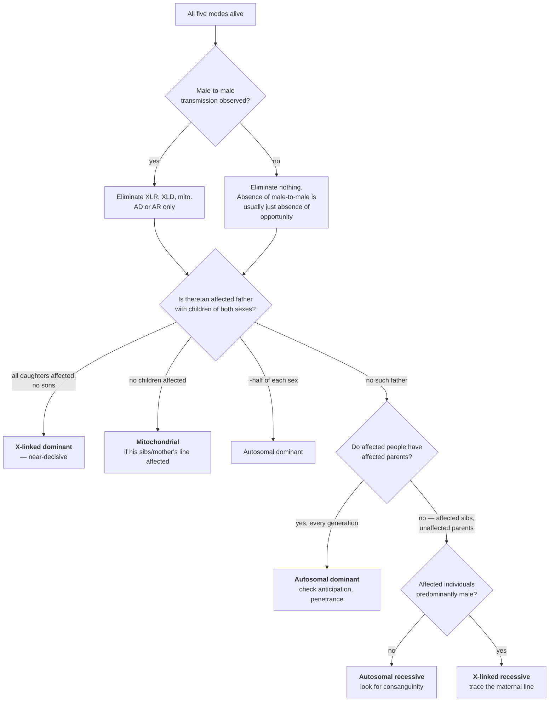

# 15 — Pedigrees and human inheritance

> **Before this:** [Ch 09](09-mitosis-and-meiosis.md) · [Ch 10](10-mendelian-inheritance.md) · [Ch 11](11-beyond-mendel.md) · [Ch 12](12-probability-and-testing.md) · [Ch 13](13-sex-linkage.md) · **Time:** ~45 min
>
> **Statistics needed:** [S1 Probability](../part-S-statistics/S1-probability.md) ·
> [S2 Distributions](../part-S-statistics/S2-distributions.md)

## What you'll be able to do

- Read and draw a pedigree in standard notation, including consanguinity loops and obligate carriers
- Assign a mode of inheritance from a pedigree, and state which observations are decisive and which are merely suggestive
- Explain why reduced penetrance, de novo mutation, germline mosaicism, imprinting and anticipation each break a specific step of that assignment
- Compute a carrier risk with a full prior / conditional / joint / posterior table, updating on unaffected offspring and on a test with imperfect sensitivity
- Compute the coefficient of inbreeding *F* from a pedigree loop by path counting, and convert it into a recessive-disease risk
- Say precisely what a risk figure does and does not determine about a reproductive decision

## The core idea

You cannot cross humans. Everything Chapter 10 does with 600 pea plants and a designed mating scheme has to be replaced, in humans, by an **observational study on a sample of about a dozen people, whom you were shown precisely because one of them is affected.**

That single sentence generates the whole subject. Pedigree analysis is model selection under three brutal handicaps: tiny *n*, no control over the design, and non-random ascertainment. The correct frame is not "read the diagram and name the pattern". It is:

**There are five generative models. Each assigns a likelihood to the observed pattern of affected and unaffected individuals. Compute those likelihoods, weight them by prior plausibility, and report a posterior — over modes, and then over the risk you actually care about.**

> **Statistics:** the likelihood of data under a hypothesis, likelihood ratios as units of
> evidence, and priors and posteriors are covered in
> [S6](../part-S-statistics/S6-likelihood-and-bayes.md) §1, §4 and §5.

Sometimes the likelihood is concentrated on one model and the answer looks obvious. Far more often it is spread across three, and the honest output is a distribution rather than a label.

> **A pedigree is not a diagnosis.** It is a likelihood surface over a handful of generative models, evaluated on a biased sample of maybe a dozen individuals. Treat every mode assignment as provisional until molecular data arrives — and treat every risk figure as conditional on a mode assignment that may be wrong.

---

## 1. Notation

The notation is a century old, largely standardised, and worth learning exactly, because pedigrees are drawn to be read by other people under time pressure.

| Symbol | Meaning |
|---|---|
| □ | male | 
| ○ | female |
| ◇ | sex unknown or unspecified |
| ■ ● ◆ | affected (filled) |
| ⊡ | carrier of an autosomal recessive allele (dot in centre) |
| ⊙ | carrier of an X-linked recessive allele (dot in centre) |
| □̸ | deceased (diagonal line through the symbol) |
| ═══ | mating line joining two partners |
| ═════ (doubled) | consanguineous mating |
| ─┴─ | sibship line; children hang below it, oldest on the left |
| ↗ or *P* | the **proband** — the affected individual through whom the family came to attention |
| arrow labelled *consultand* | the person asking for the risk estimate |

Generations are numbered with Roman numerals from the top; individuals within a generation with Arabic numerals from the left. So "III-2" is unambiguous.

Here is the family used throughout this chapter. It is a real-shaped pedigree for an X-linked recessive condition — Duchenne muscular dystrophy, caused by loss-of-function variants in *DMD* at Xp21.2–p21.1.

```
   I        □ ════════ ○
           I-1        I-2
                 │
       ┌─────────┴─────────┐
  II   ■                   ○ ════ □
      II-1                II-2   II-3
     d. 22 yr                 │
                   ┌──────────┴──────────┐
 III               ■                     ○ ════ □
                 III-1                 III-2  III-3
               d. 19 yr            (consultand)
                                             │
                                      ┌──────┼──────┐
  IV                                  □      □      □
                                     IV-1   IV-2   IV-3
                                     14 yr  11 yr  7 yr
```

Two people here are **obligate carriers** — individuals whose genotype is forced by the pedigree without any test. II-2 must carry the allele, because she has both an affected brother and an affected son. I-2 must carry it for the same kind of reason — two affected males in her maternal line: her son II-1, and her grandson III-1 through her daughter II-2. Note what is *not* sufficient: a single affected son. That boy's variant could have arisen de novo in the oocyte, which happens in about a third of cases (§4). Two affected males related through her make that coincidence implausible. Even then "obligate" is a shade too strong — an obligate carrier could in principle be a germline mosaic rather than a constitutional heterozygote, which is the standard clinical caveat and the subject of §4.

III-2, the consultand, is not obligate anything. Her carrier probability is what §5 and the worked example compute.

## 2. The five modes and their signatures

Every signature below is *derived* from the transmission rules. Derive them once and the summary table becomes redundant.

**Autosomal dominant.** One copy suffices; the locus is autosomal, so sex is irrelevant to both having it and passing it. Therefore: every affected person has an affected parent (unless the variant is de novo — §4); the trait appears in every generation — **vertical** transmission; **male-to-male transmission occurs**, which is the observation that kills X-linkage; affected × unaffected gives 1/2 affected regardless of sex. Huntington disease (*HTT*), achondroplasia (*FGFR3*), Marfan syndrome (*FBN1*), familial hypercholesterolaemia (*LDLR*).

**Autosomal recessive.** Two copies required, and heterozygotes are silent, so the allele travels invisibly. Therefore: affected individuals cluster *within* a sibship and generations are skipped — **horizontal**, not vertical; carrier × carrier gives 1/4 affected, and 2/3 of the unaffected children are carriers; sexes affected equally; and **consanguinity is enriched** among the parents, the more so the rarer the disease (§6 quantifies it). Cystic fibrosis (*CFTR*), sickle cell disease (*HBB*), phenylketonuria (*PAH*), spinal muscular atrophy (*SMN1*).

**X-linked recessive.** Males are hemizygous ([Ch 13](13-sex-linkage.md)), so one copy suffices in a male and two are needed in a female. Therefore: overwhelmingly males affected — affected females require a carrier mother *and* an affected father, or skewed X-inactivation, or a Turner karyotype; **no male-to-male transmission, ever**, because a father gives his son a Y; an affected male's daughters are all obligate carriers and his sons all unaffected; a carrier mother gives 1/2 affected sons and 1/2 carrier daughters. The result is the "knight's move" — affected boy, unaffected mother, affected maternal uncle — which is exactly the §1 pedigree. Duchenne muscular dystrophy (*DMD*), haemophilia A and B (*F8*, *F9*), G6PD deficiency (*G6PD*).

**X-linked dominant.** One X-borne copy suffices. This yields the sharpest single discriminator in pedigree analysis, and it follows from one fact — a father transmits his X to every daughter and to no son:

> **An affected father transmits to ALL of his daughters and NONE of his sons.** Not half. All, and none.

Through mothers, X-linked dominance is indistinguishable from autosomal dominance (1/2 of children, sexes equally). Through an affected father the sex-by-affection table is **degenerate**: one diagonal is structurally zero, where autosomal dominance predicts exchangeable counts at 1/2 each. One affected father with four children of both sexes gives a likelihood ratio of 16. Heterozygous females are usually more numerous but less severely affected than males, because X-inactivation makes each of them a mosaic of expressing and non-expressing cells. Some X-linked dominant conditions are **male-lethal** — incontinentia pigmenti (*IKBKG*) — producing a 2:1 excess of daughters and a history of miscarriage; X-linked hypophosphataemia (*PHEX*) is the standard non-lethal example.

**Mitochondrial.** Mitochondria and their ~16.6 kb circular genome (37 genes) come from the oocyte; sperm contribute essentially none. Therefore transmission is **strictly maternal**: an affected mother's children are *all* at risk, of both sexes, and an affected father transmits to nobody. That is stricter than X-linkage, which does at least pass from father to daughter. Severity is erratic because of **heteroplasmy** — a cell holds hundreds to thousands of mtDNA molecules and the pathogenic variant occupies some fraction of them, with no phenotype below a tissue-dependent **threshold** (often 60–90%). The fraction transmitted varies wildly between siblings, because a germline **bottleneck** samples only a small number of molecules into each oocyte. Mitochondrial pedigrees therefore look like a dominant with drastic variable expressivity down one maternal line. LHON; MELAS (m.3243A>G).

### Signature summary

| | AD | AR | XLR | XLD | Mito |
|---|---|---|---|---|---|
| Affected parent required? | yes | no | no | yes | yes (mother) |
| Vertical / horizontal | vertical | horizontal | oblique | vertical | vertical, maternal |
| Sex ratio of affected | 1:1 | 1:1 | strongly male | female-biased | 1:1 |
| Male → male transmission | **yes** | yes | **never** | **never** | **never** |
| Affected father → daughters | 1/2 | — | all carriers | **all affected** | none |
| Affected father → sons | 1/2 | — | none | **none** | none |
| Recurrence, typical mating | 1/2 | 1/4 | 1/2 of sons | 1/2 or all-daughters | unpredictable |
| Consanguinity enriched? | no | **yes** | no | no | no |

## 3. A decision procedure

Run it as a sieve that eliminates modes, not a classifier that names one.



Three properties of this procedure matter more than the procedure itself. **Only two branches come close to being decisive**: male-to-male transmission excludes X-linkage and mitochondrial inheritance, and an affected father whose daughters are *all* affected and sons *none* excludes autosomal inheritance at a likelihood ratio of 2ᵏ for *k* children. Even the first is weaker than it looks, because what a pedigree shows is an affected father with an affected son, not the transmission of the causal allele. The son's allele may have come from his mother. That exclusion therefore holds only where the maternal carrier frequency is negligible — true for haemophilia and DMD, false for a common X-linked allele such as G6PD deficiency or red–green colour vision deficiency (*q* ≈ 0.08–0.2 in some populations, [Ch 13](13-sex-linkage.md)), where an affected man partnered with a carrier produces affected sons routinely. Misattributed parentage is the other escape. Everything else is evidence, not proof. **Absence of a signature is weak evidence** — "no male-to-male transmission" in a pedigree where no affected man ever had a son is worth exactly nothing, so always count the opportunities the signature had to appear. And **the sieve assumes the phenotype is one thing**: with locus heterogeneity, which is the normal case for deafness, retinitis pigmentosa and intellectual disability, the pedigree is a mixture and no single mode fits it.

## 4. Why real pedigrees defeat the procedure

Every complication below is a specific failure of a specific step above.

**Reduced penetrance.** Penetrance is P(affected | genotype). Below 1, a dominant condition skips generations and "every affected person has an affected parent" fails. *HTT* alleles of 36–39 CAG repeats are the textbook case — a defined genotype with genuinely incomplete penetrance, sitting immediately below the fully penetrant ≥40 range. Penetrance is usually age-dependent too, so an unaffected 30-year-old is not evidence of anything.

**Variable expressivity.** Same genotype, different severity: one *NF1* variant in a family gives café-au-lait macules alone in one person and disfiguring plexiform neurofibromas in their child. This breaks *ascertainment* rather than the transmission rules — mild relatives are never diagnosed, so the pedigree you are handed has holes in it.

**De novo mutation.** An affected child of two unaffected parents is the classic recessive signature, and also exactly what a new dominant mutation produces. Roughly **80% of achondroplasia** arises de novo, essentially always on the paternally transmitted chromosome and with a strong paternal-age effect. The parents' recurrence risk is then near baseline while the affected individual's own offspring risk is 1/2 — two orders of magnitude apart, on one call.

The de novo fraction is *predictable* at mutation–selection balance. For an X-linked recessive genetic lethal in males: with *N* males and *N* females there are *N* male X chromosomes and 2*N* female ones, 3*N* in total. Mutation creates new alleles on all 3*N* at rate μ; selection destroys every allele landing in a male, a fraction *q* of the *N* male X's. At equilibrium:

```
    μ · 3N  =  q · N        ⇒        q = 3μ
```

Affected males have frequency *q* = 3μ; those carrying a brand-new mutation have frequency μ. So **1/3 of affected males are de novo cases** — Haldane's 1935 result, derived in [Ch 13](13-sex-linkage.md). (Not to be confused with *Haldane's rule*, his 1922 observation about hybrid sterility in the heterogametic sex, which is a different result in a different field.) For fitness *f* rather than 0 it generalises to (1−*f*)/3, and to (1−*f*) for autosomal dominant. This is why the mother of an isolated DMD case cannot be assumed to be a carrier.

**Germline mosaicism.** This one breaks intuition badly, so state it plainly: a parent can carry a variant in a subset of their germ cells and in none of their blood. The carrier test is negative, the parent is genuinely "not a carrier" by every somatic measurement, and the recurrence risk is nonetheless **substantially above zero**. For DMD, *documented* germline mosaicism runs at around 8% of families with an apparently de novo event — a floor rather than a rate, since a mosaic clone is only documented once it has produced a second affected child — and the pooled empirical recurrence risk for a subsequent male fetus of a blood-test-negative mother is roughly **6%**, rising to about **12%** if the fetus inherits the at-risk maternal haplotype. The factor of two is not a coincidence: the variant sits on one particular maternal X, so only half of her oocytes can carry it at all, and knowing the fetus got that X doubles the risk. Compare the ~0.03% you would quote by treating a negative test as proof.

> **A negative carrier test converts a high risk into a low one. It never converts it into zero.** Every risk figure has a floor set by germline mosaicism, assay sensitivity, and locus heterogeneity, and that floor is usually between 0.5% and 6% rather than 0.

**Imprinting.** A small number of loci are expressed from only one parental allele, with the silencing established in the germline according to the *sex of the transmitting parent*. Inheritance then depends on which parent a variant came from — a dependency the five-mode sieve has no slot for. The clean illustration is one region, 15q11.2–q13, producing two unrelated syndromes:

| | Prader–Willi syndrome | Angelman syndrome |
|---|---|---|
| What is missing | the **paternal** contribution | the **maternal** contribution |
| Gene(s) | *SNRPN*/*SNORD116* cluster, paternally expressed | *UBE3A*, maternally expressed in neurons |
| Deletion | paternal 15q11–q13, ~65–75% | maternal 15q11–q13, ~65–70% |
| Uniparental disomy | **maternal** UPD15, ~20–30% | **paternal** UPD15, ~3–7% |
| Imprinting-centre defect | ~1–3% | ~3% |
| Point mutation | — | *UBE3A*, ~11% |

The Angelman column sums to about 90%, and the missing tenth is not a rounding error: roughly **10% of people with a clinical diagnosis of Angelman syndrome have no identified genetic mechanism** — either a different gene mimicking the phenotype, or something the current assays do not see.

The same deletion on the two different parental chromosomes gives two unrelated clinical pictures. And UPD — inheriting both homologues from one parent — produces the syndrome with no deletion at all, which is why karyotype-normal, sequence-normal cases exist. Mechanism in [Ch 23](../part-04-gene-regulation/23-chromatin-and-epigenetics.md); the chromosomal routes to UPD in [Ch 20](../part-03-genome-instability/20-chromosome-abnormalities.md).

**Anticipation and repeat expansion.** A trait that gets earlier and more severe down the generations. For decades this was — correctly — dismissed as an ascertainment artefact: ascertain through a severely affected child, then look backwards at a parent who had to be well enough to reproduce, and you manufacture anticipation out of nothing. Then unstable trinucleotide repeats supplied a real mechanism, and both explanations turned out to be true at once.

| Locus | Repeat | Normal | Premutation / intermediate | Pathogenic | Expands via |
|---|---|---|---|---|---|
| *HTT* (4p16.3) | CAG, coding | ≤26 | 27–35 intermediate; 36–39 reduced penetrance | ≥40 | **paternal** — juvenile-onset HD is almost always from the father |
| *FMR1* (Xq27.3) | CGG, 5′UTR | ~5–44 | 45–54 intermediate; 55–200 premutation | >200 | **maternal** — a premutation never expands to full through a father |
| *DMPK* (19q13.3) | CTG, 3′UTR | 5–34 | 35–49 | ≥50 | **maternal** for the congenital form |

Two consequences. **The sex of the transmitting parent changes the recurrence risk**, and a parent whose own repeat is in the normal-to-intermediate range can produce a child in the pathogenic range in one meiosis. And *FMR1* generates the Sherman paradox — an X-linked condition in which a phenotypically normal transmitting male's *grandsons* are at higher risk than his brothers, which is flatly impossible under classical X-linked recessive rules and is explained entirely by his premutation expanding only when passed through his daughters.

**Small family size.** The likelihood ratio between two modes scales roughly as 2ᵏ for *k* informative meioses. A modern nuclear family with two children gives you a factor of 4 at best, which will not move a prior far, and a single affected child of unaffected parents is consistent with essentially every mode.

**Misattributed parentage.** The apparatus is a graph, and the graph is self-reported. Rates vary enormously by population and ascertainment — from well under 1% to a few percent — and a single wrong edge can manufacture an apparent male-to-male transmission that excludes the true X-linked mode. Sequencing now detects it incidentally and routinely, which turns an analytical footnote into a live confidentiality problem ([Ch 58](../part-12-applications-and-ethics/58-ethics-and-society.md)).

**Ascertainment.** The most statistically serious problem, and the easiest to quantify: families come to attention *because* someone is affected, so the sample is conditioned on the outcome. Take sibships of exactly two children of two heterozygous parents, each child affected with probability 1/4 independently. Under **complete ascertainment** — every family with at least one affected child is observed — the sample is drawn from *X* | *X* ≥ 1 where *X* ~ Binomial(2, 1/4):

```
    P(X ≥ 1)     = 1 − (3/4)²  = 7/16
    E[X]         = 2 × 1/4     = 1/2
    E[X | X ≥ 1] = E[X] / P(X ≥ 1) = (1/2)/(7/16) = 8/7 ≈ 1.14
```

> **Statistics:** conditioning a distribution on an event, and the expectation that results, are
> covered in [S1](../part-S-statistics/S1-probability.md) §3 and §6.

The naive segregation proportion is 1.14 / 2 = **0.571** against a true value of 0.25 — a factor of 2.3, not a subtle bias. The classical fix is the **proband method**: under single ascertainment, delete the proband from each sibship and estimate from the remaining sibs, which restores 1/4. Under complete ascertainment, fit the truncated binomial likelihood directly instead. Either way, **the sampling scheme is not ignorable and must be modelled.**

## 5. Bayesian pedigree analysis

The pedigree produces a prior over genotypes. Everything observed afterwards — unaffected children, test results, the ages of unaffected relatives — is data with a genotype-dependent likelihood. Combine them with Bayes' theorem. The clinical convention is a four-row table, one column per hypothesis:

| Row | What goes in it |
|---|---|
| **Prior** | P(hypothesis) from the pedigree alone — usually 1/2, 2/3, 1/4 |
| **Conditional** | P(all the observed evidence \| hypothesis) |
| **Joint** | prior × conditional |
| **Posterior** | joint, normalised across columns |

> **Statistics:** this table is Bayes' theorem laid out as a spreadsheet —
> [S1](../part-S-statistics/S1-probability.md) §5 derives it, and
> [S6](../part-S-statistics/S6-likelihood-and-bayes.md) §7.2 runs this chapter's pedigree in code.

Two warm-up results you should be able to produce without a table. **The 2/3 rule:** the unaffected sibling of a person with an autosomal recessive condition is a carrier with probability 2/3, not 1/2 — the four equally likely genotypes from a carrier × carrier mating are AA, Aa, aA, aa, and observing "unaffected" deletes aa and renormalises the remaining three, of which two are heterozygous. That conditioning step is the one most often dropped in recessive risk calculations. **And unaffected sons are evidence:** for a woman at risk of carrying an X-linked recessive allele, each unaffected son multiplies the carrier likelihood by 1/2 and the non-carrier likelihood by 1, so three unaffected sons is a likelihood ratio of 8:1 against carrier status — powerful, and free.

The worked example runs the full machinery on the §1 pedigree.

## 6. Consanguinity and the coefficient of inbreeding

Consanguinity creates no disease alleles. It raises the probability that the two alleles an offspring carries at a locus are **identical by descent** (IBD) — copies of one physical ancestral allele — and so raises the probability of homozygosity for whatever rare recessive alleles the family already carried. The **coefficient of inbreeding** *F* is exactly that probability.

Compute it by path counting. For every closed loop through a common ancestor *A* of the individual's two parents:

```
    F_X  =  Σ  (1/2)^n · (1 + F_A)
          paths
```

where *n* is the number of individuals on the path linking the two parents through *A*, **counting both parents and A**, and *F_A* is *A*'s own inbreeding coefficient (0 unless told otherwise).

The derivation has two halves, and dropping the second is the classic way to get an answer that is exactly twice too large. Each *step* along the path is one meiosis, and each meiosis transmits a given allele with probability 1/2 — so a loop through *n* individuals contains *n* − 1 meioses and contributes (1/2)ⁿ⁻¹. The remaining factor of 1/2 is **not** a meiosis. It is the probability that *A* sends the *same one* of its two alleles down both branches rather than one of each — *A*'s self-kinship, ½(1 + *F_A*), which is where the (1 + *F_A*) term comes from. Multiply the two halves and you get (1/2)ⁿ · (1 + *F_A*). Count meioses alone and you double *F*. For first cousins:

```
              A ══════ B          common ancestors (a couple)
             ┌─────────┴─────────┐
            P1                   P2         sibs
             │                    │
            C1 ══════════════════ C2        first cousins
                       │
                       X                    the inbred individual
```

Path through A: **C1 – P1 – A – P2 – C2** = 5 individuals, hence 4 meioses → (1/2)⁴ × ½ = (1/2)⁵ = 1/32.
Path through B: identical → 1/32.

```
    F_X = 1/32 + 1/32 = 1/16 = 0.0625
```

The same counting rule gives everything else:

| Relationship of the parents | Paths | *F* |
|---|---|---|
| Parent–offspring | 1 | 1/4 |
| Full sibs | 2 | 1/4 |
| Half sibs | 1 | 1/8 |
| Uncle–niece / aunt–nephew | 2 | 1/8 |
| Double first cousins | 4 | 1/8 |
| First cousins | 2 | 1/16 |
| Half first cousins | 1 | 1/32 |
| First cousins once removed | 2 | 1/32 |
| Second cousins | 2 | 1/64 |

The first two rows arrive at the same *F* by different routes, and the difference is worth checking by hand. Parent–offspring is the one case where a common ancestor *is* one of the two parents, so there is a single path — O – P, two individuals, one meiosis — giving (1/2)² = 1/4. Full sibs have two paths, one through each shared parent, each S1 – A – S2 at three individuals: 2 × (1/2)³ = 1/4.

Converting *F* into risk. For a recessive allele at frequency *q*, the offspring is homozygous either because the two alleles are IBD (probability *F*) and that one ancestral allele was *a* (probability *q*), or because they are not IBD (probability 1 − *F*) and were drawn independently (probability *q*²):

```
    P(aa)  =  F·q  +  (1 − F)·q²
```

The structure of that expression is the whole story. The *F·q* term is linear in *q*; the outbred term is quadratic. So the **relative** increase is approximately *F*/*q*, and it explodes as the allele gets rarer:

| Allele frequency *q* | Outbred P(aa) = *q*² | First cousins, *F* = 1/16 | Fold increase |
|---|---|---|---|
| 0.02 (a common recessive, e.g. *CFTR* in N. Europe) | 4.0 × 10⁻⁴ | 1.63 × 10⁻³ | 4.1× |
| 0.005 | 2.5 × 10⁻⁵ | 3.36 × 10⁻⁴ | 13.4× |
| 0.001 | 1.0 × 10⁻⁶ | 6.3 × 10⁻⁵ | 63× |

This is why consanguinity is enriched specifically among the parents of children with *rare* recessive disorders, and why consanguineous pedigrees are the historical workhorse of recessive gene mapping — homozygosity mapping exploits exactly this ([Ch 54](../part-11-human-and-statistical-genomics/54-rare-variants-and-mendelian-disease.md)).

The counselling figure is more modest and needs stating carefully. Against a population background of roughly **2–3%** for a significant congenital anomaly or genetic disorder in any pregnancy, first-cousin unions with no known family history carry an **additional 1.7–2.8%** — an absolute risk of about 4–6%, roughly doubled. That is a real increase, and it is not catastrophic; both halves of that sentence matter when you say it out loud.

Finally, *F* from a pedigree is an *expectation*. The realised IBD fraction varies around it, because meiosis transmits chromosome segments rather than independent loci. Measuring it directly from genotype data, as total length in **runs of homozygosity**, is the modern approach — [Ch 28](../part-05-population-genetics/28-structure-and-inbreeding.md).

## 7. From a number to a decision

The calculation produces a posterior. It does not produce a decision, and the gap between them is where genetic counselling lives.

**Risk figures are conditional, and the conditions must be stated.** "Your risk is 1 in 322" is incomplete. The full statement is: *given* X-linked recessive inheritance, *given* the assay's 95% sensitivity, *given* that the three sons are your husband's, and *ignoring* germline mosaicism. Each of those is a live assumption.

**The same number produces different decisions depending on framing.** "A 1 in 4 chance of an affected child" and "a 75% chance of a healthy child" are the same number and reliably elicit different choices; so do "your risk doubles" and "your risk rises from 0.1% to 0.2%". Presenting the risk in several frames at once — natural frequencies, absolute and relative, alongside the population baseline — is a correction for a known and reproducible bias, not decoration.

**Independence has to be said out loud.** A 1-in-4 recurrence risk does not mean one child in four, and having had one affected child does not protect the next three. Reproduction is sampling with replacement ([Ch 12](12-probability-and-testing.md)); families very often believe otherwise.

**A risk figure contains no utilities.** It says nothing about severity, age of onset, treatability, what the family has already watched a relative go through, or which reproductive options are accessible and affordable. A 1-in-4 risk of a treatable condition and a 1-in-100 risk of a lethal one can rationally lead to opposite decisions. The counsellor supplies the posterior; the family supplies the loss function. That division — the non-directive norm — is the defining professional commitment of the field, and it is genuinely hard to hold, because people reasonably ask "what would you do?"

**And a pedigree is by construction information about people who are not your patient** — the health status, and often the genotype, of relatives who never consented and may not know. The duty of care to the consultand and the duty of confidentiality to their relatives are in structural, not accidental, tension ([Ch 58](../part-12-applications-and-ethics/58-ethics-and-society.md)).

---

## Common misconceptions

| What people think | What's actually true |
|---|---|
| Pedigree analysis tells you the mode of inheritance | It ranks five models on a tiny, non-randomly ascertained sample. Most nuclear families are consistent with three or more modes. The output is a posterior, not a label |
| A trait that skips a generation is recessive | Or dominant with reduced penetrance, or age-dependent onset, or imprinted with the silent parental origin in between, or a repeat expansion that was still sub-threshold in the intervening person |
| An affected child of unaffected parents means recessive inheritance | A de novo dominant mutation produces exactly that pedigree. ~80% of achondroplasia looks this way. Getting it wrong misstates the sibling recurrence risk by ~100-fold in one direction and the offspring risk by ~100-fold in the other |
| If the parent tests negative, recurrence risk is zero | Germline mosaicism. For DMD, mothers of an isolated case who are negative on blood testing still carry roughly a 6% recurrence risk for a male fetus, ~12% if the at-risk haplotype is transmitted |
| No male-to-male transmission means it's X-linked | Only if the pedigree gave male-to-male transmission a chance to appear. Count the affected fathers who had sons; if the answer is zero, the observation is worth nothing |
| X-linked dominant and autosomal dominant are hard to tell apart | Through mothers, yes — identical. Through an **affected father** they are trivially separable: XLD gives all daughters and no sons, AD gives half of each. One affected father with several children of both sexes can settle it |
| Maternal transmission means mitochondrial | Imprinted loci, X-linkage in a small pedigree, and shared maternal environment all mimic it. The discriminator is that mitochondrial inheritance puts *all* of an affected woman's children at risk, not half |
| Consanguinity causes genetic disease | It creates no alleles. It raises P(two IBD copies of an allele the family already carried meet in one individual). The effect is large for rare recessives and small for common ones — the ratio is roughly *F*/*q* |
| Anticipation is just ascertainment bias | It was a decisive objection, and it was right; then repeat expansion supplied a genuine mechanism. Both are true at once. The phenomenon is real *and* the bias inflates it |
| A 1-in-4 risk means one affected child in four | Independent Bernoulli trials. Four affected children in a row from a carrier × carrier mating has probability 1/256 — unlikely, not impossible, and not evidence against the model |

## Worked example: carrier risk in the §1 pedigree, in full

**The question.** III-2 (the consultand) is planning a pregnancy. Her brother III-1 and her maternal uncle II-1 both died of Duchenne muscular dystrophy. She has three unaffected sons aged 14, 11 and 7 — all past the age at which DMD would have declared itself. No affected relative's DNA was banked, so the familial variant is unknown; she has had *DMD* sequencing plus deletion/duplication analysis on her own blood, which is **negative**. That assay detects a carrier with probability ≈ 0.95 when the familial variant is not already known. What is the risk that her next son is affected?

**Step 1 — the prior, from the pedigree alone.** II-2 has an affected son (III-1) and an affected brother (II-1), so she is an **obligate carrier**. III-2 inherited one of her mother's two X chromosomes at random:

```
    P(III-2 is a carrier) = 1/2
```

**Step 2 — the conditional likelihoods.** Two pieces of evidence, conditionally independent given carrier status.

*Three unaffected sons.* If she is a carrier, each son is unaffected with probability 1/2:

```
    P(3 unaffected sons | carrier)     = (1/2)³ = 1/8
    P(3 unaffected sons | not carrier) = 1
```

*Negative assay.* Sensitivity 0.95, and treat the false-positive rate as negligible:

```
    P(negative | carrier)     = 0.05 = 1/20
    P(negative | not carrier) = 1
```

**Step 3 — the table.**

| | Carrier | Not a carrier |
|---|---|---|
| **Prior** | 1/2 | 1/2 |
| **Conditional**: 3 unaffected sons | 1/8 | 1 |
| **Conditional**: negative assay | 1/20 | 1 |
| **Joint** (product of the three) | 1/2 × 1/8 × 1/20 = **1/320** | 1/2 × 1 × 1 = **160/320** |
| **Posterior** (joint / sum of joints) | (1/320) / (161/320) = **1/161 ≈ 0.62%** | **160/161 ≈ 99.38%** |

**Step 4 — check it by updating sequentially.** The same answer must fall out if the evidence is applied in two passes, because Bayes is associative.

After the three unaffected sons alone:

| | Carrier | Not a carrier |
|---|---|---|
| Prior | 1/2 | 1/2 |
| Conditional | 1/8 | 1 |
| Joint | 1/16 | 8/16 |
| Posterior | (1/16)/(9/16) = **1/9** | **8/9** |

Now use 1/9 as the prior for the assay result:

| | Carrier | Not a carrier |
|---|---|---|
| Prior | 1/9 | 8/9 |
| Conditional | 1/20 | 1 |
| Joint | 1/180 = 0.005556 | 8/9 = 0.888889 |
| Posterior | 0.005556 / 0.894444 = **0.00621 = 1/161** | **0.99379** |

Identical. ✓

**Step 5 — convert carrier risk into the risk that was actually asked about.**

```
    P(next son affected)  = P(carrier) × P(son gets the mutant X)
                          = 1/161 × 1/2
                          = 1/322  ≈  0.31%

    P(next daughter is a carrier) = 1/161 × 1/2 = 1/322 ≈ 0.31%

    P(next child affected, sex unknown) = 1/161 × 1/4 = 1/644 ≈ 0.16%
```

**Step 6 — state the conditions, and the floor.** The 1/322 assumes X-linked recessive inheritance (well supported here: two affected males in the maternal line, no male-to-male transmission, no affected females); an assay sensitivity of exactly 0.95; that the three sons share the stated father; and that III-2 is not a low-level mosaic scoring negative in blood and positive in ovary. It also ignores the background risk of a de novo *DMD* event, which every woman carries.

Note where the work was done. The prior was 50%; three unaffected sons — free observational data, no test — took it to 11%; the assay took it to 0.6%. **And nothing will take it to 0.** Run the same table for an obligate carrier's daughter with a negative test but *no sons* and the posterior is 1/2 × 1/20 ÷ (1/40 + 1/2) = 1/21 ≈ 4.8% — nearly an order of magnitude higher, purely from removing three data points that cost nothing to collect. Ask about the unaffected relatives before ordering anything.

## Connections

- **Back to:** [Ch 09](09-mitosis-and-meiosis.md) — meiosis is why each transmission is a coin flip · [Ch 10](10-mendelian-inheritance.md) — the segregation ratios being tested here · [Ch 11](11-beyond-mendel.md) — penetrance, expressivity, and the other departures · [Ch 12](12-probability-and-testing.md) — the probability machinery used throughout · [Ch 13](13-sex-linkage.md) — hemizygosity and X-inactivation, which generate three of the five signatures
- **Forward to:** [Ch 16](../part-03-genome-instability/16-mutation.md) — de novo mutation rates and the paternal-age effect · [Ch 20](../part-03-genome-instability/20-chromosome-abnormalities.md) — uniparental disomy and how it arises · [Ch 23](../part-04-gene-regulation/23-chromatin-and-epigenetics.md) — the mechanism of imprinting · [Ch 28](../part-05-population-genetics/28-structure-and-inbreeding.md) — *F* as a population parameter, and runs of homozygosity · [Ch 54](../part-11-human-and-statistical-genomics/54-rare-variants-and-mendelian-disease.md) — pedigrees as the filter for rare-variant analysis · [Ch 55](../part-11-human-and-statistical-genomics/55-clinical-variant-interpretation.md) — segregation as an evidence code · [Ch 58](../part-12-applications-and-ethics/58-ethics-and-society.md) — consent, confidentiality, and the relatives in your pedigree

## Check yourself

**1. A condition appears in three generations. Every affected person has an affected parent. Two affected men have affected sons. What have you established, and what have you not?**

<details><summary>Answer</summary>

Established: **it is autosomal**, provided the allele is rare. Male-to-male transmission excludes X-linked recessive, X-linked dominant and mitochondrial inheritance, and two independent instances make misattributed paternity an implausible escape. Vertical transmission through every generation strongly favours dominance.

The other escape is worth naming, because it is not about paternity: what you observed is an affected father with an affected son, not the transmission of his allele. If the condition were X-linked recessive with a *common* allele — G6PD deficiency, red–green colour vision deficiency — the mothers could simply be carriers, and father-and-son pairs would be expected rather than surprising. For a rare condition that route has negligible probability, which is why the exclusion is usually safe; you should still confirm the allele is rare before leaning on it.

Not established: that it is a simple Mendelian dominant at all. A common variant with a large effect in a family that also shares environment produces the same picture. Nor have you established the penetrance, the expressivity, or that a single locus is responsible. And nothing here rules out anticipation — you would need onset ages, which the pedigree as described does not report.

</details>

**2. Derive the fraction of affected males who carry a new mutation, for an X-linked recessive condition that is a genetic lethal in males, at mutation–selection equilibrium.**

<details><summary>Answer</summary>

Count X chromosomes. With *N* males and *N* females: males hold *N* X's, females hold 2*N*, total 3*N*. So 1/3 of the population's X chromosomes are in males at any time.

Mutation creates new alleles on all 3*N* chromosomes at rate μ per generation, contributing 3*N*μ new copies. Selection destroys every copy that ends up in a male: that is *q* × *N* copies, where *q* is the allele frequency.

At equilibrium, gains equal losses:

    3Nμ = qN   ⇒   q = 3μ

Affected males occur at frequency *q* = 3μ, since a male is affected if his single X carries the allele. Of these, the ones whose allele is brand new — arising in the maternal germline that generation — occur at frequency μ. Hence

    de novo fraction = μ / 3μ = 1/3

Haldane's 1935 result — his one-third rule for X-linked lethals, not the 1922 *Haldane's rule* about hybrid sterility in the heterogametic sex. Generalising to fitness *f* rather than 0 gives (1−*f*)/3. The practical consequence: the mother of an isolated affected boy has roughly a 2/3 prior of being a carrier, not 1.

</details>

**3. A man's sister has cystic fibrosis. He is unaffected. He has a *CFTR* panel that detects 90% of pathogenic alleles in his population; it is negative. His partner has no family history and a population carrier probability of 1/25. What is the chance their first child has cystic fibrosis?**

<details><summary>Answer</summary>

His prior is **2/3**, not 1/2 — the four genotypes from a carrier × carrier mating are AA, Aa, aA, aa, and "unaffected" deletes aa, leaving two carriers out of three.

| | Carrier | Not a carrier |
|---|---|---|
| Prior | 2/3 | 1/3 |
| Conditional: negative panel | 0.10 | 1 |
| Joint | 2/30 = 1/15 | 1/3 = 5/15 |
| Posterior | (1/15)/(6/15) = **1/6** | 5/6 |

Then:

    P(affected child) = P(he is a carrier) × P(she is a carrier) × 1/4
                      = 1/6 × 1/25 × 1/4
                      = 1/600 ≈ 0.17%

Two things to notice. The 2/3 prior is the step most often dropped, and dropping it matters: a 1/2 prior gives a posterior of 1/11 rather than 1/6, and a final answer of 1/1100 instead of 1/600 — it nearly halves the risk. And the panel's 90% detection rate is doing real but bounded work — it took him from 2/3 to 1/6, not to 0, because a negative panel is compatible with an undetected allele.

</details>

**4. Compute *F* for the child of an uncle–niece union, showing the paths. Compare it with first cousins.**

<details><summary>Answer</summary>

Let the uncle be U and the niece be Nc, where Nc is the daughter of U's full sib S. U and S share both parents, A and B.

Path through A: **U – A – S – Nc** = 4 individuals → (1/2)⁴ = 1/16
Path through B: **U – B – S – Nc** = 4 individuals → (1/2)⁴ = 1/16

    F = 1/16 + 1/16 = 1/8 = 0.125

Twice the first-cousin value of 1/16, because the uncle–niece loop is one generation shorter on one side — U reaches the common ancestors in one step rather than two. Double first cousins reach the same 1/8 by a different route: the loop lengths are the same as ordinary first cousins, but there are four paths instead of two.

</details>

**5. A boy has Duchenne muscular dystrophy. He is the only affected person in the family. His mother's blood tests negative for his *DMD* variant, which was identified in him. She asks whether she can have another son safely. What do you tell her, and why is "no risk" wrong?**

<details><summary>Answer</summary>

Her recurrence risk for a male fetus is roughly **6%**, not zero — rising to around **12%** if the fetus is shown to have inherited the at-risk maternal haplotype, and falling close to background if it has not.

The reason is **germline mosaicism**. The variant may have arisen in one of her primordial germ cells early in her own fetal development, so that a clone of her oocytes carries it while none of her somatic tissue does. Blood is somatic tissue. A negative blood test therefore excludes constitutional carrier status but says nothing about her ovary. Documented germline mosaicism runs at around 8% of families with an apparently de novo *DMD* event.

The general lesson is that every negative result has a floor, and the floor is made of three things: germline mosaicism, assay sensitivity, and the possibility that the mode of inheritance was assigned wrongly. A counsellor who quotes 0% is quoting the assay, not the biology.

Practically: haplotype analysis on the fetus refines 6% into ~12% or ~0.03%, and prenatal or preimplantation testing for the known familial variant is available. Which of those she wants is her decision, not the calculation's.

</details>
