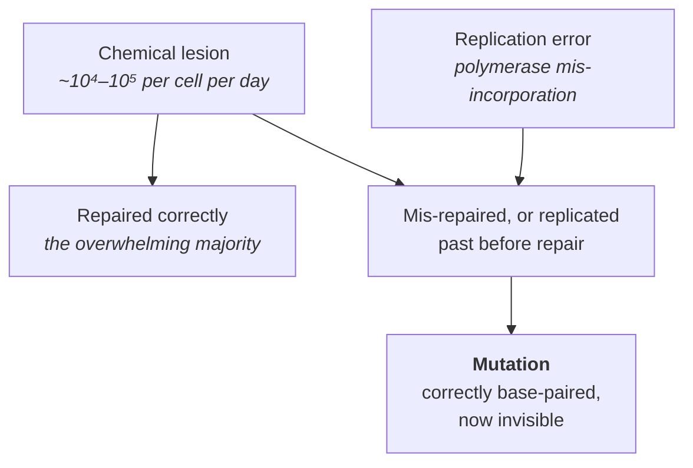

# 16 — Mutation

> **Before this:** [Ch 04 DNA replication](../part-01-molecular-foundations/04-dna-replication.md) · [Ch 07 The genetic code](../part-01-molecular-foundations/07-genetic-code-and-translation.md) · [Ch 09 Mitosis and meiosis](../part-02-transmission-genetics/09-mitosis-and-meiosis.md) · **Time:** ~40 min

## What you'll be able to do

- Classify any variant three ways — by scale, by molecular type, by functional consequence — and say which classification the question at hand actually needs
- Explain why transitions outnumber transversions roughly 4:1 relative to chance, and say how much of that the chemistry of one base actually accounts for
- Derive the number of new mutations you carry that neither parent had, and reconcile the derivation with what trio studies actually count
- Distinguish DNA *damage* from *mutation*, and germline from somatic, and say what breaks if you conflate either pair
- Predict the mutational bias a given mutagen produces, and explain what an Ames test measures — and which carcinogens it lets through
- Reconstruct the Luria–Delbrück variance argument and state exactly what it rules out
- Predict where in a genome the mutation rate will be elevated, and name a statistical analysis that fails if you assume it is uniform

## The core idea

Two facts sit in tension, and mutation is what falls out between them.

**DNA is chemically fragile.** It is a large organic molecule sitting in warm water. Bonds hydrolyse, bases oxidise, amino groups fall off. Tens of thousands of chemical lesions occur in every one of your cells every day, with no mutagen present at all.

**The observed error rate is about 10⁻⁸ per base per generation.** That is a fidelity of roughly one part in a hundred million, achieved by a molecule that is falling apart continuously.

The gap between those numbers is repair ([Ch 17](17-dna-repair.md)). Mutation is not what happens to DNA; mutation is the residue — the small fraction of chemical insults that repair missed or mis-fixed, then handed to the next round of replication, which copied the error faithfully and made it permanent.

That reframe has a consequence worth stating immediately:

> **Damage is not mutation.** A lesion is a chemical alteration to one strand; it is reversible, and the cell can see it because the complementary strand disagrees. A mutation is a change to the *sequence* that is now correctly base-paired on both strands. Once a lesion has been replicated past, there is no longer any evidence that anything is wrong. The information is gone, not corrupted.

Everything in this chapter is either a mechanism for producing lesions, a reason a particular lesion evades repair, or an accounting of the result.

---

## 1. Germline and somatic: the distinction that comes first

Before any molecular classification, ask which cell lineage the mutation is in.

| | Germline | Somatic |
|---|---|---|
| Where | Cells that give rise to gametes | Every other cell |
| Inherited? | Yes — passed to offspring | No |
| Present in | Every cell of the offspring | Only the descendants of the cell it arose in |
| Detected by | Sequencing blood/saliva; trios | Sequencing the affected tissue and subtracting a normal sample |
| Matters for | Inherited disease, evolution, population genetics | Cancer, ageing, mosaic disorders |

You are not a single genotype. You are a clonal population descended from one zygote, and every division since has been an opportunity for error. Normal adult tissues accumulate on the order of tens of somatic mutations per cell per year, so a cell in your colon at 60 differs from the zygote at thousands of positions. That is **mosaicism**, and it is the normal state.

Two consequences that are easy to get wrong. **A somatic mutation in a "disease gene" is not a diagnosis of an inherited disease** — it sits in one clone, and the only question that matters is whether that clone expands ([Ch 56](../part-11-human-and-statistical-genomics/56-cancer-genomics.md)). And **"de novo" does not mean recurrence risk is zero**: if the mutation arose early in a parent's development, that parent is a **gonadal mosaic** — unaffected, negative on a blood test, carrying the variant in a substantial fraction of their gametes. Empirical recurrence risks for apparently de novo dominant conditions are typically ~1%, not 0.

## 2. Classification by scale

| Scale | Name | Typical size | Notes |
|---|---|---|---|
| 1 bp | **Point mutation** / SNV | 1 | Substitution of one base for another |
| 1–50 bp | **Indel** | insertion or deletion | In coding sequence, a length not divisible by 3 shifts the frame |
| >50 bp | **Structural variant** | 50 bp – megabases | Deletions, duplications, inversions, translocations, mobile-element insertions |
| Chromosome | **Chromosomal** | whole arms or chromosomes | Aneuploidy, large-scale rearrangement ([Ch 20](20-chromosome-abnormalities.md)) |

The 50 bp boundary is a technological artefact, not a biological one — it is roughly where short-read alignment stops being able to see the event inside a single read. Different mechanisms dominate at different scales, but the classes grade into each other, and the "SV" category exists partly because those events are hard to call ([Ch 46](../part-10-functional-genomics/46-variant-calling.md)).

## 3. Classification by molecular type: the transition puzzle

Substitutions split into two classes by chemistry. Purines (A, G) have two fused rings; pyrimidines (C, T) have one.

- **Transition** — purine→purine or pyrimidine→pyrimidine. A↔G, C↔T.
- **Transversion** — purine↔pyrimidine. The other eight.

Count them. Each of four bases can change to three others: 12 possible substitutions. Four are transitions, eight are transversions. **If substitutions were chosen uniformly at random, the transition/transversion ratio (Ti/Tv) would be 0.5.**

Observed Ti/Tv in human whole-genome variant calls is **about 2.0–2.1**. In exomes it is **about 3.0–3.3**. So transitions are enriched roughly fourfold over chance genome-wide, and more in coding sequence. Both figures are standard variant-calling QC metrics precisely because sequencing *errors* are closer to the null 0.5, so a callset drifting toward 0.5 is a callset filling up with artefacts.

Where does the fourfold enrichment come from? The largest single identifiable contributor is one reaction on one base, which the next section derives — though it carries only about a third of the excess, and §5 says what carries the rest.

## 4. Classification by consequence

For a variant inside a protein-coding gene, read the consequence off the code ([Ch 07](../part-01-molecular-foundations/07-genetic-code-and-translation.md)):

```
reference   ATG CTG AAA GGT CAT TGG ...     Met Leu Lys Gly His Trp
synonymous  ATG CTC AAA GGT CAT TGG ...     Met Leu Lys Gly His Trp   (codon 2 CTG->CTC, still Leu)
missense    ATG CCG AAA GGT CAT TGG ...     Met Pro Lys Gly His Trp   (codon 2 CTG->CCG, Leu -> Pro)
nonsense    ATG CTG TAA GGT CAT TGG ...     Met Leu STOP              (codon 3 AAA->TAA, premature stop)
frameshift  ATG CTG AAG GTC ATT GG. ...     Met Leu Lys Val Ile ...   (codon 3, 1 bp deleted; everything downstream is garbage)
```

| Class | What changes | Typical severity |
|---|---|---|
| **Synonymous** | Codon changes, amino acid does not | Usually mild — but see below |
| **Missense** | One amino acid substituted | Anywhere from nothing to complete loss of function |
| **Nonsense** | Premature stop codon | Usually severe; often triggers nonsense-mediated decay, destroying the transcript |
| **Frameshift** | Reading frame shifts | Usually severe; scrambles everything downstream |
| **Splice-site** | Disrupts an intron boundary | Often severe — exon skipped or intron retained ([Ch 06](../part-01-molecular-foundations/06-rna-processing.md)) |
| **Regulatory** | Non-coding; changes how much protein is made | Usually subtle individually; collectively the dominant class in complex disease |

### Why synonymous is not silent

The code is redundant, so a synonymous change leaves the protein sequence intact. It does not leave everything else intact.

1. **Splicing.** Exons contain **exonic splicing enhancers** — short motifs marking the exon for inclusion. A synonymous change can destroy one and cause the whole exon to be skipped, or create a new cryptic splice site. This is the commonest route to a pathogenic synonymous variant.
2. **Translation speed.** Codons are read by tRNAs of very different abundance, so a rare codon stalls the ribosome. Proteins fold while still being synthesised, so changing the pause pattern can change the folded outcome from an identical amino acid sequence.
3. **mRNA structure and stability.** The change alters RNA secondary structure, and hence half-life and accessibility to ribosomes and microRNAs.
4. **It may not be synonymous in every isoform.** Genes produce multiple transcripts with different boundaries and frames.
5. **Selection can see it.** Codon usage bias is maintained by selection in organisms with large effective population sizes ([Ch 33](../part-07-molecular-evolution/33-neutral-theory-and-selection-tests.md)).

Treating synonymous variants as a null class is a modelling convenience — usually reasonable, occasionally a clinically consequential error ([Ch 55](../part-11-human-and-statistical-genomics/55-clinical-variant-interpretation.md)).

## 5. Where spontaneous mutations come from

No mutagen required. Five processes account for most of it.



**Depurination.** The bond joining a purine to the sugar hydrolyses spontaneously — roughly **10,000 purines lost per mammalian cell per day**, leaving an **abasic site**, a backbone position with no base at all. (Pyrimidine loss runs at about a twentieth of that rate.) Base-excision repair handles nearly all of them; a polymerase reaching an unrepaired abasic site tends to insert A opposite it, so a lost G becomes a G→T transversion.

**Deamination — the big one.** Cytosine's exocyclic amino group hydrolyses off, converting C to **uracil**, at roughly **100–500 events per cell per day**. Uracil pairs with A, so unfixed before replication the C:G pair becomes T:A — a transition.

Now the crucial asymmetry. **Uracil does not belong in DNA.** Uracil-DNA glycosylase excises it on sight and base-excision repair restores the C. The lesion is trivially recognisable *because it is chemically foreign*.

But cytosines in the dinucleotide **CpG** are frequently methylated as an epigenetic mark ([Ch 23](../part-04-gene-regulation/23-chromatin-and-epigenetics.md)). Deaminating **5-methylcytosine** does not produce uracil. It produces **thymine** — a perfectly legitimate DNA base. Repair now faces a G:T mismatch with no way to tell which base is the intruder. It must guess, and half the time it guesses wrong.

That single fact explains a great deal:

- **CpG sites mutate 10–50× faster** than comparable non-CpG positions, essentially all of it C→T (and G→A on the other strand) — transitions.
- **Transitions therefore dominate** — though this reaction is not the whole of it. CpG C→T is only about 15–20% of human de novo mutations; strip it from a genome-wide spectrum and Ti/Tv falls from ~2.1 only to ~1.5–1.6, still threefold above the 0.5 null. So CpG deamination is the single largest *named* contributor to the Ti/Tv excess, carrying roughly a third of it; the remainder is the general geometric ease of transition mispairing — wobble and tautomeric G·T and A·C — plus non-CpG cytosine deamination.
- **CpG is a mutational hotspot in disease.** A disproportionate share of recurrent de novo pathogenic point mutations sit at CpG dinucleotides.
- **The hotspot has eaten its own substrate.** With human GC content around 41%, random expectation for CpG is about 4% of dinucleotides. Observed frequency is about 1% — roughly a fourfold depletion, the accumulated scar of a few hundred million years of this reaction running.

**Oxidative damage.** Reactive oxygen species from ordinary metabolism oxidise guanine to **8-oxoguanine**, which can rotate into a conformation that pairs with A, yielding **G:C → T:A transversions**. This is one of the few common transversion routes, and the source of the notorious "OxoG" artefact in sequencing libraries oxidised during preparation.

**Replication error.** The classical explanation for polymerase mis-incorporation is a **tautomeric shift**: bases sit overwhelmingly in one tautomeric form but flip transiently to a rare form with different hydrogen-bonding geometry, letting G pair with T. Watson and Crick proposed it in 1953; NMR has since detected transient mispairing states populated at roughly 10⁻⁵ — which is about where base selection alone leaves the raw error rate. Two further filters act in series on that number: 3'→5' proofreading (a factor of 10²–10³) and mismatch repair (another 10²–10³), taking replication fidelity to roughly **10⁻⁹–10⁻¹⁰ per base per replication**. Watch the units. That is *per replication*; the ~10⁻⁸ per base per *generation* figure of §7 is a different quantity, summing hundreds of germline divisions plus lesions that were never replication errors at all.

**Strand slippage.** At a tandem repeat the nascent strand can detach and re-anneal out of register, because the template offers many equally good re-annealing positions. Result: a gain or loss of one repeat unit.

```
template   ...CA CA CA CA CA CA CA...
nascent    ...GT GT GT GT GT GT...        slips back one unit -> insertion of CA
                          ^ re-anneals here instead of here
```

This is why **microsatellites** (tandem repeats of 1–6 bp) mutate at roughly 10⁻³–10⁻⁴ per locus per generation, four to five orders of magnitude above the point-mutation rate — which made them the workhorse markers of classical linkage mapping and forensic profiling. When mismatch repair fails, through germline loss of *MLH1* or *MSH2* in Lynch syndrome or somatic silencing in a tumour, slippage goes uncorrected and the genome acquires **microsatellite instability (MSI)**: detectable at a handful of mononucleotide marker loci, and now a predictive biomarker for immune checkpoint therapy.

## 6. Induced mutagenesis, and how you test for it

Mutagens do not create new *classes* of mutation. They raise the rate of lesion types the cell already deals with, sometimes with a characteristic bias.

| Agent | Lesion | Mutational outcome |
|---|---|---|
| **UV (UVB/UVC)** | Covalent linkage of adjacent pyrimidines — cyclobutane dimers and 6-4 photoproducts | C→T at dipyrimidines; the diagnostic **CC→TT** tandem substitution |
| **Ionising radiation** | Double-strand breaks, mostly indirect via hydroxyl radicals from water radiolysis | Deletions, translocations, structural variants |
| **Alkylating agents** (EMS, nitrogen mustards, temozolomide) | Alkyl groups on bases; O⁶-alkylguanine pairs with T | G:C → A:T transitions, heavily biased |
| **Base analogues** (5-bromouracil, 2-aminopurine) | Incorporated in place of a normal base, then mispair | Transitions |
| **Intercalators** (proflavine, acridines, ethidium) | Slot between stacked base pairs, distorting the helix | ±1 bp indels — frameshifts |

Two of these earned a place in the history of the subject. Intercalator-induced frameshifts were how Crick and Brenner established that the code is read in non-overlapping triplets: single insertions and single deletions each destroyed function, but three insertions together restored it. And **EMS** is still the standard mutagen for forward genetic screens, precisely because its bias toward point mutations yields an allelic series rather than a clean knockout ([Ch 37](../part-08-methods/37-model-organisms-and-screens.md)).

**The Ames test** turns mutagenesis into an assay. Take a *Salmonella typhimurium* strain carrying a mutation in a histidine-biosynthesis gene, so it cannot grow without histidine supplied, and plate it on medium lacking histidine. Only cells acquiring a **reverting** mutation that restores the gene form colonies. Colonies against compound dose gives a slope — mutagenic potency. Add rat-liver microsomal extract ("S9"), because many compounds are not mutagenic until mammalian liver metabolism converts them. Different tester strains carry frameshift versus base-substitution starting mutations, so which strain responds tells you the mechanism.

It is a mutagenicity assay used as a carcinogenicity screen. The mapping is good but not perfect: non-genotoxic carcinogens pass it.

## 7. The rate, derived

From [`reference/verified-facts.md`](../reference/verified-facts.md):

| Quantity | Value |
|---|---|
| Genome-wide SNV rate | ~1.1–1.3 × 10⁻⁸ per bp per generation |
| Recent long-read pedigree estimate | 1.30 × 10⁻⁸ per bp per generation |
| Fraction of de novo mutations of paternal origin | ~80% |
| Additional de novo mutations per year of paternal age | ~1.3–1.5 |

A human diploid genome is about 6.2 × 10⁹ bp (2 × 3.1 Gb). Multiply:

```
low     1.1e-8 per bp x 6.2e9 bp = 68.2
high    1.3e-8 per bp x 6.2e9 bp = 80.6
```

So the arithmetic predicts **roughly 68–81 new point mutations** per person that neither parent carried. Published trio studies typically report ~60–70. That gap is not an error — it is informative. Short-read trio studies can only call variants in the **callable** fraction of the genome: they exclude centromeres, segmental duplications and long repeats, which is on the order of 10–15% of the sequence. Apply that:

```
0.85 x 80.6 = 68.5
```

which lands squarely on the reported range. The naive product is the true number; the reported number is the true number minus what the technology cannot see. This is exactly why the long-read pedigree estimate sits at the **top** of the range — long reads recover the repetitive fraction, which is also the fraction that mutates fastest.

**The parental split.** About 80% are paternal: of ~70 mutations, roughly 56 from the father and 14 from the mother. The conventional explanation is cell divisions — the oocyte lineage undergoes a couple of dozen in total, while spermatogenesis continues through adult life, accumulating several hundred by age 30 and more thereafter, each one a replication opportunity. (Damage in non-dividing cells contributes too, so the picture is not purely division-driven, but the direction is unambiguous.)

**Paternal age** adds ~1.3–1.5 mutations per year. A child of a 45-year-old father carries roughly `20 × 1.4 ≈ 28` more de novo mutations than a child of a 25-year-old — a ~40% increase on a baseline of ~70.

Note what this does *not* say. Maternal age is the dominant risk factor for **aneuploidy** ([Ch 20](20-chromosome-abnormalities.md)) — a different mechanism entirely, segregation failure in oocytes arrested since fetal life. Paternal age drives *point* mutations; maternal age drives *chromosome* errors.

### Rate heterogeneity

The per-base rate is an average over a genome where the local rate varies severalfold:

- **Sequence context** — CpG as derived above, and more generally the flanking bases at every position
- **Replication timing** — late-replicating regions mutate more, plausibly because repair capacity is depleted by the time they are copied
- **Chromatin state** — closed heterochromatin mutates faster than open chromatin; repair enzymes need access
- **Transcription** — the transcribed strand of an active gene has a lower rate, because a stalled RNA polymerase recruits repair directly (transcription-coupled repair)
- **Recombination** — high-crossover regions show elevated substitution rates and GC-biased fixation

This is not a footnote. **Any test assuming a uniform background rate will generate false positives in high-rate regions.** The canonical failure was in cancer genomics: early driver-gene scans flagged large, late-replicating, lowly-expressed genes as recurrently mutated when the excess was entirely local background rate. The fix — modelling the covariates of the background rate explicitly — is now standard, and it is the same lesson as covariate control in GWAS.

## 8. Mutation is undirected

Here is the misconception that survives everything else in this chapter.

> **Mutation is undirected: the probability that a particular mutation occurs is unrelated to whether it would be useful.** Bacteria exposed to an antibiotic do not mutate *toward* resistance. A population under heat stress does not preferentially generate heat-tolerance alleles. There is no mechanism by which the usefulness of a sequence change could feed back on the chemistry that produces it, and no such mechanism has ever been found.

This is the load-bearing distinction between mutation and selection. Mutation proposes, blind to consequence; selection disposes, on the basis of consequence. Collapse the two and you get Lamarckism, which is not merely historically wrong but mechanistically incoherent given how DNA replication works.

Two refinements, because the naive version of "random mutation" is also wrong:

**Undirected is not uniform.** Mutation is heavily biased *in kind* and *in place* — toward transitions, toward CpG, toward late-replicating regions, toward repeat tracts. "Random with respect to fitness" is the precise claim; "uniform over the genome" is a different claim and it is false.

**Stress can raise the rate without aiming it.** Bacteria under stress upregulate error-prone polymerases, raising the mutation rate genome-wide. That is a *rate* change, not a *direction* change: it increases the supply of variation of all kinds, most of it harmful. Reports that mutation rates are systematically lower in functionally important regions of some genomes describe another rate bias — a bias in where, not a bias toward what would help now.

The experiment that settled this is in the worked example below.

## 9. Repeat expansion and anticipation

Slippage at a short tandem repeat usually changes the tract by one unit. At a small number of loci, once the tract exceeds a threshold length, it becomes *unstable*: the expanded allele can form hairpin and slipped-strand structures that escape correction, and the tract grows further with each transmission. The mutation rate becomes a function of the current allele length — a positive feedback.

| Disease | Gene | Repeat | Location | Normal | Pathogenic |
|---|---|---|---|---|---|
| Huntington disease | *HTT* | CAG | coding (polyglutamine) | ≤26 | 27–35 intermediate; 36–39 reduced penetrance; **≥40 fully penetrant** |
| Fragile X syndrome | *FMR1* | CGG | 5' UTR | <45 | 45–54 grey zone; 55–200 premutation; **>200 full mutation** |
| Myotonic dystrophy type 1 | *DMPK* | CTG | 3' UTR | 5–34 | 35–49 mutable normal (premutation); **≥50 fully penetrant** |
| Friedreich ataxia | *FXN* | GAA | intron 1 | <33 | ~66–1300 (recessive) |

The mechanisms differ by location. In *HTT* the repeat is translated into a long polyglutamine tract that makes the protein aggregate — a gain of toxic function. In *FMR1* the expanded CGG tract becomes methylated and the gene is silenced — a loss of function. Same class of mutation, opposite molecular logic.

**Anticipation** follows directly. Onset age correlates inversely with repeat length, and repeat length tends to grow through transmission, so the disease appears earlier and more severely in successive generations. There is a parent-of-origin asymmetry: large *HTT* expansions overwhelmingly come through the father, whereas an *FMR1* premutation expands to a full mutation only through the mother.

Worth noting for a statistically minded reader: anticipation was for decades dismissed as ascertainment bias, and that scepticism was *methodologically correct*. If you ascertain families through an affected child, you will systematically find early-onset cases in the younger generation and late-onset cases in the older one, manufacturing apparent anticipation from nothing. The hypothesis was right to raise. It happened to be wrong here, and only molecular measurement of repeat length could show that.

## 10. Mutational signatures

Every mutational process leaves a characteristic fingerprint in the *joint* distribution of substitution type and sequence context. Encode a genome's somatic mutations as counts over 96 channels — 6 substitution classes (referenced to the pyrimidine of the pair: C>A, C>G, C>T, T>A, T>C, T>G) × 4 possible 5' neighbours × 4 possible 3' neighbours. Each tumour becomes a 96-vector.

Factorise a matrix of many such vectors — non-negative matrix factorisation, which the reader already owns — and the recovered components are **mutational signatures**: recurring processes, each with a characteristic 96-channel profile, present in each tumour at some exposure level.

The catalogue is real and interpretable. C>T at CpG accumulating linearly with age (a clock, and exactly the deamination reaction of §5). C>T at dipyrimidines with CC>TT tandems in melanoma (UV). C>A in lung tumours of smokers (tobacco adducts). Distinctive profiles for APOBEC enzyme activity and for homologous-recombination deficiency in *BRCA1*/*BRCA2*-mutant tumours — the last of which is clinically actionable.

This is the payoff of everything above: because each chemical mechanism produces a biased, context-dependent spectrum, the spectrum is invertible. You can read the causes off the genome. [Ch 56](../part-11-human-and-statistical-genomics/56-cancer-genomics.md) develops it fully.

---

## Common misconceptions

| What people think | What's actually true |
|---|---|
| Mutations are random | Random *with respect to fitness* — yes, and that is the whole point. Uniform over the genome — emphatically not. The rate varies severalfold with context, chromatin, replication timing and transcription, and by 10–50× at CpG |
| Organisms mutate in response to a challenge | Luria–Delbrück ruled this out in 1943. Stress can raise the mutation rate, which increases variation of all kinds; nothing aims it. There is no channel by which "useful" could reach the chemistry |
| Damage and mutation are the same thing | A lesion is chemical and repairable because the other strand still holds the answer. A mutation is a correctly paired sequence change with no evidence left that anything happened |
| Synonymous mutations are silent | They alter splicing enhancers, translation speed and co-translational folding, mRNA stability, and may be non-synonymous in another isoform. Pathogenic synonymous variants are well documented |
| Older mothers are the main source of new mutations in a child | Point mutations are ~80% paternal and rise ~1.3–1.5 per year of *paternal* age. Maternal age drives aneuploidy — a different mechanism entirely |
| CpG mutates fast because methylation damages DNA | Methylation does no damage. The point is the deamination *product*: 5-methyl-C deaminates to thymine, a normal base that repair cannot identify as the intruder. Unmethylated C deaminates to uracil, which is foreign and excised on sight |
| Mutagens cause distinctive kinds of mutation you would never otherwise see | They raise the rate of lesion classes the cell already handles, with a bias. The bias is what makes mutational signatures readable — but the lesions are the same chemistry |
| A somatic mutation in a cancer gene means the family is at risk | Only germline variants are transmitted. Distinguishing the two requires sequencing a normal tissue alongside the tumour — which is why paired sequencing is the standard design |

## Worked example: the fluctuation test

**The question, in 1943.** Bacteria exposed to phage T1 mostly die; a few resistant colonies grow. Two hypotheses:

- **H₁ (acquired/directed).** Contact with phage *induces* resistance in a small fraction of cells, each independently with probability *p*.
- **H₂ (spontaneous/pre-existing).** Resistance mutations arise at rate μ per cell division during ordinary growth, entirely independently of phage. The phage merely reveals who already had it.

Both predict the same *mean* number of resistant colonies. Luria's insight was that they predict wildly different **variances**.

**Prediction under H₁.** Each of N plated cells independently converts with probability *p* at the moment of plating. Count ~ Binomial(N, p) ≈ Poisson(Np). Therefore **Var = Mean**, and the variance/mean ratio is 1.

**Prediction under H₂.** Grow a culture from a tiny inoculum to N cells. A mutation occurring at the k-th division, when the population is about k cells, leaves about N/k descendants by plating time. Mutational events are approximately Poisson over the ~N divisions, so the total count M is a compound Poisson with jump size N/k:

```
E[M]   = μN · (1/N) Σ_{k=1..N} (N/k)     = μN · H_N        ≈ μ N ln N
Var(M) = μN · (1/N) Σ_{k=1..N} (N/k)²    = μ N² Σ 1/k²      ≈ μ N² · π²/6

Var/Mean ≈ (π²/6) · N / ln N
```

The variance/mean ratio does not equal 1. It grows almost linearly with N. The reason is visible in the algebra: a mutation early in growth contributes an enormous clone, and those "jackpot" cultures dominate the second moment while barely affecting the first.

**The design that separates them.** Two sets of platings, same expected count:

- **Set A:** ten *separate* small cultures, each grown independently to saturation, each plated whole. Independent histories, so jackpots can occur.
- **Set B:** ten aliquots of *one* large culture. Shared history, so all aliquots inherit the same mutant fraction and differ only by sampling.

H₁ predicts Var ≈ Mean in both. H₂ predicts Var ≈ Mean in Set B and Var ≫ Mean in Set A.

**Illustrative numbers** (patterned on the original result):

```
Set A  (independent cultures):  1, 0, 0, 7, 0, 303, 0, 1, 0, 48
Set B  (aliquots of one culture): 29, 41, 35, 38, 30, 44, 36, 33, 40, 34
```

Both sum to 360, so both have mean 36.0.

```
Set A:  Σ(x - x̄)² = 81,204      s² = 81,204 / 9 = 9,022.7      s²/x̄ = 250.6
Set B:  Σ(x - x̄)² =    208      s² =    208 / 9 =    23.1      s²/x̄ =   0.64
```

Test each against Poisson with the index-of-dispersion statistic, (n−1)s²/x̄ ~ χ² on 9 df:

```
Set B:   9 × 0.64  =    5.8   on 9 df   — entirely consistent with Poisson
Set A:   9 × 250.6 = 2,255    on 9 df   — p astronomically small
```

**Conclusion.** Set B behaves exactly as Poisson sampling should, confirming the assay is well behaved and the aliquots differ only by chance. Set A does not: a few cultures are jackpots, and jackpots are the signature of mutations that occurred *generations before the phage was ever added*. Resistance was pre-existing.

What makes the argument airtight is what it did without. Luria and Delbrück never observed a mutation, never sequenced anything, and had no molecular model of a gene. They inferred the timing of an unobservable event purely from the shape of the noise.

One caveat worth carrying: the Luria–Delbrück distribution is heavy-tailed enough that its theoretical variance is dominated by events too rare to ever observe, so estimating μ from a sample variance is unstable. Modern practice uses the proportion of cultures with zero mutants, or maximum likelihood on the full distribution.

## Connections

**Back to:**
- [Ch 04 — DNA replication](../part-01-molecular-foundations/04-dna-replication.md) — proofreading and the three-filter fidelity budget this chapter's rate depends on
- [Ch 07 — The genetic code](../part-01-molecular-foundations/07-genetic-code-and-translation.md) — the redundancy that makes "synonymous" a category
- [Ch 09 — Mitosis and meiosis](../part-02-transmission-genetics/09-mitosis-and-meiosis.md) — why the germline/somatic distinction is absolute, and why paternal and maternal division counts differ

**Forward to:**
- [Ch 17 — DNA repair](17-dna-repair.md) — the machinery that determines which lesions become mutations
- [Ch 19 — Transposable elements](19-transposable-elements.md) — mutation by insertion, a mechanism this chapter deliberately deferred
- [Ch 20 — Chromosome abnormalities](20-chromosome-abnormalities.md) — mutation at the largest scale, and maternal-age aneuploidy
- [Ch 20A — Bacterial and phage genetics](20A-bacterial-and-phage-genetics.md) — the organism the fluctuation test was run in, and Benzer's fine-structure map, which resolved mutational hotspots to the base pair a decade before sequencing: >300 distinct mutable sites in *rII*, sharply non-random, a few of them hit hundreds of times
- [Ch 27 — The four forces](../part-05-population-genetics/27-the-four-forces.md) — mutation as the process that supplies θ = 4N<sub>e</sub>μ
- [Ch 33 — Neutral theory](../part-07-molecular-evolution/33-neutral-theory-and-selection-tests.md) — mutation rate as the molecular clock, and why the synonymous class is the null
- [Ch 46 — Variant calling](../part-10-functional-genomics/46-variant-calling.md) — Ti/Tv as a QC metric; why somatic calling needs a matched normal
- [Ch 56 — Cancer genomics](../part-11-human-and-statistical-genomics/56-cancer-genomics.md) — mutational signatures, and background-rate modelling for driver detection

## Check yourself

**1. There are twice as many possible transversions as transitions, yet transitions outnumber transversions about 2:1 in human whole-genome data. Quantify the enrichment and give its largest single cause.**

<details><summary>Answer</summary>

Twelve possible substitutions: four transitions (A↔G, C↔T), eight transversions. Null Ti/Tv = 4/8 = 0.5. Observed genome-wide ~2.0–2.1, so transitions are enriched about **fourfold** over chance.

The largest single identifiable cause is deamination of 5-methylcytosine at CpG, which yields thymine directly — a C→T transition — at 10–50× the rate of comparable substitutions elsewhere. Ordinary cytosine deamination contributes far less, because its product, uracil, is chemically foreign to DNA and excised efficiently.

It is not, however, the whole excess. CpG C→T is only ~15–20% of de novo mutations, and removing it drops Ti/Tv to ~1.5–1.6 — still threefold above the null. The residual is the general geometric ease of transition mispairing, which needs no special reaction to explain. Exome Ti/Tv is higher still (~3.0–3.3), reflecting both CpG density and purifying selection removing transversions, which more often change amino acid character.

</details>

**2. Why is deamination of 5-methylcytosine so much more mutagenic than deamination of unmethylated cytosine, given that both are the same chemical reaction on the same functional group?**

<details><summary>Answer</summary>

The reaction rate is comparable; what differs is the *detectability of the product*.

Unmethylated C deaminates to **uracil**, which does not occur in DNA. Uracil-DNA glycosylase recognises it unambiguously, excises it, and base-excision repair restores the C — near-perfect correction. 5-methyl-C deaminates to **thymine**, a completely normal base. The cell sees a G:T mismatch and cannot tell which side is the error. It must guess, and guessing wrong fixes a C→T transition.

The lesson generalises: repair fidelity depends on whether damage produces something recognisably foreign, not on how drastic the chemical change was.

</details>

**3. You plate 20 independent bacterial cultures and get a variance-to-mean ratio of about 180 for resistant colony counts. You plate 20 aliquots of a single culture and get a ratio of about 1.1. What do you conclude, and what would you have concluded if both ratios were near 1?**

<details><summary>Answer</summary>

The independent cultures are wildly overdispersed relative to Poisson; the aliquots are not. That is the Luria–Delbrück result: resistance mutations arose spontaneously during growth, *before* any selective agent was applied, and early ones produced jackpot clones that inflate the variance. The aliquot set confirms the assay itself is Poisson-behaved, so Set A's overdispersion is not a technical artefact.

If both ratios were near 1, the counts would be consistent with each cell converting independently at plating time — resistance induced by the selective agent. That is the hypothesis the design was built to falsify, and it is the one it rejected. Note that the *means* are uninformative in both scenarios; the entire inference lives in the second moment.

</details>

**4. Using the pinned rate of 1.1–1.3 × 10⁻⁸ per bp per generation, derive the expected number of de novo point mutations in a child, and explain why published trio studies report a lower number.**

<details><summary>Answer</summary>

Diploid genome 6.2 × 10⁹ bp:

```
1.1e-8 × 6.2e9 = 68.2
1.3e-8 × 6.2e9 = 80.6
```

So ~68–81 expected. Trio studies report ~60–70 because short-read data cannot call variants across the repetitive fraction of the genome — centromeres, segmental duplications, long tandem repeats — which is on the order of 10–15% of the sequence and also the fastest-mutating part. Multiplying 80.6 by 0.85 gives 68.5, which reproduces the reported range. Long-read pedigree studies recover more of that fraction, which is why the long-read estimate (1.30 × 10⁻⁸) sits at the top of the range rather than the middle.

</details>

**5. A 45-year-old man and a 25-year-old man each father a child. How many more de novo point mutations does the older man's child carry, and does the corresponding statement about maternal age hold?**

<details><summary>Answer</summary>

At ~1.3–1.5 additional de novo mutations per year of paternal age, twenty extra years gives roughly `20 × 1.4 ≈ 28` additional mutations, on a baseline of about 70 — a ~40% increase. Consistent with ~80% of de novo mutations being paternal in origin, the mechanism being the continuing divisions of the spermatogonial lineage plus accumulated damage.

The corresponding maternal statement does **not** hold for point mutations: the maternal contribution rises only weakly with age. Maternal age is the dominant risk factor for a different class of error entirely — **aneuploidy**, caused by segregation failure in oocytes arrested in meiosis I since fetal development ([Ch 20](20-chromosome-abnormalities.md)). Two age effects, two mechanisms, two parents; keeping them separate is the point.

</details>
