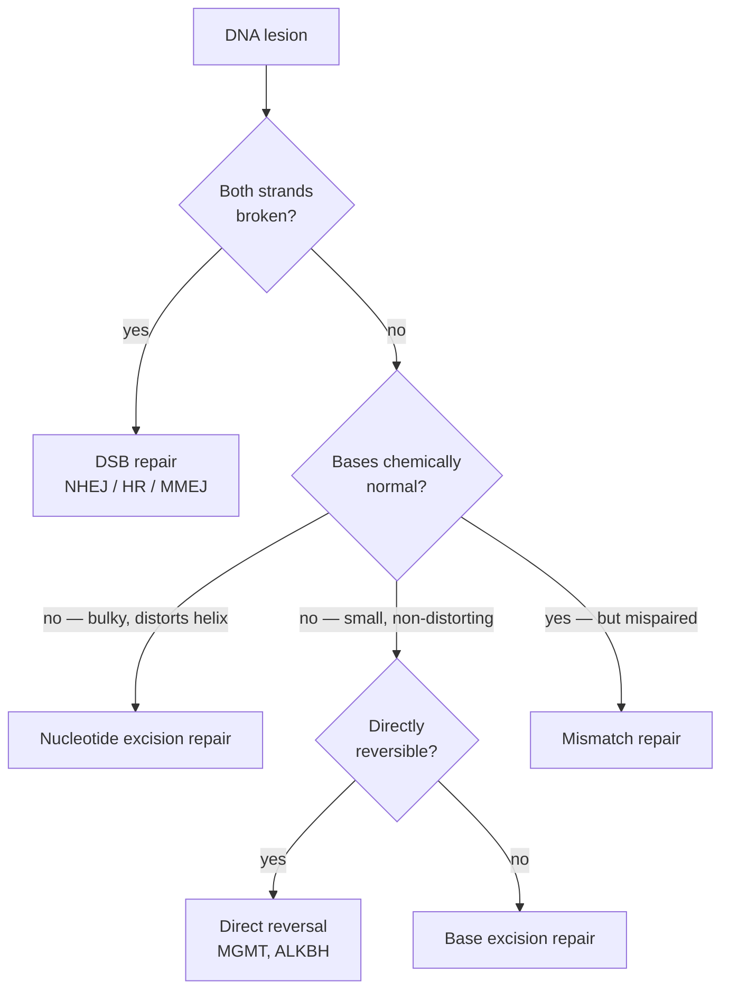
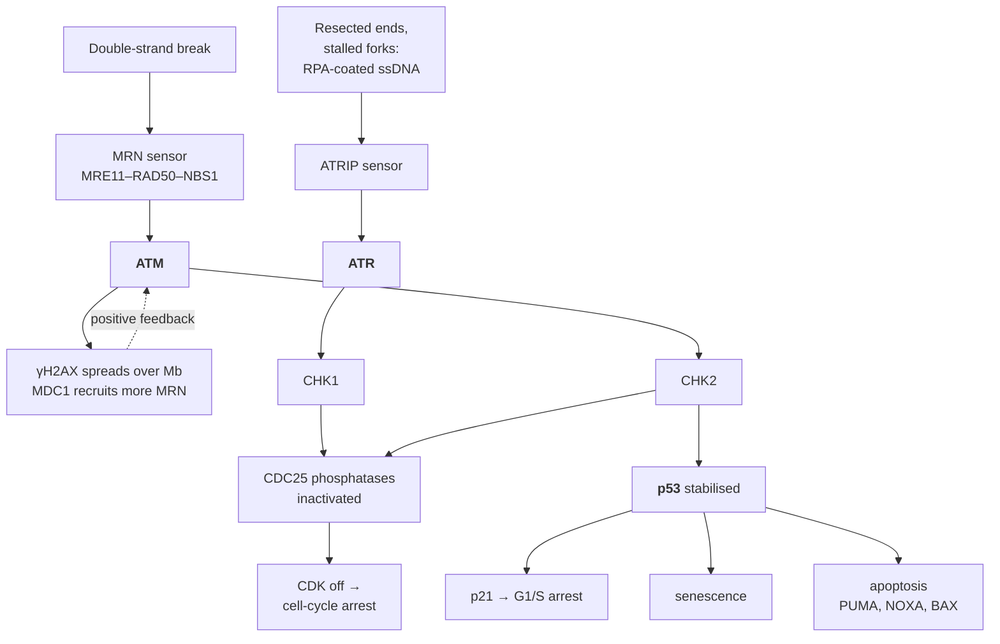

# 17 — DNA repair

> **Before this:** [Ch 04 — DNA replication](../part-01-molecular-foundations/04-dna-replication.md) · [Ch 16 — Mutation](16-mutation.md) · **Time:** ~40 min

## What you'll be able to do

- Explain why the observed mutation rate is a **residual after repair**, and derive roughly how efficient repair has to be to produce it
- Map a lesion type onto the pathway that handles it, and name the redundancy that pathway exploits
- State the strand-discrimination problem in mismatch repair and how bacteria and eukaryotes solve it differently
- Explain double-strand-break pathway choice in terms of resection, CDK activity and the 53BP1/BRCA1 antagonism
- Derive the synthetic-lethality argument behind PARP inhibitors, including where the therapeutic window comes from and how tumours escape it
- Distinguish repairing a lesion from tolerating one, and trace the damage response from sensor kinase through p53 to the arrest, senescence or apoptosis decision
- Predict which regions of a genome mutate faster, and explain why cancer-driver detection is impossible without modelling that

## The core idea

Chapter 16 gave you a germline mutation rate of about **1.1–1.3 × 10⁻⁸ per base pair per
generation** ([verified facts](../reference/verified-facts.md)). It is tempting to read that
as a statement about how often DNA gets damaged. It is not. Damage happens roughly **ten
million times more often**.

A human cell sustains on the order of **10⁴–10⁵ chemical lesions per day**: bases falling off
the backbone, cytosines deaminating, oxygen radicals from the cell's own metabolism attacking
guanine, UV photons welding adjacent thymines, and 10–50 double-strand breaks. None of that
is pathological. It is Tuesday.

The mutation rate you measure is what survives a stack of error-correcting filters:

```
  ~10⁵ lesions/day ──►  [ direct reversal  ]
                        [ base excision    ]
                        [ nucleotide exc.  ]  ──►  ~10⁻² inherited
                        [ mismatch repair  ]        mutations/day
                        [ DSB repair       ]
```

So the useful question is not "why do mutations happen?" — the chemistry makes that inevitable
— but **"why are there so few?"** That reframing has a practical payoff: every property of the
mutation rate you care about downstream (why it varies across the genome, why some tumours die
to a drug that healthy cells shrug off) is a property of *repair*, not of damage.

> **Repair does not fix mutations. It fixes damage.** A lesion is chemically abnormal DNA — a
> base that isn't one of the four, a break in the backbone, a position where the two strands
> disagree. All of that is *detectable*, because DNA is redundant: something else says what
> the answer should be. A mutation is a chemically normal, correctly paired base pair that
> merely differs from the ancestral one. There is nothing left to detect. Every pathway below
> is a race against replication to fix the damage while the evidence still exists.

---

## 1. What every pathway exploits

To correct an error you must detect it and recover the original. Biology has exactly two
sources of redundancy.

**The complementary strand.** Damage to one strand leaves the other intact: cut out a stretch
of the damaged strand and re-synthesise from the survivor. Single-strand damage is in
principle always correctable.

**The sister chromatid.** A double-strand break destroys both copies at once, so the first
redundancy is gone. The only remaining template is the identical sister made during
replication — which exists only in S and G2
([Ch 09](../part-02-transmission-genetics/09-mitosis-and-meiosis.md)). Everything strange
about break repair follows from that constraint.

The pathways differ mainly in **how much sequence they remove**, which is set by how large a
chemical disturbance they must clear:

| Pathway | Lesion class | Patch removed | Template |
|---|---|---|---|
| Direct reversal | one specific modified base | 0 nt | none — modification undone in place |
| Base excision repair | small, non-distorting base damage | 1 nt, or 2–13 nt long-patch | other strand |
| Nucleotide excision repair | bulky, helix-distorting lesions | 24–32 nt in humans (12–13 in *E. coli*) | other strand |
| Mismatch repair | replication errors — normal bases, wrong pairing | up to ~1 kb | other (parental) strand |
| Homologous recombination | double-strand break | variable | sister chromatid |
| Non-homologous end joining | double-strand break | 0 to tens of nt, unpredictable | none |



## 2. Direct reversal: the cheapest repair, and the strangest enzyme in the cell

Sometimes the modification can simply be undone — no cutting, no template, no resynthesis.

**Photolyase** absorbs a blue-light photon and uses its energy to split the covalent bond
joining a UV-induced pyrimidine dimer. One enzyme, one photon, lesion gone. It is present in
bacteria, plants, fungi, insects, fish and marsupials, and **absent in placental mammals**.
You do not have it. Every UV dimer in your skin must go through the far more expensive
nucleotide excision pathway.

**MGMT** (*O*⁶-methylguanine-DNA methyltransferase) removes a methyl group from the O⁶ position
of guanine — the alkylation lesion that matters most, because O⁶-methylguanine pairs with
thymine and so causes G:C → A:T transitions. MGMT transfers the methyl onto one of its own
cysteines, which **irreversibly inactivates the protein**. It is a suicide enzyme: strictly
stoichiometric, one protein molecule consumed per lesion, not a catalyst at all.

That economics has a clinical consequence. Alkylating chemotherapy (temozolomide) kills
glioblastoma by creating exactly this lesion. Tumours expressing MGMT mop it up and survive;
tumours that have epigenetically silenced *MGMT* by promoter methylation cannot, and respond.
**MGMT promoter methylation is a routine predictive biomarker in glioblastoma** — an epigenetic
mark on a repair gene predicting drug response (Hegi et al., *NEJM* 2005;
[Ch 23](../part-04-gene-regulation/23-chromatin-and-epigenetics.md)).

## 3. Base excision repair: the workhorse

BER handles the highest-volume damage. Its signature move is that recognition is **outsourced
to a family of specialists** — eleven human DNA glycosylases, each recognising one kind of
damaged base and nothing else. A dispatch table keyed on lesion type.

| Glycosylase | Recognises | Arising from |
|---|---|---|
| UNG | uracil in DNA | cytosine deamination (~100–500/cell/day) |
| OGG1 | 8-oxoguanine | oxidative damage from normal metabolism |
| MUTYH | adenine mispaired opposite 8-oxoG | the replication *error* 8-oxoG causes |
| TDG | thymine opposite G | deamination of **5-methyl**cytosine |

Once a glycosylase finds its substrate the mechanism is uniform:

```
                     ↓ spontaneous deamination of C
5'- A C G T A U G C A T -3'      U:G — a U where a C should be
3'- T G C A T G C G T A -5'

  1. UNG flips U out of the helix, cleaves the base–sugar bond
5'- A C G T A _ G C A T -3'      abasic (AP) site: sugar stays, base gone
3'- T G C A T G C G T A -5'

  2. APE1 nicks the backbone 5' of the AP site
5'- A C G T A|_ G C A T -3'
3'- T G C A T G C G T A -5'

  3. Pol beta removes the sugar remnant, reads the intact strand, inserts C
5'- A C G T A C G C A T -3'
3'- T G C A T G C G T A -5'

  4. LIG3–XRCC1 seals the nick. Restored.
```

Two things to carry forward. **The intermediates are more dangerous than the lesion** — an
abasic site, then a nicked backbone, are both worse than a uracil — so BER is a committed
hand-off chain in which each enzyme recruits the next and the intermediate is never released.

And TDG's job exposes a design flaw in the epigenome: **5-methylcytosine deaminates to
thymine**, a perfectly normal DNA base. Uracil is obviously foreign and trivially excised;
thymine is not, so this repair is intrinsically unreliable. That is why CpG dinucleotides are
mutational hotspots roughly an order of magnitude above background, and why CpGs are depleted
from the genome over evolutionary time ([Ch 16](16-mutation.md)).

## 4. Nucleotide excision repair: recognise the distortion, not the lesion

Bulky lesions — UV dimers, tobacco-smoke adducts, cisplatin crosslinks — are too varied for a
dispatch table. NER instead recognises a **structural** property: a lesion that distorts the
helix and disrupts base pairing. One recognition mechanism, unlimited substrate scope, which
is why NER is the pathway for essentially every environmental carcinogen.

Recognition happens two ways, and the split matters:

| | Global-genome NER | Transcription-coupled NER |
|---|---|---|
| Sensor | XPC–RAD23B patrolling the genome | RNA polymerase II **stalling** at a lesion |
| Coverage | everywhere, slowly | transcribed strand of expressed genes, fast |
| Loss causes | xeroderma pigmentosum | Cockayne syndrome |

Both converge on TFIIH — the same complex that opens promoters during transcription — whose
XPB and XPD helicase subunits unwind ~25 bp around the lesion. XPA and RPA verify the damage;
then XPF–ERCC1 incises ~20 nt 5' of the lesion and XPG incises ~5 nt 3' of it, releasing a
**24–32-nucleotide oligomer** containing the damage. Pol δ/ε fill from the intact strand.

**Xeroderma pigmentosum** is the loss-of-function phenotype. Seven complementation groups
(XP-A to XP-G) correspond to NER components, and they do not all sit in the same branch: XP-C and
XP-E lose the global-genome sensor specifically, while XP-A, XP-B, XP-D, XP-F and XP-G are core
incision factors shared by both branches and so knock out global-genome *and* transcription-coupled
NER together. Patients carry a **>10,000-fold increased risk of
non-melanoma skin cancer and >2,000-fold for melanoma**, with median age at first skin cancer
around **9 years** against ~60 in the general population. Incidence ranges from ~1 in 20,000 in
Japan to ~1 in 250,000 in the USA.

The eighth group is instructive. **XP-V** patients have entirely normal NER; their defect is in
*POLH*, a translesion polymerase (§8). Same clinical phenotype, different pathway — phenotype
does not identify mechanism.

The contrast with **Cockayne syndrome** is the sharpest teaching point here. CS patients lose
only transcription-coupled NER. They have severe neurodegeneration, developmental failure and
dramatic premature ageing — and **no cancer predisposition at all**. The reason is what happens
to the cell after the failure: lesions that block transcription trigger death and tissue
attrition (ageing), whereas lesions that are tolerated and bypassed produce mutations (cancer).
**Repair deficiency causes cancer only in cells that survive it.**

## 5. Mismatch repair: the strand-discrimination problem

Replication is already accurate: polymerase base selection gives ~10⁻⁴–10⁻⁵ errors per base,
and 3'→5' proofreading catches ~99% of those
([Ch 04](../part-01-molecular-foundations/04-dna-replication.md)). MMR is the third filter,
worth another 100–1000-fold. But it faces a problem the other pathways do not:

```
                      ↓ replication error
5'- A C G T A G G C A T -3'   newly synthesised: G inserted opposite T
3'- T G C A T T C G T A -5'   parental template
                      G:T — both bases chemically normal
```

There is no damage here. There is a **disagreement**. Excising the G restores the original;
excising the T fixes a mutation into both strands permanently. A strand-blind mismatch repair
system would not be merely useless — it would be **actively mutagenic in half of all events**.

**Bacteria use methylation.** *E. coli* Dam methylase methylates adenine in GATC sites, but
only after a delay, so immediately behind the fork the parental strand is methylated and the
nascent strand is not. MutS finds the mismatch, MutL couples, and **MutH nicks the unmethylated
strand**. The methyl mark *is* the strand label.

**Eukaryotes use nicks.** There is no equivalent mark. Instead the discontinuity of synthesis
marks the new strand: the lagging strand is full of gaps between Okazaki fragments, the leading
strand has 5' ends from ribonucleotide processing. MutSα (MSH2–MSH6, single-base mismatches and
small loops) or MutSβ (MSH2–MSH3, larger insertion–deletion loops) finds the mismatch; MutLα
(**MLH1–PMS2**) carries a latent endonuclease activated by PCNA — and PCNA is a ring loaded at
the fork with a defined orientation, so the sliding clamp carries the strand information. EXO1
excises from the nick past the mismatch, sometimes across a kilobase.

**Lynch syndrome** is germline heterozygosity for *MLH1*, *MSH2*, *MSH6*, *PMS2*, or *EPCAM*
deletions that silence *MSH2*. Population prevalence is roughly 1 in 300 to 1 in 2,000
depending on the study; lifetime colorectal cancer risk runs ~40–80% for *MLH1*/*MSH2*
carriers and appreciably lower for *MSH6* and *PMS2*, a gradient that drives gene-specific
surveillance ([Ch 54](../part-11-human-and-statistical-genomics/54-rare-variants-and-mendelian-disease.md)).

**Microsatellite instability** is the diagnostic readout. A microsatellite is a short tandem
repeat — `(A)₂₅`, `(CA)₁₅` — where polymerase slippage is common, producing insertion–deletion
loops that MutSβ normally removes. Without MMR, slippage becomes permanent, so **every
microsatellite in the tumour drifts to a new length**. Compare tumour against normal at a panel
(classically BAT-25, BAT-26, D2S123, D5S346, D17S250; instability at ≥2 of 5 is MSI-high), or
read the same signal from sequencing across hundreds of loci
([Ch 46](../part-10-functional-genomics/46-variant-calling.md)).

MSI is the cleanest case in medicine of a broken pathway leaving a **machine-readable
fingerprint**, and the fingerprint now determines treatment: MMR-deficient tumours accumulate
enormous mutation burdens, therefore many neoantigens, therefore respond to checkpoint
blockade. Pembrolizumab's 2017 approval for MSI-H/dMMR tumours **regardless of tissue of
origin** was the first tissue-agnostic cancer indication ever granted — a drug prescribed on a
defective repair pathway rather than an organ.

## 6. Double-strand breaks: two pathways, one commitment step

| | Non-homologous end joining | Homologous recombination |
|---|---|---|
| Template | none | sister chromatid |
| Cell cycle | **all of it** | **S/G2 only** |
| Speed | minutes | hours |
| Fidelity | error-prone: indels at the junction | essentially error-free |
| Core factors | Ku70/80, DNA-PKcs, Artemis, XRCC4–LIG4, XLF | MRN, CtIP, EXO1/DNA2–BLM, RPA, BRCA1, PALB2, BRCA2, RAD51 |

NHEJ is not a sloppy fallback the cell resorts to; it is the **default**. Ku70/80 is among the
most abundant nuclear proteins (~10⁵–10⁶ copies) and binds free ends within seconds; DNA-PKcs
follows, ends are trimmed and filled as necessary, LIG4–XRCC4 ligates. Because ends are usually
damaged rather than clean, "as necessary" means a few bases lost or gained — a mutation, which
NHEJ accepts, because **a chromosome with a small indel is enormously better than a chromosome
in two pieces.**

The cell exploits this deliberately. V(D)J recombination generates antibody and T-cell-receptor
diversity by making programmed breaks and repairing them by NHEJ, using junctional imprecision
as a *source* of diversity. Hence the phenotype of NHEJ deficiency: *LIG4*, *PRKDC*, *NHEJ1*,
*DCLRE1C* mutations cause **radiosensitive severe combined immunodeficiency** — no immune
repertoire plus extreme radiation sensitivity, from one broken pathway. It is also why
CRISPR-induced breaks produce indels by default
([Ch 38](../part-08-methods/38-genome-editing.md)).

### Resection is the decision

Both pathways see the same substrate. What separates them is one irreversible step: **whether
to chew back the 5' ends and expose 3' single-stranded tails.**

```
   double-strand break
   ────────────┤ ├────────────
        ┌────────┴────────┐
   no resection      resection (5'→3')
   ────────┤ ├────────    ────────┐        ┌────────
   Ku binds the ends           3' ssDNA tails exposed
        │                            │
      NHEJ                    RPA coats ssDNA → BRCA2 loads RAD51
   fast, any phase            homology search → HR (S/G2 only)
```

Once the ends are single-stranded, Ku cannot bind and NHEJ is off the table. So the regulation
of resection *is* the regulation of pathway choice, and it is set by two antagonists:

- **53BP1**, with RIF1 and the **shieldin** complex (SHLD1/2/3–REV7), binds break-adjacent
  chromatin and **blocks resection**, protecting the ends for NHEJ.
- **BRCA1–BARD1** displaces 53BP1 and **licenses resection**, working with MRN and CtIP to
  initiate and EXO1/DNA2–BLM to extend it.

On top sits the cell-cycle gate: **CDK activity, low in G1 and high from S phase onward,
phosphorylates CtIP and EXO1**, and is required for resection. This is elegant engineering — the
signal that licenses homologous recombination is the same signal that guarantees a sister
chromatid exists to recombine with. HR is not *preferred* in S/G2 as a policy; it is physically
gated on the availability of its template.

Mitosis is the exception that shows the gate is not simply "CDK high". CDK1–cyclin B activity is
*maximal* in M, not in S/G2, and mitotic ends can indeed be resected — but the block moves
downstream, with mitotic CDK1 preventing RAD51 from loading onto the resulting ssDNA. Mitotic
breaks are therefore marked and deferred to the following G1 rather than repaired on the spindle,
where joining two ends belonging to different chromosomes would fuse them.

After resection, RPA coats the ssDNA and **BRCA2** — recruited via PALB2, which is itself
bridged to BRCA1 — hands the DNA to **RAD51**, whose filament searches the sister for homology
and invades ([Ch 18](18-recombination-mechanisms.md)). A third pathway,
**microhomology-mediated end joining** driven by polymerase θ (*POLQ*), anneals 2–20 bp of
flanking microhomology and therefore always **deletes** the sequence between.

## 7. BRCA, synthetic lethality, and PARP inhibitors

**The genetic setup.** *BRCA1* and *BRCA2* are required for HR. Carriers are germline
**heterozygous** — one working copy, which suffices. Tumours arise when the second allele is
lost somatically, so the tumour is HR-deficient while every normal cell in the patient is
HR-**proficient**. That asymmetry is the therapeutic window, and it exists before any drug is
given.

**Synthetic lethality** is a classical genetic relationship: two genes are synthetically lethal
if losing either alone is survivable but losing both is not. We want a gene *X* with

```
   BRCA2⁻/⁻          viable   (true by construction — the tumour exists)
   X inhibited       viable   (normal cells tolerate it)
   BRCA2⁻/⁻ + X⁻     dead
```

Give a drug against *X* and you kill only cells that have already lost BRCA. **PARP1** turned
out to be such an *X*.

**The mechanism, in the order it was understood.** The original model (Bryant et al. and Farmer
et al., both *Nature* 434, 2005): PARP1 detects single-strand breaks; inhibit it and SSBs
persist; a replication fork running into an SSB collapses into a one-ended double-strand break;
one-ended breaks are repairable only by HR; HR-deficient cells die. It made the right
prediction, and has since been substantially revised — which is the interesting part:

- **Trapping beats inhibition.** Cytotoxicity tracks a drug's ability to *trap* PARP1 on DNA as
  a protein–DNA roadblock far better than it tracks catalytic inhibition. Talazoparib and
  veliparib are comparable catalytic inhibitors and differ ~100-fold in potency, following
  trapping. A purely catalytic inhibitor is a much weaker drug.
- **Replication gaps, not only collapsed forks.** Current evidence points to unrepaired
  single-stranded gaps left behind the fork, which HR-deficient cells cannot fill or protect.

Olaparib was approved in 2014 for *BRCA*-mutated ovarian cancer — the first cancer drug licensed
alongside an FDA-approved **germline** companion diagnostic (Myriad's BRACAnalysis CDx) — and the
class now spans breast, pancreatic and prostate cancer. Not the first drug licensed on a germline
marker outright, though: ivacaftor was approved in 2012 restricted to cystic-fibrosis patients
carrying the *CFTR* G551D allele.

**Resistance proves the model.** Tumours escape by restoring HR:

| Mechanism | What it does |
|---|---|
| Reversion mutation | A second mutation restores the *BRCA* reading frame |
| **Loss of 53BP1 or shieldin** | Resection proceeds without BRCA1 — rescues **BRCA1**-mutant cells only, since BRCA2 acts downstream at RAD51 loading |
| Restored fork protection | Gaps and nascent DNA protected without HR |
| Drug efflux, *PARP1* mutation | Pharmacological, not genetic |

The 53BP1 row is §6's argument reappearing as a clinical observation. Finally, the eligible
population is larger than the mutation: tumours with the same downstream phenotype from
*PALB2*, *RAD51C/D* or *ATM* loss or epigenetic *BRCA1* silencing are called **"BRCAness"** and
identified by genomic scars or mutational signature SBS3
([Ch 56](../part-11-human-and-statistical-genomics/56-cancer-genomics.md)).

## 8. Damage tolerance: when repair is not an option

Replication cannot wait. A replicative polymerase — tight active site, accepts only correct
Watson–Crick geometry — stalls at an unrepaired lesion, and a stalled fork left long enough
collapses into a double-strand break, which is worse than the lesion.

**Translesion synthesis** is the licensed workaround. RAD6–RAD18 monoubiquitinates PCNA at
K164, swapping the replicative polymerase for a **Y-family** enzyme — Pol η (*POLH*), Pol ι,
Pol κ, REV1, or B-family Pol ζ. These have open active sites that accommodate a distorted
template and **no proofreading**: error rates of 10⁻¹ to 10⁻³, three to six orders of magnitude
worse than the replicative enzymes. They insert a few bases across the lesion and hand back.

This is not repair — **the lesion is still there.** Tolerance buys fork progression at the price
of mutations, and the cell limits the damage by using the sloppy enzyme for only a few
nucleotides. Pol η is the elegant case: it bypasses a UV thymine–thymine dimer *accurately*,
because its active site happens to fit that lesion and insert AA. Accurate on its cognate
substrate, mutagenic on everything else. Lose it (XP-V) and dimers get bypassed by the other
Y-family polymerases, which insert the wrong base — full xeroderma pigmentosum from a
*tolerance* defect. The error-free alternative, **template switching**, uses the newly made
sister strand to get past the lesion, but is slower and needs HR machinery.

## 9. The DNA damage response: sensing, stalling, deciding

Repair enzymes act locally. The DNA damage response is the global signalling layer that notices
damage, halts the cell cycle so repair has time, and removes the cell if the damage is too great.



**ATM** responds to double-strand breaks via MRN. **ATR** responds to RPA-coated
single-stranded DNA — which appears at resected breaks *and* at stalled forks, making ATR the
general replication-stress kinase.

The amplification step is what makes one break visible. ATM phosphorylates the histone variant
H2AX to make **γH2AX**, which spreads over up to megabases of flanking chromatin; MDC1 binds
γH2AX and recruits more MRN and more ATM — positive feedback that converts a single lesion into
a microscopic nuclear focus and a genome-wide signal.

Downstream, CHK1 and CHK2 inactivate the CDC25 phosphatases, CDK activity falls, and the cycle
arrests. In parallel ATM and CHK2 phosphorylate **p53** and its degrader MDM2, breaking the loop
that normally keeps p53 scarce. p53 is a transcription factor, and which programme it activates
decides the cell's fate:

| Outcome | Trigger | Effector |
|---|---|---|
| Arrest and repair | modest, repairable damage | p21 (*CDKN1A*) inhibits CDKs |
| **Senescence** | persistent but survivable damage | permanent arrest; cell lives on, secreting inflammatory signals |
| **Apoptosis** | severe or irreparable damage | PUMA, NOXA, BAX → mitochondrial death pathway |

Both are tumour suppression by sacrifice, which is why *TP53* is the most frequently mutated
gene in human cancer, disrupted in roughly half of all tumours. A cell that loses p53 does not
repair worse — **it stops caring**, proceeding through the cycle with damaged DNA, so damage
becomes mutation. Germline loss is Li-Fraumeni syndrome. And senescence, the non-lethal option,
is a leading suspect in ageing — the usual explanation for why so many repair-deficiency
syndromes look progeroid.

## 10. Deficiency syndromes, and why mutation rates are heterogeneous

| Syndrome | Gene(s) | Pathway lost | Hallmark |
|---|---|---|---|
| Xeroderma pigmentosum | *XPA*–*XPG*; *POLH* (XP-V) | NER; TLS for XP-V | >10,000× skin cancer, first tumour ~age 9 |
| Cockayne syndrome | *ERCC6*, *ERCC8* | TC-NER | Progeria, neurodegeneration, **no** cancer excess |
| Trichothiodystrophy | *ERCC2*, *ERCC3*, *GTF2H5* | NER via TFIIH stability | Brittle sulfur-deficient hair, developmental defects |
| Lynch syndrome | *MLH1*, *MSH2*, *MSH6*, *PMS2*, *EPCAM* | MMR | Colorectal + endometrial cancer; MSI-high tumours |
| CMMRD | biallelic MMR genes | MMR | Childhood brain and blood tumours; café-au-lait macules |
| MUTYH-associated polyposis | *MUTYH* | BER glycosylase | Adenomatous polyposis; excess G:C → T:A |
| Hereditary breast/ovarian cancer | *BRCA1*, *BRCA2*, *PALB2* | HR | PARP-inhibitor sensitive tumours |
| Fanconi anaemia | 20+ *FANC* genes (*BRCA2* = FANCD1) | Interstrand crosslink repair / HR | Marrow failure, AML, chromosome breakage on mitomycin C |
| Ataxia telangiectasia | *ATM* | DSB signalling | Ataxia, immunodeficiency, radiosensitivity, lymphoma |
| Nijmegen breakage syndrome | *NBN* | MRN sensor | Microcephaly, immunodeficiency, lymphoma |
| Bloom syndrome | *BLM* | RecQ helicase in HR | ~10× elevated sister chromatid exchange |
| Werner syndrome | *WRN* | RecQ helicase | Adult-onset progeria |
| Radiosensitive SCID | *LIG4*, *PRKDC*, *NHEJ1*, *DCLRE1C* | NHEJ | Immunodeficiency (V(D)J fails) + radiosensitivity |

### Mutation-rate heterogeneity is repair heterogeneity

If mutation were driven by damage, mutation density would be roughly uniform — damage chemistry
does not care where in the genome it lands. It is not uniform. Somatic mutation density in
cancer genomes varies **several-fold at megabase scale**, tracking features that are about
repair *access*, not chemistry:

- **Chromatin state.** Schuster-Böckler and Lehner (*Nature* 2012) showed the heterochromatin
  mark **H3K9me3 alone accounts for >40% of the variance** in regional mutation rate across
  leukaemia, melanoma, lung and prostate genomes; combined chromatin features account for
  **>55%**. Closed chromatin is harder for repair complexes to reach.
- **Transcription.** TC-NER preferentially repairs the transcribed strand of expressed genes, so
  those genes mutate less and mutate **asymmetrically between strands** — visible as clear
  transcriptional strand bias for UV damage in melanoma and G>T transversions in smoking-related
  lung cancer.
- **MMR is aimed by a histone mark.** MSH6's PWWP domain binds **H3K36me3**, the mark of active
  gene bodies, recruiting MutSα there. Mismatch repair is targeted at expressed genes.
- **Replication timing.** Late-replicating regions mutate more, plausibly because MMR capacity
  is depleted by the end of S phase.
- **Protein occupancy.** A transcription factor sitting on its site physically blocks NER, so
  active TF binding sites in melanoma show *elevated* local UV mutation rates. Being important
  does not protect a site; being accessible does.

The consequence is unavoidable for anyone doing cancer genomics. A test asking "is this gene
mutated more than expected by chance?" needs a per-region background rate; a genome-wide
average produces confident nonsense — famously, very large, late-replicating, lowly expressed
genes such as *TTN* and the olfactory receptor family surface as top "drivers". MutSigCV-style
methods exist to model replication timing, expression and chromatin as covariates
([Ch 56](../part-11-human-and-statistical-genomics/56-cancer-genomics.md)). The same caution
applies to any genome-wide scan for elevated substitution rate, including tests of selection
([Ch 33](../part-07-molecular-evolution/33-neutral-theory-and-selection-tests.md)).

---

## Common misconceptions

| What people think | What's actually true |
|---|---|
| DNA repair fixes mutations | It fixes **damage** — abnormal or mispaired DNA, detectable because something else disagrees. A mutation is a normal, correctly paired base pair; nothing is left to detect |
| The mutation rate tells you how often DNA is damaged | It tells you the *residual*. Damage runs ~10⁴–10⁵ lesions per cell per day; roughly one in 10⁷ becomes an inherited mutation |
| Repair is accurate — that's the point of it | NHEJ is mutagenic by design, MMEJ always deletes, translesion synthesis is licensed error. The cell repeatedly trades fidelity for survival |
| A repair-deficient cell just mutates faster, uniformly | Each pathway has a lesion specificity, so each defect leaves a characteristic **signature** — MMR loss gives MSI, *MUTYH* loss gives G:C→T:A, HR loss gives SBS3 and structural scars |
| *BRCA1* and *BRCA2* do the same job | Both are needed for HR at different steps: BRCA1 licenses resection against 53BP1, BRCA2 loads RAD51 afterwards. Only BRCA1 loss is rescued by deleting 53BP1 — which is how we know |
| PARP inhibitors work by switching off a repair pathway | Killing tracks PARP **trapping** — the drug locking PARP1 onto DNA as a physical obstacle — far better than catalytic inhibition. Otherwise the class would be equipotent, and it isn't |
| p53 repairs DNA | p53 is a transcription factor at the *end* of the signalling chain. It arrests the cycle, or triggers senescence or apoptosis. It never touches a lesion |
| Every organism can undo UV damage with light | Photolyase does exactly that, and **placental mammals lost it**. Every UV dimer in your skin goes through NER or gets bypassed |
| Mutation rate is a genome-wide constant you can use as a null | It varies several-fold at megabase scale, driven by repair access. Ignoring that is how olfactory receptor genes end up on cancer-driver lists |

## Worked example: how efficient does repair have to be?

Derive the filter efficiency rather than accepting "very".

**Step 1 — count lesions along the lineage that matters.** Only the single chain of cells
running from zygote to gamete transmits anything. Follow that chain in a 30-year-old father.

- Lesion rate: order **10⁴–10⁵ per cell per day**; take 5 × 10⁴ as a working midpoint.
- Duration of the chain: 30 years ≈ **1.1 × 10⁴ days**.
- Lesions along the chain: 5 × 10⁴ × 1.1 × 10⁴ ≈ **5.5 × 10⁸**.

**Step 2 — count what got through.** From [verified facts](../reference/verified-facts.md),
1.1–1.3 × 10⁻⁸ per bp per generation over a 6.2 × 10⁹ bp diploid genome:

```
   1.1e-8 × 6.2e9 = 68
   1.3e-8 × 6.2e9 = 81      →  ~70–80 de novo mutations per offspring
```

About **80% are paternal in origin**, so the paternal chain contributed roughly 55–65. Call it 60.

**Step 3 — the residual per lesion.**

```
   60 mutations / 5.5e8 lesions  ≈  1.1e-7
```

**About one lesion in ten million ends up as an inherited base change.**

**Step 4 — cross-check from replication fidelity, independently.** Three filters in series,
each measured separately:

| Filter | Error rate after it |
|---|---|
| Polymerase base selection | 10⁻⁴ – 10⁻⁵ |
| + 3'→5' proofreading (~100×) | 10⁻⁶ – 10⁻⁷ |
| + mismatch repair (~100–1000×) | 10⁻⁸ – 10⁻¹⁰ per bp per division |

A 30-year-old male germline has undergone roughly 380–400 divisions (~30 to puberty, then ~23
per year), so:

```
   400 divisions × 1e-8  per bp per division  =  4e-6 per bp per generation
   400 divisions × 1e-10 per bp per division  =  4e-8 per bp per generation
```

against an observed 1.1–1.3 × 10⁻⁸. Read that honestly: the prediction spans 4 × 10⁻⁶ to
4 × 10⁻⁸, and only its *accurate* end — the ~10⁻¹⁰ per-division figure
[Ch 04](../part-01-molecular-foundations/04-dna-replication.md) takes as its point estimate —
lands within a factor of three of the measurement. The sloppy end overshoots ~300-fold. So the
cross-check does not confirm the per-division fidelity figures; **it constrains them**: real
per-division fidelity has to sit near the good end of the quoted range for the observed germline
rate to come out, which is the same conclusion Ch 04 reaches from the other direction.

**Step 5 — how wrong can this be?** The damage estimate is the weak link, uncertain by an order
of magnitude either way. Even so the residual lands in 10⁻⁶ to 10⁻⁸: **repair removes six to
eight orders of magnitude of error**, against proofreading's two. Two caveats push the same
direction — not every unrepaired lesion is mutagenic (a lesion in a quiescent cell can be
repaired at leisure and cannot become a mutation until a fork copies it), and germline stem
cells cycle only about every 16 days. Both widen the gap between lesions that *escape repair* and
lesions that *become transmitted mutations* — and the ratio above counts every escaped-but-silent
lesion as a repair success. So 1.1 × 10⁻⁷ is a **lower bound on repair's failure rate**, and the
six-to-eight-orders figure is a ceiling on repair's performance. The number flatters repair; it
does not understate it.

The conclusion survives all of it: **the mutation rate is not a property of DNA chemistry. It is
a property of DNA repair.**

## Connections

- **Back to:** [Ch 02](../part-01-molecular-foundations/02-dna-structure.md) — complementarity
  is what makes repair possible at all · [Ch 04](../part-01-molecular-foundations/04-dna-replication.md)
  — proofreading, the filter immediately upstream of mismatch repair ·
  [Ch 16](16-mutation.md) — the lesions repaired here, and the rate that is their residual ·
  [Ch 01 §5](../part-00-orientation/01-chemistry-and-cell-primer.md) — "fidelity is a product
  of imperfect filters"
- **Forward to:** [Ch 18](18-recombination-mechanisms.md) follows the HR machinery through the
  strand-invasion chemistry · [Ch 20](20-chromosome-abnormalities.md) is mis-repair of
  double-strand breaks at chromosome scale ·
  [Ch 20A §7](20A-bacterial-and-phage-genetics.md) — the bacterial counterpart of §9, and what
  it is wired to: activated RecA stimulates self-cleavage of the λ repressor, so DNA damage is
  the signal that flips a prophage out of lysogeny. The damage response and a developmental
  decision turn out to be the same event ·
  [Ch 23](../part-04-gene-regulation/23-chromatin-and-epigenetics.md) explains the chromatin
  states that gate repair access · [Ch 38](../part-08-methods/38-genome-editing.md) — genome
  editing is entirely an exercise in choosing which pathway repairs your break ·
  [Ch 49](../part-10-functional-genomics/49-epigenome-profiling.md) measures the marks in §10 ·
  [Ch 56](../part-11-human-and-statistical-genomics/56-cancer-genomics.md) builds on the
  signatures and background-rate models

## Check yourself

**1. *E. coli* labels the new strand with delayed adenine methylation. Eukaryotes have no equivalent signal. How does eukaryotic mismatch repair know which strand to excise?**

<details><summary>Answer</summary>

By the **discontinuity of the nascent strand itself**. The lagging strand carries gaps between
Okazaki fragments and the leading strand carries 5' ends from ribonucleotide processing, so
strand breaks are a transient property of new DNA. MutLα (MLH1–PMS2) has a latent endonuclease
activated by PCNA, and PCNA is loaded at the fork with a defined orientation — the sliding clamp
carries the strand information. EXO1 then excises from the nearest nick past the mismatch.

The stakes are worth restating: excising the parental base converts a transient replication
error into a permanent mutation, so a strand-blind system would be **mutagenic in half of all
events**, not merely useless.

</details>

**2. Homologous recombination is restricted to S and G2. Is that a regulatory policy, and what enforces it?**

<details><summary>Answer</summary>

It is enforced physically, at resection. HR needs a sister chromatid, and sisters exist only
after replication. **CDK activity — low in G1, high from S phase onward — phosphorylates CtIP and
EXO1**, which resection requires. No resection means no 3' tails, means Ku stays bound, means NHEJ.

The elegance is that the licensing signal and the availability of the template are the *same*
signal. The cell never has to check whether a sister chromatid exists; CDK activity is already
the answer.

One qualification: CDK1–cyclin B peaks higher still in mitosis, so "CDK high" alone does not
predict HR. In M phase the restriction moves downstream of resection — RAD51 loading is blocked —
and breaks are marked and held over to the next G1 rather than repaired on the spindle.

</details>

**3. A patient with a germline *BRCA1* mutation responds to olaparib, then relapses. Sequencing shows biallelic loss of *TP53BP1*. Explain the resistance — and why the same event would not rescue a *BRCA2*-mutant tumour.**

<details><summary>Answer</summary>

BRCA1's essential HR function is to **antagonise 53BP1–RIF1–shieldin and license resection**.
With 53BP1 gone, resection proceeds without BRCA1: RPA coats the tails, RAD51 loads, HR is
restored, and the synthetic-lethal relationship with PARP inhibition is broken.

BRCA2 acts **downstream of resection** — it loads RAD51 onto RPA-coated ssDNA. Deleting 53BP1 in
a BRCA2-null cell produces beautifully resected ends that still cannot become a RAD51 filament,
so HR remains dead and the cell stays sensitive.

This asymmetry is the cleanest proof that BRCA1 and BRCA2 act at different steps — the clinical
genetics recapitulates the biochemistry. Other routes: *BRCA* reversion mutations restoring the
reading frame, restored fork protection, and drug efflux.

</details>

**4. A cancer-genomics pipeline reports *TTN* and several olfactory receptor genes among its top significantly mutated genes. What is wrong, and what does the fix have to do with DNA repair?**

<details><summary>Answer</summary>

The background mutation model is genome-uniform. Those genes are large, **late-replicating,
lowly expressed and in closed chromatin** — exactly where repair is least effective — so their
local mutation rate is genuinely several-fold above average. Against a flat null they look
enriched; against the correct local null they do not.

The fix is to model the covariates that predict repair access: replication timing, expression
level, chromatin state (H3K9me3 alone explains >40% of megabase-scale variance in somatic
mutation density). That is what MutSigCV-style methods do. The general lesson —
**mutation-rate heterogeneity is repair heterogeneity** — applies to any genome-wide test for
"more mutations than expected", including tests of selection.

</details>

**5. Xeroderma pigmentosum patients have a >10,000-fold increase in skin cancer. Cockayne syndrome patients also have a nucleotide excision repair defect, but essentially no cancer predisposition — instead, neurodegeneration and dramatic premature ageing. Reconcile this.**

<details><summary>Answer</summary>

Not with a tidy branch-versus-branch split — that story only fits XP-C and XP-E, which lose
**global-genome NER** selectively. XP-A, XP-B, XP-D, XP-F and XP-G lose core incision factors and
are deficient in *both* branches, so "XP patients retain TC-NER" is false for five groups of
seven. What separates the two diseases is the fate of the cell after repair fails.

In XP, lesions persist in cells that go on dividing; they get bypassed by error-prone translesion
polymerases, producing mutations, producing cancer. In CS the defect is in *ERCC6*/*ERCC8*, which
is **transcription-coupled-NER**-specific and whose products carry further non-NER roles besides;
the lesions that matter are the ones that stall RNA polymerase II, and a persistently stalled
polymerase is a potent apoptotic and senescence signal, so the affected cells die or arrest rather
than mutate.

The generalisation: **a repair defect causes cancer only in cells that survive it.** Defects
that kill or permanently arrest damaged cells produce tissue attrition and ageing phenotypes
instead. It is also why *POLH* loss (XP-V) lands on the cancer side while *ERCC6* loss lands on
the ageing side.

</details>
