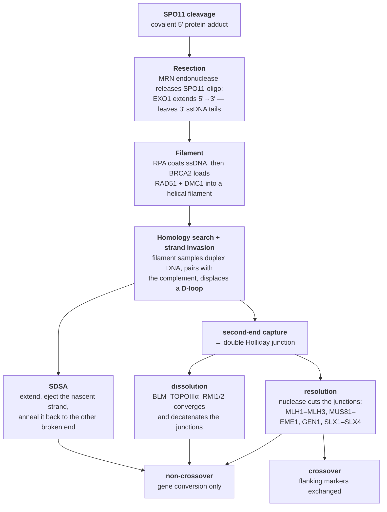

# 18 — Recombination mechanisms

> **Before this:** [Ch 09](../part-02-transmission-genetics/09-mitosis-and-meiosis.md) ·
> [Ch 14](../part-02-transmission-genetics/14-linkage-and-mapping.md) ·
> [Ch 17](17-dna-repair.md) · **Time:** ~40 min

Chapter 14 treated recombination as a black box that emits recombinant chromatids at a
rate proportional to distance. This chapter opens the box. What comes out is stranger than
the black box suggested: the machinery that shuffles your chromosomes is a **DNA repair
pathway**, and meiosis runs it by deliberately damaging the genome.

## What you'll be able to do

- Trace a meiotic double-strand break from SPO11 cleavage to a crossover or non-crossover, naming the intermediate at each step, and predict the flanking-marker and gene-conversion outcome of DSBR versus SDSA resolution
- Explain why the same pathway is a repair mechanism in a somatic cell and a shuffling mechanism in a germ cell, and what differs between the two
- Explain why gene conversion, not crossing over, is the usual fate of a programmed break, and why its GC bias mimics weak selection closely enough to generate false positives in selection scans
- Derive why every bivalent must receive at least one crossover, and quantify what happens when one doesn't
- Explain the hotspot paradox and why PRDM9's rapid evolution resolves it
- Distinguish homologous, site-specific and transpositional recombination by their homology requirements and their products
- Explain how non-allelic homologous recombination between repeats generates recurrent deletions and duplications

## The core idea

Homologous recombination is, mechanically, a **restore-from-replica** operation. A DNA
double-strand break destroys information on both strands at once, so there is nothing left
locally to read across from ([Ch 17](17-dna-repair.md)). The only way to recover the
sequence is to find another copy of that region elsewhere in the cell and copy from it.

A somatic cell does this defensively. Something broke; find the sister chromatid, which is
an identical byte-for-byte replica; copy across; leave no trace. Crossing over is an
unwanted side effect and is actively suppressed.

Meiosis runs the same pathway **offensively**. It makes the breaks on purpose, hundreds of
them, then forbids the safe template — the sister — and forces repair from the *homolog*,
which is a different version of the same region. The physical act of copying from the
homolog, followed by cutting the resulting tangle the right way, exchanges the chromosome
arms. That exchange is the crossover of Chapter 14. It is also, as we will see, mechanically
required for the chromosomes to segregate at all.

> **Meiotic recombination is not a variation-generating mechanism that happens to borrow
> repair proteins. It *is* the repair pathway, deliberately triggered, with its template
> preference reversed and its outcome bias inverted.** Everything else in this chapter
> follows from taking that literally.

---

## 1. One machine, two jobs

| | Somatic HR (repair) | Meiotic HR (programmed) |
|---|---|---|
| **Trigger** | Accidental break: radiation, replication fork collapse, nuclease | SPO11 cuts on purpose, ~200–300 breaks per cell |
| **Preferred template** | Sister chromatid — identical, therefore error-free | Homolog — enforced by a barrier to sister repair (HORMAD proteins, ATR/CHK signalling on the chromosome axis) |
| **Strand-exchange protein** | RAD51 only | RAD51 **and** DMC1, the meiosis-specific paralog that biases toward the homolog |
| **Desired outcome** | Non-crossover. Crossovers between homologs risk loss of heterozygosity | Crossover, at least one per chromosome pair, guaranteed |
| **Timing** | S/G2, when a sister exists | Prophase I, within the synaptonemal complex |
| **When it fails** | Chromosome rearrangements, cancer predisposition (*BRCA1*, *BRCA2*) | Non-disjunction, aneuploid gametes, infertility |

The protein list overlaps almost completely. RAD51, RPA, BRCA2, the MRE11–RAD50–NBS1 (MRN)
complex, EXO1, the resolvases — all of them do both jobs. Meiosis adds a handful of
components (SPO11, DMC1, MSH4–MSH5, and MLH3, which partners the general mismatch-repair
protein MLH1) that *redirect* an existing pathway rather than build a new one. This is why *BRCA2* is both a breast-cancer
gene and an essential meiotic gene, and why tumours that have lost homologous recombination
are killed by PARP inhibitors
([Ch 56](../part-11-human-and-statistical-genomics/56-cancer-genomics.md)).

## 2. Breaking your own chromosomes on purpose

SPO11 is a topoisomerase-like enzyme. Topoisomerases relieve torsional stress by cutting
DNA, letting it swivel, and resealing — the cut is transient and the enzyme stays covalently
attached to the DNA end while the break is open. SPO11 performs the first half of that
reaction and never performs the second. It cuts, stays attached to the 5' end via a covalent
tyrosine link, and leaves.

A cell entering meiosis therefore inflicts on itself **~200–300 double-strand breaks** — the
single most dangerous lesion in DNA biology — at a moment when it has 46 chromosomes to keep
track of. Estimated from RAD51/DMC1 focus counts in mouse and human spermatocytes, that is
roughly one break every 10–15 Mb.

Why accept that risk? Because the break is not only the initiator of exchange, it is the
*search signal*. Homologs have to find each other in a crowded nucleus before they can be
pulled apart correctly, and the resected single-stranded tail from a SPO11 break is the probe
that performs that search. Knock out SPO11 and homologs fail to pair and synapse, meiosis
arrests, and the animal is sterile. The damage is the mechanism.

Note the outcome asymmetry this creates immediately: **the chromatid that gets cut is the
one that loses sequence**, because it is repaired using the uncut homolog as template.
Hold that thought; it detonates in §7.

## 3. From break to invasion



Three steps deserve unpacking.

**Resection** degrades the 5'-ended strand at each side of the break, leaving 3'-ended
single-stranded tails hundreds to a couple of thousand nucleotides long. This is the
committing step: once resected, the break can no longer be blunt-end joined
([Ch 17](17-dna-repair.md)). Resection *is* the switch that selects homology-directed repair
over non-homologous end joining.

**Filament formation.** RPA binds the ssDNA first, removing secondary structure; mediators
(BRCA2 with PALB2 in humans) then exchange RPA for RAD51/DMC1, which polymerise into a
filament that stretches the DNA ~1.5-fold and presents the bases ready to test for
complementarity.

**Homology search** is the step that should bother a programmer. There is no index. The
filament finds its match by colliding with duplex DNA, transiently opening it, testing ~8
bases, and letting go if the test fails — a scan by random collision over a 3.1 Gb search
space, run ~250 times in parallel, completed in hours. It terminates only because the search
space is pre-partitioned by nuclear architecture: chromosome territories and tethering of
breaks to the chromosome axis cut the effective space by orders of magnitude before the
probe starts. When a biological search looks impossibly slow, the geometry usually did most
of the work first.

A successful search produces the **D-loop**: the invading 3' end base-paired to the template
strand, with the donor's identical strand displaced as a single-stranded bubble. That
invading end is now a primer, and a polymerase extends it using the *homolog* as template.
From here the broken chromatid is copying sequence it did not previously have.

## 4. Two endings, and what decides between them

Everything above is shared. The branch comes now.

**SDSA — synthesis-dependent strand annealing.** The extended invading strand is stripped
back out of the D-loop by a helicase and anneals to the ssDNA on the other side of the
break. Gaps fill in, ends ligate. The two duplexes were never covalently joined, so
**flanking markers are not exchanged**. The only trace is that a patch of sequence at the
break site was copied from the homolog. This is a **non-crossover** with **gene conversion**.

**DSBR — double-strand break repair via a double Holliday junction.** The displaced strand
of the D-loop captures the second broken end, synthesis and ligation proceed on both sides,
and you end with two four-way junctions flanking the repaired region. This intermediate can
go either way.

A **Holliday junction** is four strand-ends meeting at one branch point. The branch is
mobile: it migrates along the duplexes without breaking anything, extending or shrinking the
region of **heteroduplex** DNA where one strand comes from each parent. Getting rid of the
junction requires cutting exactly two of the four strands — a two-bit decision — and *which*
pair you cut sets the topology:

```
Single junction, two ways to cut:

  cut the pair of strands that crossed   →  duplexes separate as they went in
                                            flanking markers UNCHANGED

  cut the other pair                     →  duplexes separate swapped
                                            flanking markers EXCHANGED

Double Holliday junction — the outcome is the XOR of the two junctions:

  both junctions cut the same way        →  NON-CROSSOVER (+ conversion tract)
  the two junctions cut differently      →  CROSSOVER     (+ conversion tract)
```

There is also a third exit that avoids cutting altogether: **dissolution**. The BLM
helicase with topoisomerase IIIα (the BTR complex) migrates the two junctions toward each
other until they merge, then decatenates the result. Dissolution can only ever produce a
non-crossover. Loss of BLM causes Bloom syndrome, whose diagnostic cellular phenotype is a
tenfold excess of sister-chromatid exchanges — crossovers that should have been dissolved
and instead got resolved.

Here is the part that textbooks routinely get wrong. The XOR argument makes it look as
though half of all double Holliday junctions should become crossovers. **In meiosis they do
not.** Resolution is directed, not random: a dedicated meiotic resolvase, MutLγ
(MLH1–MLH3) acting with EXO1 and marked by the MutSγ complex (MSH4–MSH5), resolves
designated junctions almost exclusively toward crossover. Non-crossovers overwhelmingly
arise by SDSA and never form a double Holliday junction at all. The coin-flip picture
describes a chemical possibility, not the in vivo statistic.

The arithmetic falls out: ~250 breaks per human meiocyte, ~50 crossovers. **Roughly 80–90%
of programmed double-strand breaks are repaired as non-crossovers.** Crossing over is the
rare outcome, and the abundant outcome is gene conversion.

## 5. Gene conversion: the non-reciprocal half

A crossover is reciprocal — chromatid 1 gets the right arm of chromatid 3 and vice versa,
nothing is created or lost. But the few hundred base pairs around the initiating break are
*not* reciprocal. That region was destroyed on the cut chromatid and rebuilt by copying the
homolog. One allele has been overwritten by the other.

Two mechanisms produce it: **copy from the donor** (the synthesis step in the D-loop) and
**mismatch repair of heteroduplex** (where the two annealed strands disagree, the repair
machinery excises one and rewrites it using the other as template — resolving the conflict
by overwriting rather than merging).

The classic evidence predates all of this molecular detail. Fungi such as *Neurospora* and
yeast keep all four meiotic products in a single ascus, so you can count them directly. A
heterozygote should give 2:2 at every locus. Occasionally an ascus segregates **3:1** (or
6:2 after the post-meiotic mitosis), and sometimes **5:3** — a ratio that is only possible
if one product carried an unrepaired mismatch through the division. Mendel's first law is
violated in a small, specific, mechanistically explicable fraction of meioses.

In humans, non-crossover conversion tracts are short, roughly **50–1,000 bp**, and any given
base is converted at about **5.9 × 10⁻⁶ per generation** — several hundred times the point
mutation rate of ~1.3 × 10⁻⁸ ([verified facts](../reference/verified-facts.md)). Gene
conversion is not a curiosity; it is the most common thing that happens to a heterozygous
site during meiosis, apart from nothing.

Three consequences that matter downstream:

| Consequence | Why |
|---|---|
| **Transmission bias** | An allele that is preferentially converted is transmitted at a rate ≠ 0.5. Selection is not the only way a frequency can change systematically |
| **Homogenisation of gene families** | Tandem duplicates convert one another, so paralogs in an array stay more similar to each other than to their orthologs in other species — **concerted evolution** ([Ch 35](../part-07-molecular-evolution/35-genome-evolution.md)). rRNA arrays are the canonical case |
| **Contamination of phylogenetic and selection signals** | A converted region has a different history from its neighbours. Trees built across a conversion tract are wrong ([Ch 34](../part-07-molecular-evolution/34-phylogenetics.md)) |

### GC-biased gene conversion

The mismatch-repair step is not neutral about which allele it keeps. Faced with a G:T or an
A:C mismatch in heteroduplex, human repair preferentially restores the G:C pair. Measured
from pedigrees, when a conversion event covers a site heterozygous for one GC and one AT
allele, the GC allele is transmitted about **68%** of the time instead of 50%.

Formally this is a transmission bias with the same mathematical form as weak directional
selection favouring GC — it enters the allele-frequency equations in the same place and
behaves the same way, while having nothing to do with survival or reproduction. Its effects
are exactly what you would predict from that:

- **GC content tracks recombination rate** across the genome. High-recombination regions —
  subtelomeric sequence, short chromosomes, male-biased hotspot regions — are GC-rich. Much
  of the "isochore" structure of mammalian genomes is a fossil of where recombination has
  been.
- **It can fix deleterious alleles.** A weakly harmful AT→GC change in a hotspot can be
  driven up in frequency, because the bias acts on transmission regardless of fitness.
- **It generates false positives in selection scans.** Regions of rapid, AT→GC-skewed
  substitution look like adaptive evolution and are frequently not. A large share of "human
  accelerated regions" sit in high-recombination sequence and show precisely the GC skew
  that gBGC predicts. Any test of selection run on recombining sequence has to control for
  it ([Ch 33](../part-07-molecular-evolution/33-neutral-theory-and-selection-tests.md)).

## 6. Why every bivalent gets a crossover

Crossovers are not distributed at random along chromosomes, and not distributed at random
between chromosomes either. Two departures from Poisson, both load-bearing.

**Interference.** One crossover suppresses others nearby — Chapter 14 measures this as a
coefficient of coincidence below 1. Mechanistically, the current leading model is
*coarsening*: a limited pool of pro-crossover protein (HEI10/RNF212 in mammals) diffuses
along the synaptonemal complex, and larger foci grow at the expense of smaller ones, the way
large droplets grow at the expense of small ones in Ostwald ripening. The dynamics
spontaneously produce one winner per region, well spaced. Crossovers designated this way are
**class I** (MutSγ/MutLγ-dependent) and are ~90% of the total in mammals; the remainder are
**class II**, resolved by MUS81–EME1 and showing no interference.

**Assurance and homeostasis.** Every bivalent receives at least one crossover, essentially
without exception, and the total is buffered against the number of breaks: reduce SPO11
activity several-fold in yeast and the crossover count barely moves. This is a control loop
with a setpoint on the *output*, not the input.

Why is that required? Because a crossover is not only genetic — it is **mechanical**. The
chiasma, held together by cohesion distal to the exchange point, is the only physical link
between homologs at metaphase I. It is what lets the spindle pull them in opposite
directions and feel resistance. No crossover means no link, means two univalents that
segregate at random.

Derive the cost. Human male meiosis has a genetic map of about **2,600 cM**, which is 26
Morgans per transmitted gamete and therefore about 52 crossovers per meiocyte (each
crossover involves 2 of 4 chromatids, so one crossover per cell contributes 50 cM). Spread
over 23 bivalents that is 2.26 per bivalent. If placement were Poisson:

```
P(a given bivalent gets zero crossovers)  = e^-2.26          = 0.104
expected achiasmate bivalents per meiosis = 23 × 0.104       = 2.4
P(all 23 bivalents get at least one)      = (1 - 0.104)^23   = 0.080
P(euploid gamete, univalents random)      = (1 - 0.104/2)^23 = 0.29
```

Only 8% of meioses would have every bivalent chiasmate. That is not the same as the gamete
being wrong the other 92% of the time: two univalents still segregate to opposite poles by
luck half the time, so the model's euploid-gamete rate is the last line — about **29%**.
Still catastrophic. The real rate of aneuploidy is far lower than that, which tells you
assurance is enforced rather than lucky. And the argument understates the problem: crossovers
scale with chromosome length, so the smallest autosomes sit closest to the one-crossover
floor. They are the ones that mis-segregate most often — chromosomes 21, 22 and 16 dominate
the trisomies seen at conception. Which of those you ever *see* in a newborn is a separate
question, settled by gene dosage rather than by segregation: only trisomies 21, 18 and 13
carry few enough genes to be tolerated to term, while trisomy 16 — the single most common
autosomal trisomy at conception — is lost in the first trimester without exception
([Ch 20](20-chromosome-abnormalities.md)). Maternal trisomy 21 is associated with reduced or
absent recombination on chromosome 21, or with crossovers placed too near the telomere to
hold. The same constraint explains why the X and Y, sharing only a few megabases of
pseudoautosomal sequence, must nevertheless cross over there in every male meiosis
([Ch 13](../part-02-transmission-genetics/13-sex-linkage.md)).

## 7. Hotspots, PRDM9, and a paradox

Recombination is not uniform along the genome. From linkage-disequilibrium mapping,
**more than 25,000 hotspots** in the human genome, typically **1–2 kb** wide, carry
**~80% of all recombination in ~10–20% of the sequence**. Rate varies by orders of magnitude
over kilobase scales, which is why LD blocks have edges ([Ch 29](../part-05-population-genetics/29-linkage-disequilibrium.md)).

In humans and mice, hotspot positions are set by one protein. **PRDM9** has a
C2H2 zinc-finger array that binds a specific DNA motif — a degenerate 13-mer,
`CCNCCNTNNCCNC`, is found at roughly 40% of human hotspots — and a PR/SET domain that
trimethylates nearby histone H3 on lysine 4 and lysine 36. SPO11 is directed to sites
carrying those marks. Hotspots are therefore **not a property of the DNA sequence alone**;
they are a property of a protein's binding preference, and different PRDM9 alleles specify
different hotspot maps. Two humans can have measurably different recombination landscapes.

Now the paradox, and it is a real one. Recall §2: **the chromosome that is cut is the one
that loses its sequence.** A chromosome carrying an intact PRDM9 binding motif gets cut; it
is repaired from the homolog, which may carry a disrupted motif; the intact motif is
converted to the disrupted one. The active allele destroys itself, at a rate proportional to
how well it works. Hotspots are self-limiting by construction — yet they exist everywhere,
and they are strong.

The resolution: **hotspots are not persistent; the system that makes them is.** PRDM9's
zinc-finger array is a tandem minisatellite that mutates rapidly by unequal exchange between
repeats, and the DNA-contacting residues within it are among the fastest-evolving codons in
the genome, under strong positive selection. Dozens of PRDM9 alleles segregate in humans,
each with a different binding specificity. As soon as one allele has eroded its own target
sites, a variant that targets a new set has an advantage. Hotspots turn over on a timescale
of hundreds of thousands of years, which is why human and chimpanzee hotspot positions
essentially do not overlap despite ~99% sequence identity between the genomes.

The control experiment is provided by species that have lost PRDM9 — and there are many,
because the gene is ancestral to vertebrates (orthologs run from jawless and cartilaginous
fish through coelacanth, turtles, snakes and lizards to mammals) and has been lost repeatedly.
Dogs, wolves and coyotes carry a pseudogene; birds and crocodilians lost it outright. In those
lineages, recombination is targeted to
**CpG islands and promoters** — an open-chromatin default requiring no sequence-specific
targeting protein — and hotspot positions are stable over evolutionary time, because
promoters cannot be eroded away without cost. PRDM9 is best understood as a system for
placing recombination *away* from functional elements, at the price of permanent instability.

**PRDM9 as a speciation gene.** Two mouse subspecies, *Mus musculus musculus* and
*M. m. domesticus*, produce sterile F1 males in one direction of the cross. The responsible
locus, mapped as *Hst1* and identified by positional cloning as *Prdm9*, remains the only
hybrid-sterility gene identified in vertebrates. The mechanism follows directly from erosion:
within each subspecies, PRDM9 target sites on its *own* chromosomes have been degraded by
conversion, while the sites recognised on the *other* subspecies' chromosomes are intact. In
the hybrid, PRDM9 therefore binds asymmetrically — mostly to one homolog — so the break
frequently occurs at a position where the partner chromosome lacks the corresponding site.
Repair and synapsis fail, meiosis arrests, the male is sterile. A gene-conversion bias
operating over tens of thousands of generations becomes a reproductive barrier.

That barrier has a name and a general form, supplied in
[Ch 35A §3](../part-07-molecular-evolution/35A-speciation-and-ecological-genetics.md): this is a
**Dobzhansky–Muller incompatibility**, and PRDM9 is the only one identified to the gene in any
vertebrate. Both requirements of that model are met here and are worth checking against the
mechanism above — each allele is *derived*, and the two sit in *different* lineages, so the
protein–DNA pairing that fails was never assembled inside any population where selection could
have seen it. Note also what the interacting partners are: a protein and a **binding site**, not
two proteins. The hotspot paradox and the speciation gene are one mechanism read at two
timescales.

## 8. Recombination that is not homologous

"Recombination" names several unrelated chemistries. Keeping them apart matters, because
they have different homology requirements, different products, and different failure modes.

| | Homologous | Site-specific | Transpositional |
|---|---|---|---|
| **Requires sequence homology?** | Yes, extensive (hundreds of bp) | No — recognises short defined sites | No |
| **Recognition** | Base-pairing during homology search | Protein binds a specific short sequence | Protein binds the element's own ends |
| **Enzymes** | RAD51/DMC1/RecA + resolvases | Tyrosine or serine recombinases; RAG1/RAG2 | Transposase / integrase |
| **Product** | Crossover or gene conversion between allelic copies | Integration, excision, inversion between defined sites | Element copied or moved to a new location |
| **Examples** | Meiotic crossing over; DSB repair | Phage λ integration; Cre–*lox*; V(D)J | LINE-1, *Alu*, DNA transposons ([Ch 19](19-transposable-elements.md)) |

**Phage λ integration** is the clean case. Integrase, a tyrosine recombinase, plus the host
factor IHF, aligns *attP* on the phage with *attB* on the *E. coli* chromosome — sharing
only a 15 bp core — and swaps strands to insert the phage genome, generating *attL* and
*attR*. Adding the Xis protein runs the reaction backwards. No homology search, no
resection, no repair synthesis; a defined reaction on defined substrates. The domesticated
versions, Cre–*lox* and FLP–*FRT*, are the standard tools for conditional genetics
([Ch 37](../part-08-methods/37-model-organisms-and-screens.md)).

**V(D)J recombination** is site-specific recombination running as a diversity generator. The
antibody and T-cell-receptor loci contain arrays of V, D and J segments, each flanked by a
recombination signal sequence: a conserved heptamer (`CACAGTG`), a spacer of exactly **12 or
23 bp**, and a nonamer (`ACAAAAACC`). RAG1/RAG2 will only join a 12-spacer site to a
23-spacer site — the **12/23 rule** — which is what enforces V-to-J rather than V-to-V
joining. RAG cuts precisely at the heptamer border, generating hairpinned coding ends; those
are opened by Artemis, chewed and extended with random nucleotides by terminal transferase,
and joined by **non-homologous end joining**. Combinatorial choice of segments gives ~10⁶
combinations; the sloppy junction adds several more orders of magnitude. Note what this
implies: a controlled, programmed double-strand break, repaired by the *error-prone* pathway,
where the errors are the point. RAG1/RAG2 is itself descended from a domesticated
transposon, which is exactly what its chemistry looks like.

## 9. NAHR: homology in the wrong place

Homologous recombination identifies its template by sequence similarity. The human genome
contains millions of repeated sequences with high identity — segmental
duplications, ~1.1 million *Alu* elements, ~46% transposable-element-derived sequence
([verified facts](../reference/verified-facts.md)). The alignment step cannot always tell an
allelic copy from a paralogous one.

**Non-allelic homologous recombination** is recombination between two repeats that are
similar in sequence but not at the same locus. The requirement is a few hundred base pairs
of near-perfect identity — a minimum efficient processing segment — which most low-copy
repeats far exceed, typically running 10–400 kb at 95–99% identity.

The product depends on the geometry of the repeats:

```
DIRECT repeats on homologous chromosomes (misaligned pairing, then crossover):

  chr A   ──[REP]═════ X ═════[REP]──        crossover between the mis-paired REPs
  chr B   ──[REP]═════ X ═════[REP]──                    |
                                                         v
  product 1  ──[REP]──                       DELETION of X   (one copy of the region)
  product 2  ──[REP]═════ X ═════ X ═════[REP]──  DUPLICATION (three copies)

INVERTED repeats on the same chromosome  →  INVERSION of the intervening segment
Repeats on non-homologous chromosomes    →  RECIPROCAL TRANSLOCATION
```

Two features make this clinically distinctive. First, the products are **reciprocal**: the
deletion and the duplication are made in the same event, in the same meiosis, and both are
seen as human syndromes. Second, the breakpoints are **recurrent** — they fall inside the
repeats, so unrelated patients have essentially the same rearrangement, to within the length
of the repeat.

The textbook example is 17p12. A 1.4 Mb segment containing *PMP22* is flanked by 24 kb
repeats (CMT1A-REP) sharing ~98.7% identity. NAHR between them deletes or duplicates the
segment. Three copies of *PMP22* cause Charcot–Marie–Tooth disease type 1A; one copy causes
hereditary neuropathy with liability to pressure palsies. Same event, opposite products,
different disease — a pure gene-dosage effect. The same architecture explains the recurrent
deletions at 22q11.2, 7q11.23, 15q11–q13 and 16p11.2
([Ch 20](20-chromosome-abnormalities.md)).

For a programmer the analogy is exact: NAHR is a **read mismapping to a paralogous repeat**,
except that the aligner is a nuclease and the consequence is written back to disk.

---

## Common misconceptions

| What people think | What's actually true |
|---|---|
| Crossovers exist to generate variation | They are mechanically required for homolog segregation — the chiasma is the physical link the spindle pulls against. Variation is a consequence, and organisms with achiasmate meiosis show what happens without one |
| Meiotic recombination starts when chromosomes accidentally break | SPO11 makes ~200–300 double-strand breaks deliberately. Without them, homologs do not pair, synapse or segregate |
| Recombination is a reciprocal exchange | The *crossover* is reciprocal; the few hundred bp around the break are not. That patch is copied from the homolog — gene conversion, non-reciprocal, and the more common outcome |
| Half of double Holliday junctions resolve to crossovers | That is the geometry, not the biology. Meiotic resolution is directed by MutLγ almost entirely toward crossover, and most non-crossovers arise by SDSA without ever forming a junction |
| Gene conversion is a rare oddity | ~80–90% of programmed meiotic breaks resolve as non-crossover conversions. Per base per generation, conversion is hundreds of times more likely than point mutation |
| Recombination hotspots are encoded in the DNA | In humans they are specified by PRDM9 binding. Different PRDM9 alleles give different hotspot maps, so the recombination landscape differs between individuals — and dogs, lacking PRDM9, use promoters instead |
| GC-biased gene conversion is a form of selection | It is a meiotic transmission bias, independent of fitness. It enters the equations where selection does, which is exactly why it produces false positives in selection scans |
| Recombination is purely a shuffling process, not a mutational one | Crossover sites carry elevated de novo mutation rates, and NAHR between repeats generates the recurrent deletions and duplications behind many genomic disorders |

## Worked example: one break, tracked to both endings

A bivalent, heterozygous at two flanking markers and at the hotspot itself. `H` is a PRDM9
binding motif that is intact; `h` is the same site with the motif disrupted by a point
mutation, so PRDM9 does not bind it.

```
                    marker         hotspot        marker
homolog 1  ────────── A ─────────── H ─────────── B ──────   chromatid 1
           ────────── A ─────────── H ─────────── B ──────   chromatid 2
homolog 2  ────────── a ─────────── h ─────────── b ──────   chromatid 3
           ────────── a ─────────── h ─────────── b ──────   chromatid 4
```

**Step 1.** PRDM9 binds only the intact motif, so H3K4me3 is deposited on homolog 1 and
SPO11 cuts **chromatid 1** at the hotspot. Chromatid 3 is not cut.

**Step 2.** MRN releases SPO11 with a short oligonucleotide; EXO1 resects to 3' tails. The
`H` allele on chromatid 1 is now physically gone.

**Step 3.** RAD51/DMC1 filament invades homolog 2. Repair synthesis uses `h` as template.

**Step 4a — SDSA (the common outcome, ~80–90% of breaks):**

```
chromatid 1  ── A ─────── h ─────── B ──   converted H→h, flanks NOT exchanged
chromatid 2  ── A ─────── H ─────── B ──   untouched
chromatid 3  ── a ─────── h ─────── b ──   donor, unchanged
chromatid 4  ── a ─────── h ─────── b ──   untouched
```

**Step 4b — DSBR with the double Holliday junction resolved to crossover:**

```
chromatid 1  ── A ─────── h ─────── b ──   converted AND flanks exchanged
chromatid 3  ── a ─────── h ─────── B ──   reciprocal crossover product
chromatid 2  ── A ─────── H ─────── B ──   parental
chromatid 4  ── a ─────── h ─────── b ──   parental
```

**Step 5 — count alleles at the hotspot.** Before: 2 `H` : 2 `h`. After, in *both* outcomes:
**1 `H` : 3 `h`**. The crossover/non-crossover decision changes the flanking markers and
nothing about the conversion.

**Step 6 — the transmission consequence.** In a meiosis where the hotspot fires,
P(transmit `H`) = 1/4 rather than 1/2. If the hotspot fires in a fraction *f* of heterozygous
meioses:

```
E[P(transmit H)] = f·(1/4) + (1-f)·(1/2) = 1/2 − f/4
```

which is a transmission deficit of *f*/4 against the allele that is doing the work. Even
*f* = 0.02 gives a deficit of 0.005 — comparable to a selection coefficient of 5 × 10⁻³,
one to two orders of magnitude above the drift threshold 1/(2*N*ₑ) for humans.

And it acts fast. A deficit *d* applied in every heterozygote gives Δ*p* = −2*pqd*, so the
log-odds of the active allele fall linearly at 2*d* = 0.01 per generation, taking it from
*p* = 0.5 to *p* = 0.01 in ln(99)/0.01 ≈ 460 generations. The active hotspot allele is
removed on a timescale of roughly a thousand generations at *f* = 0.02, and tens of thousands
only if the site fires in a far smaller fraction of meioses.

**Step 7 — resolve the paradox.** Hotspots cannot persist; only the *mechanism for creating
new ones* can. That mechanism is PRDM9's rapidly mutating zinc-finger array, and the
prediction it makes — that hotspot locations should turn over faster than species diverge —
is confirmed by the near-total non-overlap of human and chimpanzee hotspot maps.

## Connections

- **Back to:** [Ch 09](../part-02-transmission-genetics/09-mitosis-and-meiosis.md) (meiosis
  and the synaptonemal complex); [Ch 14](../part-02-transmission-genetics/14-linkage-and-mapping.md)
  (the crossover as a measured recombination fraction — this chapter supplies its mechanism);
  [Ch 17](17-dna-repair.md) (homologous recombination as one of the DSB repair options);
  [Ch 16](16-mutation.md) (the mutation rate this chapter compares conversion against)
- **Forward to:** [Ch 19](19-transposable-elements.md) (transposition, and the repeats NAHR
  uses); [Ch 20](20-chromosome-abnormalities.md) (NAHR-driven genomic disorders and
  non-disjunction); [Ch 20A](20A-bacterial-and-phage-genetics.md) (RecA-mediated strand
  invasion as an *assay*: every transferred fragment must recombine in to be inherited, which
  is what makes cotransduction and interrupted mating into rulers — plus λ site-specific
  recombination, a second mechanism that needs no homology at all); [Ch 29](../part-05-population-genetics/29-linkage-disequilibrium.md)
  (hotspots are why LD has block structure);
  [Ch 33](../part-07-molecular-evolution/33-neutral-theory-and-selection-tests.md) (gBGC as a
  confound in selection tests);
  [Ch 35](../part-07-molecular-evolution/35-genome-evolution.md) (concerted evolution of gene
  families by conversion);
  [Ch 35A §3](../part-07-molecular-evolution/35A-speciation-and-ecological-genetics.md) (§7's
  mouse hybrid sterility named as a Dobzhansky–Muller incompatibility and derived as one — why
  both alleles must be derived and in different lineages, and why such incompatibilities
  accumulate with the square of divergence rather than in proportion to it);
  [Ch 38](../part-08-methods/38-genome-editing.md) (HDR-based
  editing is this pathway, hijacked);
  [Ch 56](../part-11-human-and-statistical-genomics/56-cancer-genomics.md) (HR deficiency,
  *BRCA1/2*, synthetic lethality)

## Check yourself

**1. SPO11 knockouts are sterile, and the chromosomes fail to pair. Why does a repair-initiating enzyme turn out to be required for pairing?**

<details><summary>Answer</summary>

Because the resected single-stranded tail is the homology probe. Pairing is not achieved by
some separate recognition system that matches chromosomes end to end; it is achieved by
several hundred RAD51/DMC1 filaments each searching for complementary sequence, finding it
on the homolog, and thereby tethering the two chromosomes together at many points, which
nucleates synapsis. No breaks, no probes, no pairing. The damage is the search mechanism.

(Some organisms — *Drosophila* females, *C. elegans* — pair via dedicated pairing centres
and are the exception that shows this is one solution rather than the only one.)

</details>

**2. A human meiocyte makes ~250 double-strand breaks and ~50 crossovers. What happened to the other ~200, and how would you detect them in sequence data?**

<details><summary>Answer</summary>

They were repaired as non-crossovers, almost all by SDSA. Each leaves a gene conversion
tract of roughly 50–1,000 bp in which the recipient chromatid now carries the donor's
alleles.

To detect them you need phased trio (ideally three-generation) sequencing: find short
segments in a transmitted haplotype where the parental phase switches to the other parental
haplotype and switches back within a kilobase, with no exchange of flanking markers. A phase
switch that does *not* return is a crossover; one that returns within a short tract is a
non-crossover conversion. This is exactly how the 68% GC transmission bias was measured.

</details>

**3. Why is the classic "resolve the two Holliday junctions in the same or opposite orientation, 50/50" story a poor description of meiosis?**

<details><summary>Answer</summary>

Two reasons. First, most non-crossovers never form a double Holliday junction — they exit
earlier by SDSA, so the junction-resolution step is not where the crossover/non-crossover
decision is made for the majority of events. Second, junctions that *do* form in meiosis are
not resolved by an unbiased nuclease: the sites are pre-designated (MutSγ, MSH4–MSH5), and
MutLγ (MLH1–MLH3) resolves them almost exclusively toward crossover. The decision is made
upstream, by designation; the geometry merely permits both outcomes.

</details>

**4. A scan for positive selection flags a rapidly evolving non-coding region. It sits in the top decile of recombination rate and its substitutions are overwhelmingly AT→GC. What is your first objection?**

<details><summary>Answer</summary>

GC-biased gene conversion. In high-recombination sequence, heteroduplex mismatch repair
transmits the GC allele ~68% of the time, which drives AT→GC substitutions to fixation at
elevated rates with no fitness involvement whatsoever. The signature — accelerated
substitution, concentrated in high-recombination regions, directionally skewed toward GC —
is precisely what gBGC produces and what adaptive evolution does not specifically predict.

The correct test is to ask whether the acceleration survives conditioning on recombination
rate and whether the substitutions are directionally symmetric with respect to base
composition (GC→AT changes should be accelerated too, under real selection). Many "human
accelerated regions" fail this.

</details>

**5. Why do NAHR-driven deletions recur at the same breakpoints in unrelated patients, while most other structural variants do not?**

<details><summary>Answer</summary>

Because the breakpoint is not chosen by chance — it is wherever the two low-copy repeats
align. The repeats are fixed features of the reference architecture, present in everyone, so
every independent NAHR event at that locus produces a rearrangement with essentially the
same endpoints, resolvable only to within the repeat length. That makes these **recurrent**
CNVs, and it is why they were characterisable as syndromes long before sequencing.

Structural variants formed by non-homologous mechanisms (end joining, replication-based
template switching) have breakpoints determined by where a fork happened to collapse, so
they are **non-recurrent** and patient-specific. The recurrence pattern is diagnostic of the
mechanism.

</details>
