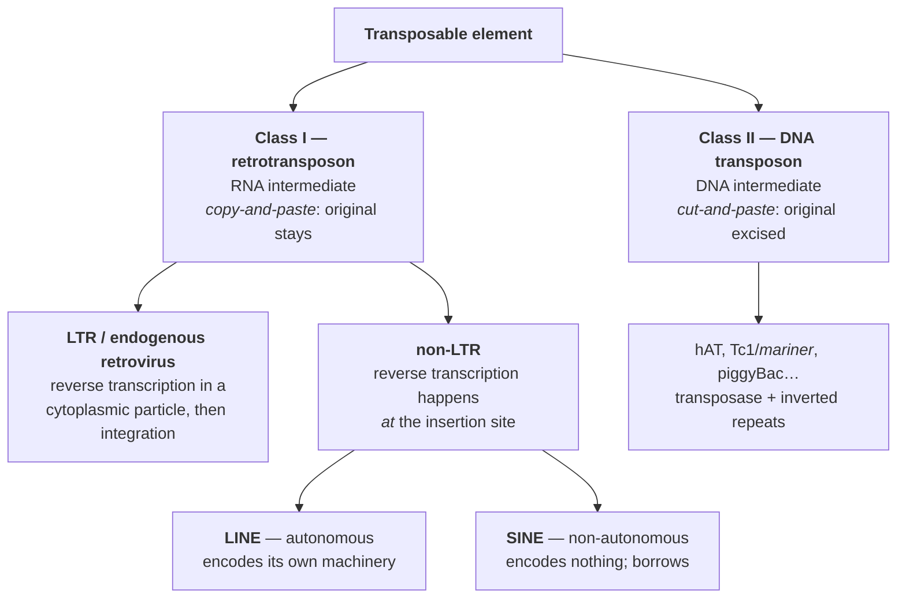

# 19 — Transposable elements

> **Before this:** [Ch 16](16-mutation.md) · [Ch 18](18-recombination-mechanisms.md) · [Ch 03](../part-01-molecular-foundations/03-genomes-chromosomes-chromatin.md) · **Time:** ~35 min

## What you'll be able to do

- Classify any mobile element as Class I or Class II, and say what the intermediate is
- Derive the signatures of an L1 insertion — target site duplications, a poly(A) tail, 5'
  truncation — from the copying mechanism rather than memorising them
- Explain why ~500,000 L1 copies coexist with only ~80–100 that can still move
- Name the three distinct ways TEs cause disease, with a documented human example of each
- Diagnose a mobile-element insertion or an Alu–Alu deletion from the read-level evidence —
  soft-clipped reads, read depth, discordant pairs — and say why a standard exome pipeline
  reports nothing
- Describe germline TE defence (piRNA, KRAB-ZFP/TRIM28, DNA methylation, APOBEC3) as an arms
  race rather than housekeeping
- Argue both sides of "parasite or raw material" using syncytin, RAG1/RAG2 and MER41

## The core idea

Roughly **46% of the human genome is derived from transposable elements**
([verified-facts](../reference/verified-facts.md), T2T-CHM13 annotation). That is not a fact
about human biology. It is a fact about what happens when self-replicating sequences get
access to a germline.

A transposable element encodes the means of making more copies of itself *within the genome it
already occupies*. It does not need to help you. It needs only to raise its own copy number
faster than the host removes it. Selection acts at two levels at once — on the element,
favouring replication; on the organism, favouring suppression — and your genome is the
standing equilibrium of that conflict.

> A transposable element is not a *feature* of your genome. It is a lineage of self-replicating
> sequence resident in your ancestors' germline for tens of millions of years, whose interests
> and yours coincide only by accident. Almost every fact below — the copy numbers, the
> elaborate silencing machinery, the handful of domesticated genes — follows from taking that
> sentence literally.

---

## 1. Two ways to move

The primary split is the intermediate: RNA or DNA. Copy-and-paste versus cut-and-paste — and
that is not an analogy, it is the standard vocabulary.



The asymmetry matters. **Class II transposition is copy-number-neutral by default** — the
element leaves one site and arrives at another. **Class I transposition is strictly additive**:
the source is transcribed, never excised, so every success adds one copy. Given tens of
millions of years and no ceiling other than host defence, an unbounded copying process is
exactly what you would expect to dominate. It does.

An element is **autonomous** if it encodes the proteins that move it. Non-autonomous elements
are parasites of parasites: they supply only a substrate the autonomous machinery will accept.
As with any shared library, all that matters is matching the calling convention.

## 2. The human catalogue

| Class | Family | Copies | Genome share | Autonomous? |
|---|---|---|---|---|
| I, non-LTR | **LINE-1 (L1)** | ~500,000 | ~17% | **yes — the only one in humans** |
| I, non-LTR | **Alu** (SINE) | ~1.1 million | ~11% | no |
| I, non-LTR | **SVA** | ~2,700 | <0.2% | no |
| I, non-LTR | older LINEs (L2), older SINEs (MIR) | — | ~6% | no (all dead) |
| I, LTR | **ERVs** and solo LTRs | — | ~8% | no (all dead in humans) |
| II | DNA transposons (hAT, Tc1/*mariner*…) | — | ~3% | no (none active ~37 Myr) |

Those sum to ~45% on GRCh38; T2T-CHM13, which resolved the centromeres and acrocentric short
arms, gives **~46%**. Treat it as a **lower bound** — a copy that landed 200 million years ago
has been decaying by point mutation ever since and eventually stops being recognisable. The
measured fraction is a function of detection sensitivity and has risen every time methods
improved.

**Only L1 is autonomous.** Every new insertion in a living human — Alu, SVA, processed
pseudogene, or L1 itself — is catalysed by L1 protein. One family holds the engine for all of
them, which is why silencing L1 is the load-bearing job in §6.

**ERVs are fossils of germline infection.** A retrovirus infecting a somatic cell is an
evolutionary dead end; one that integrates in a germ cell becomes a heritable locus. Most human
ERVs are now **solo LTRs** — the internal *gag/pol/env* was deleted by recombination between
the element's own two LTRs, leaving one behind. That leftover LTR is still a promoter, which
matters in §7.

**Human DNA transposons are extinct**, last active ~37 million years ago. That is a fact about
humans, not about DNA transposons — they are busy in maize, *Drosophila* and bacteria, and
resurrected versions (Sleeping Beauty, piggyBac) are standard lab tools
([Ch 37](../part-08-methods/37-model-organisms-and-screens.md)).

## 3. How L1 copies itself

A full-length L1 is **~6 kb**: a 5' UTR carrying an internal RNA polymerase II promoter, then
two open reading frames, then a 3' poly(A) signal.

- **ORF1p** (~40 kDa) — a trimeric nucleic-acid chaperone that coats RNA
- **ORF2p** (~150 kDa) — two catalytic domains, an **endonuclease** and a **reverse transcriptase**

Both bind their *own* transcript preferentially — **cis preference** — which is why L1 copies
itself far more readily than anything else, and why Alu has to be opportunistic.

The mechanism is **target-primed reverse transcription (TPRT)**. Follow it in detail, because
every diagnostic signature falls out of it.

```
STEP 1  ORF2p endonuclease nicks one strand at a degenerate 5'-TTTT/AA-3' consensus

        5'- G C A T T T T ¦ A A G C T -3'      <-- nick, TOP strand as drawn
        3'- C G T A A A A   T T C G A -5'
                        ^  free 3'-OH, at the end of a run of T

STEP 2  the L1 mRNA's poly(A) tail base-pairs with that exposed T-rich strand

        5'- G C A T T T T-OH
                    | | | |
                3'-(A A A A ... L1 mRNA ... 5')

STEP 3  reverse transcriptase extends the DNA 3'-OH along the RNA template.
        The RNA is read 3'->5', so the cDNA is built from the element's
        3' END backwards toward its 5' end.

STEP 4  staggered second nick on the BOTTOM strand, 7–20 bp away;
        second-strand synthesis; ligation

        5'- G C A T T T T  A A G C T N N [(A)n══ new L1 ══]  A A G C T N N -3'
                           ^^^^^^^^^^^^^                     ^^^^^^^^^^^^^
                           target site duplication — the bases lying between
                           the two nicks, now on both flanks: identical, direct

        Both nicks on one strand would duplicate nothing. It is the stagger
        across the two strands that leaves single-stranded target sequence at
        each end, and filling that in is what writes the repeat twice — which
        is why the nick spacing IS the TSD length. The insert reads 3'-end
        first here: its poly(A) sits on the left, where the T-tract primed it.
```

| Signature | Why the mechanism produces it |
|---|---|
| **Flanking direct repeats (TSDs), 7–20 bp** | The two nicks are staggered; filling in duplicates the intervening bases |
| **Poly(A) tail at the insert's 3' end** | It was the primer |
| **5' truncation, almost always** | Synthesis starts at the 3' end, so any interruption leaves the 5' end unmade. The direction of failure is fixed by the chemistry |
| **3' transductions** | L1's own poly(A) signal is weak, so Pol II reads through into flanking DNA and carries it along — a lineage tag identifying which source element fired |

The same machinery acting *in trans* on an ordinary mRNA produces a **processed pseudogene**:
an intronless genomic copy with a poly(A) tail and TSDs. GENCODE 50 annotates **14,702
pseudogenes**; many arose exactly this way
([Ch 35](../part-07-molecular-evolution/35-genome-evolution.md)).

**Alu** is ~300 bp, derived from **7SL RNA** (the RNA of the signal recognition particle),
transcribed by RNA polymerase III from an internal promoter, and encodes nothing. Its whole
strategy is to be an abundant poly(A)-tailed transcript sitting near translating ribosomes —
where ORF2p is newly made — and capture it before cis preference does. **SVA** is a
hominid-specific composite (hexamer repeat + Alu-like region + VNTR + a HERV-K fragment),
likewise L1-dependent.

Alu outnumbers L1 two to one with no engine of its own: short, cheap, abundantly transcribed,
and individually less deleterious to insert. A payload optimised for the library it hijacks.

## 4. Why the graveyard is so large

Half a million L1 copies; roughly **80–100 retrotransposition-competent** in a typical human
genome, with about **six "hot" elements accounting for most measured activity**. Two mechanical
causes.

**5' truncation.** TPRT builds the copy 3'-end-first, so an incomplete reaction deletes the 5'
UTR — which contains the promoter. A truncated L1 cannot be transcribed, and what cannot be
transcribed cannot copy itself again. The dominant failure mode destroys precisely the part
needed for the next round. Only a few thousand of the ~500,000 copies are full length.

**Mutational decay.** From the moment it lands, a copy is ordinary neutral sequence accumulating
substitutions at ~1.1–1.3 × 10⁻⁸ per bp per generation ([Ch 16](16-mutation.md)). Two intact
ORFs are required; one nonsense or frameshift mutation in either kills the element, and nothing
selects against that. A copy that landed 10 million years ago has had ~400,000 generations to
break.

A TE family therefore behaves like a branching process in which most lineages are sterile at
birth and the rest sterilise stochastically. **The 46% is overwhelmingly a fossil record, not
an active threat** — but the active fraction is not zero, and that is where the disease is.

## 5. McClintock, and why the field would not have it

Barbara McClintock worked out transposition in maize in the 1940s from cytogenetics and
breeding alone, with no molecular biology at all. She identified **Ds** (*Dissociation*), which
broke the chromosome at a specific site, and **Ac** (*Activator*), required for Ds to do
anything — both of which changed position between generations. Ac encodes a transposase; Ds
elements are internally deleted Ac derivatives retaining the ends but not the enzyme.
Autonomous and non-autonomous, deduced from kernel colour. She published it in 1950.

The reception was poor, and the usual explanation — that she was dismissed for being a woman —
is too simple to be useful. She was elected to the National Academy of Sciences in 1944 (the
third woman ever) and became the first woman president of the Genetics Society of America in
1945, both *before* the transposition work, and was securely funded throughout. The resistance
was substantive:

- **It contradicted the operative model.** Genes were beads on a string in fixed order.
  Mapping — the field's entire methodology
  ([Ch 14](../part-02-transmission-genetics/14-linkage-and-mapping.md)) — presupposes loci stay
  put. A mobile element does not modify that model; it breaks its premise.
- **The evidence was maize cytogenetics**, which few could evaluate and almost nobody could
  reproduce, just as the field's centre of gravity moved to phage and *E. coli*.
- **She framed them as "controlling elements"** — regulators of expression — a second
  unacceptable claim stacked on the first, and ahead of the operon.

Vindication came from bacterial insertion sequences in the 1960s–70s and then from cloning,
which made the elements directly visible. The Nobel Prize followed in **1983**, unshared. The
lesson is not that scientists are prejudiced; it is that an observation invalidating a field's
core methodological assumption is extraordinarily expensive to accept, and will be resisted
until it can be shown in a system the field already trusts.

## 6. Three ways TEs cause disease

Around **100–125 germline retrotransposon insertions causing single-gene disease** are
documented — Alu most numerous, then L1, then SVA. Certainly an undercount, because standard
exome pipelines are close to blind to them (see the worked example).

**(a) Insertional inactivation.** In 1988 Kazazian and colleagues screened 240 unrelated
haemophilia A patients and found, in two, a *de novo* L1 insertion into **exon 14 of *F8*** —
3.8 kb in one patient, 2.3 kb in the other, both 5'-truncated and both ending in a poly(A)
tract — absent from both parents and traceable to a full-length source L1 elsewhere. Since
then: Alu into *NF1* (neurofibromatosis), Alu into *BTK* (X-linked agammaglobulinaemia), SVA
into *FKTN* (Fukuyama muscular dystrophy, a Japanese founder allele). Intronic insertions can
be as damaging as exonic ones, because L1 sequence carries splice sites and premature poly(A)
signals.

**(b) Non-allelic homologous recombination.** Quieter, quantitatively larger, and requiring no
element to be active. A million Alu copies at ~11% divergence are a million dispersed substrates
for homologous recombination ([Ch 18](18-recombination-mechanisms.md)).

```
    correct alignment                  misalignment between dispersed Alus
    ═Alu1═[ exons 3-8 ]═Alu2═          ═Alu1═[ exons 3-8 ]═Alu2═
    ═Alu1═[ exons 3-8 ]═Alu2═               ╲__________________╱
                                        ═Alu1═════════════════Alu2═
    crossover -> no change              crossover -> exons 3-8 deleted
```

Alu–Alu recombination causes deletions in *LDLR* (familial hypercholesterolaemia), *MSH2*
(Lynch syndrome), *BRCA1* and *VWF*. The repeat is not a mutagen; it is a **latent ambiguity in
the alignment** that recombination occasionally resolves the wrong way — the biological version
of a diff over a file full of near-identical blocks.

**(c) Exonisation.** An intronic antisense Alu already supplies half an exon: read in the
direction of transcription its poly(A) appears as a poly(T) run, which the spliceosome accepts
as a polypyrimidine tract, so a usable cryptic 3' acceptor is already there. What is missing is
the other end, and one point mutation can supply it — in *OAT*, a G→C transversion created a
new 5' donor site inside the element, which activated that waiting acceptor and spliced a
142-nt Alu-derived "exon" that never existed into the mRNA, causing gyrate atrophy. Roughly 5%
of alternatively spliced human exons are Alu-derived, which makes exonisation one mechanism
seen from two directions: a disease mechanism when it wrecks a gene, a source of new coding
sequence when it does not.

## 7. Host defence as an arms race

Germline insertions are permanent and heritable; somatic ones affect one lineage. The heavy
machinery is accordingly germline-focused, and layered.

| System | Mechanism | Programmer's view |
|---|---|---|
| **piRNA** | 24–31 nt PIWI-associated small RNAs transcribed from **piRNA clusters** — regions dense in broken TE fragments — guide cleavage of TE transcripts and self-amplify by "ping-pong" | A signature database built by capturing the malware itself |
| **KRAB zinc fingers** | ~350 KZFPs, the largest human TF family, mostly clustered on chromosome 19; each recognises a TE family and recruits **TRIM28/KAP1** → SETDB1 → H3K9me3 → heterochromatin | Per-family signature matching, hard-coded and under selection |
| **DNA methylation** | CpG methylation of the L1 5' UTR shuts its promoter off | Persistent config, copied through cell division |
| **APOBEC3** | Seven cytidine deaminases clustered on chromosome 22 restrict L1 and Alu | Corrupting the payload in transit |

KZFPs are the clearest **Red Queen** dynamic: a KZFP recognises a TE sequence, descendants that
escape recognition replicate more, the KZFP locus duplicates and its DNA-contacting residues
evolve rapidly to re-cover the escapees. KZFP clusters expand and turn over at a rate tracking
the arrival of new TE families.

The failure mode of any signature-based defence is a family with no signature. In *Drosophila*,
crossing a female from a strain lacking **P elements** to a male carrying them yields offspring
whose maternally supplied piRNA pool matches nothing in P. P transposes freely, causing
sterility and chromosome breakage. **Hybrid dysgenesis is a defence system missing a database
entry.**

Two windows open the door in mammals: **germ cell development** and the **early embryo**, both
of which globally erase and rewrite DNA methylation
([Ch 23](../part-04-gene-regulation/23-chromatin-and-epigenetics.md)). L1 expression rises in
exactly those windows, which is where new germline insertions come from. The other place
silencing collapses is **tumours**
([Ch 56](../part-11-human-and-statistical-genomics/56-cancer-genomics.md)).

## 8. Domestication

Occasionally the host stops fighting a sequence and starts using it — **exaptation**.

**Syncytin.** The placenta requires trophoblast cells to fuse into a continuous multinucleate
layer. The fusion is performed by **syncytin-1**, encoded by ***ERVW-1***, which is the *env*
gene of a HERV-W endogenous retrovirus — the protein a retrovirus uses to fuse with a target
cell. A second, syncytin-2 (*ERVFRD-1*), comes from a different ERV; mice use syncytin-A and -B
captured from yet others. The mammalian placenta has been re-engineered from viral fusion
machinery **independently in at least six lineages**.

**RAG1/RAG2.** V(D)J recombination — the cut-and-paste that generates antibody diversity — is
run by a domesticated transposase from a **RAG-like (Transib-related) DNA transposon**, and the
recombination signal sequences it recognises are the transposon's terminal inverted repeats.
The clincher is **ProtoRAG** in the lancelet: an intact ancestral element with convergently
oriented RAG1-like and RAG2-like genes between TIRs, still capable of excision and transposition.
Your adaptive immune system is a cut-and-paste transposon pointed at a single locus.

**Regulatory rewiring** is the largest effect by volume. A TE brings its own promoter and
transcription-factor binding sites, so one family can install the same regulatory input at
thousands of loci at once — a genome-wide find-and-replace no point mutation could achieve. The
best-characterised case: the **MER41** ERV family carries STAT1 sites, and nearly a thousand
MER41 copies in the human genome are STAT1-bound. One of them is the only STAT1 site within
50 kb of *AIM2*; delete it with CRISPR and the cell can no longer induce AIM2 in response to
interferon-γ. MER41-like elements with STAT1 sites colonised bats, carnivores and artiodactyls
independently.

## 9. Parasite, or raw material?

Both, and the tension is the substance.

The **parasite** reading is correct mechanistically: TEs replicate at the host's expense, cause
disease, and provoke an arms race that has consumed enormous evolutionary effort. The **raw
material** reading is correct evolutionarily: TEs are the largest single source of new sequence,
they install regulatory modules in parallel across thousands of loci, they supply the repeats
that make duplication by NAHR possible, and they have been domesticated into the placenta and
the immune system.

These are claims about different timescales. Over one generation a TE is a mutagen; over ten
million generations, a mutagen with a distinctive, non-random, *modular* signature is a source
of structured variation. Selection has no foresight
([Ch 00](../part-00-orientation/00-the-whole-story.md)) — nothing preserved a TE *for* future
usefulness. An enormous number of insertions occurred, almost all neutral or bad, and the
vanishing fraction that happened to be useful were retained afterwards by ordinary selection.

Which is why "junk DNA" fails in both directions. Calling the 46% junk asserts that inert today
means inert forever and ignores the domesticated fraction. Calling it all functional confuses
*being transcribed or bound* with *doing something the organism needs*. The honest statement is
uncomfortable and precise: **most TE-derived sequence does nothing, a minority does something,
the boundary moves over evolutionary time, and the only way to know which category a given copy
is in is to test it.**

---

## Common misconceptions

| What people think | What's actually true |
|---|---|
| Transposons are constantly jumping around inside you | In almost every somatic cell nothing moves. Activity is confined to windows where silencing relaxes: germ cell development, the early embryo, some neurons, tumours. The 46% accumulated over hundreds of millions of years, not over your lifetime |
| Retrotransposons cut themselves out and move | Only Class II elements excise. A retrotransposon is transcribed and a *new* copy inserted elsewhere; the original never leaves. Hence a single Class I element can never relocate: transposition only ever adds copies. Copy *number* is a different matter — it falls again by deletion and by drift removing insertions, so the genome does not simply ratchet upward |
| Alu must be autonomous, given a million copies | Copy number measures success, not self-sufficiency. Alu encodes no protein at all. It is short, cheap, Pol III-transcribed at high abundance, and hijacks L1's ORF2p — the most successful parasite of a parasite in the genome |
| 46% is the true TE content | It is a lower bound set by detection. Copies older than a few hundred million years have decayed past recognition, and the estimate rises whenever alignment sensitivity or assembly completeness improves |
| ERVs are infections that "got stuck" in us | Specifically *germline* infections — a somatic one dies with the host. And most human ERVs are now solo LTRs: the internal genes recombined out between the element's own LTRs, leaving a lone promoter |
| McClintock was ignored because she was a woman | She was in the National Academy by 1944 and led the Genetics Society by 1945. The binding constraint was that transposition invalidated the fixed-locus model underpinning all genetic mapping, shown in a system the field was abandoning. Prejudice was real but not the main obstacle |
| Domestication shows TEs are "there for a reason" | Exaptation is retrospective. Selection cannot retain a useless sequence against future use. Syncytin was captured independently in at least six mammalian lineages precisely because it was contingent — whatever *env* gene was lying around got used |

## Worked example

**A 4-year-old boy has severe haemophilia A. Clinical exome sequencing of *F8* reports no
pathogenic variant. Where did the mutation go?**

*F8* spans ~186 kb at Xq28 (GRCh38, chrX ≈ 154.8–155.0 Mb, minus strand). The phenotype is
unambiguous and X-linked ([Ch 13](../part-02-transmission-genetics/13-sex-linkage.md)), so the
negative result is a statement about the assay, not the patient.

**Step 1 — enumerate what an exome cannot see.** Exome capture reports substitutions and small
indels inside captured intervals. It systematically misses deep intronic variants, the recurrent
intron-22 inversion (itself generated by NAHR between repeats — the commonest severe haemophilia
A allele), and **large insertions**. A read carrying a 3.8 kb insertion does not align across it:
it soft-clips, and a caller expecting substitutions discards it.

**Step 2 — re-examine the raw alignment, not the variant calls.** In short-read WGS, look at
exon 14 for two things:

```
reference  ... A C T G G A A T | T T T T A A G ... exon 14
reads      ─────────────────────┐
           ─────────────────────┤  <- many reads soft-clipped at the SAME base
           ─────────────────────┘     (a sharp boundary, not scattered mismatches)

           plus: read pairs whose mate maps to L1 consensus, or fails to map
```

That combination is the canonical mobile-element-insertion call
([Ch 46](../part-10-functional-genomics/46-variant-calling.md)).

**Step 3 — assemble the clipped tails and check the mechanism's fingerprints.** Suppose local
assembly recovers, in order: L1 3'-end sequence, a poly(A) run, then flanking genome resuming.

| Check | Expected under TPRT | Meaning |
|---|---|---|
| Sequence just 5' of the insert | loose match to 5'-TTTT/AA-3' | ORF2p endonuclease site |
| Identical short repeat on both flanks | 7–20 bp direct TSD | the staggered second nick |
| 3' end of the insert | poly(A) tract | it was the primer |
| Length vs 6 kb full length | ~3.8 kb, missing the 5' UTR | TPRT stopped before finishing |

All four present: a *de novo* L1 insertion, not a segmental duplication or a viral integration.

**Step 4 — assign the source and confirm inheritance.** Non-L1 sequence downstream of the
poly(A) would be a **3' transduction**; aligning it locates the source element that fired.
Sequencing both parents shows the insertion in neither — a *de novo* germline event (check the
mother for mosaicism before quoting a recurrence risk). Truncated L1 sequence inside exon 14
introduces stop codons and splice signals, no functional factor VIII is made, and the result is
severe haemophilia A.

This is not hypothetical. It is what Kazazian and colleagues found in 1988, in two of 240
patients — the observation that established retrotransposition as an ongoing source of human
mutation, thirty-eight years after McClintock's paper and five years after her Nobel.

## Connections

- **Back to:** [Ch 16](16-mutation.md) — insertion as a mutation class, and the germline rate
  that decays TEs · [Ch 17](17-dna-repair.md) — the synthesis and ligation TPRT relies on ·
  [Ch 18](18-recombination-mechanisms.md) — the recombination machinery NAHR misdirects ·
  [Ch 03](../part-01-molecular-foundations/03-genomes-chromosomes-chromatin.md) —
  heterochromatin, the substrate of silencing
- **Forward to:** [Ch 20](20-chromosome-abnormalities.md) — recurrent structural variants at
  repeat-flanked loci · [Ch 20A](20A-bacterial-and-phage-genetics.md) — insertion sequences
  doing something consequential: IS elements are what let F integrate into the chromosome to
  make an Hfr, and transposons are what assemble an R factor's cassette of resistance genes,
  which is how multi-drug resistance moves between species as a module rather than a gene at a
  time · [Ch 23](../part-04-gene-regulation/23-chromatin-and-epigenetics.md) —
  H3K9me3, methylation and the reprogramming windows ·
  [Ch 24](../part-04-gene-regulation/24-rna-based-regulation.md) — piRNA biogenesis in full ·
  [Ch 35](../part-07-molecular-evolution/35-genome-evolution.md) — processed pseudogenes and
  duplication · [Ch 39](../part-09-genomics/39-genome-landscapes.md) — repeat content and the
  C-value paradox · [Ch 42](../part-09-genomics/42-read-alignment.md) and
  [Ch 43](../part-09-genomics/43-genome-assembly.md) — why a million near-identical sequences
  make alignment ambiguous and assembly hard ·
  [Ch 46](../part-10-functional-genomics/46-variant-calling.md) — mobile element insertion
  calling · [Ch 56](../part-11-human-and-statistical-genomics/56-cancer-genomics.md) — somatic
  L1 activity and APOBEC signatures

## Check yourself

**1. Why is a partial L1 copy essentially always truncated at the 5' end rather than the 3' end?**

<details><summary>Answer</summary>

Because TPRT synthesises the copy starting from the element's 3' end: the mRNA's poly(A) tail
anneals to the T-rich strand exposed by the endonuclease nick, and reverse transcription reads
the RNA 3'→5'. Any interruption stops synthesis before the 5' end is reached.

The consequence is self-limiting in a way that matters — the 5' UTR contains L1's promoter, so
the mechanism's default failure mode destroys exactly the part required for the copy to ever be
transcribed again. That is a large part of why ~500,000 copies yield only ~80–100 competent
elements.

</details>

**2. Alu encodes no protein and depends entirely on L1's ORF2p — yet there are twice as many Alu copies as L1 copies. How?**

<details><summary>Answer</summary>

Three effects compound. *Transcript supply*: Alu carries an internal RNA polymerase III promoter
that travels with every copy, so a new insertion is immediately transcription-competent, unlike
a 5'-truncated L1. *Interception*: ORF1p/ORF2p prefer their own transcript (cis preference), so
Alu must grab ORF2p first — and being 7SL-derived, it retains ribosome-associated localisation,
putting it where ORF2p is newly synthesised. *Cost per event*: a 300 bp insertion is far less
likely to disrupt something than a 6 kb one, so a higher fraction survive selection.

Copy number measures replicative success, not autonomy. Note also how fragile the strategy is:
Alu's fate is entirely coupled to L1's, so silencing L1 silences Alu automatically.

</details>

**3. An intron contains two Alu elements 40 kb apart in the same orientation. What structural variant does this predispose to, and what would a heterozygous carrier look like in short-read WGS?**

<details><summary>Answer</summary>

NAHR between the two Alus deletes the intervening 40 kb (the reciprocal product duplicates it).
Same orientation on the same chromosome gives deletion/duplication; inverted orientation would
give an inversion.

In the data: read depth over the 40 kb drops to about half the flanking level in a heterozygote
— the cleanest signal. Discordant pairs span the deletion with an insert size ~40 kb too large.
But the breakpoint itself lies *inside* Alu consensus, so split reads there map ambiguously to a
million places and the precise junction often cannot be resolved from short reads. This is why
repeat-mediated structural variants are systematically under-called by short-read pipelines.

</details>

**4. The piRNA system builds its targeting information from TE fragments captured in piRNA clusters. What makes that a good design, and what is its failure mode?**

<details><summary>Answer</summary>

Good design: it updates itself without the host needing to "know" what a TE is. Any element that
inserts into a cluster automatically becomes a template for piRNAs silencing every other copy of
its family — the property that makes it a threat (it inserts everywhere) is what enrols it in
the defence. And because the cluster is genomic, the update is heritable.

Failure mode: a family with no representation in any cluster is invisible. Hybrid dysgenesis in
*Drosophila* is the demonstration — a female from a P-element-free strain crossed to a
P-carrying male produces offspring whose maternally deposited piRNA pool matches nothing in P,
which then transposes unchecked, causing sterility. The reciprocal cross is normal. What
protects the offspring is the information, not the genotype.

</details>

**5. Syncytin is essential to the human placenta and is a retroviral *env* gene. Does that mean the ancestral infection was beneficial?**

<details><summary>Answer</summary>

No, and the reasoning matters more than the answer. Nothing was retained *in order to* build a
placenta — selection has no foresight and cannot preserve a currently useless sequence against
future utility. A germline integration became fixed, the *env* protein happened to be a
membrane-fusion machine, and a lineage expressing it in trophoblast gained a fusion function
that ordinary selection then maintained. Exaptation is a label applied afterwards.

The decisive evidence is that this happened independently in at least six mammalian lineages,
each capturing a different retrovirus. If one specific virus had been "the right one" you would
expect a single conserved capture. Instead the same engineering problem was solved repeatedly
with locally available parts — contingency, and the strongest argument that domestication is
opportunistic salvage rather than anything the host was aiming at.

</details>
