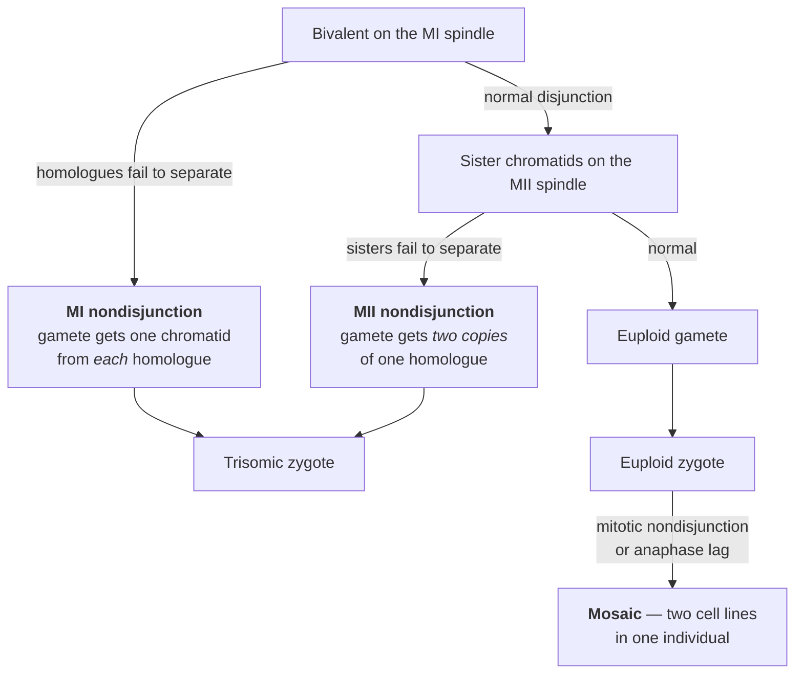
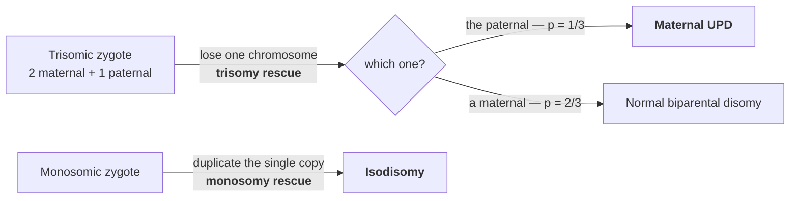

# 20 — Chromosome abnormalities

> **Before this:** [Ch 09](../part-02-transmission-genetics/09-mitosis-and-meiosis.md) ·
> [Ch 03](../part-01-molecular-foundations/03-genomes-chromosomes-chromatin.md) ·
> [Ch 14](../part-02-transmission-genetics/14-linkage-and-mapping.md) · **Time:** ~40 min

Chapters 16–19 dealt with damage measured in base pairs. This one deals with damage measured
in megabases — the scale at which the packaging is the mutation.

## What you'll be able to do

- Trace an aneuploid conceptus to meiosis I, meiosis II, or a post-zygotic mitosis from the
  genotypes at a centromere-proximal marker, and say why the abnormal fraction differs between
  tissues
- Explain why exactly three autosomal trisomies reach live birth, in terms of gene content
  rather than chromosome size
- Derive the maternal age effect from the mechanics of prophase I arrest instead of memorising
  the risk table
- Enumerate the gametes of an inversion or translocation carrier, compute the balanced
  fraction, and separate the carrier's *phenotypic* risk from their *reproductive* risk
- Explain why most copy-number variation in a healthy genome is not pathogenic, and diagnose
  chromothripsis from two-state copy number, clustered breakpoints and randomly oriented joins
- Trace trisomy or monosomy rescue to uniparental disomy, and predict its two consequences —
  a silenced imprinted locus, and a recessive made homozygous by one carrier parent
- Pick a detection assay from the rearrangement you expect, and state what it is blind to

## The core idea

There are only two things you can do to a genome at this scale: **change how many copies of a
region exist, or change where the regions sit.** Each has one dominant consequence.

**Copy number is a dosage problem.** Transcript output is roughly proportional to gene copy
number. Multiply a region by 1.5 and you multiply the output of a few hundred genes by 1.5.
Most genes tolerate that. Subunits of fixed-stoichiometry complexes, transcription factors
acting near a threshold, and developmental timers do not — and a few hundred genes shifted at
once will contain some of each. The damage is combinatorial, not additive.

**Position is a pairing problem.** A rearranged chromosome that retains all its sequence has
normal dosage, so the carrier is usually fine. But meiosis must physically align homologous
sequence before it can segregate it, and a chromosome whose layout differs from its partner's
forces that alignment into a contorted configuration. Crossing over inside the contorted region
produces broken products.

> **A balanced rearrangement is a statement about the carrier's genome, not about their
> gametes.** It is a refactor: same content, different file layout, everything compiles. The
> problem arrives at the merge — and meiosis is the merge, run against a partner who has the
> original layout.

---

## 1. The notation, in sixty seconds

Karyotypes serialise in ISCN format: chromosome count, sex chromosomes, then a list of
deviations. It is a diff against `46,XX`. `p` is the short arm, `q` the long arm, band numbers
count outward from the centromere.

| String | Reading |
|---|---|
| `47,XY,+21` | 47 chromosomes, male, one extra chromosome 21 |
| `46,XX,del(5)(p15.2)` | terminal deletion of 5p from band p15.2 |
| `46,XY,inv(9)(p12q13)` | pericentric inversion — the interval spans the centromere |
| `46,XX,t(9;22)(q34;q11)` | reciprocal translocation, breakpoints at 9q34 and 22q11 |
| `45,XX,der(14;21)(q10;q10)` | Robertsonian: one derivative replaces a 14 and a 21 |
| `47,XY,+21[12]/46,XY[18]` | mosaic — 12 of 30 counted cells trisomic |

A Robertsonian carrier has **45** chromosomes and is genomically balanced. Counting chromosomes
is not counting sequence.

## 2. Ploidy versus aneuploidy

**Euploid** changes multiply the whole set; **aneuploid** changes alter individual chromosomes.

Triploidy (69 chromosomes) occurs in perhaps 1–2% of recognised conceptions and never survives.
Its two origins give visibly different outcomes, which is the cleanest demonstration of
imprinting you will meet:

| Origin | How | Outcome |
|---|---|---|
| **Diandry** — two paternal sets | usually dispermy | Overgrown cystic placenta (partial hydatidiform mole), small fetus |
| **Digyny** — two maternal sets | failure to extrude a polar body | Tiny fibrotic placenta, severe growth restriction |

Same chromosome count, same genes, opposite phenotypes: the parental *origin* of a set carries
information beyond its sequence. §10 returns to this.

Aneuploidy is the common case. Roughly half of first-trimester losses are chromosomally
abnormal — autosomal trisomy is the largest class at around 35–40% of karyotyped losses, then
polyploidy near 10% and monosomy X near 5–10%. **Aneuploidy is the leading known cause of human
pregnancy loss.**

## 3. Three failure modes, and how to tell them apart



They leave different genotype signatures. Take a mother heterozygous `A/B` at a marker close
enough to the chromosome 21 centromere that crossing over between them is rare, and a father
contributing `C`:

| Error | What the egg carries | Zygote at the marker |
|---|---|---|
| **MI nondisjunction** | one chromatid of each homologue | `A B C` — **three alleles**, heterozygous |
| **MII nondisjunction** | two sister chromatids of one homologue | `A A C` — **two alleles**, maternally homozygous |
| **Post-zygotic mitotic** | a normal egg | `A C` in some cells, `A A C` or `A C C` in others |

This is a genotyping assay, not a microscopy assay, and it is why the epidemiology is known.
Two caveats. The inference assumes no crossover between marker and centromere — one crossover
swaps the signatures, so real studies genotype a panel and reconstruct the recombination
pattern. And the "MII" signature is now known to arise substantially from **premature
separation of sister chromatids during MI**, which then segregate independently at MII. Read
the two classes as *centromere-heterozygous* and *centromere-homozygous*; the mapping to MI and
MII is a model laid on top.

For trisomy 21 the distribution is lopsided: about **90% of cases are maternal**, and roughly
**70–80% of those carry the MI signature**.

**Why MI fails.** Chapter 09 established that a bivalent is held on the MI spindle by
**chiasmata plus sister-chromatid cohesion distal to them** — the crossover is a physical
clamp, not only an information shuffle. That predicts the failure mode: a bivalent with no
crossover, or with its only crossover jammed against the centromere, has nothing holding it
together and segregates at random. Confirmed — MI-origin trisomy 21 shows markedly reduced or
absent recombination on the nondisjoined chromosome, and centromere-homozygous cases show an
excess of pericentromeric exchanges, which entangle centromeres rather than clamping arms.
Recombination placement, fixed decades before the error, is a risk factor for it.

## 4. Which autosomal trisomies survive

| Trisomy | Eponym | Approx. live-birth frequency | Survival |
|---|---|---|---|
| **21** | Down | ~1 in 700–800 | Median survival now into the sixth decade |
| **18** | Edwards | ~1 in 5,000–8,000 | Majority die in the first year |
| **13** | Patau | ~1 in 10,000–20,000 | Majority die in the first year |

The obvious hypothesis — small chromosomes are survivable — is wrong, and the counterexample
is decisive:

| Chromosome | Length | Protein-coding genes | Density | Trisomy at term? |
|---|---|---|---|---|
| 21 | ~47 Mb | ~220 | ~4.7 /Mb | yes |
| 18 | ~80 Mb | ~270 | ~3.4 /Mb | yes |
| 13 | ~114 Mb | ~320 | ~2.8 /Mb | yes |
| 19 | ~59 Mb | ~1,400 | ~24 /Mb | never |

Chromosome 19 is *smaller* than 13 and carries four times as many genes. The survivable
trisomies are the **gene-poorest**. Chromosomes 13 and 21 are also acrocentric — their short
arms are rDNA repeat arrays already present in high copy number, so trisomy adds no meaningful
dosage there.

"Survivable" is still relative: roughly a third of trisomy 21 conceptuses detected at chorionic
villus sampling are lost before term. And there is no single "Down syndrome gene" — there are
~220 genes at 1.5×, and the phenotype is the sum over the dosage-sensitive subset.

## 5. Sex chromosome aneuploidy: tolerated, and why

| Karyotype | Frequency | Typical presentation |
|---|---|---|
| **45,X** (Turner) | ~1 in 2,000–2,500 female births | Short stature, ovarian insufficiency, cardiac and renal anomalies; normal intellect |
| **47,XXY** (Klinefelter) | ~1 in 500–1,000 male births | Tall, testicular failure and infertility; often undiagnosed |
| **47,XXX** | ~1 in 1,000 female births | Frequently no clinical presentation |
| **47,XYY** | ~1 in 1,000 male births | Frequently no clinical presentation |

An extra X is compatible with an unremarkable life; an extra chromosome 19 is not compatible
with birth. Two structural facts account for the gap.

**X inactivation buffers X dosage.** Cells silence all but one X
([Ch 13](../part-02-transmission-genetics/13-sex-linkage.md)), and the rule is "keep one,
silence the rest" — so 47,XXX silences two. Dosage is corrected for free, by machinery that had
to exist anyway.

**The Y is nearly empty.** A few dozen protein-coding genes, most in multi-copy testis-specific
families, against roughly 800 on the X. An extra Y adds almost no dosage-sensitive material,
which is why 47,XYY is usually silent.

The buffering is incomplete, and the residue is the phenotype. About 15% of X-linked genes
escape inactivation reliably and another ~10% variably; escapees include the pseudoautosomal
regions, active on both X and Y. Escapees with a Y homologue — the pseudoautosomal genes plus a
handful of X–Y pairs such as *KDM6A*/*UTY* — have a normal dose of **two, in both sexes**, so
45,X, with a single X, is genuinely haploinsufficient for them; *SHOX*, in the pseudoautosomal
region, accounts for much of the short stature. Escapees *without* a Y partner are simply
expressed more highly in XX than in XY cells, and that residual excess is what surfaces as the
mild features of 47,XXX and 47,XXY.

45,X is also the sharpest lesson in ascertainment: **about 99% of 45,X conceptuses miscarry**.
The live-born population is a selected 1%, much of it cryptically mosaic. Statements about "the
45,X phenotype" are statements about survivors.

## 6. The maternal age effect, derived

| Maternal age | Approx. live-birth risk of trisomy 21 |
|---|---|
| 20 | ~1 in 1,500 |
| 25 | ~1 in 1,300 |
| 30 | ~1 in 900 |
| 35 | ~1 in 350 |
| 40 | ~1 in 100 |
| 45 | ~1 in 25–30 |

(Model-dependent past 40; these are *live-birth* rates, and rates at conception are higher
throughout because of selective loss.)

Two facts generate the whole curve.

1. **Human oocytes enter prophase I in fetal life and arrest there**, resuming only at
   ovulation. An egg ovulated at 43 has been sitting mid-division for four decades.
2. **Sister-chromatid cohesion is provided by cohesin loaded before that arrest**, with no
   measurable replenishment afterwards.

Cohesin in an oocyte is therefore a decaying resource with no maintenance process — a cache
populated once, never invalidated, never refreshed. The consequences chain:

- Cohesion distal to a chiasma keeps the chiasma from sliding off the chromosome end. Lose it
  and the bivalent falls into two univalents that segregate independently — a coin flip.
- Cohesion at the centromere keeps sisters together through MI. Lose it and they separate
  prematurely, producing the centromere-homozygous signature of §3.
- Bivalents with few or badly placed crossovers cross the threshold first, having had less
  clamping to begin with. Recombination pattern and cohesin decay are **multiplicative** risk
  factors — which is why the curve accelerates rather than rising linearly.

Three predictions, all borne out: the effect should be maternal-specific (spermatogonia divide
continuously and reload cohesin every cycle — and indeed the paternal age effect is on point
mutations, not aneuploidy, [Ch 16](16-mutation.md)); it should accelerate; and it should appear
in oocytes and embryos long before live births. Preimplantation testing puts embryo aneuploidy
near 20–30% in the early thirties and above 50% past about 40.

## 7. Mosaicism

Post-zygotic errors produce two or more cell lines in one individual, by three routes: **mitotic
nondisjunction** (one trisomic and one monosomic daughter), **anaphase lag** (a chromosome fails
to reach a pole and is lost), and **trisomy rescue** (a trisomic zygote drops one of the three —
which rescues the embryo and creates the hazard in §10).

- **Phenotype tracks the abnormal fraction, and that fraction varies by tissue.** A normal blood
  karyotype does not exclude 40% abnormal fibroblasts.
- **Confined placental mosaicism** — abnormal line in placenta only, in roughly 1–2% of
  chorionic villus samples. This is why an abnormal CVS is confirmed by amniocentesis.
- **Somatic mosaicism is universal.** Mosaic loss of the Y in blood is detectable in a
  substantial minority of older men; every tumour is the extreme case
  ([Ch 56](../part-11-human-and-statistical-genomics/56-cancer-genomics.md)).

## 8. Structural rearrangements and their meiotic behaviour

| Type | What changed | Carrier | Meiotic hazard |
|---|---|---|---|
| **Deletion / duplication** | segment lost or gained | unbalanced | — |
| **Paracentric inversion** | segment flipped, centromere outside | balanced | dicentric + acentric products |
| **Pericentric inversion** | segment flipped, centromere inside | balanced | duplication/deficiency products |
| **Reciprocal translocation** | two chromosomes swap ends | balanced | unbalanced segregants |
| **Robertsonian translocation** | two acrocentrics fuse at the centromere | balanced (45 chromosomes) | unbalanced segregants |
| **Isochromosome** | one arm duplicated, the other lost | unbalanced | — |
| **Ring** | both ends lost, chromosome circularises | unbalanced, unstable | breaks each mitosis → mosaicism |

### Inversions

Pairing is homology matching. To align an inverted segment with its normal partner, one of them
must loop — the configuration is exactly the shape an inversion makes on a dot plot:

```
normal      A  B  C  D  E  F  G
inverted    A  B  F  E  D  C  G      (C–F inverted)

pairing configuration — the inversion loop:

            A   B          G
             \ /  C-D-E-F \ /
              X   | | | |  X
             / \  C-D-E-F / \
            A   B          G

            each rung pairs a marker with its own homologue; the lower
            strand is the inverted chromosome, read F→C along its length
```

Crossing over outside the loop is harmless. Inside it, the consequence depends on the
centromere.

**Paracentric** — centromere outside the loop. A crossover inside yields one chromatid with two
centromeres and one with none. The dicentric is pulled both ways and breaks; the acentric goes
nowhere and is lost. Both products self-destruct before they can become a pregnancy, so
paracentric carriers have **near-normal reproductive outcomes**.

**Pericentric** — centromere inside the loop. The crossover products each have one centromere
and look viable, but each carries a duplication of one flanking region and a deletion of the
other. These *do* form conceptuses. Risk rises with the size of the inverted segment: a bigger
loop captures more crossovers, and it leaves smaller — therefore more survivable — flanking
imbalances. Empirically the risk of an unbalanced liveborn is negligible below about 30% of
chromosome length, small at 30–50%, and highest above 50%.

Because loop crossovers destroy their products, the *observed* recombination rate across an
inversion collapses to near zero. Inversions are recombination suppressors, which is why they
persist as long haplotype blocks
([Ch 29](../part-05-population-genetics/29-linkage-disequilibrium.md)).

### Reciprocal translocations

Four chromosomes pairing pairwise by homology form a cross-shaped **quadrivalent**, which can
segregate several ways:

| Segregation | Which travel together | Gametes |
|---|---|---|
| **Alternate** | the two normals; the two derivatives | balanced (normal or carrier) |
| **Adjacent-1** | one normal + one non-homologous derivative | unbalanced |
| **Adjacent-2** | homologous centromeres to the same pole (rare) | unbalanced |
| **3:1** (tertiary or interchange trisomy) | three chromosomes to one pole, one to the other | unbalanced; the route to supernumerary-derivative syndromes such as Emanuel syndrome from t(11;22)(q23;q11) |

Only alternate segregation gives balanced gametes, so the unbalanced fraction is high — and
gamete studies confirm it. Live-birth risk is much lower because unbalanced conceptuses are
mostly lost early. **The reproductive phenotype is usually recurrent miscarriage rather than an
affected child**, and roughly 2–5% of couples with recurrent pregnancy loss have a balanced
rearrangement in one partner. That is the strongest indication for karyotyping an adult.

### Robertsonian translocations

The five acrocentrics — 13, 14, 15, 21, 22 — carry near-identical rDNA arrays on their short
arms, giving non-allelic homologous recombination ([Ch 18](18-recombination-mechanisms.md)) a
substrate for fusing two of them at the centromere. The short arms are lost; nothing of
consequence goes with them. Carriers have 45 chromosomes and are phenotypically normal.
Robertsonians occur in roughly 1 in 1,000 people, t(13;14) accounting for about three-quarters.
The worked example segregates one in full.

### When "balanced" isn't harmless

Roughly 6% of *de novo* apparently balanced translocations carry a phenotype, from three
causes: a breakpoint landing **inside a gene** (a structural variant acting as a loss-of-function
allele); **position effect**, where the gene is intact but severed from its enhancers
([Ch 50](../part-10-functional-genomics/50-3d-genome.md)); and **cryptic imbalance** at the
breakpoint, where the event was never balanced and the karyotype simply could not see the
missing 200 kb. *Inherited* balanced rearrangements carry a phenotype far less often, for a
plain ascertainment reason: a parent well enough to reproduce transmitted them.

## 9. Copy number variation is normal

The clinical framing above will mislead you if left alone. **Structural variation is a normal
feature of human genomes.** Roughly **4.8–9.5% of the genome is copy-number variable** among
healthy people, around 100 genes can be homozygously deleted with no apparent consequence, and
CNVs account for more differing base pairs between two people than all their SNVs combined. The
reference genome is a sample, not a schema
([Ch 45](../part-09-genomics/45-reference-genomes-and-pangenomes.md)): a deletion relative to
GRCh38 may be the majority allele. Pathogenic CNVs are the tail of that distribution — enriched
exactly where you would predict, over dosage-sensitive genes and across intervals large enough
to catch several at once.

### Genomic disorders and NAHR

Some CNVs recur at identical breakpoints in unrelated people. That is **non-allelic homologous
recombination** between **segmental duplications** — near-identical blocks tens to hundreds of
kb long, about 5% of GRCh38 and closer to 7% of the complete T2T assembly. When the machinery
matches a segdup to its paralogue instead of its allele, the crossover deletes or duplicates
everything between them.

That predicts deletions and duplications as a **reciprocal pair at comparable rates**. They are:

| Region | Deletion | Duplication |
|---|---|---|
| 17p12, ~1.4 Mb, contains *PMP22* | **HNPP** — episodic pressure palsies, mild | **CMT1A** — the commonest inherited neuropathy |
| 7q11.23, ~1.5–1.8 Mb, ~26–28 genes incl. *ELN* | **Williams–Beuren syndrome** | 7q11.23 duplication syndrome |
| 22q11.2, ~3 Mb between LCR22A and LCR22D | **22q11.2 deletion syndrome**, ~1 in 4,000–6,000 | 22q11.2 duplication, milder, often inherited |

*PMP22* is the cleanest dosage experiment in human genetics: one copy gives a mild neuropathy,
two is normal, three gives a severe one — same protein sequence throughout. Note also the
asymmetry down the table. Deletions are usually — not always — worse than the reciprocal
duplication: 7q11.23 and 22q11.2 both run that way, while 17p12 runs the other, because *PMP22*
overexpression is the more damaging direction. That general asymmetry is why CNV interpretation
weights deletions more heavily
([Ch 55](../part-11-human-and-statistical-genomics/55-clinical-variant-interpretation.md)).

### Chromothripsis

The default model of complex rearrangement is progressive: one break, then another, over many
divisions. **Chromothripsis** violates it — tens to hundreds of breakpoints on one chromosome or
a few, generated in a **single catastrophic event** and re-ligated in random order and
orientation by non-homologous end joining ([Ch 17](17-dna-repair.md)). The mechanism is a
**micronucleus**: a chromosome that lags at anaphase is packaged in its own defective envelope,
where the DNA is pulverised, and the fragments are stitched back when it rejoins the main
nucleus. Aneuploidy causes chromothripsis and chromothripsis causes aneuploidy.

The evidence is statistical, and the reasoning is the hypothesis-testing logic of
[S4](../part-S-statistics/S4-hypothesis-testing.md). Under progressive
rearrangement, copy number takes many values and breakpoints scatter. Under a single event you
expect **copy number oscillating between just two states** along the chromosome, **breakpoints
clustered** far more tightly than uniform, **join orientations uniformly distributed** over the
four possibilities, and **retained heterozygosity** in surviving fragments — no time for a
second hit. Applied to the 2,658 pan-cancer whole genomes of PCAWG, that signature appears in
**about 29% of tumours** on high-confidence calls and 40% when weaker calls are counted —
exceeding 50% in melanoma, glioblastoma and lung adenocarcinoma, and reaching 77% of
osteosarcomas and effectively all liposarcomas. It also occurs in the germline, producing
congenital disease from one event in one gamete.

## 10. Uniparental disomy

Both homologues from one parent, none from the other — **heterodisomy** if the two *different*
homologues of one parent (an MI error, rescued), **isodisomy** if two copies of the *same* one
(MII or mitotic).



Note the arithmetic: rescuing a trisomy leaves UPD **one time in three**. Trisomy is common, so
UPD is not rare. Two reasons it matters despite normal sequence content:

**Imprinted loci break.** Where expression depends on parental origin rather than sequence
([Ch 23](../part-04-gene-regulation/23-chromatin-and-epigenetics.md)), two maternal copies of a
paternally-expressed gene give zero expression from two intact copies. 15q11–q13 is the standard
case: **Prader–Willi syndrome** from loss of the paternal contribution — usually a paternal
deletion, but roughly 20–30% from maternal UPD15 — and **Angelman syndrome** from loss of the
maternal contribution, a few per cent of it paternal UPD15. Same locus, opposite parental origin,
different syndromes.

**Isodisomy exposes recessives.** Two copies of one homologue means homozygosity across a whole
chromosome, so a single carrier parent's recessive pathogenic variant becomes homozygous in the
child — recessive disease with one carrier parent, breaking the pedigree logic of
[Ch 15](../part-02-transmission-genetics/15-pedigrees.md).

## 11. Detecting it: a resolution ladder

| Method | Resolution | Detects | Blind to |
|---|---|---|---|
| **G-banded karyotype** | ~5–10 Mb | everything visible, including **balanced** events and mosaicism; needs dividing cells | anything smaller than a band |
| **FISH** | probe-limited, ~100 kb up | one pre-specified locus; works on interphase nuclei | everything you did not choose a probe for |
| **Chromosomal microarray** | ~10–50 kb genome-wide | any imbalance; SNP arrays also give runs of homozygosity → **UPD**, consanguinity, triploidy | **all balanced rearrangements** |
| **Short-read WGS** | breakpoints to base pair | balanced and unbalanced; CNV from read depth, junctions from split/discordant reads | segmental duplications — where NAHR happens |
| **Long-read WGS / optical mapping** | long reads: SVs from ~50 bp up, breakpoints to base pair; optical mapping: ~500 bp–5 kb up, breakpoints approximate | segdup-resident and repeat-mediated events; phasing | cost, throughput, low-level mosaicism |

Two consequences. **Microarray replaced karyotype for developmental delay**, taking diagnostic
yield from roughly 3% to 15–20% — but only for imbalance. A couple with recurrent miscarriage
and a balanced translocation will have a normal microarray and an abnormal karyotype. Choose by
hypothesis, not by resolution. And **short reads are weakest exactly where recurrent CNVs
live**: NAHR needs long near-identical repeats, and short-read alignment cannot place reads
uniquely in long near-identical repeats
([Ch 42](../part-09-genomics/42-read-alignment.md)). That is not a coverage gap, it is a blind
spot aligned with the pathology.

---

## Common misconceptions

| What people think | What's actually true |
|---|---|
| Trisomy 21 survives because chromosome 21 is smallest | It survives because chromosome 21 is gene-*poorest*. Chromosome 19 is smaller than 13, and trisomy 19 is never seen at term |
| Nondisjunction is a structureless accident | It is highly structured: ~90% maternal, mostly MI, concentrated on bivalents with absent or badly placed crossovers, rising steeply with maternal age |
| The maternal age effect is "old eggs" degrading generally | It is specifically cohesin loaded in fetal life and never replenished, decaying over decades of prophase-I arrest. The prediction that it must be maternal-specific is what makes it a mechanism rather than a slogan |
| A balanced translocation carrier has a mild version of the syndrome | They have no dosage abnormality and are typically healthy. Their risk is reproductive: unbalanced gametes, recurrent loss, and a chance of an unbalanced child |
| A normal microarray rules out a chromosomal cause | Microarrays see imbalance only. Balanced translocations and inversions — the findings that explain recurrent pregnancy loss — are invisible to them |
| CNVs are pathogenic by nature | 4.8–9.5% of the genome is copy-number variable in healthy people, and CNVs account for more differing base pairs between two genomes than SNVs do. The pathogenic ones are a tail, not the distribution |
| Complex rearrangements accumulate gradually | Chromothripsis makes tens to hundreds of breakpoints in one event; two-state copy number, clustered breakpoints and join orientations spread evenly across all four possibilities distinguish it from gradual accumulation |
| UPD is harmless because all the sequence is there | It silences imprinted loci, whose expression depends on parental origin, and isodisomy makes a whole chromosome homozygous, exposing one parent's recessive variants |
| Mosaicism just means a milder version | Sometimes. It also makes otherwise-lethal karyotypes survivable, and it makes tissue choice decisive — a normal blood karyotype excludes nothing elsewhere |

## Worked example: familial Down syndrome, karyotype to recurrence risk

A child is born with Down syndrome. The karyotype:

```
46,XX,der(14;21)(q10;q10),+21
```

**Step 1 — read it.** 46 chromosomes, but this is not free trisomy 21. Count the 21 long arms:
one on the derivative, plus two free 21s = **three copies of 21q**. Trisomy 21 by sequence
content, disguised by a normal chromosome count. Roughly 3–4% of Down syndrome arises this way.

**Step 2 — find the carrier.** About a quarter of such cases are inherited. The mother is:

```
45,XX,der(14;21)(q10;q10)
```

One derivative replacing one 14 and one 21, plus a normal 14 and a normal 21. Copy number for
both 14q and 21q is two. **Balanced, phenotypically normal.**

**Step 3 — pair them.** Three objects share homology and form a trivalent:

```
        normal 14  ══════════════
                   ||||||||||||||          14q homology
   der(14;21)      ══════════════╤═════════════
                                 |||||||||||||  21q homology
        normal 21                ═════════════
```

**Step 4 — enumerate.** A trivalent segregates **2:1** — two of the three objects to one pole,
one to the other. Three choices of which object travels alone, times two poles, gives six gamete
classes. (The 3:0 alternative, which would give a doubly trisomic gamete and a nullisomic one,
is vanishingly rare.)

| Gamete | 14q dose | 21q dose | Fertilised by a normal gamete |
|---|---|---|---|
| der alone | 1 | 1 | **Balanced carrier** (45 chromosomes) |
| normal 14 + normal 21 | 1 | 1 | **Normal** (46 chromosomes) |
| der + normal 21 | 1 | 2 | **Translocation Down syndrome** — the proband |
| normal 14 alone | 1 | 0 | monosomy 21 — lethal, early loss |
| der + normal 14 | 2 | 1 | trisomy 14 — lethal, early loss |
| normal 21 alone | 0 | 1 | monosomy 14 — lethal, early loss |

**Step 5 — theory versus observation.** Three of six are lethal and never present as
pregnancies. Of the three viable classes one is Down syndrome: **a naive 1/3 recurrence risk**.

Observed recurrence for a female der(14;21) carrier is **10–15%**; for a male carrier **under
5%**, often quoted as 1–2%. The gap is the teaching point, and it decomposes into three things.
Segregation is **not uniform** — the trivalent does not distribute its three objects equally
over the six outcomes. **Selection continues after conception**, so amniocentesis-stage risk
exceeds term risk. And **gametic selection differs by sex**: spermatogenesis filters unbalanced
products far more harshly than oogenesis, which is the male/female asymmetry.

**Step 6 — the special case.** If the derivative were `der(21;21)`, every viable gamete carries
two copies of 21q. Recurrence risk is **100%**, and the options are donor gametes or
preimplantation testing. Worth deriving rather than looking up.

## Connections

- **Back to:** [Ch 09](../part-02-transmission-genetics/09-mitosis-and-meiosis.md) — chiasmata
  as physical clamps, which is what §3 and §6 rest on;
  [Ch 03](../part-01-molecular-foundations/03-genomes-chromosomes-chromatin.md) — centromeres,
  telomeres, acrocentric short arms;
  [Ch 14](../part-02-transmission-genetics/14-linkage-and-mapping.md) — recombination placement;
  [Ch 18](18-recombination-mechanisms.md) — NAHR;
  [Ch 17](17-dna-repair.md) — the end joining that stitches chromothriptic fragments;
  [Ch 19](19-transposable-elements.md) — repeats as the substrate for all of it
- **Forward to:** [Ch 20A](20A-bacterial-and-phage-genetics.md) — read next: the same
  questions (what is a gene, how do you map one, what is a rearrangement) asked in an organism
  with no chromosomes to be abnormal, no meiosis and no diploidy, where the answers come from
  selection on 10⁹ cells instead of counting progeny;
  [Ch 23](../part-04-gene-regulation/23-chromatin-and-epigenetics.md) —
  imprinting, which is what makes UPD pathogenic;
  [Ch 29](../part-05-population-genetics/29-linkage-disequilibrium.md) — inversions as
  recombination suppressors; [Ch 39](../part-09-genomics/39-genome-landscapes.md) — segmental
  duplications; [Ch 46](../part-10-functional-genomics/46-variant-calling.md) — calling
  structural variants computationally;
  [Ch 55](../part-11-human-and-statistical-genomics/55-clinical-variant-interpretation.md) —
  scoring a CNV as pathogenic;
  [Ch 56](../part-11-human-and-statistical-genomics/56-cancer-genomics.md) — chromothripsis and
  aneuploidy as somatic events

## Check yourself

**1. A trisomy 21 child is genotyped at a marker 200 kb from the chromosome 21 centromere. Mother `A/B`, father `C/C`, child `A/A/C`. Where did the error occur, and how confident should you be?**

<details><summary>Answer</summary>

Two copies of the same maternal allele at a centromere-proximal marker is the
**centromere-homozygous** signature — classically MII nondisjunction.

Confidence should be moderate. The inference assumes no crossover between marker and centromere;
one crossover converts an MI signature into an MII one, which is why real studies genotype a
panel across the chromosome and reconstruct the recombination pattern. And much of what looks
like MII is now thought to arise from premature separation of sister chromatids in MI, with
independent segregation at MII. The observation is "centromere-homozygous"; "MII" is
interpretation layered on top.

</details>

**2. Chromosome 19 is smaller than chromosome 13, yet trisomy 13 reaches live birth and trisomy 19 never does. Explain, and state the principle.**

<details><summary>Answer</summary>

Gene content, not length. Chromosome 13 is ~114 Mb with ~320 protein-coding genes (~2.8/Mb);
chromosome 19 is ~59 Mb with ~1,400 (~24/Mb), so trisomy 19 puts about four times as many genes
at 1.5×.

The principle: aneuploidy is a dosage insult whose severity scales with the number of
dosage-sensitive genes displaced, not with base pairs. Chromosome 13 is additionally acrocentric,
so its short arm is rDNA already present in high copy number and contributes nothing to the
burden.

</details>

**3. A man carries a large paracentric inversion on chromosome 7. No miscarriages, two healthy children. Does that mean crossovers never occur inside the inversion?**

<details><summary>Answer</summary>

No — it means their products never become pregnancies. A crossover inside a paracentric loop
gives one dicentric chromatid, pulled to both poles and broken, and one acentric fragment,
pulled nowhere and lost. Both are destroyed at or before the meiotic divisions.

So paracentric carriers have near-normal reproductive outcomes despite normal crossover
activity. A pericentric inversion is different: its crossover products carry one centromere each
and are perfectly capable of forming an unbalanced conceptus. The centromere's position relative
to the loop decides whether the failure is silent or clinical.

</details>

**4. A couple with four first-trimester losses have normal chromosomal microarrays, as do the products of conception. What has not been ruled out, and what would you order?**

<details><summary>Answer</summary>

A microarray detects **imbalance**. It is blind to balanced rearrangements — reciprocal
translocations and inversions — which are exactly the findings that explain recurrent loss,
because the carrier is balanced and only the conceptuses are not. Roughly 2–5% of couples with
recurrent pregnancy loss carry one.

Order a **G-banded karyotype** on both partners: a translocation is a whole-chromosome event and
banding sees it easily. Optical genome mapping or long-read WGS would also work and give
base-pair breakpoints, but karyotype is the cheap, correct first test. The general lesson:
microarray has ~100× the resolution and is still the wrong assay here. Resolution and coverage
are different axes.

</details>

**5. A child has Prader–Willi syndrome but no 15q11–q13 deletion. Give a mechanism, and say what a SNP array shows that a copy-number-only array does not.**

<details><summary>Answer</summary>

Maternal uniparental disomy of chromosome 15 — roughly 20–30% of cases. Likely route: maternal
MI nondisjunction gives a disomic egg, fertilisation gives a trisomy 15 zygote, and an early
mitotic division loses the paternal 15. Trisomy rescue leaves UPD one time in three. Genes in
the imprinted interval that are expressed only from the paternal allele then have zero
expression, from two structurally intact copies at normal copy number.

An array-CGH compares intensities and sees exactly two copies — normal. A **SNP array** also
reports genotypes, so it shows a long **run of homozygosity / absence of heterozygosity** across
chromosome 15: complete for isodisomy, patchy for heterodisomy, where meiotic crossovers leave
isodisomic blocks. That is the signal saying "one parent contributed this whole chromosome".
Confirmation is methylation testing at the 15q11–q13 imprinting centre, which asks directly
whether a paternally-marked allele is present at all.

</details>
