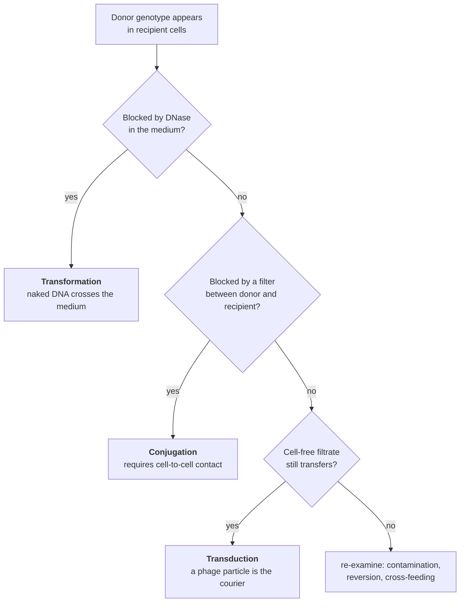
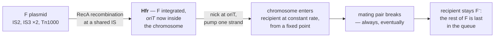
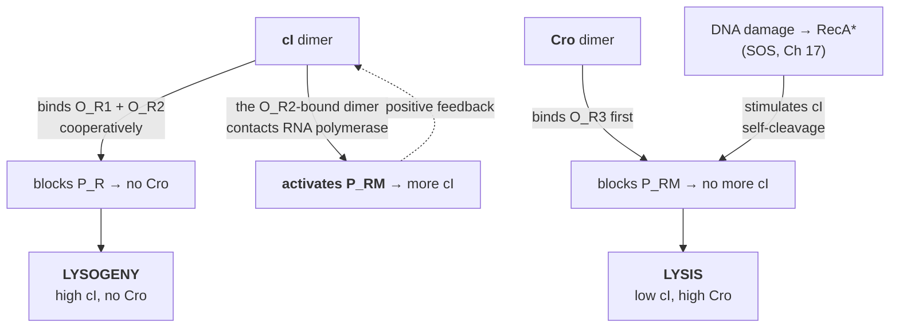

# 20A — Bacterial and phage genetics

> **Before this:** [Ch 16](16-mutation.md) · [Ch 18](18-recombination-mechanisms.md) ·
> [Ch 20](20-chromosome-abnormalities.md) · **Time:** ~50 min
>
> **Statistics needed:** [S1 Probability](../part-S-statistics/S1-probability.md) §§4, 6

Everything so far has assumed sex. Two parents, meiosis, a diploid that can be heterozygous,
offspring you count. Bacteria do none of that. And yet almost every sharp idea in classical
genetics was invented or proved in bacteria and their viruses, because bacteria let you run
the experiment at a scale eukaryotes never will: 10⁹ individuals on one plate, a twenty-minute
generation, and conditions under which a single recombinant announces itself as a colony.

This is where the gene stops being a bead on a string. By the end of it a gene will be an
*interval* — divisible, mappable inside itself, and defined by a test on function that is not
the same test as the one on position.

## What you'll be able to do

- Classify a gene-transfer event as transformation, conjugation or transduction from the
  controls that distinguish them, and say what each control rules out
- Reconstruct gene order and map position from interrupted-mating data, and derive why a
  *minute* is a legitimate map unit
- Design a bacterial complementation test on an F′ merodiploid, and say why partial diploidy
  is the enabling trick rather than a curiosity
- Derive the cotransduction relation (1 − *d*/*L*)³ from packaging geometry, and name the two
  regimes in which it returns no information
- Explain why plasmid incompatibility follows from shared replication control rather than
  shared sequence, and trace how R factors move resistance between species
- Trace the λ lysis/lysogeny decision through the cI/Cro circuit, and explain why that circuit
  is bistable rather than merely switchable
- Distinguish complementation from recombination as tests, and compute the resolution
  Benzer's selection bought him

## The core idea

Bacteria have no meiosis, so they cannot make a zygote. What they have is **one-way transfer**:
a fragment of one cell's genome arrives inside another, and if it recombines into the resident
chromosome it stays. The recipient is briefly a **merozygote** — diploid only for whatever came
across, and only until recombination resolves it. Two consequences run through everything below.

**Distance is measured by co-transfer, not by crossing over.** In a eukaryotic cross you ask
how often a crossover falls *between* two markers
([Ch 14](../part-02-transmission-genetics/14-linkage-and-mapping.md)). In a bacterial cross you
ask how often two markers arrive in *the same piece of DNA*. Every bacterial map unit is a
statistic about whether a fragment happened to span both loci.

**Selection replaces counting.** You do not score a thousand progeny. You design a medium on
which only the class you want can grow, spread 10⁹ cells, and count what appears.

> **In a eukaryotic cross you count offspring; in a bacterial cross you select them.** The
> sensitivity of your experiment is then set by how many cells fit on a plate. Everything
> here — the minute map, cotransduction, Benzer's resolution to the base pair — is that one
> trick applied to different transfer mechanisms.

---

## 1. Genetics without sex: the working vocabulary

**Markers are metabolic or resistance phenotypes.** A **prototroph** grows on **minimal medium**
— salts and a carbon source. An **auxotroph** carries a mutation in a biosynthetic gene and needs
the product supplied: *his*⁻ needs histidine. Gene symbols are three lowercase italic letters plus
a capital for the cistron (*hisG*, *trpE*), with superscripts for state (*his*⁺, *his*⁻) and
Str^R, Nal^R for resistance. The point of an auxotroph is that *prototrophy is selectable with
zero background*: plate on minimal medium and only cells that acquired the wild-type allele form
colonies. You screen 10⁹ events on one dish. (Reversion is the control everyone forgets — a *his*⁻
strain throws a few colonies anyway, so plate each parent alone at the same density.)

**A phage is scored as a plaque.** Spread ~10⁸ bacteria in soft agar to grow an opaque **lawn**,
add a few phage, and each one that lyses its host releases progeny that infect the neighbours. The
hole in the lawn — a **plaque** — is a clone descended from one particle, and its size, edge and
turbidity are heritable phenotypes with a free readout.

**Bacterial crosses are asymmetric.** One cell is the **donor**, the other the **recipient**, and
only a fragment moves. Three natural routes exist, told apart by three controls that each disable
exactly one:



Read the logic, not the boxes. Naked DNA is destroyed by DNase; a capsid protects its cargo.
Conjugation needs contact, so a sintered-glass filter abolishes it; a phage passes straight
through. That U-tube design is what let Bernard Davis show in 1950 that Lederberg–Tatum
recombination required contact, and what let Zinder and Lederberg show two years later that the
*Salmonella* case did not.

## 2. Transformation: naked DNA, and how the genetic material was identified

**Griffith, 1928.** *Streptococcus pneumoniae* comes in a virulent **S** (smooth, capsulated) and
an avirulent **R** form. Mice given live R survive; mice given heat-killed S survive; mice given
live R **plus heat-killed S** die, and live S is recovered from the corpse. Something in the dead
cells converted R to S heritably — the **transforming principle**.

**Avery, MacLeod and McCarty, 1944.** Sixteen years of purification later, the activity survived
proteases and RNase, was destroyed by DNase, and had the composition and UV spectrum of nucleic
acid. Their conclusion — the transforming principle is **DNA** — is the first direct
identification of the genetic material, and it was widely disbelieved. The reason is worth
carrying: Levene's tetranucleotide hypothesis had convinced the field that DNA was a monotonous
repeat incapable of carrying information, and protein had twenty letters
([Ch 02](../part-01-molecular-foundations/02-dna-structure.md)). A trace-protein contaminant was
the standing objection, and it was not unreasonable.

**Hershey and Chase, 1952** removed it in a different system. Phage T2 grown with ³⁵S labels
protein only; with ³²P, DNA only. Infect, shear the empty capsids off with a kitchen blender,
spin: ³²P is in the cell pellet, ³⁵S in the supernatant. What enters and directs progeny
production is DNA. The separation is incomplete and it is less rigorous chemistry than Avery's,
but it landed in a field already softened up. **Avery's experiment proved it; Hershey–Chase's
convinced people.**

**Natural competence is a physiological state, not an accident.** Roughly 80 bacterial species
take up environmental DNA through a dedicated machine: a pseudopilus that pulls duplex DNA to the
membrane, a channel through which **one strand** enters while the other is degraded, and
RecA-dependent recombination into the chromosome ([Ch 18](18-recombination-mechanisms.md)). Two
features mark it as evolved. **It is regulated** — *S. pneumoniae* induces competence via a
secreted competence-stimulating peptide read by a two-component receptor (ComD/ComE), so uptake
switches on at high cell density. And **some species prefer their own DNA**: *Haemophilus
influenzae* Rd carries **1,471** copies of the 9-mer uptake signal sequence `AAGTGCGGT`, and
*Neisseria meningitidis* **1,891** copies of its own 10-mer `GCCGTCTGAA`. Do the null
calculation — the *H. influenzae* Rd genome is 1,830,138 bp, so a given 9-mer is expected
1.83 × 10⁶ ÷ 4⁹ ≈ **7** times per strand, ≈ **14** in the genome, and the published count is a
whole-genome one. Against that baseline 1,471 is a hundredfold enrichment, and it is a filter: it
biases uptake toward conspecific DNA, which is the DNA most likely to recombine usefully.

## 3. Conjugation: putting a time axis on a chromosome

**Lederberg and Tatum, 1946** mixed two multiply-auxotrophic *E. coli* K-12 strains and
recovered prototrophs at about one in 10⁷; neither parent alone did. Davis's U-tube then showed
the process needed contact.

**The F factor.** Donor capability rides on a conjugative plasmid, the fertility or **F factor**
— 99,159 bp, one copy per chromosome, about a third of it the *tra* region encoding the pilus
and transfer machinery. A cell carrying it is **F⁺**, one lacking it **F⁻**. Transfer is
rolling-circle: a relaxase nicks F at *oriT*, one strand is pumped through the mating junction
and made double-stranded in the recipient. Both cells end up with a complete F, so **F⁺ × F⁻
converts nearly the whole recipient population to F⁺** — and moves essentially no chromosomal
genes. The prototrophs at 10⁻⁷ were not coming from that.

**Hfr strains, Hayes 1953.** Some donors gave recombinants a thousandfold more often. In these
**Hfr** (high frequency of recombination) strains F has integrated into the chromosome, by
homologous recombination between the insertion sequences F carries — two IS*3*, one IS*2*, one
Tn*1000* — and their chromosomal counterparts, of which a laboratory *E. coli* has about 6
IS*2* and 5 IS*3* copies scattered around the genome, among ~37 IS elements in all
([Ch 19](19-transposable-elements.md)).
Integration can happen at any of them, in either orientation. That fact is what makes the next
experiment work.



Two predictions fall out, and both hold. Transfer is **oriented** — fixed start, fixed
direction, set by where and how F integrated. And the recipient **stays F⁻**, because
integration splits F and puts its trailing half at the far end.

### Interrupted mating, and why a minute is a map unit

Wollman and Jacob's experiment is the one everybody should be able to reconstruct. Mix Hfr with
F⁻. At intervals, put a sample in a blender: the shear rips mating pairs apart wherever they had
got to. Plate on medium selecting for a donor marker *and* against the donor itself
(streptomycin, with the recipient Str^R). Plot recombinant frequency against interruption time:

```
recombinants
per 100 Hfr
 0.30┤                    ┌───────────────  thr⁺   plateau ~0.30
     │               ┌────┘
 0.20┤         ┌─────┘ ┌──────────────────  lac⁺   plateau ~0.20
     │     ┌───┘  ┌────┘
 0.10┤   ┌─┘  ┌───┘         ┌──────────────  gal⁺   plateau ~0.13
     │   │ ┌──┘       ┌─────┘
 0.03┤   │ │     ┌────┘  ┌─────────────────  his⁺   plateau ~0.03
     └───┴─┴─────┴───────┴──────────────────────────▶  minutes of mating
         6 14    23              51
      time of entry: extrapolate each rise back to zero
```

Every curve has the same shape: nothing, a linear rise, a plateau. Extrapolating the rise back
to the axis gives that marker's **time of entry**. Order the markers by time of entry and you
have their order on the chromosome — no microscopy, no chemistry, no crossover statistics.

**Why time is a distance.** The strand is pumped at a constant rate, so position is an affine
function of entry time. That is the whole argument, and it has a checkable consequence: the
*intercept* is not zero. Every curve is displaced by a few minutes of pair formation and
initiation. Absolute times are not positions; **differences** in entry time are proportional to
differences in position, so the map is calibrated on intervals, never on the clock reading.

The unit was then fixed by convention. The *E. coli* map "has used the basic units of minutes
and a total length of 100 minutes" since a 1976 recalibration, and a minute is now formally
1/100 of the chromosome however it was measured. With MG1655 at **4,641,652 bp**:

```
1 minute  =  4,641,652 / 100  ≈  46.4 kb        ⟹  transfer rate ≈ 46 kb/min
```

Sequence-derived coordinates agree with the old genetic map to a fraction of a minute:

| Gene | MG1655 start codon | Minutes | Classical map |
|---|---:|---:|---|
| *thrA* | 336 | 0.0 | 0 |
| *proA* | 261,502 | 5.6 | 5.6 |
| *lacZ* | 366,305 | 7.9 | 8 |
| *galE* | 792,055 | 17.1 | 17 |
| *trpE* | 1,321,383 | 28.5 | 28 |
| *hisG* | 2,090,191 | 45.0 | 44–45 |

*lacZ* and *galE* are transcribed from the complement strand, so their start codons sit at the
*high* end of the annotated interval. Divide the low end instead and each comes out short by
exactly the length of its own gene — 3,075 bp for *lacZ*, 1,017 for *galE* — which is enough to
move the printed minute, and is the kind of error that never announces itself.

> **A minute is not a centimorgan.** A centimorgan is a *probability of exchange* — a parameter
> of a random process, saturating at 50%
> ([Ch 14 §3](../part-02-transmission-genetics/14-linkage-and-mapping.md)). A minute is a *time*
> converted to a *length* by a constant rate: additive by construction, never saturating. The
> minute map is a physical map that happened to be measured genetically.

For a programmer, interrupted mating is a **time-indexed oracle**. You cannot read the
chromosome; you can only ask a monotone predicate — *has marker X arrived by time t?* — at one
plate per query. Monotone in *t* means binary search on the interruption time locates any marker
in log(range) queries, and the answer is a coordinate.

### The gradient of transfer, and why the chromosome is a circle

**The plateaus decline with distance from the origin** — *thr*⁺ near 0.30, *his*⁺ near 0.03.
Mating pairs break spontaneously, and if breakage is memoryless (a constant hazard *λ* per
minute, which is what "spontaneous" means, [S1 §4](../part-S-statistics/S1-probability.md)), the
fraction still joined at time *τ* is *e*^(−*λτ*). So

```
plateau(τ) ∝ e^(−λτ)          ⟹   ln plateau is linear in τ
```

Fitting 0.30 at 6 min and 0.03 at 51 min gives *λ* = ln(10)/45 ≈ 0.051 per minute, so the
fraction of pairs surviving 100 minutes is *e*^(−5.1) ≈ 0.006. **Complete transfer essentially
never happens** — which is why an Hfr donates a gradient rather than a genome, and why the far
end of F never arrives. The gradient is a second distance estimate that needs no blender.

**And independently isolated Hfr strains give different orders — all rotations and reflections of
one cyclic sequence.** A set of linear orders mutually consistent only when wrapped into a loop is
evidence that the map is a **circle**, the same combinatorial move as assembling a circular
sequence from overlapping reads ([Ch 43](../part-09-genomics/43-genome-assembly.md), forward
reference). Check-yourself question 1 runs the argument.

## 4. F′ merodiploids: making a haploid diploid enough to test

An integrated F sometimes excises imprecisely, taking a stretch of adjacent chromosome and
leaving some of itself behind. The product is an **F′** — a fertility factor carrying a
chromosomal segment, such as F′*lac*. Transfer one into a cell that has its own copy of that
region and you have a **merodiploid**: diploid for the segment on the F′, haploid for everything
else. This is the enabling trick of bacterial genetics, and the reason is precise.

A **complementation test** asks whether two recessive mutations damage the same function. It
requires both mutations in one cell, on *separate DNA molecules*, each supplying a full copy of
everything else ([Ch 11 §7](../part-02-transmission-genetics/11-beyond-mendel.md)). In a diploid
eukaryote that is just a cross. In a haploid it is impossible — until F′ supplies a second copy
of the region you care about, and nothing else.

```
   chromosome    ── lacI⁻   P⁺   O⁺   lacZ⁺ ──      two independent copies of
                                                     one region in one cell;
   F′lac         ── lacI⁺   P⁺   O⁺   lacZ⁻ ──      haploid everywhere else
```

Two instances of one object in a single address space, independently mutable — exactly what you
need to separate a broken *diffusible product*, which the good copy can supply to both, from a
broken *sequence element*, which can only ever affect the molecule it sits on.
[Ch 21 §5](../part-04-gene-regulation/21-bacterial-regulation.md) (forward reference) runs this
on the *lac* operon and turns it into an algorithm; the F′ is the machine that makes it possible,
and the F′ exists because excision is imperfect.

Hold on to that mechanism. **Imprecise excision of an integrated element, carrying flanking host
DNA with it, is the same event that produces a specialized transducing phage** (§5). One
mechanism, two names, depending on whether the integrated element was a plasmid or a virus.

## 5. Transduction: the phage as a courier

### Generalized transduction: a packaging error

Phage P1 (94,800 bp) packages by the **headful** rule: cut at a *pac* site, pump DNA into an
empty capsid until full, cut again, start the next head from the free end. The head holds
slightly more than one genome — the terminal redundancy is 10–15 kb — so a headful is roughly
**100 kb**, about **2 minutes** of *E. coli* map.

The error is simple. Occasionally packaging initiates on a host sequence resembling *pac* and
fills a head with **bacterial** DNA. That particle adsorbs and injects normally but delivers
100 kb of donor chromosome instead of a phage genome. The recipient survives, and if the fragment
recombines it becomes a stable **transductant**. Three properties follow: **any marker can be
transduced**, since pseudo-*pac* sites are scattered around the chromosome (hence *generalized*);
**frequency per marker is low**, of order 10⁻⁵–10⁻⁶ transductants per plaque-forming unit,
because a 100 kb window is a ~2% slice and mispackaging is rare; and **the particle carries no
phage genes**, so it can neither lyse nor lysogenize — a transductant is an ordinary cell.

### Cotransduction as a ruler — derived

Two markers are co-transduced only if they fit in one headful, which immediately gives a
distance measure. Let *L* be the fragment length in minutes and *d* the separation, *d* < *L*.

Model the fragment as an interval of fixed length *L* whose position is uniform along the
chromosome, and let inheritance of a marker require **one crossover on each side** of it inside
the fragment, with crossover probability proportional to the DNA available on that side
([S1 §6](../part-S-statistics/S1-probability.md)). Put A at 0 and B at *d*; let the fragment span
[*s*, *s*+*L*].

```
                    ┌──────────── L ────────────┐
   fragment:        s                         s+L
   chromosome:  ────┼───────A───────B──────────┼────
                    │←  −s  →│← d →│←  s+L−d  →│
                     left flank      right flank (for B)
```

**Fragments that can donate A.** A must lie inside: −*L* < *s* < 0, with flanks −*s* and
*s*+*L*. Weight ∝ (−*s*)(*s*+*L*); substituting *u* = −*s*,

```
∫₀ᴸ u (L − u) du  =  L³/2 − L³/3  =  L³/6
```

**Fragments that can donate A *and* B.** The fragment must also reach B, so
−(*L*−*d*) < *s* < 0 and the outer flanks are −*s* and *s*+*L*−*d*. With *M* = *L* − *d* the same
integral gives *M*³/6. Dividing:

```
              M³/6        ⎛     d ⎞³
C(d)  =  ───────────  =  ⎜ 1 − ─ ⎟          Wu (1966)
              L³/6        ⎝     L ⎠
```

The cube is not decoration: one factor because the fragment must *span* both markers, two more
because each outer flank needs room for a crossover. Inverting,

```
d  =  L ( 1 − C^(1/3) )
```

**and these inverted distances are additive while the raw frequencies are not** — the same
relation map distance has to recombination frequency in
[Ch 14 §2](../part-02-transmission-genetics/14-linkage-and-mapping.md), for an entirely different
mechanical reason. The worked example uses this.

**Two regimes where the ruler returns nothing.**

- ***d* ≥ *L*.** *C* = 0, and every separation beyond one headful gives the identical
  observation. This is the RF = 50% ceiling of Ch 14 in different clothing: the measurement has
  saturated, and "not cotransducible" and "on the far side of the chromosome" are the same datum.
  At *L* ≈ 2 minutes, P1 is blind beyond ~100 kb.
- ***d* → 0.** *C* → 1 and d*C*/d*d* = −3/*L*, so a 1 kb difference shifts *C* by ~3%. Below a
  few kilobases the difference is inside the sampling noise; P1 resolution bottoms out around
  1–2 kb.

### Specialized transduction: an excision error

Phage λ integrates at a single site, *attB*, which in *E. coli* sits between the *gal* and *bio*
operons at about 17.4 minutes ([Ch 18 §8](18-recombination-mechanisms.md) covers the
site-specific recombination). The integrated genome is a **prophage**, replicated passively with
the chromosome.

Excision normally reverses integration exactly. Roughly once in 10⁵–10⁶ events it happens between
mismatched sites, and the excised circle carries a chunk of flanking chromosome while leaving an
equivalent chunk of phage behind. Because a head holds a fixed amount of DNA, what comes in is
balanced by what goes out, so the particle is usually **defective** — λ*dgal*, λ*dbio*. The
consequences mirror the generalized case:

| | **Generalized** (P1, P22) | **Specialized** (λ) |
|---|---|---|
| Mechanism | mispackaging of host DNA | imprecise excision of a prophage |
| Which markers | any, anywhere | only genes flanking the *att* site |
| Cargo | host DNA only | phage + host, usually defective |
| Made by | lytic growth on the donor | induction of a lysogen |
| Frequency | ~10⁻⁵–10⁻⁶ per marker per pfu | ~10⁻⁶ initially; **~10⁻¹ from a double lysogen** |
| Product | recombinant chromosome | often a stable partial diploid |

The last two rows are the useful asymmetry. A first-round λ*dgal* lysate is **LFT** (low-frequency
transducing), but a cell transduced by λ*dgal* together with a normal helper λ becomes a double
lysogen: induce it and roughly half the burst is λ*dgal*, an **HFT** lysate five orders of
magnitude better. And that transductant carries both the resident *gal* and the incoming one — a
**merodiploid**, reached by a completely different route from §4 and usable for the same
complementation tests.

## 6. Plasmids: replicons, copy number, incompatibility, resistance

A **plasmid** is a replicon — a DNA molecule with its own origin and its own control over how
often that origin fires. Everything else is a consequence of that definition.

**Copy number is a set point, not a function of size.** The replication control system measures
its own concentration and inhibits initiation above a threshold: ColE1-type plasmids use an
antisense RNA (RNA I) that pairs with the replication primer and blocks it, so more plasmid means
more RNA I means less initiation. The inhibitor is diffusible and made by every copy, making this
a **negative-feedback controller with a shared sensor** — and F sits at ~1 copy per chromosome
while ColE1 derivatives sit at tens, neither number set by plasmid length.

**Incompatibility is a corollary of that controller.** Two plasmids are in the same
**incompatibility (Inc) group** if they share a replication control system — same antisense RNA,
same iterons, same partition apparatus. In one cell the controller cannot tell them apart: it
counts the *sum* and throttles both, so which molecule replicates at any moment is a coin flip and
drift at each division drives one lineage to fixation.

> **Incompatibility is not sequence similarity, and it is not exclusion at the door.** Two
> plasmids 99% identical but with different replication controls coexist happily; two sharing
> nothing but a control circuit do not. The test is functional — introduce one into a strain
> carrying the other and see whether the resident is lost. Inc typing classified plasmids by
> *behaviour* long before anyone could sequence them, and it survives because the behaviour is
> what matters clinically.

**R factors.** In late-1950s Japan, *Shigella* isolates appeared resistant to sulphonamide,
streptomycin, chloramphenicol and tetracycline **simultaneously**, and the whole set transferred
to a sensitive strain by contact. Watanabe's 1963 review established the picture: a conjugative
plasmid — an **R factor** — carrying a transfer region like F's plus a cassette of resistance
determinants, often assembled from transposons ([Ch 19](19-transposable-elements.md)) and from
**integrons**, site-specific capture systems that acquire resistance genes as cassettes and
express them in tandem from one promoter — a mechanism Ch 19 does not cover, and the reason a
single acquisition event can deliver several resistances at once. Three consequences, and
together they are the genetics
behind a public-health problem. **Resistance crosses species**, because a broad-host-range
conjugative plasmid carries its cargo over genus boundaries — so a pathogen can acquire resistance
to a drug it was never exposed to. **Selecting for one drug selects for all of them**, because
determinants on one replicon are co-replicated rather than merely linked. And **the accounting is
not vertical**: resistance frequency is the frequency of a replicon in a community, not of an
allele in a lineage ([Ch 35 §8](../part-07-molecular-evolution/35-genome-evolution.md), forward
reference). The GRAM analysis attributes **1.14 million deaths in 2021** directly to bacterial
antimicrobial resistance and forecasts over 39 million cumulative attributable deaths between 2025
and 2050.

## 7. Phage as a genetic system

### Plaque morphology is a phenotype

| Phenotype | Appearance | Lesion |
|---|---|---|
| *r*⁺ (wild-type T4) | small plaque, fuzzy halo | lysis inhibition intact |
| *r* (rapid lysis) | large plaque, sharp edge | lysis inhibition lost |
| turbid plaque (λ) | hazy centre — lysogens growing in it | lysogeny functional |
| **clear** plaque (λ) | fully lysed, no survivors | lysogeny broken |
| *h* (host range) | plates on a resistant host | altered tail fibre |

A **phage cross** is a mixed infection: coinfect at high multiplicity, let the genomes recombine
in one cell, score the burst. Frequencies are computed as in
[Ch 14](../part-02-transmission-genetics/14-linkage-and-mapping.md), with one caveat — a phage
genome pairs several times per infection, so phage map units are inflated relative to a single
meiosis and are not comparable to centimorgans.

### λ: lysis or lysogeny, and a switch that stays switched

On infection λ must choose. **Lytic**: replicate, package, lyse, ~100 progeny in under an hour.
**Lysogenic**: integrate at *attB*, shut down every other phage gene, and be copied passively for
as long as the host lineage survives. Decision and memory are both implemented by two proteins
competing for one ~80 bp stretch carrying three operators between two divergent promoters:

```
      ← P_RM  (makes cI)                    P_R →  (makes Cro)
   ───────────┬────────┬────────┬───────────
              │ O_R3   │ O_R2   │ O_R1   │
              └────────┴────────┴────────┘
   cI  affinity:  weakest  middle  STRONGEST   (cI dimers bind O_R1+O_R2 cooperatively)
   Cro affinity:  STRONGEST  ...    weakest
```



The structure is the point. **Mutual repression**: cI at O<sub>R</sub>1/O<sub>R</sub>2 shuts off
P<sub>R</sub> and hence Cro; Cro at O<sub>R</sub>3 shuts off P<sub>RM</sub> and hence cI.
**Positive autoregulation**: the cI dimer on O<sub>R</sub>2 does not merely block — it contacts
RNA polymerase at P<sub>RM</sub> and *recruits* it, so cI activates its own gene. **Negative
autoregulation at the top**: at very high concentration cI also fills O<sub>R</sub>3, capping its
own level.

Mutual repression alone gives a switch you can flip. Mutual repression **plus** positive feedback
on one arm gives two locally stable steady states with an unstable one between them —
**bistability**. That is why a lysogen is stable for thousands of generations with no external
input: it is not "set" to lysogeny, it is sitting in an attractor, and fluctuations in cI are
pulled back rather than amplified. Spontaneous induction runs near one cell in 10⁵ per generation.

**Induction is a designed escape hatch.** DNA damage activates RecA, and activated RecA stimulates
cI to cleave *itself* ([Ch 17](17-dna-repair.md)). cI collapses, Cro takes O<sub>R</sub>3, the
lytic programme runs, and the phage abandons a host whose genome is falling apart. The prophage
subscribes to the host's own damage signal rather than building a detector.

**And the circuit was dissected genetically before any molecule was known.** Kaiser (1957)
collected **clear-plaque** mutants — phage that cannot lysogenize — and sorted them by
complementation into three groups. *cI*⁻ mutants never lysogenize, even with a helper present;
*cII*⁻ and *cIII*⁻ mutants lysogenize rarely on their own. So cI **maintains** lysogeny and
cII/cIII **establish** it: same plaque phenotype, three genes, two functions, separated by a
complementation test and a quantitative difference in lysogenization frequency.

**Lysogens are immune to superinfection**, because prophage-made cI represses an incoming λ genome
exactly as it represses the resident one. Immunity is not a defence system; it is a repressor
doing its ordinary job on a second copy of its target — the cleanest possible demonstration that
cI is diffusible.

## 8. Benzer: the gene turns out to be an interval

Before 1955 the gene was operationally a point: the unit of function, of mutation, and of
recombination at once. Benzer's rII experiments separated those three.

**The system.** rII mutants of phage T4 grow on *E. coli* B, making large sharp-edged plaques,
but cannot grow on *E. coli* K-12(λ) at all. Wild type grows on both.

```
          E. coli B                   E. coli K-12(λ)
 rII      grows — large r plaque      NO GROWTH
 r⁺       grows — small fuzzy plaque  grows
```

**That asymmetry is the whole experiment.** Cross two rII mutants on B (permissive), then plate
the burst on K-12(λ). Only *r*⁺ recombinants form plaques and the background is zero, so plating
10⁹ progeny makes a single recombinant a visible plaque and pushes the detectable recombination
frequency to ~10⁻⁸. A *Drosophila* geneticist scoring 10⁴ flies bottoms out near 10⁻⁴. Benzer
bought four orders of magnitude by choosing an organism where selection does the counting.

**Two tests, two questions.** He ran both on the same pairs, and the difference is the
intellectual core of this chapter.

| | **Complementation** (*cis*–*trans* test) | **Recombination** |
|---|---|---|
| Question | do the lesions damage the same **function**? | are the lesions at the same **position**? |
| Procedure | coinfect K-12(λ) with both; does the cell **lyse**? | coinfect B; plate the burst on K-12(λ); count *r*⁺ |
| Unit it defines | the **cistron** | the **recon** — down to a base pair |
| Two mutations in one gene | **fail** to complement | **still recombine** |

That last row is the result. Two mutations that fail to complement — same function, same gene —
nevertheless give *r*⁺ recombinants. **A gene is therefore not the unit of recombination.** It is
an interval containing many mutable sites, and crossing over happens between them.
Complementation partitioned all rII mutants into exactly **two** groups, *rII*A and *rII*B, and
Benzer named that complementation unit the **cistron**, after the *cis*–*trans* test that defines
it — the term [Ch 11 §7](../part-02-transmission-genetics/11-beyond-mendel.md) uses for
eukaryotic screens, and this is where it comes from.

**Deletion mapping, or how to avoid quadratic work.** Mapping *n* point mutants pairwise costs
*n*(*n*−1)/2 crosses; at ~2,000 mutants that is two million crosses. Benzer instead crossed each
point mutant against a small set of **deletions** covering nested, overlapping intervals:

```
   rIIA ───────────────────────────┤├───────────── rIIB ─────────
   deletion 1  ▓▓▓▓▓▓▓▓▓▓▓▓▓▓▓
   deletion 2       ▓▓▓▓▓▓▓▓▓▓▓▓▓▓▓▓▓▓▓
   deletion 3                ▓▓▓▓▓▓▓▓▓▓▓▓▓▓▓▓▓▓▓▓

   point mutant × deletion → any r⁺ recombinants?
        NO   ⟹ the point mutation lies INSIDE that deletion
        YES  ⟹ it lies outside
```

A point mutation inside a deletion can never yield a wild-type recombinant — no wild-type
sequence exists at that position on either parent — so the answer is a **binary predicate**, not
a frequency, and needs no counting. Each deletion halves the candidate interval: interval
containment queried by binary search, **O(n log n)** crosses instead of **O(n²)**, which is why
the map got finished.

**The resolution, computed.** The smallest frequencies Benzer could measure reliably were ~0.02%.
The T4 genome is **168,903 bp** and its genetic map is of order 1,500–1,600 map units, so

```
168,903 bp / 1,600 units ≈ 106 bp per map unit
0.02 map units × 106 bp   ≈ 2 bp
```

**Benzer resolved genetic distance to about the base pair, a decade before anyone sequenced a
gene.** Treat the arithmetic as approximate — phage genomes pair several times per infection, so
a phage map unit is not a meiotic centimorgan and the conversion factor is soft. The order of
magnitude is not. And the scale is worth pinning: *rIIA* spans 2,178 bp and *rIIB* 939 bp on the
modern T4 assembly — together ~3.1 kb, **1.8% of the genome** — and Benzer resolved more than 300
distinct mutable sites inside that, an average spacing near ten base pairs, sharply non-random
along it. A few **hotspots** accumulated hundreds of independent occurrences while most sites were
hit once ([Ch 16 §§7–8](16-mutation.md) — mutation is undirected but very far from uniform).

---

## Common misconceptions

| What people think | What's actually true |
|---|---|
| An Hfr × F⁻ cross makes the recipient F⁺ | It almost never does. Integration splits F and puts most of it at the *far* end of the transferred chromosome, and mating pairs break long before it arrives — which is exactly why transfer is a gradient |
| A minute of the *E. coli* map is a centimorgan | A centimorgan is a probability of exchange and saturates at 50%. A minute is a time converted to a length by a constant rate: additive by construction, never saturating, and now defined as 1/100 of the chromosome from sequence |
| Cotransduction frequency is a distance | It is a distance passed through (1 − *d*/*L*)³. Raw frequencies are not additive; *L*(1 − *C*^(1/3)) is. Beyond one headful the measure returns zero for every distance alike |
| Generalized and specialized transduction are two versions of one thing | Different errors at different steps. Generalized is a **packaging** error and moves any marker; specialized is an **excision** error and moves only genes flanking the *att* site. One delivers host DNA, the other a phage–host hybrid |
| Plasmid incompatibility means the plasmids are similar | It means they share a replication controller, which counts them jointly and lets drift eliminate one. Near-identical plasmids with different controls coexist; unrelated plasmids with one control do not |
| A lysogen is a phage lying dormant until conditions improve | It is an actively maintained state held by a bistable circuit, with a specific trigger: DNA damage activates RecA, which makes cI cleave itself. An attractor with an escape hatch wired to the host's damage response |
| Failure to complement means the mutations are at the same site | It means they damage the same function. Benzer's result is that mutations failing to complement still recombine. Complementation tests function, recombination tests position, and a gene is an interval |
| Avery was doubted because scientists are conservative | The objection was specific: DNA was believed monotonous (the tetranucleotide hypothesis), and trace contaminating protein could not be formally excluded. Hershey–Chase added a second system, not better chemistry |

## Worked example: mapping an unknown mutation, coarse then fine

**The goal.** You have a tryptophan auxotroph of *E. coli* — call the lesion *trp*⁻ — and you
want its map position. You have Hfr strains, P1 phage, and plates.

**Step 1 — coarse map by conjugation.** Mate an Hfr (*trp*⁺, Str^S) with your mutant (*trp*⁻,
Str^R), blend at intervals, plate on minimal medium + streptomycin. Trp⁺ recombinants first appear
at 34 min. Two known markers bracket it: *lac*⁺ (7.9 min) enters at 14 min, *his*⁺ (45.0 min) at
51 min. The ~6-minute offset is the same in both, so it is the initiation lag and only differences
count: 34 − 14 = 20 min after *lac*, i.e. 7.9 + 20 = **27.9 minutes**. A window of about a
minute — 46 kb, on the order of forty genes. Not enough.

**Step 2 — fine map by cotransduction.** Grow P1 on a wild-type donor, transduce the mutant,
select Trp⁺, and score each transductant for *tonB* (28.2 min; *tonB*⁻ cells resist phage T1, so
it is scorable by **replica plating** — press a sterile velvet pad onto the master plate and stamp
the whole colony pattern onto test plates in register, so every colony is tested on several media
at once without being picked) and *cysB* (28.7 min):

```
   tonB – trp    0.69
   trp  – cysB   0.66
   tonB – cysB   0.43
```

**Step 3 — the wrong turn.** The natural move is to read cotransduction as a distance: closer
markers cotransduce more, so treat 1 − *C* as proportional to separation. Then

```
   (1 − 0.69) + (1 − 0.66) = 0.31 + 0.34 = 0.65
   observed for the outer pair:  1 − 0.43 = 0.57
```

The outer distance comes out 12% short of the sum of its parts — and there is no double crossover
to blame, so this is not the Ch 14 shortfall. **The measure is simply not linear in distance.**
Applying §5's inversion with *L* = 2 minutes:

```
   d(tonB, trp)  = 2(1 − 0.69^⅓) = 2(1 − 0.8837) = 0.2327 min = 10.8 kb
   d(trp, cysB)  = 2(1 − 0.66^⅓) = 2(1 − 0.8707) = 0.2587 min = 12.0 kb
   d(tonB, cysB) = 2(1 − 0.43^⅓) = 2(1 − 0.7548) = 0.4904 min = 22.8 kb

   0.2327 + 0.2587 = 0.4914   against 0.4904 measured directly
                              ✓ additive to ~0.001 min — about 44 bp
```

The cube root does for cotransduction what Kosambi does for recombination frequency. Distances
add; frequencies do not.

**Step 4 — order the markers, and do not let the pairwise numbers do it.** Additivity is
consistent with *tonB*–*trp*–*cysB*, but so is a lucky set of estimates. Get the order from a
**three-factor transduction**, where one class needs four crossovers instead of two. Transduce a
*tonB*⁻ *trp*⁻ *cysB*⁻ recipient with P1 grown on wild type, **select an outside marker** (Cys⁺),
and score the other two. Among 500 Cys⁺ transductants:

| Class | *tonB* | *trp* | Count | Crossovers if order is *tonB*–*trp*–*cysB* |
|---|:--:|:--:|---:|---|
| 1 | ⁻ | ⁻ | 176 | 2 |
| 2 | ⁻ | ⁺ | 205 | 2 |
| 3 | ⁺ | ⁺ | 112 | 2 |
| 4 | ⁺ | ⁻ | **7** | **4** |

Class 4 is diagnostic: it took the donor allele at the *far* marker while keeping the recipient
allele in between, which needs two extra exchanges. Same logic as the double-crossover class in a
three-point testcross ([Ch 14 §5](../part-02-transmission-genetics/14-linkage-and-mapping.md)),
and it identifies the middle locus the same way — **in the rarest class, the marker that
disagrees with the other two is the middle one.** *trp* disagrees, so *trp* is in the middle.

Test the alternative rather than assuming it away. If the order were *trp*–*tonB*–*cysB*, the
four-crossover class would be the one carrying donor *trp*⁺ with recipient *tonB*⁻ — class 2,
observed 205 times. A class needing two extra crossovers cannot be the second most common, so
that order is excluded by the data.

**Step 5 — read the answer.** *cysB* is at 28.7 min, *trp* is 12.0 kb (0.26 min) to its left at
**28.4 minutes**, *tonB* a further 10.8 kb beyond. The real *trpE* start in MG1655 is 1,321,383 bp
= **28.5 minutes**. Two experiments, no sequencing, agreement to about 5 kb.

**Step 6 — generalise.** The pattern is a resolution ladder, the same one
[Ch 20 §11](20-chromosome-abnormalities.md) sets out for cytogenetics: *choose the assay whose
dynamic range brackets your uncertainty*. Conjugation resolves ~1 minute across the whole
100-minute chromosome; P1 cotransduction resolves ~1 kb but is blind past 100 kb. Neither alone
can find a gene. In series, coarse then fine, they converge in two experiments — and each stage
exists precisely because the previous one saturated.

## Connections

- **Back to:** [Ch 16](16-mutation.md) — the Luria–Delbrück test, run in this same system, and the
  hotspots that reappear on Benzer's map · [Ch 17](17-dna-repair.md) — the SOS response and RecA
  activation, which is what induces a prophage · [Ch 18](18-recombination-mechanisms.md) —
  RecA-mediated strand invasion, by which every transferred fragment integrates, and λ
  site-specific recombination · [Ch 19](19-transposable-elements.md) — the insertion sequences
  that let F integrate to make an Hfr, and the transposons that assemble R factors ·
  [Ch 14](../part-02-transmission-genetics/14-linkage-and-mapping.md) — three-point ordering and
  the non-additivity of a frequency ·
  [Ch 11 §7](../part-02-transmission-genetics/11-beyond-mendel.md) — the complementation test,
  whose bacterial form is §4 and whose name comes from §8 ·
  [Ch 02](../part-01-molecular-foundations/02-dna-structure.md) — the tetranucleotide hypothesis,
  which is why Avery was doubted
- **Forward to:** [Ch 21](../part-04-gene-regulation/21-bacterial-regulation.md) uses the F′
  merodiploid of §4 as its central tool and turns *cis*/*trans* into an algorithm ·
  [Ch 25](../part-04-gene-regulation/25-networks-and-development.md) treats the λ switch as the
  canonical toggle motif · [Ch 35](../part-07-molecular-evolution/35-genome-evolution.md) makes
  the three transfer routes the mechanism of horizontal gene transfer ·
  [Ch 36](../part-08-methods/36-core-molecular-methods.md) uses plasmids, competence and λ as
  laboratory hardware · [Ch 38](../part-08-methods/38-genome-editing.md) — λ Red recombineering ·
  [Ch 44](../part-09-genomics/44-annotation.md) — prophages and plasmids as annotation categories

## Check yourself

**1. One Hfr transfers *thr* at 6 min, *lac* at 14 min, *his* at 51 min. A second, independently isolated Hfr transfers *his* at 8 min, *lac* at 45 min, *thr* at 53 min. Are these compatible with one map, and what does the comparison establish?**

<details><summary>Answer</summary>

Yes — and they establish that transfer origin and direction are properties of the *strain*, not
of the chromosome.

Take differences, which cancels the initiation lag. Hfr 1 gives *thr* → *lac* → *his*, with *lac*
8 min after *thr* and *his* 37 min after *lac*. Hfr 2 gives *his* → *lac* → *thr*, with *lac*
37 min after *his* and *thr* 8 min after *lac*. **Same intervals, reversed order.** F has
integrated at different sites and in opposite orientations, so the two strains enter the same map
at different points and travel opposite ways. Collect enough Hfrs and the set of linear orders is
consistent only if the map closes into a loop — the original evidence that the chromosome is
circular. Note what the argument does not need: any assumption about transfer rate, because only
differences are used.

</details>

**2. Two markers cotransduce by P1 at 50%. A third cotransduces with the first at 0% and with the second at 0%. How far away is it?**

<details><summary>Answer</summary>

Unknown, beyond "more than one headful from both" — and that is the point.

With *L* = 2 min, *C* = 0.50 gives *d* = 2(1 − 0.5^⅓) = 2(1 − 0.794) = **0.41 min ≈ 19 kb** for
the first pair. But *C* = 0 is not a measurement of distance; it is the statement that the markers
never share a ~100 kb fragment, and a marker 110 kb away gives the same reading as one on the far
side of the chromosome.

This is the RF = 50% ceiling of
[Ch 14 §3](../part-02-transmission-genetics/14-linkage-and-mapping.md) in different clothing: the
ruler has saturated. The remedy is the same — change instrument. Conjugation has a 100-minute
range and will place the marker to within a minute, after which you look for a nearer P1 marker to
link it to. Chaining short intervals is how both maps get built.

</details>

**3. Two independent mutations *m1* and *m2* lie in a phage gene. Coinfection of the restrictive host with both gives no burst. Crossing them on the permissive host and plating on the restrictive host gives wild type at 0.05%. Are they in the same gene? Are they at the same site?**

<details><summary>Answer</summary>

**Same gene, different sites** — because the two questions are answered by different tests.

*No burst on coinfection* is failure to complement: both genomes are present, each supplying
everything but the damaged function, and still no phage is made, so both lesions damage the same
function. Same cistron. *0.05% wild-type recombinants* means recombination between the lesions
restored an intact sequence, which requires them to be at different positions. Different recons.

That combination is Benzer's result: a gene is an interval of many mutable sites, not a point.
Watch for the reverse combination — complementation *plus* zero recombination — which usually
means one mutation is dominant, or the product is a multimer showing intragenic complementation
([Ch 11 §7](../part-02-transmission-genetics/11-beyond-mendel.md) lists the three ways a
complementation test lies).

</details>

**4. A λ lysogen carries a temperature-sensitive *cI* allele: functional at 30 °C, inactive at 42 °C. Predict the culture's behaviour on a shift to 42 °C, and on a shift back after two minutes.**

<details><summary>Answer</summary>

**Shift up: synchronous lysis.** Inactivating cI de-represses P<sub>R</sub>, Cro accumulates and
takes O<sub>R</sub>3, and the lytic programme runs in every cell at once. This is the standard way
to induce a lysogen, and its value is that it bypasses the RecA/SOS route
([Ch 17](17-dna-repair.md)) — induction with no mutagenic side effect.

**Shift back after two minutes: mostly still lysis.** Bistability is not symmetric in time. Once
Cro occupies O<sub>R</sub>3, P<sub>RM</sub> is off, so restoring cI *function* does not restore cI
*synthesis*: the trajectory has crossed the separatrix and there is no route back to the high-cI
attractor. Excision has already begun in many cells too. That hysteresis is the difference between
a bistable circuit and a thermostat — a thermostat tracks its input; this circuit commits.

</details>

**5. A clinical *Klebsiella* isolate acquires resistance to a carbapenem it was never exposed to, and the resistance transfers to laboratory *E. coli* on mixing. DNase does not block it; a 0.45 µm filter between the cultures does. What is the mechanism, and what does the filter result rule out?**

<details><summary>Answer</summary>

**Conjugative transfer of a plasmid.** DNase-resistance rules out transformation — naked DNA in
the medium would be destroyed. Blockade by the filter rules out transduction — a phage particle is
well under 0.45 µm and a cell-free filtrate would still transfer. What remains needs cell-to-cell
contact. This is Davis's 1950 U-tube control run on a modern problem, and the follow-up is to look
for a self-transmissible R factor: a plasmid band, an Inc type, a determinant inside an integron
or transposon cassette.

The public-health reading matters. "Never exposed to the drug" is not evidence against resistance
— it is the expected situation when the determinant travels on a replicon rather than in a
lineage. And because determinants on one plasmid are co-replicated rather than merely linked,
selecting with *any* antibiotic in the cassette enriches the whole set, carbapenemase included.

</details>

**6. Two independently isolated *lacI*⁻ mutants each make β-galactosidase constitutively — whether or not lactose is present. Design the merodiploid that decides whether the two lesions lie in one cistron, and say precisely what a haploid cannot supply.**

<details><summary>Answer</summary>

**The construction.** Put one lesion on an F′*lac* and transfer it into a recipient whose
chromosome carries the other. The cell is now diploid for the *lac* region and haploid for
everything else. Assay regulation, not enzyme level: if β-galactosidase becomes **inducible** —
off without lactose, on with it — each molecule supplied what the other lacked, so the lesions
damage different functions and lie in **different** cistrons. If it stays constitutive, neither
copy can supply the missing function and both lesions are in **one** cistron.

Two controls, and both are routinely skipped. Each mutation must be recessive to wild type on its
own, because a dominant regulatory allele scores as failure to complement no matter what else is
in the cell. And use a *recA*⁻ recipient, or a recombinant wild-type *lac* built from the two
molecules will masquerade as complementation.

**What a haploid cannot supply.** The test needs both lesions in **one cell, on separate DNA
molecules, each carrying a full copy of everything else**
([Ch 11 §7](../part-02-transmission-genetics/11-beyond-mendel.md)). A haploid has one copy of every
locus, so it can hold either lesion but never both with an intact copy of each function still
present to test against — there is no genotype to build, which is a stronger statement than the
experiment being difficult. The F′ supplies a second copy of the *lac* region **and of nothing
else**, so the rest of the genome stays haploid and cannot complement anything in the background.
Partial diploidy is not a curiosity of imperfect excision; it is the minimum structure the test
requires, and §4 is where bacterial genetics acquires it.

**The same construction answers a second question free.** A broken *diffusible product* is rescued
by a good copy on either molecule. A broken *sequence element* — an operator, a promoter — can only
affect the molecule it sits on, so it is never rescued and its effect stays *cis*. A constitutive
mutant that no *lacI*⁺ copy rescues is therefore not in the repressor gene at all.
[Ch 21 §5](../part-04-gene-regulation/21-bacterial-regulation.md) (forward reference) turns that
contrast into an algorithm.

</details>
