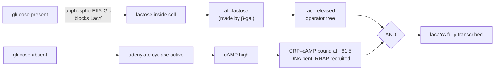
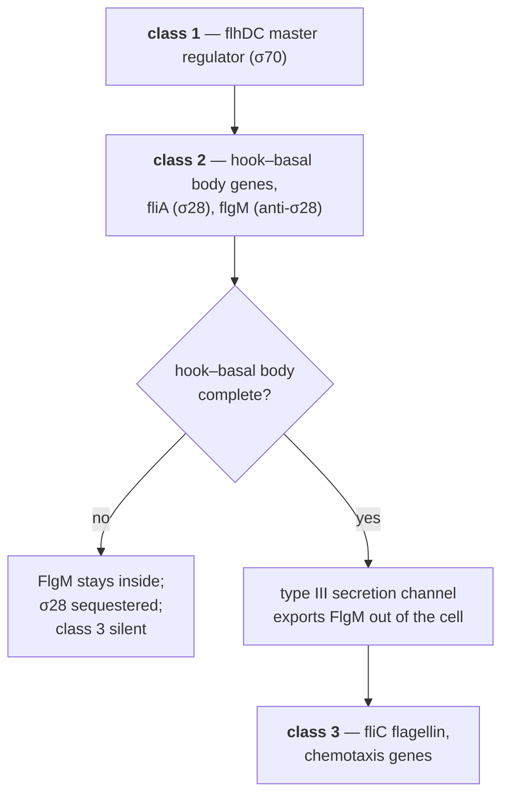
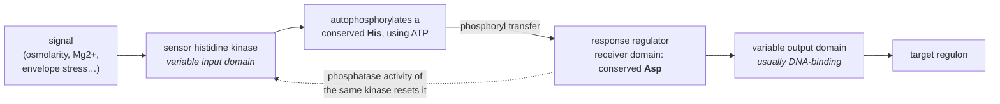

# 21 — Bacterial gene regulation

> **Before this:** [Ch 05 Transcription](../part-01-molecular-foundations/05-transcription.md) · [Ch 07 The genetic code and translation](../part-01-molecular-foundations/07-genetic-code-and-translation.md) · [Ch 08 Proteins and gene function](../part-01-molecular-foundations/08-proteins-and-gene-function.md) · [Ch 20A Bacterial and phage genetics](../part-03-genome-instability/20A-bacterial-and-phage-genetics.md) — §5's entire method is the F′ merodiploid built there · **Time:** ~45 min

Regulation appears here in its clearest form. A bacterium has a small genome, no nucleus, no
chromatin, a doubling time of twenty minutes, and a fluctuating food supply. Everything it
does about gene expression is visible, measurable, and — unusually for biology — genuinely
close to a logic circuit. Learn the logic here, where it is uncluttered, and Chapter 22 will
be a matter of adding complexity to a skeleton you already have.

## What you'll be able to do

- Predict lac operon expression for any combination of sugars **and** any genotype, including partial diploids — and explain why the system cannot bootstrap without leaky basal expression
- Write the lac truth table and show why it approximates an AND gate — and where the approximation fails
- Distinguish *cis*-acting from *trans*-acting elements — including the case where the *cis* element is the mRNA itself — and design the merodiploid test that separates a broken repressor from a broken operator
- Explain why ribosome-mediated attenuation is mechanically possible in bacteria and impossible in eukaryotes
- Place any regulatory mechanism on the two orthogonal axes: negative/positive control, inducible/repressible
- Trace the signal path through a σ-factor regulon, a two-component His→Asp relay and a quorum-sensing loop, and say what each system is actually measuring rather than what it appears to sense
- Classify every control point a bacterium uses, from σ-factor choice down to mRNA folding, by the timescale it acts on — and choose negative or positive control for a gene from its duty cycle, noise floor and failure mode

## The core idea

A gene is not a switch. It is a **rate**, and regulation is a set of multiplicative factors
on that rate.

The rate at which RNA polymerase fires from a promoter depends on what else is bound nearby.
A protein sitting on the DNA where polymerase must sit lowers the rate. A protein that grabs
polymerase and holds it against a weak promoter raises it. That is nearly the entire
mechanism, and every regulatory story in this chapter is a variation on *what makes those
proteins bind or let go*.

The second idea is architectural, and it outlives every increase in biological complexity:

> **Some regulatory elements are sequences and some are diffusible molecules, and this
> distinction is absolute.** A sequence — a promoter, an operator — can only affect the DNA
> molecule it physically sits on. It is ***cis*-acting**. A gene product that leaves its
> template and floats around the cell affects *every* copy of its target. It is
> ***trans*-acting**. In programmer's terms: *cis* elements are fields on an instance;
> *trans* factors are globals in shared memory. Break a global and every instance
> misbehaves. Break a field and only that instance does.

The classical experiments in this chapter exist to read out that distinction — by putting two
copies of the same operon in one cell and asking which one broke.

---

## 1. Why regulate: the arithmetic of waste

Protein synthesis dominates a bacterium's energy budget. Building one peptide bond costs
roughly four high-energy phosphate bonds before you count the cost of making the amino acid
itself, so a thousand-residue enzyme is a five-figure ATP investment, repeated for every
copy. Expressing a full sugar-catabolism operon that you have no use for is not free.

Suppose the waste costs a lineage **5% of its growth rate** — a plausible figure for a
strongly expressed unneeded operon. That sounds negligible. It isn't, because generations are
cheap:

```
relative fitness per generation:  0.95
after 100 generations:            0.95^100 = e^(100 × ln 0.95) = e^(−5.13) ≈ 0.006
```

The thrifty strain outnumbers the wasteful one **~170 : 1**. At a 20-minute doubling time,
100 generations is about **33 hours**. Selection on regulation is not a slow background
pressure; on a bacterial clock it is brutal and fast. This is why bacterial genomes are
regulatorily tight in a way vertebrate genomes are not — the population sizes and generation
times make a fraction of a percent visible to selection ([Ch 27](../part-05-population-genetics/27-the-four-forces.md)).

Economy is not the only reason. Some products are toxic in the wrong context, some must be
built in a strict order (you cannot make flagellin before you have a flagellum to put it in),
and some are only useful if enough neighbours are doing the same thing.

## 2. The operon: one promoter, several genes

A bacterial promoter often serves a run of adjacent genes, transcribed into a single
**polycistronic mRNA** — one RNA molecule carrying several complete coding sequences. That
unit is an **operon**.

This works because bacterial ribosomes do not have to start at the 5′ end. Each coding
sequence carries its own **Shine–Dalgarno** sequence a few bases upstream of its start codon,
and a ribosome binds directly there ([Ch 07](../part-01-molecular-foundations/07-genetic-code-and-translation.md)).
A single transcript therefore exports several independently translatable symbols. Eukaryotic
ribosomes instead load at the 5′ cap and scan forward, so in practice only the first open
reading frame gets translated — which is the mechanistic reason operons are essentially a
bacterial device, not a matter of bacteria being "simpler".

The payoff is **coordinate regulation for free**. One control point buys you the entire
pathway, expressed together, in roughly fixed stoichiometry, with genes usually arranged in
pathway order. In *E. coli* K-12 roughly 4,300 protein-coding genes are organised into on the
order of 2,500 transcription units, and around 60% of those genes sit in multigene operons.

One caveat worth carrying: an operon is not a rigid object. Internal promoters and internal
terminators mean the same run of genes can be transcribed as several overlapping units, in
different combinations, under different conditions. "The operon" is better thought of as the
commonest transcript from a region than as a fixed record layout.

## 3. The *lac* operon in full

Lactose is a disaccharide — glucose joined to galactose. To eat it, *E. coli* needs to import
it and cleave it. Three genes, one promoter:

```
      lacI            CAP      P          O1                                   O2
  ────[=========]────[≈≈≈]──[−35 −10]───[▓▓▓]────[== lacZ ==]────────────────[▓▓▓]──[= lacY =]──[= lacA =]───
       repressor      ▲       ▲          ▲        β-galactosidase              ▲     permease   transacetylase
       (own weak      │       │          │                                     │
        promoter)     │       │       centred at +11                    at +412, inside lacZ
                      │    RNA polymerase binds here
                   centred at −61.5                    O3 at −82, overlapping the CAP site
                   (CRP–cAMP)
                                        ├────────────  one polycistronic mRNA  ────────────────────────────▶
```

| Element | Product | Job | *cis* or *trans*? |
|---|---|---|---|
| *lacZ* | β-galactosidase | cleaves lactose → glucose + galactose | *trans* (enzyme) |
| *lacY* | lactose permease | membrane transporter, imports lactose | *trans* (but acts on the cell) |
| *lacA* | thiogalactoside transacetylase | detoxifies non-metabolisable galactosides; dispensable | *trans* |
| *lacI* | Lac repressor | binds the operator, blocks transcription | ***trans*** |
| *P* | — | RNA polymerase binding site | ***cis*** |
| *O1/O2/O3* | — | repressor binding sites | ***cis*** |
| CAP site | — | activator binding site | ***cis*** |

**The repressor.** LacI is a homotetramer — a dimer of dimers — present at only about ten
tetramers per cell. Each half can grip an operator, so one tetramer bridges *two* operators
and loops the DNA between them. This matters quantitatively: O1 by itself gives only about
20-fold repression; O1 with one auxiliary operator reaches ~440-fold (O3) or ~700-fold (O2),
and all three together give **~1,300-fold**. Looping is not decoration; it is where most of
the repression comes from, and it is the first appearance of a trick that dominates eukaryotic
regulation
([Ch 22](22-eukaryotic-transcriptional-regulation.md), [Ch 50](../part-10-functional-genomics/50-3d-genome.md)).

**The inducer is not lactose.** It is **allolactose**, an isomer produced as a side reaction
by β-galactosidase itself. Read that again: *the enzyme encoded by the operon makes the
molecule that turns the operon on.* The system cannot bootstrap from a true zero, which is
why repression is deliberately leaky — a few molecules of LacZ and LacY persist even when
fully repressed, and they are functionally required. Leakiness is a design constraint, not a
defect.

Allolactose binds LacI and shifts it allosterically, reorienting the DNA-binding domains and
dropping operator affinity by around three orders of magnitude. Nothing is destroyed; an
equilibrium moves ([Ch 01 §5](../part-00-orientation/01-chemistry-and-cell-primer.md#5-the-part-that-changes-how-you-think-everything-is-stochastic)).

> In the laboratory one uses **IPTG**, a gratuitous inducer: it binds LacI but is not a
> substrate, so it induces without being consumed and its concentration stays under your
> control. Decoupling the input from the output is what makes the *lac* system the workhorse
> of expression vectors ([Ch 36](../part-08-methods/36-core-molecular-methods.md)).

**The logic so far: negative control, inducible.** Default ON; a *trans*-acting protein turns
it off; a small molecule removes that protein.

## 4. Catabolite repression, and the AND gate

Glucose is a better carbon source, so a cell offered both sugars eats glucose first, pauses,
then eats lactose — **diauxic growth**, two exponential phases with a lag between. The pause
is the operon being built.

Two mechanisms enforce the preference, and neither involves glucose binding anything in the
*lac* system. The signal is **the act of transporting glucose**.

**Layer 1 — positive control by CRP.** *E. coli* imports glucose through the
phosphotransferase system, which consumes phosphoryl groups from a protein called EIIA<sup>Glc</sup>.
Phospho-EIIA<sup>Glc</sup> activates adenylate cyclase; so while glucose is flowing,
EIIA<sup>Glc</sup> is mostly unphosphorylated and **cAMP falls**. cAMP is the ligand for
**CRP** (cAMP receptor protein, also called **CAP**, catabolite activator protein — one
protein, two names from two labs). CRP–cAMP binds a site centred at −61.5, bends the DNA
sharply, and contacts RNA polymerase, recruiting it. The *lac* promoter is intrinsically weak
— it has a poor −35 element — so without CRP it barely fires at all. The weakness is the
point: it leaves something for an activator to do.

**Layer 2 — inducer exclusion.** Unphosphorylated EIIA<sup>Glc</sup> also binds LacY directly
and shuts the permease. No lactose in, no allolactose, no induction. How the two layers
divide the labour is still argued over — inducer exclusion is the larger contributor during
glucose–lactose diauxie, but experiments show it cannot account for the full effect alone.
Both are real.



### The truth table, and why "AND" is an approximation

| Lactose | Glucose | Operator | CRP–cAMP | *lacZYA* |
|:--:|:--:|---|---|---|
| − | + | occupied | absent | off |
| − | − | occupied | present | off |
| + | + | mostly occupied (inducer exclusion) | absent | barely on |
| + | − | free | present | **ON** |

`expression = lactose AND NOT glucose`.

Now derive it rather than asserting it. Model the firing rate as a product of two occupancies:

```
rate ∝ f_free × A          f_free = fraction of time O1 is unoccupied
                           A      = 0.03 + 0.97·p_C   (promoter is ~3% as strong
                                                       without CRP as with it)
```

with illustrative occupancies: `f_free` = 0.001 (no lactose), 0.15 (lactose + glucose,
partial induction), 0.95 (lactose alone); `p_C` = 0.05 (glucose present), 0.90 (absent).

| Lactose | Glucose | f_free | p_C | A | rate | normalised |
|:--:|:--:|--:|--:|--:|--:|--:|
| − | + | 0.001 | 0.05 | 0.079 | 7.9 × 10⁻⁵ | **0.00009** |
| − | − | 0.001 | 0.90 | 0.903 | 9.0 × 10⁻⁴ | **0.0011** |
| + | + | 0.15 | 0.05 | 0.079 | 1.2 × 10⁻² | **0.014** |
| + | − | 0.95 | 0.90 | 0.903 | 8.6 × 10⁻¹ | **1.00** |

Dynamic range ≈ **11,000-fold** — genuinely switch-like. But the three "off" states differ
from each other by a factor of **~150**. This is an analogue system with a large dynamic
range, not a digital gate, and the difference shows up as the diauxic lag not being perfectly
flat.

What makes it *look* digital in a real cell is feedback: more permease → more lactose → more
allolactose → less repressor → more permease. That positive loop, on top of cooperative
repressor binding, produces a sigmoidal response and, over a range of inducer concentrations,
**bistability** — individual cells are fully induced or fully off, and the smooth population
average is a mixture of two discrete states. A bulk measurement of this system reports a
number that no single cell exhibits ([Ch 48](../part-10-functional-genomics/48-single-cell-and-spatial.md)).

## 5. Merodiploids: how to tell *cis* from *trans*

This is the classical exam problem, and it is the clearest demonstration of the *cis*/*trans*
distinction anywhere in genetics.

The F factor is a conjugative plasmid that can pick up a chunk of the chromosome. An **F′lac**
carries a second copy of the *lac* region, so a cell holding one is a **partial diploid**
(**merodiploid**) — diploid for *lac* and haploid for everything else. You now have two
instances of the same object in one address space, and you can break them independently.

> **Where the merodiploid comes from.** Conjugation, the F factor, how an Hfr forms and how
> aberrant excision generates an F′ carrying a defined chunk of chromosome are derived in
> [Ch 20A §§3–4](../part-03-genome-instability/20A-bacterial-and-phage-genetics.md). That
> chapter also runs the complementation test in its general bacterial form; this section is
> that test applied to one operon, and the *cis*/*trans* algorithm below is its specialisation.

| Mutation | Lesion | Haploid phenotype | Behaviour in a merodiploid |
|---|---|---|---|
| *lacI*⁻ | repressor protein non-functional | constitutive | **recessive** — a wild-type copy supplies repressor in *trans* |
| *lacI*ˢ | repressor cannot bind inducer | uninducible | **dominant** — see below |
| *lacO*ᶜ | operator sequence altered; repressor cannot bind | constitutive | ***cis*-dominant** — affects only its own copy |
| *lacP*⁻ | promoter defective | no expression | ***cis*-dominant** — affects only its own copy |
| *lacZ*⁻ | enzyme dead | no β-galactosidase | recessive |

*lacI*ˢ deserves a note, because "dominant" here has a specific mechanism. LacI is a
tetramer, so in a merodiploid the wild-type and superrepressor subunits assemble into **mixed
tetramers**. Those still bind the operator but cannot be released by inducer, so a few mutant
subunits poison the whole pool. This is **negative complementation** — dominance arising from
multimerisation, not from the mutant protein being more active.

### The algorithm

Any merodiploid problem is solved the same way:

1. **Pool the *trans* products.** Is there functional LacI anywhere in the cell? Is there any
   *lacI*ˢ? (Any *lacI*ˢ poisons the pool. Any *lacI*⁺ rescues a *lacI*⁻.)
2. **Then take each operon copy separately** and check its own *cis* elements. Dead promoter →
   this copy makes nothing, full stop. *O*ᶜ → this copy ignores the repressor pool entirely.
3. **Then check the structural genes on that copy** — which enzymes can this copy actually
   produce?
4. **Sum over copies.** The assay reports the total.

Step 2 is where people go wrong. A *cis* mutation is scored on the copy it sits on and
nowhere else, so its visibility depends on what genes are downstream *of it*.

## 6. The *trp* operon: the other allosteric sign

Five genes — *trpE*, *trpD*, *trpC*, *trpB*, *trpA* — encoding the enzymes that synthesise
tryptophan. The logic is inverted relative to *lac*: this operon should run **unless**
tryptophan is already available.

TrpR, the repressor, cannot bind DNA on its own. Tryptophan binds it and *enables* DNA
binding. Tryptophan is a **corepressor**.

So both LacI and TrpR are negative regulators, and both are controlled by a small molecule —
but the signs are opposite. Allolactose takes LacI **off** the DNA; tryptophan puts TrpR
**on** it. That is why *negative/positive* and *inducible/repressible* are two independent
axes, not one:

| | **Inducible** (signal turns expression ON) | **Repressible** (signal turns expression OFF) |
|---|---|---|
| **Negative** (regulator blocks) | *lac* — allolactose evicts LacI | *trp* — Trp recruits TrpR |
| **Positive** (regulator recruits) | *ara* — arabinose converts AraC to an activator; *mal* — maltotriose activates MalT | genuinely rare; no clean textbook example in *E. coli* |

> AraC is often offered for that empty cell, and it does not belong there. Without arabinose
> AraC binds *araO2* and *araI1* and loops the ~210 bp between them, occluding the promoter —
> that is *negative* control, and the signal (arabinose) still turns expression **on**, which
> is inducible by definition. AraC spans the two **rows** of this table, not the two columns:
> one protein that represses by looping and activates by recruiting.

TrpR gives roughly 70-fold control. A second mechanism supplies the rest.

## 7. Attenuation: coupling translation to transcription

Between the promoter and *trpE* sits a leader of about 160 nucleotides, *trpL*. It contains a
14-codon open reading frame:

```
   Met Lys Ala Ile Phe Val Leu Lys Gly TRP TRP Arg Thr Ser  stop
    1   2   3   4   5   6   7   8   9   10  11  12  13  14
```

Tryptophan is the **rarest amino acid** in most proteomes — around 1% of residues. Two
consecutive Trp codons in a 14-codon peptide is a screaming statistical anomaly. It is a
sensor: the peptide is not the product, its *translation rate* is the measurement.

The leader RNA has four segments that can pair in two mutually exclusive ways:

```
   5′──[ 1 ]────[ 2 ]────[ 3 ]────[ 4 ]────▶ trpE ...
        ▲                └──3:4──┘   intrinsic terminator (GC stem + U-tract)
        │            └──2:3──┘        antiterminator — consumes segment 3
        └─ the 14-codon ORF; Trp codons at 10, 11
```

Now the mechanism, which works **only** because in a bacterium a ribosome loads onto the
transcript while RNA polymerase is still making it:

```
 Trp PLENTIFUL — charged tRNA-Trp abundant; ribosome sails through codons 10–11,
                 reaches the leader stop codon, and sits ON segment 2

     ── 1 ──[ RIBOSOME covers 2 ]──   3 ╲___╱ 4        3:4 terminator forms
                                                        RNAP releases at the U-tract
                                                        ✗ trpEDCBA never transcribed

 Trp SCARCE   — uncharged tRNA-Trp; ribosome STALLS at codons 10–11,
                sitting on segment 1; segment 2 is left free

     ──[ RIBOSOME on 1 ]──   2 ╲___╱ 3   ── 4 ──        2:3 antiterminator forms
                                                        3 is used up; 3:4 cannot form
                                                        ✓ RNAP reads on into trpEDCBA
```

A third case makes the design obvious: with **no ribosome at all**, 1:2 and 3:4 both form and
transcription terminates. The default is off; it takes an actively stalled ribosome to switch
it on.

Attenuation contributes roughly a further 8–10-fold on top of TrpR's ~70-fold, for combined
control of several hundred-fold. The *his* operon runs the same trick with a leader peptide
containing **seven consecutive histidine codons**, and several other amino-acid operons follow
suit.

> **Ribosome-mediated attenuation is impossible in a eukaryote, and the reason is
> architectural.** In a eukaryote transcription happens in the nucleus and translation in the
> cytoplasm; the transcript is capped, spliced and exported before a ribosome ever touches it.
> No ribosome can be positioned on a nascent transcript to influence the polymerase making it.
> The nuclear envelope does not merely add a processing step — it removes an entire class of
> regulatory mechanism from the space of possibilities.
>
> Be precise about *which* class. Attenuation in the wider sense — a leader RNA deciding
> whether an already-initiated transcript continues — is alive and well in eukaryotes:
> promoter-proximal premature termination of Pol II is widespread, and the eukaryotic TPP
> riboswitches of §8 are exactly that decision made by RNA folding. What the envelope forbids
> is letting a **ribosome on the nascent transcript** be the thing that decides.

## 8. Riboswitches: regulation with no protein at all

Some mRNA leaders skip the protein intermediary entirely. A **riboswitch** is a leader that
folds into an **aptamer** which binds a metabolite directly, coupled to an **expression
platform** whose fold is changed by that binding.

The specificity is not a compromise: purine riboswitches discriminate guanine from adenine —
molecules differing at one functional group — with affinities in the nanomolar-to-micromolar
range. RNA is a perfectly competent receptor.

The modularity is the elegant part. The same aptamer can be bolted to different platforms:

| Platform | Effect of ligand binding | Level controlled |
|---|---|---|
| Intrinsic terminator | ligand stabilises the terminator hairpin | transcription (elongation) |
| Shine–Dalgarno-sequestering hairpin | ligand occludes the ribosome binding site | translation initiation |
| Self-cleaving ribozyme (*glmS*) | glucosamine-6-phosphate acts as coenzyme; mRNA cleaves itself | mRNA stability |

Known classes sense TPP (thiamine pyrophosphate — the most widespread, and the only class
confirmed in eukaryotes, where plant and fungal versions act on splicing and 3′-end
processing), FMN, SAM, lysine, glycine, cobalamin, and purines. Almost all sit upstream of the
biosynthetic or transport genes for the very metabolite they sense: direct end-product feedback
with no transcription factor in the loop, which is part of why riboswitches are read as an RNA
World remnant — and why they are being pursued as antibiotic targets.

Note that the framework survives: the aptamer is *cis* in the purest possible sense — it is
part of the very molecule it regulates — and the metabolite is *trans*.

**RNA thermometers** are the same idea with physics as the ligand. A hairpin occludes the
Shine–Dalgarno sequence and melts at host body temperature, exposing it. *Listeria* uses one
to switch on virulence genes at 37 °C. The sensor *is* the thermodynamics.

## 9. Sigma factors: switching the whole programme

Core RNA polymerase (α₂ββ′ω) can transcribe but cannot find a promoter. A **σ factor** binds
core and confers promoter specificity — different σ, different consensus sequence, different
gene set. Swapping σ is a **global mode switch**, not a per-gene decision.

*E. coli* has **seven**:

| σ | Gene | Regulon |
|---|---|---|
| σ⁷⁰ | *rpoD* | housekeeping — the default |
| σ³⁸ (σˢ) | *rpoS* | stationary phase and general stress |
| σ³² | *rpoH* | heat shock — chaperones and proteases |
| σ⁵⁴ | *rpoN* | nitrogen; mechanistically distinct (see below) |
| σ²⁸ | *fliA* | flagellar and chemotaxis genes |
| σ²⁴ (σᴱ) | *rpoE* | envelope / extracytoplasmic stress |
| σ¹⁹ | *fecI* | ferric citrate transport |

Three consequences.

**σ factors compete for a shared pool of core polymerase.** These are not independent
channels. Inducing a stress regulon partially represses housekeeping transcription simply by
sequestering the enzyme — contention on a shared resource, exactly as in a fixed-size thread
pool. Regulation happens both by changing σ abundance and by **anti-σ factors** that sequester
them.

**σ⁵⁴ is an obligate AND.** Unlike the others it forms a stable closed complex that cannot
melt the DNA by itself; it requires a bacterial enhancer-binding protein bound upstream, which
loops around and hydrolyses ATP to open the complex. A σ⁵⁴ promoter therefore fires only when
polymerase *and* an activator are both present — hard-wired coincidence detection.

**The heat-shock loop senses demand, not temperature.** σ³² is regulated two ways: its own
mRNA carries an RNA thermometer that melts on heating, and free chaperones bind σ³² and
deliver it to a protease. When unfolded protein accumulates, chaperones are titrated away,
σ³² is stabilised, and more chaperones are made. The controller measures *unmet demand for the
output*, which is a better sensor than temperature and requires no thermometer at all.

**Cascades build state machines.** *Bacillus subtilis* sporulation runs a σ cascade —
σᶠ then σᴳ in the forespore, σᴱ then σᴷ in the mother cell — with signals passing between the
two compartments so that each transition requires the other compartment to have completed the
previous step. Flagellar assembly is a shorter and even cleaner example:



The checkpoint is *physical*. FlgM inhibits σ²⁸ and blocks flagellin transcription; the only
way to remove FlgM is to pump it out through the completed export channel. The machine reports
its own completion by whether it can flush its own inhibitor. Nothing measures anything.

## 10. Two-component systems: the generic sensor interface

Most environmental sensing in bacteria uses one repeated two-protein module.



The conserved core is a His→Asp phosphotransfer. Everything else is swappable: the input
domain is whatever detects the signal, the output domain is whatever acts on it. This is a
**genuine interface**, and evolution has done combinatorial assembly on it —
*E. coli* K-12 alone carries about **30 histidine kinases and 32 response regulators**, and
many soil bacteria carry several times that.

Crosstalk between systems is suppressed *kinetically*, not structurally: cognate pairs have
coevolved contact residues so a kinase phosphorylates its own partner far faster than any
other. Specificity is a rate ratio, which is the same answer Chapter 01 gave for
protein–DNA recognition.

Four canonical examples, chosen because their outputs differ in kind:

- **EnvZ / OmpR** — osmolarity sets the OmpF:OmpC porin ratio. Because the two promoters carry
  binding sites of different affinity, a *continuous* OmpR-P concentration is decoded into a
  ratio of two outputs. An analogue-to-two-channel decoder, not a switch.
- **PhoQ / PhoP** — Mg²⁺ and antimicrobial peptides; controls *Salmonella* virulence.
- **NtrB / NtrC** — nitrogen limitation; NtrC is a σ⁵⁴ enhancer-binding protein, so §9's
  coincidence detector is its output stage.
- **CheA / CheY** — chemotaxis. Output is not transcription at all: phospho-CheY binds the
  flagellar motor and reverses it, on a **millisecond** timescale.

That last one makes the general point. The same phosphotransfer architecture spans five orders
of magnitude in response time depending on what the output domain touches.

## 11. Quorum sensing: counting without communicating

Some behaviours are worthless alone — bioluminescence, secreted virulence factors, biofilm
matrix, taking up environmental DNA. Doing them at low density wastes the product or alerts a
host prematurely.

The protocol is almost embarrassingly cheap. Each cell secretes a small **autoinducer** at a
constant rate. In a confined volume the extracellular concentration rises with cell density.
Above a threshold it re-enters and activates its receptor.

In *Vibrio fischeri*, LuxI synthesises an acyl-homoserine lactone; LuxR binds it and activates
the *luxICDABEG* operon, which makes light — and which contains *luxI* itself. That positive
feedback converts a gentle concentration gradient into a sharp, hysteretic transition. The
bacterium lives in the light organ of the squid *Euprymna scolopes* and glows only at the
density reached inside it. Gram-positive bacteria run the same logic with secreted
oligopeptides read by two-component receptors.

Two honest caveats. First, a cell cannot distinguish "many neighbours" from "small enclosed
space with poor diffusion" — both raise the local concentration identically. The **diffusion
sensing** reading of the same data is not obviously wrong, and both readings are probably
useful to the cell. Second, the AI-2 molecule made by many species via LuxS is often called a
universal interspecies signal, but whether it is a signal or a metabolic by-product that some
species eavesdrop on remains contested.

The evolutionary failure mode is the one a distributed-systems engineer would predict
immediately: the signal is public and unauthenticated, so **cheaters** that respond without
producing can invade.

## 12. Phase variation: regulated randomness

Not all regulation is a response. Some is deliberate, heritable **bet-hedging** against an
environment the cell cannot predict — usually a host immune system.

**DNA inversion.** *Salmonella* alternates between two flagellins. A **996-bp** chromosomal
segment flanked by 26-bp *hixL*/*hixR* sites is inverted by the Hin recombinase. In one
orientation the segment's promoter drives *fljB* (phase-2 flagellin) together with *fljA*, a
repressor of *fliC*; flipped, neither is made and FliC (phase-1 flagellin) appears instead.
Switching occurs at roughly 10⁻³–10⁻⁵ per cell per generation. By the time the host has raised
antibodies against one flagellin, a minority sub-population already displays the other.
*E. coli* runs the same trick on type-1 pili with the FimB/FimE-inverted *fim* switch.

**Slipped-strand mispairing.** *Neisseria opa* genes carry a pentameric repeat *inside* the
coding sequence. Replication slippage adds or removes a unit, shifting the reading frame and
switching the gene on or off. These are **contingency loci** — the local mutation rate is
elevated by the sequence itself, and that elevation is a selected property.

Two conclusions that surprise people. **Mutation rate is under genetic control and is not
uniform across the genome** — it can be locally tuned upward where unpredictability pays
([Ch 16](../part-03-genome-instability/16-mutation.md)). And this is **not** Lamarckian: the
switching is blind and constant. The host selects among variants that already exist.

## 13. What to carry into Chapter 22

**Regulation is combinatorial.** *lac* integrates two inputs. A eukaryotic enhancer integrates
dozens. The arithmetic is the same — occupancies multiply — the fan-in just grows.

**A control point is anywhere a rate can be changed.** Bacteria use all of them:

| Control point | Mechanism | Response time |
|---|---|---|
| σ-factor availability | σ competition, anti-σ | minutes — whole regulons |
| Transcription initiation | repressors, activators, DNA looping | seconds–minutes |
| Transcription elongation | attenuation, riboswitch terminators | seconds, per transcript |
| Translation initiation | SD occlusion, riboswitches, small RNAs | seconds |
| mRNA stability | ribozymes, RNase targeting | seconds–minutes |
| Protein activity | allostery, phosphorylation, proteolysis | milliseconds–seconds |

Initiation dominates textbooks because it is the cheapest place to intervene — you avoid the
whole downstream cost. It is not the only place.

***cis* versus *trans* is the distinction that survives.** In eukaryotes the *cis* elements
move hundreds of kilobases away and the *trans* factors multiply into the thousands, but the
merodiploid logic is unchanged — and it reappears directly as allele-specific expression and
*cis*-eQTL analysis in [Ch 52](../part-11-human-and-statistical-genomics/52-association-to-mechanism.md).

**Negative and positive control are different engineering solutions.**

| | Negative control | Positive control |
|---|---|---|
| Default state | ON | OFF |
| Regulator lost | constitutive expression | no expression at all |
| Noise floor | leaky — repressor occupancy is never 1 | low — nothing recruits polymerase |
| Underlying promoter | must be strong | must be weak |
| Failure mode | one operator mutation → permanently ON | one activator-site mutation → permanently OFF |
| Ease of evolving | easy — any DNA-binding protein overlapping a strong promoter represses | harder — the activator must bind DNA *and* productively contact polymerase |
| Suits genes that are | usually needed | rarely needed |

Bacteria pick according to duty cycle, and *lac* uses both at once. Note the statistical
character of the difference: with only ~10 repressor tetramers per cell, operator occupancy
fluctuates and expression arrives in bursts, so negative control has a *higher variance* floor.
Positive control on a weak promoter has a lower floor but a slower rise. It is a
bias–variance trade-off with molecules.

Finally, the network shape. *E. coli* has a few hundred transcription factors, most regulating
a handful of operons each, while a small number of global regulators — CRP, FNR, IHF, Fis,
ArcA, Lrp, H-NS — control hundreds. The out-degree distribution is heavy-tailed, the hierarchy
is only about three layers deep, and feed-forward loops are strongly over-represented. Hold
that shape in mind: Chapter 25 asks what changes when the hierarchy gets deep.

---

## Common misconceptions

| What people think | What's actually true |
|---|---|
| Lactose is the inducer of the *lac* operon | **Allolactose** is, and it is made by β-galactosidase — the enzyme the operon encodes. The system needs leaky basal expression to bootstrap. IPTG is used in the lab precisely because it bypasses this |
| A repressed operon is off | Repression is ~1,000-fold, not infinite. Residual LacZ and LacY are not a leak to be engineered away; without them induction could never start |
| Glucose represses *lac* by binding something in it | Glucose binds nothing in the *lac* system. Its **transport** dephosphorylates EIIA<sup>Glc</sup>, which both lowers cAMP (disabling CRP) and blocks the permease. The signal is the act of transport |
| CAP and CRP are two different proteins | One protein, two names — Catabolite Activator Protein and cAMP Receptor Protein, coined by different labs |
| A constitutive mutant means the repressor is broken | Two entirely different lesions give constitutivity: a broken *trans*-acting repressor (*lacI*⁻, recessive) or a broken *cis*-acting operator (*lacO*ᶜ, *cis*-dominant). Telling them apart is the entire purpose of the merodiploid test |
| *cis*-dominance is a kind of Mendelian dominance | It isn't. *lacO*ᶜ has literally zero effect on the other copy — it isn't competing with it. Whether you can even detect it depends on which structural genes sit downstream of it on that same DNA molecule |
| TrpR is LacI running backwards | Both are negative regulators, but the allosteric signs are opposite: allolactose takes LacI **off** DNA, tryptophan puts TrpR **on** it. Inducer versus corepressor |
| Attenuation is a form of repression | It is a decision about whether an **already-initiated** transcript is finished, made by RNA folding rather than protein binding. Different control point, different mechanism |
| Bacteria are too simple for interesting regulation | *E. coli* runs a few hundred transcription factors, seven σ factors, ~30 two-component systems, hundreds of small RNAs, riboswitches and quorum sensing. What it lacks is chromatin, not sophistication |

## Worked example: solving a merodiploid

**Genotype.** (Chromosome) `lacI⁻ P⁺ Oᶜ lacZ⁻ lacY⁺` / (F′) `lacI⁺ P⁻ O⁺ lacZ⁺ lacY⁻`

Predict β-galactosidase and permease, with and without inducer. Work the algorithm.

**Step 1 — pool the *trans* products.** The chromosome's *lacI*⁻ contributes nothing. The F′
carries *lacI*⁺, and repressor protein is diffusible, so **functional LacI is present in the
cell**. No *lacI*ˢ, so the pool responds normally to inducer.

**Step 2 — chromosomal copy, *cis* elements.** *P*⁺, so polymerase can initiate. *O*ᶜ, so the
repressor pool — however healthy — cannot bind this operator. **This copy is transcribed
constitutively**, inducer or not.

**Step 3 — chromosomal copy, structural genes.** *lacZ*⁻: no β-galactosidase, ever. *lacY*⁺:
**permease is produced constitutively**.

**Step 4 — F′ copy, *cis* elements.** *P*⁻. No initiation. Nothing downstream is transcribed
under any condition, and the state of *O*⁺ is irrelevant — you cannot regulate a transcript
that is never made.

**Step 5 — F′ copy, structural genes.** *lacZ*⁺ is intact and never expressed. *lacY*⁻ is
broken anyway.

**Step 6 — sum.**

| | − inducer | + inducer |
|---|---|---|
| β-galactosidase | **none** | **none** |
| Permease | **present** | **present** |

**Read the trap.** A β-galactosidase assay alone returns zero in both conditions, which is
exactly the readout of a *lacI*ˢ superrepressor — a completely different genotype. The two are
separated only by assaying the second gene: this strain makes permease constitutively, a
superrepressor strain makes none. The assay is not the genotype, and one reporter is not
enough to specify a regulatory state.

**Now check yourself against the general table**, built the same way:

| Genotype | β-gal, − inducer | β-gal, + inducer | Reason |
|---|:--:|:--:|---|
| `I⁺ O⁺ Z⁺` | − | + | wild type: inducible |
| `I⁻ O⁺ Z⁺` | + | + | no repressor anywhere → constitutive |
| `I⁻ O⁺ Z⁺ / F′ I⁺ O⁺ Z⁻` | − | + | *I*⁺ supplies repressor **in *trans***; *lacI*⁻ is recessive |
| `I⁺ Oᶜ Z⁺ / F′ I⁺ O⁺ Z⁺` | + | + | the *O*ᶜ copy escapes repression → constitutive β-gal |
| `I⁺ Oᶜ Z⁻ / F′ I⁺ O⁺ Z⁺` | − | + | *O*ᶜ sits on the **dead-*Z*** copy, so it is invisible to the assay |
| `I ˢ O⁺ Z⁺ / F′ I⁺ O⁺ Z⁺` | − | − | mixed tetramers lock both operators: **dominant** |
| `Iˢ O⁺ Z⁺ / F′ I⁺ Oᶜ Z⁺` | + | + | superrepressor locks the chromosomal copy, but *O*ᶜ makes the F′ copy immune |

Rows four and five are the whole lesson: **the same mutation, detectable or invisible
depending only on which DNA molecule it shares with the reporter.** That is what *cis*-acting
means, operationally.

## Connections

- **Back to:** [Ch 05 Transcription](../part-01-molecular-foundations/05-transcription.md) — promoters, σ factors and intrinsic termination · [Ch 07 Translation](../part-01-molecular-foundations/07-genetic-code-and-translation.md) — Shine–Dalgarno sequences and ribosome loading, without which §2 and §7 make no sense · [Ch 20A](../part-03-genome-instability/20A-bacterial-and-phage-genetics.md) — conjugation, the F factor and the F′ merodiploid that §5 runs on; also the λ cI/Cro switch, the one major bacterial regulatory circuit this chapter does not build, and the bistable toggle Ch 25 analyses · [Ch 01 §5](../part-00-orientation/01-chemistry-and-cell-primer.md) — binding is an occupancy, which is why every "switch" here is really a rate · [Ch 08](../part-01-molecular-foundations/08-proteins-and-gene-function.md) — allostery
- **Forward to:** [Ch 22](22-eukaryotic-transcriptional-regulation.md) takes this skeleton and adds chromatin, distance, and combinatorial fan-in · [Ch 24](24-rna-based-regulation.md) develops riboswitches and small RNAs · [Ch 25](25-networks-and-development.md) asks what happens when regulatory hierarchies get deep · [Ch 36](../part-08-methods/36-core-molecular-methods.md) uses the *lac* system as laboratory hardware · [Ch 52](../part-11-human-and-statistical-genomics/52-association-to-mechanism.md) is the merodiploid experiment repeated in humans, using allele-specific expression instead of an F′

## Check yourself

**1. Predict the phenotype of `lacIˢ O⁺ Z⁺ / F′ lacI⁺ Oᶜ Z⁺`, with and without inducer.**

<details><summary>Answer</summary>

**Constitutive** — β-galactosidase present in both conditions.

*Trans* pool: *lacI*ˢ is present, and because LacI is a tetramer the mutant subunits assemble
into mixed tetramers that bind DNA but cannot be released by inducer. The whole repressor pool
is effectively locked in the DNA-binding state.

Chromosomal copy: *O*⁺, so the locked repressor binds it. This copy is **off under all
conditions**.

F′ copy: *O*ᶜ, so no repressor of any kind can bind. This copy is transcribed
**constitutively**, and it carries *Z*⁺.

Total: constitutive β-galactosidase from the F′. A *trans*-dominant mutation and a
*cis*-dominant mutation in the same cell do not fight — they act on different objects.

</details>

**2. Why must *lac* repression be leaky, and what breaks if you engineer a perfect repressor?**

<details><summary>Answer</summary>

The inducer is allolactose, made by β-galactosidase; and lactose only enters the cell through
the permease. Both are products of the operon. With true zero basal expression there is no
permease to import lactose and no β-galactosidase to isomerise it, so no allolactose is ever
made and the operon can never be induced — the cell would starve beside a lactose supply.

The residual few molecules per cell are the bootstrap. Repression is not a leak that
engineering should eliminate; the system is a positive-feedback loop and every positive
feedback loop needs a seed.

</details>

**3. Why is ribosome-mediated attenuation impossible in a eukaryote?**

<details><summary>Answer</summary>

It requires a ribosome to be translating a transcript **while RNA polymerase is still making
it**, so that ribosome position determines which RNA hairpin forms ahead of the polymerase.
Bacteria have no nucleus: transcription and translation happen in the same compartment,
simultaneously, on the same molecule.

In a eukaryote the transcript is made in the nucleus and is capped, spliced and exported
before any ribosome contacts it. The nuclear envelope physically prevents the coupling.

Note what is *not* claimed: eukaryotes still terminate transcripts prematurely — Pol II does
it at promoter-proximal sites on a large scale, and eukaryotic TPP riboswitches make the same
kind of leader-RNA decision without any ribosome. Only the ribosome-as-sensor version is ruled
out.

This generalises: cellular architecture determines which regulatory mechanisms are even
*available*. Eukaryotes get splicing regulation and chromatin instead — mechanisms bacteria
cannot use.

</details>

**4. You are designing a bacterium. Gene A is needed in 99% of environments; gene B in 0.1%. Which gets negative control and which positive, and why?**

<details><summary>Answer</summary>

**A gets negative control, B gets positive.**

Gene A is nearly always needed, so a default-ON architecture with a strong promoter is right:
the repressor is rarely engaged, so you pay the regulatory cost almost never, and the response
to the rare "stop" signal is fast because it only requires a protein to bind. Negative
control's leakiness is harmless when the product is usually wanted anyway.

Gene B is almost never needed, so the cost that matters is the **noise floor** — expression
integrated over the 99.9% of the time it is useless. Positive control on an intrinsically weak
promoter gives a much lower floor, because nothing recruits polymerase in the resting state.
You pay a slower turn-on, which is acceptable for a rare condition.

The failure modes point the same way. A single operator mutation locks a negatively controlled
gene permanently ON — cheap for A (usually wanted), ruinous for B. A single activator-site
mutation locks a positively controlled gene permanently OFF — ruinous for A, tolerable for B.

</details>

**5. An operon is controlled by a riboswitch rather than a repressor. What would a merodiploid experiment show, and what does that tell you about *cis* and *trans*?**

<details><summary>Answer</summary>

A riboswitch mutation that destroys ligand binding would be **strictly *cis*-limited**: it
affects only the transcript made from that copy, because the aptamer is physically part of
that mRNA molecule. Nothing diffuses. The other copy would remain perfectly regulated. This is
the most extreme *cis* element possible — it acts not merely on its own DNA molecule but on
its own RNA molecule.

More telling is what you would *fail* to find. There is no gene encoding a *trans*-acting
regulator for this system, so no recessive-constitutive mutant class exists — you could never
isolate the riboswitch equivalent of *lacI*⁻, and no second copy could ever complement a
broken aptamer. A screen returning only *cis*-dominant constitutive mutants and no
complementable ones is itself evidence that the regulator is RNA rather than protein.

The metabolite remains *trans*: it diffuses and reaches every copy. The framework does not
need amending — only the observation that *cis* elements can be RNA, and that "no protein
regulator" is a detectable genetic signature, not just a mechanistic footnote.

</details>
