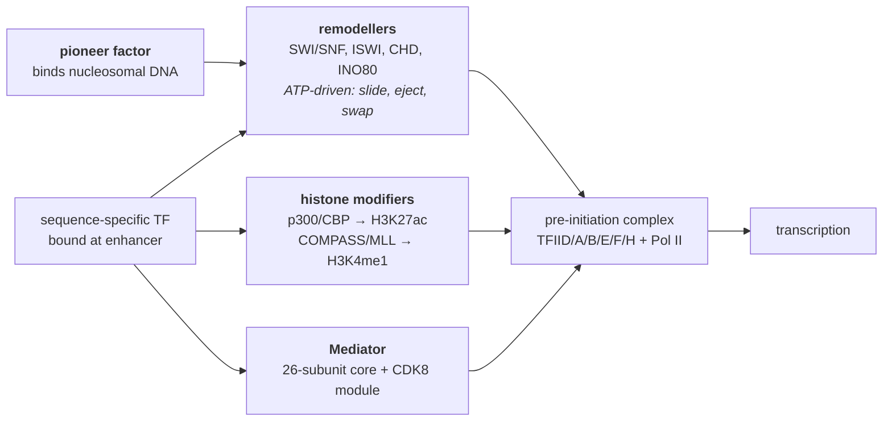

# 22 — Eukaryotic transcriptional regulation

> **Before this:** [Ch 21](21-bacterial-regulation.md) · [Ch 05](../part-01-molecular-foundations/05-transcription.md) · [Ch 03](../part-01-molecular-foundations/03-genomes-chromosomes-chromatin.md) · **Time:** ~45 min

## What you'll be able to do

- Explain why the eukaryotic genome's regulatory default is *off*, and what that costs and buys
- Name every class of cis-regulatory element, say what distinguishes an enhancer from a promoter operationally rather than by position, and resolve the paradox of an element acting on a gene a megabase away — including why looping still does not tell you which promoter in the domain it drives
- Decompose a transcription factor into its DNA-binding and activation modules, and trace what a bound activator recruits instead of touching polymerase — including why a pioneer factor is required to break the chromatin bootstrap
- Calculate, from information content, how many spurious matches a transcription-factor motif has in a 3.1 Gb genome — and derive why combinatorial control plus chromatin is the only thing that rescues specificity
- Distinguish the enhanceosome, billboard and collective models of enhancer grammar, and say which evidence discriminates them
- State what a transcriptional burst is, which kinetic parameter enhancers control, and why bulk expression measurements hide it — and separate that from the still-contested claim that transcription happens in phase-separated condensates
- Distinguish which regulatory assays test sufficiency from which test necessity, and explain why most GWAS associations are non-coding and why that makes them hard to interpret

## The core idea

A bacterium regulates a gene the way you would guard a function: put a conditional immediately in front of it, evaluate one or two inputs, proceed. The promoter is exposed, RNA polymerase can find it, and regulation mostly consists of *blocking* something that would otherwise happen ([Ch 21](21-bacterial-regulation.md)).

Eukaryotes inverted this. DNA is wrapped in nucleosomes and folded; a promoter is not exposed unless something has made it exposed. Nothing happens by default. Getting a gene transcribed therefore requires assembling, at one place and one time, a *coalition*: several sequence-specific proteins bound to elements that may be scattered over a megabase, plus chromatin-modifying machinery they recruit, plus a bridging complex that finally contacts the polymerase.

> **Bacterial regulation asks "should this gene be switched off?" Eukaryotic regulation asks "has enough independent evidence accumulated to justify switching this gene on?"** Default-off is the single reframe that generates everything else in this chapter: the need for many inputs, the tolerance of long distances, the existence of factors specialised for prising chromatin open, and the fact that the same 19,442 protein-coding genes can run thousands of distinct cell-type programmes.

---

## 1. What actually changes from bacteria

| | Bacteria | Eukaryotes |
|---|---|---|
| Substrate | Naked-ish DNA, promoter accessible | Nucleosomal chromatin, default inaccessible |
| Compartment | None — transcription and translation coupled | Nucleus separates them; an RNA-processing step intervenes |
| Element position | Within ~100 bp of the start site | Core promoter *plus* elements up to megabases away, in either orientation |
| Typical inputs per gene | 1–3 regulators | 5–20 distinct factors at multiple elements |
| Regulator count | A few hundred TFs in *E. coli* | **1,639** sequence-specific TFs in human |
| Co-regulation | Operons: one transcript, many genes | No operons. Each gene has its own promoter |
| Bridge to polymerase | Activators often touch RNA polymerase directly | Almost never direct — coactivators and Mediator intervene |

The operon row is worth dwelling on. Bacteria bundle co-regulated genes into one transcription unit, so a single switch controls the set. Eukaryotes gave that up and achieve co-regulation instead by giving physically unlinked genes the *same binding-site sequences* — a broadcast pattern rather than a shared object. More expensive per gene, far more flexible: a gene joins or leaves a regulon by gaining or losing a site, without being moved.

The exception proves the rule. Nematodes retained operons — **more than 17% of *C. elegans* genes** sit in polycistronic units — but only by inventing a whole RNA-processing mechanism to make them work: the downstream cistrons are separated post-transcriptionally by *trans*-splicing an SL2 spliced leader onto each.

## 2. The cis-regulatory parts list

| Element | Size | Position | Job |
|---|---|---|---|
| **Core promoter** | ~50–100 bp | −40 to +40 of the TSS | Positions and orients the pre-initiation complex |
| **Proximal promoter** | ~100–500 bp | Immediately upstream | Constitutive/tissue TF sites; sets baseline |
| **Enhancer** | ~200–1,000 bp | Anywhere, either orientation | Raises transcription of a target promoter |
| **Silencer** | ~200–1,000 bp | Anywhere | Lowers it; recruits corepressors |
| **Insulator / boundary** | ~200 bp–few kb | Between domains | Blocks enhancer action across it; usually CTCF-bound |
| **Locus control region** | ~10–50 kb | Often far upstream | A cluster of elements that opens and drives a whole locus |

Core promoters are less standardised than textbooks imply. Only about **10%** of human promoters contain a TATA box; roughly **60%** are instead CpG-island promoters with dispersed, imprecise start sites. The Initiator (Inr), downstream promoter element (DPE), TFIIB-recognition element (BRE) and motif ten element (MTE) appear in various combinations, and the combination is itself regulatory — see §9.

The ENCODE registry of candidate cis-regulatory elements now lists **2,348,854 human cCREs** on GRCh38, up from 926,535 in the previous release. Divide by 19,442 protein-coding genes: roughly **120 candidate regulatory elements per gene** — an upper bound on real regulation and a lower bound on the interpretation problem.

The canonical long-range element is the ZRS, which drives *SHH* in the developing limb bud from **about 1 Mb away**, on chromosome 7q36.3, *inside intron 5 of a different gene* (*LMBR1*). Point mutations in it cause preaxial polydactyly — extra digits — leaving *SHH* itself untouched.

## 3. Enhancers, and the distance paradox

Three properties define an enhancer operationally, and all three were shocks when found:

1. **Position independence** — it works upstream, downstream, or inside an intron of its target or of a neighbour.
2. **Orientation independence** — flip it and it still works. Promoters are not like this; they are directional.
3. **Distance tolerance** — tens of kb routinely, up to ~1 Mb in cases like *SHH*.

Taken literally this is absurd. One megabase of B-form DNA has a contour length of 10⁶ × 0.34 nm = **340 μm**, in a nucleus about 6 μm across. The linear distance cannot be the operative variable, because the molecule is not linear in the nucleus.

The resolution is **looping**. The DNA between enhancer and promoter is extruded into a loop, bringing two sequences that are a megabase apart in coordinates into physical contact:

```
linear coordinates
  ──[ENH]────────────────── 1 Mb of intervening DNA ──────────────────[PROM]──[gene]──►

in the nucleus
                    ╭──────────────────────╮
                    │   intervening DNA    │      loop extruded by cohesin,
                    │  (extruded as loop)  │      constrained by CTCF boundaries
                    ╰──╮                ╭──╯
  ──[ENH]══════════════╯                ╰═══════════[PROM]──[gene]──►
        └──── TF + coactivators + Mediator bridge ────┘
```

So the operative variable is not genomic distance but **contact frequency**, which is what Hi-C and Micro-C measure ([Ch 50](../part-10-functional-genomics/50-3d-genome.md)). It decays with genomic separation — hence most enhancers sit near their targets — but it is also structured: **topologically associating domains** (TADs), bounded by CTCF-bound insulators and shaped by cohesin-driven loop extrusion, make within-domain contacts far more likely than across-boundary ones.

That makes boundaries load-bearing. Deleting the TAD boundary near *EPHA4* lets limb enhancers reach genes they normally cannot — **enhancer hijacking** — producing limb malformations without altering a single coding base. Structural variants that remove boundaries activate oncogenes the same way.

## 4. Enhancer–promoter specificity: still open

Given that an enhancer can act over a megabase, why doesn't it activate every promoter it passes? We do not fully know. What we do know constrains the answer:

- **Nearest-gene assignment is wrong a large fraction of the time** — the default heuristic and the default source of error in interpreting non-coding variants.
- **Compatibility is partly promoter-class based.** Housekeeping and developmental promoters prefer different enhancer types — but in large-scale reporter assays most pairs are broadly compatible, and an enhancer's intrinsic strength explains more variance than any pairing rule.
- **Range is separably encoded.** A 2025 study found a *range extender* (REX) element sitting beside HS72, a long-range *Sall1* limb enhancer whose native working distance is **411 kb**. REX has no enhancer activity of its own, but adding it to other, shorter-range limb enhancers extended their reach — in the most extreme case, an enhancer with a native range of **73 kb** was made to act across the **848 kb** that separates the ZRS from *Shh*. Conversely, when four shorter-range limb enhancers of other genes were swapped into the ZRS position at the *Shh* locus, none could drive *Shh* in the limb bud from 848 kb away; they lack long-range activity. "How strongly" and "how far" are different properties.
- **Boundaries constrain rather than specify.** CTCF/cohesin architecture narrows the search space; it does not pick the target within it.

The honest statement for 2026: given an enhancer's sequence and the promoters in its TAD, we cannot reliably predict which one it drives.

## 5. Transcription factors are two separable modules

A sequence-specific transcription factor has, at minimum, a **DNA-binding domain** (DBD) that recognises a short sequence and an **activation** (or repression) **domain** that recruits machinery. The two are on the same polypeptide and are otherwise almost independent.

Human TFs (1,639 of them) fall into 25 DBD families, dominated by a few:

| DBD family | Human TFs | Recognition strategy |
|---|---|---|
| **C2H2 zinc finger** | 747 | Tandem fingers, each contacting ~3 bp in the major groove — modular and extensible |
| **Homeodomain** | 196 | Three-helix bundle; helix 3 in the major groove. Developmental patterning |
| **bHLH** | 108 | Dimerises via helix–loop–helix; basic region reads an E-box (CANNTG) |
| **bZIP** | 54 | Leucine zipper dimerises; basic regions grip the major groove as a clamp |
| **Forkhead** | 49 | Winged helix — the fold that makes FOXA1 a pioneer factor (§7) |
| **Nuclear receptor** | 46 | Zinc-finger DBD plus a **ligand-binding domain** — a TF with a built-in sensor |

Almost all of them read the **major groove**, for the reason derived in [Ch 01](../part-00-orientation/01-chemistry-and-cell-primer.md): it exposes enough of each base pair's edge to identify it without opening the helix.

Activation domains are the opposite of the DBDs in every respect. They are typically **intrinsically disordered**, often acidic, poorly conserved in sequence, and interchangeable. An activation domain does not act on DNA or on polymerase; it is a *recruitment address*.

> Separability is why this field became engineerable. Fuse the GAL4 DBD to the herpesvirus VP16 activation domain and you get an activator that works in yeast, flies and human cells. Split the two halves onto separate proteins and transcription only fires when those proteins interact — that is the **yeast two-hybrid assay**. Replace the DBD entirely with a catalytically dead Cas9 targeted by a guide RNA and you get CRISPRa/CRISPRi ([Ch 38](../part-08-methods/38-genome-editing.md)). None of this would work if binding and activation were one entangled function.

## 6. Motifs, PWMs, and why prediction fails

A TF's preference is summarised as a **position weight matrix**: for each position *i* and base *b*, a log-odds score log₂(f_ib / p_b). Score a window by summing; call a match above a threshold. Standard, well-behaved, and nearly useless on its own.

The reason is information-theoretic. A PWM's total information content is

```
I = Σ_i ( 2 − H_i )    bits,     H_i = − Σ_b f_ib log₂ f_ib
```

A perfectly specified position contributes 2 bits; a fully degenerate one contributes 0. Under a uniform background the probability a random position matches is ≈ 2^(−I), so the expected number of genome-wide matches on both strands is

```
E[hits] ≈ 2L · 2^(−I)
```

Real motifs are 6–15 bp and degenerate, giving I of roughly 8–15 bits. With L = 3.1 × 10⁹:

| I (bits) | Expected matches |
|---|---|
| 8 | 2.4 × 10⁷ |
| 10 | 6.1 × 10⁶ |
| 12 | 1.5 × 10⁶ |
| 15 | 1.9 × 10⁵ |

A typical TF actually occupies **10³–10⁵** sites by ChIP-seq. Wasserman and Sandelin named the consequence the **futility theorem**: a genome-wide PWM scan yields on the order of **1,000 false positives per functional site**, so essentially every predicted binding site is non-functional.

This is exactly the point made in [Ch 01](../part-00-orientation/01-chemistry-and-cell-primer.md) about specificity being relative. Individual factors are sloppy; the genome is enormous; a 10-bit preference cannot pick one site out of 6 × 10⁹. Specificity is manufactured downstream, by two multiplicative filters — **combinatorial requirement** and **chromatin accessibility** — quantified in the worked example below.

## 7. What TFs recruit: coactivators, remodellers, and pioneers

A bound activator rarely touches RNA polymerase II. It recruits, and what it recruits does the work.



**Mediator** is the physical bridge. Its ~26-subunit core is organised into head, middle and tail modules: the tail contacts activator domains, the head contacts Pol II and its C-terminal domain. A separable four-subunit **CDK8 kinase module** (MED12, MED13, CDK8/CDK19, cyclin C) associates reversibly and modulates the whole thing. Mediator is how a disordered acidic patch bound a megabase away ends up influencing polymerase.

**Chromatin remodellers** use ATP to reposition, evict or swap nucleosomes, converting a closed site into an accessible one. **Histone modifiers** write the covalent marks — acetylation by p300/CBP, methylation by COMPASS-family complexes — that both loosen chromatin and act as docking sites for reader proteins ([Ch 23](23-chromatin-and-epigenetics.md)). Repression is the mirror image: corepressors such as NCoR/SMRT, Sin3–HDAC, NuRD and Polycomb complexes are recruited by repression domains and deacetylate, methylate or compact.

### Pioneer factors solve the bootstrap problem

Everything above is circular. Most TFs cannot bind DNA wrapped on a nucleosome; opening a nucleosome requires a remodeller; recruiting a remodeller requires a bound TF. How does a *new* programme ever start — in an embryo, in a differentiating cell, in a reprogramming experiment?

**Pioneer factors** can engage their motifs on nucleosomal DNA. FOXA1's winged-helix DBD structurally resembles linker histone H1 and binds the exposed face of a nucleosome; GATA factors, OCT4, SOX2, KLF4, ASCL1 and PU.1 have comparable ability. Having bound, they recruit remodellers, open the site, and license the ordinary factors that could not have bound first. This is why the Yamanaka cocktail can reprogramme a fibroblast: OCT4, SOX2 and KLF4 need no permission from the existing chromatin state. The fourth Yamanaka factor, MYC, is *not* a pioneer — on its own it engages already-open chromatin, and it reaches closed sites only in the company of the other three. Two real caveats — pioneer activity is a spectrum, not a binary, and it is locus- and context-dependent.

## 8. Combinatorial grammar, and signals that arrive from outside

How much does the *arrangement* of sites within an enhancer matter? Two limiting models, both supported by real examples:

| | **Enhanceosome** | **Billboard** |
|---|---|---|
| Example | Human interferon-β enhancer, ~55 bp | *Drosophila* *even-skipped* stripe 2, ~500 bp |
| Occupants | ATF-2/c-Jun, IRF3/IRF7, NF-κB, HMGA1 | Bicoid, Hunchback (activators); Giant, Krüppel (repressors) |
| Spacing/orientation | Critical — a rigid, cooperative surface | Tolerant — sites can be shuffled, gained and lost |
| Logic | Strict AND gate; all-or-nothing | Roughly additive, sub-elements semi-autonomous |
| Evidence | Single-bp insertions abolish activity | Sequence diverges heavily between *Drosophila* species while output stays conserved |

A third model, the **TF collective**, covers enhancers where co-occupancy depends on protein–protein and chromatin context rather than on any motif grammar at all. Reality is a continuum, and the practical consequence is that enhancer strength in massively parallel assays is mostly predictable from motif content, with real but modest grammar effects on top.

**Signal-responsive regulation** is where this meets the outside world. Three architectures cover most of it, sharing one design principle: keep the transcription factor synthesised but inactive, so the response needs no new protein synthesis.

| Family | Latency mechanism | Release |
|---|---|---|
| **Nuclear receptors** (GR, ER, RAR) | Cytoplasmic, held by HSP90 chaperone; or DNA-bound with a corepressor | Lipophilic ligand diffuses through the membrane and binds the ligand-binding domain → nuclear import, corepressor→coactivator swap |
| **NF-κB** | Cytoplasmic, IκB masks its nuclear localisation signal | Signal → IKK phosphorylates IκB → ubiquitination → proteasomal destruction → NF-κB released. Minutes |
| **STAT** | Cytoplasmic, unphosphorylated monomer | Receptor-bound JAK phosphorylates a STAT tyrosine → SH2 domain of one STAT binds the phosphotyrosine of another → dimer → nucleus |

Nuclear receptors are the shortest path from a molecule to a transcriptional response in all of biology: a steroid hormone crosses the membrane and converts a transcription factor directly into its active form. No second messenger, no kinase cascade. NF-κB adds a canonical negative feedback — it induces transcription of its own inhibitor IκB — which turns a step input into a damped oscillation.

## 9. Condensates and bursting: the stochastic layer

**Condensates.** Mediator, Pol II, BRD4 and many activation domains form microscopically visible clusters at highly active loci, and purified activation domains — being multivalent disordered polymers — undergo liquid–liquid phase separation *in vitro*. The attractive model is that transcription happens in condensates that concentrate machinery, buffer concentration fluctuations, and let an enhancer act at a distance by nucleating a shared droplet.

Treat this as an open question, not a result. The clustering is real and reproducible. Whether it is *phase separation* in the thermodynamic sense is contested: many transcriptional "condensates" contain only tens of molecules, far below the scale at which classical phase behaviour is well defined; the standard perturbations (1,6-hexanediol, optogenetic droplet induction) are blunt and have off-target effects; multivalent-binding "hub" models reproduce most observations without any phase transition; and some studies find that forcing condensate formation *inhibits* transcription. As of 2026 this is actively argued in the primary literature. A textbook presenting it as settled is ahead of the evidence.

**Bursting** is on much firmer ground. Live imaging and single-cell RNA-seq both show that genes do not transcribe at a steady rate; they fire in bursts separated by silence. The standard model is a two-state random telegraph:

```
   OFF ──k_on──►  ON ──k_syn──► mRNA ──δ──► degraded
       ◄─k_off──
```

Burst **frequency** is set by k_on, burst **size** by k_syn/k_off (geometric, in molecules per burst). The steady-state mRNA count is a gamma-mixed Poisson — i.e. **negative binomial**, with Fano factor above 1. If you have ever wondered why single-cell RNA-seq count models are negative binomial rather than Poisson, this is the mechanism, not a statistical convenience.

Allele-resolved single-cell measurements localised the two parameters to different elements: **enhancers set burst frequency; core promoter elements set burst size**; and cell-type differences in expression are predominantly differences in burst frequency. So an enhancer does not "turn a gene on" — it increases how often the gene fires. Bulk RNA-seq sees only the mean — exactly (k_syn/δ)·k_on/(k_on + k_off), which in the bursty regime k_off ≫ k_on is the product k_on·(k_syn/k_off)/δ — and cannot separate the two parameters ([Ch 47](../part-10-functional-genomics/47-rna-seq.md), [Ch 48](../part-10-functional-genomics/48-single-cell-and-spatial.md)).

## 10. Measuring it — and why GWAS hits land here

| Assay | What it measures | What it cannot tell you |
|---|---|---|
| **ChIP-seq / CUT&RUN / CUT&Tag** | Where a protein or histone mark is | Whether that occupancy does anything |
| **ATAC-seq / DNase-seq** | Which chromatin is accessible | Which factor is responsible, or which gene is affected |
| **Hi-C / Micro-C** | Contact frequency between loci | Whether a contact is functional |
| **Reporter assay** | Whether a fragment *can* drive expression | Whether it does so in its native context |
| **MPRA / STARR-seq** | The same, for 10⁴–10⁶ fragments at once | Same limitation, at scale |
| **CRISPRi/CRISPRa tiling, Perturb-seq** | Whether the *endogenous* element is required | Little, if the element is redundant |

The distinction that matters is **sufficiency versus necessity**. An MPRA says a sequence can drive transcription out of context; a CRISPRi screen says the element in place is needed. They disagree often, and both are right about the question they asked. [Ch 49](../part-10-functional-genomics/49-epigenome-profiling.md) covers the assays properly.

Now the payoff. Roughly **90% of GWAS associations are non-coding**, and about **76.6% of *non-coding* trait-associated SNPs lie within, or in perfect linkage disequilibrium with, a DNase-hypersensitive site** — i.e. in regulatory DNA.

Be careful about what needs explaining here. That 90% are non-coding is mostly a base-rate fact: only ~1.5% of the genome is protein-coding exon, so the null expectation with no selection at all is ~98.5% non-coding, and at 90% coding variants are *over*-represented several-fold — 10% observed against a ~1.5% share of the sequence. The selection argument explains something sharper — why the non-coding hits concentrate in accessible regulatory DNA rather than in random non-coding sequence, and why their effect sizes are small. A coding change that materially alters a protein is more often strongly deleterious and gets purged, so it never reaches the common frequencies GWAS is powered to detect. A regulatory change adjusts *how much* of a normal protein is made, in *one* tissue, at *one* stage — a smaller, more survivable perturbation, and therefore one that can drift to 20% frequency and appear in a study.

Which makes the hits maximally awkward to interpret:

1. **LD** means the associated SNP is usually not the causal one — dozens of variants are statistically indistinguishable ([Ch 29](../part-05-population-genetics/29-linkage-disequilibrium.md)).
2. **The target gene is often not the nearest gene**, and §4 says we cannot predict it from sequence.
3. **The relevant cell type and state may not be one anyone has assayed**, and a regulatory element that is inert in every profiled tissue may be decisive in the right one.
4. **The effect size is small** — often a few percent change in expression — which is hard to measure and hard to prove causal.

That gap between a *p*-value and a mechanism is the whole subject of [Ch 52](../part-11-human-and-statistical-genomics/52-association-to-mechanism.md).

---

## Common misconceptions

| What people think | What's actually true |
|---|---|
| An enhancer switches a gene on | It raises the *frequency* of transcriptional bursts. Expression is a rate, set by a stochastic process, and enhancers tune one of its two parameters |
| A motif match is a binding site | A genome-wide PWM scan returns on the order of 1,000 false positives per functional site. Motif presence is weak evidence; occupancy requires accessible chromatin and usually partners |
| A ChIP-seq peak means the factor regulates that gene | Most peaks have no measurable effect when perturbed. Occupancy is necessary, not sufficient, and "HOT regions" attract many factors non-specifically |
| Regulatory elements sit upstream of the gene they control | Enhancers work in either orientation, upstream, downstream, in introns, and inside neighbouring genes. The *SHH* limb enhancer is ~1 Mb away inside an intron of *LMBR1* |
| The nearest gene is the target | Wrong a large fraction of the time, and it is the single most common error in interpreting non-coding association signals |
| Eukaryotes have operons like *lac* | They do not, with the notable exception of nematodes — >17% of *C. elegans* genes are in operons, resolved by SL2 *trans*-splicing. Eukaryotic co-regulation works by shared binding-site sequences, not shared transcripts |
| Activators contact RNA polymerase directly, as in bacteria | Almost never. They recruit coactivators, remodellers and Mediator; Mediator contacts the polymerase |
| Transcription happens in phase-separated condensates | Clustering of Pol II and Mediator is well documented. That it is genuine phase separation, and that the phase behaviour is *causal*, remains actively contested |
| Chromatin opens because the gene is being transcribed | The usual causal order runs the other way: pioneer factors and remodellers create accessibility, which licenses initiation |
| Deleting an enhancer should abolish expression | Frequently it does nothing, because shadow/redundant enhancers drive the same pattern. Redundancy is the norm in development |

## Worked example: how much filtering does it take to find a real enhancer?

Take a specific, answerable question. You want the erythroid enhancers bound by GATA1 in the human genome (GRCh38, L = 3.1 × 10⁹ bp haploid). Start from the motif alone and add filters.

**Step 1 — information content of the motif.** GATA1 binds WGATAA. Per-position frequencies and their contributions, using I = Σ(2 − H_i):

| Position | Composition | H (bits) | Contribution (2 − H) |
|---|---|---|---|
| 1 | A/T, 50:50 | 1.000 | 1.000 |
| 2 | G | 0 | 2.000 |
| 3 | A | 0 | 2.000 |
| 4 | T | 0 | 2.000 |
| 5 | A | 0 | 2.000 |
| 6 | A 80%, G 20% | 0.722 | 1.278 |

I = 1.000 + 2 + 2 + 2 + 2 + 1.278 = **10.28 bits**.

Check position 6: H = −(0.8 log₂0.8 + 0.2 log₂0.2) = −(0.8 × −0.3219 + 0.2 × −2.3219) = 0.2575 + 0.4644 = 0.7219.

**Step 2 — expected matches genome-wide.** Both strands, so N = 2L = 6.2 × 10⁹ positions, and p ≈ 2^(−10.28) = 1/1,244.

E[hits] = 6.2 × 10⁹ / 1,244 ≈ **5.0 × 10⁶**

Five million matches. GATA1 ChIP-seq in erythroid cells returns on the order of **10⁴** peaks. Roughly **1 in 500** motif occurrences is bound. The motif alone is nearly worthless as a predictor.

**Step 3 — filter one: combinatorial requirement.** Erythroid enhancers characteristically carry GATA1, a TAL1 E-box and a KLF1 site within a few hundred bp. Take all three at ~10 bits and a window w = 300 bp (600 strand-positions).

Expected matches of one motif per window: λ = 600 × 2⁻¹⁰ = 0.586
P(at least one) = 1 − e^(−0.586) = 0.443
P(all three present) = 0.443³ = 0.0872
Non-overlapping windows in the genome: 3.1 × 10⁹ / 300 = 1.03 × 10⁷

E[windows with all three] = 1.03 × 10⁷ × 0.0872 ≈ **9.0 × 10⁵**

Requiring three factors instead of one cut the candidate set from 5 × 10⁶ to 9 × 10⁵ — a factor of ~6. Useful, and nowhere near enough. This is the quantitative form of the point in Ch 01: combinatorics is necessary but not sufficient.

**Step 4 — filter two: chromatin.** In any single cell type, only about **1.5% of the genome** falls in an ATAC-seq accessible peak. Intersecting:

9.0 × 10⁵ × 0.015 ≈ **1.4 × 10⁴**

Now we are at the right order of magnitude for the number of cell-type-specific regulatory elements in an erythroid programme.

**Step 5 — read the result.** Two filters, applied multiplicatively, took 5 × 10⁶ candidates to ~10⁴:

| Filter | Candidates remaining |
|---|---|
| Motif alone | 5 × 10⁶ |
| + two partner motifs within 300 bp | 9 × 10⁵ |
| + accessible in this cell type | 1.4 × 10⁴ |

Chromatin did far more work than combinatorics. That is the structural reason **default-off** is the eukaryotic strategy: making 98.5% of the genome physically unavailable is the single largest specificity filter available, and it is the one a bacterium cannot use.

Two honest caveats. The filters are not independent — accessible regions are motif-enriched, so the true intersection is larger than the product. And ~10⁴ accessible, motif-matched elements is still far more than the number whose deletion measurably changes expression; CRISPRi tiling typically finds a small minority to be required. Getting from 10⁴ candidates to the functional subset is precisely the frontier, which is why enhancer prediction from sequence remains unsolved.

## Connections

- **Back to:** [Ch 01](../part-00-orientation/01-chemistry-and-cell-primer.md) — stochastic binding and relative specificity, which §6 makes quantitative · [Ch 03](../part-01-molecular-foundations/03-genomes-chromosomes-chromatin.md) — nucleosomes and packaging · [Ch 05](../part-01-molecular-foundations/05-transcription.md) — the pre-initiation complex this chapter recruits · [Ch 08](../part-01-molecular-foundations/08-proteins-and-gene-function.md) — protein domains and modularity · [Ch 21](21-bacterial-regulation.md) — the default-on system this one inverts
- **Forward to:** [Ch 23](23-chromatin-and-epigenetics.md) — the marks written by the modifiers here, and how states are inherited · [Ch 24](24-rna-based-regulation.md) — the layers below transcription · [Ch 25](25-networks-and-development.md) — what happens when these circuits are wired together · [Ch 38](../part-08-methods/38-genome-editing.md) — dCas9 fusions, which are §5's modularity turned into a tool · [Ch 49](../part-10-functional-genomics/49-epigenome-profiling.md) — how every claim here is measured · [Ch 50](../part-10-functional-genomics/50-3d-genome.md) — loop extrusion and TADs in full · [Ch 51](../part-11-human-and-statistical-genomics/51-gwas.md) and [Ch 52](../part-11-human-and-statistical-genomics/52-association-to-mechanism.md) — the interpretation problem §10 sets up

## Check yourself

**1. An enhancer 800 kb from its target promoter has no effect on the intervening genes. Given that it is position- and orientation-independent, why not?**

<details><summary>Answer</summary>

Because action is by 3D contact, not by scanning along the DNA. The enhancer and its target are brought together by loop extrusion within a TAD, and the intervening sequence is extruded as a loop rather than traversed. Promoters on that loop are not preferentially contacted. Constraint comes from CTCF/cohesin-defined boundaries — plus promoter-class preferences and, as the *Sall1* range-extender work showed, separately encoded range properties. Remove a boundary and the specificity does break down: that is enhancer hijacking, seen in *EPHA4*-region limb malformations and in cancers where a structural variant deletes a boundary.

</details>

**2. You find a perfect 8-bit match to your TF's motif 400 bp upstream of a gene whose expression correlates with that TF across tissues. How much have you learned?**

<details><summary>Answer</summary>

Almost nothing. An 8-bit motif has expected genome-wide occurrence 2 × 3.1 × 10⁹ × 2⁻⁸ ≈ 2.4 × 10⁷ — twenty-four million matches. Your site is one of them, and the futility theorem says ~1,000 predicted sites per functional one. The correlation across tissues is confounded by everything that co-varies with cell type. To make progress you need: (i) is the site accessible in the relevant cell type (ATAC-seq); (ii) is the factor actually there (ChIP-seq/CUT&RUN); (iii) does the region contact this promoter (Micro-C); (iv) does disrupting the endogenous site change expression (CRISPRi or base editing). Only (iv) tests necessity.

</details>

**3. Two genes have identical mean expression in bulk RNA-seq but visibly different behaviour in single cells. Give a mechanistic explanation using two parameters.**

<details><summary>Answer</summary>

Mean expression is (k_syn/δ) · k_on/(k_on + k_off) — the synthesis rate times the fraction of time the gene spends ON, over the decay rate. In the bursty regime most genes occupy (k_off ≫ k_on) that reduces to k_on · (k_syn/k_off) / δ — burst frequency times burst size, over the decay rate. Gene A can fire frequently in small bursts and gene B rarely in large ones, giving the same mean but very different variance: the steady-state distribution is negative binomial with Fano factor set by burst size. Gene B's distribution is broader and more bimodal at any instant. Enhancers predominantly tune burst frequency; core promoter elements tune burst size — so this difference is likely encoded in different element classes. Bulk RNA-seq measures only the mean and cannot separate the two parameters.

</details>

**4. Why is a pioneer factor necessary at all? Why can't a normal activator open its own site?**

<details><summary>Answer</summary>

Because there is a bootstrap circularity. Most DBDs need the DNA surface free — their recognition helix must reach into the major groove, which is occluded where DNA faces the histone octamer. Opening chromatin requires an ATP-dependent remodeller, and remodellers are recruited by bound factors. So a closed site cannot be opened by a factor that cannot bind it. Pioneer factors break the loop by engaging motifs on the exposed face of nucleosomal DNA — FOXA1's winged-helix fold resembles linker histone H1 — then recruit remodellers and license everyone else. This is why reprogramming works: OCT4, SOX2 and KLF4 are pioneers and do not need the current chromatin state's permission. MYC, the fourth Yamanaka factor, is not — it prefers already-open chromatin and rides on the accessibility the other three create.

</details>

**5. Roughly 90% of GWAS associations are non-coding. Is that a fact about biology or a fact about study design?**

<details><summary>Answer</summary>

Both — but the base rate comes first, and it is the part usually stated backwards. Only ~1.5% of the genome is protein-coding exon, so with no selection at all you would expect ~98.5% of associations to be non-coding. At 90%, coding variants are in fact *over*-represented several-fold relative to their share of the sequence — roughly 7-fold on these numbers, not slightly. Selection cannot be what produces a number *smaller* than the base rate.

What selection does explain is sharper, and there are two parts to it. GWAS is powered for common variants; a coding variant that substantially changes a protein is more likely to be strongly deleterious, so selection keeps it rare and it never reaches detectable frequency — which is why the surviving hits, coding or not, have small effect sizes. And among the non-coding hits, selection is why they cluster in accessible regulatory DNA (76.6% of non-coding hits lie within, or in perfect LD with, a DHS; there are ~2.35 million candidate cis-regulatory elements to land in) rather than scattering through random non-coding sequence.

There is a study-design component too: arrays and imputation panels tag common variation well and rare variation badly, so the ascertainment reinforces the same bias. Both effects push the same way.

</details>
