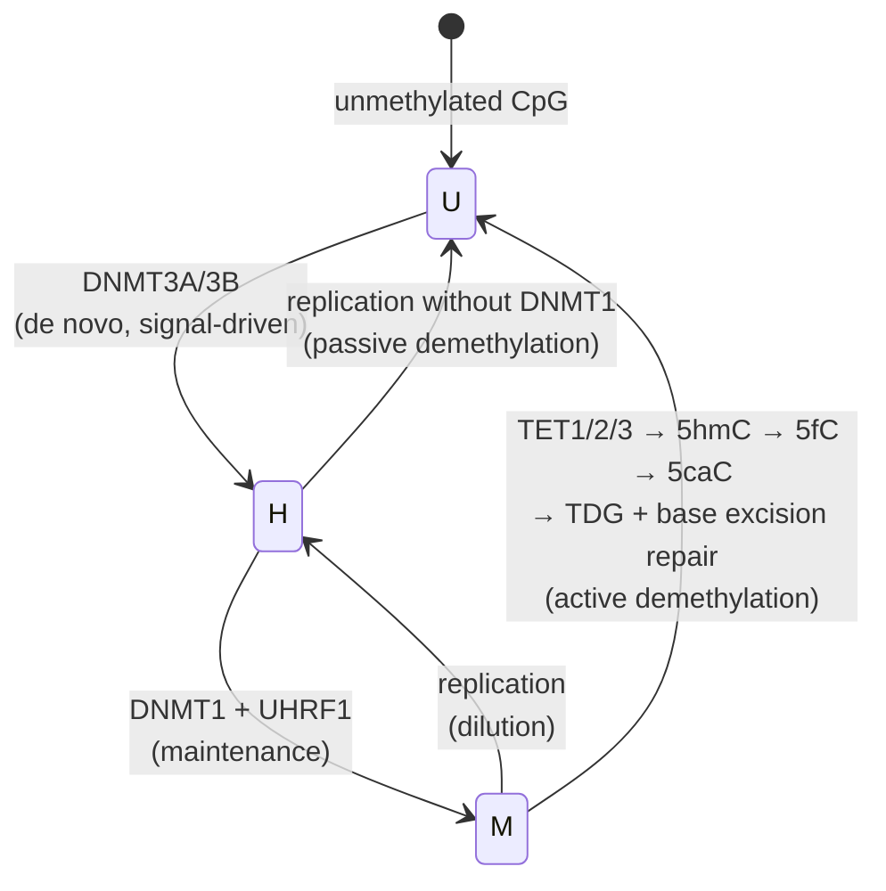
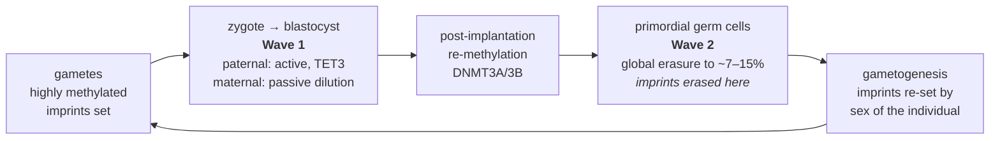

# 23 — Chromatin and epigenetics

> **Before this:** [Ch 03](../part-01-molecular-foundations/03-genomes-chromosomes-chromatin.md) · [Ch 22](22-eukaryotic-transcriptional-regulation.md) · [Ch 16](../part-03-genome-instability/16-mutation.md) · **Time:** ~55 min

## What you'll be able to do

- State the strict definition of "epigenetic", say how it differs from the loose one, and apply the strict test to any proposed example
- Explain mechanistically why acetylation opens chromatin and why methylation does not — and why only some marks can be inherited
- Trace DNA methylation from establishment through maintenance to erasure, including why CpG symmetry is load-bearing, why the same mark silences a promoter but tracks transcription in a gene body, and why it leaves the genome CpG-depleted
- Derive the imprinting logic at *IGF2*/*H19* from CTCF's methylation sensitivity, and predict the phenotype of a methylation defect on either allele
- Classify CENP-A centromere identity and XIST-mediated X inactivation as epigenetic in the strict sense, and say what each propagates when the underlying sequence is identical
- Explain why the two germline reprogramming waves make mammalian transgenerational epigenetic inheritance mechanistically hard, and list the confounders that make the human evidence weak
- Say what an epigenetic clock is in statistical terms, and what "epigenetic age acceleration" is and is not

## The core idea

A liver cell divides and produces two liver cells. Nothing in the DNA sequence changed, so the information that says *be a liver cell* was carried by something else, through S phase, past a replication fork that strips the chromosome bare.

That is the entire problem: **cellular memory that survives replication without being written in sequence.**

The solution is a class of chemical marks on DNA and on the histone proteins DNA wraps around. But a mark alone is not memory. Replication halves it — each daughter chromatid gets roughly half the parental histones and one unmethylated new DNA strand. A mark is only heritable if the machinery that *reads* it also *recruits the machinery that writes it*. That read–write loop turns a passive label into a self-restoring fixed point.

So the useful mental model is not "tags on the genome". It is **a per-locus two-state Markov chain with feedback**: loss on replication pulls the state down, reader-recruited writers push it back up, and because the write rate depends on the current state, the chain is nonlinear and can have two stable fixed points. Marks with that loop are inherited. Marks without it are just fast, reversible annotations of what transcription is doing right now — and calling those "epigenetic" is where most of the confusion in this field starts.

---

## 1. The definition, and why the dispute matters

Two definitions are in circulation and they are not compatible.

**Strict** (Riggs, Holliday, and the tradition descending from Waddington's 1942 coinage): an epigenetic change is one that is **heritable through cell division and not explained by a change in DNA sequence**. Heritability is the whole content of the claim. The test is operational: remove the initiating signal, let the cell divide, and see whether the state persists.

**Loose** (common in the literature and universal in press releases): anything to do with chromatin. Any histone modification, any methylation change, any nucleosome rearrangement.

The loose definition is a disaster because it makes "epigenetic" a synonym for "regulatory", and then every gene-expression result becomes an epigenetics result. Worse, it lets a claim proved in the loose sense — *stress changed histone acetylation at this promoter* — be reported in the strict sense — *stress changed your grandchildren*. The equivocation is the mechanism by which this field generates nonsense.

**This chapter uses the strict definition.** Where a mark is a heritable carrier of state, it is called epigenetic. Where it is a fast, signal-dependent annotation, it is called **chromatin state** and nothing more. Under that discipline, the list of genuinely epigenetic mechanisms in mammals is short: DNA methylation, H3K9me3/HP1 heterochromatin, H3K27me3/Polycomb, CENP-A centromere identity, and X inactivation. Most of what you read about is not on that list.

## 2. The nucleosome as regulatory substrate

147 bp of DNA wrapped ~1.65 turns around an octamer of two copies each of histones H2A, H2B, H3 and H4, joined by 20–80 bp of linker. Repeat length in human chromatin is ~180–200 bp, so a diploid genome of 6.2 Gb carries on the order of **30 million nucleosomes**.

```
 linker      nucleosome        linker      nucleosome
────────╭──────────────╮──────────────╭──────────────╮────────
        │  147 bp DNA  │              │  147 bp DNA  │
        │   octamer    │              │   octamer    │
        ╰─┬──┬──┬──┬───╯              ╰─┬──┬──┬──┬───╯
          │  │  │  │   N-terminal tails │  │  │  │
         ac me ub ph   ← modified here  ac me ub ph
```

Two consequences do all the work.

**Occlusion.** DNA on the nucleosome surface is largely unavailable to sequence-specific transcription factors and to RNA polymerase. A promoter's accessibility is therefore set by whether a nucleosome sits on it. Active promoters have a **nucleosome-depleted region** of ~150 bp flanked by strongly positioned +1 and −1 nucleosomes; that depleted region is what ATAC-seq detects ([Ch 49](../part-10-functional-genomics/49-epigenome-profiling.md)).

**The tails.** The histone N-termini protrude from the particle, disordered and solvent-exposed. They are chemically decorated, and because they stick out, the decorations are readable by other proteins without disturbing the DNA. The nucleosome is simultaneously the packaging problem and the signalling surface.

## 3. Histone modifications, and the "code" that isn't

### Acetylation is mechanistically direct

Lysine carries a positive charge at physiological pH, and that charge is part of what binds the histone octamer to DNA's polyanionic backbone ([Ch 01](../part-00-orientation/01-chemistry-and-cell-primer.md)). Acetylation transfers an acetyl group onto the lysine ε-amino group and **neutralises the charge**. Histone–DNA affinity drops, higher-order folding is destabilised, and the region opens. This is the one histone modification whose effect you can derive from electrostatics alone.

Writers are histone acetyltransferases (p300/CBP, GCN5); erasers are histone deacetylases (HDAC1–11, and the NAD⁺-dependent sirtuins). Turnover is fast — minutes. Acetylation also creates a binding surface for **bromodomain** proteins, including BRD4 and the TAF1 subunit of TFIID.

Fast turnover and no read–write loop means acetylation is a *poor* carrier of memory. It tracks the current activity of the locus. It does not remember it.

### Methylation is pure reader recruitment

Lysine methylation adds no charge change and does essentially nothing to histone–DNA affinity. Its entire effect is that specific reader domains — chromodomains, PHD fingers, Tudor domains — bind methylated lysines and not unmethylated ones. Methylation can be mono-, di- or tri- (me1/me2/me3), and the states are read differently. Erasers are the LSD and JmjC-domain demethylases.

| Mark | Where | Writer | Reader | What it means |
|---|---|---|---|---|
| **H3K4me3** | Active/poised promoters, sharp peak at TSS | COMPASS (SET1A/B, MLL1–4) | TAF3, ING PHD fingers | Correlate of initiation — largely a *consequence* of Pol II recruitment, not a cause |
| **H3K27ac** | Active enhancers and promoters | p300/CBP | BRD4 | Distinguishes active enhancers from merely poised ones |
| **H3K27me3** | Polycomb-repressed developmental genes | PRC2 (EZH2/EED/SUZ12) | PRC1 CBX chromodomain; **EED** | Facultative repression. Self-propagating |
| **H3K9me3** | Constitutive heterochromatin, repeats, ZNF genes | SUV39H1/2, SETDB1 | **HP1** chromodomain | Permanent silencing. Self-propagating |
| **H3K36me3** | Gene bodies, 3′-biased | SETD2, co-transcriptional | PWWP domains (DNMT3B, MRG15) | Marks transcribed territory; suppresses cryptic internal initiation |

Two other classes matter. **Phosphorylation**: H3S10ph by Aurora B during mitotic condensation, which also ejects HP1 in a "phospho/methyl switch"; H2A.X S139ph (γH2AX) spreading megabases around a double-strand break ([Ch 17](../part-03-genome-instability/17-dna-repair.md)). **Ubiquitination**: H2AK119ub by PRC1, part of Polycomb repression; H2BK120ub by RNF20/40, which is *required* for H3K4 and H3K79 methylation — cross-talk between tails on different histones.

### The histone code hypothesis, honestly

Strahl and Allis (2000) proposed that combinations of modifications constitute a **code**: distinct marks, written by distinct enzymes, read in combination by effectors, specifying distinct downstream outcomes. As a research programme it was enormously productive. As a description it overstates the case, in four specific ways.

1. **The symbols are not independent.** H3K4me3, H3K9ac, H3K27ac and nucleosome depletion co-occur at active promoters because they are all downstream of the same event. A code with correlated symbols is carrying far less information than the symbol count suggests. Empirically, genome-wide segmentation (ChromHMM and similar) recovers on the order of **15–25 recurrent chromatin states**, not 2ᴺ.
2. **Many marks are consequences, not causes.** H3K4me3 at promoters is deposited by complexes recruited to unmethylated CpG islands and to initiating Pol II. Deleting the writers often barely perturbs expression. The mark reports transcription more than it directs it.
3. **The few causal tests give split answers.** Replacing the entire histone gene cluster in *Drosophila* with H3K27R mutants abolishes Polycomb silencing — K27 methylation is genuinely instructive. Equivalent experiments on other residues show much weaker effects. Some marks are load-bearing; some are passengers; the code framing does not distinguish them.
4. **Readout is context-dependent.** H3K9me3 in pericentromeric repeat DNA and H3K9me3 over a ZNF gene body have different consequences. The same "letter" is read differently depending on what else is present and where it sits.

The property that actually separates the load-bearing marks from the rest is the **read–write loop**:

- **PRC2**: its EED subunit binds H3K27me3, and that binding allosterically stimulates the EZH2 catalytic subunit. A methylated nucleosome makes its neighbours methylated.
- **HP1**: binds H3K9me3 via its chromodomain and recruits SUV39H1, which methylates H3K9 on adjacent nucleosomes.

Both are positive feedback: read the mark, write more of it. That is why these two, alone among the histone modifications, propagate through replication and behave epigenetically in the strict sense.

## 4. Remodellers and histone variants

Nucleosomes are not fixed. Four families of ATP-dependent remodellers move, evict and edit them:

| Family | Human complexes | What it does |
|---|---|---|
| **SWI/SNF** | BAF, PBAF (SMARCA4, ARID1A, SMARCB1) | Slides and **ejects** nucleosomes. Opens enhancers and promoters. Subunits mutated in ~20% of human cancers |
| **ISWI** | NURF, CHRAC, ACF | Spaces nucleosomes into regular arrays; assembly and maturation of chromatin behind the fork |
| **CHD** | CHD1, NuRD (CHD3/4 + HDAC1/2 + MBD2/3) | Spacing; NuRD couples remodelling to deacetylation and to methyl-DNA reading |
| **INO80 / SWR1** | INO80, SRCAP | **Dimer exchange** — swaps H2A–H2B for variant-containing dimers |

**Histone variants** substitute for the canonical histones and change the particle's properties:

- **H2A.Z** — deposited by SRCAP at the +1/−1 nucleosomes flanking transcription start sites; makes the particle less stable and the promoter more evictable.
- **H3.3** — the replication-*independent* H3. Canonical H3.1 is deposited only during S phase; H3.3 is deposited any time by HIRA at transcribed genes and by ATRX/DAXX at telomeres and pericentromeric repeats. It is how chromatin is repaired outside S phase.
- **CENP-A** — replaces H3 at centromeres, and is the cleanest strict-sense epigenetic mark in the genome. Human centromeres sit on alpha-satellite arrays, but **sequence does not determine centromere position**: neocentromeres form on ordinary unique sequence, lack alpha satellite entirely, and are then stably inherited for generations, while the original alpha-satellite array sits inert. CENP-A templates its own re-deposition. Identity is propagated by the mark, not by the sequence — which is exactly the definition.

## 5. DNA methylation

In mammals, a methyl group on the 5-carbon of cytosine — **5-methylcytosine** — almost exclusively in the dinucleotide **CpG** (the "p" is the phosphate; it means C followed by G on the same strand, not a C:G pair). Neurons and embryonic stem cells also carry appreciable non-CpG methylation; plants methylate in CG, CHG and CHH contexts.

### CpG symmetry is the whole trick

CpG is its own reverse complement. A methylated site is therefore methylated on **both** strands:

```
5'- ...  C  G ... -3'        5'- ... mC  G ... -3'
        |  |             →           |  |
3'- ...  G  C ... -5'        3'- ...  G mC ... -5'
    unmethylated                  symmetrically methylated

after replication:      5'- ... mC  G ... -3'   parent strand
                        3'- ...  G  C ... -5'   new strand   ← hemimethylated
```

Replication produces a **hemimethylated** site, which is an unambiguous instruction: one strand says the mark belongs here. **UHRF1** recognises hemimethylated CpG and recruits **DNMT1**, which methylates the new strand. That is the maintenance system, and it is a state machine with a self-evident restore rule.



**DNMT3A** and **DNMT3B** are the de novo enzymes, assisted by the catalytically dead cofactor DNMT3L. **TET1/2/3** are dioxygenases that oxidise 5mC stepwise to 5hmC, 5fC and 5caC; thymine DNA glycosylase excises the last two and base excision repair restores unmodified cytosine. Demethylation is therefore either passive (replication without maintenance) or active (oxidation plus repair).

### CpG islands, and how methylation silences

Roughly **28–32 million CpG dinucleotides** per haploid genome, of which **60–80% are methylated** in a typical somatic cell. The unmethylated minority is concentrated in **CpG islands**: stretches of ≥200 bp with GC content ≥50% and observed/expected CpG ≥0.6. There are roughly **30,000** in the human genome, and **more than half of them sit at promoters**; conversely more than 60% of human promoters contain one.

Three distinct silencing mechanisms, often conflated:

1. **Direct occlusion.** Some transcription factors cannot bind a methylated site. **CTCF** is the canonical case and the mechanism behind imprinting (§6).
2. **Reader recruitment.** Methyl-CpG-binding domain proteins — MeCP2, MBD1–4 — bind 5mC and pull in NuRD/HDAC complexes and co-repressors.
3. **Gene-body methylation, which is not silencing at all.** SETD2 deposits H3K36me3 co-transcriptionally; DNMT3B's PWWP domain reads H3K36me3 and methylates the underlying DNA. Gene-body methylation therefore **correlates positively with expression** and suppresses spurious internal initiation.

**The rule "methylation means off" is true at promoters and false in gene bodies.** Any tool or intuition that treats a genome-wide average methylation level as a proxy for repression is averaging two opposite signals.

### Why the genome is CpG-poor — a fossil of germline methylation

Cytosine deaminates spontaneously to uracil, which is foreign to DNA and is excised efficiently by uracil-DNA glycosylase. But **5-methylcytosine deaminates to thymine**, which is a perfectly legitimate DNA base. The repair machinery sees a T:G mismatch and has no way to know which strand is wrong. The result is a C→T transition at roughly an order of magnitude above the background transition rate ([Ch 16](../part-03-genome-instability/16-mutation.md)) — **methylated CpG is the single most mutable position in the genome.**

Run that for a few hundred million years and it shows up in composition. Human GC content is ~41%, so under independence you would expect CpG at ≈ 0.205 × 0.205 ≈ **4.2%** of dinucleotides. Observed frequency is about **1%** — roughly a fifth of expectation.

CpG islands are the exception precisely because they are the regions kept *unmethylated in the germline*, and therefore never exposed to the accelerated mutation. The genome's dinucleotide composition is a several-hundred-million-year record of which sequences were methylated in germ cells.

## 6. Genomic imprinting

For most genes you express both parental copies. For roughly **150** human genes, expression depends on **which parent the allele came from** — one copy is silenced, deterministically, by parental origin. This is a flat contradiction of Mendel: reciprocal crosses are not equivalent.

The mark lives at an **imprinting control region** (ICR), a differentially methylated region whose methylation is established in the germline — in oogenesis or in spermatogenesis, according to sex — and which then survives the post-fertilisation reprogramming wave (§8) because ZFP57/TRIM28 specifically protects it.

### *IGF2*/*H19* — the CTCF insulator

At 11p15.5, *IGF2* (paternally expressed growth factor) and *H19* (maternally expressed lncRNA) share a set of enhancers downstream of *H19*. Between them sits ICR1, containing **seven CTCF binding sites** in humans. CTCF binding is abolished by methylation of those sites, so the ICR's methylation state acts as a switch on whether an insulator forms:

```
MATERNAL  (ICR1 unmethylated → CTCF binds → insulator blocks enhancers)

   IGF2          ICR1          H19        enhancers
   [ OFF ]══════[CTCF]═══════[ ON ]═══════[ E E ]
                  ▲                          │
                  └────── blocked ───────────┘

PATERNAL  (ICR1 methylated → no CTCF → enhancers reach IGF2; H19 promoter also methylated)

   IGF2          ICR1          H19        enhancers
   [ ON  ]══════[ mmmm ]═════[ OFF ]══════[ E E ]
      ▲                                      │
      └──────────── enhancer contact ────────┘
```

The prediction falls straight out, and both directions occur clinically: **gain** of methylation on the maternal ICR1 makes it behave paternally, giving two active *IGF2* copies and the overgrowth of Beckwith–Wiedemann syndrome; **loss** of methylation on the paternal ICR1 makes it behave maternally, giving no *IGF2* and the growth restriction of Silver–Russell syndrome. One switch, both signs, opposite phenotypes.

### Prader–Willi and Angelman

Both arise from the same imprinted domain at 15q11–q13, and differ only in **which parent's copy is lost**.

| | Prader–Willi | Angelman |
|---|---|---|
| Copy lost | **Paternal** | **Maternal** |
| Critical locus | *SNORD116* snoRNA cluster (paternally expressed) | *UBE3A* (maternally expressed **in neurons only**) |
| Deletion of 15q11–q13 | ~65–75% of cases | ~65–75% of cases |
| Uniparental disomy | maternal UPD, ~20–30% | paternal UPD, ~3–7% |
| Imprinting-centre defect | ~1–3% | ~3–10% |
| Point mutation in a single gene | — | *UBE3A* variants, ~5–11% |

In neurons the paternal *UBE3A* is silenced *in cis* by an antisense transcript, *UBE3A-ATS*, running through it from the Prader–Willi imprinting centre — which is why an antisense oligonucleotide that truncates *UBE3A-ATS* and unsilences the intact paternal allele is a live therapeutic strategy.

These two syndromes are the proof, in humans, that the maternal and paternal genomes are not functionally interchangeable.

### Why imprinting evolved: the kinship (conflict) theory

Haig's argument is a straightforward asymmetry in relatedness. In a species where a mother provisions offspring after fertilisation, and where a female may have offspring by more than one male, a gene copy is related to the mother's *future* offspring differently depending on which parent it came from. A paternally derived allele is likely not present in the mother's later offspring by other males, so its optimal strategy is to extract maternal resources aggressively. A maternally derived allele is present in half of those future offspring, so its optimum is more restrained.

The prediction: **paternally expressed genes promote growth and maternal resource extraction; maternally expressed genes restrain it.** *IGF2* is paternally expressed and growth-promoting; *H19* and *CDKN1C* are maternally expressed and growth-restraining; in mouse the IGF2-sequestering receptor *Igf2r* is maternally expressed.

The strongest evidence is convergent: imprinting arose independently in **placental mammals** and in the **endosperm of flowering plants** — the two lineages with post-fertilisation maternal provisioning — and not in birds or in egg-laying lineages generally. Two independent origins under the same selective condition is a much better test than any single locus.

It is not a complete theory. Not every imprinted gene fits the growth prediction (human *IGF2R* is not imprinted at all), and co-adaptation and sexual-antagonism models explain some loci better. Treat kinship theory as the best-supported general explanation, not as a law.

## 7. X inactivation

Females carry two X chromosomes, males one. Mammals equalise dosage by silencing one X per cell, and the mechanism is the largest-scale strictly-epigenetic event in the genome.

**XIST**, a ~17 kb lncRNA transcribed from the X-inactivation centre at Xq13, is expressed only from the X destined for inactivation and **coats that chromosome in cis**. It then recruits, in layers: SPEN → HDAC3 (deacetylation), PRC1/PRC2 (H2AK119ub, H3K27me3), macroH2A, SMCHD1, and finally DNA methylation of the CpG-island promoters across the chromosome. Each layer is individually dispensable; together they form a lock that is essentially irreversible in somatic cells.

The choice is random per cell in the early epiblast, and then **clonally inherited**. A heterozygous female is therefore a mosaic of two cell populations — visible directly in the coat of a calico cat, and clinically important because it makes X-linked disease expression in heterozygous females variable and skew-dependent ([Ch 13](../part-02-transmission-genetics/13-sex-linkage.md)). Roughly 15–25% of X-linked genes escape inactivation.

Same sequence, two heritable states, hundreds of divisions. This is what the strict definition is for.

## 8. Reprogramming: the two erasures

Mammalian development wipes DNA methylation twice.



**Wave 1, after fertilisation.** The paternal genome is stripped rapidly — protamines are exchanged for histones and TET3 oxidises 5mC — while the maternal genome is diluted passively over the first cleavage divisions. Imprinted DMRs are specifically protected by ZFP57/TRIM28. Methylation is re-established after implantation.

**Wave 2, in the primordial germ cells.** Between roughly E9.5 and E13.5 in mouse, PGC methylation falls to about 7–15% genome-wide — the most complete erasure in the life cycle. Crucially, **imprints are erased here**, and then re-established during gametogenesis according to the sex of the individual making the gametes, not the sex of the parent they came from.

**What escapes.** Some IAP and other LTR retrotransposons retain substantial methylation through both waves; a small set of single-copy loci and rare LTR-ERV1 elements do too. That set is small, largely repeat-associated, and is the entire mechanistic space available for transgenerational inheritance of methylation in mammals.

## 9. Transgenerational epigenetic inheritance

First, get the generation counting right, because most popular claims fail here alone.

If a **pregnant F0 female** is exposed, the F1 fetus is directly exposed, and the germ cells that will make F2 are inside that fetus and are also directly exposed. **F3 is the first unexposed generation.** If an **F0 male** is exposed, his sperm are exposed, so **F2 is the first unexposed generation.** Anything at F1 or F2 (maternal) is *intergenerational* — a direct exposure effect — not transgenerational.

> **The two reprogramming waves are the reason this is hard, and they are not a technicality.** For an environmentally induced chromatin mark to reach an unexposed grandchild it must be (i) written in the germline, (ii) survive erasure to ~10% genome-wide methylation in primordial germ cells, (iii) survive the post-fertilisation wave, and (iv) still alter phenotype. The known escapees from that gauntlet are mostly retrotransposons. **Any claim of human transgenerational epigenetic inheritance is a claim that all four steps happened, and essentially none of the human literature tests even one of them.**

**Where the evidence is strong: plants and nematodes.** Plants have no sequestered germline — somatic meristem cells become gametes — and no genome-wide reprogramming wave, and they possess RNA-directed DNA methylation. The *Linaria vulgaris* peloric epiallele is a hypermethylated *Lcyc* gene producing radially symmetric flowers; Linnaeus described it in 1742 and it is still segregating. In *C. elegans*, piRNA-triggered silencing is amplified by an RNA-dependent RNA polymerase into secondary siRNAs loaded onto the nuclear Argonaute HRDE-1, and is inherited for tens of generations. Note what the nematode mechanism actually is: **an RNA amplification loop**, not a chromatin mark being copied.

**Where it is weak: mammals.** The mouse *agouti viable yellow* (*A^vy*) allele is the textbook case — coat colour varies with the methylation of an IAP retrotransposon inserted upstream of *Agouti*, and maternal methyl-donor supplementation shifts the offspring distribution. It is real. It is also (a) intergenerational, (b) entirely dependent on a specific transposon insertion — i.e. on a DNA sequence difference — and (c) a metastable epiallele, not an environmental instruction.

The best-supported mammalian vector for paternal effects is not chromatin at all: **small RNAs in sperm**, particularly tRNA-derived fragments, which change with paternal diet and can transmit metabolic phenotypes when injected into zygotes.

### The Dutch Hunger Winter, specifically

The Dutch famine of 1944–45 is the study everyone cites. Heijmans et al. (2008) found that individuals conceived during the famine had, **six decades later, 5.2% lower methylation at the *IGF2* DMR than their own unexposed same-sex siblings**, and that the association was specific to *periconceptional* exposure.

That is a careful, well-designed study. It is not evidence of transgenerational epigenetic inheritance, for six independent reasons:

| Claim it is used to support | Why it does not support it |
|---|---|
| Effects transmitted to unexposed generations | The subjects were **exposed in utero**. This is F1. Generation counting alone disqualifies it |
| A large biological effect | 5.2% mean difference at one DMR, in blood, with overlapping distributions |
| Methylation caused the metabolic phenotype | No causal link was tested. The methylation difference and the health outcomes could both be downstream of the same prenatal insult |
| It shows environment writing the epigenome | Blood is a **mixture of cell types**; famine exposure that shifts leukocyte composition produces apparent methylation differences with no change in any cell's methylation. Cell-composition confounding is the dominant artefact in blood methylation studies |
| The effect is environmental | Methylation at most DMRs is under substantial genetic control (mQTLs). A follow-up at this locus found famine exposure and genotype **independently and additively** associated with methylation |
| Sibling design controls for confounding | It controls for shared genetics and household, not for birth order, maternal age, gestational timing, or postnatal environment |

The honest summary: prenatal famine has real, lifelong health consequences, and there are measurable methylation correlates. Neither fact establishes that a chromatin mark is the carrier, and neither is transgenerational.

## 10. Epigenetic clocks

Take methylation β-values (fraction methylated) at a few hundred thousand CpGs, regress chronological age on them with an elastic net, and you get a startlingly good predictor. Horvath's 2013 multi-tissue clock uses **353 CpGs**, was trained on ~8,000 samples across **51 tissues and cell types**, and achieves correlation ~0.96 with an error (median absolute difference) of about **3.6 years** in test data.

Three generations of clock, doing different things:

| Clock type | Trained on | Example |
|---|---|---|
| First generation | Chronological age | Horvath (353 CpGs), Hannum (71 CpGs, blood) |
| Second generation | Mortality / clinical biomarkers | PhenoAge, GrimAge — better mortality predictors than chronological-age clocks |
| Third generation | Longitudinal *rate* of change | DunedinPACE |

You already know how to read this. **"Epigenetic age acceleration" is the residual** from regressing predicted age on chronological age. So:

- Residuals inherit every confounder of the features. Blood cell composition changes with age *and* with illness; a large part of measured "acceleration" in whole blood is cell-composition shift unless it is explicitly adjusted for.
- The selected CpGs are close to arbitrary. Methylation features are heavily correlated; an elastic net picks one representative per correlated block, and a different penalty or training set gives a different 353 CpGs with equivalent accuracy. **The sites in a clock are not a mechanism, and reading biology off the gene list is a mistake.**
- A predictor's residual is not a state you can "reverse". A claim to have lowered someone's epigenetic age is a claim about a number produced by a regression, and needs to be evaluated as such.

Clocks are genuinely useful — forensic age estimation, mortality risk, comparing tissue ageing rates, quantifying the near-total age reset in induced pluripotent stem cells. They are measurements, not mechanisms.

## 11. Epigenetics in cancer

Chromatin is one of the most frequently mutated functional categories in cancer, and the details belong to [Ch 56](../part-11-human-and-statistical-genomics/56-cancer-genomics.md). The shape of it:

- **Global hypomethylation with focal CpG island hypermethylation.** Tumour genomes lose methylation across repeats and gene bodies while gaining it at specific promoter islands. *MLH1* promoter hypermethylation silences mismatch repair and produces microsatellite-instable colorectal cancer; *MGMT* promoter methylation in glioma is a clinically used predictor of temozolomide response.
- **Metabolite-driven chromatin change.** *IDH1*/*IDH2* mutations produce 2-hydroxyglutarate, which competitively inhibits TET enzymes and JmjC demethylases, giving a hypermethylator phenotype — and in glioma, methylating a CTCF site so that an insulator fails and an enhancer reaches *PDGFRA*.
- **Remodeller loss.** SWI/SNF subunits are mutated in ~20% of cancers. Rhabdoid tumours lose *SMARCB1* biallelically and are otherwise among the genomically quietest cancers known — one chromatin gene, one tumour.
- **Oncohistones.** H3K27M in diffuse midline glioma is a mutation in a histone gene itself, acting as a dominant-negative inhibitor of PRC2.

Because these are enzymatic and reversible, they are drug targets: azacitidine and decitabine (DNMT), vorinostat and romidepsin (HDAC), tazemetostat (EZH2).

---

## Common misconceptions

| What people think | What's actually true |
|---|---|
| Epigenetics means environment changing your genes | It means heritable change in gene *expression* without sequence change. Most environmental effects on chromatin are neither heritable nor stable, and calling them epigenetic is the equivocation that drives most public confusion |
| Your experiences are written into your grandchildren's epigenome | In mammals this requires surviving two genome-wide reprogramming waves. The known escapees are mostly retrotransposons. No human study has demonstrated it, and almost none have tested the required steps |
| The Dutch Hunger Winter proves transgenerational inheritance | Those subjects were exposed *in utero* — F1, not F3. The reported effect is a 5.2% methylation difference at one DMR in blood, uncorrected causally, with cell-composition and mQTL confounding unresolved |
| Epigenetic marks are erased, so nothing is inherited | Also wrong, in the other direction. Imprinted DMRs are protected through wave 1, and specific retrotransposon families resist both waves. The correct statement is "the channel is narrow and mostly repeat-associated", not "the channel is closed" |
| DNA methylation switches genes off | True at promoter CpG islands. **False in gene bodies**, where methylation is deposited co-transcriptionally and correlates positively with expression |
| Histone modifications constitute a code | They are heavily correlated with each other and with transcription, resolve into ~15–25 recurrent states rather than 2ᴺ, and many are consequences of transcription rather than causes. "Code" implies orthogonal symbols and deterministic readout; neither holds |
| All chromatin marks are heritable | Only marks with a read–write loop propagate: H3K27me3 (EED→EZH2), H3K9me3 (HP1→SUV39H1), 5mC (UHRF1→DNMT1), CENP-A. Acetylation turns over in minutes and remembers nothing |
| Epigenetic changes are reversible, genetic ones aren't | Methylated CpG is the *most mutable* position in the genome — 5mC deaminates to a legitimate T. Epigenetic marks routinely become permanent sequence changes. That is why the genome is CpG-depleted |
| Identical twins are epigenetically identical | They diverge with age through stochastic maintenance error, and were never identical to begin with — X inactivation choice alone is random per cell |
| "Epigenetic age acceleration" measures how fast you are ageing | It is a regression residual. It inherits every confounder of its features, notably blood cell composition, and its CpGs are one arbitrary representative set from many correlated equivalents |
| Imprinting is a rare curiosity | ~150 human genes, two named syndromes from one 15q11–q13 locus, two more from one 11p15.5 locus, and it is the reason uniparental disomy and parthenogenesis fail in mammals |
| Centromere position is determined by DNA sequence | Neocentromeres form on ordinary unique sequence with no alpha satellite, and are inherited stably. Centromere identity is propagated by CENP-A — genuinely epigenetic |

## Worked example: does a methylation mark survive 40 cell divisions?

Model one CpG as a two-state Markov chain over cell divisions. Let

- **q** = probability a methylated site fails to be maintained through one division (loss)
- **r** = probability an unmethylated site is methylated de novo in one division (restoration)

**Step 1 — maintenance alone.** Set r = 0. Survival after *n* divisions is (1 − q)ⁿ. Measured DNMT1 maintenance fidelity is roughly 0.96–0.99 per site per division, so q ≈ 0.01–0.04:

| Fidelity 1 − q | After 40 divisions |
|---|---|
| 0.999 *(hypothetical — above the measured range, for contrast)* | 0.999⁴⁰ = **0.96** |
| 0.99 | 0.99⁴⁰ = **0.67** |
| 0.96 | 0.96⁴⁰ = **0.20** |

Read the measured rows carefully, because the sloppy version of this argument overstates them. At 0.96, four-fifths of the mark is gone in 40 divisions; at 0.99, two-thirds of it *survives*. Forty divisions is not where maintenance fails. The failure is over the lifetime of a lineage: a stem cell lineage runs for hundreds of divisions, and **0.99³⁰⁰ ≈ 0.05** — even at the top of the measured range, copying alone leaves essentially nothing. Maintenance is not sufficient, and this is a real quantitative problem, not a rounding error.

**Step 2 — add de novo restoration.** With both rates, the chain has a stationary probability of being methylated:

```
m* = r / (r + q)          relaxation time = 1 / (r + q) divisions
```

Take q = 0.02 and r = 0.20 (readers of the surrounding methylated block recruiting DNMT3A/3B). Then m\* = 0.20 / 0.22 = **0.91**, independent of the starting state. The relaxation time is 1/(r + q) ≈ **4.5 divisions** — a perturbed locus returns to its set point within about five divisions.

**Step 3 — see what changed conceptually.** The heritable object is not the mark on any individual CpG. It is the **equilibrium of a feedback loop**, and it is defined over a *block* of sites — a CpG island has 50–100 of them. Redundancy plus feedback is an error-correcting code: individual sites flip constantly, the block-level state does not.

**Step 4 — the loop is nonlinear, and that is why there are two states.** r is not a constant. De novo methyltransferases are recruited by readers of nearby methylation and of H3K9me3, so r increases with the local methylated fraction. Substituting r(m) into m\* = r/(r+q) turns a single fixed point into a system that can have **two stable fixed points** — a methylated attractor and an unmethylated attractor — separated by an unstable threshold. Bistability, not a stored bit, is what cellular memory actually is. Precisely the same argument applies to PRC2 (EED reads, EZH2 writes) and to HP1/SUV39H1.

**Step 5 — the residual error is measurable, and you have already met it.** Sites where the feedback is weakest have r and q closest together, so m\* sits near 0.5 and the variance across cells is maximal. Those sites drift with cumulative divisions and time. That drift is exactly the signal an **epigenetic clock** regresses on — which is why clocks work at all, and why what they measure is accumulated stochastic maintenance error rather than a programme.

## Connections

- **Back to:** [Ch 03](../part-01-molecular-foundations/03-genomes-chromosomes-chromatin.md) for nucleosome and chromosome architecture · [Ch 22](22-eukaryotic-transcriptional-regulation.md) for the transcription factors that act on this substrate · [Ch 16](../part-03-genome-instability/16-mutation.md) for the deamination chemistry behind CpG depletion · [Ch 13](../part-02-transmission-genetics/13-sex-linkage.md) for X inactivation as an inheritance phenomenon · [Ch 09](../part-02-transmission-genetics/09-mitosis-and-meiosis.md) for centromere function, which §4 shows is epigenetic
- **Forward to:** [Ch 24](24-rna-based-regulation.md) for XIST and the RNA side of silencing · [Ch 25](25-networks-and-development.md) for how bistable chromatin states lock in developmental decisions · [Ch 49](../part-10-functional-genomics/49-epigenome-profiling.md) for how every mark in this chapter is actually measured (ChIP-seq, ATAC-seq, bisulfite and long-read methylation calling) · [Ch 50](../part-10-functional-genomics/50-3d-genome.md) for CTCF's day job · [Ch 56](../part-11-human-and-statistical-genomics/56-cancer-genomics.md) for cancer epigenetics in full

## Check yourself

**1. A drug induces histone acetylation at a promoter and the gene turns on. The drug is withdrawn and expression returns to baseline over an hour. Was this an epigenetic effect?**

<details><summary>Answer</summary>

No — not in the strict sense. Epigenetic requires heritability through cell division without the initiating signal. Acetylation has no read–write loop and turns over in minutes; the state collapsed as soon as the signal was removed, without any division being involved. It was a chromatin-state change. Calling it epigenetic is the exact equivocation that lets "chromatin changed" be reported as "your grandchildren changed".

</details>

**2. Why is CpG symmetry necessary for DNA methylation to be heritable, and what would happen if mammals methylated cytosine in a non-palindromic context?**

<details><summary>Answer</summary>

Because CpG is its own reverse complement, a methylated site carries the mark on both strands. Replication therefore produces a *hemimethylated* site — a strand-asymmetric intermediate that unambiguously encodes "the mark belongs here". UHRF1 reads that asymmetry and recruits DNMT1 to restore it.

In a non-palindromic context the parental strand's mark has no corresponding position on the daughter strand, so replication would simply halve the mark with no restore signal. Inheritance would be passive dilution only, and would require re-establishment from sequence or from another mark each generation — which is essentially what happens with mammalian non-CpG (mCH) methylation. DNMT1 does not maintain it, so it survives only where it is continuously re-written de novo: it accumulates in cells that divide slowly or not at all (neurons, via DNMT3A) and in cells sustaining very high de novo activity (embryonic stem cells, via DNMT3B), and it is lost on differentiation when that activity stops.

</details>

**3. A patient has Silver–Russell syndrome due to loss of methylation at ICR1 on 11p15.5. Which parental chromosome carries the defect, and derive the expression consequence.**

<details><summary>Answer</summary>

The **paternal** chromosome. Paternal ICR1 is normally methylated, so CTCF cannot bind and no insulator forms, letting the downstream enhancers activate *IGF2*. Losing that methylation lets CTCF bind, an insulator forms, and the paternal allele now behaves like a maternal one: *IGF2* is blocked from its enhancers and *H19* is expressed instead.

The result is **no** expressed *IGF2* from either allele (the maternal copy was already silent) and a double dose of *H19*. *IGF2* is a growth factor, so the phenotype is growth restriction. The mirror lesion — gain of methylation on the maternal ICR1 — gives two active *IGF2* copies and the overgrowth of Beckwith–Wiedemann.

</details>

**4. A study reports that grandchildren of men who experienced famine show altered blood DNA methylation. List the specific things you would need to see before accepting transgenerational epigenetic inheritance.**

<details><summary>Answer</summary>

1. **Correct generation counting.** Paternal F0 exposure makes F2 the first unexposed generation, so the grandchildren are the earliest admissible group — but only if the F1 males were not themselves exposed in utero.
2. **Cell-composition adjustment.** Whole blood is a mixture; a shift in leukocyte proportions produces methylation differences with no change inside any cell. This is the single largest artefact in the field.
3. **Genetic control.** Most DMR methylation has strong mQTLs. Show the association survives adjustment for local genotype, or is present within families sharing haplotypes.
4. **Germline transmission of the mark itself**, measured in sperm — not inferred from a somatic tissue two generations later.
5. **Evidence it survives reprogramming**, or that the locus is a known escapee.
6. **A causal link to phenotype**, not a correlation — the methylation difference and the outcome may both be downstream of a shared cause such as social transmission of diet and poverty.
7. **Replication in an independent cohort**, since effect sizes in this literature are small and the multiple-testing burden across ~850,000 array probes is large.

</details>

**5. Why does bistability, rather than high-fidelity copying, turn out to be the right model for chromatin memory?**

<details><summary>Answer</summary>

Because measured per-site fidelity is not high enough over the distances that matter. At 96% maintenance per division only ~20% of a mark survives 40 divisions; at 99% a third is still lost. Stretch that over the hundreds of divisions a real lineage runs and even the top of the measured range collapses — 0.99³⁰⁰ ≈ 0.05. Copying alone cannot account for stability.

What does account for it: the write rate depends on the current local state (readers recruit writers — EED→EZH2, HP1→SUV39H1, UHRF1→DNMT1, and DNMT3A/3B recruited to methylated and H3K9me3 blocks). That makes the per-site chain nonlinear across a *block* of sites, producing two stable attractors with an unstable threshold between them. Individual sites flip constantly; the block-level state is restored within a few divisions.

Three things follow. Memory is a property of a domain, not a nucleotide. States are switchable — push past the threshold and the system settles into the other attractor, which is what developmental signals do. And the residual imperfection is real and cumulative, which is what epigenetic clocks measure.

</details>
