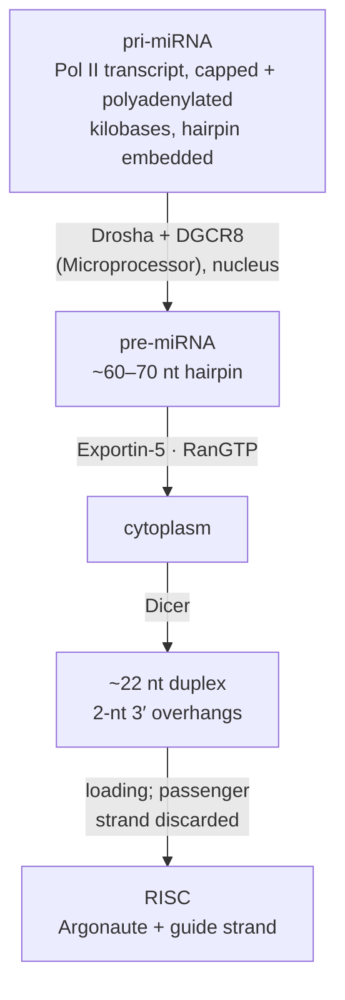

# 24 — RNA-based regulation

> **Before this:** [Ch 06](../part-01-molecular-foundations/06-rna-processing.md) · [Ch 07](../part-01-molecular-foundations/07-genetic-code-and-translation.md) · [Ch 22](22-eukaryotic-transcriptional-regulation.md) · [Ch 23](23-chromatin-and-epigenetics.md) · **Time:** ~45 min

## What you'll be able to do

- Explain why base-pairing makes a new regulatory specificity structurally cheap, why that cheapness has an unavoidable statistical cost, and why stoichiometry is therefore the first number to demand of any sponge, decoy or modification claim
- Trace a miRNA from Pol II transcript to loaded RISC, and compute how many chance seed matches it has in the transcriptome
- Distinguish miRNA, siRNA and piRNA by biogenesis, pairing requirement and job
- State what "lncRNA" does and does not assert, and design an experiment separating the transcript from the act of transcribing it
- Describe CRISPR as an adaptive immune system, including how the PAM solves self/non-self discrimination
- Derive why a gene's response time is set by its mRNA decay rate and not its transcription rate
- Trace how the *ATF4* uORFs convert a shortage of ternary complex into more of a transcription factor, and predict which messages rise when eIF2α is phosphorylated

## The core idea

Protein-based recognition is **hard-coded**. A transcription factor that binds a new sequence requires a new protein surface — a new fold, or a substantially rewritten set of contacts. That is slow and expensive, which is why the catalogue of DNA-binding domain families is small and endlessly reused.

RNA-based recognition is **parameterised**. The machinery — Argonaute, Cas9, the ribosome, the spliceosome — is generic and takes a guide sequence as an argument. A new target costs ~20 nucleotides of template. One protein can be dispatched against an unbounded set of sequences, and the cost of inventing a specificity collapses from "evolve a protein" to "mutate a short sequence."

That is why RNA regulation is everywhere. It is also why it is hard to study, because the same property forces a statistical consequence: **short guides match by chance.** A 7-nucleotide element occurs once every 4⁷ = 16,384 bases at random, so in a transcriptome of tens of megabases every miRNA has more than a thousand accidental matches. Cheap programmable specificity is necessarily sloppy specificity — and every assay for detecting RNA regulation inherits the same false-positive problem.

Hold both halves at once. RNA regulators are pervasive, *and* most candidate interactions are noise. Most of this chapter is about telling them apart.

---

## 1. Why RNA makes a good regulator

| Property | Buys | Costs |
|---|---|---|
| Recognition by base-pairing | New specificity = new short sequence | Huge chance-match rate |
| No translation step | Gene to functional molecule in seconds | Weak binding per unit length; usually needs a protein partner to do work |
| Chemically unstable | Fast turnover, fast response ([§8](#8-message-stability-and-modification)) | Nothing built from RNA persists |
| Folds into structures | Scaffold, decoy, aptamer, catalyst | Floppy, and hard to predict |

Put a number on the first row now, because it recurs. A miRNA recognises targets through nucleotides 2–8 of the guide — a 7-mer. Human 3′UTRs total roughly 20–25 Mb (19,442 protein-coding genes × a working mean near 1.2 kb). Expected chance occurrences of one specific 7-mer: 2.3 × 10⁷ / 1.6384 × 10⁴ ≈ **1,400**. Before any biology, a single miRNA has ~1,400 perfectly good-looking sites. "There is a site in the 3′UTR" is therefore worth almost nothing on its own. That is arithmetic, not a defect of the software.

## 2. miRNA biogenesis

microRNAs were found in *C. elegans* — *lin-4* in 1993, *let-7* in 2000 — and dismissed as a worm curiosity until *let-7* proved conserved across bilaterians. Victor Ambros and Gary Ruvkun took the 2024 Nobel Prize in Physiology or Medicine for the work.



Every step is a control point and every one is used. Drosha cleaves ~11 bp above the junction where single-stranded flanks meet the stem, setting the pre-miRNA ends; hairpin-specific RNA-binding proteins block or promote this, giving per-miRNA control of maturation. Exportin-5 recognises the stem plus the 2-nt 3′ overhang Drosha left. Dicer, also an RNase III enzyme, removes the loop.

**Strand selection is thermodynamic**: the strand whose 5′ end is less stably paired is retained as guide, the passenger is discarded. Both arms are named (miR-X-5p, miR-X-3p) and the ratio shifts between tissues, so "the" mature miRNA is context-dependent. **Mirtrons** skip Drosha entirely — a short intron whose spliced, debranched lariat is already a pre-miRNA hairpin.

miRBase v22 lists **1,917 human hairpin precursors and 2,654 mature sequences**; the high-confidence subset with a convincing processing signature is several-fold smaller. Treat the raw count as an upper bound.

## 3. Targeting: the seed, and why prediction is hard

Animal miRNAs pair mainly through **guide nucleotides 2–8**, which Argonaute holds pre-organised in a helical conformation so pairing costs almost no entropy. The rest of the guide contributes little. Efficacy ranks 8mer (nt 2–8 plus an A opposite nt 1) > 7mer-m8 (nt 2–8) ≈ 7mer-A1 (nt 2–7 plus A1) > 6mer. Sites work best in 3′UTRs, in unstructured AU-rich context, at least ~15 nt from the stop codon and away from the centre of long UTRs — i.e. near either end. Statements about accessibility, not chemistry.

Repression is executed by the Argonaute partner TNRC6 (GW182), which recruits the PAN2–PAN3 and CCR4–NOT **deadenylases**. A shortened poly(A) tail both blocks efficient initiation and licenses decapping and 5′→3′ decay by XRN1. Translational inhibition and destabilisation are therefore two readouts of one event, with decay dominating the steady state. Endonucleolytic **slicing** — cutting the target opposite guide positions 10 and 11 — needs near-perfect complementarity; that is the plant mode, rare in animals, and only one of four human Argonautes (AGO2) is catalytic at all.

**Effect sizes are small.** A typical true target moves by tens of percent, not folds. miRNAs mostly are not switches: they trim, buffer and sharpen, reducing cell-to-cell variability and enforcing the off-state of transcripts that should not appear in a given tissue. Dramatic exceptions exist — miR-430 clearing the maternal transcriptome at the zebrafish maternal-to-zygotic transition, *lsy-6* acting as a genuine binary switch in one worm neuron — and are exceptions.

Small effects plus abundant chance sites make target prediction a **ranking problem with a bad prior**, not a classification problem. The filter that works is comparative: count sites conserved across mammalian orthologues against a shuffled-seed background. On that basis more than 60% of human protein-coding genes are conserved targets of some miRNA, with >45,000 conserved 3′UTR sites above background. Both conclusions hold simultaneously — miRNA regulation is genuinely pervasive, and per-interaction evidence is weak.

The **competing-endogenous-RNA ("sponge") hypothesis** — transcripts sharing sites regulating each other by titrating a common miRNA — follows naturally and is mostly unsupported, because the stoichiometry rarely works. Depleting a miRNA present at thousands of copies per cell requires thousands of new high-affinity sites; a transcript at tens of copies per cell cannot supply them. Ask for copy numbers first.

## 4. siRNA and RNA interference

Andrew Fire and Craig Mello reported in 1998 that injecting **double-stranded** RNA into *C. elegans* silenced the matching gene far more potently than either single strand, at substoichiometric dose, spreading between tissues and into progeny. Potency plus spreading said this was not antisense hybridisation but a catalytic, amplified pathway. Nobel Prize, 2006.

Long dsRNA is diced into ~21 nt duplexes with 2-nt 3′ overhangs; one strand loads into AGO2; near-perfect pairing licenses slicing. Worms and plants additionally regenerate dsRNA from cleaved targets using RNA-dependent RNA polymerases, which is what makes the response amplifying and heritable — and which mammals lack.

| | miRNA | siRNA |
|---|---|---|
| Source | genome-encoded hairpin | long dsRNA: viral, transgene, transposon, experimental |
| Pairing | seed only (nt 2–8) | near-perfect, full length |
| Outcome | deadenylation and decay, modest | slicing, near-complete |
| Targets | hundreds per miRNA | ideally one |

As a tool, RNAi is how loss-of-function was done for fifteen years and is still the cheapest option ([Ch 37](../part-08-methods/37-model-organisms-and-screens.md)). Two constraints govern its use. **Long dsRNA cannot be used in mammalian cells** — it activates PKR and the interferon response ([§11](#11-translational-control-and-rna-localisation)) and collapses translation globally; synthetic 21-mers sit below that threshold, which is why the reagents are that length. And **an siRNA's seed makes it also a miRNA**, so it represses a few hundred unintended messages in a seed-dependent pattern. That off-target signature is perfectly reproducible for a given sequence, so "it replicated with the same siRNA" is not a control; independent sequences plus rescue are.

## 5. piRNA: an immune memory written into the genome

PIWI-interacting RNAs are 24–32 nt, Dicer-independent, and largely germline-restricted, where they suppress transposable elements ([Ch 19](../part-03-genome-instability/19-transposable-elements.md)). Somatic transposition costs one individual; germline transposition is heritable, so the germline gets a dedicated defence.

Their source is the interesting part. piRNAs come from **piRNA clusters** — loci densely packed with fragments of transposons that previously invaded the lineage. The cluster is a record of past infections, written into the chromosome and read out as guides.

Amplification runs the **ping-pong cycle**: an antisense piRNA guides cleavage of a sense transposon transcript; the product becomes a secondary sense piRNA; that guides cleavage of a cluster transcript, regenerating the primary. The signature is diagnostic — reciprocal pairs overlapping by exactly 10 nt at their 5′ ends, with a uracil bias at position 1 of one partner and adenine at position 10 of the other. As control logic it is positive feedback keyed on the substrate: amplification runs only while the transposon is actually being transcribed. Downstream, nuclear PIWI proteins direct co-transcriptional silencing via H3K9me3 and, in the mammalian male germline, *de novo* DNA methylation of the target loci ([Ch 23](23-chromatin-and-epigenetics.md)). Losing the pathway derepresses transposons and causes sterility.

## 6. lncRNA: a category defined by exclusion

A **long non-coding RNA** is a transcript over 200 nt with no evident coding capacity. Both halves are weak: the 200-nt threshold is an artefact of a silica-column size cutoff, and "non-coding" is an inference from ORF length and conservation that ribosome profiling keeps overturning — several annotated lncRNAs encode functional micropeptides.

GENCODE 50 annotates **35,885 lncRNA genes** against 19,442 protein-coding ones. That ratio is regularly quoted as a discovery about regulation. It is a statement about what has been sequenced. The category contains at least enhancer RNAs, divergent promoter transcripts, antisense transcripts, intergenic lincRNAs, unstable exosome substrates, and unannotated fragments of other things. There is no reason to expect one mechanism and there is not one.

Mechanisms that *are* established, each for specific transcripts:

- **Guide / cis-coating.** *XIST* is the best-characterised lncRNA in biology: a ~19 kb spliced, polyadenylated transcript expressed from the future inactive X, spreading in *cis* over that chromosome and silencing it. Its A-repeat recruits SPEN, bringing HDAC3 and corepressors; H3K27me3 and compaction follow ([Ch 13](../part-02-transmission-genetics/13-sex-linkage.md)). The load-bearing feature is that it acts near its own site of synthesis — a diffusible protein could not tell two otherwise-identical X chromosomes in one nucleus apart; an RNA tethered to its template can.
- **Scaffold.** *HOTAIR*, transcribed from the *HOXC* cluster, was described as acting in *trans* to bring PRC2 and LSD1 to *HOXD*. Treat it carefully: mouse knockouts have conflicted, and PRC2 binds RNA promiscuously enough that co-immunoprecipitation is no longer strong evidence of a scaffold.
- **Decoy.** *GAS5* folds into a mimic of a glucocorticoid response element and titrates the receptor off DNA. *NORAD* carries repeated PUMILIO sites and buffers PUMILIO — and here the stoichiometry works, because *NORAD* is abundant.
- **The act of transcription, not the transcript.** At the imprinted *Igf2r* locus the antisense transcript *Airn* silences the overlapping gene, but a truncated *Airn* producing no full-length RNA still silences. What matters is polymerase traversal of the *Igf2r* promoter.

> **Transcription is not evidence of function.** The genome is pervasively transcribed at low level from tens of thousands of sites nothing selected for. A locus producing a transcript may be functional through the RNA, through the act of transcription, as a DNA element with the RNA as a by-product, or not at all. Those are four different claims needing four different experiments, and a "lncRNA" annotation asserts none of them.

The best genome-scale test — CRISPRi against 16,401 lncRNA loci in seven human cell lines — found **499 loci (~3%) with a growth phenotype, 89% of them in exactly one cell line**. Read it both ways: a low hit rate consistent with most annotated lncRNAs doing nothing detectable, from a single narrow assay (proliferation, in transformed lines) blind to differentiation, stress and development.

Designing around the confound:

| Perturbation | Removes the RNA | Removes transcription | Removes the DNA element |
|---|---|---|---|
| ASO / RNAi knockdown | yes | no | no |
| CRISPRi at the promoter | yes | yes | no |
| Poly(A) cassette insertion | yes (truncates) | partially | no |
| Promoter or locus deletion | yes | yes | yes |
| Transgenic rescue *in trans* | tests sufficiency of the RNA alone | — | — |

Knockdown-positive with deletion-negative, or the reverse, is informative rather than contradictory. Only rescue in *trans* shows the molecule does the work.

## 7. Circular RNAs and antisense transcription

**Circular RNAs** arise by **back-splicing**: a downstream donor attacks an upstream acceptor, giving a covalently closed exonic circle. Inverted repeats in the flanking introns — *Alu* elements in humans — pair and bring the distant splice sites together, so circularisation is largely driven by transposon content. With no free ends, circles resist exonucleases and reach half-lives of days, accumulating in slowly dividing cells such as neurons.

They were dismissed as splicing errors for two decades for a computational reason: the only evidence of a circle is a **back-spliced junction read**, whose suffix maps upstream of its prefix — exactly what a linear aligner discards as a chimera ([Ch 42](../part-09-genomics/42-read-alignment.md)). They appeared when people stopped throwing those reads away.

Function is mostly unestablished. The canonical case, CDR1as/ciRS-7, carries **more than 70 conserved miR-7 seed matches** and is now read as a miR-7 transporter and stabiliser rather than a simple sponge. Some circles are translated from IRES-like or m⁶A-dependent starts. The honest default is that most circRNAs are back-splicing by-products conspicuous because they are stable — abundance manufactured by a degradation-rate artefact rather than by selection.

**Antisense transcription** is similarly pervasive: most active promoters fire divergently, and the nuclear exosome destroys the upstream antisense product within minutes. Where an antisense transcript is stable and overlapping, three mechanisms are documented — polymerase collision and transcriptional interference; sense–antisense duplex formation altering splicing, editing or stability; and repressive chromatin deposited in the antisense polymerase's wake, as at *Airn* and *Kcnq1ot1*. The therapeutic corollary is attractive: an antisense oligonucleotide that destroys a repressive antisense transcript *upregulates* the sense gene — one of very few ways to raise a gene's output pharmacologically.

## 8. Message stability and modification

Start with the control-theory result, because it explains why this layer exists. Let a message be synthesised at rate *k*<sub>syn</sub> and degraded first-order at *k*<sub>deg</sub>:

```
dm/dt = k_syn − k_deg · m
m_ss  = k_syn / k_deg
m(t)  = m_ss + (m₀ − m_ss) · e^(−k_deg · t)
```

The steady state depends on both rates. The **time constant does not**: τ = 1/*k*<sub>deg</sub>, and the half-time to a new steady state is ln2/*k*<sub>deg</sub> — the message's own half-life. Changing transcription changes the destination; only degradation changes the speed. A gene that must respond in minutes therefore *must* have an unstable message however hard it is transcribed. That is precisely the set — cytokines, immediate-early transcription factors, cell-cycle regulators — carrying destabilising elements. Mammalian half-lives span minutes to over a day, and the short tail is not sloppiness; it is bandwidth bought with wasted synthesis.

**AU-rich elements (AREs)** are the classic destabilising signal: AUUUA repeats in U-rich context in the 3′UTRs of *TNF*, *IL2*, *FOS*, *MYC* and hundreds more. Tristetraprolin (TTP/ZFP36) binds them and recruits CCR4–NOT; HuR (ELAVL1) competes for the same sites and stabilises. Losing the brake does what the model predicts — TTP-null mice overproduce TNF chronically and develop inflammatory arthritis.

**m⁶A** (N6-methyladenosine) is the most abundant internal mRNA modification: written by METTL3–METTL14–WTAP at a DRACH consensus, read by YTH-domain proteins (nuclear YTHDC1; cytoplasmic YTHDF1/2/3, of which YTHDF2 recruits CCR4–NOT), erased by FTO and ALKBH5. Reported effects span decay, splicing, export and condensate formation.

Approach this literature with more caution than usual. The mapping standard for a decade was antibody immunoprecipitation (MeRIP-seq): low resolution, poorly reproducible between laboratories, no stoichiometry. Single-nucleotide chemical and nanopore methods have since revised both site lists and occupancies substantially. FTO's preferred substrate has been contested (m⁶A versus cap-adjacent m⁶Am). The three YTHDF paralogues, each assigned a distinct function in influential papers, were later argued to be largely redundant. The writer–reader–eraser architecture holds in outline; many specific claims built on it between 2012 and 2018 did not. Working rule: **treat any m⁶A claim resting on antibody IP plus one knockdown as provisional until a stoichiometric method and an orthogonal perturbation agree.**

**A-to-I editing** by ADAR converts adenosine to inosine, which ribosomes and reverse transcriptase read as guanosine. In humans nearly all of it lands in *Alu* repeats and protein recoding is rare; the main job is marking endogenous double-stranded RNA as self so MDA5 does not raise an interferon alarm. ADAR1 loss causes a severe interferonopathy — the modification prevents the cell attacking its own transcriptome rather than tuning expression.

## 9. Riboswitches, ribozymes, and the RNA world

A **riboswitch** is a structured bacterial 5′UTR element: an aptamer that binds a metabolite, plus an expression platform whose fold depends on whether the aptamer is occupied. Binding flips the platform between two mutually exclusive structures, one of which forms an intrinsic terminator hairpin or sequesters the Shine–Dalgarno sequence. Classes sense TPP, FMN, SAM, lysine, guanine, glycine and cyclic di-GMP, each shutting off the operon that makes the ligand it senses. Complete negative feedback with **no protein anywhere in the sensing or decision path** — the same logic as attenuation in [Ch 21](21-bacterial-regulation.md), implemented purely in RNA folding. The TPP class is the only one confirmed in eukaryotes, where it acts through splice-site choice in plants and fungi.

**Ribozymes** are catalytic RNAs: RNase P, which removes the 5′ leader from every tRNA; self-splicing group I and II introns; small nucleolytic ribozymes such as hammerhead and HDV. The consequential one is the ribosome, whose peptidyl transferase centre contains no protein within reach of the chemistry. **Every ribosomally synthesised peptide bond is made by RNA catalysis** — non-ribosomal peptide synthetases, which build vancomycin, gramicidin and bacitracin, are the protein-only exception — and splicing is catalysed by the spliceosome's RNA core.

That is the strongest support for the **RNA world hypothesis**: a stage where RNA both stored information and catalysed reactions, escaping the chicken-and-egg of needing protein to copy DNA and DNA to specify protein. The circumstantial case is good — RNA catalytic cores in translation and splicing; central cofactors (ATP, NAD, FAD, coenzyme A, SAM) as nucleotide-derived molecular fossils; ribozyme polymerases evolved *in vitro*. The problems are real: prebiotic ribonucleotide synthesis is chemically demanding, and RNA is unstable in the conditions that favour making it. A well-supported hypothesis, not settled history.

## 10. CRISPR as bacterial adaptive immunity

Repeat arrays interrupted by unique spacers were noticed in *E. coli* in 1987 and made sense in 2005, when three groups independently saw that the spacers matched phage and plasmid sequences. In 2007 a dairy-industry study of *Streptococcus thermophilus* supplied the causal version: challenge the bacterium with phage, survivors have acquired a new spacer from that phage, and deleting the spacer restores sensitivity. Adaptive immunity with heritable, sequence-encoded memory, in a prokaryote — present in roughly 40% of sequenced bacterial genomes and 85–90% of archaeal ones.

**1. Adaptation.** Cas1–Cas2 acts as an integrase, capturing a ~30–40 bp **protospacer** from invading DNA and inserting it at the leader-proximal end of the array. Always that end, so the array is an **append-only, chronologically ordered log of past infections, newest first** — and the spacers matching currently circulating phage sit where they are transcribed most. Protospacer choice is PAM-guided, guaranteeing the acquired spacer will be usable.

**2. Expression and processing.** The array is transcribed as one long **pre-crRNA** and cut into individual crRNAs carrying one spacer plus repeat-derived flanks. Types I and III use a dedicated Cas6 endonuclease cleaving within the repeat hairpins. Type II uses a different route: a separate small RNA, **tracrRNA**, base-pairs with the repeat portions and host RNase III cuts the duplex — the crRNA:tracrRNA pair is what Cas9 carries.

**3. Interference.** The loaded effector patrols by three-dimensional collision, checks for a PAM, and only then attempts to unwind the duplex and pair the crRNA seed. A match propagates into a full R-loop and licenses cleavage; a mismatch means release within milliseconds. PAM-first checking is what makes searching a megabase genome tractable.

The **PAM** also solves the system's central logical problem. The spacer in the array is identical to the target in the invader — so why is the array not destroyed by its own immune system? Because the effector requires a short motif *immediately adjacent to the protospacer* — 5′-NGG-3′ on the 3′ side, for *S. pyogenes* Cas9 — present next to the target in the phage, absent next to the spacer in the array, where the flanks are repeats. Self versus non-self is decided by two or three bases of context, not by the guide.

| | Class 1 (multi-subunit effector) | Class 2 (single-protein effector) |
|---|---|---|
| **Type I** | Cascade recognises DNA, recruits Cas3 — a nuclease-helicase that then degrades the target processively for kilobases | — |
| **Type II** | — | Cas9. dsDNA, requires tracrRNA, blunt double-strand break 3 bp from the PAM |
| **Type III** | Csm/Cmr. Transcription-dependent: binds nascent RNA, cleaves both RNA and the associated DNA, and makes cyclic oligoadenylate second messengers that switch on non-specific RNases — abortive infection, sacrificing the cell | — |
| **Type V** | — | Cas12. T-rich PAM, staggered cut, plus indiscriminate ssDNA cleavage once activated |
| **Type VI** | — | Cas13. Targets **RNA**, uses a protospacer-flanking sequence rather than a PAM, cleaves bystander RNA after activation, inducing dormancy |

Phages answer with **anti-CRISPR (Acr) proteins** blocking DNA binding or cleavage — an active arms race, and why CRISPR loci are among the fastest-evolving regions in bacterial genomes. The repurposing of Cas9, Cas12 and Cas13 as programmable tools is [Ch 38](../part-08-methods/38-genome-editing.md).

## 11. Translational control and RNA localisation

Cap-dependent initiation loads the 43S complex at the 5′ cap and scans for the first suitable AUG, so anything perturbing scanning is a control point.

**uORFs.** About **49% of human transcripts carry at least one upstream ORF**, generally lowering output from the main ORF by capturing scanning ribosomes. *ATF4* turns the liability into a sensor. It has two uORFs: uORF1 is 3 codons and permits reinitiation; uORF2 is longer and overlaps the *ATF4* start out of frame. After terminating at uORF1 the 40S resumes scanning but must reacquire a ternary complex (eIF2·GTP·Met-tRNAi) before initiating again. When ternary complex is plentiful it does so quickly — in time to initiate at uORF2, translate it, and terminate past the *ATF4* start, so no ATF4. When ternary complex is scarce, reacquisition is slow, the ribosome scans through uORF2 uninitiated, and by the time it is competent the next available AUG is *ATF4*'s. **The spacing between two start codons is a delay-line comparator reading out the concentration of an initiation factor.**

**eIF2α phosphorylation** is what makes ternary complex scarce. Four kinases feed one node: PERK (unfolded protein in the ER), PKR (double-stranded RNA — viral infection, and the reason long dsRNA is useless as a mammalian knockdown reagent), GCN2 (uncharged tRNA, i.e. amino acid starvation) and HRI (heme deficiency, mitochondrial stress). All phosphorylate the same serine. Phosphorylated eIF2 becomes a competitive inhibitor of eIF2B, its own guanine-nucleotide exchange factor — and because eIF2B is far less abundant than eIF2, phosphorylating a modest fraction of eIF2 shuts down most initiation. That non-linearity is the amplifier. Global translation falls; the few messages with *ATF4*-like uORF architecture rise. This is the **integrated stress response**: four unrelated stresses converging on one dial, with a built-in escape hatch for the transcription factors that handle them.

**IRESs** bypass the cap: a structured 5′UTR element recruits the ribosome directly. Picornaviruses exploit this by cleaving host eIF4G, collapsing cap-dependent initiation while their own IRES keeps working. Viral IRESs are solid; many claimed *cellular* IRESs are not, because the standard bicistronic reporter assay is confounded by cryptic promoters and cryptic splice sites inside the "IRES" insert, which generate monocistronic second-ORF messages that mimic cap-independent initiation. Demand promoterless and splice-controlled versions.

**Position determines sign.** The iron-responsive element is one sequence read by one pair of proteins (IRP1/IRP2, which bind when iron is low), and its effect depends only on where it sits. In the 5′UTR of ferritin mRNA, bound IRP blocks initiation — do not build a store you cannot fill. In the 3′UTR of the transferrin receptor mRNA, bound IRP shields the transcript from endonucleolytic cleavage — do build more importers. One regulator, one signal, opposite outcomes, decided by placement.

**Localisation.** Messages carry zip codes, usually in the 3′UTR, recognised by proteins that couple them to motors for transport along the cytoskeleton with translation repressed in transit. *bicoid* and *oskar* mRNAs at opposite poles of the *Drosophila* oocyte establish the anterior–posterior axis before any protein gradient exists; ZBP1 targets β-actin mRNA to lamellipodia and growth cones; myelin basic protein mRNA travels into oligodendrocyte processes; hundreds of messages are trafficked into dendrites, where local translation supports synapse-specific plasticity and where loss of the translational repressor FMRP causes fragile X syndrome. Localising the message rather than the protein buys amplification — one delivered transcript, many local proteins — and lets a single trafficking event serve continuing demand.

## 12. The open problem

Every mechanism above is real for some transcripts and safely assumed for none you have merely observed. Separating **function from incidence** is the field's hardest standing problem, and it is hard structurally: the genome is pervasively transcribed, base-pairing gives every short guide thousands of chance matches, and each assay that detects RNA interactions — antibody IP, co-precipitation, reporter constructs, locus knockouts — has a confound that manufactures exactly the signal being sought.

Four filters, in rough order of usefulness:

1. **Stoichiometry.** Copies per cell of regulator and target. A regulator cannot titrate something in tenfold excess. This kills most sponge and decoy claims for free.
2. **Conservation beyond what the locus requires** — a one-way test. Conservation is evidence for function; its absence is not evidence against, because much RNA regulation is lineage-specific or structural rather than sequence-based.
3. **Perturb the molecule, not the locus** ([§6](#6-lncrna-a-category-defined-by-exclusion)). Disagreement between knockdown, deletion and CRISPRi is data.
4. **Rescue in *trans*** — the only clean demonstration that the RNA itself does the work.

RNA regulation is pervasive, ancient and mechanistically diverse, and the per-instance evidence for it is far weaker than the volume of publication implies.

---

## Common misconceptions

| What people think | What's actually true |
|---|---|
| miRNAs switch target genes off | Most true targets move by tens of percent. miRNAs mainly buffer noise and enforce tissue-specific off-states; switch-like miRNAs are exceptional |
| A seed match in a 3′UTR indicates regulation | One specific 7-mer occurs ~1,400 times by chance in the human 3′UTR-ome. Chance matches outnumber real ones |
| RNAi is the mammalian antiviral defence | Mammals answer viral dsRNA with interferon/PKR. RNAi defends plants and invertebrates; in mammals it is mainly a tool |
| Repeating an experiment with the same siRNA replicates it | Off-target effects are seed-driven, hence perfectly reproducible for a given sequence. Only independent sequences plus rescue control for them |
| "Non-coding" means untranslated | Ribosome profiling finds translated small ORFs in many annotated lncRNAs, some making functional micropeptides. The label records an inference |
| 35,885 annotated lncRNA genes means 35,885 functional RNAs | It means 35,885 loci with transcript evidence. Genome-scale CRISPRi gave a growth phenotype at ~3%, and that assay is itself narrow |
| Deleting a lncRNA locus tests the lncRNA | It removes the RNA, the transcription and any internal DNA element at once. *Airn* silences its target even when truncated so no full-length RNA exists |
| circRNAs are miRNA sponges | One convincing case (CDR1as, >70 miR-7 sites), now read as transport rather than titration. Most circRNAs have no established function |
| The m⁶A field is settled | The writer–reader–eraser outline holds; many specific 2012–2018 claims failed once antibody-free mapping and multiplexed knockouts arrived |
| CRISPR is a genome-editing technology | CRISPR is a bacterial immune system with a heritable, chronologically ordered memory of past infections. Editing is a repurposing of one branch |
| Cas9 scans the genome sequence by sequence | It collides randomly, checks for a PAM first, and interrogates the guide only at PAM-adjacent sites — which is what makes search feasible |
| To make a gene respond faster, transcribe it harder | Transcription sets the steady-state level; response time is 1/*k*<sub>deg</sub>. Only destabilising the message speeds it up |

## Worked example: how many of a miRNA's predicted targets are real?

A prediction tool returns 1,600 human targets for miR-X, seed (nt 2–8) `AGCACUU`. Decide what to believe.

**1. Chance rate per window.** 1/4⁷ = 1/16,384 = 6.10 × 10⁻⁵.

**2. Search space.** One dominant isoform per protein-coding gene: 19,442 × 1.2 kb ≈ 2.33 × 10⁷ nt of 3′UTR (approximate teaching figure — the length distribution is heavily right-skewed and the median is lower).

**3. Expected chance sites.** 2.33 × 10⁷ × 6.10 × 10⁻⁵ ≈ **1,420 sites**. Per gene λ = 1,200/16,384 = 0.073, so P(≥1) = 1 − e^(−0.073) = 0.071, giving ≈ **1,380 genes** with at least one chance site.

**4. Compare.** The tool returned 1,600 against a chance expectation of ~1,400. Before filtering, essentially the whole prediction is consistent with background — and because 3′UTRs are AU-rich, an AU-rich seed's true chance rate exceeds the uniform estimate, so this is the optimistic version.

**5. Filter by conservation.** Count sites conserved across mammalian orthologous 3′UTRs; build the background by repeating the count with shuffled seeds of matched composition. If the real seed gives 340 conserved sites against a shuffled mean of 190, signal-above-background is ~150 — so about 150 of 340 conserved sites are expected genuine. That is a ranked list with ~45% precision at best, not a target set.

**6. Test the set, not the genes.** Transfect miR-X, run RNA-seq, and compare the distribution of log fold-changes for site-containing versus site-free messages. Expect a small left shift — on the order of 20–35% median repression for 8mer sites, less for 7mers. The correct statistic is a shift between two cumulative distributions (Kolmogorov–Smirnov or Mann–Whitney), **not** a per-gene fold-change threshold. A 2-fold cutoff would return almost nothing, and you would wrongly conclude the miRNA is inert.

**7. Get occupancy.** AGO CLIP — or CLASH, which sequences ligated miRNA–target chimeras — reports where Argonaute actually sits in your cell type, collapsing "sites that exist" to "sites that are occupied".

**Conclusion.** Prediction gives a ranking with a bad prior; conservation lifts precision to near a coin flip; only perturbation-with-distribution-statistics plus direct occupancy supports a claim about one gene. Every RNA-regulation problem in this chapter has that shape.

## Connections

- **Back to:** [Ch 06](../part-01-molecular-foundations/06-rna-processing.md) (splicing, capping, poly(A) — reused by back-splicing and lncRNA maturation) · [Ch 07](../part-01-molecular-foundations/07-genetic-code-and-translation.md) (initiation and scanning, assumed in §11) · [Ch 19](../part-03-genome-instability/19-transposable-elements.md) (what piRNAs defend against; the *Alu* pairs that make circRNAs) · [Ch 21](21-bacterial-regulation.md) (attenuation — riboswitch logic) · [Ch 23](23-chromatin-and-epigenetics.md) (H3K9me3 and DNA methylation, the effectors piRNA and *XIST* pathways call)
- **Forward to:** [Ch 25](25-networks-and-development.md) (miRNAs as noise buffers inside network motifs) · [Ch 38](../part-08-methods/38-genome-editing.md) (CRISPR repurposed) · [Ch 44](../part-09-genomics/44-annotation.md) (how non-coding transcripts get annotated and what that asserts) · [Ch 47](../part-10-functional-genomics/47-rna-seq.md) (measuring these transcripts, junction reads included) · [Ch 39](../part-09-genomics/39-genome-landscapes.md) (function-versus-incidence in its general form)

## Check yourself

**1. A paper reports lncRNA *LINC0XXX* is a sponge for miR-21, based on luciferase reporters and correlated expression. What is the first number you ask for?**

<details><summary>Answer</summary>

Copies per cell of both, in the same cell type. Titration is a stoichiometric claim: to reduce free miR-21 measurably the sponge must supply high-affinity sites on the order of the miRNA's own abundance. miR-21 runs to tens of thousands of copies per cell in many tissues; a typical lncRNA is at 1–100 copies with a handful of sites — three to four orders of magnitude short. A luciferase assay uses a massively overexpressed construct, so it shows the site *can* be bound, not that the endogenous transcript titrates anything.

</details>

**2. The spacer in a CRISPR array is exactly the sequence the effector destroys. Why isn't the array cut?**

<details><summary>Answer</summary>

The PAM. The effector requires a short motif immediately adjacent to the target — 5′-NGG-3′ 3′ of the protospacer for *S. pyogenes* Cas9. It is present in the invader and absent in the array, where the spacer's flanks are repeats. Discrimination is carried by two or three bases of context, not by the guide, which is identical in both places. The PAM does double duty: it is checked first during target search, making genome-scale scanning kinetically feasible, and it constrains which protospacers Cas1–Cas2 acquires.

</details>

**3. Long dsRNA is the natural RNAi trigger, yet mammalian knockdowns use 21-nt duplexes. Why?**

<details><summary>Answer</summary>

Long dsRNA reads as a viral signature in mammalian cells. It activates PKR, which phosphorylates eIF2α, which competitively inhibits eIF2B and shuts down cap-dependent translation globally, plus it triggers interferon. You would get a general collapse of protein synthesis, not a specific knockdown. A 21-mer sits below the length threshold for PKR and MDA5 while being exactly the product Dicer would have made, so it loads into RISC directly. The substitution imports a different problem: the 21-mer's seed makes it a miRNA, silencing a few hundred unintended messages reproducibly.

</details>

**4. Two genes are transcribed at the same rate; one mRNA has a 20-minute half-life, the other 12 hours. A signal doubles transcription of both. Compare the responses.**

<details><summary>Answer</summary>

Both head for twice their old level, since m_ss = k_syn/k_deg and only k_syn changed. They arrive at completely different speeds, because the approach is exponential with time constant 1/k_deg and the half-time to the new level *is* the half-life. The unstable message is halfway there in 20 minutes and essentially arrived within about 90 minutes; the stable one is halfway in 12 hours and needs a day and a half. Transcription sets the destination, degradation sets the speed — which is why fast-response genes carry AREs and miRNA sites (the instability is bandwidth, not waste) and why no amount of promoter activation makes a stable housekeeping message respond quickly.

</details>

**5. Deleting a lncRNA locus in mice gives a developmental phenotype; ASO knockdown of the transcript in the same tissue gives nothing. What are the possibilities, and what discriminates them?**

<details><summary>Answer</summary>

At least four. (a) The DNA element matters — an enhancer, insulator or promoter sits inside the deletion and the transcript is a by-product. (b) The act of transcription matters — polymerase traversal remodels chromatin or interferes with a neighbouring promoter, as at *Airn*; ASOs degrade the RNA afterwards and leave transcription intact. (c) The RNA acts strictly in *cis* at a local concentration nothing delivered in *trans* reaches. (d) The knockdown was incomplete or mistimed — exclude this first by measuring residual RNA at the relevant stage.

To discriminate, insert a poly(A) cassette just downstream of the promoter: transcription initiates but terminates early, so the DNA element survives and the RNA is not made. A phenotype implicates the RNA or read-through transcription; no phenotype implicates the DNA element. Then attempt rescue from a transgene elsewhere in the genome — rescue in *trans* proves the molecule is sufficient, and failure to rescue while a knock-in at the native locus succeeds is the signature of *cis* action.

</details>
