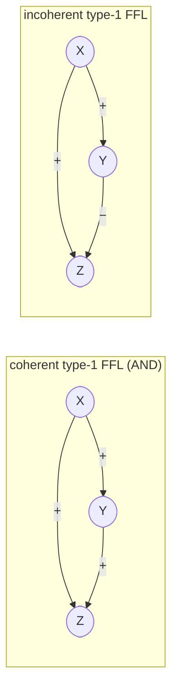
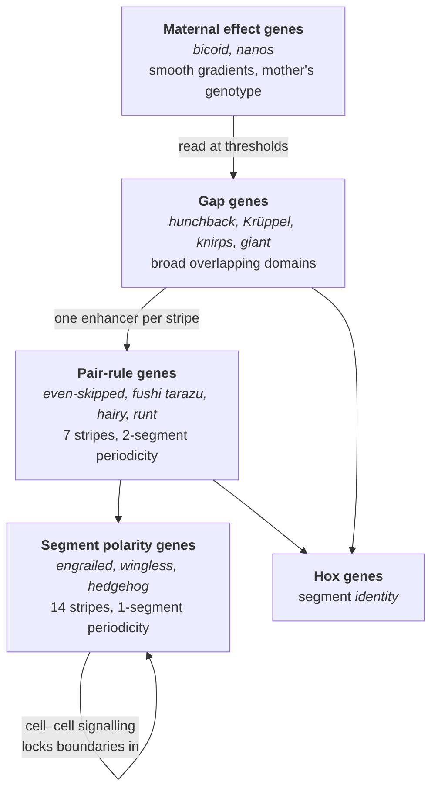

# 25 — Regulatory networks and development

> **Before this:** [Ch 22](22-eukaryotic-transcriptional-regulation.md) · [Ch 23](23-chromatin-and-epigenetics.md) · [Ch 24](24-rna-based-regulation.md) · **Time:** ~45 min

## What you'll be able to do

- Predict the dynamic behaviour of the standard transcription-network motifs from their wiring alone, and say why each one is worth having
- Derive why bistability requires cooperativity, and explain what hysteresis buys a cell that is committing to a fate
- Trace the *Drosophila* segmentation cascade from one smooth maternal gradient to fourteen sharp boundaries, naming what each tier contributes
- Explain Hox colinearity, what a homeotic transformation demonstrates, and why "master regulator" is a misleading phrase
- Explain how nuclear transfer and iPSC reprogramming settle the question of whether differentiation destroys information
- Argue from first principles why *cis*-regulatory change dominates morphological evolution, and why network buffering makes complex-trait genetics hard

## The core idea

Chapters 21 through 24 gave you the parts: promoters, enhancers, transcription factors, chromatin states, RNA-level control. Every one of those mechanisms has the same shape at the interface — **its input is the concentration of some gene products and its output is the concentration of another gene product.** Which means they compose. Wire a few thousand of them together and you have a directed graph with feedback, and that graph is a dynamical system.

Cell types are the stable states of that system. Development is the system being run forward from a single initial condition — one cell, carrying an asymmetric deposit of maternal protein — until it settles into a spatially organised arrangement of those states.

Nothing anywhere in the genome describes a finger, a segment, or a wing. What is encoded is the wiring: which factor binds which element, with what sign and what threshold. The anatomy is what that circuit *does*, not what it *says*. This is why the source-code analogy from [Ch 00](../part-00-orientation/00-the-whole-story.md) fails hardest here — there is no entry point, no call stack, and no line of code you could point at and call the specification of the result.

---

## 1. The network is the unit of analysis

Humans encode roughly **1,639 sequence-specific transcription factors** (Lambert et al. 2018) — about 8% of protein-coding genes doing nothing but regulating other genes. Draw a node per gene and an edge from X to Y whenever X's product binds a regulatory element of Y, and you get the **gene regulatory network** (GRN).

The edges are not booleans — each carries a sign, an effective threshold, and a steepness — but the sign-and-threshold abstraction captures most of the dynamics, and it is the level at which the interesting structure appears.

That structure is not random, and the way this was established should be familiar: **enumerate every 3-node subgraph in the real network, then compare the counts against an ensemble of randomised graphs that preserve each node's in- and out-degree.** A handful of patterns are enormously over-represented relative to that null. Shen-Orr, Milo and Alon ran this on the *E. coli* transcription network in 2002 and found the same short list that keeps reappearing in yeast, flies and mammals. Those patterns are the **network motifs**, and each one turns out to do something.

## 2. Motifs are circuits, and you already know most of them

### Negative autoregulation: a speed and noise fix

A gene whose product represses its own promoter. Over **40% of *E. coli* transcription factors** do this. Two consequences, both derivable.

Without feedback, production is constant and removal is first-order:

```
dX/dt = β − αX        steady state X* = β/α,   response time t½ = ln2 / α
```

Note what the response time depends on: **α alone.** The rate at which the protein is degraded or diluted by cell growth. Not β. Turning production up raises the final level but does not make it arrive sooner, because the approach to steady state is set entirely by the removal rate. For a stable protein in a dividing bacterium, α is dilution by growth, so t½ is one cell cycle. That is slow.

With negative feedback you can decouple the two: set β very high so X shoots up fast, and let the repression clamp it at the same X* as before. Rosenfeld, Elowitz and Alon built exactly this circuit and measured the rise time falling to about **one fifth of a cell cycle** for the same final level.

The second benefit is variance reduction. Expression is intrinsically noisy ([Ch 01 §5](../part-00-orientation/01-chemistry-and-cell-primer.md)); negative feedback corrects excursions in both directions. It is a proportional controller.

### Positive autoregulation: memory, and why it needs cooperativity

Now flip the sign: X activates its own promoter. Production becomes sigmoidal in X, and removal stays linear:

```
production   f(X) = β · Xⁿ / (Kⁿ + Xⁿ)
removal      g(X) = αX
```

Steady states are where `f(X) = g(X)`. Count the intersections.

If **n = 1**, f is a hyperbola: it rises from zero with an initial slope of β/K and is concave everywhere. A straight line through the origin either lies above it (one crossing, at X = 0) or cuts it once. At most one non-trivial steady state. No memory.

If **n > 1**, f is sigmoidal — it starts *flat* near the origin, steepens, then saturates. Now a line through the origin with an intermediate slope α can cross it **three times**: a low crossing, a middle one, and a high one. Stability follows from the sign of `f − g` between crossings: the low and high states are stable, the middle one is unstable. The system is **bistable**.

The requirement `n > 1` is not a modelling convenience. It is a physical demand for **cooperativity** — the factor must bind as a dimer or higher oligomer, or its element must carry multiple sites whose occupancies reinforce each other, or nucleosome displacement must make the next binding event easier. Cooperativity is the price of memory.

**Hysteresis** is the payoff. Sweep an external input that shifts the production curve upward: the system stays OFF until the low and middle states annihilate, then jumps to ON. Sweep the input back down: the system stays ON well past the point where it switched up, because now the ON state has to be destroyed instead. There is a range of inputs over which the state depends on history.

That is a latch. It is how a transient signal produces a permanent decision — the mechanical basis of cell-fate commitment. A morphogen present for two hours can install a state that persists for eighty years.

### Feed-forward loops: filters



**Coherent FFL with AND logic.** X activates Y; X and Y together activate Z. When X switches on, Z has to wait for Y to accumulate past its threshold. A brief pulse of X never lets Y get there, so Z never fires. A sustained X does. When X switches off, however, the AND fails immediately and Z shuts down with no delay.

Delay on the ON step, none on the OFF step: this is a **debounce circuit**, and it is a persistence detector. The cell ignores transients and responds only to signals that have been present long enough to mean something — which is exactly what you want when the response is expensive and the input is a noisy stochastic binding process.

**Incoherent FFL.** X activates Z directly and represses it indirectly through Y. Z rises fast, then falls as Y catches up: a **pulse generator**. It also accelerates the rise (the direct arm can be strong because the indirect arm will pull it back), and, tuned appropriately, it responds to the *fold change* in X rather than its absolute level — a normaliser. Many incoherent FFLs in animals use a microRNA as the repressing arm ([Ch 24](24-rna-based-regulation.md)).

### Toggles and oscillators

| Motif | Wiring | Behaviour | Where it shows up |
|---|---|---|---|
| **Negative autoregulation** | X ⊣ X | Fast rise, reduced noise | >40% of *E. coli* TFs |
| **Positive autoregulation** | X → X, cooperative | Bistable, hysteretic, memory | Commitment to any cell fate |
| **Coherent FFL (AND)** | X → Y, X+Y → Z | Persistence detection; ignores transients | Most common 3-node motif |
| **Incoherent FFL** | X → Z, X → Y ⊣ Z | Pulse; accelerated response; fold-change detection | Often built with miRNAs |
| **Toggle switch** | X ⊣ Y, Y ⊣ X | Two mutually exclusive states | λ phage lysis/lysogeny; every binary fate decision |
| **Delayed negative loop** | ring of repressors, or X → Y ⊣ X with delay | Sustained oscillation | Segmentation clock; circadian clock |

The **toggle switch** — two repressors, each shutting off the other — is the canonical binary decision. Gardner, Cantor and Collins built a synthetic one in *E. coli* in 2000 and showed it behaved exactly as the two-variable analysis predicts, including the cooperativity requirement. In development, mutually repressive TF pairs are how a bipotent progenitor picks one of two lineages: whichever repressor gets ahead by chance or by signal wins, and then locks in.

The **oscillator** needs negative feedback plus delay plus nonlinearity. Elowitz and Leibler's "repressilator" — three repressors in a ring — demonstrated that three genes suffice. The natural version that matters here is the **segmentation clock**: an oscillating GRN in the vertebrate presomitic mesoderm whose period (roughly 30 minutes in zebrafish, around two hours in mouse) sets how often a somite boundary is laid down. Note what this means: a body plan feature — how many vertebrae you have — is the product of a *frequency* interacting with a growth rate. Nobody counts.

## 3. Waddington's landscape, and where it breaks

Waddington drew development as a ball rolling down a surface of branching valleys: trajectories are valleys, decisions are ridges between them, and the shape of the surface is set by the genes — he drew guy-ropes underneath, pegged to genes, tensioning the sheet. It remains the most useful picture in the field.

Its limits are worth stating precisely, because it is frequently over-read:

- **A real GRN has no potential function.** A ball on a landscape is a gradient flow, and gradient flows cannot oscillate. GRNs demonstrably do. The landscape can represent attractors but not limit cycles, and the segmentation clock is a limit cycle.
- **The landscape has no space in it.** Development is fundamentally spatial: the same network runs in every cell and produces different outcomes because the *inputs* differ by position. The picture shows one ball.
- **Downhill-only is wrong**, as §9 will show.

Use it for the intuition that identity is an attractor with a barrier around it. Drop it the moment you need dynamics.

## 4. Building a fly: the best-understood pattern in biology

The *Drosophila* segmentation cascade earned Nüsslein-Volhard, Wieschaus and Lewis a Nobel in 1995, and it is worth doing properly because it is the only case where we can follow a smooth continuous input all the way to a sharp discrete output, tier by tier.

One piece of embryology makes it tractable. The early fly embryo undergoes about **13 rounds of nuclear division without cell division** — a **syncytium**, roughly 6,000 nuclei sharing one cytoplasm. Transcription factors therefore diffuse freely between nuclei, so the early tiers are genuinely a reaction–diffusion system in a shared compartment, with no membranes to cross. Most animals do not do this, which is part of why flies were solved first.



**Tier 1 — maternal.** *bicoid* mRNA is transcribed in the mother's nurse cells, carried into the oocyte and anchored at the anterior pole by an Exuperantia- and microtubule-dependent mechanism; *nanos* mRNA is localised to the posterior in the germ plasm. Translation after fertilisation produces opposing protein gradients. These are **maternal effect genes**, and they break Mendel's rules in an instructive way: the phenotype of an embryo is determined by **its mother's genotype**, not its own, because the mother loaded the cytoplasm. A homozygous mutant mother produces defective embryos whatever they inherit; her heterozygous sister's homozygous mutant offspring develop normally. This shows up in pedigrees as an inheritance pattern lagged by one generation ([Ch 11](../part-02-transmission-genetics/11-beyond-mendel.md)).

**Tier 2 — gap genes.** Bicoid activates *hunchback* above a concentration threshold. Other gap genes respond at other thresholds. Critically, the gap proteins **cross-repress each other**, which converts sloppy threshold readings into domains with much sharper edges than the input gradient has. Mutants delete a contiguous block of segments — hence the name.

**Tier 3 — pair-rule genes, and the trick worth understanding.** *even-skipped* (*eve*) is expressed in **seven crisp stripes**. There is nothing periodic upstream of it. The gap-gene landscape is aperiodic — a few broad, unevenly spaced hills.

The resolution: *eve* has **separate, independent enhancers, one per stripe or stripe pair**. The minimal stripe 2 enhancer is a **480 bp** element carrying about **twelve binding sites for four proteins**. Bicoid and Hunchback activate. Giant sets the anterior border by repression; Krüppel sets the posterior border. The stripe appears in the narrow window where all four conditions hold:

```
                          0%          20%         40%         60%         80%     100%
                          |anterior                                         posterior|
Bicoid     (maternal, +)  ██████████▓▓▓▓▓▓▓▓▒▒▒▒▒▒░░░░░░░░····························
Hunchback  (gap,      +)  ██████████████████████████▓▓▓▓▒▒▒▒··························
Giant      (gap,      −)  ···▒▒▒███████▓▓▓▒▒··················▒▒▒███████████▓▓▓·······
Krüppel    (gap,      −)  ························▒▒▒██████████▓▓▓····················
                          ------------------------------------------------------------
eve stripe 2  (OUTPUT)    ··················████······································

  fires where:  Bcd present  AND  Hb high  AND  Giant low  AND  Krüppel low
```

The stripe sits in the gap between Giant's anterior domain and Krüppel's central domain. Seven such queries, each written into its own enhancer against its own combination of gap-gene levels, and you get a periodic output from an aperiodic input. **The periodicity is in the readout, not in the mechanism.** No oscillator, no counter, no wavelength — just seven independent conjunctive queries that happen to land at regular intervals.

This is the clearest demonstration in biology of what an enhancer is: a piece of DNA that computes a Boolean-ish function of the local transcription-factor concentrations, independently of the other enhancers of the same gene ([Ch 22](22-eukaryotic-transcriptional-regulation.md)).

**Tier 4 — segment polarity genes.** By now the embryo has cellularised, so diffusion between nuclei stops and the mechanism must change. *engrailed*, *wingless* and *hedgehog* are expressed in 14 stripes, one per segment, and they hold each other on across the cell boundary: Wingless secreted by one cell maintains *engrailed* in its neighbour, which maintains *hedgehog*, which maintains *wingless*. That is a positive feedback loop implemented intercellularly.

Its function is **memory**. The maternal and gap proteins decay within hours. The boundaries have to last for the rest of development. The segment polarity loop converts a transient positional readout into a self-sustaining state — the bistability of §2, spread across two cells.

## 5. Morphogens and positional information

Wolpert's **French flag model** (1969) states the abstraction: a field of cells reads a graded signal, each cell compares the local concentration to internal thresholds, and picks a fate accordingly. Two thresholds partition the field into three bands. The signal carries **positional information**; the cells supply the interpretation.

The gradient shape is derivable. A morphogen produced at a source, diffusing with coefficient D and degraded at first-order rate k, satisfies at steady state:

```
D · d²c/dx² − k·c = 0     ⟹     c(x) = c₀ · e^(−x/λ),    λ = √(D/k)
```

The decay length λ is the **geometric mean of the diffusion coefficient and the turnover time** 1/k — equivalently, the distance a molecule diffuses in one lifetime. It is what sets the physical size of the patterned field, and it explains why morphogen gradients operate over hundreds of micrometres rather than millimetres.

The model's honest limitation: an exponential read against a fixed threshold is a *bad* position detector. Near the threshold, small fluctuations in c produce large errors in the inferred boundary, and real embryos place boundaries with roughly single-cell precision. The sharpening does not come from the gradient. It comes from what happens downstream — cross-repression between the target genes (as the gap genes do), time-averaging, and cell–cell communication. **The French flag is a specification, not a mechanism.**

Real examples: Bicoid along the fly's anterior–posterior axis; Sonic hedgehog in the vertebrate neural tube, where a graded Gli response plus a cross-repressive TF network carves out about five ventral progenitor domains; BMP along the dorsal–ventral axis in essentially all bilaterians.

## 6. Hox genes: identity, colinearity, and deep conservation

The segmentation cascade makes segments. It does not say which segment is which. That is Hox.

*Drosophila* has **eight Hox genes** in a complex that has split into two clusters. Humans have **39, in four clusters** — HOXA, HOXB, HOXC, HOXD, on chromosomes 7, 17, 12 and 2 — the product of two rounds of whole-genome duplication early in vertebrate evolution ([Ch 35](../part-07-molecular-evolution/35-genome-evolution.md)). Amphioxus, a chordate that skipped those duplications, retains a **single cluster of 15**, close to the ancestral arrangement.

**Colinearity** is the striking part: the physical order of the genes along the chromosome matches the order of their expression domains along the body axis, 3′ genes anterior and 5′ genes posterior. In vertebrates there is also **temporal** colinearity — 3′ genes switch on first. This is one of the very few cases where gene *order* is functionally load-bearing, and it is why the clusters have survived intact for more than 500 million years while nearly all other synteny was scrambled. The mechanism is topological: the cluster is regulated as a single chromatin domain that opens progressively from one end ([Ch 50](../part-10-functional-genomics/50-3d-genome.md)).

**Homeotic transformations** are what happens when Hox expression is misassigned. Express *Antennapedia* in the head and the fly grows legs where its antennae should be. Remove bithorax-complex function and the third thoracic segment develops as a second copy of the second: a four-winged fly, halteres transformed to wings.

What that demonstrates is the important part:

- The leg-building programme was **already present and functional** in the antennal segment. Hox did not build it. Hox selected it.
- Hox genes are **selectors** — they route between pre-existing developmental subroutines. "Master regulator" invites you to imagine the gene contains the design of a leg. It contains a routing decision.
- Vertebrate Hox proteins can substitute for their fly counterparts in some assays. The last common ancestor of flies and humans, well over half a billion years ago, already had this system running.

## 7. Signalling pathways: the intercellular layer

Once cells are membrane-bounded, network state has to cross between them. Animal development uses a remarkably short list of pathways to do it — essentially the same handful, reused everywhere.

| Pathway | Signal | Transduction, in one line | Typical developmental use |
|---|---|---|---|
| **Wnt** | secreted glycoprotein | Ligand stabilises β-catenin, which enters the nucleus and partners a TF | Axis formation, stem-cell maintenance, *wingless* in segment polarity |
| **Hedgehog** | secreted, lipid-modified | Ligand de-represses Smoothened, switching Gli TFs from repressor to activator form | Neural tube patterning, limb anterior–posterior axis |
| **Notch** | **membrane-bound** — no diffusion | Ligand binding causes proteolysis; the receptor's own tail *is* the TF cofactor | Lateral inhibition; boundary formation; the segmentation clock |
| **TGF-β / BMP** | secreted | Receptor kinase phosphorylates SMAD TFs, which relocate to the nucleus | Dorsal–ventral axis, tissue-specific gradients |
| **RTK (FGF, EGF)** | secreted | Receptor kinase → RAS/MAPK cascade → phosphorylates TFs | Induction, growth, branching morphogenesis |

**Every one of these terminates on a transcription factor.** They are the input ports of the GRN, which is why "signalling" is not a separate subject: it is the mechanism by which one cell's network state edits another cell's network inputs.

**Notch is architecturally different.** It requires physical contact, so it acts only between touching cells — which makes it the natural substrate for **lateral inhibition**: a cell that starts to adopt a fate tells its immediate neighbours not to. That is a two-cell toggle switch, and it breaks a uniform sheet of equivalent cells into a regular salt-and-pepper pattern with no gradient involved at all.

## 8. Specification, determination, differentiation, competence

These four words are used loosely in popular writing and precisely in genetics. Each has an operational test.

| Term | Definition | The experiment that distinguishes it |
|---|---|---|
| **Specified** | Will develop as fate F if left alone in a neutral environment | Explant into neutral culture — does it still become F? |
| **Determined** | Will develop as F *even in a different environment* | Transplant to a region specifying something else — does it resist? |
| **Differentiated** | Actively expressing the terminal programme of F | Measure the markers |
| **Competent** | Able to respond to a given signal at all | Deliver the signal — is there any response? |

Competence is the one that does the most work and gets the least attention. **The same signal produces different outcomes in different receivers**, because the response depends on the receiver's current network state and chromatin configuration — which enhancers are accessible for the pathway's TF to bind. This is why five pathways suffice for an entire animal: the information is not mostly in the signal, it is in who is listening.

## 9. Identity is an attractor — and it is reversible

A differentiated cell holds its state through a combination of §2 mechanisms operating at scale: the defining transcription factors bind their own enhancers and each other's (positive feedback), and the chromatin and DNA methylation state at those loci is propagated through division ([Ch 23](23-chromatin-and-epigenetics.md)). The state is self-sustaining and heritable through mitosis, even though nothing in the DNA sequence changed.

The obvious question is whether anything *did* change — whether becoming a skin cell involves discarding the parts of the genome you no longer need. This was a serious hypothesis, and it was settled experimentally.

**Gurdon, 1962.** Take the nucleus from a differentiated intestinal epithelial cell of a *Xenopus* tadpole. Inject it into an enucleated egg. Some of those eggs develop into swimming tadpoles. The differentiated nucleus still contained everything required to build a whole animal. Dolly the sheep, in 1996, extended this to mammals from an adult somatic cell.

**Takahashi and Yamanaka, 2006 (mouse) and 2007 (human).** Screen 24 candidate factors for the ability to convert a fibroblast into a pluripotent stem cell. Four suffice: **Oct4, Sox2, Klf4 and c-Myc**. Forced expression of those four in a skin fibroblast produces an **induced pluripotent stem cell** — one that can generate any tissue. Gurdon and Yamanaka shared the 2012 Nobel.

The efficiency is the informative detail: well under 1% of cells convert, over weeks, stochastically. That is exactly what fighting a deep attractor looks like. You are not flipping a switch; you are pushing hard on four nodes and waiting for the network to fall out of its basin by chance.

> **Determination is a change in network state, not in genome content.** A liver cell and a neuron differ in which attractor they occupy, not in what they carry. The barrier around the attractor is real and high — cells do not spontaneously change type — but it is a barrier in a dynamical system, not a deletion. Push the right four nodes hard enough and the ball goes back uphill.

## 10. Robustness, canalisation, and why this makes complex traits hard

Waddington's other contribution was **canalisation** (1942): development is buffered so that the same phenotype emerges despite genetic and environmental perturbation. The valleys have walls. The mechanisms are the ones already covered — negative feedback, redundant paralogues, distributed control — plus **shadow enhancers**: many developmental genes carry a second, seemingly superfluous enhancer that drives the same pattern. Delete it under laboratory conditions and nothing happens. Delete it and then raise the animal at a stressful temperature and the pattern falls apart. The redundancy was not decorative; it was the error correction, and the standard assay was not sensitive enough to see it.

This is where Part 4 hands off to Part 6, and the handoff explains a great deal about why complex-trait genetics is hard:

- **The variant-to-phenotype map is compressive.** Most perturbations are absorbed by buffering and produce no measurable change. That is not a failure of measurement; it is the system working as designed.
- **Effect sizes are small because buffering makes them small.** A variant that shifts one node's expression by 20% is damped by every feedback loop between that node and the phenotype.
- **Epistasis is generic, not exceptional.** Effects that propagate through a network with feedback and thresholds do not add. Two variants can each be silent alone and severe together, or each be severe alone and no worse together.
- **Buffering is itself variable.** Genetic background changes how much slack the network has, which is precisely what penetrance and expressivity are ([Ch 11](../part-02-transmission-genetics/11-beyond-mendel.md)).
- **Because networks are densely connected in *trans*, essentially every gene expressed in the relevant tissue has some effect on the trait** — the "omnigenic" framing of Boyle, Li and Pritchard (2017), and the reason GWAS signal is spread thinly across the whole genome rather than concentrated in a few pathways ([Ch 51](../part-11-human-and-statistical-genomics/51-gwas.md)).

### Evo-devo: why morphological evolution is mostly regulatory

The same architecture dictates where evolution can act. A developmental transcription factor is deployed in a dozen tissues at a dozen times; altering its coding sequence alters all of them at once, and the pleiotropic cost is usually prohibitive. Enhancers are modular — roughly one per tissue, per time, per domain — so deleting the one that drives expression in structure X removes the gene from X and leaves the other eleven deployments untouched.

Selection sees a mutation's *total* fitness effect. The modular route is therefore dramatically cheaper, which predicts that morphological differences between species sit disproportionately in non-coding regulatory sequence. That is what is observed, and it is why human and chimpanzee proteins can be nearly identical while the animals are not.

---

## Common misconceptions

| What people think | What's actually true |
|---|---|
| A "master regulator" gene contains the design of the structure it controls | Selectors like Hox genes route between developmental programmes that already exist elsewhere in the network. *Antennapedia* in the head makes a leg because the leg programme was already there and merely unselected |
| A morphogen gradient explains where sharp boundaries form | An exponential gradient read against a threshold is an imprecise position detector. Sharpness is manufactured downstream by cross-repression, time-averaging and feedback. The gradient supplies rough coordinates, not the boundary |
| Bicoid is the universal anterior determinant of animals | *bicoid* is a derived gene, restricted to higher flies, and arose from a duplicated Hox3-family gene. Most insects pattern their anterior with entirely different molecules. The *logic* of the cascade is far more conserved than its components |
| Positive feedback gives you a switch | Only with cooperativity. With `n = 1` the production curve is concave and crosses the removal line at most once — a graded response, no memory. `n > 1` is what makes three steady states geometrically possible |
| Differentiation removes genetic information the cell no longer needs | Nuclear transfer produces whole animals from differentiated nuclei; four transcription factors convert a fibroblast to a pluripotent cell. The information is all still there. What changed is the network state and the chromatin holding it |
| Waddington's landscape is a model of development | It is a metaphor for attractors. It has no spatial dimension, no potential function in the general case, and it cannot represent oscillation — yet the segmentation clock is an oscillator. Useful for intuition, misleading for dynamics |
| Redundant genes are evolutionary leftovers doing nothing | Knock out one shadow enhancer under standard conditions and see nothing; do it under thermal stress and the pattern collapses. Absence of a phenotype is very often absence of a sufficiently harsh assay |
| Evolving new morphology requires new genes | The bilaterian developmental toolkit is nearly identical across animals with radically different bodies. Novelty comes overwhelmingly from redeploying the same genes in new places at new times |

## Worked example: losing a pelvis, one enhancer at a time

Threespine sticklebacks are marine fish with a bony pelvis carrying prominent spines — an anti-predator structure. Since the last glaciation, marine populations have repeatedly colonised freshwater lakes, and in many of those lakes the pelvis has been **lost independently**. Work the case.

**1. Establish it is genetic, not plastic.** Cross a pelvic-complete marine fish to a pelvic-reduced freshwater fish and raise the offspring in a common environment. The trait segregates. It is heritable.

**2. Map it.** Genotype an F2 cross and scan for association ([Ch 32](../part-06-quantitative-genetics/32-mapping-quantitative-traits.md)). A single locus of large effect dominates the variance, and it contains *Pitx1*, a homeobox transcription factor already known to be required for hindlimb development in mice. *Pitx1*-null mice do not lose the hindlimb outright — they build it badly: no ilium, no patella, shortened long bones, and a partial shift of what remains toward forelimb identity. Strong candidate.

**3. Test the obvious hypothesis first, and reject it.** Sequence the *Pitx1* coding region in pelvic-reduced fish. It is **intact**. No premature stop, no missense change tracking with the phenotype. The protein is fine.

**4. Ask why it had to be fine.** *Pitx1* is also required for pituitary, jaw and other structures. A null allele would be catastrophic. Any evolutionary path that ran through the coding sequence was closed by pleiotropy — which is precisely the §10 argument, arriving as a prediction rather than a story.

**5. Look at expression.** *Pitx1* mRNA is absent from the developing pelvic region in reduced fish, while its expression elsewhere is normal. **Tissue-specific loss of expression with an intact protein** is the diagnostic signature of an enhancer lesion.

**6. Find the enhancer.** Chan and colleagues (2010) identified a **~2.5 kb non-coding region upstream of *Pitx1***, named *Pel*, that drives reporter expression specifically in the developing pelvic hind fin. In pelvic-reduced populations, *Pel* is **deleted**.

**7. Prove sufficiency.** Put the intact *Pel* sequence from a pelvic-complete population in front of a *Pitx1* minigene, and introduce it transgenically into pelvic-reduced fish. **The pelvis comes back.** This is the step that converts a correlation into a mechanism.

**8. Explain the repetition.** The deletion has occurred independently in many populations — and the *Pel* region sits in a fragile, repeat-prone sequence context that breaks unusually often. So the mutational input rate at this specific site is elevated, and each new freshwater colonisation gets a fresh supply of the same beneficial deletion. Parallel evolution here is not a coincidence; it is a mutation-rate hotspot meeting a consistent selection pressure. The signatures of positive selection around the deletions confirm the second half.

**9. Note the tell.** Where a pelvic vestige remains, it is often asymmetric between left and right — a hallmark of reduced *Pitx1* dosage rather than of a general failure to build a pelvis.

**What generalises.** The causal variant is non-coding, tissue-specific, modular, recurrent, and invisible to any analysis restricted to exons. That description also fits most of what [Part 11](../part-11-human-and-statistical-genomics/51-gwas.md) will spend its time chasing in humans — with the difference that in sticklebacks you can do step 7.

## Connections

- **Back to:** [Ch 21](21-bacterial-regulation.md) — the *lac* operon is the first feedback circuit you met · [Ch 20A §7](../part-03-genome-instability/20A-bacterial-and-phage-genetics.md) — the λ cI/Cro switch, the first genuine toggle you met, and where its bistability is traced through the circuit · [Ch 22](22-eukaryotic-transcriptional-regulation.md) — enhancers as the elements that compute the motif logic · [Ch 23](23-chromatin-and-epigenetics.md) — how an attractor is made heritable through mitosis · [Ch 24](24-rna-based-regulation.md) — miRNAs as the repressing arm of incoherent FFLs · [Ch 11](../part-02-transmission-genetics/11-beyond-mendel.md) — maternal effect, penetrance and expressivity now have mechanisms
- **Forward to:** [Ch 25A](25A-developmental-genetics.md) — read next: how every tier of this chapter's network was actually discovered, by mutant phenotype class rather than by wiring, and how you break one gene in one tissue at one hour in a mouse · [Ch 30](../part-06-quantitative-genetics/30-quantitative-traits.md) and [Ch 31](../part-06-quantitative-genetics/31-heritability-and-selection.md) — buffering and epistasis as the reason effect sizes are small · [Ch 35](../part-07-molecular-evolution/35-genome-evolution.md) — the whole-genome duplications that made four Hox clusters · [Ch 37](../part-08-methods/37-model-organisms-and-screens.md) — the saturation screens that found every gene in §4 · [Ch 38](../part-08-methods/38-genome-editing.md) — deleting an enhancer to test it, as in step 7 · [Ch 48](../part-10-functional-genomics/48-single-cell-and-spatial.md) — trajectory inference as an empirically measured Waddington landscape · [Ch 50](../part-10-functional-genomics/50-3d-genome.md) — the chromatin domains that enforce Hox colinearity · [Ch 52](../part-11-human-and-statistical-genomics/52-association-to-mechanism.md) — running the stickleback workflow on human GWAS hits

## Check yourself

**1. A colleague models a self-activating transcription factor with `f(X) = βX/(K + X)` and reports that the system is bistable. Without simulating, why is that impossible?**

<details><summary>Answer</summary>

With `n = 1` the production curve is concave everywhere: it rises from the origin with slope β/K and bends only downward. Removal is the straight line `g(X) = αX` through the origin. A straight line through the origin can cut a concave-from-below curve that also passes through the origin at most once away from zero. So there are at most two steady states (X = 0 and one other), and three are required for bistability — two stable separated by an unstable one.

Bistability needs `n > 1`, i.e. genuine cooperativity: dimerisation, multiple reinforcing binding sites, or chromatin-mediated cooperativity. The sigmoid's flat foot near the origin is what creates room for the line to cross three times.

</details>

**2. A gene Z is controlled by a coherent type-1 feed-forward loop with AND logic. You give a 5-minute pulse of the input X, then later a 3-hour sustained dose. Predict the Z output in both cases, including what happens when X is withdrawn.**

<details><summary>Answer</summary>

The 5-minute pulse produces **no Z at all**. Z requires both X and Y; Y is only just starting to accumulate when X disappears, so it never crosses its threshold at the Z promoter and the AND never satisfies.

The 3-hour dose produces Z **after a delay** — the time for Y to accumulate past threshold. When X is then withdrawn, Z shuts off **immediately**, because the AND fails the moment X's contribution goes, regardless of how much Y is still around.

Delay on the ON step, no delay on the OFF step: sign-sensitive delay. Functionally it is a debounce circuit — it filters transient input noise while remaining able to terminate the response quickly.

</details>

**3. *even-skipped* is expressed in seven evenly spaced stripes, but nothing upstream of it is periodic. How is the periodicity generated?**

<details><summary>Answer</summary>

It isn't generated — it is queried into existence. *eve* has separate enhancers, one per stripe or stripe pair, each of which independently reads the aperiodic gap-gene concentration landscape and fires only in a narrow window. The stripe 2 enhancer is 480 bp with about twelve sites for four factors: Bicoid and Hunchback activate, Giant sets the anterior edge by repression, Krüppel the posterior edge, and the stripe appears in the gap between the two repressor domains.

Seven such conjunctive queries, each tuned to a different combination, happen to produce seven regularly spaced outputs. There is no oscillator, counter or wavelength anywhere in the mechanism. The periodicity lives in the readout.

</details>

**4. Why should a mutation that changes an animal's morphology be more likely to sit in an enhancer than in a coding sequence — and what does that predict about where to look when a new case turns up?**

<details><summary>Answer</summary>

Developmental transcription factors are pleiotropic: each is deployed in many tissues at many stages. A coding change hits every deployment simultaneously, so the total fitness cost is usually prohibitive even if the effect on the tissue of interest would have been favourable. Enhancers are modular — roughly one per tissue/time/domain — so a change to one alters exactly one deployment and leaves the rest untouched. Selection sees the total effect, so the modular route is the accessible one.

Prediction: for a new morphological difference, expect an intact protein, tissue-specific loss or gain of expression, and a causal variant in non-coding sequence — possibly far from the gene it controls and possibly inside a neighbouring gene. An exome-only analysis will find nothing, which is precisely the trap sprung by the *LCT* example in [Ch 00](../part-00-orientation/00-the-whole-story.md).

</details>

**5. Reprogramming a fibroblast to a pluripotent stem cell with four factors works in well under 1% of cells and takes weeks. Why is that inefficiency evidence *for* the attractor model rather than against it?**

<details><summary>Answer</summary>

If cell identity were a passive consequence of which factors happen to be present, supplying the pluripotency factors would flip essentially every cell, quickly and deterministically. It doesn't.

What is observed — low probability, long latency, wide variability between cells — is the signature of a stochastic escape from a deep basin of attraction. The existing identity is actively maintained by mutually reinforcing transcription factors plus chromatin and methylation states that resist change and are re-established after each division. The four factors do not switch the state; they lower the barrier and shift the landscape, and then thermal noise has to do the rest. Rare, slow, stochastic escape is what that looks like.

It also settles the older question: the escape happens at all, so nothing was deleted on the way down.

</details>
