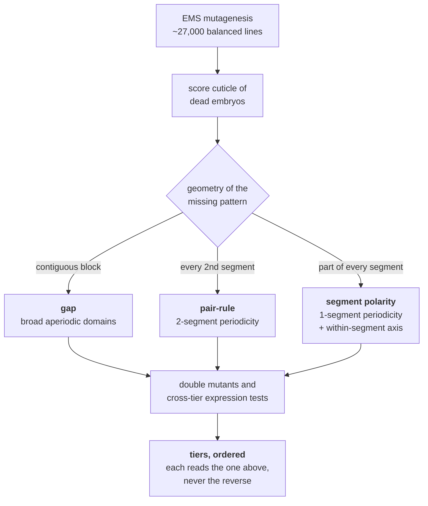
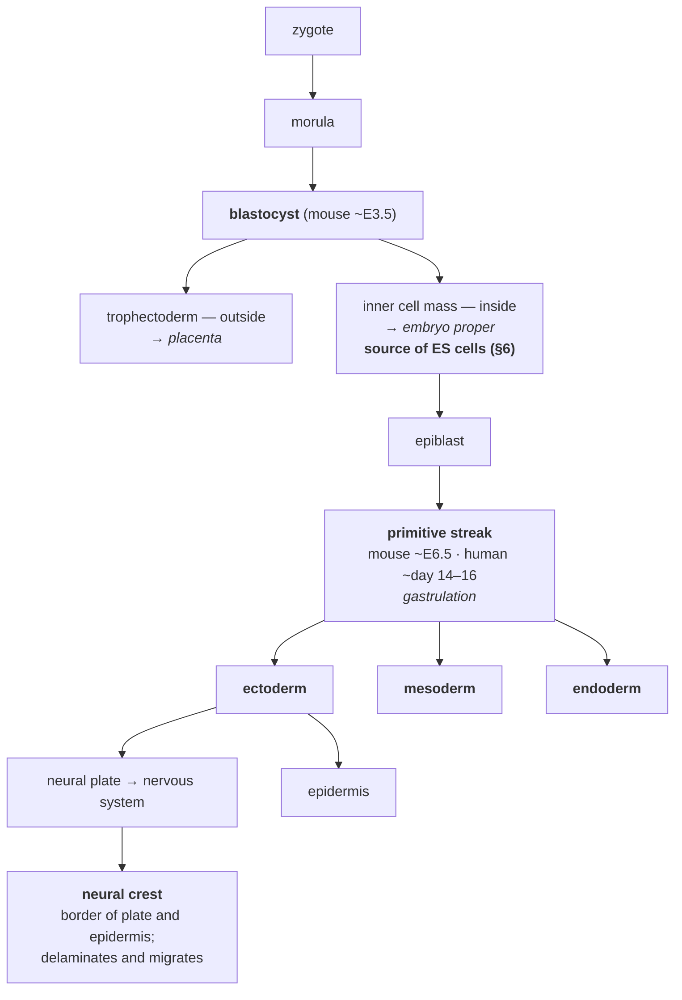

# 25A — Developmental genetics and the genetics of making a mouse

> **Before this:** [Ch 22](22-eukaryotic-transcriptional-regulation.md) ·
> [Ch 23](23-chromatin-and-epigenetics.md) · [Ch 24](24-rna-based-regulation.md) ·
> [Ch 25](25-networks-and-development.md) · **Time:** ~55 min

[Chapter 25](25-networks-and-development.md) described development as a dynamical system: motifs,
attractors, gradients, a network settling into spatially organised states. That is what
development *is*. This chapter is how any of it was found out, and how you interrogate it in an
animal you cannot screen.

Nobody deduced the *Drosophila* segmentation hierarchy from the network. It was found by
poisoning flies, letting the embryos die, and sorting the corpses into piles by the shape of the
damage — and the tiers of the hierarchy *are* the piles. When the same question was put to a
mouse, where a screen costs three generations and a colony, the answer was to invent a way to
break one chosen gene, in one chosen tissue, at one chosen hour. That invention is the most-used
genetic tool in mammalian biology, and this is the chapter that names it.

## What you'll be able to do

- Distinguish lineage-driven from position-driven specification, predict the outcome of a
  cell-ablation experiment under each, and explain why every real embryo uses both
- Reconstruct a genetic hierarchy from mutant phenotype classes alone, and say what the
  *periodicity of a defect* tells you about a gene before anything is cloned
- Read a homeotic transformation as evidence that segment identity is a variable separable from
  the structure being built, and predict what its sign says about a selector gene
- Order two genes in a pathway from a double mutant, derive why the rule works, state the four
  conditions that make the inference valid, and predict when "the epistatic mutant is downstream"
  inverts
- Classify a tissue, or a congenital syndrome, by embryonic origin — the three germ layers and
  the neural crest
- Design a gene-targeting experiment end to end — vector, positive/negative selection, ES cells,
  chimera, germline transmission — and say which of its steps CRISPR replaced and which it did not
- Choose between a null, a conditional and an inducible allele given a stated failure mode, and
  build a lineage-tracing experiment from the same parts

## The core idea

You have a build pipeline. There is no source, no logs, no debugger, no way to attach to a
running process. You have one instrument: break a single stage, run the build, and look at the
artefact that falls out.

That is genetics applied to an embryo, and it is more powerful than it sounds, because **the
shape of the wreckage identifies the stage.** A mutation deleting a contiguous block of body
segments broke something acting over a broad region. A mutation deleting every *second* segment
broke something with two-segment periodicity — and you know that before you know what the gene
is, what it encodes, or where it sits in the genome. Classifying the damage *is* discovering the
architecture.

The second half runs the idea backwards. Once you can name a gene you want to break it
deliberately, in a mammal, without killing the animal before the interesting part happens. That
means separating three things a plain knockout fuses together: *which gene*, *which cells*,
*when*.

> **A developmental hierarchy is discovered backwards, from phenotype to tier, by classifying
> breakage.** The classes come first; the molecules come later and have to fit.

---

## 1. Two logics of development: lineage and position

A cell has to become one thing rather than another, and there are exactly two kinds of information
it can use.

**Lineage.** Fate follows from ancestry — which cell you descended from, through which divisions.
Determinants are *inherited*: a dividing cell partitions cytoplasmic material unequally and the
daughters differ because they got different stuff.

**Position.** Fate follows from location. Determinants are *received*: a cell reads a morphogen
gradient or a contact signal and picks accordingly ([Ch 25 §5](25-networks-and-development.md)).

*Caenorhabditis elegans* is the extreme of the first. Its somatic cell lineage is **invariant** —
the same divisions in the same order producing the same cells in every animal, so each cell has a
name and a fixed pedigree. The hermaphrodite soma generates **1,090 cells**, of which **131
undergo programmed cell death** at reproducible positions in the lineage, leaving the **959
somatic nuclei** of the adult. Those 131 deaths are scheduled, not attrition, and the genes that
schedule them were found by screening for mutants in which the extra cells survived.

A vertebrate limb bud is the extreme of the second: no invariant lineage, cells allocated to
skeletal elements by position in a field, the field scaling with the size of the bud.

The experiment that distinguishes them is to kill one cell with a laser and watch the neighbours.

| | **Lineage (mosaic)** | **Positional (regulative)** |
|---|---|---|
| Fate set by | Ancestry, via inherited determinants | Location, via received signals |
| Ablate a precursor | Its descendants are simply missing | Neighbours re-pattern and fill the gap |
| Transplant elsewhere | Keeps its original fate | Adopts the fate of the new position |
| Scales with organ size | No — cell number is fixed | Yes — a bigger field gets more cells per band |
| Error correction | None. A lost cell is a lost structure | Substantial. The field re-reads its coordinates |
| Pays for it with | Brittleness, fixed body size | Imprecision, needing downstream sharpening |

**Neither organism is pure, and the exception is the useful part.** The canonical lineage animal
uses induction: six vulval precursor cells sit in the worm's ventral epidermis and the **anchor
cell** in the overlying gonad signals to them. Kimble ablated the anchor cell before the L3 stage
and *all six* precursors took the default, non-vulval fate. Conversely, vertebrate embryos contain
lineage-restricted compartments whose cells never mix.

One caution before the dispatch-table analogy takes hold: **no cell knows its lineage.** There is
no address register and nothing reads a pedigree. "Invariant lineage" describes the *output*; the
mechanism is entirely local — asymmetric partitioning at each division plus short-range signalling
between the products. The determinism is emergent, not implemented — the source-code analogy from
[Ch 00](../part-00-orientation/00-the-whole-story.md) failing in its sharpest form.

## 2. The genetic dissection of a body plan

The *Drosophila* segmentation hierarchy is the canonical genetic pathway found by screening, and
it is worth doing as *genetics* rather than as a molecular recap.

### The screen

Christiane Nüsslein-Volhard and Eric Wieschaus ran it at EMBL Heidelberg over 1979–80. By their
own later account they established about **27,000 inbred lines** carrying an estimated **18,000
independently induced lethal mutations**, in three separate screens — X, second and third
chromosomes — because a recessive lethal must be homozygosed to be seen and each chromosome needs
its own **balancer** stock: a chromosome carrying inversions that suppress recovery of crossovers,
plus a recessive lethal and a dominant marker, so a lethal mutation is maintained indefinitely as
a heterozygous stock ([Ch 37 §4](../part-08-methods/37-model-organisms-and-screens.md), forward).

Two design decisions did most of the work. **The readout was the cuticle of the dead embryo** — a
patterned external shell with denticle belts in a stereotyped arrangement, which survives the
animal's death, mounts flat, and is scored in seconds. Durable, cheap, and — the part that matters
— **high-dimensional**: it does not report "abnormal", it reports precisely *which* piece of the
pattern is missing and *where*. And **they screened for embryonic lethals deliberately**, because
anything patterning the body plan kills the embryo when broken; scoring viable adults would have
discarded the whole class.

The 1980 *Nature* paper reported **15 loci** whose mutation alters the segmental pattern, with an
explicit saturation claim: these probably represented the majority of such genes in the genome.

### The classification came before the molecules

They sorted the mutants by the *geometry* of the missing pattern, and got three classes:

| Class | What the cuticle looks like | What the geometry implies | Examples named in 1980 |
|---|---|---|---|
| **Gap** | A contiguous block of adjacent segments missing | Acts over a broad region — one domain, no periodicity | *Krüppel*, *knirps* |
| **Pair-rule** | Alternate segments, or part of every alternate segment, missing | Must be expressed with **two-segment periodicity** | *even-skipped*, *odd-skipped*, *paired*, *runt* |
| **Segment polarity** | Part of *every* segment missing, remainder mirror-duplicated | **One-segment periodicity**, and distinguishes front from back within each segment | *gooseberry*, *patched* |

Read the middle column again. **The periodicity of the defect predicts the periodicity of the
gene's expression** — a molecular prediction derived from the shape of a dead larva, years before
any of these genes was cloned. When *even-skipped* was eventually stained it was in seven stripes.
The screen had already said it would be.



### Ordering the tiers

Three phenotype classes are three piles, not a hierarchy. The order comes from **asymmetric
dependence**: break tier *k* and everything downstream is corrupted while everything upstream is
untouched. Remove *bicoid* and the gap-gene domains are lost or displaced; remove a gap gene and
the pair-rule stripes shift; remove a pair-rule gene and segment-polarity stripes fail in
alternate positions. None of it runs backwards. A staged build, where the direction of the arrow
is the direction corruption propagates.

### The maternal tier, and why it costs an extra generation

Above the gap genes sit the **maternal-effect** genes — *bicoid*, *nanos* and relatives — whose
products the mother deposits in the egg. Their genetic signature is diagnostic: **the embryo's
phenotype is set by its mother's genotype, not its own**
([Ch 11](../part-02-transmission-genetics/11-beyond-mendel.md);
[Ch 25 §4](25-networks-and-development.md)). A homozygous mutant mother produces uniformly
defective embryos whatever she is crossed to; her heterozygous sister's homozygous mutant
offspring develop normally. The screen therefore shifts by a generation — you score the offspring
of homozygous mutant *mothers* — and in a pedigree the inheritance looks lagged.

## 3. Hox genes as a genetic phenomenon

[Chapter 25 §6](25-networks-and-development.md) covers colinearity and the selector concept. Two
points belong here because they are genetics rather than regulation.

**Homeosis separates "build a structure" from "which structure".** Ed Lewis's analysis of the
bithorax complex (*Nature* 276:565, 1978) showed that removing its function transforms the third
thoracic segment into a copy of the second — halteres become wings, giving a four-winged fly.
Nothing novel was constructed; a segment that was going to be built anyway was built with the
wrong identity. **Identity is a separable variable**, assigned by a gene on top of a structural
programme that exists independently — a strong architectural claim, obtained entirely from
mutants.

**The sign of the transformation tells you what a selector does.** For Hox genes the pattern is
consistent: loss of function transforms a posterior structure toward a more *anterior* identity
(anterior is the default), while ectopic expression transforms anterior toward posterior. Where
two Hox genes are co-expressed the more posterior usually prevails — visible genetically as
epistasis between Hox genes, and one reason a single loss can be silent.

**In mammals, redundancy blunts all of it.** Single mouse Hox knockouts give *partial*, variably
penetrant vertebral transformations; *Hoxb4* nulls shift the second cervical vertebra part-way
toward the first. Compound mutants for the paralogous *Hoxa4*, *Hoxb4* and *Hoxd4* transform more
completely, with severity rising as mutant copies accumulate — the four vertebrate clusters came
from two rounds of whole-genome duplication
([Ch 35](../part-07-molecular-evolution/35-genome-evolution.md), forward), and the duplicates
cover for each other. This is the first appearance of a problem §7 meets head on: **a mammalian
single-gene knockout systematically understates what the gene does.**

## 4. Epistasis: ordering a pathway with a double mutant

Single mutants tell you a gene is *required*. They cannot tell you the *order*: two genes both
needed for a structure, both mutants lacking it, identical information either way.

Double mutants can order them, and the reason is almost embarrassing once written down.

### Derivation

Model a linear regulatory pathway as a composition of functions on a state:

```
   output  =  f_n ( … f_2 ( f_1 ( input ) ) … )
```

A **null** allele of gene *i* replaces *f_i* with the constant function OFF; a **constitutive**
allele replaces it with the constant function ON. Both are the same operation: **a clamp** —
replacing a function by a constant that discards its argument.

Compose two clamps at positions *j* < *k*, so *j* is upstream. Since *f_k* ignores its argument,
nothing *f_j* produced can reach the output. The double mutant's phenotype is set by the clamp
with the **largest index**.

```
   Switch regulatory pathway:  phenotype of double = clamp at argmax(index)
                               ⟹  the EPISTATIC mutation is the DOWNSTREAM one
```

That is exact, and it is nothing but "a constant function ignores its input". It also derives, for
free, the condition everyone forgets: **if both clamps have the same value, both orderings predict
the same double-mutant phenotype and you learn nothing.** The two single mutants must have
*opposite* phenotypes.

### The rule inverts

Take a **substrate-dependent** pathway — a biosynthetic chain through which material flows:

```
   precursor  ──(A)──>  intermediate  ──(B)──>  product
```

with the observable being *which compound accumulates*. Block A: precursor accumulates. Block B:
intermediate accumulates. Block both: precursor accumulates, because nothing gets past the
earliest block.

```
   Substrate-dependent pathway:  phenotype of double = block at argmin(index)
                                 ⟹  the EPISTATIC mutation is the UPSTREAM one
```

Same experiment, opposite reading. Avery and Wasserman set this out explicitly in 1992, and it
remains the commonest error in reading a double mutant. **Switch pathways are `argmax`; substrate
pathways are `argmin`.** Decide which you are in *before* converting "epistatic" into "upstream"
or "downstream" — and note that the type is a claim about what your assay measures, not about the
molecules. For a programmer: reading the value a pipeline returned, the last stage to write a
constant wins; asking how far an item got down a conveyor, the earliest jam wins. Same pipeline,
opposite answers.

### The four conditions

1. **Both alleles must be null or fully constitutive.** A hypomorph is a partial clamp, not a
   constant function, and the derivation collapses. Test independently — a true null is no worse
   opposite a chromosomal deletion of the locus than opposite itself.
2. **The single mutants must have opposite, distinguishable phenotypes.** Derived above.
3. **The genes must act in the same pathway.** Genes in parallel pathways give a double mutant
   merely worse than either — a genetic interaction, not an ordering.
4. **You must know the pathway type**, because the rule inverts.

Two standing cautions. Epistasis orders genes in an **information-flow** sense and says nothing
about physical contact ([Ch 11](../part-02-transmission-genetics/11-beyond-mendel.md)). And in a
chain containing a repressor, a null of the repressor behaves like a gain-of-function of its
target, so reason from the wiring rather than reciting the slogan — the worked example runs
straight into this.

> [Ch 37 §11](../part-08-methods/37-model-organisms-and-screens.md) (forward) generalises this
> from a qualitative ordering to a quantitative interaction measured across millions of double
> mutants, and to synthetic lethality as a drug-target strategy. All of it rests on the logic
> derived here.

## 5. Mammalian development, in the amount you need



**The first fate decision in a mammal is positional.** Cells on the outside of the early embryo
become trophectoderm and make placenta; cells on the inside become inner cell mass and make the
animal. Inside-versus-outside is a coordinate, and the decision is read off it.

**Gastrulation** converts a single sheet of pluripotent cells into three layers. A furrow — the
**primitive streak** — forms at the posterior of the epiblast (mouse around embryonic day 6.5,
human around days 14–16). Epiblast cells move through it, lose their epithelial character, and are
allocated to one of three **germ layers**:

| Germ layer | Principal derivatives |
|---|---|
| **Ectoderm** | Epidermis and its appendages; the *entire* nervous system |
| **Mesoderm** | Heart, blood, bone, skeletal muscle, kidney, connective tissue |
| **Endoderm** | The gut tube and its outgrowths — lungs, liver, pancreas, thyroid |

**The neural crest**, sometimes called a fourth germ layer, arises at the border between neural
plate and epidermal ectoderm, detaches, and migrates throughout the embryo. Its derivatives read
like a list assembled at random: neurons and glia of the peripheral nervous system, including the
**enteric** nervous system; **melanocytes**, the pigment cells of skin, hair and inner ear; most
of the **craniofacial** cartilage and bone; the **adrenal medulla** and the smooth muscle of the
great vessels.

> **A syndrome is often a lineage, not an organ.** Waardenburg syndrome combines congenital
> deafness with patchy depigmentation of skin, hair and iris; the type 4 form (Shah–Waardenburg)
> adds **Hirschsprung disease** — an aganglionic distal colon that obstructs because crest cells
> never arrived to build its nerve plexus. Ear, skin and colon share no anatomy. They share an
> ancestor, and once you know the derivative list the syndrome becomes a prediction
> ([Ch 54](../part-11-human-and-statistical-genomics/54-rare-variants-and-mendelian-disease.md),
> forward).

One precision point: **germ layers label ancestry, not tissue type.** Cranial neural crest makes
bone and cartilage — tissues normally called mesodermal — while being ectodermal in origin.

## 6. Gene targeting: an experimental grammar

You have a candidate gene, from a fly screen or a human pedigree, and you want to know what it
does in a mammal. Forward screening is unaffordable: recovering recessive mutations in mouse takes
three generations and roughly thirty weeks per round
([Ch 37 §4](../part-08-methods/37-model-organisms-and-screens.md), forward). You must go the other
way, from gene to phenotype, by breaking a chosen locus on purpose.

**The obstacle.** In budding yeast, homologous recombination is efficient enough that a PCR
product with 40 bp of homology at each end replaces an entire open reading frame. Mammalian cells
do not cooperate. When Smithies and colleagues first targeted a specific human chromosomal locus —
the β-globin gene, in 1985 — the planned modification occurred in roughly **one per thousand
transformed cells**; introduced DNA overwhelmingly integrates at random, intact, somewhere else.
Two things had to be invented: a cell worth targeting, and a way to find one correct event among a
thousand wrong ones.

**Ingredient one — a cell that can still build an animal.** Evans and Kaufman (*Nature* 292:154,
1981) and, independently, Martin (*PNAS* 78:7634, 1981) derived permanent **embryonic stem (ES)
cell** lines from the inner cell mass of mouse blastocysts. What matters is not that they grow in
culture but that **injected back into a host blastocyst they contribute to every tissue of the
animal, including the germ line.** A change made in a dish can be transmitted to offspring.

**Ingredient two — positive–negative selection.** Mansour, Thomas and Capecchi (*Nature* 336:348,
1988) solved the needle-in-a-haystack problem with a construct whose geometry does the work.

```
   TARGETING VECTOR (linear)

   ┌──────────────────┬────────┬──────────────────┬──────────┐
   │  5′ homology arm │  neo   │  3′ homology arm │  HSV-tk  │
   └──────────────────┴────────┴──────────────────┴──────────┘
    └──── copied in by homologous recombination ────┘   ↑ outside the arms

   CORRECT TARGETING (homologous recombination)
       gains neo, does NOT gain HSV-tk   → G418 resistant, ganciclovir resistant  ✓ survives
   RANDOM INTEGRATION (end joining)
       whole linear molecule inserts     → G418 resistant, ganciclovir SENSITIVE  ✗ killed
   NO UPTAKE
                                         → G418 sensitive                          ✗ killed
```

The logic is a set difference implemented in chemistry — `{took up DNA} \ {integrated randomly}` —
and each half follows from where the marker sits:

- **Positive.** *neo* confers G418 resistance and lies *between* the arms, so it enters the genome
  under either mechanism. G418 removes cells that took up nothing.
- **Negative.** *HSV-tk* lies *outside* the arms. Homologous recombination copies in only what
  lies between the regions of homology, so a correctly targeted cell never acquires it; a random
  insertion of the intact molecule does. Herpes thymidine kinase phosphorylates ganciclovir into a
  toxic nucleotide analogue that mammalian kinases leave alone, so ganciclovir kills exactly the
  cells that kept *tk*.

Reported enrichment: **about 2,000-fold**, and independent of whether the target gene is expressed
in ES cells — the clause that made the method general rather than a trick for selectable loci.
Enrichment is not proof: confirm by **Southern blot** — size-fractionate digested genomic DNA on a
gel, transfer it to a membrane and probe it — or by long-range PCR with one primer *outside* each
arm. That assay, and the **electroporation** step in the diagram below (a pulsed electric field
that makes the membrane transiently permeable to DNA), are laboratory hardware from
[Ch 36](../part-08-methods/36-core-molecular-methods.md) (forward).

```mermaid
graph LR
    V["targeting vector<br/>arms + neo + tk"] --> EP["electroporate<br/>into ES cells"]
    EP --> SEL["G418 + ganciclovir<br/><i>~2,000× enrichment</i>"]
    SEL --> CONF["Southern / long-range PCR<br/>primer outside each arm"]
    CONF --> INJ["inject into host<br/>blastocyst"]
    INJ --> CHI["<b>chimera</b><br/>patchwork coat"]
    CHI --> CROSS["cross to wild type"]
    CROSS --> GERM["<b>germline transmission</b><br/>coat colour of pups = assay"]
    GERM --> HOM["heterozygotes → intercross<br/>→ homozygous null"]
```



The coat-colour step is the elegant part. Use ES cells from an agouti strain and host blastocysts
from a black strain: a chimeric pup has a patchwork coat whose agouti fraction estimates the ES
contribution, and because agouti is dominant, **an agouti pup from a chimera × black cross can
only have come from an ES-cell-derived gamete.** A free germline-transmission assay, readable at
weaning. Three groups reported germline transmission of targeted alleles in 1989 — Thompson et al.
in *Cell*, Koller et al. in *PNAS*, Zijlstra et al. in *Nature*; Capecchi, Evans and Smithies
shared the 2007 Nobel Prize for the principles behind it.

### Knockout, knock-in: same grammar, different payload

The homology arms are an **address**; what sits between them is a **payload**.

| Payload between the arms | What you get |
|---|---|
| Selection cassette replacing essential exons | **Knockout** — a null allele |
| A single altered codon | **Knock-in** point mutation, modelling a human variant in its own locus |
| A fluorescent protein in frame at the start codon | Reporter under the gene's own regulation — not a transgene's guess at it |
| A humanised exon or whole locus | Human protein sequence in mouse physiology |
| A recombinase, e.g. Cre | A **driver line** expressing Cre in exactly that gene's cells (§7) |
| An essential exon flanked by *loxP* sites | A **conditional** allele — silent until triggered (§7) |

`write(address, payload)`. Knockout was never a separate technique from knock-in.

## 7. Conditional and inducible alleles: the null is embryonic lethal, now what?

**How often this happens.** Not occasionally. From its first **1,751** unique gene knockouts, the
International Mouse Phenotyping Consortium reported **410 lethal** lines and **198 subviable**
ones — about **23%** and **11%**, so roughly **a third of null alleles never produce a healthy
adult homozygote** (Dickinson et al., *Nature* 537:508, 2016). For those genes a straight knockout
answers "is it essential?" and then stops.

Two distinct failure modes need different fixes. If the animal **dies before the tissue of
interest exists**, you must restrict in **space** — delete in one lineage only. If the animal
survives but has **compensated during development**, giving a null with a suspiciously mild
phenotype, you must restrict in **time** — delete acutely, in an animal that developed normally.
The second is subtler and commoner than expected: a viable stable mutant has had all of
development to reroute around the loss, and has been selected for tolerating it. Acute removal has
not.

### Cre-*lox*

Cre is a 38 kDa site-specific recombinase from bacteriophage P1 (Sternberg and Hamilton, 1981).
Its target, ***loxP***, is a **34 bp** site: two **13 bp inverted repeats** flanking an **8 bp
asymmetric spacer**. The asymmetry is the whole design — it gives the site a direction, and the
relative orientation of two sites decides the outcome.

```
   ──▶─────────────▶──      same orientation      →  EXCISION   (intervening DNA deleted)
   ──▶─────────────◀──      opposite orientation  →  INVERSION  (intervening DNA flipped)
```

The architectural move is to **separate the allele from the trigger and put them in different
animals**.

- **Mouse 1 — the floxed allele.** Target the locus so essential exons are flanked by *loxP* sites
  placed in introns, leaving the gene **fully functional**. This is a deliberately silent allele:
  homozygous floxed mice without Cre must be normal, and if they are not, the allele is broken.
- **Mouse 2 — the Cre driver.** Cre expressed from a tissue-specific promoter, usually knocked
  into an endogenous locus so it inherits that gene's real regulation.

Cross them, and the exon is deleted only in cells that have expressed Cre — permanently, and in
every descendant.

**The founding experiment is exactly the "now what" case.** Gu, Marth, Orban, Mossmann and
Rajewsky (*Science* 265:103, 1994) showed that germline deletion of the DNA polymerase β promoter
and first exon is lethal, then used a Cre transgene to make the identical deletion only in T
cells. Those mice lived, and the requirement could finally be examined.

**Inducibility adds the time axis.** Fuse Cre to a mutated ligand-binding domain of the oestrogen
receptor (CreER, and the more sensitive CreER<sup>T2</sup>, carrying G400V/M543A/L544A). The fusion
sits in the cytoplasm and cannot reach DNA until ligand binds, and the mutations make it respond
to the drug 4-hydroxytamoxifen while ignoring endogenous oestrogen. Space from the promoter, time
from the drug.

**FLP-*FRT***, from the yeast 2-micron plasmid, is a second orthogonal system with the same
architecture (*FRT* is likewise 13 bp repeats around an 8 bp spacer), so two independent
operations can run in one animal — classically FLP to remove the selection cassette, Cre to delete
the exon later.

### The feature-flag analogy, and the four places it breaks

A floxed allele really is a feature flag: the code path exists, and a separate trigger decides
whether it is taken, scoped by lineage and time. The divergences are exactly where experiments go
wrong.

- **One-way.** Recombination deletes DNA; there is no un-flip. A moment of Cre activity is
  permanent in that cell and all its descendants.
- **Not atomic.** Efficiency is well below 100% and varies with locus, cell type and driver. A
  conditional-knockout tissue is a **mosaic**, and unrecombined cells frequently proliferate and
  repopulate it — an escape route with a built-in selective advantage.
- **Leaky.** Many drivers recombine in unintended tissues, sometimes the germ line, turning a
  conditional allele into a whole-body null in the next generation; CreER lines have
  ligand-independent background activity.
- **The instrumentation is not inert.** High Cre expression is toxic in some tissues and tamoxifen
  has its own effects. Hence the minimum controls: Cre-only and floxed-only littermates, plus a
  reporter allele mapping where Cre *actually* fired.

### The same trick, read forwards: lineage tracing

Change what sits downstream of the *loxP* sites and the tool changes character. Put a
**transcriptional stop cassette flanked by *loxP* sites** in front of a reporter at a ubiquitously
expressed locus — conventionally *Rosa26* (Soriano, *Nature Genetics* 21:70, 1999). The reporter
is silent; Cre excises the stop and it switches on **permanently**, in that cell and every
descendant, whether or not Cre is ever active again. Cre is no longer a deletion tool but an
**irreversible, heritable label applied to a chosen population at a chosen moment.**

Barker and colleagues (*Nature* 449:1003, 2007) knocked *EGFP-IRES-CreER*<sup>*T2*</sup> into the
*Lgr5* locus and crossed it to a *Rosa26-lacZ* reporter. One pulse of tamoxifen labels scattered
single cells at the base of intestinal crypts; weeks later the label runs in continuous ribbons
from crypt base to villus tip, contains every differentiated cell type, and persists for life.
Self-renewal and multipotency — the definition of a stem cell — demonstrated rather than asserted,
from a marker gene and two alleles. The multicolour version (R26R-Confetti, whose Brainbow
cassette picks one of four fluorescent proteins at random) makes neighbouring clones
distinguishable, which is what showed crypt maintenance to be neutral competition between
equivalent stem cells rather than an ordered hierarchy (Snippert et al., *Cell* 143:134, 2010).

For a programmer: `git blame` for cells — an irreversible tag written at a chosen commit and
inherited by everything downstream.
[Ch 48](../part-10-functional-genomics/48-single-cell-and-spatial.md) (forward) does the same
reconstruction from endogenous somatic mutations, with no engineering at all.

## 8. Targeting versus editing (forward-looking)

It is easy to conclude that CRISPR made everything above obsolete, and that conclusion is wrong in
a specific and useful way.

| | **Gene targeting** (this chapter) | **Genome editing** ([Ch 38](../part-08-methods/38-genome-editing.md), forward) |
|---|---|---|
| How the address is specified | Kilobase-scale homology arms | 20-nt guide RNA plus a PAM |
| What determines the final sequence | Your vector, copied in by homologous recombination | The cell's choice of repair pathway |
| Where it works | Species with germline-competent ES lines — mouse, and with effort rat | Any species, any cell you can deliver to |
| Time to a founder animal | Roughly a year: clones, screening, chimeras, breeding | Weeks, by direct injection into zygotes |
| Precision of payload | Arbitrary, kilobase-scale, exact | Knockouts easy; precise edits hard, and very hard in non-dividing cells |
| What it buys | Control over **what**, and via Cre-*lox* over **when and where** | **Speed**, and reach into any organism |

**Editing replaced the addressing step, not the grammar.** Floxed exons, tissue-specific Cre
drivers, *lox*-stop-*lox* reporters and drug-inducible recombinases are unchanged, remain the
standard way to ask a spatially and temporally restricted question in a mammal, and are now
routinely *built* with CRISPR — because CRISPR makes inserting the *loxP* sites cheap. The
conditional allele outlived the technology that produced it, which is the usual fate of a good
abstraction.

---

## Common misconceptions

| What people think | What's actually true |
|---|---|
| Epistasis tells you which gene acts first | It tells you which single mutant the double resembles. In a **switch** pathway that gene is **downstream** (the last clamp wins); in a **substrate** pathway it is **upstream** (the earliest block wins). Classify the assay before applying the rule |
| Any two mutants can be ordered by building the double | Only with opposite, distinguishable phenotypes, null-or-constitutive alleles, and genes in the same pathway. Two Vulvaless mutants give a Vulvaless double and exactly zero information — which follows from the derivation, not from experience |
| *C. elegans* proves fate is set by lineage; vertebrates prove it is set by position | Both use both. Ablate the worm's anchor cell and all six vulval precursors take the default fate — induction, in the canonical lineage animal. And no cell anywhere reads its own pedigree: invariance is the output of purely local asymmetric divisions |
| The segmentation gene classes were defined by what the genes do molecularly | They were defined by the **geometry of a cuticle defect** in dead embryos, years before any was cloned. The two-segment periodicity of the *pair-rule* phenotype predicted the seven stripes; it was not derived from them |
| A knockout mouse tells you what the gene does | About a third of null lines never yield a healthy adult homozygote (410 lethal, 198 subviable of the first 1,751 IMPC lines), and survivors had all of development to compensate. You measure an animal *built without* the gene, which is not the consequence of *losing* it |
| Cre-*lox* makes a tissue null for the gene | Recombination is incomplete and varies by locus, cell type and driver. The tissue is a mosaic, and unrecombined cells frequently have a growth advantage and repopulate it. "Conditional knockout" names an intention, not a genotype |
| A floxed allele is a knockout allele | It is engineered to be functionally wild type until Cre arrives — the *loxP* sites sit in introns. Homozygous floxed mice without Cre are a required control, and a phenotype in them invalidates the line |
| CRISPR made gene targeting obsolete | It replaced the addressing step. Conditional alleles, Cre drivers, *lox*-stop-*lox* reporters and inducible recombinases are unchanged, and are now built with CRISPR. Editing buys speed; targeting's grammar buys control over when and where |

## Worked example: ordering the vulval induction pathway from double mutants

**The goal.** Given a set of *C. elegans* mutants and no molecular information at all, produce a
linear order of gene action.

**The system.** Six vulval precursor cells, P3.p–P8.p, sit in a row in the ventral epidermis. The
anchor cell signals from the overlying gonad; the three nearest generate the vulva and the other
three take the default fate and fuse with the epidermis. Two phenotypes, and they are **opposite**
— which is what makes the analysis possible. **Vulvaless (Vul)**: no vulva, so the animal cannot
lay eggs, progeny hatch internally and it becomes a "bag of worms" — scoreable by eye on a plate.
**Multivulva (Muv)**: extra ventral protrusions, where precursors that should have taken the
default fate made vulval tissue instead.

| Gene | Allele | Phenotype |
|---|---|---|
| *lin-3* | loss of function | Vul |
| *let-23* | loss of function | Vul |
| *let-60* | loss of function | Vul |
| *let-60* | **gain of function** | **Muv** |
| *lin-45* | loss of function | Vul |
| *lin-1* | loss of function | **Muv** |
| *lin-15* | loss of function | **Muv** |

**Step 1 — establish this is induction at all.** Kimble's laser ablation (1981): destroy the
anchor cell before the L3 stage and all six precursors take the default fate. The instruction
comes from outside the lineage that receives it.

**Step 2 — the wrong turn, and it costs a generation.** The obvious first cross is *let-23(lf)* ×
*lin-45(lf)*: two genes both required, order unknown. Build the double. It is **Vul**, and you
have learned nothing. Both mutations clamp the output to the same value, so both orderings predict
the same phenotype and the experiment cannot discriminate. Not bad luck — §4 derived it.
**Epistasis analysis requires opposite phenotypes**, and finding that out by building the cross
costs weeks.

**Step 3 — the informative crosses.** Pair each Vul mutant with a Muv mutant.

```
   let-23(lf) ; let-60(gf)   →  Muv    let-60 epistatic  →  let-60 DOWNSTREAM of let-23
   lin-3(lf)  ; let-60(gf)   →  Muv    let-60 epistatic  →  let-60 DOWNSTREAM of lin-3
   let-60(lf) ; lin-1(lf)    →  Muv    lin-1  epistatic  →  lin-1  DOWNSTREAM of let-60
   lin-45(lf) ; lin-1(lf)    →  Muv    lin-1  epistatic  →  lin-1  DOWNSTREAM of lin-45
   let-23(lf) ; lin-15(lf)   →  Vul    let-23 epistatic  →  let-23 DOWNSTREAM of lin-15
```

```
   lin-15  ──⊣  [ lin-3  →  let-23  →  let-60  →  lin-45 ]  ──⊣  lin-1  ──→  vulval fate
```

**Step 4 — the rule gives position, not sign.** *lin-1* loss of function is **Muv**: removing
*lin-1* produces *more* vulva, so wild-type LIN-1 **prevents** vulval fate. It is a repressor, and
the pathway works by relieving its repression. Nothing in "the epistatic mutant is downstream"
told you that. **Position comes from the double mutants; the sign of each edge comes from the
single-mutant phenotype taken alone.** Fuse the two inferences and you draw a pathway of
activators that is topologically right and mechanistically backwards. Same at the other end:
*lin-15(lf)* is Muv, so LIN-15 is a negative regulator too, acting above the receptor.

**Step 5 — verify the pathway type.** Everything above assumed a **switch regulatory** pathway,
where the observable is the state of the final decision. Run the same experiment on a two-step
biosynthesis scored by which compound accumulates and `a⁻ b⁻` accumulates the *precursor*, so the
**upstream** mutation is epistatic — opposite answer, same experiment (§4). Classify the assay
before converting "epistatic" into a direction.

**Step 6 — audit the alleles.** Every inference assumed *let-60(gf)* is genuinely constitutive and
*let-23(lf)* genuinely null. A hypomorphic *let-23* leaks signal, the double comes out partially
Muv, and the ordering becomes uninterpretable rather than merely wrong. Check by placing each
allele opposite a chromosomal deletion of its locus.

**What this bought.** The chain reconstructed above is, molecularly, EGF → EGF receptor → Ras →
Raf → MEK → ERK → an Ets-family repressor; *let-60* encodes a Ras protein. It is conserved intact
in humans and among the most frequently mutated pathways in cancer
([Ch 56](../part-11-human-and-statistical-genomics/56-cancer-genomics.md), forward) — ordered
correctly, edge by edge, by counting bumps on the underside of a worm.

**What generalises.** (i) Find mutants with opposite phenotypes; same-phenotype pairs are
uninformative by construction. (ii) Build the double. (iii) The epistatic mutation is the one the
double resembles. (iv) Decide switch-versus-substrate *before* converting "epistatic" into
"upstream" or "downstream". (v) Take signs from single mutants, never from the ordering rule.
(vi) Confirm the alleles are null or constitutive. It is bisection over a pipeline — with the
constraint that you cannot step through it, only clamp one stage and read the final output.

## Connections

- **Back to:** [Ch 22](22-eukaryotic-transcriptional-regulation.md) — enhancers are what §2's tiers
  are written into · [Ch 23](23-chromatin-and-epigenetics.md) — why a fate survives mitosis, and a
  Cre-induced label with it · [Ch 24](24-rna-based-regulation.md) — localised maternal mRNAs, how
  the tier above the gap genes is stored · [Ch 25](25-networks-and-development.md) — the network,
  the morphogen gradient, and the Hox colinearity §3 assumes ·
  [Ch 11](../part-02-transmission-genetics/11-beyond-mendel.md) — epistasis as distorted dihybrid
  ratios, complementation, maternal effect ·
  [Ch 09](../part-02-transmission-genetics/09-mitosis-and-meiosis.md) — the breeding schemes every
  cross here is built from ·
  [Ch 18](../part-03-genome-instability/18-recombination-mechanisms.md) — the homologous
  recombination §6 exploits and the site-specific recombination §7 borrows
- **Forward to:** [Ch 35](../part-07-molecular-evolution/35-genome-evolution.md) — the duplications
  behind §3's Hox redundancy · [Ch 37](../part-08-methods/37-model-organisms-and-screens.md) —
  forward/reverse genetics, balancers, saturation, and epistasis as a quantitative interaction ·
  [Ch 38](../part-08-methods/38-genome-editing.md) — what replaced §6's addressing step ·
  [Ch 30](../part-06-quantitative-genetics/30-quantitative-traits.md) — statistical epistasis, a
  different object with the same name ·
  [Ch 48](../part-10-functional-genomics/48-single-cell-and-spatial.md) — lineage tracing without
  engineering · [Ch 50](../part-10-functional-genomics/50-3d-genome.md) — the chromatin domain
  enforcing Hox colinearity ·
  [Ch 54](../part-11-human-and-statistical-genomics/54-rare-variants-and-mendelian-disease.md) —
  syndromes read as lineages ·
  [Ch 56](../part-11-human-and-statistical-genomics/56-cancer-genomics.md) — the RAS pathway of the
  worked example, and neuroblastoma as a crest tumour

## Check yourself

**1. Two mutants, *a* and *b*, are both Vulvaless. The double is Vulvaless. Your supervisor calls the experiment a failure. Was it, and what should you do instead?**

<details><summary>Answer</summary>

It did not fail — it was incapable of succeeding, and that was predictable in advance. Each null
is a clamp replacing a stage with the constant OFF; the double's output is set by the most
downstream clamp, but here both clamps have the *same* value, so both orderings predict the same
phenotype. The observation is consistent with every hypothesis and discriminates between none.

You need a pair with **opposite** phenotypes: one stuck OFF, one stuck ON. Build a constitutive
allele of one gene, or find a negative regulator in the same pathway whose loss gives the opposite
phenotype, and cross that against the null — *let-60(gf)* (Muv) against *let-23(lf)* (Vul)
resolves the order in a single cross.

</details>

**2. In a fungus, *P* mutants accumulate compound X, *Q* mutants accumulate compound Y, and the *P Q* double accumulates X. In a worm, *r(lf)* animals lack a structure, *s(gf)* animals make too much of it, and the *r(lf); s(gf)* double makes too much. Which gene is upstream in each case?**

<details><summary>Answer</summary>

**Fungus: *P* is upstream.** The assay reads how far material got along a conveyor, so the
earliest block sets what accumulates — substrate-dependent, `argmin`. The double accumulating X
(the *P*-mutant compound) puts the *P* block earlier, and *P* is epistatic **because it is
upstream**.

**Worm: *s* is downstream.** The assay reads the state of the final decision, so the last clamp
wins — switch regulatory, `argmax`. Constitutive *s(gf)* ignores whatever *r* produced, the double
is ON, and *s* is epistatic **because it is downstream**.

Identical experimental form, opposite readings. What decides the rule is not the organism and not
the molecules but **what your assay measures**.

</details>

**3. You target gene *X* in mouse; homozygous nulls die at E9.5. You want to know what *X* does in adult liver. Design the experiment and name three controls.**

<details><summary>Answer</summary>

**Build a conditional allele, not a null.** Re-target the locus so essential exons are flanked by
*loxP* sites placed in introns, leaving the gene functional. Confirm that homozygous floxed
animals without Cre are normal — if they are not, the allele is broken.

**Supply the trigger separately.** Spatially, cross to a liver-specific (albumin-promoter) Cre.
Temporally — the better experiment here, because it lets the liver develop normally and then
removes the gene acutely — use a tamoxifen-inducible CreER<sup>T2</sup> driver and dose the adult.
Space answers "does the liver need it"; time answers "does the *adult* liver need it", and they
differ whenever a developmentally deleted tissue has compensated.

**Controls, minimum three.** Floxed-only littermates, showing the allele is genuinely silent.
Cre-only littermates, for Cre toxicity and for tamoxifen itself. A *lox*-stop-*lox* reporter
crossed in, to map where Cre *actually* recombined rather than where the promoter was supposed to
send it — this catches leaky drivers, germline recombination, and the achieved efficiency.

**And report the mosaicism**, because deletion is never complete. Unrecombined cells often carry a
growth advantage and expand, making a real phenotype fade with time and look like a false
negative.

</details>

**4. A screen recovers a mutant whose embryos are missing every second segment. Before any cloning, what do you predict about the gene — and how would you tell from crosses alone whether it is maternal-effect or zygotic?**

<details><summary>Answer</summary>

**Prediction.** A pair-rule gene, expressed with two-segment periodicity — expect roughly seven
stripes along a fourteen-segment embryo. Nothing upstream is periodic, so the periodicity is
either generated at this tier or read out of an aperiodic input by independent per-stripe
enhancers ([Ch 25 §4](25-networks-and-development.md)). It sits *below* the gap genes (a gap
mutant should displace or lose these stripes) and *above* the segment-polarity genes (whose
14-stripe pattern should fail in alternate positions here). All from the geometry of a cuticle.

**Maternal versus zygotic.** Ask whose genotype predicts the phenotype. **Zygotic**: the embryo's
own genotype decides, a heterozygous intercross gives one quarter affected, and reciprocal crosses
agree. **Maternal-effect**: the mother's genotype decides, so reciprocal crosses differ sharply —
a homozygous mutant mother produces uniformly defective embryos regardless of the father and of
the embryos' own genotype, while a heterozygous mother produces normal embryos even though a
quarter are homozygous mutant. The signature is inheritance apparently lagged by a generation, and
it exists because the mother loaded the egg cytoplasm before the embryo had a genome to consult
([Ch 11](../part-02-transmission-genetics/11-beyond-mendel.md)).

</details>

**5. In a positive–negative selection targeting vector, why is *HSV-tk* outside the homology arms? What happens if you put it inside, next to *neo*?**

<details><summary>Answer</summary>

Homologous recombination copies in only the sequence lying **between** the regions of homology;
anything outside the arms is left behind, while random integration inserts the whole linear
molecule. That asymmetry is the entire discrimination: with *tk* outside, correctly targeted cells
never acquire it and survive ganciclovir, while randomly integrated cells keep it, phosphorylate
ganciclovir into a toxic nucleotide analogue, and die.

Put *tk* **inside** the arms and homologous recombination copies it in too. Every survivor now
carries *tk* regardless of mechanism, ganciclovir kills targeted and random cells alike, and the
negative selection contributes nothing but a lower yield — you have selected against the outcome
you wanted. The step is not a chemical trick but a geometric one.

Note what the selection does *not* do: it enriches, it does not verify. Confirm by Southern blot
or long-range PCR with one primer outside each arm
([Ch 36](../part-08-methods/36-core-molecular-methods.md), forward).

</details>

**6. A newborn has congenital sensorineural deafness, patches of white hair and depigmented skin, and a distal colon that will not pass stool because it lacks a nerve plexus. Three organs, three specialties. Why is this most likely one disease?**

<details><summary>Answer</summary>

Because it is one **lineage**, not three organs.

Melanocytes — in skin, hair, and the stria vascularis of the inner ear, where they are required
for normal hearing — are neural crest derivatives. So are the neurons of the enteric nervous
system, which must migrate the whole length of the gut; failing to reach the distal segment leaves
it aganglionic and obstructed, which is Hirschsprung disease. One defect in crest specification,
survival or migration produces all three at once. The combination is a recognised
neurocristopathy — Waardenburg syndrome type 4, also called Shah–Waardenburg.

The transferable move: **when a syndrome links organs with no anatomical or physiological
connection, ask what they shared in the embryo.**

</details>

**7. A fly has four wings instead of two. Which segment was transformed into which, and in which direction? What does the direction of the transformation tell you about what a selector gene does?**

<details><summary>Answer</summary>

**The third thoracic segment was built as a copy of the second.** T3 normally carries halteres and
T2 carries wings, so a four-winged fly is one whose halteres were built as wings — loss of
bithorax-complex function (Lewis, 1978). Note what did *not* happen: nothing novel was constructed
and no segment went missing. A segment that was going to be built anyway was built with the wrong
identity, which is the whole evidence that **identity is a variable separable from the structure**
— obtained from a mutant, with no molecules involved.

**The direction is posterior → anterior, and that is the informative part.** Loss of function
shifts a posterior segment toward a more anterior identity, so anterior is the **default** and the
selector's job is to *impose* a non-default identity on a structural programme that runs without
it. Contrast the two possible kinds of gene: one required to *build* a haltere would, when lost,
leave a segment with no appendage; a selector, when lost, leaves the appendage the segment would
have made by default. The sign of the transformation separates a builder from a switch before you
know what either encodes.

**The prediction that follows, and it holds.** Ectopic expression should push the other way,
anterior toward posterior. And where two Hox genes are co-expressed the more posterior usually
prevails — visible genetically as epistasis between Hox genes, and one reason a single loss can be
silent.

**Why the mouse version reads so much more weakly.** Two rounds of whole-genome duplication left
four paralogous clusters covering for each other, so single knockouts give partial, variably
penetrant transformations — *Hoxb4* nulls shift the second cervical vertebra only part-way toward
the first — and severity rises only as compound mutants accumulate mutant paralogues. Same logic,
redundancy blunting the readout: the problem §7 meets head on.

</details>
