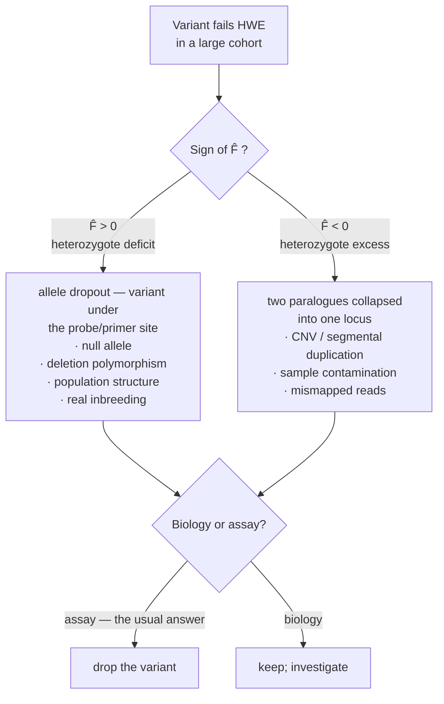

# 26 — Allele frequencies and Hardy–Weinberg

> **Before this:** [Ch 09](../part-02-transmission-genetics/09-mitosis-and-meiosis.md) · [Ch 10](../part-02-transmission-genetics/10-mendelian-inheritance.md) · [Ch 12](../part-02-transmission-genetics/12-probability-and-testing.md) · **Time:** ~35 min
>
> **Statistics needed:** [S2 Distributions](../part-S-statistics/S2-distributions.md) ·
> [S4 Hypothesis testing](../part-S-statistics/S4-hypothesis-testing.md)

Everything so far has tracked alleles through individuals and families. From here the unit of
analysis is the **population**, and the state variable is a vector of frequencies. That single
change of level is what makes evolution computable.

## What you'll be able to do

- Compute allele frequencies from genotype counts, and say precisely why the reverse direction
  requires an assumption that the forward direction does not
- Derive p² + 2pq + q² = 1 from random union of gametes *and* from the full mating table, and
  prove it is a fixed point reached in one generation
- State each of the five assumptions and quantify what happens when it fails
- Test genotype counts against Hardy–Weinberg with the correct degrees of freedom, say when the
  χ² approximation breaks, and compute the power you actually had
- Diagnose a Hardy–Weinberg failure in a genotyped cohort from the sign of *F̂*, and say why the
  prior favours a broken assay over biology
- Derive the X-linked recursion, show that equilibrium is approached by damped oscillation rather
  than reached in one step, and explain male excess for X-linked recessives
- Convert a disease incidence into a carrier frequency, and state the error in the 2*q* shortcut

## The core idea

Take a population, forget who is married to whom, and pour every gamete anyone will ever make
into one enormous bucket. Stir. Draw pairs at random. That bucket — the **gamete pool** — is the
entire model, and its only parameter is the frequency of each allele.

If genotypes are built by drawing two alleles independently from that pool, genotype frequencies
are just the square of the allele-frequency vector. There is nothing more to it. The content of
Hardy–Weinberg is not the algebra; it is the claim that *the pooling is legitimate* — that
knowing which allele a zygote got from its mother tells you nothing about which it got from its
father.

> **Hardy–Weinberg is a null model, not a description of nature.** Every real population
> violates several of its assumptions permanently, and most still fit it closely. Its value is
> exactly the value of any null: it converts a messy observation into a residual. You never
> learn anything from a population being in Hardy–Weinberg equilibrium. You learn from the size,
> the sign, and the cause of the departure.

---

## 1. Allele frequencies and genotype frequencies: only one direction is free

One diploid autosomal locus, two alleles *A* and *a*. Genotype counts *n*<sub>AA</sub>,
*n*<sub>Aa</sub>, *n*<sub>aa</sub> in *N* individuals; genotype frequencies
*P*<sub>AA</sub>, *P*<sub>Aa</sub>, *P*<sub>aa</sub>. Each individual carries two allele copies,
so 2*N* copies exist. Counting the *A* copies:

```
p  =  (2·n_AA + n_Aa) / 2N  =  P_AA + ½·P_Aa
q  =  (2·n_aa + n_Aa) / 2N  =  P_aa + ½·P_Aa        p + q = 1
```

**This direction is arithmetic.** It is an identity — a change of coordinates from a
3-dimensional simplex (2 free parameters) to a 1-dimensional one (1 free parameter). It holds
under selection, inbreeding, migration, population structure, any mating system whatsoever. If
someone hands you genotype counts you can always compute allele frequencies, no assumptions
attached.

**The reverse direction is lossy and therefore requires a model.** You are recovering two
numbers from one. The missing degree of freedom has to come from somewhere, and Hardy–Weinberg
is the assumption that supplies it. Every time you see a carrier frequency computed from a
disease incidence, or an expected heterozygosity computed from allele frequencies, that missing
degree of freedom has been silently filled in.

## 2. Deriving it

### From random union of gametes

Assume gametes unite at random with respect to genotype at this locus. A zygote's maternal
allele is a draw from the pool with P(*A*) = *p*; its paternal allele is an independent draw
from the same pool.

```
                 paternal gamete
                  A  (p)       a  (q)
              ┌────────────┬────────────┐
maternal A (p)│  AA   p²   │  Aa   pq   │
gamete        ├────────────┼────────────┤
         a (q)│  Aa   qp   │  aa   q²   │
              └────────────┴────────────┘

     AA : Aa : aa   =   p²  :  2pq  :  q²
     sum = p² + 2pq + q² = (p + q)² = 1
```

The factor of 2 on the heterozygote is the only place people slip: *Aa* is two distinct
outcomes, maternal-*A*/paternal-*a* and its mirror, and the phenotype cannot tell them apart.

### From the mating table, without the gamete-pool abstraction

The gamete-pool argument can feel like it assumes what it proves. So do it the long way. Let the
*parental* generation have arbitrary genotype frequencies *P*<sub>AA</sub>, *P*<sub>Aa</sub>,
*P*<sub>aa</sub> — nothing near Hardy–Weinberg. Under random mating, mating types occur at the
product of their genotype frequencies. Collect every path to an *AA* offspring:

| Mating | Frequency | Fraction of offspring *AA* | Contribution |
|---|---|---|---|
| AA × AA | *P*<sub>AA</sub>² | 1 | *P*<sub>AA</sub>² |
| AA × Aa (both parental orders) | 2*P*<sub>AA</sub>*P*<sub>Aa</sub> | ½ | *P*<sub>AA</sub>*P*<sub>Aa</sub> |
| Aa × Aa | *P*<sub>Aa</sub>² | ¼ | ¼*P*<sub>Aa</sub>² |

Sum: *P*<sub>AA</sub>² + *P*<sub>AA</sub>*P*<sub>Aa</sub> + ¼*P*<sub>Aa</sub>²
= (*P*<sub>AA</sub> + ½*P*<sub>Aa</sub>)² = **p²**.

No gamete pool required, and no assumption about the parental generation's genotype frequencies.
Random mating plus fair Mendelian segregation is the whole input.

## 3. One generation, then a fixed point

This is the structural fact, and it is what makes the model useful rather than merely true.

**Step 1 — attainment.** The derivation above started from *arbitrary* parental genotype
frequencies and produced *p*², 2*pq*, *q*² in the offspring. So Hardy–Weinberg proportions are
reached after **one generation of random mating**, regardless of history. A population founded
by 100 *AA* individuals and 100 *aa* individuals — zero heterozygotes, maximally out of
equilibrium — is in Hardy–Weinberg proportions in its children.

**Step 2 — persistence.** Random mating does not change allele frequencies. Starting from
Hardy–Weinberg proportions, the next generation's allele frequency is

```
p' = P_AA + ½P_Aa = p² + ½(2pq) = p² + pq = p(p + q) = p
```

*p* is unchanged, so the genotype proportions computed from it are unchanged. Hardy–Weinberg is
a **fixed point**, and it is reached in one step from anywhere in the interior of the simplex.

That combination is unusual and worth pausing on. There is no relaxation time, no burn-in, no
"the population has been evolving long enough". The system is memoryless: genotype frequencies
carry no information about the population's past beyond the single number *p*.

**One caveat that foreshadows the X.** "One generation" assumes the two sexes start with the same
allele frequency. If they do not — say *p* = 0.8 in males and 0.2 in females — the first
generation's offspring are *p*<sub>m</sub>*p*<sub>f</sub> = 0.16 *AA*, 0.68 *Aa*, 0.16 *aa*: a
large heterozygote excess, not Hardy–Weinberg. But both sexes of that generation now share
*p* = ½(0.8 + 0.2) = 0.5, so the *second* generation is 0.25 : 0.50 : 0.25. Unequal sex
frequencies cost exactly one extra generation on an autosome. On the X they cost infinitely
many (§7).

## 4. The five assumptions, and what each one buys

Textbooks list them as a chant. What matters is which step of the derivation each licenses, and
how big the damage is when it fails.

| Assumption | The step it licenses | Failure mode | Magnitude |
|---|---|---|---|
| **Random mating** *w.r.t. this locus* | Independence of the two gamete draws | Inbreeding or assortative mating → heterozygote deficit; disassortative → excess | The only assumption whose failure is routinely large enough to see |
| **No selection** | Genotype frequencies at census = at zygote formation; gametes sampled irrespective of genotype | Differential viability or fertility distorts proportions *and* moves *p* | Tiny for rare alleles. A **fully lethal** recessive at *q* = 0.01 induces exactly *F* = −*q* = −0.0100 |
| **No mutation** | Gamete-pool frequency = parental frequency | *p* drifts toward mutation–selection balance | Δ*p* ~ 10⁻⁸ per generation. Irrelevant on any study timescale |
| **No migration** | The gamete pool is this population's own | Immigrant alleles shift *p*; sampling *across* subpopulations gives the Wahlund effect (§8) | Small if you sample one population; large if you accidentally sample two |
| **Infinite population** | The realised offspring equal their expectations rather than being a multinomial draw | Genetic drift: *p* performs a random walk ([Ch 27](27-the-four-forces.md)) | Does **not** create systematic departure within a generation — expected proportions are still *p*², 2*pq*, *q*² given *p* |

Three usually-unstated assumptions do the rest of the work: **discrete non-overlapping
generations**, **one autosomal locus in a diploid**, and **equal allele frequencies in the two
sexes**.

Two precision points that separate a correct account from the usual one:

**"No selection" means no selection between zygote formation and the moment you census.**
Selection acting on post-reproductive adults is invisible to a Hardy–Weinberg test, and selection
on gametes is not — it changes the pool itself.

**Finite population size does not bias the proportions.** Conditional on *p*, expectations are
still *p*², 2*pq*, *q*². (Strictly, in a finite two-sex population where self-fertilisation is
impossible, there is a heterozygote *excess* of order 1/*N* — negligible above a few dozen
individuals, and in the opposite direction to what people expect.)

## 5. Testing: χ², the exact test, and the power you do not have

Three genotype classes, one parameter (*p*) estimated from the same genotypes, so
**df = 3 − 1 − 1 = 1**. Using df = 2 makes the test conservative and is the single most common
error ([Ch 12 §4](../part-02-transmission-genetics/12-probability-and-testing.md)).

> **Statistics:** the χ² distribution, and why estimating a parameter from the very counts you are
> testing costs a degree of freedom, are covered in
> [S2](../part-S-statistics/S2-distributions.md) §4 and
> [S4](../part-S-statistics/S4-hypothesis-testing.md) §2.

There is a closed form that makes the whole test transparent. Write the **disequilibrium**
*D* = *P*<sub>AA</sub> − *p̂*². Because *p̂* was computed from these very counts, the other two
cells are forced: *P*<sub>Aa</sub> = 2*p̂q̂* − 2*D* and *P*<sub>aa</sub> = *q̂*² + *D*. Substituting
into χ² = Σ(O−E)²/E and collecting:

```
χ² = N·D² [ 1/p̂²  +  2/(p̂q̂)  +  1/q̂² ]
   = N·D² (q̂² + 2p̂q̂ + p̂²) / (p̂²q̂²)
   = N·D² / (p̂²q̂²)
   = N·F̂²          where  F̂ = D/(p̂q̂)
```

So **the Hardy–Weinberg test is a one-parameter test that *F* = 0**, with test statistic
*N F̂*² on 1 df. *F̂* is the standardised heterozygote deficit — the same *F* that §8 introduces
as the inbreeding coefficient. The effective sample size is *N* individuals, not 2*N* alleles.

**The power consequence is brutal.** Non-centrality λ = *N F*²; 80% power at α = 0.05 with 1 df
needs λ ≈ 7.85, so *N* ≈ 7.85/*F*².

> **Statistics:** power, and the non-centrality parameter that turns an effect size into it, are
> covered in [S4](../part-S-statistics/S4-hypothesis-testing.md) §4 — which works this same
> λ = *N F*² case.

| True departure | Induced *F* | *N* for 80% power |
|---|---|---|
| Offspring of full-sib matings | +0.25 | 126 |
| Two populations pooled, *p* = 0.2 and 0.8 | +0.36 | 61 |
| 5% of heterozygotes miscalled as homozygotes | +0.049 | ~3,200 |
| Viability selection *s* = 0.2 against *aa*, *q* = 0.5 | −0.056 | ~2,500 |
| Two populations pooled, *p* = 0.40 and 0.50 | +0.010 | ~77,000 |
| Recessive **lethal**, *q* = 0.01 | −0.0100 | ~78,500 |

The last row is exact rather than rounded, and the identity is worth carrying. Remove every *aa*
zygote and census the survivors: *H*<sub>o</sub> = 2*pq*/(1 − *q*²) = 2*q*/(1 + *q*), the
census-estimated allele frequency is *q̂* = *q*/(1 + *q*), so *H*<sub>e</sub> = 2*q*/(1 + *q*)²
and

```
F = 1 − H_o/H_e = 1 − (1 + q) = −q          (fully lethal recessive)
```

**A fully lethal recessive induces a heterozygote excess equal to its own allele frequency.**

Read the last row twice. An allele that kills every homozygote, at a realistic disease-allele
frequency, needs eighty thousand genotyped people before it perturbs Hardy–Weinberg detectably.
This is the quantitative content of "Hardy–Weinberg is remarkably robust": the model survives
gross violations of its assumptions because the assumptions enter the genotype proportions only
weakly.

### Why the exact test, for rare variants

> **Statistics:** why Σ(O−E)²/E follows a χ² distribution only asymptotically, and why the cell
> counts here are multinomial, are covered in
> [S2](../part-S-statistics/S2-distributions.md) §4.

χ² is an asymptotic approximation to a multinomial, and it fails exactly where genomics lives.
At MAF 0.5% in *N* = 1,000, the expected minor-homozygote count is *Nq*² = **0.025** — a cell
expectation two orders of magnitude below the "at least 5" rule. Observe 991/8/1:

```
p̂ = 0.995      E_AA = 990.025   E_Aa = 9.95   E_aa = 0.025
χ² = 0.00096 + 0.38216 + 38.025 = 38.41        χ²₁ → p ≈ 6 × 10⁻¹⁰
```

The statistic is 99% one cell whose expectation is 0.025. Now ask the exact question instead:
deal 1,990 major and 10 minor alleles at random into 1,000 pairs — how often does at least one
minor–minor pair appear? Each minor allele finds another minor allele with probability
9/1,999, giving 5 × 0.0045 ≈ 0.023 expected minor homozygotes, and

**exact *p* ≈ 0.022.**

The χ² p-value is wrong by roughly **eight orders of magnitude**, in the anti-conservative
direction. Applied genome-wide it would discard a large fraction of perfectly good rare variants.

The standard exact test (Wigginton–Cutler–Abecasis) conditions on *N* and the minor-allele count
*n*<sub>a</sub> and enumerates the null distribution of the heterozygote count directly:

```
P(n_Aa | N, n_a)  =   n_a! · n_A! · N! · 2^(n_Aa)
                     ─────────────────────────────
                      n_AA! · n_Aa! · n_aa! · (2N)!
```

Sum the probabilities of all outcomes no more likely than the observed one. Use it whenever any
expected cell count is small — which for rare variants is always.

## 6. What this is actually used for: a genotyping-error detector

In modern genomics, Hardy–Weinberg testing is overwhelmingly a **quality-control filter**, and
the reasoning is a straightforward application of §5.



Why the prior favours "assay": §5 showed that genuine biological forces induce *F* of order
10⁻² or smaller at realistic allele frequencies, while a few percent of miscalled heterozygotes
induces *F* of comparable size — and at *N* = 10⁵ both become significant, but only one of them
is common. Assay pathologies are ubiquitous; strong selection at a common variant is not.

Practical rules, all of which fall out of the above:

- **Test in controls, not cases.** A variant genuinely associated with disease *should* deviate
  from Hardy–Weinberg among cases — cases are an ascertained, genotype-conditioned sample. Testing
  cases throws away real hits ([Ch 51](../part-11-human-and-statistical-genomics/51-gwas.md)).
- **Test within an ancestry-homogeneous stratum.** Otherwise you are measuring the Wahlund effect
  (§8) at every locus in the genome.
- **Use a very small threshold**, conventionally around *p* < 10⁻⁶ rather than 0.05. With *N* in
  the hundreds of thousands, real structure at *F* ≈ 0.01 clears 0.05 easily; the threshold is
  chosen to catch gross artefacts, not to be a hypothesis test.
- **Use the exact test below MAF ~5%,** and expect variant callers to ship an excess-heterozygosity
  annotation for the paralogue-collapse case ([Ch 46](../part-10-functional-genomics/46-variant-calling.md)).

## 7. Multiple alleles, and the X

### Multiple alleles: multinomial expansion

For *k* alleles at frequencies *p*₁ … *p<sub>k</sub>*, random union of gametes squares the whole
vector:

```
(p₁ + p₂ + … + p_k)²  =  Σ p_i²        (k homozygote classes)
                       + 2 Σ_{i<j} p_i p_j   (k(k−1)/2 heterozygote classes)
```

*k*(*k*+1)/2 genotypes in total. Two consequences used constantly later. The **expected
heterozygosity**

```
H_e = 1 − Σ p_i²
```

is nothing but the Hardy–Weinberg heterozygote total — which is why comparing observed to
expected heterozygosity is the same operation as estimating *F*. And with many alleles, most
individuals are heterozygotes: at 10 equally frequent alleles, *H*<sub>e</sub> = 0.9. This is why
highly polymorphic markers were the workhorse of identity testing.

### X-linked loci: the frequencies differ between the sexes

Now drop the assumption that the sexes share an allele frequency — on the X they cannot, because
of the inheritance asymmetry. Let *p*<sub>f</sub>(*t*) and *p*<sub>m</sub>(*t*) be the frequency
of *A* among X chromosomes in females and males. Males (XY) receive their single X from their
mother; females receive one X from each parent:

```
p_m(t+1) = p_f(t)
p_f(t+1) = ½ [ p_f(t) + p_m(t) ]
```

Females carry two-thirds of all X chromosomes, so the population frequency is the weighted mean
*p̄* = ⅔*p*<sub>f</sub> + ⅓*p*<sub>m</sub>. Check that it is conserved:

```
p̄(t+1) = ⅔·½(p_f + p_m) + ⅓·p_f = ⅓p_f + ⅓p_m + ⅓p_f = ⅔p_f + ⅓p_m = p̄(t)   ✓
```

Now track the **sex difference** *d*(*t*) = *p*<sub>f</sub> − *p*<sub>m</sub>:

```
d(t+1) = p_f(t+1) − p_m(t+1) = ½(p_f + p_m) − p_f = −½ (p_f − p_m) = −½ d(t)

  ⟹   d(t) = (−½)ᵗ · d(0)
```

**The sex difference halves and changes sign every generation.** The X approaches equilibrium by
damped oscillation, never in one step. Solving explicitly:

```
p_f(t) = p̄ + ⅓ (−½)ᵗ d₀          p_m(t) = p̄ − ⅔ (−½)ᵗ d₀
```

Starting from all-*A* females and all-*a* males (*p*<sub>f</sub> = 1, *p*<sub>m</sub> = 0, so
*p̄* = ⅔):

```
 t   :   0       1       2       3       4       5       6
 p_f : 1.000   0.500   0.750   0.625   0.6875  0.65625 0.671875
 p_m : 0.000   1.000   0.500   0.750   0.625   0.6875  0.65625
                    ← alternating either side of p̄ = 0.6667 →
```

Only once *p*<sub>f</sub> = *p*<sub>m</sub> = *p* do females settle into *p*², 2*pq*, *q*².
Males, being hemizygous, are always simply *p* and *q* — there are no male heterozygotes and
therefore no equilibrium for males to reach.

### Male excess, derived

At equilibrium, the frequency of an X-linked **recessive** phenotype is *q* in males and *q*² in
females. The ratio is **1/q**, and it blows up as the allele gets rarer:

| Condition | *q* | Affected males | Affected females | Male : female |
|---|---|---|---|---|
| Red–green colour vision deficiency | ~0.08 | 8% | 0.64% | ~13 : 1 |
| Haemophilia A | ~2 × 10⁻⁴ | 1 in 5,000 | ~1 in 2.5 × 10⁷ | ~5,000 : 1 |

The haemophilia figure is **per male birth** — US surveillance gives 1 in 5,617 male births and
registry meta-analysis ~1 in 4,100, so 1 in 5,000 is the honest round number. The familiar
"1 in 10,000" is per birth counting *both* sexes, and forgetting to halve it is the classic way
this row gets botched: for an X-linked recessive the male frequency **is** *q*, so the both-sexes
figure understates *q* twofold and the female incidence fourfold.

The predicted 0.64% for females is close to the ~0.5% observed in Northern-European-ancestry
populations — good agreement, given that "red–green deficiency" pools variants at two adjacent
opsin genes. Note what this explains and what it does not: the male excess is a **Hardy–Weinberg
consequence**, not a fact about severity or dominance. Any X-linked recessive shows it, and the
rarer the allele the more extreme the ratio ([Ch 13](../part-02-transmission-genetics/13-sex-linkage.md)).

## 8. Departures with names: inbreeding and Wahlund

Both of the systematic departures you will actually meet have the same algebraic form, which is
the reason *F* is worth defining once.

**Inbreeding.** Let *F* be the probability that an individual's two alleles are **identical by
descent**. With probability *F* the second allele is a copy of the first; with probability 1 − *F*
it is an independent draw:

```
P(AA) = p² + Fpq        P(Aa) = 2pq(1 − F)        P(aa) = q² + Fpq
```

Sum = 1, and the allele frequency is untouched: (*p*² + *Fpq*) + ½·2*pq*(1−*F*) = *p*² + *pq* =
*p*. **Inbreeding repackages alleles into genotypes; it does not change allele frequencies.**
Rearranging the middle term gives the estimator used everywhere:

```
F = 1 − H_o/H_e
```

*F* may be negative — heterozygote excess — which is why §6 reads its sign diagnostically.
[Ch 28](28-structure-and-inbreeding.md) develops *F* properly.

**Wahlund effect.** Take two subpopulations, each internally in perfect Hardy–Weinberg, with
frequencies *p*₁ and *p*₂, and pool them in equal numbers. The pooled homozygote frequency is an
average of squares, and an average of squares exceeds the square of the average by the variance:

```
P(AA) = ½(p₁² + p₂²) = E[p²] = p̄² + σ²_p
P(aa) = q̄² + σ²_p
P(Aa) = 1 − P(AA) − P(aa) = 2p̄q̄ − 2σ²_p
```

A heterozygote deficit of exactly 2σ²<sub>p</sub>, with no inbreeding, no selection, and no
non-random mating anywhere in the system. Comparing to the inbreeding form gives

```
F_ST = σ²_p / (p̄ q̄)
```

With *p*₁ = 0.2 and *p*₂ = 0.8: *p̄* = 0.5, σ²<sub>p</sub> = 0.09, pooled heterozygosity
= 0.5 − 0.18 = **0.32** against an expected 0.50, and *F*<sub>ST</sub> = 0.09/0.25 = **0.36**.

> Mixing populations looks exactly like inbreeding. This is not an analogy — it is the same
> equation, because both mechanisms make the two alleles in an individual more correlated than
> two random draws from the pooled bucket. It is the single most common reason a real dataset
> fails Hardy–Weinberg, and the reason population structure must be handled before any
> association test ([Ch 51](../part-11-human-and-statistical-genomics/51-gwas.md)).

---

## Common misconceptions

| What people think | What's actually true |
|---|---|
| Hardy–Weinberg describes real populations | It is a null model. Every real population violates several assumptions permanently and most still fit, because the proportions depend on the assumptions only weakly |
| A population in Hardy–Weinberg is randomly mating | A fit licenses almost nothing. At *N* = 200 you have about 11% power against *F* = 0.05, and you need *N* ≈ 1,000 to reach even 35%. Most failures of the assumptions do not perturb the proportions detectably |
| Reaching equilibrium takes many generations | One generation on an autosome, from anywhere. Two if the sexes start with different allele frequencies. Never exactly, on the X |
| A Hardy–Weinberg test has 2 df — three classes minus one | 1 df. The allele frequency was estimated from the same genotypes ([Ch 12](../part-02-transmission-genetics/12-probability-and-testing.md)) |
| Failing Hardy–Weinberg reveals selection or non-random mating | In modern genomics it almost always reveals a broken assay: allele dropout, collapsed paralogues, contamination, batch effects. Biology is a distant second |
| The direction of the departure doesn't matter | The sign of *F* is the most diagnostic thing in the test. Deficit → dropout, structure, inbreeding. Excess → CNV/paralogue collapse, contamination |
| Selection strong enough to matter will show up as a departure | A fully lethal recessive at *q* = 0.01 induces *F* = −*q* = −0.01 exactly, and needs ~78,500 samples to detect. Selection and Hardy–Weinberg proportions are nearly orthogonal |
| Drift causes departures from Hardy–Weinberg proportions | Drift changes *p* between generations. Conditional on *p*, the expected proportions are still *p*², 2*pq*, *q*² |
| A rare recessive disease means the allele is rare, so carriers are rare | Carriers outnumber affected individuals by 2*p*/*q* ≈ 2/*q*. The rarer the disease, the more lopsided: at incidence 1 in 10⁶, carriers are 2,000× more common than cases |
| You can compute genotype frequencies from allele frequencies | Only under an assumption. Allele-from-genotype is an identity; genotype-from-allele is a model, and Hardy–Weinberg is that model |

## Worked example: from disease incidence to carrier frequency

Cystic fibrosis is autosomal recessive with an incidence of roughly **1 in 2,500** live births in
Northern-European-ancestry populations. What fraction of that population are carriers?

**Step 1 — identify what the incidence measures.** Affected individuals are *aa* homozygotes.
Under Hardy–Weinberg, *P*(*aa*) = *q*². So

```
q² = 1/2500 = 4.0 × 10⁻⁴
```

**Step 2 — solve for the allele frequency.**

```
q = √(4.0 × 10⁻⁴) = 0.02 = 1/50
p = 1 − 0.02 = 0.98
```

**Step 3 — carrier frequency is the heterozygote class.**

```
2pq = 2 × 0.98 × 0.02 = 0.0392 = 1 in 25.5   ≈ 1 in 25
```

Matching the screening figure used in [Ch 12 §6](../part-02-transmission-genetics/12-probability-and-testing.md).

**Step 4 — why the 2*q* shortcut works.** People habitually write "carrier frequency ≈ 2*q*",
here 2 × 0.02 = 0.04 = 1 in 25. Compare exactly:

```
2q / 2pq  =  1/p  =  1/(1 − q)
```

The shortcut **overstates** the carrier frequency by a factor 1/(1−*q*), i.e. by about *q* in
relative terms. At *q* = 0.02 that is a 2% overstatement — invisible against the uncertainty in
the incidence estimate. At *q* = 0.1 it is 11%, and at *q* = 0.3 it is 43% and no longer a
shortcut but an error. **Use 2*q* freely for rare recessives; never for common variants.**

**Step 5 — the ratio worth remembering.**

```
carriers   2pq    2p     2
──────── = ─── =  ──  ≈  ─       = 2 × 0.98/0.02 = 98
affected    q²     q     q
```

About **98 carriers for every affected child**. Equivalently, the fraction of all *a* alleles
sitting in heterozygotes is

```
pq / (pq + q²) = p / (p + q) = p = 0.98
```

**98% of cystic fibrosis alleles are in unaffected carriers.** This single number explains why
selection against a recessive disease is so feeble that it barely moves *q*, why carrier
screening rather than case-finding is the only effective public-health lever, and why recessive
disease alleles persist for thousands of generations ([Ch 27](27-the-four-forces.md)).

**Step 6 — say what was assumed.** All of it rested on *P*(*aa*) = *q*², which imports the whole
Hardy–Weinberg null. Specifically it assumes random mating with respect to *CFTR* (consanguinity
inflates incidence relative to *q*², so this over-estimates *q* where consanguinity is common),
no population structure inside "Northern European" (any structure inflates homozygotes, again
biasing *q* upward), complete ascertainment of affected births, and full penetrance. It also
treats *CFTR* as biallelic when it is not — over 300 pathogenic variants are known, so *q* here
is the summed frequency of a heterogeneous class, and "carrier" means carrier of *any* of them.
That last simplification is exactly the multiple-allele case of §7: pooling *k* − 1 deleterious
alleles into one "*a*" is legitimate for computing *P*(affected) precisely because
(Σ*p<sub>i</sub>*)² expands the way it does.

## Connections

- **Back to:** [Ch 09](../part-02-transmission-genetics/09-mitosis-and-meiosis.md) supplies the
  fair segregation the mating table assumes; [Ch 10](../part-02-transmission-genetics/10-mendelian-inheritance.md)
  supplies the 1:2:1 that becomes *p*²:2*pq*:*q*² once allele frequencies stop being ½;
  [Ch 12](../part-02-transmission-genetics/12-probability-and-testing.md) supplies the χ²
  machinery and the estimated-parameter degrees of freedom;
  [Ch 13](../part-02-transmission-genetics/13-sex-linkage.md) supplies the X inheritance pattern
  that §7 turns into a recursion
- **Forward to:** [Ch 27](27-the-four-forces.md) removes the assumptions one at a time and
  watches *p* move; [Ch 28](28-structure-and-inbreeding.md) develops *F* and *F*<sub>ST</sub>
  from the two special cases in §8; [Ch 29](29-linkage-disequilibrium.md) is this chapter's
  independence assumption applied *between* loci instead of within one;
  [Ch 46](../part-10-functional-genomics/46-variant-calling.md) and
  [Ch 51](../part-11-human-and-statistical-genomics/51-gwas.md) use the test as a QC filter;
  [Ch 54](../part-11-human-and-statistical-genomics/54-rare-variants-and-mendelian-disease.md)
  runs the incidence→carrier calculation in clinical settings

## Check yourself

**1. You genotype 1,000 people and observe 210 *AA*, 580 *Aa*, 210 *aa*. Test Hardy–Weinberg and interpret.**

<details><summary>Answer</summary>

*p̂* = (2×210 + 580)/2000 = 1000/2000 = **0.5**, so *q̂* = 0.5.

Expected: 250, 500, 250. χ² = 1600/250 + 6400/500 + 1600/250 = 6.4 + 12.8 + 6.4 = **25.6** on
**1 df** (three classes, minus one, minus one for the estimated *p*), giving *p* ≈ 4 × 10⁻⁷.

Via the closed form: *D* = 0.21 − 0.25 = −0.04, *F̂* = −0.04/0.25 = **−0.16**, and
χ² = *N F̂*² = 1000 × 0.0256 = 25.6. Same answer, and the sign is now explicit.

*F̂* < 0 is a **heterozygote excess**, which inbreeding and population structure cannot produce.
The diagnosis is an assay artefact: two paralogous copies collapsed into one locus (every
individual carrying one copy of each paralogue is called heterozygous), a copy-number
polymorphism, or sample contamination. Drop the variant and look at the mapping.

</details>

**2. An autosomal recessive condition has an incidence of 1 in 100. Compute the carrier frequency exactly and by the 2*q* shortcut, and say whether the shortcut is acceptable.**

<details><summary>Answer</summary>

*q*² = 0.01 → *q* = **0.1**, *p* = 0.9.

Exact: 2*pq* = 2 × 0.9 × 0.1 = **0.18**, i.e. 18% carriers.

Shortcut: 2*q* = 0.20, i.e. 20%.

The shortcut overstates by a factor 1/(1−*q*) = 1/0.9 = **1.11 — an 11% relative error**. Not
acceptable when the number feeds a risk calculation: an 11% inflation of the partner's carrier
probability propagates straight into the couple's recurrence risk. The shortcut is a
small-*q* approximation and *q* = 0.1 is not small. Note also that at this frequency 90% of
*a* alleles are still in carriers, so the ratio of carriers to affected is 2*p*/*q* = 18.

</details>

**3. A rare variant (MAF 0.4%) in 2,000 samples fails a χ² Hardy–Weinberg test at *p* = 10⁻⁸. Should you drop it?**

<details><summary>Answer</summary>

Not on that evidence. With *q* = 0.004 and *N* = 2,000, the expected minor-homozygote count is
*Nq*² = 2000 × 1.6 × 10⁻⁵ = **0.032**. A single observed minor homozygote contributes
(1 − 0.032)²/0.032 ≈ 29 to χ² all by itself, and the asymptotic χ² distribution is simply not
valid for a cell with that expectation — the approximation is anti-conservative here, so the
p-value is far too small.

Run the exact test conditional on the observed minor-allele count (16 minor alleles in 2,000
people). The chance that at least one of eight minor-allele-carrying pairings is minor–minor is
of order 8 × 15/3999 ≈ 0.03, so the honest p-value is a few percent, not 10⁻⁸. Applying the χ²
test genome-wide at low MAF discards good rare variants wholesale, which is precisely why the
exact test is the standard for this regime.

</details>

**4. An X-linked locus has *p*<sub>f</sub> = 0.9 in females and *p*<sub>m</sub> = 0.3 in males. Give the equilibrium frequency and the next three generations.**

<details><summary>Answer</summary>

Equilibrium: *p̄* = ⅔(0.9) + ⅓(0.3) = 0.6 + 0.1 = **0.7**, and it never changes, because random
mating cannot move allele frequencies.

Recursions: *p*<sub>m</sub>(*t*+1) = *p*<sub>f</sub>(*t*), *p*<sub>f</sub>(*t*+1) =
½[*p*<sub>f</sub>(*t*) + *p*<sub>m</sub>(*t*)].

| *t* | 0 | 1 | 2 | 3 |
|---|---|---|---|---|
| *p*<sub>f</sub> | 0.900 | 0.600 | 0.750 | 0.675 |
| *p*<sub>m</sub> | 0.300 | 0.900 | 0.600 | 0.750 |
| *d* = *p*<sub>f</sub> − *p*<sub>m</sub> | +0.600 | −0.300 | +0.150 | −0.075 |

The difference halves and flips sign each generation, exactly as *d*(*t*) = (−½)ᵗ*d*₀ requires,
so the two sexes oscillate about 0.7 with geometrically decaying amplitude. After ten generations
|*d*| ≈ 0.0006. Equilibrium is approached, never attained in finite time — the contrast with the
one-generation autosomal result is the whole point.

</details>

**5. A colleague genotypes 150 people at a candidate locus, finds no significant Hardy–Weinberg departure, and writes that the population is randomly mating and the locus is not under selection. What is wrong?**

<details><summary>Answer</summary>

Both conclusions invert the logic of a null model, and the sample size makes the test almost
incapable of saying anything at all.

**The power is negligible.** Non-centrality λ = *N F*² = 150 × 0.05² = **0.375** against a
departure of *F* = 0.05, which at α = 0.05 on 1 df gives power ≈ **9%**. A test that rejects 5%
of the time when nothing is happening and 9% of the time when something is has not examined the
hypothesis. Inverting §5's rule, *N* = 150 reaches 80% power only against *F* ≈ √(7.85/150) =
**0.23** — essentially the offspring-of-full-sibs value. Anything gentler than *F* ≈ 0.16 is more
likely to be missed than caught.

**Random mating is the wrong conclusion for a second, structural reason.** Hardy–Weinberg
proportions are restored by **one generation** of random mating from any starting point
whatsoever (§3). Even a perfect fit at enormous *N* would therefore constrain only the *most
recent* generation of mating — it says nothing about the generation before, and a population
that inbred heavily for centuries and then mated at random once is in exact Hardy–Weinberg
proportions.

**"Not under selection" is the wrong conclusion for a third reason:** selection barely enters the
genotype proportions. Viability selection at realistic strength induces |*F*| of order 10⁻², and
the extreme case is a fully lethal recessive, which induces exactly *F* = −*q* — at *q* = 0.01
that is −0.01, needing ~78,500 samples. At *N* = 150 the locus could be under lethal selection
and the test would never know. Selection acting after the census is invisible in principle.

**The correct statement is the boring one:** *the data are consistent with Hardy–Weinberg
proportions*. Absence of evidence is not evidence of absence, and with a null this robust a fit
is close to uninformative — which is why §6 treats Hardy–Weinberg as a detector of gross assay
failure rather than as a test of population-genetic assumptions.

</details>
