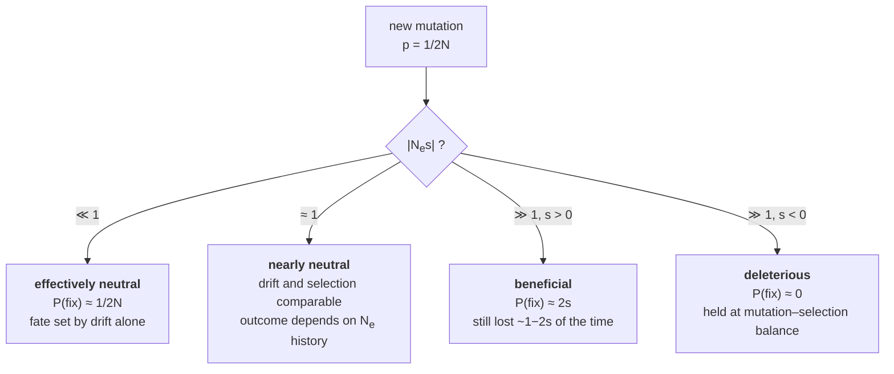

# 27 — The four forces and effective population size

> **Before this:** [Ch 26](26-hardy-weinberg.md) · [Ch 16](../part-03-genome-instability/16-mutation.md) · **Time:** ~55 min

Hardy–Weinberg says nothing changes. This chapter is about the four things that make it
change, how fast each one works, and which one wins when they disagree.

## What you'll be able to do

- Derive the per-generation change in allele frequency under mutation, selection and migration, and the per-generation *variance* under drift
- Derive the equilibrium frequency for overdominance and for mutation–selection balance, in both the recessive and the dominant case, and check the stability of each
- Explain quantitatively why selection against a rare recessive allele is nearly useless, and why the same selection against a dominant allele is fast
- Derive *F*<sub>ST</sub> ≈ 1/(1 + 4*Nm*) from the island model, and explain why one migrant per generation holds two populations together whatever their size
- State and derive the |*N*<sub>e</sub>*s*| criterion, and use it to predict when an allele's biology is irrelevant to its fate
- Define effective population size correctly, compute it under unequal sex ratio, offspring-number variance and fluctuating size, and explain why the harmonic mean is the right average
- Explain what human *N*<sub>e</sub> ≈ 10⁴ does and does not claim about the number of humans who have lived

## The core idea

Chapter 26 established a null model. Random mating, no forces: genotype frequencies snap to
*p*², 2*pq*, *q*² in one generation and stay there forever. That is a fixed point, and it is
boring by construction — its whole purpose is to be violated.

Exactly four processes violate it. **Mutation** creates alleles. **Selection** changes their
frequency according to their consequences. **Migration** imports frequencies from elsewhere.
**Genetic drift** changes them for no reason at all, because a finite population is a finite
sample.

The first three are directional: given the parameters, you can write down Δ*p* and integrate
it. Drift has expectation zero and only a variance. So a population's trajectory is a
stochastic process with a deterministic term and a noise term, and almost every question in
population genetics reduces to their ratio.

> **A population is a noisy optimiser. Selection is the gradient, genetic drift is the
> sampling noise, and *N*<sub>e</sub>·*s* is the signal-to-noise ratio. Below |*N*<sub>e</sub>*s*| ≈ 1 the gradient
> is invisible and what the allele actually *does* stops mattering — which is why the same
> mutation can be under strong selection in a fly and effectively neutral in a human.**

If you have written a stochastic optimiser, you already own the intuition. What you do not
own is the biology-specific part: the noise amplitude is set by *N*<sub>e</sub>, which is not
the number of organisms, and the gradient is filtered through dominance, which decides
whether selection can see the allele at all.

Notation throughout: two alleles *A*₁ and *A*₂ at one autosomal locus, frequencies *p* and
*q* = 1 − *p*, discrete non-overlapping generations, random mating within a population.

---

## 1. Mutation: the only source of novelty, and hopeless on its own

Let μ be the forward rate *A*₁ → *A*₂ per allele copy per generation, and ν the back rate
*A*₂ → *A*₁. Every *A*₁ copy has probability μ of leaving, every *A*₂ copy probability ν of
returning:

```
p' = p(1 − μ) + qν
Δp = p' − p = −μp + νq
```

Substituting *q* = 1 − *p* gives Δ*p* = ν − (μ + ν)*p*, which is linear in *p*, so the
recursion is a contraction with a single fixed point. Setting Δ*p* = 0:

**p̂ = ν/(μ + ν)**, and **q̂ = μ/(μ + ν)** — the equilibrium is the ratio of rates, not of
anything biological.

The approach is geometric. Write *d<sub>t</sub>* = *p<sub>t</sub>* − *p̂*; then
*d<sub>t+1</sub>* = *p<sub>t+1</sub>* − *p̂* = ν − (μ+ν)*p<sub>t</sub>* + *p<sub>t</sub>* − *p̂*
= (1 − μ − ν)*d<sub>t</sub>*, so

```
p_t − p̂ = (p_0 − p̂)(1 − μ − ν)^t          half-life  t½ = ln2/(μ + ν)
```

Now put numbers in it. Per-locus mutation rates are of order 10⁻⁶ to 10⁻⁵ per generation
(a coding sequence of ~1.5 kb, at the pinned genome-wide rate of ~1.3 × 10⁻⁸ per bp per
generation ([verified facts](../reference/verified-facts.md)), takes ~2 × 10⁻⁵ point changes
per generation, a fraction of which inactivate the gene). Take μ + ν = 10⁻⁵:

**t½ ≈ 69,000 generations ≈ 1.9 million years at the pinned human generation time of 27 years
([verified facts](../reference/verified-facts.md)).**

That is the entire lesson. Mutation *alone* is a negligible force on any timescale you care
about. It matters in exactly two ways: it is the sole origin of every allele that any other
force acts on, and it becomes important when paired with something else — with selection
(§3) or with drift (§4, where the compound parameter 4*N*<sub>e</sub>μ governs how much
variation a population carries).

**Assumptions:** infinite population, constant rates, no selection. Drop the first and the
deterministic equilibrium becomes a stationary *distribution* rather than a point.

## 2. Selection: fitness, *s*, *h*, and the general one-locus recursion

**Absolute fitness** *W* is the expected number of offspring an individual of a given
genotype contributes to the next generation — viability × fertility, one number absorbing
survival, mating success and fecundity. Only ratios matter, so we use **relative fitness**
*w* = *W*/*W*<sub>max</sub>. Parameterise:

| Genotype | *A*₁*A*₁ | *A*₁*A*₂ | *A*₂*A*₂ |
|---|---|---|---|
| Frequency (after HWE) | *p*² | 2*pq* | *q*² |
| Relative fitness | 1 | 1 − *hs* | 1 − *s* |

**s** is the **selection coefficient**: the fitness cost of being homozygous *A*₂*A*₂.
**h** is the **dominance coefficient**: the fraction of that cost paid by the heterozygote.
*h* = 0 means *A*₂ is fully recessive (heterozygote unaffected), *h* = 1 fully dominant,
*h* = ½ additive, *h* < 0 overdominant, *h* > 1 underdominant. Dominance is not a property of
the allele — it is a number describing where the heterozygote sits, and it is the single
hardest parameter in this chapter to measure.

Mean fitness is the normaliser:

```
w̄ = p²·1 + 2pq(1 − hs) + q²(1 − s) = 1 − 2pq·hs − q²s
```

Selection reweights genotypes by fitness, then meiosis extracts alleles. The frequency of
*A*₂ after selection is its share of the fitness-weighted gene pool — *A*₂*A*₂ contributes
all its alleles, heterozygotes half:

```
q' = [ q²(1 − s) + pq(1 − hs) ] / w̄  =  q[ q(1 − s) + p(1 − hs) ] / w̄
```

Subtract *q* = *q*·*w̄*/*w̄* and expand the numerator, using *p* + *q* = 1:

```
q·[ q(1−s) + p(1−hs) − w̄ ]
 = q·[ (p+q) − qs − phs − 1 + 2pq·hs + q²s ]
 = q·[ −qs(1 − q) − phs(1 − 2q) ]
 = −pq·s·[ q + h(1 − 2q) ]
```

**Δq = −pq·s·[ q + h(1 − 2q) ] / w̄**

That is the whole of one-locus selection theory. Everything below is a special case.

Two structural facts before the cases. First, the factor *pq* — selection needs variation to
act on, and stops entirely at *q* = 0 or *q* = 1. Second, differentiate *w̄* and compare:

```
dw̄/dq = −2hs(1 − 2q) − 2qs        ⇒        Δq = (pq/2) · d(ln w̄)/dq
```

**Selection is gradient ascent on log mean fitness, with a step size of *pq*/2 — that is,
proportional to the genetic variance available.** This is Wright's adaptive topography, and
it is the seed of the breeder's equation in
[Ch 31](../part-06-quantitative-genetics/31-heritability-and-selection.md). It also
immediately tells you the limits: with a single locus *w̄* increases monotonically, so
selection cannot cross a fitness valley — a fact that returns as underdominance below.

### The four regimes

| Regime | *h* | Δ*q* when *A*₂ is rare (*q* → 0) | Speed |
|---|---|---|---|
| Deleterious recessive | 0 | −*s q*² | **O(q²)** — collapses as *q* falls |
| Deleterious additive | ½ | −*sq*/2 | O(q) — geometric |
| Deleterious dominant | 1 | −*sq* | O(q) — geometric, fastest |
| Overdominant | < 0 | Δ*q* > 0 | pushes toward a stable interior point |
| Underdominant | > 1 | Δ*q* < 0 near 0, > 0 near 1 | interior point is **unstable** |

**Selection against a recessive is the case that matters clinically, and it is brutal.** Set
*h* = 0: Δ*q* = −*pq*²*s*/*w̄*. The *q*² is the whole story — selection can only see *A*₂ in
homozygotes, and homozygotes are *q*² of the population. Equivalently: of the 2*q* copies of
*A*₂ per individual, the fraction sitting in homozygotes is 2*q*²/2*q* = *q*. At *q* = 0.01,
**99% of all copies of the allele are hiding in heterozygotes, invisible to selection.**

Take the most extreme possible case — a fully recessive lethal, *s* = 1, *h* = 0. Then
*w̄* = 1 − *q*², and

```
q' = pq/(1 − q²) = q(1−q)/[(1−q)(1+q)] = q/(1 + q)
⇒  1/q' = 1/q + 1        ⇒        1/q_t = 1/q_0 + t
```

The reciprocal is linear in time. To go from *q*₀ = 0.01 to *q*₁ = 0.005 takes
*t* = 1/0.005 − 1/0.01 = **100 generations** — roughly 2,500 years — of every affected
individual leaving zero offspring. To halve it again: 200 more generations. This is the
quantitative refutation of every proposal to eliminate recessive disease alleles by
discouraging reproduction: the arithmetic says it does not work even under assumptions far
more favourable than reality.

**Selection against a dominant is fast.** With *h* = 1 and *q* small, Δ*q* ≈ −*sq*, so
*q<sub>t</sub>* ≈ *q*₀(1 − *s*)*<sup>t</sup>* — geometric decay with a per-generation factor,
independent of how rare the allele is. Every copy is exposed, because every carrier shows
the phenotype. A dominant lethal (*s* = 1) is gone in one generation.

**Overdominance (heterozygote advantage)** is the case that maintains variation. Reparameterise
so the heterozygote is best: *w*₁₁ = 1 − *s*₁, *w*₁₂ = 1, *w*₂₂ = 1 − *s*₂, both *s* > 0. Then
*w̄* = 1 − *s*₁*p*² − *s*₂*q*², and repeating the algebra above:

```
q' = q(1 − s₂q)/w̄
Δq = q[ (1 − s₂q) − w̄ ]/w̄ = q[ s₁p² − s₂q(1−q) ]/w̄ = pq(s₁p − s₂q)/w̄
```

Setting Δ*q* = 0 with 0 < *q* < 1 requires *s*₁*p* = *s*₂*q*, and with *p* = 1 − *q*:

**q̂ = s₁/(s₁ + s₂)**

It is **stable**: for *q* < *q̂* the bracket *s*₁*p* − *s*₂*q* is positive so *q* rises, and
for *q* > *q̂* it is negative so *q* falls. The equilibrium is a ratio of the two homozygote
costs — the worse homozygote's allele sits at the lower frequency. Worked numerically for
sickle cell below.

**Underdominance** uses the same algebra with the heterozygote *worst*
(*w*₁₂ < both homozygotes). The interior equilibrium exists at the same kind of ratio but the
sign of Δ*q* flips on each side, so it **repels**: whichever allele starts above the threshold
goes to fixation, the other is lost. This is the structure of most chromosomal rearrangements
— a heterozygous inversion or translocation carrier mis-segregates at meiosis
([Ch 20](../part-03-genome-instability/20-chromosome-abnormalities.md)) — and it explains why
a new rearrangement almost never spreads: it must cross a fitness valley, which selection
cannot do. The only route across is drift, which is why rearrangements fix in small or
founder populations and essentially nowhere else.

## 3. Mutation–selection balance

A deleterious allele is removed by selection and recreated by mutation. Equate the two rates.

Per generation, mutation adds Δ*q*<sub>mut</sub> = μ*p* ≈ μ (since *p* ≈ 1 for a rare
deleterious allele; back mutation is negligible against selection). Selection removes
Δ*q*<sub>sel</sub> ≈ −*sq*(*q* + *h*) after setting *p* ≈ 1, *w̄* ≈ 1 and (1 − 2*q*) ≈ 1.
Balance:

```
μ = s·q̂·(q̂ + h)
```

**Recessive case (*h* = 0):**  μ = *s q̂*²  ⇒  **q̂ = √(μ/s)**

**Dominant or partially dominant case (*h* ≫ q̂):**  μ = *s h q̂*  ⇒  **q̂ = μ/(hs)**

The square root in the recessive case is the point. With μ = 10⁻⁶ and *s* = 1, a recessive
sits at *q̂* = 10⁻³ — a carrier frequency 2*q̂* = 1/500, a disease incidence *q̂*² = 1 in a
million. A fully dominant allele with the same μ and *s* sits at *q̂* = 10⁻⁶, a thousandfold
lower. **Recessiveness is a hiding place, and the size of the hiding place is 1/√μ.**

Note the crossover condition carefully. The recessive formula requires *q̂* ≫ *h*, i.e.
*h* ≪ √(μ/*s*) ≈ 10⁻³. Most alleles called "recessive" clinically are not that recessive —
measured *h* for human loss-of-function and disease alleles is typically ~0.05–0.2, not ~0
(genes behind autosomal recessive disease average about 0.2; genome-wide inference for
nonsynonymous mutations puts the strongly deleterious class no lower than ~0.05) — roughly two
orders of magnitude above the 10⁻³ threshold. In that regime the *dominant* formula μ/(*hs*)
governs and the allele is far rarer than √(μ/*s*) predicts. When a mutation–selection
calculation is off by an order of magnitude, mis-specified *h* is the usual culprit.

**Where the model works, and where it doesn't:**

*Achondroplasia* is the textbook success. It is dominant (*h* = 1), reproductive fitness is
roughly 0.2 so *s* ≈ 0.8, and the mutation rate is unusually high — a single hotspot
nucleotide in *FGFR3* with an estimated ~1.4 × 10⁻⁵ per gamete per generation (estimates range
to ~5 × 10⁻⁵), inflated further by selfish selection among spermatogonia. Then

```
q̂ = μ/(hs) = 1.4×10⁻⁵ / 0.8 = 1.75×10⁻⁵
incidence ≈ 2q̂ = 3.5×10⁻⁵ ≈ 1 in 29,000        (observed: ~1 in 15,000–30,000)
```

And a second, sharper prediction falls out for free. At equilibrium, new mutations produce
2μ affected zygotes per zygote, while total incidence is 2μ/*s*; so the **fraction of cases
that are de novo equals *s*** = 0.8. About 80% of achondroplasia cases do arise from new
mutation. A one-line model predicting two independent observables is doing real work.

*Cystic fibrosis* is the instructive failure. Incidence in European-ancestry populations is
~1/2,500, so *q* ≈ 0.02 and the carrier frequency 2*pq* ≈ 1/25. Before modern treatment
*s* ≈ 1. Mutation–selection balance then demands μ = *sq*² = 4 × 10⁻⁴ per generation —
**400-fold higher than any plausible per-locus rate.** The model is not merely imprecise here;
it is refuted. Something else is holding *q* up: heterozygote advantage (cholera, typhoid and
tuberculosis have all been proposed, none convincingly demonstrated), or drift and founder
effects in a historically bottlenecked population — which §7 will argue is a plausible
alternative that does not require any heterozygote advantage. Both remain live.

## 4. Drift: a variance process, not a force

Model a finite population as **Wright–Fisher**: *N* diploid individuals produce an effectively
infinite gamete pool at frequency *p*, and the next generation is 2*N* gametes sampled from it
with replacement. Then the count of *A*₂ alleles is Binomial(2*N*, *p*), and

```
E[p'] = p                        Var(p') = p(1 − p)/(2N)
```

**The expectation is unchanged.** Drift does not push toward loss, toward fixation, or toward
0.5. It has no direction. It is dispersion — over an ensemble of replicate populations the
mean frequency stays put while the distribution spreads, until probability mass piles up
against the absorbing boundaries at 0 and 1.

```
 20 replicate populations, N = 20, p₀ = 0.5, one column per generation
 gen:      0     5    10    20    40    80
 mean p  0.50  0.50  0.49  0.51  0.50  0.50    ← unchanged
 sd(p)   0.00  0.17  0.23  0.31  0.39  0.47    ← grows toward its maximum, 0.5
 fixed    0/20  0/20  1/20  4/20 10/20 17/20   ← mass accumulates at the boundaries
```

**Heterozygosity decays deterministically even though frequency does not.** Take two allele
copies at random from generation *t*+1. With probability 1/(2*N*) they are copies of the same
parental allele and are therefore identical; otherwise they are two independent draws from
generation *t*. So the probability they differ is

```
H_{t+1} = (1 − 1/2N)·H_t        ⇒        H_t = H_0(1 − 1/2N)^t ≈ H_0·e^{−t/2N}
```

**Variation is lost at a rate 1/(2*N*) per generation, and the timescale of drift is 2*N*
generations.** This is the definition that §7 will invert to define *N*<sub>e</sub>.

**Fixation probability of a neutral allele = its current frequency.** Two derivations, both
one line. (i) *Exchangeability*: exactly one of the 2*N* allele copies present today is the
ancestor of every copy in the distant future, and by neutrality each is equally likely; a
fraction *p* of them are *A*₂. (ii) *Martingale*: *p<sub>t</sub>* has constant expectation
and is bounded, so it converges, and the only absorbing states are 0 and 1; hence
*P*(fix)·1 + *P*(loss)·0 = *p*₀.

Consequences worth holding:

- A **new** neutral mutation starts at *p* = 1/(2*N*), so *P*(fix) = 1/(2*N*). At *N* = 10⁴ that is 1 in 20,000. Overwhelmingly, new mutations are lost — and lost fast: with Poisson(1) offspring copies, a new mutation vanishes in its very first generation with probability *e*⁻¹ ≈ 0.37.
- **Neutral substitutions accumulate at rate μ, independent of *N*.** Per generation 2*N*μ new neutral mutations arise, each fixing with probability 1/(2*N*). The *N*s cancel. That is the molecular clock, and [Ch 33](../part-07-molecular-evolution/33-neutral-theory-and-selection-tests.md) is built on it.
- Conditional on fixing, a neutral allele takes on average ≈ **4*N* generations** to get there. At human *N*<sub>e</sub> ≈ 10⁴ that is ~40,000 generations, ~1 million years.

## 5. Migration: how little it takes

**Continent–island model.** Each generation a fraction *m* of the island's gene pool is
replaced by immigrants from a large mainland with frequency *p*<sub>m</sub>:

```
p' = (1 − m)p + m·p_m          Δp = −m(p − p_m)
p_t − p_m = (p_0 − p_m)(1 − m)^t
```

Same geometric structure as mutation, same fixed point logic — but *m* is typically 10⁻²
to 10⁻³, two to four orders of magnitude larger than the per-locus μ of §1. At *m* = 0.01 the
difference between island and mainland halves every ln2/*m* ≈ 69 generations. **Migration is a
fast homogeniser.**

Now the fact that surprises people. Drift pushes two populations apart at rate ~1/(2*N*);
migration pulls them together at rate *m*. Balance them properly. Wright's **island model**: a
large number of demes, each of size *N*, each drawing a fraction *m* of its genes each
generation from the pool at large.

Let *f* be the probability that two allele copies drawn from the *same* deme are **identical by
descent** — that they trace back to one ancestral copy with no migration event in between. Two
things have to happen. First, neither lineage arrived as an immigrant in the previous
generation: probability (1 − *m*)². Second, given both are resident, they either came from the
same parental copy — probability 1/(2*N*), the drift rate of §4, in which case they are
identical by descent for certain — or from different copies, probability 1 − 1/(2*N*), in which
case they are identical with the previous generation's probability *f*. So

```
f' = (1 − m)²·[ 1/(2N) + (1 − 1/(2N))·f ]
```

Set *f*′ = *f* for the equilibrium and write λ = (1 − *m*)². The recursion is linear in *f*, so

```
f = λ / [ 2N(1 − λ) + λ ]
```

Now use *m* ≪ 1: λ ≈ 1 − 2*m*, hence 1 − λ ≈ 2*m*, and the denominator becomes 4*Nm* + 1. That
is it:

```
F_ST ≈ 1/(1 + 4Nm)
```

This *f* **is** *F*<sub>ST</sub>: it is the homozygosity a deme carries in excess of the
metapopulation, which is exactly what
[Ch 28](28-structure-and-inbreeding.md) §7 (coming next) defines *F*-statistics to measure.
The approximation error tracks *m*, not *Nm* — about 1.5% at *m* = 0.01 — so it is safe
wherever migration is a small fraction of the deme per generation, which is the only regime the
model is about.

The parameter is ***Nm* — the absolute number of migrants per generation — not the
proportion *m*.** A population of 100 and a population of 10⁷ both need the same *number* of
immigrants to stay genetically homogeneous with their neighbours.

| *Nm* (migrants/generation) | *F*<sub>ST</sub> |
|---|---|
| 0.1 | 0.71 — strong divergence |
| 1 | 0.20 — modest divergence |
| 10 | 0.024 — effectively one population |

**One migrant per generation** — one individual, whatever the population size — holds
*F*<sub>ST</sub> near 0.2 and prevents drift-driven divergence from running away. This is why
genetic differentiation between human populations is small, and why conservation genetics
worries about corridors rather than absolute isolation —
[Ch 35A §7](../part-07-molecular-evolution/35A-speciation-and-ecological-genetics.md) makes that
a management decision, and the Isle Royale wolves are what happens when the migrant arrives once
instead of every generation.

## 6. The inequality that decides everything: |*N*<sub>e</sub>*s*|

Selection is deterministic and drift is stochastic, so their relative importance depends on
the timescale you compare them over. Do it properly.

**Scaling argument.** Over *T* generations, selection's cumulative deterministic change is
about *T·s·pq*. Drift's cumulative standard deviation is about √(*T·pq*/2*N*) — a random walk
with per-step variance *pq*/2*N*. The relevant *T* is the timescale on which drift resolves
anything, namely *T* ≈ 2*N* (§4). Substituting:

```
selection:  2N·s·pq            drift:  √(pq)
ratio    ≈  2Ns·√(pq)   →   order Ns
```

Note this is *not* the same as the per-generation ratio, which scales as *s*√*N*. The
compound parameter is *Ns* because drift needs 2*N* generations to act, and selection gets
all of them.

**Diffusion argument (exact).** Kimura's fixation probability for an allele at frequency *p*
under genic selection, with α ≡ 4*N*<sub>e</sub>*s* the **scaled selection coefficient**:

```
u(p) = (1 − e^{−αp}) / (1 − e^{−α})
```

Everything depends on *p* and α alone — *N*<sub>e</sub> and *s* never appear separately. Take
the two limits.

*Strong selection, α ≫ 1.* The denominator → 1 and for a new mutation *p* = 1/(2*N*),
*u* ≈ 1 − *e*<sup>−2*s*</sup> ≈ **2*s***. Haldane's result: a new beneficial mutation with a
1% advantage fixes with probability ~2%, and is lost 98% of the time. Compared with the
neutral 1/(2*N*), selection has multiplied its chances by ~4*N*<sub>e</sub>*s*.

*Weak selection, |α| ≪ 1.* Expand both exponentials to second order:

```
u(p) ≈ [αp − (αp)²/2] / [α − α²/2] = p(1 − αp/2)/(1 − α/2) ≈ p·[1 + (α/2)(1 − p)]
```

The fractional deviation from the neutral answer *u* = *p* is of order α/2 = **2*N*<sub>e</sub>*s***.

> When |*N*<sub>e</sub>*s*| ≪ 1 an allele behaves exactly as if it were neutral, no matter what
> it does to the organism. When |*N*<sub>e</sub>*s*| ≫ 1 drift is a rounding error and the
> deterministic equations of §2 are accurate. The band around |*N*<sub>e</sub>*s*| ≈ 1 is the
> **nearly neutral** zone, and it is where most functionally relevant variation actually sits.



The consequences are large and not intuitive:

- **The selection threshold is set by the population, not the allele.** Selection cannot resolve |*s*| below ~1/(2*N*<sub>e</sub>). For humans (*N*<sub>e</sub> ≈ 10⁴) that is ~5 × 10⁻⁵; for *Drosophila* (*N*<sub>e</sub> ≈ 10⁶) it is ~5 × 10⁻⁷. A mutation with *s* = −10⁻⁵ is invisible in humans and efficiently purged in flies.
- **Small populations accumulate slightly deleterious variation.** Reduce *N*<sub>e</sub> and you widen the band of alleles that behave neutrally. This is the mechanistic core of the nearly neutral theory, of why endangered species carry mutational load, and of the argument that eukaryotic genomes bloated with transposable elements and introns because their *N*<sub>e</sub> was too small for selection to see the cost ([Ch 39](../part-09-genomics/39-genome-landscapes.md)).
- **The same allele changes category over time**, because *N*<sub>e</sub> changes. An allele neutral through a bottleneck can become visible to selection afterwards.

## 7. Effective population size

Everything above used *N* as if it were the number of organisms. It is not. Define:

> ***N*<sub>e</sub> is the size of an ideal Wright–Fisher population that would experience the
> same rate of drift as the population in question.**

"The same rate of *what*" needs specifying, and the answers differ:

| Flavour | Defined by | Formula |
|---|---|---|
| **Variance** *N*<sub>e</sub> | matching Var(Δ*p*) | *N*<sub>e</sub> = *pq*/(2·Var(Δ*p*)) |
| **Inbreeding** *N*<sub>e</sub> | matching the rate of heterozygosity loss | 1/(2*N*<sub>e</sub>) = −Δ*H*/*H* |
| **Coalescent** *N*<sub>e</sub> | matching the expected time to common ancestry | *E*[*T*₂] = 2*N*<sub>e</sub> |

They coincide for an ideal constant population and diverge otherwise — a real source of
confusion when comparing estimates across papers.

### Why *N*<sub>e</sub> < *N*

**Unequal sex ratio.** Every autosomal allele in an offspring came half from a male and half
from a female, so the sexes contribute equally to the gene pool regardless of their numbers.
The rarer sex is a bottleneck:

```
N_e = 4·N_m·N_f/(N_m + N_f)
500 males + 500 females  →  N_e = 1,000    (= N)
 10 males + 990 females  →  N_e = 4·10·990/1000 = 39.6
```

A thousand breeding adults with ten breeding males drifts like a population of forty.

**Variance in reproductive success.** Wright–Fisher assumes offspring number is Poisson, so
*V<sub>k</sub>* = *k̄* = 2 in a constant population. For general *V<sub>k</sub>*:

```
N_e ≈ (4N − 2)/(V_k + 2)
V_k = 2  (Poisson, ideal)  →  N_e ≈ N
V_k = 10 (harems, sweepstakes reproduction) →  N_e ≈ N/3
V_k = 0  (every adult contributes exactly 2) →  N_e ≈ 2N
```

Note the last row: ***N*<sub>e</sub> can exceed *N***, if reproduction is more even than random.
Managed breeding programmes exploit exactly this.

**Fluctuating size — and why the harmonic mean.** This is the one to internalise, and it
falls straight out of §4. Heterozygosity multiplies across generations:

```
H_t/H_0 = Π_i (1 − 1/2N_i) ≈ exp(−Σ_i 1/(2N_i))
```

Equate to the ideal population's exp(−*t*/2*N*<sub>e</sub>):

```
t/N_e = Σ_i 1/N_i        ⇒        1/N_e = (1/t)·Σ_i 1/N_i     ← harmonic mean
```

Drift accumulates as a **sum of reciprocals**, so a single small generation dominates
everything around it. Sizes 1,000 / 1,000 / 10 / 1,000 / 1,000 have arithmetic mean 802 and

```
(1/5)(0.001 + 0.001 + 0.1 + 0.001 + 0.001) = 0.0208   →   N_e = 48
```

**One crash generation to 10 individuals makes a population of ~800 drift like a population
of 48.** Harmonic means ignore large values; a population's genetic memory is a record of its
worst moments.

**Non-random mating and structure.** Inbreeding reduces the effective number of independently
sampled gametes, roughly *N*<sub>e</sub> ≈ *N*/(1 + *F*)
([Ch 28](28-structure-and-inbreeding.md)). Subdivision cuts both ways: it lowers *N*<sub>e</sub>
locally within demes while *raising* the species-wide coalescent *N*<sub>e</sub>, because
lineages in different demes take a long time to meet.

**Linked selection.** A selective sweep or ongoing purifying selection removes neutral variants
hitchhiking nearby, which locally looks exactly like a reduced *N*<sub>e</sub>. So
*N*<sub>e</sub> is not even constant along a chromosome: it dips in regions of low recombination
and high gene density ([Ch 33](../part-07-molecular-evolution/33-neutral-theory-and-selection-tests.md)).

### Human *N*<sub>e</sub> ≈ 10⁴ versus 8 billion

Estimate it from diversity. At neutral drift–mutation equilibrium, nucleotide diversity is
θ = 4*N*<sub>e</sub>μ. Two random human haploid genomes differ at roughly 0.8–1.0 per 1,000
sites, and the pinned germline rate is ~1.3 × 10⁻⁸ per bp per generation
([verified facts](../reference/verified-facts.md)):

```
N_e = θ/(4μ) = 0.0009 / (4 × 1.3×10⁻⁸) ≈ 1.7 × 10⁴
```

Order 10⁴, consistent with the 10,000–20,000 range from independent sequence-based estimates.
The census population is ~8 × 10⁹, so *N*<sub>e</sub>/*N* ≈ 10⁻⁶.

**What that does not mean.** It is not a claim that only 10,000 humans were ever alive at once.
*N*<sub>e</sub> here is a harmonic-mean-like summary over hundreds of thousands of years of
history dominated by small, structured, fluctuating populations — and harmonic means are
insensitive to large values, so the last few thousand years of explosive growth contribute
almost nothing to it. It is also inflated by ancient population structure, which lengthens
coalescence times without any single population ever being large.

Two consequences that matter downstream. First, **humans are genetically depauperate for a
large mammal** — two humans from opposite sides of the world are more similar than two
chimpanzees from neighbouring forests. Second, the *recent* explosion has generated an enormous
excess of very rare variants that the equilibrium *N*<sub>e</sub> does not describe at all:
most human variation is young, rare, and population-specific, which is precisely why rare-variant
association is hard ([Ch 54](../part-11-human-and-statistical-genomics/54-rare-variants-and-mendelian-disease.md))
and why polygenic scores transfer poorly across populations
([Ch 53](../part-11-human-and-statistical-genomics/53-polygenic-scores.md)).

> **The three corrections above are not alternatives — they multiply.** Applied together to real
> wildlife populations they land on a ratio *N*<sub>e</sub>/*N* of about **0.1**, so a census of
> 500 breeding adults drifts and inbreeds like 50.
> [Ch 35A §7](../part-07-molecular-evolution/35A-speciation-and-ecological-genetics.md) does that
> arithmetic on a managed population, chains it to Δ*F* = 1/(2*N*<sub>e</sub>), and turns it into
> the decision the numbers exist for.

### Bottlenecks and founder effects

A **bottleneck** is a sharp temporary reduction in *N*. A **founder effect** is the special case
where a new population is established by a few individuals. Both are *N*<sub>e</sub> events, and
both leave a characteristic asymmetric signature.

Consider a crash to *N* = 10 (20 gametes) for one generation:

- **Heterozygosity** falls by only 1/(2*N*) = **5%**.
- An allele at frequency *q* = 0.01 is **lost entirely** with probability (1 − 0.01)²⁰ = **82%**.

Bottlenecks destroy allelic richness far faster than they destroy heterozygosity, because rare
alleles carry almost no heterozygosity but are the overwhelming majority of alleles. Detecting
recent bottlenecks exploits exactly this discrepancy: an excess of heterozygosity relative to
the number of alleles observed.

Founder effects also *shift* frequencies permanently, not just reduce them. A variant that was
rare in the source population can be common in the founders by chance, and then rides the new
population's growth. This is the documented origin of the Finnish disease heritage, of the
*BRCA1* and Tay–Sachs founder alleles in Ashkenazi Jewish populations, and of Ellis–van Creveld
syndrome among the Old Order Amish — and it is one of the two live explanations, alongside
heterozygote advantage, for the cystic fibrosis frequency that §3 showed mutation–selection
balance cannot produce.

---

## Common misconceptions

| What people think | What's actually true |
|---|---|
| Evolution means selection | Selection is one of four forces. Most molecular evolution is drift acting on variants that do nothing ([Ch 33](../part-07-molecular-evolution/33-neutral-theory-and-selection-tests.md)) |
| Drift pushes alleles toward loss, or toward 0.5 | *E*[*p*′] = *p*. Drift has zero mean and only variance. Alleles are lost often because 0 is absorbing and most alleles start near it, not because drift aims there |
| Selection eliminates harmful recessive alleles | At *q* = 0.01, 99% of copies hide in heterozygotes. Halving the frequency of a fully recessive **lethal** takes 100 generations. Selection sees *q*², not *q* |
| A dominant lethal disappears, so dominant disease alleles are vanishingly rare | They persist at μ/(*hs*) and are continually recreated. Achondroplasia is dominant, largely fitness-reducing, and still ~1 in 25,000 — because ~80% of cases are new mutations |
| *N*<sub>e</sub> ≈ the number of breeding adults | It is a harmonic mean over time, discounted by sex ratio and reproductive variance. It is routinely 10–100× below *N*, occasionally above it |
| Human *N*<sub>e</sub> = 10,000 means only 10,000 humans existed | It is a summary statistic of drift across deep time, dominated by the smallest and most structured epochs. Census size today is irrelevant to it |
| A small proportion of migrants can't stop populations diverging | *F*<sub>ST</sub> depends on *Nm*, not *m*. One migrant per generation holds *F*<sub>ST</sub> ≈ 0.2 at any population size |
| Selection maintains genetic variation | Usually it removes it — both directional selection and purifying selection reduce diversity. Overdominance maintains it but is genuinely rare; unambiguous examples are few |
| A beneficial mutation will spread | A new mutation with *s* = 0.01 is lost ~98% of the time. Selection changes odds, it does not guarantee outcomes |
| Mutation rates explain allele frequencies | Mutation alone moves frequencies with a half-life of ~10⁵ generations. It sets frequencies only in balance with selection or drift |

## Worked example: sickle cell, with and without malaria

The *HBB* allele *Hb*<sup>S</sup> causes sickle cell disease in homozygotes and confers
resistance to *falciparum* malaria in heterozygotes. Classic estimates from malaria-endemic
West Africa (approximate, and historical — they vary by region and era):

```
w(AA) = 0.89     w(AS) = 1.00     w(SS) = 0.20
s₁ = 1 − 0.89 = 0.11   (cost of AA: malaria)
s₂ = 1 − 0.20 = 0.80   (cost of SS: sickle cell disease)
```

**Step 1 — equilibrium.**  *q̂* = *s*₁/(*s*₁ + *s*₂) = 0.11/0.91 = **0.1209**.

Observed *Hb*<sup>S</sup> frequencies in high-transmission regions run ~0.10–0.15. The model
lands inside the observed range from two fitness measurements.

**Step 2 — verify it is stable.** Use Δ*q* = *pq*(*s*₁*p* − *s*₂*q*)/*w̄* with
*w̄* = 1 − *s*₁*p*² − *s*₂*q*².

At *q* = 0.05, *p* = 0.95:
```
s₁p = 0.11 × 0.95   = 0.1045
s₂q = 0.80 × 0.05   = 0.0400        bracket = +0.0645
w̄   = 1 − 0.11(0.9025) − 0.80(0.0025) = 1 − 0.099275 − 0.002 = 0.898725
Δq  = 0.95 × 0.05 × 0.0645 / 0.898725 = 0.00306375/0.898725 = +0.00341
```
At *q* = 0.20, *p* = 0.80:
```
s₁p = 0.11 × 0.80   = 0.0880
s₂q = 0.80 × 0.20   = 0.1600        bracket = −0.0720
w̄   = 1 − 0.11(0.64) − 0.80(0.04)  = 1 − 0.0704 − 0.0320 = 0.8976
Δq  = 0.80 × 0.20 × (−0.0720)/0.8976 = −0.01152/0.8976 = −0.01284
```
Below *q̂* it rises, above *q̂* it falls. Stable, as derived.

**Step 3 — the cost.** At equilibrium, *p̂* = 0.8791:
```
w̄ = 1 − 0.11(0.8791²) − 0.80(0.1209²)
  = 1 − 0.11(0.772854) − 0.80(0.014617)
  = 1 − 0.085014 − 0.011694 = 0.9033
```
Mean fitness is 0.903: a **genetic load of 9.7%**, paid every generation. Concretely,
*q̂*² = 0.0146 of newborns are *SS* — **1 in 68 births** with sickle cell disease. This is what
"heterozygote advantage" costs. Overdominance does not optimise anything; it parks the
population at the top of a fitness hill whose summit is well below either homozygote's best case.

**Step 4 — remove malaria.** Set *s*₁ = 0. The equilibrium collapses to *q̂* = 0, and Δ*q*
becomes −*s*₂*pq*²/*w̄* — pure selection against a recessive. Integrating
d*q*/d*t* ≈ −*s*₂*q*²(1 − *q*), with antiderivative −1/*q* + ln[*q*/(1−*q*)]:

```
from q = 0.1209 → 0.0605:
  [−1/0.1209 + ln(0.1209/0.8791)] = −8.2713 − 1.9839 = −10.2552
  [−1/0.0605 + ln(0.0605/0.9395)] = −16.5289 − 2.7420 = −19.2709
  Δ = −9.016 = −s₂·t     ⇒     t = 9.016/0.80 ≈ 11 generations

from q = 0.0100 → 0.0050 (same s₂, same process):
  [−1/0.01 + ln(0.01/0.99)]   = −100.000 − 4.595 = −104.595
  [−1/0.005 + ln(0.005/0.995)]= −200.000 − 5.293 = −205.293
  Δ = −100.70 = −s₂·t    ⇒     t = 100.70/0.80 ≈ 126 generations
```

**The first halving takes 11 generations; a halving at *q* = 0.01 takes 126 — with identical
selection.** That factor of eleven is the *q*² term making itself felt, and it is why
populations that left malarial regions generations ago still carry *Hb*<sup>S</sup> at
appreciable frequency. Selection against recessives is fast where the allele is common and
grinds to a halt exactly where you would want it to work.

## Connections

- **Back to:** [Ch 26](26-hardy-weinberg.md) supplies the null this chapter perturbs; [Ch 16](../part-03-genome-instability/16-mutation.md) supplies μ and where it comes from; [Ch 09](../part-02-transmission-genetics/09-mitosis-and-meiosis.md) supplies the meiotic sampling that makes drift binomial; [Ch 10](../part-02-transmission-genetics/10-mendelian-inheritance.md) supplies dominance, which reappears here as *h*
- **Forward to:** [Ch 28](28-structure-and-inbreeding.md) defines *F*<sub>ST</sub> and *F* in general — §5 here derives only the island-model special case — and applies them to real population structure; [Ch 29](29-linkage-disequilibrium.md) adds a second locus, so that drift and selection act on haplotypes; [Ch 31](../part-06-quantitative-genetics/31-heritability-and-selection.md) generalises Δ*q* = (*pq*/2)·d ln *w̄*/d*q* to the breeder's equation; [Ch 33](../part-07-molecular-evolution/33-neutral-theory-and-selection-tests.md) turns |*N*<sub>e</sub>*s*| into statistical tests on real sequence; [Ch 35A §7](../part-07-molecular-evolution/35A-speciation-and-ecological-genetics.md) spends this chapter on a population that might actually go extinct — §7's three corrections compounded into *N*<sub>e</sub>/*N* ≈ 0.1, §5's one-migrant-per-generation restated as a genetic-rescue target, and §6's |*N*<sub>e</sub>*s*| ≳ 1 as the reason a small population cannot purge its own load; [Ch 51](../part-11-human-and-statistical-genomics/51-gwas.md) and [Ch 53](../part-11-human-and-statistical-genomics/53-polygenic-scores.md) inherit the consequences of human *N*<sub>e</sub>

## Check yourself

**1. A fully recessive lethal sits at *q* = 0.02. A policy prevents every affected individual from reproducing (already true — they die before reproducing). How many generations to halve the allele frequency, and what does that tell you?**

<details><summary>Answer</summary>

With *s* = 1, *h* = 0 the recursion is 1/*q<sub>t</sub>* = 1/*q*₀ + *t*, so
*t* = 1/0.01 − 1/0.02 = 100 − 50 = **50 generations** (~1,250 years). The policy is also doing
nothing new: selection is *already* operating at full strength, because affected individuals
already fail to reproduce. The allele persists because at *q* = 0.02, a fraction
*q* = 2% of copies are in homozygotes and 98% are in heterozygotes that selection cannot see.
Screening carriers would change the arithmetic; selecting against affected individuals cannot.

</details>

**2. Two alleles have *s* = −10⁻⁵ (mildly deleterious). One is segregating in a human population (*N*<sub>e</sub> ≈ 10⁴), one in a *Drosophila* population (*N*<sub>e</sub> ≈ 10⁶). Predict their fates.**

<details><summary>Answer</summary>

Compute 4*N*<sub>e</sub>*s*. Human: 4 × 10⁴ × (−10⁻⁵) = −0.4, so |α| < 1 — **effectively
neutral**. Its fixation probability is within ~20% of the neutral 1/(2*N*<sub>e</sub>) and its
trajectory is a random walk; it may well fix. *Drosophila*: 4 × 10⁶ × (−10⁻⁵) = −40, so
|α| ≫ 1 — **efficiently purged**, held at mutation–selection balance, essentially never fixes.
Identical molecular consequence, opposite outcome, and the difference is entirely
*N*<sub>e</sub>. This is the nearly neutral theory, and it predicts that species with small
*N*<sub>e</sub> accumulate mildly deleterious variation and bloated genomes.

</details>

**3. A population has census sizes 5,000 / 5,000 / 5,000 / 50 / 5,000 / 5,000 over six generations, an even sex ratio and Poisson reproduction. What is *N*<sub>e</sub>, and why is the arithmetic mean the wrong answer?**

<details><summary>Answer</summary>

Harmonic mean: (1/6)(5 × 1/5000 + 1/50) = (1/6)(0.001 + 0.02) = (1/6)(0.021) = 0.0035, so
*N*<sub>e</sub> = **286**. The arithmetic mean is 4,175 — wrong by a factor of ~15.

The reason is structural, not a convention: drift is measured by loss of heterozygosity, which
*multiplies* across generations as Π(1 − 1/2*N<sub>i</sub>*) ≈ exp(−Σ 1/2*N<sub>i</sub>*). Because
the accumulated quantity is a sum of **reciprocals**, small *N<sub>i</sub>* dominates and large
*N<sub>i</sub>* contributes almost nothing. A population's drift history is set by its worst
generations. This is the same reason human *N*<sub>e</sub> ≈ 10⁴ despite 8 billion people alive
today.

</details>

**4. Overdominance maintains polymorphism. Why, then, is it a rare explanation for observed variation rather than the default one?**

<details><summary>Answer</summary>

Because it is expensive and fragile. At equilibrium the population pays a permanent genetic
load — for sickle cell, mean fitness 0.903 and 1 in 68 births with a severe disease. Any
mutation that delivers the heterozygote's benefit without the homozygote's cost will invade and
destroy the polymorphism, so overdominance is an evolutionarily unstable solution that persists
only where no such mutation has appeared. It also requires *w*₁₂ to exceed *both* homozygotes,
a stringent condition. Most observed molecular polymorphism is better explained by drift on
near-neutral variants, or by mutation–selection balance, or by selection that varies in space and
time. Empirically, well-documented single-locus overdominance in humans is close to a list of
one.

</details>

**5. A GWAS finds a variant with a large effect on a fitness-relevant trait at 30% frequency in the population. Why should that combination make you suspicious, and what are the legitimate explanations?**

<details><summary>Answer</summary>

Suspicious because §2 and §3 say it should not exist. A truly large fitness effect at
*N*<sub>e</sub> = 10⁴ gives |*N*<sub>e</sub>*s*| ≫ 1, so selection is deterministic and
mutation–selection balance would hold the deleterious allele near μ/(*hs*) — orders of magnitude
below 30%. Common variants of large fitness effect are the combination population genetics
forbids.

Legitimate explanations, roughly in order of likelihood: (i) the effect on the *trait* is large
but the effect on *fitness* is not — most GWAS traits are only loosely coupled to reproductive
success, especially in modern environments; (ii) the variant is recent and rising, not at
equilibrium; (iii) antagonistic pleiotropy or environment-dependent effects, so *s* averages near
zero; (iv) the effect size is inflated by winner's curse or by confounding with population
structure ([Ch 51](../part-11-human-and-statistical-genomics/51-gwas.md)); (v) genuine balancing
selection, which is real but rare. The population-genetic prior is a useful sanity check on
effect-size claims, and it fails loudly in the right direction.

</details>
