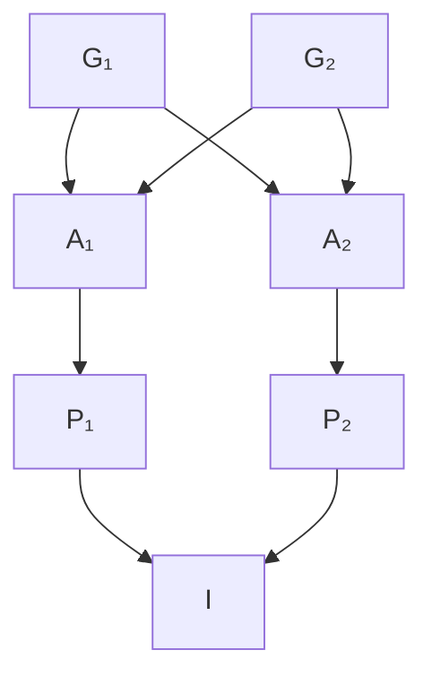

# 28 — Population structure and inbreeding

> **Before this:** [Ch 26](26-hardy-weinberg.md) · [Ch 27](27-the-four-forces.md) · **Time:** ~45 min
>
> **Statistics needed:** [S3 Sampling and estimation](../part-S-statistics/S3-sampling-and-estimation.md) ·
> [S5 Variance and regression](../part-S-statistics/S5-variance-and-regression.md) ·
> [S7 High-dimensional data](../part-S-statistics/S7-high-dimensional-data.md)

Hardy–Weinberg assumed one population mating at random. Neither half of that is ever true.
People mate with relatives more often than chance dictates, and the "population" you sampled
is nearly always a bag of partly separated groups. Both violations produce the *same*
statistical signature, both are summarised by the *same* coefficient, and failing to model
either is the single most common way to get a wrong answer out of human genetic data.

## What you'll be able to do

- Compute the inbreeding coefficient *F* from any pedigree loop by path counting, and say what
  the number is measured relative to
- Derive genotype frequencies under inbreeding, predict both the heterozygote deficit and the
  shift in mean phenotype, and quantify how much a cousin marriage raises recessive disease risk —
  in relative terms and in absolute terms, which differ enormously
- Read a run-of-homozygosity profile and infer how many generations back the shared ancestor sat
- Derive the Wahlund heterozygote deficit, and define *F*<sub>IS</sub>, *F*<sub>ST</sub>,
  *F*<sub>IT</sub> and prove they chain
- Distinguish what *F*<sub>ST</sub> ≈ 0.12 among human continental groups does license from what
  it does not, and explain why Lewontin's variance partition and Edwards' classification argument
  are both correct
- Classify what PCA, ADMIXTURE, an *F*<sub>ST</sub> outlier scan and local-ancestry inference each
  actually measure, and diagnose the artefact each is prone to — smooth gradients and
  sampling-induced clusters, an arbitrary *K*, and heavy tails manufactured by demography
- Explain, as an ordinary omitted-variable problem, why unmodelled structure inflates GWAS false
  positives *more* as sample size grows

## The core idea

Two alleles at a locus can look alike for two different reasons. They can be the same by
coincidence — the same mutation arose twice, or the variant is simply common. Or they can be
the same because they are physical copies of one ancestral molecule, descending through a loop
in the pedigree. Only the second kind carries information about ancestry, and only the second
kind drags along the entire surrounding chromosome.

The inbreeding coefficient *F* is the probability that an individual's two alleles at a randomly
chosen locus are copies of one ancestral allele. That single probability is enough to derive
genotype frequencies, disease risk, the expected length of homozygous chromosome tracts, and
the amount of trait depression. And when you pool distinct groups into one sample, you get a
number with exactly the same algebra.

> **Inbreeding and population structure are the same phenomenon at different scales.** Both are
> non-random mating that makes an individual's two alleles more likely to be identical by
> descent than a random pair drawn from the population. One *F* describes both, and at a single
> locus nothing in the data can tell them apart.

---

## 1. Identity by descent, and why "identical" is not enough

**Identity by state (IBS)** — two alleles have the same sequence. That is all it says. Two
copies of the reference allele at a common SNP are IBS, and so are three billion other people's.

**Identity by descent (IBD)** — two alleles are copies of a single allele in a specific shared
ancestor, with an unbroken chain of replication between.

IBD implies IBS (barring a mutation on the path). IBS emphatically does not imply IBD. The
distinction is what makes *F* a coherent quantity, and it carries a caveat that trips people up:

**IBD is only defined relative to a chosen base population.** Trace far enough back and every
pair of human alleles is IBD. When we say *F* = 1/16 for the child of first cousins, we mean
*relative to the pedigree's founders* — treated as unrelated by convention, with *F* = 0. Change
the base population and *F* changes. It is a modelling choice, not a property of the DNA.

An individual whose two alleles at a locus are IBD is **autozygous** there. Autozygosity is
homozygosity with a provenance.

## 2. Computing *F* from a pedigree

Any loop in a pedigree — any ancestor reachable from both parents — creates an opportunity for
autozygosity. Consider one common ancestor **A** of the two parents, sitting *n*₁ generations
above parent P₁ and *n*₂ above parent P₂:



*First cousins P₁ and P₂. Married-in spouses are omitted — they contribute no loop. G₁ and G₂
are two separate common ancestors, so this pedigree contains two paths.*

**Derivation.** Take the allele individual I received from P₁ and trace it backwards. At each
meiosis it came from one of that parent's two alleles, each with probability ½, independently.
There are *n*₁ + 1 meioses from A down to I on this side, so the chance the allele traces back to
one *specified* allele of A is (½)<sup>*n*₁+1</sup>. Likewise (½)<sup>*n*₂+1</sup> on the other
side. So:

- P(both of I's alleles descend from A's *first* allele) = (½)<sup>*n*₁+*n*₂+2</sup>
- P(both descend from A's *second* allele) = the same
- P(one from each) = 2 × (½)<sup>*n*₁+*n*₂+2</sup>, and these are IBD only if A was itself
  inbred — probability *F*<sub>A</sub>

Adding the first two gives (½)<sup>*n*₁+*n*₂+1</sup>, and the third contributes
(½)<sup>*n*₁+*n*₂+1</sup>*F*<sub>A</sub>. Summing over every distinct path:

$$F_I \;=\; \sum_{\text{paths}} \left(\tfrac{1}{2}\right)^{n_1+n_2+1}\!\left(1+F_A\right)$$

An equivalent bookkeeping: count the individuals in the loop excluding I — that count *is*
*n*₁ + *n*₂ + 1.

| Relationship of the parents | Paths | *n*₁, *n*₂ | *F* of offspring |
|---|---|---|---|
| Full sibs | 2 | 1, 1 | 2·(½)³ = **1/4** |
| Parent × offspring | 1 | 0, 1 | (½)² = **1/4** |
| Half sibs | 1 | 1, 1 | (½)³ = **1/8** |
| Uncle × niece | 2 | 1, 2 | 2·(½)⁴ = **1/8** |
| Double first cousins | 4 | 2, 2 | 4·(½)⁵ = **1/8** |
| First cousins | 2 | 2, 2 | 2·(½)⁵ = **1/16** |
| First cousins once removed | 2 | 2, 3 | 2·(½)⁶ = **1/32** |
| Second cousins | 2 | 3, 3 | 2·(½)⁷ = **1/64** |

In the parent × offspring row the common ancestor *is* one of the parents, so *n*₁ = 0 and the
loop contains just two individuals besides I. And note the coincidences: half-sib, uncle–niece and
double-first-cousin unions all give *F* = 1/8 by completely different routes. *F* summarises the
loop structure and discards everything else.

## 3. What *F* does to genotype frequencies

Condition on the two events. With probability *F* the alleles are IBD, so the individual is
homozygous for whatever that single ancestral allele was — A₁ with probability *p*. With
probability 1 − *F* they are independent draws, giving Hardy–Weinberg proportions:

| Genotype | Frequency |
|---|---|
| A₁A₁ | *Fp* + (1−*F*)*p*² = *p*² + *Fpq* |
| A₁A₂ | (1−*F*)·2*pq* |
| A₂A₂ | *Fq* + (1−*F*)*q*² = *q*² + *Fpq* |

They sum to 1 (the two +*Fpq* terms exactly cancel the −2*Fpq* in the heterozygote). Two
consequences do most of the work in this chapter:

**Heterozygosity is scaled by (1 − *F*).** *H*<sub>obs</sub> = (1−*F*)·2*pq*, which inverts to
the estimator every downstream method uses:

$$F \;=\; 1 - \frac{H_{\text{obs}}}{H_{\text{exp}}}$$

**Allele frequencies are unchanged.** Count alleles: *p*² + *Fpq* + ½(1−*F*)2*pq* = *p*.
Inbreeding is not one of the four forces of [Ch 27](27-the-four-forces.md); it redistributes
genotypes without moving frequencies. It matters evolutionarily only indirectly — by exposing
recessive alleles to selection, which then *does* move frequencies.

## 4. Inbreeding depression, and recessive disease

Give the three genotypes values +*a*, *d*, −*a* (midpoint at zero, *d* the dominance deviation).
The population mean under inbreeding is:

*M*(*F*) = *a*(*p*²+*Fpq*) + *d*·2*pq*(1−*F*) − *a*(*q*²+*Fpq*) = *a*(*p*−*q*) + 2*pqd* − 2*pqdF*

The *Fpq* terms from the two homozygotes cancel, leaving

$$M(F) = M(0) - 2F\sum_i d_i p_i q_i$$

Three things fall out. The depression is **exactly linear in *F*** — which is why regressing a
trait on pedigree *F* or *F*<sub>ROH</sub> is the standard estimator. It requires **directional
dominance**: if *d* = 0 everywhere (pure additivity) there is no depression, and if the *d*ᵢ
point in random directions they cancel. And it says nothing about which *mechanism* supplies
that directional dominance. Two candidates:

| | Partial dominance | Overdominance |
|---|---|---|
| Claim | Deleterious alleles are recurrently generated by mutation and are mostly partially recessive; inbreeding unmasks them | Heterozygotes are genuinely fitter at the locus itself; any homozygosity costs |
| Predicts purging | Yes — slow inbreeding lets selection strip the recessive load, and depression declines | No — the load is regenerated every generation regardless |
| Fine-mapping | Apparent overdominant QTL should resolve into two linked recessives in repulsion | Should resolve to a single locus |

**Partial dominance is much better supported.** Purging is observed in slowly inbred lines;
apparent overdominant QTL in maize and *Drosophila* have repeatedly resolved into
pseudo-overdominance (recessive deleterious alleles in repulsion phase on the two haplotypes);
and the mutational load model predicts the observed magnitudes without extra assumptions. True
overdominance exists — *HBB* and malaria is the textbook case — but it is rare and cannot carry
the bulk of the effect. Associative overdominance in low-recombination regions blurs the line.

**The disease arithmetic.** For a recessive disorder with allele frequency *q*, risk goes from
*q*² to *q*² + *Fpq*, so the **relative** risk is

$$\frac{q^2+Fpq}{q^2} \;=\; 1 + \frac{F(1-q)}{q} \;\approx\; 1 + \frac{F}{q}$$

The *F*/*q* term is the whole story: consanguinity multiplies risk enormously for rare recessives
and barely at all for common ones. For cystic fibrosis in northern Europeans (*q* ≈ 0.02),
first-cousin offspring are ~4× at risk; for a disorder with *q* = 0.001, ~63×.

Yet the **absolute** excess is modest, because each rare recessive is rare. Summed over loci the
excess is *F*·Σ*q*ᵢ, i.e. *F* times the individual's total recessive load. Empirically — and the
two outcome classes must be quoted separately, because they are not the same number — first-cousin
offspring carry an excess of significant congenital anomaly of about **1.7–2.8 percentage points**
above a population background of 2–3%, and, separately, roughly **1.1 points** of excess infant
mortality and **3.5 points** of excess pre-reproductive mortality (Bittles & Black 2010). The two
categories overlap, since many of those deaths are anomaly-related, and residual socioeconomic
confounding inflates both. So: a few percentage points on each axis, against backgrounds of a few
percent — a near-doubling from a small base, not a transformation of it. Both framings are true;
quoting only one is how this topic gets misreported in either direction.

**Where this gets used on a whole population rather than a family.**
[Ch 35A §7](../part-07-molecular-evolution/35A-speciation-and-ecological-genetics.md) runs
*M*(*F*) backwards: if inbreeding depression is recessive load unmasked by homozygosity, then
immigration that restores heterozygosity should mask it again, which is the mechanism of
**genetic rescue**. Three consequences of this section carry over intact. Inbreeding there is
arithmetic rather than behaviour — in a closed population *F* rises by 1/(2*N*<sub>e</sub>) per
generation whatever the mating system. Partial dominance being the mechanism means the load is
*unmasked*, not created, so a lineage's history sets how much masked load it still has to
express. And the purging that this section reports in slowly inbred lines is worth less than it
looks in a small wild population: across 119 captive pedigreed populations its average effect is
under 1%, because the small *N*<sub>e</sub> causing the inbreeding is exactly what blinds
selection ([Ch 27 §6](27-the-four-forces.md)).

## 5. Runs of homozygosity: measuring *F* from the genome

An IBD segment is not a point. Both copies descend from one ancestral chromosome, so the entire
surrounding region is autozygous until recombination cuts it — producing a long, unbroken
**run of homozygosity (ROH)**.

```
chr4  ═══════════════════════════════════════════════════════════
      ·······█████████████████████·············█████████···········
             |<---- 21 Mb ---->|              |<- 8 Mb ->|
             autozygous tract                 autozygous tract
```

> **Statistics:** the Poisson process, and the exponential distribution of the gaps between its
> events, are covered in [S2](../part-S-statistics/S2-distributions.md) §2 and §6.

Model crossovers as a Poisson process at rate 1 per Morgan per meiosis. If the loop from the
common ancestor down to the individual and back up contains *m* meioses, breakpoints accumulate
at rate *m* per Morgan, so the surviving segment length is Exponential with mean 1/*m* Morgans:

$$\mathbb{E}[\text{tract length}] = \frac{100}{m} \text{ cM} = \frac{100}{2g}\text{ cM}$$

where *g* is the number of generations back to the common ancestor (*m* = 2*g*, one chain of *g*
meioses down each side). The *m* = 2*g* shorthand assumes the two descent chains are of **equal
length**; when they are not, count meioses directly. Tract length is therefore a clock:

| Parents' relationship | *g* | Mean tract | Interpretation |
|---|---|---|---|
| Full sibs | 2 (*m* = 4) | ~25 cM | extreme, unmistakable |
| Parent–offspring | asymmetric (*m* = 3) | ~33 cM | extreme, unmistakable |
| First cousins | 3 | ~17 cM | recent consanguinity |
| Second cousins | 4 | ~13 cM | recent consanguinity |
| Distant shared ancestor | 20 | ~2.5 cM | endogamy / small community |
| Ancient | 100+ | <0.5 cM | background LD, everyone has these |

Inverting: *g* ≈ 50 / (mean tract length in cM). This is why ROH callers bin by length. Long
tracts date recent pedigree loops; a genome dense with *short* tracts indicates a small
long-term effective population size, not a consanguineous marriage.

The genomic estimator is **F<sub>ROH</sub> = (total length in ROH) / (autosomal genome length)**,
conventionally counting tracts above ~1.5 Mb. It is preferable to pedigree *F* for a reason that is
exactly the expectation-versus-realisation distinction of
[S3](../part-S-statistics/S3-sampling-and-estimation.md) §2: **pedigree *F* is an expectation;
*F*<sub>ROH</sub> is the realisation.** Mendelian sampling and recombination are stochastic, so
realised autozygosity scatters around the pedigree value. For a first-cousin offspring: 6.25% of
a ~3,500 cM map is ~219 cM, in tracts averaging ~17 cM, so roughly **13 segments**. Treating
that as compound Poisson gives Var ≈ 13 × 2 × 17² ≈ 7,500 cM², SD ≈ 87 cM ≈ 0.025 in *F* units.
So a first-cousin child's realised *F* commonly lands anywhere between about 0.04 and 0.09. The
pedigree tells you the mean; only the genome tells you the draw.

## 6. The Wahlund effect

Now the other scale. Suppose *k* subpopulations, each internally in perfect Hardy–Weinberg, with
allele frequencies *p*ᵢ and weights *w*ᵢ. You pool them and treat the result as one population.

Let *p̄* = Σ*w*ᵢ*p*ᵢ and Var(*p*) = Σ*w*ᵢ*p*ᵢ² − *p̄*². Then the pooled heterozygote frequency is

Σ*w*ᵢ·2*p*ᵢ*q*ᵢ = 2𝔼[*p*(1−*p*)] = 2(𝔼[*p*] − 𝔼[*p*²]) = 2(*p̄* − *p̄*² − Var(*p*))

$$H_{\text{pooled}} = 2\bar{p}\bar{q} - 2\,\mathrm{Var}(p)$$

Each homozygote class is in excess by exactly Var(*p*). **Pooling differentiated groups always
produces a heterozygote deficit, and the deficit is exactly twice the among-group variance in
allele frequency.** It is not an approximation and it does not require the groups to be exotic —
any Var(*p*) > 0 does it.

Rewrite the deficit as a fraction of expectation and you have recovered *F*:

$$F_{ST} \;\equiv\; \frac{\mathrm{Var}(p)}{\bar{p}\bar{q}}, \qquad H_{\text{pooled}} = 2\bar{p}\bar{q}\,(1-F_{ST})$$

which is algebraically identical to the inbreeding result of §3. **At one locus, a heterozygote
deficit from structure and one from inbreeding are indistinguishable in principle.** They
separate only across the genome: inbreeding leaves contiguous ROH tracts and no low-dimensional
structure in the individual-by-individual covariance; structure leaves no long tracts but a
low-rank covariance and correlated deficits at ancestry-informative loci. (A third cause is
mundane and common: genotyping error and null alleles also eat heterozygotes. Check that before
you invoke biology.)

## 7. Wright's *F*-statistics

Three heterozygosities, three levels of nesting:

| Symbol | Definition |
|---|---|
| *H*<sub>I</sub> | heterozygosity **observed** in Individuals, averaged over subpopulations |
| *H*<sub>S</sub> | heterozygosity **expected** within Subpopulations from their own allele frequencies, averaged |
| *H*<sub>T</sub> | heterozygosity expected in the **Total** pooled population, 2*p̄q̄* |

Each *F* is one minus a ratio of two of them:

$$F_{IS} = 1-\frac{H_I}{H_S}, \qquad F_{ST} = 1-\frac{H_S}{H_T}, \qquad F_{IT} = 1-\frac{H_I}{H_T}$$

*F*<sub>IS</sub> is non-random mating *within* subpopulations — classical inbreeding, and it can
be negative if mating is disassortative. *F*<sub>ST</sub> is differentiation *among*
subpopulations. *F*<sub>IT</sub> is total departure from panmixia. The identity is then immediate:

$$\frac{H_I}{H_T} = \frac{H_I}{H_S}\cdot\frac{H_S}{H_T} \;\Longrightarrow\; (1-F_{IT}) = (1-F_{IS})(1-F_{ST})$$

It telescopes because 1 − *F* is a **probability of non-identity**, and non-identity at the total
level requires non-identity at every nested level. The multiplication is the multiplication of
independent probabilities, not a coincidence of notation.

Substituting *H*<sub>S</sub> = 2(*p̄q̄* − Var(*p*)) into the definition recovers
*F*<sub>ST</sub> = Var(*p*)/*p̄q̄* from §6. So *F*<sub>ST</sub> is a **variance ratio**: the
fraction of total allele-frequency variance attributable to among-group differences. It is an
intraclass correlation. It is an *R*² — variance explained, in exactly the sense of
[S5](../part-S-statistics/S5-variance-and-regression.md) §4.

Three practical notes for anyone computing it. Estimate *F*<sub>ST</sub> across loci as a **ratio
of averages** (mean numerator over mean denominator), never as an average of per-locus ratios —
the latter is badly biased when some loci have tiny denominators. Use an estimator that corrects
for finite and unequal sample sizes (Weir & Cockerham's θ, or Hudson's estimator). And under
Wright's island model the drift–migration equilibrium derived in
[Ch 27](27-the-four-forces.md) gives *F*<sub>ST</sub> ≈ 1/(1 + 4*Nm*) — meaning roughly one
migrant per generation holds *F*<sub>ST</sub> near 0.2 regardless of population size, because
larger populations drift more slowly by exactly the factor that larger *Nm* offsets.

## 8. How much structure is there in humans — and what that number means

Human *F*<sub>ST</sub> among continental groups is roughly **0.10–0.15**, depending on the marker
set, the populations included, and the estimator. This number is used carelessly in both
directions, so it is worth being precise about what it says.

**Lewontin (1972)** partitioned variation at 17 protein loci and found ~85% within populations,
~8% among populations within continental groupings, ~6% among those groupings. Larger modern
datasets push the within-population share *higher*: Rosenberg et al. (2002), a three-level AMOVA
on 377 highly polymorphic microsatellites in 1,056 individuals from 52 populations, attributes
**93–95%** of variance to within-population differences, roughly another 2% to differences among
populations *within* major geographic groups, and only **3–5%** to differences among those groups.

**Reconcile that 3–5% against the 0.10–0.15 above before reading on**, because they are different
statistics rather than a contradiction. Two things differ. The 3–5% is the *top* level of a
*three*-level partition, so the intermediate among-populations-within-group level absorbs variance
that a two-level calculation charges to "among groups". And *F*<sub>ST</sub> is deflated by marker
heterozygosity — its ceiling is 1 − *H*<sub>S</sub> — so highly polymorphic microsatellites give
systematically lower values than biallelic SNPs on the same samples, ~0.05 against ~0.10 in human
data. (Hedrick's *G*′<sub>ST</sub> and Jost's *D* exist to standardise this away.) Marker type and
the number of hierarchical levels each move the number by a factor of two or more, so quote the
statistic with both. The consistent finding across all of them is that **most
human genetic variation is within populations, not between them**, and that nearly all common
alleles are found on every continent — the differences are in frequency, not in presence or
absence. By comparison with most other large mammals, humans are strikingly homogeneous, which
is what you expect from a recent common origin plus continuous gene flow.

**Edwards (2003)** pointed out a genuine logical gap in the strongest version of the inference.
That per-locus variance is mostly within-group does *not* imply that individuals cannot be
classified by ancestry. Allele-frequency differences are small at each locus but **correlated
across loci**, so a classifier accumulating thousands of weakly informative features achieves
near-perfect accuracy. This is not surprising to anyone who has built a classifier: weak
individually-informative features that share a common signal combine to near-certainty. Both
statements are correct because they answer different questions — "how is variance partitioned?"
and "can ancestry be inferred?" — and neither answers a third question that people repeatedly
smuggle in.

So, precisely: *F*<sub>ST</sub> ≈ 0.12 means **the among-group component of allele-frequency
variance is about 12% of the total**. It does not mean two individuals differ in 12% of their
sequence; the actual figure is ~0.1% and most of that is shared variation. It does not imply
discrete groups — human variation is largely **clinal** (§9), and the clusters that appear in
analyses often reflect discrete *sampling* of a continuous gradient. It says nothing whatsoever
about the genetic architecture of any complex trait or about between-group differences in one;
those require entirely separate evidence and are addressed — mostly negatively —
in [Ch 53](../part-11-human-and-statistical-genomics/53-polygenic-scores.md) and
[Ch 58](../part-12-applications-and-ethics/58-ethics-and-society.md). And the "populations" in
any such calculation are operational sampling constructs, not natural kinds; genetic ancestry is
continuous and only loosely correlated with self-identified categories.

## 9. Isolation by distance

Structure usually is not a set of boxes. When dispersal is local, individuals near each other
are more related than individuals far apart, and genetic differentiation grows smoothly with
geographic distance — **isolation by distance**. Differentiation rises roughly linearly with
distance in one dimension and roughly with the logarithm of distance in two.

The empirical demonstration is striking: the first two principal components of European
genotype data reproduce the map of Europe closely enough to place an individual's origin within
a few hundred kilometres. Nothing discrete is happening; the gradient is the signal. And under
pure isolation by distance, PCA of the resulting data produces smooth sinusoidal gradients as
its leading components — a mathematical property of the model, not evidence of any migration
event. Reading structure off PC plots without that caution has generated a lot of confident
false history.

## 10. Measuring structure

> **Statistics:** principal components, eigenvalues and the genetic relationship matrix they are
> computed from are covered in [S7](../part-S-statistics/S7-high-dimensional-data.md) §5.

**PCA on the genotype matrix.** Build **G**, *n* individuals × *m* SNPs, entries in {0,1,2}
counting one allele. Under HWE the entry at SNP *j* has mean 2*p*ⱼ and variance 2*p*ⱼ(1−*p*ⱼ),
so normalise:

```
             g_ij  -  2p_j
   X_ij  =  ─────────────────────
             sqrt( 2 p_j (1 - p_j) )
```

Centring removes the mean; the denominator equalises each SNP's contribution in units of its own
drift variance (a Wright–Fisher step changes *p* with variance proportional to *p*(1−*p*), so
this makes the drift signal homoscedastic across markers). Then **XX**ᵀ/*m* is an estimate of the
**genetic relationship matrix**: off-diagonal entries estimate twice the kinship between two
individuals relative to the sample mean, diagonals ≈ 1 + *F*.

That reframes what the PCs are. **The principal components of a normalised genotype matrix are
the dominant eigenvectors of the empirical relatedness matrix.** They are not arbitrary axes of
maximal variance in some abstract space — they are the main axes along which people in your
sample are related. Under a model of *k* populations split by drift, the top *k* − 1 eigenvectors
span the space of population membership; a Tracy–Widom test on the eigenvalues (the null being
the largest eigenvalue of a random Wishart matrix) tells you how many exceed noise. Two practical
traps: LD-prune first and mask known long-range LD regions — the 17q21 *MAPT* inversion, the HLA
region, the *LCT* region — or a top PC will faithfully represent an inversion polymorphism rather
than ancestry; and remember that discrete-looking clusters can come from discrete sampling.

**Model-based clustering (STRUCTURE, ADMIXTURE).** An explicit generative model with *K*
ancestral populations: population *k* has allele frequencies *f*<sub>*kj*</sub>, individual *i*
has ancestry proportions **q**ᵢ on the simplex, and each of the two alleles at each locus is
generated by first drawing a source population with probability *q*<sub>*ik*</sub>, then drawing
an allele from Bernoulli(*f*<sub>*kj*</sub>). It assumes HWE within ancestral populations and
linkage equilibrium between markers given ancestry. STRUCTURE samples the posterior by MCMC;
ADMIXTURE maximises the same likelihood by block relaxation and is orders of magnitude faster.
Seen from the linear-algebra side it is **G ≈ QF** — the same low-rank factorisation PCA
performs, with non-negativity and sum-to-one constraints replacing orthogonality.

The universal error is treating the selected *K* as the number of real populations. There is no
true *K*; the model is a description, not a discovery. Cross-validation error picks the *K* that
predicts held-out genotypes best, which is a different thing. Worse, sampling imbalance and
distinct demographic histories can produce **identical** bar plots: a bottleneck in one group and
recent admixture in another are not distinguishable from the plot alone.

**F<sub>ST</sub> outlier scans.** Compute per-locus *F*<sub>ST</sub> and take the extreme tail as
candidates for local adaptation — the canonical hits (*LCT*, *SLC24A5*, *EDAR*) do come out this
way. But the null distribution depends entirely on demography: bottlenecks, hierarchical
structure and isolation by distance all generate heavy tails with no selection at all. Methods
that fit an explicit null help (a trimmed χ² fit to the *F*<sub>ST</sub> distribution, or
hierarchical island models). And because *F*<sub>ST</sub> is a ratio whose denominator is
within-population diversity, **background selection deflates the denominator and manufactures
"islands of divergence"** where nothing adaptive happened. Corroborate with an absolute divergence
measure before believing any of it ([Ch 33](../part-07-molecular-evolution/33-neutral-theory-and-selection-tests.md)).

## 11. Admixture and local ancestry

When previously separated groups interbreed, each descendant chromosome becomes a mosaic of
segments from different source populations. **Global ancestry** is the genome-wide proportion
from each source; **local ancestry** is the assignment at each position.

Local ancestry inference is a hidden Markov model along the chromosome, which should feel
familiar: hidden states are the ancestry (or ordered pair of ancestries) at a position,
transitions are governed by recombination rate times generations since admixture, and emissions
come from reference-panel allele frequencies or haplotypes. RFMix, HAPMIX and LAMP-LD differ in
the emission model, not the skeleton.

The tract-length argument of §5 runs again: after *g* generations of admixture, ancestry tracts
are roughly exponential with mean 100/*g* cM, so **the tract-length distribution dates the
admixture**. Admixture also generates long-range LD between unlinked loci whose frequencies
differ between the sources, decaying with the same clock — the basis of admixture dating methods.

The payoff is **admixture mapping**: scan for regions where local ancestry in cases deviates from
the genome-wide average. When disease risk differs between the source populations, this is
powerful and involves only a few thousand effectively independent ancestry blocks rather than
millions of SNPs. *APOL1* and kidney disease is the standard success story.

## 12. Why unmodelled structure breaks association studies

This is the setup for [Ch 51](../part-11-human-and-statistical-genomics/51-gwas.md), and it is
an ordinary omitted-variable problem wearing biological clothes.

> **Statistics:** omitted-variable bias, and what "adjusting for a covariate" does and does not
> remove, are worked through in [S5](../part-S-statistics/S5-variance-and-regression.md) §6.

Let *Z* index subpopulation, *g* be genotype dosage and *y* the phenotype. Decompose:

Cov(*g*, *y*) = 𝔼[Cov(*g*,*y* | *Z*)] + Cov(𝔼[*g*|*Z*], 𝔼[*y*|*Z*])

Suppose the SNP has genuinely **zero** effect within every subpopulation, so the first term
vanishes. With two subpopulations in proportions *w* and 1−*w*, allele frequencies *p*₁, *p*₂
and phenotype means *μ*₁, *μ*₂:

$$\mathrm{Cov}(g,y) = 2\,w(1-w)\,(p_1-p_2)(\mu_1-\mu_2)$$

Non-zero whenever **both** the allele frequency and the mean phenotype differ between groups.
Ancestry is a common cause of genotype and phenotype: a confounder in the strict sense. The
textbook illustration is the "chopsticks gene" — in a mixed East Asian and European sample, any
SNP differing in frequency between the groups will associate with chopstick use.

The consequence that matters most:

> **This is bias, not variance. It does not shrink with *n*.** The estimate stays put while its
> standard error falls, so the non-centrality parameter grows linearly in *n* and the p-value
> marches toward zero. Bigger studies make a stratification artifact *more* significant, not less.

Which is why genome-wide inflation of the test statistic (λ<sub>GC</sub>) is a poor diagnostic in
large samples: it grows with *n* under confounding *and* grows with *n* under genuine polygenicity,
so λ > 1 proves nothing on its own. Separating the two requires something that distinguishes
confounding from real signal by its LD structure — the LD-score regression intercept.

> **Statistics:** λ<sub>GC</sub> and the QQ plot it summarises are
> [S7](../part-S-statistics/S7-high-dimensional-data.md) §4; the mixed model that carries the GRM
> as a random-effect covariance is §8 of the same chapter.

The standard defences, in ascending order of strength: include the top principal components as
covariates; fit a linear mixed model with the genetic relationship matrix as a random-effect
covariance, which handles fine relatedness that PCs miss; or use a within-family design, where
the Mendelian coin-flip at meiosis randomises genotype conditional on parents and confounding is
removed by construction rather than adjusted for. The first two are approximations, and residual
stratification demonstrably survives them: several published geographic gradients in polygenic
trait scores shrank dramatically when re-analysed in sibling designs. Structure is not a nuisance
you subtract once; it is the dominant risk in the entire enterprise.

---

## Common misconceptions

| What people think | What's actually true |
|---|---|
| Inbreeding causes harmful mutations | It creates no mutations. It makes existing recessive alleles homozygous. The load was already there, hidden in heterozygotes |
| *F* is a property of a person's DNA | It is a probability defined relative to a chosen base population, and pedigree *F* is only an *expectation* — the realised value varies by a standard deviation of ~0.02 even for first cousins |
| Inbreeding changes allele frequencies | It changes genotype frequencies only. Allele frequencies are invariant; inbreeding acts on evolution only by exposing recessives to selection |
| A heterozygote deficit means inbreeding | It equally means pooled structure (Wahlund), assortative mating, or — most often in practice — null alleles and genotyping error |
| *F*<sub>ST</sub> = 0.12 means people from different continents differ in 12% of their DNA | It is a ratio of variance components. Two humans differ at ~0.1% of sites, and the overwhelming majority of alleles are present everywhere; only frequencies differ |
| Lewontin and Edwards contradict each other | They answer different questions. Variance is mostly within-population *and* multi-locus ancestry classification is accurate, because small per-locus differences are correlated across loci |
| The best *K* in ADMIXTURE is the number of real populations | There is no true *K*. Cross-validation picks the best *predictive* description. Different sampling designs and different histories can give indistinguishable bar plots |
| Clusters in a PCA plot mean discrete populations | Sample a continuous cline discretely and you get clusters. Under pure isolation by distance the leading PCs are smooth gradients by mathematical necessity |
| Adding 10 PCs removes stratification | PCs capture broad structure. Fine-scale structure, recent relatedness and assortative mating survive, and the residual bias grows in significance with sample size |

## Worked example

**(a) A first-cousin couple and a rare recessive.** Allele frequency *q* = 0.002 (*p* = 0.998),
so carrier frequency 2*pq* = 0.00399 ≈ 1 in 250.

1. *F* from the pedigree: two paths through the shared grandparents, *n*₁ = *n*₂ = 2, founders
   assumed unrelated. *F* = 2 × (½)⁵ = **1/16 = 0.0625**.
2. Baseline risk under random mating: *q*² = (0.002)² = 4.0 × 10⁻⁶ = **1 in 250,000**.
3. Risk for this couple's child: *q*² + *Fpq* = 4.0×10⁻⁶ + (0.0625)(0.998)(0.002)
   = 4.0×10⁻⁶ + 1.2475×10⁻⁴ = **1.2875 × 10⁻⁴ = 1 in 7,767**.
4. Relative risk: 1.2875×10⁻⁴ / 4.0×10⁻⁶ = **32.2×**. Cross-check with the formula:
   1 + *F*(1−*q*)/*q* = 1 + 0.0625 × 0.998/0.002 = 1 + 31.19 = 32.19. ✓
5. Absolute excess for this one disorder: 1.2875×10⁻⁴ − 4.0×10⁻⁶ ≈ **0.012%**. A 32-fold
   relative increase on a tiny base. Summed over all recessive loci, the honest counselling
   figures for first-cousin offspring are ~1.7–2.8 percentage points of excess congenital anomaly
   and, separately, ~3.5 points of excess pre-reproductive mortality (§4) — and the reason the two
   framings must always be given together.
6. Expected genomic signature: 6.25% of a ~3,500 cM autosomal map = **219 cM autozygous**, in
   tracts of mean 100/(2×3) = **16.7 cM** ⇒ roughly **13 ROH tracts** averaging ~14 Mb. Any ROH
   caller will see this immediately; long tracts of that size are not produced by background
   relatedness.
7. Realised *F* is a draw, not a constant: Var ≈ 13 × 2 × 16.7² ≈ 7,250 cM², SD ≈ 85 cM ≈ **0.024
   in *F* units**, so *F*<sub>ROH</sub> for this child will plausibly fall anywhere in ~0.04–0.09.

**(b) The same signature, from structure instead.** Two subpopulations of equal size, each in
perfect HWE internally, at a SNP with *p*₁ = 0.1 and *p*₂ = 0.5. Sample both, pool, and analyse
as one population.

| Quantity | Calculation | Value |
|---|---|---|
| *p̄* | ½(0.1) + ½(0.5) | 0.30 |
| *H*<sub>T</sub> = 2*p̄q̄* | 2(0.3)(0.7) | 0.420 |
| *H*<sub>S</sub> observed | ½·2(0.1)(0.9) + ½·2(0.5)(0.5) = ½(0.18) + ½(0.50) | 0.340 |
| Var(*p*) | ½(0.01) + ½(0.25) − 0.09 | 0.040 |
| Deficit 2Var(*p*) | 0.420 − 0.340 | 0.080 ✓ |
| Homozygote A₁A₁ | ½(0.01) + ½(0.25) = 0.130 vs *p̄*² = 0.090 | excess 0.040 = Var(*p*) ✓ |
| *F*<sub>ST</sub> = Var(*p*)/*p̄q̄* | 0.040 / 0.210 | **0.190** |
| Apparent *F* = 1 − *H*<sub>obs</sub>/*H*<sub>exp</sub> | 1 − 0.340/0.420 | **0.190** |

The two routes to 0.190 are numerically identical, and no test applied to this locus alone can
separate them. You separate them by looking elsewhere in the genome: the inbred child in (a) has
13 multi-megabase homozygous tracts and no low-rank covariance with anyone; the pooled sample in
(b) has no long tracts at all but a genotype covariance matrix with an obvious leading
eigenvector. **The single-locus statistic is ambiguous; the genome-wide pattern is not.**

## Connections

- **Back to:** [Ch 26](26-hardy-weinberg.md) — every result here is a departure from HWE, derived
  by relaxing exactly one assumption · [Ch 27](27-the-four-forces.md) — drift generates the
  Var(*p*) that becomes *F*<sub>ST</sub>, and migration erases it · [Ch 09](../part-02-transmission-genetics/09-mitosis-and-meiosis.md)
  — the meioses being counted · [Ch 14](../part-02-transmission-genetics/14-linkage-and-mapping.md)
  — where cM comes from, and why 1 Morgan means one crossover per meiosis
- **Forward to:** [Ch 29](29-linkage-disequilibrium.md) — structure and admixture are major
  generators of LD, including between unlinked loci · [Ch 31](../part-06-quantitative-genetics/31-heritability-and-selection.md)
  — the same GRM, used as a random-effect covariance · [Ch 51](../part-11-human-and-statistical-genomics/51-gwas.md)
  — §12 is the entire justification for the covariate matrix · [Ch 53](../part-11-human-and-statistical-genomics/53-polygenic-scores.md)
  — why polygenic scores transfer poorly across ancestries · [Ch 54](../part-11-human-and-statistical-genomics/54-rare-variants-and-mendelian-disease.md)
  — homozygosity mapping in consanguineous families turns §5 into a gene-finding method ·
  [Ch 33](../part-07-molecular-evolution/33-neutral-theory-and-selection-tests.md) — *F*<sub>ST</sub>
  outliers as selection evidence ·
  [Ch 35A](../part-07-molecular-evolution/35A-speciation-and-ecological-genetics.md) — §4's
  *M*(*F*) run backwards as genetic rescue, §5's ROH used to diagnose it, and §§7–9's
  *F*<sub>ST</sub> and isolation by distance turned into the outlier scan — where isolation by
  distance is one of the three neutral processes that manufacture the outliers ·
  [Ch 58](../part-12-applications-and-ethics/58-ethics-and-society.md)

## Check yourself

**1. Compute *F* for the offspring of double first cousins (two brothers marry two sisters; their children marry).**

<details><summary>Answer</summary>

There are two sets of shared grandparents — the brothers' parents and the sisters' parents —
giving **four** distinct paths rather than two. Each has *n*₁ = *n*₂ = 2, so each contributes
(½)⁵ = 1/32. Total *F* = 4/32 = **1/8 = 0.125**, twice the ordinary first-cousin value and equal
to a half-sib or uncle–niece union. The moral: *F* counts loops, and different pedigree shapes
routinely land on the same number.

</details>

**2. Two unrelated people are both homozygous GG at a SNP with *p*(G) = 0.9. Are their alleles identical by descent? Why does the answer matter?**

<details><summary>Answer</summary>

They are identical by state; whether they are IBD depends entirely on the base population you
declare. Relative to the current generation they are conventionally not IBD — the allele is
simply common, and 81% of people are GG by chance. Trace back far enough and every copy of the
allele descends from one ancestral mutation, so relative to a deep base population they *are* IBD.

It matters because IBD is what carries information. An IBD segment drags the whole surrounding
haplotype with it, which is why autozygosity produces multi-megabase ROH and why IBD is
detectable and datable. Chance IBS at one site carries no such context and tells you nothing
about relatedness.

</details>

**3. Two people each have *F*<sub>ROH</sub> = 0.05. One has 12 tracts averaging 14.6 cM; the other has 350 tracts averaging 0.5 cM. What is different about them?**

<details><summary>Answer</summary>

Same total autozygosity, opposite histories — each carries 175 cM, which is 0.05 of the ~3,500 cM
autosomal map. Tract length is a clock: *g* ≈ 50/*L̄*. The first
person has *g* ≈ 50/14.6 ≈ 3.4 generations — a recent consanguineous union, roughly first cousins.
The second has *g* ≈ 50/0.5 = 100 generations — no recent loop at all, but ancestry from a
long-term small or endogamous population where everyone shares many distant ancestors.

The clinical implication differs completely. The first has ~144 Mb of the genome exposed to any
rare recessive allele his recent ancestors carried — 0.05 × 2,881 Mb of autosome, *not* the 175 Mb
you get by reading his 175 cM of tracts as megabases, which is exactly the constant conversion
[Ch 14](../part-02-transmission-genetics/14-linkage-and-mapping.md) tells you never to
make — and that exposure is what elevates his risk. The second's
autozygosity sits on ancient, short, older haplotypes that have been exposed to purifying
selection for many more generations, and are therefore on average less loaded with *rare*
deleterious variants than recent long tracts (Szpiech et al. 2013). But that is a claim about
*relative* enrichment, not about low risk: in a small long-term endogamous population drift also
raises *particular* founder variants to high frequency, exactly as Ch 27 predicts when |*N*<sub>e</sub>*s*|
is small — the Ashkenazi, Finnish, Amish and Sardinian recessive disease burdens are this
phenomenon, and they occur alongside short rather than long ROH. So the second person's risk is
concentrated in a known founder panel rather than being negligible. Aggregate *F* alone would have
told you neither.

</details>

**4. A GWAS with *n* = 5,000 shows a marginal p-value of 0.01 at a SNP that is purely a stratification artifact. What happens to that p-value at *n* = 500,000, and what does that imply about genomic control?**

<details><summary>Answer</summary>

The estimated effect is biased, not noisy: Cov(*g*,*y*) = 2*w*(1−*w*)(*p*₁−*p*₂)(*μ*₁−*μ*₂) does
not depend on *n* at all. So β̂ stays roughly constant while its standard error falls as
1/√*n*. The χ² statistic's non-centrality grows linearly in *n* — a 100-fold increase in sample
size multiplies it by ~100, and a p-value of 0.01 becomes astronomically small. **Larger studies
make stratification artifacts more significant, never less.**

For genomic control this is fatal as a sole defence. λ<sub>GC</sub> rises with *n* under
confounding, but it also rises with *n* under genuine polygenicity, since a truly polygenic trait
inflates test statistics everywhere. So λ > 1 is not evidence of confounding, and dividing every
statistic by λ over-corrects real signal while under-correcting real bias. You need something
that distinguishes the two by their relationship to LD — the LD-score regression intercept — plus
PCs, a mixed model, or ideally a within-family design.

</details>

**5. A colleague reads that *F*<sub>ST</sub> among human continental groups is ~0.12 and concludes that (a) humans are genetically 12% different across continents and (b) this validates discrete racial categories. Correct both, and say what the number does support.**

<details><summary>Answer</summary>

**(a) is a category error.** *F*<sub>ST</sub> is Var(*p*)/*p̄q̄* — a ratio of variance components
in allele *frequency*, not a fraction of sequence. Two humans differ at roughly 0.1% of sites
regardless of origin, and the great majority of alleles are present on every continent; what
varies is how common they are. Roughly 85–95% of allele-frequency variance sits *within*
populations.

**(b) does not follow either.** A non-zero *F*<sub>ST</sub> tells you frequencies differ; it says
nothing about whether the differences are discrete. Human variation is largely clinal, isolation
by distance produces smooth gradients, and clusters in PCA or ADMIXTURE output frequently reflect
discrete sampling of a continuum plus a modelling choice of *K*. Neither method has a test for
"real" groups because neither model contains such a concept.

**What it does support:** ancestry is inferrable, and at high accuracy. This is Edwards' point —
per-locus differences are small but correlated across loci, so a classifier over thousands of
markers separates ancestries nearly perfectly. That is a real and useful fact, exploited by every
PCA covariate and every local-ancestry HMM in this chapter. It is also strictly a statement about
*ancestry inference*, and carries no implication whatsoever about any phenotype, which requires
independent evidence that in nearly every published case does not exist.

</details>
