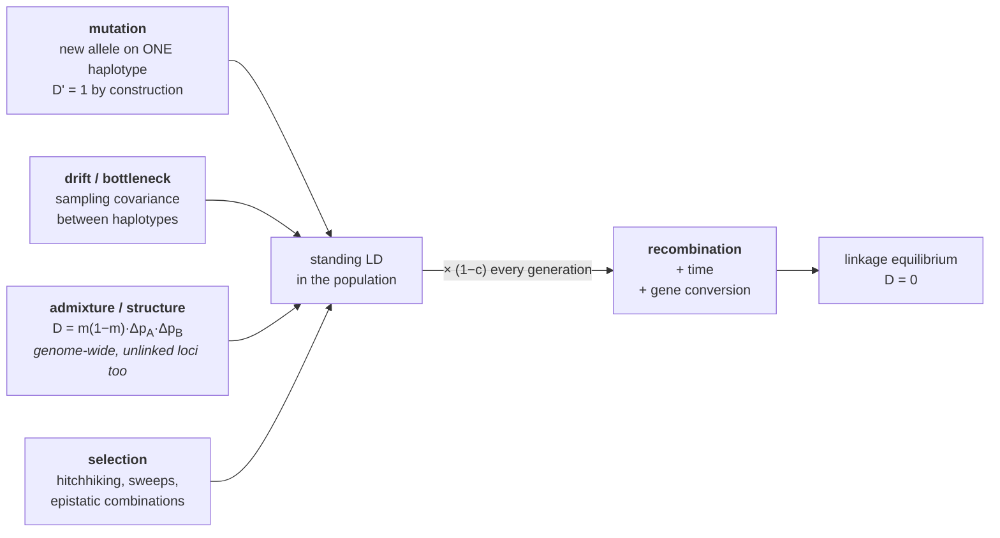

# 29 — Linkage disequilibrium and haplotypes

> **Before this:** [Ch 14](../part-02-transmission-genetics/14-linkage-and-mapping.md) · [Ch 26](26-hardy-weinberg.md) · [Ch 27](27-the-four-forces.md) · [Ch 28](28-structure-and-inbreeding.md) · **Time:** ~35 min
>
> **Statistics needed:** [S5 Variance and regression](../part-S-statistics/S5-variance-and-regression.md) ·
> [S2 Distributions](../part-S-statistics/S2-distributions.md)

Genome-wide association studies do not measure the variants that cause disease. They measure a
few hundred thousand cheap markers and rely on those markers being *correlated* with whatever
the causal variants are. That correlation is linkage disequilibrium. Its magnitude sets how
many people you need, its extent sets how precisely you can localise a hit, and its variation
between populations is why a polygenic score trained in one degrades in another.

## What you'll be able to do

- Define a haplotype, and say why unphased genotype data underdetermines it
- Distinguish genetic linkage from linkage disequilibrium, and give a case of each without the other
- Derive *D*, *D'* and *r²* from haplotype frequencies, and say which question each answers
- Show that *r²* is the squared Pearson correlation between two 0/1 indicator variables, and use that to compute the sample size a tag SNP costs you
- Derive the decay law *D_t = D₀(1−c)^t* and convert a haplotype length into an age
- Classify what creates LD — new mutation, drift, admixture, selection — against the one thing that destroys it, and derive the admixture formula *D* = *m*(1−*m*)Δ*p*<sub>A</sub>Δ*p*<sub>B</sub> that puts unlinked loci in disequilibrium
- Explain haplotype blocks, tag-SNP arrays and imputation as consequences of the decay law

## The core idea

Lay out a population's chromosomes as a matrix: one row per chromosome copy, one column per
variable site, entries 0 and 1. Linkage disequilibrium is nothing more exotic than
**correlation between columns of that matrix**.

Two things create the correlation and one thing destroys it. Every new mutation is born on a
single existing chromosome, so at the instant it arises it is perfectly associated with every
variant already on that chromosome — correlation 1 with its entire neighbourhood. Demography
and selection add more correlation by non-random sampling of whole chromosomes. Recombination,
one crossover at a time, grinds it back down. The observed correlation structure of a genome
is the current balance of those processes, and it is a record of population history.

> **Linkage is a property of chromosomes. Linkage disequilibrium is a property of a
> population at a moment in time.** Two loci 1 kb apart are linked in every organism that has
> ever lived, but can sit at zero LD. Two loci on different chromosomes are never linked, yet
> can show strong LD in an admixed population. Linkage governs how fast LD decays; it does not
> create it and does not guarantee it.

---

## 1. Haplotypes, and the phase problem

A **haplotype** is the set of alleles carried on one physical chromosome copy — alleles that
travelled together through the last meiosis. You have two haplotypes at every autosomal
region, one from each parent.

A **genotype** is what a standard assay reports: the unordered pair. That loses information.
An individual heterozygous at two sites is written `A/a` and `B/b`, which is consistent with
two different chromosome configurations:

```
   phase 1                  phase 2
   ── A ──── B ──           ── A ──── b ──      (paternal)
   ── a ──── b ──           ── a ──── B ──      (maternal)
   haplotypes AB, ab        haplotypes Ab, aB
```

Genotype data cannot distinguish them; only double heterozygotes are ambiguous, but they are
exactly the informative ones. Recovering phase requires trios (which parent contributed
what), reads long enough to span both sites ([Ch 46](../part-10-functional-genomics/46-variant-calling.md)),
or statistical phasing — inferring the most probable haplotypes given that the population
carries a limited number of common ones. That last method is circular in a productive way:
it uses LD to infer haplotypes and haplotypes to quantify LD.

Fortunately the main statistic can be computed without phasing at all. We will get to why in §4.

## 2. Linkage is not linkage disequilibrium

This confusion is universal and worth killing before any algebra.

| | Genetic linkage | Linkage disequilibrium |
|---|---|---|
| What it describes | Two loci on the same chromosome, close enough that crossovers between them are rare | A statistical association between the alleles at two loci |
| Property of | The physical genome (plus the hotspot landscape) | A specific population at a specific time |
| Quantified by | Recombination fraction *c*, genetic distance in cM | *D*, *D'*, *r²* |
| Timescale | One meiosis | Thousands of generations of population history |
| Changes when | Essentially never | Every generation — and instantly on admixture |
| Detected in | Pedigrees ([Ch 14](../part-02-transmission-genetics/14-linkage-and-mapping.md)) | Unrelated individuals |

**Linked but at equilibrium.** Two common SNPs 5 kb apart, both millions of years old, on
lineages that have recombined and back-mutated enough times that the association has washed
out. *c* is tiny; *r²* is ~0.

**In LD but unlinked.** Merge two populations that differ in allele frequency at loci on
chromosomes 1 and 19. The merged population shows LD between them, with no linkage anywhere in
sight (§7). It decays at *c* = 0.5 — halving every generation — but it is real, and it is the
source of confounding in association studies ([Ch 51](../part-11-human-and-statistical-genomics/51-gwas.md)).

Linkage is the *brake* on decay, not the cause of association.

## 3. Deriving D

Two biallelic loci. Locus 1 has alleles *A*/*a* at frequencies $p_A$, $p_a = 1 - p_A$; locus 2
has *B*/*b* at $p_B$, $p_b$. Four haplotypes exist, with frequencies $p_{AB}$, $p_{Ab}$,
$p_{aB}$, $p_{ab}$ summing to 1.

If the loci were associating at random, the frequency of the *AB* haplotype would be the
product of the marginals. Define the **coefficient of linkage disequilibrium** as the
departure from that product:

$$D = p_{AB} - p_A p_B$$

One quantity suffices for all four cells. Since $p_{Ab} = p_A - p_{AB}$:

$$p_{Ab} = p_A - (p_A p_B + D) = p_A(1 - p_B) - D = p_A p_b - D$$

and by the same substitution $p_{aB} = p_a p_B - D$ and $p_{ab} = p_a p_b + D$. The whole table
is one parameter deep:

|  | *B* | *b* | total |
|---|---|---|---|
| ***A*** | $p_Ap_B + D$ | $p_Ap_b - D$ | $p_A$ |
| ***a*** | $p_ap_B - D$ | $p_ap_b + D$ | $p_a$ |
| **total** | $p_B$ | $p_b$ | 1 |

Expanding gives the equivalent cross-product form, which is how you compute it from counts:

$$D = p_{AB}\,p_{ab} - p_{Ab}\,p_{aB}$$

$D = 0$ is **linkage equilibrium**: the four haplotype frequencies are exactly the products of
the allele frequencies.

### Why D alone is a bad summary

Every cell must be non-negative, which bounds *D* immediately:

$$\max(-p_Ap_B,\; -p_ap_b) \;\le\; D \;\le\; \min(p_Ap_b,\; p_ap_B)$$

The bound depends on the allele frequencies. If $p_A = p_B = 0.5$, *D* can reach 0.25. If
$p_B = 0.01$, *D* cannot exceed 0.005 no matter how perfect the association. So *D = 0.004*
means "almost nothing" in the first case and "as strong as physically possible" in the second.
A statistic whose scale moves with the marginals is useless for comparing loci.

## 4. Two normalisations: D' and r²

### D' — how far along the physical maximum

Divide by the bound in the direction *D* actually points:

$$D' = \frac{D}{D_{\max}}, \qquad D_{\max} = \begin{cases} \min(p_Ap_b,\; p_ap_B) & D > 0\\[4pt] |\max(-p_Ap_B,\; -p_ap_b)| & D < 0\end{cases}$$

$D' \in [0, 1]$. **$D' = 1$ means one of the four haplotypes is absent** — the pair has not
been separated by a recombination or a recurrent mutation since the younger allele arose. That
is a statement about *history*, which makes $D'$ the right tool for asking "has this interval
recombined?" It is also why $D'$ is used to define haplotype blocks.

Its weakness is the mirror image of that strength: $D'$ is 1 whenever a haplotype is missing,
including when it is missing purely because an allele is rare. Small samples of rare alleles
give $D' = 1$ constantly. $D'$ is upward-biased and noisy exactly where genomes are most
variable.

### r² — the squared correlation

Here is the framing that makes the rest of the chapter obvious. Draw one chromosome at random
from the population and define two indicator variables:

$$X = \mathbb{1}[\text{carries } A], \qquad Y = \mathbb{1}[\text{carries } B]$$

Both are Bernoulli; their moments are given in
[S2](../part-S-statistics/S2-distributions.md) §1:

$$\mathbb{E}[X] = p_A,\quad \operatorname{Var}(X) = p_Ap_a, \qquad \mathbb{E}[Y] = p_B,\quad \operatorname{Var}(Y) = p_Bp_b$$

And $\mathbb{E}[XY] = \Pr(X{=}1, Y{=}1) = p_{AB}$, so

$$\operatorname{Cov}(X, Y) = p_{AB} - p_Ap_B = D$$

***D* is literally the covariance between the two columns of the haplotype matrix.** Normalise
it the standard way for a covariance:

$$r = \frac{\operatorname{Cov}(X,Y)}{\sqrt{\operatorname{Var}(X)\operatorname{Var}(Y)}} = \frac{D}{\sqrt{p_Ap_a\,p_Bp_b}}, \qquad \boxed{\;r^2 = \frac{D^2}{p_Ap_a\,p_Bp_b}\;}$$

This is the ordinary Pearson correlation of
[S5](../part-S-statistics/S5-variance-and-regression.md) §3, and everything there transfers
without modification — including that $r^2$ is the fraction of variance in one column
explained by the other, and that $n r^2$ is a $\chi^2_1$ statistic for testing $D = 0$.

Two practical consequences fall out immediately:

- **You do not need phase.** Code genotypes as dosages 0/1/2. Under Hardy–Weinberg the two
  haplotypes in an individual are independent draws, so $\operatorname{Cov} = 2D$ and each
  variance doubles — the factors cancel and the genotype-dosage correlation equals the
  haplotype $r$. This is why `plink --r2` works on unphased data.
- **$r^2 = 1$ requires matched allele frequencies.** From the boxed formula, $r^2 = 1$ forces
  $p_A = p_B$. A common variant can never be a perfect proxy for a rare one, however tightly
  they are physically bound.

> **Statistics:** the additivity of variances and covariances over independent contributions —
> what makes the factors cancel in the first bullet — is covered in
> [S5](../part-S-statistics/S5-variance-and-regression.md) §2.

| | $D'$ | $r^2$ |
|---|---|---|
| Asks | Has recombination separated these alleles? | How well does one predict the other? |
| $=1$ when | One haplotype is absent | One haplotype absent **and** allele frequencies equal |
| Rare alleles | Inflated, often 1 by chance | Correctly small |
| Use for | Block definition, historical recombination | Tag SNPs, power, imputation, fine-mapping |

## 5. Why r² is the number that sets your sample size

Let the causal variant have dosage $G_c$ and the genotyped tag have dosage $G_t$, with
correlation $r$ between them. The truth is additive: $y = \mu + \beta G_c + e$. You do not
observe $G_c$; you regress on $G_t$.

> **Statistics:** fitting a regression and reading $R^2$ as variance explained is covered in
> [S5](../part-S-statistics/S5-variance-and-regression.md) §4; the non-centrality parameter
> $\lambda$ and how it converts into power is [S4](../part-S-statistics/S4-hypothesis-testing.md) §4.

$$R^2_t = \frac{\operatorname{Cov}(y, G_t)^2}{\operatorname{Var}(G_t)\operatorname{Var}(y)} = \frac{\beta^2 \operatorname{Cov}(G_c, G_t)^2}{\operatorname{Var}(G_t)\operatorname{Var}(y)}$$

Multiply and divide by $\operatorname{Var}(G_c)$ and regroup:

$$R^2_t = \underbrace{\frac{\beta^2\operatorname{Var}(G_c)}{\operatorname{Var}(y)}}_{R^2_c} \cdot \underbrace{\frac{\operatorname{Cov}(G_c,G_t)^2}{\operatorname{Var}(G_c)\operatorname{Var}(G_t)}}_{r^2} \;=\; r^2 R^2_c$$

The non-centrality parameter of the association test is $\lambda \approx N R^2$. Equal power
requires equal $\lambda$, so

$$N_{\text{tag}} = \frac{N_{\text{causal}}}{r^2}$$

**Testing a tag instead of the causal variant costs a factor of $1/r^2$ in sample size.** The
conventional array-design threshold of $r^2 \ge 0.8$ is precisely a decision to accept a 25%
inflation. At $r^2 = 0.2$ you need five times the cohort; at $r^2 = 0.05$, twenty times.

Assumptions worth naming: one causal variant, additive effect, tag not itself causal, and $r$
measured *in the study population*. The last one is where portability dies (§10).

## 6. How LD decays

Large randomly-mating population, no selection, no mutation, no drift; recombination fraction
*c*. Consider a gamete produced in generation *t+1*. With probability $1-c$ no crossover
separates the loci, so it carries a haplotype sampled intact from the parental pool:
$\Pr(AB) = p_{AB}(t)$. With probability *c* it is a recombinant, taking its *A* allele from one
parental haplotype and its *B* allele from the other — independent draws, so
$\Pr(AB) = p_A p_B$. Recombination does not change allele frequencies, so $p_A$ and $p_B$ are
constant. Therefore:

$$p_{AB}(t+1) = (1-c)\,p_{AB}(t) + c\,p_Ap_B$$

Subtract $p_Ap_B$ from both sides:

$$D(t+1) = (1-c)p_{AB}(t) - (1-c)p_Ap_B = (1-c)\,D(t)$$

$$\boxed{\;D_t = D_0(1-c)^t\;}$$

Geometric decay, with allele frequencies fixed — so $r^2_t = r^2_0 (1-c)^{2t}$, decaying twice
as fast. The half-life is $t_{1/2} = \ln 2 / [-\ln(1-c)] \approx 0.693/c$ for small *c*. At the
human genome-average rate of roughly 1 cM per Mb:

| Separation | *c* | Half-life of *D* | ≈ years (27 y/gen) |
|---|---|---|---|
| Different chromosomes | 0.5 | 1 generation | 27 |
| 10 Mb | 0.1 | 6.6 generations | 180 |
| 1 Mb | 0.01 | 69 generations | 1,900 |
| 100 kb | 0.001 | 693 generations | 19,000 |
| 10 kb | 0.0001 | 6,900 generations | 190,000 |

The generation time is the pinned 27 years
([verified facts](../reference/verified-facts.md)). The usable literature spans 25–30, so the
last column carries about ±10% that the generation counts do not — quote generations when you
can.

Read the table twice. **LD between unlinked loci is transient** — halved every generation, gone
in a handful. **LD at 10 kb has a half-life on the order of the age of our species** — the
oldest fossils assigned to *Homo sapiens*, from Jebel Irhoud, are dated to 315 ± 34 thousand
years (Hublin et al. 2017), so 190,000 years is comparable to that, not longer than it. Between
those extremes lies the window that makes association mapping possible: at 10–100 kb, LD
survives long enough to be reliably present and decays fast enough to localise a signal to
something smaller than a chromosome arm.

## 7. What creates LD



**Mutation is the fundamental source.** A new allele *B* appears on exactly one chromosome,
which already carries some allele at every other site — say *A*. Then $p_{AB} = p_B$ and

$$D = p_B - p_Ap_B = p_B(1 - p_A) = p_ap_B$$

Since $p_B$ is tiny, $D_{\max} = \min(p_Ap_b, p_ap_B) = p_ap_B$, so **$D' = 1$ exactly**. But

$$r^2 = \frac{(p_ap_B)^2}{p_Ap_a\,p_Bp_b} = \frac{p_ap_B}{p_Ap_b} \approx \frac{p_a p_B}{p_A} \to 0$$

Complete LD and near-zero correlation, simultaneously, from the same haplotype table. Every
variant enters the population this way. Everything that follows is erosion.

**Drift** generates LD as a sampling artefact: with finite *N*, the haplotype counts passed to
the next generation are a multinomial draw, and multinomial cells covary. Balancing this
against recombination gives Sved's approximation (Sved 1971):

$$\mathbb{E}[r^2] \approx \frac{1}{1 + 4N_e c}$$

This one is **quoted, not derived here** — the derivation tracks identity by descent along a
whole chromosome segment rather than at a single site, and needs machinery this chapter has not
built. But its shape is not new to you. It is the same drift-versus-flux equilibrium as the
island model of [Ch 27](27-the-four-forces.md) §5: drift builds the association at rate
~1/(2*N*<sub>e</sub>) per generation, a second process tears it down at a constant per-generation
rate, and the equilibrium depends only on the product of the two. Set
*F*<sub>ST</sub> ≈ 1/(1 + 4*Nm*) beside it and the only substitution is *c* for *m* —
recombination playing the role migration played there. Two different quantities, one balance
argument.

The formula says LD extent is inversely proportional to effective population size — and, because a
correlation at distance *c* is dominated by coalescent events roughly $1/(2c)$ generations
back, that LD at short distances reports on *ancient* $N_e$ while long-range LD reports on
*recent* $N_e$. One genome, many time slices.

**Bottlenecks** are drift concentrated: few surviving haplotypes, LD spikes genome-wide. This
is why Finnish, Ashkenazi and Icelandic populations have long haplotypes and are efficient for
mapping.

**Admixture** produces LD by mixing, and the algebra is the omitted-variable-bias calculation of
[S5](../part-S-statistics/S5-variance-and-regression.md) §6. Population 1 contributes fraction
*m*, population 2 fraction $1-m$; each is internally at equilibrium. Then $p_{AB} = m\,p_{A1}p_{B1} + (1-m)p_{A2}p_{B2}$ while
$p_A = m\,p_{A1} + (1-m)p_{A2}$ and similarly for $p_B$. Subtracting and collecting terms:

$$D = m(1-m)\,(p_{A1} - p_{A2})(p_{B1} - p_{B2})$$

The LD is the product of the two frequency differences times the mixing variance. It applies to
**every pair of loci in the genome**, linked or not, which is exactly why unmodelled ancestry
produces genome-wide false positives ([Ch 28](28-structure-and-inbreeding.md),
[Ch 51](../part-11-human-and-statistical-genomics/51-gwas.md)). Continuous population structure
does the same thing with a continuum of strata.

**Selection** creates LD by hitchhiking: a beneficial allele rising in frequency drags its
entire chromosomal neighbourhood with it, because the neighbourhood is what it is physically
attached to. Epistatic selection — favouring particular *combinations* — maintains LD against
recombination indefinitely.

**What destroys it:** recombination and time, and nothing else of consequence. Gene conversion
([Ch 18](../part-03-genome-instability/18-recombination-mechanisms.md)) transfers tracts of a
few hundred bases and erodes LD at sub-kilobase scales where crossovers are too rare to matter.
Recurrent mutation at hypermutable sites places the same allele on different backgrounds,
which lowers $D'$ without any recombination at all.

## 8. Blocks, hotspots, and the array that made GWAS possible

Crossovers are not uniformly placed. In humans, roughly **80% of recombination occurs in
10–20% of the sequence**, concentrated into **hotspots** a couple of kilobases wide. Their
positions are set largely by *PRDM9*, whose zinc-finger array binds a sequence motif and
deposits histone marks that recruit the double-strand breaks initiating meiotic recombination.
*PRDM9* is highly polymorphic, so hotspot locations differ between individuals — and the gene
is non-functional in dogs, which consequently have hotspots at promoters instead.

Punctate recombination produces punctate LD: long stretches with almost no historical
recombination, separated by short intervals across which $D'$ collapses. Those stretches are
**haplotype blocks**. Within a block, the number of distinct common haplotypes is far smaller
than $2^k$ for *k* sites — typically three to five account for the great majority of
chromosomes. Gabriel and colleagues' 2002 survey found block lengths approximately
exponentially distributed with a mean of about **22 kb in European and Asian samples and 11 kb
in Yoruba samples**.

That factor of two is the Sved formula in action. African populations never passed through the
out-of-Africa bottleneck, so their effective size over the relevant window is roughly twice
that of non-Africans; $\mathbb{E}[r^2] \approx 1/(1+4N_ec)$ then predicts LD extending about
half as far. Equivalently: with a larger $N_e$ the genealogy of an African sample coalesces
further back, so more recombination has accumulated along its branches — not because the
population is older in generations, but because its lineages take longer to find a common
ancestor. **Shorter African LD blocks are a demographic prediction, not a curiosity.**

The engineering consequence: if a block contains 40 common variants but only four common
haplotypes, you do not need 40 assays. Genotype two or three well-chosen **tag SNPs**, and the
rest are predicted at $r^2 \ge 0.8$. This collapses ~10 million common human variants to a few
hundred thousand array positions — around 500,000 for European ancestry, more for African,
where blocks are shorter and tags cover less. Arrays at that density are cheap enough to run on
hundreds of thousands of people, which is the entire economic basis of GWAS.

The **International HapMap Project** (from 2002) existed to build that map. Phases I and II
genotyped over 3.1 million SNPs in 270 individuals from four population samples; Phase III
extended to about 1.6 million SNPs in 1,184 individuals from 11 populations. Its output — which
variants tag which — is what array designers used. It was later superseded as a reference panel
by 1000 Genomes (3,202 high-coverage samples), gnomAD and TOPMed, but the conceptual
contribution stands.

One caveat: the block model is an idealisation. LD decay is not a step function, block
boundaries depend on the algorithm and the sample, and hotspot positions vary between
individuals because *PRDM9* alleles do.

## 9. Long haplotypes as a signature of recent selection

Combine §6 and §7 and you get one of the sharpest inferences in population genetics.

A new allele starts at frequency $1/(2N)$ on one long, intact haplotype. Under drift alone,
reaching high frequency takes on the order of $4N_e$ generations — tens of thousands. Over that
time, a 1 Mb haplotype survives with probability $(0.99)^{40{,}000} \approx e^{-400}$: zero.
**Common alleles are normally old, and old alleles normally sit on short haplotypes.**

Now let selection drive the allele up in, say, 300 generations. The probability that a 1 Mb
haplotype around it survives intact is $(0.99)^{300} \approx e^{-3} \approx 0.05$ — small per
chromosome, but the allele is now carried by a large number of chromosomes, so long unbroken
copies are still abundant. The observable signature is a violation of the normal relationship:
**high frequency together with an unusually long shared haplotype.**

*LCT* is the canonical case ([Ch 00](../part-00-orientation/00-the-whole-story.md)). The
European lactase-persistence allele — a single base change in an enhancer inside intron 13 of
the neighbouring gene *MCM6*, about 14 kb upstream of *LCT* — reaches roughly 90% frequency in
Scandinavia while still sitting on a shared haplotype of order 1 Mb. From the table in §6, a
1 Mb haplotype has a half-life of ~69 generations, so the allele cannot be more than a few
thousand years old; independent estimates put it at roughly 5,000–10,000 years, coincident with
cattle domestication. East African pastoralists carry *different* causal variants on their own
long haplotypes — convergent evolution, dated the same way.

The statistics that formalise this — EHH, iHS, XP-EHH — are simply "how far does homozygosity
extend from this allele, relative to what its frequency predicts". They are developed in
[Ch 33](../part-07-molecular-evolution/33-neutral-theory-and-selection-tests.md).

## 10. Three consequences you will meet again

**A GWAS hit is a tag, not a cause.** The reported variant is the one that happened to be on
the array and happened to have the largest test statistic. Dozens of variants in the same block
have nearly the same $r^2$ with the causal site and therefore nearly the same p-value; which
one wins is close to noise. Fine-mapping ([Ch 52](../part-11-human-and-statistical-genomics/52-association-to-mechanism.md))
attacks this with credible sets, huge samples that resolve small $r^2$ differences, and
multi-ancestry data — African LD blocks being shorter, adding African samples narrows the
credible set faster than adding more of the same ancestry.

**Polygenic scores do not transfer.** The estimated tag effect is $\beta_{\text{tag}} =
\beta_{\text{causal}} \cdot \operatorname{Cov}(G_c,G_t)/\operatorname{Var}(G_t)$ — a quantity
that depends on the LD structure of the *discovery* population. Applied where $r$ differs, the
variance explained scales as $r^2_{\text{new}}/r^2_{\text{discovery}}$, and if the sign of $r$
flips, so does the contribution. Add differing allele frequencies and the score degrades
sharply out of ancestry, which is the central technical problem of
[Ch 53](../part-11-human-and-statistical-genomics/53-polygenic-scores.md).

> **Statistics:** that a fitted coefficient is a covariance divided by the predictor's variance,
> and therefore a property of the sample it was estimated in, is covered in
> [S5](../part-S-statistics/S5-variance-and-regression.md) §4.

**Imputation is haplotype structure used as a codec.** You genotype 500,000 markers; you want
tens of millions. Model the target chromosome as a mosaic of segments copied from a reference
panel of sequenced haplotypes, with switches between reference haplotypes occurring at a rate
proportional to genetic distance. That is a hidden Markov model whose hidden state is *which
reference haplotype am I copying now* and whose emissions are the observed genotypes; forward–
backward gives a posterior over the untyped alleles. The reason it works is precisely §6:
within a few tens of kilobases, chromosomes really are near-copies of a small number of
ancestral haplotypes. The reason it fails is also §6: with a mismatched reference panel, the
target's haplotypes are not in the panel and the copying model has nothing good to copy.

---

## Common misconceptions

| What people think | What's actually true |
|---|---|
| LD means the loci are linked | LD is a population-level correlation. Admixture and structure create it between loci on different chromosomes; old linked loci can be at $D = 0$ |
| $D' = 1$ means the marker is a good proxy | $D' = 1$ only says one haplotype is missing. A rare allele on a common background gives $D' = 1$ with $r^2 \approx 0.05$ — a 20× sample-size penalty |
| $r^2 = 1$ is achievable for any tightly linked pair | $r^2 = 1$ requires equal allele frequencies. A common SNP can never perfectly tag a rare one |
| The GWAS index SNP is the causal variant | It is the best-correlated genotyped marker. Which member of the block tops the list is largely sampling noise |
| LD extends further in African genomes because of more diversity | The opposite: larger $N_e$, no out-of-Africa bottleneck, deeper coalescence and so more accumulated recombination → blocks about half as long (~11 kb vs ~22 kb) |
| Recombination creates LD | Recombination destroys it, at rate *c* per generation. Mutation, drift, admixture and selection create it |
| Haplotype blocks are discrete objects with real boundaries | A useful idealisation over punctate recombination. Boundaries are algorithm- and sample-dependent, and hotspot positions vary between individuals via *PRDM9* |
| A high $r^2$ means the two variants do the same thing biologically | It means they are statistically correlated in that population. One may be functional and the other silent — that is the entire premise of tag-SNP genotyping |

## Worked example

Two SNPs, rs1 (*A*/*a*) and rs2 (*B*/*b*), 250 kb apart. 200 phased haplotypes (100 individuals):

```
              rs2 = B     rs2 = b     total
   rs1 = A       90          10        100
   rs1 = a       30          70        100
   total        120          80        200
```

**Step 1 — frequencies.**
$p_{AB} = 90/200 = 0.45$, $p_{Ab} = 0.05$, $p_{aB} = 0.15$, $p_{ab} = 0.35$.
$p_A = 100/200 = 0.50$, $p_a = 0.50$, $p_B = 120/200 = 0.60$, $p_b = 0.40$.

**Step 2 — *D*.**
$D = p_{AB} - p_Ap_B = 0.45 - (0.50)(0.60) = 0.45 - 0.30 = 0.15$.
Check by cross-product: $(0.45)(0.35) - (0.05)(0.15) = 0.1575 - 0.0075 = 0.15$. ✓

**Step 3 — *D'*.** $D > 0$, so $D_{\max} = \min(p_Ap_b,\, p_ap_B) = \min(0.20,\, 0.30) = 0.20$.
$D' = 0.15/0.20 = 0.75$. Substantial historical recombination — no haplotype is absent.

**Step 4 — *r²*.** $p_Ap_ap_Bp_b = (0.50)(0.50)(0.60)(0.40) = 0.06$.
$r^2 = D^2 / 0.06 = 0.0225/0.06 = 0.375$, so $r = 0.612$.

Note $D' = 0.75$ against $r^2 = 0.375$. The pair looks strongly associated historically and
predicts each other only moderately.

**Step 5 — the cost of tagging.** If rs2 is causal and you only genotype rs1:
$N_{\text{tag}} = N_{\text{causal}}/r^2 = N/0.375 = 2.67N$. A study powered at 10,000 samples on
the causal variant needs **26,700** at the tag. This pair would fail a standard $r^2 \ge 0.8$
array-design filter.

**Step 6 — a rare third variant.** Add rs3, allele *C* at $p_C = 0.05$, all 10 copies on the
*A* background: $p_{AC} = 0.05$, $p_{aC} = 0$.
$D = 0.05 - (0.50)(0.05) = 0.025$. $D_{\max} = \min(p_Ap_c,\, p_ap_C) = \min(0.475,\, 0.025) = 0.025$.
$D' = 0.025/0.025 = \mathbf{1.00}$.
$r^2 = (0.025)^2 / [(0.5)(0.5)(0.05)(0.95)] = 0.000625/0.011875 = \mathbf{0.053}$.
Perfect *D'*, and a **19-fold** sample-size penalty. Two statistics, same table, opposite verdicts.

**Step 7 — decay.** At ~1 cM/Mb, 250 kb gives $c = 0.0025$. After 100 generations:
$D_{100} = 0.15 \times (0.9975)^{100}$.
$\ln(0.9975) = -0.0025031$; $\times 100 = -0.25031$; $e^{-0.25031} = 0.7785$.
$D_{100} = 0.15 \times 0.7785 = 0.1168$.
$r^2_{100} = r^2_0(1-c)^{200} = 0.375 \times (0.7785)^2 = 0.375 \times 0.6061 = 0.227$.
Half-life of *D* (and of *r*, since the allele frequencies are fixed):
$0.693/0.0025 = 277$ generations ≈ 7,800 years. Because $r^2$ decays twice as fast, the
study's power halves in ~139 generations ≈ 3,900 years.

## Connections

- **Back to:** [Ch 09](../part-02-transmission-genetics/09-mitosis-and-meiosis.md) for where
  crossovers come from · [Ch 14](../part-02-transmission-genetics/14-linkage-and-mapping.md)
  for *c* and cM · [Ch 26](26-hardy-weinberg.md) — LD is the two-locus generalisation of
  Hardy–Weinberg, and note it takes many generations to reach rather than one ·
  [Ch 27](27-the-four-forces.md) for drift and $N_e$ ·
  [Ch 28](28-structure-and-inbreeding.md) — the admixture formula in §7 is the two-locus
  version of the same confounding
- **Forward to:** [Ch 32](../part-06-quantitative-genetics/32-mapping-quantitative-traits.md)
  (QTL mapping is LD mapping in a designed cross) ·
  [Ch 33](../part-07-molecular-evolution/33-neutral-theory-and-selection-tests.md) (EHH, iHS) ·
  [Ch 35A §5](../part-07-molecular-evolution/35A-speciation-and-ecological-genetics.md) — §7's
  admixture LD held at a *spatial* equilibrium instead of decaying through time: in a hybrid zone
  the parental genomes keep arriving as blocks, so even unlinked loci stay correlated at the
  centre, and that disequilibrium is a second, independent estimate of the selection holding the
  zone together ·
  [Ch 45](../part-09-genomics/45-reference-genomes-and-pangenomes.md) (haplotype-aware
  references) · [Ch 51](../part-11-human-and-statistical-genomics/51-gwas.md) ·
  [Ch 52](../part-11-human-and-statistical-genomics/52-association-to-mechanism.md) ·
  [Ch 53](../part-11-human-and-statistical-genomics/53-polygenic-scores.md)

## Check yourself

**1. Two loci sit 2 kb apart on chromosome 7 and show $r^2 = 0.01$. Two loci on chromosomes 3 and 11 show $r^2 = 0.15$. Explain both without contradiction.**

<details><summary>Answer</summary>

Linkage constrains the decay rate, not the level. The chromosome 7 pair is tightly linked
($c \approx 2\times10^{-5}$), so whatever LD it has decays imperceptibly — but if the two
alleles arose on many different backgrounds (recurrent mutation at a hypermutable site) or
are both ancient with gene conversion acting, the standing correlation can be near zero and
will stay there.

The chromosome 3/11 pair has $c = 0.5$, so any LD halves each generation. $r^2 = 0.15$
therefore implies something is generating it *now*: recent admixture, unmodelled population
structure, a very recent bottleneck, or epistatic selection. It is real, it is informative
about demography, and it will be gone in a few generations if the cause stops.

</details>

**2. A marker has $D' = 1.0$ and $r^2 = 0.04$ with a causal variant. Your study has 20,000 samples. What effective sample size are you working with, and what does the $D' = 1$ actually tell you?**

<details><summary>Answer</summary>

Power at the tag matches a study of $N r^2 = 20{,}000 \times 0.04 = 800$ samples tested on the
causal variant directly. Essentially no power.

$D' = 1$ tells you only that one of the four haplotypes is unobserved — no recombination or
recurrent mutation has separated the two alleles since the younger one arose. Given
$r^2 = 0.04$, the allele frequencies must be very different, which is what caps $r^2$: with
$D' = 1$ and $D>0$, $r^2 = (p_a p_B)/(p_A p_b)$, small whenever $p_B \ll p_A$. Perfect
historical association, useless statistical proxy.

</details>

**3. Derive $D_t = D_0(1-c)^t$ and state the three assumptions that make it fail in a real population.**

<details><summary>Answer</summary>

A gamete is a non-recombinant with probability $1-c$, in which case it is an intact draw from
the parental haplotype pool ($\Pr(AB) = p_{AB}(t)$), or a recombinant with probability $c$, in
which case its two alleles are independent draws ($\Pr(AB) = p_Ap_B$). So
$p_{AB}(t+1) = (1-c)p_{AB}(t) + cp_Ap_B$. Recombination leaves allele frequencies unchanged;
subtract $p_Ap_B$: $D(t+1) = (1-c)[p_{AB}(t) - p_Ap_B] = (1-c)D(t)$. Iterate.

Fails when: (i) the population is finite — drift regenerates LD each generation, so $D$ does
not go to zero but fluctuates around a level set by $\mathbb{E}[r^2] \approx 1/(1+4N_ec)$;
(ii) selection acts on either locus or on their combination, which changes allele frequencies
and can maintain $D$ indefinitely; (iii) migration or admixture injects fresh LD, and does so
even at $c = 0.5$.

</details>

**4. Why does adding African-ancestry samples narrow a fine-mapping credible set more efficiently than adding equally many European samples?**

<details><summary>Answer</summary>

Fine-mapping distinguishes candidate variants using differences in their $r^2$ with the causal
site. In a population with long LD blocks, dozens of variants have nearly identical $r^2$, so
the likelihood surface is flat and the credible set stays large no matter how many samples you
add. African populations have larger $N_e$ and no out-of-Africa bottleneck, giving blocks
roughly half as long (~11 kb vs ~22 kb) and much sharper $r^2$ contrasts between neighbouring
variants. Combining ancestries adds the further constraint that the causal variant must be
associated in *all* of them, which eliminates candidates whose correlation with it is
ancestry-specific.

</details>

**5. Imputation replaces genotyping. Why does it not remove the need for ancestry-matched reference panels — and what breaks first when the panel is mismatched?**

<details><summary>Answer</summary>

Imputation models the target chromosome as a mosaic copied from panel haplotypes, with switches
at a rate set by genetic distance. It can only output alleles that exist somewhere in the panel,
and it is accurate only when the target's haplotypes closely resemble panel haplotypes over
long stretches.

With a mismatched panel, the first failure is rare and population-specific variants: they are
absent from the panel and simply cannot be imputed at any accuracy. The second is that the
copying model switches reference haplotypes too often — no single panel haplotype matches for
long — which flattens the posterior, lowers imputation quality scores, and adds noise to
downstream association tests. Both failures hit exactly the populations with the shortest LD
blocks hardest, compounding the portability problem in
[Ch 53](../part-11-human-and-statistical-genomics/53-polygenic-scores.md).

</details>
