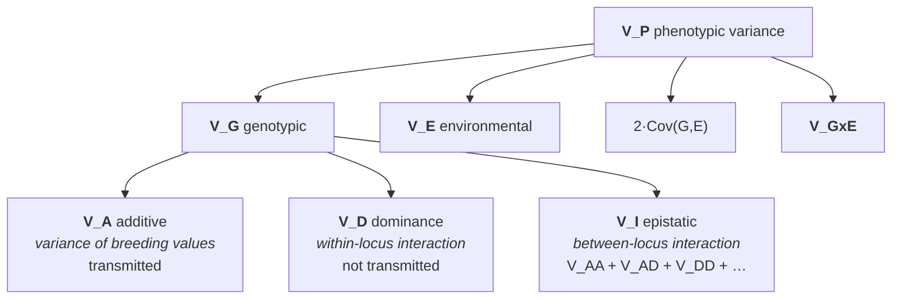

# 30 — Quantitative traits and variance

> **Before this:** [Ch 10](../part-02-transmission-genetics/10-mendelian-inheritance.md) · [Ch 26](../part-05-population-genetics/26-hardy-weinberg.md) · [Ch 29](../part-05-population-genetics/29-linkage-disequilibrium.md) · **Time:** ~45 min
>
> **Statistics needed:** [S2 Distributions](../part-S-statistics/S2-distributions.md) ·
> [S5 Variance and regression](../part-S-statistics/S5-variance-and-regression.md)

Everything so far has sorted individuals into classes: affected or not, round or wrinkled,
recombinant or parental. Most traits refuse to do that. Height, blood pressure, yield, LDL
cholesterol, and every disease risk that isn't a single broken gene form a smear, not a set
of bins.

This chapter builds the machinery for the smear. It is the quantitative spine of the book:
the variance components defined here are what heritability is a ratio of
([Ch 31](31-heritability-and-selection.md)), what QTL mapping partitions
([Ch 32](32-mapping-quantitative-traits.md)), and what a polygenic score is trying to
predict ([Ch 53](../part-11-human-and-statistical-genomics/53-polygenic-scores.md)).

## What you'll be able to do

- Derive why many loci of small effect produce an approximately normal phenotype
  distribution, and compute the exact class frequencies for 2 and 3 loci
- Convert a binary disease outcome into an underlying continuous liability, and compute the
  threshold and the mean liability of affected individuals from a prevalence
- Write the full variance decomposition $\mathrm{Var}(P)$ including the covariance and
  interaction terms, and say what each requires to vanish
- Define additive genetic variance as the variance of breeding values — the fitted values of
  the regression of genotypic value on allele count — and compute $\alpha$, $V_A$ and $V_D$
  for a one-locus model
- Compute the additive genetic covariance and $r_G$ from per-locus average effects, and explain
  why a phenotypic correlation near zero can conceal a strongly negative genetic one
- Derive the expected covariance between relatives from allele-sharing probabilities, and
  explain why parent–offspring and full-sib covariances differ

## The core idea

Take a phenotype that looks nothing like Mendelian. Now suppose it is controlled by 200 loci,
each with two alleles, each shifting the trait by a small amount, inherited independently.
An individual's genotypic value is then a sum of 200 nearly-independent random contributions.

A sum of many independent small contributions has one limiting shape — the central limit
theorem, [S2](../part-S-statistics/S2-distributions.md) §3.

> **Quantitative genetics is Mendelian genetics plus the central limit theorem.** No new
> inheritance mechanism was ever required. The continuous distribution is what discrete
> particulate inheritance *looks like* when you add up enough particles and blur the result
> with environment.

Everything else in this chapter is bookkeeping on that sum: splitting its variance into the
part a parent can transmit, the part that dies with the individual, and the part that isn't
genetic at all.

---

## 1. The dispute that Fisher settled

For twenty years after Mendel's rediscovery in 1900, two camps were at war. The
**biometricians** (Galton, Pearson, Weldon) measured continuous traits, found smooth
distributions and correlations between relatives of about ½ for parent–offspring, and
concluded inheritance was blending. The **Mendelians** (Bateson, de Vries) had discrete
factors, clean ratios, and no account of height.

Both were right about their data. The resolution — Fisher's 1918 paper *The Correlation
between Relatives on the Supposition of Mendelian Inheritance*, the paper that coined the
word **variance** — was to show that the biometricians' observations were a *consequence* of
the Mendelians' mechanism.

Take $n$ unlinked loci, allele frequency $p$ at each, and let each copy of the "+" allele add
$a$ to the trait. Let $X_i \in \{0,1,2\}$ be the count of + alleles at locus $i$. Under
Hardy–Weinberg, $X_i \sim \text{Binomial}(2, p)$, so $\mathrm{Var}(X_i) = 2pq$. The genotypic
value is

$$G = \sum_{i=1}^{n} a X_i, \qquad \mathbb{E}[G] = 2npa, \qquad \mathrm{Var}(G) = \sum_i a^2 \cdot 2pq = 2npq\,a^2$$

where the variance adds because the loci are independent — which requires **linkage
equilibrium** ([Ch 29](../part-05-population-genetics/29-linkage-disequilibrium.md)), not
merely different chromosomes.

> **Statistics:** why variances of independent contributions add, and what the cross term
> $2\,\mathrm{Cov}$ is when they do not, are covered in
> [S5](../part-S-statistics/S5-variance-and-regression.md) §2.

 With $n$ loci there are $2n+1$ genotypic classes and $G$ is a
scaled Binomial$(2n, p)$. The CLT does the rest.

Watch it happen. An F2 from a cross of two pure lines gives $p = \tfrac12$ at every locus:

```
 1 locus    + alleles k:   0    1    2                          3 classes
            frequency:     1    2    1        / 4

 2 loci                    0    1    2    3    4                5 classes
                           1    4    6    4    1        / 16

 3 loci                    0    1    2    3    4    5    6      7 classes
                           1    6   15   20   15    6    1  / 64
```

This is exactly what Nilsson-Ehle saw in wheat kernel colour in 1909: an F2 in which 1/64 of
seeds were as white as one grandparent and 1/64 as red as the other, with a graded series
between — three loci, behaving perfectly Mendelian, producing something that reads as
blending unless you count carefully.

**Now add environment.** Real phenotypes are the genotypic classes plus noise, so the observed
distribution is a mixture of normals centred on the class values. A useful criterion: an
equal-weight mixture of two normals whose means differ by $d$ with common standard deviation
$\sigma$ is unimodal when $d \le 2\sigma$. The class spacing here is $a$, so once
$\sigma_E \gtrsim a/2$ the bumps merge and the histogram is smooth. With 3 loci and modest
environmental variance you can no longer *see* the seven classes at all — which is precisely
why the biometricians never found them.

Two forces conspire, and only one of them involves $n$. Environmental variance blurs the
spacing directly. The loci act more subtly: with $a$ held fixed, adding loci leaves the
spacing at $a$ and instead widens the range to $2na$ and the genetic standard deviation to
$\sqrt{2npq}\,a$, so the steps become a finer and finer texture relative to the spread. Only
when the loci divide a *fixed* total does the spacing itself shrink — the Nilsson-Ehle case,
where two pure parental lines pin the difference $\Delta$ between the extremes, so $n$ loci
give $a = \Delta/2n$. Either way, you need very few loci before the discreteness is
undetectable.

## 2. Three kinds of quantitative trait

| Type | Measurement | Examples | Distribution |
|---|---|---|---|
| **Continuous** | real-valued | height, blood pressure, LDL, expression level | approximately normal, often after transformation |
| **Meristic** | a count | bristle number, vertebrae, litter size, seed number | discrete but many-valued; Poisson-ish, treated as continuous |
| **Threshold** | present/absent | type 2 diabetes, schizophrenia, cleft palate, twinning | binary, modelled as a latent continuum |

Threshold traits are the important case for human genetics, because most of what we care
about is binary and most of what we can model is continuous.

### The liability threshold model

Posit an unobserved continuous variable — **liability** — that is the sum of all genetic and
environmental contributions to risk. Give it the CLT treatment: assume it is normal, and
standardise it to $L \sim \mathcal{N}(0,1)$, which costs nothing since the scale is arbitrary.
An individual is affected when $L$ exceeds a threshold $T$.

> **Statistics:** the normal distribution — its density $\varphi$, its cdf $\Phi$, and the
> central-limit argument that licenses assuming it for a latent sum — is covered in
> [S2](../part-S-statistics/S2-distributions.md) §3.

With prevalence $K$:

$$K = \Pr(L > T) = 1 - \Phi(T) \quad\Longrightarrow\quad T = \Phi^{-1}(1-K)$$

The mean liability of affected individuals is the inverse Mills ratio,

$$\bar{L}_{\text{aff}} = \frac{\varphi(T)}{K} \equiv i$$

Worked, for $K = 0.01$: $T = 2.326$, $\varphi(2.326) = 0.3989\,e^{-2.706} = 0.02665$, so
$i = 0.02665/0.01 = 2.665$. Affected individuals sit on average 2.67 standard deviations up
the liability scale.

This is not decoration. It buys three things:

- **A single binary outcome becomes a continuous trait**, so all the variance machinery below
  applies unchanged, on the liability scale.
- **Dominance appears for free.** A trait with a threshold behaves non-additively on the
  observed scale even when liability is perfectly additive — relatives of severely affected
  probands have higher risk, recurrence risk falls off faster than $\tfrac12$ per degree of
  relationship, and none of that requires interaction between loci.
- **Heritability becomes scale-dependent**, which is why
  [Ch 31](31-heritability-and-selection.md) §3 distinguishes heritability on the observed 0/1
  scale from heritability on the liability scale, and why polygenic score performance for a
  disease is reported as liability-scale $R^2$ or AUC
  ([Ch 53](../part-11-human-and-statistical-genomics/53-polygenic-scores.md)).

### Converting a heritability between the two scales

Scale-dependence is not a nuisance to be gestured at; it is a conversion you have to do before
two numbers are comparable. A heritability computed on the observed 0/1 scale — the fraction of
the variance of the *indicator* that is additive-genetic — depends on the prevalence and on the
case fraction the study happened to sample. Two case–control studies of the same disease, with
identical underlying genetics, report different observed-scale heritabilities purely because
one recruited one control per case and the other recruited four.

The liability scale is the one that does not move, and the transformation onto it
(Lee et al. 2011) is

$$h^2_l = h^2_{\text{obs}} \cdot \frac{K^2(1-K)^2}{P(1-P)\,\varphi(T)^2}$$

with $K$ the population prevalence, $T = \Phi^{-1}(1-K)$ and $\varphi(T)$ exactly as above, and
$P$ the fraction of the *sample* that is cases. It is two corrections multiplied. The factor
$K(1-K)/\varphi(T)^2$ converts a binary-scale variance to a liability-scale one; the second
factor $K(1-K)/[P(1-P)]$ undoes the ascertainment, because deliberately over-sampling cases
inflates the variance of the indicator without touching the genetics. Draw the sample at random
from the population instead and $P = K$, the second factor is 1, and only the scale change
remains.

Worked, for a 50:50 case–control study of a disease with $K = 0.01$ reporting
$h^2_{\text{obs}} = 0.10$. Reusing $T = 2.326$ and $\varphi(T) = 0.02665$ from above,

$$h^2_l = 0.10 \times \frac{(0.01 \times 0.99)^2}{0.25 \times 0.02665^2} = 0.10 \times 0.552 = 0.055$$

Just over half the reported figure — and the difference is entirely scale and sampling, with
not a single allele frequency differing between the two numbers.

Two cautions. $K$ is an epidemiological input from outside the study, so an error in the
prevalence propagates straight into $h^2_l$. And the conversion fixes the axis a number is
reported on and nothing else: confounding, shared environment and a misspecified threshold
model all survive it untouched.

## 3. The phenotype model, and the terms everyone drops

Start with the decomposition that every textbook writes:

$$P = G + E$$

Genotypic value plus environmental deviation. Taking variances:

$$\mathrm{Var}(P) = \mathrm{Var}(G) + \mathrm{Var}(E) + 2\,\mathrm{Cov}(G,E)$$

That covariance term is not a technicality, and dropping it is not conservative — it is an
assumption that genotypes are distributed independently of environments. In a randomised
field trial or a common-garden design that assumption is true *by construction*. In
observational human data it is routinely false:

- Parents transmit alleles **and** rear the child. Alleles associated with reading ability
  are carried by parents who buy books — **genetic nurture**, and it inflates every
  family-based estimate.
- **Niche picking**: individuals select environments correlated with their propensities.
- Selective breeding programmes give high-merit animals better feed, so
  $\mathrm{Cov}(G,E) > 0$ by management decision.

Allowing effects to be non-additive across the genotype/environment boundary gives

$$P = G + E + (G\times E), \qquad \mathrm{Var}(P) = V_G + V_E + 2\,\mathrm{Cov}(G,E) + V_{G\times E}$$

$V_{G\times E}$ is non-zero exactly when **reaction norms are non-parallel** — when the
difference between two genotypes depends on the environment they are in. Phenylketonuria is
the cleanest case: the *PAH* genotype's effect on cognition is severe on a normal diet and
near zero on a phenylalanine-restricted one. Not a small correction; a sign that "the effect
of the genotype" is not a well-defined quantity without naming the environment.

Both extra terms require designs that break the confound to estimate — randomisation,
cross-fostering, within-family comparison, or measured environments. Neither is safely
assumed away.

## 4. Decomposing $V_G$: the regression that defines additive variance

Genetic variance splits further:



$V_A$ is the single most important quantity in the field and the one most often defined
badly. "The variance due to genes acting additively" is wrong, or at least useless — it makes
$V_A$ sound like a property of gene action. It is not. Here is the real definition, in the
regression language of [S5](../part-S-statistics/S5-variance-and-regression.md).

### The setup

One locus, alleles $A_1$ and $A_2$ at frequencies $p$ and $q = 1-p$. Put the three genotypic
values on a scale centred midway between the homozygotes:

| Genotype | Allele count $X$ | Frequency (HWE) | Genotypic value $G$ |
|---|---|---|---|
| $A_1A_1$ | 2 | $p^2$ | $+a$ |
| $A_1A_2$ | 1 | $2pq$ | $d$ |
| $A_2A_2$ | 0 | $q^2$ | $-a$ |

$d$ is the dominance parameter: $d=0$ is pure additivity, $d=a$ is complete dominance of
$A_1$, $|d|>a$ is overdominance. Population mean:

$$M = p^2 a + 2pq\,d - q^2 a = a(p-q) + 2pq\,d$$

### The regression

**Regress genotypic value on allele count.** That is the whole idea. $X$ is a predictor taking
values 0, 1, 2; $G$ is the response; fit an ordinary least-squares line through the three
points weighted by their genotype frequencies.

$$\mathrm{Var}(X) = 2pq \qquad\text{(binomial, } n=2\text{)}$$

$$\mathbb{E}[GX] = 2p^2a + 2pq\,d, \qquad \mathbb{E}[G]\mathbb{E}[X] = 2p\big[a(p-q) + 2pq d\big]$$

$$\mathrm{Cov}(G,X) = 2p^2a + 2pqd - 2pa(p-q) - 4p^2qd = 2pq\big[a + d(q-p)\big]$$

so the slope is

$$\boxed{\;\alpha = \frac{\mathrm{Cov}(G,X)}{\mathrm{Var}(X)} = \frac{2pq[a + d(q-p)]}{2pq} = a + d(q-p)\;}$$

$\alpha$ is the **average effect of an allele substitution**: the expected change in
genotypic value from swapping one $A_2$ for one $A_1$, averaged over the genetic backgrounds
that actually occur at their actual frequencies. (Classically it is derived by uniting an
$A_1$ gamete with a random gamete from the population and taking the deviation from $M$; that
gives average effects $\alpha_1 = q\alpha$ and $\alpha_2 = -p\alpha$, whose difference is
$\alpha$. Same number, more work.)

### Breeding value and the two variance components

The **breeding value** of an individual is its fitted value on that line, as a deviation:

$$A = \alpha\,(X - 2p)$$

$$V_A \equiv \mathrm{Var}(A) = \alpha^2\,\mathrm{Var}(X) = 2pq\,\alpha^2 = 2pq\big[a + d(q-p)\big]^2$$

The **dominance deviation** is the residual, $D = G - M - A$: what the regression could not
capture, which for a single locus is the curvature of three points around a line.

$$D(A_1A_1) = -2q^2d, \quad D(A_1A_2) = 2pq\,d, \quad D(A_2A_2) = -2p^2d$$
$$V_D = \mathrm{Var}(D) = (2pq\,d)^2$$

> **Statistics:** the least-squares slope as $\mathrm{Cov}(x,y)/\mathrm{Var}(x)$, and the
> orthogonality of residuals to fitted values that splits a total sum of squares with no
> cross term, are covered in [S5](../part-S-statistics/S5-variance-and-regression.md) §4.

And because residuals are orthogonal to fitted values by construction,
$\mathrm{Cov}(A,D) = 0$ and $V_G = V_A + V_D$ with no cross term. Summing over loci — again
requiring linkage equilibrium — gives $V_A = \sum_i 2p_iq_i\alpha_i^2$. When loci also
interact, the residual after fitting all single-locus regressions and their two-locus
interaction terms splits into $V_I = V_{AA} + V_{AD} + V_{DD} + \dots$.

Three consequences that follow immediately from the formulas, and that people get wrong:

**$V_A$ is a property of a population, not of a locus.** $\alpha$ contains $p$. The same
allele with the same biochemical effect contributes different additive variance in two
populations with different frequencies, and contributes *zero* when fixed. There is no
frequency-free "effect size" of a locus in this framework.

**A locus with complete dominance still contributes mostly additive variance if the allele is
rare.** Set $d = a$: $V_D/V_A = 2pqd^2/\alpha^2$, which for small $p$ is
$\approx 2p a^2 / 4a^2 = p/2 \to 0$. At $p=0.1$ the dominance variance is 5.6% of the
additive variance despite gene action being *completely* dominant. Dominance in the
mechanism does not imply dominance variance in the population.

**Additive variance is maximised at intermediate frequencies.** With $d=0$,
$V_A = 2pq\,a^2$, peaking at $p = \tfrac12$. A large-effect allele at $p = 0.001$ contributes
$0.002a^2$ against $0.5a^2$ — a 250-fold difference — which is most of the reason GWAS finds
common variants of tiny effect and misses rare variants of large effect
([Ch 51](../part-11-human-and-statistical-genomics/51-gwas.md)).

## 5. Why $V_A$ is the part that matters

> **Parents transmit alleles, not genotypes.** Meiosis dismantles every genotype in the
> parent and reassembles new ones at random in the offspring. The additive component is the
> part of the phenotype that survives that dismantling; the dominance component is a property
> of a *pairing* that is destroyed and re-drawn every generation.

That is the entire justification for the privileged status of $V_A$, and it explains the
whole downstream structure of the field:

- The response to selection is $R = h^2 S$ with $h^2 = V_A/V_P$, not $V_G/V_P$
  ([Ch 31](31-heritability-and-selection.md)). Selecting parents on phenotype changes the
  offspring mean only through the transmissible part.
- Animal and plant breeders estimate **estimated breeding values** for selection candidates,
  and $V_D$ is a nuisance term — except in crossbreeding programmes, where the point is
  precisely to generate favourable genotype combinations that will not breed true.
- Dominance and epistasis contribute to *resemblance between relatives* only insofar as the
  relatives share whole genotypes or whole combinations — which is why §7's coefficients
  differ between the components.

## 6. Genetic correlation and pleiotropy

Two traits measured on the same individuals each have a breeding value. The **additive
genetic covariance** is, summing over loci under linkage equilibrium,

$$\mathrm{Cov}_A(X,Y) = \sum_i 2p_iq_i\,\alpha_{iX}\,\alpha_{iY}, \qquad r_G = \frac{\mathrm{Cov}_A(X,Y)}{\sqrt{V_{A(X)}V_{A(Y)}}}$$

A locus contributes to $r_G$ only if it has a non-zero average effect on both traits —
**pleiotropy** — or if it is in LD with a locus affecting the other trait. The two sources are
not distinguishable from the correlation alone, which is a recurring problem in
interpretation ([Ch 52](../part-11-human-and-statistical-genomics/52-association-to-mechanism.md)).

$r_G$ is not $r_P$, and the environmental correlation can run the other way. Milk yield and
fertility in dairy cattle are negatively genetically correlated while better-managed herds
score higher on both, so the phenotypic correlation understates the genetic conflict — which
is how decades of selection for yield quietly degraded fertility. Selecting on one trait
always drags correlated traits along, at a rate set by $r_G$.

## 7. Resemblance between relatives — where the coefficients come from

This is the bridge to estimating anything, because $V_A$ and $V_D$ are not observable; the
covariances between relatives are.

Set up the accounting at a single locus. The breeding value of an individual is the sum of
two independent allelic contributions, so each allele carries variance $V_A/2$. Relatives
covary exactly to the extent that they carry the *same allele copies* — copies **identical by
descent (IBD)**, inherited from a common ancestor.

Let $k$ be the number of alleles a pair shares IBD at a locus ($k \in \{0,1,2\}$). Then:

- Each IBD-shared allele contributes $V_A/2$ to the covariance, so the additive contribution
  is $\mathbb{E}[k]\cdot V_A/2$.
- Dominance deviations are properties of the whole genotype, so they covary only when the
  pair has the *same* genotype IBD — both alleles shared. Contribution:
  $\Pr(k=2)\cdot V_D$.

$$\mathrm{Cov}(\text{relatives}) = \tfrac{1}{2}\mathbb{E}[k]\,V_A + \Pr(k=2)\,V_D$$

Now just count, assuming random mating and no inbreeding.

**Parent–offspring.** The offspring received exactly one allele from this parent, and it is
IBD with certainty; the other came from an unrelated parent. So $k=1$ always,
$\mathbb{E}[k]=1$, $\Pr(k=2)=0$:

$$\mathrm{Cov}(P,O) = \tfrac12 V_A$$

Note what the zero means: a parent and child *cannot* share a genotype IBD, so **no amount of
dominance variance contributes to parent–offspring resemblance.**

**Full sibs.** From the mother, both sibs receive one of her two alleles; they receive the
same one with probability ½. Independently, the same for the father. So
$k \sim \text{Binomial}(2, \tfrac12)$: $\Pr(0)=\tfrac14$, $\Pr(1)=\tfrac12$,
$\Pr(2)=\tfrac14$, giving $\mathbb{E}[k]=1$ and $\Pr(k=2)=\tfrac14$:

$$\mathrm{Cov}(\text{FS}) = \tfrac12 V_A + \tfrac14 V_D$$

**Half sibs.** Sharing only one parent, $k=1$ with probability ½ and 0 otherwise:
$\mathbb{E}[k]=\tfrac12$, $\Pr(k=2)=0$, so $\mathrm{Cov}(\text{HS}) = \tfrac14 V_A$.

**MZ twins.** $k=2$ always: $\mathrm{Cov} = V_A + V_D + V_I = V_G$.

Writing $r = \mathbb{E}[k]/2$ (the coefficient of relationship, twice the kinship
coefficient) and $u = \Pr(k=2)$:

| Relationship | $r$ | $u$ | Expected covariance |
|---|---|---|---|
| MZ twins | 1 | 1 | $V_A + V_D + V_I$ |
| Parent–offspring | ½ | 0 | $\tfrac12 V_A\;(+\tfrac14 V_{AA} + \dots)$ |
| Full sibs | ½ | ¼ | $\tfrac12 V_A + \tfrac14 V_D\;(+\tfrac14 V_{AA} + \dots)$ |
| Half sibs | ¼ | 0 | $\tfrac14 V_A\;(+\tfrac1{16}V_{AA} + \dots)$ |
| Grandparent–grandchild | ¼ | 0 | $\tfrac14 V_A\;(+\tfrac1{16}V_{AA} + \dots)$ |
| Aunt/uncle–niece/nephew | ¼ | 0 | $\tfrac14 V_A\;(+\tfrac1{16}V_{AA} + \dots)$ |
| First cousins | ⅛ | 0 | $\tfrac18 V_A\;(+\tfrac1{64}V_{AA} + \dots)$ |

The general form is $\mathrm{Cov} = rV_A + uV_D + r^2V_{AA} + ruV_{AD} + u^2V_{DD} + \dots$.
Epistatic terms enter with *squared* coefficients, so they decay fast with relationship
distance: $V_{AA}$ contributes $\tfrac14$ to full sibs but only $\tfrac1{16}$ to half sibs.
This is why epistatic variance is nearly impossible to identify separately in practice, and
why a great deal of epistatic gene action shows up statistically as $V_A$. Note also that
parent–offspring and full sibs have the same $r$ and therefore the same $\tfrac14 V_{AA}$:
differencing the two covariances cancels the additive-by-additive term exactly, leaving
$\tfrac14 V_D$ (plus the much smaller $V_{AD}$ and $V_{DD}$ terms) — which is what makes that
contrast a usable handle on dominance at all.

Three things this table earns you, all cashed in next chapter:

1. **Parent–offspring and full sibs share the same $V_A$ coefficient but differ in $V_D$.**
   Comparing them separates the two components. Comparing half sibs (pure $V_A$, and shared
   environment usually smaller) with full sibs does it more cleanly.
2. **Every entry is a testable prediction.** Observed sib correlations that exceed
   $\tfrac12 V_A/V_P$ by more than $\tfrac14 V_D/V_P$ indicate shared environment, assortative
   mating, or both — the covariance table is the null.
3. **Regressions of offspring on parent estimate $h^2$ directly**, because the slope is
   $\mathrm{Cov}(P,O)/\mathrm{Var}(P) = \tfrac12 V_A / V_P = \tfrac12 h^2$.

The assumptions doing the work: random mating (assortative mating inflates the additive
covariances between all relatives), no inbreeding (which makes $k=2$ possible where the table
says it isn't), linkage equilibrium, no shared environment beyond what is modelled, and no
$\mathrm{Cov}(G,E)$. Every one of them fails somewhere in human data, and each failure has a
signature. That is Chapter 31's subject.

---

## Common misconceptions

| What people think | What's actually true |
|---|---|
| Continuous traits need a non-Mendelian mechanism | They need only many Mendelian loci plus environmental noise. Fisher 1918 showed the biometricians' correlations are *derivable* from particulate inheritance |
| Additive variance means "loci with no dominance" | It is the variance of the fitted values from regressing genotypic value on allele count. A completely dominant locus contributes almost pure $V_A$ when the allele is rare |
| A locus has an effect size, full stop | $\alpha = a + d(q-p)$ depends on allele frequency, and $V_A = 2pq\alpha^2$ depends on it twice more. Effect sizes and variance contributions are population-specific |
| $V_G$ is what parents transmit | Parents transmit alleles. $V_D$ and $V_I$ live in combinations that meiosis destroys. Only $V_A$ passes through |
| $\mathrm{Cov}(G,E) = 0$ is a harmless simplification | It is a design property, true in randomised experiments and generally false in human observational data. Genetic nurture and niche picking make it positive, inflating everything estimated from families |
| Full sibs and parent–offspring are equally informative | Both carry $\tfrac12 V_A$, but full sibs additionally carry $\tfrac14 V_D$ and usually a large shared-environment term. They estimate different things |
| A binary disease trait can't be quantitative | The liability threshold model makes it one. The observed scale is binary; the latent scale is normal, and all the variance machinery works there |
| Epistasis in the mechanism means epistatic variance in the population | Interaction at the gene-action level converts largely into $V_A$ at realistic allele frequencies. Statistical variance components are not statements about biochemistry |

## Worked example

One locus, $p = 0.6$, $q = 0.4$, $a = 10$, $d = 4$ (partial dominance). Compute everything.

**Mean.** $M = a(p-q) + 2pqd = 10(0.2) + 0.48(4) = 2 + 1.92 = 3.92$.
Check directly: $0.36(10) + 0.48(4) + 0.16(-10) = 3.6 + 1.92 - 1.6 = 3.92$. ✓

**Total genotypic variance.**
$\mathbb{E}[G^2] = 0.36(100) + 0.48(16) + 0.16(100) = 36 + 7.68 + 16 = 59.68$, so
$V_G = 59.68 - 3.92^2 = 59.68 - 15.3664 = 44.3136$.

**The regression, explicitly.** $X \in \{2,1,0\}$ with frequencies $0.36, 0.48, 0.16$.

$$\mathbb{E}[X] = 2(0.36) + 1(0.48) = 1.20 = 2p \;\checkmark$$
$$\mathbb{E}[X^2] = 4(0.36) + 1(0.48) = 1.92, \quad \mathrm{Var}(X) = 1.92 - 1.44 = 0.48 = 2pq \;\checkmark$$
$$\mathbb{E}[GX] = 2(10)(0.36) + 1(4)(0.48) + 0 = 7.20 + 1.92 = 9.12$$
$$\mathrm{Cov}(G,X) = 9.12 - (3.92)(1.20) = 9.12 - 4.704 = 4.416$$
$$\alpha = 4.416 / 0.48 = 9.20$$

Formula check: $\alpha = a + d(q-p) = 10 + 4(-0.2) = 9.20$. ✓

**Breeding values**, $A = \alpha(X - 2p) = 9.2(X - 1.2)$:

| Genotype | $X$ | freq | $G$ | $A$ | $D = G - M - A$ |
|---|---|---|---|---|---|
| $A_1A_1$ | 2 | 0.36 | 10 | $9.2(0.8) = 7.36$ | $10 - 3.92 - 7.36 = -1.28$ |
| $A_1A_2$ | 1 | 0.48 | 4 | $9.2(-0.2) = -1.84$ | $4 - 3.92 + 1.84 = 1.92$ |
| $A_2A_2$ | 0 | 0.16 | −10 | $9.2(-1.2) = -11.04$ | $-10 - 3.92 + 11.04 = -2.88$ |

Means are zero as required: $0.36(7.36) + 0.48(-1.84) + 0.16(-11.04) = 2.6496 - 0.8832 - 1.7664 = 0$. ✓
Dominance deviations match $-2q^2d = -1.28$, $2pqd = 1.92$, $-2p^2d = -2.88$. ✓

**Variance components.**
$$V_A = 0.36(7.36)^2 + 0.48(1.84)^2 + 0.16(11.04)^2 = 19.5011 + 1.6251 + 19.5011 = 40.627$$
Formula: $2pq\alpha^2 = 0.48(84.64) = 40.6272$. ✓
$$V_D = 0.36(1.28)^2 + 0.48(1.92)^2 + 0.16(2.88)^2 = 0.5898 + 1.7695 + 1.3271 = 3.686$$
Formula: $(2pqd)^2 = (1.92)^2 = 3.6864$. ✓
$$V_A + V_D = 40.6272 + 3.6864 = 44.3136 = V_G \;\checkmark$$

**Scale up.** Suppose the trait is governed by many such loci contributing in total
$V_A = 40$, $V_D = 4$, with $V_E = 56$ and no covariance or interaction terms, so
$V_P = 100$. Then $h^2 = V_A/V_P = 0.40$ and the predicted correlations between relatives are:

| Relationship | Covariance | Correlation |
|---|---|---|
| Parent–offspring | $\tfrac12(40) = 20$ | 0.20 |
| Full sibs | $\tfrac12(40) + \tfrac14(4) = 21$ | 0.21 |
| Half sibs | $\tfrac14(40) = 10$ | 0.10 |
| MZ twins | $40 + 4 = 44$ | 0.44 |

If the observed full-sib correlation came back at 0.35, the excess of 0.14 over the predicted
0.21 is not extra dominance variance — the maximum dominance contribution here is 0.01. It is
shared environment, assortative mating, or $\mathrm{Cov}(G,E)$. The covariance table is what
lets you say that.

## Connections

- **Back to:** [Ch 10](../part-02-transmission-genetics/10-mendelian-inheritance.md) — the
  particulate inheritance this chapter sums over; [Ch 26](../part-05-population-genetics/26-hardy-weinberg.md)
  — HWE supplies $\mathrm{Var}(X) = 2pq$, the denominator of every formula here;
  [Ch 29](../part-05-population-genetics/29-linkage-disequilibrium.md) — linkage equilibrium
  is what lets variances add across loci; [Ch 09](../part-02-transmission-genetics/09-mitosis-and-meiosis.md)
  — meiosis is why genotypes are not transmitted
- **Forward to:** [Ch 31](31-heritability-and-selection.md) turns the relative-covariance table
  into heritability estimates and the breeder's equation;
  [Ch 32](32-mapping-quantitative-traits.md) finds the individual loci;
  [Ch 51](../part-11-human-and-statistical-genomics/51-gwas.md) estimates $\alpha$ for
  millions of variants at once; [Ch 53](../part-11-human-and-statistical-genomics/53-polygenic-scores.md)
  sums estimated breeding values and lives or dies on the liability threshold model

## Check yourself

**1. A locus shows complete dominance ($d = a$) and the dominant allele is at $p = 0.05$. What fraction of its genotypic variance is dominance variance, and why is the answer surprising?**

<details><summary>Answer</summary>

$\alpha = a + a(q-p) = a(1 + 0.9) = 1.9a$. Then $V_A = 2pq\alpha^2 = 2(0.05)(0.95)(3.61a^2) = 0.3430a^2$
and $V_D = (2pqd)^2 = (0.095a)^2 = 0.009025a^2$. Dominance is
$0.009025/(0.3430+0.009025) = 2.6\%$ of $V_G$.

Surprising because gene action is *completely* dominant — heterozygotes are
indistinguishable from dominant homozygotes — yet essentially all the variance is additive.
The reason is that $A_1A_1$ individuals are almost absent at $p=0.05$ ($p^2 = 0.0025$), so
nearly all the variation in the population is between heterozygotes and recessive
homozygotes, and a line fits two points perfectly. Statistical variance components describe
the population, not the biochemistry.

</details>

**2. Parent–offspring and full-sib covariances both equal $\tfrac12 V_A$ in their additive term. Why does only the full-sib covariance contain $V_D$, and what does that let you estimate?**

<details><summary>Answer</summary>

Dominance deviations are properties of a genotype — the specific pairing of two alleles — so
they covary only when two relatives can carry the *same* genotype identical by descent. A
parent passes exactly one allele to the offspring and the other comes from an unrelated
mate, so $\Pr(k=2) = 0$ and dominance never contributes. Full sibs can receive the same
allele from both parents, which happens with probability $\tfrac12 \times \tfrac12 = \tfrac14$.

Consequence: $\mathrm{Cov}(\text{FS}) - \mathrm{Cov}(P,O) = \tfrac14 V_D$ in principle,
giving a route to $V_D$. In practice the difference is dominated by shared environment
between sibs, which is why half-sib designs (also pure $\tfrac14 V_A$, but with much weaker
common environment in most breeding designs) are preferred.

</details>

**3. A disease has prevalence 5%. Compute the liability threshold and the mean liability among affected individuals.**

<details><summary>Answer</summary>

$T = \Phi^{-1}(0.95) = 1.645$.

$\varphi(1.645) = 0.3989\,e^{-1.645^2/2} = 0.3989\,e^{-1.353} = 0.3989(0.2585) = 0.1031$.

$i = \varphi(T)/K = 0.1031/0.05 = 2.06$.

Affected individuals average 2.06 SD above the population mean on the liability scale. Note
how much *less* extreme this is than the $i = 2.67$ for a 1% disease: rarer conditions select
a more extreme tail, which is why recurrence risk in relatives is proportionally much higher
for rare threshold traits even at the same liability heritability.

</details>

**4. In an observational human cohort, $\mathrm{Cov}(G,E) > 0$. Which direction does this bias a heritability estimate based on parent–offspring resemblance, and name one design that removes it.**

<details><summary>Answer</summary>

Upward. The parent–offspring covariance picks up $\tfrac12 V_A$ plus a contribution from the
correlation between the alleles transmitted and the environment the same parents provide, and
the naive estimator attributes the whole thing to $V_A$. Genetic nurture is the canonical
mechanism: alleles associated with educational attainment are carried by parents who also
construct a different rearing environment.

Designs that break it: adoption studies (transmitted alleles and rearing environment come
from different people); within-family / sibling-difference association tests, where the
random Mendelian segregation between sibs is independent of parental environment by
construction; and non-transmitted-allele analyses that estimate the parental-genotype effect
directly.

</details>

**5. Two traits have $r_G = -0.6$ but a phenotypic correlation near zero. How is that possible, and what happens if you select on one trait?**

<details><summary>Answer</summary>

The phenotypic correlation is a variance-weighted mixture of the genetic and environmental
correlations. If $r_E$ is positive and the environmental variance is large, a strongly
negative $r_G$ can be masked: environments that are good for one trait are good for the other,
cancelling the antagonistic genetics.

Selecting on trait X will nevertheless drag trait Y down, because the response to selection
travels through breeding values only, and those are what $r_G$ describes. This is the dairy
cattle story — selection on milk yield degraded fertility for decades, while the phenotypic
correlation gave no warning. The practical rule: never predict correlated response from
$r_P$; you need $r_G$, and estimating it requires the relative-covariance machinery of
[Ch 31](31-heritability-and-selection.md).

</details>
