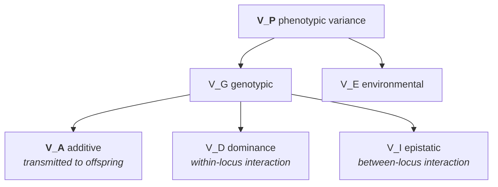

# 31 — Heritability and response to selection

> **Before this:** [Ch 30](30-quantitative-traits.md) · [Ch 26](../part-05-population-genetics/26-hardy-weinberg.md) · **Time:** ~50 min
>
> **Statistics needed:** [S5 Variance and regression](../part-S-statistics/S5-variance-and-regression.md) ·
> [S3 Sampling and estimation](../part-S-statistics/S3-sampling-and-estimation.md)

Heritability is the most misused quantity in biology, and several of the false statements about
it are made by people who can define it correctly. This chapter derives it, derives what it
predicts, and then spends an unusually long section on what it does not.

## What you'll be able to do

- Derive the additive/dominance partition of genotypic variance from a single locus, and say
  why only the additive part is transmitted
- Show that the regression of offspring on midparent has slope exactly h², and state the four
  assumptions that makes true
- Compute h² from parent–offspring, full-sib, half-sib and twin data, and say which of those
  estimates is biased upward and by what
- Explain what GREML and LD score regression estimate, and why that is not the same quantity
  a twin study estimates
- Derive R = h²S, convert a selected fraction into a selection intensity, and predict multi-
  generation response including the erosion of h²
- Diagnose which of the four causes of a selection plateau — exhaustion of V_A, drift, opposing
  natural selection, a physiological limit — is acting, from replicate lines and reverse selection
- Refute, precisely, each of the standard misreadings of a heritability estimate, including the
  malleability error and the between-group-difference error

## The core idea

Variance decomposition and regression coefficients are covered in
[S5](../part-S-statistics/S5-variance-and-regression.md); this chapter assumes them. The content
here is that one particular regression coefficient — the slope of offspring phenotype on parent
phenotype — is *causal* in exactly one narrow sense (it predicts what happens if you breed from
selected parents) and worthless for every other causal question people ask of it.

> **Heritability is not a measure of how genetic a trait is.** It is the fraction of the
> variance *in one population, in one environment, at one time* that is statistically
> predictable from parental phenotype. Change the environmental variance and it changes
> without a single allele moving. It is a property of a population, not of a trait, and never
> of an individual.

---

## 1. Two heritabilities

Start from the partition established in [Ch 30](30-quantitative-traits.md). A phenotype is
genotypic value plus environmental deviation, P = G + E, and if the two are uncorrelated:

```
V_P = V_G + V_E = (V_A + V_D + V_I) + V_E
```



| | Definition | Answers |
|---|---|---|
| **Broad-sense** H² | V_G / V_P | What fraction of variance is attributable to genotype at all? |
| **Narrow-sense** h² | V_A / V_P | What fraction of variance is *predictable from parents*? |

**Why V_A is the transmitted part.** Parents do not transmit genotypes. They transmit one allele
per locus, drawn at random ([Ch 09](../part-02-transmission-genetics/09-mitosis-and-meiosis.md)).
Dominance is a property of a *pair* of alleles, destroyed and re-drawn every meiosis, and a
parent and its offspring can never hold a genotype identical by descent — so **dominance
contributes nothing whatever to parent–offspring covariance.** Epistasis is not so clean.
A combination *across loci* is also broken up every generation, but not completely: the
resemblance between relatives picks up epistatic variance with *squared* coefficients
([Ch 30 §7](30-quantitative-traits.md)), which for additive-by-additive variance means ¼V_AA
between parent and offspring and between full sibs, and ¹⁄₁₆V_AA between half sibs. Epistatic
variance is therefore *partly* transmitted, and is one of the things that quietly inflates any
h² estimated from relatives. The clean statement is the narrow one: V_A is what the
regression on parents recovers, and everything else either vanishes (dominance) or leaks in
at a reduced rate (epistasis).

Make that exact. One locus, alleles A₁ (frequency p) and A₂ (q = 1 − p), genotypic values
scaled about the homozygote midpoint:

```
        A₂A₂        A₁A₂        A₁A₁
         -a           d          +a
```

The population mean is M = a(p − q) + 2pqd. Now ask: if I hand an offspring one allele, by
how much does that shift its expected value? That is the **average effect of a substitution**,
and working through the genotype frequencies gives

```
α = a + d(q − p)
```

An individual's **breeding value** is the sum of the average effects of the alleles it carries
— by construction, the part of its genotypic value that its offspring inherit. The variance of
breeding values and the residual are

```
V_A = 2pq α²          V_D = (2pq d)²
```

Two consequences worth carrying. First, α depends on allele frequency, so **V_A is not a
property of the gene — it is a property of the gene in a population.** A locus with pure
dominance (a = 0, d > 0) still contributes additive variance whenever p ≠ q, because at
unequal frequencies substituting an allele *does* change the expectation on average. Second,
at p = q = ½ that same locus contributes α = 0 and hence no additive variance at all. "Additive"
is a statistical decomposition, not a statement about biochemistry.

## 2. Estimating h² from relatives is one covariance calculation

> **Statistics:** the covariance algebra this section runs on — Var(X + Y) = Var(X) + Var(Y) +
> 2Cov(X, Y), and the least-squares slope Cov(x, y)/Var(x) — is
> [S5](../part-S-statistics/S5-variance-and-regression.md) §§2 and 4.

Write an offspring's breeding value in terms of its parents':

```
A_O = ½A_sire + ½A_dam + m
```

where m is the **Mendelian sampling term** — which allele of each pair got transmitted — with
mean 0 and independent of the parental breeding values. Then

```
Cov(P_O, P_parent) = Cov(A_O + D_O + E_O , A_p + D_p + E_p) = ½ V_A  (+ ¼ V_AA + …)
```

Dominance drops out because a parent and offspring share exactly one allele per locus by
descent and can never share a *genotype* by descent. Epistasis does not drop out: with a
coefficient of relationship r = ½, additive-by-additive variance enters as r²V_AA = ¼V_AA
([Ch 30 §7](30-quantitative-traits.md)), and it is indistinguishable from ½V_A in this one
covariance — so it rides along inside every h² you estimate this way. Environment drops out
only if parents and offspring do not share environments — the assumption that does all the
damage in humans.

**Regression on midparent.** Let MP = (P_sire + P_dam)/2. Under random mating the parents are
uncorrelated, so Var(MP) = (V_P + V_P)/4 = V_P/2, and

```
Cov(P_O, MP) = ½[Cov(P_O,P_sire) + Cov(P_O,P_dam)] = ½[½V_A + ½V_A] = ½V_A

b_O·MP = Cov(P_O, MP) / Var(MP) = (½V_A) / (½V_P) = V_A / V_P = h²
```

The slope *is* the narrow-sense heritability, with no scaling constant. Regress on a single
parent instead and Var(P) is twice as large, so the slope is ½h². This is why the midparent
regression is the canonical estimator, and it is exact only if: parents and offspring share no
environment, there is no genotype–environment correlation, causal loci are in linkage
equilibrium, and the trait is measured on the same scale in both generations.

**Random mating is conspicuously absent from that list.** Let mates correlate ρ for the
phenotype. Assortment makes each parent's phenotype informative about the *other* parent's
breeding value — Cov(A_dam, P_sire) = h² Cov(P_dam, P_sire) = ρ V_A — so the numerator inflates
alongside the denominator, and by the same factor:

```
Cov(P_O, MP) = ¼[V_A + ρV_A + ρV_A + V_A] = ½V_A(1 + ρ)
Var(MP)      = ¼[V_P + 2ρV_P + V_P]       = ½V_P(1 + ρ)

b_O·MP = V_A / V_P = h²      — the (1 + ρ) cancels
```

The offspring–midparent regression is the one design essentially robust to assortative mating.
What assortment *does* change is V_A itself: correlated mates build positive gametic-phase
disequilibrium between like-signed loci, so V_A, and therefore h², is genuinely larger than the
base-population value. The slope reports that inflated *current* h² faithfully. The estimators
it biases are the ones whose numerator has nothing to cancel against — the single-parent slope
becomes ½h²(1 + ρ), and sib correlations rise because the parents' breeding values now covary.

**Sib correlations.** Full sibs share ½ of their genome on average and both alleles at a
quarter of loci; half sibs share ¼ and never both.

| Relationship | Expected covariance | Solve for h² |
|---|---|---|
| Parent–offspring | ½V_A + ¼V_AA | h² = 2 × (single-parent slope) |
| Midparent–offspring | ½V_A + ¼V_AA (over ½V_P) | h² = slope |
| Full sibs | ½V_A + ¼V_D + ¼V_AA + V_common | h² ≤ 2 t_FS |
| Half sibs | ¼V_A + ¹⁄₁₆V_AA + (maternal effects) | h² = 4 t_HS |
| Monozygotic twins | V_A + V_D + V_I + V_common | H² ≤ r_MZ |

The half-sib design is the workhorse in animal breeding precisely because ¼V_A carries no
dominance at all, only ¹⁄₁₆ of V_AA, and no shared rearing environment — half sibs by a common
sire are raised by different dams. The full-sib estimate is an **upper bound**, not an estimate.

## 3. Twins, Falconer's formula, and the assumption underneath

Monozygotic twins share their whole genome; dizygotic twins are ordinary full sibs. If both
kinds share family environment to the same degree c²:

```
r_MZ = h² + d² + c²                 (writing d² = V_D/V_P)
r_DZ = ½h² + ¼d² + c²

r_MZ − r_DZ = ½h² + ¾d²
```

so

```
h² = 2(r_MZ − r_DZ) − 1.5 d²   →   ĥ² = 2(r_MZ − r_DZ)   only when V_D = 0
```

**Falconer's formula is exact only in the absence of dominance and epistasis, and is biased
upward otherwise.** Non-additive variance inflates r_MZ far more than r_DZ, and the formula
charges the whole difference to additivity. Under the same model, c² = 2r_DZ − r_MZ. A negative
c² estimate is the diagnostic: it means the model is wrong, usually because of non-additive
variance or because the equal-environments assumption has failed.

Worked numerically: adult height in a European twin sample, r_MZ = 0.85, r_DZ = 0.50.

```
ĥ² = 2(0.85 − 0.50) = 0.70
ĉ² = 2(0.50) − 0.85 = 0.15
check:  ĥ² + ĉ² = 0.85 = r_MZ  ✓
```

Now suppose r_DZ had been 0.35. Then ĥ² = 2(0.50) = 1.00 and ĉ² = 0.70 − 0.85 = −0.15. The
negative shared-environment term tells you the additive model has failed before you report
anything.

**A binary trait needs one more step.** Everything above correlates measured values, and a
disease gives you nothing to correlate but a 0/1 indicator — so twin studies of disease work on
the latent scale instead: MZ and DZ concordance rates are turned into **tetrachoric**
correlations (the correlation between two standard normals whose thresholded joint distribution
reproduces the observed 2×2 concordance table), Falconer's formula is applied to those, and what
comes out is a heritability *on the liability scale*
([Ch 30 §2](30-quantitative-traits.md)). That distinction is load-bearing rather than pedantic:
a heritability on the observed 0/1 scale depends on both the prevalence and the case fraction
the study happened to sample, so two estimates for the same disease are not comparable until
both have been converted — Ch 30 §2 gives the transformation.

**The equal-environments assumption (EEA).** The design rests entirely on: *MZ and DZ pairs are
equally correlated for trait-relevant environments*. The critiques are real, and not symmetric.

| Critique | Force |
|---|---|
| MZ twins are treated more alike — dressed alike, share friends, spend more time together | Real, and documented. Damages EEA for social and behavioural traits |
| MZ twins share a chorion about two-thirds of the time; DZ never do | Real, and *prenatal*, so it applies even to physical traits |
| Twins are not a random sample of the population | Restricts generalisation, does not by itself bias h² within twins |
| Misclassified zygosity | Biases r_MZ and r_DZ toward each other, so *deflates* h² |
| Assortative mating on the trait inflates r_DZ but not r_MZ | Biases Falconer's h² **downward** — a counterweight to the EEA bias |

The defensible position: twin heritabilities for physical and physiological traits are roughly
credible; for behavioural and social traits they carry an upward bias of unknown size. "Twin
studies are worthless" and "twin studies settle it" are both wrong.

## 4. Estimating h² without using relatives at all

The move that broke the deadlock: stop using *expected* relatedness from a pedigree and use
*realised* relatedness measured from genotypes, among people who are **not** relatives. Two
strangers share, by chance, a genome fraction fluctuating around zero. The fluctuation is tiny,
but measurable — and crucially it is uncorrelated with shared environment, because two people
who happen to share 0.5% more genome than average do not therefore share a household.

**GREML / GCTA.** Build a genomic relationship matrix from M SNPs:

```
Â_jk = (1/M) Σ_i  (x_ij − 2p_i)(x_ik − 2p_i) / [2 p_i (1 − p_i)]
```

with x the 0/1/2 allele count and p_i the allele frequency — a standardised genotype matrix
times its transpose, the correlation-of-individuals dual to the LD matrix of
[Ch 29](../part-05-population-genetics/29-linkage-disequilibrium.md). Then fit the mixed model

```
y = Xb + g + e,     g ~ N(0, Â σ²_g),     e ~ N(0, I σ²_e)
```

by REML and report **h²_SNP = σ²_g / (σ²_g + σ²_e)**. Pairs with  above ~0.025 are dropped,
precisely to kill any relatedness close enough to carry shared environment.

> **Statistics:** the mixed model — a random effect whose covariance *is* a relatedness matrix, and
> the variance components σ²_g and σ²_e it estimates — is covered in
> [S7](../part-S-statistics/S7-high-dimensional-data.md) §8.

**What this estimates is not h².** It is the variance *tagged* by the genotyped SNPs — the
additive variance of causal variants in LD with the array. Rare variants, and variants in
low-LD regions, are invisible to it. h²_SNP ≤ h² by construction.

**LD score regression** gets the same quantity from summary statistics alone. If per-SNP
effects are drawn independently, a SNP tagging more neighbours has a proportionally higher
expected test statistic:

```
E[χ²_j] = (N h²_SNP / M) ℓ_j + N a + 1        where  ℓ_j = Σ_k r²_jk
```

> **Statistics:** χ²_j is the squared standardised effect estimate at SNP j, and a 1-df chi-square
> has mean 1 under the null — [S2](../part-S-statistics/S2-distributions.md) §4. Everything above 1
> in that equation is signal or inflation.

Regress χ² on the LD score ℓ. The **slope** gives h²_SNP; the **intercept** gives the inflation
from population stratification and cryptic relatedness — which is the reason LDSC is used far
more often as a confounding diagnostic than as a heritability estimator.

| | GREML / GCTA | LD score regression |
|---|---|---|
| Input | Individual genotypes | GWAS summary statistics |
| Cost | O(N²) matrix, heavy | Minutes |
| Main assumption | Effect size independent of MAF and LD | Per-SNP h² independent of LD score |
| Fails when | Stratification not fully controlled | Selection makes h² depend on LD (fixed by stratified LDSC) |
| Precision | Higher for a given N | Lower, but scales to any GWAS |

## 5. Missing heritability

Line up the estimates for adult height — the best-measured complex trait there is.

| Estimator | h² for height | What it captures |
|---|---|---|
| Twin / pedigree | ~0.8 | All additive variance, plus any EEA violation and non-additive leakage |
| Common-SNP GREML | ~0.45 | Additive variance tagged by array SNPs |
| Genome-wide-significant SNPs | ~0.40 (European ancestry, 12,111 SNPs from 5.4M people) | Variants that clear p < 5×10⁻⁸ |
| Whole-genome-sequence GREML | ~0.68 | Adds rare and low-LD variants |

The "missing heritability" problem of 2009 was the gap between the first row and what
genome-wide-significant SNPs explained *at the time* — about 5% of the variance, from the ~45
loci then known. The third row shows where that same estimator has got to by 2022, and the
fourth is a large part of the resolution rather than the problem. The gap has largely closed,
and it closed from both ends:

**Rare and low-LD variants.** WGS-based estimates recover most of the gap: rare variants,
especially protein-altering ones in low-LD regions, carry heritability that arrays cannot tag.
That pattern is itself a signature of negative selection — variants with larger effects are
held at lower frequency ([Ch 27](../part-05-population-genetics/27-the-four-forces.md)).

**Pedigree estimates were too high.** Shared environment, assortative mating, and non-additive
variance all inflate the twin numerator. The true additive h² for height is probably nearer
0.7 than 0.8.

**Most causal variants are below the detection threshold.** The gap between h²_SNP and
GWAS-explained variance is not missing at all — it is a power problem, and it closes
monotonically with sample size. Height went from 45 loci to 12,111 by adding people, not by
adding a new kind of variant. ([Ch 51](../part-11-human-and-statistical-genomics/51-gwas.md).)

## 6. The breeder's equation

Select parents whose mean phenotype exceeds the population mean by the **selection
differential** S. What is the offspring mean?

Regress breeding value on phenotype. The slope is Cov(A,P)/V_P = V_A/V_P = h², so

```
E[A | P] = h² (P − μ)
```

The selected parents have mean phenotype μ + S, hence mean breeding value h²S. Offspring get
half of each parent's breeding value, so with both sexes selected equally:

```
R = ½(h²S) + ½(h²S) = h² S
```

That is it. **The breeder's equation is the offspring-on-midparent regression, applied
forward.** It is a prediction of a *response to an intervention* — which is why h², alone
among heritability's uses, is genuinely causal here: you are physically choosing who breeds.

Standardise by expressing S in phenotypic standard deviations. For **truncation selection**
keeping the top fraction p, with x the standard normal quantile and φ the standard normal
density, the **selection intensity** is

```
i = φ(x) / p        and        S = i σ_P        so        R = i h² σ_P = i h σ_A
```

The last form is the useful one: response per generation scales with the *square root* of
heritability times the additive standard deviation.

**Realised heritability** runs the equation backwards. After t generations,
h²_realised = (Σ R) / (Σ S) — the slope of cumulative response on cumulative selection
differential. Divergence between predicted and realised h² is the signal that something in the
model has moved.

**The multivariate extension.** Traits are correlated, and selecting on one drags others.
Lande's equation replaces the scalars with matrices:

```
Δz̄ = G P⁻¹ s = G β
```

G and P are the additive-genetic and phenotypic variance–covariance matrices, s the vector of
selection differentials, and **β = P⁻¹s is precisely a vector of partial regression
coefficients** of relative fitness on the traits — direct selection on each trait holding the
others constant — multiple regression in the sense of
[S5 §6](../part-S-statistics/S5-variance-and-regression.md). The genetics is entirely in G. If G has a
near-null direction, selection along it produces almost no response no matter how hard you
push: populations evolve most easily along the leading eigenvector of G, and that constraint,
not the strength of selection, is often what limits response.

## 7. Why response stops

The Illinois long-term selection experiment has selected maize kernels for high and low oil and
protein since 1896 — one generation a year, past 100 generations. High oil rose from about 4.7%
to roughly 20%, high protein to roughly 27–32%. Both **low** lines hit hard limits: you cannot
select oil content below zero. The high lines were still responding after a century, far beyond
what the starting additive variance could have supported.

Four things end a response, and they are separable:

| Cause | Mechanism | Diagnostic |
|---|---|---|
| **Exhaustion of V_A** | Favourable alleles fixed; V_A → 0 | Response decays smoothly; reverse selection also fails |
| **Drift** | With small N_e, alleles fix at random before selection can act. Robertson's limit: total advance ≈ 2N_e × R₁ | Replicate lines plateau at *different* means |
| **Opposing natural selection** | Extreme genotypes are sterile or inviable; fitness declines until it cancels artificial selection | Response stops while V_A remains; relaxing selection causes regression |
| **Physiological limit** | The trait cannot go further (oil ≥ 0) | Asymmetric — one direction stops, the other doesn't |

Against those, **new mutation** supplies fresh additive variance every generation — of order
10⁻³ V_E per generation — which is why lines can keep creeping upward long after the founding
variation is spent. The Illinois high lines are the standing demonstration.

**Genetic gain versus natural selection.** The equation is the same; the control surface is not.

| | Breeder | Nature |
|---|---|---|
| S | Chosen. Truncate at any p | Determined by the fitness function, usually weak |
| Target | Fixed by the breeder, held for decades | Moves; often stabilising rather than directional |
| Accuracy | Improvable — progeny testing, or genomic prediction from a training set | Phenotype only |
| Generation interval L | Shortenable. Rate of gain is i·r·σ_A / L | Fixed by biology |
| Fitness cost | Ignored until inbreeding depression bites | Is the criterion |

Genomic selection is the modern lever: predict breeding value from markers
([Ch 53](../part-11-human-and-statistical-genomics/53-polygenic-scores.md)), select before the
animal or plant is ever phenotyped, and collapse L. The gain comes from the denominator.

---

## Common misconceptions

| What people think | What's actually true |
|---|---|
| Heritability measures how genetic a trait is | It measures what fraction of *variance in one population* tracks genotype. Number of fingers is almost perfectly genetically determined and has heritability near zero, because nearly all the variance in fingers is accidents |
| A trait has a heritability | A trait has a heritability *in a population, in an environment, at a time*. Equalise the environment and h² rises; diversify it and h² falls. The genotypes need not change at all |
| h² = 0.5 means half of my height came from my genes | Heritability is not a partition of an individual's trait *value*. Your height is not 50% genes and 50% food; it is 100% both. Variance decomposes; individuals do not |
| High heritability means the trait can't be changed | It says nothing about malleability. See below — this is the big one |
| Heritability tells you the cause of a group difference | It carries no information whatsoever about between-group differences. See the two-pots argument below |
| A heritability estimate is a fixed constant | Change V_E and h² = V_A/(V_A+V_E) changes with no genetic change. Reported heritabilities differ across countries and decades for exactly this reason |
| Heritability = 0 means genes are irrelevant | It means genes don't explain *variation here*. A universally fixed allele contributes nothing to variance and everything to the phenotype |
| SNP heritability and twin heritability are the same number measured two ways | They are different estimands. h²_SNP is the variance tagged by common SNPs; twin h² is total additive variance plus several biases. They are not supposed to agree |

### High heritability does not mean unchangeable

The single most consequential error. Two counterexamples, both decisive.

**Height.** Heritability of adult height in developed populations is around 0.7–0.8. Dutch mean
male height rose roughly 20 cm between the mid-nineteenth century and now, driven by nutrition,
sanitation and disease burden. Heritability stayed high throughout, because it measures the
*ranking* within a cohort, and the ranking is genetically stable even while the whole
distribution translates upward by more than two standard deviations. **A high h² constrains
nothing about the mean.**

**Phenylketonuria.** PKU is caused by variants in *PAH*, is essentially fully genetic, and
untreated causes severe irreversible intellectual disability. It is also completely preventable
by a low-phenylalanine diet started in infancy — which is why every newborn in the developed
world is screened for it. Heritability near 1; environmental intervention near total. The
intervention did not exist in the environments over which heritability was estimated, and
heritability could not have told you it would work.

The general principle: **heritability is estimated over the range of environments that happened
to be present.** It is silent about environments outside that range, and interventions are
precisely attempts to move outside that range.

### The two pots: heritability says nothing about group differences

Lewontin's thought experiment. Take a genetically variable batch of seed. Split it at random
into two pots.

```
POT A — full nutrient soil          POT B — depleted soil
  ██████████ 30 cm                    ████ 12 cm
  ████████   26 cm                    ███  10 cm
  ███████████ 33 cm                   █████ 14 cm
  ████████   27 cm                    ████ 12 cm
  mean 29 cm                          mean 12 cm

WITHIN each pot: environment is uniform, so essentially
all variance is genetic  →  h² ≈ 1 in both pots.

BETWEEN pots: the 17 cm difference is 100% environmental,
by construction — the seed was randomised.
```

Heritability within each group is as high as it can be. The difference between the groups is
entirely environmental. Both statements are true simultaneously, and this is not a special case
or a contrived edge — it is the general situation, because **heritability is computed from
within-group variance and contains no information about between-group means.**

Add the reverse case and the point is airtight: run both pots on identical soil, using seed from
two genetically distinct sources, and you get zero within-pot heritability differences
explaining a between-pot gap that is entirely genetic. The within-group statistic is compatible
with any between-group cause. No amount of within-population heritability licenses any
inference about the source of a difference between populations — which are, in the human case,
never randomised into their environments. [Ch 58](../part-12-applications-and-ethics/58-ethics-and-society.md)
takes the social history of this error seriously.

## Worked example

A crop breeder measures seed oil content in a large random-mating population.

- Population mean μ = 8.00%
- Phenotypic variance V_P = 4.00 %², so σ_P = 2.00%
- Regression of offspring on midparent, from 400 families: slope = 0.45

**Step 1 — heritability and its components.**

```
h²  = b_O·MP = 0.45
V_A = h² V_P = 0.45 × 4.00 = 1.80 %²
V_resid (dominance + epistatic + environmental) = 4.00 − 1.80 = 2.20 %²
```

**Step 2 — selection intensity for the top 10%.**

Truncation point: x = Φ⁻¹(0.90) = 1.2816.

```
φ(1.2816) = (1/√(2π)) e^(−1.2816²/2)
          = 0.39894 × e^(−0.82125)
          = 0.39894 × 0.43989 = 0.17549

i = φ(x)/p = 0.17549 / 0.10 = 1.755
```

**Step 3 — first-generation response.**

```
S = i σ_P = 1.755 × 2.00 = 3.510 %      (selected parents mean 8.00 + 3.51 = 11.51%)
R = h² S  = 0.45 × 3.510 = 1.580 %
new mean  = 8.00 + 1.58 = 9.58 %
```

**Step 4 — why generation 2 will disappoint.** Truncation does not just shift the mean, it
shrinks the variance. For truncation at x with intensity i, the variance-reduction coefficient
is

```
k = i(i − x) = 1.755 × (1.755 − 1.2816) = 1.755 × 0.4734 = 0.831
```

so the selected parents' phenotypic variance is V_P(1 − k) = 4.00 × 0.169 = 0.68 %². Selection
generates negative linkage disequilibrium between loci with like-signed effects — the **Bulmer
effect**. Segregation and recombination restore half of it each generation, so:

```
V_A(1) = V_A (1 − ½ k h²)
       = 1.80 × (1 − 0.5 × 0.831 × 0.45)
       = 1.80 × (1 − 0.1870) = 1.80 × 0.8130 = 1.463 %²

V_P(1) = 1.463 + 2.20 = 3.663 %²        σ_P(1) = √3.663 = 1.914 %
h²(1)  = 1.463 / 3.663 = 0.399
```

**Step 5 — corrected second-generation response.**

```
R(2) = i h²(1) σ_P(1) = 1.755 × 0.399 × 1.914 = 1.340 %
```

against 1.580% if you had naively reapplied the original h² — a 15% shortfall in one
generation. Five generations of naive extrapolation predicts 8.00 + 5(1.58) = 15.90%; the real
trajectory falls well short of it, and would fall further once allele frequencies begin to move
and V_A erodes for real rather than by disequilibrium alone.

**Step 6 — audit.** After five generations the breeder observes a cumulative response of 6.30%
against a cumulative selection differential of 16.20%:

```
h²_realised = 6.30 / 16.20 = 0.389
```

Lower than the pedigree estimate of 0.45, exactly as the Bulmer calculation predicted. Realised
heritability is the number to trust, because it is the only one measured on the intervention
you actually performed.

## Connections

- **Back to:** [Ch 30](30-quantitative-traits.md) for the variance partition and the
  infinitesimal model; [Ch 26](../part-05-population-genetics/26-hardy-weinberg.md) for the
  allele-frequency algebra behind α and V_A;
  [Ch 28](../part-05-population-genetics/28-structure-and-inbreeding.md) for why relatedness is
  a covariance; [Ch 29](../part-05-population-genetics/29-linkage-disequilibrium.md) for the r²
  that LD score regression sums
- **Forward to:** [Ch 32](32-mapping-quantitative-traits.md) locates the loci behind V_A;
  [Ch 51](../part-11-human-and-statistical-genomics/51-gwas.md) is GREML's estimand at variant
  resolution; [Ch 53](../part-11-human-and-statistical-genomics/53-polygenic-scores.md) turns
  h²_SNP into a per-person prediction and inherits every caveat above;
  [Ch 33](../part-07-molecular-evolution/33-neutral-theory-and-selection-tests.md) is the
  natural-selection counterpart of §7;
  [Ch 58](../part-12-applications-and-ethics/58-ethics-and-society.md) on the misuse

## Check yourself

**1. A trait has h² = 0.6 in Norway and h² = 0.3 in a population with far more variable childhood nutrition. The allele frequencies are identical. Explain.**

<details><summary>Answer</summary>

h² = V_A/(V_A + V_E). V_A is the same in both. The second population has larger V_E, so the
same V_A is a smaller fraction of a larger denominator. Nothing genetic differs. This is the
routine reason heritability estimates vary across countries and decades, and it is why an h²
is only interpretable alongside a description of the environment it was measured in.

</details>

**2. Why does the slope of offspring on *midparent* equal h², while the slope on a single parent equals ½h²?**

<details><summary>Answer</summary>

Both have covariance ½V_A with the offspring — the midparent because it averages two ½V_A
covariances, giving ½V_A again. The denominators differ. Var(single parent) = V_P;
Var(midparent) = V_P/2 under random mating, because averaging two independent parents halves
the variance. So ½V_A / V_P = ½h² versus ½V_A / (½V_P) = h². The factor of two lives entirely
in the variance of the predictor.

Note what this does *not* imply. Assortative mating correlates the parents and inflates Var(MP)
above V_P/2 — but it inflates Cov(P_O, MP) by the identical factor (1 + ρ), because each parent's
phenotype now predicts the other's breeding value. The two cancel and the midparent slope
remains an unbiased estimate of the *current* h². It is the single-parent slope, which becomes
½h²(1 + ρ), that assortative mating inflates.

</details>

**3. A twin study returns r_MZ = 0.74, r_DZ = 0.30. Compute h² and c², and say what the result tells you about the model.**

<details><summary>Answer</summary>

h² = 2(0.74 − 0.30) = 0.88. c² = 2(0.30) − 0.74 = 0.60 − 0.74 = −0.14. A negative shared-
environment variance is impossible, so the additive model is wrong. The usual culprit is
non-additive variance: dominance and epistasis inflate r_MZ (which captures V_D fully) far more
than r_DZ (which captures only ¼ of it), and Falconer's formula charges all of that to h². The
honest report is that h² ≤ 0.88 with an unknown non-additive component, not h² = 0.88.

</details>

**4. GREML on 20,000 unrelated people gives h²_SNP = 0.25 for a trait whose twin heritability is 0.60. Give three explanations that do not require either estimate to be wrong.**

<details><summary>Answer</summary>

(i) Causal variants that are rare or in low LD with array SNPs are untagged by the GRM, so
h²_SNP is a lower bound on h² by construction — WGS-based estimates typically recover a large
part of the gap. (ii) The twin estimate includes dominance, epistasis, shared environment and
any EEA violation, all of which inflate it above true additive h². (iii) The two estimands
differ in scope: GREML on unrelateds deliberately excludes the relatedness range where shared
environment lives, and therefore excludes any genotype–environment correlation that the twin
design silently counts as genetic. All three can be true at once, and for most traits all three
are.

</details>

**5. A breeder selecting the top 5% (i = 2.06) on a trait with σ_P = 10 and h² = 0.30 predicts R = 6.2 units per generation. After eight generations the observed cumulative gain is 28 units, not 50. Give three distinct explanations and say how you would distinguish them.**

<details><summary>Answer</summary>

Predicted per generation: R = i h² σ_P = 2.06 × 0.30 × 10 = 6.18, so 8 × 6.18 = 49.4 units
expected against 28 observed; realised h² = 28/49.4 × 0.30 ≈ 0.17.

(i) **Bulmer effect** — truncation generates negative LD, shrinking V_A within a few
generations; distinguish by measuring V_A directly, and by relaxing selection for two
generations and seeing V_A recover as recombination breaks the disequilibrium. (ii) **Allele
fixation** — favourable alleles have gone to fixation, permanently reducing V_A; distinguish by
reverse selection, which will also fail, and by replicate lines converging on similar means.
(iii) **Opposing natural selection** — extreme individuals have reduced fertility or viability,
so the effective selection differential is smaller than the nominal one; distinguish by
measuring realised reproductive contributions rather than assuming the intended ones, and by
observing regression toward the original mean when artificial selection is relaxed. A fourth
worth checking: **drift**, if N_e is small — diagnosed by replicate lines plateauing at
*different* means, which none of the other three predict.

</details>
