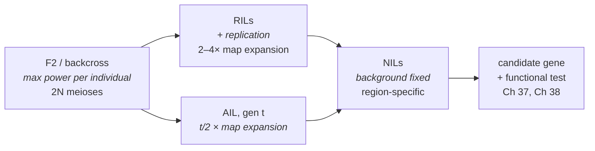
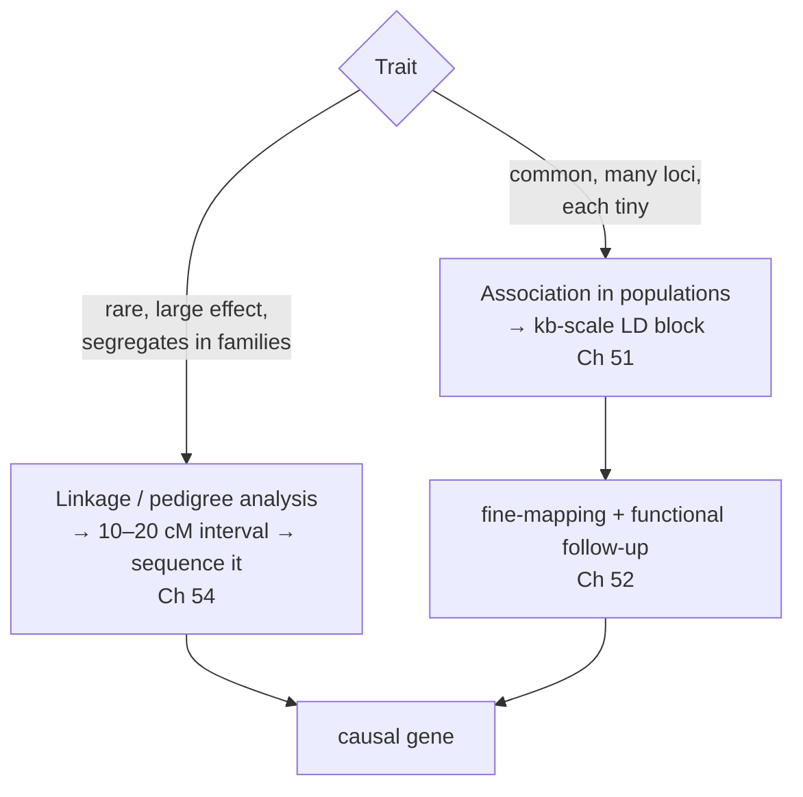

# 32 — Mapping quantitative traits

> **Before this:** [Ch 14](../part-02-transmission-genetics/14-linkage-and-mapping.md) ·
> [Ch 30](30-quantitative-traits.md) · [Ch 31](31-heritability-and-selection.md) ·
> **Time:** ~50 min
>
> **Statistics needed:** [S3 Sampling and estimation](../part-S-statistics/S3-sampling-and-estimation.md) ·
> [S4 Hypothesis testing](../part-S-statistics/S4-hypothesis-testing.md) ·
> [S5 Variance and regression](../part-S-statistics/S5-variance-and-regression.md) ·
> [S6 Likelihood and LOD scores](../part-S-statistics/S6-likelihood-and-bayes.md)

Chapters 30 and 31 treated the genome as an anonymous source of additive variance. That was
deliberate: you can predict a selection response without knowing a single locus. This chapter
asks the harder question — *where are they?* — and it is the hinge between quantitative
genetics and genomics.

## What you'll be able to do

- Derive the attenuation factor (1 − 2r) that links a marker's phenotypic contrast to the
  QTL's true effect, show it equals e^(−2d) under the Haldane map function, and explain why that
  one equation in two unknowns is what interval mapping's mixture likelihood resolves
- Diagnose a ghost peak between two linked QTLs, and say which composite-interval-mapping
  cofactors split it and why the threshold must then be permuted with cofactor selection inside
  the loop
- Set a genome-wide threshold by permutation, and say precisely what the permutation preserves
  that Bonferroni destroys
- Rank F2, RIL, NIL and AIL designs on power and on resolution, with the scaling arguments
- Compute a QTL support interval from the sample size and the standardised substitution effect,
  and explain why the interval stays wide however densely you genotype
- Quantify the Beavis effect and derive the minimum reportable effect size of an experiment
- Explain why linkage analysis solved Mendelian disease and stalled on complex traits, why that
  failure produced GWAS, and where the common-disease/common-variant hypothesis and the
  omnigenic model now stand against the evidence

## The core idea

You cannot see the locus. You can see markers. Linkage makes a marker genotype a *noisy proxy*
for the causal genotype, and — this is the whole chapter — the noise has a closed form. A
marker at recombination fraction *r* from a QTL misclassifies the QTL genotype at rate *r*,
and the resulting attenuation of the observed effect is exactly (1 − 2r).

> **QTL mapping is measurement error in the predictor, with a known error rate.** Everything
> downstream — the confounding of effect with distance, the mixture-model likelihood, the wide
> confidence intervals, the Beavis effect, and eventually the r² attenuation in GWAS — is a
> consequence of that single fact.

Measurement error in a regressor attenuates the coefficient and inflates the sample size needed
to detect it; regression coefficients and what moves them are covered in
[S5](../part-S-statistics/S5-variance-and-regression.md), and this chapter assumes them.
Genetics hands you the reliability coefficient for free, as a function of map distance.

---

## 1. The one derivation

Take a backcross. Cross two inbred lines, then cross the F1 back to one parent. A QTL with
alleles *Q*/*q* sits at recombination fraction *r* from marker *M*/*m*. The F1 is *MQ*/*mq*;
its gametes are:

```
   parental   M Q      (1 − r)/2
   parental   m q      (1 − r)/2
   recombinant M q     r/2
   recombinant m Q     r/2
```

Backcross progeny carrying the *M* allele therefore carry *Q* with probability (1 − r); those
carrying *m* carry *Q* with probability *r*. Let δ = μ_Qq − μ_qq be the QTL's genotypic
contrast. Then

```
E[y | M·] = (1 − r)·μ_Qq +      r·μ_qq
E[y | m·] =      r·μ_Qq + (1 − r)·μ_qq
────────────────────────────────────────
difference = (1 − 2r)·δ
```

The marker contrast is the QTL contrast shrunk by (1 − 2r). Since variance explained goes as
the square of the contrast,

**σ²_marker / σ²_QTL = (1 − 2r)²**

and the non-centrality of the test — hence the sample size you need — scales as
*N*(1 − 2r)²δ²/σ².

> **Statistics:** the non-centrality parameter, and how it converts into power, are covered in
> [S4](../part-S-statistics/S4-hypothesis-testing.md) §4.

Under the **Haldane map function** *r* = (1 − e^(−2d))/2 with *d* in Morgans, so
**1 − 2r = e^(−2d)** exactly. The signal decays exponentially in map distance: the effect
estimate by e^(−2d), the variance explained by e^(−4d).

In an F2 the same algebra with three genotype classes (values *a*, *d*, −*a*) gives

| Contrast | Expectation | Attenuation |
|---|---|---|
| E[y\|*MM*] − E[y\|*mm*] | 2*a*(1 − 2r) | (1 − 2r) |
| E[y\|*Mm*] − ½(E[y\|*MM*] + E[y\|*mm*]) | *d*(1 − 2r)² | (1 − 2r)² |

Dominance attenuates *twice as fast* as additivity, because detecting it requires both
chromosomes to be correctly classified. Dominance effects are systematically harder to map,
and this is why — not because they are rarer.

## 2. Designs: buying power and buying resolution separately

Power comes from sample size, effect size, and control of environmental variance. Resolution
comes from **the number of recombination events that have accumulated between the founders and
the individuals you phenotype**. These are different currencies, and designs buy them
differently.

An F2 individual carries the products of two meioses. In a region spanning recombination
fraction *r*, an F2 of *N* individuals contains roughly 2*Nr* recombination breakpoints. That
number is your positional information. Nothing else is.

| Design | Recombination accumulated | Power | Resolution | Cost |
|---|---|---|---|---|
| **Backcross** | 1 meiosis per individual | Good; only 2 genotype classes, simple | Coarse (10–30 cM) | Cheapest |
| **F2** | 2 meioses per individual | Best per individual; estimates *a* and *d* | Coarse | Cheap, one generation |
| **RIL** (recombinant inbred lines) | 2× (selfing) or 4× (sib-mating) an F2, and homozygous throughout | High — genotype once, phenotype *k* times, so line-mean environmental variance is σ²_E/*k* | ~2–4× better than F2 | 8+ generations to construct; then reusable forever |
| **NIL** (near-isogenic lines) | One region segregating on a fixed background | Very high for that region — background genetic variance is zero | Excellent, but only where you already looked | No genome scan; many lines needed |
| **AIL** (advanced intercross) | *t*/2 × an F2 after *t* generations of random intercrossing | Same per individual as F2 | ~2/*t* the interval width | *t* generations of breeding; needs dense markers to keep up |

Two of these deserve the algebra.

**RILs decouple power from resolution.** Because a RIL is an immortal homozygous genotype, you
can phenotype *k* replicates. The line mean has environmental variance σ²_E/*k*, so the
heritability of the *line mean* is σ²_G/(σ²_G + σ²_E/*k*) → 1 as *k* grows. You buy power
without buying a single extra recombination event. Separately, the repeated generations of
inbreeding accumulate crossovers: for selfing-derived RILs the observed recombination fraction
is R = 2r/(1 + 2r), for sib-mated RILs R = 4r/(1 + 6r) — map expansion factors approaching 2
and 4 for tight linkage.

**AILs buy resolution and nothing else.** After *t* generations of random intercrossing from an
F2, tightly linked loci recombine at approximately (*t*/2)·*r*. Generation 20 gives a tenfold
map expansion, so a 20 cM interval becomes 2 cM. Per individual, power is unchanged — you have
simply spread the same positional information over a finer grid, which is only useful if you
also genotype finely enough to see it.



## 3. Single-marker analysis, and what it cannot do

Regress phenotype on marker genotype, one marker at a time. In a backcross that is a two-sample
*t*-test; in an F2, a one-way ANOVA over three classes, or a regression on the additive code
(−1, 0, 1) plus a dominance code. It is valid, it is fast, and it was how QTL mapping was done
before 1989.

Its defect is structural, not statistical: **the estimate is (1 − 2r)δ, which is one equation
in two unknowns.** A QTL of effect δ at *r* = 0.15 and a QTL of effect 0.7δ sitting on top of
the marker produce identical data. You cannot report an effect size and you cannot report a
position; you can only report that *something* is near this marker.

Two further costs. Power drops with the square of the attenuation, so a QTL sitting midway
between sparse markers is detected with (1 − 2r)² of its full signal from either side — with
markers 40 cM apart, roughly half. And missing genotype data at a marker simply removes those
individuals from that test.

## 4. Interval mapping: put the QTL between the markers

Lander and Botstein's 1989 move: stop testing markers and start testing *positions*. Walk a
hypothetical QTL along the interval between two flanking markers, at every position *z*
computing the conditional distribution of the unobserved QTL genotype given the observed
flanking marker genotypes and the two recombination fractions *r*₁, *r*₂ that *z* implies.

> **Statistics:** likelihood, maximum likelihood, and the likelihood-ratio scale that a LOD score
> reports are covered in [S6](../part-S-statistics/S6-likelihood-and-bayes.md) §§3–4.

That gives a finite mixture with **known, individual-specific mixing weights**:

```
y_i  ~  Σ_g  p_ig(z) · N(μ_g , σ²)
```

where *p_ig*(z) = P(QTL genotype *g* | flanking markers of individual *i*, position *z*). The
weights are pure genetics — no parameters — and they are what makes *z* identifiable. Fit by EM:

- **E-step:** posterior weight w_ig ∝ p_ig(z)·φ(y_i; μ_g, σ)
- **M-step:** μ̂_g = Σ_i w_ig y_i / Σ_i w_ig ; σ̂² = (1/N) Σ_i Σ_g w_ig (y_i − μ̂_g)²

which is weighted least squares with soft class assignments — the standard normal-mixture EM,
except that the mixing proportions are fixed by the map rather than estimated.

At each *z* compute

```
LOD(z) = log₁₀ [ L(μ̂₁, μ̂₂, …, σ̂ | QTL at z) / L(μ̂, σ̂ | no QTL) ]
```

and plot LOD against genome position. The peak estimates location; its height tests existence.
Because the mixture is degenerate at a fully informative marker and genuinely mixed between
markers, the profile has curvature — which is exactly the positional information single-marker
analysis threw away.

**Haley–Knott regression** replaces the mixture with an ordinary regression of *y* on
E[QTL genotype | markers]. It is a moment approximation to the likelihood: two orders of
magnitude faster, peaks in nearly the same place, but it misstates the residual variance and
degrades where marker data are sparse or missing. It is what most software does inside a
permutation loop.

## 5. Composite interval mapping and multiple-QTL models

Interval mapping fits one QTL against a null of none, which is wrong in two ways.

**Unmodelled QTLs elsewhere inflate σ².** Every locus you ignore sits in the residual, lowering
power everywhere. **Linked QTLs generate ghosts.** Two real QTLs flanking an empty interval
produce a single spurious peak between them — the mixture model's best one-QTL explanation of a
two-QTL reality.

**Composite interval mapping** (Zeng 1993, 1994; Jansen 1993) fixes both by including selected
markers elsewhere in the genome as covariates while scanning. This is ordinary conditioning:
cofactors on other chromosomes absorb background genetic variance; cofactors on the same
chromosome block the linked QTL, restoring the ghost peak to two peaks. A **window** around the
test position excludes cofactors that would compete with the QTL being tested and steal its
signal.

Three assumptions worth naming, because each breaks:

| Assumption | What breaks when it fails |
|---|---|
| The cofactor set is fixed and correct | It is chosen by stepwise selection from the same data. The null distribution of the scan is therefore not the null distribution of a fixed-cofactor scan — thresholds must be permuted with cofactor selection *inside* the loop |
| One QTL per interval | Multiple linked causal loci are reported as one QTL of intermediate position and inflated effect |
| Effects are additive across loci | Epistasis is common in crosses. Multiple-QTL models (MQM, MIM) fit *k* positions plus interaction terms, turning the analysis into model selection over a combinatorial space with penalties calibrated by permutation |

## 6. Thresholds: LOD, and why permutation

A LOD score is log₁₀ of a likelihood ratio, not a *p*-value. Twice the natural-log likelihood
ratio is asymptotically χ², so **χ² = 2ln(10)·LOD ≈ 4.605·LOD**. LOD 3 gives χ²₁ = 13.8, a
nominal two-sided *p* ≈ 2 × 10⁻⁴.

The conventional threshold of 3 comes from Morton (1955) and its justification is Bayesian, not
frequentist: for two randomly chosen human loci the prior odds of linkage are roughly 1:50, so a
likelihood ratio of 1000:1 yields posterior odds near 20:1 — about a 5% error rate. That
argument is specific to the human genome's map length and to a sequential test on single
families. It does not transfer to a genome scan in a mouse cross, and it should never be
repeated as though it did.

For genome scans the correct object is the null distribution of the **maximum** LOD over the
whole genome, and it is not χ². Under the null the position parameter is unidentified — a
regularity failure, not a small-sample problem — so the asymptotics are those of the supremum
of a correlated random field, and depend on genome length in Morgans, marker density, cross
type and missing-data pattern.

**Bonferroni is the wrong correction** because adjacent tests are near-duplicates. The effective
number of independent tests is set by the number of independent recombination intervals — that
is, by genome length in Morgans — not by the number of markers. Past roughly one marker per few
cM, additional markers add essentially nothing to the multiple-testing burden, and Bonferroni
charges you for all of them anyway.

> **Statistics:** Bonferroni, and the idea of an *effective* number of independent tests, are
> covered in [S7](../part-S-statistics/S7-high-dimensional-data.md) §2.

**Permutation** (Churchill & Doerge 1994) is the right answer. Shuffle the phenotype vector
against the intact genotype matrix, rerun the whole scan, record the maximum LOD. Repeat
1,000 times for a 5% threshold, ~10,000 for a stable 1% tail. What this preserves:

- the entire marker correlation structure — map, density, missing-data pattern — exactly
- the empirical phenotype distribution, so non-normality and outliers are handled automatically
- the *selection* step, if you reselect cofactors inside each permutation
- and it targets the genome-wide maximum, which is the statistic you are actually thresholding

What it assumes: **exchangeability of phenotypes under the null.** That holds in a designed
cross. It fails with population structure or unequal relatedness (outbred panels, AILs, human
cohorts), with covariates correlated with genotype, and under selective genotyping — in those
cases you must permute within strata, permute residuals, or abandon permutation for a
parametric threshold.

For human genome-wide linkage scans, Lander and Kruglyak (1995) gave threshold conventions of
roughly LOD 2.2 for "suggestive" and 3.6 for "significant" evidence in sib-pair analysis. Their
mouse thresholds move in *both* directions, which makes the point: 1.9/3.3 for a backcross,
lower because the mouse genome is shorter, but 2.8/4.3 for an F2, higher because every position
is tested on two parameters rather than one. The exact values depend on design and map density,
and the paper's real contribution was insisting that any threshold be justified against the
genome-wide null at all.

## 7. Confidence intervals, and why they are wide

Two standard constructions: the **1-LOD** (or 1.5-LOD) **support interval** — the positions
whose LOD is within one unit of the peak — and the nonparametric **bootstrap** over individuals.

Both come out wide, and the reason is not statistical inefficiency. Positional information
comes only from recombination breakpoints that actually occurred near the QTL, and there are
very few. In an F2 of *N* = 200, a 1 cM window contains about 2 × 200 × 0.01 = 4 breakpoints.
You cannot localise more finely than the recombination events you observed, and each of those
is informative only in proportion to the phenotypic signal it carries.

The standard rule of thumb (Darvasi & Soller 1997) puts the 95% interval at approximately
**3000/(N·d²) cM** in a backcross and about half that in an F2, where *d* is the **average
effect of an allele substitution** — α from [Ch 30](30-quantitative-traits.md) §4, which for
an additive QTL at frequency ½ is *a*, that is *half* the homozygote difference — measured in
residual (within-genotype) standard deviations. Read *d* as the homozygote difference instead
and you double it, and since the expression is inverse-square you report an interval four
times too narrow. Treat the constant as an order of magnitude; the scaling — inverse in *N*,
inverse in the *square* of the effect — is the durable part. Halving the effect quadruples the
interval.

## 8. The Beavis effect

Estimate a QTL's effect and it is roughly unbiased. Estimate it *conditional on having declared
it significant* and it is not. Writing δ̂ ~ N(δ, σ²_δ̂),

```
E[δ̂ | δ̂ > c] = δ + σ_δ̂ · λ((c − δ)/σ_δ̂),     λ(x) = φ(x)/(1 − Φ(x))
```

the inverse Mills ratio. When power is high (c ≪ δ) the correction vanishes. When power is low
(c ≫ δ), λ(x) → x and the expression collapses to E[δ̂ | significant] ≈ *c*: **the reported
effect is pinned near the detection threshold, almost independently of the truth.**

Beavis's simulations put numbers on it: with ~100 progeny, effect estimates are typically about
double the true value; with ~500, the inflation is modest; with ~1,000, largely gone.

Three consequences:

- Summed across detected QTLs, "variance explained" routinely exceeded the trait's heritability
  in early studies. That was arithmetic, not biology.
- Effect estimates shrink on replication. This is regression to the mean and is *expected* for
  real loci. It is not evidence the original finding was false.
- The fix is to estimate effects in an independent sample, or apply a conditional-likelihood or
  shrinkage correction. Never quote the discovery effect size.

You will meet this again, unchanged, in GWAS and in polygenic score construction
([Ch 53](../part-11-human-and-statistical-genomics/53-polygenic-scores.md)). It is the same
winner's curse covered in [S7](../part-S-statistics/S7-high-dimensional-data.md) §6, and the same
one behind published-effect-size inflation generally.

## 9. Power versus resolution: the fundamental trade

| | Cross-based QTL mapping | Population association mapping |
|---|---|---|
| Alleles per locus | 2, by construction | Many, unknown |
| Allele frequency | 0.5, by construction | Whatever it is — often rare |
| Environment | Controlled, replicable | Uncontrolled, confounded |
| Recombination available | ~2N meioses since the founders | Millions of ancestral meioses |
| Resolution | 5–30 cM (Mb-scale, 10²–10³ genes) | LD-block scale (kb) |
| Power per locus | Very high | Very low |
| Generalises to natural variation | No — two founders only | Yes |

The trade is not a defect of either method. It is the same information appearing in two forms.
A cross concentrates all its variance into one contrast at frequency ½ and then has almost no
recombination to localise it. A population has spent thousands of generations shattering
haplotypes into kb fragments — perfect localisation — but distributes the causal signal across
many rare alleles in an uncontrolled environment.

## 10. Humans: why linkage stalls on complex traits

Human linkage analysis is QTL mapping in pedigrees, and for Mendelian disease it worked
magnificently: cystic fibrosis, Huntington's, and hundreds of others were localised by tracking
co-segregation through families and then sequencing the interval.

It fails for complex traits for two independent reasons.

**Effect size.** Linkage detects excess allele sharing among affected relatives, and that signal
falls off brutally as the genotype relative risk approaches 1. Risch and Merikangas (1996) made
the comparison concrete: for a variant of frequency 0.1 conferring a genotype relative risk of
1.5, an affected-sib-pair linkage study needs about 68,000 sib-pair families, while a
family-based association test — the TDT, run on affected singletons and their parents — needs
about 2,200 trios. Roughly a thirtyfold difference, and it widens enormously for rarer alleles:
at frequency 0.01 the same relative risk demands 4.6 million sib-pair families against about
19,000 trios. That paper is, in retrospect, the design document for GWAS.

**Recombination supply.** A meiosis produces only a few dozen crossovers, so a nuclear family
offers a few dozen breakpoints total. Affected relatives share chromosome-arm-scale segments.
Linkage therefore cannot resolve below roughly 10–20 cM no matter how many families you collect
— and for a complex trait there is no large pedigree with clean segregation to collect.

Add **locus heterogeneity** — different families with different causal loci, which averages the
linkage signal toward zero — and the method is out of options.



## 11. Common variants, polygenicity, and the omnigenic proposal

The **common-disease/common-variant** hypothesis (Lander 1996; Chakravarti 1999; Reich & Lander
2001) argued that because common diseases are old and human populations passed through a
bottleneck and rapid expansion, the alleles contributing to them should themselves be
comparatively common and shared across populations. That is a testable population-genetic claim,
and it is what justified building fixed genotyping arrays that tag common variation through LD
rather than sequencing everyone.

The verdict is a partial vindication with a large correction. Common variants *do* carry a
substantial share of heritability, and arrays did work. But the **effect sizes were roughly an
order of magnitude smaller than anticipated**, so studies powered for odds ratios near 1.5 found
nothing and studies of hundreds of thousands of people found thousands of loci with odds ratios
near 1.05. "Common" was right; "detectable in a few hundred cases" was badly wrong. Rare
variants of larger effect also contribute ([Ch 54](../part-11-human-and-statistical-genomics/54-rare-variants-and-mendelian-disease.md)),
so the common-versus-rare framing was a false dichotomy.

What emerged instead is extreme **polygenicity**: for traits like height, tens of thousands of
contributing variants, heritability spread across essentially every chromosome roughly in
proportion to chromosome length, and enrichment in regulatory regions active in trait-relevant
tissues rather than in coding sequence.

The **omnigenic model** (Boyle, Li & Pritchard 2017) proposes an explanation: gene-regulatory
networks within a relevant cell type are sufficiently interconnected that essentially every gene
expressed in that tissue perturbs the trait a little, via *trans* effects propagating to a small
number of "core" genes with direct biological roles. On this account most heritability sits in
"peripheral" genes with no specific relationship to the trait.

Present this as a hypothesis, because it is one. The principal critique
(Wray, Wijmenga, Sullivan, Yang & Visscher 2018) is that the observed polygenicity is already
what standard quantitative-genetic models with many loci predict, so no new framework is
required; that the core/peripheral distinction has not been shown to be empirically separable;
and that a model in which every gene matters is difficult to falsify. The trans-regulatory
effects the model requires are individually tiny — consistent with the proposal, and also the
reason it is hard to test. What is *not* in dispute is the polygenicity itself, and its
practical consequence: the map from a significant association to a mechanism is many-to-one
([Ch 52](../part-11-human-and-statistical-genomics/52-association-to-mechanism.md)).

## 12. G×E, and why it is statistically hard

Fit y = β₀ + β_G·G + β_E·E + β_GE·(G×E) + ε and test β_GE. Four things make this much harder
than it looks.

**Power.** Take a balanced 2×2 design with *n* per cell. The main-effect contrast has variance
σ²/n; the interaction contrast (ȳ₁₁ − ȳ₁₀) − (ȳ₀₁ − ȳ₀₀) has variance 4σ²/n. The standard error
is twice as large, so **detecting an interaction of a given magnitude needs about four times the
sample size** of detecting a main effect of that magnitude — and interactions are typically
smaller than main effects, not equal.

**Measurement error in E.** Environments are measured badly — self-reported diet, recalled
exposure, "stress". Error in *E* attenuates β_GE, compounding a power problem that was already
4× worse.

**Scale dependence.** Interaction is not scale-invariant. A model additive on the log scale
shows interaction on the raw scale, and conversely. "There is a G×E interaction" is therefore a
statement about a modelling choice unless the scale is independently motivated. This is the most
frequently missed point in the literature.

**Confounding by gene–environment correlation.** If genotype influences behaviour that
determines exposure, G and E are not independent and the interaction term absorbs the
dependence. Add a search space of (variants × environments) with environments chosen after
seeing the data, and you have the conditions that produced the candidate-gene G×E literature —
almost none of which replicated.

## 13. Forward: GWAS is association mapping over historical recombination

Everything in this chapter transfers, with one substitution.

In a cross, the marker is a noisy proxy for the causal locus because of recombination in the
*one or two meioses* since the founders, and the attenuation is (1 − 2r)². In a population, the
marker is a noisy proxy because of recombination over *thousands of generations* of shared
ancestry, and the attenuation is **r²_LD**, the squared correlation between the two genotype
columns — the same quantity you met in
[Ch 29](../part-05-population-genetics/29-linkage-disequilibrium.md). The non-centrality of the
marker test is r²_LD times the causal variant's non-centrality. Identical structure, different
source of the error.

| | QTL mapping in a cross | GWAS |
|---|---|---|
| Attenuation | (1 − 2r)² = e^(−4d) | r²_LD |
| Recombination | ~2N meioses | ~10⁴–10⁵ generations of ancestral meioses |
| Markers needed | 10²–10³, one per few cM | 10⁵–10⁷, one per few kb |
| Threshold | Permutation, per experiment | Fixed 5 × 10⁻⁸ ≈ 0.05 / 10⁶ effective tests |
| Resolution | 5–30 cM | kb, but rarely a single variant |
| Winner's curse | Beavis effect | Same, same size, same fix |

Permutation is replaced by a universal threshold because LD structure in a given population is
stable enough to make the effective number of independent common-variant tests roughly constant
*within that population* (~10⁶), and because permuting a biobank breaks the relatedness and
structure that the analysis depends on. It is not constant across populations:
[S7](../part-S-statistics/S7-high-dimensional-data.md) §2 prices the difference at about 2×,
[Ch 51](../part-11-human-and-statistical-genomics/51-gwas.md) §5 will do the same for the
genome-wide threshold, and the equity consequence is not neutral. Everything else is the same
machinery.
[Chapter 51](../part-11-human-and-statistical-genomics/51-gwas.md) picks it up from here.

---

## Common misconceptions

| What people think | What's actually true |
|---|---|
| A significant marker locates the QTL at that marker | The statistic is (1 − 2r)-attenuated. A large effect far away and a small effect nearby give identical data. Single-marker analysis cannot separate them |
| A QTL is a gene | A QTL is an interval. In a typical cross it spans 5–30 cM — often tens of megabases and hundreds of genes — and may contain more than one causal locus |
| Bonferroni handles the multiple testing | Adjacent tests are near-duplicates. The effective number of independent tests is set by genome length in Morgans, not by marker count. Bonferroni over-corrects, increasingly so as markers get denser |
| Adding markers costs you power through multiple testing | Beyond roughly one marker per few cM, extra markers barely change the genome-wide null. Permutation prices this correctly and automatically |
| LOD 3 means *p* = 0.001 | LOD is log₁₀ of a likelihood ratio. LOD 3 → χ²₁ = 13.8 → nominal *p* ≈ 2 × 10⁻⁴. The value 3 comes from a Bayesian prior-odds argument specific to human pedigrees |
| A QTL whose effect shrinks on replication was a false positive | The Beavis effect guarantees that discovery estimates are inflated whenever power is limited. Shrinkage is the expected behaviour of a *real* locus |
| Linkage failed in humans because the samples were too small | Partly. The deeper problem is that a family supplies a few dozen crossovers. Association exploits millions of ancestral ones — and detects small effects that linkage cannot see at any family count |
| The omnigenic model explains complex traits | It is a proposal with a serious identifiability critique. The polygenicity it addresses is measured and real; the core/peripheral mechanism is not established |

## Worked example: one interval in an F2 mouse cross

**Design.** F2, *N* = 400, from two inbred strains. Phenotype: fasting glucose (mmol/L).
Genotyped at 1,500 markers across a ~1,400 cM genome.

**Data at marker M1.**

| Class | *n* | mean |
|---|---|---|
| *MM* | 98 | 9.20 |
| *Mm* | 205 | 8.55 |
| *mm* | 97 | 7.80 |

Pooled within-class SD = 1.60.

**1 — Contrasts.**
â_obs = (9.20 − 7.80)/2 = **0.70**.
d̂_obs = 8.55 − (9.20 + 7.80)/2 = 8.55 − 8.50 = **0.05** — negligible, so treat as additive.

**2 — Test.**
SE(ȳ_MM − ȳ_mm) = 1.60 × √(1/98 + 1/97) = 1.60 × √0.020513 = 1.60 × 0.14323 = 0.2292.
t = 1.40 / 0.2292 = **6.109**, df = 397. So χ² ≈ t² = 37.32, and
LOD = 37.32 / 4.605 = **8.10**.

**3 — Variance explained at the marker.**
Grand mean = (98×9.20 + 205×8.55 + 97×7.80)/400 = 3410.95/400 = 8.5274.
Between SS = 98(0.6726)² + 205(0.0226)² + 97(−0.7274)² = 44.33 + 0.11 + 51.32 = 95.76.
Within SS = 397 × 1.60² = 397 × 2.56 = 1016.32.
Total SS = 1112.08, so σ²_P = 1112.08/399 = 2.79.
PVE at the marker = 95.76 / 1112.08 = **8.6%**.

**4 — Correct for distance.** Interval mapping places the peak 8 cM from M1.
Haldane: *r* = (1 − e^(−0.16))/2 = (1 − 0.85214)/2 = 0.0739, so 1 − 2r = e^(−0.16) = **0.8521**.

- True additive effect: a = 0.70 / 0.8521 = **0.822**; homozygote difference 2a = 1.643
- True PVE: 0.086 / 0.8521² = 0.086 / 0.7261 = **11.9%**

Check independently: for an additive QTL in an F2, σ²_QTL = a²/2 = 0.822²/2 = 0.337, and
0.337/2.79 = 12.1%. Consistent. **An 8 cM displacement understated the effect by 15% and the
variance explained by 27%.**

**5 — Threshold.** 1,000 permutations of the phenotype against the intact genotype matrix give
a 95th percentile of the genome-wide maximum LOD of **3.4**. Observed 8.10 ≫ 3.4: significant.

Compare the alternatives. Bonferroni over 1,500 markers requires nominal *p* = 3.33 × 10⁻⁵,
i.e. z = 4.15, χ² = 17.2, **LOD 3.74**. Had the same cross been genotyped by sequencing at
50,000 markers, Bonferroni would demand *p* = 10⁻⁶, z = 4.89, χ² = 23.9, **LOD 5.20** — while
the permutation threshold would barely move, because the genome is still only ~1,400 cM long
and you cannot buy more independent tests than there are independent recombination intervals.

**6 — Confidence interval.** Residual variance = 2.79 − 0.337 = 2.45, so σ_res = 1.566. The
rule of thumb wants the allele substitution effect — *a*, not the homozygote difference 2*a* —
so d = 0.822/1.566 = 0.525, and the F2 form gives:

CI ≈ 1500 / (N·d²) = 1500 / (400 × 0.276) = **14 cM**

Cross-check with the same paper's other expression, in terms of the variance explained:
530/(N·v) = 530/(400 × 0.119) = **11 cM**. Same order — which is all either form claims.

At roughly 2 Mb per cM in mouse, that is ~27 Mb — on the order of 200 genes. This is a *large*
QTL, explaining 12% of the variance in 400 animals, and it still resolves only to a region
containing hundreds of candidates. That is the resolution problem, quantified — and 14 cM lands
squarely inside the 5–30 cM band that §9 gives for cross-based mapping, which is where a cross
of this size belongs.

**7 — The Beavis floor.** The threshold itself sets a minimum reportable effect. Since
χ² ≈ N × PVE for small PVE, the LOD 3.4 threshold corresponds to
χ² = 3.4 × 4.605 = 15.66, so PVE ≥ 15.66/400 = **3.9%**. A QTL whose true PVE is 3.0% is
undetectable on average, and on the occasions it *is* detected it must be reported at ≥ 3.9% —
an unavoidable 30% inflation, built into the design before any data were collected. That is the
Beavis effect in one line.

## Connections

- **Back to:** [Ch 14](../part-02-transmission-genetics/14-linkage-and-mapping.md) for
  recombination fraction and map functions — the (1 − 2r) = e^(−2d) identity is Haldane's;
  [Ch 30](30-quantitative-traits.md) for *a*, *d* and the variance decomposition;
  [Ch 31](31-heritability-and-selection.md) for the heritability that these loci are supposed to
  add up to; [Ch 12](../part-02-transmission-genetics/12-probability-and-testing.md) for the
  testing framework; [Ch 29](../part-05-population-genetics/29-linkage-disequilibrium.md) for
  r²_LD, the population analogue of the attenuation derived here
- **Forward to:** [Ch 37](../part-08-methods/37-model-organisms-and-screens.md) for how these
  crosses are actually built and screened;
  [Ch 51](../part-11-human-and-statistical-genomics/51-gwas.md) for the same logic at population
  scale; [Ch 52](../part-11-human-and-statistical-genomics/52-association-to-mechanism.md) for
  fine-mapping the interval down to a variant;
  [Ch 53](../part-11-human-and-statistical-genomics/53-polygenic-scores.md) where the winner's
  curse returns; [Ch 47](../part-10-functional-genomics/47-rna-seq.md) where the phenotype
  becomes expression and every gene gets its own QTL scan

## Check yourself

**1. Single-marker analysis returns a significant contrast of 0.5 at marker M. Why can you not report an effect size?**

<details><summary>Answer</summary>

The expectation of the contrast is (1 − 2r)δ, and *r* is unknown. A QTL with δ = 0.5 sitting on
the marker, δ = 0.7 at *r* = 0.14, and δ = 1.0 at *r* = 0.25 all produce an expected contrast of
0.5. Effect and position are confounded in a single equation. Interval mapping resolves this by
making the mixture weights functions of position, so that the likelihood surface has curvature
in *z* and both parameters become identifiable.

</details>

**2. Why permutation rather than Bonferroni, and what exactly is preserved by shuffling phenotypes against genotypes?**

<details><summary>Answer</summary>

Bonferroni assumes independent tests. Adjacent markers are nearly the same test — the effective
number of independent tests is governed by genome length in Morgans, so beyond about one marker
per few cM extra markers add almost nothing to the genome-wide null while Bonferroni charges for
every one.

Shuffling the phenotype vector against the *intact* genotype matrix preserves the complete
marker correlation structure (map positions, density, LD, missing-data pattern) and the empirical
phenotype distribution, while destroying only the genotype–phenotype association. Recording the
*maximum* LOD per permutation gives the null distribution of the statistic actually being
thresholded. It assumes exchangeability of phenotypes under the null — which holds in a designed
cross but fails with population structure, unequal relatedness, or selective genotyping.

</details>

**3. RILs give both more power and better resolution than an F2 of the same size. These are separate effects. Explain each.**

<details><summary>Answer</summary>

*Power:* a RIL is an immortal homozygous genotype, so it can be phenotyped *k* times. The line
mean has environmental variance σ²_E/k, so the heritability of the line mean rises toward 1 as
*k* grows. This adds no recombination whatsoever — it purely reduces noise.

*Resolution:* generations of inbreeding accumulate crossovers. Observed recombination fractions
are R = 2r/(1 + 2r) for selfing and 4r/(1 + 6r) for sib-mating, approaching 2× and 4× map
expansion at tight linkage. Each RIL genome is a finer mosaic of the two founders, so breakpoints
are denser near any given QTL.

They are independent levers: an AIL buys the second without the first; a NIL buys the first
without a genome scan.

</details>

**4. Your study of 250 F2 animals reports a QTL explaining 15% of trait variance. A replication in 2,000 animals estimates 6%. Was the original a false positive?**

<details><summary>Answer</summary>

Not necessarily, and probably not. With N = 250 the study only had power to detect fairly large
effects, so the significance filter selects upward-fluctuating estimates: E[δ̂ | δ̂ > c] > δ, and
when power is low the conditional expectation is pinned near the threshold *c* regardless of the
truth. Run the floor calculation: at a genome-wide threshold of LOD 3.4, χ² = 15.66, so at
N = 250 nothing below PVE ≈ 15.66/250 = 6.3% is reportable at all. A locus whose true PVE is 6%
therefore sits essentially *on* the detection floor — it clears significance only on an upward
fluctuation, and 15% is a large but entirely possible one. The replication, being both larger
and unselected, gives the usable estimate. What *would* be evidence against the locus is a
failure to reach significance in a replication powered for 6%.

</details>

**5. Linkage analysis localised the cystic fibrosis gene from a few hundred families. Applied to type 2 diabetes with far more families, it produced almost nothing. Give two independent reasons.**

<details><summary>Answer</summary>

**Effect size.** Linkage detects excess allele sharing among affected relatives, and that signal
collapses as genotype relative risk approaches 1. A single *CFTR* variant with a relative risk in
the hundreds produces near-perfect co-segregation; a diabetes variant with a relative risk of 1.1
produces almost none. Risch and Merikangas showed the sample-size gap between linkage and
association widens to roughly thirtyfold at relative risk 1.5 for a common allele (68,000
sib-pair families against 2,200 trios), and to more than a hundredfold for rarer ones — and real
complex-trait effects are much smaller than that.

**Recombination supply and heterogeneity.** A meiosis yields a few dozen crossovers, so relatives
share chromosome-arm-scale segments and linkage cannot resolve below ~10–20 cM regardless of
sample size. For cystic fibrosis that was enough — narrow the interval, then sequence it. For
type 2 diabetes, different families carry different causal loci (locus heterogeneity), so signals
from different pedigrees do not reinforce and average toward zero. Association mapping fixes both
problems at once: it uses millions of ancestral meioses, and it tests each variant marginally
across the whole sample rather than requiring co-segregation within a family.

</details>
