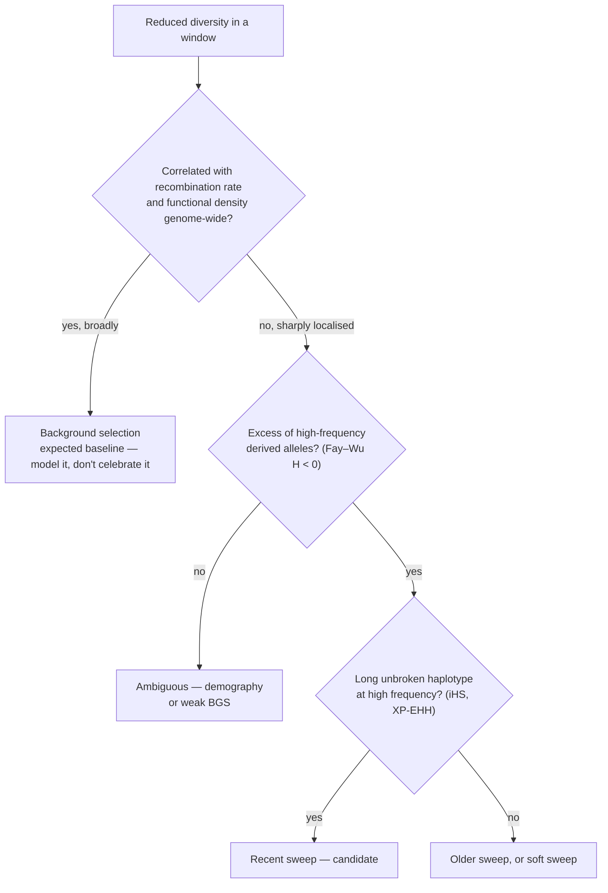

# 33 — Neutral theory and tests of selection

> **Before this:** [Ch 27](../part-05-population-genetics/27-the-four-forces.md) · [Ch 29](../part-05-population-genetics/29-linkage-disequilibrium.md) · [Ch 16](../part-03-genome-instability/16-mutation.md) · **Time:** ~55 min
>
> **Statistics needed:** [S2 Distributions](../part-S-statistics/S2-distributions.md) ·
> [S3 Estimation and error](../part-S-statistics/S3-sampling-and-estimation.md) ·
> [S4 Hypothesis testing](../part-S-statistics/S4-hypothesis-testing.md)

## What you'll be able to do

- Derive the neutral substitution rate result *k* = μ, and name every assumption the cancellation needs
- Explain why the molecular clock is overdispersed rather than Poisson, and apply the drift barrier |2*N*<sub>e</sub>*s*| ≪ 1 to predict which lineages fix slightly deleterious mutations
- Correct an observed sequence distance for multiple hits using Jukes–Cantor, and say when the correction fails
- Compute d<sub>N</sub>/d<sub>S</sub> from raw counts, explain why site-count normalisation is not optional, and explain why ω > 1 is rare even under genuine positive selection
- Compute Tajima's *D* from π and Watterson's θ, and list the demographic scenarios that produce the same sign
- Build a McDonald–Kreitman table, estimate α, and say why it is more robust to demography than Tajima's *D*
- Distinguish the predictions of a selective sweep from those of background selection

## The core idea

Most of what changes in a genome does not matter. That is not cynicism — it is the load-bearing assumption of molecular evolution, and it turns out to make **selection detectable**.

Here is the logic. If a mutation has no effect on fitness, its fate is decided entirely by random sampling. Random sampling has a known distribution. So you can write down, exactly, what a genome should look like if nothing is selected: how fast it should diverge from a relative, how much variation it should carry, what the frequency distribution of that variation should be. Then you look at real data and find the places that don't fit.

Null hypothesis, test statistic, null distribution — that frame is [S4](../part-S-statistics/S4-hypothesis-testing.md)'s, and this chapter assumes it. Neutral theory is the null hypothesis of molecular evolution, and every test in this chapter is a test statistic with a null distribution derived from drift alone. The biology is in knowing what else can produce the same deviation.

---

## 1. The neutral theory, and the cancellation at its heart

Kimura's 1968 claim: **the overwhelming majority of substitutions that distinguish two species are selectively neutral, fixed by genetic drift rather than by selection.** Not that selection is unimportant — purifying selection is everywhere, removing the harmful — but that the changes which *survive* to become differences between species are mostly the ones nobody cared about.

Two observations forced it. First, proteins were accumulating amino-acid changes at a roughly clock-like rate per year across wildly different lineages, which is hard to explain if each change is a specific adaptive response to a specific environment. Second, the sheer amount of protein polymorphism found by electrophoresis in the 1960s implied, if each polymorphism were maintained by selection, an unsustainable **genetic load** — more selective deaths per generation than any population could pay.

Now the derivation. It is four lines and the cancellation is the entire point.

Take a population of *N* diploid individuals, so **2N gene copies** at any locus. Let μ₀ be the neutral mutation rate per copy per generation — that is, μ₀ = *f*₀μ, where μ is the total mutation rate and *f*₀ the fraction of mutations that are selectively neutral.

**Rate of neutral mutations entering the population per generation:**

```
2N × μ₀
```

**Probability that any one of them eventually fixes.** Under drift alone, allele frequency is a martingale: binomial sampling of gametes gives E[p<sub>t+1</sub> | p<sub>t</sub>] = p<sub>t</sub>. The process is bounded on [0,1] and absorbs at 0 or 1, so by optional stopping E[p<sub>∞</sub>] = p₀. Since E[p<sub>∞</sub>] = 1·P(fix) + 0·P(loss),

```
P(fix) = p₀ = 1 / 2N          (a new mutant is 1 copy out of 2N)
```

**Substitution rate** *k* — fixations per generation — is the product:

```
k = 2N μ₀ × 1/(2N) = μ₀
```

> **The population size cancels.** Large populations generate proportionally more neutral mutations and fix a proportionally smaller fraction of each. The neutral substitution rate equals the neutral mutation rate, and nothing about demography — census size, bottlenecks, expansions — enters it at all.

This is why a molecular clock is even conceivable. Contrast the beneficial case: a new additive mutation with heterozygous advantage *s* fixes with probability ≈ 2*s* (when *N*<sub>e</sub> ≈ *N*), so its substitution rate is 2Nμ<sub>b</sub> × 2*s* = 4N μ<sub>b</sub> *s* — proportional to *N*. Adaptive evolution is demography-dependent; neutral evolution is not.

**What the derivation assumes, and what breaks when it fails:**

| Assumption | What breaks |
|---|---|
| *s* is exactly 0, not merely small | Slightly deleterious mutations make P(fix) depend on *N*<sub>e</sub> — §3 |
| *f*₀ is constant across lineages | A gene that loses or gains constraint changes rate without changing μ |
| μ per generation is constant | Generation-time and repair-fidelity differences desynchronise the clock — §2 |
| Fate decided by drift alone at that site | Hitchhiking on a linked sweep changes P(fix) for a neutral variant — §9 |
| Infinite sites (each mutation hits a new position) | Multiple hits saturate divergence — §5 |

## 2. The molecular clock, and why real clocks are noisy

If substitutions are independent events at constant rate μ₀, fixations along a lineage are a **Poisson process**. Over time *t* the number of substitutions has mean μ₀*t* and variance μ₀*t*. The index of dispersion *R* = Var/Mean should be 1.

> **Statistics:** the Poisson process, and why variance = mean is the property that makes it easy to falsify, are covered in [S2](../part-S-statistics/S2-distributions.md) §2.

It isn't. Across proteins, *R* is commonly reported in the range ~1–35, frequently well above 1. The clock is **overdispersed** — it ticks more erratically than radioactive decay. Four reasons, all biological:

- **Generation-time effect.** Most mutations originate as replication errors, and species differ far more in generations per year than in germline cell divisions per generation. So μ per generation is conserved across mammals to within a factor of a few, while μ per year is not. A mouse lineage should tick faster per year than a human one — and for many nuclear sequences it does. (Keep the units straight: μ throughout this chapter is per copy per *generation*, a quantity ~100× larger than the per-*replication* polymerase error rate, which it sums over hundreds of germline divisions — [Ch 16](../part-03-genome-instability/16-mutation.md).)
- **Lineage-specific mutation rates.** Repair fidelity, metabolic rate, sperm-production schedules. Human mutations are ~80% paternal in origin and increase with paternal age ([Ch 16](../part-03-genome-instability/16-mutation.md)), so a change in mating system changes μ.
- **Episodic changes in constraint.** *f*₀ shifts when a gene's function changes — a duplicate relaxed from constraint ([Ch 35](35-genome-evolution.md)) has a different clock from its parent.
- **Nearly neutral dynamics.** If a fraction of mutations sit near the drift barrier, the rate becomes *N*<sub>e</sub>-dependent, and *N*<sub>e</sub> fluctuates. This is §3.

The practical consequence for dating is that a strict clock is a bad model; phylogenetics uses **relaxed clocks** that allow rate to vary across branches with its own prior ([Ch 34](34-phylogenetics.md)).

## 3. Nearly neutral theory: where *N*<sub>e</sub> comes back

Ohta's correction. "Neutral" is not a property of a mutation; it is a relationship between the mutation's effect and the strength of drift. Diffusion theory gives the criterion:

```
|2 Ne s|  ≪ 1     →  effectively neutral (drift dominates)
|2 Ne s|  ≫ 1     →  effectively selected
```

so a mutation is invisible to selection when |*s*| ≲ 1/(2*N*<sub>e</sub>). This is the **drift barrier**, and it moves with population size.

The consequences are large and testable:

| Prediction | Observation |
|---|---|
| Small-*N*<sub>e</sub> lineages fix slightly deleterious mutations | Elevated d<sub>N</sub>/d<sub>S</sub> in island endemics, domesticates, endosymbionts |
| Mitochondrial genomes have ~¼ the *N*<sub>e</sub> of autosomes | Elevated mitochondrial d<sub>N</sub>/d<sub>S</sub> relative to nuclear |
| Humans (*N*<sub>e</sub> ~10⁴) vs *Drosophila* (~10⁶) | Humans carry proportionally more mildly deleterious variation |
| Genome bloat is a small-*N*<sub>e</sub> phenomenon (Lynch's mutational-hazard hypothesis) | **Proposed, and contested.** The raw correlation between *N*<sub>e</sub> proxies and transposable-element load weakens or vanishes once phylogenetic non-independence is accounted for; a 2025 comparative analysis of 807 animal species found no *N*<sub>e</sub> effect on genome size or repeat content |

It also partially rescues the clock: short-generation species tend to have large *N*<sub>e</sub>, which lowers the fraction of mutations that behave neutrally, offsetting their faster per-year mutation rate.

The consequence that matters most for the rest of this chapter: **slightly deleterious mutations segregate as polymorphism but rarely fix.** They inflate within-species variation relative to between-species divergence, which biases every test that compares the two.

## 4. What the neutralist–selectionist debate actually settled

The 1970s argument was framed as "is molecular evolution mostly drift or mostly selection?" — and framed that way it was unresolvable, because both sides could point at real data.

Its resolution was a reframing rather than a verdict.

> **Neutral theory's legacy is not an answer about how much selection there is. It is a computable null model.** Before Kimura there was no quantitative expectation for what a sequence should look like absent selection, so "this gene is under selection" was an assertion. After Kimura it became a rejected null with a p-value. Every test in the remainder of this chapter — d<sub>N</sub>/d<sub>S</sub>, Tajima's *D*, McDonald–Kreitman, iHS — is a departure measured against a neutral expectation. Neutral theory is most useful precisely where it is false.

The modern position: purifying selection is pervasive and dominates the fate of new mutations; positive selection is real, locally strong, and much more common in large-*N*<sub>e</sub> species than in humans; and the bulk of *fixed* differences between closely related species are neutral or nearly so.

## 5. Measuring divergence: p-distance and multiple hits

The naive distance between two aligned sequences is the **p-distance**: the proportion of sites that differ.

```
seq A   A C G T A C G T A C
seq B   A C G T T C G A A C
                *     *
p = 2/10 = 0.20
```

This is biased downward, and increasingly so with time, because a site can be hit twice: A→G→A leaves no trace, and A→G→C looks like one change instead of two. For two random sequences with equal base composition, p saturates at **0.75** — you cannot observe more than three-quarters mismatch no matter how long they have diverged.

**Jukes–Cantor correction.** Assume every base substitutes to each of the other three at rate α, so total rate per site per lineage is 3α, and base composition is uniform. Track *p*(*t*), the probability two homologous sites differ after time *t* of independent divergence.

- If the sites currently **match**, any substitution on either lineage makes them differ. Rate: 2 × 3α = 6α.
- If they currently **differ** (lineage 1 has X, lineage 2 has Y), a substitution on lineage 1 goes to one of 3 bases, one of which is Y. Rate of restoring a match: 3α × ⅓ = α, per lineage, so 2α total.

```
dp/dt = 6α(1 − p) − 2α p = 6α − 8α p
```

with *p*(0) = 0 this solves to

```
p(t) = ¾ (1 − e^(−8αt))
```

Now define *d*, the expected number of substitutions per site along the whole path connecting the two sequences: *d* = 2 × 3α*t* = 6α*t*, so 8α*t* = (4/3)*d*. Substituting and inverting:

```
p = ¾ (1 − e^(−4d/3))     ⟹     d = −¾ ln(1 − (4/3) p)
```

Sanity checks: *d* ≈ *p* for small *p* (expand the log); *d* → ∞ as *p* → ¾; the formula is **undefined for p ≥ 0.75**, which is the honest way of saying the signal is gone. Its variance is Var(*d*) = *p*(1−*p*) / [(1 − 4*p*/3)² *L*] for *L* sites — note the denominator exploding as *p* approaches saturation.

Richer models add parameters in the bias–variance trade-off of [S3](../part-S-statistics/S3-sampling-and-estimation.md) §2: **K2P** (separate transition and transversion rates, because transitions are ~2× more frequent), **HKY** (unequal base frequencies), **GTR** (six exchangeabilities plus base frequencies), plus **+Γ** for rate variation across sites and **+I** for invariant sites. More parameters remove bias and add estimation variance; model choice is done by likelihood ratio or information criteria ([Ch 34](34-phylogenetics.md)).

## 6. d<sub>N</sub>/d<sub>S</sub>: comparing a gene against its own control

In a protein-coding sequence the genetic code partitions changes into two classes ([Ch 07](../part-01-molecular-foundations/07-genetic-code-and-translation.md)): **synonymous** (no amino-acid change, mostly invisible to selection) and **nonsynonymous** (amino-acid changing, visible). The synonymous class is the internal control: same locus, same mutational environment, same alignment, same multiple-hit correction.

**Site counting is the whole trick.** You cannot compare raw counts of the two kinds of change, because the code does not offer them equally. Take the leucine codon `TTA`:

```
position 1:  TTA → CTA (Leu, syn) | ATA (Ile) | GTA (Val)     →  1/3 synonymous
position 2:  TTA → TAA (stop) | TCA (Ser) | TGA (stop)         →  0   synonymous
position 3:  TTA → TTG (Leu, syn) | TTT (Phe) | TTC (Phe)      →  1/3 synonymous

synonymous sites in this codon = 2/3 ;  nonsynonymous sites = 3 − 2/3 = 7/3
```

Summed over a typical coding sequence, roughly **one site in four is synonymous and three in four nonsynonymous**. So a gene evolving with no selection whatsoever produces about three times as many nonsynonymous as synonymous changes. Normalising by site counts converts counts into **rates per opportunity** — structurally identical to using an exposure offset in a Poisson regression, and just as non-optional.

```
dN = nonsynonymous substitutions per nonsynonymous site   (multiple-hit corrected)
dS = synonymous substitutions per synonymous site         (multiple-hit corrected)
ω  = dN / dS
```

| ω | Interpretation |
|---|---|
| < 1 | **Purifying** selection — amino-acid changes removed. Typical: 0.1–0.3 for mammalian orthologs, ~0.2 genome-wide for human–chimpanzee |
| ≈ 1 | Neutral evolution — pseudogenes, genes that have lost function |
| > 1 | **Positive** selection — amino-acid changes fixed faster than neutral |

Four caveats, and they matter more than the definition:

**Averaging destroys the signal.** ω is averaged over every codon and the whole branch. A 400-residue protein in which 5 residues are under strong positive selection and 395 under strong constraint has a gene-wide ω well below 1. **Absence of ω > 1 is not evidence of absent positive selection** — and this is the normal case, not a pathology. The fix is to stop averaging: **site models** fit a mixture across codons and test by likelihood ratio whether a class with ω > 1 is needed (M1a vs M2a, M7 vs M8); **branch models** let ω vary across the tree; **branch-site models** allow a subset of sites to be positively selected on one designated foreground branch. These are powerful and also notoriously prone to false positives when the alignment is wrong or the sequence has recombined — always inspect the alignment.

**d<sub>S</sub> is not perfectly neutral.** Codon usage bias, exonic splicing enhancers, and mutational hotspots (CpG dinucleotides in vertebrates) all give synonymous sites some constraint or elevated rate, which shifts ω in either direction.

**Saturation.** At deep divergence d<sub>S</sub> saturates first, the denominator becomes unreliable, and ω becomes noise.

**d<sub>N</sub>/d<sub>S</sub> is a between-species statistic.** Applied to polymorphism within a population it misbehaves badly: segregating variants include deleterious ones that have not yet been removed, so within-species ω is inflated toward 1 and is a function of how recently the samples shared an ancestor rather than of selection. If you have polymorphism data, the right test is the next one but one.

## 7. The site frequency spectrum, and Tajima's *D*

Everything about within-population variation compresses into one object. For a sample of *n* sequences, let **ξ<sub>i</sub>** be the number of segregating sites at which the derived allele appears in exactly *i* copies, *i* = 1 … *n*−1. That vector is the **site frequency spectrum** (SFS). Without an outgroup to identify the ancestral allele you get the **folded** SFS, which merges *i* and *n*−*i*.

Under the standard neutral model — constant size, no selection, infinite sites — the coalescent gives a strikingly simple expectation:

```
E[ξi] = θ / i        where θ = 4 Ne μ
```

A 1/*i* spectrum: rare variants are common, common variants are rare. Every test below is a different weighted sum of that vector, chosen to be sensitive to a different kind of distortion.

| Estimator of θ | Weight on ξ<sub>i</sub> | Sensitive to |
|---|---|---|
| Watterson θ<sub>W</sub> = S / a<sub>n</sub> | 1 / a<sub>n</sub> (flat — each site counted once) | rare variants, which dominate the count of segregating sites |
| π (mean pairwise differences) | 2*i*(*n*−*i*) / [*n*(*n*−1)] | intermediate-frequency variants |
| θ<sub>H</sub> (Fay & Wu) | 2*i*² / [*n*(*n*−1)] | high-frequency **derived** variants |
| ξ₁ (Fu & Li) | singletons only | the very newest variation |

Here *S* is the number of segregating sites and a<sub>n</sub> = Σ<sub>i=1..n−1</sub> 1/*i*, so that E[*S*] = θ a<sub>n</sub>.

All are unbiased for θ under the null. They differ in weighting. **Therefore their difference estimates zero under the null and estimates the shape of the distortion otherwise.** That is the entire idea:

```
D = (π − θW) / sqrt( Var(π − θW) )
```

> **Statistics:** unbiased estimators, and dividing an estimate by the square root of its variance to get a scale-free statistic, are covered in [S3](../part-S-statistics/S3-sampling-and-estimation.md) §2–3; building a null distribution by simulation when no tabulated one applies is [S4](../part-S-statistics/S4-hypothesis-testing.md) §2.

- **D < 0** — excess of rare variants; the spectrum is skewed left relative to 1/*i*
- **D > 0** — excess of intermediate-frequency variants

And now the sentence that anyone reporting a Tajima's *D* must be able to say out loud:

**A negative *D* is consistent with a recent selective sweep, with background selection, with widespread purifying selection, and with population expansion. These are not distinguishable from *D* alone.** Symmetrically, positive *D* is consistent with balancing selection, with a recent bottleneck, and with sampling across cryptically structured subpopulations ([Ch 28](../part-05-population-genetics/28-structure-and-inbreeding.md)).

The escape route is that **demography acts genome-wide while selection acts locally**. So Tajima's *D* is used as an outlier scan — compare a window against the empirical genome-wide distribution — or with a demographic model explicitly fitted first and *D* simulated under it. A single locus with *D* = −2 and no genomic context establishes nothing. Note also that despite the normalisation, *D* is not standard normal; its null distribution is skewed and bounded, so p-values come from coalescent simulation, not from a *z*-table.

**Fu and Li's *D* and *F*** contrast singletons (mutations on external coalescent branches) against θ<sub>W</sub> or π, which makes them sensitive to very recent events but also to sequencing error, since errors look exactly like singletons.

**Fay and Wu's *H*** = π − θ<sub>H</sub> is the interesting one. Hitchhiking drags a few neutral variants that happened to sit on the sweeping haplotype to *high* frequency, producing an excess of high-frequency **derived** alleles. Population growth does not do that. *H* therefore separates sweeps from expansion in a way *D* cannot — at the cost of requiring a reliable outgroup to polarise ancestral from derived, and of being sensitive to outgroup misassignment.

## 8. McDonald–Kreitman: polymorphism against divergence

The neatest test in the field, because it is internally controlled in two directions at once.

Take one gene. Classify every variant site two ways: by **effect** (synonymous / nonsynonymous) and by **status** (polymorphic within your species / fixed between your species and an outgroup).

|  | Fixed | Polymorphic |
|---|---|---|
| **Nonsynonymous** | D<sub>n</sub> | P<sub>n</sub> |
| **Synonymous** | D<sub>s</sub> | P<sub>s</sub> |

Under strict neutrality, the nonsynonymous:synonymous ratio should be the same whether you look at fixed differences or at polymorphism — because both classes experienced the same history, the same demography, the same mutation rate, and sit interdigitated along the same molecule. Test with Fisher's exact test or a G-test on the 2×2.

> **Statistics:** the χ² statistic on a contingency table, and why a 2×2 carries 1 degree of freedom, are covered in [S2](../part-S-statistics/S2-distributions.md) §4 and [S4](../part-S-statistics/S4-hypothesis-testing.md) §2.

An **excess of D<sub>n</sub>** — more amino-acid changes fixed than the polymorphism ratio predicts — means amino-acid changes were driven to fixation faster than drift can manage. That is positive selection.

```
α = 1 − (Ds · Pn) / (Dn · Ps)
```

α is the estimated **proportion of nonsynonymous substitutions fixed by positive selection**. Why this beats Tajima's *D*: demographic history distorts the SFS of synonymous and nonsynonymous sites *identically*, so it largely cancels in the ratio. The test is robust to exactly the confound that ruins single-locus SFS tests.

It is not, however, robust to nearly neutral mutations. Slightly deleterious amino-acid variants segregate at low frequency and rarely fix, inflating P<sub>n</sub> and driving α downward — sometimes negative. Standard mitigations: discard polymorphism below a frequency cutoff (5–15%), or fit a distribution of fitness effects explicitly (DFE-α, polyDFE) and correct. Typical corrected estimates run around **α ≈ 0.5 in *Drosophila*** and much lower — near zero to modest — **in humans**, which is what nearly neutral theory predicts from the *N*<sub>e</sub> difference.

## 9. Sweeps, haplotypes, and the background-selection confound

When a beneficial allele rises, it does not travel alone. Everything linked to it rises too — **genetic hitchhiking**. The neutral variation in the surrounding region is replaced by copies of whichever haplotype the lucky mutation arose on, so diversity collapses in a window whose width is set by the race between selection and recombination: the region is affected out to roughly where *r* ≈ *s*, i.e.

```
window width (bp) ≈ s / (recombination rate per bp)
```

With *s* = 0.02 and 1 cM/Mb (10⁻⁸ per bp), that is ~2 Mb — an enormous scar.

```
before sweep            during                  after
▓░▓░░▓░▓▓░▓░▓░▓         ▓░▓░★▓░▓▓░▓░▓░▓        ░░░░★░░░░░░░░░
▓▓░░▓░▓░░▓▓░░▓░         ▓▓░░★▓░░▓▓░░▓░         ░░░░★░░░░░░░░░
░▓▓░░▓▓░▓░░▓▓░▓         ░▓▓░░▓▓░▓░░▓▓░▓        ░░░░★░░░░▓▓░░▓
░░▓▓░░▓░▓▓░░▓░▓         ░░▓▓░░▓░▓▓░░▓░▓        ░░░░★░▓░░░░░░░
diverse haplotypes      ★ arises on one         one haplotype, long
                                                 and nearly identical
```

**Hard vs soft sweeps.** A *hard* sweep starts from a single new mutation on a single haplotype and produces the picture above. A *soft* sweep starts from **standing variation** already present on several haplotypes, or from recurrent mutation to the same allele, so several backgrounds rise together. Soft sweeps leave a far weaker classical signature — diversity is reduced less, several long haplotypes coexist — and most detection methods have poor power against them. Much of the argument about how common adaptation is turns on how many sweeps are soft and therefore invisible.

**Haplotype tests for recent selection.** The insight (Sabeti and colleagues) is that **high frequency and long haplotype are contradictory under neutrality**. A neutral allele takes a long time to drift to high frequency, and over that time recombination shreds the haplotype it sits on. An allele that is both common *and* still carried on an unbroken megabase-scale haplotype must have got there fast.

- **EHH** — extended haplotype homozygosity: the probability that two randomly chosen chromosomes carrying a given core haplotype are identical all the way out to distance *x*. Plot decay against distance.
- **iHS** — integrate EHH for derived versus ancestral allele, take the log ratio, standardise within derived-allele-frequency bins. Detects *incomplete*, ongoing sweeps.
- **XP-EHH** and **F<sub>ST</sub> outliers** — compare populations; catch sweeps that have gone to or near fixation in one population.

Two canonical examples:

| Locus | Signal |
|---|---|
| *MCM6* / *LCT* | The −13910 C>T enhancer variant conferring lactase persistence sits on an unbroken haplotype extending over a megabase in Europeans — among the strongest iHS signals in the human genome. Independent variants (−14010 G>C and others) achieve the same phenotype in East African pastoralists: convergent adaptation, visible in sequence |
| Malaria resistance | *HBB* HbS is maintained by **heterozygote advantage** against *Plasmodium falciparum* — a genuine balanced polymorphism, but far too young and too low in frequency to have produced the classic elevated-Tajima's-*D* signature, which takes on the order of *N*<sub>e</sub> generations to accumulate. In practice HbS is barely picked up by genome-wide scans at all — the textbook case of balancing selection is close to invisible to the tests named after it, a useful reminder that the mechanism and the detectable signature are different things. *G6PD* A− was one of the two founding examples of the long-range-haplotype test (Sabeti *et al.* 2002), and the *ACKR1* (Duffy) −67 T>C allele, near-fixed across sub-Saharan Africa and blocking *P. vivax* invasion, shows a classic young-allele-at-high-frequency sweep signature |

**Background selection is the confound.** Charlesworth's point: purifying selection also removes linked neutral variation, because every chromosome carrying a new deleterious mutation is eventually eliminated along with its whole neighbourhood. Background selection (BGS) predicts **reduced diversity, most severely in regions of low recombination and high functional density, plus a mild skew toward rare variants** — that is, it reproduces the two signatures most commonly used to claim a sweep. And it is chronic and genome-wide rather than episodic.



The honest state of the field: diversity correlates with local recombination rate in *Drosophila*, humans and most sequenced species, and both hitchhiking and BGS predict that. Modern scans fit a BGS baseline (a "B-map") first and look for sweeps as departures from *that*, not from a neutral constant-size null.

**Every method has a timescale**, and mismatching the method to the question is the most common error:

| Method | Data | Timescale it sees |
|---|---|---|
| d<sub>N</sub>/d<sub>S</sub>, branch-site | Divergence between species | 10⁶–10⁸ years |
| McDonald–Kreitman | Divergence + polymorphism | 10⁵–10⁷ years |
| Tajima's *D*, Fay–Wu *H* | Polymorphism (SFS) | ~0.1–1 × *N*<sub>e</sub> generations; in humans ~10⁴–10⁵ years |
| iHS, EHH, XP-EHH | Polymorphism (haplotypes) | last ~10⁴ years — recombination erases it after that |

---

## Common misconceptions

| What people think | What's actually true |
|---|---|
| Neutral theory says selection doesn't matter | It says most *fixed* differences are neutral. Purifying selection is pervasive — it is why most mutations never become differences in the first place |
| *k* = μ means big populations evolve slower | It means neutral substitution rate is independent of size. Adaptive substitution rate scales with *N*, so large populations adapt faster while ticking at the same neutral rate |
| The molecular clock is a clock | It is a Poisson process at best, and empirically overdispersed. It gives dates with wide, often understated, confidence intervals |
| ω < 1 proves no positive selection | ω is averaged over all codons and the whole branch. A handful of positively selected residues in a constrained protein leaves ω well under 1. Use site and branch-site models |
| A negative Tajima's *D* means a sweep | It equally means population expansion, background selection, or ordinary purifying selection. Demography is genome-wide; the only valid inference is an outlier argument or a fitted demographic null |
| You can compute d<sub>N</sub>/d<sub>S</sub> on variants within a population | Within-species ω is inflated toward 1 by unpurged deleterious variants and depends on sample coalescence time. Use McDonald–Kreitman instead |
| Low diversity in a region means selection swept there | Background selection produces the same reduction, chronically, wherever recombination is low and functional density high. It is the baseline, not the exception |
| "Nearly neutral" is a hedge | It is a quantitative claim: `|s| ≲ 1/(2Ne)`. The neutral class is defined by *N*<sub>e</sub>, so the same mutation is neutral in one species and selected in another |

## Worked example

One gene, four analyses. Aligned coding region, 1,200 bp, between species X and Y; 300 synonymous sites and 900 nonsynonymous sites; 132 differences, of which 90 are synonymous and 42 nonsynonymous.

**A — Distance, corrected for multiple hits.**

```
p = 132 / 1200 = 0.1100
d = −¾ ln(1 − (4/3)(0.1100))
  = −0.75 × ln(1 − 0.146667)
  = −0.75 × ln(0.853333)
  = −0.75 × (−0.158605)
  = 0.11895   substitutions per site
```

The correction adds 8% — modest here, because *p* is far from saturation.

But notice that the pooling was itself a mistake, and part B is about to show why: the two site classes diverge at wildly different rates. Correcting them separately and re-averaging gives (300 × 0.3831 + 900 × 0.0482)/1200 = **0.132**, 11% above the pooled 0.119. A single-rate model applied across heterogeneous sites underestimates divergence, because the fast class saturates while the pooled *p* is still small. That is precisely the bias **+Γ** exists to absorb.

**B — d<sub>N</sub>/d<sub>S</sub>.** Correct each class separately.

```
Synonymous:      pS = 90/300  = 0.300000
                 dS = −0.75 × ln(1 − 0.400000) = −0.75 × ln(0.600000)
                    = −0.75 × (−0.510826) = 0.383119

Nonsynonymous:   pN = 42/900  = 0.046667
                 dN = −0.75 × ln(1 − 0.062222) = −0.75 × ln(0.937778)
                    = −0.75 × (−0.064242) = 0.048182

ω = dN / dS = 0.048182 / 0.383119 = 0.1258
```

Two things to notice. First, the **raw counts mislead**: 42 nonsynonymous changes versus 90 synonymous looks like a 1:2 ratio, but there are three times as many nonsynonymous sites, so per opportunity the classes differ ~8-fold. Second, the **correction is not a cosmetic step**: the uncorrected ratio p<sub>N</sub>/p<sub>S</sub> = 0.046667/0.300000 = 0.1556 is 24% too high, because d<sub>S</sub> needed a much larger multiple-hit correction (+28%) than d<sub>N</sub> (+3%). ω ≈ 0.13 means strong purifying selection: roughly seven of every eight amino-acid-changing mutations were removed.

**C — McDonald–Kreitman.** Add polymorphism data from species X: P<sub>n</sub> = 8, P<sub>s</sub> = 42. Treat the 42/90 differences as fixed.

|  | Fixed | Polymorphic | Total |
|---|---|---|---|
| Nonsynonymous | 42 | 8 | 50 |
| Synonymous | 90 | 42 | 132 |
| **Total** | 132 | 50 | 182 |

```
Polymorphism ratio  Pn/Ps = 8/42  = 0.1905
Divergence ratio    Dn/Ds = 42/90 = 0.4667      ← 2.4× higher

Expected Dn under neutrality = Ds × (Pn/Ps) = 90 × 0.190476 = 17.14
Observed Dn = 42  →  excess of 24.86 substitutions

α = 1 − (Ds · Pn)/(Dn · Ps) = 1 − (90 × 8)/(42 × 42)
  = 1 − 720/1764 = 1 − 0.40816 = 0.592
```

Significance, χ² with 1 df. Expected counts: E₁₁ = 50×132/182 = 36.264, E₁₂ = 50×50/182 = 13.736, E₂₁ = 132×132/182 = 95.736, E₂₂ = 132×50/182 = 36.264. Every cell deviates by the same 5.736.

```
χ² = 5.736² × (1/36.264 + 1/13.736 + 1/95.736 + 1/36.264)
   = 32.902 × (0.027576 + 0.072801 + 0.010445 + 0.027576)
   = 32.902 × 0.138398 = 4.554        p ≈ 0.033
```

Reject neutrality: **≈59% of amino-acid substitutions in this gene were adaptive**. Note that this gene has ω = 0.13 — overwhelmingly purifying — *and* a significant excess of adaptive fixations. Both are true simultaneously, which is exactly why gene-wide ω < 1 tells you nothing about positive selection.

**D — Tajima's *D*.** Sample of *n* = 10 sequences from species X: *S* = 16 segregating sites, π = 3.2 mean pairwise differences.

```
a1 = Σ(i=1..9) 1/i  = 2.828968
a2 = Σ(i=1..9) 1/i² = 1.539768

θW = S / a1 = 16 / 2.828968 = 5.6558
π − θW = 3.2 − 5.6558 = −2.4558

b1 = (n+1)/(3(n−1)) = 11/27 = 0.407407
b2 = 2(n²+n+3)/(9n(n−1)) = 226/810 = 0.279012
c1 = b1 − 1/a1 = 0.407407 − 0.353486 = 0.053921
c2 = b2 − (n+2)/(a1·n) + a2/a1²
   = 0.279012 − 0.424184 + 0.192397 = 0.047225
e1 = c1/a1 = 0.019060
e2 = c2/(a1² + a2) = 0.047225 / 9.542828 = 0.004949

Var = e1·S + e2·S(S−1) = 0.019060(16) + 0.004949(240)
    = 0.30496 + 1.18776 = 1.49272        sd = 1.22177

D = −2.4558 / 1.22177 = −2.01
```

Strongly negative: far more segregating sites than the pairwise diversity implies, i.e. an excess of rare variants. **Do not stop here.** This value is equally consistent with a sweep at or near this gene, with background selection given its recombination environment, and with population expansion in species X. To go further you need the genome-wide distribution of *D*, Fay and Wu's *H* to test for high-frequency derived alleles, and a haplotype statistic. The MK result in part C is the stronger evidence, precisely because it is internally controlled against demography.

## Connections

- **Back to:** [Ch 27](../part-05-population-genetics/27-the-four-forces.md) supplies drift, *N*<sub>e</sub> and fixation probabilities · [Ch 29](../part-05-population-genetics/29-linkage-disequilibrium.md) supplies the LD machinery the haplotype tests measure · [Ch 16](../part-03-genome-instability/16-mutation.md) supplies μ · [Ch 07](../part-01-molecular-foundations/07-genetic-code-and-translation.md) supplies the code that makes the synonymous/nonsynonymous split possible
- **Forward to:** [Ch 34](34-phylogenetics.md) turns the distance correction into tree estimation and the clock into dating · [Ch 35](35-genome-evolution.md) applies ω to duplicates and pseudogenes · [Ch 35A §6](35A-speciation-and-ecological-genetics.md) moves §9's background-selection confound from π to *F*<sub>ST</sub>, where it manufactures outliers that look like local adaptation; §1's *k* = μ is also what makes Dobzhansky–Muller incompatibilities accumulate with the *square* of time · [Ch 51](../part-11-human-and-statistical-genomics/51-gwas.md) inherits the confound structure — an outlier scan against a null you had to fit yourself · [Ch 56](../part-11-human-and-statistical-genomics/56-cancer-genomics.md) reuses d<sub>N</sub>/d<sub>S</sub> on somatic mutations to identify driver genes

## Check yourself

**1. In the derivation of *k* = μ, exactly where does *N* cancel, and what does that cancellation depend on?**

<details><summary>Answer</summary>

The number of new neutral mutants per generation is 2*N*μ₀ — proportional to *N*. The fixation probability of each is 1/(2*N*) — inversely proportional to *N*. The product is μ₀.

The cancellation depends on P(fix) being exactly the allele's current frequency, which holds because under drift alone allele frequency is a martingale absorbed at 0 or 1. That in turn requires *s* = 0 exactly. Give the mutation any consistent fitness effect and P(fix) picks up a dependence on *N*<sub>e</sub>*s*, the cancellation fails, and the substitution rate becomes demography-dependent. Note that the argument does *not* require *N* to be constant over time.

</details>

**2. A 500-codon gene is known from functional work to have three residues under strong recent positive selection. Its gene-wide ω against a sister species is 0.15. Is that a contradiction?**

<details><summary>Answer</summary>

No, and the arithmetic shows why. Suppose 497 codons have ω ≈ 0.1 and 3 have ω = 5. The gene-wide average is roughly (497 × 0.1 + 3 × 5)/500 = (49.7 + 15)/500 ≈ 0.13 — indistinguishable from ordinary constraint. Gene-wide ω averages over codons and over the entire branch length; a few positively selected sites are swamped by hundreds of constrained ones. This is why site models and branch-site models exist: they fit a mixture over codons and use a likelihood ratio test for whether a class with ω > 1 is required, instead of averaging it away.

</details>

**3. π and Watterson's θ are both unbiased estimators of θ under neutrality. Why does their difference contain information, and what exactly is it information about?**

<details><summary>Answer</summary>

They are different weighted sums of the same site frequency spectrum. θ<sub>W</sub> weights every segregating site equally regardless of frequency, so it is driven by the count of variants — and rare variants are numerous. π weights site *i* by 2*i*(*n*−*i*)/[*n*(*n*−1)], peaking at intermediate frequency. Under the neutral E[ξ<sub>i</sub>] = θ/*i* spectrum, both weightings integrate to θ, so the difference has expectation zero.

Any process that changes the *shape* of the SFS without changing its total therefore moves the two estimators apart. The difference is a statistic about spectrum shape — not about the amount of variation. Which is also why it cannot distinguish causes: everything that skews the spectrum toward rare variants (sweeps, background selection, expansion) moves it the same way.

</details>

**4. Why is the McDonald–Kreitman test largely immune to the demographic confound that cripples Tajima's *D*, and what confound does it remain vulnerable to?**

<details><summary>Answer</summary>

Because it is a ratio of ratios computed on interdigitated sites. Synonymous and nonsynonymous positions sit within the same codons, share the same genealogy, the same mutational input and the same demographic history. A bottleneck or expansion distorts the frequency spectrum of both classes identically, so the distortion cancels in D<sub>n</sub>/D<sub>s</sub> versus P<sub>n</sub>/P<sub>s</sub>. Tajima's *D* has no such internal control — it compares a locus against a theoretical null that demography invalidates.

It remains vulnerable to **slightly deleterious nonsynonymous mutations**, which segregate as polymorphism but seldom fix. They inflate P<sub>n</sub>, which deflates α and can drive it negative. The standard fixes are a minor-allele-frequency cutoff to remove young deleterious variants, or explicitly fitting a distribution of fitness effects. Because the size of that bias depends on *N*<sub>e</sub>, uncorrected α is not comparable across species.

</details>

**5. You find a 300 kb window with π at 20% of the genome average and Tajima's *D* = −1.8. Name the two competing explanations and one measurement that discriminates.**

<details><summary>Answer</summary>

A recent selective sweep, or background selection. Both reduce π and skew the SFS toward rare variants.

Discriminating measurements, best first:

- **Fay and Wu's *H*.** Hitchhiking pulls a subset of neutral variants to *high* derived frequency; background selection and demographic expansion do not. Strongly negative *H* points to a sweep. Requires an outgroup to polarise alleles.
- **Haplotype length at frequency** — iHS or XP-EHH. A common allele still carried on an unbroken long haplotype implies it rose faster than recombination could erode it. Background selection produces no such haplotype.
- **The regional covariates.** Fit a background-selection baseline from local recombination rate and functional density. If the window's diversity is what the B-map already predicts, you have no sweep — you have the expected baseline.

The general principle: never test against a constant-size neutral null when a background-selection baseline is available, because that null is known to be false everywhere in the genome.

</details>
