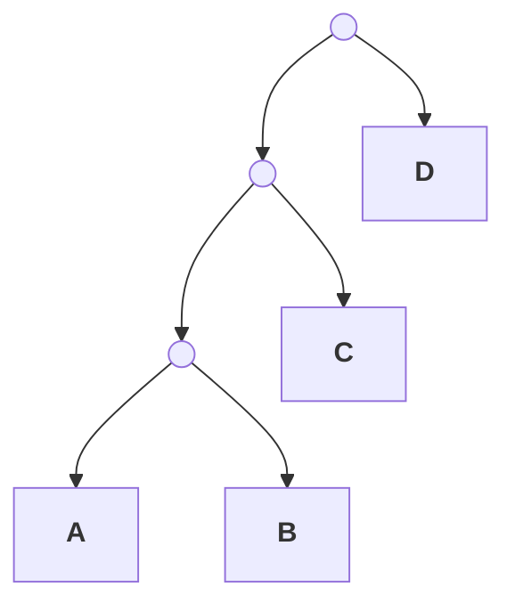

# 34 — Phylogenetics

> **Before this:** [Ch 33](33-neutral-theory-and-selection-tests.md) · [Ch 27](../part-05-population-genetics/27-the-four-forces.md) · [Ch 16](../part-03-genome-instability/16-mutation.md) · **Time:** ~55 min
>
> **Statistics needed:** [S1 Probability](../part-S-statistics/S1-probability.md) ·
> [S3 Sampling and estimation](../part-S-statistics/S3-sampling-and-estimation.md) ·
> [S6 Likelihood and Bayes](../part-S-statistics/S6-likelihood-and-bayes.md)

Phylogenetics is statistical inference over a discrete structure. The parameter you want is a
labelled binary tree; the data are aligned sequences; the likelihood is a continuous-time
Markov chain running along the branches. Everything hard about the field comes from one of
two places — the parameter space is astronomically large and non-Euclidean, or the model is
wrong in a way that gets *more* confident as you add data.

## What you'll be able to do

- Read a tree correctly: distinguish topology from branch lengths, rooted from unrooted, and monophyly from paraphyly and polyphyly; derive the number of unrooted topologies on *n* taxa and explain why exhaustive search is not an option
- Diagnose the pre-tree errors no support value can detect — paralogs mistaken for orthologs, and progressive-alignment error — and explain why each yields high confidence in a wrong tree
- Derive the Jukes–Cantor distance correction from its rate matrix, and say what K80, HKY, GTR, +Γ and +I each add
- Explain the failure mode of every major method: UPGMA's clock, parsimony's long-branch attraction, ML/Bayesian model misspecification
- State precisely what a bootstrap value and a posterior probability each measure, and why they are not comparable
- Explain why time-reversibility leaves the root unidentified from sequence alone, and why a divergence date's credible interval converges on a nonzero width set by calibration rather than by sequence length
- Compute the expected coalescence times for a sample, explain why the deepest coalescences dominate a genealogy, and enumerate the causes of gene-tree/species-tree discordance, saying which are symmetric and which are not

## The core idea

Sequences that share an ancestor share its errors. Two species that diverged recently have
had little time to accumulate independent mutations, so their sequences are similar; two that
diverged long ago have had more. If mutations accumulated at a steady rate and never hit the
same site twice, reconstructing history would be a clustering problem you could solve in an
afternoon.

Both assumptions fail. Rates differ enormously between lineages and between sites, and with
only four bases, a site that has changed twice can look unchanged. **Observed difference
saturates: it is a compressed, nonlinear function of elapsed evolutionary time.** Every
method in this chapter is, at bottom, an attempt to undo that compression — and every
characteristic failure in this chapter is what happens when the attempt is made with the
wrong model.

---

## 1. The vocabulary, and why exhaustive search is hopeless

A phylogeny is a graph. **Tips** (leaves, terminal nodes) are the observed sequences.
**Internal nodes** are inferred common ancestors. **Branches** (edges) connect them, and a
branch *length* is normally measured in expected substitutions per site — not in years, and
not in generations.

Two things are being estimated and they are logically independent:

| | What it is | How many parameters |
|---|---|---|
| **Topology** | Which tips group with which — the discrete combinatorial structure | 1 discrete parameter, from an enormous set |
| **Branch lengths** | Expected substitutions per site on each edge | 2*n* − 3 continuous parameters (unrooted, *n* tips) |

A **rooted** tree has a designated oldest node and every branch acquires a direction, so
statements about ancestry and about the order of events become meaningful. An **unrooted**
tree asserts relationship without direction. Almost all substitution models are
**time-reversible**, which means the likelihood is identical wherever you put the root:
**sequence data alone cannot root a tree.** Rooting is always an extra assumption (§9).

A **clade** (monophyletic group) is an ancestor plus *all* of its descendants. The two
failures:



- **Monophyletic:** {A, B} — an ancestor and all its descendants. Also {A, B, C}.
- **Paraphyletic:** {A, B, D} — omits C, which shares the same ancestor. "Reptiles" excluding
  birds, and "prokaryotes" excluding eukaryotes, are the canonical examples.
- **Polyphyletic:** {A, D} grouped on some shared feature whose common ancestor is not in the
  group — convergence, not descent.

Only monophyly is a claim about history. The other two are claims about a naming convention.

### Counting topologies

Build the tree by adding taxa. An unrooted binary tree on *n* tips has *n* − 2 internal nodes
and **2*n* − 3 branches**. Adding tip *n* + 1 means splitting one existing branch, so there
are exactly 2*n* − 3 places to put it, each giving a distinct topology. With *U*(3) = 1:

$$U(n) = \prod_{k=3}^{n-1}(2k-3) = (2n-5)!!$$

Rooting adds one more choice — the root can go on any of the 2*n* − 3 branches — so
*R*(*n*) = (2*n* − 3)!!, exactly the unrooted count for *n* + 1 taxa.

| *n* taxa | Unrooted topologies |
|---:|---:|
| 4 | 3 |
| 5 | 15 |
| 10 | 2,027,025 |
| 20 | 2.2 × 10²⁰ |
| 30 | 8.7 × 10³⁶ |
| 50 | 2.8 × 10⁷⁴ |
| 53 | 2.8 × 10⁸⁰ |

At 53 taxa there are more unrooted topologies than the usual order-of-magnitude estimate for
atoms in the observable universe (~10⁸⁰). Real studies use hundreds to tens of thousands of
taxa. Exhaustive search is over at *n* ≈ 11; branch-and-bound at *n* ≈ 20. Everything beyond
that is heuristic hill-climbing over tree space using local rearrangement moves (NNI, SPR,
TBR), and finding the optimal tree under either parsimony or likelihood is NP-hard. You are
never guaranteed the best tree — only a good local optimum, which is why serious analyses
run many independent searches from different starting points.

Trees are serialised in **Newick** format: `((A:0.30,B:0.05):0.05,(C:0.30,D:0.05));` — nested
parentheses, colon-prefixed branch lengths, terminating semicolon.

## 2. Homology: the ortholog/paralog trap

Two sequences are **homologous** if they descend from a common ancestral sequence. Homology
is binary — there is no "70% homologous"; you mean 70% *identical*. Homologs come in two
kinds, distinguished by the event at their common ancestor:

| | Divergence event | What the gene tree records |
|---|---|---|
| **Orthologs** | Speciation | The history of the *species* |
| **Paralogs** | Gene duplication | The history of the *gene family*, which is older |

This distinction is not pedantry; it is the single most common way to get a badly wrong
answer. Suppose a gene duplicated in the common ancestor of all vertebrates into copies α and
β. Human α, mouse α and fish α are orthologs. Human α and human β are paralogs. If your
"human sequence" is α and your "mouse sequence" happens to be β, the deepest split in your
tree is the *duplication*, not the human–mouse speciation — and it will be placed far too
deep, with total confidence. The tree is not wrong as a gene tree. It is simply not the tree
you thought you were building.

Practical defences: use reciprocal best hits or a curated orthology database, include enough
species that paralogous clades become visible as duplications rather than as odd placements,
and treat any single-gene tree whose topology contradicts well-established species relations
as an orthology problem until proven otherwise. [Ch 35](35-genome-evolution.md) develops
duplication and orthology properly.

## 3. Alignment: the error-prone first step

Every method below takes an alignment as input — a matrix in which each column is asserted to
be a set of homologous positions descended from one ancestral site. That assertion is an
*inference*, produced by a separate algorithm, and it is then treated downstream as data.

```
A   ACGT-TTGACC
B   ACGTATTGACC
C   ACG--TTAACC
D   ACGCATT-ACC
        ↑    ↑
     gaps assert insertion/deletion events
```

Pairwise alignment is a solved dynamic-programming problem, but optimal *multiple* alignment
under a sum-of-pairs objective is NP-hard, so practical tools are heuristic. The dominant
heuristic is **progressive alignment** (Clustal, MAFFT, MUSCLE): build a quick guide tree from
pairwise similarities, then align the most similar pairs first and progressively merge
alignments, treating each merged block as fixed. Two consequences follow directly from that
description. Early mistakes are never revisited — the greedy schedule has no backtracking.
And the guide tree, a crude estimate of the very thing you are about to infer, biases the
alignment toward itself.

> **Alignment error is the most under-reported source of error in phylogenetics.** It is
> systematic, not random, so it does not average out with more sites, and — this is the part
> that matters — it is invariant across bootstrap replicates, so it produces high support for
> the wrong answer rather than low support.

Poorly aligned regions inflate apparent divergence, and inflated divergence lands
preferentially on already-divergent taxa, feeding the long-branch problem in §6. Standard
mitigations: align protein sequence and back-translate for coding genes (the amino acid
alphabet has 20 states, so homology is far less ambiguous), mask ambiguous columns with
Gblocks/trimAl, or use statistical alignment methods that co-estimate alignment and tree and
report the uncertainty instead of hiding it.

## 4. From observed difference to distance: substitution models

Model each site as a continuous-time Markov chain on the state space {A, C, G, T} with rate
matrix **Q**; the transition probability matrix over branch length *t* is
**P**(*t*) = *e*<sup>**Q***t*</sup>.

### Deriving JC69

Jukes–Cantor (1969) is the simplest case: equal base frequencies, and every substitution
occurs at the same rate α. Let *p*(*t*) be the probability that a site is in its original
state after time *t*. In an instant *dt* the site leaves its current state at total rate 3α
and arrives from the other three states at rate α each:

$$\frac{dp}{dt} = -3\alpha p + \alpha(1-p) = \alpha - 4\alpha p$$

With *p*(0) = 1 this linear ODE solves to

$$p(t) = \tfrac{1}{4} + \tfrac{3}{4}e^{-4\alpha t}$$

which behaves correctly at both limits: *p*(0) = 1, and *p*(∞) = 1/4, the equilibrium
frequency.

That chain follows a *single* lineage; what we observe is two *tips*. Because JC69 is
time-reversible, these are the same problem: a pair of tips separated by an ancestor is
statistically identical to one lineage traversed for the summed branch length. So read *t* as
the whole path, and the probability that two sequences differ at a site is *q* = 1 − *p*(*t*).

Now the key change of variable. The **evolutionary distance** *d* is the expected number of
substitutions per site along the whole path connecting the two sequences — for two sequences
separated by an ancestor, the sum of both branches. Since the total substitution rate per site
is 3α, *d* = 3α*t*, so 4α*t* = 4*d*/3 and

$$q = \tfrac{3}{4}\left(1 - e^{-4d/3}\right) \quad\Longrightarrow\quad \boxed{\;\hat d = -\tfrac{3}{4}\ln\!\left(1 - \tfrac{4}{3}\hat q\right)}$$

[Ch 33](33-neutral-theory-and-selection-tests.md) derives the same estimator the long way,
tracking both lineages jointly (d*p*/d*t* = 6α − 8α*p*) with *t* measured *per lineage*, so
*d* = 2 × 3α*t* = 6α*t* there against *d* = 3α*t* here. Identical formula; the only difference
is whether *t* counts one branch or the whole path. Reversibility is what lets you choose.

Read the properties off the formula. For small *q*, *d* ≈ *q* — few sites hit twice, so raw
difference is fine. As *q* → 3/4 the logarithm diverges: at 75% difference the sequences are
saturated, indistinguishable from random, and the distance is **undefined**, not merely large.
Above 3/4 the estimator is undefined outright, which is exactly the right behaviour and a good
reason to prefer it to a raw *p*-distance. The delta method gives
Var(*d̂*) = *q*(1−*q*) / [*n*(1 − 4*q*/3)²], which blows up in the same limit.

### The model hierarchy

Each model relaxes one assumption. They are nested, so likelihood-ratio tests apply.

| Model | Adds | Free parameters |
|---|---|---|
| **JC69** | — equal rates, equal frequencies | 0 |
| **K80 (Kimura 2-parameter)** | transition/transversion ratio κ | 1 |
| **HKY85** | unequal base frequencies π<sub>A</sub>, π<sub>C</sub>, π<sub>G</sub>, π<sub>T</sub> | 4 |
| **GTR** | all six exchangeability rates free (time-reversible) | 8 |

Transitions (A↔G, C↔T — purine↔purine, pyrimidine↔pyrimidine) outnumber transversions
typically 2–5 fold, for the chemical reasons in [Ch 16](../part-03-genome-instability/16-mutation.md).
Ignoring that, as JC69 does, systematically underestimates distance.

Two additions matter more than the choice of exchangeability matrix:

**+Γ — rate heterogeneity across sites.** Sites do not evolve at one rate: third codon
positions, [Ch 07](../part-01-molecular-foundations/07-genetic-code-and-translation.md), change
far faster than first and second. Let the relative rate at a site be a draw from a
Gamma(α, α) distribution — mean fixed at 1, variance 1/α, so small α means extreme
heterogeneity and α → ∞ recovers a uniform rate. In practice the continuous distribution is
discretised into 4 equal-probability categories (Yang 1994) and the site likelihood is averaged
over them, at 4× the compute. **This is usually the single most important term in the model.**
Ignoring rate heterogeneity underestimates multiple hits at fast sites, compressing long
distances more than short ones — the same compression that drives long-branch attraction.

**+I — invariant sites.** A proportion of sites cannot change at all (structurally
constrained). Note that +I and +Γ are partly confounded: a Gamma with small α already places
mass near zero. Fitting both is common but the two parameters trade off against each other,
and the individual estimates should not be over-interpreted.

**Model selection** is ordinary statistics, covered in
[S6](../part-S-statistics/S6-likelihood-and-bayes.md) §4 and §8: fit the candidate set on a
fixed reasonable tree, compare with AIC, BIC or LRTs for nested pairs (ModelTest, jModelTest,
ModelFinder). Under-
parameterisation is a systematic bias that grows with data; over-parameterisation merely costs
variance. When in doubt, richer. The bigger decision is usually *partitioning* — allowing
separate models per gene or per codon position — not the exchangeability matrix within a
partition.

## 5. Distance methods: UPGMA and neighbour-joining

Reduce the alignment to a matrix of pairwise corrected distances, then build a tree from it.
Fast (*O*(*n*³) or better), and the only realistic option for tens of thousands of sequences.
The information loss is real: *n*(*n*−1)/2 numbers replace an alignment of *n* × *L* characters.

Two properties of a distance matrix determine what you can do with it:

- **Additive**: distances are exactly path lengths in some tree. Equivalent to the **four-point
  condition** — for any four taxa, the three pairwise sums *d*(A,B)+*d*(C,D),
  *d*(A,C)+*d*(B,D), *d*(A,D)+*d*(B,C) include a smallest one and two *equal* larger ones. The
  smallest identifies the true pairing.
- **Ultrametric**: additive *and* all tips equidistant from the root — a molecular clock.

**UPGMA** repeatedly joins the closest pair and places their node at half their distance. It
reconstructs the true tree only if the matrix is ultrametric. Without a clock it fails, and it
fails in a specific direction: two slowly evolving lineages look similar and get joined even
when they are not sisters. The worked example below shows exactly this. UPGMA is fine for a
quick dendrogram and wrong as a phylogenetic method.

**Neighbour-joining** (Saitou & Nei 1987) drops the clock. It joins the pair minimising

$$Q_{ij} = (n-2)\,d_{ij} - r_i - r_j, \qquad r_i = \sum_{k} d_{ik}$$

The *r* terms are the correction: a taxon on a long branch has a large *r* and is penalised for
it, so NJ asks "are *i* and *j* close **relative to how far each is from everything else**",
not "are they close". NJ is **statistically consistent** — on an additive matrix it recovers
the true tree exactly, and since corrected distances converge to additive ones as sequence
length grows, NJ converges on the truth. Consistency is inherited from the distance
correction, which is why the correction is not optional. NJ greedily minimises tree length, an
approximation to the minimum-evolution criterion.

## 6. Parsimony, and long-branch attraction

**Maximum parsimony** picks the topology requiring the fewest substitutions, scored per site by
Fitch's algorithm (one post-order pass, union/intersection of state sets, count the unions).
It has no explicit model, which was long sold as a virtue. It is not one — it is an implicit
model, and a badly specified one.

Consider four taxa with the true topology ((A,B),(C,D)), where A and C sit on long branches and
B, D and the internal branch are short. Let *p* be the probability of a visible change on a long
branch and *q* on the internal branch, with *q* ≪ *p*.

- The site pattern supporting the **true** grouping requires a change on the short internal
  branch: frequency ≈ *q*.
- The pattern supporting the **wrong** grouping (A with C) arises from *parallel* changes on the
  two long branches landing on the same base: frequency ≈ *p*² × 1/3.

So whenever *p*²/3 > *q*, the misleading pattern is genuinely more common in the data. With
*p* = 0.35 and *q* = 0.02: 0.041 > 0.02, twice as frequent. Parsimony counts patterns, so it
picks the wrong tree — and since the *ratio* of pattern frequencies is a constant, more sites
give more confidence in the wrong answer. Parsimony is **statistically inconsistent** in this
region of parameter space (the Felsenstein zone): it converges on the wrong tree with
probability → 1.

This is **long-branch attraction**, and the mechanism generalises. Any method that
under-corrects for multiple hits compresses long branches more than short ones and pulls them
together — including distance methods with a too-simple model, and ML with a misspecified one.
Diagnostics: check whether the suspect grouping is the pair of longest branches; break the long
branches by adding taxa that subdivide them; refit under a richer model with +Γ; compare
parsimony and ML topologies and treat disagreement as informative rather than as a tie.

## 7. Maximum likelihood and Bayesian inference

> **Statistics:** the likelihood function, maximum likelihood and the prior → posterior update
> are covered in [S6](../part-S-statistics/S6-likelihood-and-bayes.md) §1–§5; what a posterior
> does and does not license is §6.

**Maximum likelihood** treats the tree and branch lengths as parameters and maximises
*P*(alignment | topology, branch lengths, model), assuming sites are independent so the
log-likelihood sums over columns.

The engine is **Felsenstein's pruning algorithm**, which is dynamic programming and will look
familiar. Define *L<sub>k</sub>*(*s*) = *P*(data at tips below node *k* | node *k* is in state
*s*). For an internal node with children *u*, *v* at branch lengths *t<sub>u</sub>*,
*t<sub>v</sub>*:

$$L_k(s) = \Big[\sum_{x} P_{sx}(t_u)\,L_u(x)\Big]\Big[\sum_{y} P_{sy}(t_v)\,L_v(y)\Big]$$

Tips initialise to an indicator vector; the site likelihood is Σ<sub>s</sub> π<sub>s</sub>
*L*<sub>root</sub>(*s*). Cost is *O*(*n s*²) per site with *s* = 4 states — linear in taxa,
which is why ML is feasible at all. Summing over all 4<sup>*n*−1</sup> ancestral state
assignments naively is not.

ML with a correctly specified model is consistent and efficient; it is not immune to long-branch
attraction when the model is wrong, which is the usual situation. RAxML and IQ-TREE are the
standard implementations.

**Bayesian inference** targets *P*(tree | data) ∝ *P*(data | tree) *P*(tree), and since the
normalising constant sums over all topologies and integrates over all branch lengths, it is
computed by **MCMC** — Metropolis–Hastings with proposals that both perturb continuous
parameters and jump between topologies (MrBayes, BEAST, RevBayes). The output is a sample of
trees; the **posterior probability** of a clade is the fraction of sampled trees containing it.

The standard MCMC convergence diagnostics all apply, and matter more here than in most
applications, because tree space is multimodal: chains get stuck on topological islands
separated by low-likelihood valleys. Run multiple chains from different starts, check the
standard deviation of split frequencies between them, check ESS, use Metropolis-coupled MCMC
(heated chains) to cross valleys. Priors on branch lengths are not innocuous — a badly chosen
branch-length prior can inflate tree length and distort posteriors, and it will not announce
itself.

## 8. Support: bootstrap and posterior probability are not the same quantity

**The nonparametric bootstrap** (Felsenstein 1985) resamples alignment *columns* with
replacement to sequence length *L*, rebuilds the tree, and repeats 100–1,000 times. The
bootstrap proportion for a clade is the fraction of replicates containing it.

> **Statistics:** the bootstrap in general — why resampling your own data substitutes for a
> formula, and why the choice of resampling unit *is* the design decision — is
> [S3](../part-S-statistics/S3-sampling-and-estimation.md) §6.

What that measures: **how evenly the signal for that split is spread across sites**. A high
value means the split does not depend on a handful of columns. That is a real and useful thing
to know, and it is not the probability that the clade is correct.

> **The bootstrap cannot detect systematic error, because every replicate contains it.** If
> your model is wrong, your alignment is wrong, or your "orthologs" are paralogs, that error is
> present in all 1,000 replicates and you get 100% support for the wrong tree. Bootstrap
> measures precision. It says nothing about accuracy.

Conventional readings — >70% "reasonable", >95% "strong" — are rules of thumb calibrated on
simulations under correct models, and are conservative in some regimes and anticonservative in
others. The ultrafast bootstrap in IQ-TREE is differently calibrated again and its thresholds
(≥95%) are not interchangeable with the classical ones.

**Posterior probabilities** are what people *want* bootstrap values to be: *P*(clade | data,
model, prior), a direct probability statement. The catch is in the conditioning. That
probability is well calibrated only if the model is right, and is empirically much more
confident than bootstrap on the same data — 1.00 posteriors accompanying 60% bootstrap
proportions are routine. Under model misspecification, posteriors are known to be
systematically overconfident, for the same structural reason as the bootstrap: the model error
is common to every MCMC sample.

| | Bootstrap proportion | Posterior probability |
|---|---|---|
| Question answered | Would resampling these columns give the same split? | What is *P*(split \| data, model, prior)? |
| Interpretable as P(correct)? | No | Only if the model is correct |
| Sensitive to model error | Not at all — invisible to it | Not at all — invisible to it |
| Typical magnitude | Lower | Higher |
| Cost | *k* full tree searches | One MCMC run |

Report which one you used. Never compare a 0.95 posterior with a 95% bootstrap as if they were
the same statement.

## 9. Rooting, and molecular clocks

**Outgroup rooting** is standard: include a taxon known on independent grounds to fall outside
the group of interest, infer the unrooted tree, then place the root on the branch leading to it.
The outgroup must be close enough to align reliably and far enough to be genuinely outside — a
tension with no general solution. A too-distant outgroup sits on a very long branch and is
attracted to the fastest-evolving ingroup lineage (§6), putting the root in the wrong place with
high support. **Midpoint rooting** places the root at the middle of the longest tip-to-tip path;
it assumes a clock and fails exactly when the clock does.

Under a **strict molecular clock**, substitutions accumulate at a constant rate *r*, so
*d* = 2*rt* between two tips separated by divergence time *t*, and the tree becomes ultrametric.
The clock is a hypothesis, testable by likelihood-ratio test against the unconstrained model
with *n* − 2 degrees of freedom, and across any broad set of taxa it is rejected — generation
time, metabolic rate, DNA-repair efficiency and effective population size all vary.

Converting branch lengths into *time* requires an external rate. Two routes:

**Fossil calibration.** A fossil assigned to a lineage shows that lineage existed by that date,
so **a fossil gives a minimum age for a divergence, never the divergence date itself**. The true
split is older by an unknown amount depending on preservation and sampling. Modern practice
encodes this as a prior with a hard minimum and a soft, long-tailed maximum, rather than a point
constraint.

**Tip dating.** When sequences are sampled at known, spread-out times — pathogens, ancient DNA —
the sampling dates calibrate the rate directly. Root-to-tip regression of divergence against
sampling date estimates the rate, and its *R*² is a useful check for whether there is enough
"measurable evolution" to date at all.

**Relaxed clocks** let rates vary between branches: uncorrelated (each branch draws a rate iid
from a lognormal) or autocorrelated (a branch's rate is drawn near its parent's, modelling
heritable rate determinants). These fit far better, at the cost of many more parameters.

Now the statistical point to carry away. Divergence-time estimates are the product of
rate × time, and only their product is identified by sequence data. Yang and Rannala showed
that as sequence length → ∞, the posterior credible interval on a divergence time **does not
shrink to zero**: it converges to a finite interval determined entirely by calibration
uncertainty. Sequencing more genomes will not narrow it. This is why published dates for the
same event differ by twofold between studies with overlapping data, and why any divergence date
without an explicit statement of its calibrations should be read as an order of magnitude.

## 10. Gene trees, species trees, and the coalescent

> **The tree you compute is a tree of sequences, not a tree of species.** Every locus has its
> own genealogy, and those genealogies genuinely differ from one another and from the species
> tree — not because of estimation error, but because that is how populations work.

Four sources of discordance, with different signatures:

| Source | Mechanism | Signature |
|---|---|---|
| **Incomplete lineage sorting (ILS)** | Ancestral polymorphism survives a speciation and sorts randomly afterwards | **Symmetric** — the two discordant topologies occur equally often |
| **Introgression / hybridisation** | Gene flow after divergence | **Asymmetric** — one discordant topology is in excess |
| **Horizontal gene transfer** | Transfer between distant lineages (dominant in bacteria) | Single genes deeply misplaced; often with atypical composition |
| **Duplication and loss** | Paralogs mistaken for orthologs (§2) | Splits that are too deep; resolved by adding taxa |

### The coalescent

> **Statistics:** expectations of random variables, and the linearity that lets these waiting
> times simply be added up, are covered in [S1](../part-S-statistics/S1-probability.md) §6.

Reverse time. Instead of asking how a population evolves forward, take the sample you actually
have and trace its lineages backwards until they merge. For a diploid population of *N*
individuals — 2*N* gene copies — the chance that two specific lineages coalesce in the previous
generation is 1/(2*N*). With *k* lineages there are C(*k*,2) pairs, so the waiting time
*T<sub>k</sub>* until the first coalescence is geometric, well approximated by an exponential:

$$\mathbb{E}[T_k] = \frac{2N}{\binom{k}{2}} = \frac{4N}{k(k-1)}$$

Summing over *k* = *n* down to 2 telescopes cleanly, since 1/[*k*(*k*−1)] = 1/(*k*−1) − 1/*k*:

$$\mathbb{E}[T_{\text{MRCA}}] = \sum_{k=2}^{n} \frac{4N}{k(k-1)} = 4N\left(1 - \frac{1}{n}\right)$$

Three things fall straight out of this.

**The deepest coalescence dominates.** E[*T*₂] = 2*N* — the final interval, with only two
lineages left, alone takes half the expected time to the MRCA, however large the sample. The
first coalescence among *n* = 100 samples takes on average 4*N*/9900 ≈ 0.0004*N* generations.
Genealogies are shaped like a broom: a burst of coalescences near the tips, then a long
lonely wait.

**Sampling more individuals barely deepens the tree.** E[*T*<sub>MRCA</sub>] → 4*N* as
*n* → ∞, and *n* = 10 already reaches 90% of that. Deep history is a property of the
population, not of your sample size.

**Total branch length grows only logarithmically.** Interval *k* has *k* lineages, so
contributes *k* × 4*N*/[*k*(*k*−1)] = 4*N*/(*k*−1), giving
E[*T*<sub>total</sub>] = 4*N H*<sub>*n*−1</sub> with *H* the harmonic number. Since mutations
land on branches at rate μ, E[*S*] = θ*H*<sub>*n*−1</sub> with θ = 4*N*μ — which is exactly
Watterson's estimator from [Ch 33](33-neutral-theory-and-selection-tests.md), now derived rather
than asserted. The fraction of total branch length in the single deepest interval is
1/*H*<sub>*n*−1</sub>: **35% at *n* = 10, still 19% at *n* = 100**. A fifth of all the mutational
opportunity in a sample of 100 sits on two branches.

### Quantifying ILS

For a species tree ((A,B),C) with an internal branch of *T* generations, the A and B lineages
fail to coalesce in the ancestral AB population with probability *e*<sup>−*T*/(2*N*)</sup>. If
they fail, three lineages enter the deeper ancestral population and all three topologies are
then equally likely, so two-thirds of that probability yields a discordant gene tree:

$$P(\text{discordant}) = \tfrac{2}{3}e^{-\tau}, \qquad \tau = \frac{T}{2N}$$

| τ (coalescent units) | *P*(gene tree ≠ species tree) |
|---:|---:|
| 0.25 | 0.52 |
| 0.5 | 0.40 |
| 1 | 0.25 |
| 2 | 0.090 |
| 3 | 0.033 |

Short internal branches relative to *N<sub>e</sub>* — rapid radiations, large ancestral
populations — mean *most* genes disagree with the species tree, and that is the correct answer,
not an error. Worse, Degnan and Rosenberg showed there are "anomaly zones" where the *most
probable* gene tree differs from the species tree, so concatenating loci or taking the majority
gene tree is not merely inefficient but positively misleading. The fix is a method that models
the coalescent explicitly (ASTRAL, *BEAST, SVDquartets), taking gene trees as observations of a
species tree rather than as replicates of it.

Because ILS is **symmetric**, the asymmetry test is powerful: count sites with pattern ABBA and
pattern BABA across a tree (((P1,P2),P3),Outgroup). Under ILS alone their counts are equal in
expectation, so **D = (n<sub>ABBA</sub> − n<sub>BABA</sub>) / (n<sub>ABBA</sub> +
n<sub>BABA</sub>)** has expectation zero, and a significant deviation indicates gene flow
between P3 and one of P1/P2. This is Patterson's *D*, and it is how archaic introgression was
established.

Nothing in that derivation mentions hominins: any four populations with a known topology will
do, and *D* is the standard detector of introgression wherever two lineages still exchange
genes. [Ch 35A §5](35A-speciation-and-ecological-genetics.md) generalises it — the block
jackknife that supplies its significance, the ghost-lineage and ancestral-structure caveats
that *D* ≠ 0 does **not** exclude, and three cases where the introgressed allele was adaptive
— and sets it beside the other way of measuring gene flow between diverging lineages, the
hybrid zone.

## 11. What it is used for

**Phylogeography** places genealogies on a map, treating location as a character evolving along
the tree, to infer where lineages originated and how they moved. Applied to human mtDNA and
Y chromosomes, it produced the out-of-Africa framework; applied to whole genomes, it maps
migration and admixture ([Ch 28](../part-05-population-genetics/28-structure-and-inbreeding.md)).

**Pathogen phylogenetics** works in real time because fast-evolving viruses accumulate
detectable change on a timescale of weeks. SARS-CoV-2 evolves at roughly 10⁻³ substitutions per
site per year — order of a couple of changes per 30 kb genome per month — so a tree built from
sequences sampled a fortnight apart is informative. Trees are used to date the origin of an
outbreak, distinguish a single introduction from many, identify transmission chains within a
hospital, and detect variants as unusually long branches with excess non-synonymous change.
Platforms like Nextstrain rebuild global trees continuously.

**Ancient DNA and archaic introgression.** Sequencing degraded remains produced high-coverage
Neanderthal and Denisovan genomes, and the ABBA-BABA asymmetry above showed that the discordance
was not ILS. Current estimates, which move as methods improve:

| | Archaic ancestry |
|---|---|
| Neanderthal, non-African populations | **~1–2%**; roughly 1.7% in Europeans, marginally higher in East Asians |
| Neanderthal, African populations | **~0.3–0.5%**, mostly via back-migration from Eurasia |
| Denisovan, Papuan and Oceanian populations | **~3–5%** (estimates are method-dependent and some are considerably lower) |
| Denisovan, East Asian populations | **~0.1%** |

The bulk of Neanderthal gene flow is now dated to a single extended period roughly
**50,500–43,500 years ago**. Introgressed segments are not randomly distributed: they are
depleted on the X chromosome and near genes, consistent with purifying selection against
archaic ancestry, and enriched at a handful of loci — immunity, skin and hair biology,
high-altitude adaptation via *EPAS1* in Tibetans — that were plausibly adaptive.

---

## Common misconceptions

| What people think | What's actually true |
|---|---|
| A phylogenetic tree shows which species evolved from which | Tips are all contemporary. Extant species descend from *inferred internal nodes*, not from each other. Humans did not evolve from chimpanzees; both descend from an unsampled ancestor |
| A high bootstrap value means the clade is probably correct | It means the split is robust to resampling columns. Systematic error — wrong model, bad alignment, paralogs — is in every replicate and yields high support for wrong trees |
| Posterior probabilities and bootstrap values are interchangeable | Different quantities on different scales. Posteriors are routinely much higher for the same data, and are calibrated only under a correct model |
| Parsimony is assumption-free because it has no model | It has an implicit model that assumes change is rare and evenly distributed. Where that fails it is statistically inconsistent — more data, more confidence, wrong tree |
| Species that look similar are closely related | Similarity can be convergence (polyphyly) or shared retained ancestral traits, neither of which is evidence of recent common ancestry. Only shared *derived* characters group taxa |
| Discordant gene trees mean somebody made an error | Discordance is expected under the coalescent. With short internal branches most loci disagree with the species tree, and that is the true answer |
| More sequence data will pin down the divergence date | Only rate × time is identified. Date intervals converge to a nonzero width set by calibration uncertainty, no matter how much sequence you add |
| Branch length means elapsed time | It means expected substitutions per site. Converting to time requires a clock model plus an external calibration, both of which are assumptions |
| Homology is a percentage | Homology is binary — shared ancestry or not. The percentage is *identity* or *similarity* |

## Worked example: four taxa, by hand

Four sequences, 1,000 aligned sites, with these counts of differing sites:

```
        A     B     C     D
  A     -   280   435   310
  B   280     -   310   136
  C   435   310     -   280
  D   310   136   280     -
```

**Step 1 — raw *p*-distances.** Divide by 1,000: *p*<sub>AB</sub> = 0.280,
*p*<sub>AC</sub> = 0.435, *p*<sub>AD</sub> = 0.310, *p*<sub>BC</sub> = 0.310,
*p*<sub>BD</sub> = 0.136, *p*<sub>CD</sub> = 0.280.

**Step 2 — JC69 correction**, *d̂* = −(3/4) ln(1 − (4/3)*p̂*).

For AB: (4/3)(0.280) = 0.37333; 1 − 0.37333 = 0.62667; ln(0.62667) = −0.46734;
−0.75 × (−0.46734) = **0.3505**.

For AC: (4/3)(0.435) = 0.58000; 1 − 0.58000 = 0.42000; ln(0.42000) = −0.86750;
−0.75 × (−0.86750) = **0.6506**.

For AD: (4/3)(0.310) = 0.41333; 1 − 0.41333 = 0.58667; ln(0.58667) = −0.53329;
−0.75 × (−0.53329) = **0.4000**. Same for BC.

For BD: (4/3)(0.136) = 0.18133; 1 − 0.18133 = 0.81867; ln(0.81867) = −0.20008;
−0.75 × (−0.20008) = **0.1501**.

For CD: same arithmetic as AB: **0.3505**.

Note the size of the correction on the most divergent pair: 0.435 observed becomes 0.651
corrected, a 50% increase, while the closest pair moves from 0.136 to 0.150, only 10%.
**The correction is nonlinear and hits long branches hardest** — precisely why omitting it
causes long-branch artefacts. Rounding to 0.35, 0.65, 0.40, 0.40, 0.15, 0.35.

**Step 3 — check the four-point condition.**

| Pairing | Corrected sum | Raw *p* sum |
|---|---|---|
| (AB)(CD) | 0.35 + 0.35 = **0.70** | 0.280 + 0.280 = **0.560** |
| (AC)(BD) | 0.65 + 0.15 = 0.80 | 0.435 + 0.136 = 0.571 |
| (AD)(BC) | 0.40 + 0.40 = 0.80 | 0.310 + 0.310 = 0.620 |

The corrected distances are exactly additive — one small sum, two equal larger ones — and the
small one identifies the topology **((A,B),(C,D))**. The raw distances are *not* additive: the
two larger sums differ by 0.049, and the shortfall lands on the pairing containing
*p*<sub>AC</sub>, the pair of long branches. That is long-branch attraction visible in a
distance matrix.

**Step 4 — UPGMA gets it wrong.** UPGMA joins the smallest distance first. That is
*d*<sub>BD</sub> = 0.15, so it groups **B with D**. B and D are not sisters; they are the two
*slow* lineages, on opposite sides of the tree. UPGMA's ultrametric assumption is violated and
it fails in exactly the predicted direction.

**Step 5 — neighbour-joining gets it right.** Row sums: *r*<sub>A</sub> = 0.35+0.65+0.40 = 1.40,
*r*<sub>B</sub> = 0.35+0.40+0.15 = 0.90, *r*<sub>C</sub> = 0.65+0.40+0.35 = 1.40,
*r*<sub>D</sub> = 0.40+0.15+0.35 = 0.90. With *n* = 4, *Q<sub>ij</sub>* = 2*d<sub>ij</sub>* −
*r<sub>i</sub>* − *r<sub>j</sub>*:

| pair | 2*d* | −(*r<sub>i</sub>*+*r<sub>j</sub>*) | *Q* |
|---|---:|---:|---:|
| A,B | 0.70 | −2.30 | **−1.60** |
| A,C | 1.30 | −2.80 | −1.50 |
| A,D | 0.80 | −2.30 | −1.50 |
| B,C | 0.80 | −2.30 | −1.50 |
| B,D | 0.30 | −1.80 | −1.50 |
| C,D | 0.70 | −2.30 | **−1.60** |

The minimum *Q* is −1.60, attained jointly by A,B and C,D — the two true cherries, which *must*
tie here because the tree is symmetric (A:0.30/B:0.05 mirrors C:0.30/D:0.05). NJ joins either
one and reaches the same topology; we take C,D forward. Both beat B,D at −1.50, despite
*d*<sub>BD</sub> = 0.15 being the smallest distance in the matrix. The *r* terms did the work:
C is far from everything (*r* = 1.40), so being 0.35 from D is impressive, whereas B and D are
close to everything and being 0.15 apart is not.

Join C and D at node *u*:

- *d*<sub>Cu</sub> = ½(0.35) + ¼(1.40 − 0.90) = 0.175 + 0.125 = **0.30**
- *d*<sub>Du</sub> = 0.35 − 0.30 = **0.05**
- *d*<sub>Au</sub> = ½(0.65 + 0.40 − 0.35) = ½(0.70) = **0.35**
- *d*<sub>Bu</sub> = ½(0.40 + 0.15 − 0.35) = ½(0.20) = **0.10**

Three nodes remain (A, B, *u*) with *d*<sub>AB</sub> = 0.35, *d*<sub>Au</sub> = 0.35,
*d*<sub>Bu</sub> = 0.10. Resolve the star at centre *v*:

- *d*<sub>Av</sub> = ½(0.35 + 0.35 − 0.10) = **0.30**
- *d*<sub>Bv</sub> = ½(0.35 + 0.10 − 0.35) = **0.05**
- *d*<sub>uv</sub> = ½(0.35 + 0.10 − 0.35) = **0.05** ← the internal branch

Final tree, in Newick: `((A:0.30,B:0.05):0.05,(C:0.30,D:0.05));`

```
        0.30           0.30
   A ──────────┐  ┌────────── C
               ├──┤ 0.05
   B ───┐      │  │      ┌─── D
      0.05     └──┘     0.05
```

A and C are the long branches, non-sisters, separated by an internal branch of only 0.05 —
textbook Felsenstein-zone geometry. Neighbour-joining on corrected distances survives it
because the correction restores additivity. Nothing here required a computer, and every step
would have gone wrong at the same place if the JC69 correction had been skipped.

## Connections

- **Back to:** [Ch 33](33-neutral-theory-and-selection-tests.md) — neutral theory supplies the
  substitution process that makes clocks and distances meaningful, and Watterson's θ is
  re-derived here from the coalescent · [Ch 27](../part-05-population-genetics/27-the-four-forces.md)
  — drift and *N<sub>e</sub>* set the coalescent timescale ·
  [Ch 20A](../part-03-genome-instability/20A-bacterial-and-phage-genetics.md) — the mechanisms
  behind the horizontal-transfer row of §10's discordance table: transformation, conjugation
  and transduction are how a bacterial gene tree comes to disagree with its species tree, and
  why the disagreement is concentrated in plasmid- and phage-borne genes rather than spread
  evenly · [Ch 16](../part-03-genome-instability/16-mutation.md)
  — the transition/transversion bias that K80 onward encode · [Ch 12](../part-02-transmission-genetics/12-probability-and-testing.md)
  — likelihood-ratio testing, reused for clock tests and model selection
- **Forward to:** [Ch 35](35-genome-evolution.md) — duplication, orthology and gene-family
  evolution, the §2 problem developed in full ·
  [Ch 35A §5](35A-speciation-and-ecological-genetics.md) — §10's *D*-statistic restated for any
  four populations rather than for archaic humans, with the block jackknife, the ghost-lineage
  caveat and adaptive introgression; §10's "speciation" nodes are also what 35A opens, and its
  E[*T*<sub>MRCA</sub>] → 4*N* is why reciprocal monophyly is slow to arise even with zero gene
  flow — which is what makes both the phylogenetic species concept and the ESU criterion
  contested · [Ch 44](../part-09-genomics/44-annotation.md)
  — comparative annotation depends on correct ortholog identification ·
  [Ch 45](../part-09-genomics/45-reference-genomes-and-pangenomes.md) — bacterial pangenomes and
  HGT · [Ch 56](../part-11-human-and-statistical-genomics/56-cancer-genomics.md) — tumour
  phylogenies are the same machinery applied to somatic clones ·
  [Ch 57](../part-12-applications-and-ethics/57-genomics-in-practice.md) — outbreak
  reconstruction in public health

## Check yourself

**1. Sequence data alone cannot root a tree. Why not, and what does an outgroup add that the data don't contain?**

<details><summary>Answer</summary>

Standard substitution models are time-reversible: π<sub>i</sub>*Q*<sub>ij</sub> =
π<sub>j</sub>*Q*<sub>ji</sub>. The likelihood is therefore invariant to where the root is placed
on the tree, so the root position is not identifiable from the alignment — every rooting of the
same unrooted topology has exactly the same likelihood.

An outgroup adds *external information*: the prior knowledge that this taxon diverged before
any of the ingroup taxa diverged from each other. That knowledge is not in the sequences; it
comes from other evidence (fossils, prior phylogenies, taxonomy). The alternatives all
substitute a different assumption for it — midpoint rooting assumes a clock, clock-rooting
assumes a clock model, and non-reversible substitution models break the symmetry that causes
the problem in the first place.

</details>

**2. A clade has 100% bootstrap support and a posterior probability of 1.00. What could still be wrong?**

<details><summary>Answer</summary>

Anything systematic. Both statistics are computed over resamples or MCMC samples that all share
the same alignment, the same model, and the same set of sequences — so an error common to all of
them is invisible to both.

Concretely: (a) the "orthologs" include a paralog, so the tree is a gene-family tree; (b) the
alignment is wrong in that region, and the same misalignment appears in every bootstrap
replicate; (c) the model lacks +Γ, long branches are under-corrected, and long-branch attraction
produces the grouping — with *increasing* support as sites are added, since the misleading
pattern frequency is a constant ratio; (d) real biology: introgression or HGT means the true
gene tree genuinely differs from the species tree, and the estimate is correct as a gene tree
and misleading as a species tree.

High support means "this data plus this model imply this split, reproducibly." It never means
"this split happened."

</details>

**3. Two lineages differ at 60% of sites. Under JC69, what is the corrected distance — and what would 80% give?**

<details><summary>Answer</summary>

At *p* = 0.60: (4/3)(0.60) = 0.80; 1 − 0.80 = 0.20; ln(0.20) = −1.6094;
*d̂* = −0.75 × (−1.6094) = **1.207** substitutions per site. Observed difference of 0.60 implies
about twice that many actual substitutions — most sites have been hit repeatedly.

At *p* = 0.80: 1 − (4/3)(0.80) = 1 − 1.0667 = −0.0667, and the logarithm of a negative number is
undefined. The estimator has no value.

This is the right behaviour, not a bug. Under JC69 the equilibrium probability that two
sequences differ at a site is 3/4, so 80% difference is *worse than random* — it is not
evidence of enormous distance but evidence that the model is wrong (compositional bias,
non-random data, or a bad alignment). The variance formula
*q*(1−*q*)/[*n*(1 − 4*q*/3)²] diverges at the same point, so even *p* = 0.60 carries very wide
uncertainty. Past roughly 0.5 the signal is largely gone and no correction recovers it; the
practical response is to use protein sequence or slower-evolving sites instead.

</details>

**4. For a species tree ((A,B),C), 30% of loci support (A,C) and 30% support (B,C). Is this consistent with ILS alone, and what is the internal branch length in coalescent units?**

<details><summary>Answer</summary>

Yes — the defining signature of ILS is **symmetry**, and 30% versus 30% is symmetric. Total
discordance is 0.60, so from *P*(discordant) = (2/3)*e*<sup>−τ</sup>:

*e*<sup>−τ</sup> = 0.60 × 3/2 = 0.90, so τ = −ln(0.90) = **0.105** coalescent units — an internal
branch of only about 0.1 × 2*N<sub>e</sub>* generations. Very short relative to the ancestral
population size, which is exactly the regime where most loci disagree with the species tree.

Contrast with 45% supporting (A,C) and 15% supporting (B,C): the same 60% total discordance, but
now strongly asymmetric, which ILS cannot produce. That pattern implies gene flow between C and
A (or a ghost lineage), and is what Patterson's *D* formalises: *D* = (0.45 − 0.15)/(0.45 + 0.15)
= 0.50, tested for significance by a block jackknife over the genome to respect linkage.

</details>

**5. You have a sample of 100 sequences from one population. What fraction of the total genealogical branch length lies in the interval when only two lineages remain — and what does that imply for estimating deep history?**

<details><summary>Answer</summary>

E[*T*<sub>total</sub>] = 4*N H*<sub>99</sub>, and the final interval contributes 2 × E[*T*₂] =
2 × 2*N* = 4*N*. So the fraction is 1/*H*<sub>99</sub> = 1/5.177 = **19%**.

Roughly a fifth of all mutational opportunity in a sample of 100 sits on just two branches, and
a single realisation of two exponential-ish waiting times determines it. Implications: (a)
estimates of deep divergence and of *N<sub>e</sub>* in the distant past have irreducibly high
variance from a single locus, because they rest on very few independent events; (b) the fix is
more *loci*, not more individuals — E[*T*<sub>MRCA</sub>] = 4*N*(1 − 1/*n*) is already at 90% of
its limit by *n* = 10, so the 91st sequence adds almost nothing to tree depth; (c) it explains
the shape of the site frequency spectrum, since mutations on those deep branches are carried by
a large fraction of the sample while the many short terminal branches generate the excess of
singletons, E[*S<sub>i</sub>*] = θ/*i*.

</details>
