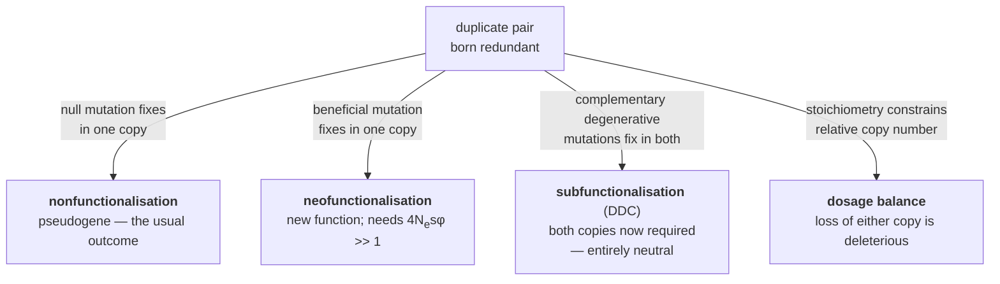
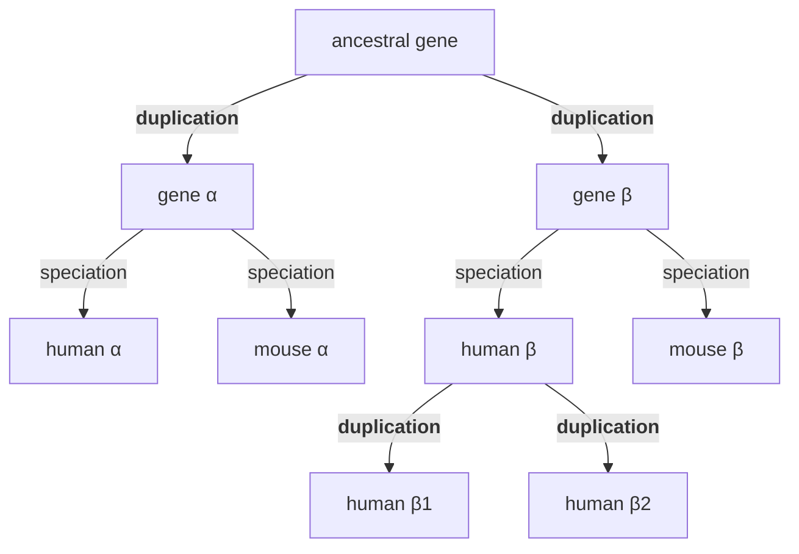

# 35 — Genome evolution, duplication and orthology

> **Before this:** [Ch 33](33-neutral-theory-and-selection-tests.md) · [Ch 34](34-phylogenetics.md) · [Ch 27](../part-05-population-genetics/27-the-four-forces.md) · **Time:** ~55 min

Chapters 33 and 34 treated genes as fixed objects whose sequences drift and diverge. That
assumption is false over deep time. Genes are duplicated, lost, fused, moved, imported from
other species, and occasionally created from nothing. This chapter is about the genome as a
mutable data structure rather than a fixed-length string.

## What you'll be able to do

- Name the three mechanisms that duplicate genes and predict the structural signature each leaves
- Derive the neofunctionalisation and duplication–degeneration–complementation probabilities, and show why only the first depends on effective population size
- Read a *K*<sub>s</sub> histogram: separate steady small-scale duplication from a whole-genome duplication, and date the latter
- Distinguish orthologs, paralogs, in-paralogs, out-paralogs and xenologs, tell concerted from birth-and-death evolution off the shape of a gene-family tree, and state the failure modes of reciprocal-best-hit inference
- Diagnose a reported eukaryotic HGT or de novo gene-birth case as supported or as contamination, and state the evidence each verdict requires
- Apply the mutational-hazard inequality to predict which lineages accumulate junk DNA
- Distinguish the bacterial pan-genome from the human pangenome of [Ch 45](../part-09-genomics/45-reference-genomes-and-pangenomes.md)

## The core idea

Point mutation cannot invent a new gene. It can only edit an existing one, and an existing
gene is usually doing something, so most edits are rejected. The way out of this trap is
**redundancy**: make a second copy first, and one copy is then free to be edited without cost.

Almost every gene family in every genome is the visible residue of that process. But
redundancy is a wasting asset. A second copy is selectively invisible precisely because it is
redundant, so the mutations that destroy it are neutral, and the default fate of a duplicate
is decay into a pseudogene. Gene family evolution is a race between decay and the acquisition
of a reason to exist.

The quantitative content of this chapter is that race, written down and solved.

---

## 1. Three ways to duplicate

| Mechanism | How | Structural signature |
|---|---|---|
| **Unequal crossing over / NAHR** | Misaligned repeats pair during meiosis; crossover yields one chromatid with a duplication and one with a deletion ([Ch 18](../part-03-genome-instability/18-recombination-mechanisms.md)) | **Tandem** array, copies adjacent and same-orientation; reciprocal deletion product exists |
| **Retrotransposition** | Processed mRNA reverse-transcribed and inserted, using LINE-1 machinery ([Ch 19](../part-03-genome-instability/19-transposable-elements.md)) | **Retrogene**: intronless, poly-A tail, flanking target-site duplications, lands anywhere — usually on a different chromosome, usually without its promoter |
| **Whole-genome duplication (WGD)** | Failed meiotic reduction produces unreduced gametes; autopolyploidy or allopolyploidy | Every gene duplicated at once; **doubled synteny blocks** genome-wide |

The three are not interchangeable. Tandem duplication copies the gene *and its neighbourhood*,
including its regulatory elements, so the copy starts life expressed in the same place at the
same time — the setup for subfunctionalisation. Retrotransposition copies only the spliced
message, so the copy arrives naked, with no promoter and no introns; most retrogenes are dead
on arrival, and the ones that survive did so by capturing a nearby promoter, which usually
gives them a *different* expression pattern. WGD duplicates everything simultaneously,
including every member of every protein complex, which turns out to be the key to why WGD
duplicates are retained differently from single-gene duplicates.

## 2. The fates of a duplicate pair

Ohno's 1970 framing: a duplicate is a spare part, freed from selective constraint, on which
evolution can experiment. Three outcomes.



### Nonfunctionalisation, and why it wins by default

Immediately after duplication both copies are functional and either is dispensable. So a
null mutation in *either* copy is neutral. Under neutrality the fixation rate equals the
mutation rate ([Ch 33](33-neutral-theory-and-selection-tests.md)): with 2*N* copies of the
locus segregating, null mutations arise at rate 2*N*·*u*<sub>n</sub> and each fixes with
probability 1/(2*N*), so nulls fix at rate

$$\lambda_{\text{null}} = u_n$$

independent of population size. The duplicate is on a clock it cannot see.

### Neofunctionalisation, and why it needs a large population

Now let *u*<sub>b</sub> be the rate of mutations conferring a useful new function with
selection coefficient *s*. Beneficial mutations arise at rate 2*N*·*u*<sub>b</sub> and each
fixes with probability ≈ 2*s* (Haldane's approximation, [Ch 27](../part-05-population-genetics/27-the-four-forces.md)):

$$\lambda_{\text{neo}} = 2N u_b \cdot 2s = 4N u_b s$$

These are competing Poisson processes, so the probability that neofunctionalisation wins the
race is the ratio of rates:

$$P(\text{neo}) = \frac{4Nu_bs}{4Nu_bs + u_n} = \frac{4Ns\varphi}{4Ns\varphi + 1}, \qquad \varphi \equiv \frac{u_b}{u_n}$$

Everything hangs on 4*N*<sub>e</sub>*s*φ. Set φ = 10⁻⁴ — there are roughly ten thousand ways
to break a gene for every way to give it a useful new job — and *s* = 0.01:

| Lineage | *N*<sub>e</sub> | 4*N*<sub>e</sub>*s*φ | *P*(neo) |
|---|---|---|---|
| Vertebrate | ~10⁴ | 0.04 | **3.8%** |
| Insect / unicellular eukaryote | ~10⁷ | 40 | **98%** |

So Ohno's mechanism is efficient in large populations and nearly useless in small ones. But
vertebrates — small *N*<sub>e</sub> — retain duplicates in abundance. Something else is
preserving them.

### Subfunctionalisation and the DDC model

Force et al.'s duplication–degeneration–complementation model supplies it. Suppose the gene
has *n* independently mutable regulatory subfunctions — separable enhancers driving expression
in separate tissues ([Ch 22](../part-04-gene-regulation/22-eukaryotic-transcriptional-regulation.md)) —
plus a coding region whose loss kills the whole gene. Let *u*<sub>r</sub> be the null rate per
regulatory element and *u*<sub>c</sub> the coding null rate. Take *n* = 2 and follow the process.

**Step 1 — the first fixation.** Neutral targets: 2 copies × (1 coding region + 2 elements).
Total rate 2(*u*<sub>c</sub> + 2*u*<sub>r</sub>). A coding hit ends the process in
nonfunctionalisation; a regulatory hit does not. So

$$P(\text{regulatory first}) = \frac{4u_r}{2u_c + 4u_r} = \frac{2u_r}{u_c + 2u_r}$$

Say it knocked out element 1 of copy A.

**Step 2 — the constraint has changed.** Copy B's element 1 is now the *only* source of
subfunction 1, so mutations there are deleterious and no longer fix. Likewise copy B's coding
region is now indispensable. The remaining neutral targets are copy A's coding region
(*u*<sub>c</sub>), copy A's element 2 (*u*<sub>r</sub>), and copy B's element 2 (*u*<sub>r</sub>).
Only the last produces complementary loss:

$$P(\text{sub} \mid \text{step 1}) = \frac{u_r}{u_c + 2u_r}$$

**Result.** With *r* ≡ *u*<sub>r</sub>/*u*<sub>c</sub>:

$$P(\text{sub}) = \frac{2u_r}{u_c + 2u_r} \cdot \frac{u_r}{u_c + 2u_r} = \frac{2u_r^2}{(u_c + 2u_r)^2} = \frac{2r^2}{(1+2r)^2}$$

Check the limits: *r* → 0 (no separable regulatory modules) gives 0; *r* → ∞ (coding region
immune) gives 1/2. At *r* = 1, *P*(sub) = 2/9 ≈ **22%**, and *P*(sub) rises with *n*.

> **Look at what is missing from that formula: *N*.** Subfunctionalisation preserves duplicate
> genes by *degrading* them, through mutations that are individually neutral. It therefore
> works exactly as well in a population of ten thousand as in a population of ten million —
> which is why it, and not Ohno's adaptive mechanism, is the plausible default explanation for
> the duplicate-rich genomes of small-*N*<sub>e</sub> vertebrates. Preservation by decay is the
> counterintuitive core of this chapter.

Twenty-two percent versus four percent, for a vertebrate. And the two mechanisms are not
exclusive: a subfunctionalised pair is preserved long enough for neofunctionalisation to
become possible later.

### Dosage balance

A fourth mechanism, and the dominant one after WGD. Many proteins act in stoichiometric
complexes. If a subunit's copy number changes alone, the complex misassembles and the excess
subunit aggregates — so losing one copy of a duplicated subunit is *deleterious*, not neutral.
The prediction is a reciprocal retention pattern, and it is observed: genes encoding complex
subunits, ribosomal proteins, transcription factors and signalling components are
preferentially **retained** after WGD (where the whole complex doubled together) and
preferentially **lost** after single-gene duplication (where it did not). Dosage sensitivity
is also why aneuploidy is so damaging ([Ch 20](../part-03-genome-instability/20-chromosome-abnormalities.md)).

## 3. Dating duplications: the *K*<sub>s</sub> clock

Synonymous divergence *K*<sub>s</sub> between two paralogs is approximately clock-like
([Ch 33](33-neutral-theory-and-selection-tests.md)). Divergence accumulates on both lineages,
so for a duplication of age *t* with synonymous rate *r*<sub>s</sub> per site per year:

$$K_s = 2 r_s t \quad \Longrightarrow \quad t = \frac{K_s}{2 r_s}$$

Now derive the expected shape of a genome-wide *K*<sub>s</sub> histogram. Duplicates are born
at some steady rate β per gene per unit time and lost at rate λ, so the density of *surviving*
pairs of age *t* is *f*(*t*) ∝ β·e<sup>−λ*t*</sup>. Change variables with *t* = *K*<sub>s</sub>/(2*r*<sub>s</sub>):

$$f(K_s) \propto \frac{\beta}{2r_s} \exp\!\left(-\frac{\lambda K_s}{2 r_s}\right)$$

**Steady duplication and loss produce a monotonic exponential decay in *K*<sub>s</sub>, and
nothing else.** Therefore any *peak* — an excess of pairs sharing one age — requires a burst
of simultaneous duplications. That is the standard evidence for whole-genome duplication, and
it is how the ancient WGDs in plant lineages were found. Two caveats: *K*<sub>s</sub>
saturates above roughly 1–1.5, blurring old events beyond dating, and gene conversion between
paralogs resets *K*<sub>s</sub> toward zero, making some pairs look spuriously young.

## 4. Three gene families worth knowing

**Globins** are the textbook case because every step is legible. The α-globin cluster sits on
chromosome 16, the β-globin cluster on chromosome 11 — a duplication old enough that a
chromosomal rearrangement has since separated them. Within each cluster, tandem duplication
produced further copies, and the genes sit **in the order in which they are switched on**:

```
chr11  5'--[HBE1]---[HBG2]-[HBG1]---[HBD]--[HBB]--3'
         embryonic    fetal            adult
chr16  5'--[HBZ]---[HBM]-[HBA2]-[HBA1]-[HBQ1]--3'
         embryonic         adult
```

That is neofunctionalisation and regulatory evolution in one picture: fetal haemoglobin binds
oxygen more tightly than adult haemoglobin, which is how a fetus extracts oxygen across the
placenta. The *products* diverged; so did the *switches* that select between them. Both
clusters also contain pseudogenes — the third fate, preserved in place.

**Olfactory receptors** are the largest human gene family: roughly 800 loci, of which only
about 400 retain intact reading frames. Over half the family is pseudogenised, against roughly
1,100 functional receptors in mouse. This is not degeneration in the pejorative sense; it is
relaxed constraint. Primates shifted to vision, the fitness cost of losing any one receptor
fell toward zero, and nonfunctionalisation — always the default — was no longer opposed.

**HOX clusters** record whole-genome duplication directly. The invertebrate chordate
amphioxus has one cluster; humans have four (*HOXA*, *HOXB*, *HOXC*, *HOXD*) on four different
chromosomes, in the same internal gene order. Two rounds of WGD near the base of the
vertebrates — the **2R hypothesis** — explain 1 → 2 → 4 exactly, and the same 1:4 pattern
appears across many other vertebrate families. Teleost fish underwent a third round (**3R**,
dated variously between about 230 and 330 million years ago) and carry up to seven clusters;
salmonids added a fourth (~80 Mya) and are still rediploidising. Plants have done this
repeatedly and recently enough that WGD peaks are stacked in many angiosperm *K*<sub>s</sub>
histograms.

## 5. Concerted evolution

Tandem arrays behave strangely: copies within one species are more similar to each other than
to their orthologs in a sister species. That is the opposite of what independent divergence
predicts, and the phylogenetic signature is unmistakable:

```
independent divergence            concerted evolution (observed for rDNA)
 ┌─ human copy1 ─┐                 ┌─ human copy1 ─┐
 ├─ mouse copy1 ─┘ (by position)   ├─ human copy2 ─┘ (by species)
 ├─ human copy2 ─┐                 ├─ mouse copy1 ─┐
 └─ mouse copy2 ─┘                 └─ mouse copy2 ─┘
```

The cause is continual homogenisation within the array by **gene conversion** and **unequal
crossing over** ([Ch 18](../part-03-genome-instability/18-recombination-mechanisms.md)). If
the per-copy homogenisation rate exceeds the mutation rate, variation is erased faster than it
accumulates and the array evolves as a unit.

The human rDNA arrays are the standard example: a ~43 kb repeat unit tandemly arrayed in the
nucleolar organiser regions of the five acrocentric chromosomes (13, 14, 15, 21, 22), a few
hundred copies per haploid genome and highly variable between individuals. Hundreds of
identical rRNA genes is exactly what a cell that must build millions of ribosomes needs, and
concerted evolution is what keeps them identical. These arrays were among the last regions of
the human genome to be assembled ([Ch 45](../part-09-genomics/45-reference-genomes-and-pangenomes.md)).

Contrast **birth-and-death evolution**, the alternative regime: new copies arise by
duplication, old ones die by pseudogenisation, and members diverge freely. Olfactory
receptors, immunoglobulins and MHC genes follow this pattern. The diagnostic is the same
phylogeny: birth-and-death families group by paralog, not by species.

## 6. Orthology and paralogy, rigorously

Fitch's definitions are about **events**, not similarity, and nearly every practical error
comes from forgetting that.

| Term | Definition | Consequence |
|---|---|---|
| **Ortholog** | Homologs whose most recent common ancestor is a **speciation** | Usually the best candidate for shared function |
| **Paralog** | Homologs whose MRCA is a **duplication** | Function may have diverged deliberately |
| **In-paralog** | Paralogs that duplicated *after* a given speciation event | Both are co-orthologs of the single gene in the other species |
| **Out-paralog** | Paralogs that duplicated *before* that speciation | Not co-orthologs; pairing them across species is an error |
| **Ohnolog** | Paralogs generated by whole-genome duplication | Dosage-balanced, syntenically detectable |
| **Xenolog** | Homologs whose history includes horizontal transfer | Gene tree contradicts species tree |



In that tree: human α and mouse α are orthologs. Human α and human β are out-paralogs, and so
are human α and mouse β. Human β1 and β2 are in-paralogs relative to the human–mouse split, and
both are **co-orthologs** of mouse β — orthology is a one-to-many relation, not a bijection.

### Inference

| Method | How | Fails when |
|---|---|---|
| **Reciprocal best hit (RBH)** | *a* ∈ A and *b* ∈ B are orthologs iff each is the other's top BLAST/DIAMOND hit | Differential gene loss; rate asymmetry; one-to-many after WGD (RBH returns at most one pair); partial assemblies; domain shuffling inflating scores |
| **Synteny-based** | Require conserved gene-order context around the candidate pair | Rearrangement-rich lineages; very deep comparisons where synteny has eroded |
| **Tree-based** | Build a gene tree, reconcile it against the species tree, label each internal node duplication or speciation | Gene-tree error propagates; needs good alignments and taxon sampling; expensive |

RBH's sharpest failure is **pseudoorthology** from differential loss. Suppose the ancestor had
paralogs X1 and X2; lineage A lost X2 and lineage B lost X1. RBH confidently pairs A-X1 with
B-X2 and labels them orthologs. They are paralogs, and their divergence predates the
speciation. If each lineage independently ends up single-copy with probability *q* — retaining
either paralog with equal chance — then both lineages are single-copy with probability *q*², and
half of those cases retain *different* paralogs, so the probability of reciprocal differential
loss is *q*²/2, which for *q* = 0.4 is **8%**. This is not an edge case.

### The ortholog conjecture

The reason any of this matters practically: essentially all functional annotation of
non-model genomes is transferred along orthology assignments ([Ch 44](../part-09-genomics/44-annotation.md)).
That rests on the **ortholog conjecture** — that orthologs retain function better than
paralogs at equal sequence divergence, because a duplication event is where functional change
is licensed and a speciation event is not.

It has been contested. A 2011 analysis using Gene Ontology annotations found paralogs *more*
functionally similar than orthologs; the rebuttal was that GO annotations are biased, since
within-species paralogs are typically annotated by the same experiments in the same lab and
inherit each other's terms. Later analyses using expression data, which does not have that
bias, support the conjecture — but weakly. The defensible summary: orthologs are on average
somewhat more functionally conserved than paralogs, the effect is smaller than the confidence
with which annotation pipelines apply it, and one-to-one orthologs are far safer than
members of large expanded families. Treat a transferred annotation as a prior, not a fact.

## 7. Synteny, rearrangement and breakpoint reuse

**Synteny** in modern usage means conserved gene order along a chromosome. It decays over time
through inversions, translocations, fissions and fusions, but slowly enough that human and
mouse — ~90 million years apart — still share a few hundred conserved blocks.

Nadeau and Taylor's 1984 **random breakage model** assumed rearrangement breakpoints fall
uniformly, which predicts an exponential distribution of conserved-segment lengths — and from
a handful of markers it correctly estimated ~180 human–mouse segments. Then whole-genome
comparison showed the model was wrong in an interesting way: breakpoints cluster and are
**reused** far more often than uniformity permits. Breakpoint regions are enriched for
segmental duplications and repetitive elements, which is mechanistically sensible, because NAHR
between dispersed repeats is precisely what generates rearrangements. Genome architecture is
not a passive substrate; it biases its own future rearrangements. The same repeat-mediated
fragility drives recurrent structural variation in human disease and in cancer
([Ch 56](../part-11-human-and-statistical-genomics/56-cancer-genomics.md)).

## 8. Sideways, and from nothing

**Horizontal gene transfer (HGT)** moves genes between contemporaneous organisms rather than
from parent to offspring. In prokaryotes it is routine, by three mechanisms: **transformation**
(uptake of naked environmental DNA), **transduction** (accidental packaging by a
bacteriophage), and **conjugation** (direct plasmid transfer through a pilus). Consequences:

- The prokaryotic "tree of life" is partly a network. Different genes give different trees, legitimately. Informational genes — replication, transcription, translation — transfer least, plausibly because they sit in tightly co-adapted complexes; metabolic genes transfer most.
- Antibiotic resistance spreads *between species* on conjugative plasmids, integrons and transposons. This is why resistance can appear in a pathogen that was never itself exposed, and why resistance genes are a public-health problem rather than a per-species one.

In eukaryotes HGT is rare but real — well-supported cases include bdelloid rotifers,
plant-to-plant transfer between parasites and hosts, and a handful of metabolic genes acquired
by insects. It also has an unusually bad evidence record. The 2015 report that a tardigrade
genome was ~17% foreign was, on reanalysis of an independent assembly, almost entirely
bacterial **contamination**; a contemporaneous claim of extensive HGT into the human genome
did not survive scrutiny either. The prior on a surprising eukaryotic HGT claim should be low
until contamination is excluded — by an independent assembly, by intron and codon-usage
evidence that the gene is integrated into a host chromosome, and by phylogenetic placement.

**De novo gene birth** — protein-coding genes originating from previously non-coding sequence
— was long dismissed on the argument that a random ORF is useless. It happens anyway. The
route is a continuum rather than a jump: pervasive low-level transcription of intergenic
regions, occasional translation of the resulting transcripts, and selection acting on those
few that happen to help, gradually converting a "proto-gene" into a gene. Confirmed cases now
exist in *Drosophila*, yeast, mouse and human, typically identified by finding an intact ORF
in one lineage aligned to unambiguously non-coding, non-deleted syntenic sequence in
outgroups. Young de novo genes are short, weakly expressed, tissue-restricted (often testis),
and mostly not essential — which is what the proto-gene model predicts. Estimated rates remain
uncertain; the phenomenon is not.

## 9. Genome size, junk, and two kinds of pangenome

Eukaryotic genome size spans five orders of magnitude and correlates with **nothing about
organismal complexity** — the **C-value paradox**. Some salamanders and lungfish carry genomes
tens of times larger than ours; the largest measured eukaryotic genome, reported in 2024 for a
fork fern, is on the order of 160 Gb. What genome size *does* correlate with is transposable
element content (~46% of the human genome, [reference/verified-facts.md](../reference/verified-facts.md)),
and inversely with effective population size.

Lynch's **mutational-hazard hypothesis** explains that second correlation without invoking any
benefit to extra DNA. Excess DNA imposes a small deleterious cost: every added base is another
target at which a mutation can disrupt something, plus a replication cost. A stretch of excess
DNA with *k* positions where mutation causes harm carries a fitness cost of roughly

$$s \approx -u \cdot k \quad \Longrightarrow \quad |N_e s| \approx k \cdot N_e u$$

So the quantity that decides the outcome is *N*<sub>e</sub>*u* — and **it has to be evaluated
per lineage, because *u* is not a universal constant.** The human germline rate is
1.3 × 10⁻⁸ per bp per *generation*, a figure that sums ~300 cell divisions plus unrepaired
chemical damage. A bacterial generation *is* one replication, so the bacterial rate is the
per-replication fidelity, ~10⁻¹⁰ per bp (verified facts) — about a hundredfold lower. Carrying
the human number across to bacteria is the standard way to get this section wrong by two orders
of magnitude. Selection can act only when |*N*<sub>e</sub>*s*| ≳ 1
([Ch 27](../part-05-population-genetics/27-the-four-forces.md)):

| Lineage | *N*<sub>e</sub> | *u* per bp per generation | *N*<sub>e</sub>*u* | *k* needed for \|*N*<sub>e</sub>*s*\| ≳ 1 |
|---|---|---|---|---|
| Bacteria | ~10⁸ | ~10⁻¹⁰ (one generation = one replication) | ~10⁻² | **~100** |
| Human | ~10⁴ | 1.3 × 10⁻⁸ (per generation, ~300 divisions) | 1.3 × 10⁻⁴ | **~7,700** |

A bacterium therefore purges an insertion whose mutational hazard is a hundred-odd positions;
we do not notice one of several thousand. Run the human intron through it: *k* = 30 critical
positions (splice donor, acceptor, branch point) gives *s* ≈ −3.9 × 10⁻⁷ and
|*N*<sub>e</sub>*s*| ≈ 0.0039 — invisible, so it drifts to fixation. The same *k* = 30 in a
bacterium gives |*N*<sub>e</sub>*s*| ≈ 0.3: also under the barrier, but short of it by a factor
of three rather than a factor of 250.

Be honest about the size of the effect. *N*<sub>e</sub> differs ~10,000-fold between the two
lineages, but *u* differs ~100-fold in the opposite direction, so the net difference in what
selection can resolve is ~100-fold, not 10,000-fold. That is still ample to separate a
streamlined genome from a bloated one, and the sign of the difference is set by population
size — but the drift barrier is the dominant term, not the only one.

Genome bloat is therefore not an adaptation and not a failure. It is what happens when a
lineage's population size falls far enough that selection can no longer see the cost of
carrying junk. The C-value paradox dissolves into population genetics
([Ch 39](../part-09-genomics/39-genome-landscapes.md) develops the composition side).

**Reductive evolution** is the mirror image. Obligate endosymbionts of insects have the
smallest cellular genomes known — down to roughly 110–160 kb and fewer than 200 genes, an
order of magnitude below free-living bacteria. The mechanism is not streamlining by selection
for efficiency: these lineages have tiny *N*<sub>e</sub> (transmitted through a handful of cells
per host generation, with no recombination), so drift dominates, Muller's ratchet turns, DNA
repair genes are among the early losses, and any gene made redundant by the host is deleted
irreversibly. Small *N*<sub>e</sub> expands eukaryotic genomes and shrinks endosymbiont ones
because the deletion bias in bacteria runs the other way — in both cases drift, not selection,
sets the outcome.

### Two things called "pangenome"

Sequence many strains of one bacterial species and the gene content differs enormously. The
**pan-genome** partitions into a **core genome** present in all strains and an **accessory
genome** present in some — the latter largely acquired by HGT, and the reason two *E. coli*
strains can share only around 60% of their genes while one causes no disease and the other
kills you.

Whether the pan-genome is bounded is an empirical question with a clean answer. If the number
of new genes contributed by the *N*th genome sequenced decays as *n*(*N*) = *kN*<sup>−α</sup>,
then

$$P(N) \approx P(1) + \int_1^N kx^{-\alpha}dx = P(1) + \frac{k\left(N^{1-\alpha}-1\right)}{1-\alpha}$$

which diverges as *N* → ∞ when α < 1 (an **open** pan-genome) and converges to *P*(1) +
*k*/(α−1) when α > 1 (**closed**). Species with broad ecological range and active HGT —
*E. coli*, *Streptococcus* — are open: every additional genome still contributes new genes.

> **This word collides.** In [Ch 45](../part-09-genomics/45-reference-genomes-and-pangenomes.md)
> the human "pangenome" is a graph-structured *reference* representing many haplotypes so that
> reads carrying non-reference sequence can be aligned. The bacterial pan-genome is a statement
> about *gene content variation between strains*. One is a data structure for alignment; the
> other is a biological claim about a species' gene repertoire. Same word, unrelated concepts.

---

## Common misconceptions

| What people think | What's actually true |
|---|---|
| A duplicate gene is a spare that evolution can freely improve | Its redundancy is exactly what makes null mutations neutral. The default outcome is decay to a pseudogene, and preservation requires an active explanation |
| Duplicates are preserved because one acquires a new function | Neofunctionalisation requires 4*N*<sub>e</sub>*s*φ ≫ 1 and is inefficient in vertebrates. Subfunctionalisation preserves duplicates by purely neutral degradation, and dosage balance preserves them by making loss deleterious |
| Orthologs are just "the same gene in another species" | Orthology is defined by the event at the MRCA, not by similarity or by best-hit score. It is frequently one-to-many, and the highest-scoring cross-species hit is often not the ortholog |
| Reciprocal best hits give you orthologs | RBH returns at most one pair, so it silently discards co-orthologs, and differential loss makes it confidently report paralogs as orthologs — plausibly in tens of percent of families |
| Large genomes belong to complex organisms | Genome size spans five orders of magnitude with no complexity correlation. It tracks TE content and inverse *N*<sub>e</sub> |
| Streamlined bacterial genomes prove selection for efficiency | In endosymbionts with tiny *N*<sub>e</sub>, reduction is driven by drift and deletion bias, not by selection for economy. Their genomes are degrading, not optimising |
| HGT into animals is common — look at the tardigrade | That result was contamination. Eukaryotic HGT is real but rare, and reported cases require an independent assembly before belief |
| The human pangenome and the bacterial pan-genome are the same idea | Unrelated. One is a graph reference for alignment; the other is core-vs-accessory gene content across strains |

## Worked example: reading a *K*<sub>s</sub> histogram

A plant genome with 30,000 protein-coding genes. All paralog pairs are collected and binned by
synonymous divergence. Given: synonymous rate *r*<sub>s</sub> = 6.1 × 10⁻⁹ per site per year.

```
pairs
 900 |*
     | *
 450 |   *
     |      *                                    ┌───┐  3,300 pairs
 225 |         *                                 │   │
     |             *   *    *    *    *    *  ┌──┘   └──┐
   0 +---+---+---+---+---+---+---+---+---+---+---+---+---+--  Ks
      0.1 0.2 0.3 0.4 0.5 0.6 0.7 0.8 0.85 0.9 1.0
```

**1. Characterise the background.** Counts halve every ΔK<sub>s</sub> = 0.1 (900 → 450 → 225),
so the background is exponential — consistent with steady duplication and loss, as derived in
§3. Convert that halving interval to time:

Δ*t* = Δ*K*<sub>s</sub> / (2*r*<sub>s</sub>) = 0.1 / (2 × 6.1 × 10⁻⁹) = 0.1 / 1.22 × 10⁻⁸ = **8.2 × 10⁶ years**

So small-scale duplicates in this genome have a half-life of about **8.2 My** — the same order
as the ~4 My reported across several eukaryotic genomes.

**2. Test whether the bump at *K*<sub>s</sub> = 0.85 is real.** Extrapolate the background:
from 0.1 to 0.85 is 0.75/0.1 = 7.5 halvings, and 2<sup>7.5</sup> = 181.0, so

expected background = 900 / 181.0 ≈ **5 pairs**, observed **3,300 pairs**

An excess of about 660-fold. Steady duplication cannot produce this. It is a whole-genome
duplication.

**3. Date it.**

*t* = *K*<sub>s</sub> / (2*r*<sub>s</sub>) = 0.85 / (1.22 × 10⁻⁸) = **6.97 × 10⁷ ≈ 70 million years ago**

**4. Retention.** Mind the denominator: the 30,000 genes seen *today* are 3,300 surviving pairs
(6,600 genes) plus 23,400 singletons, and each singleton is the survivor of a pair. So the
pre-WGD ancestor had 23,400 + 3,300 = 26,700 genes, and the WGD created 26,700 pairs — not
30,000, which is the post-loss count:

retention = 3,300 / 26,700 = **12.4%**

**5. Apparent loss rate of the WGD duplicates.** If loss were a constant-rate process,
0.124 = e<sup>−λ*t*</sup>:

λ = −ln(0.124) / 70 My = 2.091 / 70 = 0.0299 per My  →  *t*<sub>½</sub> = ln2/λ = 0.693 / 0.0299 = **23 My**

**6. Interpret the discrepancy.** WGD duplicates show a 23 My half-life; small-scale duplicates
in the *same genome* show 8.2 My. Two non-exclusive readings, and both are real effects:

- **Dosage balance.** WGD duplicates the whole complex at once, so losing one subunit copy is deleterious rather than neutral. Small-scale duplicates get no such protection.
- **The constant-rate model is wrong.** Post-WGD loss is fast at first and then decelerates, because the pairs that survive the early phase are disproportionately the ones under a constraint. Fitting a single exponential over 70 My therefore *overestimates* the half-life. Step 5's 23 My is an average over a decelerating process, not a rate.

The methodological lesson generalises: an exponential fit to survivors is only a half-life if
the hazard is constant, and in duplicate-gene loss it demonstrably is not.

## Connections

- **Back to:** [Ch 16](../part-03-genome-instability/16-mutation.md) (mutation as raw material) · [Ch 18](../part-03-genome-instability/18-recombination-mechanisms.md) (unequal crossing over, gene conversion) · [Ch 19](../part-03-genome-instability/19-transposable-elements.md) (retrotransposition, TE content) · [Ch 20A](../part-03-genome-instability/20A-bacterial-and-phage-genetics.md) (transformation, conjugation and transduction — the three mechanisms of horizontal gene transfer, with plasmid incompatibility and R factors explaining why the accessory genome moves as modules rather than genes) · [Ch 27](../part-05-population-genetics/27-the-four-forces.md) (*N*<sub>e</sub>*s*, drift barrier) · [Ch 33](33-neutral-theory-and-selection-tests.md) (*K*<sub>s</sub> as a clock) · [Ch 34](34-phylogenetics.md) (gene trees vs species trees, which is what reconciliation formalises)
- **Forward to:** [Ch 35A](35A-speciation-and-ecological-genetics.md) — read next: this chapter's §6 defines orthologs as copies separated by *speciation*, and uses that node as a coordinate without ever opening it. 35A opens it — what the event consists of genetically, what reproductive isolation is made of, and what you measure on two lineages part-way through it · [Ch 39](../part-09-genomics/39-genome-landscapes.md) (genome composition and the C-value paradox in detail) · [Ch 43](../part-09-genomics/43-genome-assembly.md) (why tandem arrays break assemblers) · [Ch 44](../part-09-genomics/44-annotation.md) (annotation transfer by orthology) · [Ch 45](../part-09-genomics/45-reference-genomes-and-pangenomes.md) (the *other* pangenome) · [Ch 56](../part-11-human-and-statistical-genomics/56-cancer-genomics.md) (repeat-mediated rearrangement in somatic evolution)

## Check yourself

**1. A vertebrate genome retains 20% of its duplicate pairs long-term. Ohno's neofunctionalisation model predicts a few percent. What's the resolution?**

<details><summary>Answer</summary>

*P*(neo) = 4*N*<sub>e</sub>*s*φ/(4*N*<sub>e</sub>*s*φ + 1) scales with *N*<sub>e</sub>, and
vertebrate *N*<sub>e</sub> ≈ 10⁴ makes the numerator small. Subfunctionalisation (DDC) has no
*N* in it — *P*(sub) = 2*r*²/(1+2*r*)², around 22% at *r* = 1 — because it proceeds by
complementary *neutral* degenerative mutations. Dosage balance adds a third route by making
loss actively deleterious. The observed retention is the sum of three mechanisms, only one of
which is adaptive, and it is not the dominant one in small populations.

</details>

**2. You find a paralog pair where one copy has no introns, sits on a different chromosome, and has a poly-A tract at its 3' end. What produced it, and what should you expect about its expression?**

<details><summary>Answer</summary>

Retrotransposition — a spliced mRNA was reverse-transcribed and reinserted, so introns are
absent, the poly-A tail is retained, and the insertion site is unrelated to the parent locus.
Expect the expression pattern to differ from the parent's, because the retrocopy did not bring
its promoter or enhancers with it: it is either silent (most are, and become processed
pseudogenes) or driven by whatever regulatory sequence happened to be nearby. Contrast a
tandem duplicate, which arrives with its regulatory neighbourhood and therefore starts with the
parent's expression pattern — which is what makes tandem duplicates the substrate for
subfunctionalisation and retrogenes the substrate for expression novelty.

</details>

**3. RBH between human and zebrafish returns one hit for a gene you know duplicated in the teleost 3R. What has it done wrong, and how would you fix it?**

<details><summary>Answer</summary>

RBH is constrained to return at most one pair, so it reports whichever 3R ohnolog scores
higher and silently discards the other. Both zebrafish copies are in-paralogs relative to the
human–teleost split and therefore **co-orthologs** of the human gene: orthology here is
one-to-two, and RBH cannot represent that. Worse, if the two ohnologs subfunctionalised, the
discarded one may carry the subfunction you care about. Fix it with a tree-based method
(build the gene tree, reconcile against the species tree, label the internal node as a
duplication *after* the speciation) and confirm with synteny — 3R ohnologs sit in doubled
syntenic blocks, which is exactly the evidence RBH cannot use.

</details>

**4. Bacteria have compact genomes and humans have bloated ones. Explain without appealing to selection for efficiency in bacteria.**

<details><summary>Answer</summary>

Excess DNA carries a small deleterious cost *s* ≈ −*uk*, where *k* is the number of positions
at which mutation would cause harm, so |*N*<sub>e</sub>*s*| ≈ *k*·*N*<sub>e</sub>*u* — and *u*
must be the lineage's own rate. Humans: *u* = 1.3 × 10⁻⁸ per bp per generation and
*N*<sub>e</sub> ≈ 10⁴, so *N*<sub>e</sub>*u* ≈ 1.3 × 10⁻⁴. Bacteria: one generation is one
replication, so *u* ≈ 10⁻¹⁰ per bp, and with *N*<sub>e</sub> ≈ 10⁸, *N*<sub>e</sub>*u* ≈ 10⁻².
Selection resolves a coefficient only when |*N*<sub>e</sub>*s*| ≳ 1, which needs *k* ≳ 100 in
bacteria and *k* ≳ 7,700 in humans — a few hundred bases' worth of mutational hazard is purged
from a bacterial genome and invisible in ours. Note what the honest arithmetic gives up: the
mutation rate is *not* the same in the two lineages. *N*<sub>e</sub> differs 10,000-fold, *u*
differs ~100-fold the other way, and the net gap in the efficacy of selection is ~100-fold. The
drift barrier is the dominant term, not the sole one. No efficiency argument is needed either,
and it is independently weak: replication cost per base is a negligible fraction of a cell's
energy budget.

</details>

**5. Two genes in different species are 92% identical at the amino-acid level and are each other's top BLAST hit. Why is it still unsafe to transfer functional annotation between them?**

<details><summary>Answer</summary>

Three separate problems. (i) High similarity does not establish orthology — differential loss
of ancestral paralogs makes RBH pair out-paralogs and call them orthologs, at a rate of order
*q*²/2 (≈8% for *q* = 0.4). (ii) Even if they *are* orthologs, the ortholog conjecture is
supported only weakly: orthologs are on average somewhat more functionally conserved than
paralogs, an effect far smaller than the confidence with which annotation pipelines apply it.
(iii) Function is frequently regulatory rather than biochemical, and expression domain can
diverge while coding sequence stays 92% identical — the globin clusters are the standard
demonstration. A transferred annotation is a prior with a real error rate, and that error rate
propagates silently into every downstream enrichment analysis.

</details>
