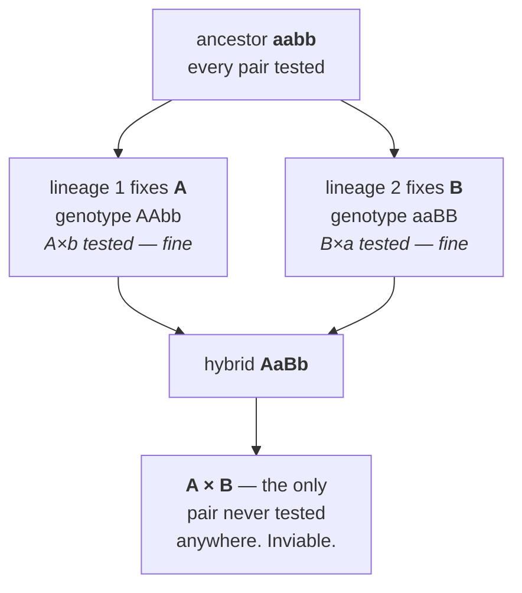
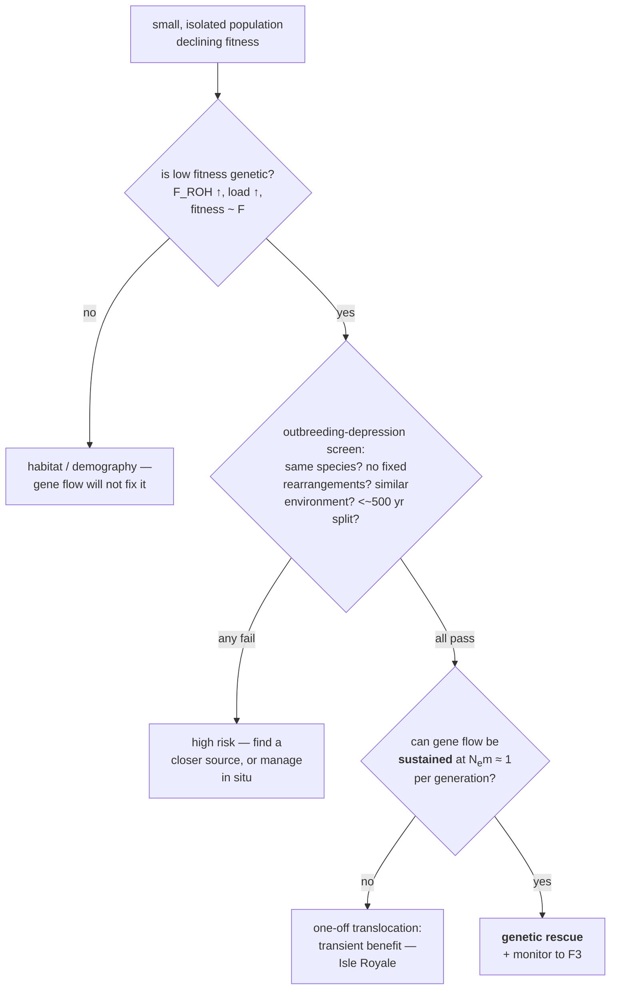

# 35A — Speciation, hybridisation and ecological genetics

> **Before this:** [Ch 27](../part-05-population-genetics/27-the-four-forces.md) ·
> [Ch 28](../part-05-population-genetics/28-structure-and-inbreeding.md) ·
> [Ch 29](../part-05-population-genetics/29-linkage-disequilibrium.md) ·
> [Ch 33](33-neutral-theory-and-selection-tests.md) · [Ch 34](34-phylogenetics.md) ·
> [Ch 35](35-genome-evolution.md) · **Time:** ~50 min
>
> **Statistics needed:** [S3 Sampling and estimation](../part-S-statistics/S3-sampling-and-estimation.md) §§2–3, 6 ·
> [S4 Hypothesis testing](../part-S-statistics/S4-hypothesis-testing.md) §§2, 7

Every chapter since Ch 26 has assumed a population: one gene pool, one set of allele frequencies,
one recursion. Chapters 33–35 then assumed a *species tree* — nodes labelled "speciation", used
as a coordinate and never opened. This chapter opens it. What is the event at that node, what
genetics does it consist of, and what do you measure when two lineages are part-way through it?

The machinery is already on the shelf. [Ch 18 §7](../part-03-genome-instability/18-recombination-mechanisms.md)
built a hybrid-sterility mechanism and never named what kind of thing it is.
[Ch 34 §10](34-phylogenetics.md) built a test for gene flow and aimed it at one question about
Neanderthals. [Ch 27](../part-05-population-genetics/27-the-four-forces.md) and
[Ch 28](../part-05-population-genetics/28-structure-and-inbreeding.md) derived *N*<sub>e</sub>,
*F*, *F*<sub>ST</sub> and inbreeding depression and applied none of it to a population that might
actually go extinct. This chapter spends all of it.

## What you'll be able to do

- Distinguish the biological, phylogenetic and genotypic-cluster species concepts by the
  operation each one performs, and predict the cases on which each returns no answer
- Classify a barrier to gene flow as prezygotic or postzygotic, compute the combined isolation
  from a sequence of barriers, and derive why selection can build a prezygotic barrier but only
  stumble into a postzygotic one
- Derive the Dobzhansky–Muller model — why both alleles must be derived and in different
  lineages — and show why the number of incompatibilities grows with the *square* of divergence
- Distinguish the dominance theory from faster-male as accounts of Haldane's rule, and name the
  observations that separate them
- Derive cline width *w* ∝ σ/√*s* from a dispersal–selection balance, invert an observed cline
  into a selection coefficient, and generalise Ch 34's *D*-statistic beyond archaic humans
- Design a reciprocal transplant that tests local adaptation, and diagnose the three neutral
  processes that manufacture *F*<sub>ST</sub> outliers
- Compute *N*<sub>e</sub> for a managed population, decide whether it is a candidate for genetic
  rescue, and state the risk that decision carries

## The core idea

Speciation is branch divergence where the merge increasingly fails to compile.

Two populations stop exchanging genes. Each then accumulates substitutions tested against
everything in its own genome and against nothing in the other's. When a hybrid assembles one
allele from each, it runs a combination selection has never seen — and the number of such
untested combinations grows with the *product* of the two divergences, not their sum. That is why
incompatibility accumulates faster than divergence does.

The rest is measurement. Isolation is never all-or-nothing, so the useful questions are
quantitative: how much gene flow crosses, which loci cross and which do not, how hard selection
pushes back, and — where the answer is "so little that the population is on its own" — what that
costs it.

> **A species boundary is a filter with a measurable transmission coefficient, not a wall.**
> Every technique in this chapter estimates that coefficient from a different kind of data.

---

## 1. Three species concepts, and why the disagreement is substantive

You have organisms, sequences and a map. You need to decide where one species stops. Three
criteria are in general use, and they are not three phrasings of one idea — they are three
different *operations*, and they disagree about real cases.

**1. The biological species concept** (Mayr, 1942). Species are groups of actually or
potentially interbreeding natural populations, reproductively isolated from other such groups.
*The operation is a cross.* It buys a causal criterion — it names the thing that actually keeps
two gene pools separate, and hands you a research programme (§2: go and find the barriers). It
costs applicability. It says nothing about **asexual lineages** — bdelloid rotifers, apomictic
dandelions, and every bacterium in [Ch 20A](../part-03-genome-instability/20A-bacterial-and-phage-genetics.md),
where transfer is one-way and "interbreeding" has no referent. It says nothing about **fossil
lineages**, since you cannot cross a specimen with its own great-great-grandparent, so a single
lineage changing through time has no non-arbitrary division points. And "*potentially*
interbreeding" is untestable for **allopatric** populations, which is most populations.

**2. The phylogenetic species concept.** A species is the smallest diagnosable cluster of
organisms with a parental pattern of ancestry and descent. *The operation is building a tree*
([Ch 34](34-phylogenetics.md)) and finding the smallest group you can diagnose by a unique
character combination. It works on asexuals, fossils, allopatric populations and single
specimens. Two costs. Gene-tree monophyly is not species monophyly — Ch 34 §10 showed
genealogies genuinely disagree, and reciprocal monophyly at any one locus takes of order
4*N*<sub>e</sub> generations to arise *even with zero gene flow*, so its absence is often a
statement about time and *N*<sub>e</sub> rather than about contact. And diagnosability has no
natural scale: with enough markers everything is diagnosable, so the species count becomes a
function of sequencing depth. That is not academic — Barrowclough and colleagues (2016) applied
a diagnostic criterion to birds and estimated **~18,043** species against the ~9,000–10,000 on
checklists built on the biological concept. Species are the unit of most conservation
legislation; the concept you adopt changes what is legally protected.

**3. The genotypic-cluster criterion** (Mallet, 1995). A species is a distinguishable cluster in
genotype space, recognised by a **deficit of intermediates where the forms co-occur**. *The
operation is a measurement*: sample in sympatry and ask whether the joint genotype distribution
is bimodal. It tolerates hybridisation by construction — it asks whether the clusters *fuse*, not
whether individuals ever mate — which matters now that introgression is known to be ordinary
(§5). Its cost is the biological concept's: it needs sympatry, so it is silent on allopatric
pairs.

| | Biological | Phylogenetic | Genotypic cluster |
|---|---|---|---|
| Operation | a cross | a tree | a genotype histogram in sympatry |
| Evidence | barriers to gene flow | diagnosable, monophyletic | bimodality, few intermediates |
| Asexuals | no answer | works | no answer |
| Fossils | no answer | works | no answer |
| Allopatric pairs | untestable | works | no answer |
| Hybridising pairs | ambiguous | often lumps or splits arbitrarily | **the case it was built for** |
| Tends to | lump | split | follow the data |

For a programmer these are three *equality operators* on lineages: one tests behaviour (can they
merge?), one tests provenance (do they share a most recent common commit?), one tests the
observed distribution (are there two modes?). They agree on the easy cases and diverge exactly
where you needed an answer.

They diverge because the underlying object is continuous. Roux and colleagues (2016) fitted
demographic models to **61 animal population/species pairs** and found the transition from free
gene exchange to established barriers spans a **"grey zone" of about 0.5% to 2% net synonymous
divergence**, with the earliest detectable barriers at divergences as low as 0.075%. There is no
threshold in nature; any threshold in a definition is a convention. Say which one you used, and
never argue about the label without reporting the measurement.

## 2. Reproductive isolation: a catalogue with an ordering

A **reproductive isolating barrier** is any heritable feature that reduces gene flow between
populations. They sort by *when* they act, and that ordering does more work than the taxonomy.

| | Barrier | Acts by |
|---|---|---|
| **Prezygotic** | Ecological / habitat | the two forms rarely meet — different microhabitat, host plant, depth |
| | Temporal | different breeding season or time of day |
| | Behavioural / sexual | mate choice on song, pheromone, colour, courtship |
| | Mechanical | genitalia or floral morphology do not fit; wrong pollinator |
| | Gametic | sperm fails to fertilise; pollen tube fails to grow |
| **Postzygotic** | Extrinsic | the hybrid is fine in the lab and unfit in *either* parental niche |
| | Intrinsic | the hybrid is inviable or sterile regardless of environment — §3 |

**Barriers act in sequence, so they multiply.** Each barrier sees only the gene flow the previous
ones let through, so if barrier *i* blocks a fraction *b*<sub>i</sub> of what reaches it:

```
RI = 1 − Π (1 − b_i)

three barriers, each b = 0.9, in order:
   barrier 1 removes           0.900  of all gene flow
   barrier 2 removes  0.1×0.9 = 0.090
   barrier 3 removes 0.01×0.9 = 0.009        total RI = 0.999
```

Three identical barriers, absolute contributions differing a hundredfold, purely from position in
the queue. **An early-acting barrier of a given strength always dominates the accounting**, which
is why "which barrier matters most" is meaningless without the order.

**Prezygotic barriers also evolve faster, and that is a separate fact with a separate cause.**
Coyne and Orr (1989, revisited 1997 with 52 more pairs) scored 119 closely related *Drosophila*
species pairs for genetic distance, mating discrimination and hybrid sterility/inviability. Among
**allopatric** pairs, mating discrimination and postzygotic isolation accumulate with genetic
distance at comparable rates. Among **sympatric** pairs, strong mating discrimination appears at
divergences where postzygotic isolation is still negligible. Both classes share the same
molecular clock, so the contrast is the evidence.

The mechanism is **reinforcement**, and it derives in one line. Let hybrids have fitness 1 − *s*.
A heritable tendency to reject heterospecific mates gains an advantage proportional to
*s* × P(encountering a heterospecific). In allopatry that probability is **zero**, so there is no
selection on mate choice at all and any assortative mating arises as a by-product. In sympatry it
is not zero, so selection acts *directly on the prezygotic trait*. Nothing comparable happens on
the other side: a gene that makes hybrids worse is not favoured by hybrids dying — they are
already dead, and the gene is in them.

> **Selection can build a prezygotic barrier. It can only stumble into a postzygotic one.**
> Intrinsic postzygotic isolation is a side-effect of divergence, accumulating at whatever rate
> divergence proceeds (§3). Premating isolation can be a direct target.

The comparative pattern does not by itself prove reinforcement, and two alternatives survive.
**Differential fusion**: sympatric pairs with weak discrimination merge and vanish from the
sample, biasing the survivors — survivorship, not evolution. **Deflated distances**: gene flow
homogenises part of the genome in sympatric pairs, making them look younger than they are.
Servedio and Noor's (2003) review concludes reinforcement is well supported theoretically and by
individual case studies, with the comparative pattern consistent with it rather than diagnostic.

## 3. Dobzhansky–Muller incompatibilities, derived

Intrinsic postzygotic isolation looks impossible before you do the bookkeeping, and the
impossibility is the interesting part.

**The problem is a fitness valley.** Write the ancestral genotype `aabb` and suppose the
combination that kills a hybrid is `A` with `B`. For one population to reach `AABB` on its own it
must pass through living individuals carrying both — and by hypothesis that combination kills, so
selection removes the second substitution as fast as it arises. **A single population cannot walk
into an incompatibility, because every step is tested on the way.**

**The Dobzhansky–Muller resolution.** Bateson (1909), Dobzhansky (1936/1937) and Muller
(1940/1942) independently saw that the valley disappears if the two substitutions occur in
*different* lineages. Population 1 fixes `A`, so `A`-with-`b` is tested there and is fine.
Population 2 fixes `B`, so `B`-with-`a` is tested there and is fine. The pair `A`-with-`B` is
**never assembled anywhere** until a hybrid assembles it — and a hybrid is not a population
selection can act within.



Two conditions fall straight out of that argument, and both are load-bearing. **Both alleles must
be derived** — if one were ancestral, the pair would have existed in the ancestor and been tested
there. **They must be in different lineages** — if both arose in one lineage they would have met
inside a population, where selection would have seen the incompatibility.

Note what a DM incompatibility is *not*: a bad gene. Each allele is unremarkable at home, and
neither would ever be flagged by a deleterious-variant scan in its own species. Incompatibility
is a property of a **pair** with no evolutionary history together.

### The snowball

Now count. After *K* substitutions have accumulated between two lineages, how many untested
cross-lineage pairs of derived alleles exist? With *k* on one side and *K* − *k* on the other,
the answer is *k*(*K* − *k*) — a product, not a sum. In the symmetric case *k* = *K*/2 that is
*K*²/4. If each such pair is incompatible with some small probability *p*, then

```
E[number of incompatibilities] ≈ p·K²/4          — quadratic in divergence
```

Orr (1995) named this the **snowball effect**, and its testable content is sharper than "more
divergence, more incompatibility": the number of incompatibilities *per unit of divergence*
should itself increase with divergence. Since neutral divergence is roughly linear in time
([Ch 33 §1](33-neutral-theory-and-selection-tests.md), *k* = μ), incompatibility grows with the
*square of time*.

For a programmer this is merge-conflict arithmetic exactly. Each commit on a fork is tested
against everything already in that fork and against nothing in the other, so at merge time the
number of untested pairwise interactions is the **product** of the two commit counts: a fork
diverged for twice as long is four times as painful, and merging early and often works not
because each merge is small but because it keeps the cross-product from ever growing. Where the
analogy breaks: no one rebases a genome, and there is no test suite — the incompatibility is
discovered by the hybrid dying.

**The evidence is real, thin and contested.** Matute and colleagues (2010, *Science* 329:1518)
counted loci causing hybrid lethality across *Drosophila* pairs at different divergences and
found faster-than-linear accumulation. Moyle and Nakazato (2010, same issue) found *Solanum*
**seed-sterility** QTL accumulating significantly faster than linearly while **pollen-sterility**
QTL accumulated linearly. Both were challenged within two years: a 2011 Comment argued Matute's
assay detects loci haploinsufficient in a hybrid background that would not contribute to
lethality in ordinary hybrids, inflating the counts; a 2012 reanalysis argued the *Solanum*
result is sensitive to how divergence is estimated in the presence of ancestral polymorphism.
The theory is secure; the empirical base is two disputed datasets, not a literature.

### PRDM9 is the worked instance, and Ch 18 already gave you the mechanism

[Ch 18 §7](../part-03-genome-instability/18-recombination-mechanisms.md) told this as a
recombination story and never named the category. Read it as a DM incompatibility and every
clause of the derivation lines up.

PRDM9 places recombination hotspots by binding a motif, and the chromosome that gets cut is the
one that loses its sequence, so an active allele erodes its own targets. Within
*Mus musculus musculus*, its PRDM9 has degraded the sites on *musculus* chromosomes; within
*M. m. domesticus*, a different PRDM9 has degraded the sites on *domesticus* chromosomes. Each
protein has been tested against its own genome for its whole history, and each works. In an F1,
*musculus* PRDM9 meets *domesticus* chromosomes — a protein–DNA pairing never assembled in any
population. It binds asymmetrically, mostly to the intact sites on one homolog, so breaks land
where the partner has no corresponding site. Synapsis fails, meiosis arrests, F1 males are
sterile. Mihola and colleagues (2009, *Science* 323:373) positionally cloned the *Hst1*
hybrid-sterility locus to *Prdm9* — the first, and still the only, hybrid-sterility gene
identified in a vertebrate.

Three things to take. The interacting partners are a **protein and a binding site**, not two
proteins: a DMI requires an interaction, not a complex. The alleles are **derived and in
different lineages**, exactly as required. And the very feature that makes PRDM9 work — rapid
zinc-finger turnover forced by the self-destruction of its own targets — is what *guarantees*
that two separated populations diverge at this locus. **The hotspot paradox and the speciation
gene are one mechanism read at two timescales.**

## 4. Haldane's rule and the large-X effect

Haldane (1922): *"When in the F1 offspring of two different animal races one sex is absent, rare
or sterile, that sex is the heterozygous [heterogametic] sex."* (This is not the Haldane result
of [Ch 15](../part-02-transmission-genetics/15-pedigrees.md) — that one is the 1935 calculation
that ⅓ of affected males in a lethal X-linked disorder are new mutants.)

It is one of the most general patterns in the field. Conformity, as compiled by Presgraves and
tabulated in the 2023 centenary review: ***Drosophila* 95% (n = 131), mammals 100% (n = 26),
birds 97% (n = 87), Lepidoptera 96% (n = 114)**. Note that birds and butterflies are **ZW**, so
there the heterogametic sex is *female* and the rule still holds. With of order ten independent
origins of heterogamety among animals, this is not one historical accident replicated by
descent.

**Dominance theory** (Muller 1940; formalised by Turelli and Orr, 1993/1995). DM incompatibility
alleles are, on average, partially recessive — the same conclusion Ch 28 §4 reached for
deleterious alleles generally, reappearing here. Give an X-linked incompatibility allele
homozygous effect 1 and dominance coefficient *h*. In an XY hybrid the X is **hemizygous**, so
one allele is expressed at full effect. In an XX hybrid there are *two* hybrid X chromosomes,
carrying twice as many such alleles, but each is heterozygous against the other species' X and
expressed at *h*:

```
cost to heterogametic sex  ∝  1 × 1   = 1
cost to homogametic sex    ∝  2 × h   = 2h

heterogametic worse off  ⟺  2h < 1  ⟺  h < ½
```

Partial recessivity is exactly the condition *h* < ½. The derivation is symmetric in which sex
is heterogametic, so it predicts the rule in ZW systems too, and it applies to sterility and
inviability alike.

**Faster-male.** Male reproductive genes diverge unusually fast — sexual selection, plus
spermatogenesis having no post-meiotic transcription to buffer disruption. This predicts males
suffer *whichever* sex is heterogametic, so in ZW taxa it predicts **against** Haldane's rule.

**Faster-X.** Hemizygosity exposes new recessive beneficial X-linked mutations directly to
selection, so the X accumulates substitutions — and therefore DMIs — faster. That is an
*amplifier*, not on its own a reason for the heterogametic sex to be the one that fails.

**Three observations separate them, and each rules out something different.**

| Observation | Rules out | Because |
|---|---|---|
| **Unbalanced females** (Coyne 1985; Orr 1993). Hybrid females made hemizygous/unbalanced for a hybrid X die — at the *same developmental stage* as hybrid males | faster-male as the sole cause of inviability | The same loci kill both. Sex per se is not what matters; hemizygosity is |
| **ZW taxa.** Birds and Lepidoptera obey the rule with the female heterogametic | faster-male as a general explanation | Faster-male predicts the opposite sex in ZW systems |
| **Marsupials.** Imprinted paternal X inactivation makes *both* sexes functionally hemizygous for the maternal X — yet males are sterile and females fertile in 10 of 11 examined species pairs, while Haldane's rule for *viability* is weak or absent | dominance as a general explanation | With no dominance asymmetry available, sterility still tracks maleness |

The defensible summary: **Haldane's rule is composite.** Dominance carries hybrid inviability
and carries the ZW cases; faster-male carries hybrid sterility in male-heterogametic taxa;
faster-X and meiotic drive between sex chromosomes are contributing amplifiers whose weight is
still argued. Anyone presenting it as one mechanism is quoting half the evidence.

**The large-X effect** is a different claim: X-linked regions contribute disproportionately to
hybrid sterility and inviability in introgression mapping. Haldane's rule is about *which sex*;
large-X is about *which chromosome*. And the standard experiment produces part of the effect by
itself — an introgressed X fragment is hemizygous in males while an introgressed autosomal
fragment is heterozygous, so the assay simply has more power on the X. A measured large-X
effect needs that controlled for before it is a biological result.

## 5. Hybrid zones: a diffusion–selection equilibrium

Where two divergent forms meet and interbreed, you get a **hybrid zone** — a spatial band of
mixed ancestry. These are not rare curiosities: Barton and Hewitt's 1985 review catalogued about
**150** reasonably clear cases.

**Two kinds, distinguished by what holds the zone in place.**

| | **Tension zone** | **Environmental (ecotone) cline** |
|---|---|---|
| Selection is | endogenous — hybrids are unfit *anywhere* | exogenous — each form is fitter in its own habitat |
| Position set by | nothing environmental; the zone drifts until trapped in a density trough or at a dispersal barrier | the environmental transition itself |
| Unlinked loci | coincident and concordant clines, coupled by linkage disequilibrium | coincident only for loci responding to the same variable |
| If the environment moves | the zone does not follow | the zone follows |

The shapes are not diagnostic — both give a sigmoid. The tests are coincidence of clines at
*unlinked* loci (unlinked markers have no reason to agree on a centre and a width unless
something couples them), coincidence with an environmental boundary, and movement over decades.

### Deriving cline width

Two forces, one balance. **Dispersal** spreads alleles across the boundary: let σ be the standard
deviation of parent–offspring displacement along the transect, in distance per √generation,
because dispersal is diffusion and it is the *variance* that adds per generation. **Selection**
removes hybrid ancestry at rate *s* per generation.

The scaling argument gives the answer without the differential equation. Over *t* generations
diffusion spreads a marker a distance of order σ√*t*, and selection resolves the fate of hybrid
ancestry on a timescale *t* ≈ 1/*s*. Substituting that timescale:

```
w  ~  σ √(1/s)  =  σ / √s
```

The exact treatment solves the stationary state of ∂*p*/∂*t* = (σ²/2)·∂²*p*/∂*x*² + *s*·*f*(*p*).
Defining **width as the inverse of the maximum gradient** (the standard convention), Bazykin's
underdominance model — heterozygotes at fitness 1 − *s* — gives

```
w = σ √(8/s)        ⟹        s = 8 (σ/w)²
```

Other selection models change only the constant: Barton and Gale give ≈ 2.5σ/√*s* for general
selection against hybrids, ≈ 1.7σ/√*s* for a step in exogenous selection. **The √*s* scaling is
robust; the constant is a model choice you must declare.** The worked example turns exactly this
into an error and then fixes it.

**What a narrow cline implies.** The ratio *w*/σ is a direct readout of selection, and it is
brutal: a zone 6 dispersal units wide implies *s* ≈ 8/36 ≈ 0.22, one 100 units wide implies
*s* ≈ 0.0008, which is nothing. Barton and Hewitt's point was that catalogued zones are typically
*tens* of σ wide, not thousands — so most are held by substantial selection rather than being
transient smears of recent contact.

A second, independent handle is **linkage disequilibrium**. In a tension zone the parental
genomes arrive as coherent blocks, so even unlinked loci are correlated at the centre — that is
[Ch 29 §7](../part-05-population-genetics/29-linkage-disequilibrium.md)'s admixture LD,
*D* = *m*(1 − *m*)·Δ*p*<sub>A</sub>·Δ*p*<sub>B</sub>, held at a *spatial* equilibrium instead of
decaying through time. The same σ and *s* determine it, so it gives a second estimate that should
agree with the width-based one. Agreement between two independent estimates is the real test of
the model, not goodness of fit to either alone.

### Introgression, and generalising Ch 34's *D*

Hybridisation moves alleles across; what happens next differs by locus. Introgression is
systematically **reduced** near incompatibility loci, near genes generally, and on the X or Z
(which carries more DMIs — §4), and **enhanced** where the introgressed allele is useful in its
new environment. That heterogeneity *is* the filter.

[Ch 34 §10](34-phylogenetics.md) built the statistic and pointed it at one question. Restate it
generically: for a topology (((P1, P2), P3), O), incomplete lineage sorting is **symmetric**, so
E[*n*<sub>ABBA</sub>] = E[*n*<sub>BABA</sub>] and

```
D = (n_ABBA − n_BABA) / (n_ABBA + n_BABA)
```

has expectation zero. Nothing in that derivation mentions humans or hominins. Any four
populations with a known topology will do — two species and an outgroup, two populations of one
species and a congener, two crop landraces and a wild relative. Significance comes from a
**block jackknife** over the genome, because sites within a block are not independent
([S3 §6](../part-S-statistics/S3-sampling-and-estimation.md);
[Ch 29](../part-05-population-genetics/29-linkage-disequilibrium.md)).

Three documented cases of **adaptive introgression**, each found this way:

- ***Heliconius* butterflies.** Mimicry colour-pattern alleles have moved repeatedly between
  species, notably a segment near the red-patterning gene *optix*. The trait under selection is
  the trait that crosses.
- ***Anopheles* mosquitoes.** The *Vgsc*-1014F insecticide-resistance allele introgressed from
  *A. gambiae* into *A. coluzzii*, dragging the whole 2L divergence island (~1.5% of the genome)
  with it, coincident with a bed-net campaign in Mali. Resistance crossed a species boundary the
  way Ch 20A's R factors crossed a genus boundary — different mechanism, same consequence.
- ***EPAS1* in Tibetans.** A Denisovan-derived haplotype at the hypoxia-response transcription
  factor, introgressed of order 48,700 years ago and selected from roughly 9,000 years ago.
  Tibetans do *not* carry elevated Denisovan ancestry genome-wide: one locus swimming against a
  background that was otherwise purged.

Carry the caveats. *D* ≠ 0 says "not ILS alone" and nothing more: unsampled ("ghost") lineages
and ancestral structure produce the same asymmetry, mutation-rate variation perturbs it, and it
does not identify the *direction* of flow.

## 6. Local adaptation, and why *F*<sub>ST</sub> outliers lie

A population is **locally adapted** if it has higher fitness in its own environment than a foreign
population has *in that same environment*. The definition is comparative in a specific way, and
getting the comparison wrong is the commonest error here.

**The reciprocal transplant is the definitional experiment**, because it is the only design that
makes both required comparisons. Grow populations A and B at both sites:

```
                site A          site B
   pop A        W(A,A)          W(A,B)
   pop B        W(B,A)          W(B,B)

   local vs foreign:  W(A,A) > W(B,A)  AND  W(B,B) > W(A,B)   ← the definition
   home  vs away:     W(A,A) > W(A,B)  AND  W(B,B) > W(B,A)   ← NOT the definition
```

**Home-versus-away is confounded by site quality.** If site A is simply better for everything,
every population sampled with A as its home looks "fitter at home". Local-versus-foreign compares
genotypes *within* a site, so site quality cancels. Report local-versus-foreign.

Hereford's (2009) survey of published reciprocal transplants found local adaptation in **71%** of
cases, with a mean native advantage of **45%** in relative fitness. Common, and large. What the
experiment does not establish: that the difference is genetic rather than maternal or epigenetic
carry-over (grow a common generation first), or which loci are responsible.

**Local adaptation is a G×E interaction with a sign.** In the reaction-norm picture
([Ch 32 §12](../part-06-quantitative-genetics/32-mapping-quantitative-traits.md)), the two
populations' lines **cross**, each higher at its own end. A non-crossing interaction — one
genotype better everywhere, more so in one environment — is a G×E and is *not* local adaptation.
Crossing implies a trade-off, and Hereford found those trade-offs are often smaller than theory
expects.

**Finding the loci, and the null-model problem.** The *F*<sub>ST</sub> outlier scan (Lewontin and
Krakauer's idea) reasons that under neutrality all loci share one demographic history, so
*F*<sub>ST</sub> has a single distribution set by drift and migration —
*F*<sub>ST</sub> ≈ 1/(1 + 4*Nm*) from
[Ch 27 §5](../part-05-population-genetics/27-the-four-forces.md) — and locally selected loci sit
in the upper tail. Three neutral processes manufacture that tail:

1. **Isolation by distance and hierarchical structure.** The island model assumes every deme
   draws from one common pool. Real populations sit on a lattice or a tree
   ([Ch 28 §9](../part-05-population-genetics/28-structure-and-inbreeding.md)), which widens the
   neutral distribution and gives it a long tail the test reads as signal.
2. **Allele surfing on a range expansion.** On an advancing front, an allele that happens to be
   in the leading edge rides to high frequency in newly colonised territory through a chain of
   founder events — drift with a spatial ratchet, manufacturing steep geographic clines out of
   nothing.
3. **Background selection.** [Ch 33 §9](33-neutral-theory-and-selection-tests.md)'s confound in a
   new statistic. BGS depresses within-population diversity in low-recombination, gene-dense
   regions, and *F*<sub>ST</sub> is a **relative** measure —
   *F*<sub>ST</sub> = 1 − π<sub>within</sub>/π<sub>total</sub> — so depressing π<sub>within</sub>
   raises it with no increase in absolute divergence at all: chronically and genome-wide, with no
   local adaptation anywhere.

Lotterhos and Whitlock (2014) simulated exactly (1) and (2) and found the two most widely used
methods, FDIST2 and BayeScan — both of which assume the sampled populations are evolutionarily
independent — have badly inflated false-positive rates under isolation by distance and range
expansion. Methods that estimate the population covariance (FLK, Bayenv2) did better; and
parameterising FDIST2 on a "neutral" locus set made it *worse*, not better, in those scenarios.

The remedies have Ch 33's shape: fit a demographic null instead of assuming one, condition on
recombination rate and functional density, correct for testing millions of loci
([S4 §7](../part-S-statistics/S4-hypothesis-testing.md)), and prefer a **genotype–environment
association** to *F*<sub>ST</sub> alone, since structure does not predict a *named* environmental
gradient. Then validate. An *F*<sub>ST</sub> outlier is a hypothesis whose confirmation is a
transplant or a functional test, not a plausible Gene Ontology term on the nearest gene.

## 7. Conservation genetics: spending the machinery of Ch 27 and Ch 28

### *N*<sub>e</sub> against the census, and why the ratio is about 0.1

[Ch 27 §7](../part-05-population-genetics/27-the-four-forces.md) gave three reasons
*N*<sub>e</sub> < *N*, each a multiplier below 1, and they compound:

```
unequal sex ratio:        N_e = 4·N_m·N_f/(N_m+N_f)
variance in family size:  N_e ≈ (4N − 2)/(V_k + 2)
fluctuating size:         N_e = harmonic mean over generations
```

Frankham (1995) collected **192 estimates from 102 species**. Individual estimates spanned 10⁻⁶
in Pacific oysters to 0.99 in humans and averaged 0.34; but the **comprehensive** ones — those
including fluctuation, family-size variance *and* sex ratio together — averaged **0.10–0.11**.
Not mysterious: three ordinary factors multiplied. A census of 500 breeding adults is,
genetically, about 50.

Two cautions. Ch 27 §7 listed three *different* definitions of *N*<sub>e</sub> which diverge
outside the ideal case, and the *N* may be adults, breeders or total — the choice moves the
answer severalfold. And 0.1 is a cross-species average over enormous variance; assuming
*N*<sub>e</sub> = 0.1*N* for an unmeasured species is a modelling assumption, so label it as one.

### Inbreeding depression, purging, and drift load

[Ch 28 §4](../part-05-population-genetics/28-structure-and-inbreeding.md) derived
*M*(*F*) = *M*(0) − 2*F*·Σ*d*<sub>i</sub>*p*<sub>i</sub>*q*<sub>i</sub>: fitness falls linearly in
*F*, the effect requires directional dominance, and the evidence favours partial dominance
(recessive load unmasked) over overdominance. Three consequences.

**Inbreeding is arithmetic, not behaviour.** In a closed population *F* rises by
1/(2*N*<sub>e</sub>) per generation whatever the mating system, because the mate pool is finite.
At *N*<sub>e</sub> = 50 that is 1% per generation with nobody choosing a relative.

**The load is unmasked, not created**, so history matters. A lineage descended from a
historically large population carries a large **masked load** of rare recessives, converted to
**realised load** as homozygosity rises. A long-small lineage has already expressed much of its
load, and can show *less* inbreeding depression while being in worse absolute shape.

**Purging is real and cannot be a plan.** The mechanism is sound — inbreeding exposes recessives
to selection, which removes them — but across **119** captive pedigreed populations the average
change in inbreeding depression attributable to purging is **under 1%**. The reason is
[Ch 27 §6](../part-05-population-genetics/27-the-four-forces.md)'s inequality: selection sees an
allele only when |*N*<sub>e</sub>*s*| ≳ 1, and the small *N*<sub>e</sub> that caused the
inbreeding is exactly what blinds it, so the mildly deleterious alleles that are the bulk of the
load are unpurgeable. Purging also works by killing individuals, in a population endangered
because individuals are dying.

**Drift load** is the worse and separate problem. Drift *fixes* deleterious alleles, and a fixed
allele cannot be selected against — there is no alternative left to select *for*. No amount of
within-population outcrossing recovers it; only an immigrant chromosome carries the alternative.
That is the argument for gene flow, and purging cannot answer it.

### Genetic rescue

**Genetic rescue** is an increase in population fitness caused by immigration of new alleles, as
distinct from **demographic rescue**, which is just more bodies. The mechanism is a dominance
effect: crossing two inbred lineages restores heterozygosity and masks each lineage's recessive
load. It is *M*(*F*) run backwards.

Two documented cases, and the contrast between them is the lesson.

| | **Florida panther** | **Isle Royale wolves** |
|---|---|---|
| Before | < 30 animals in the early 1990s; kinked tails, cowlicks, cryptorchidism, atrial septal defects, poor sperm | founded by 2–3 wolves crossing the ice in the 1940s; peak ~50; lumbosacral transitional vertebrae in **33%** against 0–1% in outbred populations |
| Immigration | **eight** Texas females released in 1995; five reproduced | **one** male crossed the ice in 1997 |
| Genetic effect | heterozygosity more than doubled (0.00031 → 0.00073; ~3× in the F1); defect frequencies fell in admixed cohorts | inbreeding fell for ~2 generations, then rose past its previous level — within ~2.5 generations **every wolf was related to him** |
| Ancestry | Florida ancestry retained at **59–80%**; no region wholly replaced | 23–48% of the genome in ROH ≥ 100 kb, against 12–24% in mainland Minnesota wolves |
| Now | **120–230** adults and subadults | two closely related wolves by early 2018; ~19 translocated by the NPS in 2018–19 |

> **One migrant is a demographic event and a transient genetic one.** Genetic rescue is not a
> dose of alleles; it is a durable change in *N*<sub>e</sub> and in the ongoing migration rate.
> [Ch 27 §5](../part-05-population-genetics/27-the-four-forces.md) already gave the target —
> *N*<sub>e</sub>*m* of order one migrant **per generation**, sustained — which is why the
> practical currency is corridors rather than translocations. Note also where the panther gain
> came from: **restored heterozygosity**, not removal of deleterious variants. Rescue masks load;
> it does not purge it.

Frankham's (2015) meta-analysis of **156** comparisons *screened as low risk of outbreeding
depression* found benefit in **92.9%** of cases, median composite-fitness gains of 148% in
stressful environments and 45% in benign ones. Read the screening clause: it applies to crosses
selected to be safe, not to arbitrary ones.

### Outbreeding depression, and the units you manage

**Outbreeding depression** is the counter-risk: hybrids less fit than either parent. It arises
from local-adaptation mismatch (§6), from fixed chromosomal differences
([Ch 20 §8](../part-03-genome-instability/20-chromosome-abnormalities.md)), and from breaking up
co-adapted gene combinations — a DM incompatibility (§3) between populations rather than species.
Frankham and colleagues' (2011) decision tree screens on: same species? no fixed chromosomal
differences? gene flow within the last ~500 years? similar environments? All clear, and the risk
is low.

The two errors are asymmetric in *timing*, and that is the decision rule. Inbreeding depression
in a small isolated population is **certain and immediate**. Outbreeding depression is **possible
and often delayed to F2/F3**, when recombination breaks co-adapted combinations apart — so a
healthy F1 is not evidence of safety, and monitoring must run two further generations.



**Which population is a unit?** Moritz (1994) drew the standard distinction. An
**evolutionarily significant unit (ESU)** is reciprocally monophyletic at mtDNA with significant
nuclear allele-frequency divergence — a *historical* criterion about long-term independent
evolution, and the boundary you hesitate to cross when moving animals. A **management unit (MU)**
is a population with significant allele-frequency divergence regardless of tree structure — a
*demographic* criterion about present-day independence, and the unit you monitor. Many MUs sit
inside one ESU. Ch 34 supplies the reason the criteria are contested: reciprocal monophyly at
mtDNA takes of order 4*N*<sub>e</sub> generations to arise even with zero gene flow, and mtDNA is
one locus — a single realisation of a genealogy whose variance Ch 34 §10 quantified.

**The 50/500 rule, and the argument about it.** Franklin and Soulé (1980) proposed
*N*<sub>e</sub> ≥ 50 short-term and ≥ 500 long-term. The derivations are the transferable part.
**50** comes straight from Δ*F* = 1/(2*N*<sub>e</sub>): it is the size at which inbreeding
accumulates at 1% per generation, the rate animal breeders treated as tolerable. **500** comes
from a mutation–drift balance for quantitative variation — additive variance is regenerated by
mutation at roughly 10⁻³·*V*<sub>E</sub> per generation and lost to drift at 1/(2*N*<sub>e</sub>),
and equating them puts equilibrium heritability at a normal value near *N*<sub>e</sub> ≈ 500
([Ch 30](../part-06-quantitative-genetics/30-quantitative-traits.md)). Frankham and colleagues
(2014) argued both are too low and proposed **100/1000**; Franklin, Jamieson and Allendorf replied
that 50/500 stands, partly because *N*<sub>e</sub> > 500 can be held across a metapopulation with
smaller local demes. Unresolved. Quote the derivation, not the threshold.

---

## Common misconceptions

| What people think | What's actually true |
|---|---|
| A species is defined by the inability to interbreed | That is one criterion of three, and it returns *no answer* for asexuals, fossils and allopatric pairs — most of the cases you meet. Plenty of good species hybridise. The genotypic-cluster criterion asks the measurable question: do the clusters *fuse*, not do individuals ever mate |
| A hybrid zone means two forms are merging back into one | A tension zone is a **stable equilibrium** between dispersal and selection, not a transient. *w* = σ√(8/*s*) is a steady state; the fire-bellied toad zone has held at ~6 km for thousands of generations when a neutral smear would by now be tens of kilometres wide |
| A Dobzhansky–Muller incompatibility is a case where one lineage evolved a bad gene | Each allele is unremarkable at home and would never be flagged by a deleterious-variant scan in its own species. Both must be **derived** and in **different** lineages, or the pair would already have been tested inside a population and rejected. Incompatibility is a property of an untested *pair* |
| Incompatibilities accumulate in proportion to time since divergence | They accumulate with roughly the **square**, because what grows is the count of untested cross-lineage *pairs*, which is a product. Whether real data show it is disputed: both 2010 tests — *Drosophila* and *Solanum* — were formally challenged within two years |
| Haldane's rule is explained by X hemizygosity | Dominance explains hybrid inviability and explains the ZW taxa, where the heterogametic sex is female. But marsupials, in which imprinted X inactivation makes both sexes functionally hemizygous, still show male-limited sterility in 10 of 11 pairs. The rule is composite: dominance plus faster-male, with faster-X and drive as disputed amplifiers |
| An *F*<sub>ST</sub> outlier is a locally adapted locus | Isolation by distance, allele surfing on a range expansion, and background selection each manufacture high-*F*<sub>ST</sub> loci with no local selection, and the two commonest methods have inflated false-positive rates under exactly those scenarios. An outlier is a hypothesis; a reciprocal transplant or a functional test is the confirmation |
| Inbreeding depression happens when relatives mate | In a closed population *F* rises at 1/(2*N*<sub>e</sub>) per generation whatever the mating behaviour, because the mate pool is finite. With *N*<sub>e</sub>/*N* ≈ 0.1, a census of 500 inbreeds like 50 — 1% per generation, with nobody choosing a relative |
| A small population will purge its load and recover | Across 119 captive pedigreed populations the average purging effect on inbreeding depression is **under 1%**. Purging sees an allele only when \|*N*<sub>e</sub>*s*\| ≳ 1, and the small *N*<sub>e</sub> causing the inbreeding is what blinds selection. Meanwhile drift *fixes* alleles that no amount of within-population selection can recover |

## Worked example: two toad forms, one transect, one wrong constant

**The goal.** You have a transect across the contact zone between two fire-bellied toad forms,
*Bombina bombina* and *B. variegata*, scored at six diagnostic **allozyme** loci — allozymes
being allelic forms of a protein separated by electrophoresis, the codominant marker of the
pre-sequencing era. Decide whether the
zone is maintained by selection, estimate how strong that selection is, and say whether the two
forms should be moved between sites.

**The data.** Fitting a sigmoid to each locus gives a common centre and a maximum-gradient width
of ***w* = 6.05 km** (approximate 95% interval 5.56–6.54). Mark–recapture gives a per-generation
dispersal standard deviation of **σ = 0.99 km**. Independent published estimates put selection
against hybrids at 17–22%. Postglacial contact in central Europe is roughly 8,000 years, and
generation time is one to two years, so the forms have been in contact for of order
**5,000 generations**.

**Step 1 — is selection needed at all?** Run the null first. Without selection the zone is a
diffusing smear whose width grows as σ√*t*:

```
neutral width after 5,000 generations = 0.99 × √5000 = 70 km
observed width                        = 6.05 km
```

Inverting: a 6.05 km smear corresponds to *t* = (6.05/0.99)² ≈ **37 generations** of free
diffusion, and the forms have been in contact for a hundred times that. Something is holding the
zone at a tenth of its neutral width. That is the argument for selection, in two numbers.

**Step 2 — the wrong turn.** The scaling result is *w* ~ σ/√*s*, so it is tempting to invert
directly:

```
s = (σ/w)² = (0.99/6.05)² = 0.0268   →   "selection is about 2.7%"
```

Off by a factor of eight against the published 17–22%, and the error is instructive: **you
silently set the constant to 1.** The scaling argument fixes the *exponent* and says nothing about
the prefactor, which is a property of the selection model. Bazykin's underdominance model gives
*w* = σ√(8/*s*):

```
s = 8 (σ/w)² = 8 × 0.0268 = 0.214   →   21%
```

inside the independent 17–22%. Barton and Gale's constant instead gives *s* = (2.5σ/*w*)² = 0.167,
i.e. 17% — the same answer to the accuracy that matters.

> **The scaling *w* ∝ σ/√*s* is robust; the number you extract is only as good as the selection
> model you declared.** Report the model with the estimate. And note that *s* depends on the
> *square* of σ, so a 20% error in dispersal is a 44% error in selection — dispersal is the
> measurement to get right.

**Step 3 — which kind of zone?** All six loci have coincident centres and concordant widths. Six
*unlinked* markers have no reason to agree unless something couples them, and in a tension zone
that something is §5's admixture LD — the two genomes arrive as blocks. So the coupling is
endogenous. The honest reading does not stop there: the two forms also occupy different habitats
(lowland ponds versus upland puddles), so exogenous selection is present too, and cline shape
alone cannot separate the two components. Say so rather than picking the tidier model.

**Step 4 — get the second estimate before believing the first.** The width gave *s* ≈ 0.21. The
independent handle is LD between unlinked loci at the centre, which the same σ and *s* predict,
and the reported disequilibria are of the order the tension-zone model requires. **Two estimates
of one parameter from two kinds of data is the test.** A well-fitting cline is not evidence that
a cline model is right — the fit was guaranteed by the sigmoid.

**Step 5 — the management question, and which concept it needs.** Under the biological concept
the two forms are ambiguous, isolation being incomplete; under a phylogenetic concept the answer
depends which loci you look at; under the genotypic-cluster criterion they are two clusters
overlapping without fusing, exactly Mallet's case. **The decision does not depend on which label
you pick.** The load-bearing quantity is *s* ≈ 0.2 against hybrids, identical under all three,
and it says that moving animals across the zone risks outbreeding depression (§7) — with
monitoring to F3, because it may not show in the F1.

**Step 6 — generalise.** (i) Compute what the *neutral* process would produce before invoking
selection; a null with a number in it beats a plausible story. (ii) Never invert a scaling
relation without naming the model that supplies its constant. (iii) Get two estimates of the
parameter from independent data and treat their agreement, not goodness of fit, as the evidence.
(iv) Notice when the label being argued about is not the quantity the decision depends on.

## Connections

- **Back to:** [Ch 18 §7](../part-03-genome-instability/18-recombination-mechanisms.md) — PRDM9,
  hotspot erosion and mouse hybrid sterility, which §3 names as a Dobzhansky–Muller
  incompatibility · [Ch 27](../part-05-population-genetics/27-the-four-forces.md) —
  *N*<sub>e</sub>, the *F*<sub>ST</sub> ≈ 1/(1 + 4*Nm*) equilibrium that §6's outlier scan assumes
  and §7's rescue target inverts, and the |*N*<sub>e</sub>*s*| ≳ 1 inequality that limits purging ·
  [Ch 28](../part-05-population-genetics/28-structure-and-inbreeding.md) — *F*, ROH,
  *F*-statistics and the inbreeding-depression result §7 runs backwards ·
  [Ch 29 §7](../part-05-population-genetics/29-linkage-disequilibrium.md) — admixture LD, here at
  a spatial equilibrium instead of decaying in time ·
  [Ch 32 §12](../part-06-quantitative-genetics/32-mapping-quantitative-traits.md) — G×E, of which
  local adaptation is the crossing case ·
  [Ch 33 §9](33-neutral-theory-and-selection-tests.md) — background selection, the same confound
  moved from π to *F*<sub>ST</sub> · [Ch 34 §10](34-phylogenetics.md) — the coalescent, ILS
  symmetry and the *D*-statistic, generalised in §5 ·
  [Ch 20 §8](../part-03-genome-instability/20-chromosome-abnormalities.md) — fixed rearrangements,
  a screening criterion for outbreeding depression ·
  [Ch 15](../part-02-transmission-genetics/15-pedigrees.md) — Haldane's *other* rule
- **Forward to:** [Ch 51](../part-11-human-and-statistical-genomics/51-gwas.md) — the same outlier
  scan against a self-fitted null, with structure as the same confound ·
  [Ch 53](../part-11-human-and-statistical-genomics/53-polygenic-scores.md) — why scores transfer
  badly across populations: §6's G×E plus §1's structure ·
  [Ch 44](../part-09-genomics/44-annotation.md) — annotating an outlier's nearest gene, and why
  that is not a result ·
  [Ch 57 §§9–10](../part-12-applications-and-ethics/57-genomics-in-practice.md) — ancient and
  environmental DNA, used to date hybrid zones and monitor management units ·
  [Ch 58](../part-12-applications-and-ethics/58-ethics-and-society.md) — the species concept as a
  legal object

## Check yourself

**1. Populations 1 and 2 diverge from a common ancestor. In a hybrid, allele *A* (from population 1) and allele *B* (from population 2) together cause sterility. Why could this incompatibility not have arisen inside a single population, and what would go wrong if *B* were the ancestral allele instead of a derived one?**

<details><summary>Answer</summary>

**Inside one population it is a fitness valley.** To reach a genotype carrying both *A* and *B*,
the population must pass through individuals carrying both — and those are sterile by hypothesis.
Whichever substitution came second is removed as fast as it arises, so the population never
crosses. Every intermediate combination is tested on the way, which is exactly what does not
happen in separated lineages: *A* is tested only against *b*, *B* only against *a*, and the
*A*–*B* pair is first assembled in a hybrid, where there is no population for selection to act
within.

**If *B* were ancestral**, the pair *A*-with-*B* would have existed in population 1 the moment
*A* arose, because *A* had to appear on a *B* background. Selection would have removed *A*. So
both alleles must be **derived**, in **different** lineages — not extra assumptions bolted on,
but the only configuration in which the deleterious pair escapes being tested.

</details>

**2. A hybrid zone between two beetle forms has a maximum-gradient width of 40 km. Mark–recapture gives σ = 2 km per generation, and the forms have been in contact for about 6,000 generations. Is the zone maintained by selection, and how strong is it?**

<details><summary>Answer</summary>

**Run the neutral null first.** With no selection the zone widens as σ√*t* = 2 × √6000 ≈
**155 km**. Observed is 40 km, about a quarter of that, so something is holding it.

**Then invert the cline.** Under Bazykin's underdominance model,
*s* = 8(σ/*w*)² = 8 × (2/40)² = **0.02** — about 2% against hybrids. Under Barton and Gale's
constant, *s* = (2.5 × 2/40)² = 0.016. Same order; state which model you used.

**Sanity-check the timescale.** Selection resolves in 1/*s* = 50 generations, far shorter than
the 6,000 generations of contact, so reading the zone as an equilibrium is legitimate. And
*w*/σ = 20 — tens of dispersal units, where Barton and Hewitt found most catalogued zones sit.
Two percent sounds small and is not: selection an order of magnitude weaker than sickle-cell
heterozygote advantage still holds a boundary against 6,000 generations of mixing.

</details>

**3. Scanning 200,000 SNPs between an upland and a lowland population of a fish, you find one locus in the top 0.1% of *F*<sub>ST</sub>. Its nearest gene is annotated "response to temperature". What have you established, and what would you do next?**

<details><summary>Answer</summary>

**Almost nothing.** One locus in the tail of a distribution whose null you did not fit, next to a
gene whose annotation you found *after* seeing the result — the garden of forking paths of
[S4 §8](../part-S-statistics/S4-hypothesis-testing.md), with a story attached post hoc. Three
neutral processes produce exactly this observation: hierarchical structure or isolation by
distance widens the neutral *F*<sub>ST</sub> distribution and lengthens its tail; allele surfing
on a range expansion drives neutral alleles to high frequency in newly colonised territory; and
background selection raises *F*<sub>ST</sub> chronically wherever recombination is low and gene
density high, by depressing π<sub>within</sub> — *F*<sub>ST</sub> = 1 −
π<sub>within</sub>/π<sub>total</sub> is a **relative** measure, so it rises with no increase in
absolute divergence at all.

**What to do, in order.** (i) Fit the demography — a method that estimates the population
covariance (FLK, Bayenv2) rather than assuming an island model — and correct for 200,000 tests.
(ii) Condition on local recombination rate and functional density; if the window's
*F*<sub>ST</sub> is what a background-selection baseline already predicts, there is no signal.
(iii) Switch to a **genotype–environment association**: does the frequency track *measured water
temperature* across many populations? Structure alone does not predict a specific gradient, so
this is much harder to pass by accident.

**Then get out of the genome.** A reciprocal transplant establishes local adaptation at the
population level (report local-versus-foreign, so site quality cancels); a functional assay or an
allele-frequency time series establishes it at the locus. The scan generates candidates.

</details>

**4. A managed population censuses 800 adults. Behavioural data show 100 breeding males and 300 breeding females; the rest do not breed. Variance in offspring number among breeders is *V*<sub>k</sub> = 6. Ten generations ago the population passed through a single generation at 50 individuals. Estimate *N*<sub>e</sub>, and say what follows.**

<details><summary>Answer</summary>

Apply Ch 27 §7's corrections in turn to the 400 breeders.

```
sex ratio:      N_e = 4 × 100 × 300 / 400 = 300          (ratio 0.75 of 400)
family size:    N_e ≈ (4×400 − 2)/(6 + 2) = 1598/8 = 200 (ratio 0.50)
combined:       300 × 0.50 ≈ 150
fluctuation:    harmonic mean over 10 generations, nine at 150 and one at 50
                10 / (9/150 + 1/50) = 10 / 0.08 = 125
```

***N*<sub>e</sub> ≈ 125** against a census of 800 — a ratio of about 0.16, near Frankham's
comprehensive 0.10–0.11 given only one crash in the recent record. The corrections were combined
multiplicatively, which is an approximation; they are not strictly independent.

**What follows.** Δ*F* = 1/(2*N*<sub>e</sub>) = **0.4% per generation** — above 50, and above
Frankham's revised 100, so short-term inbreeding is tolerable. But it is far below 500 (or 1000),
so adaptive potential is draining faster than mutation regenerates it. Two levers, the first
cheaper. **Raise *N*<sub>e</sub> without raising *N*** by equalising sex ratio and family size —
Ch 27 §7 notes *N*<sub>e</sub> can exceed *N* when *V*<sub>k</sub> < 2, which managed breeding
programmes exploit deliberately. **Or establish sustained gene flow** at *N*<sub>e</sub>*m* of
order one migrant per generation — a corridor, not a translocation, because Isle Royale is what a
single migrant buys.

</details>

**5. Birds and butterflies are ZW: the female is heterogametic. What does Haldane's rule in those groups rule out? And what does the marsupial case rule out?**

<details><summary>Answer</summary>

**ZW taxa rule out faster-male as a general explanation.** Faster-male is a claim about
*maleness*, indifferent to which sex carries one sex chromosome. In birds and Lepidoptera the
affected sex is female — 97% (n = 87) and 96% (n = 114) of pairs — so faster-male predicts the
opposite. Dominance predicts the observation, because its derivation turns only on hemizygosity:
cost ∝ 1 against ∝ 2*h*, so the hemizygous sex loses whenever *h* < ½, whichever sex that is.

**Marsupials rule out dominance as a general explanation.** Imprinted paternal X inactivation
makes both sexes functionally hemizygous, so the dominance asymmetry vanishes and the theory
predicts no Haldane's rule at all. Yet males are sterile and females fertile in 10 of 11 examined
species pairs, while the rule for *viability* is weak or absent — precisely the split the two
theories predict if they divide the labour.

**So the rule is composite**, and neither observation on its own would have shown that. Each is a
case chosen because it breaks the symmetry one theory depends on: ZW inverts the sex, marsupials
remove the hemizygosity. That is the general move — when two mechanisms predict the same thing,
find the natural experiment in which they come apart.

</details>

**6. Three barriers separate two plant populations, acting in this order: habitat isolation blocks 0.5 of the gene flow that reaches it, pollinator preference 0.8, hybrid inviability 0.9. Compute the total reproductive isolation. Now reverse the order and recompute each barrier's absolute contribution. What changes, and what does not?**

<details><summary>Answer</summary>

**The total does not change.** RI = 1 − Π(1 − *b*<sub>i</sub>) = 1 − (0.5)(0.2)(0.1) = **0.990**
either way, because a product does not care about the order of its factors.

```
   order 0.5, 0.8, 0.9                       order 0.9, 0.8, 0.5
   barrier 1 removes  1.00×0.5 = 0.500       barrier 1 removes  1.00×0.9 = 0.900
   barrier 2 removes  0.50×0.8 = 0.400       barrier 2 removes  0.10×0.8 = 0.080
   barrier 3 removes  0.10×0.9 = 0.090       barrier 3 removes  0.02×0.5 = 0.010
                       total RI = 0.990                          total RI = 0.990
```

**The attribution changes completely.** The 0.9 barrier is credited with 0.900 when it goes first
and 0.090 when it goes last; the *weakest* of the three contributes fifty times more first than
last. Every barrier is evaluated only on the gene flow its predecessors left it, so position
carries most of the credit and an early barrier of a given strength always dominates.

**The practical reading.** A table of measured barrier strengths is not a ranking until you attach
the order they act in. And the asymmetry runs one way: intrinsic postzygotic isolation acts last,
so it can be absolute — hybrids uniformly sterile, *b* = 1 — and still account for almost none of
the isolation of a pair that already rarely mates. Which is why "how strong is this barrier"
and "how much isolation does this barrier supply" are different questions with different answers.

</details>
