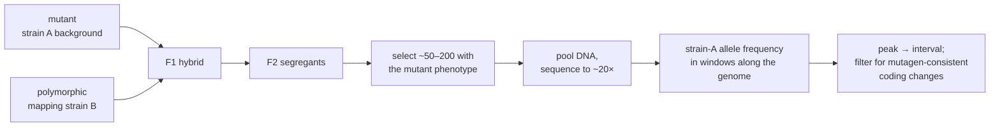
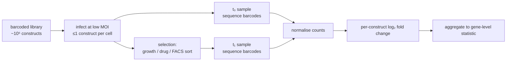

# 37 — Model organisms and genetic screens

> **Before this:** [Ch 09](../part-02-transmission-genetics/09-mitosis-and-meiosis.md) ·
> [Ch 11](../part-02-transmission-genetics/11-beyond-mendel.md) ·
> [Ch 14](../part-02-transmission-genetics/14-linkage-and-mapping.md) ·
> [Ch 16](../part-03-genome-instability/16-mutation.md) ·
> [Ch 25A](../part-04-gene-regulation/25A-developmental-genetics.md) — §9 assumes its
> gene-targeting and Cre-*lox* grammar, and §11 assumes its epistasis derivation ·
> [Ch 36](36-core-molecular-methods.md) · **Time:** ~40 min

Sequencing tells you what is in the genome. It does not tell you what any of it is *for*.
This chapter is about the experiments that build the sequence→function map, and about the
handful of organisms in which those experiments are cheap enough to do exhaustively.

## What you'll be able to do

- State crisply whether a given experiment is forward or reverse genetics, and what each
  direction makes hard
- Choose a model system for a question given generation time, genetic tractability, and
  whether the phenotype can actually be scored
- Design a forward screen end to end: mutagen, breeding scheme, readout — and estimate from
  the allele spectrum how close to saturation it is
- Classify recessive mutants into complementation groups and name the three ways that test
  lies, then map one of them by bulk-segregant analysis and say why selected meioses rather
  than sequencing depth set the interval
- Read a double-mutant phenotype and order two genes in a pathway, and say when that
  inference is invalid
- Explain a pooled barcoded screen as a differential-abundance estimation problem, including
  why cell coverage rather than sequencing depth sets the noise floor
- Explain why "the knockout has no phenotype" is almost always a claim about the assay

## The core idea

There are exactly two directions of inference between genotype and phenotype, and every
functional-genetics method is one of them.

**Forward genetics** starts from a phenotype and finds the gene. Break things at random,
watch for the specific breakage you care about, then locate the lesion. You are fuzzing: you
inject random mutations, you have an oracle that says "this one is interesting", and the hard
part afterwards is bisecting down to the responsible line. The enormous virtue is that you
need no prior hypothesis. The screen enumerates the components of a process you do not
understand, and it will hand you genes nobody would have nominated.

**Reverse genetics** starts from a gene and finds the phenotype. Delete or silence a chosen
sequence and look for a difference. This is a point lookup with an unspecified return value.
The lookup is now trivial — [Ch 38](38-genome-editing.md) made it a reagent-ordering problem
— and the difficulty has migrated entirely into the question *what do I measure?*

| | Forward | Reverse |
|---|---|---|
| Starts from | Phenotype | Gene |
| Perturbation | Random, unindexed | Targeted |
| Hard step | Finding which mutation is causal | Choosing and powering an assay |
| Prior hypothesis needed | None — this is the point | Yes; you already picked the gene |
| Fails silently when | The gene is redundant, essential, or pleiotropic | The assay does not touch the gene's function |
| Yields | Components of a process | Consequences of a component |

Both directions bottom out in the same place: **phenotyping**. A screen is only as good as
its oracle, and biology's oracles are weak, noisy, and low-dimensional.

---

## 1. Why any of this transfers: conservation, and where it stops

Studying yeast to learn about humans is only defensible because the core machinery is old and
shared. Genes controlling the cell cycle were found in yeast by screening for
temperature-sensitive division mutants; the human orthologues turned out to be so conserved
that a human cDNA library can rescue a yeast mutant. The same is true across replication,
translation, basic secretion, DNA repair, and the main signalling cassettes. Roughly the last
common ancestor's toolkit still runs, largely unmodified, in everything.

Conservation is deep where the machinery is ancient and shallow where evolution has been
busy. It is worst exactly where translational medicine wants it most:

| Conserved well | Conserved poorly |
|---|---|
| Replication, repair, transcription, translation | Immune system detail, especially innate receptors |
| Cell cycle, cytoskeleton, membrane traffic | Drug metabolism and xenobiotic response |
| Core signalling cassettes (RTK–Ras–MAPK, Wnt, Notch, Hedgehog) | Regulatory wiring — *when* and *where* genes fire |
| Metabolic backbone | Brain structure, lifespan, reproduction |
| Body-axis patterning genes | Rapidly evolving and lineage-expanded gene families ([Ch 35](../part-07-molecular-evolution/35-genome-evolution.md)) |

A useful discipline: a model organism is not a small human. It is an instrument with known
distortion. Ask what the instrument is measuring before trusting the reading.

## 2. The organisms, and what each one actually buys

Counts are approximate and shift with each annotation release; the human figure is pinned in
[verified-facts](../reference/verified-facts.md) (GENCODE 50: 19,442 protein-coding genes).

| System | Generation time | Genome | ~Protein-coding genes | Uniquely good for | Blind spot |
|---|---|---|---|---|---|
| ***E. coli*** | ~20 min | 4.6 Mb | ~4,400 | Enormous population sizes; selections rather than screens; biochemistry | No nucleus, no chromatin, no splicing, no multicellularity |
| ***S. cerevisiae*** | ~90 min | 12 Mb | ~6,000 | Efficient homologous recombination makes precise gene replacement routine; switchable haploid/diploid; complete deletion collection | No development, no cell types, no tissues |
| ***C. elegans*** | ~3 days | ~100 Mb | ~20,000 | Invariant cell lineage — all 959 somatic nuclei traced from the zygote; transparent; 302-neuron connectome; selfing hermaphrodites homozygose mutations for free; RNAi by feeding | Small, fast, weird: many pathways rewired; no adaptive immunity |
| ***D. melanogaster*** | ~10 days | ~180 Mb | ~14,000 | A century of alleles; balancer chromosomes; no meiotic recombination in males; polytene banding gave physical mapping decades early | Insect-specific development and immunity |
| **Zebrafish** | ~3 months | ~1.4 Gb | ~26,000 | Vertebrate organogenesis watched live in a transparent externally-fertilised embryo; hundreds of embryos per clutch | Teleost whole-genome duplication leaves duplicate paralogues that mask each other |
| **Mouse** | ~10 weeks | ~2.7 Gb | ~22,000 | Mammalian physiology, immunity, behaviour; germline-competent ES cells made targeted knockouts possible; inbred strains give genetic reproducibility | Slow, expensive; inbred strains are a single genetic background |
| ***A. thaliana*** | ~6–8 weeks | ~135 Mb | ~27,000 | Selfing, tiny, transformable by dipping flowers in *Agrobacterium*; indexed insertion collections | Plant-specific everything |
| **Human cell lines** | hours–days | 3.1 Gb | 19,442 | Human sequence, human proteins, scale for pooled screens | Usually aneuploid and rearranged; no tissue context |
| **Organoids / iPSC** | weeks | 3.1 Gb | 19,442 | Human genotype *with* tissue architecture and cell-type diversity | Variable, expensive, immature; no circulation or immune system |

The pattern: **you trade physiological relevance against throughput and genetic control**, and
each organism was adopted because it sat at a useful point on that curve. Nothing about the
worm is intrinsically interesting; what is interesting is that you can screen a hundred
thousand of them on nine agar plates and then trace the defect to a single named cell.

## 3. Forward screens I: mutagenesis

You need to break genes at a tunable rate and in a recoverable way.

| Mutagen | Lesion produced | Why you'd choose it | Cost |
|---|---|---|---|
| **EMS** | Alkylates guanine; almost all G:C→A:T transitions | Dense point mutations; produces an **allelic series** — nulls, partial-function hypomorphs, temperature-sensitives | The lesion carries no tag; you must map it |
| **ENU** | Point mutations, mostly at A:T pairs | Highest per-locus mutation rate available in mouse | Same mapping problem, at mouse cost |
| **X-rays / γ** | Double-strand breaks → deletions, translocations | Clean nulls; deletions define intervals for mapping ([Ch 18](../part-03-genome-instability/18-recombination-mechanisms.md)) | Multi-gene lesions; rearrangements complicate breeding |
| **Transposon / T-DNA insertion** | Insertion disrupting a gene | The mutation **carries its own sequence tag** — you recover the flanking DNA and you have the gene | Lower density; strong insertion-site bias; some genes never hit |
| **CRISPR libraries** | Targeted indels, genome-wide but indexed | Forward screening with reverse-genetic bookkeeping ([Ch 38](38-genome-editing.md)) | Only targets what you designed guides for |

The trade-off is legible: chemical mutagens give you high density and an allelic series but an
expensive search afterwards; insertional mutagens give you the answer for free but sample the
genome unevenly.

Dose is tuned, not maximised. The standard target is roughly one lethal-equivalent per
mutagenised genome. Higher, and every mutant carries a dozen unrelated lesions you will spend
months separating from the causal one; lower, and you screen more animals than you can afford.

## 4. Forward screens II: breeding schemes, and why recessives cost two extra generations

Most loss-of-function alleles are recessive, because most genes are haplosufficient — half
the normal dose of product is enough. So the mutagenised individual, heterozygous for
everything, shows nothing. **An F1 screen finds dominants only.** To see a recessive you must
make it homozygous, and that requires a breeding scheme.

```
MOUSE — three-generation ENU scheme for autosomal recessives

  P    ENU-treated male  ×  wild-type female
         |
  F1    +/m   (heterozygous, one per mutagenised gamete)   ← screen here = dominants only
         |  × wild-type female
  F2    1/2 of daughters are +/m                            ← carriers, invisible
         |  backcross F2 daughter × her F1 father
  F3    1/4 of progeny are m/m                              ← screen here = recessives
```

Three generations, ~30 weeks, and a colony that grows geometrically. This is the real reason
mouse forward screens are rare and mouse *reverse* genetics is dominant.

The other organisms each cheat differently.

***C. elegans*** self-fertilises. Every F1 hermaphrodite is a self-crossing heterozygote, so
its brood is automatically 1/4 homozygous — the F2 screen is free, with no cross to set up.
Picking F2s and scoring their F3 broods, the chance that a randomly chosen F2 is homozygous
is 1/4, so to be 95% sure of catching at least one you need *n* with (3/4)ⁿ ≤ 0.05, i.e.
*n* ≥ 11 clones per line.

***Drosophila*** uses **balancer chromosomes**, which are the cleverest piece of engineering
in classical genetics. A balancer is a chromosome carrying multiple nested inversions, a
dominant visible marker, and a recessive lethal. The inversions mean any crossover with the
homologue produces an inviable product, so recombinants are never recovered: the whole
chromosome behaves as a single non-recombining allele. The recessive lethal means the
balancer can never go homozygous. The marker means you can see who carries it. Put a
mutagenised chromosome opposite a balancer and you get a stock that maintains itself as a
permanent heterozygote forever, without selection and without the mutation being lost or
recombined away — a reference-counted immutable object, implemented in chromosomes in 1918.

## 5. Saturation: knowing when the screen is finished

If mutations hit genes independently at mean rate λ per gene, the fraction of targetable genes
hit at least once is 1 − e^(−λ). That is the textbook answer and it is optimistic, because
mutability varies enormously between genes — a 300 bp gene with one critical residue is a far
smaller target than a 5 kb gene.

The empirical test is better, and it is a species-richness problem — the same sampling logic as
[S3](../part-S-statistics/S3-sampling-and-estimation.md). Sort
the mutants into complementation groups (§8) and look at the **allele spectrum**: how many
groups are represented by one allele, two, three. A screen approaching saturation shows most
genes hit repeatedly and almost no new groups appearing among the last mutants collected. The
Chao-style estimator for unseen classes,

```
    unseen genes  ≈  f₁² / (2 f₂)
```

where f₁ is the number of single-allele groups and f₂ the number of two-allele groups, is
exactly the same estimator you would use for unseen species — or unseen bugs in a fuzzing
campaign. Many singletons and few doubletons means you are nowhere near done.

Saturation is a property of the screen, never of the genome. Four classes of gene are
invisible to any screen no matter how deeply you push it: genes with **redundant paralogues**
(the single mutant looks normal), genes required **earlier** than the process being scored
(the animal dies before you can look), genes whose loss is **pleiotropic** enough that the
mutant is filtered out for other reasons, and genes whose function the assay simply does not
interrogate. "We saturated the screen" always means "for this phenotype, in this background,
under these conditions".

## 6. Readouts, and the two screen designs that find pathways

The naive readout is a visible phenotype — the animal is the wrong shape, the colony is the
wrong colour, the embryo lacks a structure. Three refinements do most of the real work.

**Conditional alleles.** Essential genes cannot be recovered as nulls; the mutant is dead.
A **temperature-sensitive** allele — typically a missense change that folds at 23 °C and
misfolds at 37 °C — converts an essential gene into a switch. Shift the temperature, ask when
in the process the requirement lies. The entire logic of the cell cycle was extracted this
way, from yeast mutants that stop dividing at a specific, reproducible point when warmed.
Note what a ts allele gives you that a knockout never can: **acute** loss, with no time for
compensation, and temporal resolution within a single cell cycle.

**Suppressor screens.** Start with a mutant, mutagenise it again, and screen for restored
function. Suppressors are either intragenic (a second change in the same protein restoring
the fold or an interaction surface — evidence about structure) or extragenic (a mutation in a
different gene that bypasses or compensates for the defect — evidence about the pathway).

**Enhancer / modifier screens.** Start from a *weak* allele that sits near the phenotypic
threshold, then screen for second-site mutations that worsen it. This is the classic route to
pathway components, and the reason is statistical: a sensitised background moves the assay
onto the steep part of the dose–response curve, so a gene whose loss produces no detectable
phenotype alone produces a large one here. Modifier screens select for *functional connection*
rather than for *having a phenotype at all*, which is precisely the filter you want when the
question is "what else is in this pathway?".

## 7. From mutant to gene

Classically: recombination mapping against marked strains to get a chromosomal interval
([Ch 14](../part-02-transmission-genetics/14-linkage-and-mapping.md)), deletion mapping to
narrow it, then transformation rescue — reintroduce a wild-type candidate and ask whether the
phenotype disappears. Rescue is still the gold standard, because it is the only step that
demonstrates sufficiency rather than correlation.

Modern practice collapses mapping and lesion-finding into one sequencing experiment.
**Bulk-segregant analysis** is allele-frequency estimation on a selected pool:



The estimator: unlinked markers sit at strain-A frequency 0.5, because half the genome came
from each parent. At the causal locus every selected chromosome must carry the mutant allele,
so the frequency goes to 1.0. At recombination fraction *r* from the locus the expected
frequency is 1 − *r*. You are reading a genetic map directly off a coverage-normalised
allele-frequency track.

The critical design point, and the one that gets screens wrong: **resolution is set by the
number of selected meioses, not by sequencing depth.** Per-site depth need only be enough that
read-sampling noise, averaged across the many markers in a mapping window, falls below the
pool-composition noise — which is why 20× over a 100-chromosome pool is ample. Depth cannot buy
resolution the meioses do not contain: with *N* selected chromosomes the nearest recovered
recombination breakpoint sits about 1/*N* Morgans away, so ~±1 cM is the *floor* for a
100-chromosome pool whether you sequence at 20× or 200× — and a pooled allele-frequency readout
reaches that floor only if the pool is also large enough to estimate frequency that precisely
(worked example below).

## 8. Complementation: same gene or different?

You have 62 mutants. How many genes is that? Cross two recessive mutants and look at the
heterozygous progeny (see [Ch 11](../part-02-transmission-genetics/11-beyond-mendel.md)):

```
   m1/m1  ×  m2/m2   →   m1/m2

   progeny wild-type  → COMPLEMENTATION    → different genes
   progeny mutant     → NON-COMPLEMENTATION → same gene
```

The logic is that two broken copies of *different* genes each supply what the other lacks;
two broken copies of the *same* gene supply nothing. The equivalence classes are
**complementation groups**, and the count of groups is the count of genes.

Three ways it lies, all worth knowing: the test is only valid for recessive loss-of-function
alleles (a dominant-negative allele fails to complement everything); **intragenic
complementation** can occur between alleles hitting different domains of a multimeric
protein, producing spurious complementation within one gene; and **unlinked
non-complementation** between genes whose products are dosage-sensitive partners produces
spurious non-complementation between two genes. Confirm with sequence.

## 9. Reverse genetics

**Targeted replacement.** In yeast, homologous recombination is efficient enough that a PCR
product with 40 bp of homology on each end replaces an entire open reading frame with a
selectable marker. That single fact is why the systematic yeast deletion collection exists —
one strain per gene, each carrying a unique 20 bp molecular barcode at the deleted locus,
which turns out to matter enormously later (§10). In mammalian cells HR is rare, so the mouse
route required a positive/negative selection cassette to enrich for correct targeting, and a
cell type — embryonic stem cells — that could be manipulated in culture and still contribute
to the germline of a chimeric animal.

> **Both paragraphs here are summaries.** The mouse targeting route — vector design, the
> positive/negative selection logic that makes a rare event findable, ES cells, chimeras and
> germline transmission — and the conditional and inducible allele grammar built on Cre-*lox*
> are derived step by step in
> [Ch 25A §§6–7](../part-04-gene-regulation/25A-developmental-genetics.md). Read that first if
> the reasoning below is compressed to the point of assertion.

**Conditional alleles.** A straight knockout has two failure modes: the animal dies before the
tissue of interest exists, and the animal that survives has had its whole development to
compensate. Site-specific recombination fixes both. Flank an essential exon with *loxP* sites,
supply Cre recombinase from a tissue-specific promoter, and the gene is deleted only where Cre
is expressed. Fuse Cre to a modified oestrogen receptor and it stays out of the nucleus until
tamoxifen is given, so you also choose *when*. The general principle — separate the allele
from the trigger, then control the trigger in space and time — recurs everywhere in modern
genetics.

**Knockdown.** RNAi ([Ch 24](../part-04-gene-regulation/24-rna-based-regulation.md)) degrades
or blocks the transcript. It is fast, dose-tunable, and works in organisms where targeting is
hard — in *C. elegans* you can deliver it by feeding bacteria expressing double-stranded RNA.
Its weakness is that specificity is set by a short seed match, so every reagent silences a
partly-unknown set of other transcripts. Treat an RNAi screen as a multiple-hypothesis problem
with strongly *correlated* errors: the standard controls are multiple independent reagents per
gene and rescue with an RNAi-resistant transgene.

**Morpholinos** are antisense oligomers that block translation initiation or splicing, and
they were the zebrafish workhorse for a decade. Then systematic comparison of morphant
phenotypes against mutants in the same genes found that a large fraction did not reproduce.
Two distinct explanations turned out to be true simultaneously, and disentangling them is a
genuinely instructive episode: some morphant phenotypes were **off-target artefacts**, and
some mutants had **genetically compensated** — degradation of the mutant transcript triggers
transcriptional upregulation of related genes, so the mutant is *less* affected than an acute
knockdown. Both effects are real. The lesson generalises far beyond fish: **knockdown and
knockout are not the same experiment**, because a stable mutant has been selected for
tolerance and an acute perturbation has not. Disagreement between them is information, not
noise.

## 10. Pooled screens: differential abundance with a sequencing readout

This is where a modern screen becomes a counting problem, and where your statistics
background pays for itself.

Build a library of perturbations — one construct per gene, or several — each carrying a unique
barcode. Infect cells at low multiplicity so that most cells receive at most one construct;
the integrated barcode is now a heritable label on that cell's lineage. Apply a selection.
Sequence the barcode amplicon before and after. The phenotype of every gene is a change in
the abundance of its barcode.



Four things determine whether the result is real.

**Counts are compositional.** A construct's read fraction depends on every other construct in
the pool, so a genuinely strong dropout inflates the apparent enrichment of everything else.
The fix is the same family of normalisations used for RNA-seq
([Ch 47](../part-10-functional-genomics/47-rna-seq.md)) — size-factor or median-ratio scaling
rather than raw proportions.

**The error model lives at the construct level.** Reagent efficiency varies wildly: of eight
guides against one gene, two may be inert. Gene-level statistics therefore aggregate across
constructs robustly — rank-based or trimmed rather than a plain mean — and the spread across
constructs targeting the same gene is your best internal estimate of noise.

**The null must be matched, not assumed.** Non-targeting controls establish the sampling
baseline. But in CRISPR screens, cutting itself is toxic in proportion to copy number, so a
gene in an amplified region drops out for reasons that have nothing to do with its function.
The appropriate control cuts the genome a matched number of times at inert loci.

**Cell coverage, not read depth, sets the noise floor.** Every passage is a multinomial
resampling of the pool. If you carry only 50 cells per construct through a bottleneck, the
count for a neutral construct wanders by tens of percent on drift alone, and the effect you
are chasing is buried. Several hundred cells per construct at every step is the practical
requirement, and the most common cause of an irreproducible screen is a purely
sampling-statistical failure at a step nobody recorded.

## 11. Genetic interactions: epistasis and synthetic lethality

Single mutants tell you which genes matter. **Double** mutants tell you how genes relate.

Define the expectation under independence multiplicatively: if single mutants have relative
fitness *W*ₐ and *W*_b, the neutral expectation for the double is *W*ₐ*W*_b, and the
interaction is

```
    ε  =  W_ab  −  W_a · W_b

    ε < 0   aggravating   (synthetic sick / synthetic lethal)  — parallel, buffering pathways
    ε > 0   alleviating   (buffering / masking)                — often the same complex or pathway
    ε ≈ 0   independent
```

Measured genome-wide in yeast across millions of double mutants, the matrix of ε values
becomes a similarity graph over genes: cluster the rows and functional modules — complexes,
pathways, organelles — fall out without anyone having annotated anything. Genes in the same
complex share interaction *profiles* even when they interact weakly with each other.

**Synthetic lethality is the therapeutically interesting corner.** If losing gene A is
survivable and losing gene B is survivable but losing both is not, then a tumour that has
already lost A is selectively killable by a drug against B, while normal cells retaining A are
not. Tumours defective in homologous-recombination repair — *BRCA1*- or *BRCA2*-mutant, for
instance — are hypersensitive to inhibition of PARP, a protein central to handling
single-strand DNA damage; inhibitors trap it on DNA and generate lesions that only homologous
recombination can resolve. The general principle is the modifier screen relocated into
oncology: the tumour's driver mutation *is* a permanent sensitised background, and a
genome-wide screen in that background enumerates candidate drug targets
([Ch 56](../part-11-human-and-statistical-genomics/56-cancer-genomics.md)).

## 12. Phenotyping, background, and the meaning of "no phenotype"

Roughly a third of mouse gene knockouts are embryonic-lethal or subviable. Of the rest, a
large fraction are reported as having no detectable phenotype — and that statement is almost
never about the gene.

The genome offers ~20,000 columns. A well-funded phenotyping pipeline measures a few hundred
parameters, under one diet, in one facility, in one genetic background, at one age. Absence of
evidence is cheap to generate.

The specific reasons a real function goes undetected:

- **Redundancy.** A paralogue covers the loss. Loss becomes visible only in the double mutant
  — which is a synthetic interaction, i.e. §11 again.
- **Conditionality.** In yeast, about 1,000 of ~6,000 genes are essential in rich glucose
  medium. Change the carbon source and the set changes substantially. Laboratory conditions
  are a narrow slice of the environments a gene was selected in.
- **Compensation.** Stable mutants transcriptionally adapt; acute perturbations do not (§9).
- **Genetic background.** The same targeted null gives different phenotypes on different
  inbred backgrounds, because modifier alleles differ. This is why the only valid control is
  a littermate of the same background — comparing a knockout line against a separate
  wild-type stock confounds the gene with every other difference between the two lines.
- **Pseudoreplication.** *n* is the number of independent animals, litters, or infections —
  not the number of cells, wells, or images. Cage, litter and batch are random effects with
  real variance components, and treating them as nuisance produces confidently wrong intervals.

The defensible statement is never "gene X has no function". It is: *"no phenotype was detected
in assays A, B and C, in background D, at 80% power to detect an effect of size E."* That
sentence is longer and it is the only one that survives contact with a replication attempt.

---

## Common misconceptions

| What people think | What's actually true |
|---|---|
| A knockout with no phenotype means the gene does nothing | It means the assays used did not detect a difference. Redundancy, condition-specificity, compensation and low power all produce this result in genes with essential functions |
| Model organisms are chosen because they resemble humans | They are chosen for throughput, genetic tractability and scorable phenotypes. Relevance is traded away deliberately and must be re-argued for each question |
| Knockdown and knockout answer the same question | They differ systematically: stable mutants can compensate, acute knockdowns cannot. Disagreement between them is a real biological signal, not a technical failure |
| A saturated screen has found all the genes for a process | It has found all the genes findable *by that assay, in that background*. Redundant, essential and pleiotropic genes are structurally invisible |
| Epistasis means physical interaction | Classical epistasis orders genes in an information-flow sense. Two genes can be epistatic without their products ever touching, and interact physically with no epistasis |
| Complementation testing is a reliable way to count genes | It is reliable only for recessive loss-of-function alleles. Dominant-negatives, intragenic complementation, and unlinked non-commplementation all break it |
| Bigger screens need deeper sequencing | Resolution in bulk-segregant mapping is set by selected meioses, and noise in pooled screens by cells per construct. Sequencing depth is rarely the binding constraint |
| CRISPR made forward genetics obsolete | It made *targeted* perturbation cheap. Unbiased discovery still requires an assay that scores a phenotype, and that has not become easier |

## Worked example: one screen, from mutagen to pathway order

A *C. elegans* screen for animals that fail to respond to a chemical cue. Every number below
is either standard or derived from the ones before it.

**1. Mutagenesis and breeding.** Soak L4 hermaphrodites in EMS. F1 animals are heterozygous
for everything; self-progeny (F2) are 1/4 homozygous at any mutagenised locus. Clone F2s to
individual plates and score F3 broods. To be 95% certain of recovering a homozygote from a
given heterozygous line, clone *n* F2s with (3/4)ⁿ ≤ 0.05 → *n* ≥ ln(0.05)/ln(0.75) = 10.4,
so **11 clones per line**.

**2. The haul, and saturation.** The screen yields **62 mutants**. Pairwise complementation
tests sort them into **27 groups**, with the allele spectrum:

```
   alleles per group :  1    2    3    ≥4
   number of groups  :  9    7    5     6      →  9(1) + 7(2) + 5(3) + 6(≥4) = 62 alleles
                        ^    ^
                        f₁   f₂
```

Unseen genes ≈ f₁²/(2f₂) = 81/14 ≈ **6**. Estimated total ≈ 33 genes; 27 recovered, so the
screen is roughly **82% saturated**. Nine singletons is the signal that it is not finished —
another 20,000 haploid genomes is justified.

**3. Mapping one mutant.** Take *m14*, a singleton. Cross the mutant (Bristol background) to
the polymorphic Hawaiian strain, self the F1, select **50 F2 animals** with the mutant
phenotype (= 100 selected chromosomes), pool their DNA and sequence to 20×. Compute Bristol
allele frequency in 1 Mb windows:

```
   region              expected Bristol frequency
   unlinked            0.50        (half the genome from each parent)
   10 cM from locus    1 − 0.10 = 0.90
    1 cM from locus    1 − 0.01 = 0.99
   at the locus        1.00        (selection guarantees it)
```

Binomial noise on 100 chromosomes is √(0.25/100) = 0.05, so the 0.90 window sits 8 SE above
background — unmistakable. But separating 0.99 from 0.95 needs SE ≈ 0.01, requiring ~290
chromosomes. **The peak is obvious with 50 animals; the fine interval needs ~150.** Two limits
are in play and they do not coincide: 1/*N* Morgans (~1 cM at *N* = 100) is the
breakpoint-limited floor, but a pooled-frequency readout reaches it only with the ~290
chromosomes just computed, so with 100 chromosomes expect a peak spanning several cM. Even at
the floor, ±1 cM ≈ ±300 kb in this genome — a 600 kb window holding roughly 120 genes
(*C. elegans* averages ~1 gene per 5 kb), and more still if the interval falls in a
gene-dense, low-recombination chromosome centre, where 1 cM buys well over a megabase.
Filter that interval for EMS-consistent (G:C→A:T) changes altering coding sequence: typically
one to three candidates. Confirm by transformation rescue.

**4. Ordering two genes.** The screen also produced a rare *gain-of-function* allele, *b(gf)*,
whose carriers respond constitutively — with no cue present. Gene *a* has a null, *a(lf)*,
whose carriers never respond. Build the double mutant and read the answer:

```
   PATHWAY MODEL (positive-acting chain):     cue → A → B → response

   a(lf)          : no response          (chain broken at A)
   b(gf)          : constitutive         (B fires without input)

   double a(lf); b(gf)
     ├─ observed CONSTITUTIVE  → B does not need A → B is DOWNSTREAM of A
     └─ observed NO RESPONSE   → B's output still requires A → B is UPSTREAM of A
```

Observed: constitutive. Therefore **B acts downstream of A**. Three conditions had to hold for
this to mean anything: the alleles must be a true null and a true constitutive (a hypomorph
gives an intermediate that orders nothing), the two mutants must have *opposite,
distinguishable* phenotypes, and the pathway must be a linear chain of positive regulators. If
either gene were a negative regulator the slogan "the epistatic mutant is downstream" inverts,
and you must reason from the wiring rather than recite the rule.

## Connections

- **Back to:** [Ch 09](../part-02-transmission-genetics/09-mitosis-and-meiosis.md) — every
  breeding scheme is meiosis used as an instrument ·
  [Ch 11](../part-02-transmission-genetics/11-beyond-mendel.md) — dominance, and the
  complementation test ·
  [Ch 12](../part-02-transmission-genetics/12-probability-and-testing.md) — segregation ratios
  and power · [Ch 14](../part-02-transmission-genetics/14-linkage-and-mapping.md) —
  recombination fractions, which BSA measures by sequencing ·
  [Ch 16](../part-03-genome-instability/16-mutation.md) — mutagen lesion spectra ·
  [Ch 24](../part-04-gene-regulation/24-rna-based-regulation.md) — how RNAi works ·
  [Ch 35](../part-07-molecular-evolution/35-genome-evolution.md) — paralogy, hence redundancy ·
  [Ch 25A](../part-04-gene-regulation/25A-developmental-genetics.md) — the *Drosophila*
  segmentation screen this chapter generalises, gene targeting and Cre-*lox* in full (§9 here
  is the summary), and epistatic ordering from double mutants, which §11 turns quantitative ·
  [Ch 20A §8](../part-03-genome-instability/20A-bacterial-and-phage-genetics.md) — the
  complementation test of §8 pushed until it separates into two distinct tests, one on function
  and one on position, and the gene stops being a point and becomes an interval ·
  [Ch 36](36-core-molecular-methods.md) — selection markers, transformation, PCR
- **Forward to:** [Ch 38](38-genome-editing.md) — targeted perturbation made cheap, and
  CRISPR screening · [Ch 32](../part-06-quantitative-genetics/32-mapping-quantitative-traits.md)
  — bulk-segregant analysis is QTL mapping with selection replacing regression ·
  [Ch 46](../part-10-functional-genomics/46-variant-calling.md) — calling variants in a pooled
  sample is exactly the BSA readout ·
  [Ch 47](../part-10-functional-genomics/47-rna-seq.md) — the compositional counting problem
  shared with pooled screens ·
  [Ch 52](../part-11-human-and-statistical-genomics/52-association-to-mechanism.md) — screens
  are how a GWAS locus becomes a mechanism ·
  [Ch 56](../part-11-human-and-statistical-genomics/56-cancer-genomics.md) — synthetic
  lethality as therapy

## Check yourself

**1. Why does an F1 screen find only dominant mutations, and what problem does a balancer chromosome solve that a plain marked chromosome does not?**

<details><summary>Answer</summary>

The mutagenised gamete contributes one mutant allele; the F1 is heterozygous. Most
loss-of-function alleles are recessive because one working copy usually suffices, so the F1
looks normal and only dominants are visible. Seeing recessives requires homozygosing them,
which costs one to two extra generations.

A balancer does three things a marked chromosome cannot. Its nested inversions suppress the
recovery of crossover products, so the mutagenised chromosome cannot be broken up by
recombination while the stock is maintained. Its recessive lethal prevents the balancer from
going homozygous, so the stock cannot lose the mutant chromosome by drift. Its dominant marker
makes carriers identifiable by eye. Together they make a heterozygous stock self-maintaining
and the mutant chromosome effectively immutable.

</details>

**2. A screen recovers 62 mutants falling into 27 complementation groups: 9 groups have one allele, 7 have two, 5 have three, 6 have four or more. Is the screen finished?**

<details><summary>Answer</summary>

No. The Chao-style estimate of unseen classes is f₁²/(2f₂) = 9²/(2×7) = 81/14 ≈ 6 genes not
yet hit, giving an estimated total of ~33 and a completeness of 27/33 ≈ 82%. The diagnostic
is the nine singletons: at true saturation almost every gene is represented by several
independent alleles and newly isolated mutants fall into existing groups rather than founding
new ones.

Two caveats. The estimator assumes independent hits at gene-specific rates, and it estimates
the number of genes *detectable by this screen* — redundant, essential and pleiotropic genes
are outside the sampled universe entirely and no amount of further screening will reveal them.

</details>

**3. A CRISPR dropout screen replicates poorly: the same essential genes score in two replicates but the correlation of log fold changes is 0.4. The sequencing was deep (500 reads per construct). What is the most likely cause?**

<details><summary>Answer</summary>

Cell coverage at a bottleneck, not sequencing depth. Read depth only controls counting noise
once the pool has been sampled; the dominant variance comes from the multinomial resampling
of cells at every passage, selection and library prep. If only a few dozen cells per construct
survive a bottleneck, a neutral construct's abundance drifts substantially by chance alone,
and that drift is independent between replicates — which is exactly the signature described:
strong constructs (true essentials) still score, weak effects do not reproduce.

The fix is more cells, not more reads: maintain several hundred cells per construct at every
step, and record the cell number at each transfer so the achieved coverage is auditable. A
secondary contributor worth checking is copy-number-driven cutting toxicity, which inflates
apparent dropout in amplified regions and needs a cut-number-matched control rather than
non-targeting guides.

</details>

**4. A morpholino against gene X produces a striking heart defect in zebrafish. The CRISPR null mutant has a normal heart. Give two mutually compatible explanations and the experiments that distinguish them.**

<details><summary>Answer</summary>

Explanation one: the morpholino phenotype is an off-target artefact. Test by using a second,
non-overlapping morpholino against the same transcript, by rescuing with morpholino-resistant
mRNA, and by checking for the generic stress response that many oligos induce.

Explanation two: the mutant has genetically compensated. Degradation of the mutant transcript
can trigger transcriptional upregulation of related genes, buffering the loss — so the stable
mutant is genuinely less affected than an acute knockdown. Test by measuring expression of
paralogues in mutant versus wild type, by making an allele that removes the locus without
producing a decay-triggering transcript, and by acutely depleting the protein in an otherwise
wild-type animal.

Both are frequently true, and the underlying point is that knockdown and knockout are
different experiments: a viable stable mutant has been selected for tolerance to the loss.

</details>

**5. A paper reports "Gene Y is dispensable — knockout mice are indistinguishable from wild type." What are you entitled to conclude, and what should the sentence have said?**

<details><summary>Answer</summary>

You are entitled to conclude that the assays performed, in the background used, under the
housing and diet conditions used, at the ages examined, and at whatever power the sample size
supplied, did not detect a difference. Nothing about dispensability follows.

Standard reasons for a false negative: a paralogue covers the function; the requirement is
conditional on a stress, diet or infection not applied; the mutant compensated
transcriptionally during development; the background carries modifier alleles that mask the
effect; controls were a separate wild-type line rather than littermates, so genuine
differences were absorbed into background variation; or *n* was counted in cells or wells
rather than independent animals, inflating apparent precision and misestimating variance.

The defensible sentence: "No differences were detected between knockout and littermate
controls on background D across assays A–C (n = k animals per genotype, 80% power to detect a
difference of E)." Anything shorter is claiming more than the experiment supports.

</details>
