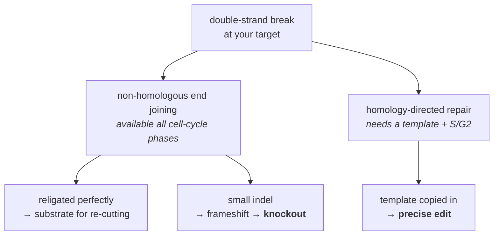
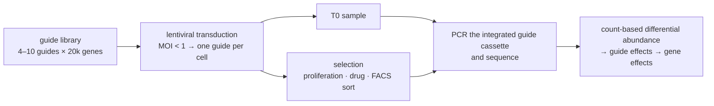

# 38 — Genome editing

> **Before this:** [Ch 17](../part-03-genome-instability/17-dna-repair.md) · [Ch 25A §§6–8](../part-04-gene-regulation/25A-developmental-genetics.md) — gene targeting, which is the thing this chapter replaced; §2's argument is hard to feel without it · [Ch 36](36-core-molecular-methods.md) · [Ch 37](37-model-organisms-and-screens.md) · **Time:** ~45 min

## What you'll be able to do

- Decompose any editing technology into *addressing* and *repair exploitation*, and say which part each innovation improved
- Explain why knocking a gene out is easy and rewriting three bases is hard, in terms of pathway competition
- Trace Cas9 target recognition from PAM binding to blunt cut, and say why the PAM exists
- Compute the expected number of near-match off-target sites in a genome, explain why the empirical assays disagree and none is a gold standard, and name the damage class amplicon sequencing across the cut site structurally cannot see
- Distinguish nuclease editing, base editing and prime editing by what each can and cannot install
- Design a pooled CRISPR screen and name the statistical model and the two artefacts that will bite you
- State the current clinical and governance position on somatic, germline and gene-drive editing without overclaiming

## The core idea

Every genome editor is two things bolted together:

1. **A programmable DNA-binding module** that finds one address in 3.1 Gb.
2. **A payload** that does something there — usually break the DNA, sometimes chemically modify a base, sometimes write new sequence.

And then there is a third component you do not control: **the cell's own repair machinery, which decides what the final sequence actually is.** You aim; the cell edits. Nearly every hard problem in this field is a consequence of that split.

The thirty-year history collapses into two sentences. First, targeting moved from **protein engineering** to **base pairing** — from recompiling a binding module for every new target to passing a 20-nucleotide parameter. Second, the field has been steadily **taking the decision away from the repair machinery**, from "cut and hope" through base editing to prime editing, where the new sequence is written by a polymerase you brought with you.

---

## 1. The repair pathways are the editing machinery

A double-strand break is repaired by one of two competing routes ([Ch 17](../part-03-genome-instability/17-dna-repair.md)):



Perfect religation regenerates the target, so Cas9 cuts again; the reaction runs until an indel destroys the site. **Indels are an absorbing state.** That is why knockout efficiencies are high without you doing anything clever.

Homology-directed repair needs a donor template with homology arms, a sister chromatid available as the normal substrate, and the S/G2 phases of the cell cycle. Typical HDR efficiency in dividing cells is single-digit to low-double-digit percent; in post-mitotic or quiescent cells — neurons, cardiomyocytes, the largely non-dividing hepatocytes of an adult liver, the tissues you most want to fix — it collapses. Neurons and cardiomyocytes are terminally post-mitotic and HDR there is effectively zero; adult hepatocytes are merely G0-quiescent — they retain full proliferative capacity, which is why the liver regenerates after partial hepatectomy — so HDR is very inefficient rather than absent, and works appreciably only in neonatal or regenerating liver.

> **This is the central practical constraint of the field.** Breaking a gene is easy everywhere. Correcting a point mutation is hard in dividing cells and impossible in most of the cells that matter. Base editing and prime editing exist because of this one fact.

Repair outcomes are not noise. The indel spectrum at a given cut site is reproducible across replicates and largely predictable from the ±20 bp of local sequence, because microhomology-mediated end joining favours particular deletions. Outcome prediction is a supervised learning problem over sequence context, and the models work well enough that guide choice is partly a choice of outcome distribution.

## 2. From recompiling to passing a parameter

> **The row above this table is gene targeting**, and it is worth having in view because it is
> the baseline every entry below is an improvement on: no nuclease at all, homologous
> recombination at its natural frequency, and the whole difficulty pushed into *selecting* the
> rare correct event — positive/negative selection, ES cells, chimeras, germline transmission,
> and roughly a year to a founder animal.
> [Ch 25A §§6–8](../part-04-gene-regulation/25A-developmental-genetics.md) builds it, and
> §8 there marks the boundary precisely: editing replaced the *addressing* step and left the
> repair biology, the allele design and the breeding untouched.

| Platform | How targeting is specified | Recognition | Cost per new target |
|---|---|---|---|
| **Meganucleases** | Redesign the enzyme's own DNA-contacting residues | ~18–24 bp | Months of protein engineering; few targets reachable |
| **Zinc-finger nucleases** | Assemble fingers, ~3 bp each, fused to the FokI nuclease domain, which must dimerise — so targets come in pairs | ~18 bp per pair | Weeks; context-dependent finger interactions make it unreliable |
| **TALENs** | One TALE repeat per base, base identity set by two residues (the RVD) — a genuine one-to-one code | ~30–40 bp per pair | Days, but each construct is a long, highly repetitive gene to synthesise and clone |
| **CRISPR–Cas9** | 20-nt guide RNA, Watson–Crick pairing to the target | 20 bp + PAM | Hours; an oligonucleotide order |

TALENs already had a *code* — the field knew how to specify any sequence. The revolution was not specificity, it was **binding energy supplied by base pairing instead of by a folded protein surface**. A protein interface has to be designed, expressed and validated. A guide RNA is a string literal.

The asymptotics matter more than the constant factor. Editing *N* targets costs *N* protein-engineering campaigns with ZFNs or TALENs, and one plasmid plus *N* oligos with CRISPR. Pooled screens (§9) are simply not constructible on the older platforms.

## 3. Cas9 mechanism

CRISPR is a bacterial adaptive immune system: fragments of past invaders are stored as spacers in a genomic array, transcribed, and used to guide a nuclease against matching sequence. Two RNAs are involved naturally — a **crRNA** carrying the spacer and a **tracrRNA** that scaffolds the protein — and the engineering step was fusing them into one **single-guide RNA (sgRNA)**.

**The PAM is the self/non-self test.** *Streptococcus pyogenes* Cas9 (SpCas9) will not cut unless the target is immediately followed by `NGG`. The bacterium's own CRISPR array contains the spacer sequence but *not* the adjacent PAM, so Cas9 cannot cut the array that encodes it. Without the PAM, a CRISPR system is an autoimmune disease. For us, the PAM is a constraint on the addressable space: `NGG` occurs about once every 8 bp on average across both strands, so most positions are reachable but not all.

Recognition is ordered and directional. Cas9 collides with DNA constantly and interrogates only PAMs; on finding one it locally melts the duplex and tries to zipper the guide onto the target strand starting from the PAM-proximal end. Mismatches near the PAM (the **seed**, roughly the PAM-proximal 8–12 nt) abort the process; mismatches at the far end often do not. A complete **R-loop** — guide RNA paired to the target strand, displaced non-target strand looped out — licenses the two nuclease domains, HNH and RuvC, to cut one strand each, producing a **blunt cut 3 bp upstream of the PAM**.

```
                               protospacer (20 nt)            PAM
                     |-------------------------------------| |---|
   5'- C C T G G T A G A C T T C A G C A G T A C C G G A C A T G G C C T A A G -3'
   3'- G G A C C A T C T G A A G T C G T C A T G G C C T G T A C C G G A T T C -5'
                                                      ^
                                                  blunt cut
                                       (between protospacer 17 and 18)

   sgRNA spacer:  5'- G A C U U C A G C A G U A C C G G A C A -3'
```

One kinetic detail with practical consequences: Cas9 is effectively single-turnover and remains clamped to the cut product for a long time. Cutting is fast; release is slow; total off-target damage therefore scales with **how long the enzyme is present**, not with how fast it works. That argument reappears in §10.

## 4. Guides, off-targets, and assays that disagree

**On-target efficiency** varies over an order of magnitude between guides at the same locus, driven by guide sequence composition, secondary structure, nucleosome occupancy and chromatin accessibility ([Ch 23](../part-04-gene-regulation/23-chromatin-and-epigenetics.md)). Scoring models are trained on measured cleavage across thousands of guides — and carry the usual transfer problem, since the training data come from particular cell types and delivery formats.

**Off-target activity** is where naive intuition fails. Hamming distance to the genome is the wrong model: a 3-mismatch site in the seed is usually dead, a 3-mismatch site at the PAM-distal end can be cut efficiently, and RNA or DNA bulges create sites that a fixed-length string search never enumerates. Exhaustive in-silico enumeration has excellent recall and terrible precision.

Empirical assays split by *where the cut is measured*:

| Assay idea | Implementation | Sees | Misses |
|---|---|---|---|
| Capture breaks in living cells with a tag | **GUIDE-seq** — a blunt double-stranded oligo is integrated at breaks by NHEJ, then its junctions are sequenced | Real cellular chromatin context | Sites in cells that take up the tag poorly; low-frequency events |
| Census of cuttable sites in vitro | **CIRCLE-seq**, **CHANGE-seq** — circularised genomic DNA is cut by the ribonucleoprotein and linearised fragments sequenced | Very high sensitivity, no cell needed | No chromatin — nominates sites never cut in vivo |
| Pull down a repair protein at breaks | **DISCOVER-seq** — ChIP for MRE11, which loads at breaks | Works in tissues and animals | Requires the repair protein to accumulate detectably |

**These methods do not agree.** Nominated-site lists overlap only partially, and the union is usually much larger than the intersection. There is no gold standard, so the defensible posture is: run orthogonal assays, take the union as candidates, then deep-sequence those candidates in the actual therapeutic cell type, and report the detection floor (typically ~0.1% allele frequency) rather than claiming zero.

A second class of risk is invisible to standard assays. A single cut can produce kilobase-scale deletions, loss of heterozygosity, or chromothripsis; two simultaneous cuts can produce translocations ([Ch 20](../part-03-genome-instability/20-chromosome-abnormalities.md)). Amplicon sequencing across the cut site cannot see these, because the events destroy the primer binding sites — the assay conditions on the damage not having happened. That is an ascertainment bias, not a measurement error, and it is why long-read or karyotype-level assessment belongs in any therapeutic package.

## 5. The variant zoo, organised by what problem it solves

| Variant | Idea it implements |
|---|---|
| **High-fidelity SpCas9** (engineered contact mutants) | Remove excess non-specific binding energy so that a mismatched R-loop no longer clears the activation threshold. Specificity by making the enzyme *worse* at binding |
| **Compact orthologues** (e.g. SaCas9) | Fit inside a viral vector's cargo limit (§10) |
| **Relaxed-PAM variants** | Widen the addressable space when the edit must land at a specific base, e.g. for base editing |
| **Cas12a (Cpf1)** | T-rich PAM (`TTTV`) opens AT-rich sequence; cuts ~18–23 bp *distal* to the PAM leaving **staggered** ends, which favours directional insertion; needs only a crRNA, and processes its own crRNA array — so one transcript can deliver many guides, making multiplexing cheap |
| **Cas13** | Targets **RNA**, not DNA. Knockdown without touching the genome, and the basis of amplification-free nucleic-acid diagnostics via its collateral cleavage of reporter RNAs |

## 6. dCas9: targeting as an API

Inactivate both nuclease domains (D10A + H840A) and Cas9 becomes **dCas9** — a programmable DNA-binding protein with a payload slot. This decouples *which locus* from *what to do there*.

| Fusion | Effect | Why it is used |
|---|---|---|
| Transcriptional repressor domain (**CRISPRi**) | Blocks initiation/elongation | Knockdown without a cut; dose-tunable; works on non-coding elements where frameshifts are meaningless |
| Activator domains (**CRISPRa**) | Recruits the transcription machinery | Gain of function — tests *sufficiency*, not necessity |
| Histone acetyltransferase / DNA methyltransferase / demethylase | Writes or erases a chromatin mark | Tests whether a mark is causal, and whether it self-sustains once the editor leaves ([Ch 23](../part-04-gene-regulation/23-chromatin-and-epigenetics.md)) |
| Fluorescent protein | Labels a locus | Live imaging of chromosome dynamics ([Ch 50](../part-10-functional-genomics/50-3d-genome.md)) |

## 7. Base editing: chemistry instead of breakage

A base editor is a **deaminase fused to a Cas9 nickase**. The R-loop exposes a short single-stranded stretch of the non-target strand; the deaminase chemically converts a base within a window of roughly 4–8 nt (counted from the PAM-distal end of the protospacer). No double-strand break, no donor template, no dependence on HDR — so it works in non-dividing cells.

| | Cytosine base editor (CBE) | Adenine base editor (ABE) |
|---|---|---|
| Enzyme | Cytidine deaminase + uracil glycosylase inhibitor | A tRNA adenosine deaminase **evolved in the laboratory** to accept DNA — no natural DNA adenine deaminase exists |
| Chemistry | C → U, read as T | A → inosine, read as G |
| Net change | **C•G → T•A** | **A•T → G•C** |

The nickase nicks the *unedited* strand, which biases repair to use the edited strand as template — the same "nick the strand you want overwritten" trick prime editing reuses.

**The limitation is structural: the conventional deaminase editors above install transitions only.** Purine↔purine and pyrimidine↔pyrimidine. Transversions need prime editing, a nuclease, or the newer **glycosylase-coupled editors** — CGBEs (a CBE with the uracil glycosylase *added* rather than inhibited, so the U is excised to an abasic site and base excision repair installs C•G→G•C) and the A-to-Y family such as AYBE (an ABE fused to a methylpurine glycosylase). These fit the same "deaminase on a nickase" definition and are still cut-free, but they are lower-efficiency and narrower-window than CBEs and ABEs, so the practical statement is *transitions are routine, transversions are not*. This matters less than it sounds, because spontaneous deamination of methylated cytosine makes G•C → A•T by far the most common class of pathogenic point mutation ([Ch 16](../part-03-genome-instability/16-mutation.md)) — so ABEs address a large share of correctable variants. Other real limitations: **bystander editing** of every susceptible base in the window; sequence-context preference; and guide-*independent* deamination of any transiently single-stranded DNA or RNA the editor encounters, which is invisible to guide-based off-target assays entirely.

## 8. Prime editing: bring your own polymerase

Prime editing fuses a Cas9 nickase to an engineered **reverse transcriptase** and replaces the sgRNA with a **pegRNA** carrying two extra 3′ elements: a **primer binding site** and a **reverse-transcriptase template** containing the desired edit.

```
1. nick the PAM-containing strand
2. the freed 3' end anneals to the PBS on the pegRNA
3. RT extends that end, copying the RTT  →  a 3' flap carrying the edit
4. edited 3' flap competes with the original 5' flap; 5' flap excised, ends ligated
5. heteroduplex →  mismatch repair decides which strand wins
```

Step 5 is the efficiency bottleneck, and it is attacked directly: nicking the non-edited strand biases mismatch repair toward the edit (the **PE3** design), and transiently suppressing mismatch repair with a dominant-negative *MLH1* raises efficiency further (**PE4/PE5**).

| | Nuclease + HDR | Base editing | Prime editing |
|---|---|---|---|
| Double-strand break | yes | no | no |
| Donor template needed | yes | no | no (template is in the guide) |
| Substitutions possible | all 12 | 4 routinely (transitions); transversions only via glycosylase editors | all 12 |
| Insertions / deletions | yes, template-driven | no | yes, up to ~tens of bp |
| Works in non-dividing cells | poorly | yes | yes |
| Main cost | HDR efficiency | window/bystander constraints | large construct, lower efficiency, more design parameters |

Prime editing's design space (PBS length, RT template length, nick placement) is empirical and larger than a base editor's, and its cargo is bulky enough to make delivery harder. In exchange it installs any substitution — transversions included — or a small insertion without a cut, at a generality the glycosylase editors do not reach.

## 9. Pooled screens: genetics as a counting experiment

This is where a programmable, cheap-to-multiplex nuclease changes what is askable ([Ch 37](37-model-organisms-and-screens.md)).



The readout is a **count matrix**, and the statistics are the ones you already know from RNA-seq ([Ch 47](../part-10-functional-genomics/47-rna-seq.md)): negative-binomial models with shared dispersion estimation, then aggregation of the several guides targeting a gene into a gene-level statistic (rank aggregation or a mixed model), with the guide-level replication doing the work that biological replicates do elsewhere. Power scales with **cells per guide** — coverage of 100–1000× is the analogue of read depth.

Two artefacts to know:

- **Copy-number confounding.** Cutting is toxic in proportion to the number of cuts, so an amplified region drops out regardless of gene function. In cancer cell lines this manufactures fake essential genes. Correct with copy-number-aware normalisation, or avoid it by using CRISPRi, which never cuts.
- **In-frame escape.** A third of indels preserve the reading frame, and an in-frame indel in a non-essential domain leaves a functional protein. Target early constitutive exons and functional domains.

Modalities map onto different questions: knockout asks *is this gene necessary*; CRISPRi asks the same for essential genes and non-coding elements without a cut; CRISPRa asks *is it sufficient*. **Tiling screens** place a guide at every available PAM across hundreds of kilobases and read out a reporter or marker — turning enhancer discovery into a positional signal detection problem ([Ch 52](../part-11-human-and-statistical-genomics/52-association-to-mechanism.md)). **Single-cell readouts** replace the scalar phenotype with a full transcriptome per perturbed cell ([Ch 48](../part-10-functional-genomics/48-single-cell-and-spatial.md)).

## 10. Delivery is the bottleneck

The editing chemistry is largely solved. Getting it into the right cells, at the right dose, for the right duration, is not.

| Modality | Cargo limit | Duration of expression | Notes |
|---|---|---|---|
| **Ribonucleoprotein**, electroporated | none | hours | Best specificity — exposure time is minimal. Ex vivo only |
| **Lipid nanoparticle**, mRNA cargo | large | days | Redosable, no genomic integration; tropism strongly hepatic after IV dosing |
| **AAV** | **~4.7 kb total** | months to years (episomal) | SpCas9 coding sequence alone is ~4.1 kb, so SpCas9 + guide + promoters does not comfortably fit — hence compact orthologues and split-vector designs. Long expression means long off-target exposure; pre-existing antibodies exclude many patients |

Because off-target damage integrates over exposure time, the ranking RNP > mRNA > integrating vector is a **specificity** ranking, not just a convenience one.

**Ex vivo** editing removes cells, edits them as RNP, expands and quality-controls them, and reinfuses — you get to inspect your work before dosing. It is limited to cell types you can harvest and transplant, and it requires conditioning to make marrow space, which is where most of the toxicity actually lives. **In vivo** editing has no such limits and no such checkpoint; the field's early in vivo successes are all hepatic because that is where lipid nanoparticles go.

## 11. Where therapy actually stands

**The approved case.** *Exagamglogene autotemcel* (Casgevy) treats sickle cell disease and transfusion-dependent β-thalassaemia by editing the patient's own haematopoietic stem cells ex vivo. Approvals: UK November 2023, US December 2023 (sickle cell) and January 2024 (β-thalassaemia), EU February 2024, Canada September 2024; the US label was extended to age 2 and above in July 2026. List price is roughly $2.2M in the US.

Its design is the best single illustration of §1. Repairing the causal *HBB* mutation would require HDR in stem cells — the hard problem. Instead the therapy makes a **knockout**: it disrupts the erythroid-specific enhancer in intron 2 of *BCL11A*, the repressor that silences fetal haemoglobin after birth. Losing that enhancer de-represses *HBG1*/*HBG2* in red-cell precursors only, and fetal haemoglobin substitutes for the defective adult protein. **A precise-repair problem was re-specified as a break-something problem, because breaking things is what the repair machinery does well.**

**In vivo and beyond nucleases.** Lipid-nanoparticle-delivered editors targeting liver-expressed genes — *TTR* in transthyretin amyloidosis, *PCSK9* for cholesterol — are in clinical trials, as are base-edited cell therapies. The prime editor PM359 entered trials in 2024 for chronic granulomatous disease, with two treated patients reported to be effectively disease-free by December 2025.

**The bespoke case.** An infant with *CPS1* deficiency received a **personalised adenine base editor** designed for his private variant, delivered as mRNA in lipid nanoparticles across three intravenous doses beginning February 2025; the therapy went from diagnosis to dosing in about six months and was reported in the *New England Journal of Medicine* in June 2025. The scientific content is unremarkable by 2026 standards. The structural content is not: it demonstrates an n-of-1 regulatory and manufacturing pathway for variants too rare to support a trial ([Ch 54](../part-11-human-and-statistical-genomics/54-rare-variants-and-mendelian-disease.md)).

## 12. Germline editing

Everything above is **somatic**: the edit affects the treated person and dies with them. Editing an embryo or gamete makes the change **heritable**. The distinction is legal and ethical, not technical — the same reagents work; only the target cell differs.

In 2018 He Jiankui edited *CCR5* in human embryos to attempt HIV resistance, resulting in the birth of twin girls and later a third child. At the sequence level the experiment failed on its own terms: neither twin carried the intended naturally occurring Δ32 allele; one was heterozygous for a novel edit, the other carried novel indels; both showed mosaicism. He was convicted of illegal medical practice in December 2019, sentenced to three years and fined ¥3M, and released in April 2022. China subsequently amended its Civil Code and Criminal Law to prohibit non-compliant human genome editing.

The scientific objections stand independently of the ethics:

| Objection | Why it is not fixable by better technique |
|---|---|
| **No unmet need** | Sperm washing already prevents paternal HIV transmission. The risk/benefit ratio had no numerator |
| **Mosaicism** | The editor acts over a window during which the zygote divides. You biopsy cells you discard and infer about cells you keep — the verification problem is intrinsic |
| **The edit was not the tested allele** | Δ32 has a century of human population data behind it. A novel indel in the same gene has none |
| **Known costs** | *CCR5* loss carries elevated susceptibility to some flaviviruses. There is no such thing as a free knockout |
| **Irreversibility and consent** | The subjects cannot consent, their descendants cannot consent, and there is no mechanism for withdrawal |

**Governance as of August 2026.** Heritable human genome editing is prohibited by law in more than 70 countries and by the Oviedo Convention, a binding Council of Europe treaty. The 2020 International Commission convened by the US National Academies and the UK Royal Society concluded that no clinical use should proceed and specified narrow preconditions and a translational pathway if it ever did; the WHO issued a governance framework in 2021 recommending against heritable editing while building international registry and oversight mechanisms; the Third International Summit on Human Genome Editing (London, March 2023) concluded that heritable editing remains unacceptable at this time. Chapter 58 takes the argument apart properly ([Ch 58](../part-12-applications-and-ethics/58-ethics-and-society.md)).

## 13. Gene drives

A **homing gene drive** is a cassette encoding Cas9 plus a guide targeting the wild-type allele *at the drive's own locus*. In a heterozygote, the drive cuts the wild-type chromosome; HDR copies the drive across using the drive chromosome as template. The heterozygote becomes a homozygote, and transmission rises from 50% toward 100%.

This breaks the arithmetic that all of Part 5 rests on. A costly allele cannot normally invade from low frequency ([Ch 27](../part-05-population-genetics/27-the-four-forces.md)); a drive can, because super-Mendelian transmission supplies a frequency-independent boost that outruns selection against it. That is precisely the appeal — suppressing a malaria vector — and precisely the danger.

Its failure mode comes from §1. When the cut is repaired by NHEJ instead of HDR, the resulting indel destroys the guide's target site: a **drive-resistant allele**, immune to conversion and positively selected. The same pathway competition that limits HDR in a patient's cells limits drive spread in a wild population. Mitigations: multiplex guides so several targets must be destroyed simultaneously, and target ultraconserved sequence such as the female-determining exon of *doublesex*, where indels are themselves lethal.

Containment designs trade reach for reversibility: **split drives** (Cas9 unlinked from the guide, so the drive cannot spread alone), **daisy-chain drives** (a chain of elements that exhausts after a bounded number of generations), and **reversal drives** intended to overwrite a released drive. None has been demonstrated at ecological scale.

**No gene-drive organism has been released into the wild as of August 2026.** Field programmes have proceeded through staged releases of non-drive modified mosquitoes, and the Convention on Biological Diversity requires case-by-case risk assessment with the engagement and consent of affected communities. The governance problem is genuinely novel: a drive has no geographic containment, can move between hybridising species, and is not recallable.

---

## Common misconceptions

| What people think | What's actually true |
|---|---|
| CRISPR "edits" DNA | CRISPR **cuts** DNA. The cell writes the edit. Base and prime editors are the exceptions that write it themselves |
| A precise correction is the standard use | Precise correction requires HDR, which is inefficient in dividing cells and effectively absent in non-dividing ones. Most successful therapies are engineered as knockouts |
| Off-target effects are measured, and the number is known | Assays disagree substantially and none is a gold standard. Reports state a detection floor, not zero |
| Base editors can make any substitution | The standard deaminase editors do transitions only — C•G→T•A and A•T→G•C. Transversions require prime editing, a nuclease, or the newer glycosylase-coupled editors (CGBE, AYBE), which are real but lower-efficiency and narrower-window |
| Amplicon sequencing at the cut site shows what happened | It is blind to large deletions, translocations and chromothripsis, because those destroy the primer sites |
| Germline and somatic editing differ technically | Identical reagents. The difference is which cell you put them in, and whether the change is inherited |
| Gene drives spread because they are beneficial | They spread because they copy themselves into the homologous chromosome. Fitness cost slows them; it does not stop invasion |
| A guide with no perfect off-target match is safe | Mismatch tolerance is position-dependent, not Hamming-distance-dependent. A 3-mismatch PAM-distal site can be cut efficiently |

## Worked example

**Design a knockout, then compute what you should expect.**

**Step 1 — find a cut site.** Using the sequence in §3 (a synthetic example), scan the top strand for `NGG`. The trinucleotide `TGG` at positions 28–30 qualifies. The 20 nt immediately 5′ of it, positions 8–27, are the protospacer:

```
protospacer  5'- GACTTCAGCAGTACCGGACA -3'      PAM = TGG
position       1                   20
```

**Step 2 — locate the cut.** Blunt, 3 bp upstream of the PAM: between protospacer positions 17 and 18, i.e. `...GTACCGG ▲ ACA TGG`. The sgRNA spacer is the protospacer as RNA: `GACUUCAGCAGUACCGGACA`.

**Step 3 — expected knockout fraction.** Suppose amplicon sequencing of the edited population gives a **62% indel rate** across reads, and that **68%** of indel alleles have length not divisible by 3 (a typical Cas9 spectrum, dominated by 1 bp insertions and short deletions).

- Frameshift allele frequency = 0.62 × 0.68 = **0.42**
- Assuming the two alleles in a cell are hit independently, the fraction of cells with **biallelic** frameshift = 0.42² = **0.178**, about 18%

So a population with a headline "62% editing efficiency" contains fewer than one in five true knockout cells. That is why single-cell cloning or a selectable marker is standard.

The independence assumption is also wrong, and wrong in a known direction: cells differ in how much editor they received, so allele outcomes within a cell are positively correlated. The true biallelic fraction exceeds the binomial square — measured allele frequencies are marginal over an overdispersed cell-level distribution.

**Step 4 — how many off-target candidates to expect.** The number of 20-mers at Hamming distance exactly *d* from the guide is C(20, *d*)·3^*d*:

```
d = 0 :      1
d = 1 :     20 ×  3 =     60
d = 2 :    190 ×  9 =  1,710
d = 3 :  1,140 × 27 = 30,780
                       ------
total ≤ 3            = 32,551
```

The probability that a random 20-mer falls in that set is 32,551 / 4²⁰ = 32,551 / 1.0995 × 10¹² = 2.96 × 10⁻⁸.

Sites carrying an `NGG` PAM: a 3.1 Gb genome read on both strands gives 6.2 × 10⁹ positions, of which a fraction (1/4)(1/4) = 1/16 are followed by `NGG` — about 3.88 × 10⁸ candidate targets.

Expected sites within 3 mismatches = 3.88 × 10⁸ × 2.96 × 10⁻⁸ ≈ **11.5**.

So roughly a dozen close homologues by chance alone, in a genome that is *not* uniform random — repeats and paralogues make the real count worse. Almost none of these will actually be cut, because most of the mismatches will fall in the seed. **The calculation bounds how many candidates you must test; it does not estimate how many are real.** That gap is exactly why the empirical assays in §4 exist, and why they are run in the target cell type.

## Connections

**Back to:**
- [Ch 17 — DNA repair](../part-03-genome-instability/17-dna-repair.md) — NHEJ and HDR are the actual editing enzymes; everything here is downstream of that competition
- [Ch 16 — Mutation](../part-03-genome-instability/16-mutation.md) — why G•C→A•T dominates pathogenic point mutations, and therefore why ABEs matter more than CBEs
- [Ch 09 — Mitosis and meiosis](../part-02-transmission-genetics/09-mitosis-and-meiosis.md) — HDR requires S/G2 and a sister chromatid
- [Ch 22](../part-04-gene-regulation/22-eukaryotic-transcriptional-regulation.md) and [Ch 23](../part-04-gene-regulation/23-chromatin-and-epigenetics.md) — what CRISPRi/a and epigenome editors are perturbing
- [Ch 25A — Developmental genetics](../part-04-gene-regulation/25A-developmental-genetics.md) — gene targeting §§6–7, the technology this chapter replaced, and the conditional/inducible allele grammar it did **not** replace: Cre-*lox*, tissue specificity and tamoxifen induction are still how a mouse experiment is designed, whatever makes the cut
- [Ch 37 — Model organisms and screens](37-model-organisms-and-screens.md) — the screening logic that pooled CRISPR made genome-wide

**Forward to:**
- [Ch 47 — RNA-seq](../part-10-functional-genomics/47-rna-seq.md) — the count models that pooled screens borrow wholesale
- [Ch 48 — Single-cell genomics](../part-10-functional-genomics/48-single-cell-and-spatial.md) — screens with a transcriptome-wide readout per cell
- [Ch 52 — From association to mechanism](../part-11-human-and-statistical-genomics/52-association-to-mechanism.md) — tiling and base-editing screens as the functional follow-up to GWAS hits
- [Ch 55 — Clinical variant interpretation](../part-11-human-and-statistical-genomics/55-clinical-variant-interpretation.md) — saturation editing as functional evidence for classification
- [Ch 58 — Ethics and society](../part-12-applications-and-ethics/58-ethics-and-society.md) — germline editing, access, and the $2.2M problem

## Check yourself

**1. You need to correct a single pathogenic base in adult neurons. Why is a Cas9 nuclease plus a donor template a bad plan, and what would you use instead?**

<details><summary>Answer</summary>

Installing a specified base from a donor requires homology-directed repair, which needs a sister chromatid and the S/G2 phases. Neurons are post-mitotic, so HDR is effectively unavailable; the break would be repaired by NHEJ, giving indels — the opposite of the intended precise correction.

Use a base editor if the required change is a transition (C•G→T•A or A•T→G•C) and a bystander-free window exists, or a prime editor otherwise. Both nick rather than break, and neither depends on HDR, so both function in non-dividing cells.

</details>

**2. Why does SpCas9 require a PAM, and what would happen to a bacterium whose Cas9 did not?**

<details><summary>Answer</summary>

The PAM is the self/non-self discriminator. Spacers stored in the bacterium's own CRISPR array match the invader sequence but are not followed by the PAM, so Cas9 cannot cleave the array that encodes its own guides. Without the PAM requirement, Cas9 would cut its own CRISPR locus — a lethal autoimmune reaction.

For the engineer the PAM is purely a constraint: it restricts which positions are addressable, which is why PAM-relaxed and alternative-PAM orthologues exist, and why base editing — whose edit window sits at a fixed offset from the PAM — is more PAM-constrained than nuclease editing.

</details>

**3. Two off-target assays nominate largely non-overlapping site lists for the same guide. Which one do you believe?**

<details><summary>Answer</summary>

Neither, individually. The assays measure different things: an in vitro cut census on naked DNA has high sensitivity but no chromatin, so it nominates sites that are never accessible in a cell; an in-cell tag-capture assay reports genuine cellular breaks but with sensitivity limited by tag uptake and by event frequency.

The correct procedure is to take the union as a candidate set, deep-sequence those candidates in the therapeutic cell type and delivery format, report the limit of detection, and separately assess structural outcomes with an assay that does not depend on intact primer sites.

</details>

**4. A genome-wide knockout screen in a cancer line reports a chromosomal region full of "essential" genes with no functional coherence. What is the likely artefact?**

<details><summary>Answer</summary>

Copy-number amplification. Each guide cuts once per target copy, and DSB burden is toxic independently of gene function, so guides targeting an amplified region cause dropout regardless of what the genes do. The signal tracks copy number, not biology.

Fixes: normalise with a copy-number-aware model, or re-run the region with CRISPRi, which represses without cutting and so has no DSB-count term at all.

</details>

**5. A homing gene drive is released and initially spreads, then stalls at intermediate frequency. What most likely happened, and why is it a consequence of the same biology that limits HDR-based therapy?**

<details><summary>Answer</summary>

Drive-resistant alleles arose. Homing requires the cut to be repaired by HDR using the drive chromosome as template. When NHEJ wins the competition instead, the resulting indel destroys the guide's target site, producing an allele that can never be converted — and one that is under positive selection, because it escapes whatever fitness cost the drive imposes. Resistance therefore accumulates and the drive stalls.

It is the same NHEJ-versus-HDR competition from §1. In a patient it caps precise-correction efficiency; in a population it caps drive conversion. Mitigation is the same in spirit: reduce the chance that a single NHEJ event ends the game, by multiplexing guides and by targeting sequence where an indel is itself lethal.

</details>
