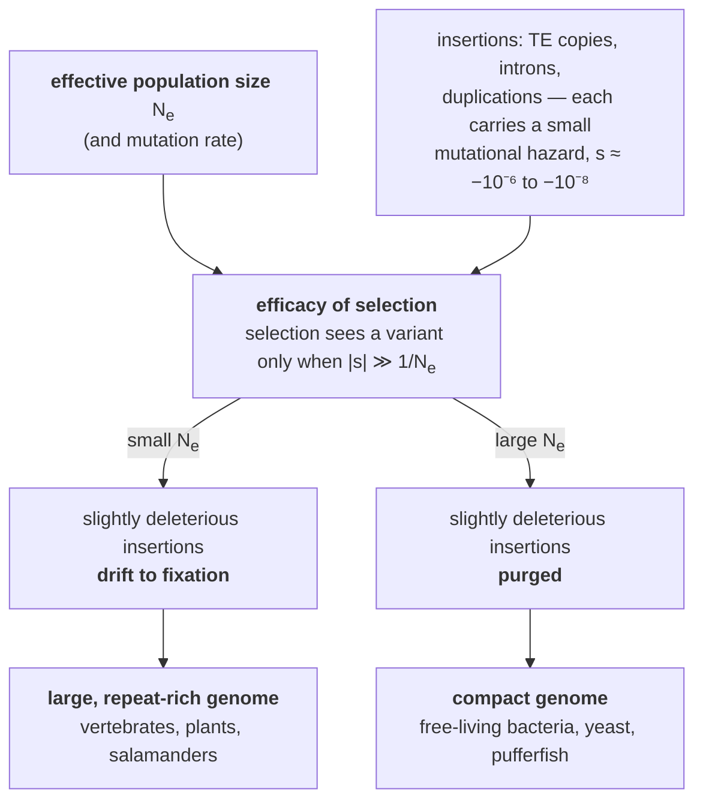

# 39 — Genome landscapes and the C-value paradox

> **Before this:** [Ch 03](../part-01-molecular-foundations/03-genomes-chromosomes-chromatin.md) ·
> [Ch 19](../part-03-genome-instability/19-transposable-elements.md) ·
> [Ch 35](../part-07-molecular-evolution/35-genome-evolution.md) · **Time:** ~40 min

Part 9 is about reading genomes. This chapter is about what you find when you have read one
and zoom all the way out — the coarse statistics of the object your aligners, assemblers and
variant callers will spend the next six chapters fighting with.

Two facts organise everything here. Genome size varies across life by six orders of magnitude
and predicts nothing about the organism. Gene number barely varies at all. Both are more
interesting than they first appear, and the second is the harder problem.

## What you'll be able to do

- State the C-value paradox precisely, as a rejected hypothesis rather than a curiosity, and
  give its resolution in terms of repeat content
- Explain why the near-constancy of gene number across animals is a deeper puzzle than genome
  size, and how regulatory and splicing combinatorics resolve it
- Decompose the human genome quantitatively into coding, non-coding-genic, repetitive and
  constrained fractions using the pinned annotation numbers
- Distinguish the **causal-role** and **selected-effect** definitions of biological function,
  and say which one the ENCODE 80% claim and the comparative 5–10% estimate each measure
- Compute an upper bound on the functional fraction of the genome from the mutation rate and
  a fertility constraint, and state which assumptions the bound rests on
- Identify tandem repeats, interspersed repeats, segmental duplications, isochores, CpG
  islands, gene deserts and NUMTs, and predict which analysis each one breaks
- Explain genome size as a population-genetic outcome via Lynch's mutational-hazard hypothesis

## The core idea

Nobody designed a genome size. **Genome size is the equilibrium of a stochastic accretion
process — insertion by transposition and duplication, removal by deletion — weakly opposed by
selection.** Where selection is efficient, the insertions get purged and the genome stays
lean. Where selection is inefficient, they drift to fixation and the genome bloats.

Selection's efficiency is set by effective population size. So genome size is, to a first
approximation, a readout of demography rather than of biology. That is why it carries no
information about complexity: you are looking at a fossil record of a lineage's population
history, not at a parts list.

And the parts list, when you finally get it, is disappointingly similar everywhere. A
nematode 1 mm long has about as many protein-coding genes as you do. Complexity is not in the
number of components. It is in the wiring — which is combinatorial, and therefore cheap in
sequence and expensive in explanation.

---

## 1. Six orders of magnitude, and no signal

The **C-value** is the DNA content of one haploid set, historically measured in picograms and
now in base pairs. Human 1C ≈ 3.1 Gb.

| Organism | Haploid genome | Protein-coding genes |
|---|---|---|
| *Carsonella ruddii* (insect endosymbiont) | ~0.16 Mb | ~180 |
| *Escherichia coli* K-12 | 4.6 Mb | ~4,400 |
| *Saccharomyces cerevisiae* | 12 Mb | ~6,000 |
| *Caenorhabditis elegans* | 100 Mb | ~20,000 |
| *Arabidopsis thaliana* | 135 Mb | ~27,000 |
| *Drosophila melanogaster* | 180 Mb | ~14,000 |
| *Takifugu rubripes* (pufferfish) | ~400 Mb | ~19,000 |
| ***Homo sapiens*** | **3.1 Gb** | **19,442** |
| *Allium cepa* (onion) | ~16 Gb | — |
| *Triticum aestivum* (bread wheat, hexaploid) | ~16 Gb | ~107,000 (high-confidence) |
| *Protopterus aethiopicus* (marbled lungfish) | ~130 Gb | — |
| *Tmesipteris oblanceolata* (fork fern) | **160.45 Gb** | — |

Stated as a hypothesis test, the **C-value paradox** is the emphatic rejection of

> H₀: genome size increases with organismal complexity (or with gene number).

Three separate features of the data kill it, and it is worth being precise about which:

**No monotone relationship across clades.** A pufferfish carries roughly your gene count in
an eighth of your DNA. A lungfish carries forty times your DNA. An onion carries five times.

**Within-clade variance swamps between-clade variance.** This is the sharper observation.
Species inside a single genus differ several-fold in genome size while being nearly
indistinguishable in anatomy and gene content — *Allium* species, *Drosophila* species,
plethodontid salamanders. Whatever drives genome size operates on a timescale far shorter
than morphological divergence, which rules out any explanation running through organismal
complexity.

**The largest genomes are not in the most complex organisms.** They are in ferns,
lilies, lungfish and salamanders.

> **The onion test.** T. Ryan Gregory's rhetorical device, and the most efficient bad-argument
> filter in the field: whatever function you propose for non-coding DNA, explain why an onion
> needs five times more of it than a human — and why one *Allium* species needs several times
> more than its close relative. Any theory of universal function must survive that question,
> and almost none do. Keep it in your pocket for §5.

Gregory also argues the word "paradox" should be retired. The original paradox — how can
genome size not track gene number? — was resolved once non-coding DNA was discovered. What
remains is the **C-value enigma**: not *whether* the extra DNA is non-genic (it is), but why
lineages differ so wildly in how much they accumulate, and whether the amount has any
consequence. That question is open.

## 2. Resolving the paradox: it is nearly all repeat

Write genome size as a sum:

```
G  ≈  (N_genes × L̄_gene)  +  G_repeat  +  G_other-intergenic
```

Across eukaryotes, `N_genes` varies over roughly one order of magnitude. `G` varies over five.
Almost the entire variance is in `G_repeat` — transposable-element copies and their
degraded remains, plus tandem arrays — with a secondary contribution from mean gene length,
because introns expand in large genomes too
([Ch 06](../part-01-molecular-foundations/06-rna-processing.md)).

The relationship is close to mechanical: plot repeat content against genome size across
species and you get a tight positive relationship, because repeats are the only component
with an intrinsic replication mechanism of its own. A transposable element is a sequence whose
copy number can increase without any benefit to the host
([Ch 19](../part-03-genome-instability/19-transposable-elements.md)); everything else in the
genome changes copy number only through duplication events that are comparatively rare.

Whole-genome duplication supplies the second mechanism — a step change rather than accretion,
routine in plants and recurrent in vertebrate ancestry
([Ch 35](../part-07-molecular-evolution/35-genome-evolution.md)). Bread wheat's 16 Gb is
partly three diploid genomes in one nucleus; the onion's 16 Gb is not, and is mostly repeat.

Genome size, then, is a **repeat-load statistic**. That is the resolution, and it immediately
raises the population-genetic question of why repeat load differs so much between lineages,
which is §8.

## 3. The deeper puzzle: the G-value paradox

Now look at the gene-count column again, restricted to animals:

```
C. elegans   (959 somatic cells, 1 mm)      ~20,000 protein-coding genes
D. melanogaster                             ~14,000
T. rubripes                                 ~19,000
H. sapiens   (~3 × 10¹³ cells)               19,442
```

This is the **G-value paradox** (Hahn and Wray's term), and it is a much worse problem than
the C-value paradox. Genome size not tracking complexity is easy once you know most of the
genome is inert. Gene *number* not tracking complexity attacks the intuition directly: these
are the functional units, and a human has no more of them than a millimetre-long worm.

The 2001 draft-genome estimate of 30,000–40,000 human genes was already a downward revision
from the 100,000 many expected, and it has fallen further to **19,442** in the current
annotation ([verified-facts](../reference/verified-facts.md)). The number kept shrinking
while the organism stayed as complicated as ever.

The resolution has three components, all of them combinatorial — which is why they are
invisible in a gene count.

**Alternative splicing multiplies products per gene.** The large majority of human multi-exon
genes are alternatively spliced. The scale shows up in the annotation: 644,292 transcripts
across 78,733 annotated genes is an average of

```
644,292 / 78,733 ≈ 8.2 transcripts per annotated gene
```

(averaged over all gene classes, so protein-coding genes are above this and single-exon
small RNA genes below). The record holder is not human: *Dscam* in *Drosophila* can generate
38,016 distinct isoforms from one locus by mutually exclusive exon choice. One gene, more
protein variants than the fly has genes.

**Regulatory elements multiply contexts per gene.** ENCODE has catalogued on the order of a
million candidate cis-regulatory elements in the human genome — roughly fifty per
protein-coding gene ([Ch 22](../part-04-gene-regulation/22-eukaryotic-transcriptional-regulation.md)).
Each is a condition under which the gene is used. The same 19,442 genes deployed in a
thousand cell types under distinct regulatory logic is a vastly larger space than 19,442.

**Post-transcriptional and post-translational layers multiply again** — RNA stability,
localisation, microRNA control ([Ch 24](../part-04-gene-regulation/24-rna-based-regulation.md)),
and protein modification.

> **For programmers.** Gene count is lines of code. Complexity lives in the call graph, not
> the line count, and the interesting difference between two systems of similar size is almost
> always in how the parts are composed. This is also the reason human and chimpanzee proteins
> are nearly identical while the organisms are not — King and Wilson made exactly this argument
> in 1975, before anyone could sequence a regulatory element to check it.

## 4. The human genome, decomposed

The pinned annotation ([GENCODE Release 50](../reference/verified-facts.md)):

| Category | Count |
|---|---|
| Protein-coding genes | **19,442** |
| Long non-coding RNA genes | **35,885** |
| Small non-coding RNA genes | 7,608 |
| Pseudogenes | 14,702 |
| IG/TR segments, readthrough genes and artifacts (tabulated separately) | 1,096 |
| **Total annotated genes** | **78,733** |
| Total transcripts | 644,292 |

The first four categories sum to 77,637, not 78,733. The remaining **1,096** are 412
immunoglobulin and T-cell-receptor segments, 665 readthrough genes and 19 artifact entries;
1,077 of them GENCODE counts as protein-coding, but it tabulates all 1,096 separately. That is why the non-coding count has to be summed from its parts rather
than obtained by subtracting 19,442 from 78,733: the subtraction sweeps those 1,096 coding
entities into the non-coding tally and returns 59,291 instead of the correct 58,195.

Two derivations you should be able to reproduce.

**Coding sequence is a rounding error.** Take a typical protein at ~400 amino acids, needing
1,200 bp:

```
19,442 × 1,200 bp ≈ 23.3 Mb ≈ 0.75% of 3.1 Gb
```

Add untranslated regions and alternative exons and the exonic fraction reaches ~1–2%. The
figure is soft because "exon" is annotation-dependent, which is exactly why the derivation
matters more than the number.

**Non-coding genes outnumber coding genes about 3:1.**

```
(35,885 + 7,608 + 14,702) / 19,442 = 58,195 / 19,442 ≈ 3.0
```

Set against that, **~46% of the genome is transposable-element derived**, and more sensitive
homology detection pushes the repeat-derived share past two-thirds.

Those two facts are the whole "junk DNA" argument in miniature, and they point in opposite
directions. Ohno's 1972 coinage rested on a sound inference — population genetics limits how
much sequence a species can maintain against mutation, so most of a large genome cannot be
under selection. The error was lexical: "junk" collapsed *not protein-coding* into *not doing
anything*, and 43,493 non-coding RNA genes — the 58,195 total minus the 14,702 pseudogenes,
which are junk by anyone's definition and were Ohno's own paradigm case — plus a million
candidate regulatory elements say that collapse is wrong. But the over-correction is equally wrong, and it is the one currently in
fashion. Resolving which is right requires deciding what "function" means, and that turns out
to be the entire argument.

## 5. The function debate, taken seriously

In 2012 the ENCODE consortium reported that **~80% of the human genome participates in at
least one biochemical event in at least one cell type** — being transcribed, bound by a
protein, marked by a particular histone modification, or sitting in accessible chromatin. Much
press coverage rendered this as "junk DNA is dead". The backlash was ferocious, and it was
substantially correct.

The critique, argued most bluntly by Graur and colleagues and more carefully by Doolittle and
by Eddy, has three parts:

**Biochemical activity is expected of inert DNA.** RNA polymerase initiates spuriously;
transcription factors bind degenerate motifs by the millions
([Ch 01 §5](../part-00-orientation/01-chemistry-and-cell-primer.md)). A genome in an
accessible nucleus will show pervasive low-level transcription and binding whether or not any
of it matters. The null expectation for the ENCODE assays applied to random sequence is *not*
zero, and the 80% figure was reported without that null.

**The threshold was permissive and the union was taken over everything.** "At least one event
in at least one of many cell types" is a union over a large number of assays; the fraction
showing reproducible, cell-type-specific, quantitatively substantial activity is far smaller.

**Two different concepts of function were conflated.** This is the load-bearing objection.

| | **Causal-role function** | **Selected-effect function** |
|---|---|---|
| Question asked | What does this sequence *do*? | What is this sequence *for*? |
| Evidence | Biochemical activity in an assay | Sequence conserved by purifying selection |
| Provenance | Cummins-style functional analysis | Wright-style etiological account |
| Human genome estimate | **~80%** (ENCODE) | **~5–10%** (comparative genomics) |
| Failure mode | Counts noise as function | Misses lineage-specific and recently evolved function |
| Can a pseudogene qualify? | Yes, if transcribed | No |

Both definitions are legitimate; they answer different questions. My heart pumps blood (its
selected effect) and also makes a thumping noise (a causal role that is not what it is for).
ENCODE measured causal roles. The claim that the result overturned junk DNA required the
selected-effect sense, and the assays cannot supply it.

**The comparative estimate.** Align many mammalian genomes and ask which positions change more
slowly than the neutral rate. That measures purifying selection directly and is the estimate
with evolutionary meaning. It puts the constrained fraction of the human genome at roughly
**5–10%** — deeper alignments across large numbers of mammals push toward the upper end of
that band, and all such estimates are lower bounds on function, because sequence whose
*presence* matters but whose *identity* does not (spacers, some structural DNA) is invisible
to a substitution-rate test, as is anything that evolved too recently to have accumulated a
signal.

**The mutational-load bound.** There is a second, independent line of argument that does not
require any alignment, only the mutation rate and a fertility constraint. It is worked
through fully in the [worked example](#worked-example-an-upper-bound-on-the-functional-fraction)
below and lands in the same range.

**The onion test.** Apply it: if 80% of the human genome is functional, the corresponding
fraction of the onion's 16 Gb implies an onion needs several times more functional DNA than a
human. The test does not disprove anything on its own — it is a plausibility check — but any
argument for near-universal function must answer it, and the ENCODE framing never did.

> **The honest conclusion.** "What fraction of the human genome is functional?" has no answer
> until you fix a definition, and the two available definitions differ by an order of
> magnitude. Under the causal-role definition, a majority of the genome does something
> measurable. Under the selected-effect definition — the one that connects to evolution,
> to disease, and to the question of why the sequence is *there* — the answer is single-digit
> to low-double-digit percent. Both numbers are defensible; only one of them is a claim about
> why the genome looks the way it does. When you read a functional-genomics result, the first
> question to ask is which definition is doing the work
> ([Ch 49](../part-10-functional-genomics/49-epigenome-profiling.md),
> [Ch 52](../part-11-human-and-statistical-genomics/52-association-to-mechanism.md)).

## 6. Repetitive DNA: the classes that break different tools

Repeats are classified by **arrangement**, not origin.

### Tandem repeats — copies adjacent, head to tail

| Class | Unit | Array size | Why it matters |
|---|---|---|---|
| **Satellite** | 171 bp (alpha) and others | 0.1–5 Mb | Centromeres, pericentromeric blocks, Yq. Unassemblable before long reads — most of the ~8% newly resolved by T2T-CHM13 |
| **Minisatellite (VNTR)** | 10–100 bp | 0.5–30 kb | Copy-number-variable; basis of 1980s DNA fingerprinting. Telomeres are a special case |
| **Microsatellite (STR)** | 1–6 bp | tens of bp | >10⁶ loci, ~3% of the genome. Mutate at 10⁻³–10⁻⁴ per locus per generation by polymerase slippage |

STRs earn their own paragraph because their mutation mechanism gives them two unusual uses.
Polymerase slippage during replication adds or removes whole repeat units, so a locus becomes
highly polymorphic in *copy number* within a few generations:

```
locus with a 4 bp unit (AGAT), two alleles in one individual

allele 1   ...CTTA [AGAT]×11 GTCC...     11 repeats
allele 2   ...CTTA [AGAT]×14 GTCC...     14 repeats
                    ^^^^^^^
           genotype recorded as 11,14 — a two-number summary of one locus
```

**Forensics** exploits exactly this. Genotype ~20 unlinked highly polymorphic STR loci, treat
them as independent, and multiply the allele-frequency products: the random-match probability
falls below 10⁻¹⁸ while the assay stays cheap and works on degraded DNA. The statistics are
elementary; the power comes entirely from the mutation rate having generated enough alleles
per locus ([Ch 57](../part-12-applications-and-ethics/57-genomics-in-practice.md)).

**Repeat-expansion disease** exploits nothing — it is the same mechanism running away. Above
some threshold length, slippage becomes strongly biased toward expansion, and the repeat grows
across generations, producing **anticipation**: earlier onset and greater severity down a
pedigree. *HTT* (CAG, Huntington disease) and *FMR1* (CGG, fragile X) are the canonical cases,
each with a well-defined allele ladder — though the rungs are locus-specific, and conflating
them is a common error. *HTT* runs normal / intermediate / reduced-penetrance /
full-penetrance (≤26 / 27–35 / 36–39 / ≥40 CAG); *FMR1* runs normal / intermediate /
premutation / full mutation. There is no *HTT* "premutation".
Short-read sequencing systematically underestimates long expansions, because you cannot
measure a repeat longer than your read
([Ch 54](../part-11-human-and-statistical-genomics/54-rare-variants-and-mendelian-disease.md)).

### Interspersed repeats — copies scattered

These are transposable-element relics: LINEs (~21%, dominated by L1 at ~17%), SINEs (~13%,
dominated by *Alu* at ~11%), LTR/endogenous retroviral elements (~8%), and DNA transposons
(~3%, none currently active in humans). Class percentages come from different annotations and
are approximate; the pinned total for TE-derived sequence is **~46%**.
[Ch 19](../part-03-genome-instability/19-transposable-elements.md) covers the biology; the
consequence here is that a 150 bp read from a young, low-divergence *Alu*Y copy may have many
near-identical potential origins, so the aligner emits it with mapping quality 0 and every
downstream caller discards it. Be precise about the scope of that claim: *Alu* copies have
diverged 5–20% from one another over ~65 My, so most *Alu*-derived reads do map uniquely —
measured mappability puts ~89% of annotated transposable-element sequence in the uniquely
mappable class at 100 bp paired-end. The mapping problem is concentrated in the recently
active subfamilies (*Alu*Ya5, *Alu*Yb8 and kin), not in *Alu* as a class
([Ch 42](42-read-alignment.md)).

### Segmental duplications — the class that causes disease

**Segmental duplications** (low-copy repeats) are blocks >1 kb at >90% sequence identity,
present in two or more genomic locations. They cover roughly 5–7% of the human genome
depending on assembly and identity threshold, and the complete T2T assembly revised the figure
upward because duplications are precisely what short-read assemblies collapse
([Ch 43](43-genome-assembly.md)).

Their importance is mechanical. Two near-identical blocks in the same region can misalign
during meiosis, and recombination between the misaligned copies — **non-allelic homologous
recombination**, NAHR — deletes or duplicates everything between them:

```
normal chromosome     ---[SD-A]-----GENES-----[SD-A']---
                            \___ misaligned pairing ___/

NAHR products         ---[SD-A]---                       deletion
                      ---[SD-A]-----GENES-----GENES-----[SD-A']---   duplication
```

Because the breakpoints are fixed by the positions of the duplications, the resulting
rearrangements are **recurrent**: the same interval, the same size, in unrelated patients.
That is the signature of NAHR and it distinguishes these disorders from random structural
variation. 22q11.2 deletion syndrome (~3 Mb, flanked by the LCR22 blocks), the *PMP22*
duplication and reciprocal deletion at 17p12 causing Charcot–Marie–Tooth 1A and hereditary
neuropathy with liability to pressure palsies, Williams–Beuren at 7q11.23 and Smith–Magenis at
17p11.2 are all the same mechanism at different loci
([Ch 20](../part-03-genome-instability/20-chromosome-abnormalities.md)).

## 7. Texture: density, isochores, CpG islands, deserts, NUMTs

Zoom to a single chromosome arm and the landscape is anything but uniform. Schematically:

```
position (Mb)   0        10        20        30        40        50
                |---------|---------|---------|---------|---------|
gene density    ▂▂▁▁▁▁▁▁▁▁▁▁▁▁▂▄▆█████▆▄▂▁▁▁▁▁▁▁▁▁▁▁▁▁▁▁▂▄▆██▆▄▂▁
GC content      ▃▃▃▂▂▂▂▂▂▂▂▂▂▃▄▅▆▇▇▇▇▆▅▄▃▂▂▂▂▂▂▂▂▂▂▂▂▂▂▃▄▅▆▇▇▆▅▃▂
LINE-1 density  ▆▇▇███████▇▇▆▅▄▃▂▂▂▂▃▄▅▆▇▇███████▇▇▆▅▄▃▂▂▂▃▄▅▆▇▇
Alu density     ▂▂▁▁▁▁▁▁▁▁▂▃▄▅▆▇███▇▆▅▄▃▂▁▁▁▁▁▁▁▁▁▁▁▁▂▃▄▅▆▇██▇▅▃
replication     ─── late ──────────  early  ─── late ──────  early
                |________________|            |___________|
                   GENE DESERT                 GENE DESERT
                     (~12 Mb)                    (~9 Mb)
                                (schematic, not a real locus)
```

Every track here is correlated with every other, and the correlations are the point.

**Isochores.** The genome averages ~41% GC, but that average is built from long, relatively
homogeneous domains — Bernardi's isochores, L1 (<37% GC) through H3 (>53% GC) — spanning
hundreds of kilobases. GC-rich isochores are gene-dense, short-introned, *Alu*-rich,
early-replicating and open; GC-poor isochores are the reverse and are L1-rich. Chromosome 19
runs at ~26 protein-coding genes per Mb against a genome average of ~6.

The explanation is not selection for thermal stability, the original guess. It is
**GC-biased gene conversion**: when recombination resolves a mismatched heteroduplex, repair
is biased toward G and C, so high-recombination regions are pushed GC-ward with no fitness
consequence at all. A fixation bias — a non-adaptive, recombination-driven distortion of which
allele is transmitted — that produces a pattern indistinguishable from selection
until you test for it properly
([Ch 33](../part-07-molecular-evolution/33-neutral-theory-and-selection-tests.md)).

**CpG islands.** The dinucleotide CG is strongly depleted genome-wide — observed frequency
roughly a quarter of what base composition predicts — because cytosine in a CpG is usually
methylated, and 5-methylcytosine deaminates to thymine, producing a G:T mispair in which both
bases are perfectly normal DNA. Repair falls to the TDG and MBD4 glycosylases of base excision
repair, which are far less efficient than the uracil glycosylase that clears the U:G product
of deaminating an *unmethylated* cytosine — uracil announces itself as foreign, thymine does
not ([Ch 17](../part-03-genome-instability/17-dna-repair.md)). CpG is therefore a mutational
sinkhole, and it has been draining for a hundred million years.

Against that background, regions where CpG is *not* depleted stand out, and the standard
definition of a **CpG island** is a straightforward statistical filter:

```
length > 200 bp
GC content > 50%
observed CpG / expected CpG > 0.6      where expected = (N_C × N_G) / L
```

Roughly 30,000 such islands exist, and they mark the promoters of a majority of human genes.
The reason they survived is that they are usually unmethylated, so they never entered the
deamination sinkhole — meaning the island is a *fossil of the region's methylation history*,
not merely a compositional oddity. Their methylation state is a primary readout in epigenome
profiling ([Ch 23](../part-04-gene-regulation/23-chromatin-and-epigenetics.md),
[Ch 49](../part-10-functional-genomics/49-epigenome-profiling.md)), and their GC extremity is
a recurring source of coverage dropout in sequencing
([Ch 40](40-sequencing-technologies.md)).

**Gene deserts.** Intervals of hundreds of kilobases to megabases with no protein-coding gene
account for something like a quarter of the genome. They come in two flavours, and the
distinction matters: **variable deserts**, which are lineage-specific and largely
unconstrained, and **stable deserts**, which are conserved across vertebrates, packed with
regulatory elements, and sit beside developmental transcription factors. A conserved gene
desert is not empty — it is the regulatory input space of the gene next door, which is why
disease variants can act on a gene a megabase away
([Ch 52](../part-11-human-and-statistical-genomics/52-association-to-mechanism.md)).

**NUMTs.** Fragments of mitochondrial DNA have inserted into the nuclear genome repeatedly
over evolutionary time. Hundreds of these **nuclear mitochondrial DNA segments** exist in the
human reference, from tens of bp to several kb, and new ones arise at an appreciable rate —
on the order of one per few thousand births. They are a pure analysis hazard:

```
read from a NUMT (nuclear)         ...GATCACAGGTCTATCACCCTATTAACCAC...
true mtDNA sequence                ...GATCACAGGTCTATCACCCTATTAACCAC...
                                                            ^
                            NUMT carries an ancient substitution here

aligner sees two near-identical targets, picks the wrong one
  → apparent low-frequency mtDNA heteroplasmy that does not exist
  → apparent nuclear variant that is really a mitochondrial read
```

Any pipeline that calls mitochondrial variants — and any that reports low-frequency
heteroplasmy — must model NUMTs explicitly, usually by aligning to a combined reference and
discarding reads that map ambiguously
([Ch 46](../part-10-functional-genomics/46-variant-calling.md)).

## 8. Why sizes differ: bacteria, streamlining and mutational hazard

Bacterial genomes look nothing like this landscape. Typical coding density is 85–90%,
intergenic gaps are tens of base pairs, introns are essentially absent, and genes with related
functions are transcribed as single polycistronic units — **operons**
([Ch 21](../part-04-gene-regulation/21-bacterial-regulation.md)). Gene number scales almost
linearly with genome size, which is precisely the relationship that fails in eukaryotes.

| | Bacteria | Eukaryotes (large-genome) |
|---|---|---|
| Coding density | 85–90% | 1–2% exonic |
| Genes per Mb | ~900 | ~6 (human) |
| Introns | rare | ubiquitous, often long |
| Transcription unit | polycistronic operon | one gene, many isoforms |
| Repeat content | low, actively purged | up to and beyond 50% |
| Gene number vs genome size | ~linear | uncorrelated |

Two directions of small genome, often confused, need separating:

**Streamlining by selection.** Free-living marine bacteria with enormous census abundances —
*Prochlorococcus*, *Pelagibacter* — have shed nearly all non-coding DNA. With effective
population sizes plausibly around 10⁸–10⁹ — orders of magnitude above any multicellular
eukaryote, though far below census abundance and genuinely hard to estimate — even the tiny
metabolic cost of replicating an extra kilobase is visible to selection, and it is removed.

> **Do not read *N*ₑ off the census count.** Marine bacteria are astronomically abundant, and
> that abundance has repeatedly been translated straight into an enormous *N*ₑ. It does not
> translate: selective sweeps and population structure sever the two, and the gap is routinely
> several orders of magnitude. *Prochlorococcus* is the cautionary case. A mutation-accumulation
> experiment put its *N*ₑ on the order of 10⁷ — *smaller* than that of less abundant,
> large-genome relatives — with the implication that its genome reduction was driven partly by
> drift rather than purely by selection. The textbook flagship for streamlining is the one
> example currently under attack.

**Reduction by drift.** Insect endosymbionts like *Carsonella ruddii* have genomes an order of
magnitude smaller still, and their genomes are *degraded*: pseudogenes, lost DNA repair, high
substitution rates, absurd base composition. They are transmitted vertically through tiny
bottlenecks, so effective population size is minuscule, selection is impotent, and genes are
lost by drift rather than trimmed by selection. Same outcome — a small genome — from opposite
causes.

That contrast is the whole content of **Lynch's mutational-hazard hypothesis**, which is the
serious population-genetic answer to the C-value enigma:



The argument is entirely quantitative and should feel familiar
([Ch 27](../part-05-population-genetics/27-the-four-forces.md)). A non-coding insertion is
not neutral — it carries a small replication and mutational cost, giving a selection
coefficient perhaps on the order of 10⁻⁶ to 10⁻⁸. Selection can only act on variants with
|*s*| substantially greater than 1/*N*ₑ. Multicellular eukaryotes have *N*ₑ in the 10⁴–10⁵
range, so 1/*N*ₑ ≈ 10⁻⁴–10⁻⁵ — larger than the cost. The insertions are invisible to
selection and drift to fixation. Free-living bacteria with *N*ₑ ≈ 10⁸–10⁹ have 1/*N*ₑ at or
below the cost, and the same insertions are removed.

**Genome size is therefore a readout of demographic history, not of biology** — the claim from
the core idea, now derived. It also explains the within-genus variance that killed the
complexity hypothesis in §1: *N*ₑ changes on a timescale of thousands of generations, far
faster than morphology.

The hypothesis is contested — the selection coefficients are hard to measure, and there are
competing accounts based on cell size, nutrient economics and DNA replication cost. Treat it
as the best-developed quantitative framework rather than as settled.

### Organellar genomes, and the paradox in miniature

Mitochondria and chloroplasts carry their own chromosomes, and they replay the whole argument
at small scale. Human mtDNA is **16,569 bp** encoding **37 genes**, with essentially no
non-coding sequence beyond the ~1.1 kb control region — extreme compaction
([Ch 03](../part-01-molecular-foundations/03-genomes-chromosomes-chromatin.md)). Chloroplast
genomes are larger and remarkably uniform across plants, around 120–160 kb.

Then plant mitochondrial genomes: 200 kb to several megabases, hundreds of times the size of
the human mitochondrial genome, encoding roughly the same tiny number of proteins. The extra
sequence is repeat, intron and captured DNA. The C-value enigma, complete with an onion test
of its own, inside an organelle whose entire gene content you could list on an index card.

---

## Common misconceptions

| What people think | What's actually true |
|---|---|
| Bigger, more complex organisms have bigger genomes | The C-value paradox. An onion has 5× the human genome; a pufferfish has ⅛ of it with the same gene count; a fork fern has 160 Gb. Size tracks repeat load and duplication history |
| The C-value paradox is unresolved | The paradox — size not tracking gene number — was resolved by non-coding DNA. The *enigma* (why lineages differ so much, and whether it matters) is what remains open |
| Humans have far more genes than simple animals | *C. elegans* has roughly as many. Complexity is combinatorial: splicing, regulation, and context, none of which appear in a gene count |
| ENCODE showed 80% of the genome is functional | It showed ~80% shows some biochemical activity in some cell type — a causal-role claim with no null model. Under the selected-effect definition the estimate is ~5–10% |
| The 5–10% constrained estimate proves the rest is junk | It is a lower bound. Sequence whose presence matters but whose identity does not, and anything recently evolved, is invisible to a substitution-rate test |
| Junk DNA is a discredited idea | Ohno's inference — that a species cannot maintain unlimited sequence against mutation — was correct and is still correct. The word was bad; the population genetics was not |
| Non-coding means non-functional | Non-coding genes outnumber coding ones ~3:1, and regulatory, structural and RNA-gene sequence includes a great deal that is unambiguously functional. Do not over-correct: for the ~36,000 annotated lncRNA genes specifically, function is demonstrated for a small minority and most show little sequence constraint. "Annotated as a gene" is not evidence of function |
| Repeats are all the same problem | Each class breaks a different tool: interspersed repeats destroy mapping uniqueness, tandem arrays defeat assembly, segmental duplications cause recurrent disease-associated rearrangements by NAHR |
| A gene desert is empty | Conserved gene deserts are dense with regulatory elements and sit beside developmental genes. Emptiness is a statement about annotation, not about function |
| Small genomes mean efficient organisms | Small genomes arise both from selection (streamlined marine bacteria, huge *N*ₑ) and from drift (degraded endosymbionts, tiny *N*ₑ). Same outcome, opposite causes |
| Mitochondrial reads come from mitochondria | Hundreds of NUMTs make nuclear reads look mitochondrial and vice versa — the standard source of phantom heteroplasmy |

## Worked example: an upper bound on the functional fraction

Can 80% of the human genome be functional in the selected-effect sense? Test it with nothing
but the mutation rate and arithmetic. This is the Graur-style mutational-load argument, stated
with its assumptions exposed.

**Step 1 — de novo mutations per zygote.** From the pinned germline rate of 1.1–1.3 × 10⁻⁸
per bp per generation across a 6.2 Gb diploid genome:

```
6.2 × 10⁹ × 1.1 × 10⁻⁸ ≈ 68
6.2 × 10⁹ × 1.3 × 10⁻⁸ ≈ 81        → call it ~70 new SNVs per zygote
```

**Step 2 — how many land in functional sequence and matter.** Let *f* be the functional
fraction and *δ* the probability that a mutation inside functional sequence is deleterious.
The deleterious mutation rate per zygote is

```
U = 70 × f × δ
```

**Step 3 — turn *U* into a fertility requirement.** Under the classical Haldane–Muller model,
with deleterious mutations acting independently and multiplicatively on fitness, mean fitness
relative to a mutation-free genotype is *e*^−*U*. For the population to hold constant size,
each couple must produce, on average,

```
R = 2 e^U      children
```

**Step 4 — evaluate the ENCODE claim.** Set *f* = 0.80 and, generously to ENCODE, *δ* = 0.5:

```
U = 70 × 0.80 × 0.5 = 28
R = 2 × e²⁸ ≈ 2 × 1.4 × 10¹² ≈ 3 × 10¹² children per couple
```

Three trillion children per couple. The claim is not merely wrong, it is wrong by twelve
orders of magnitude.

**Step 5 — invert it into a bound.** Instead of testing a value of *f*, solve for the largest
one the arithmetic permits. Take a pre-modern completed family size of ~5 children, so
*R* ≤ 5 and *e*^*U* ≤ 2.5, giving *U* ≤ ln 2.5 = 0.92:

```
f ≤ 0.92 / (70 × δ)

δ = 0.5   →   f ≤ 0.026    (2.6%)
δ = 0.2   →   f ≤ 0.065    (6.5%)
δ = 0.1   →   f ≤ 0.131    (13.1%)
```

**Step 6 — read the result honestly.** The bound lands at a few per cent to ~13% depending on
*δ*, bracketing the comparative-genomics estimate of 5–10% from a completely independent
direction — no alignments, no conservation scores, just mutation and demography. Two methods
sharing no assumptions and agreeing is worth more than either alone.

Now the caveats, because a bound is only as good as its model:

- **Independence and multiplicativity.** Synergistic epistasis — where each additional
  deleterious mutation hurts more than the last — allows selection to remove several
  mutations per death and raises the ceiling, potentially several-fold.
- **Soft selection and truncation selection** likewise relax the requirement.
- **δ is doing enormous work** and is not directly measurable; the answer swings fivefold
  across plausible values.
- **The argument bounds *selected-effect* function only.** It says nothing against ENCODE's
  actual measurement — a great deal of the genome really is transcribed and bound. It rules
  out the interpretation, not the data.

Even with every caveat applied generously, *f* = 0.8 is unreachable. That is the useful
conclusion, and it is robust to everything the model gets wrong.

## Connections

- **Back to:** [Ch 03](../part-01-molecular-foundations/03-genomes-chromosomes-chromatin.md)
  introduced genome composition and repeat classes; this chapter argues out the parts that
  chapter deferred · [Ch 19](../part-03-genome-instability/19-transposable-elements.md) for
  the mechanism generating the 46% · [Ch 20](../part-03-genome-instability/20-chromosome-abnormalities.md)
  for NAHR disorders · [Ch 27](../part-05-population-genetics/27-the-four-forces.md) for the
  drift/selection threshold at 1/*N*ₑ · [Ch 33](../part-07-molecular-evolution/33-neutral-theory-and-selection-tests.md)
  for how constraint is actually measured
- **Forward to:** [Ch 40](40-sequencing-technologies.md) — read length is the parameter that
  determines which parts of this landscape you can see at all ·
  [Ch 42](42-read-alignment.md) and [Ch 43](43-genome-assembly.md) — repeats are the reason
  both problems are hard · [Ch 44](44-annotation.md) — where the gene counts in §4 come from,
  and why they keep moving · [Ch 45](45-reference-genomes-and-pangenomes.md) — what a single
  reference sequence hides about this landscape ·
  [Ch 46](../part-10-functional-genomics/46-variant-calling.md) — NUMTs and repeats as
  false-positive engines ·
  [Ch 52](../part-11-human-and-statistical-genomics/52-association-to-mechanism.md) — gene
  deserts as regulatory space, and the causal-role/selected-effect distinction applied to
  GWAS hits

## Check yourself

**1. State the C-value paradox precisely, and explain why the within-genus comparison is stronger evidence than the human-versus-onion comparison.**

<details><summary>Answer</summary>

The paradox is the rejection of the hypothesis that genome size increases with organismal
complexity or gene number: size varies across life by six orders of magnitude with no
relationship to either.

Human-versus-onion is a between-kingdom comparison, so a defender can always appeal to
unmeasured differences — plants do something different, complexity is hard to define. The
within-genus comparison closes that escape. Two *Allium* species differ several-fold in genome
size while being nearly identical in anatomy, physiology and gene content. Whatever varies
must vary on a timescale much shorter than morphological divergence, which excludes any
explanation running through organismal complexity.

</details>

**2. ENCODE says ~80%; comparative genomics says ~5–10%. Is one of them wrong?**

<details><summary>Answer</summary>

Neither measurement is wrong; they measure different things. ENCODE reported **causal-role**
function — biochemical activity in at least one assay in at least one cell type — with no null
model for how much activity inert DNA produces, and taking a union over many assays. The
comparative estimate reports **selected-effect** function: sequence evolving more slowly than
the neutral rate, i.e. maintained by purifying selection.

The error was interpretive: the claim that junk DNA had been overturned needs the
selected-effect sense, and biochemical assays cannot deliver it. Note also that the two
numbers are bounds in opposite directions — 80% overcounts by including noise, 5–10%
undercounts by missing function that does not constrain sequence identity and function too
recent to leave a signal.

</details>

**3. A gene sits alone in the middle of a 2 Mb interval with no other protein-coding gene. What should you expect about that interval if the gene is a developmental transcription factor, and what does that predict for GWAS?**

<details><summary>Answer</summary>

Expect a **stable** gene desert: sequence conserved across vertebrates and densely populated
with cis-regulatory elements — enhancers acting on the transcription factor over long
distances. Developmental regulators need many independent inputs (tissue, stage, dose), and
each input is an element, so the regulatory input space is physically large.

The GWAS prediction is that trait-associated variants for that gene will be scattered across
the desert, often hundreds of kilobases from the transcript, and that assigning them to the
nearest gene will frequently give the right answer here (there is nothing else nearby) but the
wrong answer in gene-dense regions. It also predicts the causal variants will be regulatory
rather than coding, which is what is observed
([Ch 52](../part-11-human-and-statistical-genomics/52-association-to-mechanism.md)).

</details>

**4. Free-living marine bacteria and insect endosymbionts both have very small genomes. Why is calling both of them "streamlined" a mistake?**

<details><summary>Answer</summary>

Opposite causes. Marine bacteria such as *Prochlorococcus* and *Pelagibacter* have effective
population sizes around 10⁸–10⁹, so 1/*N*ₑ sits at or below the selection coefficient against
carrying an extra kilobase; non-coding DNA is actively **purged by selection**. Their genomes
are compact *and* clean — few pseudogenes, intact repair, ordinary base composition. (With the
caveat from §8: *Prochlorococcus* itself has been measured at *N*ₑ ~10⁷, and the case that
drift contributed to its reduction is live.)

Endosymbionts like *Carsonella* pass through severe bottlenecks every host generation, giving
minuscule *N*ₑ. Selection is impotent, and genes are **lost by drift**, along with DNA repair
systems; the remaining genome is degraded, AT-skewed, pseudogene-ridden and fast-evolving.

Same outcome on the size axis, opposite positions on the efficacy-of-selection axis. Under the
mutational-hazard framework, only the first is streamlining.

</details>

**5. You call mitochondrial variants from whole-genome short reads and find several apparent heteroplasmies at 1–3% allele fraction. Why should you be suspicious, and what would distinguish the artefact from the real thing?**

<details><summary>Answer</summary>

NUMTs. Hundreds of mitochondrial-derived segments sit in the nuclear genome, carrying ancient
substitutions relative to modern mtDNA. Nuclear reads from a NUMT align to the mitochondrial
sequence and contribute those substitutions as apparent low-frequency variants. The expected
artefact fraction is roughly (nuclear NUMT copies × nuclear coverage) / mitochondrial coverage
— which lands in exactly the low-single-digit-percent range that real low-level heteroplasmy
occupies.

Discriminating tests: align to a combined nuclear + mitochondrial reference so NUMT reads are
claimed by their true origin, and discard multi-mapping reads; check whether the variant
positions coincide with known NUMT-divergent sites; check whether the apparent heteroplasmy
tracks the nuclear/mitochondrial coverage ratio across samples (an artefact will, real
heteroplasmy will not); and confirm with long reads, which span the NUMT junctions and resolve
the origin outright ([Ch 46](../part-10-functional-genomics/46-variant-calling.md)).

</details>
