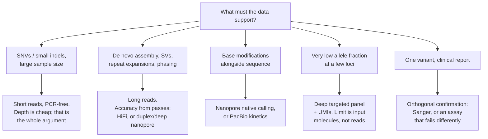

# 40 — Sequencing technologies

> **Before this:** [Ch 02](../part-01-molecular-foundations/02-dna-structure.md) · [Ch 04](../part-01-molecular-foundations/04-dna-replication.md) · [Ch 36](../part-08-methods/36-core-molecular-methods.md) · [Ch 39](39-genome-landscapes.md) · **Time:** ~45 min
>
> **Statistics needed:** [S2 Distributions](../part-S-statistics/S2-distributions.md) ·
> [S3 Sampling and estimation](../part-S-statistics/S3-sampling-and-estimation.md)

Everything in Parts 9–11 is downstream of this chapter. Alignment, assembly, variant calling
and GWAS are all attempts to recover a true sequence from a noisy, biased, fragmentary sample
of it. You cannot reason about those algorithms without knowing exactly what the instrument
did and how it fails.

> **A note on the numbers.** Every platform specification below is **Tier C** in
> [`reference/verified-facts.md`](../reference/verified-facts.md): vendor figures, best-case,
> and fast-moving. They are given as **ranges, verified 2026-08-13**. They will be wrong
> within a year or two. The *mechanisms* will not be — read for those.

## What you'll be able to do

- Explain what physical quantity each sequencing platform actually measures, and derive its
  error profile from that physics rather than memorising it
- Distinguish redundancy *across* molecules from redundancy *within* one molecule, and say which
  errors each one averages away and which survive both
- Derive the Lander–Waterman coverage model, compute the depth needed to leave a given
  fraction of a genome uncovered, and explain why real data violates the model
- Justify 30× as the germline WGS convention and calculate why somatic calling needs an
  order of magnitude more
- Explain PCR duplicates as an occupancy problem, and say when a high duplicate rate means
  "sequence less" versus "change the prep"
- Choose between WGS, exome capture and amplicon panels — and between short and long reads —
  for a stated biological question, and name the failure mode each choice buys
- Say why an orthogonal confirmation must fail differently from the assay it confirms, and what
  independent evidence would be needed to believe a new platform's claims

## The core idea

Every sequencing technology ever built solves the same problem in the same shape. DNA is a
3-billion-character string; no instrument can read it end to end. So all of them:

1. **Shatter** the string into fragments,
2. **Transduce** each fragment into a physical signal — photons, or current, or migration
   time — and **decode** that signal into letters,
3. **Reconstruct** the original computationally.

Three design choices distinguish the platforms, and everything else follows from them:

| Choice | Consequence |
|---|---|
| **How long a fragment can be read** | What repeats you can resolve, what structural variation you can see, whether you can assemble |
| **What the signal is, and how it is decoded** | The error *mode* — substitutions vs indels, random vs context-dependent |
| **Whether the molecule is amplified first** | Whether you have PCR bias and duplicates, and whether chemical modifications on the original survive to be measured |

And there is one unifying statistical idea that runs through the whole chapter. Accuracy can
be bought in exactly three currencies:

- **Chemistry** — make the single measurement better.
- **Redundancy across molecules** — sequence deeper. Averages out sequencing error but
  *cannot* fix an error that was already in the molecule you sequenced.
- **Redundancy within a molecule** — read the *same physical molecule* several times and
  average. This is what makes long reads accurate, and it is a fundamentally different
  operation from depth.

Hold on to that third one. It is the single most important idea in modern sequencing.

---

## 1. Sanger sequencing, and why it refuses to die

**The mechanism.** DNA polymerase extends a growing strand by attacking the incoming
nucleotide with the 3'-hydroxyl of the last one ([Ch 04](../part-01-molecular-foundations/04-dna-replication.md)).
A **dideoxynucleotide** (ddNTP) lacks that 3'-OH. Incorporate one and the chain stops dead.

Run a normal extension reaction spiked with a small fraction of ddNTPs, each of the four
carrying a different fluorescent dye. Every molecule terminates at a random position, so the
product is a population of fragments of every possible length, each labelled by its *last*
base:

```
template   3'- T A C G G A T C C A G T -5'
                                                        terminating base
  primer -> A                                                A   (green)
  primer -> A T                                              T   (red)
  primer -> A T G                                            G   (black)
  primer -> A T G C                                          C   (blue)
  primer -> A T G C C                                        C   (blue)
  ...
```

Separate that population by length in a capillary of polymer gel, one base of resolution, and
read the dye colour as each fragment passes the detector. The order of colours is the
sequence. Modern instruments run ~96 capillaries in parallel; the output is a
**chromatogram** — four intensity traces against time.

**What it gives you:** ~500–1,000 bp per read, very high per-base accuracy in the clean middle
of the trace, and a signal a human can inspect directly.

**What it costs:** one reaction per read. There is no parallelism beyond the number of
capillaries. The cost per base is roughly six orders of magnitude worse than a short-read
instrument.

**Why it is still the confirmation standard.** Not nostalgia — orthogonality. When a
short-read pipeline reports a variant, the plausible explanations are: it is real; the read
alignment was wrong; the library prep introduced it; the base caller mis-decoded it; a sample
was swapped. Sanger shares almost none of those failure modes. Different chemistry, different
detection physics, different amplification, no alignment step, and a fresh aliquot of DNA. A
confirmation is only worth something if it fails *differently* from the thing it confirms.
That principle — verify with an assay whose errors are independent — is worth generalising
well beyond genomics.

Its own limits are real: it reads a *population* average, so it detects a minor allele only
down to roughly 15–20% of molecules (missing low-level mosaicism), and an insertion or
deletion in one allele desynchronises the two overlapping traces from that point on.

**The Human Genome Project** was the Sanger era's monument: an international public
consortium, roughly 1990–2003, a draft in 2001 and a "finished" sequence in 2003, at a total
programme cost on the order of **a few billion dollars**, of which the sequence generation
itself was some hundreds of millions. (Approximate teaching figures — the accounting depends
entirely on what you charge to the project.) The genome was not actually complete: the last
~8% — centromeres, acrocentric short arms, segmental duplications — waited until T2T-CHM13 in
2022 and long reads ([Ch 45](45-reference-genomes-and-pangenomes.md)).

## 2. Second generation: parallelism as the whole idea

The insight that ended the Sanger era is not chemical. It is that if you **immobilise the
fragments on a surface** so each occupies a distinct address, you can run a billion reactions
simultaneously and read them all with a camera. Throughput becomes (features per unit area) ×
(cycles) — an optics and surface-density problem, which is exactly the kind of problem that
scales.

### 2.1 Cluster generation

A single fluorophore is too dim to see against background. So each fragment is amplified
*in place* into a clonal patch of ~1,000 identical copies that fluoresce in lockstep.

The flow-cell surface carries a dense lawn of two oligonucleotides, complementary to the two
adapters ligated onto every library fragment. A fragment anneals by one end, is extended,
denatured, then **bends over and primes on a neighbouring lawn oligo** — a bridge. Isothermal
cycling repeats this; one strand type is then cleaved away, leaving a clonal cluster of
single-stranded templates all in the same orientation.

```
   fragment binds        bridge forms         extend + denature      after ~30 cycles
   ┌──────────           ┌─────┐              ┌──────┐  ┌──────┐     ▒▒▒▒▒▒▒▒▒▒▒
   │                     │     │              │      │  │      │     ▒ clonal  ▒
 ──┴──┬──┬──┬──        ──┴──┬──┴──┬──       ──┴──┬───┴──┴──┬───     ▒ cluster  ▒
  lawn oligos             lawn                  lawn               ▒▒▒▒▒▒▒▒▒▒▒
```

Patterned flow cells replace the random lawn with an ordered array of nanowells, and use a
kinetic trick (one template entering a well amplifies fast enough to exclude any second) to
put exactly one cluster per well. This maximises density but introduces its own artefact:
free adapters in the mix can prime the wrong template, so a read gets attributed to the wrong
sample — **index hopping**. The fix is to index both ends with *unique* pairs, so a hop
produces an unassigned combination rather than a silent misassignment.

### 2.2 Sequencing by synthesis with reversible terminators

Now read all clusters at once. Each cycle:

1. Flood with all four nucleotides. Each carries a **3' blocking group** — so exactly one
   incorporates per template per cycle — and a **cleavable fluorescent dye**.
2. Wash away the unincorporated.
3. Image the surface in the relevant channels. Every cluster reports its next base.
4. Chemically cleave the dye *and* the 3' block. Repeat.

One base per cycle. Read length equals cycle count. Which raises the obvious question: why
stop at 150?

### 2.3 Dephasing: why read length is capped

Because the cluster is an *ensemble*, and ensembles lose synchrony.

Two failures occur at low per-cycle probability. A strand fails to incorporate or fails to
deblock, and falls one base behind (**phasing**). A strand incorporates a nucleotide whose
block was defective, and runs one base ahead (**prephasing**). Neither strand is removed —
it keeps extending, permanently out of register, contributing the *wrong base's* signal to
every subsequent image.

If the per-cycle probability of falling out of register is *p*, the fraction of the cluster
still in phase after *n* cycles is (1−*p*)ⁿ:

| *p* | n = 100 | n = 150 | n = 300 | n = 600 |
|---|---|---|---|---|
| 0.001 | 90% | 86% | 74% | 55% |
| 0.002 | 82% | 74% | 55% | 30% |
| 0.005 | 61% | 47% | 22% | 5% |

The signal at cycle *n* is a mixture: mostly the correct base, plus contamination from
positions *n*−1 and *n*+1. Base callers explicitly model and deconvolve phasing, which is why
150 cycles works at all — but the correction's variance grows with *n*, so the quality score
falls monotonically along the read. That decay is not a defect to be fixed; it is intrinsic
to reading an ensemble. Cumulative photodamage and dye carryover compound it.

**This is the structural reason short reads are short.** Not chemistry — statistics of
synchrony loss in a population.

### 2.4 The error profile, and why it matters downstream

| Property | Behaviour | Downstream consequence |
|---|---|---|
| **Substitutions dominate** | A mis-decoded colour call | Fine for SNVs at depth; the aligner's edit model can lean on this |
| **Indels are orders of magnitude rarer** | The 3' block enforces one base per cycle | Indel calls are trustworthy *when* the read aligns |
| **Quality decays along the read** | Dephasing (§2.3) | Per-base quality strings are load-bearing, not decoration ([Ch 41](41-data-formats.md)) |
| **GC bias from amplification** | PCR under-represents both GC-rich and AT-rich fragments | Coverage is not uniform; CNV calling from depth needs GC correction |
| **Homopolymers handled well** | Terminators enforce single incorporation | Unlike historical pyrosequencing platforms, which could not count them |

### 2.5 Paired-end and mate-pair: buying long-range information without long reads

**Paired-end.** Sequence both ends of a 300–600 bp fragment. You get two 150 bp reads with a
known relative orientation and an approximately known separation.

```
   fragment  |<--------------- ~500 bp insert --------------->|
             ================================================
   read 1    ---------->                          <---------- read 2
             (150 bp)                                (150 bp)
```

Three things this buys, all of which matter more than the extra bases:

- **Anchoring.** If one mate falls in a repeat and its partner does not, the pair is placed
  by the unique mate. This is the single largest gain — it extends usable mapping into
  regions a single 150-mer cannot address ([Ch 42](42-read-alignment.md)).
- **A structural-variant signal.** The insert-size distribution is measured empirically per
  library. A pair mapping 5 kb apart in a library whose mode is 500 bp is evidence for a
  deletion; wrong orientation is evidence for an inversion; a pair split across chromosomes
  is evidence for a translocation. Structural variant calling from short reads is largely the
  statistics of this distribution's tails.
- **Error correction by overlap**, when the insert is shorter than twice the read length.

**Mate-pair.** Circularise a 2–20 kb fragment with a biotinylated junction adapter, shear the
circle, pull down only the fragments containing the junction, and sequence outward. You get a
pair whose two mates were originally kilobases apart — long-range linkage from a short-read
instrument. The cost is a fiddly prep, chimeric artefacts, and low library complexity.

Mate-pair has largely been displaced, but note what displaced it: not only long reads, but
also **linked reads** (many short reads sharing a barcode from one long molecule) and
**proximity ligation** ([Ch 50](../part-10-functional-genomics/50-3d-genome.md)). All three
are the same idea — attach long-range information to short reads by molecular bookkeeping.
The idea outlives every implementation of it.

## 3. Third generation: read one molecule, in real time

Two changes at once. **No amplification**, so no PCR bias, no PCR duplicates, and any
chemical modification on the original bases survives to be measured. And **no ensemble**, so
no dephasing — read length is limited only by how long a molecule you can deliver intact.

The price: you are measuring a single molecule, so the raw signal is noisy.

### 3.1 PacBio SMRT and the circular-consensus trick

**The zero-mode waveguide.** To watch one polymerase you must illuminate a volume small
enough that free fluorescent nucleotides in it are countable. A ZMW is an aperture tens of
nanometres across in a metal film — smaller than the wavelength of the excitation light, so
light cannot propagate through it. Only an evanescent field penetrates, ~30 nm deep. The
observation volume is ~10⁻²¹ L, which makes single-molecule detection possible at the
micromolar nucleotide concentrations the polymerase actually needs.

One polymerase sits at the bottom. Nucleotides carry a fluorophore on the phosphate that gets
cleaved off during incorporation, so each incorporation is a **pulse** of a few milliseconds,
after which the dye diffuses away. The output is a pulse train in time — colour and duration.
The *gaps between* pulses (interpulse duration) are slowed by chemically modified template
bases, which is how kinetic detection of base modifications works.

**SMRTbell.** Ligate hairpin adapters to both ends of a duplex fragment and it becomes a
topological circle. The polymerase goes round, and round, reading both strands repeatedly.

```
        ╭───── insert (~15–25 kb) ─────╮
   hairpin                          hairpin
        ╰──── complementary strand ────╯

   polymerase read:  pass1 → pass2 → pass3 → ... → passk
   consensus:        ────────── one HiFi read ──────────
```

**Here is the statistics that makes it work.** Raw per-pass error is roughly 10–15%,
dominated by indels — and, crucially, it is close to *independent between passes*, because
each pass is a fresh stochastic traverse of the same template. Take a naive majority vote
over *k* passes at per-pass error ε = 0.12:

| Passes *k* | P(majority wrong) | ≈ Phred |
|---|---|---|
| 5 | 1.4 × 10⁻² | Q19 |
| 9 | 2.1 × 10⁻³ | Q27 |
| 15 | 1.3 × 10⁻⁴ | Q39 |

Majority vote is only a lower bound; the real consensus is a probabilistic model over the
pulse train (and must first align the passes, since indel errors mean the columns are not
given). But the shape is the point: **error falls exponentially in passes — roughly 1.6-fold
per additional pass at ε = 0.12 — and depth cannot do this.** (That constant per-pass factor is
visible in the table above, and it is the Chernoff exponent: P ≈ e^(−k·D(½‖ε)), with
D(½‖0.12) = 0.43.) Sequencing the same locus at 15× across fifteen *different* molecules
averages out sequencing error but faithfully reproduces any error already present in those
molecules; fifteen passes over *one* molecule averages out the read-out noise on that
specific physical object.

The trade is arithmetic: a fixed polymerase read length must be divided between insert size
and pass count. Longer inserts, fewer passes, lower accuracy. **HiFi** is the operating point
where inserts of ~15–25 kb still get enough passes for >99.9% consensus accuracy.

What does *not* average out: systematic errors. Contexts where the polymerase is biased the
same way on every pass — certain homopolymers, some repeat structures — survive consensus.
Independence is an assumption, and it is the assumption that fails first.

### 3.2 Nanopore: sequencing as a signal-decoding problem

A protein pore sits in an electrically resistive membrane with a voltage across it. Ions
flow; you measure the current, sampled at ~4–5 kHz. A motor protein ratchets single-stranded
DNA through the pore at a few hundred bases per second. Whichever bases occupy the narrow
constriction partially block the ions, so the current depends on them.

```
   current (pA)
     ▁▁▁▄▄▄▄▄▁▁▁▁▁▆▆▆▆▂▂▂▂▂▂▇▇▇▃▃▃▃▁▁▁▅▅▅▅▅
     └── one k-mer's worth of dwell ──┘

   pore constriction sees ~5–9 bases at once, not 1
```

Two facts define everything about this platform.

**First: the observable is a function of a k-mer, not of a base.** With ~0.34 nm between
bases and a constriction of comparable scale, several bases contribute to the current at any
instant. So you are not reading letters; you are observing a noisy function of a sliding
window over the sequence, and must invert it. That is a sequence-labelling problem, and it is
solved as one — historically by an HMM over k-mer states, now by neural sequence models
trained on labelled current traces.

The consequence is unusual and worth stating plainly: **the decoder is software, and it keeps
improving.** Re-basecalling archived raw signal with a newer model produces better reads from
data you already own. No other platform has that property.

**Second: reading the same molecule twice.** In **duplex** mode both strands of one duplex
pass through the pore consecutively; combining two near-independent observations of the same
sequence is the same redundancy trick as circular consensus, with *k* = 2 but a much better
per-observation accuracy.

As of **2026-08-13**, with R10.4.1 pores and V14 chemistry: **simplex about 99.75% (Q26) on
the current high-accuracy basecalling models, against a vendor record of Q28 (99.8%)**;
duplex is usually quoted about Q30 (>99.9%), though the vendor's own accuracy page no longer
publishes a duplex figure, so treat that one as unpinned. Note how much of this is the
*decoder*, not the chemistry: the pore and kit designations have not changed while the
accuracy figure moved from the Q20 that gave "Q20 chemistry" its name to Q26. Accuracy on
this platform has improved faster than any other in the last few years; check current figures
rather than trusting these.

Three genuine capabilities that follow from the physics:

- **Ultra-long reads.** Tens of kb routine, **>100 kb achievable**. The limit is molecular
  biology — high-molecular-weight extraction, wide-bore pipette tips, never vortexing — not
  the instrument.
- **Native base modifications.** 5-methylcytosine, 5-hydroxymethylcytosine and N6-methyladenine
  perturb the current trace, so the basecaller emits methylation calls alongside base calls.
  One library yields sequence, methylation *and* long-range phasing simultaneously, with no
  bisulfite conversion and no separate assay ([Ch 49](../part-10-functional-genomics/49-epigenome-profiling.md)).
  This is not a marginal convenience; it changes what a single experiment can answer.
- **Real-time, programmable acquisition.** Data streams as it is produced, so the instrument
  can decide *mid-read* whether it wants a molecule and reverse the voltage to eject it —
  target enrichment implemented entirely in software.

Residual errors concentrate in homopolymers and in some methylated contexts, and skew toward
indels rather than substitutions — the opposite of Illumina, which is precisely why the two
platforms combine well.

## 4. The new entrant: sequencing by expansion

**Roche AXELIOS 1**, launched **29 June 2026**, research-use-only.

The constraint SBX attacks is the one identified in §3.2: bases are 0.34 nm apart, sensing
apertures are not, so any nanopore reads a smeared k-mer. Sequencing by expansion sidesteps
this by **not reading DNA at all**.

A template-directed synthesis builds a surrogate polymer — an **Xpandomer** — in which each
incorporated nucleotide contributes a bulky reporter joined by a compacted linker. Cleaving
the backbone lets the linkers unfurl, expanding the molecule roughly fiftyfold in length. The
reporters are now spaced far enough apart that each occupies the sensing region alone. That
Xpandomer is threaded through a nanopore on a reusable **CMOS sensor** array.

```
   DNA          A  C  G  T  A        0.34 nm spacing — reporters overlap
                │  │  │  │  │
   Xpandomer    A──C──G──T──A        ~50× expanded — one reporter at a time
```

Vendor-quoted figures as of 2026-08-13: reads in a **~400–600 bp** range in the short-read
(simplex) mode, extending to **~1,500 bp** under favourable sample and library-prep
conditions, same-day whole genomes, a reusable sensor rather than a consumable flow cell. Be
careful quoting a single number here: Roche runs simplex and duplex modes with different
operating points, and its own published pages are not consistent with each other on read
length.

**Be clear about the epistemic status: independent benchmarks do not yet exist.** Everything
above is mechanism plus manufacturer claim. What would need to appear before you plan work
around it:

1. Precision and recall on community benchmark samples at matched coverage, from labs with no
   commercial relationship to the vendor, including hard regions — segmental duplications,
   homopolymers, GC extremes.
2. A characterised error *mode*, not just an aggregate quality score. Whether errors are
   substitution- or indel-like, and whether they are context-dependent, determines which
   downstream tools work.
3. Fully loaded cost per genome including sensor lifetime, not reagent cost.

It belongs in this chapter regardless of how it fares commercially, because the idea is
clean: decouple the physical scale of the sensor from the physical scale of the polymer.
Every nanopore approach fights that constraint.

## 5. The comparison

**All figures Tier C, verified 2026-08-13, ranges deliberately. Specifications move; check
current ones before designing an experiment.**

| | Sanger | Illumina SBS | PacBio HiFi | Nanopore | Roche SBX |
|---|---|---|---|---|---|
| **Signal** | Dye colour vs migration time | Fluorescence image, 1 base/cycle | Fluorescence pulse train, real time | Ionic current trace | Current trace from expanded polymer |
| **Read length** | 500–1,000 bp | 2×150 bp typical (2×300 available) | ~15–25 kb | 10s of kb routine; >100 kb achievable | ~400–600 bp short-read mode; up to ~1,500 bp quoted |
| **Accuracy** | Very high per read | ~Q30+, ~0.1% error | >99.9% consensus | Simplex ~99.75% (Q26), vendor record Q28; duplex ~Q30 (no current vendor figure) | Not independently benchmarked |
| **Dominant error** | Trace ambiguity, low-level allele blindness | Substitutions; quality decays along read | Residual systematic indels in homopolymers | Indels in homopolymers, some methylated contexts | Unknown |
| **Throughput** | One read per capillary-reaction | Very high — 25B flow cell ≈ 8 Tb | ~100–120 Gb per SMRT Cell in ~24 h at 15–20 kb inserts (~35–100 Gb for shorter) | Scales from a USB device to a rack | Same-day WGS claimed |
| **Amplified?** | Yes (PCR before) | Yes (clusters; PCR-free libraries still cluster) | No | No | Synthesis, no clonal amplification |
| **Native modifications** | No | No | Kinetic detection | Yes, directly from signal | Not established |
| **Cost per base** | Worst by orders of magnitude | Lowest | Middle | Middle; lowest capital cost | Unknown |
| **Best at** | Confirming one locus | Depth-hungry, cost-sensitive work: WGS at scale, RNA-seq, GWAS arrays' successor | Accurate assembly, SVs, phasing | Ultra-long reads, methylation, portability, real time | TBD |
| **Worst at** | Anything at scale | Repeats, SVs, phasing, modifications | Cost per base | Homopolymer-dense sequence | Unproven |

## 6. Coverage, depth, and the Lander–Waterman model

Two different things are called "coverage" and conflating them causes real errors:

- **Depth** — how many reads overlap a given base. Written 30×.
- **Breadth** — what fraction of the genome has at least one read.

**The model.** Take *N* reads of length *L* from a genome of length *G*. Assume start
positions are independent and uniform. A read covers base *x* if it starts in the *L*-wide
window ending at *x*, so

$$P(\text{a given read covers } x) = L/G$$

The number of reads covering *x* is Binomial(*N*, *L*/*G*), and with *N* large and *L*/*G*
tiny this is Poisson with

$$\lambda = C = \frac{NL}{G}$$

which is exactly the mean depth. Hence the central results:

$$P(\text{base uncovered}) = e^{-C} \qquad E[\text{uncovered bases}] = G\,e^{-C}$$

> **Statistics:** the binomial-to-Poisson limit this derivation turns on — and this same coverage
> calculation checked against a real alignment — is
> [S2](../part-S-statistics/S2-distributions.md) §2.

And Lander & Waterman's contig result: with *N* reads and requiring an overlap fraction θ to
detect a join, the expected number of islands is *N e*^{−C(1−θ)}; for mere coverage (θ = 0)
it is *N e*^{−C}.

For a 3.1 Gb haploid human genome:

| Depth *C* | e^(−C) | Expected uncovered bases | Expected islands (150 bp reads) |
|---|---|---|---|
| 1× | 0.368 | 1.14 Gb | 7.6 million |
| 5× | 6.7 × 10⁻³ | 20.9 Mb | 697,000 |
| 10× | 4.5 × 10⁻⁵ | 141 kb | 9,400 |
| 15× | 3.1 × 10⁻⁷ | 949 bp | 96 |
| 30× | 9.4 × 10⁻¹⁴ | 0.0003 bp | ~10⁻⁴ |

Note the third column against the fourth at 10×: essentially the whole genome is *touched*,
and yet it falls into ~9,400 disconnected islands. Covered is not assembled
([Ch 43](43-genome-assembly.md)).

### Why 30×, when the model says 15× is plenty

Because the model answers the wrong question and its assumptions are false. Four corrections,
in increasing order of importance:

**1. You must observe both alleles, not one base.** At a heterozygous site with local depth
*d*, the probability that every read came from the same parental haplotype is 2·(½)^*d*:

| Local depth *d* | P(one haplotype only) | × ~3M het sites |
|---|---|---|
| 5 | 6.3 × 10⁻² | ~187,000 sites |
| 10 | 2.0 × 10⁻³ | ~5,900 sites |
| 20 | 1.9 × 10⁻⁶ | ~6 sites |
| 30 | 1.9 × 10⁻⁹ | ~0.006 sites |

Missing a heterozygote is a silent false negative — the worst error class in clinical
genetics, because it looks like a clean result.

**2. It is the left tail of the depth distribution that matters, not the mean.** The table
above is indexed by *local* depth. A genome at mean 30× still has bases at 8×.

**3. Reads are not uniformly placed.** GC bias from amplification, chromatin and extraction
effects, and mappability all violate the uniformity assumption. Real depth distributions are
overdispersed relative to Poisson — negative-binomial is the usual working model — and the
low-depth tail is far fatter than e^(−C) predicts.

> **Statistics:** overdispersion, and why a rate that varies from place to place turns Poisson
> into a negative binomial, are covered in [S2](../part-S-statistics/S2-distributions.md) §5.

**4. Not all reads are usable.** Reads in repeats get mapping quality near zero; low-quality
bases are filtered. Effective depth is materially below nominal depth, which is why the
callable fraction of a 30× short-read human genome is ~95%, not the 1 − 10⁻¹³ the Poisson
model promises. **That missing 5% is a mappability problem, not a depth problem, and buying
more of the same reads does not fix it** — which is the entire argument for long reads and
for pangenome references ([Ch 45](45-reference-genomes-and-pangenomes.md)).

So: 30× is an *empirical* operating point — where SNV sensitivity and precision plateau for
short-read germline calling — not a derived one. Naming the model and then naming the reasons
it under-predicts is the honest way to teach it.

### Why somatic needs far more

In germline work the variant allele fraction is 0.5 or 1.0, set by biology. In cancer it is
set by the sample. A heterozygous mutation in a subclone occupying 20% of cells, in a biopsy
that is 50% tumour, appears at

$$f = 0.5 \times 0.5 \times 0.2 = 0.05$$

Variant-supporting reads at depth *d* are Binomial(*d*, *f*) ≈ Poisson(*df*). To see at least
3 with 95% probability you need λ ≈ 6.3, so **d ≈ 126×** — and that is only to *see* it, before
any question of distinguishing it from error. Section 8's worked example finishes the
calculation and shows why the naive threshold collapses.

Below roughly f = 10⁻³, depth stops helping altogether, because you are re-reading the same
input molecules. The binding constraint becomes **the number of distinct molecules in the
tube** — a circulating-tumour-DNA sample may contain only a few thousand copies of the locus.
The answer there is molecular consensus: tag each original molecule with a unique identifier
before amplification, sequence its descendants, and collapse them to a single high-confidence
observation. Redundancy within a molecule again, achieved by bookkeeping instead of physics.

## 7. Library preparation: bias, duplicates, and going PCR-free

A **library** is a collection of DNA molecules carrying the adapters a platform requires.
Fragment (sonication, enzymatic digestion, or transposase-based tagmentation that fragments
and adds adapters in one step), size-select, repair the ends, ligate adapters with sample
indices, optionally amplify, quantify.

**PCR duplicates** are two or more reads descended from the same original molecule. They are
identified by identical mapping coordinates — for paired-end reads, both outer coordinates,
which is far more specific than a single end — or exactly, with unique molecular identifiers.

They matter because **they are not independent observations**. Count them as independent and
you inflate apparent depth; worse, a polymerase error in an early PCR cycle is propagated into
many reads and can look like a confidently supported variant. Convention is to *mark* rather
than delete them ([Ch 46](../part-10-functional-genomics/46-variant-calling.md)): the
duplicate rate is itself a QC signal you do not want to discard.

**Duplicate rate is an occupancy problem.** With *M* distinct molecules in the library and *N*
reads sampled, the expected number of distinct molecules observed is *M*(1 − e^(−N/M)), so

$$\text{duplicate fraction} = 1 - \frac{M\left(1 - e^{-N/M}\right)}{N}$$

At *N* = 310 million read pairs: a library of *M* = 1 billion molecules gives 14% duplicates;
one of *M* = 200 million gives 49%. **A high duplicate rate is a diagnostic of low library
complexity — too little input DNA — not of over-sequencing**, and the fix is upstream.

**Amplification bias compounds exponentially.** PCR efficiency depends on GC content and
secondary structure, and the difference is applied every cycle. A 5% per-cycle efficiency gap
over 10 cycles is 1.05¹⁰ ≈ **1.63×** difference in final representation; a 10% gap over 12
cycles is 1.1¹² ≈ **3.1×**. That is entirely enough to erase a real copy-number signal or
manufacture a false one.

**PCR-free libraries** omit amplification: ligate adapters and sequence. The cost is input
DNA — hundreds of nanograms to micrograms rather than nanograms. What you buy is flat
coverage across GC content (recovering GC-rich first exons and promoters that PCR libraries
drop out), essentially no duplicates, better indel accuracy, and depth that means what it says
for copy-number analysis. PCR-free is the standard for population-scale germline WGS wherever
sample input allows — the 3,202-sample high-coverage 1000 Genomes release was 30× short-read
data of this kind.

A separate artefact worth naming: **optical duplicates**, where one cluster is read as two or
a well is seeded twice. Physically distinct from PCR duplicates, and distinguishable because
they are adjacent on the flow cell.

## 8. Targeted sequencing: exomes and panels

If you only care about part of the genome, spend your reads there.

**Exome capture.** Synthesise biotinylated baits complementary to annotated exons, hybridise
them to the library, pull down with streptavidin beads, wash, amplify, sequence. Coding
sequence is ~1–2% of the genome, so a fixed read budget buys ~50–100× the depth per target.

**Amplicon panels.** PCR-amplify a defined set of targets with specific primer pairs.
Enormous depth on small regions, fast, cheap, tolerant of degraded input.

| | WGS | Exome capture | Amplicon panel |
|---|---|---|---|
| **Territory** | Everything | ~1–2% (annotated coding) | kb to a few Mb |
| **Depth per unit cost** | Lowest | Middle | Highest |
| **Coverage uniformity** | Best (PCR-free) | Poor — capture efficiency varies with GC and bait design | Poor and structured — primer-dependent |
| **CNV from read depth** | Yes | Weakly, needs matched-batch normalisation | No — PCR normalises depth away |
| **Structural variants** | Yes | Essentially no | No |
| **Non-coding / regulatory variants** | Yes | No | No |
| **Repeat expansions, mitochondrial genome** | Yes | No | Only if targeted |
| **New gene added to the list** | Re-analyse in silico | New capture kit | New primers, revalidate |
| **Signature failure mode** | Cost, data volume, interpretation burden | Systematic dropout of GC-rich first exons | **Allele dropout** under a primer-site variant |

Two points that people learn the hard way.

**For exomes, the mean depth is the wrong statistic.** What matters is the *fraction of target
bases at ≥20×*, because capture efficiency is systematically, reproducibly uneven. The exons
that drop out are not random — GC-rich first exons of a number of clinically important genes
are chronic offenders, and they drop out the same way in every sample, so no amount of
batch-level QC flags them.

**For amplicon panels, allele dropout is the dangerous one.** A variant sitting under a primer
binding site can prevent that allele amplifying at all. The result is a confident,
high-depth, homozygous-reference call at a site where the patient is actually heterozygous
for a pathogenic variant. Depth provides no protection — every one of those thousands of reads
came from the other allele.

> **Statistics:** why more reads shrink sampling error but never touch a systematic bias like this
> is [S3](../part-S-statistics/S3-sampling-and-estimation.md) §7, which uses allele dropout as its
> worked example.

The long-run trend favours WGS even for coding questions, because cost per *answer* is what
matters: one assay captures SNVs, indels, CNVs, SVs, repeat expansions, mitochondrial variants
and non-coding regulatory sequence, and a new gene list is a re-analysis rather than a new
kit.

## 9. Cost, and the Moore's-law comparison

The comparison is made constantly and is usually made badly, so state it precisely.

Moore's law is a roughly two-year doubling of transistor count — about 10× per 6–7 years.
Cost per human genome tracked something like that until about 2007, then fell by roughly three
orders of magnitude in about five years as second-generation instruments displaced capillary
sequencing (NHGRI's series: ≈$7.1M in late 2007 to ≈$5,900 in 2012, a factor of ~1,200), then
resumed a slower decline. The full four orders from that 2007 figure — down to ~$700 — was not
reached until about 2019–2020, i.e. thirteen years rather than five. As of 2026 a 30× human
genome at scale is somewhere in the low hundreds to about a thousand dollars depending on
platform, volume and what you count. *(Approximate teaching figures, 2026-08-10 — treat as an
order of magnitude, not a quote.)*

Three caveats that make the headline comparison mostly rhetorical:

- **"Cost per genome" conventionally means reagents and instrument time.** It excludes sample
  collection, consent, labour, storage, compute, analysis, clinical interpretation and
  reporting. For clinical work those dominate, and they have not fallen four orders of
  magnitude.
- **Cost is per *base*, not per *answer*.** A cheap platform that cannot resolve the repeat
  you care about has infinite cost for your question.
- **The binding constraint moved.** Generating sequence stopped being the hard part around
  2012. Everything from [Ch 44](44-annotation.md) onward exists because interpretation
  became the bottleneck — and interpretation costs have, if anything, risen.

## 10. Choosing a platform: by question, not by preference

Do not ask "which platform is best". Ask what the data must physically support.



| Question | The property that decides it |
|---|---|
| Population-scale germline variation | Cost per base; uniformity of coverage |
| Rare-disease diagnosis, negative on exome | Territory — non-coding, SVs, repeat expansions |
| Assembling a genome with no reference | Read length relative to the longest repeat ([Ch 43](43-genome-assembly.md)) |
| Phasing variants onto haplotypes | Read length relative to the distance between the variants |
| Methylation and sequence from one sample | Whether the platform reads the original, unamplified molecule |
| Isoform-resolved transcriptome | Whether a read spans the whole transcript ([Ch 47](../part-10-functional-genomics/47-rna-seq.md)) |
| Pathogen identification in the field | Instrument size, power, and time to first result |
| Subclonal somatic variant | Distinct input molecules, and error suppression, not depth |

The honest answer is frequently **two platforms**: long reads to establish structure, phasing
and assembly; short reads for cheap depth on top. Hybrid was mandatory before long-read
consensus accuracy improved, and it remains the default for anything where both structure and
depth matter.

---

## Common misconceptions

| What people think | What's actually true |
|---|---|
| A sequencer reads bases | It measures a physical signal — photons, migration time, ionic current — and a *decoder* infers bases. Sequencing errors are decoding errors, which is why a better decoder improves data you collected years ago |
| 30× means every base is read 30 times | It is a mean over a non-uniform, overdispersed distribution. The left tail is what determines whether you call a heterozygote |
| Long reads are less accurate than short reads | Raw single-pass accuracy is lower. Consensus accuracy — HiFi, or duplex nanopore — is comparable or better, and read *placement* accuracy was always better. The 2015 comparison is not the 2026 one |
| More depth always improves a call | Only if the extra reads are independent observations. Duplicates of the same input molecule add nothing, and an error present in the original molecule is reproduced by every read of it |
| Sanger is obsolete | It is the orthogonal confirmation standard *because* it fails differently. A confirmation sharing failure modes with the thing it confirms is worthless |
| Q30 means one error per 1,000 bases in that read | Q is an *estimated* per-base error probability, and its calibration is a modelling claim that can itself be wrong. Headline platform Q figures are typically a mode or median over a run, not a guarantee |
| Exome sequencing sequences all the exons | Capture efficiency is uneven and systematically so. Some clinically important GC-rich exons drop out in every sample, in the same way |
| PCR duplicates should be deleted to save space | They should be *marked*. The duplicate rate is a library-complexity measurement, and deleting the reads destroys it |
| A high duplicate rate means you sequenced too deep | It means the library had too few distinct molecules. The fix is more input DNA or fewer PCR cycles, not fewer reads |

## Worked example: designing and sanity-checking a run

A tumour/normal pair. Genome 3.1 Gb haploid, paired-end 2×150.

**(a) Reads for 30× on the normal.** Each pair contributes 300 sequenced bases.

$$N = \frac{C \cdot G}{2L} = \frac{30 \times 3.1\times10^{9}}{300} = 3.1\times10^{8} \text{ read pairs}$$

That is 310 million pairs, 93 Gb of sequence per sample.

**(b) What the Poisson model predicts.** At C = 30, P(uncovered) = e⁻³⁰ = 9.4 × 10⁻¹⁴, so
0.0003 bases of the genome are expected to be untouched. The observed callable fraction will
be about 95%. The 5% gap is **entirely** mappability, non-uniformity and filtering — §6's
corrections 3 and 4. Sequencing to 60× would barely move it; a long-read platform or a
pangenome reference would.

**(c) Heterozygote detection.** At local depth 30, P(all reads from one haplotype) = 2 × 2⁻³⁰
= 1.9 × 10⁻⁹. Across ~3 million heterozygous sites that is 0.006 expected failures —
negligible. At local depth 10 it is 2.0 × 10⁻³, giving ~5,900 sites seen as homozygous. The
mean is fine; the tail is what you are paying 30× to control.

**(d) Depth for the tumour.** Target a subclonal heterozygous mutation: subclone at 20% of
cells, biopsy 50% tumour, so f = 0.5 × 0.5 × 0.2 = 0.05. Alt-supporting reads ~ Poisson(*df*).
Require P(≥3 alt reads) ≥ 0.95:

$$1 - e^{-\lambda}\left(1 + \lambda + \tfrac{\lambda^{2}}{2}\right) \ge 0.95 \implies \lambda \approx 6.3$$

$$d = \lambda / f = 6.3 / 0.05 \approx \mathbf{126\times}$$

**(e) Why 3 reads is not a variant call.** Take a per-base error rate of 0.1%, split across
three possible wrong bases: ε ≈ 3.3 × 10⁻⁴ per specific alternate allele. At d = 130,
λ = 130 × 3.3 × 10⁻⁴ = 0.043.

$$P(\ge 3 \text{ error reads}) = 1 - e^{-0.043}\left(1 + 0.043 + \tfrac{0.043^{2}}{2}\right) = 1.3\times10^{-5}$$

There are 3.1 × 10⁹ positions × 3 alternate alleles = 9.3 × 10⁹ chances:

$$9.3\times10^{9} \times 1.3\times10^{-5} \approx \mathbf{1.2\times10^{5}} \text{ false positives}$$

A typical solid tumour carries on the order of 10³–10⁴ somatic SNVs genome-wide. So a naive
"≥3 supporting reads" rule yields **on the order of ten to a hundred false positives for every
true one** — about 40× in the middle of that range, and worst for the quiet tumours you would
most like to characterise.

This is the entire justification for what [Ch 46](../part-10-functional-genomics/46-variant-calling.md)
does: a matched normal to subtract germline variation and shared artefacts, an explicit error
model rather than a threshold, a panel of normals to catch recurrent site-specific artefacts,
and filters on strand bias, position within the read and mapping quality. **The instrument's
error rate is not a nuisance parameter — at the depths cancer genomics requires, it is the
dominant term.**

## Connections

- **Back to:** [Ch 02](../part-01-molecular-foundations/02-dna-structure.md) — the 3'-OH
  whose absence stops a Sanger chain, and the base-pairing that makes template-directed
  synthesis possible · [Ch 04](../part-01-molecular-foundations/04-dna-replication.md) —
  polymerase is the engine of Sanger, Illumina and PacBio alike · [Ch 36](../part-08-methods/36-core-molecular-methods.md)
  — PCR and electrophoresis, both used here · [Ch 39](39-genome-landscapes.md) — the repeat
  content that sets the read length you need
- **Forward to:** [Ch 41](41-data-formats.md) — FASTQ, Phred scores and where these error
  models are recorded · [Ch 42](42-read-alignment.md) — placing reads, and why paired ends
  and read length change what is placeable · [Ch 43](43-genome-assembly.md) — the islands of
  §6, turned into a graph problem · [Ch 45](45-reference-genomes-and-pangenomes.md) — the
  5% that depth cannot reach · [Ch 46](../part-10-functional-genomics/46-variant-calling.md)
  — the Bayesian machinery §8 demands · [Ch 47](../part-10-functional-genomics/47-rna-seq.md)
  and [Ch 48](../part-10-functional-genomics/48-single-cell-and-spatial.md) — the same
  chemistry pointed at RNA · [Ch 49](../part-10-functional-genomics/49-epigenome-profiling.md)
  — native modification calling · [Ch 56](../part-11-human-and-statistical-genomics/56-cancer-genomics.md)
  — where §6's somatic depth argument is cashed out · [Ch 57](../part-12-applications-and-ethics/57-genomics-in-practice.md)

## Check yourself

**1. Illumina chemistry adds one base per cycle. Why not run 1,000 cycles and get 1,000 bp reads?**

<details><summary>Answer</summary>

Because a cluster is an ensemble of ~1,000 molecules that must stay synchronised. Each cycle,
a small fraction of strands fails to extend or fails to deblock (phasing) or runs ahead
(prephasing), and those strands keep extending permanently out of register, contributing the
wrong base's signal to every later image. The in-phase fraction decays as (1−p)ⁿ, so at
p = 0.002 only ~30% of the cluster is still in register at cycle 600. Base callers model and
deconvolve this, which buys some length, but the correction's variance grows and quality
decays monotonically. The limit is synchrony loss in a population, not chemistry — which is
exactly why single-molecule platforms have no equivalent ceiling.

</details>

**2. PacBio's raw per-pass error is ~10–15%, yet HiFi reads are >99.9% accurate. Why can't Illumina fix its errors the same way, by sequencing to higher depth?**

<details><summary>Answer</summary>

They are not the same operation. Circular consensus makes *k* near-independent observations of
**one physical molecule**, so read-out noise on that molecule averages out — error falls
exponentially in *k*, about 1.6-fold per added pass at ε = 0.12, so a dozen passes buy several
orders of magnitude. Depth makes observations of **different molecules**. That averages
out sequencing error too, but it cannot correct anything that was already wrong in the
molecules themselves: a polymerase error introduced during library PCR is faithfully
reproduced by every read descended from it, and looks like real signal at any depth.

Two corollaries. Systematic per-pass errors — the same context-dependent bias on every pass —
also survive consensus, because independence is the load-bearing assumption. And for very low
allele-fraction somatic work the same logic forces UMI-based molecular consensus: you must
group reads by *originating molecule* before averaging, or you are averaging copies rather
than observations.

</details>

**3. The Poisson model says 30× leaves 0.0003 bases of a human genome untouched. Real 30× short-read genomes are ~95% callable. Where did the other 5% go?**

<details><summary>Answer</summary>

Not into depth. The Poisson calculation is right about the question it answers — with uniform,
independent read starts, e⁻³⁰ = 9.4 × 10⁻¹⁴ of 3.1 Gb really is a fraction of a base — but two
of its assumptions are false and one of its terms is the wrong quantity.

- **Reads are not uniformly placed** (§6, correction 3). GC bias from amplification, chromatin
  and extraction effects make the real depth distribution overdispersed relative to Poisson —
  negative binomial is the usual working model — so the low-depth tail is far fatter than
  e^(−C) implies.
- **"Covered" is not "callable"** (§6, correction 4). Reads landing in repeats and segmental
  duplications get mapping quality near zero and are discarded; low-quality bases are filtered.
  A base can be touched by twenty reads and still be uncallable because no read is confidently
  *placed* there.

The distinction is practical, not pedantic: it tells you what to buy. Sequencing the same
library to 60× barely moves the 5%, because the excluded regions are excluded for reasons
uncorrelated with how many short reads you throw at them. What does move it is longer reads
(a read long enough to span the repeat becomes uniquely placeable) or a better reference that
contains the haplotype your sample actually carries — which is the argument for long reads and
for pangenomes ([Ch 45](45-reference-genomes-and-pangenomes.md)).

</details>

**4. A collaborator reports a 55% duplicate rate and proposes fixing it by sequencing that library less deeply next time. What is wrong with the diagnosis, and what would you do instead?**

<details><summary>Answer</summary>

The duplicate rate is a readout of **library complexity**, not of sequencing effort, and the
proposal treats the symptom as the cause.

From §7, sampling *N* reads from *M* distinct molecules gives
duplicate fraction = 1 − *M*(1 − e^(−N/M))/*N*. The rate is high because *M* is small — too
little input DNA, too few molecules surviving the prep, or too many PCR cycles amplifying a
thin starting population. Sequencing less deeply lowers the *reported* duplicate percentage
while delivering strictly fewer independent observations: you have made the QC metric look
better and the data worse. Deduplication does not rescue it either, since collapsing duplicates
returns you to the same *M* distinct molecules.

The fix is upstream: more input DNA, a gentler prep that loses fewer molecules, fewer PCR
cycles, or PCR-free if input allows. Two supporting moves — UMIs let you count original
molecules exactly rather than inferring them from coordinates, and the occupancy formula run
backwards from the observed rate estimates *M*, telling you whether extra sequencing on this
library would return anything at all.

One caveat before acting: check that these are PCR duplicates and not **optical** duplicates,
which come from one cluster read twice and are identifiable by flow-cell adjacency. Those say
nothing about the library, and the fix is instrument-side.

</details>

**5. A patient with a suspected rare Mendelian disorder has a negative clinical exome. What do you sequence next, and what specifically does the new assay buy that the exome could not?**

<details><summary>Answer</summary>

The question to ask is not "which platform is better" but *which failure mode of the exome*
plausibly hid this variant — and the honest answer is that the exome has several, so the choice
is about territory and evidence class.

**Short-read genome first**, because it removes the two largest exome-specific failure modes at
modest cost. It covers non-coding sequence — deep intronic splice-altering variants, promoters,
UTRs, regulatory elements — which is territory the exome never had. And it removes capture
non-uniformity: the GC-rich first exons that drop out reproducibly in *every* exome sample (§8)
are exactly the ones no amount of batch QC flags, so a "negative" exome may simply never have
read the causal exon. PCR-free WGS also gives depth that means what it says, enabling
copy-number calling that exome depth supports only weakly.

**Long reads when the genome is also negative**, or when the phenotype points at something
short reads structurally cannot see: repeat expansions (the read must span the repeat), balanced
or complex structural rearrangements, variants inside segmental duplications and pseudogene-rich
loci, and phasing — establishing whether two heterozygous variants in a recessive gene are *in
trans*, which changes the interpretation from carrier to affected. Nanopore or PacBio also
deliver methylation from the same library, which is what you need for imprinting disorders and
repeat-associated silencing ([Ch 49](../part-10-functional-genomics/49-epigenome-profiling.md)).

Two caveats worth stating. A negative result is frequently an *interpretation* limit rather than
a detection limit — the variant was sequenced, reported, and classified as a VUS — so
re-analysis of existing data against a current gene list is often the cheapest next step and
should be tried before new sequencing. And whatever you find, a candidate variant reaching a
clinical report wants orthogonal confirmation on an assay that fails differently (§1).

</details>
