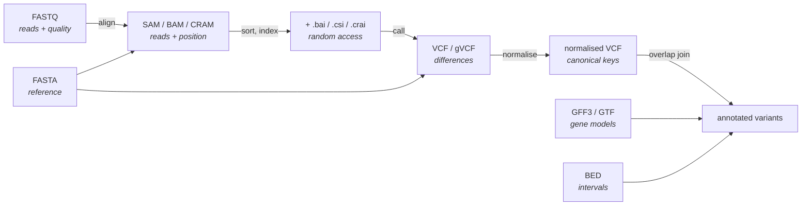

# 41 — Data formats and the toolchain

> **Before this:** [Ch 40 — Sequencing technologies](40-sequencing-technologies.md) ·
> [Ch 02 — DNA structure](../part-01-molecular-foundations/02-dna-structure.md) ·
> **Time:** ~50 min

## What you'll be able to do

- Read and hand-write FASTA, FASTQ, SAM, VCF, BED and GFF3 records without a reference sheet
- Convert a Phred quality score to an error probability and back, and diagnose a mis-encoded FASTQ
- Decode a SAM FLAG bitfield and a CIGAR string, compute the reference span of an alignment, and
  explain why a MAPQ threshold and a CRAM file are both meaningless without the aligner or the
  reference that produced them
- Explain why one variant has many valid VCF encodings, normalise it to the canonical one, and
  distinguish a missing VCF row from a gVCF reference block
- Convert an interval between 0-based half-open and 1-based inclusive without an off-by-one
- Explain how block compression plus a binning index gives random access into a compressed file
- Predict how a coordinate breaks when it crosses a build, a chromosome-naming convention or a
  sort order, and name the liftover failure that changes the alleles while the position lifts
  perfectly

## The core idea

There are about six formats and you will spend the rest of your genomics life in them. The
syntax is trivial — flat, line-oriented, tab-separated records with a header. The syntax is
not the point.

The point is that **each format encodes a claim, and the encoding of a claim is not unique.**
The same alignment can be written several ways. The same variant can be written several ways.
The same interval can be written two ways depending on where you think a coordinate points.
None of these ambiguities produce errors — they produce *silently wrong answers*, usually an
empty result set or a spuriously low overlap between two datasets.

So this chapter is only half about file layouts. The other half is about canonicalisation: the
handful of places where you must reduce a many-to-one representation to its unique normal form
before you compare anything. If you internalise one thing, make it this: **before you join two
genomic datasets on coordinates, you must agree on the build, the chromosome names, the
coordinate convention, and the variant normalisation. Three of those four fail silently.**

---

## 1. FASTA — a named sequence

```
>chr20 AC:CM000682.2 LN:64444167 rl:Chromosome M5:b18e6c531b0bd70e949a7fc20859cb01
ACGTTGCATTAGCCTAGGCTTAAGGCTCAGTTACGGATCCAGGTTACAGT
TTGACCAGTTACAGGATCCAGTTACAGGATCCAGTTACAGGATCCAGTTA
>chr21
NNNNNNNNNNNNNNNNNNNNNNNNNNNNNNNNNNNNNNNNNNNNNNNNNN
```

A `>` header line, then sequence wrapped at some fixed width. That is the whole format.

**Footguns.** The sequence *identifier* is everything up to the first whitespace — the rest is
free-text description, and half the pipeline failures in a beginner's life come from a tool
using `chr20` where another used the full header. Line wrapping is arbitrary but must be
*consistent* for a `.fai` index to work, because the index stores a byte offset, a line length
and a line width per record, and computes the file position of base *i* arithmetically. `N`
means "unknown base"; lowercase means "soft-masked repeat" in genome files and is otherwise
meaningless. There is no quality information and no coordinate system beyond "position within
this record".

## 2. FASTQ — a sequence with a confidence

```
@SRR1234567.42 HWI-D00360:5:H814YADXX:1:1101:1234:2104 length=8
ACGTTGCA
+
IIIIIH?5
 ^^^^^^^^
 └── one quality character per base, aligned 1:1 with line 2
```

Four lines per record: `@`-prefixed name, sequence, a `+` separator (historically repeating the
name), and quality. The name line ends at the first whitespace; anything after it is a comment
the sequencer chose to put there.

### Deriving the quality scale

A base caller does not emit "this base is a C". It emits a posterior over the four bases. What
you want stored alongside the call is *P*(the call is wrong), a number in (0, 1). Storing a
float per base is absurd — that is 4 bytes for a base you stored in 2 bits. So compress it the
way audio engineers compress amplitude: take the logarithm and quantise.

Define the **Phred quality score**:

$$Q = -10 \log_{10} P_{\text{error}} \qquad\Longleftrightarrow\qquad P_{\text{error}} = 10^{-Q/10}$$

The factor of 10 makes one unit of *Q* worth a factor of 10^(1/10) ≈ 1.26 in error rate, which
puts the useful range (1 in 2 to 1 in 10⁹) inside a single byte. The choice is arbitrary but
universal; you will meet the same transform again as VCF's `QUAL`, `GQ` and `PL` fields, and as
MAPQ.

| Q | P(error) | Base accuracy | Phred+33 char | Phred+64 char |
|---:|---:|---:|:---:|:---:|
| 0 | 1 | 0% | `!` | `@` |
| 10 | 0.1 | 90% | `+` | `J` |
| 20 | 0.01 | **99%** | `5` | `T` |
| 30 | 0.001 | **99.9%** | `?` | `^` |
| 40 | 0.0001 | **99.99%** | `I` | `h` |

### The ASCII offset, and the legacy trap

*Q* is stored as a single printable character: `chr(Q + 33)`. The offset is 33 because that is
where printable ASCII begins (`!`), so Q0 is the first usable glyph and the scale runs upward
through `~` (126) at Q93.

Between roughly 2004 and 2011, Illumina instruments used **Phred+64** instead. Same *Q*,
different offset. Nothing in the file declares which is in use.

Read a Phred+64 file as Phred+33 and every score comes out 31 too high: a genuinely mediocre
Q9 base is reported as Q40. Quality trimming does nothing, the variant caller believes
everything it is told, and you get a callset full of confident garbage with no error anywhere.
Read a Phred+33 file as Phred+64 and you get negative scores, which at least crashes.

The safe detection rule is one-sided: **any quality character below `:` (ASCII 58) proves
Phred+33**, because Phred+64 cannot encode below 64 (or 59 for the even older Solexa scale).
The mirror rule — "characters above `J` prove Phred+64" — used to work and is now wrong,
because modern long-read platforms legitimately emit qualities well above Q40. In practice:
assume Phred+33 unless the data predates 2011, and check the minimum character.

**Other footguns.** `@` is a legal quality character (Q31 in Phred+33), so you cannot find
record boundaries by looking for lines starting with `@` — you must count in fours. Paired-end
data lives in two files whose records must stay in the same order; any tool that filters one
without the other silently destroys the pairing.

## 3. SAM / BAM / CRAM — an alignment is a hypothesis

A SAM record does not say "this read came from here". It says "here is one hypothesis about
where this read came from, with a confidence". The distinction matters because one read can
generate several records.

```
@HD	VN:1.6	SO:coordinate
@SQ	SN:chr20	LN:64444167	M5:b18e6c531b0bd70e949a7fc20859cb01
@RG	ID:sampleA_L1	SM:sampleA	LB:lib1	PL:ILLUMINA
@PG	ID:aligner	PN:aligner	VN:1.0	CL:aligner ref.fa r1.fq r2.fq

read42	163	chr20	11	60	3S8M2D6M2I4M	=	301	310	tttACGTTGCAAGCCTAGGGGCT	IIIIIIIIIIIIIIIIIIIIIII	NM:i:4	AS:i:32	RG:Z:sampleA_L1
```

The header declares the sort order (`SO`), the reference sequences and their lengths and
checksums (`@SQ` — this is what makes a BAM self-describing about its coordinate space), the
read groups (`@RG` — which sample and library each record belongs to), and the chain of
programs that produced the file (`@PG`).

### The 11 mandatory fields

| # | Field | Meaning |
|---:|---|---|
| 1 | `QNAME` | Read name. Both mates of a pair share it |
| 2 | `FLAG` | Bitfield — see below |
| 3 | `RNAME` | Reference sequence name, or `*` |
| 4 | `POS` | **1-based** leftmost *aligned* base, or 0 |
| 5 | `MAPQ` | Phred-scaled confidence in the *position* |
| 6 | `CIGAR` | How the read aligns, op by op |
| 7 | `RNEXT` | Mate's reference (`=` means same) |
| 8 | `PNEXT` | Mate's `POS` |
| 9 | `TLEN` | Signed observed template length |
| 10 | `SEQ` | The read bases, as stored on the *reference forward strand* |
| 11 | `QUAL` | Phred+33 qualities, same orientation as `SEQ` |

Field 10 deserves a flag of its own: if the read aligned to the reverse strand, `SEQ` is the
**reverse complement of the sequenced read**, and `QUAL` is reversed to match. The original
read as it came off the instrument is not stored anywhere. Recovering FASTQ from a BAM means
undoing this.

### FLAG as a bitfield

This is the single most useful thing in the chapter to actually understand, because every
filtering decision you will ever make is a mask against it.

| Bit | Dec | Meaning |
|---|---:|---|
| `0x1` | 1 | Template has multiple segments (paired) |
| `0x2` | 2 | Each segment properly aligned, per the aligner |
| `0x4` | 4 | **This** segment is unmapped |
| `0x8` | 8 | **Next** segment is unmapped |
| `0x10` | 16 | `SEQ` is reverse-complemented |
| `0x20` | 32 | Next segment's `SEQ` is reverse-complemented |
| `0x40` | 64 | First segment in the template (read 1) |
| `0x80` | 128 | Last segment in the template (read 2) |
| `0x100` | 256 | Secondary alignment |
| `0x200` | 512 | Failed quality-control filters |
| `0x400` | 1024 | PCR or optical duplicate |
| `0x800` | 2048 | Supplementary alignment (chimeric part) |

Decoding `163` bit by bit:

```
163 = 0b0000_1010_0011

  bit  value  set?  meaning
  0x1      1   yes  paired
  0x2      2   yes  proper pair
  0x4      4    no  this segment IS mapped
  0x8      8    no  mate IS mapped
  0x10    16    no  this segment is on the FORWARD strand
  0x20    32   yes  mate is on the REVERSE strand
  0x40    64    no  not read 1
  0x80   128   yes  read 2
  0x100  256    no  primary alignment
  ...     ...   no
                    -------------------------------------------
                    a properly paired read 2, forward strand,
                    mate reverse — the canonical FR orientation
```

The four flags you will see constantly are `99`/`147` and `83`/`163`: the two ways a proper
FR pair can be laid out (read 1 forward / read 2 reverse, or read 1 reverse / read 2 forward).

Two distinctions that trip people up. **Secondary** (`0x100`) means "this read also aligns
here, but somewhere else was better" — an alternative hypothesis for the *whole* read.
**Supplementary** (`0x800`) means "part of this read aligns here and another part aligns
elsewhere" — a *split* alignment, which is how structural variants and fusion transcripts
show up. Secondary records may have no `SEQ` at all. Counting rows in a BAM does not count
reads; counting rows that clear `0x100|0x800` does — exactly one such row per read, mapped or
not. Add `0x4` to the mask only when you want *mapped* reads.

### CIGAR, with an alignment drawn out

The CIGAR is a run-length encoding of the edit script.

| Op | Consumes query | Consumes reference | Meaning |
|:---:|:---:|:---:|---|
| `M` | yes | yes | Aligned — match **or** mismatch |
| `=` / `X` | yes | yes | Explicit match / mismatch |
| `I` | yes | no | Insertion relative to the reference |
| `D` | no | yes | Deletion relative to the reference |
| `N` | no | yes | Skipped reference — an intron, in RNA-seq |
| `S` | yes | no | Soft clip — base present in `SEQ`, not aligned |
| `H` | no | no | Hard clip — base absent from `SEQ` entirely |
| `P` | no | no | Padding, for multiple alignments |

`M` meaning "match or mismatch" is a historical wart worth remembering: a CIGAR of `100M`
tells you nothing about whether the read matched.

The record above, `POS=11`, `CIGAR=3S8M2D6M2I4M`, against a toy reference:

```
ref coord   1         11        21          27        31
            |         |         |           |         |
REF         GGCATTACGA ACGTTGCA TT AGCCTA -- GGCT TAAG
READ        .......ttt ACGTTGCA -- AGCCTA GG GGCT
CIGAR              3S       8M  2D     6M 2I   4M
```

Everything you need falls out of the consumption table:

- **Read length** = sum of query-consuming ops = 3 + 8 + 6 + 2 + 4 = **23**, and this must
  equal `len(SEQ)`. It is a hard validity check.
- **Reference span** = sum of reference-consuming ops = 8 + 2 + 6 + 4 = **20**.
- **`POS` is 11, not 8.** Soft-clipped bases are in `SEQ` and occupy no reference. A very
  common bug is computing coverage from `POS` and `len(SEQ)`.
- **Reference end** (1-based, inclusive) = 11 + 20 − 1 = **30**.

### MAPQ, and why it is not portable

MAPQ is defined as −10 log₁₀ *P*(this alignment is at the wrong position), which sounds
precise. It is not, because the probability is over the aligner's own model of where else the
read might have come from, and no two aligners share that model.

In practice: 0 usually means "maps equally well somewhere else", and the *maximum* is
aligner-specific — around 60 for BWA-MEM and minimap2, 42 for Bowtie2. The spec reserves 255
for "unavailable", and STAR uses 255 to mean "uniquely mapped", which is the opposite of
unavailable. So `-q 30` is a different filter depending on what produced the file, and copying
a threshold out of someone else's pipeline is how you quietly discard half your data or none
of it. **Check what your aligner's MAPQ distribution actually looks like before thresholding
it.**

### Optional tags, and BAM versus CRAM

Everything after field 11 is `TAG:TYPE:VALUE`, with types `A` (char), `i` (int), `f` (float),
`Z` (string), `H` (hex), `B` (array). `NM` is edit distance, `AS` alignment score, `RG` read
group, `SA` the other pieces of a split alignment, `MD` the mismatch positions. Tags are how
every downstream tool smuggles its own state through — duplicate marking, base recalibration,
barcodes, UMIs and cell identities in single-cell data all live here.

| | Representation | Needs the reference? | Rough relative size |
|---|---|---|---|
| **SAM** | Plain text | no | 1 |
| **BAM** | Same records, binary, BGZF-compressed | no | ~0.3 |
| **CRAM** | Column-oriented, per-column codecs, **reference-differential** | **yes** | ~0.1–0.2 |

CRAM's central idea is that a read matching the reference contains almost no information: store
only the differences. That is a large win, and it comes with a hard dependency — the *exact*
reference, verified by the `M5` checksum in `@SQ`. A CRAM plus the wrong reference is not a
degraded file, it is an undecodable one. This is the reason CRAM archives carry reference
caches around with them. (These size ratios are order-of-magnitude teaching figures; the real
number depends overwhelmingly on whether quality scores were binned, which is usually the
dominant term.)

## 4. VCF — differences from a reference

A VCF does not describe a genome. It describes a **diff** against a named reference, per sample.

```
##fileformat=VCFv4.5
##reference=file:///refs/GRCh38.fa
##contig=<ID=chr20,length=64444167>
##INFO=<ID=AC,Number=A,Type=Integer,Description="Allele count in genotypes">
##FORMAT=<ID=GT,Number=1,Type=String,Description="Genotype">
##FORMAT=<ID=AD,Number=R,Type=Integer,Description="Depth per allele">
#CHROM POS   ID  REF  ALT   QUAL FILTER INFO      FORMAT     sampleA
chr20  1000  .   A    G     240  PASS   AC=1      GT:AD:DP   0/1:18,15:33
chr20  1105  .   ACGT A     180  PASS   AC=2      GT:AD:DP   1/1:0,29:29
chr20  1105  .   A    ACGT  180  PASS   AC=1      GT:AD:DP   0/1:14,12:26
chr20  2000  .   A    G,T   310  PASS   AC=1,1    GT:AD:DP   1/2:2,20,19:41
```

Eight fixed columns — `CHROM POS ID REF ALT QUAL FILTER INFO` — then, if there are genotypes,
a `FORMAT` column giving a colon-separated key list, then one column per sample. `QUAL` is
Phred again: −10 log₁₀ *P*(there is no variant here).

The `##INFO` and `##FORMAT` header lines are a **typed schema**, and reading them is the right
way to parse a VCF. `Number=A` means one value per ALT allele, `Number=R` one per allele
including REF, `Number=G` one per genotype, `Number=.` unknown. A parser that respects
`Number` handles multi-allelic sites correctly for free; one that splits on commas and hopes
does not.

### How REF/ALT encode SNVs and indels

A substitution is obvious: `POS=1000 REF=A ALT=G`. Indels are not, because VCF has no way to
write an empty allele. So every indel carries an **anchor base** — the reference base
immediately before the event:

```
deletion of CGT at 1106–1108:   POS=1105  REF=ACGT  ALT=A
insertion of CGT after 1105:    POS=1105  REF=A     ALT=ACGT
```

The anchor exists purely because the format is 1-based inclusive and cannot name the
zero-width position *between* two bases. (A BED file can: see §6.) Hold that thought — it is
the same fence-post problem wearing a different hat.

### Normalisation: the same variant, written many ways

Take a reference with a run of four T's:

```
pos    96 97 98 99 100 101 102 103 104
base    G  G  C  A   T   T   T   T   G
```

Delete one T. Every one of these VCF rows produces exactly the same alternate sequence:

```
99   AT   A          <- delete the T at 100
100  TT   T          <- delete the T at 101
101  TT   T          <- delete the T at 102
102  TT   T          <- delete the T at 103
99   ATT  AT         <- same thing, non-parsimoniously
```

They are all *correct*. They are all *different keys*. If you intersect two callsets on
`(CHROM, POS, REF, ALT)` — which is what essentially every join, allele-frequency lookup,
ClinVar match and polygenic-score computation does — those rows do not match each other, and
you get a false negative with no error message. Indels in repetitive sequence are common, and
repetitive sequence is where representation is most ambiguous, so this is not a corner case.

The fix is a canonical form, defined by two rules: **parsimonious** (no unnecessary bases) and
**left-aligned** (shifted as far left as possible while still describing the same sequences).
The algorithm:

```
loop:
    if all alleles end with the same base:
        truncate the rightmost base of every allele
    if any allele now has length 0:
        prepend the reference base at POS-1 to every allele;  POS -= 1
    else if the alleles no longer end with the same base:
        break

while all alleles start with the same base and all have length ≥ 2:
    truncate the leftmost base of every allele;  POS += 1
```

Run it on `102 TT T` and you get `99 AT A`: right-trim to `T`/`∅`, prepend T101; again, prepend
T100; again, prepend A99 — and now `AT`/`A` no longer share a final base, so the loop exits.
That is the canonical row, and it is what `bcftools norm -f ref.fa` (or any equivalent)
produces. Note where the `length ≥ 2` guard sits: on the left-trim only. It is what stops
parsimony from eating the anchor base. Put it on the right-trim as well and nothing shifts at
all, because one allele of an anchored indel always has length 1.

Two things to carry forward. First, **normalise before you compare, always** — including when
one side is a public database, since you cannot assume it was normalised the same way.
Second, left-alignment is a *convention*, not a truth: HGVS clinical nomenclature uses the
opposite 3′-most rule on the transcript, so for a gene on the minus strand the HGVS and VCF
representations of one deletion shift in opposite genomic directions. That mismatch is a
recurring source of confusion in
[Ch 55](../part-11-human-and-statistical-genomics/55-clinical-variant-interpretation.md).

### Multi-allelic sites and gVCF

Row 4 above has two ALT alleles and genotype `1/2` — the sample carries neither reference
allele. `AC=1,1` has one value per ALT (`Number=A`); `AD=2,20,19` has one per allele including
REF (`Number=R`). Tools that read `ALT` as a single string get this wrong. You can split
multi-allelics into biallelic rows, but that is lossy in a specific way — `1/2` becomes
`0/1` on two rows, and the "reference" in each row now includes a real alternate allele.
Splitting and joining are both routine operations; doing them without noticing is not.

**gVCF** solves a different problem. A plain VCF has rows only where there is a variant, so the
absence of a row is ambiguous: homozygous reference, or no coverage? For one sample you may not
care. For joint calling across thousands of samples you must, because a site variant in sample A
needs a genotype in sample B, and "no row" cannot supply one.

A gVCF therefore emits a record for *every* position, collapsing non-variant stretches into
**reference blocks** — a row with `ALT=<NON_REF>`, an `END=` in `INFO`, and a genotype quality
saying how confident the caller is that nothing is there. Blocks are banded by that confidence,
so a well-covered region costs a handful of rows. Joint genotyping then merges per-sample gVCFs,
and because each sample was processed once and independently, adding sample *N*+1 does not
require recomputing the other *N*. See
[Ch 46](../part-10-functional-genomics/46-variant-calling.md).

## 5. BED and GFF3/GTF — intervals and annotation

```
BED (0-based, half-open, tab-separated)
chrom  start  end     name       score  strand
chr20  1000   2000    enhancer1  960    +
chr20  5000   5300    exon_A     0      -
       ^^^^   ^^^^
       └──────┴── a 1000 bp feature: 2000 - 1000, no +1
```

BED's first three columns are mandatory and the remaining nine are positional, so you cannot
supply column 6 (strand) without supplying 4 and 5. In BED12, `blockStarts` are offsets
*relative to `chromStart`*, not absolute — a reliable source of wrong exon coordinates.

```
GFF3 (1-based, inclusive)
##gff-version 3
chr20  HAVANA  gene  1000  9000  .  +  .  ID=gene:ENSG00000001;Name=EXAMPLE1
chr20  HAVANA  mRNA  1000  9000  .  +  .  ID=tx:ENST00000001;Parent=gene:ENSG00000001
chr20  HAVANA  exon  1000  1200  .  +  .  ID=exon1;Parent=tx:ENST00000001
chr20  HAVANA  CDS   1050  1200  .  +  0  ID=cds1;Parent=tx:ENST00000001
                     ^^^^  ^^^^                 ^
                     start  end            phase: bases to skip to reach
                     (both included)       the first complete codon
```

Nine columns: `seqid source type start end score strand phase attributes`. The attributes
column carries `ID=` and `Parent=`, which makes a GFF3 file a serialised DAG — gene → transcript
→ exon/CDS — and the right way to load it is as a graph, not as rows. **GTF** is the older
cousin: same nine columns, but attributes are `gene_id "X"; transcript_id "Y";` and the
hierarchy is implicit in those keys rather than explicit in `Parent`. They look alike and are
not interchangeable. `phase` is the number of bases to skip to reach the next codon boundary,
which is *not* the same as the frame — sign errors here shift entire protein translations.

## 6. Coordinates — the section that matters most

Two conventions exist, they disagree, and no file announces which it uses.

The clean way to see it is that they number **different things**:

```
0-based ticks     0   1   2   3   4   5   6   7   8
   (interbase)    |   |   |   |   |   |   |   |   |
                  | A | C | G | T | A | C | G | T |
                  |   |   |   |   |   |   |   |   |
1-based numbers     1   2   3   4   5   6   7   8
   (the bases)
```

**0-based half-open** coordinates label the *boundaries between* bases, and an interval `[s, e)`
is the stretch between tick *s* and tick *e*. **1-based inclusive** coordinates label the
*bases themselves*, and `[s, e]` includes both endpoints.

The first four bases, `ACGT`, are therefore:

```
BED       chr1  0  4        # 0-based half-open
VCF/GFF   chr1  1  4        # 1-based inclusive
SAM       POS = 1, span 4   # 1-based inclusive
```

Note what changed: the **start decremented, the end did not**. That asymmetry is the entire
conversion, and forgetting the asymmetry — adding or subtracting 1 from both ends — is the
most common form of the bug.

Why half-open is the better engineering choice:

| Operation | 0-based half-open | 1-based inclusive |
|---|---|---|
| Length | `e - s` | `e - s + 1` |
| Adjacent intervals | `e₁ == s₂` | `e₁ + 1 == s₂` |
| Split at *k* | `[s,k)` + `[k,e)` | `[s,k]` + `[k+1,e]` |
| Empty interval | `s == e` — representable | not representable |
| Overlap test | `s₁ < e₂ && s₂ < e₁` | `s₁ ≤ e₂ && s₂ ≤ e₁` |
| Zero-width point | yes — an insertion site | no — hence VCF's anchor base |

It is the same reason Python slices and C array bounds are half-open: adjacent intervals share
an endpoint, so concatenation and splitting need no ±1, and empty is expressible. And why
1-based inclusive persists: it is how a person counts bases, and it predates the file formats
by a century.

| Format / interface | Convention |
|---|---|
| BED, bedGraph, BAM's *binary* `POS` field, `pysam` API | **0-based half-open** |
| SAM's *text* `POS` field, VCF, GFF3/GTF, WIG, GenBank | **1-based inclusive** |
| UCSC and Ensembl browser position boxes | **1-based inclusive** |
| Bioconductor `GenomicRanges` | **1-based inclusive** |

Read those rows carefully. `bedGraph` and `WIG` are siblings that disagree. SAM and BAM are the
same format in two encodings and disagree — htslib converts on the way in and out, which is
why the number you see in `samtools view` is one more than the number in the bytes. And `pysam`
and `GenomicRanges` will hand you different integers for the same feature in the same file,
correctly, by design. **A coordinate is not a number; it is a number plus a convention plus a
build.**

## 7. Indexing — the genome as a database

Sorting a file by coordinate turns it into a table with a primary key. Indexing turns it into a
table you can query.

Plain gzip is one continuous DEFLATE stream, so you cannot start decompressing in the middle:
random access costs a full scan. **BGZF** fixes this by making the file a *concatenation of
independent gzip members*, each holding at most 64 KiB of uncompressed data. Every member is a
legal gzip stream, so `gunzip` still works on the whole file — the format is backwards
compatible with readers that know nothing about it.

That buys the key primitive, a **virtual offset**: a 64-bit integer whose high 48 bits are the
byte offset of the block in the file and whose low 16 bits are the offset within the
decompressed block. Seeking to a record is: `fseek` to the block, inflate one block, index into
it. Constant time, one block of work.

The index (`.bai`, `.tbi`, `.csi`, `.crai`) maps genomic intervals to sets of virtual-offset
ranges. The scheme is a **static hierarchical binning** — effectively a segment tree with no
pointers, since bin identity is computed arithmetically from the coordinates:

```
level 0:  1 bin      covering 2^29 bp  (512 Mb)
level 1:  8 bins     covering 2^26 bp  (64 Mb)
level 2:  64 bins    covering 2^23 bp  (8 Mb)
level 3:  512 bins   covering 2^20 bp  (1 Mb)
level 4:  4096 bins  covering 2^17 bp  (128 kb)
level 5:  32768 bins covering 2^14 bp  (16 kb)
```

A feature is filed in the smallest bin that fully contains it, so a short read lands at level 5
and a spliced RNA-seq alignment spanning a large intron lands several levels up. A query for
`[a, b)` computes the small set of bins at each level that could overlap it — at most a few
dozen — and reads their chunks.

Binning alone has a flaw: a bin at the far left of the chromosome may contain records that all
end long before your query starts, and you would still fetch them. So the index also carries a
**linear index**: for each 16 kb window, the smallest virtual offset of any record that
*overlaps* that window. Intersecting the two gives a tight file range. **CSI** generalises the
scheme with a configurable shift and depth, which is what you need for chromosomes longer than
2^29 bp — BAI cannot index them at all.

The precondition for all of this is that the file is coordinate-sorted in the order declared by
its header. An index over an unsorted file is not an error; it is a wrong answer.

## 8. Builds, liftover, and the chromosome-naming tax

**A coordinate without a genome build is not a location.** `chr1:1,000,000` is three different
places in GRCh37, GRCh38 and T2T-CHM13. Between builds, sequence is inserted, removed, corrected
and occasionally re-oriented, so the offset between two builds varies along a chromosome and is
not even monotone everywhere. GRCh38 added alternate contigs for polymorphic regions; T2T-CHM13
added roughly 8% entirely new sequence including all centromeres
([reference/verified-facts.md](../reference/verified-facts.md),
[Ch 45](45-reference-genomes-and-pangenomes.md)).

**Liftover** maps coordinates between builds using chain files — blocks of alignment between
assemblies. It fails in four distinguishable ways, and only the first is loud:

1. The region is absent from the target build. The tool reports the failure.
2. The region maps to several places, or splits across chains. Usually reported.
3. The strand flips. A feature's sequence is now the reverse complement, and anything strand-
   dependent — a variant's alleles, a gene model — must be flipped too.
4. **The reference allele changed.** A base that was ALT in GRCh37 is REF in GRCh38. The
   coordinate lifts perfectly and the variant is now inside out: genotypes must be swapped, and
   in GWAS summary statistics the effect-size sign must be flipped. A tool that lifts the
   position and not the alleles produces a file that looks fine and is wrong.

Liftover is a convenience, not a substitute for re-aligning and re-calling on the target build.
Use it for looking things up; do not build an analysis on it.

**Chromosome naming** is the stupidest recurring failure in the field. UCSC writes `chr1`,
`chrX`, `chrM`. Ensembl and NCBI write `1`, `X`, `MT`. RefSeq writes `NC_000001.11`. These are
the same chromosomes. Intersect a `chr`-prefixed BED with a non-prefixed BAM and you get zero
overlaps, exit status 0, and no warning — a pipeline that silently produces an empty result is
worse than one that crashes. Worse still, hg19's `chrM` and GRCh37's `MT` are not merely
differently named: they are different sequences of slightly different lengths, so mitochondrial
coordinates do not transfer between two names for what is nominally the same build.

Sort order is the same tax again. Lexically, `chr10` precedes `chr2`; karyotypically it does
not. Two "sorted" files sorted differently will fail to merge, or merge wrongly. The convention
is to take the order from the file's own header, which is why tools ask for a genome file.

## 9. The toolchain, as ideas rather than commands

Three ideas, each with a canonical implementation you should treat as replaceable.

**A coordinate-indexed record store.** `samtools`/`bcftools` and the `htslib` library beneath
them are, conceptually, a single-table database: the primary key is `(chrom, pos)`, the storage
is block-compressed, the index supports range scans, and the query language is a region string
like `chr20:1,000,000-1,010,000`. Everything else — view, sort, merge, subset, pileup — is
selection, projection and aggregation over that table.

**Interval algebra.** `bedtools` is relational algebra whose join predicate is *overlap* rather
than equality. `intersect` is an inner join; `subtract` an anti-join; `merge` a reduce over
overlapping intervals; `map` a group-by across an overlap join; `closest` a nearest-neighbour
query. When both inputs are sorted the implementation is a linear sweep over two streams,
O(n + m); when they are not, it builds an interval tree and pays for it. This is why "sorted"
appears in so many flags.

**Streaming.** Records are independent and line-oriented, which makes most operations pure maps
and filters that compose through pipes without materialising intermediates — which matters when
the intermediate is 80 GB. Sorting is the one global barrier. The shape of nearly every genomics
pipeline follows from that single fact: **sort once, index once, stream forever.**



---

## Common misconceptions

| What people think | What's actually true |
|---|---|
| A BAM file contains the reads | It contains *alignment hypotheses*. One read can produce a primary, several secondary and several supplementary records; unmapped reads are still rows. Rows ≠ reads |
| Base qualities are calibrated probabilities | They are the instrument's estimate, and it is systematically biased by context and cycle. Base quality score recalibration exists precisely because raw Q30 is not a 0.1% error rate |
| MAPQ 30 means the same thing in every file | MAPQ is loosely specified. Maxima differ by aligner (~60 vs 42), and STAR uses 255 for "unique" where the spec reserves 255 for "unavailable" |
| Two files listing the same variant will share `POS/REF/ALT` | Only after normalisation. An indel in a repeat has many valid encodings, and unnormalised joins fail silently |
| A missing VCF row means homozygous reference | It means *not called* — which may be no coverage at all. Distinguishing the two is the entire reason gVCF exists |
| CRAM is a smaller BAM | CRAM stores differences from the reference. Without the exact reference — checksum-matched — the file cannot be decoded at all |
| Converting BED to VCF coordinates means adding 1 | Only the start changes. The end is the same integer in both conventions |
| The genome build is metadata | It is part of the coordinate. A position without a build does not identify a place |
| Sorting a genomic file is unambiguous | Lexical, karyotypic and header order all differ, and different tools assume different ones |
| `chr1` and `1` will be handled by the tools | They will produce zero overlaps and exit successfully |

## Worked example: one SAM record, fully decoded

```
read42	163	chr20	11	60	3S8M2D6M2I4M	=	301	310	tttACGTTGCAAGCCTAGGGGCT	IIIIIIIIIIIIIIIIIIIIIII	NM:i:4
```

**1 — FLAG.** 163 = 128 + 32 + 2 + 1 = `0x80|0x20|0x2|0x1`. Paired; proper pair; mate on the
reverse strand; read 2. `0x10` is clear, so *this* segment is on the forward strand and `SEQ`
is as sequenced. `0x100` and `0x800` are clear, so this is the primary alignment.

**2 — CIGAR consumption.** Query-consuming: 3(S) + 8(M) + 6(M) + 2(I) + 4(M) = **23** = `len(SEQ)`. ✓
Reference-consuming: 8(M) + 2(D) + 6(M) + 4(M) = **20**.

**3 — Span.** `POS` = 11 is 1-based and is the first *aligned* base; the three soft-clipped
bases sit off the left end and consume nothing. Reference end = 11 + 20 − 1 = **30**. The
alignment covers chr20:11–30 inclusive, 20 bp.

**4 — As a BED interval.** Start decrements, end does not:

```
chr20   10   30   read42   60   +
        ^^   ^^                  ^
        11-1  30                 0x10 clear → forward strand
```
Length check: 30 − 10 = 20. ✓ Had we decremented both ends we would have written
`chr20 10 29` and claimed 19 bp of coverage, which is exactly the error that makes two
people's coverage tracks disagree by one base everywhere.

**5 — What `NM:i:4` says.** Edit distance 4: the 2 bp deletion plus the 2 bp insertion. There
are no mismatches — but the CIGAR alone could not have told us that, because `M` is silent on
the question.

**6 — Now the variants.** The deletion at reference 19–20 must be written with an anchor base,
so it enters a VCF as `POS=18 REF=<base18><base19><base20> ALT=<base18>`, and must then be
left-aligned: if base 18 is itself a T, the run extends leftward and the canonical `POS` moves
with it. The insertion after reference 26 becomes `POS=26 REF=<base26> ALT=<base26>GG`, and
left-aligns the same way. Two different coordinate conventions and one normalisation step, in a
single 23 bp read.

## Connections

- **Back to:** [Ch 40 — Sequencing technologies](40-sequencing-technologies.md) produces the
  FASTQ; [Ch 02 — DNA structure](../part-01-molecular-foundations/02-dna-structure.md) explains
  why strand and orientation are meaningful at all
- **Forward to:** [Ch 42 — Read alignment](42-read-alignment.md) generates SAM and defines what
  MAPQ is estimating · [Ch 44 — Annotation](44-annotation.md) produces GFF3 ·
  [Ch 45 — Reference genomes and pangenomes](45-reference-genomes-and-pangenomes.md) explains
  why builds change and what replaces linear coordinates ·
  [Ch 46 — Variant calling](../part-10-functional-genomics/46-variant-calling.md) produces VCF
  and gVCF · [Ch 55 — Clinical variant interpretation](../part-11-human-and-statistical-genomics/55-clinical-variant-interpretation.md)
  depends on normalisation being right, and on the HGVS/VCF shift-direction conflict

## Check yourself

**1. A FASTQ has a minimum quality character of `B` (ASCII 66) and a maximum of `h` (104). Phred+33 or Phred+64? What breaks if you guess wrong?**

<details><summary>Answer</summary>

Almost certainly Phred+64. No character falls below 64, and `h` = Q40 on the +64 scale but
Q71 on the +33 scale, which is implausibly good for short-read data. (Note the evidence is
circumstantial — the one-sided rule only ever *proves* Phred+33, by finding a character below
ASCII 58.)

Reading it as Phred+33 inflates every score by 31. Quality trimming and filtering become
no-ops, and any downstream model that uses base quality as a likelihood — variant callers,
consensus callers — becomes wildly overconfident. Nothing errors. You get a clean-looking
callset with an elevated false-positive rate and no clue why.

</details>

**2. Decode FLAG 147. Which of the four canonical proper-pair flags is its partner?**

<details><summary>Answer</summary>

147 = 128 + 16 + 2 + 1 = `0x80|0x10|0x2|0x1`: paired, proper pair, this segment reverse-
complemented, read 2. Primary alignment, both segments mapped.

Its mate is FLAG 99 = 64 + 32 + 2 + 1: paired, proper, mate reverse, read 1, forward strand.
So 99/147 is read 1 forward / read 2 reverse; the other canonical pair, 83/163, is the
mirror image.

</details>

**3. A GFF3 exon is `start=1000, end=1200`. Give the BED line, and state its length. Why does only one endpoint change?**

<details><summary>Answer</summary>

`chr20  999  1200`, length 1200 − 999 = **201 bp**. Check against GFF3: 1200 − 1000 + 1 = 201. ✓

Only the start changes because the two systems label different objects. 1-based numbers name
bases; 0-based numbers name the boundaries *between* bases. The boundary immediately before
base 1000 is tick 999, and the boundary immediately after base 1200 is tick 1200 — which is
already the GFF3 end value. Decrementing both ends is the classic bug and yields 200 bp.

</details>

**4. Two labs call the same 1 bp deletion in a homopolymer run. Lab A reports `chr7 100 GT G`; lab B reports `chr7 103 TT T`. Are these the same variant? What must you do before comparing the files, and why is this not merely tidiness?**

<details><summary>Answer</summary>

They may well be the same variant — in a run of T's, deleting any single T yields the same
alternate sequence, so every anchor position in the run is a valid encoding. You cannot tell
from the rows alone; you need the reference.

Normalise both files against the same reference FASTA (left-align, then make parsimonious).
Both collapse to the same canonical row, and only then can you join on
`(CHROM, POS, REF, ALT)`.

It is not tidiness because the failure is silent. Unnormalised, the join simply misses the
match: the variant appears private to each lab, drops out of concordance metrics, misses its
gnomAD frequency and its ClinVar annotation, and is scored as absent by any polygenic score
keyed on position and alleles. No tool reports an error, because nothing is malformed.

</details>

**5. Why can you not build a tabix index over a plain `gzip`-compressed VCF? And given binning, why does the index also need a linear index?**

<details><summary>Answer</summary>

gzip is a single continuous DEFLATE stream: symbols are coded against state accumulated from
the start of the file, so there is no byte offset you can jump to and begin decoding. Random
access costs a full decompression. BGZF solves it by making the file a concatenation of
independent gzip members of ≤ 64 KiB each, so any member can be inflated on its own — which is
what makes a virtual offset (block offset ‖ within-block offset) a usable seek target.

The linear index exists because binning tells you which bins *could* contain overlapping
records, not where those records sit in the file. A large bin near the start of the chromosome
may hold only records that end long before your query begins, and you would fetch and discard
them. The linear index stores, per 16 kb window, the smallest virtual offset of any record that
*overlaps* that window, giving a lower bound on where to begin reading. Overlap, not start, is
what makes that bound safe: a long record — a spliced RNA-seq alignment, say — that begins in
an earlier window and reaches into yours is counted in every window it touches, so the bound
never seeks past it. Bins bound the query in coordinate space; the linear index bounds it in
file space.

</details>
