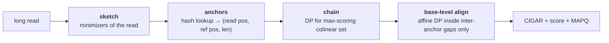

# 42 — Read alignment

> **Before this:** [Ch 40 — Sequencing technologies](40-sequencing-technologies.md) ·
> [Ch 41 — Data formats](41-data-formats.md) ·
> [Ch 39 — Genome landscapes](39-genome-landscapes.md) · **Time:** ~55 min

## What you'll be able to do

- Give the complexity argument for why naive scanning cannot align a human genome, in core-years, then build a Burrows–Wheeler transform by hand and run backward search over an FM-index
- Explain why an index that answers exact queries in *O*(*m*) does not solve read alignment, and what seed-and-extend adds
- Write the alignment recurrence with affine gaps, say what biology the affine form encodes that a linear penalty cannot, and explain why an intron needs a gap state of its own rather than a cheap deletion
- Derive MAPQ as a softmax over candidate positions, and say precisely why it is not comparable across aligners
- Separate the alignment failures a better algorithm could fix from the ones that are information limits set by read length
- Predict the direction in which reference bias shifts allele balance at a heterozygous site, and explain why it is a bias that depth estimates more precisely rather than removes
- Diagnose a BAM from its insert-size, MAPQ, soft-clip and coverage distributions, and read a soft-clip pile-up at one coordinate as a structural-variant breakpoint rather than a bad read

## The core idea

You have 600 million short strings and one 3.1-billion-character string. Put each short string
back where it came from. Each one may differ from the reference by sequencing error, by
inherited variation, and by somatic mutation; some came from sequence the reference doesn't
contain; some came from places the reference contains a million times over.

Two facts organise everything that follows.

**Exact matching is easy and approximate matching is expensive.** An index over the reference
can answer "where does this exact string occur?" in time proportional to the *pattern* length —
independent of the genome's size. Answering "where does this string occur with up to five
differences?" has no such index. Dynamic programming solves it, in time proportional to the
product of the two lengths, which against 3.1 Gb is absurd.

So every read aligner ever built has the same architecture: **use a fast exact index to
nominate a handful of candidate locations, then pay for expensive approximate alignment only
at those candidates.** Seed, then extend. Everything else — which index, which seeds, which
scoring, which acceleration — is engineering inside that skeleton.

The second fact is the one that keeps biting people downstream:

> **An aligner does not find where a read came from. It reports the best-scoring place the read
> could have come from, in a reference that is not the genome the read came from.** Those differ
> whenever the true locus is repeated, diverged, or absent — which is exactly where the
> interesting variation lives.

---

## 1. The problem, and why the obvious algorithm fails

Fix the scale first. A 30× human genome is 30 × 3.1 Gb ≈ 93 Gb of sequence; at 150 bp per read
that is **620 million reads** ([Ch 40](40-sequencing-technologies.md)).

Naive exact search, per read: slide the read along the reference, comparing characters, and do
it on both strands because the read came from an unknown one. There are ~3.1 × 10⁹ start
positions × 2 strands. At each you compare until a mismatch; over a random 4-letter sequence the
expected number of comparisons before mismatching is Σ(1/4)^i ≈ 4/3 — you need an (*i*+1)-th
comparison only if the first *i* characters all matched. So:

```
per read     6.2e9 positions × 1.33 comparisons  ≈ 8.3e9 character comparisons
whole run    620e6 reads × 8.3e9                 ≈ 5.1e18 comparisons
at 1e9 cmp/s 5.1e9 core-seconds                  ≈ 162 core-years
```

That is for *exact* matching, which is not the problem. Do it properly — full dynamic
programming of each read against the whole reference — and you need 150 × 3.1 × 10⁹ ≈ 4.7 × 10¹¹
cells per read, 2.9 × 10²⁰ cells in total. Even at 10¹⁰ cells/s with SIMD already applied,
that's about **900 core-years**.

Real aligners do a 30× human genome in the order of a hundred CPU-hours. The gap is four orders
of magnitude, and it is not constant-factor engineering. It comes from replacing a scan with an
index, and from confining the quadratic algorithm to windows a few hundred bases wide.

## 2. Exact matching: suffix structures and the memory wall

A **suffix tree** over the reference is the classical answer: a compressed trie of all suffixes,
which locates any pattern *P* in *O*(|*P*|) and can be built in *O*(*n*). Complexity-wise it is
perfect. Space-wise it is fatal. Even carefully engineered implementations need roughly 15–20
bytes per input character, so a human genome costs **45–60 GB** of RAM. In 2008, when the first
short-read aligners appeared, that was a supercomputer.

A **suffix array** — the sorted list of starting positions of all suffixes — throws away the
tree structure and keeps the order. Binary search finds a pattern in *O*(|*P*| log *n*). The
space is one integer per position, and here the arithmetic turns nasty: 3.1 × 10⁹ exceeds 2³¹,
so 32-bit indices don't reach, and you pay 8 bytes (or 5, packed):

```
suffix array   3.1e9 positions × 8 bytes            = 24.8 GB
+ the text     3.1e9 bases × 2 bits                 =  0.8 GB
                                                    ─────────
                                                      ~25 GB
```

Twenty-five gigabytes to index a genome that is 780 MB packed. The index is **thirty times
larger than the data it indexes**, and that ratio, not the asymptotics, is why plain suffix
arrays lost. The whole point of the next section is to get the query behaviour of a suffix array
at something near the size of the compressed text.

## 3. The Burrows–Wheeler transform and the FM-index

### Building it

The BWT is a reversible permutation of a string. Append a terminator `$` that sorts before every
other character, write down all rotations, sort them, and read off the last column.

```
T = GATTACA$

  rotations               sorted rotations         F         L      SA
  --------------          ----------------        ---       ---     --
  GATTACA$                $GATTACA                 $    ...   A       7
  ATTACA$G                A$GATTAC                 A         C        6
  TTACA$GA                ACA$GATT                 A         T        4
  TACA$GAT      sort →    ATTACA$G                 A         G        1
  ACA$GATT                CA$GATTA                 C         A        5
  CA$GATTA                GATTACA$                 G         $        0
  A$GATTAC                TACA$GAT                 T         T        3
  $GATTACA                TTACA$GA                 T         A        2

BWT(T) = L = A C T G A $ T A
```

Two columns matter. **F** is the first column: the sorted characters of *T*, so it is fully
described by four integers. **L** is the last column: the BWT itself. And because sorting the
rotations is the same as sorting the suffixes, the row order *is* the suffix array — column
`SA` above is exactly the suffix array of `GATTACA$`.

Note that `L[i]` is the character immediately *preceding* the suffix that begins row *i*. That
is the whole trick.

### LF-mapping

Define, for character *c*:

- `C[c]` = the number of characters in *T* strictly smaller than *c* — equivalently, the row
  where *c*'s block in **F** begins.
- `Occ(c, i)` = the number of occurrences of *c* in `L[0..i−1]`.

```
counts   $:1  A:3  C:1  G:1  T:2
C[]      $:0  A:1  C:4  G:5  T:6
```

**Last-to-First mapping.** `LF(i) = C[L[i]] + Occ(L[i], i)` gives the row of the rotation you
get by moving `L[i]` to the front.

Why it works: take all rows ending in `A`. Rotate each one right — now they all start with `A`,
and what follows is each row's old prefix. Sorting by "`A` then old prefix" gives the same order
as sorting by old prefix alone. **So the *i*-th occurrence of *c* in L corresponds to the *i*-th
occurrence of *c* in F.** That order-preservation is the entire content of the BWT for our
purposes.

```
LF(0): L[0]=A → C[A]+Occ(A,0) = 1+0 = 1     row 0 "$GATTACA" → "A$GATTAC" = row 1  ✓
LF(2): L[2]=T → C[T]+Occ(T,2) = 6+0 = 6     row 2 "ACA$GATT" → "TACA$GAT" = row 6  ✓
LF(5): L[5]=$ → C[$]+Occ($,5) = 0+0 = 0     row 5 "GATTACA$" → "$GATTACA" = row 0  ✓
```

Iterating `LF` walks the text backwards one character at a time, which is how you recover *T*
from its BWT — and how you recover a *position* from a row without storing the full suffix array.

### Backward search

Now the payoff. Every occurrence of a pattern *P* in *T* is a suffix beginning with *P*, and
because the rows are sorted, those suffixes occupy one **contiguous range of rows**. Extend the
pattern by one character on the *left* and the range updates in *O*(1):

$$sp' = C[c] + \mathrm{Occ}(c,\, sp), \qquad ep' = C[c] + \mathrm{Occ}(c,\, ep)$$

Searching `ACA`, right to left, with `[sp, ep)` half-open:

```
step  c    sp                        ep                        range   matched  count
init  –    0                         8                         [0,8)   ""         8
 1    A    C[A]+Occ(A,0) = 1+0 = 1   C[A]+Occ(A,8) = 1+3 = 4   [1,4)   "A"        3
 2    C    C[C]+Occ(C,1) = 4+0 = 4   C[C]+Occ(C,4) = 4+1 = 5   [4,5)   "CA"       1
 3    A    C[A]+Occ(A,4) = 1+1 = 2   C[A]+Occ(A,5) = 1+2 = 3   [2,3)   "ACA"      1
```

One occurrence, at row 2, and `SA[2] = 4`: `T[4..6] = ACA`. ✓

And a pattern that isn't there — `CAT`:

```
 1    T    6+Occ(T,0)=6+0 = 6        6+Occ(T,8)=6+2 = 8        [6,8)   "T"        2
 2    A    1+Occ(A,6)=1+2 = 3        1+Occ(A,8)=1+3 = 4        [3,4)   "AT"       1
 3    C    4+Occ(C,3)=4+1 = 5        4+Occ(C,4)=4+1 = 5        [5,5)   —          0
```

**The range empties the instant the pattern stops existing.** Remember that; it reappears twice,
once as the mismatch problem and once as the seed-termination rule.

Cost: |*P*| steps, each two rank queries. Rank in *O*(1) needs occurrence checkpoints stored
every 128–256 positions and a popcount over the gap. Recovering an actual coordinate from a row
needs the suffix array, which we refused to store — so store every 32nd entry and walk `LF`
until you land on a sampled row, adding *O*(sample interval) per reported hit.

### The space, finally

```
BWT             3.1e9 × 2 bits                          = 775 MB
Occ checkpoints every 256 positions, 4 counters × 8 B   = 388 MB
sampled SA      every 32nd row × 8 bytes                = 775 MB
                                                        ─────────
                                                          ~1.9 GB per strand
```

Both strands, plus overheads: roughly 4–5 GB, which is why `bwa index` on GRCh38 emits about
that much and `bwa mem` runs comfortably on a laptop. Compare with 25 GB for the plain suffix
array and 45–60 GB for the suffix tree. **Same query behaviour, an order of magnitude less
memory.** That is the reason short-read alignment became routine rather than institutional.

*(Implementations: `bwa`, `bowtie2`, and the FM-index inside many others. `bwa-mem2` spends more
memory on an expanded index to buy speed — a different point on the same curve.)*

## 4. From exact to approximate: seed-and-extend

Now be precise about what we have not solved. Backward search finds **exact** occurrences. A real
150 bp read carries, on average, ~0.15 sequencing errors (Illumina at ~0.1% per base,
[Ch 40](40-sequencing-technologies.md)) and ~0.15 inherited differences from the reference (~1 per
1,000 bp). So most reads *do* match exactly. But at ~0.2% per base, 1 − 0.998¹⁵⁰ ≈ **26%** carry
at least one difference and their exact FM range is empty — 160 million reads in a 30× genome, and
not a random 160 million: they are precisely the reads carrying the variation you sequenced to
find. An aligner that can only match exactly discards the entire signal.

You could backtrack: at each mismatch, branch to the other three characters and continue. That
was Bowtie 1's approach and it works for two or three mismatches. It does not scale — the search
space for *k* mismatches in a read of length *m* is

$$\binom{m}{k}3^k \;=\; \binom{150}{5}3^5 \approx 5.9\times10^8 \times 243 \approx 1.4\times10^{11}$$

per read. And indels make it worse, since they shift the register of everything downstream.

### The pigeonhole argument

**If a read of length *m* aligns to some locus with at most *k* differences, and you cut the read
into *k*+1 non-overlapping pieces, then at least one piece matches that locus exactly.** *k*
differences cannot touch *k*+1 disjoint pieces.

So: find exact matches of short pieces (**seeds**) using the index — cheap — and use them as
candidate anchors. Then run expensive approximate alignment only in the neighbourhood of an
anchor. This is **seed-and-extend**, and it is the skeleton of every practical aligner.

### How long should a seed be?

Two constraints squeeze from opposite sides.

**From below**, a seed must be long enough to be informative. The expected number of occurrences
of a random *k*-mer in 6.2 Gb of searchable sequence (both strands) is 6.2 × 10⁹ / 4^*k*:

| *k* | 4^*k* | expected hits | verdict |
|---:|---:|---:|---|
| 12 | 1.7 × 10⁷ | ~370 | every seed is a false lead |
| 16 | 4.3 × 10⁹ | ~1.4 | the break-even point |
| 19 | 2.7 × 10¹¹ | ~0.02 | essentially unique |
| 25 | 1.1 × 10¹⁵ | ~6 × 10⁻⁶ | unique with room to spare |

The crossover at log₄(6.2 × 10⁹) ≈ 16.3 is a hard structural fact about a 3 Gb genome, and it
is why nobody seeds with 12-mers.

**From above**, the pigeonhole bound: with *k* differences tolerated in *m* bases, seeds can be
at most *m*/(*k*+1). For a 150 bp read and *k* = 5, that is 25 bp.

The window is therefore roughly **17–25 bp**, and it is not a coincidence that BWA-MEM's default
minimum seed length is 19.

### Variable-length seeds

Fixed-length seeding wastes the index's real capability. BWA-MEM instead finds **super-maximal
exact matches (SMEMs)**: start at a read position and extend the backward search until the FM
range empties — the stopping rule from §3 — then record the longest exact match that is not
contained in another. In unique sequence you get long, rare seeds and one candidate locus; in
repetitive sequence the seeds are short and hit thousands of places, and the aligner caps how
many it will follow. The seed length adapts to local repetitiveness for free, because the
index's range size *is* a repetitiveness measure.

## 5. Extension: dynamic programming and its accelerations

At a candidate locus you now need the best alignment of read to reference, with mismatches and
gaps. This is the classical problem, and the reader knows the algorithm; what matters here is
the scoring, because the scoring is where the biology enters.

**Needleman–Wunsch** (global — both sequences aligned end to end):

$$H_{i,j} = \max\begin{cases} H_{i-1,j-1} + s(x_i, y_j) \\ H_{i-1,j} - d \\ H_{i,j-1} - d \end{cases} \qquad H_{i,0} = -id,\quad H_{0,j} = -jd$$

**Smith–Waterman** (local — best-scoring substring pair) adds `0` to the max and zeroes the
boundaries, so a bad prefix is abandoned rather than carried. Both are *O*(*mn*) time; *O*(*mn*)
space for traceback, *O*(min(*m*,*n*)) if you only want the score, and *O*(*m*+*n*) for traceback
too via divide-and-conquer.

Read alignment is neither, quite. You want the *whole read* placed if possible (global in the
read) but you have no idea which slice of the reference is involved (local in the reference) —
"semi-global" or glocal. Local scoring returns as soon as an end of the read genuinely doesn't
belong: adapter, chimera, or a structural breakpoint. That decision is what produces soft
clipping in the CIGAR ([Ch 41](41-data-formats.md)).

### Affine gaps, and the biology in them

A **linear** gap penalty charges *d* per gapped base. It is wrong, and the reason is mechanistic.
Indels are not made one base at a time. Polymerase slippage in a homopolymer or short tandem
repeat deletes or duplicates a unit in a single event; a transposable element inserts kilobases
in one event ([Ch 19](../part-03-genome-instability/19-transposable-elements.md)); non-allelic
homologous recombination deletes megabases in one event
([Ch 20](../part-03-genome-instability/20-chromosome-abnormalities.md)). The probability of a
length-*L* gap is nothing like (per-base indel rate)^*L*.

An **affine** penalty charges *o* to open and *e* per base to extend: cost = *o* + *Le*, with
*o* ≫ *e*. Take BWA-MEM's defaults (*o* = 6, *e* = 1) against a linear penalty of 2/base:

| Hypothesis | Events | Affine cost | Linear (2/base) cost |
|---|---:|---:|---:|
| one 12 bp gap | 1 | 6 + 12 = **18** | **24** |
| twelve separate 1 bp gaps | 12 | 12 × 7 = **84** | **24** |

The linear scheme **cannot distinguish them**. One slippage event and twelve independent events
get identical scores, though their prior probabilities differ by many orders of magnitude. The
affine scheme prefers the single event by a factor of ~4 in score, which is the correct
inductive bias, and it is the only thing standing between you and alignments littered with
scattered one-base gaps around every real indel.

Gotoh's recurrence gets affine gaps at the same asymptotic cost by tracking three matrices —
`H` (ends aligned), `E` (ends in a gap in one sequence), `F` (gap in the other):

$$E_{i,j} = \max(E_{i,j-1} - e,\; H_{i,j-1} - o - e), \qquad F_{i,j} = \max(F_{i-1,j} - e,\; H_{i-1,j} - o - e)$$
$$H_{i,j} = \max(H_{i-1,j-1} + s(x_i,y_j),\; E_{i,j},\; F_{i,j},\; 0)$$

Long-read aligners go further, to a **two-piece affine** cost, min(*o*₁+*Le*₁, *o*₂+*Le*₂) with
*o*₂ large and *e*₂ tiny. Short gaps are charged normally; kilobase gaps become affordable
without also making a hundred small gaps free. That is what lets one long read span a structural
variant and represent it as a single `I` or `D` operation
([Ch 46](../part-10-functional-genomics/46-variant-calling.md)).

### Banding, X-drop, SIMD

Three accelerations, each exploiting a different structural fact.

**Banding.** If the alignment has at most *d* net indels, every cell that matters satisfies
|*i* − *j*| ≤ *d*. Compute only that diagonal band: *O*(*md*) instead of *O*(*m*²). For a 150 bp
Illumina read a band of ±20 is generous; for a 20 kb nanopore read with a few percent indel rate
a fixed band fails, and **adaptive banding** — recentre the band on the current best diagonal
each row — is what actually works.

**X-drop.** Stop extending when the running score falls *X* below the best seen so far. This
bounds extension without knowing where the alignment should end, and it is what turns "extend
from a seed" into a terminating procedure.

**SIMD.** Cells on an anti-diagonal are independent, which Wozniak's layout exploits directly at
the cost of poor memory locality. Farrar's **striped** layout is what everyone uses: precompute a
query profile, process the query in interleaved stripes, and handle the awkward left-to-right
dependency of the `F` term in a lazy correction loop that usually runs zero iterations.
Difference-encoding (store adjacent-cell differences, which stay small) keeps values inside 8-bit
lanes, giving 16 lanes per register. Together these buy roughly an order of magnitude, and they
are why a quadratic algorithm is tolerable at all. For pure edit distance, Myers' bit-parallel
algorithm does *O*(*mn*/*w*) with no scoring flexibility.

## 6. Long reads: minimizers, sketching, and seed-chain-align

Long reads broke the short-read design. When PacBio CLR and early nanopore reads carried 10–15%
error, exact seeding was hopeless in the obvious way. The arithmetic: at 10% per-base error, the
probability that a given *k*-mer is error-free is (0.9)^*k*.

```
k = 100    0.9^100 = 2.7e-5      a 20 kb read contains ~0.5 exact 100-mers  → none
k =  15    0.9^15  = 0.206       a 20 kb read contains ~4,100 exact 15-mers → plenty
```

Short *k*-mers survive errors; there are just far too many of them to index and match densely
against a 3 Gb genome.

**Minimizers** solve this. Slide a window of *w* consecutive *k*-mers; select the one with the
smallest hash value. Store only selected *k*-mers.

Two properties do all the work:

1. **Consistency.** Selection depends on window *content*, not on position. Two sequences that
   share a stretch of ≥ *w*+*k*−1 identical bases are guaranteed to select the same *k*-mer from
   the window inside that stretch — the minimum of a set is the minimum whoever computes it. This
   is precisely what "keep every 10th *k*-mer" fails to give you: a one-base indel upstream
   shifts the phase and the two sketches desynchronise permanently.
2. **Sparsity.** For random sequence the density of selected *k*-mers is ≈ 2/(*w*+1). At *w* = 10
   you index about 18% of positions — a fivefold reduction in index size and in the number of
   candidate matches, at no cost in sensitivity for matches long enough to contain a window.

The consequence is **seed-chain-align**, minimap2's structure and now everyone's:



Chaining is a one-dimensional DP over anchors sorted by reference position:
*f*(*i*) = max over predecessors *j* of [*f*(*j*) + match(*i*) − gap(|Δq − Δr|)]. Naively
*O*(*n*²); restricted to the nearest ~25–50 predecessors it is effectively linear, and the
restriction is safe because a genuine alignment's anchors are close together.

The crucial economy is the last step. Base-level DP runs **only inside the gaps between chained
anchors** — a few hundred bases at a time — so the quadratic cost is paid on kilobase windows
rather than on 20,000 × 3.1 × 10⁹. A sparse, *consistent* seed set is what made long-read mapping
tractable, and the same sketching idea underpins overlap detection in assembly
([Ch 43](43-genome-assembly.md)) and *k*-mer-based metagenomic classification.

## 7. Spliced and split alignment

An mRNA-derived read aligned to the *genome* contains gaps that are not indels. Introns are
10²–10⁶ bp of reference the read legitimately skips
([Ch 06](../part-01-molecular-foundations/06-rna-processing.md)). Charge them as deletions and
every junction-spanning read soft-clips instead — losing exactly the reads that carry isoform
information.

A spliced aligner therefore adds a distinct gap state whose cost is nearly independent of length,
gated by evidence that a real intron is there:

- **Splice motifs.** The overwhelming majority of human introns begin `GT` and end `AG`; a small
  fraction are `GC…AG`, and a rare class served by the minor spliceosome is `AT…AC`. A motif
  bonus is what stops the near-free intron state from being used to explain any inconvenient
  sequence.
- **Junction discovery in two passes.** Pass 1 collects junctions supported across all reads;
  pass 2 re-aligns with that set as a temporary annotation, so reads with only a few bases past
  the junction can be placed. (STAR's design; HISAT2 reaches the same place differently.)
- **Annotation guidance**, which is a bias worth naming: supplying known junctions improves
  sensitivity for known isoforms and thereby *under*-detects novel ones.

The CIGAR distinguishes them: `N` claims an intron, `D` claims a deletion
([Ch 41](41-data-formats.md)). That is a claim about mechanism, made by an aligner, that
propagates into every downstream count.

One genetics-specific trap deserves its own line. **Processed pseudogenes** are retrotransposed
copies of mRNA — spliced sequence written back into the genome, intronless
([Ch 19](../part-03-genome-instability/19-transposable-elements.md)); GENCODE 50 annotates
14,702 pseudogenes. A spliced read from the parent gene matches such a retrocopy *contiguously
and perfectly*, while matching the parent only via a large gap. Unless the intron state is nearly
free and the retrocopy has diverged, the aligner picks the pseudogene. Expression gets attributed
to the wrong locus, and it looks like clean data.

**Split alignment** is the DNA analogue: allow the two halves of a read to align to arbitrarily
distant loci, different strands, even different chromosomes. Reported as a primary plus
**supplementary** records sharing an `SA` tag, this is the raw signal for structural variants and
gene fusions ([Ch 46](../part-10-functional-genomics/46-variant-calling.md)).

## 8. MAPQ: a probability, and why yours isn't mine

MAPQ is Phred-scaled: MAPQ = −10 log₁₀ *P*(this alignment is at the wrong position). Derive it
and the caveats fall out.

Let the candidate positions be *x*₁ … *x*ₙ with alignment scores *S*₁ … *Sₙ*. Treat scores as
log-likelihoods on some scale λ and put a uniform prior over positions:

$$P(x_i \mid r) = \frac{e^{S_i/\lambda}}{\sum_j e^{S_j/\lambda}}$$

A softmax over candidate loci. With the best two candidates dominating and Δ = *S*₁ − *S*₂:

$$P(\text{best is correct}) = \frac{1}{1 + e^{-\Delta/\lambda}}, \qquad P(\text{wrong}) \approx e^{-\Delta/\lambda}$$

$$\mathrm{MAPQ} \approx \frac{10}{\ln 10}\cdot\frac{\Delta}{\lambda} = 4.34\,\frac{\Delta}{\lambda}$$

**MAPQ is essentially the score gap to the runner-up, rescaled.** Three consequences.

**It measures ambiguity, not correctness.** A read whose true locus is absent from the reference
can align uniquely and well somewhere else, with a large Δ, and receive the maximum MAPQ. High
MAPQ says "nowhere else in *this* reference explains this read"; it does not say the placement is
right, and it says nothing at all about whether the base-level alignment within the locus is
right. That is `NM`'s and `AS`'s job.

**The denominator is a lie.** The sum runs over all positions in the genome; an aligner sums over
the handful of candidates its seeding happened to find. If the true locus was never seeded, it
contributes nothing, and MAPQ is optimistic exactly when it most matters.

**λ is fitted, not derived.** Each tool calibrates it against simulated data with its own error
model, then adds caps, heuristics and special cases. The same Δ = 16 gives MAPQ 14 at λ = 5 and
MAPQ 35 at λ = 2. In practice the maximum is ~60 for BWA-MEM and minimap2 and 42 for Bowtie2,
while STAR uses 255 for "uniquely mapped" where the SAM specification reserves 255 for
"unavailable" ([Ch 41](41-data-formats.md)). **A MAPQ threshold copied between pipelines is not
a portable filter**, and `-q 30` may discard half your reads or none of them.

One more thing the filter does quietly: MAPQ ≥ 30 deletes repetitive regions wholesale. The
regions do not appear as low-confidence in your output; they appear as zero coverage, and a mask
nobody wrote down is now attached to every downstream result.

## 9. Multi-mapping and repeats: an information limit

Some alignment failures are algorithmic. This one is not.

> If a read's sequence occurs identically at *k* positions in the true genome, then
> *P*(read | position) is identical at all *k*, the posterior is uniform over them, and **no
> algorithm can do better than guess.** The information needed to place the read is not in the
> read.

A 150 bp read drawn from the interior of an *Alu* element — ~300 bp, ~1.1 million copies
([Ch 19](../part-03-genome-instability/19-transposable-elements.md)) — carries roughly log₂(10⁶)
≈ 20 bits *less* location information than a read from unique sequence. Around 46% of the human
genome is transposable-element derived
([reference/verified-facts.md](../reference/verified-facts.md)). This is not a corner case.

Four things get you out, and only one of them is a real fix.

**Divergence between copies.** Real repeats are not identical. An *Alu* inserted 40 million years
ago has drifted ~10–15% from its neighbours, and those differences are what make most of the
genome mappable at all. But the *young* copies haven't diverged — and young copies are exactly
the polymorphic ones you would most like to genotype. **Mappability is worst precisely where the
variation is newest.**

**Mate rescue.** If one mate lands in unique sequence, the other's position is constrained to
unique-anchor ± the insert-size distribution, which usually picks out one repeat copy. This is
why paired-end libraries recover a large slice of repeat space, and why the recovered alignments
inherit their confidence from the pair rather than from their own sequence.

**Probabilistic reallocation.** EM over multi-mapped reads recovers correct *aggregate*
quantities — the machinery behind transcript quantification
([Ch 47](../part-10-functional-genomics/47-rna-seq.md)) — while never placing any individual read.
The right answer to an unanswerable question is a distribution, not a coordinate.

**Longer reads.** The only complete fix. A read longer than the repeat spans out into unique
flanking sequence and is placed unambiguously. Read length, not algorithm quality, is the binding
constraint — which is the same conclusion assembly reaches from the other direction
([Ch 43](43-genome-assembly.md)).

Segmental duplications make the clinical version of this concrete. *SMN1* and *SMN2* are ~28 kb
paralogues, >99.9% identical, differing at five positions across the region from intron 6 to
exon 8 — one in intron 6, one in exon 7, two in intron 7, one in exon 8. Only the exon 7 change,
c.840C>T, lies in coding sequence, and it is translationally silent: it disrupts an exonic
splicing enhancer, so most *SMN2* transcripts skip exon 7, which is why *SMN2* cannot substitute
for a lost *SMN1* in spinal muscular atrophy. Distinguishing them, and counting copies
of each, from 150 bp reads means resting an entire diagnosis on a handful of differentiating
bases inside a 28 kb near-identical duplication. Specialist callers do it; general pipelines
report MAPQ 0 and no calls. Long reads make it routine.

## 10. Reference bias

This is the most consequential thing in the chapter and the least discussed.

**Reads carrying non-reference alleles align worse than reads carrying reference alleles.** With
BWA-MEM's scoring, a 150 bp read spanning a heterozygous SNV scores 150 if it carries the
reference base and 145 if it carries the alternate — the mismatch costs the +1 it would have
earned plus 4 more. Both align. The bias is not that alt reads fail; it is that they sit closer
to every threshold in the pipeline:

- closer to the **minimum score** for reporting;
- more likely to lose a **contested placement** against a paralogue, which flips MAPQ from 60 to
  0 and removes the read from analysis;
- more likely to have the variant-carrying end **soft-clipped**, since clipping a mismatching tail
  can outscore keeping it.

For indels it is far worse, because gaps are expensive. An alt read carrying a 10 bp deletion
pays *o* + 10*e* = 16 points; if the read straddles the event with short flanks, clipping wins
outright and the read is simply gone. The gradient — SNVs nudged, indels bent, insertions beyond
~50 bp invisible — is worked out as arithmetic in
[Ch 45](45-reference-genomes-and-pangenomes.md).

Now the part that matters statistically:

> **Reference bias is a bias, not a variance.** It always removes evidence in the same direction —
> against the non-reference allele. More coverage estimates the wrong number more precisely.

What it does downstream:

| Consequence | Mechanism |
|---|---|
| Allele balance at true heterozygous sites sits below 0.5 | alt reads lost preferentially |
| Some true hets are called homozygous reference | AB drifts under the caller's filter; the site becomes a *confident* wrong call |
| Allele-specific expression is inflated toward the reference | the measured quantity *is* the biased quantity |
| Allelic imbalance in ChIP-seq / ATAC-seq appears where none exists | same mechanism, same direction |
| Highly polymorphic loci (HLA, KIR, immunoglobulin) fail wholesale | many mismatches at once, not one |

And the part that is not merely technical. The magnitude of the loss scales with how much
non-reference sequence a person carries, and that depends on how well their ancestry is
represented in the reference — GRCh38 being a composite dominated by a small number of donors.
**The instrument is less sensitive for the people it was least built from.** This is a property of
how the reference was sampled, not a property of the individuals or of any group: it is a data
structure inheriting a sampling decision, and it propagates into allele-frequency databases,
diagnostic yield and downstream score portability
([Ch 53](../part-11-human-and-statistical-genomics/53-polygenic-scores.md),
[Ch 58](../part-12-applications-and-ethics/58-ethics-and-society.md)).

Mitigations, in increasing order of ambition:

| Approach | Idea | Limit |
|---|---|---|
| **ALT-aware alignment** | Treat GRCh38's alternate contigs as alternative placements, not as extra genome | Only covers loci someone pre-declared polymorphic |
| **Flip-and-remap filtering** (WASP-style) | Swap the allele in each read overlapping a het site and re-align; discard reads whose placement changes | Discards data, but the survivors are unbiased — the standard fix for allele-specific analyses |
| **Personalised / diploid reference** | Align to the sample's own haplotypes | Chicken-and-egg: you need the variants you're trying to call |
| **Graph / pangenome reference** | Make the alternate alleles part of the reference, so carrying one costs nothing | Coordinates, indexing and tooling — [Ch 45](45-reference-genomes-and-pangenomes.md) |

## 11. Reading a BAM: health, and failure signatures

What a healthy human short-read WGS alignment looks like:

| Metric | Expected | Reads as |
|---|---|---|
| Reads mapped | > 98–99% | wrong reference or contamination if much lower |
| Properly paired | > 95% | library or insert-size problems if lower |
| Duplicate rate | ~1–5% PCR-free; 10–30% PCR-amplified or exome | over-amplified low-complexity library if higher |
| Insert size | unimodal, mean ~300–500 bp, sd ~10–25% of mean | bimodality is a red flag |
| MAPQ | strongly bimodal: a large spike at the maximum, a smaller one at 0 | a fat middle means high divergence or a repeat-rich target |
| Soft-clipped bases | a few percent, at read ends | see below — location is everything |
| Coverage | mean ≈ target; GC–coverage curve flat between ~35% and ~60% GC | spikes and troughs are diagnostic |

```
insert size          MAPQ
      ▁▂▄▇█▇▄▂▁      █                    █
   ───┴───────┴──    █▁▁▁▁▁▁▁▁▁▁▁▁▁▁▁▁▁▁▁█
   0   400   800     0        30         60
   healthy: one      healthy: a spike at 0 (multi-mappers)
   mode, right-      and a spike at the max, with very
   skewed tail       little in between
```

Common signatures and what they mean:

| Signature | Cause |
|---|---|
| Most reads unmapped, the rest fine | Wrong species or build; or heavy contamination |
| One chromosome with zero coverage | `chr1` vs `1` naming, or the contig is absent from the index ([Ch 41](41-data-formats.md)) |
| Insert-size mode at ≈ read length | Adapter read-through: inserts shorter than the reads |
| Soft clips at every read's 3′ end, identical sequence | Untrimmed adapter |
| Soft clips piled at one exact coordinate, all on the same side | **A structural-variant breakpoint. This is signal, not noise** |
| A window at 10× expected depth with MAPQ 0 throughout | A repeat collapsed in the reference — two real copies mapping onto one |
| Mate pairs clustered on two different chromosomes | Translocation (real), or mismapping in shared repeat (not) |
| Allele balance at hets centred below 0.5 genome-wide | Reference bias (§10); locally, a paralogue donating reads |
| Strand-asymmetric C>A mismatches | 8-oxoG damage during library preparation |
| C>T mismatches concentrated at read ends | Cytosine deamination — FFPE or ancient DNA |

`samtools flagstat` and `samtools stats` give the first four rows; `mosdepth` and Picard's
insert-size and GC-bias metrics give the rest; and looking at an actual locus in a genome browser
remains the fastest way to identify anything in the second table. **Every one of these is visible
in the alignment and invisible in the variant calls**, which is the argument for looking.

---

## Common misconceptions

| What people think | What's actually true |
|---|---|
| The aligner finds where the read came from | It finds the best-scoring placement in a reference that is not the source genome. When the true locus is absent or repeated, "best" and "true" come apart |
| An FM-index solves read alignment | It solves *exact* matching. A single mismatch empties the range. The index nominates seeds; approximate alignment is dynamic programming, and always was |
| MAPQ 60 means the alignment is correct | It means no *other* candidate the aligner considered explains the read nearly as well. A read from sequence missing from the reference can get MAPQ 60 at the wrong locus |
| MAPQ is comparable across tools | The scale constant is fitted per aligner; maxima differ (60 vs 42), and STAR's 255 means the opposite of the spec's 255 |
| Multi-mapping is an algorithm's failure | For a read shorter than the repeat it falls in, the likelihood is flat over the copies. No algorithm recovers information the read does not carry |
| Deeper sequencing fixes reference bias | It reduces variance. Reference bias is a bias — every extra read is depleted the same way |
| More lenient scoring would remove reference bias | It moves the threshold and adds false placements. The asymmetry is in the reference, not in the parameters |
| A linear gap penalty is a simpler version of affine | It is a different model, and a wrong one: it assigns identical cost to one 12 bp indel and twelve scattered 1 bp indels, events differing hugely in prior probability |
| `N` and `D` in a CIGAR are both gaps | `D` claims a deleted base; `N` claims an intron. That is a mechanistic claim the aligner made, and it propagates |
| Soft clipping means a bad read | Clipping clustered at a single coordinate is the primary short-read evidence for a structural variant |

## Worked example: aligning one read, end to end

A 60 bp read against a toy reference — toy coordinates, deliberately not a build, since this is
arithmetic rather than a locus.

```
REF  ...1001 ────────────────── 1024 1025-26 1027 ─────────────────── 1062...
READ      |───── 24 bp exact ─────|    (gap)   |──── 36 bp, 1 mismatch ────|
```

**1 — Seeding.** Backward search from the read's left end extends until the FM range empties.
It reaches 24 bp and stops, because read base 25 is `G` where the reference has `A`. Range
size 1: a 24-mer is expected to occur 6.2 × 10⁹/4²⁴ ≈ 2 × 10⁻⁵ times by chance, so this is a real
anchor. Restarting from the next position yields a second SMEM of 21 bp, and a third after the
mismatch.

```
anchor   read span    ref span        diagonal (ref − read)
  A1      0 – 23      1001 – 1024     1001
  A2     24 – 44      1027 – 1047     1003
  A3     46 – 59      1049 – 1062     1003
```

**2 — Chaining.** All three are colinear. A2 and A3 share a diagonal, so the gap between them is
a pure mismatch. A1 sits two lower, and **that diagonal shift is the indel**: the reference
advanced 2 bp more than the read did, so 2 reference bases are missing from the read — a 2 bp
deletion.

**3 — Base-level alignment.** Affine DP runs only in the inter-anchor gaps: a 1 × 3 cell problem
between A1 and A2, and a 1 × 1 between A2 and A3. Not 60 × 3.1 × 10⁹. This is the entire economic
argument of the chapter, in one line.

**4 — CIGAR.** `24M 2D 36M`.

```
read-consuming    24 + 36           = 60  = len(SEQ)          ✓ hard validity check
ref-consuming     24 + 2 + 36       = 62
reference end     1001 + 62 − 1     = 1062                    ✓
```

The mismatch is inside the second `M` run, invisible in the CIGAR — `M` never says whether a base
matched ([Ch 41](41-data-formats.md)). `NM:i:3`: two deleted bases plus one mismatch.

**5 — Score** (match +1, mismatch −4, gap open −6, gap extend −1):

```
59 matched bases          +59
 1 mismatch                −4
 2 bp gap: 6 + 2×1         −8
                          ────
                            47
```

Check the alternatives the aligner also scored:

```
24M 36S    clip the tail                     24        (24 matches, nothing else)
24S 36M    clip the head, keep the mismatch  35 − 4 = 31
24M 2D 36M gapped                            47   ← wins
```

The gapped alignment wins by 16. Note how contingent that is: with *x* bp following the deletion
the gapped alignment scores 24 + *x* − 8 = 16 + *x* against the clipped alignment's flat 24, so
they tie at *x* = 8 and below that clipping takes the lead. **Which alignment is reported is a function of
how much unambiguous flank the event happens to have** — the mechanism behind §10.

**6 — MAPQ.** Suppose a paralogous locus admits an alignment scoring 31. Then Δ = 47 − 31 = 16,
and with λ = 5:

$$\mathrm{MAPQ} \approx 4.34 \times \frac{16}{5} \approx 13.9 \;\to\; \mathbf{14}$$

Fourteen, not sixty, because there is a plausible competitor. Had the competitor scored 20,
Δ = 27 and MAPQ ≈ 23. And at λ = 2 the *same* Δ = 16 gives MAPQ 35. Same read, same reference,
same competitor — the number depends on a constant the aligner's author fitted.

**7 — What the caller then sees.** Reads carrying the 2 bp deletion pay 8 points that reference
reads do not; a few of them lose their tie against the paralogue and vanish. At a true
heterozygous deletion the observed allele balance therefore lands below 0.5 — perhaps 0.40 — and
if the caller's filter cuts at 0.25 the site survives; if the deletion were 10 bp with less
flank, it might not ([Ch 46](../part-10-functional-genomics/46-variant-calling.md)).

## Connections

- **Back to:** [Ch 40 — Sequencing technologies](40-sequencing-technologies.md) sets read length
  and error model, which determine everything above ·
  [Ch 41 — Data formats](41-data-formats.md) defines SAM, CIGAR, FLAG and MAPQ's field ·
  [Ch 39 — Genome landscapes](39-genome-landscapes.md) supplies the repeat content that creates
  the information limit · [Ch 19 — Transposable elements](../part-03-genome-instability/19-transposable-elements.md)
  explains why the repeats are there and why the young ones are unmappable ·
  [Ch 16 — Mutation](../part-03-genome-instability/16-mutation.md) supplies the indel mechanisms
  that justify affine gaps
- **Forward to:** [Ch 43 — Genome assembly](43-genome-assembly.md) reuses the sketching machinery
  without a reference · [Ch 45 — Reference genomes and pangenomes](45-reference-genomes-and-pangenomes.md)
  is the direct answer to §10 · [Ch 46 — Variant calling](../part-10-functional-genomics/46-variant-calling.md)
  consumes this output and spends much of its effort undoing alignment's mistakes ·
  [Ch 47 — RNA-seq](../part-10-functional-genomics/47-rna-seq.md) depends on spliced alignment and
  on EM over multi-mapped reads · [Ch 56 — Cancer genomics](../part-11-human-and-statistical-genomics/56-cancer-genomics.md)
  depends on split alignment for structural variants

## Check yourself

**1. A 150 bp read matches the reference perfectly except for a single mismatch at position 75. What does backward search over the FM-index return, and how does seed-and-extend recover the alignment?**

<details><summary>Answer</summary>

The full-read search returns an **empty range**. Backward search proceeds right to left, so the
range survives positions 150 down to 76 and collapses to zero the moment it tries to extend
across the mismatched base — the same behaviour as searching `CAT` in `GATTACA$`.

Seed-and-extend recovers it by pigeonhole: with one difference, cutting the read into two
non-overlapping halves guarantees at least one is exact. Both halves here are, in fact, and
each yields an anchor. The candidate locus is then re-examined with affine dynamic programming
over a band, which absorbs the mismatch at a cost of −4 and reports `150M` with `NM:i:1`.

The general point: the index is not the aligner. The index is a nomination device, and its
inability to tolerate a single mismatch is precisely why a second, quadratic stage exists.

</details>

**2. Why do read aligners seed with 19–22 bp rather than 12 bp or 60 bp?**

<details><summary>Answer</summary>

Squeezed from both sides.

*Lower bound — information.* The expected number of chance occurrences of a *k*-mer in 6.2 Gb
(both strands) is 6.2 × 10⁹/4^*k*. At *k* = 12 that is ~370 hits, so nearly every seed is a false
lead and the extension stage drowns. Break-even is log₄(6.2 × 10⁹) ≈ 16.3; by *k* = 19 the
expectation is ~0.02 and a hit is essentially a real locus.

*Upper bound — pigeonhole.* Tolerating *k* differences in *m* bases requires *k*+1 disjoint
seeds, so seed length ≤ *m*/(*k*+1). For a 150 bp read and 5 differences that is 25 bp. A 60 bp
seed leaves only two seeds in the read, and two variants placed one in each destroy both.

17–25 bp is the surviving window. (Variable-length SMEM seeding sidesteps the fixed choice by
letting the index's range size decide how far to extend.)

</details>

**3. Under affine penalties (open 6, extend 1) and a linear penalty of 2 per base, score one 12 bp gap against twelve separate 1 bp gaps. What does the comparison show about the two models?**

<details><summary>Answer</summary>

Affine: one 12 bp gap costs 6 + 12 = **18**; twelve 1 bp gaps cost 12 × (6 + 1) = **84**.
Linear: 12 × 2 = **24** either way — **identical**.

The linear model cannot express the difference between one mutational event and twelve. That is
not a rounding error, it is the wrong generative model: a 12 bp deletion arises from a single
slippage, recombination or transposition event, whereas twelve independent 1 bp indels within one
read is a vastly less probable history. Affine encodes "gaps are rare but long ones are barely
more surprising than short ones", which is what the biology actually looks like.

The practical symptom of getting this wrong is alignments that scatter one-base gaps around every
real indel, which then propagate into a variant caller as a spray of spurious small indels rather
than one correct call.

</details>

**4. Two aligners report the same read with MAPQ 60 and MAPQ 37. A third read gets MAPQ 60 from both, but came from a segment of the donor's genome that is absent from the reference. What is going on in each case?**

<details><summary>Answer</summary>

*Case 1 — disagreement.* MAPQ ≈ 4.34 Δ/λ, where Δ is the score gap to the best alternative and λ
is a scale constant each tool fits to its own simulations, then caps (60 for BWA-MEM and
minimap2, 42 for Bowtie2) and modifies with heuristics. The two aligners may also have found
different sets of candidate loci, giving different Δ. Neither number is wrong; they are answers
to slightly different questions and are not interchangeable. This is why a MAPQ threshold cannot
be copied between pipelines.

*Case 2 — high MAPQ, wrong locus.* MAPQ is a statement about competition among the candidates the
aligner considered *in this reference*. If the read's true source sequence is not in the
reference, the true locus cannot compete; whatever partial homology scores best wins by a wide
margin and earns maximum confidence. High MAPQ means "unambiguous", not "true" — and the model
has no term at all for "came from somewhere I don't have".

</details>

**5. A het SNV shows allele balance 0.38 (19 alt reads of 50) instead of ~0.5. The site sits inside a segmental duplication. Give two distinct explanations, and say why sequencing the sample deeper will not settle it.**

<details><summary>Answer</summary>

*Explanation A — reference bias.* Alt-carrying reads score 5 points lower than ref-carrying ones.
Inside a segmental duplication there is a paralogous locus competing for every read, so the
5-point handicap flips some alt reads to the paralogue (or to MAPQ 0, then filtered) while ref
reads keep their placement. Alt evidence is depleted systematically.

*Explanation B — it is not a het at all.* Reads from the *paralogue* may be piling onto this
locus, so the "alt" reads are paralogous sequence variants rather than a real heterozygous
allele, and the true state is homozygous reference with contamination from a duplicate copy.
This is the failure mode that makes *SMN1*/*SMN2*-class loci uncallable by general pipelines.

*Why depth doesn't help.* Both are biases in which reads are observed, not variance in how many.
Depth shrinks the standard error around 0.38 as 1/√*n* — so doubling it buys only ~29%, and you
must quadruple depth to halve it — while leaving the estimate at 0.38: you become more confident
in the wrong number. Distinguishing A from B needs a change of instrument, not more
of the same: flip-and-remap filtering, a graph or personalised reference
([Ch 45](45-reference-genomes-and-pangenomes.md)), or reads long enough to span out of the
duplication into unique flanking sequence.

</details>
